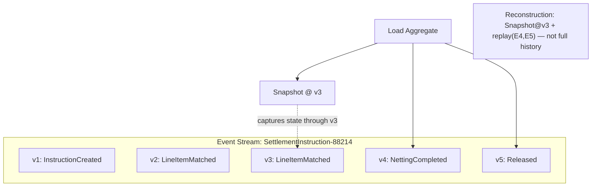
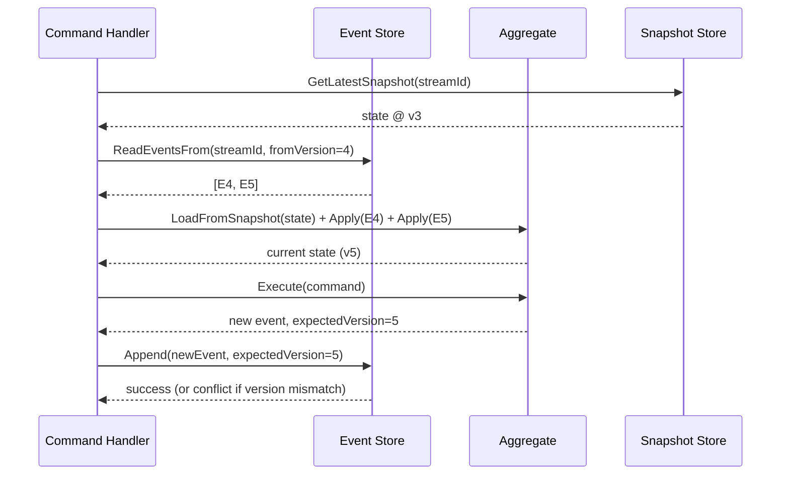
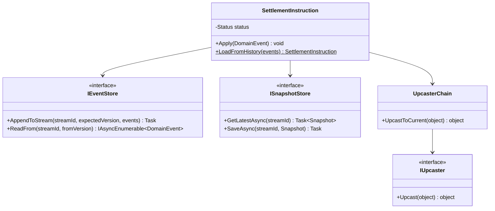
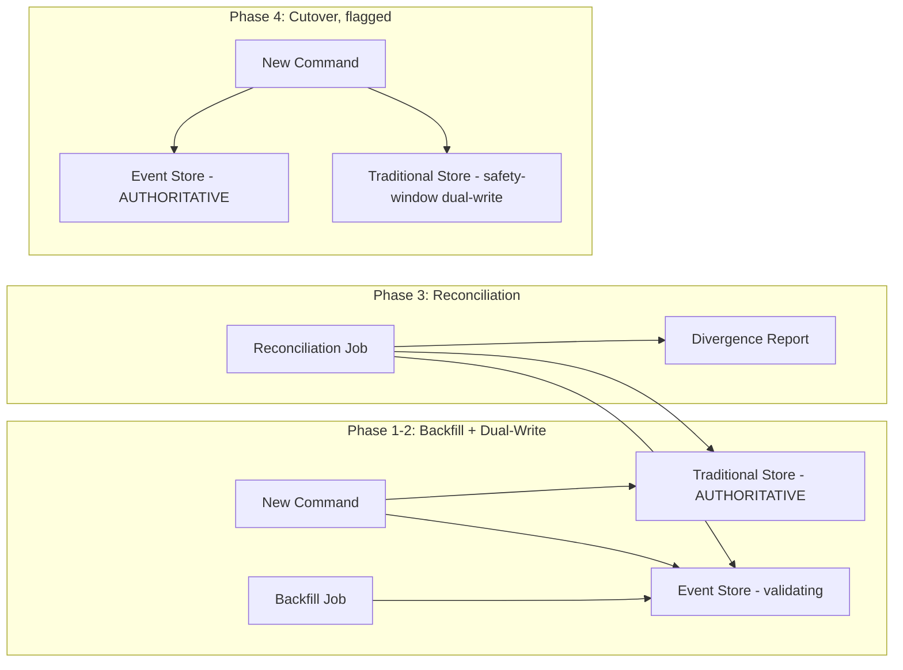
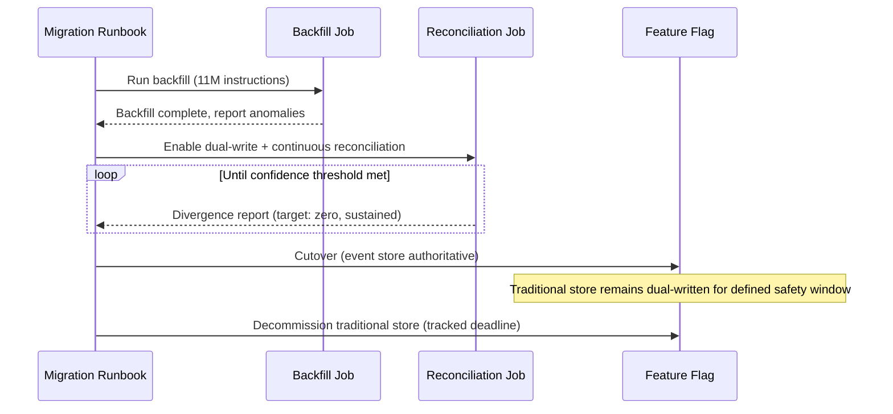
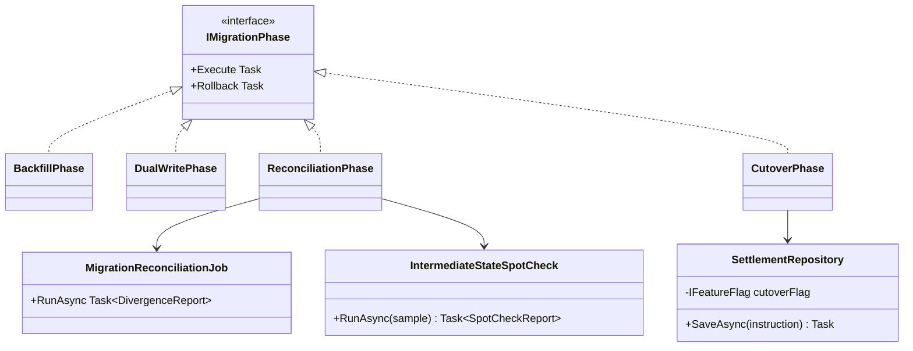

# Event Sourcing — Complete Interview Prep (All Topics, One File)

> Domain: Event Sourcing | Level: Beginner → Expert | Prerequisite: [[../34-CQRS/01-CQRS-Interview-Prep]] (projections), [[../31-Domain-Driven-Design/01-DDD-Interview-Prep]] (aggregates, domain events), [[../16-Distributed-Systems/01-Distributed-Systems-Interview-Prep]] (idempotency, consistency)
> **Quick-prep edition** (consolidated 2026-10-03). This one file replaces Modules 121–122. Originals: `git show ebb2d5c:35-Event-Sourcing/<file>.md`
> Each topic has: **Key concepts → C# code → Most common interview questions with answers.**

| # | Topic | # | Topic |
|---|---|---|---|
| 1 | What event sourcing is (and isn't) | 7 | Projections & read models |
| 2 | The event store & streams | 8 | Event versioning & upcasting |
| 3 | Aggregate reconstruction (`Apply`/`LoadFromHistory`) | 9 | Integration events, outbox & GDPR |
| 4 | Optimistic concurrency via expected version | 10 | Migrating an existing aggregate to event sourcing |
| 5 | Snapshotting | 11 | When to (not) event-source |
| 6 | Event store options in .NET (Marten, EventStoreDB, SQL) | 12 | Top 20 rapid-fire + Principal · 13 Mistakes checklist |

---

## 1. What Event Sourcing Is (and Isn't)

**Key concepts**
- Instead of storing current state, store the **sequence of events** that led to it; current state = **fold** over events. The event log is the **source of truth**; read models are derived.
- **Benefits:** complete audit trail (who/what/when/why), temporal queries ("balance as of last Tuesday"), debugging by replay, new projections from history, natural fit with event-driven integration, append-only writes.
- **Costs:** complexity (versioning events forever, projections, eventual consistency), learning curve, querying current state requires projections, GDPR erasure, long-lived event schemas.
- **Not** the same as event-driven architecture or CQRS (often combined: ES write side + CQRS projections).
- Events are **domain facts in past tense** (`FundsDeposited`, `AccountFrozen`), not CRUD (`AccountUpdated`).

**Common interview question**

**Q. Event sourcing vs storing state plus an audit log?**
With state + audit table, the state is truth and the audit log can drift or be incomplete; with event sourcing, the events *are* the truth, so history is guaranteed complete and state can always be rebuilt (and new views derived from history). The price is complexity in versioning, projections and queries.

---

## 2. The Event Store & Streams

**Key concepts**
- **Append-only log** organized as **streams** — typically one stream per aggregate instance (`account-42`).
- Each event: stream ID, **version (sequence in stream)**, global position, type, payload, metadata (timestamp, causation/correlation IDs, user, schema version).
- Operations: **append** (with expected version), **read stream** (forward from version), **subscribe** (all/category streams for projections).
- Events are **immutable** — corrections are new events (`DepositReversed`), never edits/deletes.
- Implemented on: EventStoreDB/KurrentDB, **Marten** (PostgreSQL), SQL tables, Cosmos DB, DynamoDB (with conditional writes). Kafka is a log but not ideal as a per-aggregate event store (no per-key read/expected-version checks).

```sql
-- Minimal SQL event store
CREATE TABLE Events (
    GlobalPosition BIGINT IDENTITY PRIMARY KEY,
    StreamId       VARCHAR(100) NOT NULL,
    Version        INT NOT NULL,
    EventType      VARCHAR(200) NOT NULL,
    Data           NVARCHAR(MAX) NOT NULL,
    Metadata       NVARCHAR(MAX) NOT NULL,
    CreatedAt      DATETIME2 NOT NULL DEFAULT SYSUTCDATETIME(),
    CONSTRAINT UQ_Stream_Version UNIQUE (StreamId, Version)    -- optimistic concurrency
);
```

---

## 3. Aggregate Reconstruction

**Key concepts**
- Load: read all events of the stream, create an empty aggregate, **apply** each event in order (`LoadFromHistory`). Apply methods only mutate state — **no validation, no side effects** (history is fact).
- Command handling: validate against current state → **emit new events** → apply them to self → append to the store.
- Separation: `Decide(command, state) → events` and `Evolve(state, event) → state` (functional style).

```csharp
public sealed class Account
{
    public Guid Id { get; private set; }
    public decimal Balance { get; private set; }
    public bool Frozen { get; private set; }
    public int Version { get; private set; } = -1;
    private readonly List<object> _pending = [];
    public IReadOnlyList<object> PendingEvents => _pending;

    public static Account LoadFromHistory(IEnumerable<object> history)
    {
        var a = new Account();
        foreach (var e in history) { a.Apply(e); a.Version++; }
        return a;
    }

    // Command → validate → raise events
    public void Withdraw(decimal amount, string reference)
    {
        if (Frozen) throw new DomainException("Account frozen");
        if (amount <= 0) throw new DomainException("Amount must be positive");
        if (amount > Balance) throw new DomainException("Insufficient funds");
        Raise(new FundsWithdrawn(Id, amount, reference, DateTimeOffset.UtcNow));
    }
    public void Deposit(decimal amount, string reference) => Raise(new FundsDeposited(Id, amount, reference, DateTimeOffset.UtcNow));

    private void Raise(object e) { Apply(e); _pending.Add(e); }

    // State transitions only — no rules, no I/O
    private void Apply(object e)
    {
        switch (e)
        {
            case AccountOpened o: Id = o.AccountId; break;
            case FundsDeposited d: Balance += d.Amount; break;
            case FundsWithdrawn w: Balance -= w.Amount; break;
            case AccountFrozen: Frozen = true; break;
        }
    }
}
public sealed record AccountOpened(Guid AccountId, string Currency);
public sealed record FundsDeposited(Guid AccountId, decimal Amount, string Reference, DateTimeOffset At);
public sealed record FundsWithdrawn(Guid AccountId, decimal Amount, string Reference, DateTimeOffset At);
public sealed record AccountFrozen(Guid AccountId, string Reason);
```

**Common interview question**

**Q. Why must `Apply` methods not validate?**
Events are facts that already happened and were validated when produced; rules may change over time, and replaying history must always succeed. Validation belongs in command methods before raising events.

---

## 4. Optimistic Concurrency via Expected Version

**Key concepts**
- Append with **expected version** = the version you loaded; if another writer appended meanwhile, the store rejects (`WrongExpectedVersion`/unique violation) → reload and retry the command (or report a conflict).
- Guarantees aggregate invariants without locks; small streams reduce contention.
- Idempotency for command retries: include a command ID in event metadata and check for duplicates, or design deterministic event IDs.

```csharp
public async Task HandleAsync(Withdraw cmd, CancellationToken ct)
{
    for (var attempt = 0; attempt < 3; attempt++)
    {
        var (events, version) = await _store.ReadStreamAsync($"account-{cmd.AccountId}", ct);
        var account = Account.LoadFromHistory(events);
        account.Withdraw(cmd.Amount, cmd.Reference);
        try
        {
            await _store.AppendAsync($"account-{cmd.AccountId}", expectedVersion: version, account.PendingEvents,
                                     metadata: new { cmd.CommandId, cmd.UserId }, ct);
            return;
        }
        catch (WrongExpectedVersionException) { /* concurrent write → reload and retry */ }
    }
    throw new ConcurrencyException("Too many concurrent modifications");
}
```

---

## 5. Snapshotting

**Key concepts**
- Long streams make loading slow (replaying 100k events) → periodically store a **snapshot** (serialized state + version); load = latest snapshot + events after it.
- Snapshot every N events or on a schedule; snapshots are an **optimization**, can be deleted and rebuilt; version the snapshot schema (on mismatch, rebuild from events).
- Better first fix: **shorter streams** by modelling (e.g., close accounting periods, "books closed" event and new stream per period).

**Common interview question**

**Q. When do you need snapshots?**
When stream length makes aggregate loading too slow for the latency budget (measure — many aggregates have tens of events and never need them). Prefer modelling shorter-lived streams (per period/lifecycle) before adding snapshots.

---

## 6. Event Store Options in .NET

| Option | Notes |
|---|---|
| **Marten** (on PostgreSQL) | document DB + event store, projections (inline/async/live), multi-tenancy, strong .NET integration; part of the "Critter Stack" with Wolverine |
| **EventStoreDB / KurrentDB** | purpose-built, streams, persistent subscriptions, projections, gRPC client |
| **SQL Server/PostgreSQL tables** | simple, familiar, you build subscriptions/projections |
| **Cosmos DB / DynamoDB** | partition by stream ID, conditional writes, change feed/streams for projections |
| **Kafka** | great for distributing events; weak as a per-aggregate store (no expected-version append, per-key reads) |

```csharp
// Marten: append with optimistic concurrency and an inline projection
builder.Services.AddMarten(o =>
{
    o.Connection(builder.Configuration.GetConnectionString("Events")!);
    o.Projections.Add<AccountBalanceProjection>(ProjectionLifecycle.Inline);   // updated in the same transaction
}).UseLightweightSessions();

await using var session = store.LightweightSession();
session.Events.Append(accountId, expectedVersion: currentVersion, new FundsDeposited(accountId, 100m, "dep-1", DateTimeOffset.UtcNow));
await session.SaveChangesAsync(ct);

public sealed class AccountBalanceProjection : SingleStreamProjection<AccountBalanceView>
{
    public void Apply(FundsDeposited e, AccountBalanceView v) => v.Balance += e.Amount;
    public void Apply(FundsWithdrawn e, AccountBalanceView v) => v.Balance -= e.Amount;
}
```

---

## 7. Projections & Read Models

- **Inline** (same transaction as the append — strongly consistent, slower writes), **async** (background daemon — eventual, scalable), **live** (computed on demand from events).
- Projections are idempotent, checkpointed, rebuildable (see [[../34-CQRS/01-CQRS-Interview-Prep]] §5–7).
- **Temporal queries:** replay a stream up to a timestamp/version for "state as of".
- Performance: append-heavy writes are cheap; replay-heavy reads are expensive → rely on projections and snapshots.

---

## 8. Event Versioning & Upcasting

**Key concepts**
- Events live forever → schemas evolve: **add optional fields** (defaults for old events), **new event types** for new meanings, **upcasters** that transform old event versions into the current shape at read time, **weak schema** (tolerant deserialization), or — rarely — **copy-and-transform** migration of the store into a new stream/store.
- **Never change the meaning** of an existing event type; never edit stored events in place.
- Keep event payloads business-focused and minimal; avoid serializing internal object graphs.

```csharp
// Upcaster: FundsDeposited v1 (no currency) → v2 (with currency)
public sealed class FundsDepositedV1ToV2 : IEventUpcaster
{
    public bool CanUpcast(string type, int version) => type == "FundsDeposited" && version == 1;
    public JsonObject Upcast(JsonObject v1)
    {
        v1["currency"] ??= "EUR";        // historical default documented in the ADR
        v1["schemaVersion"] = 2;
        return v1;
    }
}
```

**Common interview question**

**Q. How do you change an event's schema when millions of old events exist?**
Prefer additive changes with defaults; for structural changes, add a new event version and an upcaster that converts old versions on read; for semantic changes, introduce a new event type. Only migrate (copy-transform into a new store) when upcasting becomes unmanageable — and keep the original for audit.

---

## 9. Integration Events, Outbox & GDPR

**Key concepts**
- Internal domain events in the store ≠ public integration events: translate and publish selected events to other services (the event store's subscription acts like an outbox — publication must be at-least-once with idempotent consumers).
- **GDPR / right to erasure vs immutable history:** don't put personal data in events (store references), or **crypto-shredding** (encrypt personal fields with a per-subject key; delete the key to erase), or store PII in a separate erasable store.
- Retention policies for regulatory data (e.g., 7–10 years) vs erasure obligations — classify data up front.

**Common interview question**

**Q. How do you reconcile an immutable event store with GDPR erasure?**
Keep personal data out of events where possible (IDs referencing an erasable profile store), or encrypt personal data per subject and delete the key on erasure (crypto-shredding), keeping the non-personal facts for audit; document the approach with legal/compliance.

---

## 10. Migrating an Existing Aggregate to Event Sourcing (Capstone)

**Scenario:** a regulated account/position aggregate stored as state in SQL must move to event sourcing for audit and temporal queries.

1. **Backfill:** derive historical events from existing data (audit tables, transaction history) — or create an **opening-balance event** (`AccountMigrated` with state at cutover) when history can't be reconstructed faithfully. Label backfilled events as derived (metadata) — they're a new risk category (they assert history that was never captured as events).
2. **Dual-write period:** the old state model remains the source of truth; the new event-sourced path writes in parallel (or CDC from the old system generates events).
3. **Reconciliation:** continuously compare state rebuilt from events with the old state per aggregate; investigate and fix every difference before cutover.
4. **Cutover:** feature-flagged per account cohort; reverse sync (events → old tables) for rollback during a safety window.
5. **Decommission** the old write path and tables on a firm date (old systems never die by themselves) — keep them read-only for audit as required.

**Common interview question**

**Q. How do you migrate a live, regulated aggregate to event sourcing safely?**
Backfill (or opening-balance events), dual run with the legacy model authoritative, automated reconciliation until differences are zero, cohort-based flagged cutover with reverse sync for rollback, and a planned decommission — documenting derived history for auditors.

---

## 11. When to (Not) Event-Source

**Good fits:** ledgers and accounting, trading/order lifecycles, insurance policies and claims, workflows with audit needs, domains where "how did we get here?" matters, collaborative domains with conflict analysis.

**Poor fits:** simple CRUD, data with frequent schema churn and no history value, heavy ad hoc relational querying of current state, teams without the experience to handle projections and versioning.

**Common interview question**

**Q. Should we event-source this?**
Only the aggregates where history is genuinely valuable (audit, temporal queries, replay) and the domain is behaviour-rich — not the whole system. Consider state + outbox events + temporal tables first; event sourcing is a significant long-term commitment (versioning, projections, tooling).

---

## 12. Top 20 Rapid-Fire Questions + Principal Questions

1. **Event sourcing?** Store events, derive state.
2. **Source of truth?** The event log.
3. **Stream?** Events of one aggregate instance.
4. **Event naming?** Past-tense domain facts.
5. **Corrections?** New compensating events.
6. **Reconstruction?** Fold events via Apply.
7. **Apply rules?** No validation, no side effects.
8. **Concurrency?** Expected version on append.
9. **Snapshots?** Optimization for long streams.
10. **Shorter streams?** Model periods/lifecycles.
11. **.NET options?** Marten, EventStoreDB, SQL, Cosmos.
12. **Kafka as event store?** Distribution yes, per-aggregate store poorly.
13. **Projections?** Inline, async, live.
14. **Temporal query?** Replay up to a point.
15. **Schema change?** Additive, versions, upcasters.
16. **Edit events?** Never.
17. **GDPR?** References or crypto-shredding.
18. **ES = CQRS?** No, complementary.
19. **Migration?** Backfill, dual run, reconcile, cutover.
20. **Overkill?** CRUD.

**Principal-level question**

**P. A team wants to event-source their whole platform. Your response?**
Ask which aggregates gain from history (audit, temporal queries) and which are CRUD; propose event sourcing only for the former, with state + outbox for the rest. Make them plan for versioning, projection rebuilds, GDPR, tooling and skills; start with one bounded context, measure, then decide.

---

## 13. Mistakes Checklist (say why each is wrong)
- [ ] Event-sourcing everything · CRUD-style events (`EntityUpdated`)
- [ ] Validation or side effects inside Apply methods
- [ ] Editing or deleting stored events · changing an event's meaning
- [ ] No expected-version check (lost updates) · huge streams without modelling or snapshots
- [ ] Personal data in immutable events without a GDPR strategy
- [ ] Publishing internal events as public contracts · non-idempotent projections
- [ ] Using Kafka as the per-aggregate store without concurrency control

---

## Architecture Diagrams (preserved from the original modules)

> All 6 Mermaid/ASCII diagrams from the original `35-Event-Sourcing/` files, kept verbatim and grouped by source module. Originals: `git show ebb2d5c:35-Event-Sourcing/<file>.md`.

### Module 121 — Event Sourcing: Event Store as Source of Truth, Snapshotting & Aggregate Reconstruction
*Source: `01-EventSourcingFundamentals-EventStoreAsSourceOfTruth-Snapshotting-AggregateReconstruction.md`*

**3. Visual Architecture**



**3. Visual Architecture**



**13. Low-Level Design**



### Module 122 — Event Sourcing: Capstone — Migrating a Regulated Financial Aggregate to Event Sourcing at Scale
*Source: `02-Capstone-MigratingARegulatedAggregateToEventSourcingAtScale.md`*

**3. Visual Architecture**



**3. Visual Architecture**



**13. Low-Level Design**


