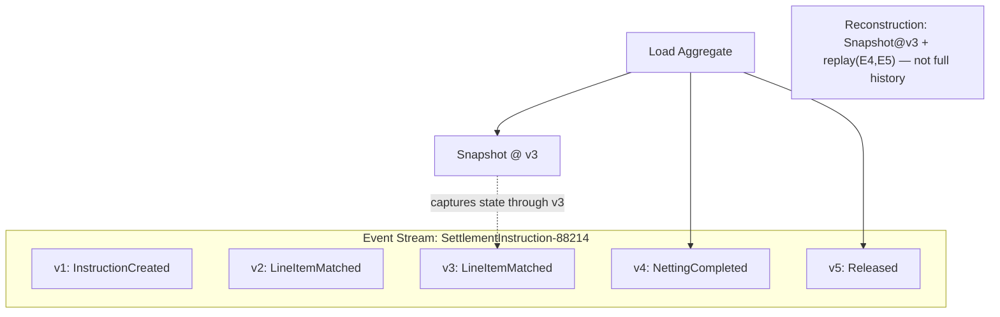
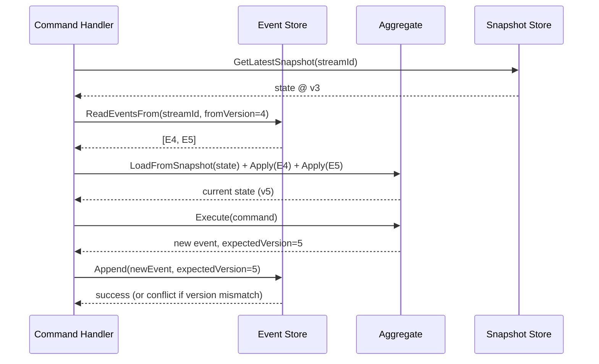
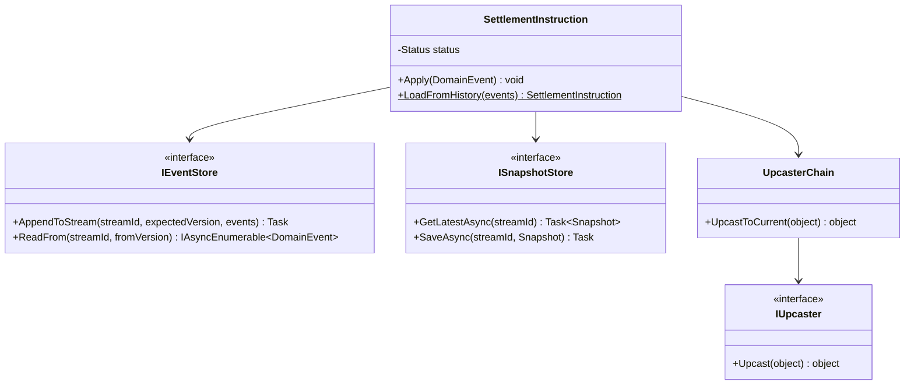

# Module 121 — Event Sourcing: Event Store as Source of Truth, Snapshotting & Aggregate Reconstruction

> Domain: Event Sourcing | Level: Beginner → Expert | Prerequisite: [[../34-CQRS/02-Capstone-EventDrivenReadModelProjectionsAtScale]] (took as given the event-log-as-replayable-source-of-truth idea for read-model projection; this module applies the identical idea to the *write* side — Aggregate state itself, not just derived read models), [[../31-Domain-Driven-Design/02-TacticalDDD-Entities-ValueObjects-Aggregates]] (the Aggregate whose current state is now reconstructed from events rather than persisted directly), [[../31-Domain-Driven-Design/03-DomainEvents-DomainServices-Repositories]] (Domain Events, now becoming the sole persistence mechanism, not merely a side-effect notification)
>
> **Domain scope note:** `35-Event-Sourcing` is scoped to 2 modules (121–122, standard depth, autonomously scoped per the 2026-07-18 "no more waiting" workflow decision, given substantial groundwork from Module 120's explicit handoff): this Fundamentals module and a capstone applying full Event Sourcing to a regulated financial Aggregate's write side for audit-trail purposes. Full 16-section template; Elite FinTech Interview Panel lens.

---

## 1. Fundamentals

**What:** Event Sourcing persists an Aggregate's state not as a single, current-state row, but as the **complete, ordered sequence of Domain Events** that produced that state — the Aggregate's current state is *derived*, on load, by replaying (folding) every one of its historical events in order, never stored as a directly-updatable row.

**Why:** Module 120 §Intermediate Q10 already identified this as the natural extension of read-model projection's own event-log-as-source-of-truth idea to the write side — the payoff is a complete, immutable, tamper-evident history of every state change an Aggregate ever underwent, not merely its current snapshot, which is precisely the audit-trail guarantee a regulated financial system (Module 116's compliance fitness function, Module 118's certification evidence) most wants.

**When:** Justified specifically when an Aggregate's full history of *how* it reached its current state — not merely *what* that state currently is — has genuine, ongoing business or regulatory value (audit reconstruction, "what did we know and when," temporal queries) — not as a default persistence mechanism for every Aggregate regardless of this specific need (§15's Architecture Decision develops this calibration fully).

**How (30,000-ft view):**
```
Traditional persistence:  Order table row: { Id, Status, Total, ... } ← overwritten on each change
Event Sourcing:           Event stream "Order-4471":
                            1. OrderCreated    { ... }
                            2. LineItemAdded   { ... }
                            3. OrderSubmitted  { ... }
                          Current state = fold(events) — replay each event's Apply() in order
```

---

## 2. Deep Dive

### 2.1 The Event Store — an Append-Only Log, Per-Aggregate Stream
An Event Store persists events into per-Aggregate **streams** (all of `Order-4471`'s events, in order, in one stream) — writes are exclusively *appends*, never updates or deletes, a structural guarantee (not merely a convention) that the historical record can never be silently altered, directly the tamper-evidence property this domain's regulated-context value proposition depends on.

### 2.2 Reconstruction Mechanics — `LoadFromHistory`
Loading an Aggregate means fetching its entire event stream and replaying each event through the Aggregate's own `Apply(event)` method in strict sequence — `Order.LoadFromHistory(events)` constructs a fresh, empty `Order` instance and folds every event into it, arriving at exactly the same current state a traditionally-persisted row would have held, but derived rather than directly read.

### 2.3 Snapshotting for Bounded Reconstruction Time
Directly reusing Module 120 §2.4's technique, now for the write side specifically: an Aggregate with a very long event history (a years-old, frequently-modified Order or SettlementInstruction) becomes expensive to reconstruct by replaying its entire history on every load — a periodic snapshot (the Aggregate's fully-folded state at a specific event-sequence number) lets reconstruction resume from the nearest snapshot forward, replaying only events since that point.

### 2.4 Event Versioning and "Upcasting" for the Write Side
An event's own schema evolves over an Aggregate's multi-year lifetime exactly as Module 120 §2.5 described for read-model projection — but here, the *Aggregate's own current logic* must correctly interpret an event recorded years ago under an old schema version; an **upcaster** (a small, versioned transformation function converting an old event-version's shape into the current version's shape before `Apply()` receives it) is the standard mechanism, applied at load time, keeping the Aggregate's own `Apply()` methods written only against the current event shape.

### 2.5 Performance Implications — Append-Heavy Writes, Replay-Heavy Reads
Writes are cheap and highly parallelizable (pure appends, no locking against existing rows the way an in-place update requires); the cost shifts entirely to *reads* (reconstruction), which is precisely why snapshotting (§2.3) is not an optional optimization but a load-bearing part of the architecture for any Aggregate with meaningful event volume.

### 2.6 Optimistic Concurrency via Expected Stream Version
Rather than Module 110's `RowVersion` column, Event Sourcing's concurrency control is the **expected version** of the stream at append time — a command execution loads the stream at version N, and its resulting append is only accepted if the stream is still at version N (no other, concurrent append has occurred) — conceptually identical to optimistic concurrency (Module 110), mechanically implemented against the append-only log rather than a mutable row.

---

## 3. Visual Architecture





---

## 4. Production Example

**Problem:** Module 116's Settlement Engine's compliance fitness function proved every business rule was *tested*, but auditors increasingly asked a different question: "show me the exact sequence of state changes this specific settlement went through, in order, as they actually happened" — a question the traditional current-state-only persistence model couldn't answer without separately-maintained, easily-incomplete audit-log tables.

**Architecture:** Migrated `SettlementInstruction` to full Event Sourcing — its event stream became the sole persisted record, with the previously-existing SQL table repurposed as a Level 3 CQRS read model (Module 120) projected from the same stream, satisfying both the operational query need and the new audit-reconstruction need from one authoritative source.

**Implementation:** An upcaster was written for `LineItemMatched`'s v1-to-v2 schema change (a field renamed for clarity) — but a second, later schema change (splitting one field into two) was implemented directly in the Aggregate's `Apply()` method with an inline conditional, rather than as a proper, separately-versioned upcaster.

**Trade-offs:** Full audit reconstruction and tamper-evidence were gained; reconstruction cost for old, high-event-count instructions increased, necessitating the snapshot cadence discipline (§2.3) as a non-optional, not merely nice-to-have, part of the design.

**Lessons learned:** A subsequent, third schema change to `LineItemMatched` broke the inline-conditional `Apply()` logic for instructions still carrying the *original* v1-shaped events — the conditional had only ever been written and tested against v1-and-v2 shapes, and the new change's author, unaware any instructions still had v1 events at all (having only ever tested against recent, v2-and-later data), introduced a silent misinterpretation for the oldest instructions specifically. The fix: replace all inline version-handling with proper, explicitly-versioned upcaster functions, each independently unit-tested against a real, historical event sample of its specific version, and a standing rule that `Apply()` methods only ever receive current-version-shaped events, with zero inline version-branching logic inside them.

---

## 5. Best Practices
- Keep `Apply()` methods pure, deterministic, and free of any version-branching logic — resolve all version differences via upcasters *before* an event reaches `Apply()` (§2.4, §4).
- Snapshot on a cadence calibrated to each Aggregate's own event-volume growth, not a single, shared default (directly reapplying Module 120 Advanced Q3's per-consumer calibration principle to per-Aggregate-type calibration here).
- Test every upcaster independently against real, representative historical event samples of its specific source version — not only against recently-created data (§4's exact incident).
- Treat the event store's append-only guarantee as a structural, enforced property (database-level permissions preventing update/delete), not merely an application-level convention.
- Reuse the identical Aggregate/invariant-enforcement logic (Module 110) unchanged — Event Sourcing changes *persistence*, not the Aggregate's own business-rule design.

## 6. Anti-patterns
- Inline, ad hoc version-branching logic inside `Apply()` methods instead of dedicated, testable upcasters (§4's incident).
- Snapshotting so infrequently that reconstruction time becomes a genuine operational problem before anyone notices (directly Module 120 §2.4's original caution, recurring on the write side).
- Treating Event Sourcing as a universal default for every Aggregate regardless of whether its specific audit/history value justifies the added reconstruction and versioning complexity (§15).
- Allowing any code path direct update/delete access to the event store, undermining the append-only tamper-evidence guarantee the entire architecture depends on.
- Testing upcasters only against synthetic, recently-generated event data rather than real historical samples of the actual version being upcast.

---

## 7. Performance Engineering

**CPU:** Reconstruction cost is dominated by the number of events replayed since the last snapshot — CPU-bound if `Apply()` logic is non-trivial, otherwise dominated by I/O (§7 Latency).

**Memory:** A fully-reconstructed Aggregate's in-memory footprint is unaffected by Event Sourcing (it's still just the final, folded state) — but the *reconstruction process itself* transiently allocates the events-since-snapshot batch in memory, worth benchmarking for unusually high-event-volume Aggregates.

**Latency:** Load latency = snapshot-fetch time + (events-since-snapshot × per-event-apply cost) — track this explicitly per Aggregate type, since it directly determines whether snapshot cadence (§2.3) needs tightening.

**Throughput:** Append-only writes are highly parallelizable across different streams (no cross-stream locking); a single stream's own append throughput is naturally serialized by its own expected-version concurrency check (§2.6), which is correct and rarely a genuine bottleneck given typical per-Aggregate write volume.

**Scalability:** Horizontal scaling is straightforward for reads (independent streams, independent snapshot/replay) and for command processing across different Aggregate instances; a single, extremely "hot" individual Aggregate stream (very high per-instance write rate) is the one genuine scaling constraint worth monitoring specifically.

**Benchmarking:** Benchmark reconstruction time under realistic, worst-case event-volume-since-snapshot scenarios (Module 118 §7's "test the actual constrained condition" discipline), not an idealized, freshly-snapshotted best case.

**Caching:** A recently-reconstructed Aggregate can be cached in-process for a short window to avoid repeated reconstruction across nearby commands against the same Aggregate — invalidated on any successful append to that stream.

---

## 8. Security

**Threats:** Unauthorized modification of historical events (directly undermining the tamper-evidence guarantee this architecture exists to provide); unauthorized read access to a complete historical record that may contain more sensitive detail, across more time, than a current-state-only view would ever expose.

**Mitigations:** Database/storage-level permissions structurally enforcing append-only access (no application code, however trusted, should have update/delete grants on the event store); cryptographic event-stream integrity verification (a hash chain linking each event to the previous one within a stream) for the highest-stakes regulated Aggregates, providing a mechanically-verifiable tamper-evidence guarantee beyond mere access-control policy.

**OWASP mapping:** Excessive Data Exposure risk is genuinely elevated here — a full historical event stream may reveal sensitive intermediate states (a rejected, since-corrected value) a current-state view would never expose at all; access-control and query-scoping must account for this larger exposed surface.

**AuthN/AuthZ:** Reading a full event stream (for audit/reconstruction purposes) should itself be an explicitly, separately authorized operation, distinct from and typically more restricted than ordinary current-state read access.

**Secrets:** Any sensitive field within an event payload (e.g., a counterparty account detail) requires field-level encryption applied consistently across the event's entire retained lifetime — since events are immutable and long-retained, a later-discovered need to redact or re-encrypt a field is materially harder than in a mutable, current-state-only system.

**Encryption:** Event payloads containing regulated data require encryption at rest with the identical multi-year-retention-aware key-rotation discipline Module 120 §8 already established for Compliance's read model — now applied to the write side's own authoritative event log.

---

## 9. Scalability

**Horizontal scaling:** Independent, per-stream reconstruction scales naturally across many concurrent Aggregate instances; no cross-Aggregate coordination is required for ordinary load/command processing.

**Vertical scaling:** Relevant primarily for the event store's own storage-engine throughput at very high aggregate write volume across the whole system.

**Caching:** Snapshot stores function as a caching layer in their own right (§7); an additional, short-TTL in-process Aggregate cache further reduces repeated reconstruction cost for hot Aggregates.

**Replication/Partitioning:** Event streams partition naturally by Aggregate ID (directly Module 118/119's established partition-keying pattern, reapplied here); the event store itself typically requires strong replication given its role as the sole source of truth.

**Load balancing:** Command processing for different Aggregate instances load-balances trivially across processing nodes, provided per-stream append ordering (§2.6) is respected.

**High Availability:** The event store's own availability is the system's single most critical dependency — unlike a traditional system where a read-replica might serve degraded reads during a primary outage, an Event-Sourced system's write path (and any reconstruction) depends entirely on the event store being available.

**Disaster Recovery:** The event store *is* the backup, in a meaningful sense — a full system rebuild is, in principle, a complete replay of every stream from the beginning, though snapshotting (§2.3) makes this practically fast rather than merely theoretically possible.

**CAP theorem:** The event store strongly favors consistency for the append/expected-version-check path (Module 110's optimistic concurrency, structurally identical reasoning) — an availability trade-off here (allowing an append to succeed without verifying expected version) would silently violate the very ordering guarantee the entire architecture depends on.

---

## 10. Interview Questions

### Basic (10)

1. **Q: What does Event Sourcing store, as the authoritative record of an Aggregate's state?**
   **A:** The complete, ordered sequence of Domain Events that produced its current state — not a single, current-state row.
   **Why correct:** States the defining property precisely.
   **Common mistakes:** Assuming Event Sourcing simply means "also publish events," missing that the events themselves *are* the persisted state, not merely a side-effect notification.
   **Follow-ups:** "How is current state obtained, then?" (By replaying/folding the event stream, §2.2.)

2. **Q: What is an Event Store's defining write behavior?**
   **A:** Append-only — events are never updated or deleted once written.
   **Why correct:** States the specific, structural guarantee underlying this architecture's tamper-evidence property.
   **Common mistakes:** Assuming an Event Store behaves like an ordinary table supporting in-place updates.
   **Follow-ups:** "What business value does this append-only guarantee directly enable?" (A tamper-evident audit trail, §1/§8.)

3. **Q: What is a snapshot, in this module's context?**
   **A:** A captured, point-in-time fully-folded Aggregate state, tagged with the event-sequence number it reflects, allowing reconstruction to resume from that point rather than the full event history.
   **Why correct:** States the specific mechanism and purpose (bounding reconstruction time).
   **Common mistakes:** Assuming reconstruction must always replay every event from the very first one.
   **Follow-ups:** "When does snapshotting become operationally necessary?" (Once event-volume-since-genesis makes full replay too slow, §2.3.)

4. **Q: What is an upcaster?**
   **A:** A versioned transformation function converting an old event-schema-version's shape into the current version's shape, applied before the Aggregate's `Apply()` method receives it.
   **Why correct:** States the specific mechanism and where it fits in the load pipeline.
   **Common mistakes:** Handling schema-version differences via inline conditionals inside `Apply()` itself instead of a dedicated upcaster (§4's incident).
   **Follow-ups:** "Why must `Apply()` never contain version-branching logic itself?" (Keeps business logic pure and testable against exactly one, current event shape — §5.)

5. **Q: How does Event Sourcing's optimistic concurrency control differ mechanically from Module 110's `RowVersion` approach?**
   **A:** It uses an expected stream version at append time rather than a row's version column — conceptually identical (detect a concurrent conflicting change), mechanically different (append-only log vs. mutable row).
   **Why correct:** Correctly identifies both the conceptual equivalence and the mechanical difference.
   **Common mistakes:** Assuming Event Sourcing requires an entirely different concurrency-control philosophy rather than the same principle applied differently.
   **Follow-ups:** "What happens if the expected version doesn't match at append time?" (The append is rejected — a concurrency conflict, requiring the command to reload current state and retry, §2.6.)

6. **Q: Are writes or reads typically more expensive in an Event-Sourced system?**
   **A:** Reads (reconstruction) — writes are cheap, parallelizable appends; reads require replaying events since the last snapshot.
   **Why correct:** States the specific cost asymmetry this architecture introduces.
   **Common mistakes:** Assuming Event Sourcing is uniformly more expensive than traditional persistence in both directions.
   **Follow-ups:** "What mitigates read cost specifically?" (Snapshotting, §2.3/§7.)

7. **Q: Is Event Sourcing a good default persistence choice for every Aggregate in a system?**
   **A:** No — justified specifically where an Aggregate's full history has genuine, ongoing business/regulatory value, not as a universal default (§1, §15).
   **Why correct:** States the calibrated, non-default framing this domain insists on.
   **Common mistakes:** Adopting Event Sourcing system-wide "for consistency" regardless of whether each Aggregate's specific history actually matters.
   **Follow-ups:** "What Aggregate characteristic most strongly justifies it?" (A genuine, ongoing audit-reconstruction or temporal-query need, §15's Architecture Decision.)

8. **Q: How does Event Sourcing relate to the CQRS read-model projection covered in Module 120?**
   **A:** The identical underlying mechanism (an event log as the replayable source of truth) applied to the write side (Aggregate reconstruction) rather than only to derived read models.
   **Why correct:** Correctly connects the two rather than treating them as unrelated patterns.
   **Common mistakes:** Assuming CQRS requires Event Sourcing, or vice versa — the two are complementary but independently adoptable (Module 120 Intermediate Q10).
   **Follow-ups:** "Could a system use CQRS without Event Sourcing?" (Yes — Module 120's entire capstone did exactly this, projecting read models from Domain Events while the write side used traditional state persistence.)

9. **Q: Why is field-level encryption for sensitive event data harder to retrofit in an Event-Sourced system than in a traditional, mutable one?**
   **A:** Events are immutable and long-retained — a later-discovered need to re-encrypt or redact a field can't simply update the existing row in place, since no update is ever permitted against historical events.
   **Why correct:** States the specific structural reason this system category has a harder retrofit problem.
   **Common mistakes:** Assuming standard database re-encryption techniques apply unchanged to an append-only event log.
   **Follow-ups:** "What's a mitigating design choice made upfront to reduce this risk?" (Deciding field-level encryption/PII-handling policy explicitly before an event type is ever first published, not after.)

10. **Q: What does "the event store is the backup" mean concretely?**
    **A:** A full system rebuild is, in principle, achievable by replaying every stream from the beginning — the event store's own durability and replication is the system's most fundamental disaster-recovery asset.
    **Why correct:** States the specific DR property this architecture provides.
    **Common mistakes:** Assuming this makes separate backup/DR planning for the event store itself unnecessary — the event store's own durability/replication must still be rigorously engineered, since it's now the *sole* source of truth.
    **Follow-ups:** "Does this reduce read-model backup requirements?" (Yes, per Module 120 §9 — a read model is independently, fully rebuildable from the same event source.)

### Intermediate (10)

1. **Q: Walk through exactly what happens, mechanically, when `Order.LoadFromHistory(events)` is called.**
   **A:** A fresh, empty `Order` instance is constructed (typically via a parameterless or minimal constructor bypassing normal invariant-enforcing factory methods), then each event in the provided sequence is passed to the Aggregate's own `Apply(event)` method in strict order, mutating internal state exactly as it would have at the moment that event was originally raised — arriving, after the final event, at the Aggregate's current state.
   **Why correct:** Gives the precise mechanical sequence (empty instance, ordered Apply calls) rather than a vague "it reconstructs state."
   **Common mistakes:** Assuming reconstruction re-validates business invariants at each replayed step the way the original command execution did — replay trusts the historical record and simply re-applies it, since invariants were already enforced (or deliberately, historically weren't — a genuinely different concern) at the time each event was originally created.
   **Follow-ups:** "Why doesn't reconstruction need to re-run invariant checks?" (The events already represent facts that occurred; re-validating them during replay would be re-litigating already-settled history, not reconstructing it.)

2. **Q: Why must an Aggregate's `Apply()` methods be pure and side-effect-free?**
   **A:** They run identically whether invoked during normal command processing or during a full historical replay (reconstruction, migration, or reconciliation) — any side effect (a network call, a non-deterministic value) would behave differently or incorrectly when replayed later, corrupting reconstruction.
   **Why correct:** States the specific reason (dual-context execution — live and replayed) purity is required.
   **Common mistakes:** Allowing `Apply()` to call out to an external service or use `DateTime.Now` directly rather than a value already captured in the event itself.
   **Follow-ups:** "How should a timestamp needed by `Apply()` be obtained correctly?" (Captured in the event's own payload at the time it was originally raised, never read fresh from the system clock during `Apply()`.)

3. **Q: How does §4's incident concretely demonstrate the risk of inline version-branching inside `Apply()`?**
   **A:** A later schema change was implemented as a new inline conditional inside `Apply()`, written and tested only against recent (v2+) event shapes, and silently mishandled the oldest (v1) events it had never actually been tested against, since the developer was unaware any v1 events still existed in production streams.
   **Why correct:** Names the specific testing gap (untested against genuinely old data) and its consequence.
   **Common mistakes:** Assuming the bug was a one-off coding mistake rather than a structural risk inline version-handling specifically invites.
   **Follow-ups:** "How does a dedicated upcaster structurally prevent this specific class of bug?" (It's independently, explicitly testable against real historical samples of its specific source version, per §5, rather than an untested branch buried inside otherwise-current logic.)

4. **Q: Why does an Event-Sourced Aggregate's write throughput rarely become a genuine bottleneck, despite each stream's appends being serialized by expected-version checking?**
   **A:** Serialization is per-stream (per individual Aggregate instance), not global — different Aggregates' streams append entirely independently and in parallel; a single Aggregate instance's own realistic command rate rarely approaches a genuine serialization bottleneck.
   **Why correct:** Correctly distinguishes per-stream serialization (necessary, correct) from any implied global serialization (which doesn't exist).
   **Common mistakes:** Assuming expected-version concurrency control implies some form of system-wide write contention.
   **Follow-ups:** "When would a single stream's serialization actually become a bottleneck?" (An unusually 'hot' individual Aggregate receiving an extremely high concurrent command rate against the same specific instance — a genuine, if rare, design smell worth investigating.)

5. **Q: Why does the event store's own availability matter more in an Event-Sourced system than in a traditional one with read replicas?**
   **A:** There's no equivalent of "serve a slightly-stale read from a replica during a primary outage" for reconstruction — the full, authoritative event history is the sole source from which current state can be derived at all, making the event store's own availability the system's single most critical dependency (§9).
   **Why correct:** States the specific structural reason (sole source of truth, no equivalent fallback) this dependency is elevated.
   **Common mistakes:** Assuming Event Sourcing's snapshot mechanism reduces this dependency — a snapshot only accelerates reconstruction, it doesn't eliminate the need for the event store itself to supply events since that snapshot.
   **Follow-ups:** "What HA strategy specifically addresses this elevated criticality?" (Strong, multi-region replication of the event store itself, engineered with the same rigor as any single-point-of-truth system, §9.)

6. **Q: Design the specific process for safely adding a new field to an existing event type without breaking reconstruction of Aggregates with historical events predating the field.**
   **A:** Treat the new field as optional/nullable in the event schema, with `Apply()` handling its absence gracefully (a sensible default, or explicitly recognizing "this field wasn't tracked before this point in history") — directly Module 120 §2.5's forward-compatible/additive-change discipline, applied to the write side, avoiding the need for an upcaster at all for genuinely additive fields.
   **Why correct:** Correctly distinguishes an additive change (no upcaster needed, handle absence gracefully) from a genuinely breaking one (§2.4's upcaster requirement).
   **Common mistakes:** Assuming every event-schema change requires a formal upcaster, rather than recognizing additive changes can often be handled more simply.
   **Follow-ups:** "What would make this specific change breaking instead of additive?" (If the new field were required for `Apply()` to produce correct state — e.g., if older events genuinely lack information current logic needs — a breaking change requiring either an upcaster supplying a derived/default value or accepting a documented, bounded historical-data limitation.)

7. **Q: Critique a design where snapshots are taken purely on a fixed calendar schedule (e.g., nightly for every Aggregate), regardless of each Aggregate's own actual event-volume growth rate.**
   **A:** Directly Module 120 Advanced Q3's already-established critique, reapplied here — a fixed, uniform schedule mismatches genuinely different Aggregates' growth rates: a low-activity Aggregate is snapshotted unnecessarily often (wasted storage/compute), while a high-activity one might still accumulate a reconstruction-time-impacting event count *between* nightly snapshots if its growth rate is fast enough.
   **Why correct:** Correctly reapplies an already-established per-consumer/per-entity calibration principle to snapshot cadence specifically.
   **Common mistakes:** Assuming a shared, simple schedule is adequate without checking it against each Aggregate type's actual, measured event-accumulation rate.
   **Follow-ups:** "What would a better-calibrated snapshot trigger look like?" (An event-count threshold per Aggregate instance — e.g., "snapshot after every N events since the last snapshot" — directly tied to reconstruction-time impact rather than an arbitrary calendar interval.)

8. **Q: Why does a cryptographic hash chain across a stream's events provide a stronger tamper-evidence guarantee than access-control policy alone?**
   **A:** Access control (permissions preventing update/delete) relies on every system component correctly enforcing that policy at all times; a hash chain (each event's hash incorporating the previous event's hash) makes any retroactive alteration of historical events *cryptographically detectable* even if some access-control gap were ever exploited or misconfigured — a defense-in-depth layer independent of access-control correctness.
   **Why correct:** Correctly distinguishes preventive control (access policy) from detective control (cryptographic verification), and states why the latter is a genuine, additional layer rather than redundant.
   **Common mistakes:** Assuming strict access-control permissions alone provide equivalent, sufficient tamper-evidence for the highest-stakes regulated use cases.
   **Follow-ups:** "For which Aggregates would this additional cryptographic layer most likely be worth its added complexity?" (The highest-stakes, most heavily-audited financial Aggregates specifically — directly this domain's own calibration principle, §15, applied to security-control depth rather than adoption breadth.)

9. **Q: How would you decide whether a specific business need is better served by full Event Sourcing or by Module 111's simpler "Aggregate raises Domain Events, but state is still persisted traditionally" approach?**
   **A:** Apply this module's own §1 test: does the *complete historical sequence* of state changes have genuine, ongoing value (audit reconstruction, temporal "what did we know when" queries) beyond the current state alone? If yes, full Event Sourcing; if the Domain Events' value is fully satisfied by triggering downstream reactions and current-state persistence remains sufficient for every actual business need, Module 111's simpler approach (which this system already used successfully for years, per §4) remains the right, lower-complexity default.
   **Why correct:** Gives the precise, reusable decision test distinguishing the two approaches' genuinely different value propositions.
   **Common mistakes:** Assuming any system already using Domain Events (Module 111) is "halfway to Event Sourcing" and should naturally progress to it — the two serve genuinely different needs, and using Domain Events well doesn't imply Event Sourcing is the next natural step.
   **Follow-ups:** "Could a system use Domain Events (Module 111) for cross-Aggregate reactions while using full Event Sourcing only for a specific Aggregate's own persistence?" (Yes — exactly this module's own recommended calibration, §15, applying the heavier technique only where its specific value is genuinely justified.)

10. **Q: Synthesize how this module's Aggregate-reconstruction technique and Module 120's read-model-projection technique can share the identical underlying event stream without conflict.**
    **A:** Both are independent consumers of the same append-only stream (Module 120 §2.1's independence principle, reapplied here) — the write side reconstructs current Aggregate state by replaying events through `Apply()`; Module 120's read-model projectors independently replay the same events through their own, entirely separate transformation logic into denormalized read stores — neither consumer affects or depends on the other's processing, exactly the same independence guarantee this course has now established twice, for two different kinds of "replay the event log" consumer.
    **Why correct:** Correctly identifies both mechanisms as structurally identical instances of "independent event-stream consumption," reapplying Module 120 §2.1's already-established independence principle rather than treating write-side reconstruction as a fundamentally different concern.
    **Common mistakes:** Assuming Aggregate reconstruction and read-model projection must be coordinated or sequenced relative to each other — they're independent, per-consumer concerns exactly like Module 120's three read-model projectors were independent of each other.
    **Follow-ups:** "Does the write side's own reconstruction need the Outbox pattern (Module 111 Advanced Q2) the way projection does?" (No — reconstruction reads directly from the authoritative event store synchronously, within the same command-processing flow; the Outbox pattern specifically addresses reliable *downstream* delivery to external consumers, a different concern from the write side reading its own authoritative history.)

### Advanced (10)

1. **Q: Diagnose §4's incident from first principles and design the complete, structural fix preventing any future schema change from introducing a similar untested-against-old-data gap.**
   **A:** Root cause: version-handling logic was implemented inline, tested only against recently-generated data, with no process ensuring it was validated against genuinely old, historical event samples. Fix: (1) mandate all version differences be resolved via dedicated, standalone upcaster functions (§5), never inline `Apply()` branching; (2) require every new upcaster's test suite to include real, extracted historical event samples of its specific source version — not synthetic, freshly-generated test fixtures; (3) a fitness function (Module 106, reapplied here) asserting `Apply()` methods contain no version-conditional logic at all, mechanically enforcing the architectural rule rather than relying on code review alone.
   **Why correct:** Identifies the actual systemic root cause (untested-against-real-old-data, inline logic) and a three-part structural fix, including a mechanically-enforced architectural rule, not merely a one-off patch to this specific bug.
   **Common mistakes:** Fixing only this specific `Apply()` method's bug without addressing the systemic pattern (inline version logic, synthetic-only test data) that will produce the next similar incident with a different event type.
   **Follow-ups:** "Why is testing against real historical samples specifically more valuable than comprehensive synthetic test coverage?" (Real historical data can contain genuinely unanticipated edge cases — a value combination or sequence no developer thought to synthesize — that only actually-occurred data reliably surfaces.)

2. **Q: A team proposes snapshotting every Aggregate after every single event, reasoning "this guarantees reconstruction never needs to replay more than one event." Evaluate this proposal.**
   **A:** This defeats append-only writes' cheap, parallelizable nature (§2.5) by adding a snapshot-write cost to every single command, and provides no meaningful benefit over a well-calibrated, less-frequent cadence (§Intermediate Q7) for the vast majority of Aggregates whose realistic event-volume-since-last-snapshot never approaches a reconstruction-time problem in the first place — this is an over-application of a genuinely useful technique (Module 113 Intermediate Q7's now-repeated calibration caution) applied without regard to the actual cost/benefit at this specific, extreme frequency.
   **Why correct:** Correctly identifies the specific cost (snapshot-write overhead on every command) this extreme proposal introduces and reapplies this course's established over-application caution.
   **Common mistakes:** Assuming "more frequent snapshotting is strictly safer" without weighing its genuine, non-trivial cost against a calibrated cadence's already-adequate protection.
   **Follow-ups:** "What would be a reasonable, calibrated alternative?" (An event-count threshold per Aggregate instance, §Intermediate Q7, snapshotting only once genuine reconstruction-time impact is measurably approaching, not after every single event.)

3. **Q: Critique a design where the event store's expected-version concurrency check is implemented at the application layer (a "check current version, then append" two-step) rather than atomically within the event store itself.**
   **A:** A non-atomic, two-step check-then-append is vulnerable to a race condition — two concurrent commands could both read the same current version, both pass their own check, and both then append, producing two events at the same expected version and silently corrupting stream ordering; the expected-version check must be an atomic, single operation the event store itself enforces (a conditional append rejecting any version mismatch atomically), not an application-level, separately-sequenced check.
   **Why correct:** Identifies the specific race condition a non-atomic implementation introduces and states the correct, atomic requirement.
   **Common mistakes:** Assuming a "check first, then write" pattern is safe without recognizing the race window between the two separate operations.
   **Follow-ups:** "How does a real Event Store technology (e.g., EventStoreDB) typically implement this atomically?" (A single `AppendToStream(streamId, expectedVersion, events)` API call that the store itself validates and applies as one atomic operation, never exposing the check and the append as separate client-visible steps.)

4. **Q: Design a load-testing methodology validating that snapshot cadence remains adequate as an Aggregate's real-world event-volume growth rate increases over time, extending Module 120 Advanced Q3's calibration principle into an ongoing, not one-time, verification.**
   **A:** Periodically (not just once, at initial design time) measure each Aggregate type's actual event-accumulation rate in production and recompute whether the current snapshot cadence still keeps worst-case reconstruction time within an acceptable bound — treating snapshot-cadence adequacy as a continuously-monitored property (this course's central "declared ≠ actual" theme, now applied to a performance-calibration decision specifically) rather than a one-time design choice assumed to remain correct indefinitely as real usage patterns evolve.
   **Why correct:** Correctly extends a prior calibration principle into an ongoing verification requirement, explicitly connecting to this course's recurring theme rather than treating the original calibration as a permanent, unrevisited decision.
   **Common mistakes:** Calibrating snapshot cadence once at initial design time and never revisiting it as an Aggregate's real-world usage pattern evolves, potentially degrading silently over months or years.
   **Follow-ups:** "What concrete metric would trigger a snapshot-cadence recalibration?" (Reconstruction-time P99 for that Aggregate type trending upward over a monitored period, directly analogous to Module 94's burn-rate-alerting philosophy applied to this specific performance property.)

5. **Q: How would you design field-level encryption for a sensitive event field, anticipating the eventual, inevitable need to rotate the encryption key over the event's multi-year retained lifetime (§8)?**
   **A:** Encrypt the sensitive field with a data-encryption key (DEK) itself wrapped by a key-encryption key (KEK) from a managed key-management service (Module 98's envelope-encryption pattern) — rotating the KEK re-wraps the DEK without needing to re-encrypt the (immutable, never-rewritable) event payload itself, since only the wrapping key, not the payload's own encryption, needs to change; this specifically avoids the "we can't update an immutable event to re-encrypt it" problem §8 raised, by separating what rotates (the KEK) from what never changes (the already-written, DEK-encrypted event payload).
   **Why correct:** Applies the specific, standard envelope-encryption pattern that resolves exactly the immutability-versus-key-rotation tension this module's own security section raised, rather than proposing an unworkable "re-encrypt the historical event" approach.
   **Common mistakes:** Proposing periodic re-encryption of historical event payloads directly, missing that this would require violating the append-only/immutability guarantee this entire architecture depends on.
   **Follow-ups:** "What happens to the DEK itself if it's ever fully compromised, not just due for routine rotation?" (A genuinely more severe scenario requiring the specific event's data to be considered compromised regardless of KEK rotation — envelope encryption protects against KEK compromise/rotation cleanly, but a DEK compromise still requires treating that specific historical data as exposed.)

6. **Q: A regulator asks whether this system's event store could ever be silently, retroactively altered without detection. How would you answer, citing this module's specific mechanisms?**
   **A:** Structurally, no application code path has update/delete permissions against the event store (§2.1, §8) — a preventive control; additionally, for the highest-stakes Aggregates, a cryptographic hash chain (Advanced Q8/Intermediate Q8) provides an independent, detective control that would mathematically reveal any retroactive alteration even in a hypothetical scenario where the preventive access-control layer were somehow bypassed — giving both a strong "this shouldn't be possible" answer and a "and here's how we'd detect it even if it somehow were" answer, rather than relying on access control alone as the sole assurance.
   **Why correct:** Gives a layered, honest answer citing both the preventive and detective mechanisms this module established, rather than over-relying on a single control as the entire assurance.
   **Common mistakes:** Answering only with the access-control/permissions argument, missing the stronger, independent cryptographic-verification layer available for the highest-stakes cases.
   **Follow-ups:** "Would you recommend the hash-chain mechanism for every Aggregate, or selectively?" (Selectively, per §15's calibration principle — reserved for the highest-stakes, most heavily-audited Aggregates specifically, given its own added implementation and verification overhead.)

7. **Q: Critique a design where the same event class (`OrderPlaced`) is used both as the persisted Event-Sourcing record and as the integration event published externally to other bounded contexts, without any translation layer.**
   **A:** This directly reproduces Module 111 Basic Q8's already-established finding — an internal Domain Event's shape should remain free to evolve as the Aggregate's own persistence needs change (adding fields for upcasting/versioning purposes, §2.4) without that evolution automatically, silently becoming a breaking change for external consumers who were never meant to be coupled to the event's internal, Event-Sourcing-specific shape; a dedicated translation step into a deliberately-designed, separately-versioned integration event remains necessary, exactly as Module 111 established for Domain Events generally, now doubly important given Event Sourcing's own additional versioning/upcasting concerns layered on top.
   **Why correct:** Correctly reapplies an already-established finding (Module 111 Basic Q8) and identifies why it's even more important in an Event-Sourced context specifically, given the added internal-versioning complexity that makes internal/external coupling even riskier.
   **Common mistakes:** Assuming Event Sourcing's own event-versioning discipline (upcasters, §2.4) is sufficient protection for external consumers too, missing that internal upcasting is designed to serve the Aggregate's own reconstruction needs, not necessarily external consumers' independent evolution needs.
   **Follow-ups:** "Would an upcaster's transformed, current-version event shape be suitable to publish externally instead of a separately-designed integration event?" (Not reliably — the upcasted shape still serves internal `Apply()` logic's specific needs first; a genuinely stable, deliberately-designed external contract remains a separate concern, Module 111 Basic Q8.)

8. **Q: Design the specific migration strategy for converting an existing, traditionally-persisted Aggregate (like the original `SettlementInstruction`, pre-§4) to full Event Sourcing, without a risky big-bang cutover.**
   **A:** Directly reapply Module 107's Parallel Run technique: begin publishing the Aggregate's existing Domain Events (already present per Module 111's design) into a genuine, durable Event Store stream *alongside* continuing to persist current state traditionally; run both in parallel, periodically verifying that replaying the accumulating event stream produces state matching the traditionally-persisted current state exactly (a reconciliation check, Module 107/120's established technique); only once this verification has run successfully over a representative period does the traditional persistence path get retired, with the event stream becoming sole authoritative source — directly mirroring Module 107/116's own migration-pattern discipline for this specific persistence-model migration.
   **Why correct:** Correctly reapplies Module 107's Parallel Run and reconciliation techniques to this module's own specific migration scenario, avoiding a risky, unvalidated big-bang cutover.
   **Common mistakes:** Proposing an immediate, one-time cutover to Event Sourcing without a validation period proving the event stream genuinely, correctly reproduces the same state the traditional persistence model already reliably produced.
   **Follow-ups:** "What would a discrepancy during this parallel-run verification period most likely indicate?" (A gap in the Aggregate's existing event coverage — some state-changing operation that was never actually raising a corresponding Domain Event before this migration effort, only now surfaced by attempting full replay-based reconstruction.)

9. **Q: How would you decide, for a genuinely new Aggregate being designed from scratch, whether to start with full Event Sourcing or add it later if the need becomes clear?**
   **A:** Starting with Module 111's simpler Domain-Event-with-traditional-persistence approach and migrating to full Event Sourcing later (via Advanced Q8's Parallel Run technique) if the audit/history value becomes concretely demonstrated is generally lower-risk than committing to full Event Sourcing upfront for an Aggregate whose specific historical-value need hasn't yet been validated — directly this course's now-repeated "start simple, escalate on demonstrated need" calibration principle (Module 113 Intermediate Q7, Module 119 §2.2's escalation levels), applied here to persistence-model choice itself.
   **Why correct:** Correctly applies the established calibration principle and names the concrete, lower-risk migration path (Advanced Q8) available if the decision needs to be revisited later.
   **Common mistakes:** Treating "start simple, add Event Sourcing later if needed" as inherently riskier than "start with Event Sourcing to avoid a future migration," missing that the migration path itself (Advanced Q8) is a well-established, safely-executable technique, not a reason to over-invest upfront.
   **Follow-ups:** "Is there a case where starting with full Event Sourcing from day one is clearly the right call?" (Yes — a genuinely, obviously regulated financial instrument type where audit-reconstruction is a known, certain, day-one requirement, not a speculative future possibility — §15's Architecture Decision develops this distinction fully.)

10. **Q: As a Principal Engineer, synthesize this module's findings into the complete governance program required before adopting Event Sourcing for a new, regulated financial Aggregate.**
    **A:** (1) Explicit, documented justification that this specific Aggregate's full history has genuine, ongoing audit/regulatory value (§1, §15), not a default choice. (2) A mandatory rule — enforced via fitness function, not just code review — that all event-version differences are resolved via dedicated, independently-tested upcasters, never inline `Apply()` logic (Advanced Q1). (3) A calibrated, continuously-revisited snapshot cadence per Aggregate type (Advanced Q4), not a one-time or uniform default. (4) Atomic, event-store-enforced expected-version concurrency checking (Advanced Q3), never an application-level two-step check. (5) Envelope-encryption-based field-level protection for sensitive event data anticipating key rotation over the event's full retained lifetime (Advanced Q5). (6) A layered tamper-evidence strategy — structural append-only access control as the baseline, cryptographic hash-chaining for the highest-stakes Aggregates specifically (Advanced Q6). (7) A safe, Parallel-Run-based migration path (Advanced Q8) for any existing Aggregate being converted, never a big-bang cutover.
    **Why correct:** Synthesizes every specific finding into a coherent, actionable governance program, matching this course's established capstone-synthesis pattern.
    **Common mistakes:** Presenting only the technical replay/snapshot mechanism without the governance, calibration-justification, and security-layering elements that make it genuinely production-ready and audit-defensible for a regulated financial Aggregate specifically.
    **Follow-ups:** "Which single element would you prioritize first for an Aggregate already midway through an ungoverned Event Sourcing adoption?" (Eliminating any inline version-branching logic inside `Apply()` methods, Advanced Q1 — it's both the most likely already-present risk (per §4's own incident) and the one most directly threatening reconstruction correctness for existing historical data.)

---

## 11. Coding Exercises

### Easy — Aggregate Reconstruction via `LoadFromHistory` (§2.2)
**Problem:** Reconstruct an `Order` Aggregate's current state by replaying its event history.
**Solution:**
```csharp
public class Order
{
    public OrderStatus Status { get; private set; }
    private readonly List<LineItem> _lines = new();

    public static Order LoadFromHistory(IEnumerable<DomainEvent> events)
    {
        var order = new Order();
        foreach (var e in events) order.Apply(e);
        return order;
    }

    private void Apply(DomainEvent e)
    {
        switch (e)
        {
            case OrderCreated c: Status = OrderStatus.Draft; break;
            case LineItemAdded l: _lines.Add(new LineItem(l.Sku, l.Quantity)); break;
            case OrderSubmitted: Status = OrderStatus.Submitted; break;
        }
    }
}
```
**Time complexity:** O(n) in the number of events replayed.
**Space complexity:** O(n) for the in-memory event batch during reconstruction; O(1) additional for the final folded state itself.
**Optimized solution:** Add snapshot support (§11 Medium) to bound n to "events since last snapshot" rather than full history.

### Medium — Snapshot-Accelerated Load (§2.3)
**Problem:** Reconstruct an Aggregate starting from its latest snapshot, not full history.
**Solution:**
```csharp
public static async Task<Order> Load(string streamId, ISnapshotStore snapshots, IEventStore events)
{
    var snapshot = await snapshots.GetLatestAsync(streamId);
    var order = snapshot is not null ? Order.FromSnapshot(snapshot.State) : new Order();
    var fromVersion = snapshot?.Version ?? 0;

    await foreach (var e in events.ReadFrom(streamId, fromVersion))
        order.ApplyPublic(e); // internal Apply, exposed for replay

    return order;
}
```
**Time complexity:** O(k) where k = events since last snapshot, not O(n) for full history.
**Space complexity:** O(1) additional beyond the restored snapshot state.
**Optimized solution:** Cache recently-loaded Aggregates in-process for a short TTL, invalidated on the next successful append to that stream, avoiding repeated reconstruction for rapidly-repeated commands against the same Aggregate.

### Hard — Optimistic Concurrency via Expected Version (§2.6)
**Problem:** Append a new event only if the stream hasn't changed since it was loaded.
**Solution:**
```csharp
public async Task ExecuteCommand(string streamId, Func<Order, DomainEvent> commandLogic)
{
    var (order, currentVersion) = await LoadWithVersion(streamId);
    var newEvent = commandLogic(order); // pure business logic, no side effects

    try
    {
        await _eventStore.AppendToStream(streamId, expectedVersion: currentVersion, newEvent);
    }
    catch (WrongExpectedVersionException)
    {
        // Concurrent modification detected — reload and retry, or surface conflict to caller
        throw new ConcurrencyConflictException(streamId);
    }
}
```
**Time complexity:** O(k) for the load (bounded by snapshot cadence) plus O(1) for the atomic append/version-check.
**Space complexity:** O(1) additional for the single new event being appended.
**Optimized solution:** For commands with a natural, safe retry semantic (idempotent business logic), automatically reload-and-retry on a version conflict a bounded number of times before surfacing the conflict to the caller, reducing unnecessary command failures under moderate contention.

### Expert — Upcaster Chain for Multi-Version Event Evolution (§2.4, §4)
**Problem:** Correctly reconstruct an Aggregate whose stream contains events spanning three schema versions (v1, v2, v3) of `LineItemMatched`.
**Solution:**
```csharp
public interface IUpcaster { object Upcast(object rawEvent); }

public class LineItemMatchedV1ToV2Upcaster : IUpcaster
{
    public object Upcast(object raw) => raw is LineItemMatchedV1 v1
        ? new LineItemMatchedV2(v1.OrderId, quantity: v1.Qty) // field renamed
        : raw;
}

public class LineItemMatchedV2ToV3Upcaster : IUpcaster
{
    public object Upcast(object raw) => raw is LineItemMatchedV2 v2
        ? new LineItemMatchedV3(v2.OrderId, v2.Quantity, price: DerivePrice(v2)) // field added
        : raw;
}

public class UpcasterChain
{
    private readonly IReadOnlyList<IUpcaster> _chain = new IUpcaster[]
    {
        new LineItemMatchedV1ToV2Upcaster(),
        new LineItemMatchedV2ToV3Upcaster()
    };

    public object UpcastToCurrent(object rawEvent) =>
        _chain.Aggregate(rawEvent, (evt, upcaster) => upcaster.Upcast(evt));
    // Apply() only ever receives the fully-upcast, current-version (v3) shape
}
```
**Time complexity:** O(v) per event, where v is the number of version steps between the stored version and current — negligible in practice for realistic version counts.
**Space complexity:** O(1) additional per event during upcasting.
**Optimized solution:** Cache the upcast result per distinct (event-type, source-version) pair rather than a live event instance, since the transformation logic is pure and deterministic — avoiding redundant recomputation when replaying many events of the same old version repeatedly across many Aggregate instances during a large-scale rebuild.

---

## 12. System Design

**Functional requirements:** Persist an Aggregate's complete event history as the sole source of truth; reconstruct current state efficiently via snapshot-accelerated replay; support safe schema evolution across a multi-year Aggregate lifetime; provide tamper-evident audit reconstruction.

**Non-functional requirements:** Bounded reconstruction latency regardless of total historical event count; append-only, structurally-enforced immutability; strong consistency for the append/concurrency-check path; encryption of sensitive event payload fields with rotation-safe key management.

**Architecture:** An Event Store (per-Aggregate streams, append-only); a snapshot store; upcasters resolving version differences at load time; Aggregates reconstructed via `LoadFromHistory`; the identical event stream independently consumed by Module 120's read-model projectors.

**Components:** `IEventStore` (append/read-from-version); `ISnapshotStore`; `UpcasterChain`; `Order`/`SettlementInstruction` Aggregates with pure `Apply()` methods.

**Database selection:** A purpose-built Event Store technology (e.g., EventStoreDB) or a relational table modeling append-only streams with a strict, enforced no-update/no-delete policy — selected specifically for atomic conditional-append support (§Advanced Q3) and efficient per-stream sequential reads.

**Caching:** Short-TTL in-process Aggregate caching (§11 Medium) invalidated on next append; snapshot store itself functions as a coarser-grained cache.

**Messaging:** The event stream is independently consumed both for reconstruction (synchronous, within command processing) and for downstream projection (asynchronous, via Outbox, Module 120) — two genuinely different consumption patterns of the same source.

**Scaling:** Per-stream partitioning and independent parallel reconstruction across different Aggregate instances (§9); the event store's own replication/HA is the system's single most critical scaling and availability concern.

**Failure handling:** Atomic, event-store-enforced expected-version concurrency checking (§2.6); layered tamper-evidence (structural access control plus optional cryptographic hash-chaining, Advanced Q6) as the correctness/integrity safety net.

**Monitoring:** Per-Aggregate-type reconstruction-time P99, continuously revisited against snapshot cadence (Advanced Q4); event-store append-latency and availability as the system's most critical health signal.

**Trade-offs:** Cheap, parallelizable writes traded for reconstruction cost mitigated by snapshotting; genuine, tamper-evident audit history traded for added versioning/upcasting complexity — justified specifically where that history has demonstrated, ongoing business/regulatory value (§15).

---

## 13. Low-Level Design

**Requirements:** An Aggregate reconstructs correctly and efficiently from its event history; schema evolution is handled safely via upcasters, never inline branching; concurrency conflicts are detected atomically at append time.

**Class diagram:**


**Sequence diagram:** See §3's snapshot-plus-replay sequence, extended with the upcaster chain applied to each replayed event before `Apply()` receives it.

**Design patterns used:** Memento (a snapshot); Chain of Responsibility (the upcaster chain, §11 Expert exercise); Command (each business operation as an explicit command producing an event); Repository (an Event-Sourcing-aware Repository wrapping load/save against the Event Store rather than a traditional table).

**SOLID mapping:** Single Responsibility (an upcaster does exactly one version-to-version transformation; `Apply()` handles exactly one current-version event shape); Open/Closed (a new event-schema version adds a new upcaster without modifying existing ones or `Apply()` itself); Dependency Inversion (`IEventStore`/`ISnapshotStore` as Ports, Module 113/117's established discipline, reapplied here).

**Extensibility:** A new event-schema version requires only a new upcaster class appended to the chain — zero changes to `Apply()` or any earlier upcaster.

**Concurrency/thread safety:** Per-stream append serialization via atomic expected-version checking (§Advanced Q3) is the sole concurrency-control mechanism needed — no additional application-level locking required, provided the Event Store's own atomic-append guarantee is genuine and correctly implemented.

---

## 14. Production Debugging

**Incident:** Months after §4's fix (replacing inline version logic with proper upcasters), a newly-added `LineItemMatchedV4` upcaster silently produced incorrect `Quantity` values for a specific subset of very old (v1-origin) settlement instructions during a large-scale, scheduled read-model rebuild (Module 120's snapshot-accelerated rebuild) — but *not* during ordinary, individual Aggregate reconstruction.

**Root cause:** The new v3-to-v4 upcaster correctly chained after the existing v1-to-v2 and v2-to-v3 upcasters for *individual* Aggregate loads (§11 Expert exercise's chain), but the large-scale rebuild job used a separate, independently-written batch-processing code path that had its own, separately-maintained (and, it turned out, incomplete) copy of the upcaster chain — missing the newly-added v3-to-v4 step entirely, since it hadn't been updated when the new upcaster was introduced for the "normal" load path.

**Investigation:** The read-model reconciliation job (Module 120 Advanced Q9) flagged a discrepancy specifically for very old settlement instructions after the rebuild; tracing the rebuild job's own code revealed a duplicated, drifted upcaster-chain implementation rather than a shared reference to the single, canonical chain used elsewhere.

**Tools:** The reconciliation job's diff report; a code-level audit comparing the rebuild job's upcaster logic against the canonical `UpcasterChain` class, revealing the duplication.

**Fix:** Refactored the rebuild job to use the single, canonical `UpcasterChain` class directly rather than its own separately-maintained copy, and reprocessed the affected historical instructions correctly.

**Prevention:** Added a fitness function (Module 106, directly reapplying Advanced Q1's mechanism to a new, related risk) asserting there is exactly one `UpcasterChain`-equivalent implementation referenced anywhere in the codebase — failing the build if any code path defines its own, separate event-version-resolution logic rather than depending on the shared, canonical one.

---

## 15. Architecture Decision

**Context:** Choosing the default persistence model for a new regulated financial Aggregate — full Event Sourcing, Module 111's Domain-Events-with-traditional-persistence, or a hybrid.

**Option A — Full Event Sourcing for every regulated Aggregate:**
*Advantages:* Complete, tamper-evident audit history for every regulated Aggregate uniformly; consistent architecture across the regulated-domain codebase.
*Disadvantages:* Added reconstruction/snapshot/upcasting complexity (§2) for Aggregates whose specific history may never actually be queried or audited beyond current state; over-application risk (Advanced Q2) if applied without genuine, per-Aggregate justification.
*Cost:* Higher ongoing engineering/operational cost across every Aggregate, regardless of whether each one's specific history genuinely warrants it.
*Complexity:* Higher, uniformly.

**Option B — Module 111's Domain-Events-with-traditional-persistence as the universal default, never escalating to full Event Sourcing:**
*Advantages:* Simpler, lower ongoing complexity; already proven successful for years (§4's own pre-migration state).
*Disadvantages:* No genuine, tamper-evident, complete-history audit-reconstruction capability for Aggregates where regulators or internal risk functions specifically demand it (§4's original motivating problem).
*Cost:* Lower ongoing engineering cost; potential compliance/audit-cost risk (recurring, increasingly-expensive manual reconstruction efforts, Module 116's own original motivating problem) for Aggregates that actually need this capability.

**Option C — Hybrid: full Event Sourcing only for specifically-justified, high-audit-value Aggregates; Module 111's simpler approach as the default elsewhere:**
*Advantages:* Applies the heavier technique's genuine benefit exactly where it's justified (directly this module's own §1/§15 calibration test), avoiding both Option A's over-application cost and Option B's under-served compliance risk for the specific Aggregates that do need it.
*Disadvantages:* Requires an explicit, per-Aggregate justification decision (§Advanced Q9's decision test) rather than one simple, uniform rule — genuinely more governance overhead than either pure option.
*Cost:* Moderate — full complexity only where justified; simpler persistence everywhere else.
*Complexity:* Moderate, calibrated per Aggregate.

**Recommendation:** **Option C**, directly reapplying this entire course's now-extensively-established calibration principle (Module 113 Intermediate Q7, Module 112 Expert Q1, Module 119 §2.2) to this specific persistence-model decision — full Event Sourcing reserved for Aggregates with a concretely demonstrated, ongoing audit/regulatory history need (this module's `SettlementInstruction` case study being a clear, justified example), with Module 111's simpler, already-proven approach remaining the correct default everywhere else, and Advanced Q8's Parallel-Run migration path available as a safe, well-established escalation route if a specific Aggregate's need later becomes clear.

---

## 17. Principal Engineer Perspective

**Business impact:** Full Event Sourcing's genuine business value is a complete, tamper-evident audit trail directly reducing recurring audit cost and regulatory risk for the specific Aggregates where regulators demand exactly this kind of historical reconstruction (§4) — a Principal Engineer should quantify this value concretely (reduced audit-preparation hours, faster regulatory-inquiry response) rather than adopting the pattern on architectural principle alone.

**Engineering trade-offs:** Every incident in this module (§4, §14) traces to the same root pattern already seen across this course — version-handling logic implemented ad hoc or duplicated rather than as a single, canonical, independently-tested mechanism; a Principal Engineer's specific, recurring responsibility is insisting on exactly one canonical implementation of any cross-cutting concern like upcasting, mechanically enforced (Advanced Q1/§14's fitness function), never independently reimplemented per code path.

**Technical leadership:** Establishing the calibrated, per-Aggregate Event-Sourcing-adoption decision (§15's Option C) as a formal, documented process — not an implicit, ad hoc choice each team makes independently — is the specific governance intervention preventing both Option A's over-application cost and Option B's under-served compliance gap.

**Cross-team communication:** Event-schema evolution for an Event-Sourced Aggregate has a genuinely larger blast radius than for a traditionally-persisted one (every historical event version, potentially spanning years, must remain correctly interpretable) — a Principal Engineer must ensure every team producing events for a shared, long-lived Aggregate type understands this elevated, multi-year responsibility, not just the immediate, current-release concern.

**Architecture governance:** Each Event-Sourced Aggregate's specific justification (§15's Option C decision), snapshot cadence (Advanced Q4), and security-layering depth (Advanced Q6's hash-chaining decision) should each be documented, reviewed architecture decisions (Module 106's ADR discipline), not implicit choices a new engineer must reverse-engineer from the codebase years later.

**Cost optimization:** Reserving full Event Sourcing's added operational cost (snapshot infrastructure, upcaster maintenance, elevated event-store availability requirements) specifically for Aggregates with demonstrated audit value, per §15's calibration, is itself the primary cost-optimization lever this pattern offers — the temptation to apply it uniformly "for consistency" is precisely where most of its avoidable cost accumulates.

**Risk analysis:** This module's own incidents (§4, §14) demonstrate that Event Sourcing's core promise — a complete, correctly-reconstructable history — is itself a claim requiring continuous, mechanical verification (a canonical, tested upcaster chain; ongoing reconciliation), not a property assumed to hold simply because the architecture was originally, correctly designed.

**Long-term maintainability:** An Event-Sourced Aggregate's multi-year event-schema-evolution burden (every version must remain correctly interpretable indefinitely) is this pattern's most significant long-term engineering cost — a Principal Engineer should track, as an explicit organizational metric, how many distinct event-schema versions each Event-Sourced Aggregate type has accumulated over its lifetime, treating rapid version proliferation as a leading indicator of rising maintenance burden worth proactively addressing, not merely tolerating indefinitely.

---

**Next in this domain:** Module 122, the capstone, will apply this module's full toolkit to a complete, worked migration of a regulated financial Aggregate to Event Sourcing at scale, synthesizing this domain's arc ahead of `36-Saga`.
