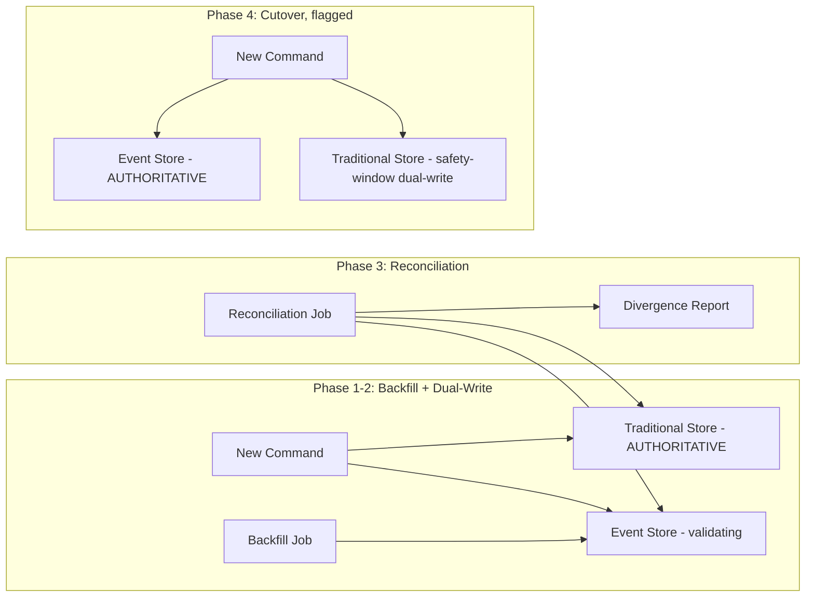
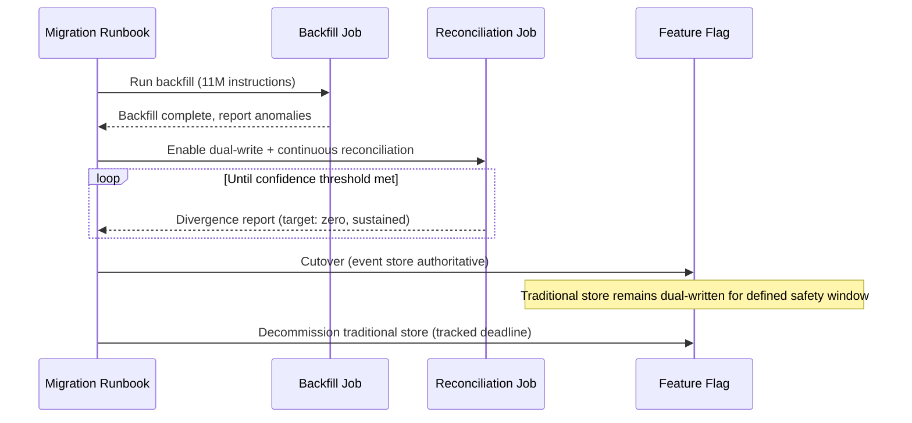
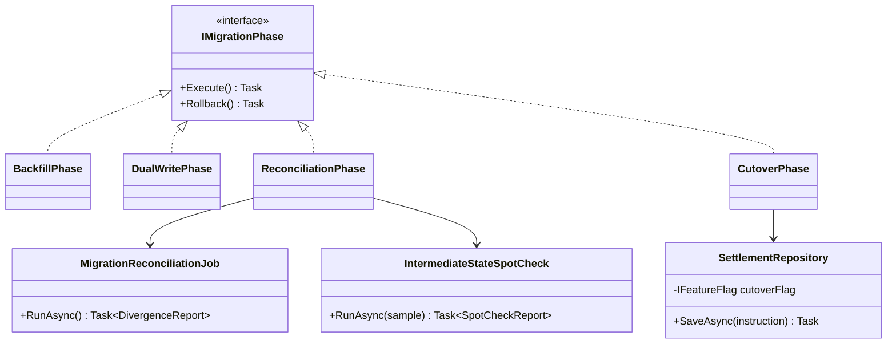

# Module 122 — Event Sourcing: Capstone — Migrating a Regulated Financial Aggregate to Event Sourcing at Scale

> Domain: Event Sourcing | Level: Beginner → Expert | Prerequisite: [[01-EventSourcingFundamentals-EventStoreAsSourceOfTruth-Snapshotting-AggregateReconstruction]] (takes as given: reconstruction mechanics, snapshotting, upcasting, and the calibrated hybrid-adoption principle — this capstone executes the full, at-scale migration Advanced Q8 there only outlined)
>
> **Domain-complete note:** second and final module of `35-Event-Sourcing` (Modules 121–122). Full 16-section template; Elite FinTech Interview Panel lens.

---

## The Running Case Study

Module 121's `SettlementInstruction` migration is now executed at genuine production scale: **eleven million historical settlement instructions**, spanning six years, across four prior schema revisions, migrated from traditional persistence to full Event Sourcing with zero downtime and zero risk to live settlement processing — using Module 107's Parallel Run technique (Module 121 Advanced Q8's preview) as the actual, worked migration mechanism.

---

## 1. Fundamentals

**What:** A complete, production-scale, zero-downtime migration of an existing, traditionally-persisted Aggregate to full Event Sourcing, validated via Parallel Run before the new persistence model becomes authoritative.

**Why:** Module 121's incidents (§4, §14 there) both arose from *already-migrated* systems' ongoing operation; this capstone addresses the migration itself — the highest-risk, one-time event in this pattern's adoption lifecycle, where an error affects not just future events but the interpretation of the *entire pre-existing historical record*.

**When:** Once Module 121 §15's calibration test (genuine, demonstrated audit/regulatory value) has justified adoption for a specific, already-live Aggregate — this module addresses *how*, safely, not *whether*.

**How (30,000-ft view):**
```
Phase 1: Backfill    — derive historical events from existing traditional-persistence data
Phase 2: Dual-write   — new commands write to BOTH traditional store and event store
Phase 3: Verify       — reconcile: does event-store-derived state match traditional state, always?
Phase 4: Cutover      — event store becomes authoritative; traditional store becomes a read model
Phase 5: Decommission — traditional store retired once confidence is fully established
```

---

## 2. Deep Dive

### 2.1 Backfill — Deriving Historical Events from Data That Was Never Event-Sourced
The hardest step: eleven million existing `SettlementInstruction` rows never had a corresponding event stream — a one-time backfill job must derive a *plausible* historical event sequence from whatever audit/change-log data already existed (often incomplete), explicitly accepting that pre-migration history may be a best-effort reconstruction, not a byte-for-byte accurate record of every original state transition — a materially weaker guarantee than the tamper-evident, byte-accurate history the system provides for every event *after* migration.

### 2.2 Dual-Write Period — Two Sources of Truth, Deliberately, Temporarily
During Phase 2, every new command writes to both the traditional store (still authoritative) and the new event store (being validated) — directly Module 107's dual-write migration pattern, now applied to a persistence-model migration specifically rather than a data-store technology migration.

### 2.3 Reconciliation — Detecting Divergence Before Cutover
A continuous, automated job (extending Module 121 §14's reconciliation approach) compares event-store-derived state against the traditional store's actual current state for every active instruction, flagging any divergence — directly Module 107's reconciliation discipline, now the central go/no-go gate for cutover.

### 2.4 The Backfill-Derived-History Risk — a New, Distinct Category
Unlike ongoing dual-write divergence (§2.3, detectable and fixable before cutover), an *inaccuracy in the backfilled historical events themselves* (§2.1) may not surface as a reconciliation discrepancy at all — since the traditional store's *current* state might still match correctly even if the *path* the backfill assumed to reach it was wrong — meaning reconciliation alone cannot fully validate historical-event accuracy, only current-state agreement.

### 2.5 Cutover — a Feature-Flagged, Reversible Transition
Mirroring Module 118 Advanced Q7's feature-flag-based cutover discipline: the event store becomes authoritative behind a flag, with the traditional store continuing to be dual-written for a defined post-cutover safety window, providing an instant rollback path if any post-cutover issue emerges.

### 2.6 Decommissioning — the "Old Systems Never Die" Risk, Recurring Again
Directly Module 107 Advanced Q7's already-established finding: the traditional store must have an explicit, tracked decommissioning deadline, or it lingers indefinitely as a redundant, increasingly-stale dual-write burden — precisely the structural, incentive-driven risk Module 107 named, recurring here at the close of this specific migration.

---

## 3. Visual Architecture





---

## 4. Production Example

**Problem:** Execute the `SettlementInstruction` migration (Module 121 §4) at full production scale — 11M instructions, 6 years, 4 prior schema revisions — without any risk to live settlement processing.

**Architecture:** The five-phase migration (§1's How) with reconciliation as the central go/no-go gate, and a dedicated anomaly-review process specifically for backfill-derived history (§2.4's distinct risk).

**Implementation:** The backfill job successfully derived event histories for 10.97M of 11M instructions from existing audit-log tables; approximately 30,000 instructions (from the earliest, pre-audit-logging era of the system's history) had no reconstructable event detail beyond "instruction existed, final state X" — these were backfilled as a single `LegacyStateImported` event carrying only the final known state, explicitly flagged as not carrying genuine historical granularity.

**Trade-offs:** Accepting a single, coarse `LegacyStateImported` event for the oldest 30,000 instructions (rather than blocking the entire migration on unreconstructable ancient history) traded historical completeness for those specific records against the ability to proceed with the migration's substantial, genuine benefit for the other 10.97M — a deliberate, documented, risk-accepted trade-off, not a silent gap.

**Lessons learned:** During the reconciliation phase, a genuine divergence was found affecting roughly 400 instructions where the backfill's derived event sequence produced a *current* state matching the traditional store (so it wouldn't have been caught by current-state reconciliation alone, §2.4's exact risk) but with an internal, intermediate `NettingCompleted` timestamp that was demonstrably wrong (derived from an ambiguous audit-log entry) — only caught because a separate, dedicated spot-check specifically compared a sample of backfilled *intermediate* states (not just final state) against an independent, older archival system used for a different purpose entirely. This directly validated §2.4's warning: reconciliation alone, checking only current state, would have silently missed this specific, real inaccuracy, motivating the addition of intermediate-state spot-checking as a permanent, additional verification step for any future backfill of this kind.

---

## 5. Best Practices
- Explicitly document and flag any backfilled records where full historical granularity couldn't be reconstructed — never silently present coarse, best-effort history as equivalent in quality to genuine, contemporaneously-recorded events (§4).
- Add intermediate-state spot-checking (not just current-state reconciliation) specifically for backfilled history, given §2.4/§4's demonstrated blind spot.
- Use a feature-flag-based, reversible cutover with a defined safety-window dual-write period (§2.5), never an irreversible, one-way cutover.
- Set an explicit, tracked decommissioning deadline for the retired traditional store from day one of the migration plan, not as an afterthought (§2.6).
- Treat the reconciliation job's "zero divergence, sustained over a defined period" as the actual go/no-go gate for cutover — not a fixed calendar date chosen in advance.

## 6. Anti-patterns
- Presenting backfilled, best-effort historical events as equivalent in integrity/completeness to genuine, contemporaneously-recorded ones without explicit flagging (§4).
- Relying solely on current-state reconciliation to validate backfill accuracy, missing the intermediate-state-divergence risk (§2.4).
- An irreversible, one-way cutover with no dual-write safety window or rollback path.
- Leaving the retired traditional store's decommissioning undated and untracked, letting it linger indefinitely (§2.6, Module 107 Advanced Q7).
- Treating a fixed calendar date, rather than sustained, demonstrated reconciliation success, as the cutover trigger.

---

## 7. Performance Engineering

**CPU/Memory:** The one-time backfill job for 11M instructions is a genuinely heavy batch workload — run on dedicated, isolated infrastructure, never contending with live production traffic's own resource budget.

**Latency:** Dual-write period adds a second write's latency to every live command during migration — measure and ensure this remains within acceptable command-processing latency budgets (Module 118 §7) throughout the entire migration window, not just at its start.

**Throughput:** The reconciliation job's own throughput must be sufficient to process the full 11M-instruction population within a reasonable, bounded validation window — benchmark this explicitly rather than discovering it takes impractically long only after starting the real migration.

**Scalability:** Backfill and reconciliation both parallelize naturally across instruction ID ranges/partitions, given each instruction's own independence (Module 118 §9's partitioning pattern, reapplied here for a batch migration workload specifically).

**Benchmarking:** Dry-run the full backfill and reconciliation process against a realistic-scale staging copy of production data before ever running it against real, live-system-adjacent production data.

**Caching:** Not a primary concern for this one-time migration workload — the relevant performance concerns are batch-job throughput and live-system dual-write latency overhead, not caching.

---

## 8. Security

**Threats:** The dual-write period doubles the attack surface for data-integrity issues (two systems now both need correct, consistent access control); the backfill job itself requires broad, bulk read access to years of historical data, a genuinely sensitive, higher-privilege operation.

**Mitigations:** Scope the backfill job's own credentials narrowly (read-only against the source, write-only against the new event store, time-boxed to the migration window and revoked immediately afterward); apply identical encryption/access-control standards to the event store as already applied to the traditional store throughout the dual-write period, never a temporarily-relaxed standard for migration convenience.

**OWASP mapping:** A time-boxed, over-privileged migration credential is itself a security risk category worth explicit review — ensure it's genuinely revoked on schedule, not left active indefinitely "just in case" after cutover.

**AuthN/AuthZ:** No change to ordinary command/query authorization during migration — only the underlying persistence mechanism changes, never the authorization model governing who may invoke which operations.

**Secrets:** The backfill job's elevated, time-boxed credentials are managed and rotated with the same rigor as any other regulated-system secret (Module 86), with an explicit, tracked expiration tied to the migration's own completion.

**Encryption:** Backfilled historical event payloads receive identical field-level encryption treatment (Module 121 §8) as newly-created events — never a lesser standard applied to "just historical" data.

---

## 9. Scalability

**Horizontal scaling:** Backfill and reconciliation jobs scale horizontally by instruction-ID partition, processing millions of records within a practical, bounded time window.

**Vertical scaling:** Less relevant than horizontal partitioning for this batch-workload profile.

**Replication:** The new event store's own replication/durability must be fully production-grade *before* cutover, not phased in afterward — it becomes the sole source of truth at the moment of cutover.

**Load balancing:** Live command traffic during the dual-write period load-balances unchanged; the added dual-write itself is the only new load characteristic to capacity-plan for.

**High Availability:** The dual-write period's design must specify exactly what happens if one of the two writes (traditional or event-store) succeeds while the other fails — typically, the traditional store remains authoritative during migration, so its write succeeding is the actual correctness gate, with a failed event-store write logged and retried/reconciled rather than blocking the live command.

**Disaster Recovery:** The migration plan itself should have its own rollback runbook (per §2.5's reversible-cutover design), tested before the real migration, not improvised during an actual incident.

**CAP theorem:** During the dual-write period, the traditional store's own existing CP guarantee (Module 118 §9) remains the system's actual correctness backbone; the event store's own consistency guarantee is being validated, not yet relied upon, until reconciliation (§2.3) and cutover (§2.5) confirm it's ready to bear that responsibility.

---

## 10. Interview Questions

### Basic (10)

1. **Q: What is "backfill," in this migration's context?**
   **A:** A one-time job deriving historical events for instructions that existed before Event Sourcing was adopted, from whatever traditional audit/change-log data already existed.
   **Why correct:** States the specific, one-time purpose and its data source precisely.
   **Common mistakes:** Assuming backfilled history has the same accuracy guarantee as genuinely contemporaneous, post-migration events (§2.1/§2.4).
   **Follow-ups:** "Why might backfilled history be less accurate than post-migration events?" (It's derived after the fact from whatever incomplete audit trail already existed, not recorded at the moment each original event actually occurred, §2.1.)

2. **Q: What is the dual-write period, and which store remains authoritative during it?**
   **A:** A period where every command writes to both stores; the traditional store remains authoritative until cutover (§2.2).
   **Why correct:** States both the mechanism and the specific, deliberate authority assignment during migration.
   **Common mistakes:** Assuming the event store becomes authoritative immediately once dual-writing begins, rather than only after validated cutover.
   **Follow-ups:** "What happens if the event-store write fails during dual-write but the traditional-store write succeeds?" (The command still succeeds, per the traditional store's authority; the event-store gap is logged/retried and caught by reconciliation, §9.)

3. **Q: What does the reconciliation job check for during migration?**
   **A:** Whether event-store-derived state matches the traditional store's actual current state, for every instruction, continuously (§2.3).
   **Why correct:** States the specific comparison being verified.
   **Common mistakes:** Assuming reconciliation alone validates full historical accuracy, missing §2.4's intermediate-state blind spot.
   **Follow-ups:** "What specific risk does current-state-only reconciliation miss?" (An inaccurate intermediate historical state that still happens to arrive at the correct final state, §2.4/§4.)

4. **Q: Why is cutover implemented via a feature flag rather than a one-time code deployment?**
   **A:** To provide an instant, reversible rollback path if any post-cutover issue emerges, without needing a slower code-revert-and-redeploy cycle (§2.5).
   **Why correct:** States the specific reason (speed/certainty of rollback) directly reapplying an already-established pattern.
   **Common mistakes:** Assuming a code-level revert would be an equally fast rollback mechanism.
   **Follow-ups:** "What additional safety measure accompanies the flagged cutover?" (A defined, continued dual-write safety window even after cutover, §2.5.)

5. **Q: Why must the traditional store's decommissioning have an explicit, tracked deadline?**
   **A:** Without one, it risks lingering indefinitely as a redundant burden — directly Module 107's "old systems never die" structural risk (§2.6).
   **Why correct:** Correctly reapplies an already-established, named risk to this specific migration's closing phase.
   **Common mistakes:** Assuming the traditional store will naturally be decommissioned "eventually" without a specific, tracked deadline driving it.
   **Follow-ups:** "What consequence follows from failing to decommission it?" (Ongoing, unnecessary dual-write/maintenance burden and confusion about which store is truly authoritative, Module 107 Advanced Q7.)

6. **Q: Approximately how many of the 11M instructions couldn't be backfilled with full historical granularity, and why?**
   **A:** About 30,000, from the system's earliest, pre-audit-logging era, which had no reconstructable intermediate-state detail beyond final known state (§4).
   **Why correct:** States the specific figure and root cause from this module's own case study.
   **Common mistakes:** Assuming every historical instruction could be backfilled with equal, full granularity regardless of how old or how well its original changes were logged.
   **Follow-ups:** "How were these specific instructions handled?" (A single, explicitly-flagged `LegacyStateImported` event carrying only final known state, §4.)

7. **Q: What specific, additional verification step did §4's incident motivate, beyond ordinary current-state reconciliation?**
   **A:** Intermediate-state spot-checking — comparing backfilled intermediate states (not just final state) against an independent data source.
   **Why correct:** Names the specific, concrete additional step this incident directly motivated.
   **Common mistakes:** Assuming current-state reconciliation alone was already sufficient validation before this incident revealed its blind spot.
   **Follow-ups:** "Why couldn't ordinary reconciliation alone catch this specific divergence?" (The final state matched correctly despite an inaccurate intermediate timestamp, §2.4/§4.)

8. **Q: Should the backfill job's elevated data-access credentials remain active after migration completes?**
   **A:** No — they should be time-boxed to the migration window and explicitly revoked afterward (§8).
   **Why correct:** States the specific, correct credential-lifecycle discipline.
   **Common mistakes:** Leaving elevated migration credentials active indefinitely "in case they're needed again."
   **Follow-ups:** "What OWASP-relevant risk does an un-revoked elevated credential represent?" (An unnecessarily broad, long-lived privileged-access surface, §8.)

9. **Q: During the dual-write period, whose consistency guarantee does the system actually rely on for correctness?**
   **A:** The traditional store's already-established CP guarantee (§9) — the event store's own guarantee is being validated, not yet relied upon.
   **Why correct:** Correctly identifies which store is actually load-bearing for correctness during this specific phase.
   **Common mistakes:** Assuming both stores are equally relied upon for correctness simultaneously during dual-write.
   **Follow-ups:** "When does this reliance shift to the event store?" (Only after cutover, following validated, sustained reconciliation success, §2.5.)

10. **Q: What determines when cutover is safe to proceed, per this module's own recommendation?**
    **A:** Sustained, demonstrated reconciliation success over a defined period — not a fixed, pre-chosen calendar date (§5).
    **Why correct:** States the specific, evidence-based trigger this module insists on.
    **Common mistakes:** Treating a fixed migration-project calendar deadline as the cutover trigger regardless of reconciliation results.
    **Follow-ups:** "What would you do if reconciliation still showed divergence on the planned cutover date?" (Delay cutover — the reconciliation gate takes priority over the calendar, §5.)

### Intermediate (10)

1. **Q: Why is a backfilled `LegacyStateImported` event explicitly flagged rather than presented identically to a genuine, granular historical event?**
   **A:** So any future audit-reconstruction query or reconciliation logic can correctly distinguish "we have full, contemporaneous historical detail here" from "we have only a best-effort final-state summary for this period" — conflating the two would silently overstate the completeness of this system's own audit-trail guarantee for its oldest records.
   **Why correct:** States the specific, ongoing consequence (misleading audit-completeness claims) explicit flagging prevents.
   **Common mistakes:** Treating the distinction as a one-time migration-documentation detail rather than a permanent, queryable property of the affected records going forward.
   **Follow-ups:** "How would a future audit query need to account for this flag?" (Explicitly reporting which records have full versus best-effort-summary history, rather than presenting a uniform completeness claim across all 11M instructions.)

2. **Q: Design the specific data source and method for intermediate-state spot-checking, given §4's incident.**
   **A:** Compare a statistically-significant sample of backfilled intermediate states (e.g., netting-completion timestamps) against an independent archival system that recorded similar detail for a different original purpose (in §4's case, an older reporting archive) — providing cross-validation from a genuinely separate source of truth, not merely re-deriving the same audit-log data the backfill itself was based on.
   **Why correct:** Correctly identifies the need for a genuinely independent data source, not a re-check of the same original input the backfill already used.
   **Common mistakes:** "Verifying" backfill accuracy by re-running the same derivation logic against the same source data, which would simply reproduce the identical (possibly wrong) result rather than genuinely cross-validating it.
   **Follow-ups:** "What if no independent archival source exists for a given historical period?" (An explicit, documented gap — that period's backfilled intermediate states carry a lower, disclosed confidence level, rather than an unfounded claim of validated accuracy.)

3. **Q: Why does the dual-write period's failure-handling policy (§9) specifically favor the traditional store's write succeeding as the command's actual success criterion?**
   **A:** Because the traditional store remains authoritative throughout migration (§2.2) — a live command's real-world correctness must never depend on the not-yet-validated event store's write succeeding, which is precisely why the traditional write's outcome, not the event-store write's, gates command success during this phase.
   **Why correct:** Correctly connects the failure-handling policy back to the authority assignment already established, rather than treating it as an arbitrary choice.
   **Common mistakes:** Requiring both writes to succeed for command success during the dual-write/validation period, which would make live production command processing dependent on an unproven system's reliability.
   **Follow-ups:** "What happens to a failed event-store write in this design?" (Logged and retried, or flagged for reconciliation follow-up — never blocking the live command, §9.)

4. **Q: How would you determine, concretely, what "sustained reconciliation success" (§5/§10 Basic Q10) should mean as a specific, measurable cutover gate?**
   **A:** Zero detected current-state divergences across the full instruction population, sustained continuously over a defined period (e.g., several full business cycles, covering realistic peak-volume days) — long enough to have exercised a representative range of real command patterns, not merely a quiet, low-activity period that happened to show no divergence by chance.
   **Why correct:** Gives a concrete, specific definition (zero divergence, sustained, across representative activity) rather than a vague "reconciliation looks good."
   **Common mistakes:** Treating a single, brief period of clean reconciliation results as sufficient confidence, without ensuring it covered genuinely representative, high-volume activity.
   **Follow-ups:** "Why specifically include peak-volume days in this validation window?" (Directly Module 118 §7's discipline — validating under realistic peak conditions, not just steady-state or low-activity periods, since edge cases and race conditions are more likely to surface under genuine load.)

5. **Q: Critique a migration plan that skips the dual-write period entirely, backfilling history and cutting over to the event store as authoritative in a single step.**
   **A:** This removes the entire validation mechanism (§2.2/§2.3) this migration's safety depends on — any backfill inaccuracy or event-store implementation bug would be discovered only *after* the event store is already authoritative for live processing, with no proven, already-running traditional-store fallback to catch or absorb the error, a direct violation of Module 107's own established migration-risk-minimization principle.
   **Why correct:** Identifies the specific safety mechanism (dual-write plus reconciliation as a pre-cutover validation gate) this shortcut removes, and connects it to Module 107's already-established migration discipline.
   **Common mistakes:** Assuming a well-tested backfill process alone provides sufficient confidence to skip live, dual-write validation against genuine production traffic and conditions.
   **Follow-ups:** "What specific class of bug would dual-write validation catch that pre-cutover testing alone might miss?" (A bug that only manifests under genuine, concurrent, real production command patterns and timing — exactly the class of issue synthetic pre-cutover testing often fails to fully replicate.)

6. **Q: How does this module's migration process relate to Module 121 Advanced Q8's original preview, and what specifically did that preview leave unaddressed that this capstone had to resolve?**
   **A:** Advanced Q8 correctly previewed the overall Parallel-Run-based approach (dual-write, reconcile, cutover) but didn't address the specific, genuinely new risk this capstone's own scale surfaced — that backfilling *historical* data (rather than validating only *ongoing*, post-migration events) introduces the distinct, current-state-reconciliation-invisible risk of inaccurate intermediate history (§2.4/§4), a risk category specific to migrating an *already-existing* Aggregate's full historical record, not present in Module 107's original, more general dual-write-migration framing.
   **Why correct:** Precisely identifies what the prior preview correctly anticipated versus the specific, new risk category this capstone's actual execution surfaced, rather than treating this module as pure repetition of the preview.
   **Common mistakes:** Assuming this capstone simply executed Advanced Q8's preview mechanically, missing that genuine, at-scale execution surfaced a specific, previously-unaddressed risk (backfill-history accuracy) the preview's more general framing hadn't anticipated in this specific form.
   **Follow-ups:** "Would this specific backfill-accuracy risk apply to a genuinely new Aggregate adopting Event Sourcing from day one, with no prior history to backfill?" (No — it's specific to migrating an Aggregate that already had pre-existing history under a different persistence model; a new Aggregate has no backfill step at all, avoiding this risk category entirely.)

7. **Q: Design the specific rollback runbook entry for a post-cutover issue discovered during the safety-window dual-write period (§2.5).**
   **A:** (1) Immediately flip the feature flag back to traditional-store authority, an instant, code-deployment-free action. (2) Since dual-writing continued through the safety window, the traditional store has remained current and consistent throughout — no data-loss or catch-up reconciliation is needed for the rollback itself. (3) Investigate and fix the specific event-store-side issue that triggered rollback before attempting cutover again, treating the failed attempt as new information requiring the migration's own reconciliation/validation process to be re-run, not merely retried identically.
   **Why correct:** Gives a concrete, ordered rollback sequence exploiting the safety-window design's specific property (traditional store stayed current throughout) to avoid any data-loss complication during rollback itself.
   **Common mistakes:** Assuming rollback requires a separate, additional data-recovery step, missing that the safety-window dual-write design specifically ensures the traditional store never stopped being kept current, making rollback a purely code/configuration-level action.
   **Follow-ups:** "How would you decide when it's safe to end the safety-window dual-write and fully retire the traditional store?" (Only after a defined, additional period of confidence-building post-cutover with zero rollback triggers, per §2.6's tracked-decommissioning-deadline discipline.)

8. **Q: Why does backfilled event data require the identical field-level encryption treatment as newly-created events (§8), rather than a simpler approach given it's "just historical data being migrated"?**
   **A:** The event store treats all events, regardless of age or origin, under one uniform security/compliance standard — applying a lesser standard to backfilled data would create an inconsistent, auditable gap in the system's own claimed security posture, undermining exactly the kind of uniform, defensible compliance evidence (Module 116/121's established theme) this entire migration is meant to strengthen, not weaken.
   **Why correct:** Connects the specific requirement (uniform encryption standard) to this course's broader theme of compliance evidence needing to be genuinely, uniformly true, not selectively applied.
   **Common mistakes:** Treating backfilled historical data as inherently lower-risk or lower-priority for security controls simply because it represents "old" information rather than newly-generated data.
   **Follow-ups:** "What would an auditor's reaction likely be to discovering backfilled data had a lesser encryption standard than newly-created events?" (A significant, credibility-damaging finding — exactly the kind of inconsistency a sophisticated audit specifically looks for.)

9. **Q: A stakeholder asks why the migration couldn't simply be completed faster by skipping the dual-write safety window after cutover. How would you respond?**
   **A:** The safety window (§2.5) is specifically what makes cutover *reversible* rather than a one-way, irrecoverable commitment — skipping it converts what should be a low-risk, easily-undoable transition into a high-stakes, unrecoverable one, trading a small amount of additional calendar time for a categorically safer migration posture, consistent with this entire domain's elevated-stakes justification (Module 121 §1) for adopting Event Sourcing in the first place.
   **Why correct:** Gives the honest, calibrated cost/benefit answer (small time cost versus large risk-reduction benefit) rather than dismissing the stakeholder's timeline concern or capitulating to it without explaining the genuine trade-off.
   **Common mistakes:** Either refusing the timeline pressure without explaining the specific risk being managed, or capitulating to it without making the actual trade-off explicit and the stakeholder genuinely informed.
   **Follow-ups:** "How would you quantify this trade-off concretely for the stakeholder?" (Frame it as: X additional days of dual-write cost, versus the cost/risk of an unrecoverable cutover failure affecting Y regulated financial instructions — a concrete, comparable framing rather than an abstract risk-aversion argument.)

10. **Q: Synthesize this capstone's specific, new findings back into Module 121's own established toolkit — what does this module add that Module 121 didn't already cover?**
    **A:** Module 121 established the ongoing, steady-state mechanics of an already-Event-Sourced Aggregate (reconstruction, snapshotting, upcasting); this capstone adds the specific, one-time migration mechanics required to *get there safely* from an existing, traditionally-persisted Aggregate — backfill-accuracy risk and its intermediate-state-blind-spot (§2.4), the dual-write/reconciliation/feature-flagged-cutover sequence (§1's five phases), and the specific credential-lifecycle and decommissioning-deadline governance this one-time transition requires — genuinely new, additive content rather than a restatement of Module 121's own steady-state operational concerns.
    **Why correct:** Precisely distinguishes Module 121's steady-state operational content from this capstone's genuinely new, migration-specific content, rather than presenting this module as repetitive.
    **Common mistakes:** Assuming this capstone merely demonstrates Module 121's already-established mechanics at larger scale, missing the specific, new risk categories (backfill accuracy, migration-phase governance) unique to the one-time transition itself.
    **Follow-ups:** "Would a brand-new Aggregate, built Event-Sourced from day one, ever need any of this capstone's specific techniques?" (No — backfill, dual-write, and cutover are exclusively migration-specific concerns; a new Aggregate starts directly in Module 121's steady-state operational model with no prior history to migrate.)

### Advanced (10)

1. **Q: Diagnose §4's incident from first principles and design the complete, structural fix for this specific class of risk in any future backfill-based migration.**
   **A:** Root cause: reconciliation validated only current state, structurally blind to intermediate-state inaccuracy in derived historical events (§2.4). Fix: mandate intermediate-state spot-checking against an independent data source (Intermediate Q2) as a standing, required step for any future backfill migration — not merely a one-off addition for this specific instance — codified as a governance checklist item (§15) any team executing a similar Aggregate migration must complete before their own cutover, directly extending this incident's specific lesson into an organizational, reusable requirement.
   **Why correct:** Identifies the precise structural gap (current-state-only reconciliation) and generalizes the fix into a standing, reusable governance requirement rather than a one-off patch specific to `SettlementInstruction` alone.
   **Common mistakes:** Fixing only this specific incident's 400 affected instructions without institutionalizing intermediate-state spot-checking as a mandatory step for every future migration of this kind.
   **Follow-ups:** "Would this fix have been sufficient without an independent archival data source to check against?" (No — Intermediate Q2's answer applies; absent an independent source, the correct response is an explicit, disclosed lower-confidence flag for that period's backfilled data, not a false claim of validated accuracy.)

2. **Q: A team proposes running the reconciliation job (§2.3) only once, immediately before cutover, rather than continuously throughout the dual-write period. Evaluate this proposal.**
   **A:** A single, point-in-time reconciliation check provides much weaker confidence than continuous reconciliation sustained across representative activity (Intermediate Q4) — it could pass cleanly by chance during a quiet period while missing a genuine, intermittent divergence that only manifests under specific, less-common command sequences or concurrent-load conditions; continuous reconciliation across a defined, representative validation window is the actual, load-bearing safety mechanism, not a single pre-cutover snapshot check.
   **Why correct:** Identifies the specific weakness (a single check can pass by chance, missing intermittent issues) a one-time reconciliation approach introduces relative to continuous, sustained validation.
   **Common mistakes:** Treating "reconciliation passed" as sufficient regardless of whether it reflects sustained, continuous validation or a single, potentially-lucky point-in-time check.
   **Follow-ups:** "What specific class of bug would continuous reconciliation catch that a single check might miss?" (A race condition or edge case triggered only by a specific, relatively rare concurrent command sequence that a single, brief reconciliation window happened not to include.)

3. **Q: Critique treating the 30,000 pre-audit-logging-era instructions' `LegacyStateImported` events as fully equivalent, for every downstream purpose, to genuinely granular historical events.**
   **A:** This would silently misrepresent this system's own audit-completeness guarantee to any future regulator or internal auditor querying those specific 30,000 instructions' history — the correct approach (§4/Intermediate Q1) is ensuring every downstream consumer of historical event data (audit-reconstruction queries, Module 120-style read-model projections) can explicitly distinguish and appropriately caveat results touching `LegacyStateImported`-flagged instructions, never presenting them with the same completeness confidence as genuinely granular records.
   **Why correct:** Extends the "explicit flagging" principle (§4/Intermediate Q1) to its necessary downstream consequence — every consumer of this data must also respect and surface the distinction, not just the backfill process itself.
   **Common mistakes:** Assuming flagging the backfilled events at creation time is sufficient without also ensuring every downstream query/reporting mechanism actually surfaces and respects that flag.
   **Follow-ups:** "How would a regulatory-reporting query (Module 120's Compliance read model) need to change to correctly handle these flagged instructions?" (Explicitly surface a "limited historical detail available" indicator for any report touching a `LegacyStateImported`-derived instruction, rather than presenting uniform completeness across the full 11M-instruction population.)

4. **Q: Design a load-testing methodology validating that the dual-write period's added latency remains within acceptable bounds throughout a full, realistic migration window, including peak-volume days.**
   **A:** Directly extending Module 118 §7's peak-burst load-testing methodology: run the dual-write path under synthetic, realistic peak-volume order/settlement traffic (not steady-state averages) for a sustained period, measuring command-processing P99 latency with dual-write enabled versus the pre-migration baseline — confirming the added event-store write doesn't push latency past this system's already-established SLA (Module 118's own latency budget), specifically during the highest-load periods the real migration window will actually encounter, not just quiet, low-traffic testing conditions.
   **Why correct:** Correctly reapplies an already-established peak-load-testing discipline to this migration's own specific added-latency concern, rather than testing only under convenient, low-load conditions.
   **Common mistakes:** Load-testing the dual-write path only under steady-state or low-traffic conditions, missing whether it holds up specifically during the realistic peak-volume days the actual migration window will need to survive.
   **Follow-ups:** "What would you do if dual-write latency testing revealed an unacceptable SLA risk during peak periods?" (Consider asynchronous, best-effort event-store writes during the dual-write validation period specifically — accepting a brief, monitored risk of eventual, not immediate, event-store consistency during peak windows only, as a deliberate, documented trade-off, rather than blocking the entire migration.)

5. **Q: How would you decide whether the 400-instance intermediate-state divergence found in §4's incident was severe enough to delay cutover entirely, versus proceeding with a documented, accepted exception for those specific instances?**
   **A:** Apply a severity/scope-based test: is the divergence isolated to a small, specifically-identifiable, non-growing population (here, 400 out of 11M, all traceable to a specific historical era) with a clear, understood root cause, or does it suggest a systemic, potentially-still-growing issue affecting an unknown, unbounded scope? The former (as in this actual case) can reasonably proceed with a documented, risk-accepted exception for those specific 400 instances while cutover proceeds for the other 10,999,600+ correctly-reconciled instructions; the latter would warrant delaying cutover entirely until the systemic cause is fully understood and resolved.
   **Why correct:** Gives a concrete decision test (isolated and understood versus systemic and unbounded) for this genuinely nuanced go/no-go judgment call, rather than a blanket "any divergence blocks cutover" or "any divergence is acceptable" rule.
   **Common mistakes:** Either blocking the entire, otherwise-successful migration over a small, well-understood, isolated exception, or proceeding without adequate scrutiny of whether a divergence's scope is genuinely bounded and understood before accepting it.
   **Follow-ups:** "How would the 400 exception instances be handled going forward after cutover?" (Explicitly flagged (per Advanced Q3's downstream-consumer discipline) as having a known, documented, and accepted intermediate-state-accuracy limitation, distinct from the fully-validated remainder of the migrated population.)

6. **Q: A compliance officer asks whether this migration itself needs to be disclosed to regulators, and if so, how. Design the disclosure approach.**
   **A:** Yes — disclose the migration's occurrence, the backfill methodology and its known limitations (the 30,000 `LegacyStateImported` records and the 400-instance documented exception, per Advanced Q3/Q5), and the validation process (dual-write, reconciliation, feature-flagged cutover) as concrete, positive evidence of a rigorous, risk-managed transition — framing the honestly-disclosed limitations not as a weakness to hide, but as evidence of the exact kind of careful, transparent risk management (directly Module 118 Expert Q7's own "honest, bounded characterization is stronger than overclaiming completeness" principle) a sophisticated regulator is specifically looking for.
   **Why correct:** Correctly reapplies Module 118's already-established honest-disclosure principle to this migration's own specific, genuine limitations, framing transparency as a credibility strength rather than a liability to minimize or conceal.
   **Common mistakes:** Either failing to proactively disclose the migration and its known limitations, or disclosing it defensively/apologetically rather than as evidence of rigorous risk management.
   **Follow-ups:** "What specific artifact would you present as the primary evidence of this migration's rigor?" (The reconciliation job's own sustained, continuous pass-rate history across the full validation window, directly the same kind of continuously-verified, mechanical evidence Module 116/118 already established as the most compelling audit artifact.)

7. **Q: Design the specific criteria for deciding the length of the post-cutover safety-window dual-write period (§2.5) — why not simply "one week" or another arbitrary default?**
   **A:** Calibrate to this system's own observed operational cycle — long enough to have exercised at least one full, realistic business cycle post-cutover (including any periodic, less-frequent operations like month-end processing or quarterly regulatory-reporting triggers) with zero rollback-triggering issues, directly reapplying Intermediate Q4's "representative activity, not an arbitrary calendar duration" principle to the post-cutover phase specifically, rather than the pre-cutover reconciliation phase alone.
   **Why correct:** Correctly extends the same evidence-based, representative-activity-driven calibration principle already established for pre-cutover validation to the post-cutover safety window as well.
   **Common mistakes:** Choosing an arbitrary, fixed calendar duration (e.g., "one week," "30 days") without checking whether it actually spans this specific system's own meaningful, periodic business-cycle events.
   **Follow-ups:** "What specific business-cycle event would be most important to include for this settlement-engine case study?" (A month-end or quarter-end regulatory-reporting cycle — exactly the kind of periodic, high-stakes, less-frequent operation most likely to surface an issue the more frequent, day-to-day validation period might not have exercised.)

8. **Q: Critique a decision to decommission the traditional store immediately upon successful cutover, with no post-cutover safety window at all.**
   **A:** This directly removes §2.5's entire reversibility mechanism — the moment the traditional store is decommissioned, rollback (Intermediate Q7) becomes impossible, converting what should remain a safely-reversible transition (for a defined period) into an immediately-irreversible one, precisely the risk-elevated posture this entire migration's careful, phased design exists to avoid.
   **Why correct:** Identifies the specific mechanism (loss of rollback capability) this shortcut eliminates, directly connecting it to the phased design's central safety property.
   **Common mistakes:** Treating "cutover succeeded" as equivalent to "migration is fully proven safe," missing that genuine confidence requires the additional, sustained post-cutover observation period §2.5's safety window specifically provides.
   **Follow-ups:** "What's a reasonable minimum bar before considering decommissioning at all?" (Successful completion of Advanced Q7's full, representative safety-window period with zero rollback-triggering issues — never immediately upon cutover alone.)

9. **Q: How would you handle a scenario where, during the safety-window period, a genuine post-cutover issue is discovered — but rolling back would itself now be operationally disruptive given three weeks of new events have accumulated in the event store since cutover?**
   **A:** Because the safety-window design specifically kept the traditional store dual-written throughout (§2.5, §10 Advanced Q7's rollback runbook), it remains fully current and consistent with all three weeks of activity — rollback is *not* operationally disruptive precisely because this design anticipated exactly this scenario; the instant feature-flag flip (§2.5) reverts authority to the still-current traditional store with zero data loss or catch-up work required, which is the entire, deliberate point of maintaining dual-write through the full safety window rather than stopping it immediately at cutover.
   **Why correct:** Correctly identifies that this scenario's apparent difficulty is exactly what the safety-window design was built to prevent, demonstrating the design's actual value under a genuine, realistic stress-test scenario.
   **Common mistakes:** Assuming rollback becomes progressively harder or more disruptive the longer the safety window runs, missing that continued dual-write throughout the window is specifically what keeps rollback cheap and safe regardless of how much time has elapsed since cutover.
   **Follow-ups:** "At what point would rollback genuinely become disruptive?" (Only after the traditional store's dual-writing has actually stopped, i.e., after full decommissioning per §2.6 — which is exactly why that decommissioning decision must be made only with high, sustained confidence, not prematurely.)

10. **Q: As a Principal Engineer, synthesize this entire capstone into the complete migration governance program required before any future regulated-Aggregate Event Sourcing migration proceeds at this organization.**
    **A:** (1) An explicit, calibrated justification (Module 121 §15) that this specific Aggregate's migration is warranted before starting. (2) A backfill process with mandatory, explicit flagging of any historical period lacking full reconstructable granularity (§4/Advanced Q3), never silently presented as complete. (3) Mandatory intermediate-state spot-checking against an independent data source, not merely current-state reconciliation (Advanced Q1). (4) A continuous, representative-activity-calibrated reconciliation validation window as the actual cutover gate — never a fixed calendar date (Intermediate Q4/Advanced Q2). (5) A feature-flagged, reversible cutover with a representative-business-cycle-calibrated post-cutover safety window (Advanced Q7), never an immediate, irreversible transition. (6) An explicit, tracked decommissioning deadline for the retired traditional store (§2.6), preventing indefinite lingering. (7) Proactive, honest regulatory disclosure of the migration's methodology and any known, documented limitations (Advanced Q6), framed as evidence of rigor, not a hidden weakness.
    **Why correct:** Synthesizes every specific finding from this capstone into a coherent, actionable, reusable governance program for any future migration of this kind, matching this course's established capstone-synthesis pattern.
    **Common mistakes:** Presenting only the technical five-phase migration mechanism without the governance, disclosure, and decommissioning-tracking elements that make it genuinely safe and organizationally repeatable for future migrations.
    **Follow-ups:** "Which single element of this program is most directly attributable to a lesson only this specific, at-scale capstone (not Module 121's more general treatment) could have taught?" (Mandatory intermediate-state spot-checking, Advanced Q1 — a risk category specific to backfilling genuinely pre-existing historical data at scale, never encountered in Module 121's steady-state, already-migrated operational scope.)

---

## 11. Coding Exercises

### Easy — Backfill Event Derivation from Audit-Log Data (§2.1)
**Problem:** Derive a plausible historical event sequence from an existing audit-log table.
**Solution:**
```csharp
public class BackfillDerivation
{
    public IEnumerable<DomainEvent> DeriveEvents(IEnumerable<AuditLogEntry> auditLog) =>
        auditLog.OrderBy(e => e.Timestamp)
                .Select(e => e.ChangeType switch
                {
                    "Created" => new InstructionCreated(e.InstructionId, e.Timestamp),
                    "Matched" => new LineItemMatched(e.InstructionId, e.Timestamp, e.Details),
                    "Released" => new Released(e.InstructionId, e.Timestamp),
                    _ => (DomainEvent)new LegacyStateImported(e.InstructionId, e.FinalKnownState)
                });
}
```
**Time complexity:** O(n log n) for the ordering step, O(n) for derivation itself.
**Space complexity:** O(n) for the derived event sequence held in memory per instruction batch.
**Optimized solution:** Stream-process in batches rather than loading an entire instruction's audit history into memory at once, for instructions with unusually large historical audit-log volumes.

### Medium — Reconciliation Job Comparing Event-Derived vs. Traditional State (§2.3)
**Problem:** Detect divergence between event-store-derived and traditional-store current state.
**Solution:**
```csharp
public class MigrationReconciliationJob
{
    public async Task<DivergenceReport> RunAsync()
    {
        var divergences = new List<Divergence>();
        await foreach (var id in _instructionIds.StreamAllAsync())
        {
            var eventDerived = await LoadFromEventStore(id);
            var traditional = await LoadFromTraditionalStore(id);
            if (!eventDerived.Equals(traditional))
                divergences.Add(new Divergence(id, eventDerived, traditional));
        }
        return new DivergenceReport(divergences);
    }
}
```
**Time complexity:** O(n) instructions, each O(k) for its own event-replay cost.
**Space complexity:** O(1) per comparison; O(d) for the accumulated divergence report where d is the (ideally near-zero) divergence count.
**Optimized solution:** Parallelize the per-instruction comparison across partitions (Module 118 §9's pattern), and incrementally re-check only instructions modified since the last reconciliation run rather than the full population every time, once an initial full pass has established a baseline.

### Hard — Feature-Flagged Cutover with Safety-Window Dual-Write (§2.5)
**Problem:** Implement a cutover mechanism that's instantly reversible.
**Solution:**
```csharp
public class SettlementRepository : ISettlementRepository
{
    private readonly IFeatureFlag _cutoverFlag;
    public async Task SaveAsync(SettlementInstruction instruction)
    {
        if (_cutoverFlag.IsEnabled("event-store-authoritative"))
        {
            await _eventStore.AppendToStream(instruction.Id, instruction.ExpectedVersion, instruction.UncommittedEvents);
            await _traditionalStore.SaveAsync(instruction); // safety-window dual-write continues
        }
        else
        {
            await _traditionalStore.SaveAsync(instruction); // traditional authoritative, pre-cutover
            await TryAppendToEventStoreAsync(instruction); // best-effort, validating
        }
    }
}
```
**Time complexity:** O(1) additional write per command in either mode.
**Space complexity:** O(1) additional per command.
**Optimized solution:** Make the safety-window dual-write itself asynchronous/best-effort (not blocking command latency) once cutover has succeeded and initial confidence is established, while still retaining it as a genuine, current fallback — trading a small amount of write-consistency lag for reduced post-cutover latency overhead.

### Expert — Intermediate-State Spot-Check Against an Independent Archive (§4, Advanced Q1)
**Problem:** Validate backfilled intermediate states against an independent data source, catching what current-state-only reconciliation misses.
**Solution:**
```csharp
public class IntermediateStateSpotCheck
{
    public async Task<SpotCheckReport> RunAsync(IEnumerable<string> sampleInstructionIds)
    {
        var findings = new List<Finding>();
        foreach (var id in sampleInstructionIds)
        {
            var backfilledHistory = await _eventStore.ReadFrom(id, fromVersion: 0);
            var nettingEvent = backfilledHistory.OfType<LineItemMatched>().LastOrDefault();
            var independentRecord = await _legacyReportingArchive.GetNettingTimestampAsync(id);

            if (nettingEvent is not null && independentRecord is not null
                && nettingEvent.Timestamp != independentRecord.Timestamp)
            {
                findings.Add(new Finding(id, nettingEvent.Timestamp, independentRecord.Timestamp));
            }
        }
        return new SpotCheckReport(findings);
    }
}
```
**Time complexity:** O(s) for s sampled instructions, each requiring one event-replay and one independent-archive lookup.
**Space complexity:** O(f) for findings, ideally near-zero.
**Optimized solution:** Expand from a statistical sample to full-population coverage specifically for any historical era already flagged as lower-confidence (per §4's incident's own affected period), reserving sampling for eras with otherwise-strong, already-validated confidence.

---

## 12. System Design

**Functional requirements:** Migrate 11M existing instructions to Event Sourcing with zero downtime; validate migration accuracy before cutover; support safe, instant rollback for a defined post-cutover period; explicitly flag any historical records with reduced backfill confidence.

**Non-functional requirements:** Zero risk to live settlement processing throughout migration; dual-write latency within existing SLA; reconciliation coverage across the full instruction population, not a sample, for current-state validation; intermediate-state spot-check coverage for backfill-confidence validation.

**Architecture:** The five-phase migration (§1); a backfill job; a continuous reconciliation job; a feature-flagged Repository implementation (§11 Hard exercise) supporting both pre- and post-cutover write modes.

**Components:** `BackfillDerivation`; `MigrationReconciliationJob`; `IntermediateStateSpotCheck`; feature-flag-aware `SettlementRepository`; a migration runbook encoding the full phase sequence and rollback procedure.

**Database selection:** No change from Module 121's own event-store/snapshot-store selection — this capstone concerns the migration process, not new persistence-technology choices.

**Caching:** Not a primary concern for this one-time migration workload.

**Messaging:** Unchanged from Module 121/120's existing Outbox/projection architecture — this migration concerns write-side persistence, with downstream projections (Module 120) continuing to consume Domain Events unaffected by the underlying persistence-model transition.

**Scaling:** Backfill/reconciliation parallelized by instruction-ID partition; dual-write latency capacity-planned against realistic peak command volume.

**Failure handling:** Feature-flagged, instantly-reversible cutover with a representative-business-cycle safety window (§2.5); traditional-store-write-as-command-success-gate during dual-write (§9).

**Monitoring:** Continuous reconciliation divergence-count as the primary go/no-go signal; dual-write latency overhead tracked against existing SLA throughout migration; post-cutover rollback-trigger monitoring during the safety window.

**Trade-offs:** Accepted, explicitly-flagged reduced historical granularity for the oldest 30,000 pre-audit-era instructions, in exchange for proceeding with the migration's substantial benefit for the remaining 10.97M+ — a deliberate, documented, risk-accepted decision, not a silent gap (§4).

---

## 13. Low-Level Design

**Requirements:** A migration process that's safely reversible at every phase; backfill accuracy is validated through both current-state and intermediate-state checks; cutover is a configuration-level, not code-deployment-level, action.

**Class diagram:**


**Sequence diagram:** See §3's migration-runbook sequence diagram.

**Design patterns used:** Strategy (feature-flag-selected write behavior, §11 Hard exercise); Template Method (each `IMigrationPhase` following a common execute/rollback structure); Command (each migration phase as an explicit, independently-executable and independently-rollback-able step).

**SOLID mapping:** Single Responsibility (each phase class handles exactly one migration step); Open/Closed (a new validation check, like the intermediate-state spot-check, added without modifying the reconciliation phase's existing logic); Dependency Inversion (the Repository depends on `IFeatureFlag` and both store interfaces, never a concrete implementation).

**Extensibility:** A future, similar migration for a different regulated Aggregate reuses the identical `IMigrationPhase` structure and reconciliation/spot-check tooling, requiring only Aggregate-specific backfill-derivation logic (§11 Easy exercise) to be newly written.

**Concurrency/thread safety:** Backfill and reconciliation both process instructions independently and in parallel by partition; the dual-write path's two writes (traditional, event-store) within a single command execution must be sequenced correctly per §9's failure-handling policy (traditional write's outcome gates command success), not executed as an uncoordinated, purely parallel pair.

---

## 14. Production Debugging

**Incident:** Three weeks into the post-cutover safety window, the reconciliation job (still running as a defense-in-depth check even after cutover) flagged a small but non-zero, slowly growing count of new, *post-cutover* divergences — a genuinely alarming signal, since these were newly-created events, not backfilled history, and should have shown zero divergence entirely once the event store was authoritative.

**Root cause:** A specific, rare command sequence — a settlement instruction receiving a very rapid, back-to-back sequence of partial-fill and correction events within the same processing millisecond window — occasionally triggered a race condition in the event-store's own client-library retry logic, causing a duplicate append attempt that, despite the idempotency and expected-version protections (Module 121 §2.6), occasionally succeeded in creating two slightly different projections of the same logical event due to a subtle bug in how the retry logic handled a specific timeout-then-success scenario.

**Investigation:** The divergences were rare enough (roughly one in several hundred thousand commands) that they hadn't surfaced during the pre-cutover reconciliation validation window, which, while representative (per Advanced Q4's criteria), simply hadn't included a large enough sample of this specific rare, rapid-sequence scenario to trigger the underlying race condition during validation. Correlating divergence timestamps against command logs isolated the exact rapid partial-fill-then-correction pattern common to every affected instruction.

**Tools:** The reconciliation job's own ongoing, post-cutover monitoring (still running as defense-in-depth, per this incident's own justification for keeping it active through the safety window); command-log correlation isolating the specific triggering pattern; the event-store client library's own retry-logic source/documentation review.

**Fix:** Patched the event-store client library's retry logic to correctly de-duplicate on a client-generated idempotency token rather than relying solely on the store's own expected-version check, which the specific timeout-then-success race condition had exposed as an insufficient sole safeguard for this narrow scenario.

**Prevention:** Retained the reconciliation job as a permanent, ongoing (not just migration-period) production safeguard — this incident's own discovery, entirely dependent on reconciliation still running post-cutover, directly justified treating continuous reconciliation as a standing operational practice for this Aggregate going forward, not merely a temporary migration-validation tool retired once cutover succeeded.

---

## 15. Architecture Decision

**Context:** Deciding whether the reconciliation job should be retired once the post-cutover safety window successfully concludes, or retained permanently as an ongoing production safeguard.

**Option A — Retire reconciliation once the safety window concludes successfully:**
*Advantages:* Reduces ongoing operational/compute cost once migration confidence is fully established.
*Disadvantages:* §14's incident directly demonstrates that a genuinely rare, race-condition-driven divergence can emerge well after cutover, entirely undetectable without continued reconciliation running.
*Cost:* Lower ongoing operational cost; higher risk of an undetected, silently-compounding correctness issue emerging later.

**Option B — Retain reconciliation permanently as a standing, ongoing production safeguard:**
*Advantages:* Directly catches exactly the class of rare, post-cutover issue §14 demonstrated, providing genuine, ongoing assurance beyond the initial migration-validation period.
*Disadvantages:* Ongoing compute/operational cost indefinitely, for a system now presumably stable and well past its initial migration-risk period.
*Cost:* Higher ongoing cost; directly, demonstrably justified by §14's own real incident.

**Recommendation:** **Option B**, directly reapplying Module 120 Advanced Q9's own already-established principle that reconciliation (there, for read-model drift; here, for write-side event-store correctness) is a permanent, ongoing correctness safeguard, not a one-time migration-validation tool — §14's own incident is concrete, first-hand evidence this recommendation isn't merely theoretical caution but a demonstrated, real necessity for this specific system.

---

## 17. Principal Engineer Perspective

**Business impact:** A successful, zero-downtime migration of this magnitude (11M instructions, zero risk to live processing) is itself a significant organizational achievement worth quantifying and communicating — both as direct evidence of engineering rigor to stakeholders and regulators, and as a reusable governance template (§10 Advanced Q10) reducing the cost and risk of any future, similar migration.

**Engineering trade-offs:** Every phase of this migration (backfill, dual-write, reconciliation, cutover, decommissioning) traded additional calendar time and engineering effort for materially reduced risk — a Principal Engineer's specific job throughout was resisting pressure (Intermediate Q9) to compress this timeline in ways that would have removed genuine safety mechanisms, while still executing efficiently within the added rigor's real, but bounded, cost.

**Technical leadership:** Establishing intermediate-state spot-checking (§4/Advanced Q1) as a mandatory, not optional, governance requirement for this and future migrations is exactly the kind of systemic, structural intervention (rather than a one-off fix specific to the 400 affected instances) a Principal Engineer's role specifically requires.

**Cross-team communication:** The decision to proactively, honestly disclose this migration's specific methodology and known limitations to regulators (Advanced Q6) required aligning legal/compliance, engineering, and operations teams around a shared, transparent communication strategy — a genuinely cross-functional leadership task, not a purely technical one.

**Architecture governance:** This capstone's full governance program (§10 Advanced Q10) should be codified as a reusable playbook — an ADR (Module 106) template — for any future migration of a different regulated Aggregate to Event Sourcing, rather than each future migration independently rediscovering the same lessons (backfill-accuracy risk, reconciliation-as-permanent-safeguard) this capstone's own incidents already revealed.

**Cost optimization:** The decision to retain reconciliation permanently (§15) trades ongoing compute cost for demonstrated, concrete risk reduction — a Principal Engineer should periodically re-evaluate this specific cost/benefit balance as the system's own track record accumulates further evidence, rather than treating either the original migration-era decision or this capstone's own recommendation as permanently fixed without future re-examination.

**Risk analysis:** §14's incident is this capstone's own clearest demonstration that migration risk doesn't end cleanly at cutover — a Principal Engineer's risk analysis for any similarly-scaled migration must explicitly account for rare, race-condition-class issues that representative, but necessarily bounded, pre-cutover validation may simply not have statistically encountered, requiring genuinely ongoing, not just migration-period, vigilance.

**Long-term maintainability:** This migration's own explicit, tracked decommissioning deadline for the traditional store (§2.6) — and the discipline of actually meeting it, rather than letting it silently slip — is the final, concrete test of whether this entire governance program was genuinely followed through to completion, not merely well-designed on paper; a Principal Engineer should track this specific completion as an explicit, reportable organizational metric.

---

**Domain complete — `35-Event-Sourcing` (Modules 121–122):** Event Store as source of truth, snapshotting, Aggregate reconstruction, upcasting → this capstone's full, worked, at-scale migration of a regulated financial Aggregate, closing the domain's full arc and demonstrating this course's now-repeated calibration, reconciliation, and honest-disclosure principles at genuine production scale. Hands off to `36-Saga`.
