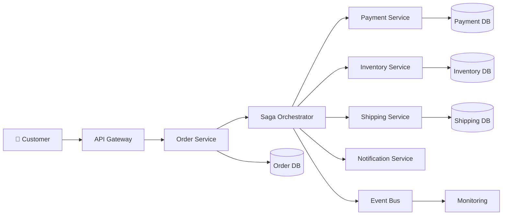
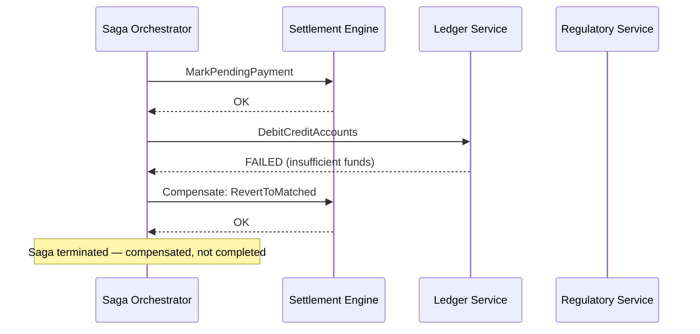
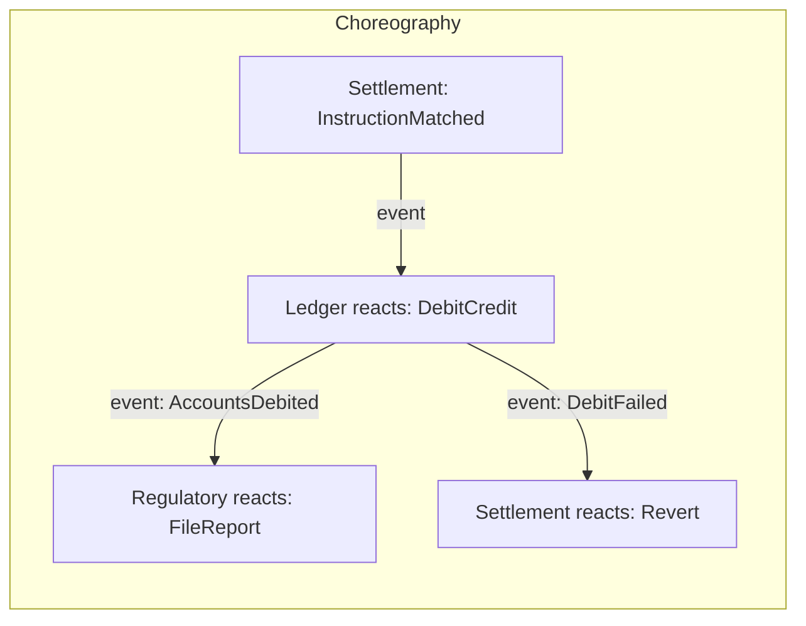
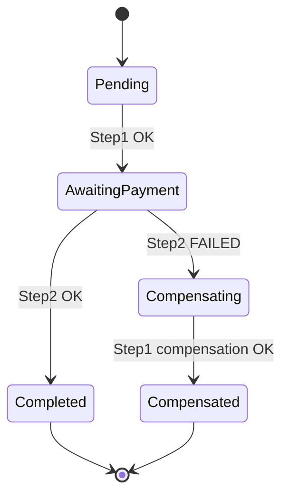
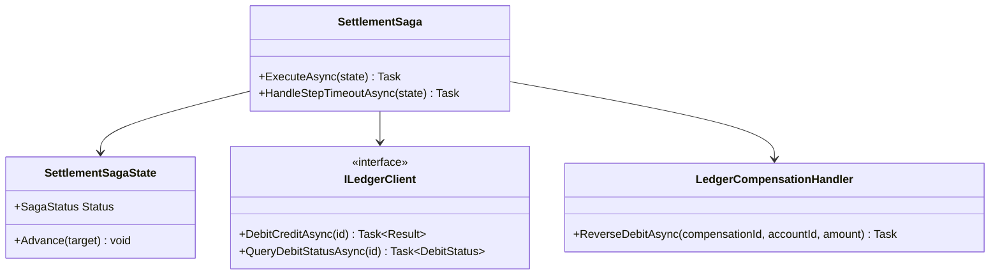
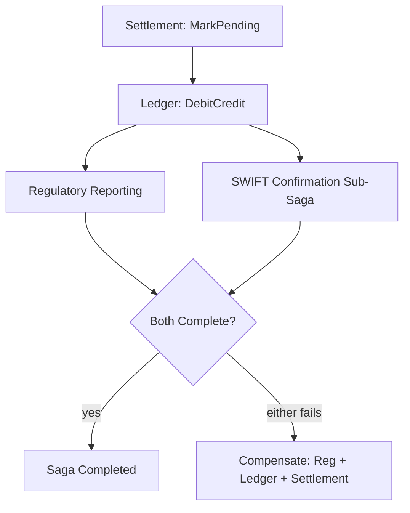
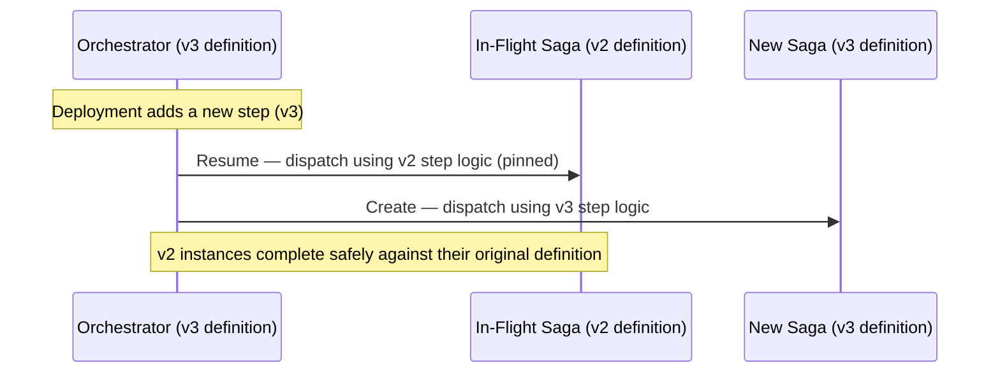
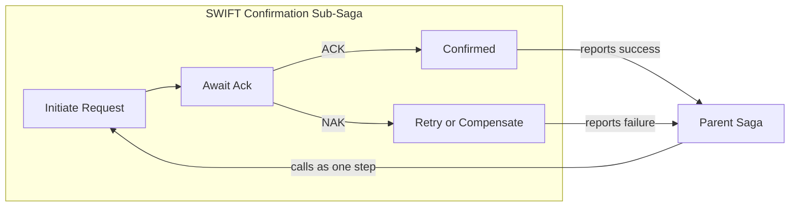
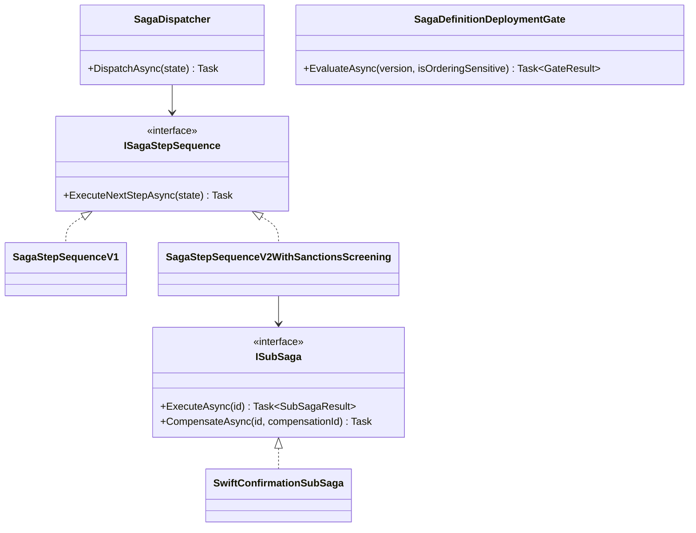

# Saga Pattern — Complete Interview Prep (All Topics, One File)

> Domain: Saga | Level: Beginner → Expert | Prerequisite: [[../16-Distributed-Systems/01-Distributed-Systems-Interview-Prep]] (2PC vs saga, idempotency), [[../18-Event-Driven-Architecture/01-EDA-Interview-Prep]] (choreography vs orchestration), [[../37-Outbox/01-Outbox-Interview-Prep]], [[../17-Microservices/00-Microservices-Interview-Master-Guide-DotNet-TechLead-Architect]] §8 and §37 (workflow engines)
> **Quick-prep edition** (consolidated 2026-10-03). This one file replaces Modules 123–124. Originals: `git show ebb2d5c:36-Saga/<file>.md`
> Each topic has: **Key concepts → C#/config example → Most common interview questions with answers.**

| # | Topic | # | Topic |
|---|---|---|---|
| 1 | Why sagas: the distributed transaction problem | 7 | Timeouts, liveness & stuck sagas |
| 2 | Orchestration vs choreography | 8 | Parallel branches & sub-sagas |
| 3 | Compensating transactions | 9 | Versioning sagas with instances in flight |
| 4 | Pivot transactions; forward vs backward recovery | 10 | Observability & tracing for sagas |
| 5 | Saga state persistence (orchestrator as aggregate) | 11 | Capstone: multi-party settlement |
| 6 | Idempotency & isolation anomalies (countermeasures) | 12 | Top 20 rapid-fire + Principal · 13 Mistakes checklist |

---

## 1. Why Sagas: the Distributed Transaction Problem

**Key concepts**
- With database-per-service, a business operation spanning services (order → payment → inventory → shipping) can't use one ACID transaction.
- **2PC/XA** gives atomicity but blocks on coordinator failure, couples availability, adds latency and isn't supported by most brokers/cloud DBs.
- **Saga** (Garcia-Molina & Salem, 1987): a sequence of **local transactions**, each committing in its own service; if a step fails, run **compensating transactions** for completed steps. Gives **ACD** (atomicity via compensation, consistency, durability) — **not isolation**.

**Common interview question**

**Q. Why sagas instead of distributed transactions?**
Sagas keep each service autonomous and available — each step commits locally — and achieve eventual business consistency through compensation, avoiding 2PC's blocking, coupling and lack of support in modern infrastructure. The price is no isolation between steps and the need to design compensations and idempotency.

---

## 2. Orchestration vs Choreography

| | Orchestration | Choreography |
|---|---|---|
| Control | central orchestrator sends commands, tracks state | services react to each other's events |
| Visibility | explicit flow, easy to see and change | implicit, spread across services |
| Coupling | services coupled to the orchestrator's commands | services coupled to each other's events |
| Failure handling | central: timeouts, compensations, retries | each service must know how to react/compensate |
| Best for | complex, critical, many-step flows (payments, settlement, onboarding) | simple flows with few steps, loosely related reactions |
| Tools | Temporal, MassTransit/NServiceBus sagas, Durable Functions, Step Functions, Camunda | broker + events (Kafka, Service Bus) |

```csharp
// Orchestrated saga with MassTransit state machine (abridged)
public sealed class OrderSaga : MassTransitStateMachine<OrderSagaState>
{
    public State Reserving { get; private set; } = null!;
    public State Charging  { get; private set; } = null!;
    public State Compensating { get; private set; } = null!;
    public Event<OrderPlaced> Placed { get; private set; } = null!;
    public Event<StockReserved> Reserved { get; private set; } = null!;
    public Event<PaymentCaptured> Captured { get; private set; } = null!;
    public Event<PaymentFailed> PaymentFailed { get; private set; } = null!;
    public Schedule<OrderSagaState, PaymentTimeout> PaymentTimeoutSchedule { get; private set; } = null!;

    public OrderSaga()
    {
        InstanceState(x => x.CurrentState);
        Event(() => Placed, e => e.CorrelateById(m => m.Message.OrderId));
        Schedule(() => PaymentTimeoutSchedule, s => s.TimeoutTokenId, s => s.Delay = TimeSpan.FromMinutes(5));

        Initially(When(Placed)
            .Then(c => { c.Saga.Amount = c.Message.Total; })
            .Send(c => new ReserveStock(c.Saga.CorrelationId, c.Message.Lines))
            .TransitionTo(Reserving));

        During(Reserving, When(Reserved)
            .Send(c => new CapturePayment(c.Saga.CorrelationId, c.Saga.Amount))
            .Schedule(PaymentTimeoutSchedule, c => new PaymentTimeout(c.Saga.CorrelationId))
            .TransitionTo(Charging));

        During(Charging,
            When(Captured).Unschedule(PaymentTimeoutSchedule).Publish(c => new OrderConfirmed(c.Saga.CorrelationId)).Finalize(),
            When(PaymentFailed).Send(c => new ReleaseStock(c.Saga.CorrelationId)).TransitionTo(Compensating),
            When(PaymentTimeoutSchedule!.Received).Send(c => new ReleaseStock(c.Saga.CorrelationId)).TransitionTo(Compensating));
    }
}
```

**Common interview question**

**Q. Choreography or orchestration for a payment flow?**
Orchestration — the flow is business-critical, needs explicit state, timeouts, compensations, audit and clear ownership. Non-critical reactions (emails, loyalty points, analytics) can be choreographed off the final events.

---

## 3. Compensating Transactions

**Key concepts**
- A compensation **semantically reverses** a completed step's business effect — it's not a database rollback: refund instead of "un-charge", release stock, cancel a booking, issue a credit note. Some effects can't be undone (an email was sent) → compensate with a correction/apology.
- Compensations must be **idempotent**, **retryable** (they can't be allowed to fail permanently — retry until success or escalate to humans), and **commutative** where possible (may arrive in odd orders).
- Order: compensate completed steps **in reverse order** (unless independent).
- Record what was done (step outputs like payment IDs) so compensations know what to reverse.

**Common interview questions**

**Q1. What if a compensation fails?**
Retry with backoff (they must be idempotent); if it keeps failing, park the saga in a "compensation failed" state, alert and route to manual operations with full context. Never silently drop it — that leaves money or inventory inconsistent.

**Q2. Compensation vs rollback?**
Rollback discards uncommitted changes inside one transaction. Compensation is a new business transaction that counteracts already-committed effects, visible to others in the meantime (e.g., a refund appears on the statement).

---

## 4. Pivot Transactions; Forward vs Backward Recovery

**Key concepts**
- Steps are **compensatable** (can be undone), the **pivot** (the go/no-go point: after it succeeds, the saga must complete), and **retryable** (after the pivot; guaranteed to eventually succeed with retries).
- **Order steps:** compensatable steps first, then the pivot, then retryable steps. Put **non-compensatable** actions (send money to a bank, ship goods, notify a regulator) **at or after the pivot**.
- **Backward recovery:** compensate completed steps (before the pivot). **Forward recovery:** keep retrying remaining steps to completion (after the pivot).

```text
1. Reserve inventory          (compensatable: release)
2. Authorize card             (compensatable: void authorization)
3. Capture payment / payout   (PIVOT — real money moves)
4. Create shipment            (retryable)
5. Send confirmation          (retryable)
```

**Common interview question**

**Q. A saga step can't be compensated. How do you design around it?**
Make it the pivot or move it after the pivot: do every reversible, failure-prone step first (validations, reservations, authorizations), then the irreversible action, then only retryable steps. If something after the pivot fails, use forward recovery (retries, manual intervention), not compensation.

---

## 5. Saga State Persistence (Orchestrator as Aggregate)

**Key concepts**
- The orchestrator's state (current step, data gathered, timestamps, attempts) is **persisted** — treat it like an aggregate with optimistic concurrency.
- Persisting state + sending the next command must be **atomic** → outbox (MassTransit/NServiceBus have saga + outbox support; Temporal persists history automatically).
- Correlation ID links all messages to the saga instance.
- Saga instances can live minutes to weeks (waiting for external events) → durable storage, not memory.

```csharp
public sealed class OrderSagaState : SagaStateMachineInstance, ISagaVersion
{
    public Guid CorrelationId { get; set; }
    public string CurrentState { get; set; } = default!;
    public decimal Amount { get; set; }
    public string? PaymentId { get; set; }
    public Guid? TimeoutTokenId { get; set; }
    public int Version { get; set; }                    // optimistic concurrency
}
// x.AddSagaStateMachine<OrderSaga, OrderSagaState>().EntityFrameworkRepository(r => { r.ConcurrencyMode = ConcurrencyMode.Optimistic; r.ExistingDbContext<SagaDbContext>(); });
// x.AddEntityFrameworkOutbox<SagaDbContext>(o => o.UseBusOutbox());
```

---

## 6. Idempotency & Isolation Anomalies (Countermeasures)

**Key concepts**
- Every step and compensation handler must be **idempotent** (messages are delivered at least once; orchestrators retry). Use command IDs, inbox tables, conditional updates.
- **Lack of isolation → anomalies:** lost updates, dirty reads (another saga reads an intermediate state), fuzzy reads.
- **Countermeasures** (Chris Richardson): **semantic lock** (a `PENDING`/`*_PENDING` state other operations respect), **commutative updates** (increments rather than overwrites), **pessimistic view** (reorder steps to minimize risk), **reread value** (check before acting), **version file** (record operations to reorder them), **by value** (choose mechanism by risk/amount).

**Common interview question**

**Q. Sagas have no isolation. How do you prevent anomalies?**
Use semantic locks (orders in `PENDING` can't be modified), commutative operations, re-reading state before critical steps, ordering steps so risky effects come later, and designing the UI/business rules to tolerate intermediate states.

---

## 7. Timeouts, Liveness & Stuck Sagas

- Every wait for an external event needs a **timeout** (scheduled message/timer) → compensate, retry, or escalate.
- Monitor **saga liveness:** instances per state, age of the oldest instance per state, compensation rates, failed/parked sagas — alert when instances stay in a state beyond its SLA.
- Provide operator tooling: inspect a saga's history, retry a step, force a transition, trigger compensation — with audit.

**Common interview question**

**Q. How do you detect sagas that are stuck?**
Track instances by state with timestamps, alert on the age of the oldest instance per state relative to expected durations, use timeouts on every wait, and dashboard parked/failed sagas with runbooks for operators.

---

## 8. Parallel Branches & Sub-Sagas

- **Parallel steps** (reserve stock and check fraud simultaneously) are fine only if **independent** (no step depends on another's result); the saga waits for all (fan-in) and compensates every completed branch on failure (order independent).
- **Sub-sagas:** a step that is itself a multi-step process (e.g., "settle with counterparty" involving several exchanges) → a child saga with its own state, signalling success/failure to the parent; compensation of the parent may require compensating the child as a whole.

---

## 9. Versioning Sagas with Instances in Flight

- Changing a saga definition while thousands of instances are mid-flight is the central hard problem.
- **Strategies:** version the definition and let existing instances finish on the old version (run both), **patching/versioning APIs** in workflow engines (Temporal `GetVersion`/patching, Durable Functions versioning), migrate state explicitly with a migration step for compatible changes, drain old instances before removing old code.
- Test new versions against recorded histories (replay tests).

**Common interview question**

**Q. How do you deploy a change to a saga with 10,000 in-flight instances?**
Version the definition: new instances use v2, existing ones complete on v1 (keep v1 code until drained), or use the engine's patching API with branch markers; only migrate in-flight state when the change is compatible and tested via replay. Monitor both versions until v1 reaches zero.

---

## 10. Observability & Tracing for Sagas

- Correlation ID on every message; trace context propagated; spans per step; saga state transitions logged as structured events.
- Dashboards: throughput per saga type, success/compensation/failure rates, step latency, instances per state, oldest instance age, DLQ for saga messages.
- Business audit: who/what/when for each step, especially for regulated flows.

---

## 11. Capstone: Multi-Party Settlement Orchestration

**Scenario:** a trade settles across a broker, a custodian, a clearing house and a cash ledger; each party confirms asynchronously; failures must be reconciled and auditable.

```text
Settlement saga (orchestrated, Temporal/durable state machine)
 ├─ Validate trade & SSIs                       (compensatable: cancel instruction)
 ├─ Parallel: reserve securities ║ reserve cash   (independent branches; compensate both on failure)
 ├─ Send settlement instruction to CSD           (PIVOT — external irreversible instruction)
 ├─ Await CSD confirmation (timeout T+1 cut-off) (on timeout → forward recovery: query status, escalate)
 ├─ Post ledger entries (idempotent by trade ID)  (retryable)
 └─ Notify parties / regulatory report            (retryable)
Reconciliation: end-of-day match of saga outcomes against CSD/custodian statements; breaks → ops queue
```

**Lessons:** irreversible external instructions as the pivot; parallel branches only when independent; timeouts tied to business cut-offs; idempotency keyed by trade ID; reconciliation because external parties are the source of truth; versioned definitions for regulatory changes.

---

## 12. Top 20 Rapid-Fire Questions + Principal Questions

1. **Saga?** Local transactions + compensations.
2. **ACID property lost?** Isolation.
3. **Orchestration?** Central coordinator with state.
4. **Choreography?** Event reactions, no coordinator.
5. **Payments?** Orchestration.
6. **Compensation?** Semantic reversal, not rollback.
7. **Compensation order?** Reverse.
8. **Compensation properties?** Idempotent, retryable.
9. **Pivot?** Point of no return.
10. **After pivot?** Forward recovery only.
11. **Non-compensatable steps?** At/after the pivot.
12. **State persistence?** Durable, with optimistic concurrency.
13. **State + next command atomic?** Outbox.
14. **Isolation countermeasure?** Semantic locks.
15. **Timeouts?** On every wait.
16. **Stuck sagas?** Age-per-state alerts.
17. **Parallel branches?** Only if independent.
18. **Versioning?** Run old version for in-flight instances.
19. **Tools?** Temporal, MassTransit, NServiceBus, Durable Functions, Step Functions.
20. **External truth?** Reconcile.

**Principal-level question**

**P. Hand-rolled sagas or a workflow engine?**
Hand-rolled message-based state machines (MassTransit) for a few short sagas; a durable workflow engine (Temporal/Durable Functions/Step Functions) when sagas are long-running, many, need timers and human steps, versioning and operator visibility. Decide on ownership and operational cost; record it in an ADR.

---

## 13. Mistakes Checklist (say why each is wrong)
- [ ] 2PC across services · choreographing complex money flows
- [ ] Irreversible steps before the pivot · compensations treated as rollbacks
- [ ] Non-idempotent steps/compensations · compensations that can fail permanently
- [ ] In-memory saga state · state update and command publish not atomic
- [ ] No timeouts · no monitoring of stuck/parked sagas
- [ ] Changing saga definitions without versioning in-flight instances
- [ ] Ignoring isolation anomalies · no reconciliation with external parties

---

## Architecture Diagrams (preserved from the original modules)

> All 14 Mermaid/ASCII diagrams from the original `36-Saga/` files, kept verbatim and grouped by source module. Originals: `git show ebb2d5c:36-Saga/<file>.md`.

### Module 123 — Saga: Orchestration vs. Choreography, Compensating Transactions & Distributed-Transaction Recovery
*Source: `01-SagaFundamentals-OrchestrationVsChoreography-CompensatingTransactions.md`*

**Saga Pattern (Distributed Transactions)**



**Orchestration Saga**

```text
Create Order
 │
 ▼
Saga Orchestrator
 │
 ▼
Reserve Inventory
 │
 ▼
Process Payment
 │
 ▼
Create Shipment
 │
 ▼
Send Notification
 │
 ▼
Order Completed
```

**Choreography Saga**

```text
Order Created Event
 │
 ▼
Inventory Service
 │
Inventory Reserved Event
 │
 ▼
Payment Service
 │
Payment Completed Event
 │
 ▼
Shipping Service
 │
Shipment Created Event
 │
 ▼
Notification Service
```

**Compensating Transaction**

```text
Order Created
 │
Reserve Inventory ✔
 │
Payment Failed ❌
 │
Compensation Starts
 │
Release Inventory
 │
Cancel Order
 │
Notify Customer
```

**Failure Recovery**

```text
Payment Timeout
 │
Retry (3 Times)
 │
───────────────
Success ✔
 │
Continue Saga

OR

Failure ❌
 │
Compensation
 │
Rollback Business State
```

**3. Visual Architecture**



**3. Visual Architecture**



**3. Visual Architecture**



**13. Low-Level Design**



### Module 124 — Saga: Capstone — Multi-Party Settlement Orchestration at Scale
*Source: `02-Capstone-MultiPartySettlementOrchestrationAtScale.md`*

**1. Fundamentals**

```text
Settlement (mark pending) → Ledger (debit/credit) → ┬→ Regulatory Reporting
 └→ SWIFT Confirmation
Both parallel branches must complete (or both compensate) before the saga is Completed.
```

**3. Visual Architecture**



**3. Visual Architecture**



**3. Visual Architecture**



**13. Low-Level Design**


