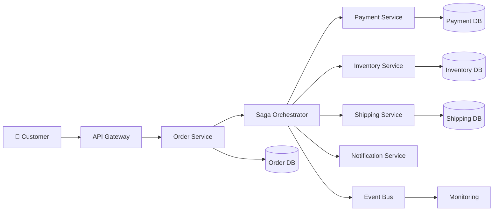
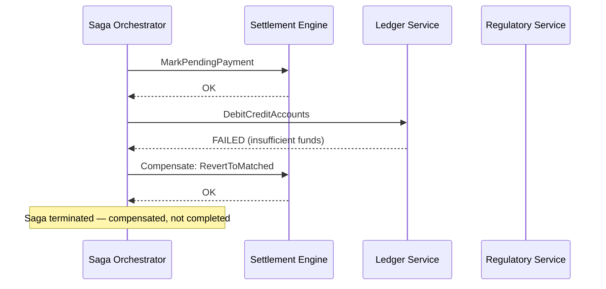
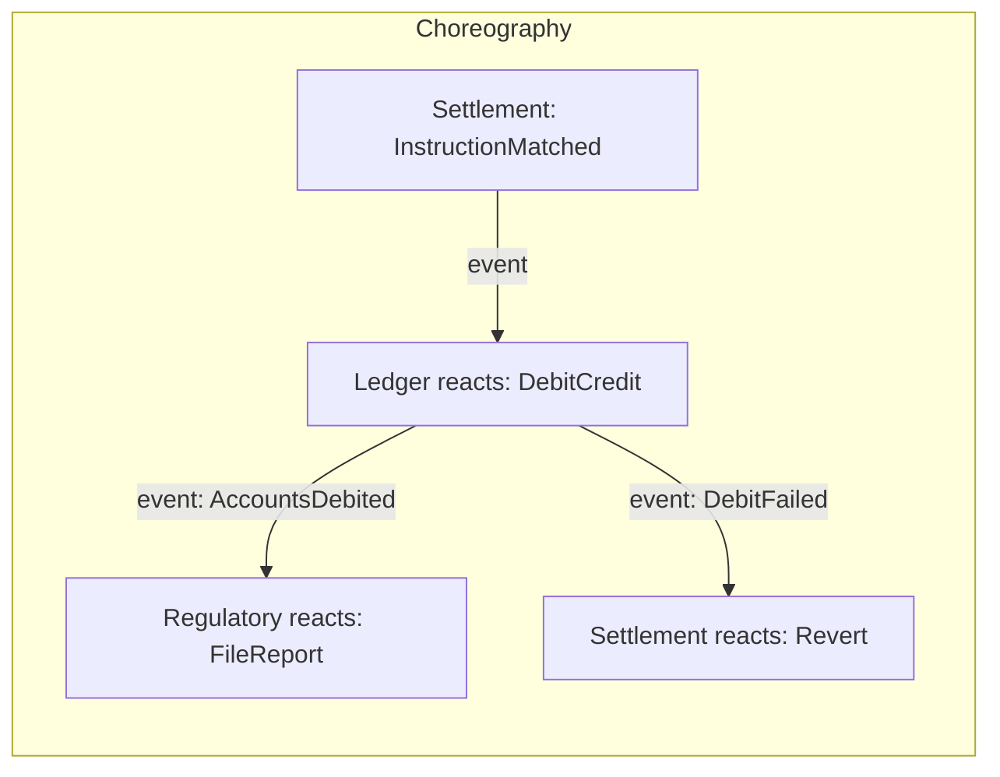
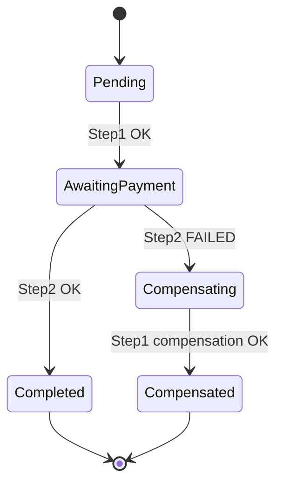
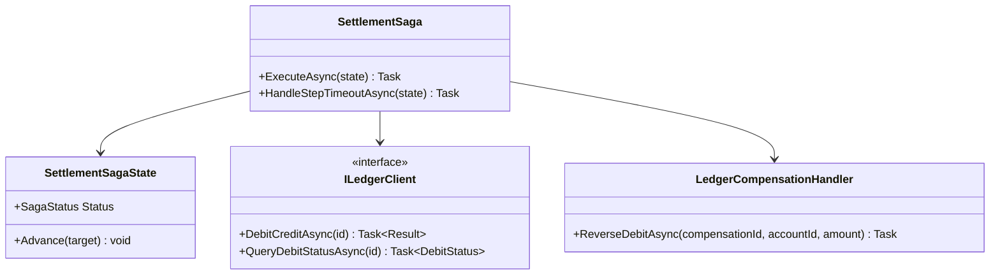

# Module 123 — Saga: Orchestration vs. Choreography, Compensating Transactions & Distributed-Transaction Recovery

> Domain: Saga | Level: Beginner → Expert | Prerequisite: [[../35-Event-Sourcing/02-Capstone-MigratingARegulatedAggregateToEventSourcingAtScale]] (the Settlement Engine's multi-step process now needs to coordinate across genuinely separate services/bounded contexts, not just within one Aggregate), [[../31-Domain-Driven-Design/03-DomainEvents-DomainServices-Repositories]] (Domain Events and the Outbox pattern, now the delivery mechanism between Saga steps), [[../30-Architecture-Patterns/*]] (Module 105's bounded-context/service-boundary decisions, which are exactly why a single ACID transaction can no longer span this whole process)
>
> **Domain scope note:** `36-Saga` is scoped to 2 modules (123–124, standard depth, autonomously scoped per the "no more waiting" workflow decision): this Fundamentals module and a capstone applying the Saga pattern to a full cross-system settlement-and-payment process. Full 16-section template; Elite FinTech Interview Panel lens.

---

# Saga Pattern (Distributed Transactions)



---

# Orchestration Saga

```text
Create Order
      │
      ▼
Saga Orchestrator
      │
      ▼
Reserve Inventory
      │
      ▼
Process Payment
      │
      ▼
Create Shipment
      │
      ▼
Send Notification
      │
      ▼
Order Completed
```

---

# Choreography Saga

```text
Order Created Event
        │
        ▼
Inventory Service
        │
Inventory Reserved Event
        │
        ▼
Payment Service
        │
Payment Completed Event
        │
        ▼
Shipping Service
        │
Shipment Created Event
        │
        ▼
Notification Service
```

---

# Compensating Transaction

```text
Order Created
      │
Reserve Inventory ✔
      │
Payment Failed ❌
      │
Compensation Starts
      │
Release Inventory
      │
Cancel Order
      │
Notify Customer
```

---

# Failure Recovery

```text
Payment Timeout
      │
Retry (3 Times)
      │
───────────────
Success ✔
      │
Continue Saga

OR

Failure ❌
      │
Compensation
      │
Rollback Business State
```

---

# Services

| Service | Responsibility |
|----------|----------------|
| Order | Create Order |
| Inventory | Reserve Stock |
| Payment | Charge Customer |
| Shipping | Arrange Delivery |
| Notification | Email/SMS |
| Saga | Coordinates Transaction |

## 1. Fundamentals

**What:** A Saga is a sequence of **local transactions**, each confined to one service/bounded context, coordinated so that if any step fails partway through, previously-completed steps are undone via their own explicit **compensating transactions** — since no single, distributed ACID transaction can span multiple independent services.

**Why:** A settlement process spanning the Settlement Engine (Module 116), a separate Ledger/Payment service, and a Regulatory Reporting service cannot use one database transaction across all three — each owns its own data store and transaction boundary (Module 105's bounded-context independence); a Saga is the pattern that provides transaction-like all-or-nothing semantics across that boundary anyway, via compensation rather than rollback.

**When:** Whenever a business process genuinely spans multiple independently-deployed services/bounded contexts and needs an "all steps succeed, or the effects of completed steps are undone" guarantee — not for a process fully contained within one Aggregate's own transaction boundary (Module 110's own transaction-scoping test already handles that simpler case).

**How (30,000-ft view):**
```
Step 1: Settlement Engine  — mark instruction "Pending Payment"     [compensating: revert to "Matched"]
Step 2: Ledger Service     — debit/credit accounts                   [compensating: reverse the entry]
Step 3: Regulatory Service — file transaction report                 [compensating: file a correction/void]

If Step 2 fails: run Step 1's compensation. If Step 3 fails: run Step 2's, then Step 1's compensations.
```

---

## 2. Deep Dive

### 2.1 Orchestration vs. Choreography — the Two Coordination Styles
**Orchestration:** a dedicated Saga orchestrator explicitly calls each step in sequence, tracks progress, and explicitly triggers compensations on failure — centralized, easy to observe and reason about the full flow, but the orchestrator becomes a genuine, coupled dependency every step must communicate through. **Choreography:** each service reacts to the previous step's Domain Event and publishes its own, with no central coordinator — fully decoupled (Module 118's symmetric-Adapter independence, reapplied here), but the *overall* saga flow exists nowhere as a single, readable artifact, making failure diagnosis and compensation-sequencing genuinely harder to reason about at scale.

### 2.2 Compensating Transactions — Semantic Reversal, Not Perfect Undo
A compensating transaction reverses a step's *business effect*, not necessarily its literal database state — reversing "debit $10,000 from Account A" isn't deleting that row, it's a new, explicit "credit $10,000 back to Account A" entry, itself an auditable, forward-moving action (directly Module 121's append-only, tamper-evident philosophy, reapplied to compensation specifically) — never a literal rollback of already-committed, potentially-already-visible-to-other-systems state.

### 2.3 Saga State Persistence — the Orchestrator's Own Aggregate
An orchestration-style Saga's own progress (which steps have completed, which compensations are pending) is itself persisted state — typically its own Aggregate (Module 110's own tactical-DDD discipline, applied to the Saga's coordination state itself), surviving an orchestrator-process restart mid-flow without losing track of exactly where the saga was.

### 2.4 Idempotency — Non-Negotiable at Every Step and Every Compensation
Directly Module 118 Advanced Q6/Module 119 §2.5's already-established idempotency discipline, now required at *every* saga step and *every* compensating action — a retried step (after a timeout, before confirming failure) must not double-apply its effect, and a retried compensation must not double-reverse an already-reversed effect.

### 2.5 Forward Recovery vs. Backward Recovery
Not every failure should trigger compensation — a transient failure (a momentary network blip) should first attempt **forward recovery** (retry the same step) per a bounded retry policy (Module 87's resilience patterns); only once retries are genuinely exhausted does the saga commit to **backward recovery** (compensating already-completed steps) — conflating these two responses (compensating on the first transient failure) wastes the compensation mechanism on recoverable blips.

### 2.6 Saga Timeout and Liveness Monitoring
A saga stuck mid-flow (a step's response never arrives, compensation never completes) is a genuinely dangerous state — directly Module 94's alert-liveness-canary discipline, reapplied here: a saga's own "am I stuck" timeout and monitoring is not optional, since an indefinitely-stuck saga can leave a business process in a permanently inconsistent, partially-completed state with no automatic resolution.

---

## 3. Visual Architecture







---

## 4. Production Example

**Problem:** The Settlement Engine (Module 116/121) needed to coordinate a full settlement-to-payment flow spanning itself, a separately-owned Ledger service, and Regulatory Reporting — three genuinely independent services, no shared database, no possibility of one ACID transaction.

**Architecture:** An orchestration-style Saga (§2.1) with its own persisted state Aggregate (§2.3), explicitly calling each service in sequence and triggering compensations on failure.

**Implementation:** The Ledger service's compensating "reverse the debit" action was implemented as a direct, literal reversal of the specific debit entry, assuming it would only ever be called once per failed saga instance.

**Trade-offs:** Orchestration was chosen over choreography specifically for this financial process because its explicit, centrally-observable flow gave compliance/audit reviewers a single, readable artifact describing the entire cross-system transaction sequence — directly valuable for exactly the kind of regulatory scrutiny (Module 116/118) this domain has repeatedly emphasized, at the cost of the orchestrator becoming a coupled dependency every step communicates through.

**Lessons learned:** During a network partition, the orchestrator's own timeout fired and triggered compensation for a Ledger debit whose actual response had merely been delayed, not truly failed — the Ledger service's debit had, in fact, succeeded, and its non-idempotent compensating "reverse the debit" action then ran a second time when the orchestrator, still confused about the saga's true state after the partition healed, retried the compensation step it believed hadn't yet succeeded — double-reversing a single debit and crediting the account twice. This is §2.4's exact predicted risk (non-idempotent compensation), compounded by §2.6's timeout-versus-genuine-failure ambiguity (§2.5's forward-vs-backward-recovery distinction not being cleanly resolved before compensating). The fix: made every compensating action idempotent via its own tracked, unique compensation-id (directly Module 119 §2.5's idempotent-projection technique, reapplied to compensation), and required the orchestrator to first *query* a step's actual, current status from the target service (not merely assume failure from its own timeout) before committing to compensation — resolving the forward/backward-recovery ambiguity with an authoritative status check rather than an assumption.

---

## 5. Best Practices
- Make every saga step and every compensating action idempotent from day one, via a tracked, unique operation ID — never assume "compensation only runs once" (§2.4, §4).
- Before compensating on a timeout, query the target service's actual current status rather than assuming failure — resolve forward-vs-backward recovery with real information, not an assumption (§2.5, §4).
- Persist saga state as its own Aggregate, surviving an orchestrator restart mid-flow (§2.3).
- Monitor saga liveness explicitly — a stuck, un-timed-out saga is a genuinely dangerous, silent failure mode (§2.6).
- Choose orchestration when centralized observability/auditability matters most (regulated flows, §4); choose choreography when maximal service decoupling matters most and the flow is simple enough to reason about without a central artifact.

## 6. Anti-patterns
- A compensating transaction assumed to run at most once, with no idempotency protection (§4's incident).
- Compensating immediately on any transient failure without first attempting bounded forward-recovery retries (§2.5).
- Treating a saga's own coordination state as ephemeral, in-memory-only state that's lost on an orchestrator restart.
- No saga-liveness monitoring, allowing a genuinely stuck saga to remain silently, indefinitely unresolved (§2.6).
- Using choreography for a regulated, audit-sensitive flow where a single, centrally-reviewable process artifact is specifically valuable (§4).

---

## 7. Performance Engineering

**CPU/Memory:** Saga orchestration overhead is typically small relative to each step's own network round-trip cost — the orchestrator's own state-machine logic is lightweight.

**Latency:** End-to-end saga latency is the sum of each step's latency plus any retry/backoff delays (§2.5) — track this explicitly, since a saga spanning three services inherits three separate latency budgets and failure modes.

**Throughput:** Orchestrator throughput scales with how many concurrent saga instances it manages — a single, shared orchestrator process becomes a genuine scaling concern at high saga-initiation volume, motivating horizontal orchestrator scaling partitioned by saga instance ID.

**Scalability:** Choreography scales more naturally without a central coordinator bottleneck; orchestration requires deliberate horizontal scaling of the orchestrator tier itself.

**Benchmarking:** Load-test the full saga flow under realistic peak initiation rates, including a realistic proportion of failure/compensation scenarios — not only the happy path, since compensation logic is exactly the path most likely to be under-exercised in ordinary testing.

**Caching:** Not typically a primary concern for saga coordination logic itself, though each individual step's own service may apply its own caching independently.

---

## 8. Security

**Threats:** A compromised or buggy orchestrator triggering unauthorized compensating actions across multiple services; a replayed or forged saga-step-completion message triggering an incorrect state transition.

**Mitigations:** Each service receiving a saga-step command or compensation request independently authenticates and authorizes it (never trusting "the orchestrator said so" as sufficient authorization on its own) — directly Module 119 §8's "CQRS separates models, not security boundaries" principle, reapplied here as "Saga coordination doesn't imply implicit trust between steps."

**OWASP mapping:** Broken Authentication/Authorization risk if a service accepts a saga-step command without independently verifying the orchestrator's identity and the request's own legitimacy.

**AuthN/AuthZ:** Each service's saga-step handler enforces its own authorization logic identically to any other command it receives — a saga-initiated command is not a lower-scrutiny path.

**Secrets:** Orchestrator-to-service credentials managed and rotated per Module 86's established discipline, no different from any other inter-service credential.

**Encryption:** Saga-coordination messages (containing financial transaction details) require the same in-transit encryption standard as any other regulated financial message.

---

## 9. Scalability

**Horizontal scaling:** Orchestrator instances scale horizontally, partitioned by saga instance ID, ensuring each individual saga's steps remain correctly sequenced by exactly one orchestrator instance at a time (directly Module 118/119's partition-keying pattern, reapplied here).

**Vertical scaling:** Less relevant than horizontal partitioning for orchestrator scaling.

**Replication:** Saga state (§2.3) requires the same durability/replication rigor as any other authoritative Aggregate state, given its role in ensuring compensation can always correctly complete.

**Load balancing:** Choreography-style sagas load-balance naturally via each service's own independent event consumption; orchestration requires partition-aware routing to the correct orchestrator instance owning a given saga.

**High Availability:** An orchestrator instance's failure mid-saga must not lose track of in-flight sagas — §2.3's persisted saga state is exactly what allows a replacement instance to resume correctly.

**Disaster Recovery:** Saga state, being itself a persisted Aggregate, is recoverable via the same DR mechanisms (Module 110/121) already established for any Aggregate.

**CAP theorem:** Saga coordination state favors consistency (Module 110's CP reasoning) — an orchestrator acting on a stale, incorrect view of saga progress risks double-execution or missed compensation, both genuinely severe correctness failures.

---

## 10. Interview Questions

### Basic (10)

1. **Q: Why can't a single ACID transaction span the Settlement Engine, Ledger, and Regulatory services?**
   **A:** Each owns its own, independent data store and transaction boundary (Module 105) — no shared database transaction can span genuinely separate services.
   **Why correct:** States the specific structural reason distributed ACID transactions aren't available here.
   **Common mistakes:** Assuming a distributed-transaction protocol (e.g., two-phase commit) is a practical, commonly-used alternative — it exists but is rarely used in practice for exactly the availability/coupling reasons Sagas avoid.
   **Follow-ups:** "What does a Saga provide instead of true ACID atomicity?" (All-or-nothing business effect via forward completion or full compensation, §1.)

2. **Q: What is a compensating transaction?**
   **A:** An explicit, business-meaningful action reversing a completed step's effect — not a literal database rollback.
   **Why correct:** States the precise, defining property (semantic reversal, not rollback) per §2.2.
   **Common mistakes:** Assuming compensation deletes or reverts the original record in place.
   **Follow-ups:** "Give a concrete example." (A "credit back" entry reversing a "debit," itself a new, auditable action, §2.2.)

3. **Q: What's the difference between orchestration and choreography?**
   **A:** Orchestration uses a central coordinator explicitly sequencing steps; choreography has each service reacting independently to prior events with no central coordinator (§2.1).
   **Why correct:** States both models' defining, distinguishing mechanism.
   **Common mistakes:** Assuming one is strictly better than the other regardless of context (§15 develops the actual trade-off).
   **Follow-ups:** "Which style did the Settlement Engine's saga use, and why?" (Orchestration, for centralized auditability, §4.)

4. **Q: Why must every saga step be idempotent?**
   **A:** A step might be retried after a timeout before failure is confirmed; a non-idempotent step could double-apply its effect on retry.
   **Why correct:** States the specific mechanism (retry-before-confirmed-failure) requiring idempotency.
   **Common mistakes:** Assuming idempotency only matters for the "happy path" steps, not compensations too (§4's incident shows compensations need it equally).
   **Follow-ups:** "Does compensation need idempotency too?" (Yes — exactly as much, §2.4/§4.)

5. **Q: What is "forward recovery" versus "backward recovery"?**
   **A:** Forward recovery retries the same failed step; backward recovery compensates already-completed steps (§2.5).
   **Why correct:** States both recovery strategies and their distinct triggering conditions.
   **Common mistakes:** Compensating immediately on any failure without first attempting bounded forward-recovery retries.
   **Follow-ups:** "When should a saga escalate from forward to backward recovery?" (Once a bounded retry policy is genuinely exhausted, not on the first transient failure, §2.5.)

6. **Q: Why does an orchestration-style saga need its own persisted state?**
   **A:** So an orchestrator-process restart mid-flow doesn't lose track of which steps completed and which compensations are pending (§2.3).
   **Why correct:** States the specific durability requirement and its purpose.
   **Common mistakes:** Assuming saga progress can safely be held only in the orchestrator's in-memory state.
   **Follow-ups:** "How is this saga state typically modeled?" (As its own Aggregate, Module 110's discipline reapplied, §2.3.)

7. **Q: Why is saga-liveness monitoring necessary?**
   **A:** A saga stuck mid-flow, with no timeout firing, can leave a business process permanently, silently inconsistent (§2.6).
   **Why correct:** States the specific, severe consequence this monitoring gap risks.
   **Common mistakes:** Assuming a saga will always either complete or fail cleanly without explicit, monitored timeout handling.
   **Follow-ups:** "What course-wide principle does this directly reapply?" (Module 94's alert-liveness-canary discipline, §2.6.)

8. **Q: Does choosing orchestration over choreography change which service enforces authorization for a given saga step?**
   **A:** No — each service independently authorizes every saga-related request it receives, regardless of coordination style (§8).
   **Why correct:** Correctly reapplies Module 119 §8's "separates models/coordination, not security boundaries" principle.
   **Common mistakes:** Assuming a request routed through a trusted orchestrator needs less scrutiny than a direct request.
   **Follow-ups:** "What OWASP risk would an under-authorized saga-step handler represent?" (Broken Authentication/Authorization, §8.)

9. **Q: Can a choreography-style saga's overall flow be read from any single artifact?**
   **A:** No — it exists only implicitly, distributed across each service's own independent event-reaction logic (§2.1).
   **Why correct:** States the specific, genuine cost choreography's decoupling introduces.
   **Common mistakes:** Assuming choreography's decoupling benefit comes with no corresponding cost.
   **Follow-ups:** "Why did this matter for choosing orchestration in §4's case study?" (Regulatory/audit review specifically valued one centrally-readable process artifact, §4.)

10. **Q: What does "the orchestrator becomes a coupled dependency" mean, as a cost of orchestration?**
    **A:** Every step communicates through the orchestrator, meaning its availability and correctness become a shared dependency for the entire saga flow, unlike choreography's fully independent, peer-to-peer event reactions.
    **Why correct:** States the specific coupling cost orchestration trades against its centralized-observability benefit.
    **Common mistakes:** Assuming orchestration has no genuine cost relative to choreography.
    **Follow-ups:** "How is this cost mitigated?" (Horizontal orchestrator scaling and HA, per persisted saga state, §9.)

### Intermediate (10)

1. **Q: Walk through exactly how §4's double-reversal incident occurred, mechanically.**
   **A:** A network partition delayed (not failed) the Ledger's debit response; the orchestrator's timeout fired and triggered compensation prematurely; the Ledger's debit had actually succeeded, so the compensating "reverse debit" ran once, correctly reversing it — but when the orchestrator, confused post-partition, retried the compensation step believing it hadn't yet succeeded, the non-idempotent compensation ran a second time, crediting the account twice.
   **Why correct:** Traces the precise mechanical sequence (delayed-not-failed response, premature compensation, then non-idempotent retry) rather than a vague "something went wrong with retries."
   **Common mistakes:** Attributing the incident solely to the network partition itself, missing that the actual root causes were the premature compensation trigger AND the non-idempotent compensation logic, both independently necessary conditions for the double-crediting to occur.
   **Follow-ups:** "Would idempotent compensation alone have prevented this incident?" (Yes — even with the premature compensation trigger, an idempotent compensating action would have safely no-op'd on the second, redundant attempt.)

2. **Q: Why does querying the target service's actual current status (§4's fix) resolve the forward-vs-backward-recovery ambiguity better than relying on the orchestrator's own timeout alone?**
   **A:** A timeout only indicates "no response was received in time" — it says nothing about whether the underlying operation actually succeeded, failed, or is still in progress; querying actual status replaces this ambiguous inference with a definitive, authoritative answer before committing to the (potentially wrong, and consequential) decision to compensate.
   **Why correct:** States the specific epistemic gap (timeout ≠ actual outcome) the status-query fix closes.
   **Common mistakes:** Assuming a timeout is reliable evidence of actual failure, rather than merely evidence of a delayed or lost response.
   **Follow-ups:** "What if the target service itself is unreachable for the status query too?" (A genuinely harder case — the saga must have its own bounded escalation policy, e.g., a longer wait-and-retry period before defaulting to compensation as a last resort, accepting some residual risk in this specific, rarer scenario.)

3. **Q: Critique a choreography-style saga design where a service's reaction to an event directly, synchronously calls another service rather than publishing its own event.**
   **A:** This reintroduces synchronous, tightly-coupled inter-service calling within what's supposed to be a fully event-driven, decoupled choreography — if the directly-called service is slow or unavailable, the calling service's own event-handling thread blocks, exactly the thread-pool-starvation risk (Module 118 §14) this course has already established, now specific to a choreography implementation that isn't genuinely choreographed at all.
   **Why correct:** Identifies the specific way this design defeats choreography's own decoupling premise and connects the concrete risk to an already-established incident pattern.
   **Common mistakes:** Assuming any event-triggered reaction automatically qualifies as "choreography" regardless of whether the reaction itself makes synchronous, blocking downstream calls.
   **Follow-ups:** "What's the correct choreography-consistent alternative?" (The reacting service publishes its own event; any further downstream service reacts to that event independently and asynchronously, never a direct, synchronous call.)

4. **Q: Why is saga state modeled as its own Aggregate (§2.3) rather than simply tracked as a row updated in place by each step?**
   **A:** Module 110's tactical-DDD discipline applies identically here — the saga's own state transitions (Pending → AwaitingPayment → Completed/Compensating → Compensated) are genuine business-rule-governed invariants (e.g., "compensation can only be triggered from AwaitingPayment, never from Completed"), warranting the same Aggregate-based invariant-enforcement treatment as any other business entity, not a simple, unvalidated status field.
   **Why correct:** Correctly reapplies Module 110's own Aggregate-justification test to the saga's coordination state specifically.
   **Common mistakes:** Treating saga state as "just infrastructure bookkeeping" rather than recognizing its own genuine, business-meaningful invariants warranting the identical tactical-DDD rigor.
   **Follow-ups:** "What invariant would this Aggregate need to enforce, concretely?" (E.g., rejecting an attempt to mark a step "completed" if the saga's current state isn't the specific, expected prior state — an ordering invariant identical in spirit to Module 110's own state-machine-enforcing Aggregates.)

5. **Q: How would you decide, for a new cross-service business process, whether to model it as a Saga at all, versus accepting eventual consistency without formal compensation?**
   **A:** Ask whether a partially-completed process (some steps done, others not) represents a genuinely unacceptable business state requiring active, explicit reversal — or whether the business can tolerate and separately reconcile a partial completion without formal compensation (e.g., a non-critical, easily-manually-correctable side effect); the Settlement/Ledger/Regulatory process specifically requires formal Saga treatment because a partial completion (money debited, but settlement never actually released) is a genuinely unacceptable, high-stakes financial state.
   **Why correct:** Gives a concrete decision test (is partial completion genuinely unacceptable, high-stakes) rather than assuming every multi-service process automatically warrants full Saga machinery.
   **Common mistakes:** Adopting Sagas reflexively for every cross-service process regardless of whether partial completion's actual business consequence justifies the added compensation-design complexity — this course's now-repeated over-application caution, applied to Saga adoption specifically.
   **Follow-ups:** "Give an example of a cross-service process that likely does NOT need a formal Saga." (A non-critical notification-and-logging side effect where a missed or partial step has low, easily-tolerated consequence — eventual consistency alone, without formal compensation, is likely sufficient.)

6. **Q: Why must a compensating transaction itself be designed as carefully as the original, forward-moving step — not treated as an afterthought?**
   **A:** §4's incident demonstrates a compensating action can itself fail, be retried, or need to handle concurrent/duplicate invocation exactly like any other business operation — it's not a special, lower-rigor code path, but a genuine business operation in its own right requiring the same idempotency, testing, and failure-handling discipline as the step it reverses.
   **Why correct:** States the specific, demonstrated reason (§4's own incident) compensation logic deserves equal design rigor.
   **Common mistakes:** Writing compensating-transaction logic as a quick, minimally-tested addition since it's "just for the failure case," missing that failure cases are exactly where correctness matters most.
   **Follow-ups:** "What testing discipline would you apply to a compensating transaction, given this?" (The identical adversarial, edge-case unit-testing rigor Module 110 established for Aggregate invariants generally — including explicit tests for double-invocation/idempotency.)

7. **Q: How does this module's saga-liveness monitoring (§2.6) relate to Module 94's alert-liveness-canary discipline specifically?**
   **A:** Both address the identical underlying risk — a monitoring/safety mechanism that's silently not firing (or, here, a process silently stuck with no timeout ever triggering) provides false confidence that everything is fine; a saga-liveness monitor is the direct, saga-specific instance of Module 94's already-established "verify the alerting/safety mechanism is itself actually, continuously working" principle.
   **Why correct:** Correctly connects this module's specific concern to Module 94's already-established, more general principle rather than treating saga-liveness monitoring as an unrelated, novel concept.
   **Common mistakes:** Treating saga timeout/monitoring as a standalone, saga-specific best practice without recognizing its direct kinship to this course's broader, recurring "verify the verifier" theme.
   **Follow-ups:** "What would a saga-liveness canary concretely look like?" (A deliberately-injected, synthetic saga instance periodically run through a test path, confirming its own timeout/monitoring mechanism actually fires as expected — directly Module 99's security-scanner-liveness-canary technique, reapplied here.)

8. **Q: Critique a design where every saga step's compensating action is a generic, reusable "undo the last database write" mechanism applied uniformly across every step type.**
   **A:** This assumes compensation is a purely technical, mechanical database-level reversal — but §2.2 established compensation must be a *business-meaningful* semantic reversal, which a generic, uniform "undo" mechanism cannot express (a debit's correct compensation is a credit entry, an audit-relevant, forward-moving business action, not a literal row-level undo); each step's compensating action requires its own, deliberately-designed business logic, not a one-size-fits-all technical mechanism.
   **Why correct:** Identifies the specific mismatch between a generic technical "undo" and this pattern's actual, business-semantic compensation requirement.
   **Common mistakes:** Assuming compensation is conceptually equivalent to a database transaction rollback, missing the deliberate, business-meaningful design each specific compensating action actually requires.
   **Follow-ups:** "What would a generic 'undo' mechanism specifically fail to handle correctly for a debit/credit compensation?" (The audit trail — a literal row-level undo would erase the fact a debit ever occurred, whereas the correct compensating credit entry preserves a complete, honest historical record of both the original debit and its reversal, directly Module 121's append-only philosophy.)

9. **Q: How would you decide the specific timeout duration for a given saga step, avoiding both premature compensation (§4's incident) and unacceptably slow failure detection?**
   **A:** Calibrate to that specific downstream service's own measured, realistic P99 response-time distribution under normal load (not an arbitrary, uniform default across every step) with sufficient margin to avoid triggering on ordinary tail latency, while remaining tight enough that a genuine failure is detected within an acceptable business-process latency budget — directly reapplying Module 118 §7's own workload-specific latency-budgeting discipline to saga-step-timeout calibration specifically.
   **Why correct:** Gives a concrete, per-step, measurement-based calibration approach rather than an arbitrary, uniform timeout default.
   **Common mistakes:** Applying one, uniform timeout value across every saga step regardless of each downstream service's own genuinely different latency characteristics.
   **Follow-ups:** "What would too-short a timeout risk, beyond §4's premature-compensation incident?" (Unnecessary compensation-and-retry cycles for operations that were actually going to succeed just slightly slower than the timeout allowed, wasting resources and potentially causing exactly the kind of confusion §4's incident demonstrated.)

10. **Q: Synthesize how this module's Saga pattern relates to Module 121's Event Sourcing and Module 111's original Domain Event/Outbox pattern.**
    **A:** A choreography-style saga is, in essence, Module 111's Domain-Event-and-Outbox-based cross-Aggregate reaction pattern extended across service boundaries rather than within a single bounded context; an orchestration-style saga's own persisted state (§2.3) can itself be built as an Event-Sourced Aggregate (Module 121), gaining the identical tamper-evident, replayable history benefit for the saga's own coordination decisions — meaning this module doesn't introduce a wholly new persistence or event-delivery mechanism, but composes patterns this course has already fully established (Domain Events, Outbox, optionally Event Sourcing) at the specific, new scope of cross-service business-process coordination.
    **Why correct:** Correctly identifies Saga as a composition of already-established patterns applied at a new scope, rather than an entirely novel mechanism, precisely reflecting this course's cross-module synthesis discipline.
    **Common mistakes:** Treating Saga as requiring genuinely new underlying technology or mechanisms distinct from Domain Events/Outbox/Event Sourcing, rather than recognizing it as their composition at the cross-service coordination layer.
    **Follow-ups:** "Would you recommend Event-Sourcing a saga's own coordination state for every saga, or selectively?" (Selectively — directly Module 121 §15's calibration principle, reapplied: only for sagas whose own coordination history has genuine, ongoing audit value, such as this module's regulated financial settlement flow specifically.)

### Advanced (10)

1. **Q: Diagnose §4's incident from first principles and design the complete, structural fix preventing this exact class of error in any future saga step.**
   **A:** Root cause: two independent gaps combined — (1) the orchestrator compensated based on an ambiguous timeout rather than a definitive status check, and (2) the compensating action itself was non-idempotent. Fix: (1) mandate every saga step's failure-handling logic first attempt an authoritative status query against the target service before compensating (Intermediate Q2), never compensating on timeout-inference alone; (2) mandate every compensating action be idempotent via a tracked, unique compensation-operation ID (§5), enforced by a fitness function (Module 106, reapplying an already-established mechanism) asserting every compensation handler checks for prior execution before applying its effect.
   **Why correct:** Identifies both independently-necessary root causes and a two-part structural fix for each, rather than addressing only one contributing factor.
   **Common mistakes:** Fixing only the idempotency gap or only the status-query gap, missing that §4's incident specifically required both conditions to combine to actually produce the double-crediting outcome.
   **Follow-ups:** "Would fixing only one of the two gaps have been sufficient to prevent this specific incident?" (Yes, either alone would have prevented this specific occurrence — but both are independently necessary for robust protection against the broader class of similar future incidents, since either gap alone remains a genuine risk in a different scenario.)

2. **Q: A team proposes eliminating the orchestrator's own persisted state (§2.3), relying instead on always re-querying every downstream service's actual current status on orchestrator restart to reconstruct saga progress. Evaluate this proposal.**
   **A:** This trades a straightforward, authoritative local state read for a slower, more complex, and less reliable reconstruction process dependent on every downstream service correctly, consistently reporting its own current status — and doesn't eliminate the need for the orchestrator to track *which compensations are pending or in-flight*, information that may not be fully reconstructable from downstream services' own state alone (a service might correctly report "my step succeeded" with no way to convey "but a compensation was requested and is in progress"); persisted saga state remains the more robust, simpler design.
   **Why correct:** Identifies the specific information (compensation-in-progress state) downstream services' own status alone may not fully capture, undermining this proposal's completeness.
   **Common mistakes:** Assuming downstream services' own state is always sufficient to fully reconstruct saga progress, missing the saga-specific coordination information (which compensations are pending) that exists nowhere else but the saga's own state.
   **Follow-ups:** "Is there any legitimate use for a status-reconciliation mechanism alongside persisted saga state?" (Yes — as a defense-in-depth verification (directly this course's recurring reconciliation pattern, Module 120/121) confirming persisted saga state still matches downstream services' actual reality, not as a replacement for persisting saga state at all.)

3. **Q: Critique a choreography-style saga where a service publishes its own reaction event *before* its own local transaction has actually committed.**
   **A:** This risks publishing a "step completed" event for a change that might still fail to commit (a database constraint violation, a concurrency conflict) after the event has already been published and potentially acted upon by a downstream service — directly Module 111 Advanced Q2's Outbox-pattern rationale (never publish before the local transaction's own success is durably confirmed), now specifically relevant to choreography-style saga correctness, since a prematurely-published event here could trigger a downstream step reacting to a change that, from the persisted data's perspective, never actually, durably happened.
   **Why correct:** Directly reapplies Module 111's already-established Outbox-ordering principle to this specific choreography-saga risk, rather than treating it as an unrelated, new concern.
   **Common mistakes:** Assuming event-publishing order relative to local transaction commit is a minor implementation detail rather than a genuine correctness requirement with the identical stakes Module 111 already established.
   **Follow-ups:** "What mechanism specifically prevents this?" (The Outbox pattern, Module 111 Advanced Q2 — writing the event to the outbox within the same local transaction as the state change, guaranteeing the event is only ever durably recorded alongside a genuinely successful commit.)

4. **Q: Design a load-testing methodology specifically validating that compensation logic behaves correctly under realistic failure-injection conditions, not merely happy-path saga completion.**
   **A:** Deliberately inject failures at each specific saga step during load testing (a chaos-engineering-style approach) at a realistic proportion matching production failure rates, verifying compensation triggers correctly, completes idempotently even under retry, and the saga's own state correctly reflects "compensated" rather than silently stalling — directly extending Module 118 §7's "test the actual constrained condition" discipline to specifically exercise the compensation path, which ordinary happy-path load testing would never sufficiently stress.
   **Why correct:** Correctly identifies that compensation logic — precisely the path most likely to be under-tested — requires deliberate, injected-failure testing, not incidental coverage from happy-path load tests.
   **Common mistakes:** Load-testing only successful saga completions, leaving compensation logic effectively untested until a real production failure exercises it for the first time (exactly §4's own incident's underlying gap).
   **Follow-ups:** "What specific failure-injection scenario would have caught §4's incident before it reached production?" (Deliberately injecting a delayed-but-eventually-successful response (not an outright failure) specifically, to test whether the orchestrator correctly distinguishes "slow" from "failed" before compensating.)

5. **Q: How would you handle a scenario where a saga's compensation for an already-completed step itself fails, and retrying the compensation also fails repeatedly?**
   **A:** Escalate to a durable, explicitly-tracked "manual intervention required" state on the saga's own Aggregate (§2.3) after a bounded number of automated compensation-retry attempts — never silently, indefinitely retrying a failing compensation forever, nor silently giving up and leaving the saga's state ambiguous; this manual-intervention state should itself trigger monitoring/alerting (§2.6's liveness principle) ensuring a human operator is promptly notified of the genuinely exceptional, unresolved situation.
   **Why correct:** Gives a concrete, bounded escalation path (automated retry, then explicit manual-intervention state with alerting) rather than either infinite silent retry or an ambiguous, unmonitored failure state.
   **Common mistakes:** Assuming compensation, being itself a "fix" for a failure, cannot itself fail in a way requiring further escalation — treating compensation as an infallible backstop rather than a genuine operation with its own failure modes requiring its own handling.
   **Follow-ups:** "What would this manual-intervention state's alert need to convey to be actionable?" (The specific saga instance, the specific step whose compensation failed, and the specific business-state discrepancy requiring manual resolution — enough concrete detail for an operator to act without needing to independently reconstruct the full saga history from scratch.)

6. **Q: A regulator asks how this saga's compensation logic ensures no financial transaction is ever left in a genuinely ambiguous, "possibly-completed-possibly-not" state indefinitely. How would you answer, citing this module's specific mechanisms?**
   **A:** Cite the layered mechanisms directly: authoritative status-querying before compensating (Advanced Q1) closes the ambiguous-timeout risk specifically; idempotent, uniquely-tracked compensating actions (§5) ensure repeated compensation attempts never produce an incorrect, duplicated reversal; the bounded-retry-then-manual-intervention escalation path (Advanced Q5) ensures no saga can remain in an unresolved, unmonitored state indefinitely without triggering explicit human attention; and saga-liveness monitoring (§2.6) provides the continuous, mechanical verification (this course's central theme) that these safeguards are genuinely, currently operating, not merely designed to operate.
   **Why correct:** Synthesizes every specific mechanism this module established into one coherent, honest answer addressing the regulator's genuine concern, directly reapplying this course's "declared ≠ actual, requires continuous verification" theme to this module's own highest-stakes claim.
   **Common mistakes:** Answering only with the compensation mechanism's existence ("we have compensating transactions") without the specific, layered evidence (status-querying, idempotency, escalation, liveness monitoring) that makes the claim genuinely, continuously true rather than merely architecturally intended.
   **Follow-ups:** "Which single mechanism would you present as the strongest, most concrete evidence?" (The saga-liveness monitoring's own continuous, currently-passing canary results, Intermediate Q7 — the mechanical, ongoing verification that every other safeguard is genuinely, currently functioning, not just designed to.)

7. **Q: Design the specific decision framework for choosing orchestration versus choreography for a new, genuinely different cross-service process (e.g., a low-stakes internal notification-fanout process, contrasted with this module's high-stakes financial settlement flow).**
   **A:** Apply the calibration test directly: does this process's audit/regulatory context specifically value one centralized, reviewable process artifact (favoring orchestration, per §4's justification), and does the process's failure/compensation logic have genuine, high-stakes correctness consequences warranting the tighter coordination and observability orchestration provides? For a low-stakes internal notification-fanout process, neither condition holds strongly — favoring choreography's simpler, more decoupled design, since the cost of occasional, un-centrally-observed inconsistency is low and easily tolerated.
   **Why correct:** Gives the same, concrete calibration test already established (§4's own justification) applied to a contrasting, lower-stakes scenario, demonstrating the test's genuine, reusable decision power rather than a fixed, context-independent preference for either style.
   **Common mistakes:** Adopting a single, blanket organizational standard ("we always use orchestration" or "we always use choreography") regardless of each specific process's own genuinely different stakes and audit requirements.
   **Follow-ups:** "Could a single organization reasonably use both styles for different processes?" (Yes, and should — exactly this calibrated, per-process decision framework, rather than a uniform mandate either direction, Module 113 Intermediate Q7's now-repeated calibration principle recurring here.)

8. **Q: Critique a saga design where the orchestrator directly writes to each downstream service's own database, bypassing that service's own API/command interface entirely, "to simplify the implementation."**
   **A:** This is a severe violation of bounded-context/service-ownership boundaries (Module 105/109) — the orchestrator now depends on and can silently corrupt each downstream service's own internal data model, bypassing whatever invariant-enforcement and authorization logic that service's own API layer provides, exactly the "distributed monolith" anti-pattern (Module 105) in its most direct, severe form.
   **Why correct:** Correctly identifies this as a severe bounded-context violation, directly connecting to an already-established anti-pattern (distributed monolith) rather than treating it as a minor implementation shortcut.
   **Common mistakes:** Treating direct database access as a reasonable "simplification" without recognizing it completely defeats the service-boundary/invariant-enforcement discipline this entire course has established as foundational.
   **Follow-ups:** "What's the correct way for the orchestrator to interact with each downstream service?" (Exclusively through that service's own published Primary Port/API (Module 117), which itself enforces the service's own invariants and authorization — never bypassing it via direct data-store access.)

9. **Q: How would this module's saga pattern need to change if the underlying business process required strict, real-time atomicity (all steps genuinely instantaneous, no tolerance for any observable intermediate state), rather than eventual, compensatable consistency?**
   **A:** A genuinely strict, real-time atomicity requirement across independently-owned services is fundamentally incompatible with the Saga pattern's own core premise (steps complete sequentially, with an observable, if brief, intermediate window) — such a requirement would instead need either a true distributed-transaction protocol (two-phase commit, with its own well-known availability/coupling costs this course has consistently steered away from) or, more likely, a re-examination of whether these steps genuinely need to remain in separate services at all (per Module 105's bounded-context boundary-drawing discipline) rather than attempting to force strict atomicity onto an inherently multi-service process via the wrong pattern.
   **Why correct:** Correctly identifies the Saga pattern's own fundamental limitation (no strict, real-time atomicity) and redirects to the actual, more fundamental architectural question (are these genuinely separate services, per Module 105) rather than forcing an ill-suited pattern to meet an incompatible requirement.
   **Common mistakes:** Assuming Sagas can be engineered to provide the identical guarantee as a true ACID transaction with sufficient additional effort, rather than recognizing this as a fundamentally different, eventual-consistency-based guarantee that cannot be converted into strict atomicity without changing the underlying service-boundary architecture itself.
   **Follow-ups:** "What would be the first question to ask if a stakeholder insists on this strict-atomicity requirement?" (Whether the specific steps genuinely need to remain in separately-owned services at all, or whether Module 105's own bounded-context analysis might justify merging them into one Aggregate/transaction boundary instead, resolving the tension at its actual architectural root rather than forcing an ill-fitted coordination pattern.)

10. **Q: As a Principal Engineer, synthesize this module's findings into the complete governance program required before any new, regulated financial Saga is considered production-ready.**
    **A:** (1) An explicit orchestration-vs-choreography decision, justified against this specific process's audit/regulatory-review needs (Advanced Q7). (2) Mandatory, fitness-function-enforced idempotency for every step and every compensating action (Advanced Q1). (3) Authoritative status-querying before any compensation decision, never timeout-inference alone (Advanced Q1). (4) A bounded compensation-retry-then-manual-intervention escalation path with explicit alerting (Advanced Q5). (5) Continuous saga-liveness monitoring, verified via periodic canary (Intermediate Q7). (6) Compensation logic tested via deliberate, injected-failure load testing, not incidental happy-path coverage (Advanced Q4). (7) Every downstream interaction routed exclusively through each service's own published API, never direct data-store access (Advanced Q8).
    **Why correct:** Synthesizes every specific finding into a coherent, actionable governance program, matching this course's established capstone-synthesis pattern.
    **Common mistakes:** Presenting only the orchestration/compensation mechanism design without the idempotency-enforcement, monitoring, and testing-discipline elements that make it genuinely production-ready for a regulated financial process specifically.
    **Follow-ups:** "Which single element would you prioritize first for a saga already live in production without any of these safeguards?" (Mandatory idempotency for every compensating action, Advanced Q1 — it's the specific gap most directly responsible for §4's own real incident, and the one most likely already silently present as an unaddressed risk in an ungoverned saga implementation.)

---

## 11. Coding Exercises

### Easy — Basic Orchestrated Saga Step Sequence (§2.1)
**Problem:** Implement a simple, sequential orchestrated saga for the settlement-to-payment flow.
**Solution:**
```csharp
public class SettlementSaga
{
    public async Task ExecuteAsync(SettlementSagaState state)
    {
        await _settlementClient.MarkPendingPaymentAsync(state.InstructionId);
        state.Advance(SagaStep.AwaitingPayment);

        var debitResult = await _ledgerClient.DebitCreditAsync(state.InstructionId);
        if (!debitResult.Success)
        {
            await _settlementClient.CompensateRevertToMatchedAsync(state.InstructionId);
            state.MarkCompensated();
            return;
        }
        state.Advance(SagaStep.Completed);
    }
}
```
**Time complexity:** O(1) per step invocation, O(n) overall for n saga steps.
**Space complexity:** O(1) additional per saga instance's own state.
**Optimized solution:** Persist `state` after each individual step transition (§2.3), not only at the end, so an orchestrator restart mid-flow can resume from the last successfully-recorded step rather than restarting the entire saga from scratch.

### Medium — Idempotent Compensating Action (§2.4, §4)
**Problem:** Ensure a compensating "reverse debit" action never double-applies on retry.
**Solution:**
```csharp
public class LedgerCompensationHandler
{
    public async Task ReverseDebitAsync(string compensationId, string accountId, decimal amount)
    {
        var alreadyApplied = await _ledger.ExistsCompensationAsync(compensationId);
        if (alreadyApplied) return; // idempotent no-op

        await _ledger.CreditAsync(accountId, amount, reason: "SagaCompensation");
        await _ledger.RecordCompensationAsync(compensationId);
    }
}
```
**Time complexity:** O(1), assuming an indexed lookup on `compensationId`.
**Space complexity:** O(1) additional per compensation record.
**Optimized solution:** Combine the existence-check and the credit-plus-record write into a single atomic transaction (directly Module 119 §11 Medium exercise's technique), removing the narrow non-atomicity gap between the check and the subsequent writes.

### Hard — Status-Query-Before-Compensate (§4, Advanced Q1)
**Problem:** Avoid premature compensation on an ambiguous timeout by querying actual status first.
**Solution:**
```csharp
public async Task HandleStepTimeoutAsync(SettlementSagaState state)
{
    var actualStatus = await _ledgerClient.QueryDebitStatusAsync(state.InstructionId);

    switch (actualStatus)
    {
        case DebitStatus.Succeeded:
            state.Advance(SagaStep.Completed); // it actually succeeded — no compensation needed
            break;
        case DebitStatus.Failed:
            await CompensateAsync(state);
            break;
        case DebitStatus.StillInProgress:
            await ScheduleRetryTimeoutAsync(state); // extend, don't compensate yet
            break;
    }
}
```
**Time complexity:** O(1) per status query.
**Space complexity:** O(1) additional.
**Optimized solution:** Cap the number of "still in progress" re-checks with an overall maximum wait bound before escalating to Advanced Q5's manual-intervention state, preventing an indefinitely-extending saga for a genuinely, permanently stuck downstream operation.

### Expert — Saga State Machine with Enforced Valid Transitions (§10 Intermediate Q4)
**Problem:** Model saga state as an Aggregate enforcing valid transitions only.
**Solution:**
```csharp
public class SettlementSagaState
{
    public SagaStatus Status { get; private set; } = SagaStatus.Pending;

    public void Advance(SagaStatus target)
    {
        var validTransitions = new Dictionary<SagaStatus, SagaStatus[]>
        {
            [SagaStatus.Pending] = new[] { SagaStatus.AwaitingPayment },
            [SagaStatus.AwaitingPayment] = new[] { SagaStatus.Completed, SagaStatus.Compensating },
            [SagaStatus.Compensating] = new[] { SagaStatus.Compensated }
        };

        if (!validTransitions.TryGetValue(Status, out var allowed) || !allowed.Contains(target))
            throw new InvalidSagaTransitionException(Status, target);

        Status = target;
    }
}
```
**Time complexity:** O(1) per transition check.
**Space complexity:** O(1).
**Optimized solution:** Generalize this into a reusable, generic `SagaStateMachine<TStatus>` base class shared across every saga type in the system, ensuring every saga's transition-validity enforcement is implemented once, consistently, rather than reimplemented (and potentially inconsistently validated) per saga type.

---

## 12. System Design

**Functional requirements:** Coordinate a multi-step, cross-service settlement-to-payment-to-reporting process; guarantee all-or-nothing business effect via completion or full compensation; survive orchestrator restarts mid-flow; escalate genuinely stuck sagas to human intervention.

**Non-functional requirements:** No saga left in an ambiguous, silently-stuck state indefinitely; every step and compensation idempotent; saga coordination state as durable and consistent as any other authoritative Aggregate.

**Architecture:** An orchestration-style saga (§4's justification) with its own persisted state Aggregate, calling Settlement/Ledger/Regulatory services exclusively through their own published APIs (Advanced Q8), with status-querying (not timeout-inference alone) gating any compensation decision.

**Components:** `SettlementSaga` orchestrator; `SettlementSagaState` Aggregate; idempotent compensation handlers per downstream service; a saga-liveness monitor.

**Database selection:** Saga state persisted in the same relational, strongly-consistent store already used for other authoritative Aggregates (Module 110), given its own genuine invariant-enforcement needs (§10 Intermediate Q4).

**Caching:** Not a primary concern for saga coordination state itself.

**Messaging:** Orchestrator-to-service calls via each service's own published Primary Port/API (Module 117); alternatively, for a choreography variant, via Domain Events/Outbox (Module 111).

**Scaling:** Orchestrator instances horizontally scaled, partitioned by saga instance ID (§9).

**Failure handling:** Bounded forward-recovery retries before backward-recovery compensation (§2.5); idempotent compensation with unique operation tracking (§5); bounded compensation-retry-then-manual-intervention escalation (Advanced Q5).

**Monitoring:** Saga-liveness canary (Intermediate Q7); stuck-saga alerting distinct from ordinary step-latency monitoring; compensation-failure escalation alerting (Advanced Q5).

**Trade-offs:** Orchestration's centralized-observability/audit benefit traded against its coupling cost (§4/§15), a deliberate, justified choice for this specific, regulated financial process.

---

## 13. Low-Level Design

**Requirements:** Saga state enforces only valid transitions; compensation is idempotent and independently testable; the orchestrator survives restarts without losing saga progress.

**Class diagram:**


**Sequence diagram:** See §3's orchestration sequence diagram, extended with the status-query-before-compensate step (§11 Hard exercise) inserted before any compensation trigger.

**Design patterns used:** State (the saga's own status transitions, §11 Expert exercise); Command (each saga step as an explicit, independently-invokable operation); Memento-adjacent (persisted saga state capturing enough to resume mid-flow); Strategy (orchestration vs. choreography as interchangeable coordination strategies, per §15).

**SOLID mapping:** Single Responsibility (the orchestrator coordinates only; each downstream service's own API enforces its own invariants); Open/Closed (a new saga step type added without modifying the state-machine's existing valid-transition enforcement); Dependency Inversion (the orchestrator depends on each service's own published Port/API interface, Module 117, never a concrete implementation).

**Extensibility:** A new saga type reuses the generic `SagaStateMachine<TStatus>` base class (§11 Expert exercise's optimization) and the same idempotent-compensation-handler pattern, requiring only its own specific step sequence and compensation logic to be newly written.

**Concurrency/thread safety:** Saga state transitions are guarded by the same optimistic-concurrency discipline as any other Aggregate (Module 110); compensation handlers must be safely re-entrant for concurrent/duplicate invocation, per their own idempotency design (§11 Medium exercise).

---

## 14. Production Debugging

**Incident:** Following a deployment adding a new saga step (a fraud-screening check inserted between the Ledger debit and Regulatory reporting steps), a growing number of sagas began stalling indefinitely in a new `AwaitingFraudScreen` state, never advancing to completion or compensation.

**Root cause:** The new fraud-screening service's own API was correctly integrated into the saga's forward-progression logic, but the saga's timeout/liveness-monitoring configuration (§2.6) had not been updated to include this new state — the existing liveness monitor's state-machine definition only recognized the original states, silently treating any saga in the new `AwaitingFraudScreen` state as simply "not yet due for a liveness check" rather than correctly monitoring it, since the new state was entirely unknown to the monitor's own configuration.

**Investigation:** Customer-facing settlement-status queries revealed a growing count of transactions stuck without progressing for hours, far beyond any step's expected latency; reviewing the saga's persisted state (§2.3) directly showed many instances sitting in the new `AwaitingFraudScreen` state; comparing this against the liveness monitor's own configuration revealed the new state was entirely absent from its monitored-state list.

**Tools:** Direct querying of persisted saga-state Aggregates; the liveness monitor's own configuration file/state-machine definition, reviewed against the actual, currently-defined saga states.

**Fix:** Updated the liveness monitor's configuration to include the new `AwaitingFraudScreen` state with an appropriate timeout, and manually resolved the already-stuck sagas by querying the fraud-screening service's actual status for each (directly reapplying §11 Hard exercise's status-query technique) and manually advancing or compensating each one appropriately.

**Prevention:** Added a fitness function (Module 106, directly reapplying an already-established mechanism) asserting every state defined in a saga's own state-machine transition table (§11 Expert exercise) has a corresponding, configured timeout/liveness-monitoring entry — failing the build if a new saga state is ever added without simultaneously updating its liveness-monitoring coverage, closing this specific class of gap structurally rather than relying on a developer remembering to update two, separately-maintained configurations in lockstep.

---

## 15. Architecture Decision

**Context:** Choosing orchestration versus choreography for this settlement-to-payment-to-reporting saga.

**Option A — Orchestration:**
*Advantages:* One centrally-readable process artifact (valuable for regulatory/audit review, §4); explicit, straightforward compensation sequencing; easier to add saga-liveness monitoring uniformly across all steps (though §14's incident shows this still requires deliberate, ongoing configuration discipline).
*Disadvantages:* The orchestrator becomes a coupled dependency every step communicates through; requires its own horizontal-scaling and HA design (§9).
*Cost:* Moderate — one additional service (the orchestrator) to build, scale, and operate.
*Complexity:* Moderate, centralized.
*Maintainability:* Good — the full flow is readable in one place, easing future modification and audit.

**Option B — Choreography:**
*Advantages:* Maximal service decoupling; no central coordinator to scale or maintain as a distinct component; each service reacts independently via its own existing event-consumption infrastructure (Module 111/120).
*Disadvantages:* No single, readable artifact describing the overall flow — a genuine cost for regulatory review specifically (§4); compensation sequencing across multiple, independently-reacting services is harder to reason about and verify comprehensively.
*Cost:* Lower — no dedicated orchestrator component.
*Complexity:* Distributed across services, harder to reason about holistically despite each individual piece being simpler.
*Maintainability:* Weaker for this specific process — a future engineer or auditor must trace event-reaction logic across multiple services' codebases to understand the full flow.

**Recommendation:** **Option A (Orchestration)**, specifically because this process's regulatory-review requirements make a single, centrally-readable, auditable process artifact a concrete, weighty advantage (§4) directly outweighing choreography's genuine decoupling benefit — consistent with this module's own calibration principle (§10 Advanced Q7): the right choice depends on each specific process's actual stakes and audit requirements, and for this regulated financial settlement flow specifically, those stakes clearly favor orchestration.

---

## 17. Principal Engineer Perspective

**Business impact:** A correctly-functioning Saga is what allows this organization's Settlement, Ledger, and Regulatory services to remain independently-owned, independently-deployable (Module 105's genuine organizational-velocity benefit) while still providing the business with the all-or-nothing correctness guarantee a single, monolithic transaction would otherwise have provided — the Saga pattern is the specific mechanism making service independence and cross-service correctness simultaneously achievable.

**Engineering trade-offs:** §4 and §14's incidents both trace to the same underlying pattern this course has repeatedly identified — a safety mechanism (compensation idempotency, liveness monitoring) that wasn't kept current as the system evolved (a new saga step added without updating monitoring coverage); a Principal Engineer's specific, recurring responsibility is insisting these safety mechanisms are mechanically, continuously verified to cover the system's *current* state, not merely its state at original design time.

**Technical leadership:** Establishing the orchestration-vs-choreography decision (§15) as an explicit, justified, per-process architecture decision — rather than a uniform organizational mandate either direction — requires a Principal Engineer to actively resist both "we always orchestrate" and "we always choreograph" as oversimplified organizational defaults.

**Cross-team communication:** Since a saga inherently coordinates across multiple, independently-owned services, any change to a saga's step sequence (§14's new fraud-screening step) has a blast radius spanning every involved team — a Principal Engineer must ensure a clear, cross-team change-management process specifically flags saga-liveness-monitoring updates as a mandatory, not optional, part of any new-step rollout, directly the systemic fix §14 established.

**Architecture governance:** Every saga's specific coordination-style choice, idempotency-enforcement mechanism, and liveness-monitoring configuration should be documented, reviewed architecture decisions (Module 106's ADR discipline) — not implicit conventions a new engineer must reverse-engineer from the codebase.

**Cost optimization:** Orchestration's added infrastructure cost (a dedicated coordinator service, its own scaling/HA design) should be weighed explicitly against choreography's lower infrastructure cost but weaker auditability for each specific process — a Principal Engineer should ensure this trade-off is made consciously per process, not defaulted uniformly.

**Risk analysis:** Both this module's incidents demonstrate that a Saga's core promise — "every business process either fully completes or is fully, correctly compensated" — is, like every other declared guarantee this course has examined, a claim requiring continuous, mechanical verification (idempotency enforcement, liveness monitoring kept current with system evolution) rather than a property assumed to hold simply because the pattern was correctly designed at inception.

**Long-term maintainability:** As new saga steps are added over a system's lifetime (§14), a Principal Engineer should track, as an explicit organizational practice, that every new step simultaneously receives its own idempotent compensation logic and its own liveness-monitoring coverage — treating "add a saga step" and "update its safety mechanisms" as one, inseparable unit of work, never two separately-tracked, independently-forgettable tasks.

---

**Next in this domain:** Module 124, the capstone, will build a complete, worked cross-system settlement-and-payment Saga synthesizing this module's full toolkit at production scale, closing `36-Saga`'s arc ahead of `37-Outbox`.
