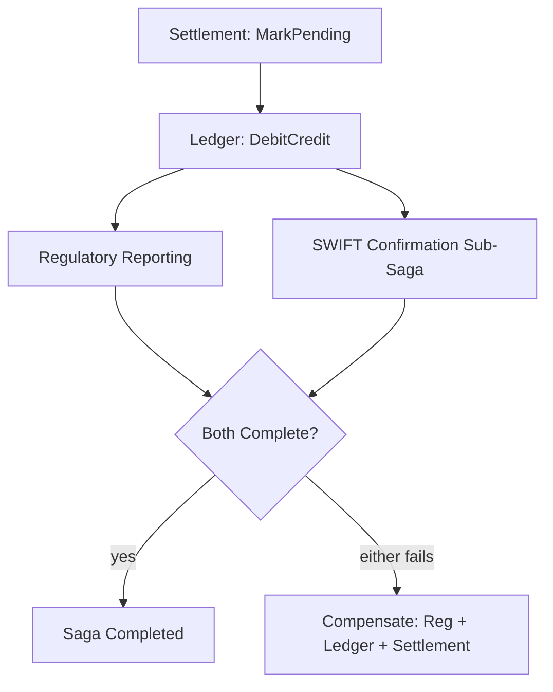
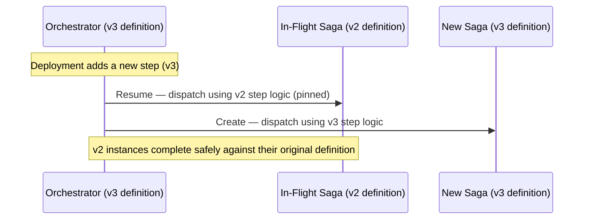
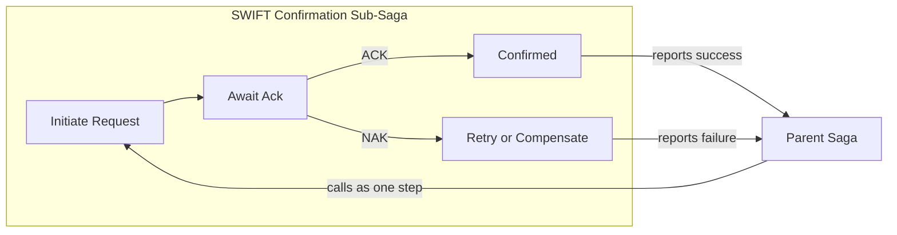
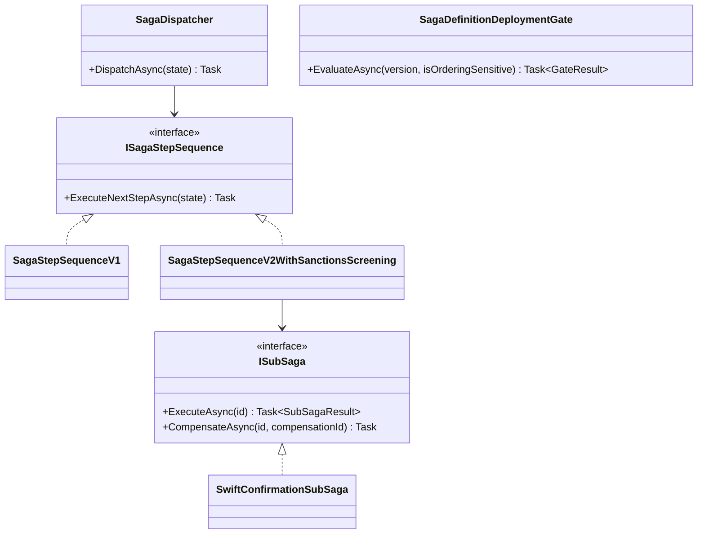

# Module 124 — Saga: Capstone — Multi-Party Settlement Orchestration at Scale

> Domain: Saga | Level: Beginner → Expert | Prerequisite: [[01-SagaFundamentals-OrchestrationVsChoreography-CompensatingTransactions]] (takes as given: orchestration/choreography, idempotent compensation, saga state as an Aggregate, forward/backward recovery, and liveness monitoring — this capstone adds parallel step execution, sub-sagas, and in-flight saga-definition migration, none of which Module 123's purely sequential treatment needed to address)
>
> **Domain-complete note:** second and final module of `36-Saga` (Modules 123–124). Full 16-section template; Elite FinTech Interview Panel lens.

---

## The Running Case Study

The settlement saga now spans **four steps**, two of which run in **parallel**: Settlement Engine (mark pending) → Ledger (debit/credit) → **[Regulatory Reporting ‖ Correspondent-Bank SWIFT Confirmation]**, both independent of each other but both dependent on the Ledger step completing first. At the organization's real scale, thousands of these sagas run concurrently, the step sequence itself has changed twice in the past year, and sagas that were already in-flight during each change had to be handled correctly — the central new problem this capstone solves.

---

## 1. Fundamentals

**What:** Extending Module 123's purely sequential saga model to support **parallel step branches** (independent steps that can execute concurrently once their shared prerequisite completes) and **safe evolution of the saga's own step-sequence definition** while sagas are already in-flight against the prior definition.

**Why:** A genuinely realistic, multi-party settlement process rarely reduces to one linear sequence — Regulatory Reporting and Correspondent-Bank Notification have no dependency on each other, only on the Ledger step; forcing them into an artificial sequential order wastes latency for no correctness benefit. Separately, this saga's step sequence *will* change over the system's life (Module 123 §14 already showed one such change) — this capstone addresses doing so safely for sagas already mid-flight.

**When:** Parallel branches are justified whenever two or more steps are genuinely independent of each other (§2.1's test); in-flight migration discipline is required the moment *any* production saga definition changes while instances of the prior definition may still be running — which, at any meaningful scale, is essentially always.

**How (30,000-ft view):**
```
Settlement (mark pending) → Ledger (debit/credit) → ┬→ Regulatory Reporting
                                                      └→ SWIFT Confirmation
Both parallel branches must complete (or both compensate) before the saga is Completed.
```

---

## 2. Deep Dive

### 2.1 Parallel Branches — the Independence Test and Compensation Ordering
Two steps qualify for parallel execution only if neither depends on the other's output and neither's compensation depends on knowing whether the other succeeded (a stricter test than mere "no data dependency") — compensation for a parallel-branch saga must compensate *every completed branch*, not merely reverse a single, linear sequence; if Regulatory Reporting succeeded but SWIFT Confirmation failed, both the Ledger step *and* Regulatory Reporting's own compensating actions must run, even though Regulatory Reporting itself succeeded.

### 2.2 Sub-Sagas — a Step That Is Itself a Multi-Step Process
SWIFT Confirmation, at genuine scale, is itself a multi-step process (initiate confirmation request → await correspondent bank's acknowledgment → handle a possible NAK/retry) — modeled as a **sub-saga**, with its own internal state machine and compensation logic, exposed to the parent saga as a single, atomic-looking step with its own success/failure/compensation contract — directly Module 113's ring/composition discipline, reapplied at the saga-coordination layer: the parent saga doesn't need to know the sub-saga's internal complexity, only its Port-like contract.

### 2.3 In-Flight Saga-Definition Migration — the Central New Problem
When the saga's own step sequence changes (a step added, removed, or reordered), sagas already in-flight against the *prior* definition must be handled explicitly — either (a) pinned to complete against their original definition regardless of the new one, or (b) explicitly, carefully migrated to the new definition mid-flight, a genuinely delicate operation requiring the same rigor Module 122's Aggregate-migration capstone applied to persistence-model changes, now applied to *saga-definition* changes specifically.

### 2.4 Saga Definition Versioning
Every saga instance's persisted state (Module 123 §2.3) must record which **version** of the step-sequence definition it was created against — the orchestrator's runtime logic then dispatches each in-flight saga to the correct version's own step-sequence logic, never assuming every currently-running instance follows the latest definition.

### 2.5 Distributed Tracing Across Saga Steps
Each saga instance's unique ID propagates as a correlation ID across every step and sub-saga call (directly Module 93's distributed-tracing discipline, reapplied here) — without this, diagnosing a stuck or failed saga at scale requires manually correlating logs across four-plus independent services, exactly the kind of fragmented-trace problem Module 93 already established as a severe, easily-overlooked observability gap.

### 2.6 Saga Observability Dashboard at Scale
At thousands of concurrent instances, per-instance manual inspection (Module 123's incident-debugging approach) doesn't scale — a dashboard aggregating saga state distribution (how many in each state, by definition version), stuck-saga counts, and compensation-failure rates becomes the primary, day-to-day operational visibility tool, with per-instance drill-down reserved for genuine investigation.

---

## 3. Visual Architecture







---

## 4. Production Example

**Problem:** A regulatory change required adding a new, mandatory pre-settlement sanctions-screening step to the saga — but thousands of sagas were already in-flight at deployment time, created against the prior, three-step definition.

**Architecture:** Saga-definition versioning (§2.4) — each in-flight instance's persisted state recorded its creation-time version; the orchestrator's dispatch logic checked this version and routed to the corresponding step-sequence implementation.

**Implementation:** The team initially deployed the new four-step (v2) definition as the orchestrator's only active logic, assuming in-flight v1 instances could simply "catch up" by having the new sanctions-screening step retroactively inserted into their remaining flow.

**Trade-offs:** Retroactively inserting a new step into an already-partially-executed saga instance risks running that step *after* a subsequent step has already completed (e.g., a sanctions screen running after Ledger debit already occurred) — precisely the wrong ordering for a screening step meant to gate the debit itself, a correctness violation, not merely an inconvenience.

**Lessons learned:** Several in-flight v1 sagas advanced past the Ledger-debit step *before* the sanctions-screening logic was (incorrectly) retroactively applied, meaning funds were debited before any sanctions check occurred for those specific instances — exactly backward from the new requirement's intent. The fix: strictly pin every in-flight saga to its original creation-time version (§2.4) for its *entire* remaining lifecycle — never retroactively splicing new steps into an already-partially-executed instance — with the new, four-step v2 definition applying only to sagas *created* after the deployment; the small number of already-debited, unscreened v1 instances were instead handled via an explicit, manual, out-of-band sanctions review specifically for that narrow, already-in-flight population, tracked and closed out as a one-time remediation rather than a structural ongoing gap.

---

## 5. Best Practices
- Pin every in-flight saga strictly to its creation-time definition version for its entire remaining lifecycle — never retroactively splice new steps into a partially-executed instance (§2.4, §4).
- Verify the independence test (§2.1) rigorously before parallelizing two steps — including whether either step's *compensation* logic depends on the other's outcome, not just whether their forward execution is independent.
- Model any genuinely multi-step "single step" (like SWIFT confirmation) as an explicit sub-saga with its own contract, not an ad hoc, informally-multi-step implementation hiding inside what looks like one step (§2.2).
- Propagate a saga instance's own ID as a distributed-tracing correlation ID across every step and sub-saga call from day one (§2.5).
- Build an aggregate observability dashboard before saga volume reaches a scale where per-instance manual inspection becomes impractical, not after (§2.6).

## 6. Anti-patterns
- Retroactively inserting a new step into an already-in-flight saga instance rather than strictly pinning it to its original version (§4's incident).
- Parallelizing two steps whose compensation logic turns out to depend on each other's outcome, violating §2.1's stricter independence test.
- An informally-multi-step "single step" implementation with no explicit sub-saga contract, making its own internal failure/retry logic opaque to the parent saga.
- No saga-instance correlation ID propagated across steps, forcing manual, fragmented log correlation to diagnose any cross-service saga issue (§2.5).
- Relying solely on per-instance inspection for operational visibility at a scale where an aggregate dashboard is clearly needed (§2.6).

---

## 7. Performance Engineering

**CPU/Memory:** Parallel-branch execution reduces overall saga latency (both branches run concurrently rather than sequentially) at the cost of slightly higher peak concurrent resource usage across the involved services.

**Latency:** End-to-end saga latency for the parallel-branch design equals the *slower* of the two parallel branches, not their sum — a genuine, measurable latency improvement over Module 123's fully-sequential model, provided the independence test (§2.1) is genuinely satisfied.

**Throughput:** Sub-saga internal retry/backoff logic (§2.2) must be capacity-planned independently from the parent saga's own throughput, since a sub-saga's own retry storms could otherwise silently degrade parent-saga throughput.

**Scalability:** Saga-definition-version-aware dispatch (§2.4) adds negligible per-instance overhead — a simple version-tagged branch in dispatch logic — and doesn't materially affect horizontal scaling characteristics already established in Module 123 §9.

**Benchmarking:** Load-test the parallel-branch design specifically for the compensation path when one branch succeeds and the other fails under realistic concurrent load — the scenario most likely to be under-exercised, directly extending Module 123 Advanced Q4's failure-injection load-testing discipline to the parallel-branch case specifically.

**Caching:** Not a primary concern for saga coordination logic itself.

---

## 8. Security

**Threats:** A sub-saga's own internal retry/state could be exploited to replay or duplicate a correspondent-bank confirmation message if not independently idempotent; version-dispatch logic itself becoming a target for manipulation (forcing a saga to be processed under an older, less-secure step-sequence version).

**Mitigations:** Sub-sagas require the identical idempotency discipline (Module 123 §2.4) as top-level saga steps — no exception for being "just an internal detail" of a parent step; saga-version-dispatch logic should be tamper-evident and centrally, immutably recorded at creation time (directly Module 121's append-only philosophy, reapplied to saga-version assignment) so it cannot be silently altered after the fact to route an instance to an unintended version.

**OWASP mapping:** Broken Access Control risk if any external actor could influence which saga-definition version a given instance is dispatched to, potentially routing around a newer, stricter compliance step (like the sanctions-screening addition in §4).

**AuthN/AuthZ:** Sub-saga steps enforce their own independent authorization exactly as top-level steps do (Module 123 §8) — no reduced scrutiny for being "internal" to a parent step.

**Secrets:** Sub-saga external integrations (e.g., the correspondent bank's own SWIFT-network credentials) managed with the identical rigor as any other regulated external credential (Module 86).

**Encryption:** Cross-service saga-coordination messages, including sub-saga internal messages, require the same in-transit encryption standard as any other regulated financial message in this system.

---

## 9. Scalability

**Horizontal scaling:** Parallel-branch execution and sub-sagas both scale using the identical partition-by-saga-instance-ID pattern already established (Module 123 §9) — no new scaling mechanism required, only correct handling of the additional branching/nesting logic within each partition's own processing.

**Vertical scaling:** Not a primary lever here beyond what Module 123 §9 already established.

**Replication:** Saga-definition-version metadata must be as durably persisted and replicated as any other authoritative saga state (§2.4), since losing this specific metadata would make correct dispatch for in-flight, older-version instances impossible.

**Load balancing:** Unchanged from Module 123 §9's partition-aware routing, now simply routing to the correct version-specific step-sequence logic within the assigned partition.

**High Availability:** A sub-saga's own failure/restart handling must be independently robust (§2.2) — a parent saga's HA guarantees don't automatically extend to guarantee a sub-saga's own internal resumability unless explicitly designed for it.

**Disaster Recovery:** Saga-definition version history itself (which versions have existed, their exact step sequences) should be retained and recoverable, since correctly interpreting an old, recovered saga instance's state requires knowing exactly what version-specific logic it was created against.

**CAP theorem:** Unchanged from Module 123 §9's CP-favoring saga-coordination-state reasoning — now additionally requiring the saga's own version-assignment to be included in that strongly-consistent state.

---

## 10. Interview Questions

### Basic (10)

1. **Q: What is the specific test for whether two saga steps can safely run in parallel?**
   **A:** Neither step's forward execution depends on the other's output, AND neither step's *compensation* logic depends on knowing the other's outcome (§2.1).
   **Why correct:** States the stricter, two-part test (not just data independence) precisely.
   **Common mistakes:** Checking only forward-execution independence, missing the compensation-dependency half of the test.
   **Follow-ups:** "Why must compensation logic also be independent?" (If Branch A's compensation needed to know Branch B's outcome, they aren't truly independent — compensating one without knowing the other's state risks an incorrect reversal, §2.1.)

2. **Q: What is a sub-saga?**
   **A:** A genuinely multi-step process (like SWIFT confirmation) modeled with its own internal state machine and compensation logic, exposed to the parent saga as a single, atomic-looking step (§2.2).
   **Why correct:** States the specific mechanism (own internal state machine, simple external contract) precisely.
   **Common mistakes:** Implementing a genuinely multi-step operation as an informal, ad hoc sequence hidden inside what looks like one step, with no explicit sub-saga contract.
   **Follow-ups:** "What does the parent saga see of a sub-saga's internal complexity?" (Nothing beyond its success/failure/compensation contract, §2.2 — the internal steps are fully encapsulated.)

3. **Q: Why must an in-flight saga be pinned to its creation-time definition version rather than upgraded mid-flight to a newer definition?**
   **A:** Retroactively splicing a new step into an already-partially-executed instance risks the new step running in the wrong order relative to already-completed steps, a genuine correctness violation (§4's incident).
   **Why correct:** States the specific risk (wrong step ordering relative to already-completed work) pinning avoids.
   **Common mistakes:** Assuming a new step can simply be inserted into an in-flight saga's remaining steps without considering ordering relative to what's already executed.
   **Follow-ups:** "What happened in §4's incident specifically?" (Funds were debited before a newly-required sanctions-screening step could apply, since it was retroactively inserted after the debit had already occurred for some in-flight instances.)

4. **Q: What information must a saga instance's persisted state record to support version-aware dispatch?**
   **A:** Which specific version of the step-sequence definition it was created against (§2.4).
   **Why correct:** States the specific, necessary piece of metadata.
   **Common mistakes:** Assuming the orchestrator can infer an instance's correct version from its current step alone, without an explicit, recorded version tag.
   **Follow-ups:** "What would happen without this recorded version?" (The orchestrator couldn't reliably distinguish an old-version instance from a new one, risking exactly §4's incorrect-step-ordering mistake.)

5. **Q: Why does a saga instance need its own distributed-tracing correlation ID?**
   **A:** So every step and sub-saga call across multiple independent services can be correlated back to one saga instance for diagnosis, without manually correlating logs across services (§2.5).
   **Why correct:** States the specific diagnostic benefit this course has already established for distributed tracing generally (Module 93), now applied to saga coordination specifically.
   **Common mistakes:** Assuming individual services' own logs are sufficient without a shared, propagated correlation ID tying them together.
   **Follow-ups:** "What course-established pattern does this directly reapply?" (Module 93's distributed-tracing/context-propagation discipline, §2.5.)

6. **Q: At what point does per-instance manual saga inspection stop being a practical operational tool?**
   **A:** Once saga volume reaches a scale (thousands of concurrent instances) where individual, one-at-a-time inspection can't provide adequate day-to-day operational visibility (§2.6).
   **Why correct:** States the specific scale-driven threshold motivating a dashboard's necessity.
   **Common mistakes:** Assuming per-instance inspection (Module 123's original debugging approach) remains adequate indefinitely regardless of saga volume growth.
   **Follow-ups:** "What should replace it at scale?" (An aggregate observability dashboard tracking state distribution, stuck-instance counts, and compensation-failure rates, §2.6.)

7. **Q: If Regulatory Reporting succeeds but SWIFT Confirmation fails in the parallel-branch design, what must the saga's compensation logic do?**
   **A:** Compensate every completed branch — both Regulatory Reporting's own compensation and the earlier Ledger/Settlement steps' compensations, not merely the failed branch alone (§2.1).
   **Why correct:** States the specific, complete compensation scope parallel branches require.
   **Common mistakes:** Assuming only the failed branch itself needs compensation, forgetting that any *other* already-succeeded parallel branch also needs its own compensation.
   **Follow-ups:** "Why can't Regulatory Reporting's success simply be left as-is if SWIFT Confirmation fails?" (The saga's overall all-or-nothing guarantee (Module 123 §1) requires every completed effect to be undone if the saga overall doesn't complete, regardless of which specific branch triggered the failure.)

8. **Q: Does a sub-saga require the same idempotency discipline as a top-level saga step?**
   **A:** Yes — no reduced rigor simply because it's "internal" to a parent step (§8).
   **Why correct:** Correctly reapplies Module 123 §2.4's idempotency requirement without exception for sub-sagas.
   **Common mistakes:** Assuming a sub-saga's internal retry logic is a lower-stakes implementation detail not requiring the same idempotency rigor as a top-level step.
   **Follow-ups:** "What OWASP-relevant risk would a non-idempotent sub-saga step introduce?" (A duplicated, replayed confirmation message triggering an incorrect duplicate effect, §8.)

9. **Q: What genuinely new latency benefit does the parallel-branch design provide over Module 123's fully-sequential model?**
   **A:** Overall saga latency equals the slower of the two parallel branches, not their sum (§7).
   **Why correct:** States the specific, measurable latency improvement precisely.
   **Common mistakes:** Assuming parallel execution provides no measurable benefit over sequential execution for genuinely independent steps.
   **Follow-ups:** "Under what condition would this benefit not materialize?" (If the two branches, despite being logically independent, contend for the same shared, bottlenecked resource, reducing the practical concurrency benefit.)

10. **Q: Why must saga-definition version history itself be retained for disaster recovery, not just the individual saga instances' own state?**
    **A:** Correctly interpreting a recovered, older saga instance's state requires knowing exactly what version-specific step-sequence logic it was originally created against (§9).
    **Why correct:** States the specific dependency (interpreting recovered state requires the corresponding version definition) motivating this retention requirement.
    **Common mistakes:** Assuming saga instance state alone is sufficient for recovery without also retaining the historical version definitions that state depends on for correct interpretation.
    **Follow-ups:** "What would happen if an old version's definition were deleted while instances created against it still existed?" (Those instances' state could no longer be correctly interpreted or resumed, a genuine, avoidable data-recoverability gap.)

### Intermediate (10)

1. **Q: Walk through why §4's incident specifically occurred for "some" in-flight v1 instances but not others.**
   **A:** The incorrect retroactive-splice approach affected specifically those v1 instances that happened to still be in-flight, past the Ledger-debit step, at the exact moment the flawed deployment occurred — instances that had already fully completed before the deployment were unaffected, and instances that hadn't yet reached the Ledger step were, by chance, caught by the (incorrect) retroactive splice before debiting occurred, only the specific timing window of "already debited, not yet fully complete" produced the actual, wrong ordering.
   **Why correct:** Explains the precise, timing-dependent reason only a subset of in-flight instances were affected, rather than treating the incident as uniformly affecting the entire in-flight population.
   **Common mistakes:** Assuming every in-flight instance was equally affected, missing that the specific timing of each instance's own progress relative to the deployment determined whether the flawed retroactive splice actually produced incorrect ordering for it.
   **Follow-ups:** "How would strict version-pinning (§4's actual fix) have prevented this regardless of timing?" (Every v1 instance, regardless of its exact progress at deployment time, would have continued executing only against its original, correct v1 logic — the timing-dependent risk disappears entirely once retroactive splicing is eliminated as an approach.)

2. **Q: Design the specific contract a sub-saga must expose to its parent saga, keeping the parent fully decoupled from the sub-saga's internal complexity.**
   **A:** A simple, three-outcome contract: `Success` (with whatever minimal result data the parent needs), `Failed` (triggering the parent's own compensation for this branch), and — critically — the sub-saga's *own* compensating action, callable by the parent if the parent's overall saga needs to compensate after this sub-saga already succeeded, without the parent needing any awareness of the sub-saga's own internal step sequence to invoke that compensation correctly.
   **Why correct:** Gives the precise, minimal contract (success/failure/its-own-compensation) achieving genuine encapsulation, directly Module 117's Port-contract discipline reapplied to saga composition.
   **Common mistakes:** Exposing the sub-saga's own internal steps or state to the parent, breaking the encapsulation this design specifically exists to provide.
   **Follow-ups:** "What internal sub-saga detail should NEVER be exposed to the parent saga?" (Its own internal step sequence, retry logic, or intermediate states — the parent should only ever see the sub-saga's own external, contract-level success/failure/compensation interface.)

3. **Q: Why is "the sanctions-screening step should have run before the debit, not after" specifically a business-correctness issue, not merely a technical inconvenience?**
   **A:** A sanctions screen exists specifically to *prevent* a prohibited transaction from occurring at all — running it after the debit has already occurred defeats its entire preventive purpose, converting what should be a blocking, pre-emptive control into an after-the-fact, ineffective check that can no longer actually prevent the transaction it was meant to screen.
   **Why correct:** States the specific reason (the control's entire preventive purpose is defeated by wrong ordering) this is a genuine business/compliance failure, not merely an inconvenient sequencing detail.
   **Common mistakes:** Treating the ordering mistake as a minor technical inconvenience rather than recognizing it as a complete failure of the control's actual, intended business purpose.
   **Follow-ups:** "What would the correct remediation need to demonstrate to a regulator?" (That every affected, already-debited instance received the sanctions screening after the fact, and that the structural fix (strict version-pinning) prevents this specific failure mode from recurring for any future saga-definition change, §4/§10 Advanced Q10.)

4. **Q: How would you design the observability dashboard (§2.6) to specifically surface a §4-style incident earlier, before it affects a large number of instances?**
   **A:** A dashboard panel specifically tracking, per saga-definition version, the count and rate of instances actively in-flight at the moment of any new deployment — combined with an explicit deployment-time alert if a new version's rollout coincides with a non-trivial in-flight population of an older version, prompting an explicit, deliberate review of exactly how those in-flight instances will be handled (pinned vs. migrated) before the deployment proceeds, rather than discovering the handling approach was wrong only after affected instances have already progressed incorrectly.
   **Why correct:** Designs a specific, concrete dashboard feature directly targeting early detection of exactly this incident category, rather than a generic "better monitoring" answer.
   **Common mistakes:** Proposing only after-the-fact detection (noticing incorrect states once they've already occurred) rather than a deployment-time gate specifically designed to surface this risk before it can materialize.
   **Follow-ups:** "Should this deployment-time check be a hard, blocking gate or merely an informational alert?" (A hard, blocking gate for any saga-definition change with a step-ordering-sensitive difference (like an added compliance-screening step) — directly this course's now-repeated preference for mechanical, blocking enforcement over easily-ignored informational alerts for genuinely high-stakes changes.)

5. **Q: Critique a design where a sub-saga's own compensation logic assumes it will only ever be invoked once, immediately after its own failure.**
   **A:** This misses the scenario where the sub-saga itself *succeeded*, but the *parent* saga later needs to compensate it because a different, parallel branch (or a later step) failed — the sub-saga's compensation must be invokable and idempotent regardless of whether it's triggered by its own internal failure or by the parent's own, later decision to compensate a previously-successful branch, directly Module 123 §2.4's idempotency discipline applied to this specific, sub-saga-compensation-triggering scenario.
   **Why correct:** Identifies the specific, easily-overlooked scenario (parent-triggered compensation of an already-successful sub-saga) this narrow assumption would fail to handle correctly.
   **Common mistakes:** Designing sub-saga compensation only for its own internal-failure path, missing the equally-important external-trigger path from the parent saga's own broader compensation logic.
   **Follow-ups:** "Give a concrete scenario where this specific gap would manifest." (SWIFT Confirmation succeeds, but Regulatory Reporting subsequently fails — the parent saga must now compensate the already-successful SWIFT Confirmation sub-saga, a path distinct from the sub-saga's own internal failure-handling logic.)

6. **Q: How would you decide whether a genuinely new saga step should be added via strict version-pinning (§4's fix) or whether, in some cases, retroactive application to in-flight instances is actually the correct, safe choice?**
   **A:** Apply an ordering-sensitivity test: does the new step have any correctness dependency on its position relative to already-existing steps (as the sanctions-screening step clearly did, needing to precede the debit)? If the new step is genuinely order-independent relative to the existing sequence (e.g., an additional, purely-informational logging step with no gating/blocking business logic), safe retroactive application to in-flight instances may be reasonable; if the new step has any ordering-sensitive business logic, strict version-pinning (§4's actual fix) is the only safe default.
   **Why correct:** Gives a concrete decision test (ordering-sensitivity) distinguishing when retroactive application might be safe from when it's genuinely dangerous, rather than treating strict pinning as an absolute, universal rule with no exceptions.
   **Common mistakes:** Treating strict version-pinning as the only ever-correct approach without recognizing that some, genuinely order-independent additions might reasonably tolerate retroactive application — though defaulting to strict pinning remains the safer, recommended baseline absent a clearly-demonstrated exception.
   **Follow-ups:** "Why should the default lean toward strict pinning even when a new step seems order-independent at first glance?" (Ordering sensitivity can be subtle and easy to misjudge, exactly as this incident's own root-cause analysis might not have been obvious in advance — the safer default assumes ordering sensitivity unless very clearly, rigorously demonstrated otherwise.)

7. **Q: Why does saga-definition-version metadata need the same tamper-evidence consideration (§8) as the saga's own business-transaction data?**
   **A:** If version-assignment could be silently altered after the fact, an instance could be retroactively, incorrectly reinterpreted under a different step-sequence logic than the one it was actually, originally created and validated against — undermining the entire version-pinning safety mechanism (§2.4/§4) this capstone's central fix depends on.
   **Why correct:** Connects the tamper-evidence requirement directly to the specific safety mechanism (version-pinning) it protects, rather than treating it as a generic security best practice unrelated to this module's own central concern.
   **Common mistakes:** Treating version-assignment metadata as low-stakes bookkeeping not warranting the same integrity protection as the saga's actual business-transaction data.
   **Follow-ups:** "What would a compromised version-assignment enable, concretely?" (Routing a specific saga instance around a newer, stricter compliance step by falsely recording it as an older-version instance — directly the OWASP Broken Access Control risk §8 already named.)

8. **Q: Design the specific test verifying the parallel-branch independence claim (§2.1) for Regulatory Reporting and SWIFT Confirmation before deploying them as parallel steps.**
   **A:** A deliberate, injected-failure test (extending Module 123 Advanced Q4's technique) specifically verifying: (1) Regulatory Reporting's forward execution genuinely produces correct results regardless of SWIFT Confirmation's own concurrent state; (2) each branch's compensation, triggered independently, produces correct results without needing to inspect or depend on the other branch's outcome; (3) both branches' compensations, if both are triggered concurrently (a genuine failure of one triggering compensation of the other), don't interact incorrectly with each other or with the shared, earlier Ledger step's own compensation.
   **Why correct:** Gives a concrete, three-part test directly targeting §2.1's own stricter independence criteria, including the specific concurrent-compensation interaction scenario a less rigorous test might miss.
   **Common mistakes:** Testing only that both branches can execute successfully in parallel under happy-path conditions, without specifically testing the failure/compensation-interaction scenarios this stricter independence test requires.
   **Follow-ups:** "What would a failure of test (3) specifically reveal?" (A hidden coupling between the two branches' compensation logic — e.g., both attempting to update the same shared saga-state field non-atomically, producing a race condition invisible under sequential, non-concurrent testing.)

9. **Q: How does this capstone's sub-saga pattern (§2.2) relate to Module 117's Hexagonal Architecture Port/Adapter composition?**
   **A:** A sub-saga's exposed contract (success/failure/compensation, §10 Intermediate Q2) is structurally identical to a Port — the parent saga depends only on this narrow, stable contract, entirely unaware of the sub-saga's own internal implementation, exactly Module 117's Dependency-Inversion-based Port/Adapter composition applied at the saga-coordination layer rather than the traditional application-core layer, demonstrating this course's now-repeated finding that the same underlying composition principle (depend on a narrow, stable contract, not an implementation) recurs productively at genuinely different architectural scales.
   **Why correct:** Correctly identifies the structural equivalence between a sub-saga's contract and a Hexagonal Port, connecting this capstone's own new pattern to an already-established, course-wide composition principle rather than treating it as an unrelated, novel idea.
   **Common mistakes:** Treating sub-sagas as an entirely new, saga-specific concept unrelated to this course's already-established Port/Adapter composition discipline.
   **Follow-ups:** "Would Module 117's contract-testing discipline apply to a sub-saga's own contract?" (Yes, directly — a contract test verifying every scenario (success/failure/compensation) behaves correctly and consistently, exactly the same discipline Module 117 established for any Port/Adapter pair.)

10. **Q: Synthesize how this capstone's saga-definition versioning relates to Module 121's event-schema versioning/upcasting.**
    **A:** Both address the identical underlying problem — a persisted artifact (an event, or here, a saga instance) created under one version of a schema/definition must remain correctly interpretable even as that schema/definition evolves over the system's life; Module 121's upcasters transform an old event's *data shape* into the current version's expected shape before `Apply()` processes it, while this capstone's version-pinning instead keeps an old saga instance's *entire step-sequence logic* frozen at its original version rather than attempting any transformation — a deliberately more conservative approach, justified specifically because (unlike a data-shape transformation) transforming an in-flight *process's remaining steps* mid-execution (§4's incident) carries a qualitatively higher, ordering-sensitive correctness risk than transforming a data record's shape.
    **Why correct:** Correctly identifies the shared underlying problem (versioned artifacts needing correct ongoing interpretation) while precisely explaining why this capstone's solution (strict pinning) is deliberately more conservative than Module 121's solution (in-place upcasting) — a genuine, well-reasoned difference, not an inconsistency between the two modules.
    **Common mistakes:** Assuming saga-definition versioning should use the identical upcasting technique as event-schema versioning, missing the qualitatively different, higher correctness risk of transforming an in-flight process's remaining steps versus transforming a static data record's shape.
    **Follow-ups:** "Could a saga-definition change ever safely use an upcasting-like approach instead of strict pinning?" (Only for the specific, narrower category of order-independent changes identified in Intermediate Q6 — even then, strict pinning remains the safer default absent very rigorous, demonstrated justification otherwise.)

### Advanced (10)

1. **Q: Diagnose §4's incident from first principles and design the complete, structural fix preventing any future saga-definition change from repeating this exact class of error.**
   **A:** Root cause: the deployment retroactively spliced a new, ordering-sensitive step into already-partially-executed instances without recognizing the ordering-sensitivity risk (Intermediate Q3/Q6). Fix: (1) mandate strict version-pinning as the default for any saga-definition change (§4's actual fix), with retroactive application permitted only after passing Intermediate Q6's explicit ordering-sensitivity review; (2) add the deployment-time in-flight-population check and blocking gate (Intermediate Q4) surfacing this risk before a flawed deployment can proceed; (3) require every saga-definition change to be reviewed and explicitly approved against this specific checklist (an ADR, Module 106) before deployment, not left to individual engineering judgment alone under deployment-timeline pressure.
   **Why correct:** Identifies the actual root cause (ordering-sensitivity risk unrecognized) and a three-part structural fix (default-safe pinning, deployment-time gate, mandatory review process) rather than a one-off patch specific to the sanctions-screening step alone.
   **Common mistakes:** Fixing only this specific deployment's mistake without institutionalizing the ordering-sensitivity-review and deployment-time-gate process that would catch the next, differently-shaped saga-definition change before it causes a similar incident.
   **Follow-ups:** "Why is a mandatory review process specifically necessary, beyond just documenting the correct default (strict pinning) as a best practice?" (Directly this course's now-repeated finding — a documented best practice, without mechanical enforcement (the deployment-time gate) or mandatory review, remains vulnerable to being skipped under future deployment-timeline pressure, exactly the condition that produced this incident in the first place.)

2. **Q: A team proposes eliminating sub-sagas entirely, inlining SWIFT Confirmation's multi-step logic directly into the parent saga's own step sequence, arguing this simplifies the overall design by removing a layer of abstraction. Evaluate this proposal.**
   **A:** This directly reverses §2.2's encapsulation benefit — the parent saga's own step-sequence logic would now need to handle SWIFT Confirmation's internal retry/NAK-handling states directly, coupling the parent's own state machine to a level of detail (correspondent-bank-specific retry semantics) that genuinely belongs encapsulated within its own, independently-evolvable sub-saga; any future change to SWIFT-specific retry logic would now require modifying the parent saga's own step-sequence definition, directly reintroducing exactly the kind of tight coupling Module 117's Port/Adapter composition principle (Intermediate Q9) exists to prevent.
   **Why correct:** Identifies the specific coupling this proposal reintroduces and connects it directly to the already-established composition principle this pattern's value depends on.
   **Common mistakes:** Assuming "fewer abstraction layers" is unconditionally simpler without recognizing the genuine coupling cost this specific simplification introduces for a component (SWIFT Confirmation) with its own independently-evolving internal complexity.
   **Follow-ups:** "Under what condition might inlining actually be the right call instead?" (If SWIFT Confirmation's own internal logic were trivial enough (a single, always-synchronous call with no independent retry/NAK complexity) that the sub-saga's own encapsulation overhead genuinely exceeded its benefit — directly this course's now-repeated calibration principle, applied to sub-saga adoption specifically.)

3. **Q: Critique a design where the deployment-time in-flight-population check (Intermediate Q4) is implemented as a manual, human-run query before each deployment, rather than an automated, blocking CI/CD gate.**
   **A:** A manual, human-run check depends on an engineer remembering to run it correctly and interpreting its results correctly under deployment-timeline pressure — precisely the same class of gap (a safety mechanism that exists but isn't mechanically, continuously enforced) this course has repeatedly identified as the actual root cause across numerous prior incidents (Module 106's fitness functions, Module 116's compliance gate); an automated, blocking CI/CD gate removes this human-reliability dependency entirely, failing the deployment pipeline mechanically if the in-flight-population/ordering-sensitivity check isn't satisfied.
   **Why correct:** Directly reapplies this course's now-extensively-established "mechanical enforcement over relied-upon human diligence" principle to this specific gate, rather than accepting a manual process as adequate.
   **Common mistakes:** Assuming a well-documented manual checklist item is sufficient protection, missing this course's repeated demonstration that manual, human-dependent checks are exactly where safety mechanisms most commonly, silently fail under real-world pressure.
   **Follow-ups:** "What would this automated gate concretely check before allowing a saga-definition-changing deployment to proceed?" (Query the current in-flight saga population by version, flag any non-trivial count for a saga-definition change classified as ordering-sensitive per Intermediate Q6's test, and block the deployment pending explicit, recorded sign-off on the specific in-flight-handling approach.)

4. **Q: Design a load-testing methodology validating the parallel-branch design's concurrent-compensation correctness under realistic, high-concurrency production load, extending Intermediate Q8's test design into a genuine load-testing scenario.**
   **A:** Run thousands of concurrent saga instances under realistic peak load, deliberately injecting a controlled proportion of failures specifically timed to occur *while* both parallel branches are genuinely, concurrently in-flight (not sequentially, one after the other) — verifying the resulting compensation correctly, atomically updates shared saga state without race conditions, and that no saga instance ends up in an ambiguous or double-compensated state under this genuinely concurrent, high-volume failure-injection condition, directly extending Module 118 §7's peak-load-testing discipline to this capstone's own specific new correctness concern (concurrent, not merely sequential, compensation).
   **Why correct:** Correctly designs a test specifically targeting genuine concurrency (not merely sequential failure injection) at realistic scale, addressing exactly the new risk category this capstone's parallel-branch design introduces beyond Module 123's purely sequential treatment.
   **Common mistakes:** Load-testing the parallel-branch design's happy-path throughput benefit without specifically, deliberately testing its more complex, genuinely concurrent compensation-correctness property under realistic failure-injection conditions.
   **Follow-ups:** "What specific race condition would this test be most likely to reveal, if one existed?" (Both parallel branches' compensation logic attempting to update the same underlying saga-state field concurrently and non-atomically, producing a lost update or an inconsistent final state — exactly the kind of subtle bug Intermediate Q8's test (3) was designed to catch.)

5. **Q: How would you decide, for the sanctions-screening incident's already-debited, unscreened instances (§4), between a fully-automated remediation process versus the manual, out-of-band review the team actually used?**
   **A:** Given the genuinely small, well-bounded, non-recurring population (a one-time incident affecting a specific, identifiable set of instances, not an ongoing structural gap), manual, out-of-band review is the appropriate, proportionate response — building fully-automated remediation tooling for a scope this narrow and non-recurring would itself be a disproportionate engineering investment relative to the actual, bounded remediation need, directly this course's now-repeated calibration principle (invest proportionally to genuine, demonstrated scale and recurrence, not reflexively for every incident regardless of scope).
   **Why correct:** Correctly applies the established calibration principle to a remediation-tooling investment decision specifically, distinguishing a one-time, bounded incident from an ongoing, structural gap warranting fuller automation.
   **Common mistakes:** Assuming any incident of this severity automatically warrants building full remediation automation, without weighing the actual, bounded scope against that investment's proportionate cost.
   **Follow-ups:** "Under what circumstance would automated remediation tooling have been the right call instead?" (If this incident category were shown, through the structural fixes (Advanced Q1), to still be at meaningful risk of recurring at genuine scale — the manual approach is specifically justified by this being a bounded, one-time incident with a structural fix already closing off recurrence.)

6. **Q: A regulator asks how this system ensures a sanctions-screening-equivalent control, added in the future, would never again be incorrectly applied out-of-order for in-flight transactions. How would you answer, citing this capstone's specific mechanisms?**
   **A:** Cite the layered, structural fix directly: strict version-pinning as the mandatory default for any saga-definition change (Advanced Q1), an automated, blocking deployment-time gate specifically checking in-flight population and ordering-sensitivity before any such deployment can proceed (Advanced Q3), and a mandatory, recorded architectural review (an ADR) for any saga-definition change — together converting this specific risk category from "dependent on an individual engineer's judgment under deployment pressure" into "mechanically, structurally prevented by default, with deliberate, reviewed exception only for rigorously-demonstrated order-independent changes."
   **Why correct:** Gives a concrete, mechanism-by-mechanism answer directly citing this capstone's own established structural fixes, demonstrating the risk is now closed by design and process, not merely by good intentions.
   **Common mistakes:** Answering only with "we learned from this incident and will be more careful next time," missing the specific, structural, mechanically-enforced fixes that make recurrence prevention a genuine, verifiable property rather than a hoped-for behavioral improvement.
   **Follow-ups:** "Why is 'we will be more careful' specifically an inadequate answer to a sophisticated regulator?" (It relies entirely on human diligence with no mechanical enforcement — precisely the class of unverified, "declared, not actually enforced" claim this entire course has repeatedly shown to be an unreliable basis for regulatory assurance.)

7. **Q: Critique treating saga-observability-dashboard alerts (§2.6) as sufficient without also periodically testing that the dashboard itself correctly reflects true underlying saga state.**
   **A:** Directly this course's now fully-established "verify the verifier" theme, recurring at the observability-dashboard layer specifically — a dashboard aggregating and displaying saga-state counts could itself have a bug (an incorrect aggregation query, a stale cache) causing it to under- or over-report the true, actual state distribution, providing false operational confidence exactly analogous to Module 96's own observability-platform capstone finding; a periodic reconciliation check (directly reapplying Module 120/121's already-established reconciliation technique) comparing the dashboard's own reported figures against a genuine, independent query of underlying saga state is the specific mechanism closing this gap.
   **Why correct:** Correctly identifies this as a recurrence of the course's central, now fully-developed theme, specifically applied to the saga-observability-dashboard this capstone introduced, and names the concrete reconciliation mechanism closing it.
   **Common mistakes:** Treating the observability dashboard itself as an inherently trustworthy source of truth simply because it exists and displays plausible-looking numbers, without independently verifying its own accuracy periodically.
   **Follow-ups:** "How would you specifically design this dashboard-reconciliation check?" (A scheduled job independently querying raw saga-instance state and comparing aggregate counts against the dashboard's own reported figures, alerting on any discrepancy — directly Module 120 Advanced Q9's reconciliation-job pattern, reapplied to dashboard accuracy specifically.)

8. **Q: How would you handle a scenario where a sub-saga's own internal versioning needs to evolve independently of the parent saga's own versioning (§2.4)?**
   **A:** Version the sub-saga's own contract and internal implementation entirely independently from the parent saga's version — exactly Module 111 Basic Q8's already-established principle that an internal implementation's own evolution shouldn't be coupled to an external consumer's (here, the parent saga's) versioning cycle, provided the sub-saga's external contract (Intermediate Q2) itself remains stable across the internal version change; only a genuinely breaking change to the sub-saga's *external contract* would require any coordination with the parent saga's own versioning at all.
   **Why correct:** Correctly reapplies an already-established course principle (internal implementation evolution decoupled from external consumers, provided the contract stays stable) to this specific, new scenario of independently-versioned sub-sagas.
   **Common mistakes:** Assuming sub-saga versioning must always be coupled to or coordinated with the parent saga's own versioning scheme, missing that genuine encapsulation (Intermediate Q2) specifically allows independent evolution as long as the external contract remains stable.
   **Follow-ups:** "What would constitute a genuinely breaking change to a sub-saga's external contract, requiring parent-saga coordination?" (Changing the sub-saga's success/failure/compensation contract's own shape or semantics — e.g., adding a new, mandatory failure-reason field the parent saga's own logic now needs to handle — as distinct from purely internal retry-logic or timing changes that never surface across the contract boundary.)

9. **Q: Design the specific criteria for deciding whether a future saga-definition change (beyond the sanctions-screening example) qualifies for the "rigorously-demonstrated order-independent" exception to strict version-pinning (Intermediate Q6), versus defaulting to strict pinning.**
   **A:** Require, at minimum: (1) an explicit, written analysis demonstrating the new step has no data or control-flow dependency on the relative order of any existing step; (2) a passing test suite specifically constructed to verify this independence claim under realistic, concurrent, and failure-injected conditions (directly Advanced Q4's own testing discipline, reapplied to this specific exception-qualification process); (3) sign-off from someone with genuine business/compliance authority over the specific process being modified, not engineering judgment alone, given the demonstrated stakes (§4) of getting this wrong; absent all three conditions being satisfied and documented, strict version-pinning remains the mandatory default.
   **Why correct:** Gives a concrete, three-part qualification bar (written analysis, passing independence-focused test suite, business/compliance sign-off) rather than leaving the exception's qualification criteria vague or subject to purely engineering judgment for a genuinely high-stakes decision.
   **Common mistakes:** Leaving the exception's qualification criteria informal or engineering-judgment-only, risking exactly the kind of underestimated-ordering-sensitivity mistake §4's incident already demonstrated can occur even with apparently reasonable engineering judgment.
   **Follow-ups:** "Why specifically require business/compliance sign-off, not just engineering sign-off, for this exception?" (Ordering sensitivity for a regulatory/compliance-relevant step, as §4's incident showed, is fundamentally a business/compliance judgment about the control's actual intended effect, not purely a technical/engineering question engineering judgment alone is best positioned to fully evaluate.)

10. **Q: As a Principal Engineer, synthesize this entire capstone into the complete governance program required before any future saga-definition change (of any kind) is considered safe to deploy at this organization.**
    **A:** (1) Strict version-pinning as the mandatory default for every in-flight saga instance across any definition change (Advanced Q1). (2) An automated, blocking CI/CD deployment gate checking in-flight population and requiring explicit sign-off on the specific handling approach before any saga-definition-changing deployment proceeds (Advanced Q3). (3) A formal, three-part qualification bar (written independence analysis, passing concurrency/failure-injection test suite, business/compliance sign-off) for the rare exception permitting retroactive, non-pinned application to in-flight instances (Advanced Q9). (4) Tamper-evident, immutably-recorded saga-version assignment preventing post-hoc manipulation (Intermediate Q7). (5) Sub-sagas fully encapsulated behind a stable, independently-versionable, contract-tested Port-like interface (Advanced Q8/Intermediate Q9). (6) A continuously reconciliation-verified observability dashboard, never trusted as inherently accurate without independent verification (Advanced Q7). (7) Proportionate, scope-calibrated remediation for any bounded, non-recurring incident population, reserving full automation investment for demonstrated, ongoing structural gaps (Advanced Q5).
    **Why correct:** Synthesizes every specific finding from this capstone into a coherent, actionable, reusable governance program, matching this course's established capstone-synthesis pattern at its fullest, most comprehensive form for this domain.
    **Common mistakes:** Presenting only the technical parallel-branch/sub-saga/versioning mechanisms without the deployment-gating, tamper-evidence, and dashboard-verification governance elements that make this genuinely safe and organizationally sustainable at real production scale.
    **Follow-ups:** "Which single element of this program is most directly attributable to a lesson only this capstone (not Module 123's more general treatment) could have taught?" (Strict version-pinning for in-flight saga-definition changes, Advanced Q1 — a risk category specific to evolving an already-deployed saga's step sequence at genuine scale, never encountered in Module 123's simpler, single-definition treatment.)

---

## 11. Coding Exercises

### Easy — Parallel Branch Execution and Join (§2.1)
**Problem:** Execute Regulatory Reporting and SWIFT Confirmation in parallel, proceeding only once both complete.
**Solution:**
```csharp
public async Task ExecuteParallelBranchesAsync(SettlementSagaState state)
{
    var regTask = _regulatoryClient.FileReportAsync(state.InstructionId);
    var swiftTask = _swiftSubSaga.ExecuteAsync(state.InstructionId);

    await Task.WhenAll(regTask, swiftTask);

    if (regTask.Result.Success && swiftTask.Result.Success)
        state.Advance(SagaStatus.Completed);
    else
        await CompensateAllCompletedBranchesAsync(state, regTask.Result, swiftTask.Result);
}
```
**Time complexity:** O(1) coordination overhead; wall-clock latency = max(regTask, swiftTask), not their sum.
**Space complexity:** O(1) additional for tracking both branch results.
**Optimized solution:** Use `Task.WhenAny` with a per-branch timeout wrapper if one branch's failure should trigger early compensation of the other without waiting for its own, potentially much longer timeout to elapse independently.

### Medium — Version-Pinned Saga Dispatch (§2.4, §4)
**Problem:** Dispatch an in-flight saga to its correct, original step-sequence logic.
**Solution:**
```csharp
public class SagaDispatcher
{
    private readonly Dictionary<int, ISagaStepSequence> _versions = new()
    {
        [1] = new SagaStepSequenceV1(),
        [2] = new SagaStepSequenceV2WithSanctionsScreening()
    };

    public async Task DispatchAsync(SettlementSagaState state)
    {
        var sequence = _versions[state.DefinitionVersion]; // pinned at creation time, never re-evaluated
        await sequence.ExecuteNextStepAsync(state);
    }
}
```
**Time complexity:** O(1) dictionary lookup for version dispatch.
**Space complexity:** O(v) for v retained historical version implementations.
**Optimized solution:** Retire (but never delete) old version implementations from active memory once no in-flight instances reference them, while retaining their code/history for disaster-recovery interpretability (§9), rather than keeping every historical version equally "hot" indefinitely.

### Hard — Sub-Saga with Its Own Compensation Contract (§2.2, §10 Intermediate Q2)
**Problem:** Implement SWIFT Confirmation as a sub-saga exposing success/failure/compensation to its parent.
**Solution:**
```csharp
public class SwiftConfirmationSubSaga
{
    public async Task<SubSagaResult> ExecuteAsync(string instructionId)
    {
        var ackResult = await InitiateAndAwaitAckAsync(instructionId); // internal multi-step logic
        return ackResult.IsAck
            ? SubSagaResult.Success()
            : SubSagaResult.Failed(reason: ackResult.NakReason);
    }

    public async Task CompensateAsync(string instructionId, string compensationId)
    {
        var alreadyCompensated = await _store.ExistsCompensationAsync(compensationId);
        if (alreadyCompensated) return; // idempotent, per §8

        await _swiftClient.SendCancellationNoticeAsync(instructionId);
        await _store.RecordCompensationAsync(compensationId);
    }
}
```
**Time complexity:** O(1) at the parent's call site; internal steps hidden and independently variable in cost.
**Space complexity:** O(1) exposed to the parent; internal state entirely encapsulated.
**Optimized solution:** Generalize `SubSagaResult`/`CompensateAsync` into a shared, reusable `ISubSaga` interface every sub-saga in the system implements, enabling a single, shared contract-test suite (Module 117's discipline) verifying every sub-saga's success/failure/compensation behavior consistently.

### Expert — Deployment-Time In-Flight-Population Gate (§10 Advanced Q3)
**Problem:** Block a saga-definition-changing deployment if a non-trivial in-flight population exists without explicit sign-off.
**Solution:**
```csharp
public class SagaDefinitionDeploymentGate
{
    public async Task<GateResult> EvaluateAsync(int newVersion, bool isOrderingSensitive)
    {
        var inFlightCount = await _sagaStore.CountInFlightByVersionLessThanAsync(newVersion);

        if (inFlightCount > 0 && isOrderingSensitive && !await _signOffStore.HasApprovalAsync(newVersion))
        {
            return GateResult.Blocked(
                $"{inFlightCount} in-flight instances on prior versions; " +
                "ordering-sensitive change requires explicit business/compliance sign-off before deployment.");
        }
        return GateResult.Allowed();
    }
}
```
**Time complexity:** O(1) for the count query, assuming an indexed version column.
**Space complexity:** O(1).
**Optimized solution:** Integrate this gate directly into the CI/CD pipeline (Module 89/92) as a mandatory, non-bypassable deployment step for any change touching saga-definition code, rather than a standalone tool an engineer must remember to run manually.

---

## 12. System Design

**Functional requirements:** Support parallel saga-step branches with correct, complete compensation across all completed branches on any failure; encapsulate genuinely multi-step operations as sub-sagas with a stable contract; safely evolve saga-definitions while thousands of instances remain in-flight against prior versions.

**Non-functional requirements:** Zero incorrect step-ordering for in-flight instances during any saga-definition change; sub-saga idempotency and encapsulation equal to top-level steps; observability at a scale where per-instance inspection is impractical; tamper-evident version assignment.

**Architecture:** An orchestrator dispatching version-pinned step-sequence logic (§2.4); parallel-branch execution with joint compensation (§2.1); sub-sagas exposing a stable, Port-like contract (§2.2); a deployment-time gate (§11 Expert exercise) and an observability dashboard with independent reconciliation (§10 Advanced Q7).

**Components:** `SagaDispatcher`; `SagaStepSequenceV1`/`V2`; `SwiftConfirmationSubSaga`; `SagaDefinitionDeploymentGate`; a dashboard aggregation service plus its own reconciliation job.

**Database selection:** Saga state (including version tag) persisted in the same strongly-consistent store as any authoritative Aggregate (Module 110); historical version-definition metadata retained indefinitely for DR/interpretability (§9).

**Caching:** Dashboard aggregate figures may be cached with a short TTL for display performance, provided the reconciliation job (Advanced Q7) independently verifies accuracy on its own schedule, never relying on the cached figures as ground truth.

**Messaging:** Parallel branches invoked concurrently via each service's own published API (Module 117); sub-saga internal messaging fully encapsulated, invisible to the parent.

**Scaling:** Partition-by-saga-instance-ID unchanged from Module 123 §9; version-dispatch adds negligible overhead within each partition's own processing.

**Failure handling:** Complete, joint compensation across all completed parallel branches (§2.1); strict version-pinning preventing incorrect retroactive step-splicing (§2.4/§4); a deployment-time gate preventing an unsafe saga-definition change from ever reaching production (§11 Expert exercise).

**Monitoring:** An aggregate dashboard tracking per-version in-flight counts, stuck-instance rates, and compensation-failure rates, with its own independent reconciliation verification (§2.6, Advanced Q7); distributed tracing via saga-instance correlation ID across every step and sub-saga call (§2.5).

**Trade-offs:** Parallel-branch latency benefit traded against the added complexity of joint, all-completed-branches compensation logic; strict version-pinning's operational discipline (maintaining and correctly dispatching to multiple historical version implementations indefinitely) traded against the correctness guarantee it provides for in-flight instances during any future saga-definition evolution.

---

## 13. Low-Level Design

**Requirements:** Parallel branches execute concurrently with correct, complete compensation; sub-sagas are fully encapsulated behind a stable contract; saga-definition version is immutably recorded and correctly dispatched.

**Class diagram:**


**Sequence diagram:** See §3's parallel-branch and version-pinned-dispatch sequence diagrams.

**Design patterns used:** Strategy (each `ISagaStepSequence` version as an interchangeable strategy, §2.4); Composite (sub-sagas composed within the parent's own step sequence, §2.2); Fork-Join (the parallel-branch execution/compensation pattern, §2.1); Gatekeeper/Guard Clause (the deployment-time gate, §11 Expert exercise).

**SOLID mapping:** Single Responsibility (each `ISagaStepSequence` version handles exactly its own, frozen step logic); Open/Closed (a new saga-definition version adds a new `ISagaStepSequence` implementation without modifying prior ones); Liskov Substitution (any `ISubSaga` implementation must be behaviorally substitutable per its own contract test, directly Module 117's LSP-as-contract-testing principle reapplied); Dependency Inversion (the parent saga depends on `ISubSaga`, never a concrete sub-saga implementation).

**Extensibility:** A future saga-definition change (v3) adds a new `ISagaStepSequence` implementation and passes through the deployment-time gate — zero changes to `SagaDispatcher` itself or any prior version's implementation.

**Concurrency/thread safety:** Parallel-branch execution requires the saga state's own compensation-triggering logic to be safely re-entrant and atomic if both branches fail concurrently (§10 Advanced Q4's own test target); sub-saga compensation must be idempotent regardless of whether triggered by its own internal failure or the parent's later, external compensation decision (§10 Intermediate Q5).

---

## 14. Production Debugging

**Incident:** During a period of unusually high concurrent saga volume (a quarter-end settlement surge), a small number of sagas entered a state where *both* parallel branches (Regulatory Reporting and SWIFT Confirmation) were recorded as having failed and been compensated — but the earlier Ledger debit's own compensation was never triggered, leaving those specific instructions' ledger entries permanently, incorrectly un-reversed.

**Root cause:** The joint-compensation logic (§2.1) used a shared, in-memory counter tracking "how many of the two parallel branches have reported failure" to decide when to trigger the shared Ledger-step compensation — under the quarter-end surge's genuinely high concurrency, two saga instances' compensation-triggering logic occasionally interleaved at the code level in a way that corrupted this shared, non-atomically-updated in-memory counter across what should have been two entirely independent saga instances, causing one instance's counter to reach its "both branches failed" threshold from a *different* instance's own branch failures, incorrectly believing its own Ledger compensation had already been triggered when it actually never had been.

**Investigation:** The reconciliation job (§10 Advanced Q7) flagged a growing count of instructions in a "both branches compensated, but Ledger still shows an active debit" state — a state the dashboard's own aggregate view hadn't surfaced clearly, since it tracked only per-branch compensation status, not this specific, cross-branch/cross-instance consistency property; a targeted code review of the joint-compensation logic revealed the shared, non-instance-scoped in-memory counter as the specific implementation flaw.

**Tools:** The reconciliation job's own discrepancy report; a targeted code review of the joint-compensation logic under genuine, high-concurrency load; a load test specifically reproducing the quarter-end-surge concurrency level to confirm the counter-corruption hypothesis.

**Fix:** Replaced the shared, in-memory, cross-instance counter with per-instance, durably-persisted branch-completion tracking (stored directly on each saga instance's own state, Module 110's optimistic-concurrency-guarded Aggregate discipline), eliminating any possibility of cross-instance interference, and manually triggered the missed Ledger compensations for the specific, affected instances identified by the reconciliation report.

**Prevention:** Extended the concurrency-specific load test (§10 Advanced Q4) to explicitly include genuinely high-volume, multi-instance concurrent scenarios (not just single-instance concurrent-branch scenarios) as a permanent, standing part of the saga's test suite, and added a specific dashboard panel (extending §2.6) directly surfacing "branches compensated but a dependent, earlier step's compensation still pending" as its own, explicitly-monitored state category, rather than relying solely on the reconciliation job's periodic, less-immediate detection for this specific, severe correctness-consistency category.

---

## 15. Architecture Decision

**Context:** Choosing the mechanism for tracking parallel-branch completion/failure state to correctly trigger joint compensation, given §14's incident.

**Option A — Shared, in-memory, process-level state (the original, flawed design):**
*Advantages:* Simple, fast, no additional persistence round-trip.
*Disadvantages:* §14's exact incident — vulnerable to cross-instance interference under genuine, high concurrency if not carefully, correctly instance-scoped; effectively impossible to make correctly instance-scoped using shared, process-level state without significant, error-prone care.
*Cost:* Low implementation cost; potentially severe correctness-risk cost, as demonstrated.

**Option B — Per-instance, durably-persisted branch-completion tracking (the actual fix):**
*Advantages:* Directly eliminates cross-instance interference by construction — each instance's own state is genuinely, structurally isolated; durable, surviving process restarts mid-flow (consistent with §2.3's persisted-saga-state principle).
*Disadvantages:* A small additional persistence round-trip per branch-completion event, versus Option A's in-memory speed.
*Cost:* Slightly higher per-event latency; substantially lower correctness risk.

**Option C — A distributed, external coordination primitive (e.g., a distributed lock or atomic counter service) shared across instances but explicitly keyed per saga-instance-ID:**
*Advantages:* Could theoretically provide fast, shared-infrastructure coordination while still being correctly instance-scoped via explicit per-instance keying.
*Disadvantages:* Introduces a new, additional infrastructure dependency (the distributed coordination service itself) and its own potential failure modes, for a benefit (marginal latency improvement over Option B) that's unlikely to be meaningfully significant given each branch-completion event's already-low relative frequency.
*Cost:* Higher infrastructure/operational complexity for a marginal, likely-unnecessary performance benefit.

**Recommendation:** **Option B**, directly and durably persisting branch-completion state per saga instance — this both fixes §14's actual root cause (cross-instance interference) by construction and is consistent with §2.3's already-established principle that saga coordination state belongs in the saga's own persisted Aggregate, not ephemeral, process-level memory; Option C's added infrastructure complexity isn't justified given branch-completion events' realistic, low-per-instance frequency, making Option B's marginally higher per-event latency an easily-acceptable trade-off for its substantially stronger correctness guarantee.

---

## 17. Principal Engineer Perspective

**Business impact:** This capstone's full toolkit — parallel branches, sub-sagas, and safe saga-definition evolution — directly enables the organization to model genuinely realistic, multi-party financial processes (not artificially-simplified, purely sequential ones) while continuing to evolve those processes safely over time as regulatory and business requirements change, exactly as the sanctions-screening requirement (§4) demonstrated is a genuine, recurring organizational need, not a one-time event.

**Engineering trade-offs:** Both this capstone's incidents (§4, §14) trace to the same underlying pattern this course has repeatedly surfaced — a genuinely subtle correctness risk (retroactive step-splicing ordering, cross-instance state interference) that seemed reasonable under normal engineering judgment but required this course's now-repeated discipline of explicit, structural, mechanically-enforced safeguards (strict version-pinning, per-instance durable state) rather than relying on careful implementation alone.

**Technical leadership:** Establishing the formal, three-part exception-qualification bar for retroactive saga-definition application (§10 Advanced Q9) — requiring written analysis, passing concurrency-tested verification, and business/compliance sign-off — is exactly the kind of structural, hard-to-bypass governance intervention a Principal Engineer must institute for a risk category this course has now twice demonstrated (Module 123 §14, this capstone §4) can otherwise recur under deployment-timeline pressure.

**Cross-team communication:** A saga-definition change's true blast radius spans every service involved plus every currently-in-flight instance's own correct completion — a Principal Engineer must ensure the deployment-time gate (§11 Expert exercise) and its required sign-off process genuinely, visibly involves every stakeholder (engineering, compliance, and any business team whose process the change affects) rather than becoming a rubber-stamped formality.

**Architecture governance:** Every parallel-branch independence claim, sub-saga contract, and saga-definition version should be a documented, reviewed architecture decision (Module 106's ADR discipline) — this capstone's own Architecture Decision (§15) should itself be recorded as exactly such an artifact, not merely described in this training module.

**Cost optimization:** The deliberate choice to use proportionate, manual remediation (§10 Advanced Q5) rather than building full automation for a bounded, one-time incident population is itself a cost-optimization discipline a Principal Engineer must actively defend against pressure to "automate everything" reflexively, regardless of actual, demonstrated recurrence risk.

**Risk analysis:** §14's incident — a subtle, concurrency-dependent bug that only manifested under genuine, high-volume production load specifically during a quarter-end surge — is this capstone's clearest demonstration that correctness risk in a genuinely concurrent, distributed system often hides in exactly the conditions ordinary, lower-volume testing doesn't reach; a Principal Engineer's risk analysis for any such system must explicitly account for and test against realistic peak-concurrency conditions, not merely steady-state or synthetic-but-low-volume validation.

**Long-term maintainability:** As this saga's own definition inevitably continues evolving over the system's life (a near-certainty, given it has already changed twice), the version-pinning discipline and deployment-time gate this capstone established are what keep each future change safe without requiring every future engineer to independently rediscover §4's own hard-won lesson — a Principal Engineer should track, as an explicit organizational metric, how many historical saga-definition versions remain in active, correctly-dispatched use, treating rapid, ungoverned version proliferation as a leading indicator of rising operational complexity worth proactively managing.

---

**Domain complete — `36-Saga` (Modules 123–124):** Orchestration vs. choreography, compensating transactions, idempotency and recovery discipline → this capstone's parallel branches, sub-sagas, and safe in-flight saga-definition migration at production scale, closing the domain's full arc. Hands off to `37-Outbox`.
