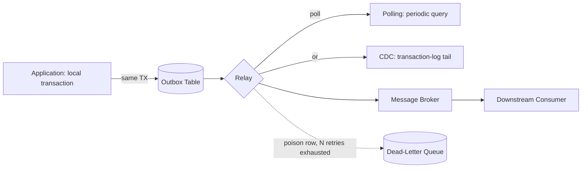
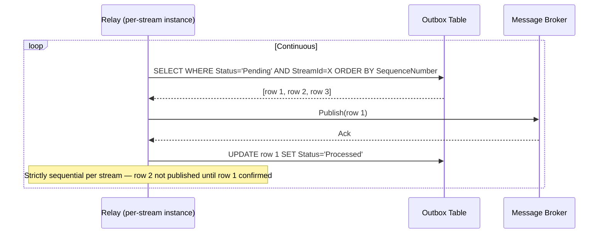
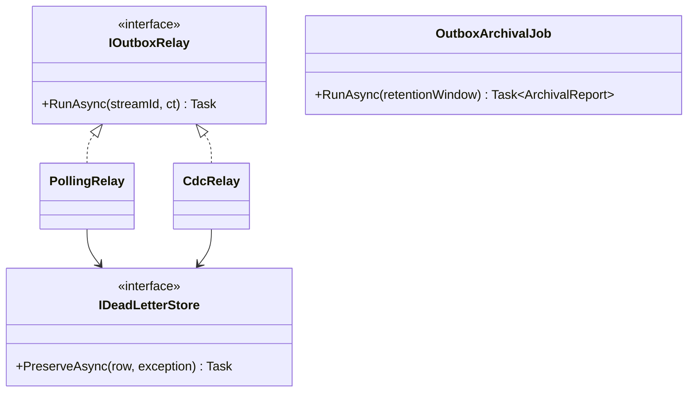
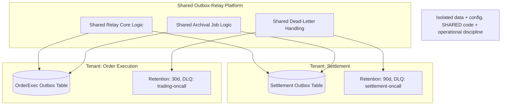
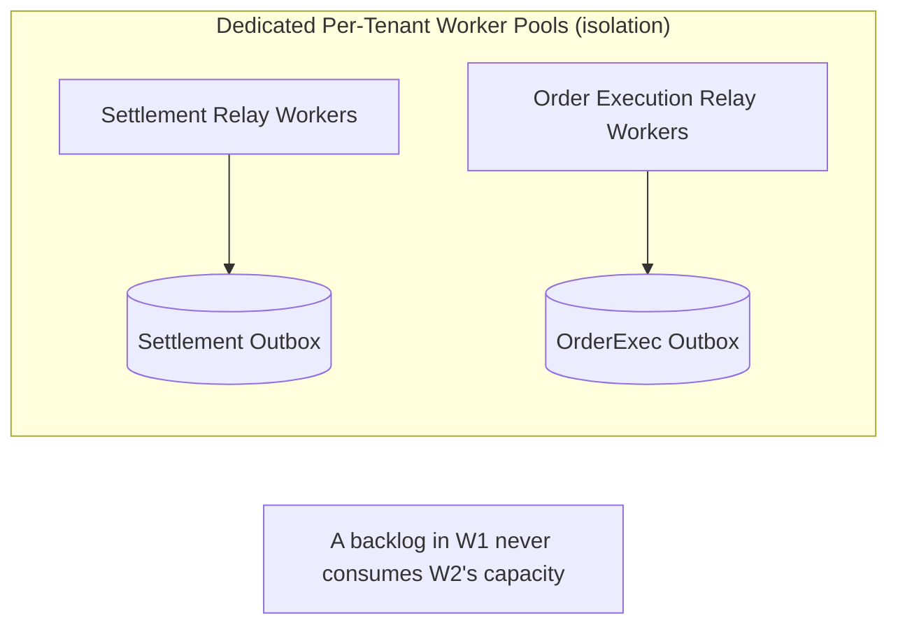
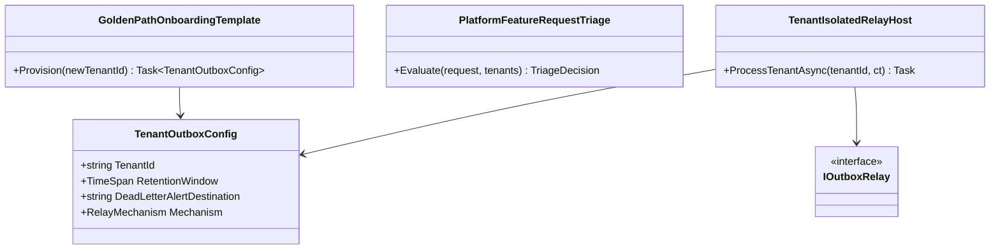

# Transactional Outbox — Complete Interview Prep (All Topics, One File)

> Domain: Outbox | Level: Beginner → Expert | Prerequisite: [[../16-Distributed-Systems/01-Distributed-Systems-Interview-Prep]] §10–11 (dual writes, idempotency), [[../19-Kafka/01-Kafka-Interview-Prep]], [[../04-SQL-Server/01-SQL-Server-Interview-Prep]] §12
> **Quick-prep edition** (consolidated 2026-10-03). This one file replaces Modules 125–126. Originals: `git show ebb2d5c:37-Outbox/<file>.md`
> Each topic has: **Key concepts → C#/SQL example → Most common interview questions with answers.**

| # | Topic | # | Topic |
|---|---|---|---|
| 1 | The dual-write problem | 7 | Poison messages & relay resilience |
| 2 | How the outbox works | 8 | The inbox (consumer-side dedupe) |
| 3 | Outbox table design | 9 | Frameworks: MassTransit, NServiceBus, Wolverine, Debezium |
| 4 | Polling relay | 10 | Capstone: a shared multi-tenant outbox platform |
| 5 | CDC-based relay | 11 | Alternatives & when not to use it |
| 6 | Ordering, growth & archival | 12 | Top 20 rapid-fire + Principal · 13 Mistakes checklist |

---

## 1. The Dual-Write Problem

**Key concepts**
- A service must **change its database** and **publish an event/message** (to Kafka/Service Bus/SQS). These are two systems; there's no shared transaction.
- **Failure cases:** DB commit succeeds then publish fails/crashes → event lost (downstream never learns); publish succeeds then DB commit fails → **phantom event** about something that never happened; publishing inside the DB transaction before commit → same phantom risk on rollback.
- 2PC/XA across DB and broker is usually unavailable or undesirable.

**Common interview question**

**Q. Why can't you just publish after `SaveChanges()`?**
If the process crashes, the network fails or the broker is down between the commit and the publish, the event is lost forever while the state changed — downstream services (ledger, notifications) silently diverge. Retrying in-process doesn't survive a crash.

---

## 2. How the Outbox Works

1. In the **same local transaction** as the business change, insert the message into an **outbox table**.
2. A **relay** (polling publisher or CDC) reads unpublished outbox rows and publishes them to the broker.
3. After the broker acknowledges, mark the row published (or delete it).
4. Delivery is **at-least-once** (the relay may publish then crash before marking) → **consumers must be idempotent** (inbox).

```text
App:   BEGIN TX → UPDATE Orders ... → INSERT Outbox(id, type, payload, aggregate_id) → COMMIT
Relay: SELECT unpublished ORDER BY id → publish(key = aggregate_id) → broker ack → UPDATE Outbox SET published_at = now()
Consumer: BEGIN TX → INSERT Inbox(message_id) (unique) → apply effect → COMMIT   (duplicate → skip)
```

**Common interview question**

**Q. What does the outbox buy you, and what doesn't it?**
It guarantees that a state change and its event are both committed or neither (atomicity via the local DB) and that the event will eventually be published. It doesn't give exactly-once delivery (duplicates happen), global ordering, or protection against consumers mishandling events — those need idempotent consumers and partitioning.

---

## 3. Outbox Table Design

```sql
CREATE TABLE dbo.Outbox (
    Id             UNIQUEIDENTIFIER NOT NULL PRIMARY KEY NONCLUSTERED,   -- message ID (dedupe key downstream)
    Sequence       BIGINT IDENTITY NOT NULL,                             -- relay order
    AggregateType  VARCHAR(100)  NOT NULL,
    AggregateId    VARCHAR(100)  NOT NULL,                               -- partition key → per-aggregate ordering
    EventType      VARCHAR(200)  NOT NULL,
    Payload        NVARCHAR(MAX) NOT NULL,                               -- serialized integration event (versioned)
    Headers        NVARCHAR(MAX) NULL,                                   -- traceparent, correlation, tenant
    OccurredAt     DATETIME2     NOT NULL DEFAULT SYSUTCDATETIME(),
    PublishedAt    DATETIME2     NULL,
    Attempts       INT           NOT NULL DEFAULT 0,
    LastError      NVARCHAR(2000) NULL
);
CREATE UNIQUE CLUSTERED INDEX CX_Outbox_Sequence ON dbo.Outbox(Sequence);
CREATE INDEX IX_Outbox_Unpublished ON dbo.Outbox(Sequence) WHERE PublishedAt IS NULL;     -- filtered index for the relay
```

- Store the **integration event contract** (stable, versioned), not internal domain objects.
- Include **trace context** in headers so traces continue through the broker.

```csharp
// Write side: business change + outbox in one SaveChanges
order.MarkPaid(paymentId);
db.Outbox.Add(new OutboxMessage
{
    Id = Guid.NewGuid(), AggregateType = "Order", AggregateId = order.Id.ToString(),
    EventType = "order.paid.v1",
    Payload = JsonSerializer.Serialize(new OrderPaidV1(order.Id, order.Total, order.Currency, DateTimeOffset.UtcNow)),
    Headers = JsonSerializer.Serialize(new { traceparent = Activity.Current?.Id })
});
await db.SaveChangesAsync(ct);
```

---

## 4. Polling Relay

**Key concepts**
- A background worker polls for unpublished rows in order, publishes, marks published. Simple, DB-agnostic.
- **Costs:** polling latency (interval) and query load; tune interval/batch size; use a filtered index.
- **Multiple relay instances:** avoid double publishing and preserve order → lock rows (`UPDLOCK, READPAST` / `FOR UPDATE SKIP LOCKED`) or a single active relay via a lease/leader election; or partition rows among relays by aggregate hash.

```csharp
public sealed class OutboxRelay(IServiceScopeFactory scopes, IProducer<string, string> producer, ILogger<OutboxRelay> log) : BackgroundService
{
    protected override async Task ExecuteAsync(CancellationToken ct)
    {
        using var timer = new PeriodicTimer(TimeSpan.FromMilliseconds(500));
        while (await timer.WaitForNextTickAsync(ct))
        {
            await using var scope = scopes.CreateAsyncScope();
            var db = scope.ServiceProvider.GetRequiredService<AppDbContext>();
            await using var tx = await db.Database.BeginTransactionAsync(ct);
            var batch = await db.Outbox
                .FromSql($"SELECT TOP (100) * FROM dbo.Outbox WITH (UPDLOCK, READPAST, ROWLOCK) WHERE PublishedAt IS NULL ORDER BY Sequence")
                .ToListAsync(ct);
            foreach (var msg in batch)
            {
                try
                {
                    await producer.ProduceAsync($"{msg.AggregateType.ToLowerInvariant()}-events",
                        new Message<string, string> { Key = msg.AggregateId, Value = msg.Payload,
                            Headers = new Headers { { "message-id", Encoding.UTF8.GetBytes(msg.Id.ToString()) } } }, ct);
                    msg.PublishedAt = DateTime.UtcNow;
                }
                catch (Exception ex)
                {
                    msg.Attempts++; msg.LastError = ex.Message;
                    log.LogWarning(ex, "Outbox publish failed for {MessageId}", msg.Id);
                    break;                                   // stop the batch to preserve per-aggregate order
                }
            }
            await db.SaveChangesAsync(ct);
            await tx.CommitAsync(ct);
        }
    }
}
```

---

## 5. CDC-Based Relay

**Key concepts**
- **Change Data Capture** (Debezium for SQL Server/PostgreSQL/MySQL; SQL Server CDC; DynamoDB Streams/Cosmos change feed) reads the outbox table's inserts from the **transaction log** and publishes them — low latency, no polling load, commit order preserved.
- Debezium's **Outbox Event Router** SMT routes rows to topics by aggregate type with the aggregate ID as key.
- Costs: more infrastructure (Kafka Connect, connectors), operational expertise, log retention/replication slot management (PostgreSQL slots can fill disks), schema change handling.

**Common interview question**

**Q. Polling relay or CDC?**
Polling for simplicity and moderate volume (sub-second to seconds latency acceptable, few services). CDC for low latency, high volume or many services, when the team can operate Kafka Connect/Debezium and monitor connectors and log retention.

---

## 6. Ordering, Growth & Archival

- **Ordering is per aggregate (stream), not global:** publish rows in sequence per aggregate and use the aggregate ID as the partition key; a failed message must block **its aggregate's** later messages (or the whole relay if simpler) to avoid reordering.
- **Growth:** delete or archive published rows (batch delete by `PublishedAt < now - N days`, partition switching for very high volume); keep a retention window for troubleshooting/replay.
- Monitor **outbox backlog** (count/age of unpublished rows) — the key health metric.

---

## 7. Poison Messages & Relay Resilience

- A message that can never be published (oversized, serialization bug, topic missing) must not block the relay forever: after N attempts move it to a **dead-letter table** and alert — but consider the ordering consequence for that aggregate (hold the aggregate's later messages or explicitly accept reordering).
- Broker outages: the outbox **buffers** events in the DB — the system keeps accepting writes; the relay catches up later (protect the broker with rate limits on catch-up).
- Alerts: backlog age, attempt counts, DLQ size, relay down.

**Common interview question**

**Q. The broker is down for an hour. What happens with an outbox?**
Business transactions keep succeeding; events accumulate in the outbox table; when the broker recovers the relay publishes the backlog in order (throttled). Monitor backlog age and make sure the DB has capacity for the growth.

---

## 8. The Inbox (Consumer-Side Dedupe)

```csharp
// Consumer: dedupe by message ID in the same transaction as the effect
public async Task HandleAsync(ConsumeResult<string, string> msg, CancellationToken ct)
{
    var messageId = Guid.Parse(Encoding.UTF8.GetString(msg.Message.Headers.GetLastBytes("message-id")));
    await using var tx = await db.Database.BeginTransactionAsync(ct);
    if (await db.Inbox.AnyAsync(i => i.MessageId == messageId, ct)) return;      // duplicate
    db.Inbox.Add(new InboxMessage { MessageId = messageId, ProcessedAt = DateTime.UtcNow });
    await ApplyBusinessEffectAsync(msg.Message.Value, ct);
    await db.SaveChangesAsync(ct);                                                // unique key also guards races
    await tx.CommitAsync(ct);
}
```

- Retain inbox rows longer than the maximum redelivery/replay window, then purge.

---

## 9. Frameworks: MassTransit, NServiceBus, Wolverine, Debezium

```csharp
// MassTransit EF Core outbox: publishes via the outbox automatically inside handlers/endpoints
builder.Services.AddMassTransit(x =>
{
    x.AddEntityFrameworkOutbox<AppDbContext>(o =>
    {
        o.UseSqlServer();
        o.UseBusOutbox();                     // messages published via IPublishEndpoint go to the outbox
        o.QueryDelay = TimeSpan.FromSeconds(1);
    });
    x.UsingRabbitMq((ctx, cfg) => cfg.ConfigureEndpoints(ctx));
});
// In a controller/handler: await publishEndpoint.Publish(new OrderPaid(...)); await db.SaveChangesAsync();  → atomic
```

- **NServiceBus** outbox (consumer side dedupe + transactional sends), **Wolverine** (durable outbox/inbox with Marten/EF Core), **Debezium** (CDC), **AWS/Azure**: DynamoDB Streams/Cosmos change feed as built-in outboxes.
- Prefer a proven framework over hand-rolling; check licensing (MassTransit v9+ commercial, NServiceBus commercial).

---

## 10. Capstone: a Shared Multi-Tenant Outbox Platform

**Scenario:** a dozen teams each hand-rolled outbox relays with different bugs; build a shared platform.

- **Model:** shared relay code/library + per-team configuration; each service keeps its **own outbox table in its own DB** (isolation) and the platform relay (CDC connectors or a relay service) is deployed per service or per tenant group.
- **Noisy-neighbour isolation:** per-tenant connectors/workers, quotas on publish rate, separate DLQs.
- **Migration:** onboard teams one at a time; run old and new relays in parallel with dedupe by message ID; compare published counts; cut over; delete old code.
- **Observability per tenant (never blended):** backlog age, throughput, failures per service.
- **Self-service onboarding:** a golden-path template (migration for the outbox table, configuration, dashboards, alerts).
- **Governance:** platform owns relay bugs; tenants own payload/schema issues; clear runbooks.

**Common interview question**

**Q. Twelve teams have their own outbox implementations. What do you do?**
Standardize on one implementation (framework or platform CDC), provide a golden-path template, migrate team by team with parallel running and dedupe, give per-team dashboards and ownership boundaries, and retire bespoke code — reducing duplicated bugs and on-call load.

---

## 11. Alternatives & When Not to Use It

| Alternative | Trade-off |
|---|---|
| **CDC on business tables** | no outbox table, but consumers couple to internal schemas; events are row diffs |
| **Event sourcing** | the event store is the source of truth — publishing from it is natural; big design change |
| **Listen to yourself** | publish first, update own state from the event; ordering/complexity |
| **Kafka transactions** | atomic within Kafka only — doesn't cover your DB write |
| **2PC/XA** | blocking, poorly supported |

**Not needed when:** losing an occasional event is acceptable (metrics), or when there's no DB write paired with the publish.

---

## 12. Top 20 Rapid-Fire Questions + Principal Questions

1. **Dual write?** DB + broker without a shared transaction.
2. **Outbox?** Event row in the same local transaction.
3. **Delivery?** At-least-once.
4. **Consumer requirement?** Idempotency (inbox).
5. **Relay types?** Polling or CDC.
6. **Multiple relays?** Row locks / leader / partitioning.
7. **Ordering?** Per aggregate; key by aggregate ID.
8. **Failed message?** Block its aggregate or DLQ with care.
9. **Key metric?** Backlog age.
10. **Growth?** Purge/archive published rows.
11. **Payload?** Versioned integration contract.
12. **Trace context?** In headers.
13. **CDC tool?** Debezium (Outbox Event Router).
14. **CDC risk?** Connector ops, log/slot retention.
15. **Broker down?** Outbox buffers; catch up later.
16. **Kafka transactions instead?** Don't cover the DB.
17. **.NET frameworks?** MassTransit, NServiceBus, Wolverine.
18. **Inbox retention?** Longer than redelivery/replay windows.
19. **Shared platform?** Per-tenant isolation + golden path.
20. **Exactly-once?** Effectively-once with inbox.

**Principal-level question**

**P. Make the case for standardizing the outbox across the organization.**
Dual-write bugs cause silent data divergence that's expensive to detect and reconcile, especially in finance. A standard outbox (framework or platform) with idempotent consumers, monitoring and runbooks eliminates a whole class of incidents, removes duplicated effort across teams, and gives auditors a consistent story for event delivery.

---

## 13. Mistakes Checklist (say why each is wrong)
- [ ] Publishing to the broker inside or after the DB transaction without an outbox
- [ ] Non-idempotent consumers · no inbox/dedupe
- [ ] Multiple relays without locking (double publish, reordering)
- [ ] Poison messages blocking the relay forever · no backlog alerts
- [ ] Unbounded outbox table growth · publishing internal domain objects as payloads
- [ ] CDC slots/connectors unmonitored (disk fill) · trace context dropped

---

## Architecture Diagrams (preserved from the original modules)

> All 7 Mermaid/ASCII diagrams from the original `37-Outbox/` files, kept verbatim and grouped by source module. Originals: `git show ebb2d5c:37-Outbox/<file>.md`.

### Module 125 — Outbox: Transactional Outbox Table Design, Relay Mechanisms & Delivery Guarantees
*Source: `01-OutboxFundamentals-TableDesign-RelayMechanisms-DeliveryGuarantees.md`*

**3. Visual Architecture**



**3. Visual Architecture**



**13. Low-Level Design**



### Module 126 — Outbox: Capstone — A Shared, Multi-Tenant Outbox-Relay Platform at Organizational Scale
*Source: `02-Capstone-SharedMultiTenantOutboxRelayPlatform.md`*

**1. Fundamentals**

```text
Shared Outbox-Relay Platform (one centrally-owned service/library)
 ├── Tenant: Settlement — own outbox table, own retention/DLQ config, own dashboard
 ├── Tenant: Order Execution — own outbox table, own retention/DLQ config, own dashboard
 ├── Tenant: Ledger —...
 └── Tenant: Regulatory —...
Each tenant's data and processing is isolated; the platform's CODE and operational discipline is shared.
```

**3. Visual Architecture**



**3. Visual Architecture**



**13. Low-Level Design**


