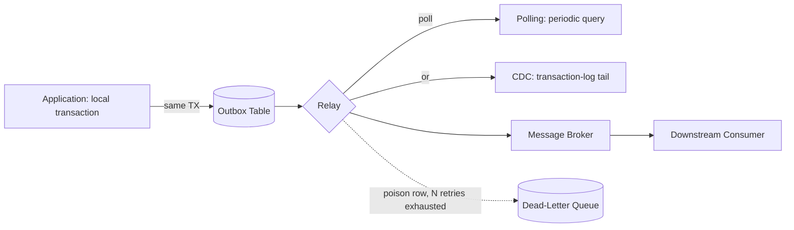
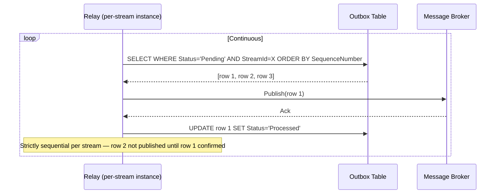
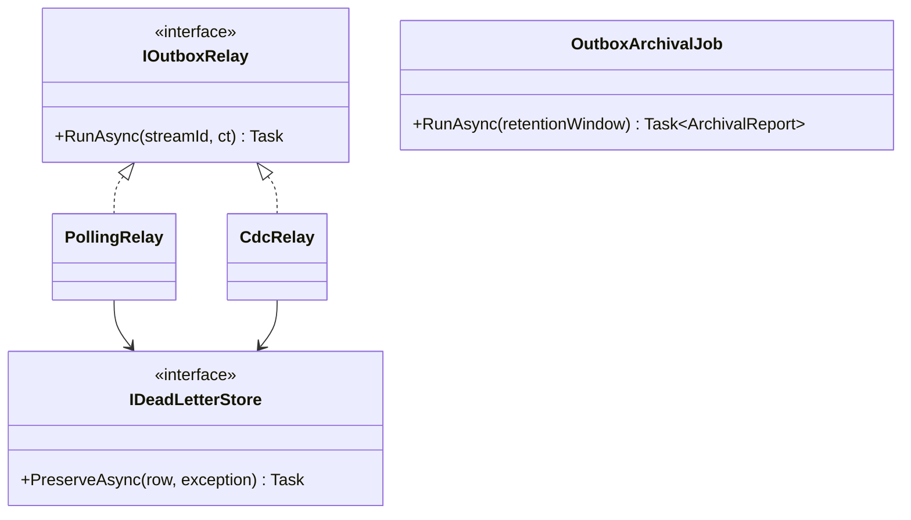

# Module 125 — Outbox: Transactional Outbox Table Design, Relay Mechanisms & Delivery Guarantees

> Domain: Outbox | Level: Beginner → Expert | Prerequisite: [[../36-Saga/02-Capstone-MultiPartySettlementOrchestrationAtScale]] and, by this point, essentially every prior domain module referencing "the Outbox pattern" (first introduced Module 111 Advanced Q2, used continuously since as the reliable-delivery mechanism for Domain Events, CQRS projections, Event Sourcing, and Saga coordination) — this module is the first to make the Outbox pattern itself, specifically its **relay mechanism**, the primary subject, rather than a cited, assumed-reliable building block
>
> **Domain scope note:** `37-Outbox` is scoped to 2 modules (125–126, standard depth, autonomously scoped per the "no more waiting" workflow decision) — deliberately narrow, since this pattern's core rationale (write event + state in one local transaction) has already been established extensively; this domain's genuinely new content is the relay mechanism itself: table design, polling vs. CDC, ordering, archival, and poison-message handling. Full 16-section template; Elite FinTech Interview Panel lens.

---

## 1. Fundamentals

**What:** The Outbox pattern's often-glossed-over second half: a **relay** process that reads events written to the outbox table (within the same local transaction as the originating state change, Module 111 Advanced Q2) and reliably, in order, delivers them to their actual destination (a message broker, a downstream service) — the pattern's correctness depends entirely on this relay's own design, not merely on the transactional-write half every prior module has already assumed works.

**Why:** Every module since Module 111 has cited "the Outbox pattern" as the fix for reliable event delivery — but the relay itself is where ordering, retry, poison-message, and table-growth problems actually live; this module makes that mechanism explicit rather than continuing to treat it as an assumed black box.

**When:** Any time a service needs to reliably, eventually deliver an event that was durably recorded alongside a local transaction — which, by this point in the course, describes nearly every event-publishing scenario across Modules 111–124.

**How (30,000-ft view):**
```
[Local Transaction: state change + INSERT INTO Outbox(...)]  ← already established, Module 111
                            ↓
[Relay: reads unprocessed Outbox rows, publishes to broker, marks processed]  ← THIS module's focus
                            ↓
[Downstream consumer receives event, at-least-once]
```

---

## 2. Deep Dive

### 2.1 Outbox Table Schema Design
A minimal, correct outbox table needs: a unique event ID (the idempotency key every downstream consumer, per Module 118/119, relies on), the aggregate/stream ID (for ordering, §2.4), the serialized event payload, a monotonically-increasing sequence number *within its own aggregate/stream* (never a global sequence, which would force unnecessary cross-aggregate ordering), a creation timestamp, and a processing-status field (`Pending`/`Processed`/`Failed`) — the processing-status field is what turns a simple append-only log into something a relay can efficiently query for unprocessed work.

### 2.2 Polling Relay — Simplicity at the Cost of Latency and Query Load
The simplest relay: a background job periodically querying `WHERE Status = 'Pending' ORDER BY SequenceNumber`, publishing each, then marking it `Processed` — simple, requires no special database feature, but introduces a direct trade-off between poll interval (shorter = lower latency, higher query load against the source database) and query cost, and every poll cycle re-scans (or, with a good index, efficiently seeks) the pending-row set.

### 2.3 CDC-Based Relay — Lower Latency, Higher Operational Complexity
A Change-Data-Capture relay (e.g., Debezium reading SQL Server's transaction log directly) detects new outbox rows the moment they're committed, without polling at all — near-zero latency and no repeated query load against the source database, at the cost of a genuinely more complex operational dependency (a CDC connector reading the database's own internal transaction log, itself requiring its own monitoring, versioning, and failure-recovery discipline) — directly the same "lower latency, more operational complexity" trade-off this course has seen repeatedly (Module 23's Ambient-mode-vs-sidecar trade-off is structurally identical in kind).

### 2.4 Ordering Guarantees — Per-Stream, Not Global
A relay must preserve ordering *within* a given aggregate/stream (Module 118/119's partition-keying discipline, reapplied here) — this typically means exactly one relay instance (or one partition-consistent-hash-routed instance) processes a given stream's outbox rows at a time, never two relay instances concurrently racing to publish the same stream's events, which could deliver them out of order to downstream consumers even if each individual publish succeeds.

### 2.5 Outbox Table Growth and Archival
An outbox table that never purges processed rows grows unboundedly, eventually degrading the relay's own query performance (even a well-indexed "pending rows" query pays some cost from an ever-larger underlying table) — a retention policy (keep processed rows for N days for replay/audit purposes, per Module 116/121's audit-value reasoning, then archive or purge) is a required, not optional, operational component, exactly the same "declared cleanup policy vs. actual, verified cleanup" theme Module 91's artifact-retention module already established.

### 2.6 Poison-Message Handling — Never Block the Whole Relay Indefinitely
A single outbox row the relay repeatedly fails to publish (a malformed payload, a permanently-rejecting downstream consumer) must not block every *subsequent* row in the same stream indefinitely — a bounded-retry-then-dead-letter mechanism (directly Module 26/20's dead-letter-queue discipline, reapplied here) isolates the poison row for manual investigation while allowing the relay to continue processing the stream's remaining, healthy events.

---

## 3. Visual Architecture





---

## 4. Production Example

**Problem:** The Order Execution Engine's (Module 118) outbox table, after a year of production operation, had grown to over 400 million rows (mostly already-`Processed`), and the polling relay's own query — despite a seemingly correct index on `(Status, SequenceNumber)` — had degraded from single-digit-millisecond polls to multi-second polls, directly increasing end-to-end event-delivery latency system-wide.

**Architecture:** A polling relay (§2.2), chosen originally for its operational simplicity, with no archival/cleanup process ever implemented.

**Implementation:** The `(Status, SequenceNumber)` index was, in principle, selective for `Status = 'Pending'` rows — but the database's own query planner, given the table's overwhelming majority of `Processed` rows, occasionally chose a less efficient execution plan than expected, and more fundamentally, index maintenance cost itself (on every insert) had grown proportionally to total table size, `Processed` rows included.

**Trade-offs:** Archiving/purging `Processed` rows trades some audit-query convenience (having to query a separate, colder archive table for very old event history) against materially better ongoing relay-query and insert performance on the primary, hot outbox table.

**Lessons learned:** A retention policy was added — `Processed` rows older than 30 days (calibrated against this system's own actual replay/audit needs, not an arbitrary default) are moved to a separate, cold archive table via a scheduled job, keeping the primary outbox table's actual working size bounded and its query/insert performance restored to its original, healthy baseline; this directly reproduces Module 91's own already-established "an unbounded, ungoverned retention policy eventually degrades the very system it was meant to support" finding, now specifically for the outbox table.

---

## 5. Best Practices
- Design the outbox table schema with per-stream sequence numbers from day one, never a global sequence that would force unnecessary cross-stream ordering (§2.1, §2.4).
- Implement archival/cleanup for processed outbox rows before table growth becomes a measured problem, not after (§4/§5).
- Choose CDC over polling specifically when measured latency requirements genuinely demand it — not reflexively, given its added operational complexity (§2.3).
- Isolate poison messages via a bounded-retry-then-dead-letter mechanism — never let one bad row block an entire stream's healthy events indefinitely (§2.6).
- Calibrate archival retention duration against this specific system's own actual, demonstrated audit/replay needs (Module 116/121's precedent), not an arbitrary, uniform default.

## 6. Anti-patterns
- No archival/cleanup process for processed outbox rows, letting the table grow unboundedly until relay performance measurably degrades (§4's incident).
- A global, cross-stream sequence number forcing artificial ordering dependencies between genuinely unrelated streams.
- Adopting CDC by default "because it's more modern," without a genuine, measured latency requirement CDC specifically addresses that polling doesn't already satisfy.
- A relay with no bounded-retry/dead-letter mechanism, allowing one poison row to silently stall an entire stream's delivery indefinitely.
- Multiple relay instances concurrently processing the same stream without partition-consistent routing, risking out-of-order delivery.

---

## 7. Performance Engineering

**CPU/Memory:** A polling relay's CPU cost scales with poll frequency and query complexity; a CDC relay's cost is driven by transaction-log-parsing throughput, typically lower per-event but with its own fixed connector overhead.

**Latency:** Polling relay latency ≈ poll interval / 2 on average, plus publish time; CDC relay latency ≈ transaction-log-propagation delay (typically sub-second) plus publish time — a genuine, measurable difference worth quantifying against this system's actual latency requirements before choosing.

**Throughput:** Both approaches must sustain throughput at least matching peak event-generation rate (Module 102's capacity-planning discipline, reapplied) — a polling relay's throughput is bounded by query-batch-size × poll-frequency; a CDC relay's throughput is typically bounded by the connector's own processing rate.

**Scalability:** Both approaches scale horizontally by partitioning across streams (§2.4), with exactly one relay instance/partition-owner per stream at any time.

**Benchmarking:** Load-test relay throughput against realistic peak event-generation rates, including the specific effect of table size (§4) on polling-query performance at genuinely large, production-representative row counts — not a small, freshly-created test table that won't reveal §4's exact degradation pattern.

**Caching:** Not typically relevant to relay mechanics themselves.

---

## 8. Security

**Threats:** A compromised relay process publishing forged or replayed events; unauthorized direct access to the outbox table bypassing the relay entirely.

**Mitigations:** The relay's own credentials scoped narrowly (read/update access to the outbox table specifically, publish access to the broker) — never broader database access than its specific job requires; broker-side authentication verifying the relay's own identity for every publish.

**OWASP mapping:** Broken Access Control risk if any component other than the relay itself has write access to mark outbox rows as `Processed`, potentially allowing a bug or compromise elsewhere to silently suppress legitimate event delivery.

**AuthN/AuthZ:** Downstream consumers independently authenticate and authorize the relay's published messages exactly as they would any other message source — no implicit trust extended merely because a message originated from "the outbox relay."

**Secrets:** Relay-to-broker and relay-to-database credentials managed and rotated per Module 86's established discipline.

**Encryption:** Outbox payload encryption at rest and in transit matches whatever standard the underlying event/business data already requires (Module 121 §8's field-level encryption discipline, reapplied here if the outbox stores sensitive financial event payloads).

---

## 9. Scalability

**Horizontal scaling:** Relay instances scale horizontally by stream partition (§2.4), identical in kind to every prior module's partition-keying pattern.

**Vertical scaling:** A CDC connector's own throughput may benefit from vertical scaling of its dedicated infrastructure, distinct from the source database's own scaling.

**Caching:** Not a primary lever here.

**Replication/Partitioning:** The outbox table itself typically lives within the same database as the originating state change (a structural requirement of the pattern, Module 111 Advanced Q2) — its own replication/HA is inherited from that database's existing configuration.

**Load balancing:** Partition-consistent-hash routing across relay instances, never naive round-robin (identical reasoning to Module 118/119's own established caution).

**High Availability:** A relay instance's failure must not lose track of which rows remain unprocessed — since outbox rows and their status live durably in the database itself, a replacement relay instance simply resumes querying/consuming from where the failed instance left off, with idempotent publish/mark-processed logic (§2.1) as the correctness backstop for any in-flight-at-failure row.

**Disaster Recovery:** The outbox table's own durability is inherited from the source database's existing DR posture — no separate DR mechanism specific to the relay itself is typically required, beyond the relay process's own statelessness (all durable state lives in the outbox table).

**CAP theorem:** The outbox table's write path favors consistency (it must durably, atomically commit alongside the originating state change, Module 111 Advanced Q2's core guarantee) — the relay's own read/publish path can tolerate brief availability gaps (a relay outage delays delivery but doesn't lose data, given the durable outbox table) without violating the pattern's core correctness guarantee.

---

## 10. Interview Questions

### Basic (10)

1. **Q: What does "the relay" refer to in the Outbox pattern, and why has this course's prior modules mostly assumed it "just works"?**
   **A:** The process reading unprocessed outbox rows and publishing them to their actual destination; prior modules cited the pattern's transactional-write guarantee (Module 111) without detailing this relay mechanism, which this module now makes explicit.
   **Why correct:** States the specific component this module focuses on and honestly acknowledges the prior, assumed-black-box treatment.
   **Common mistakes:** Conflating "the Outbox pattern" entirely with just the transactional write, missing that reliable delivery equally depends on correct relay design.
   **Follow-ups:** "What are the two main relay implementation styles?" (Polling and CDC, §2.2/§2.3.)

2. **Q: Why should an outbox row's sequence number be scoped per-stream rather than global?**
   **A:** A global sequence would force unnecessary ordering dependencies between genuinely unrelated streams, exactly the kind of artificial coupling this course has repeatedly warned against (§2.1/§2.4).
   **Why correct:** States the specific coupling risk a global sequence introduces.
   **Common mistakes:** Assuming a single, simple global auto-increment column is the natural, correct default.
   **Follow-ups:** "What does per-stream ordering actually guarantee?" (Events for the same aggregate/stream are delivered in the order they occurred, without constraining unrelated streams' relative order, §2.4.)

3. **Q: What is the core trade-off between polling and CDC-based relay mechanisms?**
   **A:** Polling is simpler and requires no special database feature, at the cost of latency (bounded by poll interval) and repeated query load; CDC offers near-zero latency and no polling load, at the cost of a genuinely more complex operational dependency (§2.2/§2.3).
   **Why correct:** States both sides of the trade-off precisely.
   **Common mistakes:** Assuming CDC is unconditionally superior without weighing its added operational complexity.
   **Follow-ups:** "When would polling's simplicity outweigh CDC's latency benefit?" (When the business process's actual latency tolerance is well within polling's achievable range, and the team lacks CDC operational expertise, §15.)

4. **Q: Why must exactly one relay instance (or partition-consistent routing) own a given stream's outbox rows at a time?**
   **A:** To preserve per-stream ordering (§2.4) — two concurrent relay instances racing to process the same stream could deliver its events out of order even if each individual publish succeeds.
   **Why correct:** States the specific ordering risk uncoordinated concurrent relay instances would introduce.
   **Common mistakes:** Assuming any relay instance can safely process any row regardless of which stream it belongs to.
   **Follow-ups:** "What pattern already established in this course provides this per-stream routing?" (Partition-key-based consumer routing, Module 118/119 §9.)

5. **Q: Why does an outbox table need an archival/cleanup policy at all, if processed rows are otherwise harmless?**
   **A:** An ever-growing table eventually degrades relay query and insert performance, even for well-indexed queries specifically targeting pending rows (§2.5, §4).
   **Why correct:** States the specific, measurable consequence unbounded growth produces.
   **Common mistakes:** Assuming already-processed rows are entirely inert and have no ongoing performance cost.
   **Follow-ups:** "What determines an appropriate retention duration before archival?" (This system's own actual, demonstrated replay/audit needs — not an arbitrary, uniform default, §5.)

6. **Q: What is a "poison message" in this context?**
   **A:** An outbox row the relay repeatedly fails to publish successfully (a malformed payload, a permanently-rejecting consumer), requiring isolation rather than indefinite retry (§2.6).
   **Why correct:** States the specific scenario and why it requires special handling.
   **Common mistakes:** Assuming indefinite retry is always the safe, correct default response to any publish failure.
   **Follow-ups:** "What happens to a poison message after retries are exhausted?" (Routed to a dead-letter queue for manual investigation, isolated from blocking the rest of the stream, §2.6.)

7. **Q: Why must the relay's own database credentials be scoped narrowly rather than granted broad database access?**
   **A:** Least-privilege — the relay only needs read/update access to the outbox table specifically; broader access increases the impact of any compromise or bug in the relay process itself (§8).
   **Why correct:** States the specific security principle and its rationale.
   **Common mistakes:** Granting the relay broad, convenient database access "to simplify configuration" without considering the elevated blast radius this creates.
   **Follow-ups:** "What OWASP risk category does over-broad relay access fall under?" (Broken Access Control, §8.)

8. **Q: Does the relay's own availability need to match the source database's availability guarantee?**
   **A:** No — the relay's read/publish path can tolerate brief availability gaps without losing data, since the durable outbox table (which does require strong consistency) preserves all pending work regardless of relay downtime (§9).
   **Why correct:** Correctly distinguishes the outbox table's own CP requirement from the relay process's more tolerant availability profile.
   **Common mistakes:** Assuming the relay itself needs the identical strong-consistency/high-availability engineering rigor as the outbox table it reads from.
   **Follow-ups:** "What happens to pending events during a relay outage?" (They simply remain `Pending` in the durable outbox table, delivered once the relay resumes — no data loss, only delayed delivery, §9.)

9. **Q: Why does §4's incident describe an index that was "in principle" selective as still degrading over time?**
   **A:** Insert/maintenance cost on the index itself grows proportionally to total table size, `Processed` rows included, even if query selectivity for `Pending` rows remains theoretically good (§4).
   **Why correct:** States the specific, easy-to-overlook mechanism (index-maintenance cost scaling with total rows, not just query selectivity).
   **Common mistakes:** Assuming a selective index alone fully insulates query performance from unbounded underlying table growth.
   **Follow-ups:** "What specifically fixed this in §4's case?" (Archiving processed rows older than a calibrated retention window to a separate, cold table, restoring the primary table's healthy working size, §4.)

10. **Q: Should downstream consumers trust a message merely because it originated from the outbox relay?**
    **A:** No — they independently authenticate and authorize it exactly as any other message source, per §8.
    **Why correct:** Correctly reapplies this course's now-repeated "no implicit trust between coordinated components" principle (Module 123 §8's saga-step analog) to the relay specifically.
    **Common mistakes:** Assuming a message's origin from "the outbox relay" itself constitutes sufficient authorization.
    **Follow-ups:** "What course-established principle does this directly reapply?" (Module 119 §8/Module 123 §8's "coordination doesn't imply trust" finding, §8.)

### Intermediate (10)

1. **Q: Design the specific outbox table schema fields and explain why each is necessary, synthesizing §2.1.**
   **A:** `EventId` (unique, the downstream idempotency key, Module 118/119); `StreamId` (aggregate/stream identity, for partition routing and per-stream ordering); `SequenceNumber` (monotonic *within* `StreamId`, never global); `Payload` (serialized event); `CreatedAtUtc`; `Status` (`Pending`/`Processed`/`Failed`, enabling efficient relay querying); `ProcessedAtUtc` (nullable, supporting archival-age calculation, §2.5).
   **Why correct:** Justifies each specific field's purpose rather than listing fields without explaining their necessity.
   **Common mistakes:** Omitting `StreamId`/per-stream `SequenceNumber`, which would make correct per-stream ordering (§2.4) impossible to enforce at the relay layer.
   **Follow-ups:** "Why is `ProcessedAtUtc` specifically useful beyond just knowing a row is `Processed`?" (It enables calculating exactly how old a processed row is, the specific input the archival policy's age-based retention decision (§2.5) needs.)

2. **Q: Why would a polling relay's query specifically benefit from a composite index on `(StreamId, Status, SequenceNumber)` rather than separate, single-column indexes?**
   **A:** The relay's actual query pattern is "give me the next pending row(s) for this specific stream, in sequence order" — a composite index matching this exact access pattern lets the database satisfy the query via a single, efficient index seek, rather than requiring it to intersect results from multiple separate single-column indexes.
   **Why correct:** Connects the specific index design to the relay's actual, concrete query pattern rather than a generic "add an index" recommendation.
   **Common mistakes:** Assuming any index touching the relevant columns is equally effective, without considering column order and how it matches the actual query shape.
   **Follow-ups:** "Would this same index design still perform well after §4's table-growth incident, absent archival?" (No — even a well-matched composite index still pays growing maintenance cost as total table size grows, per §4's own specific finding; a good index design and an archival policy are complementary, not substitutes for each other.)

3. **Q: How would you decide, concretely, whether a given system's latency requirements justify CDC over polling?**
   **A:** Measure the business process's actual, required end-to-end latency tolerance and compare it against polling's achievable latency (roughly poll-interval/2 plus publish time) — if a sufficiently short poll interval (e.g., every 100ms) already comfortably satisfies the requirement without excessive query load, polling remains the simpler, lower-operational-complexity choice; only if the requirement genuinely demands sub-poll-interval latency, or if even a short poll interval's cumulative query load becomes a measured database-performance concern, does CDC's added complexity become justified.
   **Why correct:** Gives a concrete, measurement-based decision test rather than a blanket preference for either mechanism.
   **Common mistakes:** Choosing CDC reflexively for its lower theoretical latency without first confirming the business process actually requires latency polling couldn't already comfortably satisfy.
   **Follow-ups:** "What's a concrete example of a business process where CDC's latency benefit would be clearly, measurably necessary?" (A genuinely real-time trading-signal propagation need, Module 118's context, where even a 50ms polling-induced delay meaningfully affects trading outcomes — contrasted with, say, a daily batch regulatory report where seconds of additional latency are entirely immaterial.)

4. **Q: Why does per-stream relay-instance ownership (§2.4) need to survive a relay-instance restart or failover correctly?**
   **A:** If ownership isn't correctly, durably reassigned to a replacement instance on failure, either the stream's events stop being processed entirely (an availability gap) or, worse, two instances could simultaneously believe they own the same stream (a correctness risk, violating the exactly-one-owner invariant §2.4 depends on) — the ownership-assignment mechanism itself (e.g., Kafka consumer-group partition assignment) must be as robust to failure as the relay's own idempotent publish logic.
   **Why correct:** Identifies both possible failure consequences (availability gap or correctness-violating dual ownership) and connects the requirement to an already-established, robust mechanism.
   **Common mistakes:** Assuming ownership reassignment is a solved, automatic property of any partitioned system without considering the specific robustness this reassignment mechanism itself requires.
   **Follow-ups:** "What underlying mechanism, already established in this course, typically provides this robust ownership reassignment?" (Kafka's own consumer-group rebalancing protocol, Module 118/119/120's already-established partition-consumption pattern.)

5. **Q: Critique an archival policy that deletes processed outbox rows immediately upon successful publish, with zero retention window.**
   **A:** This removes any ability to replay or audit recently-delivered events for debugging or reconciliation purposes (directly Module 120/121's already-established reconciliation techniques, which specifically depend on being able to inspect recent event history) — a brief, deliberate retention window (even a few days) preserves this genuinely valuable capability at negligible additional storage cost, while still avoiding §4's unbounded-growth risk through eventual archival/purge past that window.
   **Why correct:** Identifies the specific capability (recent-history reconciliation/debugging) an immediate-deletion policy would eliminate, and proposes the correct, calibrated middle ground.
   **Common mistakes:** Treating "delete processed rows as soon as possible" as the safest, most storage-efficient default, without weighing the genuine, demonstrated value of a brief retention window for exactly the reconciliation techniques this course has repeatedly relied upon.
   **Follow-ups:** "How would you determine the specific retention window duration?" (Calibrated against how far back this system's own reconciliation/debugging processes have actually needed to look historically, directly Module 120 Advanced Q3's per-consumer calibration principle, reapplied to retention-window sizing.)

6. **Q: How does a bounded-retry-then-dead-letter mechanism (§2.6) specifically prevent head-of-line blocking for a stream's remaining events?**
   **A:** By moving the poison row out of the stream's own processing queue after a bounded number of failed attempts (routing it to a separate dead-letter store instead), the relay can then proceed to the *next* sequence number in that stream, rather than remaining stuck retrying the same, permanently-failing row indefinitely while every subsequent event for that stream waits behind it.
   **Why correct:** Explains the specific mechanism (removing the blocking row from the main processing path) that resolves head-of-line blocking, rather than merely asserting dead-lettering is good practice.
   **Common mistakes:** Assuming simply retrying more times, or with a longer backoff, would eventually resolve a genuinely poison (not transient) failure, rather than recognizing some failures require explicit isolation, not more retries.
   **Follow-ups:** "Does dead-lettering a row violate per-stream ordering (§2.4) for the events that come after it?" (In a strict sense, yes — the dead-lettered event's business effect is now delayed relative to its original position; this is an accepted, deliberate trade-off (continue processing healthy events promptly) versus the alternative (blocking everything indefinitely), which is almost always worse.)

7. **Q: Why is granting the relay only `Pending`-row read access and `Status`-update access (not broader table access) specifically important, beyond general least-privilege hygiene?**
   **A:** It structurally prevents the relay process itself (or a bug/compromise within it) from ever modifying an event's own payload or sequence data — the relay's job is strictly to *observe and mark* outbox rows, never to *alter* the historical record itself, directly Module 121's append-only/tamper-evidence philosophy extended to constrain the relay's own access scope specifically.
   **Why correct:** Connects this specific access-scoping requirement to an already-established, broader architectural principle (tamper-evident, append-only history) rather than treating it as generic, unmotivated least-privilege advice.
   **Common mistakes:** Granting the relay update access to the full row (including payload) "for convenience," when its legitimate job only ever requires updating the status field.
   **Follow-ups:** "What would a compromised relay with full row-update access be able to do that a correctly-scoped relay couldn't?" (Silently alter a historical event's payload before or after publishing it, directly undermining the tamper-evidence guarantee this course has established as a core value proposition of this entire event-driven architecture family.)

8. **Q: Why might a CDC-based relay's own connector itself need the same kind of liveness monitoring this course established for fitness functions and security scanners?**
   **A:** A CDC connector can silently stop consuming the transaction log (a configuration drift, a version incompatibility after a database upgrade) while appearing, at a coarse glance, to still be "running" — directly this course's now fully-established "verify the verifier" theme, requiring an independent check (e.g., confirming the connector's own reported last-processed transaction-log position continues advancing, not just that its process is alive) rather than trusting the connector's mere uptime as evidence of genuine, ongoing event delivery.
   **Why correct:** Correctly reapplies this course's central, recurring theme to the CDC connector specifically, naming a concrete verification signal (log-position advancement, not just process uptime).
   **Common mistakes:** Assuming a CDC connector's own process-level health check (is it running?) is sufficient monitoring, missing the more subtle, "running but not actually making progress" failure mode this theme has repeatedly surfaced elsewhere.
   **Follow-ups:** "What would this exact failure mode look like in practice?" (The connector process shows as healthy in infrastructure monitoring, but its own transaction-log-position metric has been flat for hours, silently meaning zero new events have actually been relayed during that entire window.)

9. **Q: Design a specific test verifying that two concurrent relay instances cannot simultaneously process the same stream's rows, extending this course's now-established contract/independence-testing discipline.**
   **A:** A deliberate, injected-concurrency test (directly Module 124 Advanced Q4's parallel-branch concurrency-testing technique, reapplied here) explicitly starting two relay instances configured to believe they both own the same stream, verifying the actual partition-ownership/consumer-group mechanism correctly prevents both from processing concurrently — confirming the *mechanism*, not merely the *design intent*, actually enforces exclusive per-stream ownership under a deliberately-adversarial test condition.
   **Why correct:** Correctly reapplies an already-established concurrency-testing technique to verify this module's own specific ordering-guarantee mechanism, rather than assuming the underlying partition-ownership infrastructure works correctly without direct verification.
   **Common mistakes:** Assuming the partition-ownership/consumer-group mechanism (e.g., Kafka's own rebalancing protocol) is inherently, provably correct without any need for this system's own integration-level verification that it's actually configured and behaving as intended in this specific deployment.
   **Follow-ups:** "What would a failure of this specific test reveal?" (A misconfiguration in this specific relay deployment's own consumer-group/partition-assignment setup — not a flaw in the underlying broker technology itself, but in how this particular system has configured and relies upon it.)

10. **Q: Synthesize how this module's relay-mechanism focus relates to every prior module's own use of "the Outbox pattern" as an assumed, reliable building block.**
    **A:** Every prior module (111 onward) correctly relied on the Outbox pattern's *transactional-write* guarantee (an event is durably recorded alongside its originating state change, never silently lost between commit and publish-attempt) — but none of them examined *how* that durably-recorded event actually, reliably reaches its destination; this module fills that specific, previously-assumed gap, meaning every prior module's citation of "the Outbox pattern" as a reliability guarantee was correct as far as it went, but implicitly depended on this module's own relay-design discipline (correct ordering, archival, poison-message handling) actually being present and correctly implemented underneath it.
    **Why correct:** Precisely characterizes the relationship (prior modules' reliance was correct but incomplete, implicitly depending on this module's own content) rather than suggesting prior modules were wrong to rely on the pattern.
    **Common mistakes:** Assuming this module reveals a flaw or gap in how prior modules used the Outbox pattern, rather than recognizing this module simply makes explicit a mechanism those prior modules correctly assumed existed and worked, without needing to detail it themselves at the time.
    **Follow-ups:** "Would any of this course's prior incidents (e.g., Module 118's or Module 120's) have been prevented or worsened by a poorly-implemented relay specifically?" (A poorly-implemented relay — e.g., one without per-stream ordering — could itself have independently caused several of those prior modules' own incidents, or introduced entirely new ones, underscoring why this module's specific content, though arriving late in the course's sequence, addresses a genuinely foundational mechanism.)

### Advanced (10)

1. **Q: Diagnose §4's incident from first principles and design the complete, structural fix preventing any future outbox table from repeating this exact degradation.**
   **A:** Root cause: no archival/retention policy was ever implemented for processed rows, allowing unbounded growth to eventually degrade both query and insert performance (§4). Fix: (1) implement a scheduled archival job moving `Processed` rows older than a calibrated retention window (Intermediate Q5) to a separate, cold storage table; (2) add continuous monitoring of the outbox table's own size/row-count growth rate and relay-query latency, alerting well before performance measurably degrades, not after; (3) treat archival-policy implementation as a mandatory, checklist item for any new outbox table introduced in the system going forward, not an afterthought discovered only after production degradation.
   **Why correct:** Identifies the actual root cause (no retention policy from inception) and a three-part structural fix (archival job, proactive monitoring, mandatory checklist item for future tables) rather than a one-off cleanup specific to this single incident.
   **Common mistakes:** Fixing only this specific outbox table's immediate growth problem without institutionalizing archival-policy implementation as a standard, mandatory practice for every future outbox table in the system.
   **Follow-ups:** "Why is proactive size/growth-rate monitoring specifically valuable, beyond just having an archival job in place?" (It provides early warning if the archival job itself ever silently stops working correctly — directly this course's now fully-established "verify the verifier" theme, applied to the archival mechanism's own ongoing correctness.)

2. **Q: A team proposes switching from polling to CDC purely to reduce database query load, without any specific, measured latency requirement driving the decision. Evaluate this proposal.**
   **A:** Reducing polling-induced query load is a legitimate, real benefit, but the proposal should be weighed against CDC's genuine, added operational complexity (§2.3) — if the actual measured query load from polling is not itself a demonstrated problem (e.g., it's a small fraction of the database's overall capacity), adopting CDC purely for a marginal, non-demonstrated load reduction is over-engineering relative to its added complexity cost, directly this course's now-repeated calibration principle (Module 113 Intermediate Q7) applied to relay-mechanism choice specifically.
   **Why correct:** Applies the established calibration principle to this specific proposal, correctly distinguishing a genuine, demonstrated need from a speculative, non-measured "reduce load just in case" justification.
   **Common mistakes:** Treating "reduces database load" as automatically sufficient justification for CDC's added complexity, without first confirming the polling load is actually a measured, meaningful problem worth solving.
   **Follow-ups:** "What specific measurement would justify this switch instead?" (Demonstrated, measured polling-query load consuming a significant, problematic fraction of the source database's own available capacity — a concrete, quantified justification rather than a general, unmeasured preference.)

3. **Q: Critique a design where the relay's dead-letter mechanism (§2.6) simply drops a poison message after retries are exhausted, with no further record or alerting.**
   **A:** This silently loses a business event entirely — precisely the "declared reliability, actually silent loss" gap this entire pattern family (Module 111 onward) exists to prevent; the dead-letter mechanism must durably preserve the poison message (for manual investigation and eventual, deliberate resolution) and trigger explicit alerting, not silently discard it, since a dropped event could represent a genuinely significant, unresolved business fact (e.g., an unreported regulatory trade event) with real downstream consequences if simply lost.
   **Why correct:** Identifies the specific, severe consequence (silent business-event loss) this shortcut reintroduces, directly contradicting the entire pattern family's core reliability promise.
   **Common mistakes:** Treating "isolate the poison message so it doesn't block the stream" as equivalent to "the poison message no longer matters" — isolation and eventual, deliberate resolution are both required; dropping is not an acceptable substitute for either.
   **Follow-ups:** "What would a correct dead-letter handling process look like end-to-end?" (Durable storage of the poison message plus its failure history, an explicit alert notifying an operator, and a tracked, closed-loop resolution process — either successfully republishing after fixing the underlying issue, or an explicit, documented, deliberate decision that this specific event's effect is genuinely no longer needed, never a silent, undocumented drop.)

4. **Q: Design a load-testing methodology specifically validating relay throughput and latency at a table size and event volume representative of this system's actual, multi-year production scale — not a freshly-created, small test table.**
   **A:** Seed a test outbox table with a realistic, production-representative row count (including a realistic proportion of already-`Processed` historical rows, directly reproducing §4's own specific growth-related degradation conditions) before running throughput/latency benchmarks — testing against a small, freshly-created table would miss exactly the index-maintenance-cost-at-scale effect §4's incident demonstrated, understating the relay's true, at-scale performance characteristics.
   **Why correct:** Correctly identifies that table *size and composition* (not just event *volume* during the test itself) is the critical, easily-overlooked variable this specific incident category depends on, and designs the test to reproduce it deliberately.
   **Common mistakes:** Load-testing only against a small or freshly-created outbox table, which would fail to reveal §4's own specific, scale-dependent degradation pattern at all.
   **Follow-ups:** "How would you maintain this realistic test-table scale as the real production system continues growing over time?" (Periodically refresh the test environment's seeded row count/composition to track the real production system's own actual growth, rather than a one-time, eventually-stale test setup.)

5. **Q: How would you decide, for a specific new outbox-consuming system, between building a custom relay versus adopting an off-the-shelf CDC tool like Debezium?**
   **A:** Weigh build-versus-buy considerations directly: Debezium (or an equivalent) already solves the genuinely hard, database-log-parsing problem robustly and is maintained by a broader community, typically making it the better default for CDC-based relaying rather than building custom transaction-log-parsing logic in-house; a custom, simpler polling-based relay is often reasonable to build directly, given its comparative implementation simplicity (§2.2) — the calibration question is less "build vs. buy" in the abstract and more "does this system's latency requirement (Advanced Q2/Intermediate Q3) justify CDC at all, and if so, adopt an established tool rather than building custom log-parsing logic from scratch."
   **Why correct:** Gives a genuine, calibrated build-vs-buy framework specifically tied to this module's own established decision criteria (does the latency requirement justify CDC at all) rather than treating build-vs-buy as an independent, unrelated question.
   **Common mistakes:** Considering building a custom CDC/transaction-log-parsing mechanism in-house as a reasonable default, missing how genuinely complex and risky reimplementing this specific, well-solved problem from scratch typically is relative to adopting an established, widely-used tool.
   **Follow-ups:** "What genuine reason might justify a custom polling relay over an off-the-shelf tool, even where the choice is between polling and CDC broadly?" (Polling's comparative simplicity often makes a custom implementation entirely reasonable and low-risk to build directly, unlike CDC's genuinely harder underlying problem — the build-vs-buy calculus differs meaningfully between the two relay styles.)

6. **Q: A regulator asks how this system ensures no financial event is ever silently lost between an outbox row being written and its downstream, actual delivery. How would you answer, citing this module's specific mechanisms?**
   **A:** Cite the layered, complete chain directly: the transactional write itself (Module 111 Advanced Q2) guarantees the event is durably recorded alongside its originating state change; the relay's own idempotent, per-stream-ordered processing (§2.1/§2.4) ensures no row is skipped or duplicated; the bounded-retry-then-dead-letter mechanism (§2.6, with durable preservation and explicit alerting, per Advanced Q3's correction) ensures even a permanently-failing publish is never silently dropped, only explicitly, visibly escalated for resolution; and continuous relay-liveness/archival monitoring (Advanced Q1) provides the ongoing, mechanical verification that this entire chain remains genuinely, currently functioning, not merely designed to function.
   **Why correct:** Synthesizes every specific mechanism this module established into one coherent, complete, evidence-based answer directly addressing the regulator's specific concern about silent loss.
   **Common mistakes:** Answering only with "we use the Outbox pattern," without the specific, layered detail (relay ordering, dead-letter preservation, ongoing monitoring) that actually closes every point at which silent loss could otherwise occur.
   **Follow-ups:** "Which specific point in this chain, if left unaddressed, would be most likely to cause silent loss?" (An unmonitored dead-letter mechanism that silently drops rather than durably preserves and alerts on a permanently-failing message, Advanced Q3 — the single point in this entire chain most directly analogous to a genuine, undetected data-loss risk.)

7. **Q: Critique a design where the outbox table's archival job (§4/Advanced Q1) itself runs with no monitoring of its own success/failure.**
   **A:** Directly this course's now fully-established "verify the verifier" theme, recurring at the archival-job layer specifically — an archival job that silently stops running (or starts failing) would allow exactly §4's original, unbounded-growth problem to recur invisibly, with the team falsely believing the problem was already, permanently solved simply because the job was implemented at some point in the past, not because it's currently, continuously succeeding.
   **Why correct:** Correctly identifies this as a recurrence of the course's central theme, applied specifically to the archival mechanism this module itself introduced as a fix.
   **Common mistakes:** Treating "we implemented an archival job" as a permanent, one-time fix rather than an ongoing mechanism requiring its own continuous, monitored verification.
   **Follow-ups:** "What specific metric would you monitor to verify the archival job remains genuinely, currently working?" (The outbox table's own total row count and processed-row age distribution over time — a healthy, currently-working archival job should show these staying within expected, bounded ranges; an unexpectedly growing trend signals the archival job has silently stopped functioning correctly.)

8. **Q: How would you handle a scenario where a downstream consumer's own schema expectations change, requiring the relay to translate an outbox event's stored shape into a different shape before publishing?**
   **A:** This translation is a genuinely separate concern from the relay's core job (reliable, ordered delivery) and belongs in a dedicated translation/adapter layer between the relay and the broker — directly Module 111 Basic Q8's already-established principle that an internal event's stored shape shouldn't be conflated with its externally-published contract, now specifically located at the relay-to-broker boundary rather than assumed to be the relay's own responsibility to handle inline, keeping the relay's own logic focused purely on reliable delivery mechanics, not payload transformation.
   **Why correct:** Correctly reapplies an already-established internal/external-contract-separation principle to this module's own specific architectural boundary (relay-to-broker), rather than overloading the relay with an unrelated responsibility.
   **Common mistakes:** Building ad hoc, inline payload-transformation logic directly into the relay itself, conflating its core reliable-delivery responsibility with a genuinely separate schema-translation concern.
   **Follow-ups:** "Where specifically should this translation layer live, architecturally?" (As its own, focused adapter — a Secondary Adapter in Hexagonal-Architecture terms, Module 117 — sitting between the relay's own delivery mechanism and the broker, keeping each component's responsibility narrow and independently testable.)

9. **Q: Design the specific fitness function verifying no code path other than the relay itself has write access to modify outbox-row status or payload, extending this module's own access-scoping principle (Intermediate Q7) into a mechanically-enforced check.**
   **A:** A static-analysis/permissions-audit check (directly reapplying Module 114 Advanced Q2's `NetArchTest`-style discipline, now targeted at database-level grants rather than assembly-reference direction) asserting the outbox table's database-level write permissions are granted exclusively to the relay's own service principal/credential — failing a security-review gate if any other application component or service is ever found holding write access to this specific table, converting the access-scoping principle from a documented convention into a continuously, mechanically verified fact.
   **Why correct:** Extends this module's own access-scoping principle into a concrete, mechanically-enforced check, directly reapplying an already-established fitness-function-style verification technique to a new, database-permissions-specific context.
   **Common mistakes:** Relying on documentation or code-review convention alone to keep outbox-table write access correctly scoped, without a mechanical, continuously-verified check catching any future, accidental broadening of that access.
   **Follow-ups:** "Why is this specific check particularly important for a regulated financial system's outbox table?" (Directly Module 121 §8's tamper-evidence concern — unauthorized write access to this specific table would undermine the entire chain's claimed reliability and historical-integrity guarantees this module and its predecessors have built.)

10. **Q: As a Principal Engineer, synthesize this module's findings into the complete governance program required before any new outbox table/relay is considered production-ready in this organization.**
    **A:** (1) A schema including per-stream (never global) sequence numbers and a processing-status field enabling efficient relay querying (§2.1). (2) An explicit, measurement-based decision between polling and CDC relay mechanisms, justified against this specific system's actual latency requirements (Advanced Q2/Intermediate Q3), never a default or reflexive choice. (3) Partition-consistent, per-stream-exclusive relay ownership, verified via deliberate concurrency testing (Intermediate Q9), not merely assumed correct. (4) A mandatory, monitored archival/retention policy implemented from the outbox table's inception, never retrofitted only after production degradation (Advanced Q1/§4). (5) A durable, alerting dead-letter mechanism for poison messages — never a silent drop (Advanced Q3). (6) Mechanically-enforced, least-privilege database access scoping for the relay's own credentials (Advanced Q9). (7) Continuous, independent monitoring verifying every one of these mechanisms remains genuinely, currently functioning — the archival job, the relay's own liveness, and the dead-letter alerting — not merely assumed to still be working because they were correctly designed at inception.
    **Why correct:** Synthesizes every specific finding into a coherent, actionable governance program, matching this course's established capstone-synthesis pattern, appropriately scoped to this domain's genuinely narrower, relay-mechanism-focused content.
    **Common mistakes:** Presenting only the schema/mechanism design without the monitoring, access-scoping, and calibration-justification elements that make it genuinely production-ready and audit-defensible for a regulated financial system's outbox specifically.
    **Follow-ups:** "Which single element of this program is most directly attributable to a lesson only this module (not the many prior modules citing 'the Outbox pattern') could have taught?" (The archival/retention-policy discipline (§4/Advanced Q1) — a risk category specific to the relay's own long-term operational health, never addressed by any prior module's more abstract citation of the pattern's transactional-write guarantee alone.)

---

## 11. Coding Exercises

### Easy — Basic Polling Relay Loop (§2.2)
**Problem:** Implement a simple polling relay publishing pending outbox rows in sequence order.
**Solution:**
```csharp
public class PollingRelay
{
    public async Task RunAsync(string streamId, CancellationToken ct)
    {
        while (!ct.IsCancellationRequested)
        {
            var pending = await _outbox.QueryAsync(streamId, status: "Pending", orderBy: "SequenceNumber");
            foreach (var row in pending)
            {
                await _broker.PublishAsync(row.EventId, row.Payload);
                await _outbox.MarkProcessedAsync(row.EventId);
            }
            await Task.Delay(_pollInterval, ct);
        }
    }
}
```
**Time complexity:** O(p) per poll cycle, where p is the pending-row count for this stream.
**Space complexity:** O(p) for the pending batch held in memory per cycle.
**Optimized solution:** Batch-publish multiple rows in a single broker call where the broker API supports it, reducing per-row network round-trip overhead at realistic throughput.

### Medium — Per-Stream Ordering Enforcement (§2.4)
**Problem:** Ensure sequence numbers are correctly, atomically assigned per stream at insert time.
**Solution:**
```csharp
public async Task InsertOutboxEventAsync(string streamId, byte[] payload, IDbTransaction tx)
{
    var nextSeq = await tx.ExecuteScalarAsync<long>(
        "SELECT ISNULL(MAX(SequenceNumber), 0) + 1 FROM Outbox WHERE StreamId = @StreamId WITH (UPDLOCK, HOLDLOCK)",
        new { StreamId = streamId });

    await tx.ExecuteAsync(
        "INSERT INTO Outbox (EventId, StreamId, SequenceNumber, Payload, Status, CreatedAtUtc) " +
        "VALUES (@EventId, @StreamId, @SequenceNumber, @Payload, 'Pending', SYSUTCDATETIME())",
        new { EventId = Guid.NewGuid(), StreamId = streamId, SequenceNumber = nextSeq, Payload = payload });
}
```
**Time complexity:** O(1) with an index on `(StreamId, SequenceNumber)`; the `UPDLOCK, HOLDLOCK` hint serializes concurrent inserts for the same stream specifically.
**Space complexity:** O(1) additional per inserted row.
**Optimized solution:** For very high per-stream insert concurrency, consider a dedicated per-stream sequence generator (a database sequence object scoped per stream, or an application-level, durably-persisted counter) rather than a `MAX()+1` query, reducing lock contention under genuinely high concurrent-insert load for the same stream.

### Hard — Bounded Retry with Dead-Letter Escalation (§2.6, §10 Advanced Q3)
**Problem:** Isolate a poison message after bounded retries without silently dropping it.
**Solution:**
```csharp
public async Task ProcessRowAsync(OutboxRow row)
{
    try
    {
        await _broker.PublishAsync(row.EventId, row.Payload);
        await _outbox.MarkProcessedAsync(row.EventId);
    }
    catch (Exception ex)
    {
        var attempts = await _outbox.IncrementRetryCountAsync(row.EventId);
        if (attempts >= _maxRetries)
        {
            await _deadLetterStore.PreserveAsync(row, ex); // durable, never dropped
            await _alerting.RaiseAsync($"Outbox row {row.EventId} dead-lettered after {attempts} attempts");
            await _outbox.MarkDeadLetteredAsync(row.EventId); // removed from active processing queue
        }
        // else: leave Pending for next retry attempt, with backoff
    }
}
```
**Time complexity:** O(1) per attempt.
**Space complexity:** O(1) additional per dead-lettered row.
**Optimized solution:** Apply exponential backoff between retry attempts (rather than immediate, tight retries) to avoid hammering a genuinely transiently-degraded downstream consumer, reserving dead-lettering specifically for failures that persist across a backoff-spaced retry window, not merely an instantaneous burst of retries.

### Expert — Archival Job with Self-Verification (§2.5, §10 Advanced Q7)
**Problem:** Archive old processed rows while monitoring the archival job's own continued correct operation.
**Solution:**
```csharp
public class OutboxArchivalJob
{
    public async Task<ArchivalReport> RunAsync(TimeSpan retentionWindow)
    {
        var cutoff = DateTime.UtcNow - retentionWindow;
        var archivedCount = await _outbox.MoveProcessedRowsOlderThanAsync(cutoff, destination: _coldArchiveStore);

        var currentTableSize = await _outbox.GetTotalRowCountAsync();
        var currentPendingCount = await _outbox.GetPendingRowCountAsync();

        // Self-verification: alert if archival appears to have silently stopped working
        if (archivedCount == 0 && currentTableSize > _expectedHealthySizeThreshold)
        {
            await _alerting.RaiseAsync(
                $"Archival job ran but archived 0 rows despite table size {currentTableSize} exceeding healthy threshold — possible silent failure");
        }

        return new ArchivalReport(archivedCount, currentTableSize, currentPendingCount);
    }
}
```
**Time complexity:** O(a) for a archived rows, plus O(1) for the size/count checks (assuming indexed, efficient count queries).
**Space complexity:** O(1) beyond the batch being moved.
**Optimized solution:** Run the size/count self-verification check as its own, more frequent, independent monitoring job (rather than only inline within the archival job's own run), ensuring detection of a silently-stopped archival job doesn't depend on the archival job itself still being scheduled and running at all — directly closing the "who verifies the verifier" gap this course has repeatedly emphasized.

---

## 12. System Design

**Functional requirements:** Reliably relay every outbox-recorded event to its destination, in per-stream order, with no silent loss; support archival of processed rows; isolate and durably preserve poison messages without blocking healthy delivery.

**Non-functional requirements:** Relay throughput exceeding peak event-generation rate with margin; bounded, monitored end-to-end delivery latency; outbox table size bounded via ongoing archival; least-privilege relay database access.

**Architecture:** An outbox table with per-stream sequence numbers and processing status (§2.1); a polling or CDC relay (chosen per measured latency requirements, §15) with partition-consistent, per-stream-exclusive ownership; a dead-letter store and alerting pipeline; a scheduled, self-verifying archival job.

**Components:** `PollingRelay`/CDC connector; `OutboxArchivalJob`; dead-letter store; relay-liveness and archival-health monitoring.

**Database selection:** The outbox table lives within the same database as the originating state change (a structural requirement, Module 111); the cold-archive store may reasonably use a cheaper, less-frequently-queried storage tier given its lower access frequency.

**Caching:** Not a primary concern for relay mechanics.

**Messaging:** Relay-to-broker publish as the delivery mechanism; broker-to-consumer delivery inherits whatever at-least-once/ordering guarantees the specific broker technology provides, layered atop this module's own per-stream ordering discipline.

**Scaling:** Partition-consistent relay-instance scaling by stream (§9), identical in kind to every prior module's established pattern.

**Failure handling:** Idempotent publish/mark-processed logic; bounded-retry-then-durable-dead-letter escalation (§2.6); relay-instance failover without data loss, given the outbox table's own durability (§9).

**Monitoring:** Relay-liveness (is it actually making progress, not just running); archival-job self-verification (Advanced Q7/§11 Expert exercise); dead-letter-queue depth and age as an operational signal requiring active resolution.

**Trade-offs:** Polling's simplicity versus CDC's lower latency and higher operational complexity (§15); archival's audit-query inconvenience versus its necessary, ongoing performance benefit (§4).

---

## 13. Low-Level Design

**Requirements:** The relay preserves per-stream ordering; poison messages are isolated without blocking healthy delivery; archival keeps the table bounded without losing recently-relevant history.

**Class diagram:**


**Sequence diagram:** See §3's per-stream, strictly-sequential relay-processing sequence diagram.

**Design patterns used:** Strategy (polling vs. CDC as interchangeable `IOutboxRelay` implementations); Circuit-Breaker-adjacent (the bounded-retry-then-dead-letter mechanism, §2.6); Observer (the archival job's own self-verification alerting, §11 Expert exercise).

**SOLID mapping:** Single Responsibility (the relay delivers; a separate translation/adapter layer, §10 Advanced Q8, handles any payload-shape transformation); Interface Segregation (`IOutboxRelay`/`IDeadLetterStore` as narrow, focused Ports, Module 117's discipline reapplied); Dependency Inversion (the relay depends on `IDeadLetterStore`, never a concrete implementation).

**Extensibility:** Switching from polling to CDC (or vice versa) requires only a new `IOutboxRelay` implementation — zero changes to the outbox table schema, dead-letter handling, or archival job.

**Concurrency/thread safety:** Per-stream sequence-number assignment guarded by the atomic, lock-hinted insert (§11 Medium exercise); relay-instance ownership per stream enforced by partition-consistent routing, verified via deliberate concurrency testing (§10 Intermediate Q9).

---

## 14. Production Debugging

**Incident:** A specific settlement instruction's downstream regulatory-report delivery stalled indefinitely — its outbox row remained `Pending` for over six hours, while every other instruction's events for the same stream processed normally, seemingly contradicting per-stream ordering (§2.4), which should have blocked everything behind it, not left everything else unaffected.

**Root cause:** The relay's bounded-retry-then-dead-letter logic (§2.6) had, in fact, correctly worked exactly as designed — the specific row had a malformed payload (a serialization bug from an earlier, since-fixed code defect) that failed to publish after exhausting its retry budget, and was correctly dead-lettered, allowing the stream's subsequent events to continue processing normally; the actual "incident" was the dead-letter alert itself being sent to an email distribution list that had silently stopped being monitored months earlier after a team reorganization, meaning the durably-preserved, correctly-escalated dead-letter sat unnoticed and unresolved for six hours until a customer complaint about a missing regulatory confirmation prompted manual investigation.

**Investigation:** Reviewing the dead-letter store directly (not any monitoring dashboard) immediately revealed the specific, correctly-preserved poison row and its original failure reason; tracing the alert's own delivery history revealed it had, in fact, fired exactly as designed, but to a distribution list with zero active recipients.

**Tools:** Direct dead-letter-store inspection; alert-delivery/distribution-list audit; the original serialization-bug's own root-cause trace (a since-fixed defect from an earlier release).

**Fix:** Fixed the specific malformed payload issue for this instruction via manual, out-of-band correction (republishing a corrected event), and updated the alert-routing configuration to a genuinely actively-monitored on-call channel rather than an unmaintained distribution list.

**Prevention:** Added a periodic, automated check confirming dead-letter alerts actually reach a genuinely monitored destination (a synthetic test alert, sent and confirmed received on a regular schedule, directly Module 99's alert-liveness-canary technique, reapplied here) — this incident's actual root cause was never the relay/dead-letter mechanism itself, which worked exactly as designed, but the alerting *destination's* own silent staleness, precisely this course's now fully-established "verify the verifier" theme recurring at yet another new layer (alert-routing configuration itself, not merely the alerting mechanism's own firing logic).

---

## 15. Architecture Decision

**Context:** Choosing between a polling relay, a CDC-based relay, and a native transactional-message-broker approach (where the broker itself provides transactional-outbox-equivalent guarantees, e.g., certain brokers' own transactional producer APIs) for this system's specific latency and operational-complexity requirements.

**Option A — Polling Relay:**
*Advantages:* Simple, no special database feature required, easy to build, test, and reason about.
*Disadvantages:* Latency bounded by poll interval; repeated query load against the source database, growing with table size absent archival (§4).
*Cost:* Low implementation/operational cost.
*Complexity:* Low.

**Option B — CDC-Based Relay:**
*Advantages:* Near-zero latency; no repeated polling query load.
*Disadvantages:* Genuinely more complex operational dependency (a CDC connector reading the database's own transaction log) requiring its own monitoring/versioning discipline (§2.3, §10 Intermediate Q8).
*Cost:* Higher operational/infrastructure cost.
*Complexity:* Higher, requiring specialized CDC operational expertise.

**Option C — Native Transactional Broker (broker-provided transactional guarantees, bypassing a separate outbox table entirely):**
*Advantages:* Potentially eliminates the need for a separate outbox table and relay mechanism entirely, if the specific broker technology genuinely provides an equivalent, verified guarantee.
*Disadvantages:* Ties the system tightly to a specific broker technology's own transactional-producer feature set, a genuine vendor/technology lock-in risk; such features are less universally available or mature across every broker technology than the database-transaction-based Outbox pattern, which works with any transactional database regardless of which broker is eventually chosen.
*Cost:* Potentially lower operational cost if genuinely available and mature for the chosen broker; higher technology-lock-in and migration-flexibility cost.
*Complexity:* Varies significantly by specific broker technology's own maturity in this area.

**Recommendation:** **Option A (Polling) as the default**, escalating to **Option B (CDC) only where a specific, measured latency requirement genuinely justifies it** (Advanced Q2's decision test) — Option C is generally not recommended as this course's default guidance, specifically because the database-transaction-based Outbox pattern's broker-independence is itself a valuable, deliberately-preserved architectural property (avoiding tight coupling to one specific broker's transactional-feature maturity), directly consistent with this course's own established preference for technology-independent architectural patterns (Module 113's Dependency Rule) over vendor-specific feature reliance wherever a comparably-robust, portable alternative exists.

---

## 17. Principal Engineer Perspective

**Business impact:** This module's specific content — relay design, archival, poison-message handling — is what makes every prior module's citation of "reliable event delivery via the Outbox pattern" actually, concretely true in production, at genuine scale, over a multi-year system lifetime; a Principal Engineer should recognize this module's own governance program (§10 Advanced Q10) as the necessary, previously-implicit foundation underneath a very large fraction of this entire course's event-driven architecture.

**Engineering trade-offs:** §4 and §14's incidents both demonstrate the identical underlying pattern this course has repeatedly surfaced — a mechanism (archival, alert-routing) that was correctly designed and implemented at some point in the past, but silently degraded or became stale over time without independent, ongoing verification; a Principal Engineer's specific responsibility is insisting every such mechanism has its own, continuously-monitored self-verification, not a one-time "we built it, it's solved" assumption.

**Technical leadership:** Establishing the polling-vs-CDC decision as a genuine, measurement-based calibration (§15) rather than a reflexive, fashionable default either direction requires a Principal Engineer to actively push back on both "always use CDC because it's more modern" and "always use polling because it's simpler" as oversimplified, context-independent defaults.

**Cross-team communication:** §14's incident specifically demonstrates that an alert-routing configuration can silently become stale due to an organizational change (a team reorganization) entirely unrelated to the technical system itself — a Principal Engineer must ensure alert-ownership and routing configuration is explicitly, visibly reviewed as part of any team-structure change, not left as an orphaned, easily-overlooked technical detail nobody remembers to update.

**Architecture governance:** Every outbox table's specific schema, relay-mechanism choice, archival policy, and access-scoping should be a documented, reviewed architecture decision (Module 106's ADR discipline) — this module's own governance checklist (§10 Advanced Q10) should be codified as a reusable, mandatory template for any new outbox table introduced in the system going forward.

**Cost optimization:** The decision to default to polling and escalate to CDC only on demonstrated need (§15) is itself a deliberate cost-optimization discipline — a Principal Engineer should periodically audit existing CDC deployments across the system, confirming each one's original latency justification remains genuinely current and demonstrated, not merely historically true at the time of original adoption.

**Risk analysis:** This module's two incidents (§4, §14) together demonstrate that this pattern's risk surface extends well beyond the relay's own core delivery logic — table-growth-driven performance degradation and alert-routing organizational staleness are both genuine, demonstrated risk categories a complete risk analysis must account for, not merely the more obvious "does the relay correctly publish events" question.

**Long-term maintainability:** As this system's outbox tables and relays continue operating over a multi-year lifetime, a Principal Engineer should track, as explicit organizational metrics, each outbox table's current size/growth-rate trend, its archival job's own verified-current-health status, and its dead-letter/alert-routing configuration's own last-verified-active date — treating these as standing, periodically-audited operational health indicators, not one-time, set-and-forget implementation details.

---

**Next in this domain:** Module 126, the capstone, will build a complete, worked outbox-relay implementation synthesizing this module's full toolkit at genuine production scale across multiple event-producing services, closing `37-Outbox`'s arc ahead of `38-API-Gateway`.
