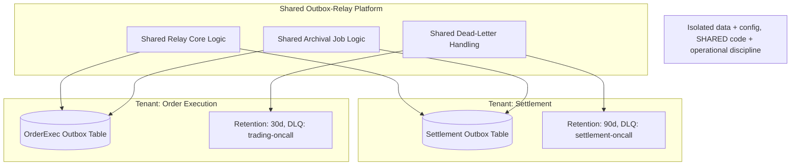
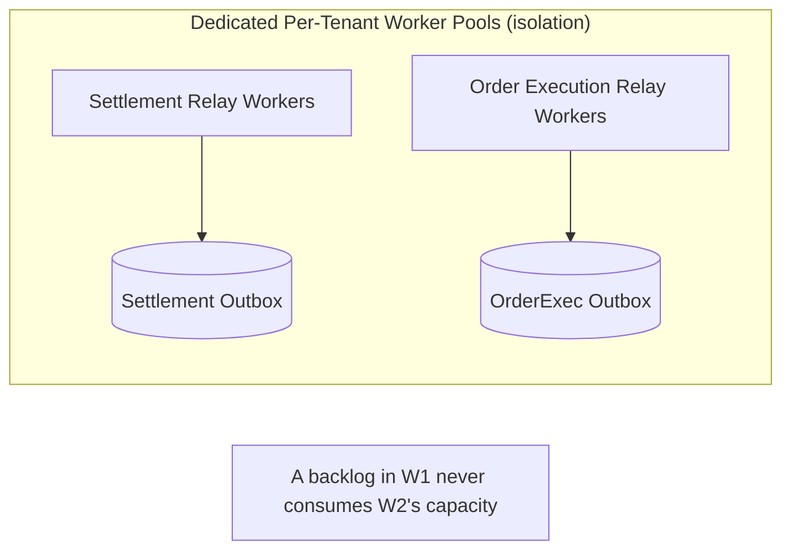
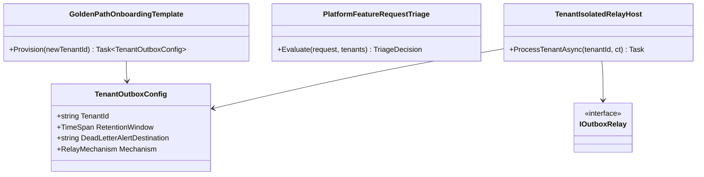

# Module 126 — Outbox: Capstone — A Shared, Multi-Tenant Outbox-Relay Platform at Organizational Scale

> Domain: Outbox | Level: Beginner → Expert | Prerequisite: [[01-OutboxFundamentals-TableDesign-RelayMechanisms-DeliveryGuarantees]] (takes as given: table design, polling/CDC relay mechanics, per-stream ordering, archival, and dead-letter handling — this capstone addresses running this mechanism as a shared, multi-tenant organizational platform rather than one team's single, standalone implementation)
>
> **Domain-complete note:** second and final module of `37-Outbox` (Modules 125–126). Full 16-section template; Elite FinTech Interview Panel lens.

---

## The Running Case Study

Across the organization, **a dozen services** (Settlement, Order Execution, Ledger, Regulatory Reporting, and others introduced across this course) have each independently built their own outbox table and relay over the past several years — with wildly inconsistent quality: some have archival (Module 125 §2.5), some don't; some have proper dead-letter handling (Module 125 §2.6), some silently drop poison messages; polling intervals and index designs vary team to team with no shared standard. This capstone consolidates them onto **one shared, multi-tenant Outbox-relay platform**, directly extending Module 118 Expert Q2's golden-path-centralization lesson to Outbox infrastructure specifically.

---

## 1. Fundamentals

**What:** One shared, centrally-owned Outbox-relay platform serving every event-producing service ("tenant") in the organization — a single, well-governed implementation of Module 125's full toolkit (schema, relay, archival, dead-lettering, monitoring), rather than a dozen independently-built, inconsistently-correct implementations.

**Why:** Directly Module 118 Expert Q2's already-established organizational finding — fragmented, team-owned implementations of a shared, non-trivial infrastructure concern reliably produce inconsistent quality and duplicated effort, exactly what this organization's dozen ad hoc outbox implementations now demonstrate concretely.

**When:** Once an organization has enough independently-owned services each needing reliable event delivery that duplicating Module 125's full correctness discipline (archival, ordering, dead-lettering, monitoring) per-team becomes measurably wasteful and inconsistently executed — precisely this organization's current, demonstrated state.

**How (30,000-ft view):**
```
Shared Outbox-Relay Platform (one centrally-owned service/library)
  ├── Tenant: Settlement       — own outbox table, own retention/DLQ config, own dashboard
  ├── Tenant: Order Execution  — own outbox table, own retention/DLQ config, own dashboard
  ├── Tenant: Ledger           — ...
  └── Tenant: Regulatory       — ...
Each tenant's data and processing is isolated; the platform's CODE and operational discipline is shared.
```

---

## 2. Deep Dive

### 2.1 Multi-Tenancy Model — Shared Code, Isolated Configuration and Data
The platform provides one, centrally-maintained relay implementation (Module 125's full toolkit), but each tenant retains its own outbox table (or logically-isolated partition), its own retention-window configuration (calibrated per Module 125 Intermediate Q5's own tenant-specific audit-needs test), and its own dead-letter routing/alerting destination — the platform standardizes *how* reliable delivery works, never forcing a one-size-fits-all configuration across genuinely different tenants' needs.

### 2.2 Tenant Isolation — Preventing the Noisy-Neighbor Risk
A shared relay platform's central risk: one tenant's unusually high event volume or a temporarily-degraded downstream consumer (causing that tenant's own retry/backlog growth) must never degrade a *different* tenant's own delivery latency or throughput — directly the same noisy-neighbor risk Module 23 Expert Q2 already established for Istio's Ambient-mode shared ztunnel, now recurring at the shared-relay-platform layer specifically, requiring genuinely isolated per-tenant processing capacity (dedicated relay-worker pools or partitions per tenant), not merely logical configuration separation.

### 2.3 Migration — Consolidating a Dozen Ad Hoc Implementations Safely
Each existing, ad hoc outbox implementation migrates onto the shared platform via the identical Parallel Run technique this course has now applied repeatedly (Module 107, Module 116, Module 122) — the tenant's existing implementation continues operating as authoritative while the shared platform's relay runs in shadow/validation mode against the same outbox table, with reconciliation confirming equivalent delivery behavior before cutover, never a direct, unvalidated switch.

### 2.4 Per-Tenant, Never Blended, Observability
Directly Module 120 Advanced Q8's already-established caution against averaged/blended metrics hiding a single struggling consumer — the platform's dashboard must present per-tenant delivery-lag, archival-health, and dead-letter-rate metrics independently; a single, organization-wide "average outbox health" score would silently mask exactly the kind of single-tenant degradation this capstone's own incident (§4) demonstrates.

### 2.5 Self-Service Tenant Onboarding — the Golden-Path Template
Directly Module 96's established golden-path-scaffolding pattern, reapplied here: a new service adopting the shared platform should onboard via a maintained, versioned template (an SDK/library providing the correct outbox-table schema, standard configuration, and pre-wired monitoring) rather than each new tenant hand-rolling its own integration — closing the exact fragmentation risk (Module 118 Expert Q2) this capstone exists to solve, proactively, for every *future* tenant too.

### 2.6 Platform Governance — Shared-Bug vs. Tenant-Specific-Issue Ownership
A bug in the platform's own shared relay code (affecting every tenant) is the platform team's responsibility to fix centrally; a tenant-specific configuration mistake (an inappropriate retention window, an unmonitored dead-letter destination, Module 125 §14) remains that tenant team's own responsibility — a clear, documented ownership boundary preventing both "the platform team is blamed for every tenant's own misconfiguration" and "tenants can't get platform-level bugs fixed centrally" failure modes.

---

## 3. Visual Architecture





---

## 4. Production Example

**Problem:** Migrate all twelve ad hoc outbox implementations onto the shared platform, and prevent the platform's own shared infrastructure from introducing new, cross-tenant failure modes the prior, fully-isolated ad hoc implementations never had.

**Architecture:** A shared relay-worker pool initially processing all twelve tenants' outbox tables via a common thread/task pool, reasoned to be "efficient resource sharing" during initial platform design.

**Implementation:** The Regulatory Reporting tenant experienced a multi-hour downstream-consumer outage (an external regulatory gateway's own maintenance window), causing its own outbox backlog and retry volume to grow substantially — since all twelve tenants shared one common worker pool, Regulatory's own growing retry/backoff load consumed a disproportionate share of the shared pool's available capacity.

**Trade-offs:** True, dedicated per-tenant worker-pool isolation (§2.2) costs more infrastructure overall (some tenants' pools sit partially idle at any given moment) than a fully-shared pool's more efficient average utilization — but the fully-shared pool's efficiency gain came at the direct cost of the noisy-neighbor risk this incident demonstrated concretely.

**Lessons learned:** During Regulatory's own outage, Settlement's and Order Execution's own event-delivery latency measurably degraded too — despite their own downstream consumers being entirely healthy — purely because the shared worker pool's available capacity was being consumed by Regulatory's growing retry backlog. This is §2.2's exact predicted noisy-neighbor risk, materializing concretely the first time any single tenant experienced genuine, sustained backlog growth. The fix: migrated to dedicated, per-tenant relay-worker pools (still running the identical, shared relay *code*, per §2.1's model) — accepting the moderate additional infrastructure cost in exchange for eliminating cross-tenant interference entirely, directly the same isolation-versus-efficiency trade-off Module 23 Expert Q2 already established for Ambient-mode's shared ztunnel, now resolved in favor of isolation given this incident's own concrete, demonstrated cross-tenant impact.

---

## 5. Best Practices
- Share the relay's code and operational discipline across tenants; never share tenant's own data, configuration, or (per §4's incident) processing capacity itself (§2.1, §2.2).
- Migrate each ad hoc implementation onto the shared platform via Parallel Run and reconciliation, never a direct, unvalidated cutover (§2.3).
- Present per-tenant, never blended/averaged, observability metrics (§2.4).
- Provide a versioned, self-service onboarding template for new tenants from the platform's inception, not as an afterthought once fragmentation has already begun recurring (§2.5).
- Document and enforce a clear shared-bug-vs-tenant-issue ownership boundary from day one (§2.6).

## 6. Anti-patterns
- A shared relay-worker pool with no per-tenant capacity isolation, allowing one tenant's backlog to degrade every other tenant's delivery latency (§4's incident).
- A single, organization-wide averaged "outbox health" metric hiding a specific, struggling tenant's own degradation (§2.4).
- Requiring every new tenant to hand-build its own outbox integration from scratch rather than providing a maintained, self-service onboarding template (§2.5).
- An undocumented or ambiguous ownership boundary between platform-level bugs and tenant-specific misconfigurations, causing either finger-pointing or unaddressed platform defects.
- A direct, unvalidated cutover from an existing ad hoc implementation to the shared platform, skipping Parallel-Run validation.

---

## 7. Performance Engineering

**CPU/Memory:** Dedicated per-tenant worker pools (§4's fix) trade some aggregate resource efficiency for isolation — capacity-plan each tenant's pool against its own realistic peak load, not a shared, pooled average.

**Latency:** Per-tenant delivery latency should now be provably independent of any other tenant's own load or backlog state — the specific, testable property this capstone's isolation fix establishes.

**Throughput:** Each tenant's dedicated pool must independently sustain throughput exceeding its own peak event-generation rate (Module 125 §7's per-tenant capacity-planning discipline, reapplied here at the platform level).

**Scalability:** New tenants onboard with their own dedicated capacity allocation, scaling the platform's total resource footprint linearly and predictably with tenant count, rather than requiring re-tuning a shared pool's configuration each time a new tenant joins.

**Benchmarking:** Load-test tenant isolation directly — deliberately inject a sustained backlog/failure scenario for one tenant and verify every other tenant's own latency/throughput remains entirely unaffected, directly extending Module 118 §7's fault-injection load-testing discipline to this capstone's own specific isolation claim.

**Caching:** Not a primary concern for the relay platform itself.

---

## 8. Security

**Threats:** Cross-tenant data leakage if the shared platform's own code path ever mixes or misroutes one tenant's outbox data to another; a compromised platform component potentially affecting every tenant simultaneously, a genuinely larger blast radius than any single tenant's own prior, isolated implementation.

**Mitigations:** Strict, code-level tenant-ID scoping on every database query and relay operation, verified via automated testing (directly Module 117's contract-testing discipline, reapplied to verify cross-tenant isolation specifically); the platform's own elevated blast-radius risk (a shared-code vulnerability affecting every tenant) requires correspondingly elevated security review rigor for any change to the shared relay core.

**OWASP mapping:** Broken Access Control risk specifically elevated at the multi-tenant boundary — a query missing a tenant-ID filter could leak or misdeliver one tenant's events to another's monitoring/dead-letter view.

**AuthN/AuthZ:** Each tenant's own dashboard/dead-letter access is scoped strictly to that tenant's own data — platform-level administrative access (spanning all tenants) is itself a separate, more tightly-controlled and audited permission tier.

**Secrets:** Each tenant's own downstream credentials (broker access, dead-letter alerting destinations) remain independently managed (Module 86) even though the relay code executing them is shared.

**Encryption:** Consistent, platform-wide encryption standards applied uniformly across every tenant's outbox data, removing the inconsistent per-team encryption practices the prior, fragmented implementations may have had.

---

## 9. Scalability

**Horizontal scaling:** New tenants onboard with dedicated, independently-scaled worker-pool capacity (§4); the platform's total footprint scales predictably, linearly with tenant count and each tenant's own measured load.

**Vertical scaling:** Individual tenant worker pools may be vertically scaled independently based on that tenant's own specific throughput/latency requirements.

**Caching:** Not a primary lever.

**Replication/Partitioning:** Each tenant's outbox table/partition remains isolated exactly as in Module 125's single-tenant treatment; the platform's shared relay code processes each tenant's own partition independently.

**Load balancing:** Per-tenant worker-pool assignment, never a shared, cross-tenant load-balancing pool (§4's fix).

**High Availability:** A platform-wide outage (a genuine bug or infrastructure failure in the shared relay code itself) now has organization-wide blast radius — a materially different HA consideration than any single tenant's prior, isolated implementation, requiring correspondingly higher HA engineering rigor for the shared platform.

**Disaster Recovery:** Each tenant's own outbox data DR follows Module 125 §9's already-established per-tenant durability; the platform's own code/configuration deployment history should itself be recoverable, supporting rollback to a known-good shared-relay-code version if a platform-wide bug is introduced.

**CAP theorem:** Unchanged per-tenant from Module 125 §9 — each tenant's own outbox table favors consistency for its own transactional-write guarantee, independent of the shared platform's own multi-tenant operational model.

---

## 10. Interview Questions

### Basic (10)

1. **Q: What specific organizational problem motivates consolidating a dozen ad hoc outbox implementations onto one shared platform?**
   **A:** Inconsistent quality across independently-built implementations (missing archival, missing dead-lettering) and duplicated engineering effort — directly Module 118 Expert Q2's already-established golden-path-fragmentation finding (§1).
   **Why correct:** States the specific, demonstrated organizational problem this capstone addresses.
   **Common mistakes:** Assuming consolidation is motivated purely by infrastructure cost savings rather than the more significant, demonstrated correctness/consistency problem.
   **Follow-ups:** "What course-established pattern does this directly extend?" (Module 118 Expert Q2's golden-path-centralization lesson, applied to Outbox infrastructure specifically, §1.)

2. **Q: What exactly is shared across tenants on this platform, and what remains isolated per tenant?**
   **A:** The relay's code and operational discipline are shared; each tenant's own data, configuration, and (per §4's fix) processing capacity remain isolated (§2.1).
   **Why correct:** States the precise multi-tenancy boundary this capstone establishes.
   **Common mistakes:** Assuming a "shared platform" means tenants share data or configuration, rather than only the underlying implementation and operational practices.
   **Follow-ups:** "Why does configuration specifically remain per-tenant rather than standardized?" (Different tenants have genuinely different retention/audit needs, Module 125 Intermediate Q5's calibration principle, §2.1.)

3. **Q: What is the "noisy-neighbor" risk in this shared-platform context?**
   **A:** One tenant's unusually high load or backlog degrading a different tenant's own delivery latency or throughput, due to shared processing capacity (§2.2).
   **Why correct:** States the specific risk mechanism precisely.
   **Common mistakes:** Assuming logical configuration isolation alone (separate outbox tables) is sufficient to prevent this risk without also isolating processing capacity itself.
   **Follow-ups:** "What course-established analog does this directly recall?" (Module 23 Expert Q2's Istio Ambient-mode shared-ztunnel noisy-neighbor risk, §2.2.)

4. **Q: How should an existing, ad hoc outbox implementation migrate onto the shared platform?**
   **A:** Via Parallel Run — the existing implementation stays authoritative while the shared platform validates in shadow mode, with reconciliation confirming equivalence before cutover (§2.3).
   **Why correct:** States the specific, safe migration technique, directly reapplying an already-established course pattern.
   **Common mistakes:** Assuming a direct, unvalidated cutover from the existing implementation to the shared platform is an acceptable shortcut.
   **Follow-ups:** "Which prior modules already established this exact migration technique?" (Module 107, Module 116, Module 122, §2.3.)

5. **Q: Why must the platform's observability dashboard show per-tenant metrics rather than one, organization-wide average?**
   **A:** An averaged metric could hide a specific, severely-struggling tenant behind many healthy ones, providing false operational confidence (§2.4).
   **Why correct:** Correctly reapplies Module 120 Advanced Q8's already-established averaged-metric caution to this new context.
   **Common mistakes:** Assuming a single, simplified aggregate health score is sufficient for genuine operational awareness across many tenants.
   **Follow-ups:** "What course-established pattern does this directly reapply?" (Module 120 Advanced Q8's per-consumer, never-averaged monitoring principle, §2.4.)

6. **Q: What is a "golden-path onboarding template" in this context, and why does it matter for future tenants specifically?**
   **A:** A maintained, versioned, self-service template providing the correct outbox schema and configuration for any new service adopting the platform, preventing future tenants from independently, inconsistently hand-rolling their own integration — exactly the original problem this capstone was built to solve, now prevented proactively (§2.5).
   **Why correct:** States the specific mechanism and connects it to preventing recurrence of the original, motivating problem.
   **Common mistakes:** Assuming the consolidation effort alone (fixing the existing dozen implementations) is sufficient without also preventing the identical fragmentation problem from recurring with future, new services.
   **Follow-ups:** "What course-established pattern does this directly reapply?" (Module 96's golden-path-scaffolding pattern, §2.5.)

7. **Q: Who owns fixing a bug in the shared relay's own core logic, versus a tenant's own misconfigured retention window?**
   **A:** The platform team owns shared-code bugs; the tenant's own team owns its own configuration mistakes (§2.6).
   **Why correct:** States the specific, documented ownership boundary this capstone establishes.
   **Common mistakes:** Assuming the platform team is responsible for every issue, including tenant-specific configuration mistakes, or vice versa.
   **Follow-ups:** "What two failure modes does this clear boundary specifically prevent?" ("The platform team blamed for tenant misconfiguration" and "tenants unable to get genuine platform bugs fixed centrally," §2.6.)

8. **Q: What was the actual root cause of §4's incident?**
   **A:** A shared, undifferentiated relay-worker pool across all twelve tenants let one tenant's (Regulatory's) growing retry backlog consume a disproportionate share of shared capacity, degrading other, entirely-healthy tenants' own delivery latency.
   **Why correct:** States the precise mechanism from this module's own case study.
   **Common mistakes:** Attributing the incident to Regulatory's own downstream outage itself, rather than the shared-worker-pool architecture that let that outage's effects spread to unrelated tenants.
   **Follow-ups:** "What was the fix?" (Dedicated, per-tenant relay-worker pools, still running shared relay code, §4.)

9. **Q: Does elevating an outbox implementation to a shared, multi-tenant platform increase or decrease the blast radius of a bug in the relay's own code?**
   **A:** Increases it — a bug in the shared relay code can now affect every tenant simultaneously, a materially larger blast radius than any single tenant's prior, isolated implementation (§9).
   **Why correct:** States the specific, genuine trade-off this consolidation introduces, honestly.
   **Common mistakes:** Assuming consolidation is a strictly, unconditionally positive change with no corresponding new risk.
   **Follow-ups:** "What compensating discipline does this elevated blast radius require?" (Correspondingly higher security/code-review rigor for any change to the shared relay core, §8/§9.)

10. **Q: Should every tenant use identical retention-window and dead-letter-routing configuration on this shared platform?**
    **A:** No — each retains its own, independently-calibrated configuration appropriate to its own specific audit/operational needs (§2.1).
    **Why correct:** Correctly states that standardization applies to the underlying mechanism, not to every tenant's own specific configuration values.
    **Common mistakes:** Assuming "shared platform" implies uniform configuration across every tenant regardless of their genuinely different needs.
    **Follow-ups:** "What would be lost by forcing uniform configuration across every tenant?" (Exactly Module 125 Intermediate Q5's calibration principle — a one-size-fits-all retention window would either under-serve some tenants' audit needs or over-retain unnecessarily for others.)

### Intermediate (10)

1. **Q: Why did §4's incident specifically manifest as degraded latency for Settlement and Order Execution, rather than those tenants' own outbox tables directly failing?**
   **A:** The shared worker pool's *available processing capacity* — not each tenant's own outbox table or data — was the actual contended resource; Regulatory's growing retry/backoff volume consumed worker-pool threads/capacity that would otherwise have been available to process Settlement's and Order Execution's own, entirely-unrelated pending rows, causing their delivery to simply queue longer behind Regulatory's own growing workload.
   **Why correct:** Precisely identifies the actual contended resource (shared processing capacity, not data or table-level contention).
   **Common mistakes:** Assuming the incident involved some form of data-level cross-tenant interference, rather than pure processing-capacity contention.
   **Follow-ups:** "Would per-tenant outbox tables alone (without dedicated worker pools) have prevented this incident?" (No — exactly why §4's fix specifically required dedicated worker pools, not merely the pre-existing per-tenant table isolation, which was already in place and insufficient on its own.)

2. **Q: Design the specific test verifying tenant isolation (§7's benchmarking recommendation) concretely, extending Module 118 §7's fault-injection technique.**
   **A:** Deliberately inject a sustained, realistic backlog/retry-storm scenario for one specific tenant under load-testing conditions, while simultaneously measuring every *other* tenant's own delivery latency and throughput — a genuinely isolated platform should show zero measurable latency/throughput change for the unaffected tenants regardless of how severely the deliberately-stressed tenant's own backlog grows.
   **Why correct:** Gives a concrete, deliberate cross-tenant fault-injection test directly targeting the specific isolation property this capstone's fix establishes.
   **Common mistakes:** Load-testing only aggregate, platform-wide throughput without specifically, deliberately verifying that one tenant's stress has zero measurable effect on any other tenant.
   **Follow-ups:** "Why is this test specifically necessary even after implementing dedicated worker pools, rather than trusting the architectural design alone?" (Directly this course's now-repeated "verify, don't just design and assume" theme — a dedicated-worker-pool design could still have a subtle implementation bug reintroducing cross-tenant contention somewhere unexpected, e.g., a shared database connection pool underneath the otherwise-isolated worker pools.)

3. **Q: Critique a migration plan that consolidates all twelve ad hoc implementations onto the shared platform simultaneously, in one coordinated cutover weekend.**
   **A:** This directly violates Module 107's own established migration-risk-minimization principle — a simultaneous, twelve-tenant cutover means any platform-level bug discovered during or immediately after cutover simultaneously affects every tenant at once, rather than being caught and fixed against a single, lower-stakes early-migrating tenant first; a staged, one-tenant-at-a-time (or small-batch) migration sequence, each following its own full Parallel-Run validation (§2.3), lets the platform's own correctness be incrementally proven and any issues caught with a smaller blast radius before the remaining tenants migrate.
   **Why correct:** Correctly reapplies Module 107's already-established incremental-migration-risk principle to this specific, larger-scale, multi-tenant migration scenario.
   **Common mistakes:** Treating a coordinated, simultaneous cutover as more efficient without weighing the significantly elevated risk of a platform-level bug affecting every tenant at once during the highest-uncertainty phase of the platform's own life.
   **Follow-ups:** "Which tenant would you recommend migrating first, and why?" (A lower-stakes, lower-volume tenant first, reserving the highest-stakes tenants (e.g., Regulatory, given its own demonstrated criticality) for later in the sequence, once the platform's correctness has already been proven against less-consequential tenants.)

4. **Q: How would you design the per-tenant retention-window configuration to prevent one tenant's excessively long retention choice from disproportionately affecting the shared platform's overall storage cost or archival-job performance?**
   **A:** Even with per-tenant retention configuration (§2.1), the shared archival job (Module 125 §2.5) processing every tenant's own aging rows should itself be capacity-planned against the *sum* of every tenant's own configured retention window and volume — a single tenant choosing an unusually long retention window (for genuine, justified audit reasons) should be visible in the platform's own capacity-planning process, not silently absorbed without anyone noticing its disproportionate contribution to overall archival-job cost.
   **Why correct:** Correctly identifies that per-tenant configuration flexibility (§2.1) still requires platform-level capacity-planning visibility into the *aggregate* effect of those individually-reasonable, per-tenant choices.
   **Common mistakes:** Assuming per-tenant configuration isolation alone eliminates any need for platform-level, aggregate capacity awareness of how those individual configurations sum together.
   **Follow-ups:** "What would you do if one tenant's retention choice was found to be disproportionately, unjustifiably driving platform-wide archival cost?" (Raise it as an explicit, documented conversation with that tenant's own team, re-examining whether their specific retention need is still genuinely justified per Module 125 Intermediate Q5's own calibration test, rather than silently absorbing the cost or unilaterally overriding their configuration.)

5. **Q: Why does elevating a bug in the shared relay's own core logic to "affects every tenant simultaneously" specifically require higher security/code-review rigor than any single tenant's prior, isolated implementation needed?**
   **A:** A vulnerability or defect in shared code has a categorically larger blast radius (every tenant, simultaneously) than a defect in any one tenant's own prior, isolated implementation (which, however serious, would have affected only that single tenant) — the review rigor applied to any change touching this shared core must be proportionate to this elevated, organization-wide blast radius, not merely equivalent to what any single tenant's own prior code review would have applied.
   **Why correct:** States the precise reason (blast-radius scale) driving this elevated rigor requirement, rather than a vague "shared code needs more care" assertion.
   **Common mistakes:** Applying the same code-review rigor to changes in the shared relay core as any individual tenant's own service code, without recognizing the qualitatively larger consequence of a defect in the shared component specifically.
   **Follow-ups:** "What concrete review-process difference would this elevated rigor look like in practice?" (Mandatory review by a second, senior platform-team engineer, plus a broader regression-test suite specifically covering every tenant's own known configuration variants, before any shared-relay-core change is deployed.)

6. **Q: How would you decide whether a specific new capability request from one tenant (e.g., a genuinely novel retry-backoff strategy only that tenant needs) should be added to the shared platform's core, or implemented as a tenant-specific extension point instead?**
   **A:** Apply a genuine-commonality test: is this capability likely to be needed by other tenants in the foreseeable future (favoring adding it to the shared core, benefiting everyone), or is it genuinely specific to this one tenant's own idiosyncratic requirement (favoring an extension point/plugin mechanism the shared platform exposes, rather than baking tenant-specific logic into the shared core itself, which would begin eroding the platform's own clean, shared-code boundary)?
   **Why correct:** Gives a concrete decision test (genuine commonality vs. tenant-specific idiosyncrasy) rather than either reflexively adding every request to the shared core or reflexively rejecting every tenant-specific customization request.
   **Common mistakes:** Adding every individual tenant's specific request directly into the shared core "to be accommodating," gradually eroding the platform's own clean, genuinely-shared abstraction into an increasingly tenant-specific, harder-to-maintain patchwork.
   **Follow-ups:** "What mechanism would let a tenant implement a genuinely idiosyncratic need without modifying the shared core?" (A well-defined extension point/plugin interface the shared platform exposes — directly Module 117's Port/Adapter composition principle, reapplied here to allow tenant-specific behavior without compromising the shared core's own clean boundary.)

7. **Q: Why should a new tenant's onboarding via the golden-path template (§2.5) still include its own explicit review, rather than being fully, silently automatic?**
   **A:** Even a well-designed template needs its specific configuration values (retention window, dead-letter routing destination) calibrated to the new tenant's own actual needs (Module 125 Intermediate Q5's calibration principle) — a fully automatic, zero-review onboarding risks a new tenant inheriting a template's reasonable *defaults* without anyone confirming those defaults are actually appropriate for this specific new tenant's own genuine requirements.
   **Why correct:** Identifies the specific risk (unreviewed, possibly-inappropriate default configuration) a fully-automatic onboarding process would introduce, even with an otherwise well-designed template.
   **Common mistakes:** Assuming a maintained, versioned template alone is sufficient without any tenant-specific review of the actual configuration values it produces for that new tenant.
   **Follow-ups:** "What's the minimum viable review step here, avoiding excessive process overhead for a routine onboarding?" (A lightweight, structured checklist (retention duration, dead-letter destination, expected volume) reviewed and explicitly confirmed by the new tenant's own team lead, not a heavyweight, multi-stakeholder architecture-review process for what should be a routine, well-templated onboarding.)

8. **Q: Design the specific mechanism ensuring a tenant's own dead-letter alerts (§8) can never be misrouted to a different tenant's on-call channel due to a shared-platform configuration bug.**
   **A:** A mandatory, automated test (directly Module 117's contract-testing discipline, reapplied here) verifying, for every tenant's own configuration record, that its dead-letter alert routing destination matches its own registered, expected on-call channel — run continuously as part of the platform's own configuration-deployment pipeline, catching any accidental cross-tenant misconfiguration (e.g., a copy-paste error when onboarding a new tenant from an existing one's template) before it reaches production.
   **Why correct:** Gives a concrete, mechanically-enforced verification mechanism specifically targeting this cross-tenant misconfiguration risk, rather than relying on manual configuration review alone.
   **Common mistakes:** Relying solely on manual code/configuration review to catch a cross-tenant misrouting mistake, missing that this is exactly the class of easily-overlooked, mechanically-catchable error this course has repeatedly shown benefits from automated, continuous verification.
   **Follow-ups:** "Why is this risk specifically elevated on a shared, multi-tenant platform compared to each tenant's own prior, isolated implementation?" (A shared platform's configuration for multiple tenants often originates from copying/adapting an existing tenant's own configuration as a starting point, precisely the kind of copy-paste-adjacent process most likely to introduce exactly this cross-tenant misrouting mistake.)

9. **Q: How would you handle a scenario where two tenants, previously entirely independent, now have a genuine, correctness-relevant ordering dependency between their respective outbox streams (e.g., Tenant A's event must always be delivered before a related Tenant B event)?**
   **A:** This is a genuine architectural red flag worth examining carefully before accommodating within the shared platform's own mechanics — cross-tenant ordering dependencies are exactly the kind of coupling this course's bounded-context/service-independence discipline (Module 105/109) warns against; the correct response is likely re-examining whether these two "tenants" are, in fact, part of the same genuine business process that should be coordinated via an explicit Saga (Module 123/124) rather than an implicit, platform-level ordering guarantee the shared Outbox platform was never designed to provide across genuinely independent tenants.
   **Why correct:** Correctly identifies this scenario as a deeper architectural question (should these be coordinated via Saga) rather than a shared-platform feature request, redirecting to the appropriate, already-established pattern for this specific need.
   **Common mistakes:** Attempting to build cross-tenant ordering guarantees directly into the shared Outbox platform's own mechanics, when the actual, correct tool for coordinating a genuine cross-service business-process dependency is the Saga pattern this course has already established, not an ad hoc extension to the Outbox platform's own scope.
   **Follow-ups:** "Why is it specifically important to recognize this as a Saga-shaped problem rather than an Outbox-platform feature request?" (Building this into the Outbox platform would conflate two genuinely distinct architectural concerns — reliable, single-stream event delivery versus multi-step, cross-service business-process coordination — exactly the kind of scope-creep this course's Module 113/117 composition discipline warns against.)

10. **Q: Synthesize how this capstone's shared-platform consolidation relates to Module 96's own observability-platform capstone and Module 118 Expert Q2's fragmentation lesson.**
    **A:** All three address the identical underlying organizational pattern — a genuinely valuable, non-trivial infrastructure capability (observability instrumentation, Adapter-substitution testing infrastructure, reliable event delivery) that, left to independent, per-team implementation, reliably fragments into inconsistent quality and duplicated effort; each domain's own capstone (Module 96, Module 118's Expert Q2, and now this module) arrives at the identical structural fix — centralized, golden-path-templated ownership with per-consumer/per-tenant configuration flexibility and continuous, never-averaged monitoring — demonstrating this isn't a coincidence specific to any one domain, but a genuinely transferable organizational pattern applicable to any sufficiently valuable, cross-cutting infrastructure concern this course has not yet explicitly covered.
    **Why correct:** Correctly identifies the shared, transferable organizational pattern across three genuinely distinct technical domains, rather than treating this capstone's own consolidation as an isolated, domain-specific insight.
    **Common mistakes:** Treating this capstone's golden-path/centralization approach as a novel insight specific to Outbox infrastructure, missing its direct, already-demonstrated kinship to Module 96 and Module 118's own prior, identical organizational finding.
    **Follow-ups:** "What would this pattern predict about a future, currently-uncovered infrastructure concern this course hasn't yet addressed?" (Any sufficiently valuable, cross-cutting capability left to independent, per-team implementation will likely fragment identically, and the same fix — centralized, golden-path ownership with per-consumer configuration flexibility and per-consumer, never-averaged monitoring — will likely apply, exactly the kind of transferable, Principal-Engineer-level pattern-recognition this course has built toward across its entire arc.)

### Advanced (10)

1. **Q: Diagnose §4's incident from first principles and design the complete, structural fix preventing this exact class of cross-tenant interference from recurring for any future, currently-unforeseen resource-contention pathway.**
   **A:** Root cause: the shared worker-pool architecture assumed resource sharing was purely an efficiency benefit without recognizing its own noisy-neighbor risk (§2.2). Fix: (1) dedicated, per-tenant worker pools as the immediate, direct fix (§4); (2) a deliberate, systematic audit of every *other* potentially-shared resource in the platform's architecture (database connection pools, shared caches, shared network bandwidth) for the identical class of undiscovered cross-tenant contention risk, not just the specific worker-pool resource this incident happened to surface first; (3) the deliberate, cross-tenant fault-injection test (Intermediate Q2) made a permanent, standing part of the platform's own test suite, run on every future architectural change to catch any newly-introduced sharing/isolation regression before it reaches production.
   **Why correct:** Identifies the actual root cause and a three-part fix explicitly including a systematic audit for *other*, not-yet-discovered shared-resource risks — directly this course's now-repeated discipline of generalizing a specific incident's lesson into a broader, structural verification requirement, not merely patching the one, specific resource this incident happened to expose.
   **Common mistakes:** Fixing only the specific worker-pool contention this incident revealed, without systematically checking whether other shared resources in the platform's architecture carry the identical, still-undiscovered risk.
   **Follow-ups:** "What other shared resource in this platform's architecture would you audit first, and why?" (The database connection pool used by the shared relay code to query each tenant's own outbox table — a genuinely plausible second instance of this exact risk category, since a naive, shared connection-pool implementation could reproduce the identical contention pattern this incident already demonstrated for worker-pool capacity.)

2. **Q: A team proposes eliminating per-tenant dedicated worker pools in favor of a shared pool with per-tenant priority/quota limits (rate-limiting each tenant's own maximum resource consumption), arguing this recovers some of the shared pool's efficiency benefit while still preventing the worst-case noisy-neighbor scenario. Evaluate this proposal.**
   **A:** This is a genuinely reasonable middle ground worth seriously considering — quota-limited shared pooling can recover meaningful efficiency gains (idle capacity from a quiet tenant genuinely available to a busier one, up to each tenant's own configured quota ceiling) while still bounding the worst-case cross-tenant impact §4's incident demonstrated; however, it requires materially more careful engineering (correct, tested quota-enforcement logic, itself a new potential source of bugs) than fully-dedicated pools, and the quota-enforcement mechanism itself would need the identical deliberate, cross-tenant fault-injection testing (Advanced Q1) verifying it actually, correctly bounds cross-tenant impact under genuine load, not merely in its own design intent.
   **Why correct:** Gives a genuinely balanced evaluation (a reasonable middle ground, but with real, additional engineering and verification cost) rather than either dismissing the proposal or endorsing it uncritically.
   **Common mistakes:** Either rejecting this proposal outright as "not as safe as full dedication" without acknowledging its genuine, potential efficiency benefit, or endorsing it without recognizing the additional engineering/verification rigor its own quota-enforcement mechanism would require.
   **Follow-ups:** "Given this system's own demonstrated incident history, would you currently recommend this middle-ground approach, or stick with full dedication?" (Given §4's own real, already-experienced incident and the relatively modest efficiency cost of full dedication for this specific system's actual scale, sticking with the proven, fully-isolated approach is likely the more conservative, currently-justified choice — revisiting the quota-based middle ground only if dedicated-pool costs later become a demonstrated, significant concern at much larger future scale.)

3. **Q: Critique a golden-path onboarding template (§2.5) that hard-codes a single, default retention-window value with no explicit prompt for the new tenant to consider whether that default is actually appropriate for their own specific needs.**
   **A:** This risks exactly Intermediate Q7's identified gap — a new tenant silently inheriting a default that happens to be inappropriate for their own specific audit/replay needs, discovered only much later (potentially during an actual audit or incident requiring historical data the too-short default retention window had already purged) rather than being explicitly, deliberately confirmed at onboarding time when the correct calibration question could have been easily raised and answered.
   **Why correct:** Directly connects this specific template-design flaw to Intermediate Q7's already-identified risk, showing the concrete way a template can fail to prevent it if not deliberately designed with an explicit calibration prompt.
   **Common mistakes:** Assuming a single, sensible-seeming default retention value is a safe, universal starting point for every future tenant regardless of their own specific, potentially quite different audit/compliance requirements.
   **Follow-ups:** "How would you redesign the template to avoid this specific gap?" (Require the new tenant's onboarding process to explicitly answer a short, structured questionnaire — expected event volume, audit/compliance retention requirement, dead-letter alerting destination — rather than silently applying a single, hard-coded default the tenant never had to actively consider or confirm.)

4. **Q: Design a load-testing methodology specifically validating the platform's own HA posture — that a genuine, shared-relay-core bug or infrastructure failure affecting every tenant simultaneously (§9's elevated blast-radius risk) can be detected and rolled back quickly enough to bound its organization-wide impact.**
   **A:** Deliberately deploy a known-bad, synthetic shared-relay-core change in a controlled, non-production-equivalent environment representative of full multi-tenant scale, measuring the actual time from deployment to detection (via the platform's own monitoring) and from detection to a fully-rolled-back, healthy state across every simulated tenant — directly extending Module 87/92's release-governance and canary-rollback-testing discipline to this platform's own specific, elevated multi-tenant blast-radius risk, ensuring the platform's own deployment pipeline genuinely, verifiably supports fast, organization-wide rollback, not merely assumed to in principle.
   **Why correct:** Correctly reapplies an already-established release-governance/rollback-testing discipline to this capstone's own specific, elevated-stakes concern (a shared-code bug's organization-wide blast radius), rather than assuming the platform's deployment pipeline handles this correctly without direct verification.
   **Common mistakes:** Assuming the platform's general deployment/rollback tooling, proven adequate for any single tenant's own prior, smaller-blast-radius implementation, automatically remains adequate at this platform's now much larger, organization-wide blast-radius scale without specific, dedicated testing.
   **Follow-ups:** "What specific metric would this test need to produce as its key output?" (A concrete, measured "time to fully rolled back and healthy across every tenant" figure, compared against this platform's own defined, acceptable-blast-radius-duration SLA — directly analogous to Module 87/92's own established release-governance metrics, now applied at this capstone's specific, elevated scale.)

5. **Q: How would you decide whether a proposed change to the shared relay core is safe enough to deploy directly to all twelve tenants simultaneously, versus requiring its own staged, canary-style rollout across tenants first?**
   **A:** Apply a risk-proportionate staging test directly reapplying Module 87's canary-deployment discipline at the tenant-cohort level: a low-risk, purely additive change (e.g., a new, optional configuration field with no behavior change for tenants not using it) may reasonably deploy to all tenants simultaneously; any change touching core delivery/ordering/compensation logic — precisely the kind of change with the largest potential blast radius if subtly wrong — should canary through a small, lower-stakes tenant cohort first, with the same staged, monitored rollout discipline Module 87/92 already established for any other genuinely risky production change, now applied across tenant cohorts rather than traffic percentages.
   **Why correct:** Correctly reapplies Module 87's already-established canary-deployment risk-calibration discipline to this platform's own specific, tenant-cohort-based rollout decision, rather than treating every shared-core change identically regardless of its actual risk profile.
   **Common mistakes:** Treating every shared-relay-core change with either uniformly minimal caution (risking Advanced Q1's exact incident category recurring) or uniformly maximal caution (unnecessarily slowing genuinely low-risk, additive changes) rather than calibrating rollout rigor to each specific change's own actual risk profile.
   **Follow-ups:** "Which tenant cohort would make the best initial canary target for a genuinely risky shared-core change?" (A lower-stakes, lower-volume, well-monitored tenant whose own team is engaged and responsive — directly Intermediate Q3's own established staged-migration-ordering principle, now reapplied to ongoing shared-core-change rollout rather than one-time initial migration specifically.)

6. **Q: A regulator asks whether consolidating twelve previously-independent outbox implementations onto one shared platform has increased or decreased this organization's overall event-delivery-reliability risk. How would you answer honestly, citing this capstone's specific findings?**
   **A:** Both, in different, specific ways, and the honest answer names each explicitly: consolidation *decreased* risk from inconsistent quality (many of the twelve prior implementations lacked proper archival or dead-lettering, Module 125's own established gaps, now uniformly closed via the shared platform's own, single, correctly-implemented mechanism) but *increased* the blast radius of any remaining or future defect in the shared core itself (§9) — the organization's overall risk posture genuinely improved specifically because the elevated blast-radius risk is now met with correspondingly elevated review rigor, staged rollout discipline (Advanced Q5), and cross-tenant fault-injection testing (Advanced Q1/Intermediate Q2), converting a previously *invisible*, inconsistently-managed risk (varying, unaudited quality across twelve separate implementations) into a *visible*, deliberately, continuously-managed one.
   **Why correct:** Gives an honest, precisely two-sided answer (risk decreased in one specific way, increased in another) with the specific, concrete mitigations for the increased-risk side, rather than either overclaiming pure risk reduction or failing to acknowledge the genuine, new risk this consolidation introduces.
   **Common mistakes:** Answering only "risk decreased" without acknowledging the genuine, new elevated-blast-radius risk consolidation introduces, or conversely refusing to consolidate at all out of excessive caution about that new risk, missing the demonstrably worse, inconsistent-quality risk consolidation specifically fixes.
   **Follow-ups:** "Which of these two risk dimensions would you expect a sophisticated regulator to weigh more heavily?" (Likely the previously-invisible, inconsistent-quality risk being made visible and uniformly managed — sophisticated regulators generally view a well-governed, deliberately-managed risk more favorably than an unexamined, inconsistently-varying one, even if the well-governed risk's own worst-case blast radius is nominally larger.)

7. **Q: Critique treating this capstone's own consolidation effort as "finished" once all twelve tenants have successfully migrated, with no further, ongoing platform-governance activity planned.**
   **A:** Directly this course's now fully-established "verify the verifier"/ongoing-vigilance theme — a successfully-completed migration is a point-in-time achievement, not a permanent, self-sustaining state; new tenants will continue onboarding (requiring the golden-path template, §2.5, itself to be actively maintained and periodically re-verified as still current and correct); the shared relay core will continue evolving (requiring the staged-rollout discipline, Advanced Q5, to remain genuinely, continuously applied, not merely a one-time process followed during initial consolidation); and cross-tenant isolation (Advanced Q1's fault-injection test) needs periodic re-verification as the platform's own architecture inevitably continues to evolve over time.
   **Why correct:** Correctly identifies migration completion as a point-in-time milestone requiring ongoing, not one-time, governance discipline, directly connecting to this course's central, recurring theme.
   **Common mistakes:** Treating the successful completion of the twelve-tenant migration as the end of this capstone's own governance responsibility, rather than the beginning of an ongoing, permanent operational discipline.
   **Follow-ups:** "What specific, standing governance activity would you establish immediately following successful migration completion?" (A recurring, scheduled re-run of the cross-tenant isolation fault-injection test (Advanced Q1) as a permanent, ongoing part of the platform's own regression-test suite, plus a periodic (e.g., quarterly) review confirming the golden-path onboarding template remains current against any evolution in the shared relay core's own capabilities.)

8. **Q: How would you handle a scenario where a specific tenant's own team, dissatisfied with some aspect of the shared platform (e.g., its retention-configuration flexibility), wants to opt out and return to building its own, independent outbox implementation?**
   **A:** Treat this as a genuine, legitimate signal worth investigating rather than simply blocking — first, understand the specific, underlying gap driving the request (per Intermediate Q6's genuine-commonality test, is this a legitimate platform limitation worth addressing for potentially other tenants too, or a genuinely tenant-specific need better served by an extension point?); if the platform genuinely cannot reasonably accommodate this tenant's specific, demonstrated need even via an extension point, allowing a deliberate, reviewed opt-out (rather than either forcing continued use of an inadequate platform or allowing an ungoverned, silent fragmentation) may be the right, if reluctantly-accepted, outcome — directly mirroring this course's own established discipline (Module 105/108) of never mandating architectural uniformity without regard to genuine, demonstrated exceptions.
   **Why correct:** Treats the opt-out request as a genuine signal requiring investigation rather than either automatic accommodation or automatic rejection, and correctly connects the response to this course's own already-established anti-uniform-mandate discipline.
   **Common mistakes:** Either reflexively blocking any opt-out request to preserve platform uniformity at all costs, or immediately granting every opt-out request without first investigating whether the underlying need could reasonably be addressed within the shared platform instead.
   **Follow-ups:** "What would make this specific tenant's opt-out a genuinely reasonable, one-off exception rather than the start of the platform's own fragmentation recurring?" (A clearly-documented, specific, and genuinely rare technical limitation — not a general dissatisfaction pattern likely to recur across multiple tenants, which would instead signal a genuine platform-capability gap worth addressing centrally rather than accommodating via individual opt-outs.)

9. **Q: Design the specific criteria for deciding whether this platform's own next major version (e.g., switching its default relay mechanism from polling to CDC platform-wide) should be a mandatory upgrade for every tenant or an opt-in enhancement.**
   **A:** Apply the identical calibration principle Module 125 Advanced Q2 already established for polling-versus-CDC adoption generally, now at the platform-migration-policy level: since different tenants have genuinely different latency requirements (some may already be well-served by polling, others may benefit meaningfully from CDC), a platform-wide, mandatory switch imposed uniformly regardless of each tenant's own actual need would repeat exactly the "over-application without measured justification" anti-pattern this course has warned against repeatedly — the correct policy is offering CDC as an available, opt-in relay-mechanism choice per tenant (§2.1's own configuration-flexibility principle), with each tenant's own team making its own measured, justified decision, rather than a single, platform-wide mandate.
   **Why correct:** Correctly reapplies both Module 125's own specific polling-vs-CDC calibration test and this capstone's own per-tenant-configuration-flexibility principle to this specific platform-evolution governance question.
   **Common mistakes:** Assuming a platform-wide, uniform upgrade to a "better," more modern relay mechanism is automatically the right governance choice, without recognizing that different tenants' own genuinely different needs argue for continued per-tenant choice rather than a single, mandatory switch.
   **Follow-ups:** "Under what specific circumstance would a mandatory, platform-wide switch actually be justified instead?" (If the existing, older mechanism (e.g., polling) were being deprecated entirely due to a genuine, unavoidable underlying dependency's own end-of-life or unsupportable maintenance burden — a structural, not merely preferential, reason requiring every tenant to migrate regardless of their own individual latency-requirement calibration.)

10. **Q: As a Principal Engineer, synthesize this entire capstone into the complete governance program required for this shared Outbox-relay platform to remain a genuinely trustworthy, organization-wide piece of infrastructure over its own multi-year lifetime.**
    **A:** (1) Strict, code-verified tenant-data/configuration isolation, with shared code and operational discipline as the only genuinely shared element (Advanced Q1's audit extended to every shared resource, not just the one this incident happened to expose). (2) Dedicated, per-tenant processing capacity, continuously verified via a standing, recurring cross-tenant fault-injection test (Advanced Q1/Advanced Q7). (3) Risk-proportionate, canary-staged rollout for any shared-core change, calibrated to each specific change's own actual risk profile (Advanced Q5). (4) A maintained, actively-reviewed golden-path onboarding template requiring explicit, structured tenant-specific configuration confirmation, never silent, unreviewed defaults (Advanced Q3). (5) A clear, documented, and periodically-reaffirmed shared-bug-vs-tenant-issue ownership boundary (§2.6). (6) A genuine-commonality test governing whether a tenant-specific request extends the shared core or warrants an extension point/plugin mechanism instead, preventing gradual core-erosion (Intermediate Q6). (7) A reviewed, deliberate (never automatic) process for handling any tenant's own opt-out request, and for deciding platform-evolution mandates versus opt-in choices (Advanced Q8/Q9).
    **Why correct:** Synthesizes every specific finding into a coherent, actionable, multi-year governance program, matching this course's established capstone-synthesis pattern at its fullest, most comprehensive form for this domain's own specific organizational-platform scope.
    **Common mistakes:** Presenting only the technical multi-tenancy/isolation architecture without the ongoing governance, staged-rollout, and opt-out/evolution-decision elements that make this platform genuinely trustworthy and organizationally sustainable over a true multi-year lifetime, not merely correctly designed at initial consolidation.
    **Follow-ups:** "Which single element of this program is most directly attributable to a lesson only this capstone (not Module 125's more general, single-tenant treatment) could have taught?" (Dedicated, per-tenant processing-capacity isolation and its continuous, standing fault-injection verification, Advanced Q1 — a risk category specific to genuine multi-tenancy at organizational scale, never encountered in Module 125's simpler, single-tenant treatment.)

---

## 11. Coding Exercises

### Easy — Per-Tenant Configuration Model (§2.1)
**Problem:** Model per-tenant retention and dead-letter routing configuration on the shared platform.
**Solution:**
```csharp
public class TenantOutboxConfig
{
    public string TenantId { get; init; }
    public TimeSpan RetentionWindow { get; init; }
    public string DeadLetterAlertDestination { get; init; }
    public RelayMechanism Mechanism { get; init; } // Polling or CDC, per-tenant choice
}
```
**Time complexity:** O(1) configuration lookup per tenant.
**Space complexity:** O(t) for t configured tenants.
**Optimized solution:** Cache tenant configuration in memory with a short TTL, invalidated on any configuration-change event, avoiding a database round-trip on every relay operation while still picking up configuration changes promptly.

### Medium — Dedicated Per-Tenant Worker Pool (§2.2, §4)
**Problem:** Ensure one tenant's relay workload cannot consume another tenant's processing capacity.
**Solution:**
```csharp
public class TenantIsolatedRelayHost
{
    private readonly Dictionary<string, SemaphoreSlim> _tenantWorkerPools = new();

    public async Task ProcessTenantAsync(string tenantId, CancellationToken ct)
    {
        var pool = _tenantWorkerPools.GetOrAdd(tenantId, _ => new SemaphoreSlim(maxWorkers: 4));
        await pool.WaitAsync(ct);
        try { await RunRelayForTenantAsync(tenantId, ct); }
        finally { pool.Release(); }
    }
}
```
**Time complexity:** O(1) semaphore acquisition per tenant's own dedicated pool.
**Space complexity:** O(t) for t tenants' own independent semaphores.
**Optimized solution:** Deploy each tenant's relay workload to genuinely separate processes/containers (not merely in-process semaphores within one shared process) for stronger isolation, preventing a memory leak or crash in one tenant's own processing logic from affecting any other tenant's process entirely.

### Hard — Cross-Tenant Isolation Fault-Injection Test (§10 Intermediate Q2)
**Problem:** Verify one tenant's induced backlog doesn't affect another's latency.
**Solution:**
```csharp
[Fact]
public async Task StressedTenant_DoesNotAffect_HealthyTenant_Latency()
{
    await _testHarness.InjectSustainedBacklogAsync(tenantId: "regulatory", durationSeconds: 300);

    var settlementLatency = await _testHarness.MeasureP99LatencyAsync(tenantId: "settlement");
    var baselineLatency = await _testHarness.GetHistoricalBaselineP99Async(tenantId: "settlement");

    Assert.True(settlementLatency <= baselineLatency * 1.05, // allow 5% noise margin
        $"Settlement latency ({settlementLatency}ms) degraded beyond baseline ({baselineLatency}ms) " +
        "during Regulatory's induced backlog — cross-tenant isolation violated.");
}
```
**Time complexity:** O(1) test-orchestration overhead; wall-clock bounded by the injected backlog's own configured duration.
**Space complexity:** O(1) beyond the test harness's own measurement buffers.
**Optimized solution:** Run this test continuously, on a recurring schedule, against production-representative infrastructure (not just pre-deployment CI), directly Advanced Q7's own "standing, recurring verification, not one-time" governance requirement.

### Expert — Genuine-Commonality Decision Gate for Core vs. Extension-Point Requests (§10 Intermediate Q6)
**Problem:** Programmatically track whether a tenant's feature request should extend the shared core or use an extension point.
**Solution:**
```csharp
public class PlatformFeatureRequestTriage
{
    public TriageDecision Evaluate(FeatureRequest request, IReadOnlyList<TenantId> currentTenants)
    {
        var similarRequestsFromOtherTenants = _requestHistory
            .Count(r => r.Category == request.Category && r.TenantId != request.TenantId);

        return similarRequestsFromOtherTenants >= _commonalityThreshold
            ? TriageDecision.AddToSharedCore(justification: $"{similarRequestsFromOtherTenants} other tenants requested similar capability")
            : TriageDecision.RecommendExtensionPoint(justification: "No demonstrated cross-tenant commonality yet — revisit if this recurs");
    }
}
```
**Time complexity:** O(r) for r historical requests in the same category.
**Space complexity:** O(r) for retained request history.
**Optimized solution:** Track this decision history itself as a durable, queryable record (directly this course's own append-only/audit-trail philosophy, reapplied to platform-governance decisions) so future, similar requests can reference prior triage reasoning rather than each being evaluated in isolation without institutional memory.

---

## 12. System Design

**Functional requirements:** Serve every event-producing tenant's reliable-delivery needs from one shared platform; isolate each tenant's data, configuration, and processing capacity; support safe migration of existing implementations and self-service onboarding of future ones.

**Non-functional requirements:** Zero measurable cross-tenant latency/throughput interference; per-tenant, never-blended observability; elevated review/testing rigor for shared-core changes given their organization-wide blast radius; staged, risk-calibrated rollout for any shared-core evolution.

**Architecture:** One shared relay-core codebase; per-tenant outbox tables/partitions, configuration, and dedicated worker-pool capacity (§2.1/§2.2); a golden-path onboarding template (§2.5); a documented shared-bug-vs-tenant-issue ownership boundary (§2.6).

**Components:** `TenantOutboxConfig`; `TenantIsolatedRelayHost`; the shared archival-job and dead-letter-handling logic (Module 125's toolkit, now multi-tenant-aware); a per-tenant observability dashboard; a `PlatformFeatureRequestTriage` process.

**Database selection:** Each tenant retains its own outbox table (or logically-isolated partition) within its own existing database, per Module 111's structural requirement — the shared platform's "sharing" is at the code/operational layer, never the data layer.

**Caching:** Per-tenant configuration caching (§11 Easy exercise) with appropriate invalidation.

**Messaging:** Unchanged from Module 125's own established relay-to-broker mechanics, now executed by shared code against each tenant's own isolated data and capacity.

**Scaling:** Linear, predictable scaling with tenant count via dedicated, independently-sized per-tenant worker pools (§4/§9).

**Failure handling:** Cross-tenant isolation as the primary defense against one tenant's failure affecting others (§2.2/§4); staged, canary-style rollout (Advanced Q5) bounding the blast radius of any shared-core defect.

**Monitoring:** Per-tenant, never-averaged dashboards (§2.4); a standing, recurring cross-tenant fault-injection test as an ongoing, not one-time, verification (Advanced Q1/Q7); a mandatory dead-letter-routing-correctness check preventing cross-tenant alert misdelivery (Advanced Q8, this module's own §10 Intermediate Q8).

**Trade-offs:** Dedicated per-tenant capacity's moderate additional infrastructure cost, traded against eliminating the noisy-neighbor risk §4's incident demonstrated concretely; a shared platform's elevated single-point-of-failure blast radius, traded against uniformly closing the inconsistent-quality risk the prior, fragmented implementations demonstrably had.

---

## 13. Low-Level Design

**Requirements:** Tenant data/configuration/capacity remain strictly isolated; shared-core changes are rolled out with risk-proportionate staging; onboarding is self-service but reviewed.

**Class diagram:**


**Sequence diagram:** See §3's per-tenant isolated worker-pool architecture diagram.

**Design patterns used:** Multi-tenancy via configuration-driven Strategy (per-tenant `RelayMechanism` choice, reusing Module 125's `IOutboxRelay` interface); Bulkhead (dedicated per-tenant worker pools, §2.2 — a direct, named resilience pattern isolating failure domains, first implicitly used in Module 118's resilience discussion, now explicitly named here); Template Method (the golden-path onboarding process, §2.5).

**SOLID mapping:** Single Responsibility (the shared relay core handles delivery mechanics only; tenant-specific configuration and extension points handle tenant-specific variation); Open/Closed (a new tenant onboards via configuration and, if genuinely needed, an extension point — without modifying the shared core itself); Interface Segregation (`IOutboxRelay` remains the same narrow Port from Module 125, now instantiated per-tenant).

**Extensibility:** A new tenant onboards via the golden-path template with zero changes to the shared relay core; a genuinely common new capability, once it passes the commonality-threshold triage (§11 Expert exercise), is added to the shared core once, benefiting every tenant simultaneously.

**Concurrency/thread safety:** Per-tenant worker-pool isolation (§11 Medium exercise) is the primary mechanism preventing cross-tenant resource contention; each tenant's own internal relay processing retains Module 125's already-established per-stream ordering and idempotency guarantees, unchanged by this capstone's multi-tenancy layer.

---

## 14. Production Debugging

**Incident:** Following a routine, seemingly low-risk shared-relay-core change (an internal refactor of the retry-backoff calculation logic, believed purely additive/non-behavior-changing), every tenant simultaneously experienced a brief but measurable spike in dead-lettered messages.

**Root cause:** The "purely additive" refactor had, in fact, subtly changed the backoff calculation's rounding behavior for a specific, narrow input range (very short initial retry intervals), causing the bounded-retry counter (Module 125 §2.6) to reach its dead-letter threshold one retry attempt earlier than intended for messages that happened to fall in that narrow, affected input range — a genuinely small percentage of messages across every tenant, but occurring simultaneously across the entire platform the moment the change deployed, exactly the elevated, organization-wide blast radius §9 warned this platform's own shared-core changes carry.

**Investigation:** The per-tenant dashboards (§2.4) each independently, simultaneously showed a small dead-letter-rate uptick starting at the exact deployment timestamp — the *simultaneous, cross-tenant* timing pattern was itself the key diagnostic signal pointing directly at the shared-core deployment as the cause, rather than any tenant-specific issue; reviewing the specific code diff revealed the subtle rounding-behavior change in the backoff calculation.

**Tools:** Per-tenant dashboards showing simultaneous, correlated timing across every tenant; the specific code diff under review; a targeted unit test reproducing the narrow, affected input range to confirm the rounding-behavior hypothesis.

**Fix:** Corrected the backoff-calculation rounding behavior to match its original, intended semantics, and re-processed the small number of prematurely-dead-lettered messages (durably preserved, per Module 125's own dead-letter design, never lost) once the fix deployed.

**Prevention:** This specific incident is exactly why Advanced Q5's canary-staged rollout discipline for shared-core changes matters even for changes *believed* to be purely additive/non-behavior-changing — the team had classified this refactor as low-risk and deployed it directly to all twelve tenants simultaneously, exactly the risk-classification mistake Advanced Q5 warns against; going forward, any change to the shared relay core's own retry/backoff/ordering logic specifically — regardless of how confidently it's believed to be behavior-preserving — is now mandatorily canary-staged through a small tenant cohort first, with automated regression tests specifically covering edge-case input ranges (like the narrow rounding case this incident exposed) added to the platform's own permanent test suite.

---

## 15. Architecture Decision

**Context:** Choosing the platform's fundamental deployment model — a single, centrally-deployed shared service every tenant calls into, versus a shared library each tenant embeds and deploys within its own service boundary.

**Option A — Centrally-Deployed Shared Service:**
*Advantages:* Genuinely centralized operational control — the platform team can deploy fixes/updates once, affecting every tenant immediately upon rollout completion; simpler to enforce the staged-rollout/canary discipline (Advanced Q5) from one, central deployment pipeline.
*Disadvantages:* Every tenant's relay processing now depends on this shared service's own availability — a genuinely new, additional network dependency and potential single point of failure beyond what any tenant's own prior, in-process implementation had.
*Cost:* Moderate — one additional, centrally-operated service to run and scale.
*Complexity:* Moderate, centralized.

**Option B — Shared Library Embedded Per-Tenant:**
*Advantages:* No new network dependency — each tenant's own relay logic runs in-process, within its own existing service, exactly as its prior, ad hoc implementation did; no shared-service availability risk.
*Disadvantages:* Deploying a shared-core fix or update requires *every* tenant to independently rebuild and redeploy their own service with the updated library version — a materially slower, more coordination-heavy rollout process than Option A's centralized deployment, and genuinely risks version drift (some tenants running an older, unpatched library version for an extended period if their own deployment cadence is slower).
*Cost:* Lower direct infrastructure cost (no new service to run); higher coordination cost for rolling out fixes/updates across every tenant.
*Complexity:* Distributed version-management complexity, requiring active tracking of which library version each tenant currently runs.

**Recommendation:** **Option A (centrally-deployed shared service)**, specifically because this capstone's own two incidents (§4, §14) both demonstrate the genuine, ongoing need for rapid, centrally-controlled fixes and staged rollout across every tenant — Option B's version-drift risk would have meant §14's specific backoff-calculation bug potentially persisting indefinitely for any tenant slow to rebuild and redeploy, a materially worse outcome than Option A's centrally-controlled, staged-but-still-coordinated rollout; the new network-dependency risk Option A introduces is the specific, deliberately-accepted trade-off this entire capstone's governance program (§10 Advanced Q10) exists to manage responsibly, not a reason to avoid centralization's own, more significant coordination and consistency benefits.

---

## 17. Principal Engineer Perspective

**Business impact:** This capstone's consolidation directly converts a dozen inconsistently-reliable, independently-maintained implementations into one, uniformly-correct, centrally-governed capability — a genuine reduction in the organization's overall event-delivery-reliability risk (Advanced Q6), provided the new, elevated blast-radius risk this consolidation introduces is met with correspondingly rigorous, ongoing governance, not treated as a one-time, "solved" achievement.

**Engineering trade-offs:** Every incident in this capstone (§4, §14) demonstrates the same underlying tension a Principal Engineer must continuously manage — the genuine efficiency and consistency benefits of a shared platform, weighed against its correspondingly larger blast radius for any shared-core defect; the specific, structural mitigations this capstone established (dedicated worker pools, staged rollout, standing fault-injection tests) are what make this trade-off net-positive, not the mere fact of consolidation itself.

**Technical leadership:** Establishing the genuine-commonality triage process (§11 Expert exercise) as a standing, disciplined practice — rather than either reflexively accommodating every tenant request into the shared core or reflexively rejecting every customization — is exactly the kind of ongoing, judgment-requiring governance a Principal Engineer must personally model and reinforce, since this specific discipline is easy to erode gradually under individual, seemingly-reasonable tenant requests over time.

**Cross-team communication:** The clear, documented shared-bug-vs-tenant-issue ownership boundary (§2.6) is what prevents this platform from becoming an ongoing source of cross-team friction — a Principal Engineer must ensure this boundary is not just documented once but actively, visibly reinforced in how incidents are triaged and communicated across the platform team and every tenant team.

**Architecture governance:** This capstone's own full governance program (§10 Advanced Q10) should itself be codified as a standing, living set of architecture decisions (Module 106's ADR discipline) — reviewed and reaffirmed periodically, not written once at initial consolidation and left unexamined as the platform, its tenant count, and its own shared-core capabilities inevitably continue to evolve.

**Cost optimization:** The dedicated-per-tenant-capacity versus quota-based-shared-pooling trade-off (Advanced Q2) should be periodically re-evaluated as the platform's own scale grows — a decision reasonably made one way at twelve tenants may warrant genuine reconsideration at fifty, and a Principal Engineer should ensure this re-evaluation happens deliberately, on a periodic cadence, rather than only reactively after a future, larger-scale incident forces the question.

**Risk analysis:** §14's incident — a change confidently believed to be purely additive, deployed without staged rollout, causing a genuine, if bounded, organization-wide impact — is this capstone's clearest demonstration that *confidence in a change's own low-risk classification* is itself a claim requiring the identical "declared ≠ actual, requires continuous verification" discipline this course has applied to every other declared property; a Principal Engineer's risk analysis for any shared-platform change must explicitly distrust confident risk self-assessment absent the actual, staged verification process (Advanced Q5) confirming it.

**Long-term maintainability:** As this platform continues serving a growing tenant count and an evolving shared core over its own multi-year lifetime, a Principal Engineer should track, as explicit, standing organizational metrics: the recurring cross-tenant isolation fault-injection test's own continued, current passing status; the golden-path template's own last-reviewed-and-updated date; and the ratio of shared-core-triaged requests versus extension-point-routed requests over time, as a leading indicator of whether the platform's own clean core-versus-extension boundary is being actively maintained or gradually eroding.

---

**Domain complete — `37-Outbox` (Modules 125–126):** Transactional outbox table design, relay mechanisms, and delivery guarantees → this capstone's shared, multi-tenant Outbox-relay platform at organizational scale, closing the domain's full arc and demonstrating, at this course's own now-repeated "fragmentation reliably recurs without centralized, golden-path governance" finding, its full, generalized organizational form. Hands off to `38-API-Gateway`.
