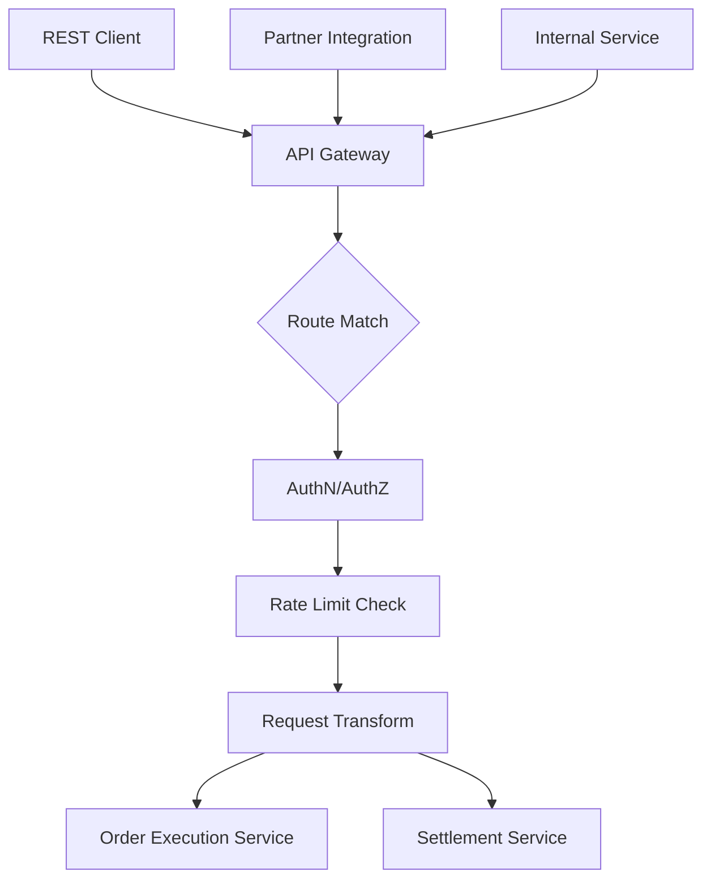
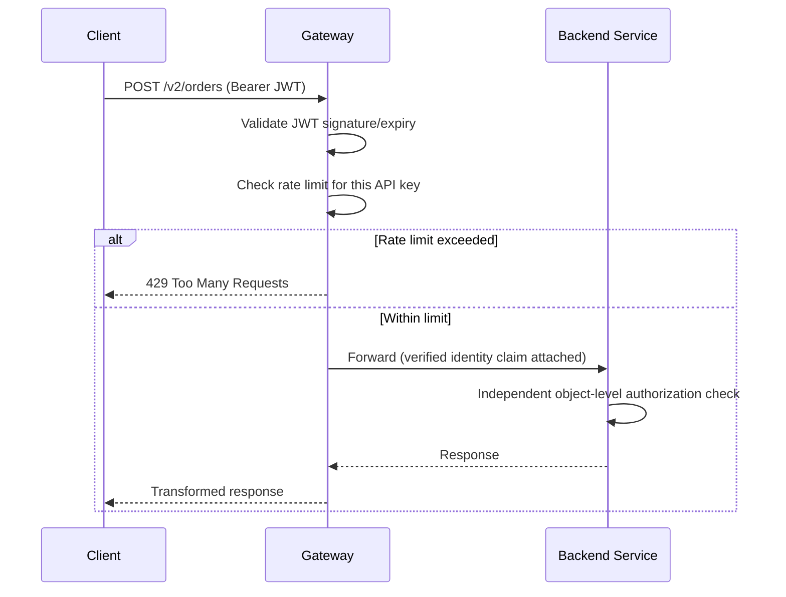
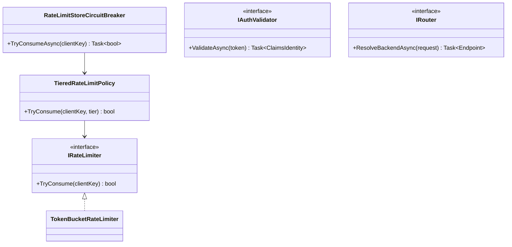
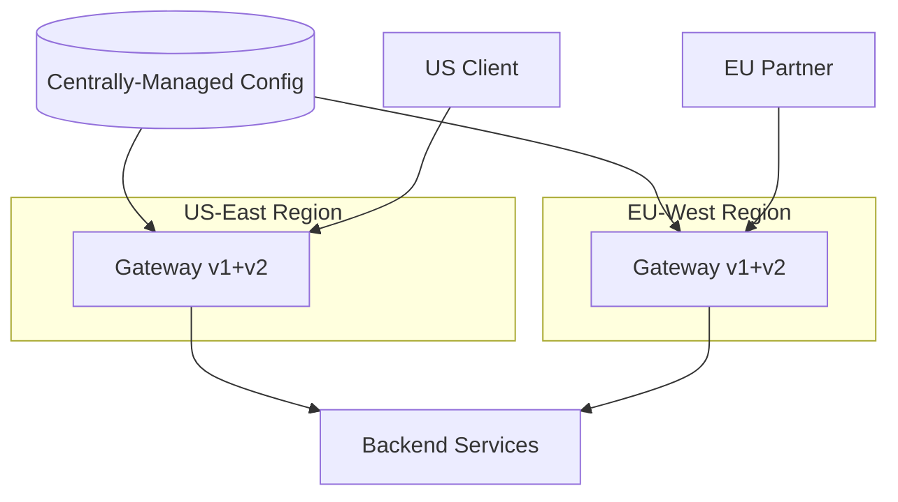
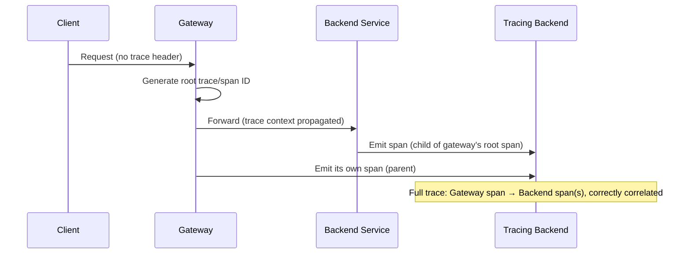
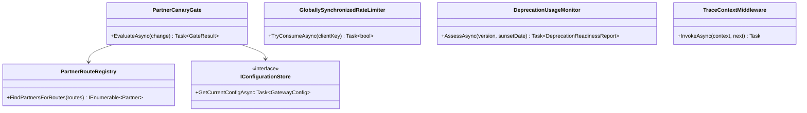

# API Gateway — Complete Interview Prep (All Topics, One File)

> Domain: API Gateway | Level: Beginner → Expert | Prerequisite: [[../03-REST-APIs/01-REST-APIs-Interview-Prep]] (rate limiting, versioning, security), [[../02-DotNet-AspNetCore/01-DotNet-AspNetCore-Interview-Prep]], [[../17-Microservices/00-Microservices-Interview-Master-Guide-DotNet-TechLead-Architect]] §18, §38 (BFF/GraphQL)
> **Quick-prep edition** (consolidated 2026-10-03). This one file replaces Modules 127–128. Originals: `git show ebb2d5c:38-API-Gateway/<file>.md`
> Each topic has: **Key concepts → config/C# example → Most common interview questions with answers.**

| # | Topic | # | Topic |
|---|---|---|---|
| 1 | What an API gateway does (and doesn't) | 7 | Gateway as single point of failure; HA & multi-region |
| 2 | Gateway products & YARP | 8 | API versioning & lifecycle at the gateway |
| 3 | Routing & service discovery | 9 | Observability & trace propagation |
| 4 | Rate limiting & quotas | 10 | Partner APIs, plugins & governance |
| 5 | AuthN/AuthZ at the edge | 11 | Gateway vs service mesh vs load balancer |
| 6 | Transformation, aggregation & BFF | 12 | Top 20 rapid-fire + Principal · 13 Mistakes checklist |

---

## 1. What an API Gateway Does (and Doesn't)

**Key concepts**
- A **single entry point** (north-south traffic) in front of services: **routing**, **TLS termination**, **authentication/token validation**, coarse **authorization**, **rate limiting/quotas**, request/response **transformation**, **caching**, **CORS**, **API keys and developer portal**, **observability**, request size limits, IP filtering/WAF integration, canary/traffic splitting, protocol translation (REST↔gRPC).
- **Doesn't (shouldn't):** business logic, domain orchestration, fine-grained object-level authorization (BOLA checks belong in services), data aggregation that turns it into a monolith ("smart gateway" anti-pattern).
- Patterns: **single gateway**, **BFF per client type**, **gateway per domain/team** (federated), internal vs external gateways.

**Common interview question**

**Q. What belongs in the gateway vs in services?**
Gateway: cross-cutting edge concerns — TLS, authentication, coarse authorization (scopes), rate limits, routing, CORS, size limits, observability. Services: business logic and object-level authorization. A gateway with business rules becomes a bottleneck and a shared deployment dependency.

---

## 2. Gateway Products & YARP

| Option | Notes |
|---|---|
| **YARP** (.NET) | reverse proxy library — build a custom gateway in ASP.NET Core (middleware for auth, rate limiting, transforms) |
| **Azure API Management** | full API management: policies, products, dev portal, self-hosted gateways |
| **AWS API Gateway** | managed REST/HTTP/WebSocket APIs, authorizers, usage plans |
| **Kong, Apigee, Tyk, Gravitee** | plugin-based gateways/API management |
| **Envoy-based** (Envoy Gateway, Emissary, Istio ingress) / **Gateway API** | Kubernetes-native ingress gateways |
| **Ocelot** | older .NET gateway; YARP is now the common choice |

```csharp
// YARP gateway with JWT auth, rate limiting and per-route policies
builder.Services.AddAuthentication(JwtBearerDefaults.AuthenticationScheme)
    .AddJwtBearer(o => { o.Authority = "https://login.example.com/"; o.Audience = "api-gateway"; });
builder.Services.AddAuthorizationBuilder().AddPolicy("payments", p => p.RequireClaim("scope", "payments.write"));
builder.Services.AddRateLimiter(o => o.AddPolicy("per-client", ctx =>
    RateLimitPartition.GetTokenBucketLimiter(ctx.User.FindFirst("client_id")?.Value ?? ctx.Connection.RemoteIpAddress!.ToString(),
        _ => new TokenBucketRateLimiterOptions { TokenLimit = 200, TokensPerPeriod = 100, ReplenishmentPeriod = TimeSpan.FromSeconds(1) })));
builder.Services.AddReverseProxy().LoadFromConfig(builder.Configuration.GetSection("ReverseProxy"));

var app = builder.Build();
app.UseAuthentication(); app.UseAuthorization(); app.UseRateLimiter();
app.MapReverseProxy();
```

```json
{
  "ReverseProxy": {
    "Routes": {
      "payments": { "ClusterId": "payments", "AuthorizationPolicy": "payments", "RateLimiterPolicy": "per-client",
                    "Match": { "Path": "/api/payments/{**rest}" },
                    "Transforms": [ { "PathPattern": "/v1/{**rest}" }, { "RequestHeader": "X-Gateway", "Set": "yarp" } ] }
    },
    "Clusters": {
      "payments": { "LoadBalancingPolicy": "PowerOfTwoChoices",
                    "HealthCheck": { "Active": { "Enabled": true, "Interval": "00:00:10", "Path": "/health/ready" } },
                    "Destinations": { "a": { "Address": "http://payments-a:8080" }, "b": { "Address": "http://payments-b:8080" } } }
    }
  }
}
```

**Common interview question**

**Q. Managed API management vs a custom YARP gateway?**
Managed (APIM, AWS API Gateway, Apigee) for partner/public APIs needing products, subscriptions, a developer portal, analytics and policies without building them. YARP for internal edge proxies where you want full control, .NET extensibility, low cost and latency, and you're willing to own it.

---

## 3. Routing & Service Discovery

- Match on **host, path, method, headers, query** → route to clusters/destinations; path rewriting; weighted routing for canaries.
- **Discovery:** static config, DNS, Kubernetes services, Consul/Eureka, cloud target groups; YARP config providers can be dynamic (from a database or service registry).
- **Load balancing** across destinations (round robin, least requests, power of two choices), **active/passive health checks**, retries only for idempotent methods.

---

## 4. Rate Limiting & Quotas

- **Algorithms:** token bucket (bursts), sliding window, fixed window, concurrency limits (see [[../03-REST-APIs/01-REST-APIs-Interview-Prep]] §11).
- **Granularity:** per API key/client ID, user, tenant, IP (unauthenticated), route; **quotas** per plan (calls/month).
- **Distributed counters** (Redis) or gateway-cluster-wide state; local fallback limits if the store is down.
- Return **429** with `Retry-After` and limit headers.
- The gateway does **coarse** protection; services do business-aware limits.

**Common interview question**

**Q. Where should rate limiting live — gateway or service?**
Both: the gateway rejects abusive or over-quota traffic cheaply before it reaches services (per client/IP/plan); services enforce business-aware limits (per tenant per expensive operation) and protect their own dependencies (concurrency limits, bulkheads).

---

## 5. AuthN/AuthZ at the Edge

**Key concepts**
- Validate tokens at the gateway (JWT signature via JWKS, issuer, **audience**, expiry, scopes) → reject unauthenticated traffic early; mTLS for partners; API keys only to identify clients (combined with OAuth).
- **Don't rely on the gateway alone:** services still validate tokens (zero trust) and perform **object-level authorization**.
- **Token handling:** forward the user token (with correct audience) or exchange it for an internal token (token exchange) — never strip identity and pass a trusted header that internal services blindly trust unless the network path is guaranteed (and even then prefer signed tokens).
- **BFF auth for SPAs:** the gateway/BFF holds tokens server-side and uses HttpOnly cookies with the browser.

**Common interview question**

**Q. If the gateway validates tokens, do services need to?**
Yes. Zero trust: internal traffic can bypass the gateway (misrouting, compromised pod, internal callers), and only services can do object-level checks. The gateway provides coarse filtering and protection; services remain the authority.

---

## 6. Transformation, Aggregation & BFF

- **Transformations:** header add/remove, path rewrite, protocol translation (REST→gRPC transcoding), response shaping (careful), payload validation (schema), compression.
- **Aggregation:** combining calls in the gateway → convenient for clients but risks business logic creeping in; prefer a **BFF** owned by the client team for client-specific composition.
- **BFF per client type** (web, mobile, partner) — each shapes data for its client and handles its auth flow.

**Common interview question**

**Q. Gateway aggregation or BFF?**
Light, generic aggregation can live at the gateway, but client-specific composition and shaping belong in BFFs owned by the client teams — otherwise the shared gateway accumulates logic for every client and becomes a coordination bottleneck.

---

## 7. Gateway as Single Point of Failure; HA & Multi-Region

**Key concepts**
- The gateway sits on every request → it's a **critical dependency**: run multiple instances across AZs, autoscale, keep it **stateless**, isolate config changes (a bad config deploy can take down every API).
- **Config changes are deployments:** validate, canary per region, roll back quickly; separate gateways for critical vs non-critical APIs (blast radius).
- **Multi-region:** global entry (Front Door/Global Accelerator/Route 53 latency routing) → regional gateways → regional services; regional failover tested; data residency routing.
- Timeouts/keep-alive alignment with backends (see the ALB/Kestrel seam in the Microservices guide §25).

**Common interview questions**

**Q1. How do you stop the gateway from being a single point of failure?**
Multiple stateless instances across zones and regions behind a global load balancer, autoscaling with headroom, health checks, circuit breakers to failing backends, staged configuration rollouts with automatic rollback, and separate gateway deployments for critical API groups.

**Q2. A gateway config change took down all APIs. How do you prevent it?**
Treat config as code: PR review, schema validation and automated tests of routes in CI, canary rollout to a subset of instances/regions with health checks, instant rollback, and blast-radius reduction by splitting gateways per domain or criticality.

---

## 8. API Versioning & Lifecycle at the Gateway

- Route versions (`/v1`, `/v2`, header-based) to different backends or deployments; run versions side by side.
- **Lifecycle:** publish → deprecate (announce, `Deprecation`/`Sunset` headers, migration guides) → track usage per client per version (gateway analytics) → brownouts → retire. Tracked explicitly, owned per API.
- APIM revisions (non-breaking changes) vs versions (breaking).

**Common interview question**

**Q. How do you retire an API version used by 40 partners?**
Use gateway analytics to identify every client still calling it, notify with a timeline, add deprecation headers, provide migration support, run scheduled brownouts to surface stragglers, extend only by explicit agreement, then retire and return 410 with a link to docs.

---

## 9. Observability & Trace Propagation

- Gateway metrics per route/client: RPS, latency percentiles, 4xx/5xx (split gateway-generated vs upstream), rate-limit rejections, auth failures.
- **Propagate W3C trace context** (`traceparent`) — the gateway starts or continues the trace; ensure custom gateways and plugins don't drop headers.
- Access logs with client ID, route, upstream latency, correlation ID — redact tokens and PII.

---

## 10. Partner APIs, Plugins & Governance

- **Partner integrations:** dedicated products/plans, per-partner keys and OAuth clients, mTLS, IP allow-lists, quotas, SLAs, sandbox environments, webhook signing.
- **Plugins/extensions:** custom policies (Kong plugins, APIM policies, YARP middleware) — keep them generic, tested, versioned; avoid business logic.
- **Governance:** API design standards (linting OpenAPI), ownership per route, review of new public endpoints, security baselines enforced at the gateway (auth required by default).

---

## 11. Gateway vs Service Mesh vs Load Balancer

| | Load balancer | API gateway | Service mesh |
|---|---|---|---|
| Traffic | north-south, L4/L7 | north-south (edge), L7 API concerns | east-west (service-to-service) |
| Focus | distribute connections/requests, health | auth, rate limits, routing, API products | mTLS, retries, traffic policy, telemetry between services |
| Examples | ALB/NLB, Azure LB/App Gateway | APIM, AWS API GW, Kong, YARP | Istio, Linkerd |

**Common interview question**

**Q. Do you need both an API gateway and a service mesh?**
They solve different problems: the gateway manages external API exposure (clients, keys, quotas, auth), the mesh manages internal service-to-service traffic (mTLS, retries, telemetry). Many platforms use both; small ones use a gateway plus libraries instead of a mesh.

---

## 12. Top 20 Rapid-Fire Questions + Principal Questions

1. **Gateway role?** Single entry for cross-cutting edge concerns.
2. **Business logic in gateway?** No.
3. **.NET gateway?** YARP.
4. **Managed options?** APIM, AWS API Gateway, Apigee, Kong.
5. **Routing match?** Host/path/headers/method.
6. **Rate limiting granularity?** Client, user, tenant, IP, route.
7. **429 headers?** `Retry-After`, limit headers.
8. **Token validation?** Signature, issuer, audience, expiry, scopes.
9. **Services still validate?** Yes (zero trust, BOLA).
10. **BFF?** Client-specific backend owned by the client team.
11. **Aggregation risk?** Smart-gateway monolith.
12. **SPOF mitigation?** Stateless, multi-AZ/region, staged config.
13. **Config changes?** Code-reviewed, canaried, rollback.
14. **Versioning?** Side-by-side routes + usage tracking.
15. **Retirement?** Deprecation headers, brownouts, 410.
16. **Tracing?** Propagate `traceparent`.
17. **Partner security?** OAuth + mTLS + quotas + allow-lists.
18. **Gateway vs mesh?** North-south vs east-west.
19. **Retries at gateway?** Only idempotent methods.
20. **Timeouts?** Aligned with backend keep-alive.

**Principal-level question**

**P. Consolidate five different gateways across the organization — how?**
Inventory routes, policies and owners; define a target (managed APIM for partner/public APIs + YARP/Envoy for internal edge) and a policy baseline; migrate domain by domain with parallel routing and traffic comparison; move policies to config-as-code with CI tests; keep per-domain gateway instances for blast radius; decommission old gateways with usage evidence.

---

## 13. Mistakes Checklist (say why each is wrong)
- [ ] Business logic/orchestration in the gateway · object-level auth only at the gateway
- [ ] Services trusting unsigned identity headers from the gateway
- [ ] One gateway for everything with untested config pushes
- [ ] Per-instance rate-limit counters · limiting only by IP
- [ ] Retrying non-idempotent requests at the gateway · mismatched timeouts with backends
- [ ] Dropping trace headers · logging tokens
- [ ] Versions never retired · no usage analytics per client

---

## Architecture Diagrams (preserved from the original modules)

> All 6 Mermaid/ASCII diagrams from the original `38-API-Gateway/` files, kept verbatim and grouped by source module. Originals: `git show ebb2d5c:38-API-Gateway/<file>.md`.

### Module 127 — API Gateway: Routing, Rate Limiting, Auth Enforcement & Request/Response Transformation at the Edge
*Source: `01-APIGatewayFundamentals-Routing-RateLimiting-AuthEnforcement-Transformation.md`*

**3. Visual Architecture**



**3. Visual Architecture**



**13. Low-Level Design**



### Module 128 — API Gateway: Capstone — Production-Scale Gateway Consolidation, Multi-Region Deployment & API Version Lifecycle
*Source: `02-Capstone-ProductionScaleGatewayConsolidation-MultiRegion-VersionLifecycle.md`*

**3. Visual Architecture**



**3. Visual Architecture**



**13. Low-Level Design**


