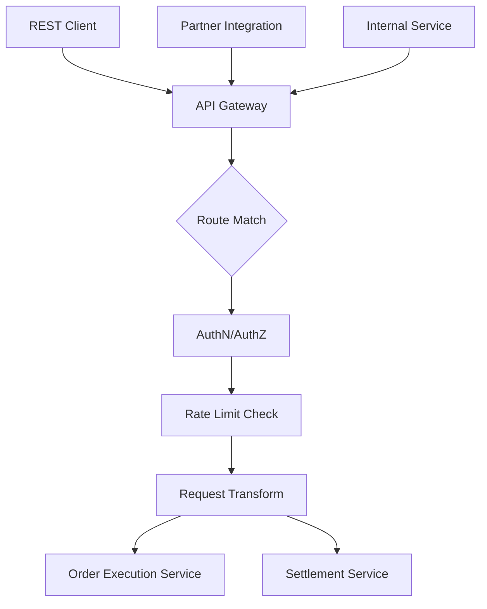
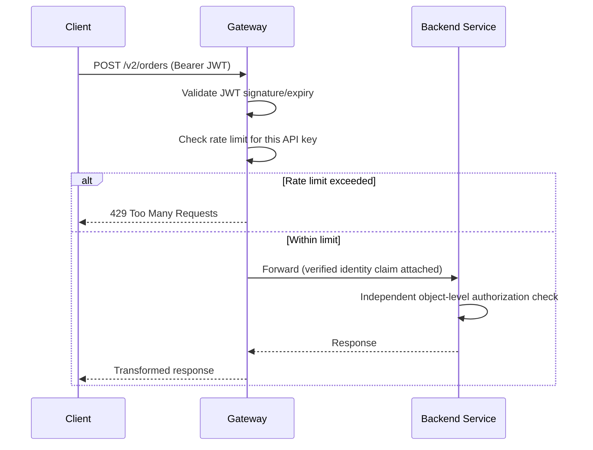
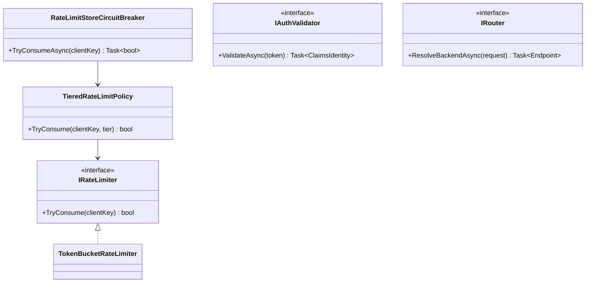

# Module 127 — API Gateway: Routing, Rate Limiting, Auth Enforcement & Request/Response Transformation at the Edge

> Domain: API Gateway | Level: Beginner → Expert | Prerequisite: [[../37-Outbox/02-Capstone-SharedMultiTenantOutboxRelayPlatform]] and [[../33-Hexagonal-Architecture/02-Capstone-AdapterSubstitutionForTestability-RegulatedTradingExecutionEngine]] (Module 118 Advanced Q6 explicitly previewed this domain's territory — consistent cross-cutting policy enforcement across multiple Primary Adapters/channels exposing the same capability — as complementary to, not redundant with, Hexagonal Architecture's own Primary-Port symmetry)
>
> **Domain scope note:** `38-API-Gateway` is scoped to 2 modules (127–128, standard depth, autonomously scoped per the "no more waiting" workflow decision): this Fundamentals module and a capstone consolidating the Order Execution Engine's multiple channels (Module 118 Basic Q5's REST/Kafka/batch Primary Adapters) behind a genuine, production-scale gateway. Full 16-section template; Elite FinTech Interview Panel lens.

---

## 1. Fundamentals

**What:** A dedicated infrastructure layer sitting in front of one or more backend services, providing centralized, cross-cutting request handling — routing, authentication/authorization enforcement, rate limiting, and request/response transformation — applied consistently across every client and channel, rather than duplicated inside each backend service itself.

**Why:** Module 118 Basic Q5 established that a single business capability (`ISubmitOrderInputPort`) can be legitimately exposed through multiple, structurally different Primary Adapters (REST, Kafka, batch) — an API Gateway is specifically the layer providing *consistent, centrally-governed* cross-cutting policy (auth, rate limits, observability) across those channels, exactly the concern Module 118 Advanced Q6 flagged as complementary to, not solved by, Primary-Port symmetry alone.

**When:** Once a system has enough external-facing entry points, or diverse enough client types (mobile, partner integrations, internal services), that duplicating auth/rate-limiting/transformation logic per-service becomes inconsistent or unmaintainable — the identical complexity-justifying threshold this course has applied to every other infrastructure-layer adoption decision (Module 113 Intermediate Q7).

**How (30,000-ft view):**
```
Client → API Gateway → [Route match] → [AuthN/AuthZ] → [Rate limit check] → [Transform] → Backend Service
                                                                                    ↓
                                                                          Response transform → Client
```

---

## 2. Deep Dive

### 2.1 Routing — Path/Host-Based Matching and Service Discovery Integration
The gateway matches an incoming request's path/host/header against a configured routing table, forwarding to the correct backend service instance — in a dynamic, container-orchestrated environment (Module 21-23's Kubernetes Service/Ingress material), the gateway typically integrates with service discovery (resolving a logical service name to current, healthy instance endpoints) rather than a static, hand-maintained IP list, directly reusing Module 74's already-established Service/Ingress discovery mechanics one layer up.

### 2.2 Rate Limiting — Algorithms and Enforcement Granularity
**Token bucket** (a per-client bucket refilling at a fixed rate, requests consuming tokens, rejected when empty) and **sliding window** (counting requests in a rolling time window) are the two dominant algorithms — token bucket tolerates brief bursts up to the bucket's capacity; sliding window enforces a stricter, more evenly-distributed rate; the granularity (per-client, per-API-key, per-IP, per-endpoint) must match the actual abuse/fairness concern being addressed, not a single, uniform limit applied identically regardless of client type.

### 2.3 AuthN/AuthZ Enforcement at the Edge
The gateway commonly terminates and validates authentication (JWT signature/expiry verification, mTLS client-certificate validation) centrally, forwarding a verified identity claim to backend services rather than requiring every backend to independently implement full token-validation logic — but, directly Module 119 §8/Module 123 §8's already-established "coordination doesn't imply trust" principle, this is defense-in-depth's *first* layer, never a substitute for each backend service's own object-level authorization check (Module 97's IDOR/BOLA finding still applies fully behind the gateway).

### 2.4 Request/Response Transformation and the BFF Pattern
The gateway can adapt a backend's own internal API shape into whatever shape a specific client type needs (protocol translation, request aggregation combining multiple backend calls into one client-facing response) — a **Backend for Frontend (BFF)** is a specialized, per-client-type variant of this same idea, trading a single, general-purpose gateway for several, purpose-built ones each tailored to one specific client category's own needs (§15 develops this trade-off fully).

### 2.5 The Gateway as a Single Point of Failure
Directly Module 126 §9's already-established elevated-blast-radius caution, recurring here in its sharpest form yet: since *every* client request passes through the gateway, its own availability and correctness become the single most critical dependency in the entire system — requiring HA/horizontal-scaling rigor (Module 21-23's load-balancer/ASG patterns) proportionate to this maximally-elevated criticality, not merely "adequate for a typical service."

### 2.6 API Versioning at the Gateway
Directly extending Module 113 Advanced Q8/Module 114's preview: the gateway is a natural place to host version-routing logic (`/v1/orders` vs. `/v2/orders` routed to different backend versions, or a single backend version serving both via internal adaptation) — but this must never become a substitute for each backend's own disciplined internal/external-contract separation (Module 113 Advanced Q8); the gateway's versioning logic sits *in addition to*, not instead of, that discipline.

---

## 3. Visual Architecture





---

## 4. Production Example

**Problem:** The Order Execution Engine's three Primary Adapters (Module 118 Basic Q5 — REST, Kafka consumer, batch replay) each independently implemented their own authentication and rate-limiting logic, with inconsistent enforcement — the REST endpoint had strict per-client rate limits; the batch-replay tool had none at all, since it was "internal, trusted."

**Architecture:** Consolidating external-facing access (the REST channel, plus a new partner-integration API) behind a single API Gateway, with centrally-configured, consistent rate limiting and authentication — while the Kafka consumer and batch-replay Adapters, being genuinely internal, remained outside the gateway's scope (§15 develops this internal/external boundary decision).

**Implementation:** The gateway's rate limiter was configured with a single, uniform per-API-key token-bucket limit, sized for the organization's typical retail-client integration volume.

**Trade-offs:** A uniform rate limit is simpler to configure and reason about than per-client-tier limits, at the cost of not accommodating genuinely different, legitimate traffic profiles across different client types.

**Lessons learned:** A newly-onboarded institutional algo-trading partner, whose legitimate order-submission volume was two orders of magnitude higher than the typical retail-client profile the uniform limit was calibrated against, was immediately, repeatedly rate-limited during a critical trading window — the gateway correctly enforced its configured policy, but that policy itself hadn't been calibrated for this specific, legitimate client's own genuinely different traffic profile. The fix: per-client-tier rate-limit configuration (directly reapplying Module 126 §2.1's per-tenant-configuration-flexibility principle to rate limiting specifically) — a "retail" tier, an "institutional" tier with a substantially higher token-bucket capacity, and an onboarding checklist explicitly requiring each new partner's own expected traffic profile to be assessed and appropriately tiered *before* go-live, not discovered reactively during their first high-volume trading session.

---

## 5. Best Practices
- Calibrate rate limits per client-tier based on each client type's own genuine, expected traffic profile — never a single, uniform limit applied regardless of legitimate volume differences (§4).
- Treat gateway-level authentication as the first, not the only, layer of defense — every backend service retains its own independent object-level authorization check (§2.3, Module 97).
- Integrate routing with dynamic service discovery rather than static, hand-maintained endpoint lists (§2.1).
- Engineer the gateway's own HA/scaling with rigor proportionate to its maximally-elevated criticality as the single point every request passes through (§2.5).
- Keep gateway-level API versioning as a complement to, never a replacement for, each backend's own internal/external-contract-separation discipline (§2.6).

## 6. Anti-patterns
- A single, uniform rate limit applied across genuinely different client traffic profiles, blocking legitimate high-volume clients (§4's incident).
- Treating gateway-level authentication as sufficient authorization, skipping each backend's own independent object-level check (§2.3).
- Static, hand-maintained routing configuration in a dynamic, container-orchestrated environment, drifting from actual, current service topology.
- Under-provisioning the gateway's own HA/scaling relative to its single-point-of-failure criticality (§2.5).
- Using gateway-level version-routing as a substitute for, rather than a complement to, disciplined internal/external API contract separation (§2.6).

---

## 7. Performance Engineering

**CPU/Memory:** JWT signature validation and request/response transformation are the gateway's dominant per-request CPU costs — benchmark these specifically at realistic peak request rates, not assumed negligible.

**Latency:** The gateway adds a genuine, measurable latency hop to every request — track this explicitly as part of any end-to-end latency budget (Module 118 §7's discipline), distinct from and additive to backend-service latency.

**Throughput:** Gateway throughput must exceed peak aggregate client request rate across every channel it serves, with margin (Module 102's capacity-planning discipline).

**Scalability:** Horizontal gateway scaling behind a load balancer, stateless request handling (rate-limit state externalized to a shared, fast store like Redis rather than held in-process) enabling any gateway instance to serve any request.

**Benchmarking:** Load-test specifically including realistic institutional/high-volume client traffic profiles (§4's own incident), not only typical-retail-volume assumptions.

**Caching:** Response caching at the gateway for genuinely cacheable, read-heavy endpoints (Module 103), with cache-key design carefully scoped to avoid cross-client data leakage (§8).

---

## 8. Security

**Threats:** Rate-limit bypass via distributed/rotated API keys or IPs; JWT forgery or replay if signature validation or expiry checking is implemented incorrectly; cache-key collision leaking one client's cached response to another.

**Mitigations:** Rate limiting keyed on a genuinely hard-to-rotate identity dimension (an authenticated API key or client certificate, not merely source IP, which is trivially spoofable/rotatable); rigorous, tested JWT validation (signature, expiry, issuer, audience claims all checked, not merely signature alone); cache keys explicitly scoped to include client/tenant identity for any response cache serving multi-client traffic.

**OWASP mapping:** API Security Top 10's own specific categories apply directly here — Broken Authentication (weak/incomplete JWT validation), Broken Object-Level Authorization (if the gateway's auth is mistakenly treated as sufficient, per §2.3), and Lack of Resources & Rate Limiting (the specific category this module's rate-limiting discipline directly addresses).

**AuthN/AuthZ:** The gateway's own authentication is necessary but insufficient (§2.3) — every backend independently re-verifies authorization for the specific resource/action being requested.

**Secrets:** Gateway's own JWT-signing-key/certificate validation material managed and rotated per Module 86's established discipline, with the gateway's own configuration never embedding long-lived secrets in plaintext.

**Encryption:** TLS termination at the gateway (or pass-through to backend-terminated TLS, per the organization's own specific security posture) with encryption maintained for any internal, gateway-to-backend hop carrying sensitive data.

---

## 9. Scalability

**Horizontal scaling:** Stateless gateway instances behind a load balancer, with rate-limit and session state externalized to a shared, fast store (Redis) rather than held per-instance, enabling any instance to serve any request without sticky-session requirements.

**Vertical scaling:** Less relevant than horizontal scaling for a stateless gateway tier.

**Caching:** Response caching (§7) as a genuine throughput lever for cacheable endpoints, distinct from rate-limiting's own, separate purpose.

**Replication/Partitioning:** The shared rate-limit store itself requires its own HA/replication (Module 7's Redis-clustering material), since its own unavailability would either fail-open (losing rate-limiting protection entirely) or fail-closed (blocking all traffic) depending on configuration — an explicit, deliberate choice, not a default left unexamined.

**Load balancing:** Standard L4/L7 load balancing (Module 57/65's ALB/NLB material) in front of the gateway tier itself.

**High Availability:** Given §2.5's maximally-elevated criticality, the gateway tier warrants the organization's highest HA rigor — multi-AZ/region deployment, automated failover, and continuous health-check-based instance replacement.

**Disaster Recovery:** Gateway configuration (routing rules, rate-limit policies) should itself be version-controlled and rapidly redeployable, treating gateway configuration with the same infrastructure-as-code discipline (Module 85) as any other critical infrastructure.

**CAP theorem:** The shared rate-limit store's own fail-open-vs-fail-closed behavior during a partition is a direct, deliberate CAP-theorem-relevant choice — fail-open favors availability (traffic continues, rate limiting temporarily unenforced) while fail-closed favors a form of consistency (rate limits never bypassed, at the cost of blocking all traffic during the store's own unavailability) — the correct choice depends on which failure mode is less damaging for this specific system's own risk profile.

---

## 10. Interview Questions

### Basic (10)

1. **Q: What is an API Gateway's primary purpose?**
   **A:** Centralizing cross-cutting request-handling concerns — routing, authentication, rate limiting, transformation — applied consistently across clients and channels, rather than duplicated per-backend-service (§1).
   **Why correct:** States the specific, centralizing purpose precisely.
   **Common mistakes:** Describing it only as "a reverse proxy," missing the specific cross-cutting-policy-enforcement value beyond mere request forwarding.
   **Follow-ups:** "Which prior module explicitly previewed this domain's specific value?" (Module 118 Advanced Q6, §1.)

2. **Q: What is the difference between token-bucket and sliding-window rate limiting?**
   **A:** Token bucket tolerates brief bursts up to bucket capacity; sliding window enforces a stricter, more evenly-distributed rate over a rolling time window (§2.2).
   **Why correct:** States both algorithms' defining behavioral difference.
   **Common mistakes:** Assuming the two algorithms are interchangeable with no meaningful behavioral difference.
   **Follow-ups:** "Which would better suit a client with naturally bursty, but bounded, traffic?" (Token bucket, which specifically accommodates brief bursts, §2.2.)

3. **Q: Why is gateway-level JWT validation not sufficient authorization on its own?**
   **A:** It verifies *who* the caller is, but says nothing about whether that caller is authorized for the *specific* resource/action being requested — each backend must independently verify this (§2.3, Module 97).
   **Why correct:** Correctly distinguishes authentication from authorization, directly reapplying Module 97's already-established IDOR/BOLA finding.
   **Common mistakes:** Assuming a validated JWT alone is sufficient evidence of proper authorization for any specific request.
   **Follow-ups:** "What course-established principle does this directly reapply?" (Module 119 §8/Module 123 §8's "coordination doesn't imply trust" finding, §2.3.)

4. **Q: Why should the gateway integrate with dynamic service discovery rather than a static routing table?**
   **A:** In a dynamic, container-orchestrated environment, backend instance endpoints change frequently — a static table would quickly drift from actual, current topology (§2.1).
   **Why correct:** States the specific reason static configuration fails in this environment.
   **Common mistakes:** Assuming a periodically-updated static list is an adequate substitute for genuine, real-time service discovery.
   **Follow-ups:** "What prior module's mechanics does this directly reuse?" (Module 74's Kubernetes Service/Ingress discovery mechanics, §2.1.)

5. **Q: Why does the gateway represent an elevated single-point-of-failure risk compared to any individual backend service?**
   **A:** Every client request across every channel passes through it — its own availability/correctness is the single most critical dependency in the entire system (§2.5).
   **Why correct:** States the specific reason (universal request-path criticality) this elevated risk exists.
   **Common mistakes:** Treating the gateway as just another service requiring standard, not exceptional, HA engineering rigor.
   **Follow-ups:** "What course-established caution does this directly recall?" (Module 126 §9's elevated shared-platform blast-radius caution, §2.5.)

6. **Q: What is a Backend for Frontend (BFF)?**
   **A:** A specialized, per-client-type gateway variant, tailored to one specific client category's own needs, rather than a single, general-purpose gateway serving every client type identically (§2.4).
   **Why correct:** States the defining, distinguishing property (per-client-type specialization) precisely.
   **Common mistakes:** Assuming BFF and a general-purpose API Gateway are the same concept with different names.
   **Follow-ups:** "What's the genuine trade-off between one general-purpose gateway and several BFFs?" (§15 develops this fully — specialization/fit versus duplicated cross-cutting-policy maintenance across multiple BFFs.)

7. **Q: Why must gateway-level API versioning never replace each backend's own internal/external contract separation?**
   **A:** The gateway's version-routing is an additional, complementary mechanism; the backend's own discipline (Module 113 Advanced Q8) is what actually protects its internal model from being coupled to and broken by external consumer expectations (§2.6).
   **Why correct:** Correctly reapplies an already-established principle, clarifying the gateway's complementary (not substitutive) role.
   **Common mistakes:** Assuming gateway-level versioning alone is sufficient protection against breaking internal refactors affecting external consumers.
   **Follow-ups:** "What specific risk would relying on gateway versioning alone still leave unaddressed?" (Module 113 Advanced Q8's exact risk — an internal Aggregate refactor could still break a backend's own directly-exposed contract if the backend itself never separated internal from external DTOs, regardless of gateway-level version routing.)

8. **Q: Why should rate limiting be keyed on an authenticated identity rather than source IP alone?**
   **A:** Source IP is trivially spoofable or rotated (e.g., via a distributed set of IPs or a rotating proxy), making IP-based rate limiting easy to bypass; an authenticated API key or client certificate is a genuinely harder-to-rotate identity dimension (§8).
   **Why correct:** States the specific weakness of IP-based limiting and the stronger alternative.
   **Common mistakes:** Assuming IP-based rate limiting alone provides adequate protection against a determined, distributed abuse attempt.
   **Follow-ups:** "What OWASP category does inadequate rate limiting fall under?" (Lack of Resources & Rate Limiting, one of the API Security Top 10's specific categories, §8.)

9. **Q: What was the actual root cause of §4's incident?**
   **A:** A single, uniform rate limit calibrated for typical retail-client volume was applied to a newly-onboarded institutional client whose legitimate traffic profile was genuinely, substantially higher.
   **Why correct:** States the precise mechanism from this module's own case study.
   **Common mistakes:** Assuming the gateway itself malfunctioned, rather than recognizing it correctly enforced a policy that was simply miscalibrated for this specific client's own legitimate needs.
   **Follow-ups:** "What was the fix?" (Per-client-tier rate-limit configuration plus a mandatory onboarding traffic-profile assessment, §4.)

10. **Q: Should the gateway's shared rate-limit store fail open or fail closed during its own unavailability?**
    **A:** This is a deliberate, system-specific choice — fail-open favors availability (traffic continues, temporarily unprotected); fail-closed favors blocking-over-bypassing rate limits, at the cost of blocking all traffic (§9).
    **Why correct:** Correctly frames this as a deliberate trade-off requiring explicit choice, not a universal default.
    **Common mistakes:** Assuming one behavior (typically fail-open, for convenience) is unconditionally correct without considering this specific system's own risk profile.
    **Follow-ups:** "Which choice would you recommend for a regulated financial system's order-submission gateway specifically?" (Likely fail-closed, or a carefully-bounded partial degradation, given the elevated stakes of unbounded, unprotected order flow during a rate-limit-store outage — a genuine, context-specific judgment call.)

### Intermediate (10)

1. **Q: Walk through why §4's uniform rate limit specifically failed for the institutional client, rather than simply being "too strict" in the abstract.**
   **A:** The limit was correctly calibrated for the *typical* client profile this organization had previously onboarded (retail-scale volume) — it wasn't "too strict" as an absolute value, it was miscalibrated *specifically relative to* this new, genuinely different client type's own two-orders-of-magnitude-higher legitimate volume, a mismatch invisible until this specific client type was actually onboarded and began generating its own real traffic.
   **Why correct:** Precisely identifies the mismatch as relative to a specific, new client profile, not an absolute miscalibration visible in isolation beforehand.
   **Common mistakes:** Assuming the original rate limit was simply set "too low" in some absolute sense, rather than recognizing it was appropriately calibrated for its original, intended client population and only became a problem when a genuinely different client profile was introduced.
   **Follow-ups:** "How would proactive traffic-profile assessment (§4's fix) have caught this before go-live?" (Requiring an explicit review of the new institutional client's own expected volume during onboarding — comparing it against the existing, uniform limit — would have surfaced the mismatch before the client's first live trading session, rather than discovering it reactively during a critical trading window.)

2. **Q: Design the specific decision test for whether a new API consumer warrants its own dedicated rate-limit tier, versus fitting within an existing tier, extending Module 126 Intermediate Q6's genuine-commonality test to this new context.**
   **A:** Compare the new consumer's own expected traffic profile against existing tiers' calibrated ranges — if it falls comfortably within an existing tier's range, no new tier is needed; if it's genuinely, significantly outside every existing tier's range (as the institutional client was relative to the retail tier), a new, dedicated tier calibrated specifically to this consumer's own demonstrated needs is warranted, rather than either forcing it into an ill-fitting existing tier or creating an unnecessary, over-granular tier for every individual client.
   **Why correct:** Correctly reapplies an already-established genuine-difference/commonality test to this new, rate-limit-tiering-specific decision.
   **Common mistakes:** Creating either too few tiers (forcing genuinely different clients into the same, ill-fitting limit, §4's exact mistake) or too many, individually-per-client tiers (unnecessary configuration-management overhead for clients that would fit perfectly well within a shared, appropriately-calibrated tier).
   **Follow-ups:** "How many tiers would be a reasonable starting point for a system with a modest, currently-known set of client categories?" (As few as genuinely distinguish real, demonstrated traffic-profile differences — often 2-4 tiers (e.g., retail, institutional, internal/trusted) rather than a large, granular set, escalating only as genuine new categories are demonstrated.)

3. **Q: Critique a gateway configuration where request/response transformation logic includes genuine business rules (e.g., "reject any order exceeding a specific notional value") rather than purely structural/protocol translation.**
   **A:** This directly reproduces Module 114 Basic Q7/Advanced Q2's already-established anti-pattern — business logic escaping into an outer-ring, infrastructure-adjacent layer (here, the gateway) rather than living in the Use Case/Aggregate where it belongs; a business rule enforced only at the gateway would be silently bypassed by any internal, non-gateway-routed entry point (e.g., Module 118's own Kafka consumer or batch-replay Adapters), exactly the risk Module 114 Intermediate Q5 already established for a Controller-level business check.
   **Why correct:** Directly reapplies an already-established, cross-module finding (business logic escaping into an outer-ring/gateway layer) to this specific, new context.
   **Common mistakes:** Assuming gateway-level transformation logic is a convenient, appropriate place for "simple" business validation, missing that any business rule enforced only there is invisible to and bypassed by non-gateway-routed entry points.
   **Follow-ups:** "What kind of transformation logic IS appropriate at the gateway?" (Purely structural/protocol concerns — reshaping a request/response's format, aggregating multiple backend calls into one client-facing response — never business-rule enforcement, which belongs in the Use Case/Aggregate regardless of which channel a request arrived through.)

4. **Q: How would you decide whether the batch-replay Adapter (§4) should also be routed through the API Gateway, or remain outside its scope as a genuinely internal channel?**
   **A:** Apply the same internal-vs-external boundary test this course has used repeatedly (Module 105's bounded-context/deployment-boundary reasoning) — if the batch-replay tool is invoked only by trusted, internal operational processes with no external client-facing exposure, routing it through the gateway's own external-facing cross-cutting policies (rate limiting calibrated for external client traffic, external authentication schemes) is likely unnecessary overhead; it should, however, still enforce its own, appropriate internal authentication/authorization (§2.3's "coordination doesn't imply trust" principle still applies even for internal-only channels) — just not necessarily through the same gateway serving external traffic.
   **Why correct:** Correctly applies an already-established internal/external boundary test to this specific channel-scoping decision, while still insisting internal channels retain their own appropriate security discipline.
   **Common mistakes:** Assuming "internal" automatically means "no security discipline needed at all," rather than recognizing internal channels still require their own, appropriately-scoped authentication/authorization, just not necessarily the external-facing gateway's specific cross-cutting policies.
   **Follow-ups:** "Would this reasoning change if the batch-replay tool were later exposed to an external partner for their own batch-submission use case?" (Yes — at that point, it becomes a genuinely external-facing channel, warranting the same gateway-routed cross-cutting policy enforcement as the REST and partner-integration channels already receive.)

5. **Q: Why does response caching at the gateway (§7) require particularly careful cache-key design specifically in a multi-client, multi-tenant context?**
   **A:** A cache key that fails to include client/tenant identity risks serving one client's cached response to a different client entirely — directly Module 126 §8's cross-tenant-leakage risk, recurring here specifically at the response-caching layer; the cache key must explicitly incorporate whatever dimension distinguishes genuinely different clients' own, potentially different, authorized responses for what might otherwise look like "the same" request path.
   **Why correct:** Connects this specific risk directly to an already-established cross-tenant-leakage caution, applied to this module's own new context (response caching specifically).
   **Common mistakes:** Designing a cache key based purely on request path/parameters, without considering that the same nominal request from two different, authenticated clients might legitimately warrant two different, client-specific cached responses.
   **Follow-ups:** "Give a concrete example where this specific risk would manifest." (A `/orders/summary` endpoint, if cached purely by path with no client-identity component, could serve one authenticated client's own order summary to a different, entirely unrelated client making the identical-looking request.)

6. **Q: Design the specific test verifying that gateway-level authentication is genuinely a defense-in-depth first layer, not the sole authorization mechanism, extending this course's established contract-testing discipline.**
   **A:** A deliberate, adversarial test bypassing the gateway entirely (calling a backend service's own API directly, simulating either an internal-network attacker or a misconfigured internal client) and confirming the backend service *still* correctly enforces its own, independent object-level authorization — directly verifying Module 97's IDOR/BOLA protection exists at the backend layer itself, not merely relying on (and therefore only ever testing) the gateway's own upstream enforcement.
   **Why correct:** Gives a concrete, adversarial test specifically designed to verify defense-in-depth genuinely exists at both layers, rather than only testing the "happy path" of requests correctly routed through the gateway.
   **Common mistakes:** Testing authorization only via requests routed correctly through the gateway, which would never reveal whether the backend's own independent authorization check actually, genuinely exists and functions correctly if the gateway were ever bypassed.
   **Follow-ups:** "Why is this specific test particularly important for a regulated financial system?" (A gateway misconfiguration or an internal-network compromise bypassing the gateway entirely is a realistic, non-negligible threat scenario (Module 97's own threat-modeling discipline) — this test provides concrete, verified evidence the backend's own authorization holds even under that specific, adversarial condition, not merely theoretical confidence.)

7. **Q: How would you decide, for this system, between a single general-purpose gateway serving every client type versus separate BFFs per client category (§2.4)?**
   **A:** Weigh the genuine differences in each client category's own request/response shape needs and cross-cutting policy requirements against the maintenance cost of duplicating that cross-cutting policy logic across multiple BFFs — if the retail, institutional, and partner-integration client types genuinely need substantially different request/response shapes (not merely different rate-limit tiers, which a single gateway can already accommodate via configuration), separate BFFs may be justified; if the differences are limited to configuration-level variation (rate-limit tiers, auth schemes) rather than genuinely different API shapes, a single, appropriately-configurable gateway remains the simpler, lower-maintenance-cost choice.
   **Why correct:** Gives a concrete decision test (genuine API-shape divergence versus mere configuration-level variation) distinguishing when BFFs' added complexity is justified from when a single, well-configured gateway suffices.
   **Common mistakes:** Adopting BFFs reflexively for "better separation" without confirming the client types' actual needs genuinely diverge in API shape, not merely in configuration values a single gateway could already accommodate.
   **Follow-ups:** "Does §4's institutional-vs-retail rate-limit difference alone justify separate BFFs?" (No — that's purely a configuration-tier difference (§Intermediate Q2), fully addressable within a single, appropriately-tiered gateway; it doesn't by itself indicate the genuinely different API-shape need that would justify separate BFFs.)

8. **Q: Why does the gateway's own configuration (routing rules, rate-limit policies) warrant infrastructure-as-code discipline (§9) rather than being managed as ad hoc, manually-applied changes?**
   **A:** Given §2.5's maximally-elevated criticality, an unreviewed, undocumented, manually-applied gateway-configuration change carries organization-wide blast-radius risk if incorrect — directly Module 85's already-established Infrastructure-as-Code rationale (reviewable, versioned, reproducible configuration) applied here specifically because the gateway's own configuration changes are exactly the kind of high-blast-radius change this discipline exists to govern.
   **Why correct:** Connects the specific requirement (IaC discipline) to the specific, elevated-stakes reason (gateway's maximal criticality) rather than treating it as generic best-practice advice.
   **Common mistakes:** Treating gateway configuration as a lower-stakes, "just settings" concern not warranting the same rigor as application code deployment, missing that its blast radius, per §2.5, is at least as significant as any code change.
   **Follow-ups:** "What specific IaC practice would you apply to a rate-limit-tier change specifically?" (Version-controlled configuration, peer-reviewed via pull request, and staged/canary-rolled-out exactly like any other high-risk production change, Module 126 Advanced Q5's own canary-staging discipline reapplied here.)

9. **Q: Critique a design where the gateway's rate-limit store failure mode (fail-open vs. fail-closed, §9) was never explicitly decided, defaulting to whatever the underlying library's own default behavior happened to be.**
   **A:** This is exactly the kind of undecided, defaulted-by-accident configuration this course has repeatedly warned against — the fail-open/fail-closed choice has genuinely significant, system-specific consequences (unprotected traffic during an outage versus fully blocked traffic), and leaving it to an unexamined library default means nobody has actually made the deliberate, risk-informed decision this choice warrants, precisely the "declared (or in this case, undeclared) versus actual" gap this course's central theme addresses.
   **Why correct:** Identifies the specific risk (an unexamined, accidental default standing in for a genuine, deliberate decision) and connects it to this course's central recurring theme.
   **Common mistakes:** Assuming a reasonable-sounding library default is equivalent to having made a genuine, informed decision appropriate to this specific system's own risk profile.
   **Follow-ups:** "How would you surface and correct this gap if discovered during a review?" (Explicitly document the current, actual default behavior, evaluate it against this system's own specific risk profile per §10 Basic Q10's reasoning, and make (or confirm) a deliberate, recorded decision — an ADR, Module 106 — rather than leaving it as an unexamined default.)

10. **Q: Synthesize how this module's gateway-level defense-in-depth principle (§2.3) relates to every prior module's own "coordination doesn't imply trust" finding.**
    **A:** This is the identical principle recurring in its most externally-facing form yet — Module 119 §8 established that CQRS's Command/Query separation doesn't imply reduced Query-side authorization scrutiny; Module 123/124 §8 established that saga-step coordination doesn't imply implicit inter-service trust; this module establishes that gateway-level authentication, despite being centralized and seemingly authoritative, doesn't imply backend services can safely relax their own independent authorization checks — the same underlying discipline (every component independently, redundantly verifies authorization, regardless of what upstream coordination or centralization might suggest) recurring at a new, externally-facing architectural layer.
    **Why correct:** Correctly identifies this module's own principle as a direct recurrence of an already-established, now multiply-demonstrated course theme, rather than a new, independent finding.
    **Common mistakes:** Treating this module's defense-in-depth principle as a gateway-specific insight unrelated to the identical principle already established in the CQRS and Saga domains.
    **Follow-ups:** "Why does this principle matter even more at the API Gateway layer specifically than at the internal CQRS/Saga layers?" (The gateway sits at the system's actual external trust boundary — a failure of defense-in-depth here directly exposes the system to genuinely external, potentially adversarial actors, a higher-stakes context than the internal-only coordination scenarios Module 119/123 originally examined.)

### Advanced (10)

1. **Q: Diagnose §4's incident from first principles and design the complete, structural fix preventing any future client-onboarding rate-limit mismatch from recurring.**
   **A:** Root cause: a single, uniform rate limit was calibrated for the organization's historically-typical client profile with no process ensuring future, genuinely different client types would be assessed against it before go-live (§4). Fix: (1) a mandatory, documented traffic-profile-assessment step in the client-onboarding checklist, explicitly comparing the new client's own expected volume against existing rate-limit tiers (Intermediate Q1/Q2); (2) a formal, calibrated multi-tier rate-limit structure (Intermediate Q2) rather than a single, uniform limit; (3) a pre-go-live load test specifically simulating the new client's own expected peak traffic against the assigned tier, confirming it's genuinely adequate before their first live production usage, not discovered reactively during it.
   **Why correct:** Identifies the actual root cause (no onboarding-time traffic-profile assessment process) and a three-part structural fix, rather than a one-off patch specific to this single institutional client.
   **Common mistakes:** Fixing only this specific client's rate limit without institutionalizing the onboarding-assessment process that would catch the next, differently-profiled new client before a similar incident recurs.
   **Follow-ups:** "Why is a pre-go-live load test specifically valuable, beyond the traffic-profile assessment alone?" (It provides concrete, verified evidence the assigned tier is genuinely adequate under realistic load, rather than relying solely on a documented, but unverified, traffic-profile estimate that could itself be inaccurate.)

2. **Q: A team proposes eliminating each backend service's own independent authorization checks entirely, arguing the gateway's centralized authentication makes them redundant and slows down request processing. Evaluate this proposal.**
   **A:** This directly, severely violates the defense-in-depth principle this module (and Module 119/123 before it) has established — removing backend-level authorization entirely means any gateway misconfiguration, bypass, or compromise (a realistic, non-negligible threat, Intermediate Q6) would leave every backend service with zero independent protection against unauthorized access, converting a currently defense-in-depth-protected system into one with a single, brittle point of authorization failure; the marginal latency saved by removing this check is a poor trade against this severe, demonstrated-class-of-risk increase.
   **Why correct:** Identifies the severe, specific risk this proposal introduces (single point of authorization failure) and correctly weighs it against the proposal's marginal, likely-overstated latency benefit.
   **Common mistakes:** Accepting the latency-improvement argument at face value without weighing it against the severe, demonstrated defense-in-depth loss this course has repeatedly warned against across multiple domains.
   **Follow-ups:** "How would you address the team's genuine latency concern without removing backend-level authorization entirely?" (Optimize the backend's own authorization-check implementation directly — e.g., caching authorization-relevant data appropriately, per Module 103's own discipline — rather than eliminating the check itself.)

3. **Q: Critique a BFF-per-client-type design (§2.4) where each BFF independently implements its own rate-limiting and authentication logic, rather than sharing a common, underlying implementation.**
   **A:** This directly reproduces the exact fragmentation problem Module 126's own capstone addressed for Outbox infrastructure, now recurring at the BFF layer — multiple, independently-implemented cross-cutting-policy mechanisms across several BFFs risk the identical inconsistent-quality and duplicated-effort problem a shared, underlying rate-limiting/authentication library (or a shared gateway-core component each BFF configures rather than reimplements) would prevent, directly extending Module 126's own golden-path-centralization lesson to this specific, multi-BFF architecture.
   **Why correct:** Correctly identifies this as a recurrence of an already-established, cross-domain organizational pattern (fragmented, independently-reimplemented cross-cutting infrastructure), rather than a BFF-specific, novel concern.
   **Common mistakes:** Assuming each BFF's own independence (per §2.4's original justification) implies its cross-cutting mechanisms should also be independently implemented, rather than recognizing that API-shape specialization (BFF's actual justification) and cross-cutting-policy-implementation sharing are two entirely separate, independently-decidable concerns.
   **Follow-ups:** "How would you architect this to preserve BFF-level API-shape specialization while still sharing cross-cutting policy implementation?" (A shared, underlying gateway-core library or service (Module 126's own shared-platform pattern) that each BFF configures with its own specific rate-limit tiers and API-shape transformations, rather than each BFF independently reimplementing rate-limiting/authentication logic from scratch.)

4. **Q: Design a load-testing methodology specifically validating the gateway's own HA/failover behavior under a genuine, simulated instance failure during peak load, extending this course's established fault-injection discipline to the gateway's own single-point-of-failure criticality.**
   **A:** Under realistic peak-load conditions, deliberately terminate a subset of gateway instances mid-test and measure the actual, observed client-facing impact (error rate, latency spike) during the failover window, confirming the load balancer's own health-check-based instance replacement genuinely, quickly restores full capacity — directly extending Module 118 §7's peak-load fault-injection discipline specifically to this module's own maximally-elevated-criticality component, rather than assuming standard HA configuration is adequate without direct, load-tested verification.
   **Why correct:** Correctly designs a test specifically targeting the gateway's own elevated HA requirements (§2.5) under realistic, combined failure-and-load conditions, rather than testing HA and peak-load capacity as separate, unrelated concerns.
   **Common mistakes:** Testing gateway HA only under low-load, "clean" failover conditions, or testing peak-load capacity only under assumed-healthy instance conditions, missing the combined, more realistic and more demanding scenario of instance failure occurring specifically during peak load.
   **Follow-ups:** "What specific metric would this test need to produce as its key acceptance criterion?" (A concrete, bounded maximum client-facing impact duration/severity during the failover window, compared against this system's own defined SLA for gateway availability — directly analogous to Module 87/92's own release-governance rollback-time metrics.)

5. **Q: How would you decide, for the gateway's own shared rate-limit store, between Option A (fail-open) and Option B (fail-closed) for this specific, regulated Order Execution Engine's external-facing order-submission channel?**
   **A:** Apply a severity-comparison test directly: what's genuinely worse — briefly allowing unrate-limited order submission during a rare store outage (a bounded, monitorable risk of a burst of legitimate-but-unthrottled traffic, or a bounded window of reduced abuse protection), or blocking all order submission entirely during that same outage (a genuine, direct business-availability loss for every client, including entirely legitimate ones)? For most regulated trading contexts, a brief, monitored, bounded fail-open window (with independent, backend-level safeguards like Module 118 §9's own CP-favoring risk-limit checks still fully enforced regardless of gateway-level rate limiting) is likely the less damaging choice, since the backend's own independent risk controls provide a genuine, separate safety net even if gateway-level throttling briefly lapses.
   **Why correct:** Gives a genuine, severity-based comparison specific to this system's own actual stakes, correctly noting that backend-level safeguards (already established, Module 118 §9) provide an independent safety net reducing the real-world severity of a brief fail-open window specifically in this context.
   **Common mistakes:** Choosing fail-closed reflexively as the "safer-sounding" default without weighing its own, very real cost (blocking all legitimate traffic) against fail-open's actual, bounded risk, especially given this system's own independent, backend-level risk controls already established elsewhere in this course.
   **Follow-ups:** "Would this same conclusion apply to a different system lacking Module 118's own independent, backend-level risk-limit enforcement?" (No — absent that independent safety net, fail-open's risk would be meaningfully higher, potentially shifting the recommendation toward fail-closed instead; this decision is genuinely context-specific, not universal.)

6. **Q: A regulator asks how this system ensures gateway-level authentication is never mistaken for sufficient authorization by any backend service. How would you answer, citing this module's specific mechanisms?**
   **A:** Cite the layered, verified evidence directly: every backend service's own independent object-level authorization check (§2.3), verified via the deliberate, adversarial gateway-bypass test (Intermediate Q6) confirming this protection genuinely exists and functions even when the gateway itself is circumvented — converting "we have defense-in-depth" from a design intent into a continuously, adversarially-verified fact, directly this course's central, recurring theme applied to this module's own specific claim.
   **Why correct:** Gives a concrete, mechanism-specific answer citing the actual verification technique (the adversarial bypass test) that makes this claim genuinely, verifiably true, rather than a design-intent assertion alone.
   **Common mistakes:** Answering only "each backend has its own authorization check" without the specific, adversarial verification evidence that confirms this claim is actually, continuously true rather than merely intended.
   **Follow-ups:** "How often should this adversarial bypass test be re-run, and why?" (As a standing, recurring part of the security-testing regimen, Module 99's own established discipline — not a one-time verification, since a future code change could inadvertently remove or weaken a backend's own independent check without anyone noticing absent this continuous verification.)

7. **Q: Critique treating the multi-tier rate-limit structure (Advanced Q1's fix) as a permanent, "solved" configuration once implemented, with no further review process.**
   **A:** Directly this course's now fully-established ongoing-vigilance theme — client traffic profiles evolve over time (a retail client's own usage could genuinely grow, an institutional client's own trading strategy could change its volume characteristics), meaning even a well-calibrated tier structure requires periodic re-assessment against each client's own actual, current traffic, not a one-time calibration trusted indefinitely.
   **Why correct:** Correctly identifies rate-limit-tier calibration as an ongoing, not one-time, governance requirement, directly connecting to this course's central recurring theme.
   **Common mistakes:** Treating the multi-tier fix from Advanced Q1 as a permanent, complete solution rather than recognizing it requires the same ongoing, periodic re-verification this course has applied to every other declared, calibrated property.
   **Follow-ups:** "What specific trigger would prompt an out-of-cycle rate-limit-tier review, beyond a scheduled periodic check?" (A client's own traffic pattern showing sustained, meaningful growth or repeated near-limit activity — a leading indicator worth proactively investigating before it becomes a genuine, disruptive rate-limiting incident like §4's own original one.)

8. **Q: How would you handle a scenario where the gateway's own routing configuration and a backend service's own internal load-balancing/service-mesh configuration (Module 23) both attempt to make independent, potentially-conflicting routing/retry decisions?**
   **A:** Establish clear, non-overlapping ownership boundaries — the gateway owns external, client-facing routing and cross-cutting policy (rate limiting, authentication); the service mesh (Module 23) owns internal, service-to-service traffic management (mTLS, internal retries/circuit-breaking) — directly Module 118 Advanced Q6's own already-established distinction between this domain's external-facing concern and a service mesh's internal-traffic concern, ensuring the two layers govern genuinely separate traffic (external client-to-gateway-to-backend versus internal backend-to-backend) rather than both attempting to control the identical request path redundantly and potentially inconsistently.
   **Why correct:** Correctly reapplies Module 118 Advanced Q6's own already-established distinction between this domain and service-mesh territory to resolve the specific, potential conflict this question raises.
   **Common mistakes:** Assuming the gateway and service mesh are redundant, competing technologies rather than recognizing they typically govern genuinely different traffic scopes (external-facing versus internal service-to-service) that shouldn't overlap in practice if each is correctly scoped to its own appropriate boundary.
   **Follow-ups:** "What would be a concrete symptom of these two layers' scopes incorrectly overlapping?" (Internal, service-to-service traffic being unnecessarily routed back out through the external-facing gateway, incurring its cross-cutting policy overhead (rate limiting, external-auth validation) for traffic that was never actually external in the first place.)

9. **Q: Design the specific criteria for deciding whether a new, internal-only capability should be exposed through the API Gateway at all, versus remaining accessible only via internal, non-gateway-routed channels.**
   **A:** Apply the same internal-vs-external boundary test (Intermediate Q4) directly — does this capability need to be consumed by any genuinely external client (a partner, a public API consumer), or is its consumption entirely internal, trusted-service-to-trusted-service traffic? Only the former genuinely warrants gateway routing and its associated external-facing cross-cutting policies; purely internal capabilities should remain on their own, appropriately-scoped internal communication path (potentially still requiring their own internal authentication/authorization, per §2.3's principle, but not necessarily the gateway's specific external-facing policy set).
   **Why correct:** Gives a concrete, reusable decision test (genuine external-consumption need) rather than routing every capability through the gateway reflexively "for consistency."
   **Common mistakes:** Routing every capability, internal or external, through the gateway uniformly, incurring unnecessary cross-cutting-policy overhead and unnecessarily increasing the gateway's own already-elevated single-point-of-failure blast radius for traffic that was never genuinely external in the first place.
   **Follow-ups:** "Why does routing purely-internal traffic through the gateway unnecessarily increase its single-point-of-failure risk specifically?" (It adds more traffic, and correspondingly more potential failure/misconfiguration surface, to the system's single most critical, universally-relied-upon component, for no genuine, external-facing benefit that internal traffic actually needs.)

10. **Q: As a Principal Engineer, synthesize this module's findings into the complete governance program required before any new API-Gateway-routed capability is considered production-ready in this organization.**
    **A:** (1) A calibrated, multi-tier rate-limit structure with a mandatory, documented onboarding-time traffic-profile assessment for every new client (Advanced Q1). (2) Verified, adversarially-tested defense-in-depth — gateway authentication as the first layer, each backend's own independent object-level authorization check confirmed via deliberate gateway-bypass testing, not merely assumed to exist (Advanced Q6/Intermediate Q6). (3) A clear, non-overlapping ownership boundary between gateway-level (external) and service-mesh-level (internal) traffic governance (Advanced Q8). (4) An explicit, tested, and deliberately-chosen fail-open-vs-fail-closed policy for the shared rate-limit store, calibrated to this specific system's own actual risk profile and existing independent safeguards (Advanced Q5). (5) HA/failover behavior verified via deliberate, combined failure-and-peak-load fault injection, not assumed adequate from standard configuration alone (Advanced Q4). (6) Periodic, ongoing re-assessment of rate-limit-tier calibration against each client's own evolving, actual traffic — never a one-time, permanently-trusted configuration (Advanced Q7). (7) An explicit internal-vs-external routing-scope decision for every new capability, avoiding unnecessary gateway exposure for purely-internal traffic (Advanced Q9).
    **Why correct:** Synthesizes every specific finding into a coherent, actionable governance program, matching this course's established capstone-synthesis pattern.
    **Common mistakes:** Presenting only the technical routing/rate-limiting/auth mechanisms without the ongoing-verification, defense-in-depth-testing, and scope-decision elements that make this genuinely production-ready and organizationally sustainable for a regulated financial system's own external-facing entry point specifically.
    **Follow-ups:** "Which single element of this program is most directly attributable to a lesson only this module (not the many prior modules' own defense-in-depth findings) could have taught?" (The mandatory, onboarding-time traffic-profile assessment and multi-tier rate-limit calibration, Advanced Q1 — a risk category specific to the gateway's own client-facing rate-limiting role, never encountered in any prior domain's own treatment of defense-in-depth or coordination-trust principles.)

---

## 11. Coding Exercises

### Easy — Token-Bucket Rate Limiter (§2.2)
**Problem:** Implement a basic per-client token-bucket rate limiter.
**Solution:**
```csharp
public class TokenBucketRateLimiter
{
    private readonly ConcurrentDictionary<string, (double Tokens, DateTime LastRefill)> _buckets = new();
    private readonly double _capacity;
    private readonly double _refillRatePerSecond;

    public bool TryConsume(string clientKey)
    {
        var now = DateTime.UtcNow;
        var (tokens, lastRefill) = _buckets.GetOrAdd(clientKey, (_capacity, now));
        var elapsed = (now - lastRefill).TotalSeconds;
        tokens = Math.Min(_capacity, tokens + elapsed * _refillRatePerSecond);

        if (tokens < 1) { _buckets[clientKey] = (tokens, now); return false; }

        _buckets[clientKey] = (tokens - 1, now);
        return true;
    }
}
```
**Time complexity:** O(1) per request.
**Space complexity:** O(c) for c distinct client keys tracked.
**Optimized solution:** Externalize bucket state to a shared, fast store (Redis) rather than in-process memory, enabling correct rate-limit enforcement across multiple, horizontally-scaled gateway instances (§9) rather than each instance tracking its own, inconsistent, per-instance bucket state.

### Medium — Multi-Tier Rate Limit Configuration (§4, §10 Advanced Q1)
**Problem:** Apply different rate-limit tiers based on client classification.
**Solution:**
```csharp
public class TieredRateLimitPolicy
{
    private readonly Dictionary<ClientTier, (double Capacity, double RefillPerSecond)> _tiers = new()
    {
        [ClientTier.Retail] = (capacity: 100, refillPerSecond: 10),
        [ClientTier.Institutional] = (capacity: 10_000, refillPerSecond: 1_000),
        [ClientTier.Internal] = (capacity: double.MaxValue, refillPerSecond: double.MaxValue)
    };

    public bool TryConsume(string clientKey, ClientTier tier)
    {
        var (capacity, refillRate) = _tiers[tier];
        return _limiterFactory.GetLimiter(capacity, refillRate).TryConsume(clientKey);
    }
}
```
**Time complexity:** O(1) tier lookup plus the underlying limiter's own O(1) check.
**Space complexity:** O(t) for t configured tiers.
**Optimized solution:** Load tier configuration from a centrally-managed, version-controlled configuration store (§9's IaC discipline) rather than hard-coded values, enabling tier recalibration (Advanced Q7's ongoing-review requirement) without a code deployment.

### Hard — Adversarial Gateway-Bypass Authorization Test (§10 Intermediate Q6)
**Problem:** Verify a backend service enforces its own authorization even when called directly, bypassing the gateway.
**Solution:**
```csharp
[Fact]
public async Task BackendService_EnforcesAuthorization_EvenWhenGatewayBypassed()
{
    // Simulate direct backend access, bypassing the gateway's own auth entirely
    var directClient = _testHarness.CreateDirectBackendClient(skipGateway: true);

    var response = await directClient.GetAsync($"/orders/{otherClientsOrderId}",
        identity: _testHarness.AuthenticatedAs("client-A"));

    Assert.Equal(HttpStatusCode.Forbidden, response.StatusCode);
    // Confirms the backend's OWN authorization check rejected this,
    // independent of any gateway-level enforcement that was deliberately bypassed
}
```
**Time complexity:** O(1) per test scenario.
**Space complexity:** O(1).
**Optimized solution:** Run this exact test as a standing, recurring part of the security-testing regimen (Module 99) against production-adjacent environments periodically, not merely once during initial development — directly Advanced Q6's own "continuously, adversarially verified, not one-time" requirement.

### Expert — Fail-Open vs. Fail-Closed Rate-Limit-Store Circuit Breaker (§9, §10 Advanced Q5)
**Problem:** Implement a deliberate, configurable fail-open/fail-closed behavior for the shared rate-limit store's own unavailability.
**Solution:**
```csharp
public class RateLimitStoreCircuitBreaker
{
    private readonly FailureMode _failureMode; // explicit, deliberate configuration — never a library default

    public async Task<bool> TryConsumeAsync(string clientKey)
    {
        try
        {
            return await _rateLimitStore.TryConsumeAsync(clientKey)
                .TimeoutAfter(_storeTimeout);
        }
        catch (Exception ex) when (ex is TimeoutException or StoreUnavailableException)
        {
            _alerting.RaiseAsync($"Rate-limit store unavailable — operating in {_failureMode} mode");
            return _failureMode switch
            {
                FailureMode.FailOpen => true,  // allow traffic through, unrate-limited, temporarily
                FailureMode.FailClosed => false, // block traffic until store recovers
                _ => throw new InvalidOperationException("Failure mode must be explicitly configured")
            };
        }
    }
}
```
**Time complexity:** O(1) per request, plus the store call's own latency (bounded by the explicit timeout).
**Space complexity:** O(1).
**Optimized solution:** Track and alert on the cumulative duration spent in fail-open/fail-closed degraded mode as its own, explicit operational metric — a store outage lasting long enough to accumulate meaningful degraded-mode time warrants escalating urgency distinct from a brief, momentary blip, directly Module 125's own dead-letter/backlog-age monitoring discipline reapplied here.

---

## 12. System Design

**Functional requirements:** Route requests from every client channel to the correct backend; enforce consistent, per-tier rate limiting; centrally validate authentication while preserving each backend's own independent authorization; transform requests/responses per client-type needs without embedding business logic.

**Non-functional requirements:** HA/scaling rigor proportionate to the gateway's maximally-elevated criticality; bounded, monitored latency overhead; verified (not merely assumed) defense-in-depth between gateway and backend authorization; a deliberate, documented rate-limit-store failure-mode choice.

**Architecture:** A stateless, horizontally-scaled gateway tier behind a load balancer; dynamic service-discovery-integrated routing; a shared, externalized rate-limit store (Redis) with an explicit fail-open/fail-closed policy; centralized JWT validation with identity claims forwarded to backends.

**Components:** `TokenBucketRateLimiter`/`TieredRateLimitPolicy`; the routing/service-discovery integration; JWT-validation middleware; `RateLimitStoreCircuitBreaker`.

**Database selection:** The shared rate-limit store (Redis, Module 7) selected specifically for its low-latency, high-throughput counter/bucket operations; gateway configuration itself version-controlled (§9's IaC discipline), not stored in a runtime database.

**Caching:** Response caching for genuinely cacheable, read-heavy endpoints, with client/tenant-scoped cache keys (§Intermediate Q5) preventing cross-client leakage.

**Messaging:** Not typically a primary concern for the gateway itself, beyond its own request/response handling.

**Scaling:** Horizontal gateway scaling with externalized rate-limit state (§9); the shared rate-limit store's own HA/replication engineered with rigor matching its own criticality to the gateway's overall function.

**Failure handling:** A deliberate, tested fail-open/fail-closed policy for rate-limit-store unavailability (§11 Expert exercise); HA/failover verified via combined failure-and-peak-load fault injection (Advanced Q4).

**Monitoring:** Gateway-level latency/throughput/error-rate as the system's single most critical operational signal (§2.5); rate-limit-store degraded-mode duration as its own explicit, escalating metric (§11 Expert exercise).

**Trade-offs:** A single, general-purpose gateway's simplicity versus per-client-type BFFs' specialization (§15); centralized authentication's convenience versus the continued, non-negotiable need for independent backend-level authorization (§2.3).

---

## 13. Low-Level Design

**Requirements:** Rate limiting is correctly tiered and externally-consistent across gateway instances; authentication is centralized but never substitutes for backend authorization; routing integrates with dynamic service discovery.

**Class diagram:**


**Sequence diagram:** See §3's request-processing sequence diagram.

**Design patterns used:** Strategy (interchangeable rate-limiting algorithms, per-tier policies); Circuit Breaker (the rate-limit-store failure-mode handling, §11 Expert exercise); Chain of Responsibility (the request-processing pipeline: route → authenticate → rate-limit → transform); Adapter (per-client-type request/response transformation).

**SOLID mapping:** Single Responsibility (routing, auth, rate limiting, and transformation as separate, composable pipeline stages); Open/Closed (a new rate-limit tier or client-transformation rule added via configuration, without modifying the pipeline's own core logic); Dependency Inversion (the pipeline depends on `IRateLimiter`/`IAuthValidator`/`IRouter` interfaces, never concrete implementations).

**Extensibility:** A new client type or channel adds a new tier/transformation configuration without modifying the gateway's own core pipeline logic.

**Concurrency/thread safety:** Rate-limit state externalized to a shared, concurrency-safe store (Redis) rather than in-process state, correctly handling concurrent requests across multiple gateway instances for the same client.

---

## 14. Production Debugging

**Incident:** Following a routine gateway deployment, a small but growing fraction of authenticated requests began intermittently receiving `401 Unauthorized` responses despite presenting genuinely valid, unexpired JWTs.

**Root cause:** The deployment rolled out gateway instances in a rolling fashion; the new instances used an updated JWT-signing-key set (a routine, scheduled key rotation, Module 86), but a subset of the *old* gateway instances, still serving traffic during the rolling deployment's transition window, hadn't yet received the updated key configuration, causing them to reject tokens signed with the new key as invalid — a version-skew problem during the deployment's own transition window, not a genuine authentication failure.

**Investigation:** Correlating the specific failing requests against which gateway instance handled them revealed the failures were concentrated entirely on the not-yet-updated subset of instances, precisely during the rolling deployment's transition window; reviewing the key-rotation deployment process revealed the new key had been distributed to instances individually, without a coordination mechanism ensuring every instance had the updated key before any client began receiving tokens signed with it.

**Tools:** Per-instance request-outcome correlation; the deployment's own rollout timeline compared against the key-rotation timing; direct inspection of each instance's own currently-loaded key configuration.

**Fix:** Adjusted the key-rotation process to support validating tokens against *both* the old and new signing keys during a defined transition window (directly Module 121 §2.4's upcaster-style "support both old and new versions during a migration window" principle, reapplied here to cryptographic key rotation specifically), ensuring no gateway instance — updated or not-yet-updated — would reject a validly-signed token during the rollout's transition period.

**Prevention:** Established a standing rule that any credential/key rotation affecting the gateway must support a defined dual-validity transition window as a mandatory practice, not an ad hoc, case-by-case decision — directly generalizing this incident's specific fix into the same kind of standing, structural discipline this course has repeatedly established following a first, concrete incident of a given risk category.

---

## 15. Architecture Decision

**Context:** Choosing between a single, general-purpose API Gateway serving every client type uniformly, versus separate Backend-for-Frontend (BFF) instances per major client category (retail, institutional, partner-integration).

**Option A — Single, General-Purpose Gateway:**
*Advantages:* One, centrally-maintained implementation of routing/auth/rate-limiting logic; simpler operational model (one component to monitor, scale, and secure); no duplicated cross-cutting-policy maintenance.
*Disadvantages:* Configuration complexity grows as genuinely different client types' needs diverge (though, per §Intermediate Q7, this is often manageable via tiered configuration rather than requiring separate BFFs); a single point handling every client type's traffic, at maximal shared-blast-radius risk (§2.5).
*Cost:* Lower operational overhead; potentially more complex configuration as client diversity grows.
*Complexity:* Centralized, generally lower overall complexity unless client-type divergence becomes severe.

**Option B — Separate BFFs Per Client Category:**
*Advantages:* Each BFF's own request/response shape and specific transformation logic can be genuinely tailored to its own client category's needs, without a single, general-purpose gateway's configuration needing to accommodate every category's own idiosyncrasies simultaneously.
*Disadvantages:* Multiple components to maintain, scale, and secure; genuine risk of fragmented, inconsistently-implemented cross-cutting policy (rate limiting, auth) across BFFs absent a shared, underlying implementation (§10 Advanced Q3's own already-identified risk).
*Cost:* Higher operational overhead (multiple components); potentially lower per-BFF configuration complexity.
*Complexity:* Distributed across multiple components, requiring careful, deliberate cross-BFF consistency governance to avoid Module 126-style fragmentation.

**Recommendation:** **Option A (single, general-purpose gateway) as the default**, with tiered, per-client-category configuration (Intermediate Q2) handling this system's own current, demonstrated client differences (retail vs. institutional vs. partner) — escalating to Option B only if a specific client category's own API-shape needs genuinely, substantially diverge from what tiered configuration within a single gateway can reasonably accommodate (Intermediate Q7's own decision test); if Option B is ever adopted, it must share the underlying rate-limiting/authentication implementation (Module 126's own shared-platform pattern) across every BFF, never independently reimplemented per BFF, to avoid recreating this course's own repeatedly-demonstrated fragmentation risk.

---

## 17. Principal Engineer Perspective

**Business impact:** A correctly-governed API Gateway is what lets this organization onboard genuinely diverse client types (retail, institutional, partner) with appropriately differentiated service levels, while maintaining a single, centrally-auditable enforcement point for security and compliance policy — directly enabling the kind of institutional-client business growth §4's incident (once fixed) specifically supports.

**Engineering trade-offs:** Every incident in this module (§4, §14) traces to the same recurring pattern this course has established repeatedly — a reasonable, well-intentioned default (a uniform rate limit, an uncoordinated key-rotation rollout) that wasn't examined against a specific, genuinely different scenario (a new client type, a rolling deployment's transition window) until that scenario actually occurred in production; a Principal Engineer's specific responsibility is proactively examining these defaults against realistic future scenarios before they cause an incident, not only after.

**Technical leadership:** Establishing the mandatory, adversarial gateway-bypass authorization test (§10 Intermediate Q6/Advanced Q6) as a standing, recurring practice — not a one-time verification — requires a Principal Engineer to actively champion this ongoing discipline, since it's exactly the kind of "we already checked this once" verification that easily, quietly lapses into infrequent or forgotten practice without deliberate institutional reinforcement.

**Cross-team communication:** The clear internal-versus-external routing-scope boundary (§10 Advanced Q9) and the gateway-versus-service-mesh ownership distinction (§10 Advanced Q8) both require active, ongoing cross-team alignment — a Principal Engineer must ensure every team building a new capability understands and correctly applies these boundaries, rather than defaulting to "route everything through the gateway for consistency" without considering whether that's genuinely the correct, most efficient scope decision.

**Architecture governance:** The gateway's own routing configuration, rate-limit-tier structure, and fail-open/fail-closed policy should each be documented, reviewed architecture decisions (Module 106's ADR discipline) — given §2.5's maximally-elevated criticality, these decisions deserve the organization's most rigorous review process, not merely standard configuration-change approval.

**Cost optimization:** The single-gateway-versus-BFF decision (§15) and the rate-limit-tier structure (Advanced Q1) both directly affect infrastructure and maintenance cost — a Principal Engineer should periodically re-evaluate both against the organization's own, evolving client-type diversity, avoiding both premature BFF fragmentation and an eventually-inadequate single-gateway configuration as genuine client diversity grows over time.

**Risk analysis:** This module's own incidents demonstrate that the gateway's maximally-elevated criticality (§2.5) makes even seemingly-routine operational activities (a key rotation, a client onboarding) into genuinely high-stakes events requiring deliberate, tested procedures — a Principal Engineer's risk analysis for this specific component must default to a higher standard of scrutiny than would be applied to any individual backend service, precisely because of its universal, single-point-of-failure position in the request path.

**Long-term maintainability:** As this organization's client base and channel diversity continue growing, a Principal Engineer should track, as explicit organizational metrics, the gateway's own rate-limit-tier count and configuration-change frequency, the ongoing pass rate of the adversarial defense-in-depth test, and the currency of the internal-vs-external routing-scope decisions for each capability — treating these as standing, periodically-audited indicators of whether this maximally-critical component continues to be governed with the rigor its position in the system genuinely demands.

---

**Next in this domain:** Module 128, the capstone, will build a complete, worked API Gateway consolidation of the Order Execution Engine's multiple channels at genuine production scale, synthesizing this module's full toolkit, closing `38-API-Gateway`'s arc ahead of `39-Service-Mesh`.
