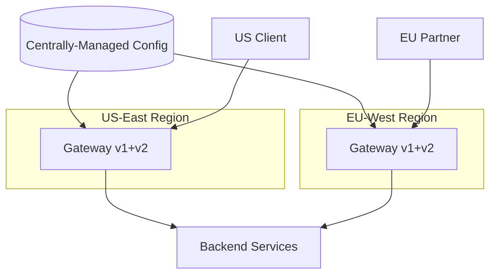
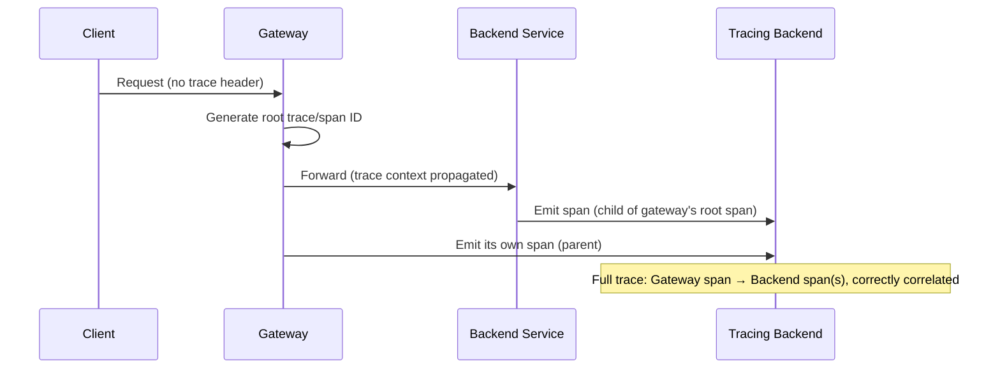
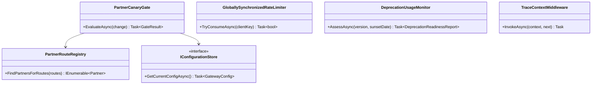

# Module 128 — API Gateway: Capstone — Production-Scale Gateway Consolidation, Multi-Region Deployment & API Version Lifecycle

> Domain: API Gateway | Level: Beginner → Expert | Prerequisite: [[01-APIGatewayFundamentals-Routing-RateLimiting-AuthEnforcement-Transformation]] (takes as given: routing, tiered rate limiting, defense-in-depth auth, and the single-point-of-failure HA discipline — this capstone adds multi-region deployment, canary-staged configuration rollout, API version lifecycle management, and distributed-trace propagation through the gateway hop)
>
> **Domain-complete note:** second and final module of `38-API-Gateway` (Modules 127–128). Full 16-section template; Elite FinTech Interview Panel lens.

---

## The Running Case Study

Every external-facing channel into the Order Execution Engine and Settlement Engine — retail REST clients, institutional algo-trading partners, and a growing set of correspondent-bank integrations — now runs through **one production-scale, multi-region gateway deployment**, serving both `v1` (legacy, still-supported) and `v2` (current) API versions simultaneously, with distributed tracing spanning the gateway hop into every backend service this course has built across prior modules.

---

## 1. Fundamentals

**What:** Operating Module 127's gateway toolkit at genuine, multi-year, multi-region production scale — coordinating configuration changes safely across regions, managing multiple concurrently-supported API versions with an explicit deprecation lifecycle, and ensuring the gateway hop never breaks the distributed-tracing continuity this course established as essential (Module 93).

**Why:** A gateway correctly designed per Module 127's principles still faces genuinely new problems once it must serve multiple regions, multiple API versions, and integrate observably with the full backend estate this course has built — problems invisible at a single-region, single-version scale.

**When:** Once the gateway serves genuinely global traffic (requiring multi-region deployment for latency/resilience) and has accumulated more than one concurrently-supported API version (an inevitability for any long-lived, external-facing API with real client integrations that can't be forced to upgrade instantly).

**How (30,000-ft view):**
```
Region: US-East          Region: EU-West
  Gateway (v1 + v2)         Gateway (v1 + v2)
        ↓                         ↓
  Backend Services (unchanged, per-service internal/external contract separation)

Trace correlation ID propagated: Client → Gateway → every backend hop → Observability platform
```

---

## 2. Deep Dive

### 2.1 Multi-Region Deployment and Geo-Routing
Each region runs its own, independently-scaled gateway instance set, with clients routed to their geographically-nearest region (DNS-based geo-routing or a global load balancer) — critically, gateway *configuration* (routing rules, rate-limit tiers) must be deployed consistently across every region, treated as one, centrally-managed configuration artifact (Module 127 §9's IaC discipline) replicated to each region, never independently, divergently maintained per region.

### 2.2 Canary-Staged Configuration Rollout Across Regions
Directly Module 126 Advanced Q5's already-established canary-staging discipline, reapplied here at the gateway-configuration and multi-region level: a routing-rule or rate-limit-policy change deploys first to one region (or a small percentage of one region's traffic), with automated verification confirming no regression before propagating to remaining regions — never a simultaneous, all-region deployment for any change touching genuinely risky logic (routing rules, auth configuration).

### 2.3 API Version Lifecycle — Deprecation as an Explicit, Tracked Process
`v1` and `v2` coexist at the gateway, routed to whatever backend logic serves each (Module 127 §2.6) — but coexistence without an explicit deprecation timeline recreates Module 107 Advanced Q7's "old systems never die" risk at the API-version layer specifically: a formal deprecation policy (announced sunset date, usage monitoring per client to confirm migration progress, a final, tracked cutover) is required, not an indefinite, un-forced dual-version existence.

### 2.4 Distributed Trace Propagation Through the Gateway Hop
Directly Module 93's already-established context-propagation discipline: the gateway must correctly extract, or generate, a trace-correlation ID and propagate it into every backend call it makes — a gap here reproduces Module 93's own original incident (a single Kafka hop silently fragmenting traces) at the gateway layer specifically, the most externally-visible hop in the entire system.

### 2.5 Partner-Integration-Specific Governance
Correspondent-bank/partner integrations warrant their own governance layer beyond ordinary client management — contract testing (Module 117's discipline) verifying the gateway's own request/response transformation for that specific partner remains correct across any gateway change, and an explicit SLA (latency, availability) distinct from the general-purpose client tiers Module 127 §Intermediate Q2 established.

### 2.6 Gateway Plugin/Extension Architecture
A well-designed gateway exposes a plugin/extension point (directly Module 126 Intermediate Q6's genuine-commonality-triage principle, reapplied here) for route-specific custom logic (a partner-specific header transformation) without requiring every such need to be built into the gateway's own shared core — keeping the core clean while still accommodating genuine, demonstrated per-route variation.

---

## 3. Visual Architecture





---

## 4. Production Example

**Problem:** A canary-staged routing-rule change (Module 126 Advanced Q5's discipline, correctly applied per Module 127's own recommendation) was deployed to the US-East region first, as intended — but the change, a corrected path-matching pattern for a newly-versioned partner endpoint, was verified only against the *general* client population's own traffic pattern, not specifically against the one correspondent-bank partner whose traffic actually used that exact route.

**Architecture:** Canary rollout by *region and traffic percentage*, without an explicit, additional canary dimension for *specific, known partner integrations* whose own traffic might not be proportionally represented in a percentage-based sample.

**Implementation:** The corrected path pattern, verified as "no regression" against the canary's own aggregate traffic sample, in fact silently broke the one specific correspondent-bank partner's own, particular request-path format — a low-traffic-volume, high-business-criticality partner whose requests were a tiny fraction of overall US-East traffic, easily lost within the canary's own aggregate, percentage-based verification.

**Trade-offs:** Percentage-based canary sampling is simple and generally effective for typical, high-volume client traffic, but specifically risks under-representing a low-volume-but-critical partner's own traffic pattern within the sample.

**Lessons learned:** This is a variant of Module 120 Advanced Q8's already-established averaged-metric-hides-a-specific-consumer risk, now recurring at the canary-verification layer specifically: a percentage-based canary sample's aggregate "no regression" signal can mask a genuine regression affecting one, specific, low-volume-but-critical partner. The fix: any gateway-configuration change touching a route known to serve a specific, governed partner integration (§2.5) must include that partner's own traffic pattern as an explicit, additionally-verified canary check — not merely relying on its proportional representation within a general, percentage-based sample — directly extending this course's now fully-established "verify the specific, not just the aggregate" discipline to gateway canary-rollout design.

---

## 5. Best Practices
- Deploy gateway configuration as one, centrally-managed artifact replicated consistently across every region — never independently, divergently maintained per region (§2.1).
- Canary-stage any risky gateway-configuration change by region and traffic percentage, AND explicitly verify any specific, governed partner integration's own traffic separately, not merely trusting its proportional representation within an aggregate sample (§4).
- Treat API-version deprecation as an explicit, tracked, deadline-driven process from the moment a new version launches — never an indefinite, unforced dual-version state (§2.3).
- Propagate distributed-trace context correctly through the gateway hop from day one, treating it with the same rigor as any other backend service's own tracing instrumentation (§2.4).
- Provide a genuine plugin/extension point for demonstrated, route-specific customization needs, keeping the shared gateway core clean (§2.6).

## 6. Anti-patterns
- Independently, divergently-configured gateway instances per region, drifting from a single, centrally-managed configuration source (§2.1).
- Canary verification relying solely on aggregate, percentage-based traffic sampling, missing a specific, low-volume-but-critical partner's own regression (§4's incident).
- An indefinite, un-forced dual-API-version existence with no tracked deprecation deadline, recreating Module 107's "old systems never die" risk at the API layer.
- A gateway hop that fails to propagate distributed-trace context, silently fragmenting every trace crossing it (§2.4).
- Building every route-specific customization directly into the gateway's shared core, gradually eroding its clean, shared-abstraction boundary (§2.6).

---

## 7. Performance Engineering

**CPU/Memory:** Multi-region deployment doesn't change the per-instance performance profile established in Module 127 §7 — each region's own gateway tier is capacity-planned independently against that region's own traffic.

**Latency:** Geo-routing specifically reduces client-perceived latency by directing traffic to the nearest region — measure and confirm this benefit is actually realized, not merely assumed from the geo-routing configuration's own existence.

**Throughput:** Each region's gateway tier must independently sustain its own regional peak load; cross-region failover capacity (a region absorbing another's traffic during a regional outage) must be explicitly capacity-planned, not assumed available by default.

**Scalability:** Horizontal scaling within each region, unchanged from Module 127 §9, now replicated consistently across every region via the centrally-managed configuration (§2.1).

**Benchmarking:** Load-test cross-region failover specifically — confirming a healthy region can actually absorb a failed region's traffic within acceptable latency/error-rate bounds, directly extending Module 127 Advanced Q4's fault-injection discipline to the multi-region scale.

**Caching:** Region-local response caching (Module 127 §7) with cache invalidation correctly coordinated across regions for any data requiring cross-region consistency.

---

## 8. Security

**Threats:** Configuration drift between regions creating an inconsistent security posture (one region enforcing a stricter policy than another); a partner-specific plugin/extension introducing a vulnerability isolated to that one route but potentially affecting the shared gateway process.

**Mitigations:** Single-source, centrally-replicated configuration (§2.1) as the primary defense against cross-region drift; sandboxed, resource-bounded plugin execution (§2.6) preventing a single partner-specific extension's bug or vulnerability from affecting the gateway's own core process stability.

**OWASP mapping:** Security Misconfiguration risk specifically elevated by multi-region deployment if configuration isn't genuinely, verifiably consistent across every region.

**AuthN/AuthZ:** Partner-specific API keys/certificates (§2.5) managed with the same rigor as any other credential (Module 86), with partner-specific contract tests (§2.5) verifying authorization behavior remains correct across gateway changes.

**Secrets:** Region-specific secrets (e.g., region-local TLS certificates) managed independently per region while still following one, centrally-governed rotation policy.

**Encryption:** Consistent encryption standards across every region, verified as part of the same configuration-consistency check preventing security-posture drift.

---

## 9. Scalability

**Horizontal scaling:** Per-region horizontal scaling, unchanged from Module 127 §9, replicated consistently via centrally-managed configuration.

**Vertical scaling:** Not a primary lever beyond Module 127's own established guidance.

**Caching:** Region-local caching with cross-region invalidation coordination where genuinely needed.

**Replication/Partitioning:** Configuration itself replicated consistently across regions (§2.1); traffic partitioned by client geography via geo-routing.

**Load balancing:** Global load balancing/geo-routing directing clients to their nearest healthy region, with cross-region failover for regional outages.

**High Availability:** Multi-region deployment itself is this capstone's own HA enhancement over Module 127's single-region treatment — a full regional outage no longer means total system unavailability, provided cross-region failover capacity is genuinely, verifiably adequate (§7's benchmarking requirement).

**Disaster Recovery:** A full-region DR failover plan, tested (not merely designed) per §7's fault-injection discipline, extending Module 127 §9's single-region DR guidance to genuine, multi-region resilience.

**CAP theorem:** Cross-region rate-limit-store consistency is a genuine, new consideration — a client's rate-limit state may need to be either region-local (simpler, but allowing a client to effectively double their limit by hitting two regions) or globally-synchronized (stronger consistency, at the cost of cross-region synchronization latency/complexity) — an explicit, deliberate choice rather than an unexamined default.

---

## 10. Interview Questions

### Basic (10)

1. **Q: Why must gateway configuration be centrally managed and replicated across regions, rather than independently maintained per region?**
   **A:** Independent, per-region configuration risks drift, creating an inconsistent security/routing posture across regions (§2.1, §8).
   **Why correct:** States the specific risk (drift, inconsistent posture) centralized configuration prevents.
   **Common mistakes:** Assuming per-region configuration flexibility is harmless, missing the drift risk it introduces.
   **Follow-ups:** "What course-established discipline does this directly reuse?" (Module 127 §9's Infrastructure-as-Code discipline, now applied across regions, §2.1.)

2. **Q: What specifically went wrong in §4's canary-rollout incident?**
   **A:** A percentage-based canary sample verified "no regression" in aggregate, but a specific, low-volume-but-critical partner's own traffic pattern was under-represented in that sample and broke.
   **Why correct:** States the precise mechanism from this module's own case study.
   **Common mistakes:** Assuming the canary process itself was flawed in general, rather than recognizing its specific, aggregate-sampling blind spot for low-volume partners.
   **Follow-ups:** "What course-established pattern does this directly recall?" (Module 120 Advanced Q8's averaged-metric-hides-a-specific-consumer risk, recurring at the canary-verification layer, §4.)

3. **Q: Why does API version coexistence (v1 and v2) require an explicit deprecation policy rather than indefinite dual support?**
   **A:** Without a tracked deadline, dual-version support risks becoming permanent, recreating Module 107's "old systems never die" structural risk at the API-version layer (§2.3).
   **Why correct:** Correctly reapplies an already-established, named risk to this specific new context.
   **Common mistakes:** Assuming supporting both versions indefinitely is a harmless, client-friendly default with no structural cost.
   **Follow-ups:** "What specific governance elements does a deprecation policy need?" (An announced sunset date, per-client usage monitoring confirming migration progress, and a final, tracked cutover, §2.3.)

4. **Q: What incident category does a gateway failing to propagate distributed-trace context recreate?**
   **A:** Module 93's original trace-fragmentation incident (a Kafka hop silently breaking trace continuity), now recurring at the gateway hop specifically (§2.4).
   **Why correct:** Correctly identifies this as a direct recurrence of an already-established incident category.
   **Common mistakes:** Treating gateway trace-propagation as a new, unrelated concern rather than recognizing its direct kinship to Module 93's own established finding.
   **Follow-ups:** "Why is this specific hop particularly important to get right?" (The gateway is the most externally-visible hop in the entire request path, making a trace gap here especially costly for incident diagnosis, §2.4.)

5. **Q: What is a gateway plugin/extension point, and what problem does it solve?**
   **A:** A well-defined mechanism for route-specific custom logic (e.g., a partner-specific transformation) without requiring every such need to be built into the gateway's own shared core, keeping the core clean (§2.6).
   **Why correct:** States the specific mechanism and the core-erosion problem it prevents.
   **Common mistakes:** Assuming every customization need should be added directly to the shared gateway core "for simplicity."
   **Follow-ups:** "What course-established principle does this directly reapply?" (Module 126 Intermediate Q6's genuine-commonality-triage test, §2.6.)

6. **Q: Why does cross-region rate-limit-store consistency require an explicit, deliberate choice rather than a default assumption?**
   **A:** Region-local state is simpler but lets a client effectively double their limit across two regions; globally-synchronized state is stronger but adds cross-region latency/complexity — neither is a universally correct default (§9).
   **Why correct:** States both options and their genuine trade-off precisely.
   **Common mistakes:** Assuming region-local rate-limit state automatically, correctly enforces the intended global limit without considering the cross-region-bypass risk.
   **Follow-ups:** "Which choice would you recommend for a regulated trading system's own rate limits specifically?" (Likely globally-synchronized, given the elevated stakes of a client bypassing intended limits via cross-region traffic splitting — though a genuine, context-specific judgment call.)

7. **Q: Why do partner integrations warrant their own contract-testing discipline beyond ordinary client-tier rate-limit configuration?**
   **A:** A partner's specific request/response transformation logic (Module 127 §2.4) needs its own, dedicated verification that remains correct across any gateway change — ordinary rate-limit tiering alone doesn't verify this (§2.5).
   **Why correct:** Correctly distinguishes rate-limit-tier configuration from request/response-transformation-correctness verification as two genuinely separate concerns.
   **Common mistakes:** Assuming a partner's own rate-limit tier configuration is sufficient governance without also verifying its specific transformation logic remains correct.
   **Follow-ups:** "What course-established technique does this directly reuse?" (Module 117's Port-contract-testing discipline, now applied to partner-specific gateway transformation logic, §2.5.)

8. **Q: Should a canary-staged gateway-configuration change ever skip explicit verification for a known, governed partner integration, relying only on aggregate traffic sampling?**
   **A:** No — per §4's incident, aggregate sampling can miss a low-volume-but-critical partner's own regression entirely; known partner integrations require explicit, additional canary verification.
   **Why correct:** States the specific, demonstrated risk of relying on aggregate sampling alone for governed partners.
   **Common mistakes:** Assuming a sufficiently large or representative canary percentage automatically captures every important traffic pattern, including low-volume ones.
   **Follow-ups:** "What's the specific fix this module established?" (Explicit, additional canary verification for any route serving a specific, governed partner integration, not merely reliance on proportional representation, §4.)

9. **Q: Why does multi-region deployment specifically improve this system's HA posture beyond what Module 127's single-region treatment provided?**
   **A:** A full regional outage no longer means total system unavailability, provided cross-region failover capacity is genuinely adequate (§9).
   **Why correct:** States the specific, additional resilience benefit multi-region deployment provides.
   **Common mistakes:** Assuming multi-region deployment automatically provides this benefit without also verifying (via load testing, §7) that failover capacity is actually sufficient.
   **Follow-ups:** "What would undermine this benefit even with multi-region deployment in place?" (Insufficient cross-region failover capacity, discovered only when an actual regional outage occurs, absent the fault-injection load testing §7 establishes as necessary.)

10. **Q: Why should the gateway generate a root trace-correlation ID for a request that arrives with none, rather than simply forwarding the request without one?**
    **A:** Without a generated root ID, every downstream backend span would lack a shared correlation ID entirely, making the request's full path across services impossible to reconstruct in the observability platform (§2.4).
    **Why correct:** States the specific consequence (impossible-to-reconstruct request path) of failing to generate a root ID when none is provided.
    **Common mistakes:** Assuming trace propagation only matters when a client already provides a trace header, missing that the gateway itself must originate one when absent.
    **Follow-ups:** "Which course-established module's discipline does this directly extend?" (Module 93's distributed-tracing/context-propagation discipline, §2.4.)

### Intermediate (10)

1. **Q: Walk through why §4's incident specifically evaded the canary-rollout process despite that process being correctly implemented per Module 126's own established discipline.**
   **A:** The canary process correctly verified "no regression" against the *general* traffic population sampled at the configured percentage — but the specific partner's own traffic volume was small enough that it was statistically unlikely to be meaningfully represented within that percentage sample, meaning the canary's "no regression" signal was genuinely, technically accurate for the traffic it actually observed, while remaining silent about a real regression in traffic it simply never sampled.
   **Why correct:** Precisely explains that the canary process wasn't flawed in its own execution, but had a structural sampling blind spot for low-volume traffic.
   **Common mistakes:** Assuming the canary process itself must have been misconfigured or skipped, rather than recognizing a well-executed, percentage-based process can still structurally miss low-volume-but-critical traffic.
   **Follow-ups:** "Why is this specifically a variant of Module 120 Advanced Q8's finding, not merely a similar-sounding but distinct issue?" (Both involve an aggregate, averaged/sampled signal providing false confidence by obscuring a specific, low-representation consumer's own distinct experience — the identical underlying structural risk, recurring in a new verification context.)

2. **Q: Design the specific mechanism ensuring every known, governed partner integration is automatically included as an explicit canary check for any gateway-configuration change touching its own specific route.**
   **A:** Maintain a registry mapping each governed partner integration to its own specific route(s) and contract test (§2.5); any configuration-change deployment pipeline touching a registered route automatically triggers that partner's own specific contract test as a canary-stage gate, in addition to (not instead of) the general, percentage-based traffic-sample verification — converting "remember to check partner-specific routes" from a manual, easily-forgotten step into a mechanically-enforced, registry-driven gate.
   **Why correct:** Gives a concrete, mechanically-enforced mechanism (a registry-driven, automatic gate) rather than relying on an engineer's own manual diligence to remember which routes serve governed partners.
   **Common mistakes:** Relying on documentation or team knowledge to remember which routes require partner-specific verification, missing that this is exactly the class of easily-forgotten, manual-diligence-dependent step this course has repeatedly shown benefits from mechanical enforcement instead.
   **Follow-ups:** "What would happen if a new partner integration were onboarded without being added to this registry?" (Its own specific route would silently lack this additional canary protection, recreating §4's exact risk for that specific, unregistered partner — directly motivating a mandatory registry-update step as part of the partner-onboarding checklist itself, Module 127 §4's own established onboarding-discipline pattern extended here.)

3. **Q: Critique a deprecation policy for API v1 that announces a sunset date but has no mechanism actually monitoring which specific clients are still using v1 as that date approaches.**
   **A:** Without usage monitoring, the organization has no genuine visibility into whether forcing the announced cutover would actually break specific, still-dependent clients — the sunset date itself is a declared intention, not a verified-safe action, exactly this course's central "declared ≠ actual" theme recurring at the API-deprecation layer; per-client v1-usage monitoring is what converts the sunset date from a hopeful announcement into a genuinely informed, safe cutover decision.
   **Why correct:** Directly connects this specific gap to this course's central, recurring theme, precisely identifying what monitoring converts an unverified announcement into a genuinely safe action.
   **Common mistakes:** Assuming announcing a sunset date alone is sufficient governance, without the usage-monitoring mechanism that actually confirms the cutover is safe to execute as planned.
   **Follow-ups:** "What would you do if the sunset date arrived and usage monitoring showed several clients still actively using v1?" (Extend the deadline with explicit, direct outreach to those specific remaining clients, treating the original date as a target informed by monitoring, not an inflexible deadline enforced regardless of actual, demonstrated readiness.)

4. **Q: Why does a partner-specific gateway plugin require sandboxed, resource-bounded execution (§8), beyond the general security benefit of isolation?**
   **A:** A buggy or resource-intensive partner-specific plugin, if not resource-bounded, could consume disproportionate gateway CPU/memory, degrading service for *every* other client and partner routed through the same shared gateway process — directly Module 126 §2.2's noisy-neighbor risk recurring at the plugin-execution layer specifically, requiring the identical isolation discipline already established there.
   **Why correct:** Correctly connects this specific requirement to an already-established, cross-module noisy-neighbor risk pattern, rather than treating it as an isolated, plugin-specific security concern only.
   **Common mistakes:** Considering plugin sandboxing purely a security-isolation measure without recognizing its equally important performance-isolation/noisy-neighbor-prevention role.
   **Follow-ups:** "What specific resource-bounding mechanism would you apply to a partner-specific plugin?" (CPU/memory quotas and execution-timeout limits enforced by the plugin-execution runtime itself, directly analogous to Module 126 §2.2's dedicated-worker-pool isolation, now applied to plugin execution specifically.)

5. **Q: How would you decide the appropriate cross-region rate-limit-store consistency model (§9) for this specific regulated trading system?**
   **A:** Apply the same severity-comparison test Module 127 Advanced Q5 established for the fail-open/fail-closed decision: what's genuinely worse — the operational complexity/latency cost of globally-synchronized rate-limit state, or the risk of a client effectively bypassing their intended limit by splitting traffic across regions? Given this system's regulated, financial-stakes context and its own already-established preference for stricter, CP-favoring choices at genuinely consequential decision points (Module 118 §9), globally-synchronized state is likely the more defensible default here, accepting its added complexity as the justified cost of preventing a genuine, exploitable bypass.
   **Why correct:** Correctly reapplies an already-established decision-test structure to this new, specific trade-off, reaching a context-appropriate (not universal) recommendation.
   **Common mistakes:** Defaulting to region-local state purely for its simplicity, without weighing the genuine bypass risk this specific, regulated system's own stakes make particularly consequential.
   **Follow-ups:** "What would change this recommendation for a different, lower-stakes system?" (A system where clients splitting traffic across regions to gain marginally higher effective throughput carries low, easily-tolerated consequence might reasonably accept region-local state's simplicity instead — again, a context-specific, not universal, decision.)

6. **Q: Design a specific test verifying the gateway correctly generates and propagates a root trace ID for a request arriving with no existing trace context, extending Module 93's own established verification discipline.**
   **A:** A deliberate integration test sending a request with no trace header through the full gateway-to-backend path, then querying the observability platform to confirm a complete, correctly-correlated trace exists spanning both the gateway's own span and every backend span it triggered — directly Module 93's own already-established "verify actual trace continuity, don't just assume instrumentation works" discipline, now applied specifically to the gateway's root-span-generation responsibility.
   **Why correct:** Correctly reapplies an already-established verification technique to this module's own specific new responsibility (root-span generation), rather than assuming correct configuration is sufficient without direct, end-to-end verification.
   **Common mistakes:** Verifying only that the gateway *forwards* an existing trace header correctly, without separately testing the *no-existing-header* case, which requires the gateway to actively originate a new root span rather than merely propagate one.
   **Follow-ups:** "Why is the no-existing-header case specifically important to test separately?" (It exercises a genuinely different code path (generation, not merely propagation) that a test only covering the propagation case would never exercise, potentially leaving a real gap in root-span-generation logic undetected.)

7. **Q: Critique a gateway plugin architecture where any team can deploy a new plugin directly to production with no review process, "to enable fast, autonomous partner onboarding."**
   **A:** Given §8's established plugin-blast-radius risk (a buggy plugin affecting the shared gateway process, §Intermediate Q4) and §2.5's own partner-integration governance requirements, an unreviewed plugin-deployment process directly undermines both — a plugin review process (verifying resource-bounding, Intermediate Q4, and contract-test coverage, §2.5) is a necessary governance gate, not an unnecessary bureaucratic obstacle, precisely because plugin code, unlike an ordinary backend service's own isolated deployment, runs within the maximally-critical, shared gateway process itself.
   **Why correct:** Correctly weighs the review process's genuine necessity against the "fast autonomy" argument, given the plugin's own elevated, shared-process blast radius.
   **Common mistakes:** Accepting the fast-autonomy argument at face value without weighing it against the genuinely elevated risk a shared-process plugin architecture (§8) specifically introduces.
   **Follow-ups:** "How would you design a review process that's rigorous but not unreasonably slow for genuine, routine partner-onboarding needs?" (A lightweight, templated review specifically for plugins following an established, pre-vetted pattern — with a fuller, more rigorous review reserved for genuinely novel plugin logic outside any pre-vetted template, directly Module 127 §Intermediate Q7's own calibration principle reapplied here.)

8. **Q: Why should the multi-region failover capacity be load-tested (§7) rather than calculated purely from each region's own individual capacity headroom on paper?**
   **A:** A paper calculation could miss real-world factors a genuine load test surfaces — actual failover-triggering/DNS-propagation latency, the healthy region's own genuine ability to absorb a sudden traffic surge without its own latency/error-rate degrading beyond acceptable bounds, and any unexpected capacity constraint (a shared downstream dependency, a database connection-pool limit) invisible to a simple, on-paper capacity-headroom calculation.
   **Why correct:** Identifies specific, concrete factors a load test surfaces that a paper calculation alone would miss.
   **Common mistakes:** Trusting a calculated, on-paper capacity margin as sufficient assurance without direct, empirical verification via an actual, realistic failover load test.
   **Follow-ups:** "What specific metric would this load test need to produce as its key acceptance criterion?" (Observed error rate and latency during the simulated failover, compared against this system's own defined SLA — directly Module 127 Advanced Q4's own established acceptance-criterion pattern, reapplied here at multi-region scale.)

9. **Q: How would you decide whether a specific, recurring partner request (e.g., a custom header-transformation need) should be added as a shared, general-purpose gateway feature versus remaining a partner-specific plugin?**
   **A:** Apply Module 126 Intermediate Q6's genuine-commonality test directly: has this same or a similar transformation need been requested by other, genuinely independent partners, suggesting a real, recurring pattern worth generalizing into the shared core? Or is it a genuinely idiosyncratic, one-off need specific to this single partner's own particular integration requirements, better kept isolated as its own plugin, preserving the shared core's own clean boundary?
   **Why correct:** Directly reapplies an already-established, cross-domain commonality-triage principle to this module's own specific plugin-versus-core decision.
   **Common mistakes:** Adding every individual partner request directly to the shared gateway core "to be accommodating," gradually eroding the core's own clean boundary exactly as §2.6/Basic Q5 warns against.
   **Follow-ups:** "What would be a concrete symptom that this triage discipline has eroded over time?" (A shared gateway core containing an accumulation of narrowly-scoped, single-partner-specific logic that should have remained isolated plugins, making the core itself harder to reason about, test, and safely modify for its actually-general-purpose responsibilities.)

10. **Q: Synthesize how this capstone's API-version-deprecation discipline (§2.3) relates to every prior module's own "old systems never die" finding.**
    **A:** This is the identical structural risk (Module 107 Advanced Q7's original naming of the pattern) recurring in its API-version-specific form — just as an un-decommissioned legacy database or an un-retired traditional persistence store (Module 107, Module 122) tends to linger indefinitely absent an explicit, tracked deadline and forcing function, an un-deprecated API version will do the same unless this module's own explicit sunset-date-plus-usage-monitoring discipline (Intermediate Q3) is actively, continuously enforced — confirming this course's now-repeated finding that this specific organizational-incentive risk recurs identically across every kind of "old thing that's easier to leave running than to actively decommission," regardless of the specific technical layer it appears at.
    **Why correct:** Correctly identifies this as a direct, structural recurrence of an already-established, named risk pattern, rather than a novel, API-version-specific insight.
    **Common mistakes:** Treating API-version deprecation as a uniquely API-specific governance challenge, missing its direct kinship to the identical structural pattern this course has already established recurs across multiple, unrelated technical layers.
    **Follow-ups:** "What single, transferable lesson does this repeated recurrence teach about evaluating any future, currently-uncovered 'old thing that needs decommissioning' scenario?" (The same structural fix applies by default: an explicit, tracked deadline, active usage monitoring providing genuine, verified confidence the cutover is safe, and treating decommissioning as its own, budgeted, first-class deliverable — never an assumed, eventually-self-resolving background task.)

### Advanced (10)

1. **Q: Diagnose §4's incident from first principles and design the complete, structural fix preventing any future canary-rollout process from missing a low-volume-but-critical partner's own regression.**
   **A:** Root cause: percentage-based canary sampling structurally under-represents low-volume traffic, providing a technically-accurate but practically-incomplete "no regression" signal (Intermediate Q1). Fix: (1) a registry-driven, automatically-triggered contract test for any registered partner integration whose route is touched by a configuration change (Intermediate Q2), run as an explicit, additional canary gate alongside percentage-based sampling, never relying on the latter alone for governed routes; (2) mandatory registry-update as part of every partner-onboarding checklist, ensuring no future partner integration is silently un-registered and therefore un-protected; (3) a periodic audit confirming every currently-active, governed partner integration remains correctly represented in this registry, catching any drift (a partner's route changing without the registry being updated accordingly).
   **Why correct:** Identifies the actual structural root cause (aggregate sampling's inherent low-volume blind spot) and a three-part fix (registry-driven explicit gate, mandatory onboarding update, periodic registry audit) rather than a one-off patch specific to this single incident's affected partner.
   **Common mistakes:** Fixing only this specific partner's specific route without institutionalizing the registry-driven mechanism that prevents the identical gap recurring for any other current or future low-volume partner.
   **Follow-ups:** "Why is the periodic registry audit specifically necessary, beyond the onboarding-checklist requirement alone?" (Directly this course's now fully-established "verify the verifier" theme — a registry that's correct at onboarding time can still silently drift out of date as routes change over a partner's own multi-year relationship with the organization, requiring ongoing, not merely one-time, verification.)

2. **Q: A team proposes eliminating percentage-based canary sampling entirely, relying solely on the registry-driven, partner-specific contract tests (Advanced Q1's fix) for all gateway-configuration verification. Evaluate this proposal.**
   **A:** This overcorrects — percentage-based sampling remains genuinely valuable for catching regressions affecting the *general*, non-partner-specific client population, a category of risk the registry-driven, partner-specific tests don't cover at all (since they're scoped only to registered partner routes); the correct architecture is both mechanisms operating together, each covering a genuinely distinct risk category (general-population regression via sampling, specific-partner regression via registry-driven contract tests), not replacing one with the other.
   **Why correct:** Identifies the specific risk category (general-population regressions) the proposed elimination would leave uncovered, correctly recommending both mechanisms as complementary rather than either alone as sufficient.
   **Common mistakes:** Assuming the specific gap Advanced Q1's fix addresses (low-volume partner blind spot) means percentage-based sampling itself is fundamentally flawed and should be abandoned, rather than recognizing it remains the correct tool for a different, still-genuine risk category.
   **Follow-ups:** "Could a sufficiently large canary percentage eventually make partner-specific registry tests unnecessary?" (No, not reliably — even a very large percentage doesn't guarantee representative coverage of every specific, low-volume partner's own particular request pattern, especially for a partner whose absolute traffic volume is small regardless of what percentage of overall traffic the canary samples.)

3. **Q: Critique a multi-region rate-limit-store consistency design (Intermediate Q5's globally-synchronized choice) that synchronizes state via periodic, batched replication rather than genuine, real-time consistency.**
   **A:** Periodic, batched replication reintroduces a bounded but real window during which a client could exploit cross-region traffic-splitting to exceed their intended limit — between replication cycles, each region's own view of that client's consumed tokens could be stale, allowing consumption beyond the intended global limit during that window; if globally-synchronized consistency was chosen specifically to prevent this bypass risk (Intermediate Q5's own reasoning), the synchronization mechanism itself must actually provide genuine, low-latency consistency, not merely eventual, batched consistency that only partially closes the originally-targeted risk.
   **Why correct:** Identifies the specific way batched, eventual replication would only partially satisfy the original design goal (preventing cross-region bypass), undermining the very reason globally-synchronized state was chosen in the first place.
   **Common mistakes:** Assuming any form of "synchronization" between regions satisfies the globally-synchronized-consistency goal, without recognizing that the specific replication mechanism's own latency characteristics determine how much of the originally-targeted bypass risk actually remains open.
   **Follow-ups:** "What technology/mechanism would provide genuinely low-latency, cross-region rate-limit consistency?" (A globally-distributed, low-latency data store specifically designed for this consistency profile (e.g., a global Redis-compatible service with cross-region replication designed for sub-second consistency), rather than a general-purpose, batch-oriented replication mechanism not designed for this specific latency requirement.)

4. **Q: Design a load-testing methodology specifically validating that the plugin-sandboxing mechanism (Intermediate Q4/§8) genuinely, correctly bounds a misbehaving plugin's resource consumption under realistic load, rather than merely being configured with resource limits in principle.**
   **A:** Deliberately deploy a synthetic, intentionally-resource-abusive plugin (one that attempts to consume excessive CPU/memory or hang indefinitely) into a test environment under realistic concurrent gateway load, verifying the sandboxing mechanism actually, measurably enforces its configured limits — terminating or throttling the abusive plugin — without measurably degrading other, unrelated routes' own latency or throughput, directly extending Module 126 Advanced Q4's own parallel-branch-concurrency-testing technique to this capstone's own specific plugin-isolation claim.
   **Why correct:** Correctly designs a deliberate, adversarial test specifically targeting the sandboxing mechanism's actual, verified enforcement (not merely its configured intent), reapplying an already-established fault-injection testing technique.
   **Common mistakes:** Assuming a plugin-sandboxing mechanism's own configuration (resource limits specified in a config file) is equivalent to verified, actual enforcement under genuine, adversarial load conditions.
   **Follow-ups:** "What specific failure would this test most likely reveal if the sandboxing mechanism had a subtle implementation gap?" (A shared underlying resource — e.g., a database connection pool the plugin sandbox doesn't itself isolate — being exhausted by the abusive plugin despite CPU/memory limits being correctly enforced, exactly the kind of partial-isolation gap only a genuine, adversarial test would reveal.)

5. **Q: How would you decide, for this system's specific API-version deprecation policy, the appropriate sunset-date lead time between announcement and actual cutover?**
   **A:** Calibrate to the realistic time genuinely different client types (Module 127 §Intermediate Q2's own tiering) need to migrate their own integrations — an internal service might migrate within days; an institutional partner's own change-management process might genuinely require months of lead time; a uniform, one-size-fits-all lead time risks either unnecessarily delaying internal migration or unrealistically rushing partner migration — directly Module 126 Intermediate Q5's own per-consumer-calibration principle, reapplied here to deprecation lead-time specifically.
   **Why correct:** Correctly reapplies an already-established per-consumer calibration principle to this module's own specific new decision (deprecation lead time), rather than proposing a single, universal default.
   **Common mistakes:** Applying a single, uniform deprecation lead time across every client type regardless of their own genuinely different migration-readiness timelines.
   **Follow-ups:** "How would per-client usage monitoring (Intermediate Q3) inform this lead-time decision specifically?" (By revealing, empirically, which specific client types have historically taken longer to migrate off deprecated versions in the past, informing a more realistic, evidence-based lead time for future deprecations rather than an arbitrary, un-informed guess.)

6. **Q: A regulator asks how this system ensures a partner-facing API change never silently breaks that partner's own integration without detection. How would you answer, citing this capstone's specific mechanisms?**
   **A:** Cite the layered, concrete evidence directly: the registry-driven, mandatory contract test specifically verifying that partner's own request/response transformation logic on every gateway-configuration change touching their route (Advanced Q1), run as an explicit canary gate independent of and in addition to general, aggregate traffic sampling (Advanced Q2); the periodic registry audit confirming this protection remains correctly, currently scoped to that partner's actual, current routes (Advanced Q1); and the distributed-trace continuity (§2.4) providing complete, correlated diagnostic visibility if any issue were to occur despite these preventive measures.
   **Why correct:** Synthesizes every specific mechanism this capstone established into one coherent, evidence-based answer, directly addressing the regulator's specific concern with concrete, verifiable detail.
   **Common mistakes:** Answering only "we test partner integrations" without the specific, mechanically-enforced detail (registry-driven gates, periodic audits) that makes this claim genuinely, continuously true rather than a general, unverified assertion.
   **Follow-ups:** "What would this answer have looked like before §4's incident prompted this specific fix?" (A weaker, purely-aggregate-sampling-based answer, unable to specifically address how a low-volume partner's own regression would be caught — directly illustrating this capstone's own concrete, incident-driven governance improvement.)

7. **Q: Critique treating the multi-region failover load test (Advanced Q4-adjacent, §7) as a one-time validation performed only when the multi-region architecture was first deployed.**
   **A:** Directly this course's now fully-established ongoing-vigilance theme — as traffic volume, client mix, and backend service capacity all continue evolving over the system's life, a failover-capacity margin validated as adequate at initial multi-region deployment may no longer hold true years later; this test must be a standing, periodically-repeated part of the system's own operational discipline (directly Module 127 Advanced Q4's own established "continuous, not one-time" verification requirement), not a single, historical validation trusted indefinitely.
   **Why correct:** Correctly identifies failover-capacity adequacy as an ongoing, not one-time, verification requirement, directly connecting to this course's central, recurring theme.
   **Common mistakes:** Treating a successful, initial failover load test as permanent, sufficient evidence, rather than recognizing it requires periodic re-validation as the system's own traffic and capacity profile inevitably continues to evolve.
   **Follow-ups:** "What specific trigger, beyond a fixed periodic schedule, would prompt an out-of-cycle failover re-validation?" (A significant, sustained increase in overall traffic volume or a meaningful change in backend service capacity/architecture — leading indicators suggesting the original failover-capacity margin may no longer be adequate, warranting proactive re-validation before an actual regional outage tests it for real.)

8. **Q: How would you handle a scenario where a genuinely new, currently-unforeseen category of governed integration (beyond ordinary clients and correspondent-bank partners) needs to be added to this platform's own governance model?**
   **A:** Treat this as a genuine, deliberate architecture-governance decision, not an ad hoc accommodation — apply the same structured process this capstone has established for its own known categories: does this new integration category warrant its own distinct rate-limit tier (Module 127 Intermediate Q2), its own registry entry and contract test (Advanced Q1), and its own specific SLA (§2.5)? — extending this capstone's own established governance framework systematically to the new category, rather than either forcing it awkwardly into an existing category's own configuration or handling it as an unstructured, one-off special case outside the established framework entirely.
   **Why correct:** Correctly identifies the right response (systematic extension of the existing governance framework, not an ad hoc exception) rather than either ill-fitting accommodation or ungoverned special-casing.
   **Common mistakes:** Handling a genuinely new integration category as an unstructured, one-off special case, missing that this capstone's own established governance framework (tiering, registry, SLA) is specifically designed to extend systematically to new categories, not just the ones known at initial design time.
   **Follow-ups:** "What would be a concrete example of a genuinely new integration category this system might need to accommodate in the future?" (A regulatory body's own direct API integration for real-time reporting access — a genuinely distinct category from both ordinary clients and commercial correspondent-bank partners, warranting its own specific tier, registry entry, and SLA calibrated to its own particular governance requirements.)

9. **Q: Design the specific criteria for deciding whether this platform's gateway technology itself (build custom vs. adopt an off-the-shelf solution like Kong or a cloud-native API Gateway service) should be reconsidered as the organization's scale and requirements have grown across this capstone's own arc.**
   **A:** Re-evaluate against the same build-vs-buy calibration Module 125 Advanced Q5 established for CDC-relay tooling, now applied to gateway technology itself: does this organization's own accumulated, demonstrated set of requirements (multi-region deployment, canary-staged configuration, plugin sandboxing, distributed-trace propagation) match capabilities an established, off-the-shelf gateway technology already provides robustly, making continued custom-build maintenance a comparatively higher, less-justified ongoing cost? Or does this system's own specific, demonstrated needs (e.g., the registry-driven partner-canary gate, Advanced Q1) remain genuinely custom enough that an off-the-shelf solution wouldn't adequately, natively support them without its own significant, custom extension work?
   **Why correct:** Correctly reapplies an already-established build-vs-buy calibration principle to this capstone's own specific, now-more-mature gateway-technology decision, rather than treating the original build choice (implicit throughout this domain) as permanently fixed regardless of how requirements have since evolved.
   **Common mistakes:** Assuming the original technology choice, whatever it was, remains correct indefinitely without periodically re-evaluating it against the organization's own, now-more-demonstrated and more-complex accumulated requirements.
   **Follow-ups:** "What specific capability from this capstone would be hardest to replicate on an off-the-shelf platform, potentially favoring continued custom development?" (The registry-driven, partner-specific canary-gate mechanism (Advanced Q1) — a genuinely custom, organization-specific governance mechanism unlikely to be a native, out-of-the-box feature of most general-purpose gateway products, though achievable via most platforms' own extension/plugin mechanisms with additional custom development.)

10. **Q: As a Principal Engineer, synthesize this entire capstone into the complete governance program required for this production-scale, multi-region gateway platform to remain trustworthy over its own multi-year organizational lifetime.**
    **A:** (1) Centrally-managed, single-source configuration replicated consistently across every region, with drift-detection auditing (§2.1/§8). (2) A registry-driven, mandatory canary gate for every governed partner integration, layered atop (never replacing) general percentage-based sampling, with periodic registry-currency audits (Advanced Q1/Q2). (3) An explicit, per-client-type-calibrated API-version deprecation policy with active usage monitoring, never an indefinite dual-version state (Advanced Q5, Intermediate Q3). (4) Verified (not merely configured) plugin sandboxing, confirmed via deliberate, adversarial resource-abuse load testing (Advanced Q4). (5) A deliberately-chosen, and genuinely low-latency (not merely batch-eventual), cross-region rate-limit consistency model appropriate to this system's own regulated stakes (Advanced Q3/Intermediate Q5). (6) Standing, periodically-repeated (not one-time) multi-region failover load testing (Advanced Q7). (7) A systematic, extensible governance framework for onboarding genuinely new integration categories beyond those known at initial design (Advanced Q8). (8) Periodic re-evaluation of the underlying gateway technology's own build-vs-buy calibration as organizational requirements continue to mature (Advanced Q9).
    **Why correct:** Synthesizes every specific finding into a coherent, actionable, multi-year governance program, matching this course's established capstone-synthesis pattern at its fullest, most comprehensive form for this domain.
    **Common mistakes:** Presenting only the technical multi-region/canary/versioning mechanisms without the ongoing-audit, systematic-extension, and technology-re-evaluation elements that make this genuinely trustworthy and organizationally sustainable over a true multi-year lifetime, not merely correctly designed at initial capstone completion.
    **Follow-ups:** "Which single element of this program is most directly attributable to a lesson only this capstone (not Module 127's more general, single-region treatment) could have taught?" (The registry-driven, partner-specific canary gate, Advanced Q1 — a risk category specific to genuine, multi-region-scale canary-rollout verification with a real, demonstrated low-volume-partner blind spot, never encountered in Module 127's simpler, single-region treatment.)

---

## 11. Coding Exercises

### Easy — Trace Context Generation for a Missing Header (§2.4, §10 Intermediate Q6)
**Problem:** Generate a root trace ID when a request arrives with no existing trace context.
**Solution:**
```csharp
public class TraceContextMiddleware
{
    public async Task InvokeAsync(HttpContext context, RequestDelegate next)
    {
        var traceId = context.Request.Headers["traceparent"].FirstOrDefault()
            ?? GenerateNewRootTraceId(); // gateway originates a new trace if none exists

        context.Items["TraceId"] = traceId;
        context.Request.Headers["traceparent"] = traceId; // propagate to backend
        await next(context);
    }
}
```
**Time complexity:** O(1) per request.
**Space complexity:** O(1).
**Optimized solution:** Use the standard W3C Trace Context format (`traceparent` header) rather than a custom scheme, ensuring compatibility with any standard OpenTelemetry-instrumented backend (Module 93's own established standard).

### Medium — Registry-Driven Partner Canary Gate (§10 Advanced Q1)
**Problem:** Automatically trigger a partner-specific contract test when a configuration change touches their registered route.
**Solution:**
```csharp
public class PartnerCanaryGate
{
    public async Task<GateResult> EvaluateAsync(ConfigChange change)
    {
        var affectedPartners = _partnerRouteRegistry.FindPartnersForRoutes(change.AffectedRoutes);

        foreach (var partner in affectedPartners)
        {
            var contractTestResult = await _contractTestRunner.RunAsync(partner.ContractTestSuiteId);
            if (!contractTestResult.Passed)
                return GateResult.Blocked($"Partner {partner.Name}'s contract test failed: {contractTestResult.FailureReason}");
        }
        return GateResult.Allowed();
    }
}
```
**Time complexity:** O(p) for p affected registered partners.
**Space complexity:** O(1) beyond the registry itself.
**Optimized solution:** Integrate this gate directly into the CI/CD deployment pipeline (Module 89/92) as a mandatory, non-bypassable stage for any gateway-configuration change, rather than a standalone tool an engineer must remember to invoke manually.

### Hard — Cross-Region Rate-Limit Synchronization (§9, §10 Advanced Q3)
**Problem:** Enforce a globally-consistent rate limit across two regions with low-latency synchronization.
**Solution:**
```csharp
public class GloballySynchronizedRateLimiter
{
    private readonly IGlobalDistributedStore _globalStore; // low-latency, cross-region-consistent

    public async Task<bool> TryConsumeAsync(string clientKey)
    {
        // Atomic, cross-region-consistent decrement — not a batch-replicated, eventually-consistent counter
        var result = await _globalStore.TryDecrementIfPositiveAsync($"ratelimit:{clientKey}");
        return result.Success;
    }
}
```
**Time complexity:** O(1) per request, plus the global store's own cross-region round-trip latency.
**Space complexity:** O(c) for c distinct client keys.
**Optimized solution:** For clients whose own traffic is genuinely, exclusively single-region, allow an explicit, deliberate opt-out to region-local rate limiting (a lower-latency path) — reserving the higher-latency, globally-synchronized path specifically for clients with genuine, demonstrated multi-region traffic patterns where the cross-region-bypass risk (Advanced Q3) is actually relevant.

### Expert — Deprecation Usage-Monitoring Dashboard Query (§10 Intermediate Q3, Advanced Q5)
**Problem:** Track per-client v1-API usage to inform a safe, evidence-based deprecation cutover decision.
**Solution:**
```csharp
public class DeprecationUsageMonitor
{
    public async Task<DeprecationReadinessReport> AssessAsync(string apiVersion, DateTime sunsetDate)
    {
        var activeUsage = await _telemetryStore.QueryAsync(
            $"SELECT ClientId, COUNT(*) as RequestCount, MAX(Timestamp) as LastSeen " +
            $"FROM GatewayRequests WHERE ApiVersion = @Version AND Timestamp > @Since " +
            $"GROUP BY ClientId",
            new { Version = apiVersion, Since = DateTime.UtcNow.AddDays(-30) });

        var stillActiveClients = activeUsage.Where(c => c.RequestCount > 0).ToList();
        var daysUntilSunset = (sunsetDate - DateTime.UtcNow).TotalDays;

        return new DeprecationReadinessReport(
            stillActiveClients,
            isReadyForCutover: stillActiveClients.Count == 0,
            daysRemaining: daysUntilSunset);
    }
}
```
**Time complexity:** O(c log c) for c distinct clients, driven by the underlying aggregation query.
**Space complexity:** O(c) for the report's per-client breakdown.
**Optimized solution:** Automatically trigger direct, proactive outreach (an alert to the account-management team) for any specific client still showing active usage within a short window (e.g., 14 days) of the sunset date, converting this report from a passive dashboard into an active, escalating governance mechanism.

---

## 12. System Design

**Functional requirements:** Serve every client channel across multiple regions with consistent configuration; support concurrent API versions with an explicit, evidence-based deprecation lifecycle; propagate distributed-trace context correctly through the gateway hop; govern partner-specific integrations with dedicated canary protection.

**Non-functional requirements:** Zero cross-region configuration drift; verified (not assumed) plugin sandboxing and failover capacity; genuinely low-latency cross-region rate-limit consistency where the regulated context demands it; complete, correlated distributed traces spanning the gateway hop.

**Architecture:** Multi-region gateway deployment with centrally-managed, replicated configuration (§2.1); a registry-driven partner-canary gate (§11 Medium exercise) layered atop percentage-based canary sampling; a globally-synchronized rate-limit store where genuinely warranted (§11 Hard exercise); a usage-monitoring-driven API-deprecation process (§11 Expert exercise).

**Components:** Regional gateway instance pools; the centrally-managed configuration store; `PartnerCanaryGate`; `GloballySynchronizedRateLimiter`; `DeprecationUsageMonitor`; trace-context-propagation middleware.

**Database selection:** A globally-distributed, low-latency store for cross-region rate-limit state where warranted (§9); the gateway configuration store itself version-controlled (Module 127 §9's IaC discipline).

**Caching:** Region-local response caching with coordinated, cross-region-aware invalidation where genuinely needed.

**Messaging:** Not a primary concern for gateway mechanics themselves, beyond its own request/response handling and trace-context propagation.

**Scaling:** Per-region horizontal scaling with cross-region failover capacity, load-tested (not merely calculated) for adequacy (§7).

**Failure handling:** Regional failover with tested capacity margins (§9); plugin sandboxing verified via adversarial load testing (Advanced Q4); a deliberate, context-appropriate cross-region rate-limit consistency choice (Advanced Q3).

**Monitoring:** Complete, correlated distributed traces spanning the gateway hop (§2.4); per-client API-version-usage tracking driving evidence-based deprecation decisions (§11 Expert exercise); registry-currency audits confirming partner-canary protection remains correctly scoped (Advanced Q1).

**Trade-offs:** Globally-synchronized rate-limit consistency's added latency/complexity versus region-local state's simplicity but bypass risk (§9); a registry-driven partner-canary gate's added governance overhead versus the demonstrated risk (§4) of relying on aggregate sampling alone.

---

## 13. Low-Level Design

**Requirements:** Configuration remains consistent across regions; partner-specific routes receive explicit canary protection; trace context propagates correctly through the gateway; deprecation decisions are evidence-based, not calendar-driven alone.

**Class diagram:**


**Sequence diagram:** See §3's trace-propagation sequence diagram.

**Design patterns used:** Registry (the partner-route registry, §11 Medium exercise); Gatekeeper/Guard Clause (the canary gate, extending Module 126's own deployment-gate pattern); Middleware/Chain of Responsibility (trace-context propagation, request-processing pipeline); Strategy (region-local vs. globally-synchronized rate-limit consistency as an interchangeable, configurable choice).

**SOLID mapping:** Single Responsibility (the canary gate evaluates gate conditions only; the registry tracks partner-route mappings only); Open/Closed (a new partner registers via the registry without modifying the gate's own core logic); Dependency Inversion (the gate depends on `IConfigurationStore`/registry interfaces, never concrete implementations).

**Extensibility:** A new governed integration category (§10 Advanced Q8) extends the existing registry/tiering/SLA framework via configuration, without modifying the gateway's own core pipeline logic.

**Concurrency/thread safety:** The globally-synchronized rate limiter's own atomic decrement operation (§11 Hard exercise) must genuinely be atomic at the underlying store level, not merely appear so at the application-code level, to correctly prevent cross-region bypass under concurrent, multi-region request load.

---

## 14. Production Debugging

**Incident:** During a critical, active incident investigation (an elevated error rate for a specific institutional partner), the observability platform's trace view showed a confusing, seemingly-broken picture — the gateway's own span appeared, but with no child spans from any backend service, making it impossible to determine which specific backend was actually responsible for the elevated errors.

**Root cause:** A recent gateway-configuration change had updated the trace-context-propagation library to a newer version — the new version, by default, used the updated W3C Trace Context header format (`traceparent`) instead of the older, vendor-specific header format every backend service's own tracing instrumentation had been configured to expect, silently breaking trace-context propagation between the gateway and every backend simultaneously, precisely at the moment this incident investigation most needed complete trace visibility.

**Investigation:** Comparing the gateway's own emitted headers against what backend services' tracing instrumentation was actually configured to read revealed the specific header-format mismatch; correlating this against the recent gateway-library-upgrade deployment confirmed the timing.

**Tools:** Direct HTTP header inspection on gateway-to-backend requests; the observability platform's own trace view showing the specific, broken pattern (gateway span present, zero child spans); deployment-history correlation.

**Fix:** Configured the gateway's trace-context middleware to emit both the new W3C format and the legacy, vendor-specific format during a defined transition window (directly this course's now-repeatedly-applied "dual-format support during a migration window" principle, Module 121/127's own established pattern, reapplied here to trace-header-format migration specifically), while every backend service's own instrumentation was updated, on its own schedule, to the new standard format.

**Prevention:** Added a mandatory, automated end-to-end trace-continuity test (directly Intermediate Q6's own established verification technique) to the gateway's own deployment pipeline, specifically failing any deployment that would break trace-context propagation to any backend service — converting "does upgrading a tracing library break trace continuity" from a manually-discovered, incident-triggering question into a mechanically, continuously verified, pre-deployment gate.

---

## 15. Architecture Decision

**Context:** Choosing between building and maintaining this gateway platform's own custom implementation versus adopting an established, off-the-shelf API Gateway product (e.g., Kong, a cloud-native managed API Gateway service) as this platform's requirements have matured across this capstone's own arc.

**Option A — Continue Custom-Built Platform:**
*Advantages:* Full control over genuinely custom governance mechanisms (the registry-driven partner-canary gate, Advanced Q1) that may not be native, out-of-the-box features of most general-purpose gateway products; no vendor lock-in or licensing cost.
*Disadvantages:* Ongoing maintenance burden for every capability (multi-region config replication, plugin sandboxing, rate-limiting algorithms) that an established product would already provide, tested and hardened, out of the box.
*Cost:* Higher ongoing engineering-maintenance cost; no licensing cost.
*Complexity:* Full, self-owned complexity for every capability.

**Option B — Adopt an Established, Off-the-Shelf API Gateway Product:**
*Advantages:* Robust, battle-tested implementations of the foundational capabilities (routing, rate limiting, plugin architecture, multi-region support) this course has covered, reducing the organization's own maintenance burden for that foundational layer; often includes its own vendor-provided operational tooling and support.
*Disadvantages:* This capstone's own genuinely custom governance mechanisms (the registry-driven partner-canary gate, Advanced Q1) would need to be built as custom extensions atop the product's own extension/plugin architecture — feasible, but still requiring custom development effort, just on top of a different foundation; potential vendor lock-in or licensing cost.
*Cost:* Licensing/subscription cost; lower foundational-capability maintenance burden; still-required custom development for organization-specific governance mechanisms.
*Complexity:* Foundational complexity absorbed by the vendor; organization-specific extensions remain the team's own responsibility.

**Recommendation:** **Option B**, specifically because this capstone's own accumulated requirements (multi-region deployment, plugin sandboxing, canary-staged rollout) are now substantial and largely non-differentiating — capabilities a mature, established gateway product already provides robustly — while this organization's genuinely differentiating, custom governance mechanism (the registry-driven partner-canary gate) remains buildable as a custom extension atop that established foundation, directly consistent with this course's own established build-vs-buy calibration principle (Module 125 Advanced Q5): build custom specifically where genuine, demonstrated organizational differentiation exists; adopt established tooling for the substantial, non-differentiating foundational capability underneath it.

---

## 17. Principal Engineer Perspective

**Business impact:** This capstone's production-scale gateway platform is what allows the organization to serve a genuinely global, diverse client base (retail, institutional, correspondent-bank partners, and future, currently-unforeseen categories) through one, centrally-governed, auditable entry point — directly enabling continued business growth (new partner onboarding, new regions) without each new addition requiring its own, independently-reinvented governance from scratch.

**Engineering trade-offs:** Every incident in this capstone (§4, §14) traces to the same recurring pattern this course has established repeatedly — a correctly-designed, well-intentioned mechanism (percentage-based canary sampling, a routine library upgrade) that had a specific, previously-unexamined blind spot relative to this system's own now-more-complex, production-scale reality; a Principal Engineer's specific, ongoing responsibility is proactively examining every such mechanism against this system's actual, evolving complexity, not only after an incident reveals the gap.

**Technical leadership:** Establishing the registry-driven partner-canary gate (§10 Advanced Q1) and the mandatory trace-continuity deployment gate (§14's fix) as standing, mechanically-enforced practices — not documented best practices relying on individual engineer diligence — is exactly the kind of structural, hard-to-bypass governance intervention a Principal Engineer must institute for risk categories this capstone has now demonstrated recur predictably at this system's own scale.

**Cross-team communication:** The evidence-based, per-client-type-calibrated API-deprecation process (§10 Advanced Q5) requires genuine, ongoing coordination between the platform team (maintaining usage-monitoring visibility) and every client-facing/account-management team (translating that visibility into direct, proactive client outreach) — a Principal Engineer must ensure this cross-functional coordination is an established, working process, not merely a theoretical governance policy nobody actively operationalizes.

**Architecture governance:** This capstone's own full governance program (§10 Advanced Q10) — configuration consistency, partner-canary registry, deprecation policy, plugin sandboxing, rate-limit consistency model — should be codified as a living, periodically-reaffirmed set of architecture decisions (Module 106's ADR discipline), explicitly including this module's own build-vs-buy decision (§15) as itself a recorded, revisitable decision, not a permanent, unexamined assumption.

**Cost optimization:** The build-vs-buy re-evaluation (§15) itself is a direct cost-optimization discipline — a Principal Engineer should periodically revisit this specific decision as the organization's own requirements continue to mature, avoiding both premature vendor lock-in before requirements were genuinely understood and unnecessarily prolonged custom-maintenance cost once an established alternative genuinely, demonstrably fits the organization's now-mature needs.

**Risk analysis:** This capstone's two incidents (§4, §14) both demonstrate that even a mechanism explicitly designed with this course's own established best practices (canary staging, distributed tracing) can still harbor a specific, previously-unexamined blind spot at genuine production scale — a Principal Engineer's risk analysis for any production-scale system must explicitly account for the possibility that even well-designed, seemingly-thorough safety mechanisms may have scale-dependent gaps invisible at smaller scale, requiring the same ongoing, adversarial verification discipline this course has applied throughout.

**Long-term maintainability:** As this platform continues serving a growing, evolving set of regions, API versions, and partner categories over its own multi-year lifetime, a Principal Engineer should track, as explicit organizational metrics, the partner-canary registry's own currency (last-audited date), the number of currently-active, un-deprecated API versions and their own age, and the ratio of custom-built to vendor-provided capability — treating these as standing, periodically-reviewed indicators of whether this maximally-critical platform continues to be governed with the rigor its position in the system, and this course's own entire arc, has repeatedly demonstrated it requires.

---

**Domain complete — `38-API-Gateway` (Modules 127–128):** Routing, rate limiting, defense-in-depth auth enforcement, request/response transformation → this capstone's production-scale, multi-region gateway with canary-staged rollout, API version lifecycle governance, and distributed-trace continuity, closing the domain's full arc. Hands off to `39-Service-Mesh`.
