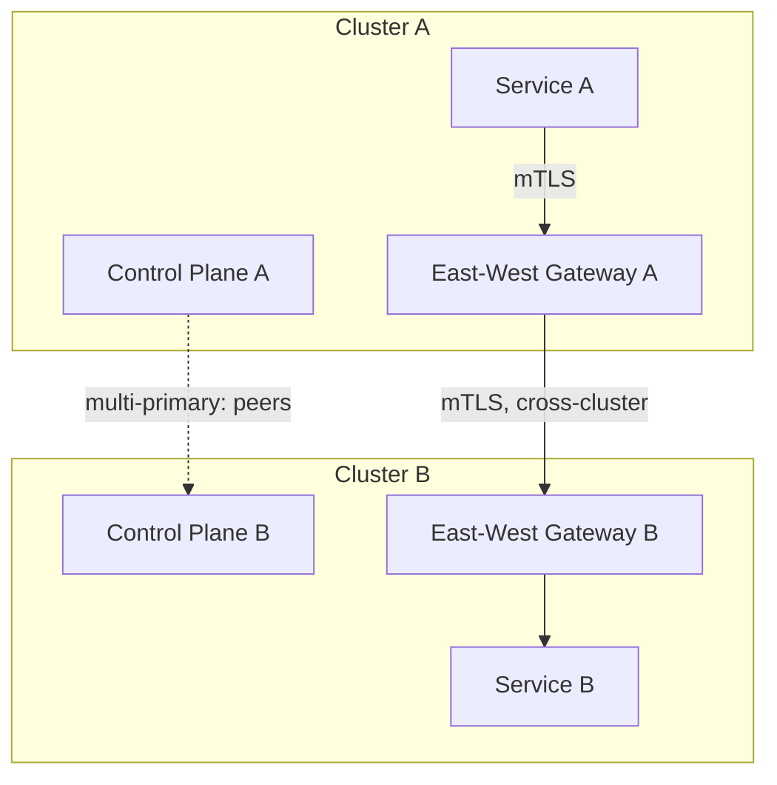
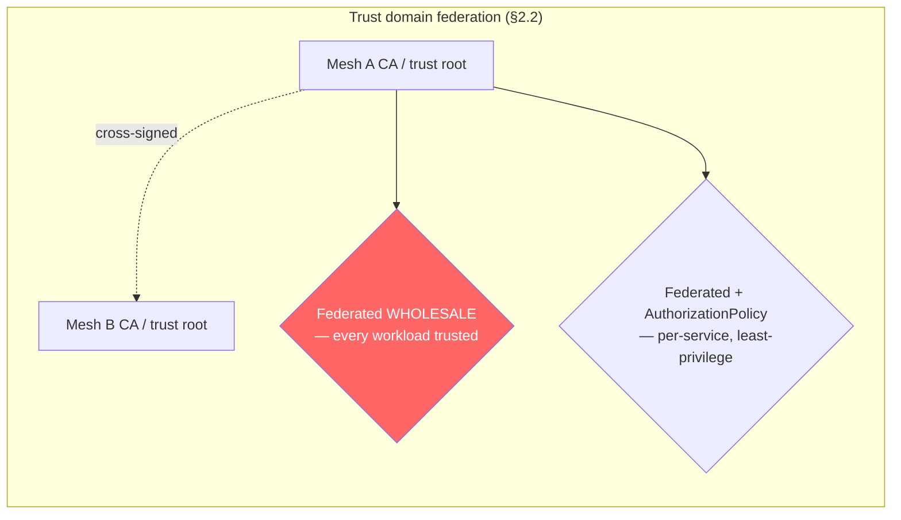
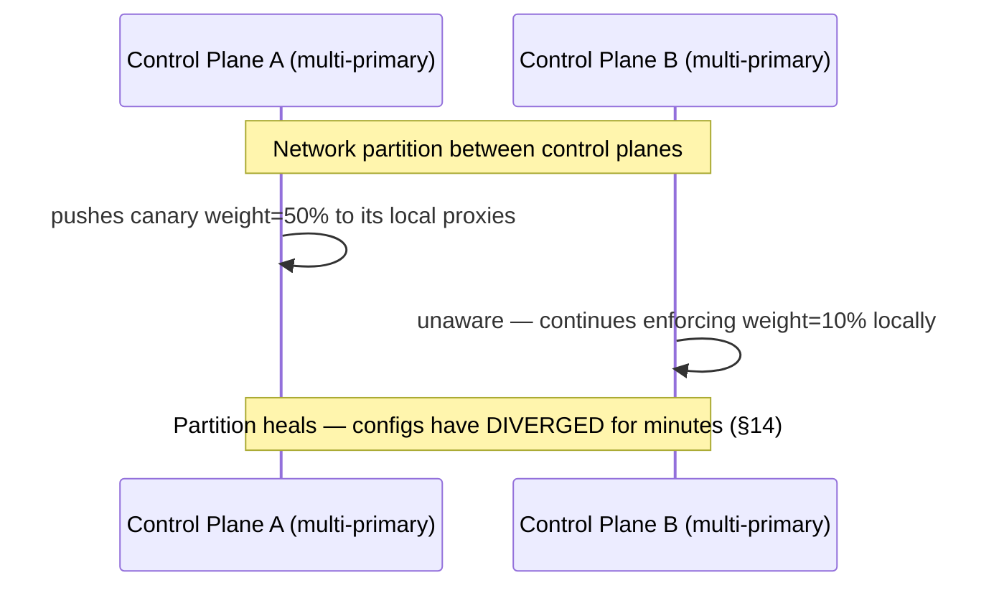
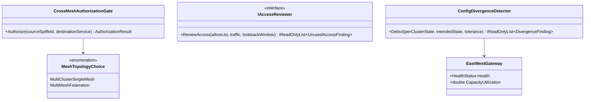

# Module 150 — Service Mesh: Multi-Cluster & Multi-Mesh Federation at Scale

> Domain: Service Mesh | Level: Beginner → Expert | Prerequisite: [[../23-Kubernetes/07-ServiceMesh-Istio-Linkerd-AdvancedNetworking]] (single-cluster mesh mechanics — sidecar injection, mTLS, VirtualService/DestinationRule traffic management, Istio/Linkerd/Dapr/App Mesh comparison — assumed throughout, not re-derived here), [[../17-Microservices/05-Service-Discovery-Communication-Infrastructure-Backpressure]] Advanced Q8 (mesh-vs-application-level retry composition and the incremental migration order — also assumed, not re-derived), [[../18-Event-Driven-Architecture/05-CrossRegion-MultiCluster-Event-Distribution]] (the asynchronous, event-replication complement to this module's synchronous, request-routing cross-cluster mechanism)

>
> **Scope note:** `39-Service-Mesh` scoped as a single, focused module rather than a multi-module domain — deliberately, since single-cluster mesh mechanics (mTLS, sidecar injection, traffic management, mesh product comparison) were already fully covered by Module 79, and mesh-versus-application-level retry composition and incremental adoption order were already fully covered by Module 136 Advanced Q8. This module covers only what neither prior treatment addressed: what changes once a mesh must span more than one Kubernetes cluster. Full 16-section template; Elite FinTech Interview Panel lens.

---

## 1. Fundamentals

**What:** How a service mesh's guarantees — mTLS, traffic management, service discovery — extend, or fail to automatically extend, once services live in more than one Kubernetes cluster, via either a single logical mesh spanning multiple clusters or multiple independent meshes explicitly bridged (federated) together.

**Why:** Module 79's entire treatment implicitly assumed one cluster, one control plane, one trust root — true for many deployments, and structurally incomplete for the multi-cluster reality this course's own Module 137 (cell-based blast-radius containment), Module 142 (regional data-residency and DR), and any organizational or M&A boundary produce. None of Module 79's mechanics — sidecar injection, mTLS certificate issuance, service discovery — automatically extend across a cluster boundary; each requires an explicit, additional federation decision this module develops.

**When:** Any deployment with more than one Kubernetes cluster whose workloads need to call each other — multi-region DR (Module 142), cell-based containment (Module 137), or distinct organizational/compliance boundaries (a newly-acquired company's cluster, a regulated business unit's isolated estate).

**How (30,000-ft view):**
```
Cluster A (mesh, trust root A)  ──east-west gateway──►  Cluster B (mesh, trust root A or B?)
        │                                                        │
   Control plane A                                        Control plane A or B?
   (multi-primary: peers with B;                          (primary-remote: B has no
    primary-remote: A is authoritative)                     control plane of its own)
        │                                                        │
        └──────── cross-cluster service discovery ───────────────┘
                  (its own lag/staleness risk, Module 142's pattern recurring)
```

---

## 2. Deep Dive

### 2.1 Two Topologies — Multi-Cluster Single Mesh vs. Multi-Mesh Federation
**Multi-cluster single mesh** treats every cluster as part of one logical mesh: a shared (or synchronized) control plane and a single trust root, so a service in Cluster A calls a service in Cluster B exactly as it would call one in its own cluster — transparent, low-configuration-overhead, and appropriate when every cluster belongs to the same organizational and security boundary (e.g., Module 137's cells, all owned by the same team). **Multi-mesh federation** instead treats each cluster's mesh as an independent, separately-trust-rooted system, explicitly bridged at specific, narrow points — more configuration overhead, but preserving genuine autonomy and isolation, appropriate wherever the clusters cross a real organizational, compliance, or security boundary. Choosing between them is a security-boundary decision as much as a technical one, and §4's incident is what happens when that decision is made by convenience rather than by the boundary the clusters actually represent.

### 2.2 Trust Domain Federation — Cross-Signing, and Why Narrow Scoping Matters More Than the Mechanism
Each mesh has a root of trust (a CA) issuing workload identities. A multi-cluster single mesh shares one root outright. Multi-mesh federation requires the two meshes' separate roots to establish mutual trust — typically via cross-signing (each CA trusts certificates issued by the other) or trust-bundle exchange. The mechanism itself is well-documented and reliable; the consequential, easy-to-get-wrong decision is **scope**: federating two entire trust domains wholesale means *every* workload in Mesh A can present a validly-authenticated identity to *every* mTLS-protected service in Mesh B, regardless of whether that specific cross-mesh call was ever intended. The mechanically correct default — narrow, explicit, per-service authorization on top of federated trust, not trust-domain-width alone as the security boundary — is precisely what §4's incident shows is easy to skip under time pressure and invisible to skip, since skipping it produces no functional symptom at all.

### 2.3 Control-Plane Topology — Multi-Primary vs. Primary-Remote
**Multi-primary**: each cluster runs its own full control plane, peering symmetrically with the others — resilient to any single cluster's control plane failing, at the cost of needing the peer control planes to stay synchronized, which is exactly Module 146's consistency-and-split-brain territory recurring at the mesh-control-plane layer (§14). **Primary-remote**: one cluster hosts the authoritative control plane; other ("remote") clusters run only data-plane proxies, configured by the primary. Simpler operationally, at the cost of a real, if bounded, single point of control — a remote cluster's proxies continue serving traffic on their last-known configuration if the primary becomes unreachable, but lose the ability to receive *new* configuration, mirroring Module 137's control-plane/data-plane split finding at the mesh layer specifically.

### 2.4 The East-West Gateway — the Mesh's Synchronous Analogue to Module 142's Replication Link
Cross-cluster pod-to-pod traffic is typically not directly routable at the network layer, so cross-cluster calls flow through a dedicated, mTLS-authenticated **east-west gateway** at each cluster's edge, which forwards into the target cluster's mesh. This is architecturally the mesh's synchronous, request-routing counterpart to Module 142's asynchronous, event-replication cross-region link — and inherits many of that link's risk categories: it is a shared dependency every cross-cluster call relies on, its own health and capacity must be independently monitored (an unhealthy gateway degrades every cross-cluster call simultaneously, a cross-cutting shared-dependency risk in Module 137 §4's exact shape), and it is a natural target for the same canaried, staged rollout discipline Module 142 Advanced Q8 established for any topology change.

### 2.5 Cross-Cluster Service Discovery — Its Own Lag, Its Own Staleness Risk
For a caller in Cluster A to route to a healthy instance in Cluster B, the mesh must propagate endpoint health and availability across the cluster boundary — a genuinely distinct data-propagation path from in-cluster service discovery, with its own lag between an instance's actual health changing and that change being reflected in every other cluster's view of it. This is precisely Module 142's replication-lag pattern recurring for service-endpoint metadata rather than event data: a caller routing against a stale cross-cluster endpoint list can send traffic to an instance that has already become unhealthy, or fail to route toward one that has just become healthy — a staleness window requiring the identical monitoring discipline (bounded, measured, alerted) this course has applied to every other form of replication lag.

### 2.6 Mesh Federation and Event-Backbone Replication Are Complementary, Not Substitutable
A full cross-region architecture needs **both** halves: the mesh's east-west gateway and cross-cluster routing handle synchronous, request-response traffic between regions, while Module 142's event-replication discipline handles the asynchronous data layer underneath it. Claiming "we're multi-region" on the strength of either alone is an incomplete claim in precisely this course's recurring shape — a mesh correctly routing synchronous calls across regions says nothing about whether the asynchronous event data those calls ultimately depend on has actually, correctly replicated, and vice versa.

---

## 3. Visual Architecture







---

## 4. Production Example

**Problem:** During an M&A integration, the acquiring firm's core-platform mesh (Cluster A) needed to accept calls from a handful of specific services in the newly-acquired company's cluster (Cluster B), which retained its own, separate mesh and trust root under integration time pressure.

**Architecture:** Multi-mesh federation via cross-signing between the two clusters' CAs (§2.2), chosen over full multi-cluster single-mesh migration specifically because the two organizations' security and compliance postures were not yet unified and full trust-domain merger was judged premature.

**Implementation:** The integration team, under a compressed M&A timeline, federated the two entire trust domains wholesale — every workload identity issued by either mesh's CA became validly authenticated to any mTLS-protected service in the other — rather than separately configuring narrow, per-service `AuthorizationPolicy` rules restricting cross-mesh calls to the specific handful of services the integration actually required, since narrow scoping was judged materially more configuration effort to get correct under the available timeline.

**Trade-offs:** Wholesale trust-domain federation was faster to implement and functionally sufficient for the integration's immediate goal — the specific cross-mesh calls the integration required worked correctly from day one.

**Lessons learned:** The functional correctness of the intended calls masked a much broader, unintended consequence: every workload in Cluster B — including several legacy, less-audited, internal-only services from the acquired company with no relationship to the integration — could now present a validly-mTLS-authenticated identity to every mTLS-protected service in Cluster A's core platform, well beyond the integration's intended scope. Nothing about this was visible to any functional test or monitoring dashboard; the integration's own calls succeeded exactly as designed, mTLS handshakes completed correctly for every workload on both sides, and no error, timeout, or anomalous traffic pattern existed anywhere to distinguish the intended, narrow integration traffic from the unintended, broad trust exposure sitting silently unused beside it.

The gap was discovered five months later during a routine security audit examining cross-cluster network policy as part of the broader integration's compliance sign-off — not by any operational signal. The audit found the trust-domain federation's actual scope (every workload, both directions) sharply exceeded its documented, intended scope (a specific handful of services, one direction), with the exposure having existed, unexploited but present, for the full five-month gap.

The fix had three parts. **First**, trust was re-scoped from trust-domain-width to explicit, per-service `AuthorizationPolicy` rules — SPIFFE-based workload identity checked against a specific, least-privilege allow-list for each cross-mesh call path, so federated trust at the CA layer became a necessary but no longer sufficient condition for any specific cross-mesh call to succeed. **Second**, a periodic cross-mesh access review was introduced, comparing actual observed cross-mesh call traffic against the full set of trust paths the federation technically permitted, explicitly flagging any trust path with permission but no observed legitimate use — surfacing exactly the class of silent, unused-but-present exposure this incident represents, rather than waiting for the next scheduled audit to catch it. **Third**, any future trust-domain federation change was brought under the same mandatory, canaried change-governance rigor Module 142 Advanced Q8 established for cross-region replication topology changes — treating a trust-boundary change with the scrutiny its actual blast radius warrants, rather than as routine infrastructure configuration.

The generalizable lesson: **cross-mesh trust federation's default, convenient scope (the entire trust domain) is far wider than nearly any actual integration need, and the gap between "what the federation technically permits" and "what the integration actually requires" is invisible to every functional signal — it produces no error, no anomaly, and no symptom until something specifically goes looking for it, exactly this course's recurring silent-failure shape, here manifesting as a security exposure rather than a correctness or latency one.**

---

## 5. Best Practices
- Scope cross-mesh trust narrowly via per-service `AuthorizationPolicy`, never relying on trust-domain-width alone as the security boundary (§2.2, §4).
- Choose multi-cluster single mesh only within a genuine single security/organizational boundary; use multi-mesh federation with narrow, explicit trust wherever clusters cross a real compliance, organizational, or M&A boundary (§2.1, §15).
- Periodically audit actual cross-mesh traffic against technically-permitted trust paths, flagging unused-but-present exposure proactively rather than waiting for a scheduled security review (§4's fix).
- Monitor east-west gateway health and cross-cluster service-discovery lag with the same rigor Module 142 established for replication lag — both are a shared, latency-and-staleness-bearing dependency every cross-cluster call relies on (§2.4, §2.5).
- Treat any trust-domain federation change with the same canaried, staged-rollout governance as any other high-blast-radius topology change (§4's third fix, Module 142 Advanced Q8).
- Reason about mesh cross-cluster routing and Module 142's event-replication discipline jointly — neither alone constitutes a complete multi-region architecture claim (§2.6).

## 6. Anti-patterns
- Federating entire trust domains wholesale for convenience under time pressure, rather than narrowly scoping trust to the specific services that actually need cross-mesh access (§4's incident).
- Treating mesh federation as a purely technical decision, independent of the organizational or compliance boundary the clusters actually represent (§2.1).
- Assuming cross-cluster service discovery is instantaneous and staleness-free, missing its own lag and monitoring requirements (§2.5).
- Claiming multi-region readiness on the strength of mesh-level cross-cluster routing alone, without separately verifying the underlying event-replication layer (§2.6).
- Treating a multi-primary control plane's peer synchronization as automatically consistent, missing the split-brain-adjacent risk a control-plane-to-control-plane partition introduces (§2.3, §14).
- Skipping periodic cross-mesh trust-path review, leaving unused-but-present trust exposure invisible until a security audit specifically surfaces it (§4).

---

## 7. Performance Engineering

**CPU/Memory:** East-west gateways add an mTLS-terminating hop to every cross-cluster call, with proportional CPU cost for certificate validation and encryption at the gateway itself, distinct from and additional to the per-pod sidecar cost Module 79 already established.

**Latency:** Cross-cluster calls pay both the east-west gateway hop's own processing latency and genuine network round-trip time between clusters/regions — meaningfully higher than in-cluster mesh call latency, worth explicitly budgeting for in any cross-cluster-dependent request's overall latency target.

**Throughput:** East-west gateway capacity is a shared ceiling every cross-cluster call contends for — under-provisioning it relative to aggregate cross-cluster traffic reproduces Module 148's compaction-debt-style capacity-mismatch risk at this different layer.

**Scalability:** Multi-primary topology scales control-plane resilience horizontally (no single cluster's control-plane failure removes mesh configurability estate-wide) at the cost of needing peer-synchronization capacity that itself must scale with cluster count.

**Benchmarking:** Benchmark cross-cluster call latency and east-west gateway capacity under realistic, sustained cross-cluster traffic volume, not only intra-cluster mesh performance, which Module 79's own benchmarks would not have exercised.

**Caching:** Cross-cluster service-discovery endpoint caches (§2.5) trade freshness for reduced cross-cluster discovery-lookup traffic — the same staleness-versus-load trade this course has established for every other caching layer, requiring an explicit, bounded staleness target.

---

## 8. Security

**Threats:** Overly broad trust-domain federation, exactly §4's incident — an unintended, unused-but-present cross-mesh trust exposure invisible to functional testing. A compromised workload in a federated mesh gains a materially larger attack surface than one in a narrowly-scoped, non-federated cluster.

**Mitigations:** Per-service `AuthorizationPolicy` as the actual security boundary, with trust-domain federation treated as a necessary but insufficient precondition (§2.2, §4); periodic cross-mesh access review surfacing unused trust paths (§4's fix).

**OWASP mapping:** Broken access control if trust-domain width, rather than explicit per-service authorization, is relied upon as the actual security boundary — precisely §4's incident.

**AuthN/AuthZ:** SPIFFE-based workload identity (Module 79's mechanism) extended across a federated trust domain requires the receiving mesh to correctly interpret and authorize the *other* mesh's identity format — a mapping that must be explicit and audited, not assumed automatically correct.

**Secrets:** CA private keys and cross-signing certificates for trust federation require the highest-tier secret protection in the estate, since their compromise would undermine the mTLS guarantee for every federated cross-mesh call.

**Encryption:** mTLS end-to-end across the east-west gateway hop, with the gateway itself never terminating encryption in a way that exposes plaintext traffic between the two clusters' trust domains.

---

## 9. Scalability

**Horizontal scaling:** East-west gateways scale horizontally like any other proxy layer; cross-cluster service-discovery propagation must scale with both cluster count and per-cluster service count, a genuinely multiplicative growth dimension worth capacity-planning explicitly.

**Vertical scaling:** Helps individual east-west gateway instance throughput; doesn't address control-plane peer-synchronization cost in a multi-primary topology, which scales with cluster count regardless of any single instance's own capacity.

**Caching:** §7 — cross-cluster endpoint caching, with an explicit, bounded staleness target.

**Replication/Partitioning:** Multi-primary control-plane synchronization is itself a replication concern, subject to the identical RPO-under-correlated-failure reasoning Module 142 §2.4 established, now for mesh configuration state rather than event data.

**Load balancing:** Cross-cluster load balancing must account for the added latency of the east-west gateway hop, typically preferring in-cluster instances when healthy and falling back to cross-cluster routing only when necessary — a locality-aware balancing policy, not a uniform one.

**High Availability:** Primary-remote topology's single-point-of-control-plane-failure risk (§2.3) is bounded — data-plane proxies continue serving on last-known configuration — but genuinely real for any *new* configuration change during the primary's unavailability.

**Disaster Recovery:** Full cross-region DR requires both this module's mesh-level cross-cluster failover routing and Module 142's event-replication RPO discipline jointly (§2.6) — testing either alone provides an incomplete DR readiness claim.

**CAP theorem:** Multi-primary control-plane synchronization makes an explicit PACELC choice (Module 146) between control-plane consistency and availability during a control-plane-to-control-plane partition — §14's incident is precisely what an unexamined, implicit choice in this dimension produces.

---

## 10. Interview Questions

### Basic (10)

1. **Q: What's the difference between multi-cluster single mesh and multi-mesh federation?**
   **A:** Multi-cluster single mesh treats every cluster as part of one logical mesh with a shared trust root; multi-mesh federation treats each cluster's mesh as independent, with separate trust roots explicitly bridged at specific points, preserving more autonomy at the cost of more configuration (§2.1).
   **Why correct:** States both topologies and their core trade-off.
   **Common mistakes:** Assuming the two are interchangeable naming for the same thing, missing the genuine trust-boundary and autonomy difference.
   **Follow-ups:** "When is multi-mesh federation the correct choice?" (Wherever the clusters cross a real organizational, compliance, or security boundary, §2.1, §15.)

2. **Q: What is an east-west gateway?**
   **A:** A dedicated, mTLS-authenticated gateway at each cluster's edge that cross-cluster traffic flows through, since pod-to-pod traffic typically isn't directly routable across cluster network boundaries (§2.4).
   **Why correct:** States the mechanism and why it's necessary.
   **Common mistakes:** Assuming cross-cluster mesh traffic flows the same way as in-cluster traffic, missing the dedicated gateway hop.
   **Follow-ups:** "What prior-module mechanism is this the synchronous analogue of?" (Module 142's asynchronous cross-region event-replication link, §2.4.)

3. **Q: What went wrong in §4's incident, at a high level?**
   **A:** An M&A integration federated two entire trust domains wholesale rather than scoping trust narrowly to the specific services needing cross-mesh access, so every workload in the acquired company's cluster could present a validly-authenticated identity to every mTLS-protected service in the core platform — invisible to any functional test, discovered five months later by a security audit (§4).
   **Why correct:** States the mechanism and why it was invisible functionally.
   **Common mistakes:** Assuming this was a technical misconfiguration bug, when the federation worked exactly as configured — the configuration's *scope* was simply far wider than intended.
   **Follow-ups:** "What was the fix?" (Per-service `AuthorizationPolicy` as the actual security boundary, plus periodic cross-mesh access review, §4's fix.)

4. **Q: What's the difference between multi-primary and primary-remote control-plane topologies?**
   **A:** Multi-primary has each cluster run its own full control plane, peering symmetrically with others; primary-remote has one cluster host the authoritative control plane while others run only data-plane proxies configured by it (§2.3).
   **Why correct:** States both topologies precisely.
   **Common mistakes:** Assuming one topology is universally better, rather than recognizing each trades resilience against operational simplicity differently.
   **Follow-ups:** "What's primary-remote's key risk?" (A remote cluster loses the ability to receive *new* configuration if the primary becomes unreachable, though it continues serving on last-known config, §2.3.)

5. **Q: Why does cross-cluster service discovery have its own lag, distinct from in-cluster discovery?**
   **A:** Endpoint health and availability must be propagated across the cluster boundary via its own, genuinely distinct data path, with a lag between an instance's actual health changing and that change being reflected in every other cluster's view of it (§2.5).
   **Why correct:** States the mechanism and why the lag is structurally distinct from in-cluster discovery.
   **Common mistakes:** Assuming cross-cluster discovery is as close to instantaneous as in-cluster discovery, missing the additional propagation path and its lag.
   **Follow-ups:** "What prior-module pattern does this recur?" (Module 142's replication-lag pattern, now for service-endpoint metadata rather than event data, §2.5.)

6. **Q: Why is "we federated the trust domains" not the same claim as "cross-mesh access is properly secured"?**
   **A:** Trust-domain federation alone means every federated workload can *authenticate* across the boundary; it says nothing about whether that access is *authorized* for the specific, intended calls — narrow, per-service `AuthorizationPolicy` is the actual security boundary, with federation only a necessary precondition (§2.2, §4).
   **Why correct:** Distinguishes authentication (what federation provides) from authorization (what's actually needed).
   **Common mistakes:** Conflating "trusted" (can authenticate) with "authorized" (should be allowed to call this specific service).
   **Follow-ups:** "What mechanism provides the actual authorization boundary?" (SPIFFE-based per-service `AuthorizationPolicy`, §2.2.)

7. **Q: Why does claiming "we're multi-region" require both mesh-level and event-replication evidence?**
   **A:** The mesh handles synchronous, request-routing traffic across regions; Module 142's event-replication discipline handles the asynchronous data layer underneath — mesh routing working correctly says nothing about whether the underlying event data has actually, correctly replicated, and vice versa (§2.6).
   **Why correct:** States why the two are complementary, not substitutable, evidence for a multi-region claim.
   **Common mistakes:** Treating mesh-level cross-cluster connectivity as sufficient evidence of multi-region readiness on its own.
   **Follow-ups:** "What would a complete multi-region readiness claim require?" (Verified mesh-level cross-cluster routing/failover AND Module 142's RPO-validated event replication, jointly, §2.6.)

8. **Q: Why is an east-west gateway a shared, cross-cutting dependency risk, in the same shape as Module 137's finding?**
   **A:** Every cross-cluster call, regardless of which specific services are involved, depends on the same east-west gateway — an unhealthy or under-capacity gateway degrades every cross-cluster call simultaneously, exactly Module 137 §4's shared-dependency-defeats-cell-isolation pattern, now at the mesh layer (§2.4).
   **Why correct:** Connects the gateway's shared-dependency risk to an established prior pattern.
   **Common mistakes:** Treating each cross-cluster service call as an independent risk, missing that they all funnel through and depend on the same gateway.
   **Follow-ups:** "What governance does this warrant?" (The same canaried, staged rollout discipline for any change to the gateway, and independent capacity/health monitoring for it specifically, §2.4.)

9. **Q: What discovered §4's incident, and why not sooner?**
   **A:** A routine security audit examining cross-cluster network policy, five months after the federation was deployed — not sooner, because the overly broad trust scope produced no functional symptom at any point; the intended calls worked correctly and nothing about the unintended, broader access was visible to any operational or functional signal (§4).
   **Why correct:** States the detection mechanism and why it was the only thing that could have caught this specific gap.
   **Common mistakes:** Assuming a monitoring dashboard or error rate would eventually have surfaced this, missing that the exposure was genuinely invisible to every functional and operational signal.
   **Follow-ups:** "What ongoing mechanism now catches this class of gap faster?" (Periodic cross-mesh access review comparing actual traffic against technically-permitted trust paths, §4's fix.)

10. **Q: Why does a multi-primary control-plane topology introduce a consistency concern Module 146 already established?**
    **A:** Each cluster's control plane independently pushes configuration to its own local proxies; if the peer control planes cannot synchronize (a control-plane-to-control-plane partition), each may push divergent configuration independently and correctly by its own local view — exactly Module 146's split-brain pattern, now at the mesh-configuration layer (§2.3, §14).
    **Why correct:** Connects multi-primary's synchronization requirement to Module 146's established consistency vocabulary.
    **Common mistakes:** Assuming control-plane peers always stay synchronized, missing that a partition between them produces the identical divergence risk Module 146 established for any concurrent-write scenario.
    **Follow-ups:** "What detects this divergence?" (A canary-completeness check comparing actual per-cluster traffic-split state against the intended global rollout state, rather than trusting each control plane's own local view, §14's fix.)

### Intermediate (10)

1. **Q: Walk through why §4's team's decision to federate trust wholesale was a reasonable-looking, if ultimately incorrect, choice under M&A time pressure.**
   **A:** Narrow, per-service authorization scoping requires precisely enumerating every specific cross-mesh call path the integration needs — genuinely more upfront configuration effort than a single, wholesale trust-federation action, and under a compressed M&A timeline with the immediate goal being "make the specific integration calls work," the wholesale approach delivered that goal correctly and quickly. The flaw wasn't in prioritizing speed under real time pressure; it was in not treating the resulting broader exposure as a tracked, explicit, time-bounded gap requiring prompt follow-up narrowing — instead it was implicitly treated as a completed, permanent state.
   **Why correct:** Identifies the actual gap as follow-up tracking, not the initial expedient choice itself, which was a defensible trade-off given the real constraint.
   **Common mistakes:** Concluding the team was simply careless, when the initial choice was a reasonable, time-pressured trade-off — the failure was in not tracking and closing the resulting gap afterward.
   **Follow-ups:** "What would 'tracked, time-bounded' have looked like?" (An explicit ticket or ADR (Module 106) documenting the wholesale federation as an interim, deliberately time-bounded state, with a committed follow-up date to narrow it to per-service scoping — converting an implicit permanent gap into an explicit, tracked temporary one.)

2. **Q: Design the per-service `AuthorizationPolicy` narrowing that §4's fix requires.**
   **A:** For each specific, intended cross-mesh call path, an explicit `AuthorizationPolicy` allow-rule naming the source workload identity (SPIFFE ID) and the specific destination service and operation — with a default-deny posture for every other combination, so federated trust at the CA layer becomes necessary but insufficient; only the explicitly allow-listed call paths actually succeed, regardless of what the underlying trust federation technically permits.
   **Why correct:** Specifies the default-deny, explicit-allow-list mechanism that closes the gap structurally.
   **Common mistakes:** Adding allow-rules for the intended paths without also establishing a default-deny posture, which would leave every other, unlisted path still implicitly permitted by trust-domain width alone.
   **Follow-ups:** "How would you verify the default-deny posture is actually in effect?" (A synthetic test attempting a deliberately non-allow-listed cross-mesh call and confirming it's rejected — the same meta-verification discipline this course has applied to every other safety mechanism, Module 146 Advanced Q7's precedent.)

3. **Q: Why is a periodic cross-mesh access review necessary even after §4's structural fix (per-service `AuthorizationPolicy`) is in place?**
   **A:** The structural fix prevents *unintended* new access from being silently permitted, but doesn't retroactively audit whether *currently allow-listed* paths remain actually needed — an allow-list entry created for a since-completed or since-deprecated integration purpose can persist indefinitely as unused-but-present access, the identical class of silent exposure §4 demonstrates, just scoped to a smaller, explicitly-listed set of paths rather than an entire trust domain.
   **Why correct:** Identifies that the structural fix narrows the scope of the residual risk without eliminating the underlying category (unused-but-present access) entirely.
   **Common mistakes:** Assuming the structural fix alone is sufficient going forward, missing that even a narrow, explicit allow-list can accumulate its own unused entries over time.
   **Follow-ups:** "How would the review distinguish 'unused but still legitimately needed' from 'unused and safe to remove'?" (Correlating allow-list entries against actual observed traffic over a meaningful window, flagging zero-traffic entries for explicit owner confirmation before removal, rather than automated deletion — a human-in-the-loop step given the cost of incorrectly removing genuinely-needed-but-infrequent access.)

4. **Q: How does the choice between multi-primary and primary-remote control-plane topology interact with Module 137's cell-based containment philosophy?**
   **A:** Multi-primary aligns with Module 137's cell philosophy directly — each cluster/cell has full, independent control-plane capability, so one cell's control-plane failure doesn't remove mesh configurability from any other cell, matching cells' core promise of independent failure domains. Primary-remote reintroduces a shared, cross-cutting dependency (the primary cluster's control plane) that every remote cluster's *configurability* — though not its ongoing traffic-serving — depends on, a partial but real violation of cell-based containment's core premise for that specific capability.
   **Why correct:** Connects the topology choice directly to Module 137's containment philosophy and precisely scopes primary-remote's partial violation of it.
   **Common mistakes:** Assuming primary-remote fully violates cell-based containment, when the violation is specifically scoped to configurability during the primary's unavailability, not to ongoing data-plane traffic serving.
   **Follow-ups:** "When would primary-remote still be the correct choice despite this trade-off?" (Where operational simplicity is highly valued and the organization has independently assessed the primary cluster's own availability as sufficiently high that the residual configurability risk is acceptable — a deliberate, documented trade-off rather than a default.)

5. **Q: Critique treating cross-cluster service-discovery staleness as a purely technical, ignorable concern since "the mesh handles it."**
   **A:** "The mesh handles it" describes the *mechanism* (endpoint propagation exists) without addressing the *guarantee* (how stale can that propagated state be, and what happens to a request routed against stale data) — exactly this course's recurring "declared ≠ actual" pattern, where a mechanism's existence is mistaken for an unconditional guarantee about its behavior. The correct treatment names an explicit, bounded staleness target for cross-cluster discovery propagation and monitors against it, per §2.5's direct parallel to Module 142's replication-lag discipline.
   **Why correct:** Identifies the specific gap between mechanism-exists and guarantee-is-bounded, applying this course's established theme.
   **Common mistakes:** Treating "the mesh propagates endpoint health across clusters" as a complete answer, without asking how stale that propagation can be and what happens during the staleness window.
   **Follow-ups:** "What would a bounded staleness target look like concretely?" (E.g., "cross-cluster endpoint health reflects actual instance state within N seconds, 99.9% of the time under normal operating conditions" — directly reusing Module 146 §2.6's bounded-staleness-contract discipline.)

6. **Q: Apply this course's "declared ≠ actual" theme to §4's incident.**
   **A:** The declared claim was "the mesh federation is scoped to the M&A integration's needs." The claim was true for the *intended, functioning* call paths — those genuinely worked, and worked only for the integration's purpose from the perspective of anyone testing them. The claim was false for the *actual, technical scope* of what the federation permitted — every workload, both directions — a gap invisible because nothing about the intended paths working correctly revealed anything about the unintended paths that also, silently, worked.
   **Why correct:** Precisely distinguishes the functionally-verified narrow claim from the actual, much broader technical scope, and explains why verifying the former provides zero evidence about the latter.
   **Common mistakes:** Assuming that because the intended integration calls were thoroughly tested and worked correctly, the federation's scope must also have been correctly, narrowly configured.
   **Follow-ups:** "What test would have caught the gap between declared and actual scope earlier?" (A negative test — deliberately attempting a call from a workload *not* intended to have cross-mesh access and confirming it's rejected — the same "test the boundary, not just the intended path" discipline Module 97's IDOR finding established for authorization generally.)

7. **Q: How does §14's control-plane divergence incident relate to Module 145's capstone finding about composition risk?**
   **A:** It's a direct instance: multi-primary topology (individually correct — each control plane genuinely, correctly manages its own local proxies) composed with a control-plane-to-control-plane network partition (an individually unremarkable, expected occasional network event) to produce divergent, silently-inconsistent traffic-routing state across clusters — neither the topology choice nor the partition alone would predict this outcome; it emerges specifically from their composition, exactly Module 145's recurring finding.
   **Why correct:** Connects the incident explicitly to Module 145's named finding, identifying the two individually-unremarkable factors whose composition produced the actual failure.
   **Common mistakes:** Treating this as simply "a network partition caused a problem," missing that the specific failure shape (silent, undetected configuration divergence) emerges from the *combination* of the partition with the multi-primary topology's synchronization assumption.
   **Follow-ups:** "What would a composed chaos experiment (Module 144's discipline) for this specific risk look like?" (Deliberately partition the control-plane-to-control-plane link while pushing a configuration change to only one side, then verify the divergence-detection mechanism (§14's fix) actually catches the resulting inconsistency — directly mirroring Module 145 §11 Expert's composed-chaos-experiment structure.)

8. **Q: How should engineering leadership decide whether an M&A integration warrants multi-mesh federation at all, versus a narrower alternative like API-Gateway-mediated cross-cluster calls (Module 127/128)?**
   **A:** Mesh federation is appropriate where the integration genuinely needs broad, ongoing, low-latency, mTLS-secured service-to-service interaction between the two organizations' estates; a narrower API-Gateway-mediated approach (Module 127/128's pattern) — where cross-organizational calls flow through a small, explicitly-defined set of gateway-exposed endpoints rather than mesh-to-mesh trust — is preferable where the actual integration need is limited to a small, well-defined set of calls, since it avoids mesh federation's trust-domain complexity entirely for exactly the boundary (a distinct organization) where narrow, explicit, auditable access is most valuable and broad trust is least appropriate.
   **Why correct:** Ties the architectural choice to the actual breadth and nature of the integration need, and correctly identifies the API-Gateway alternative as often better-suited specifically for organizational boundaries.
   **Common mistakes:** Defaulting to mesh federation whenever two clusters need any cross-cluster communication, without considering whether a narrower, gateway-mediated approach would better match the actual, usually limited, cross-organizational integration need.
   **Follow-ups:** "What would tip the decision toward mesh federation despite the added trust-domain complexity?" (A large, evolving, latency-sensitive surface of cross-organizational calls where a gateway's per-endpoint configuration overhead would itself become the larger governance burden — a genuinely broad, ongoing integration need, not a handful of specific calls.)

9. **Q: How does this module's east-west gateway concept relate to Module 130's market-data platform's own gateway/direct-feed distinction?**
   **A:** Structurally analogous: Module 130 established that latency-critical, high-volume market-data paths bypass general platform infrastructure via direct, pre-established connections, while this module's east-west gateway is itself general, shared infrastructure every cross-cluster call passes through — meaning an extremely latency-sensitive cross-cluster call path (per Module 136 Expert Q5's identical reasoning for intra-cluster direct connections) may warrant its own dedicated, non-mesh-mediated cross-cluster connection, bypassing the east-west gateway's shared capacity and latency cost entirely, exactly as Module 130 and Module 136 each independently concluded for their own respective "when to bypass the general platform" decisions.
   **Why correct:** Connects this module's gateway concept to two independently-established prior instances of the identical "bypass shared infrastructure for the genuinely latency-critical path" pattern.
   **Common mistakes:** Assuming every cross-cluster call, regardless of latency sensitivity, should route through the general-purpose east-west gateway, missing the established precedent for exempting genuinely latency-critical paths.
   **Follow-ups:** "What's the cost of bypassing the east-west gateway for such a path?" (Losing the gateway's centralized mTLS enforcement and observability for that specific path, requiring the bypass connection to independently re-implement whatever subset of those guarantees it still needs — the same operational-rigidity-for-latency trade Module 130 and Module 136 both accepted for their own bypass cases.)

10. **Q: Synthesize how this module extends Module 79's single-cluster mesh treatment.**
    **A:** Module 79 established mesh mechanics — mTLS, sidecar injection, traffic management — entirely within one cluster's boundary, where a single control plane and trust root made every one of those mechanics directly, transparently available. This module identifies and addresses exactly what breaks or requires an additional, explicit decision once a second cluster enters the picture: trust must be either shared or explicitly, narrowly federated (§2.2); the control plane must be either unified or explicitly topologized as multi-primary or primary-remote (§2.3); traffic must cross via a new, shared east-west gateway (§2.4); and service discovery gains a genuinely new lag dimension (§2.5) — none of which Module 79's single-cluster scope needed to address at all.
    **Why correct:** Precisely maps what Module 79 covered within one cluster to what this module adds once a second cluster is introduced.
    **Common mistakes:** Treating this module's content as redundant with Module 79's, rather than recognizing it addresses an entirely new dimension (cluster count) Module 79's scope never needed to consider.
    **Follow-ups:** "Which of this module's four new concerns (trust, control-plane topology, gateway, discovery lag) is most consequential to get wrong, based on this module's own incidents?" (Trust scoping (§2.2) — §4's incident shows it fails silently with a security, not merely operational, consequence, the most severe failure category this module addresses.)

### Advanced (10)

1. **Q: Diagnose §4's incident and design the complete structural fix.**
   **A:** Root cause: trust-domain federation scoped wholesale (every workload, both directions) rather than to the specific handful of services the M&A integration actually required, under time pressure, with the resulting exposure invisible to any functional signal for five months. Fix: (1) per-service `AuthorizationPolicy` with a default-deny posture, making trust-domain federation necessary but insufficient for any specific call to succeed (Intermediate Q2); (2) a periodic cross-mesh access review comparing actual traffic against technically-permitted paths, catching both the original gap and any future unused-allow-list drift (Intermediate Q3); (3) mandatory, canaried change governance for any future trust-domain federation change, treating it with the scrutiny its actual blast radius warrants (§4's third fix, Module 142 Advanced Q8's precedent).
   **Why correct:** Addresses the specific scoping gap, ongoing drift risk, and future-change governance as three distinct, individually necessary fixes.
   **Common mistakes:** Fixing only the immediate over-broad federation (narrowing it once) without also adding the periodic review (point 2), leaving the same class of gap free to silently reaccumulate over time as new integration needs arise.
   **Follow-ups:** "Why is point 3 necessary given points 1 and 2 already close the current gap?" (Because the *next* trust-federation change, made under similarly compressed circumstances, could reproduce the identical scoping mistake absent explicit governance requiring narrow scoping and review as a mandatory, not optional, step.)

2. **Q: A team proposes eliminating trust-domain federation risk entirely by never federating meshes — using only API-Gateway-mediated calls (Module 127/128) for every cross-cluster interaction, regardless of scale or latency need. Evaluate.**
   **A:** This eliminates §4's specific risk category entirely but at a real cost for genuinely broad, latency-sensitive, evolving cross-cluster interaction needs — per-endpoint gateway configuration becomes its own significant governance burden at sufficient scale, and gateway-mediated calls typically cannot match mesh-native mTLS's latency and operational transparency for high-volume service-to-service traffic. This is the mirror image of Intermediate Q8's own finding: just as defaulting to mesh federation for a narrow integration need over-provisions complexity, defaulting to gateway-mediation for a genuinely broad, ongoing cross-cluster need under-provisions capability, each choice appropriate to a different actual scale and nature of need.
   **Why correct:** Identifies the specific cost this alternative incurs for the cases where mesh federation is actually the better-matched tool, mirroring Intermediate Q8's decision criterion in reverse.
   **Common mistakes:** Treating gateway-mediation as a strictly safer default in all cases, without weighing its governance and latency costs against mesh federation's benefits for the cases genuinely warranting broad, ongoing cross-cluster interaction.
   **Follow-ups:** "What would indicate a gateway-mediated approach has outgrown its appropriate scope?" (The number of distinct gateway-exposed endpoints and their configuration-maintenance burden growing to rival or exceed what narrow, per-service mesh `AuthorizationPolicy` scoping would have required — a sign the actual integration need has grown beyond what the narrower tool was designed for.)

3. **Q: Design a monitoring signal that would have caught §4's incident faster than the five-month security audit did.**
   **A:** The periodic cross-mesh access review itself (Intermediate Q3's fix), had it existed from the federation's original deployment, would have surfaced the gap on its first scheduled run — comparing the full set of technically-permitted trust paths (every workload, both directions) against actual observed traffic (a small, specific set of calls) would have immediately revealed the enormous gap between permitted and used access, converting a five-month blind spot into a detection window bounded by the review's own cadence.
   **Why correct:** Identifies that the actual fix mechanism (Intermediate Q3), had it existed proactively rather than reactively, directly serves as the earlier-detection signal this question asks for.
   **Common mistakes:** Proposing a net-new detection mechanism when the module's own established fix already directly answers the question, missing the connection.
   **Follow-ups:** "What cadence would be appropriate for this review, and why?" (Frequent enough to bound the exposure window to an organizationally acceptable risk tolerance — for a security-relevant control specifically, more frequent than a purely operational health check, mirroring Module 143 Advanced Q5's differentiated-retention-by-consequence-class reasoning.)

4. **Q: How would you design the divergence-detection mechanism §14's incident requires, given each control plane's own local view is individually, honestly correct?**
   **A:** Neither control plane's own local state is sufficient evidence of global correctness — the detection must compare *both* clusters' actual, current traffic-split state against the *intended*, globally-declared rollout target (e.g., from the deployment pipeline that initiated the canary), flagging any cluster whose actual state diverges from that shared, external source of truth, rather than comparing the two clusters' local states only against each other, which could both diverge from the intended target in a way that happened to still agree with each other and evade a mutual-comparison-only check.
   **Why correct:** Correctly identifies that comparison must be against an external, intended-state source of truth, not merely cross-cluster mutual agreement, which could itself be jointly wrong.
   **Common mistakes:** Designing the check as only a cross-cluster comparison (do A and B agree with each other), missing that both could independently diverge from the actually-intended rollout state in a coincidentally-matching way.
   **Follow-ups:** "What would be the source of the 'intended, globally-declared rollout target'?" (The deployment/CD pipeline itself (Module 92's territory), which should be the single, authoritative record of what traffic-split state is intended at any given time, independent of and external to either cluster's own control-plane state.)

5. **Q: Critique auditing cross-mesh trust scope only at the point of initial federation, never afterward.**
   **A:** A trust scope correctly narrow at federation time can still drift — new services deployed into either cluster inherit whatever workload-identity-issuance defaults the mesh applies, and if those defaults don't explicitly exclude newly-added services from the federated trust domain, the scope can silently widen over time even without any explicit federation-configuration change, purely as a side effect of ordinary, unrelated service deployment activity within either cluster.
   **Why correct:** Identifies a distinct drift mechanism (new service deployment, not federation reconfiguration) that a point-in-time-only audit would miss entirely.
   **Common mistakes:** Assuming trust scope, once correctly narrowed, remains static unless someone explicitly changes the federation configuration, missing that ordinary service deployment can itself silently widen effective trust scope.
   **Follow-ups:** "How would you close this specific drift vector?" (New workloads should require explicit, deliberate opt-in to any cross-mesh-trusted identity namespace, rather than inheriting cross-mesh trust by default purely from being deployed into an already-federated cluster.)

6. **Q: A regulator asks how the firm ensures cross-organizational (post-M&A) service access remains scoped to only what's actually authorized. Answer.**
   **A:** Describe the layered chain: trust-domain federation established via cross-signing (a necessary precondition, §2.2); per-service `AuthorizationPolicy` with default-deny as the actual, enforced security boundary (Intermediate Q2); periodic access review comparing granted trust paths against actual observed usage, flagging and requiring explicit justification for unused entries (Intermediate Q3, Advanced Q5); and mandatory, canaried governance for any change to the federation's scope (§4's third fix). State the residual honestly: the review cadence bounds, but does not eliminate, the maximum possible undetected-exposure window, which is why the cadence itself is calibrated to the organization's risk tolerance rather than left as an unexamined default.
   **Why correct:** Gives the full layered chain and states the honest, cadence-bounded residual, consistent with this course's established answer pattern.
   **Common mistakes:** Claiming cross-organizational access is fully, continuously scoped with zero residual exposure window, omitting the honest, review-cadence-bounded reality.
   **Follow-ups:** "What would justify a shorter review cadence for this specific control?" (The regulatory and reputational consequence of an undetected cross-organizational access exposure, which for a financial-services M&A integration is materially higher-stakes than, say, an internal, single-organization cross-cluster access review — warranting Module 143 Advanced Q5's differentiated-by-consequence retention/review-cadence reasoning applied here.)

7. **Q: Apply this course's "verify the verifier" theme to the periodic cross-mesh access review itself.**
   **A:** The review's own correctness depends on its traffic-observation mechanism actually, comprehensively capturing every cross-mesh call — a gap in that observation (an unmonitored traffic path, a logging pipeline silently dropping a subset of events) would cause the review to under-report actual usage, potentially flagging genuinely-needed access paths as "unused" for removal, or — more dangerously — failing to flag a genuinely unauthorized access pattern the observation gap happened to obscure. This requires the identical meta-verification this course has applied to every other detection mechanism: periodically, deliberately generating a known, synthetic cross-mesh call and confirming the review's traffic-observation pipeline actually captures and reports it.
   **Why correct:** Applies the specific, now-repeatedly-demonstrated silent-failure risk of verification infrastructure to this module's own primary fix mechanism.
   **Common mistakes:** Treating the periodic access review as itself immune to the observation-gap risk that every other detection mechanism in this course has been shown to carry.
   **Follow-ups:** "What would be the specific consequence of an unnoticed observation gap in this review?" (Either false-positive 'unused' flags risking accidental removal of genuinely-needed access, or — more severely — a genuinely unauthorized traffic pattern going unflagged specifically because it happened to traverse the unmonitored path, precisely inverting the review's intended protective purpose.)

8. **Q: How should engineering leadership weigh the operational and governance overhead of narrow, per-service trust scoping against the convenience of wholesale trust federation for future M&A integrations, given §4's incident?**
   **A:** §4 demonstrates that the convenience of wholesale federation is not actually "free" — it defers real cost (an unbounded, unmonitored security exposure) rather than eliminating it, while narrow scoping's upfront cost is bounded, visible, and one-time per integration. The correct organizational response is not simply "always scope narrowly, regardless of time pressure" (which may be genuinely infeasible under real M&A timelines) but building narrow-scoping tooling and templates *in advance* of the next integration — mirroring Module 147 Advanced Q6's "make the correct path the convenient path" resolution — so that under future time pressure, narrow scoping is no longer the slower option compared to wholesale federation.
   **Why correct:** Reframes the cost comparison as bounded-and-upfront versus unbounded-and-deferred, and proposes addressing the root cause (narrow scoping being slower under pressure) via advance tooling investment rather than relying on discipline alone under future time pressure.
   **Common mistakes:** Concluding the only lesson is "always take more time to scope narrowly," without addressing why narrow scoping was genuinely slower in the first place — a gap that will recur under the next time-pressured integration unless closed structurally.
   **Follow-ups:** "What would this advance tooling concretely provide?" (A templated, pre-built set of common integration-pattern `AuthorizationPolicy` configurations and a streamlined process for enumerating and registering the specific cross-mesh call paths a new integration needs — reducing narrow scoping's time cost closer to wholesale federation's, removing the actual incentive that drove §4's original choice.)

9. **Q: How does this module's east-west gateway concept relate to Module 145's capstone finding, given the gateway is a single, shared point every cross-cluster call depends on?**
   **A:** The gateway itself is a single, individually well-understood component; the composition risk this module's incidents demonstrate lives not in the gateway's own correctness but in its *interaction* with the topology and trust decisions layered around it — §4's incident occurred entirely at the trust-scoping layer, orthogonal to the gateway's own correct function, and §14's incident occurred at the control-plane-synchronization layer, likewise orthogonal to the gateway. This illustrates Module 145's finding precisely: even where the shared infrastructure component (the gateway) itself functions correctly throughout, the surrounding architectural decisions (trust scope, control-plane topology) are where this module's actual incidents concentrated.
   **Why correct:** Correctly locates where this module's incidents actually occurred (surrounding architectural decisions) relative to the gateway component itself (which functioned correctly throughout both incidents), reinforcing Module 145's composition-versus-component distinction.
   **Common mistakes:** Assuming the east-west gateway's own reliability is the primary risk this module addresses, when both of this module's actual incidents occurred at layers orthogonal to the gateway's own function.
   **Follow-ups:** "Does this mean east-west gateway reliability is not worth separate attention?" (No — §7 and §9 establish it as a genuine, independent capacity and availability concern; the point is specifically that this module's *documented incidents* happened to concentrate elsewhere, not that gateway reliability is unimportant in its own right.)

10. **Q: Synthesize the governance for multi-cluster mesh federation across the organization.**
    **A:** (1) Trust-domain federation scope decided explicitly per cross-cluster relationship — multi-cluster single mesh only within a genuine single security boundary, multi-mesh federation with narrow, per-service `AuthorizationPolicy` (default-deny) elsewhere (§15). (2) Every federation change subject to mandatory, canaried governance treating it as a high-blast-radius topology change (§4's third fix). (3) Periodic, meta-verified cross-mesh access review comparing granted trust paths against actual observed usage (Advanced Q3, Advanced Q7). (4) Control-plane topology (multi-primary versus primary-remote) chosen explicitly with its PACELC-adjacent trade-off understood, paired with divergence-detection comparing actual state against an externally-declared intended state, not mutual cross-cluster agreement alone (Advanced Q4). (5) Cross-cluster service-discovery staleness bounded and monitored explicitly, per Module 142's established replication-lag discipline (§2.5). (6) Multi-region readiness claims require joint evidence from both this module's mesh-routing layer and Module 142's event-replication layer, never either alone (§2.6).
    **Why correct:** Covers trust scoping, change governance, ongoing access review with meta-verification, control-plane topology, discovery-lag monitoring, and cross-domain multi-region claim integrity as six distinct, individually necessary controls.
    **Common mistakes:** Governing trust federation's initial scoping thoroughly while leaving ongoing drift (point 3) or control-plane divergence detection (point 4) unaddressed, exactly where this module's two incidents occurred.
    **Follow-ups:** "Which single control would have most changed both §4's and §14's outcomes if it alone had existed beforehand?" (No single control covers both — §4 required trust-scoping discipline (points 1-3), §14 required control-plane-topology and divergence-detection discipline (point 4) — reinforcing that this module's two incidents are genuinely distinct risk categories requiring independent governance, not a single unified fix.)

### Expert (10)

1. **Q: Evaluate whether "our meshes are federated, so cross-organizational access is controlled" should ever be an unqualified claim following an M&A integration.**
   **A:** No — per §4, federation alone establishes *authentication* (who can prove their identity across the boundary), not *authorization* (who should actually be permitted to call what) — the precise, defensible claim is two-part: "trust is federated between the two organizations' meshes" plus "access is separately, explicitly restricted via default-deny, per-service authorization policy, periodically reviewed against actual usage" — the unqualified first half alone is exactly the claim that was true and insufficient throughout §4's five-month exposure window.
   **Why correct:** Separates the authentication claim (true, and insufficient alone) from the authorization claim (the actually necessary, additional statement), naming precisely what closes the gap.
   **Common mistakes:** Treating "federated" as itself a complete security claim, conflating the establishment of trust with the scoping of access built on top of it.
   **Follow-ups:** "Is there an analogous unqualified claim risk for multi-cluster single mesh (not federation)?" (Yes, structurally — "we're one logical mesh" says nothing about whether every service *should* be able to call every other service just because they technically *can*; even within a single trust domain, `AuthorizationPolicy` least-privilege scoping remains necessary, exactly Module 97's IDOR-adjacent finding recurring at the mesh layer.)

2. **Q: How does this module's east-west gateway and cross-cluster discovery-lag findings change the answer to "how would you design a multi-region trading platform's service mesh," synthesizing with Module 129's fan-out and Module 149's tail-latency findings?**
   **A:** A cross-cluster call inherits both an east-west gateway hop's added latency (§2.4) and, if it participates in wide fan-out (Module 129's risk-aggregation pattern), Module 149's tail-at-scale mathematics apply with the gateway hop's own tail-latency distribution as one additional term in the fan-out's aggregate risk calculation — meaning a wide-fan-out request spanning multiple clusters should treat cross-cluster calls as carrying meaningfully higher individual tail probability than in-cluster calls, worth accounting for explicitly in any hedging (Module 149 §2.4) or fan-out-width (Module 129) design decision for that specific request shape, rather than assuming uniform tail-latency risk across every fan-out call regardless of whether it crosses a cluster boundary.
   **Why correct:** Connects this module's specific latency-cost addition (the gateway hop) to two independently-established prior modules' quantitative frameworks, showing how they compose for a genuinely cross-cluster, wide-fan-out request.
   **Common mistakes:** Applying Module 129's and Module 149's fan-out/tail-latency reasoning uniformly across every fan-out call, without accounting for cross-cluster calls' specifically elevated individual tail-latency contribution from the added gateway hop.
   **Follow-ups:** "Would hedging a cross-cluster call differ from hedging an in-cluster one, per Module 149's read/write asymmetry?" (The same asymmetry applies identically — a hedged cross-cluster read is safe under any consistency model; a hedged cross-cluster write requires this module's trust/authorization discipline to already be correctly in place at the destination, exactly as Module 149 §2.6 established for any hedged write regardless of cluster boundary.)

3. **Q: Design the approach for federating trust between two meshes where one organization's compliance posture requires data never leave a specific jurisdiction, directly extending Module 142's residency discussion.**
   **A:** Trust federation itself (the cryptographic authentication mechanism) is largely orthogonal to data residency — but the *authorized* cross-mesh call paths (§2.2's `AuthorizationPolicy` layer) must be explicitly reviewed against Module 142 §2.7's residency classification for any data those calls would return or transmit, since a technically-authorized, narrowly-scoped cross-mesh call path could still constitute a residency violation if its response payload contains jurisdiction-restricted data crossing the boundary the mesh federation spans. This means the per-service authorization review this module establishes (Intermediate Q2, Advanced Q3) must incorporate a residency-classification check as one of its explicit criteria, not treat authorization scoping and residency compliance as independent concerns.
   **Why correct:** Correctly identifies that mesh-level trust/authorization and Module 142's residency classification are related but distinct concerns requiring joint, not independent, review.
   **Common mistakes:** Treating narrow, correctly-scoped `AuthorizationPolicy` rules as sufficient compliance evidence on their own, without separately verifying the specific data those authorized calls transmit against residency requirements.
   **Follow-ups:** "How would you structurally enforce this rather than relying on review discipline alone?" (A residency-aware authorization layer that rejects a cross-mesh call not only based on identity/service authorization but also on the data-classification of the specific payload being requested — a more sophisticated authorization model than pure service-to-service `AuthorizationPolicy` alone, likely requiring application-layer cooperation beyond what the mesh's own L7 policies natively enforce.)

4. **Q: A post-mortem on a hypothetical incident finds that §4's fix (per-service `AuthorizationPolicy` with default-deny) was correctly implemented and enforced, yet a genuinely unauthorized cross-mesh call still succeeded because the calling workload's identity was spoofed via a compromised, over-privileged service account within the source cluster. Diagnose.**
   **A:** This is not a failure of this module's trust-federation or authorization-scoping mechanisms at all — both functioned exactly as designed, correctly authenticating and authorizing the *identity presented*. The actual failure is upstream, at the source cluster's own workload-identity-issuance and service-account-privilege boundary (Module 76's Kubernetes RBAC territory), which allowed a compromised workload to obtain or impersonate a more-privileged identity than it should have held. This module's federation and authorization mechanisms correctly enforced trust in *whatever identity was presented*; they were never designed to, and cannot, defend against the presented identity itself being illegitimately obtained.
   **Why correct:** Correctly scopes this module's mechanisms to the boundary they actually protect (cross-cluster authorization given a presented identity) and identifies the actual failure as occurring at a different, upstream layer this module's mechanisms were never designed to address.
   **Common mistakes:** Concluding this module's federation or authorization mechanisms failed, when they performed exactly as designed for the narrower claim they actually make — the failure is a composition gap between this module's mechanisms and Module 76's identity-issuance boundary, not a defect in either individually.
   **Follow-ups:** "What would close this specific composition gap?" (Defense-in-depth workload-identity hardening at the source — least-privilege service accounts, admission-control policies restricting which workloads can be issued which identities (Module 76's territory) — since no amount of cross-cluster authorization sophistication compensates for a compromised, over-privileged source identity being presented as legitimately as a genuine one.)

5. **Q: How should cross-mesh trust-scoping governance differ for a temporary, time-bounded integration (a short-term data migration project) versus a permanent, ongoing organizational relationship (a fully-merged business unit)?**
   **A:** A temporary integration's `AuthorizationPolicy` scope should itself be time-bounded — explicitly tied to an expiration or a mandatory renewal review at the project's planned completion date, so the access doesn't silently persist as unused-but-present exposure past its legitimate need, precisely §4's failure mode but preventable by design for known-temporary needs specifically. A permanent relationship's scope should instead be subject to the standing periodic review cadence (Advanced Q3) appropriate to an ongoing, evolving need, without an artificial expiration that would require disruptive, repeated re-authorization for access that's genuinely meant to persist.
   **Why correct:** Differentiates governance by the integration's actual temporal nature, applying time-bounded expiration specifically where it structurally prevents §4's exact failure mode for known-temporary needs.
   **Common mistakes:** Applying identical governance (either always time-bounded or always open-ended) regardless of whether the underlying integration relationship is genuinely temporary or genuinely permanent.
   **Follow-ups:** "What happens if a 'temporary' integration's actual need turns out to be ongoing, contrary to its original time-bounded assumption?" (A deliberate, explicit re-classification and re-scoping decision at the expiration point — converting an assumed-temporary access grant into a genuinely-reviewed, ongoing one, rather than either an automatic silent renewal or a disruptive, unplanned access cutoff.)

6. **Q: Evaluate whether "verify the verifier" (this course's recurring theme, now applied in this module to the cross-mesh access review itself) risks becoming an infinitely-regressing requirement — does the verifier's verifier need its own verifier?**
   **A:** In principle, yes, infinitely — in practice, the regression is bounded pragmatically by diminishing marginal risk reduction at each additional layer, combined with increasing verification cost: the primary mechanism (per-service authorization) protects against the largest, most consequential risk category (§4's incident); the first-order verifier (periodic access review) protects against that mechanism silently failing or drifting; a second-order, synthetic-test verification of the review itself (Advanced Q7) protects against the review's own observation pipeline silently failing — and at this point, the marginal risk being defended against (the review's own detection mechanism *and* its meta-verification *both* failing simultaneously, undetected) becomes sufficiently improbable relative to the verification cost that most organizations reasonably stop formalizing further layers, instead relying on broader, less formalized practices (periodic external security audits, Module 100's zero-trust governance) to catch anything the formalized chain's full failure would represent.
   **Why correct:** Honestly acknowledges the theoretical infinite regression while giving a principled, cost-benefit-based stopping criterion for where formal, mechanism-specific verification reasonably ends and broader organizational practices take over.
   **Common mistakes:** Either dismissing the meta-verification question as unanswerable regression, or claiming a specific verification layer is definitively "the last one needed" without articulating the cost-benefit reasoning that actually justifies stopping there.
   **Follow-ups:** "What broader organizational practice ultimately catches a failure of the entire formalized chain?" (Module 100's Zero Trust governance and periodic external security audit — precisely the mechanism that, in §4's actual incident, was what caught the original gap in the first place, serving as this course's own real-world evidence for where the practical, if informal, final backstop actually lives.)

7. **Q: How should a Principal Engineer weigh the genuine latency and operational benefit of multi-cluster single mesh against multi-mesh federation's stronger isolation, for a firm consolidating multiple business units onto shared infrastructure but retaining distinct regulatory postures per unit?**
   **A:** The decision should be driven by whether the regulatory distinctness is genuinely a *security/access-control* boundary (favoring multi-mesh federation with narrow trust) or merely an *organizational/reporting* boundary with no actual difference in required access controls (where multi-cluster single mesh's simplicity is appropriate, with logical segmentation via `AuthorizationPolicy` alone, no separate trust roots needed) — conflating these two genuinely different kinds of "distinctness" is the specific reasoning error that would lead to either over-engineering (federating trust domains that don't need to be separate) or under-protecting (sharing trust across units that do have genuinely different compliance requirements, reproducing §4's category of risk at initial design time rather than as an M&A-driven retrofit).
   **Why correct:** Identifies the precise distinguishing question (is the boundary a genuine access-control boundary, or merely organizational) that should drive the architecture decision, correctly separating two different senses of "distinctness" that are easy to conflate.
   **Common mistakes:** Defaulting to either full consolidation (single mesh, risking §4's category of over-broad trust for units with genuinely different compliance needs) or full separation (federation, adding unnecessary complexity for units with no genuine access-control distinction) without first asking which kind of boundary actually exists.
   **Follow-ups:** "How would you determine which kind of boundary exists for a specific pair of business units?" (Consult each unit's actual, documented compliance and data-classification requirements (Module 142 §2.7's residency-classification discipline, applied here to access-control boundaries generally) — a factual, compliance-driven question, not an architectural preference.)

8. **Q: How does this module's finding — that mesh federation's convenience (wholesale trust) actively works against the security goal it's meant to serve when scoped incorrectly — relate to the "cost optimization reasoning error" this course has repeatedly identified in other contexts?**
   **A:** It's a structurally distinct but related error: the other instances (Module 142 Expert Q5, Module 146 Expert Q7, Module 148 Expert Q6) each involve removing an *existing, working* preventive control based on a clean track record misread as evidence of unnecessariness; this module's §4 instead involves *never establishing* the correctly-scoped control in the first place, in favor of a wider, more convenient one, under time pressure — the same underlying bias (treating precise, narrow-scoped rigor as an avoidable cost rather than the actual, necessary safeguard) manifesting at the point of initial design rather than at a later removal decision, extending this course's now-repeatedly-documented reasoning-error pattern to one further point in a control's lifecycle.
   **Why correct:** Correctly identifies this as a related but distinct instance of the pattern (initial under-scoping versus later removal), rather than treating it as identical to the previously-documented removal-decision instances.
   **Common mistakes:** Conflating this module's initial-scoping failure with the previously-established later-removal failures, missing that they occur at different points in a control's lifecycle even though both stem from the same underlying bias.
   **Follow-ups:** "What single organizational practice would address both the initial-scoping and later-removal versions of this bias?" (A standing principle, explicitly taught rather than independently rediscovered per incident: precise, narrow scoping is the actual requirement, not an optional refinement layered on top of a broader, more convenient default — applied consistently whether a control is being newly established or being reviewed for potential removal.)

9. **Q: This module closes the domain's Elite FinTech Interview Panel-caliber synthesis for Service Mesh specifically. What is the one finding that most distinguishes this module's contribution from Module 79's, at the level a Principal-caliber interview answer should be able to articulate?**
   **A:** Module 79 demonstrates mastery of *mechanism* — how mTLS, sidecar injection, and traffic management work within one cluster. This module demonstrates mastery of *boundary* — what happens, and what new decisions become necessary, precisely at the point where a system's scope crosses a boundary (a cluster boundary, and beneath it, an organizational or compliance boundary) that a single-cluster mental model has no vocabulary for. An interview answer citing only Module 79's mechanics when asked about a genuinely multi-cluster or cross-organizational mesh scenario demonstrates single-cluster-scoped expertise; correctly identifying trust-scoping, control-plane topology, and the mesh/event-replication complementarity this module establishes demonstrates the boundary-aware, Principal-level depth the target interview bar requires.
   **Why correct:** Precisely names the distinguishing contribution (boundary-crossing decisions versus in-boundary mechanism) and connects it directly to what separates an adequate from an excellent interview answer at this course's target bar.
   **Common mistakes:** Treating this module's content as simply "more mesh facts" additive to Module 79, rather than recognizing it addresses a qualitatively different question (what happens at a boundary) that Module 79's scope never needed to raise.
   **Follow-ups:** "How would you signal this distinction explicitly in an interview answer?" (By explicitly naming which decisions are automatically inherited from single-cluster mesh mechanics and which require a new, boundary-specific decision — exactly the structure this module's own §2 Deep Dive follows, itself a model for how to structure such an answer.)

10. **Q: Deliver the closing synthesis: what makes multi-cluster and multi-mesh federation distinctively hard, beyond "extend the mesh to more clusters"?**
    **A:** Three properties compound. First, **every guarantee Module 79 established was implicitly scoped to one cluster**, and none of trust, control-plane authority, or service discovery automatically survive a cluster boundary — each requires its own explicit, separately-reasoned decision, and §4's incident shows the convenient default (wholesale trust) is precisely the wrong one for exactly the boundary (an organizational one) where narrow, explicit control matters most. Second, **the failure modes this module documents are, once again, this domain's now-thoroughly-familiar silent-failure shape** — §4's exposure produced no error for five months; §14's control-plane divergence produced no error, only a silently-incomplete canary rollout — reinforcing that crossing a cluster boundary doesn't introduce a new *category* of risk so much as it relocates this course's recurring silent-degradation pattern to a new, boundary-specific layer. Third, **this module's own two incidents are, upon inspection, further concrete instances of Module 145's composition-risk finding** — individually correct trust federation composing with an unscoped authorization layer (§4), and individually correct per-cluster control planes composing with an unhandled partition between them (§14) — extending that course-wide finding to yet one more architectural layer in immediate succession with Modules 146 through 149's own instances of the identical pattern. The Principal-level conclusion: mastering service mesh at a cross-cluster, cross-organizational scale is not primarily about knowing more mesh configuration options — it is about correctly identifying every guarantee that was implicitly scoped to a single cluster, and deliberately, explicitly re-establishing each one at whatever new, and often organizationally consequential, boundary the system now actually spans.
    **Why correct:** Names three genuinely distinct compounding difficulties — implicit single-cluster scoping requiring explicit boundary-crossing decisions, recurrence of this domain's silent-failure shape at a new layer, and further evidence for Module 145's composition-risk finding — and states the actionable, boundary-aware framing conclusion.
    **Common mistakes:** Treating multi-cluster mesh mastery as a matter of learning additional configuration syntax for federation, rather than recognizing it requires re-examining every single-cluster-scoped assumption Module 79 implicitly made and deciding, explicitly, what should happen to each one at the new boundary.
    **Follow-ups:** "How does this connect forward to Module 40's Identity & Access Management domain?" (Directly — this module's core finding (federation establishes authentication, never authorization, and the two must never be conflated) is precisely IAM's own central subject, now demonstrated concretely at the mesh-federation layer before Module 40 develops the identity and access-management discipline in its own full generality.)

---

## 11. Coding Exercises

### Easy — Trust-Domain Federation Scope Classifier (§2.1, §15)
**Problem:** Decide whether a new cross-cluster relationship warrants multi-cluster single mesh or multi-mesh federation.
**Solution:**
```csharp
public enum MeshTopologyChoice { MultiClusterSingleMesh, MultiMeshFederation }

public MeshTopologyChoice ClassifyTopology(ClusterRelationship relationship)
{
    return relationship.SharesSingleSecurityAndComplianceBoundary
        ? MeshTopologyChoice.MultiClusterSingleMesh          // e.g., Module 137 cells, same org (§2.1)
        : MeshTopologyChoice.MultiMeshFederation;             // genuine org/compliance boundary — narrow trust required
}
```
**Time complexity:** O(1).
**Space complexity:** O(1).
**Optimized solution:** Record this classification as an explicit, reviewed architecture-decision record (Module 106) per cluster pair, not an inferred, undocumented default — the decision should be visible and auditable, mirroring Module 146 §11 Easy's identical discipline for PACELC classification.

### Medium — Default-Deny Per-Service Cross-Mesh Authorization (§2.2, §4's core fix)
**Problem:** Enforce narrow, explicit cross-mesh authorization on top of federated trust.
**Solution:**
```csharp
public class CrossMeshAuthorizationGate
{
    private readonly HashSet<(string SourceIdentity, string DestinationService)> _allowList;

    public AuthorizationResult Authorize(string sourceSpiffeId, string destinationService)
    {
        if (!_allowList.Contains((sourceSpiffeId, destinationService)))
            return AuthorizationResult.Denied(                // DEFAULT DENY — federation alone is insufficient (§4)
                $"{sourceSpiffeId} -> {destinationService} not explicitly allow-listed");

        return AuthorizationResult.Allowed();
    }
}
```
**Time complexity:** O(1) per authorization check.
**Space complexity:** O(a) for a allow-list entries.
**Optimized solution:** Emit every denied attempt as a monitored signal (distinguishing "correctly denied unauthorized attempt" from "legitimately-needed access never allow-listed") and every allowed call as input to the periodic access review (§11 Hard), closing the loop between enforcement and ongoing audit.

### Hard — Periodic Cross-Mesh Access Review (Intermediate Q3, Advanced Q3)
**Problem:** Flag allow-listed cross-mesh paths with no recent observed traffic.
**Solution:**
```csharp
public IReadOnlyList<UnusedAccessFinding> ReviewAccess(
    IReadOnlyCollection<(string Source, string Dest)> allowListEntries,
    IReadOnlyCollection<ObservedCrossMeshCall> recentTraffic, TimeSpan lookbackWindow)
{
    var observedPairs = recentTraffic
        .Where(c => c.Timestamp > DateTimeOffset.UtcNow - lookbackWindow)
        .Select(c => (c.SourceIdentity, c.DestinationService))
        .ToHashSet();

    return allowListEntries
        .Where(entry => !observedPairs.Contains(entry))
        .Select(entry => new UnusedAccessFinding(
            entry.Source, entry.Dest,
            Recommendation: "No observed traffic in lookback window — confirm still needed before removal (Advanced Q5)"))
        .ToList();
}
```
**Time complexity:** O(t + a) for t traffic events and a allow-list entries.
**Space complexity:** O(t + a).
**Optimized solution:** Require explicit, human owner confirmation before removing any flagged entry (Advanced Q5's human-in-the-loop discipline), never auto-remove — the cost of incorrectly removing infrequent-but-legitimate access exceeds the cost of a flagged entry persisting one additional review cycle.

### Expert — Control-Plane Divergence Detector Against Externally-Declared Intent (§14, Advanced Q4)
**Problem:** Detect multi-primary control-plane configuration divergence against the deployment pipeline's intended state, not mutual cross-cluster agreement alone.
**Solution:**
```csharp
public class ConfigDivergenceDetector
{
    public IReadOnlyList<DivergenceFinding> Detect(
        IReadOnlyDictionary<string, TrafficSplitState> perClusterActualState,   // e.g., {"clusterA": 50%, "clusterB": 10%}
        TrafficSplitState intendedState,                                        // from the CD pipeline — the source of truth (Advanced Q4)
        double tolerance = 0.01)
    {
        var findings = new List<DivergenceFinding>();

        foreach (var (cluster, actual) in perClusterActualState)
        {
            var deviation = Math.Abs(actual.Weight - intendedState.Weight);
            if (deviation > tolerance)
                findings.Add(new DivergenceFinding(
                    cluster, actual.Weight, intendedState.Weight,
                    // NOT compared only against other clusters — against the EXTERNAL intended state (Advanced Q4)
                    Reason: "Diverges from CD-pipeline-declared intended rollout state"));
        }
        return findings;
    }
}
```
**Time complexity:** O(c) for c clusters.
**Space complexity:** O(f) for f findings.
**Optimized solution:** Run continuously during any active rollout, not only periodically, and alert immediately on any divergence exceeding tolerance — a canary rollout's whole purpose (Module 128's precedent) is defeated if one cluster silently fails to receive it while appearing, by every local signal, to be operating correctly.

---

## 12. System Design

**Functional requirements**
- Support cross-cluster service-to-service calls with mTLS-enforced identity, across both single-organization multi-cluster and cross-organizational (M&A) boundaries.
- Prevent unintended, unaudited cross-mesh access regardless of trust-federation configuration.
- Detect multi-primary control-plane configuration divergence against an externally-declared intended state.

**Non-functional requirements**
- Cross-mesh authorization default-deny, with every allow-list entry periodically, meta-verifiedly audited against actual usage (Advanced Q3, Q7).
- Any trust-federation-scope change subject to canaried, high-blast-radius change governance (§4).
- Cross-cluster service-discovery staleness explicitly bounded and monitored (§2.5).
- Multi-region readiness claims require joint mesh-routing and Module 142 event-replication evidence (§2.6).

**Capacity estimation**
- East-west gateway sized against aggregate, sustained cross-cluster call volume, not merely peak intra-cluster capacity — a genuinely additional capacity-planning dimension beyond Module 79's single-cluster scope.
- **The sensitivity that matters:** the gap between technically-permitted cross-mesh access (trust-federation width) and actually-used cross-mesh access (observed traffic) — §4's incident shows this gap can be enormous and entirely invisible without explicit, ongoing measurement.

**Architecture:** §3 — multi-primary or primary-remote control-plane topology (per Advanced Q4/§15's decision framework), east-west gateway-mediated cross-cluster traffic, narrowly-scoped default-deny cross-mesh authorization layered on top of trust federation.

**Components:** Trust-topology classifier (§11 Easy); default-deny cross-mesh authorization gate (§11 Medium); periodic access reviewer (§11 Hard); control-plane divergence detector (§11 Expert).

**Database selection:** Not directly implicated; the mesh's own control-plane state store (etcd or equivalent) is standard per Module 79.

**Caching:** Cross-cluster service-discovery endpoint caching with an explicit, bounded staleness target (§2.5, §7).

**Messaging:** Not the primary concern; complements, rather than replaces, Module 142's asynchronous event-replication layer for a complete cross-region architecture (§2.6).

**Scaling:** East-west gateway capacity scaled against aggregate cross-cluster traffic; control-plane peer-synchronization capacity scaled against cluster count in a multi-primary topology (§9).

**Failure handling:** Primary-remote's bounded, configuration-only single-point risk during primary unavailability (§2.3); multi-primary's divergence-detection mechanism catching configuration inconsistency during a control-plane partition (§11 Expert).

**Monitoring:** Cross-mesh access-review findings (§11 Hard); control-plane divergence findings against externally-declared intent (§11 Expert); east-west gateway health and capacity utilization; cross-cluster service-discovery staleness against its bounded target.

**Trade-offs:** Narrow, default-deny authorization accepts upfront configuration effort and ongoing review overhead in exchange for avoiding §4's demonstrated, unbounded-exposure-window failure mode (§15).

---

## 13. Low-Level Design

**Requirements:** Cross-mesh calls are authorized narrowly, not merely authenticated broadly; control-plane divergence is detected against external intent; cross-cluster discovery staleness is bounded.

**Class diagram:**


**Sequence diagram:** §3's second diagram — trust-domain federation with the wholesale-versus-narrow scope distinction §4's incident turns on, and §3's third diagram — multi-primary control-plane divergence during a partition.

**Design patterns used:** Gateway (the east-west gateway itself); Default-Deny Authorization (the `CrossMeshAuthorizationGate`); Observer (the divergence detector comparing actual state against externally-declared intent); Strategy (per-cluster-relationship topology classification).

**SOLID mapping:** Single Responsibility (trust classification, authorization enforcement, access review, and divergence detection are independent components); Open/Closed (a new cross-cluster relationship adopts the classifier and authorization gate without modifying either); Liskov (every `IAccessReviewer` implementation must genuinely compare against real observed traffic, not a cached or assumed baseline — one that didn't would silently defeat the entire review's purpose, Advanced Q7); Interface Segregation (authorization, review, and divergence-detection concerns are distinct interfaces); Dependency Inversion (the divergence detector depends on an abstraction over "intended state," allowing the CD-pipeline source of truth to be swapped or evolved independently).

**Extensibility:** A new cross-cluster relationship is onboarded via the topology classifier, its own scoped `CrossMeshAuthorizationGate` allow-list, and registration with the standing periodic access-review and (if multi-primary) divergence-detection infrastructure.

**Concurrency/thread safety:** The `CrossMeshAuthorizationGate`'s allow-list must be read consistently under concurrent authorization checks; updates to the allow-list (adding or removing entries) should be atomic and auditable, mirroring the same rigor Module 146 established for fencing-token state updates.

---

## 14. Production Debugging

**Incident:** Following both §4's and §14's remediation, a third, distinct issue surfaced: a specific cross-cluster call path — correctly narrow-scoped, correctly allow-listed, and showing healthy, regular traffic in the periodic access review — began intermittently failing with mTLS handshake errors, only for calls originating from one specific, newly-added node pool in the source cluster.

**Root cause:** The new node pool had been provisioned with a slightly different container runtime configuration than the cluster's existing nodes, as part of an unrelated infrastructure-modernization initiative. This altered the local clock synchronization daemon's default configuration on the new nodes specifically, introducing enough clock skew that workload-identity certificates issued to pods scheduled on the new node pool occasionally fell outside the validity window the destination cluster's mTLS verification expected — a certificate genuinely, correctly issued, momentarily appearing invalid purely due to clock disagreement between the issuing and verifying sides.

**Investigation:** The intermittent, node-pool-specific failure pattern (rather than a uniform, all-traffic failure) pointed away from an authorization or federation-configuration cause — both of which §4's and §14's fixes had already hardened and were confirmed correctly functioning — and toward an infrastructure-level cause specific to the newly-added nodes; correlating failure timestamps against the new node pool's own clock-synchronization logs confirmed measurable skew coincident with the failures.

**Tools:** mTLS handshake failure logs correlated against source node identity; clock-synchronization daemon logs and configuration diff between the new and existing node pools; certificate validity-window analysis against actual, skewed local time at handshake time.

**Fix:** The new node pool's clock-synchronization configuration was corrected to match the cluster's existing, validated standard.

**Prevention:** (1) The specific configuration fix. (2) Clock-synchronization health was added as an explicit, standing check in the node-pool provisioning process for any cluster participating in cross-cluster mesh federation, since this module's mTLS-based trust entirely depends on certificate validity windows that clock skew directly threatens — a dependency this module's own earlier sections had implicitly assumed rather than explicitly named. (3) A broader, explicitly-documented observation: **this module's trust and authorization mechanisms (§2.2, §4, §14) all implicitly assume correctly-synchronized clocks across every participating cluster and node, an assumption none of this module's own prior content had made explicit**, illustrating — one further time, in this module's own closing incident — the recurring, course-wide finding that individually-correct mechanisms depend on assumptions about their environment that must be made explicit and separately verified, not left implicit until an unrelated, individually-reasonable infrastructure change silently violates one.

---

## 15. Architecture Decision

**Context:** Choosing a cross-cluster mesh topology for a new pair of clusters.

**Option A — Multi-cluster single mesh:**
*Advantages:* Simplest, most transparent cross-cluster calls; no explicit trust-federation configuration needed; appropriate within a genuine single security/organizational boundary.
*Disadvantages:* Inappropriate wherever the clusters actually cross a real compliance or organizational boundary — sharing one trust root there reproduces §4's risk category by default, immediately, rather than requiring a federation misconfiguration to introduce it.
*Cost:* Lowest. *Risk:* Low within a genuine single boundary; severe if applied across a boundary that should have been isolated.

**Option B — Multi-mesh federation with narrow, per-service, default-deny authorization (recommended for genuine organizational/compliance boundaries):**
*Advantages:* Preserves genuine autonomy and isolation appropriate to a real security boundary; narrow authorization structurally prevents §4's exact failure mode when correctly implemented from the outset.
*Disadvantages:* Materially higher upfront configuration effort and ongoing governance overhead (periodic access review, meta-verification) than Option A.
*Cost:* Moderate-to-high, concentrated in initial scoping effort and ongoing review. *Risk:* Low, contingent on the narrow-scoping and review discipline (§10 Advanced Q10's governance list) being genuinely, continuously maintained.

**Option C — API-Gateway-mediated cross-cluster calls, no mesh federation at all:**
*Advantages:* Avoids mesh trust-federation complexity entirely; naturally narrow, explicit, per-endpoint access by construction (Module 127/128's pattern).
*Disadvantages:* Doesn't scale well to a broad, evolving, latency-sensitive cross-cluster interaction surface; per-endpoint gateway configuration itself becomes a governance burden at sufficient scale (Advanced Q2).
*Cost:* Low for a narrow, bounded integration need; grows disproportionately for a broad one. *Risk:* Low, but architecturally mismatched for genuinely broad cross-cluster needs.

**Recommendation: Option A only within a confirmed, genuine single security/organizational boundary; Option B for any confirmed cross-organizational or cross-compliance boundary with a genuinely broad, ongoing interaction need, implemented with narrow scoping from the outset rather than as a post-incident retrofit; Option C for a narrow, bounded, or genuinely temporary cross-organizational integration need where mesh federation's overhead isn't justified.** The generalizable principle, closing this module: **the choice between these three options is fundamentally a question about what boundary the clusters actually represent, not a purely technical preference — and §4's incident demonstrates precisely what happens when that boundary question is answered by convenience under time pressure rather than by the organizational and compliance reality the clusters genuinely embody.**

---

## 17. Principal Engineer Perspective

**Business impact:** §4's incident represented a five-month, undetected security exposure spanning an entire M&A integration — the business case for this module's narrow-scoping and periodic-review discipline is precisely the difference between a bounded, one-time configuration effort and an open-ended, unmonitored compliance and reputational risk.

**Engineering trade-offs:** The central trade this module develops — federation convenience (wholesale trust) against correctly-scoped security (narrow, default-deny authorization) — is a sharper, boundary-specific instance of the general "simplicity versus correctly-scoped complexity" trade this entire course has repeatedly favored resolving toward correctly-scoped complexity once a naive default's failure mode is demonstrated.

**Technical leadership:** This module's three incidents (§4's trust-scoping gap, §14's control-plane divergence, and §14's clock-skew debugging incident) together model a specific, transferable diagnostic habit: when a cross-cluster mechanism behaves unexpectedly, systematically ask which of this module's four boundary-crossing assumptions (trust, control-plane authority, discovery freshness, and — as the final debugging incident reveals — clock synchronization) has silently stopped holding, rather than assuming the mesh's core, single-cluster-proven mechanics have themselves become unreliable.

**Cross-team communication:** §4's incident traces directly to a decision made under M&A integration time pressure without the security team's narrow-scoping discipline being consulted at the point of initial configuration — Advanced Q8's advance-tooling-investment fix is as much a cross-team communication and process improvement as a technical one, ensuring security-scoping expertise is embedded in the integration workflow itself, not sought only reactively during a later audit.

**Architecture governance:** Every cross-cluster trust-federation relationship's topology choice, authorization scope, and review cadence should be recorded and periodically re-validated (Module 106) — this module's own incidents each trace to an assumption (narrow scoping was implicitly assumed rather than explicitly enforced; control-plane synchronization was implicitly assumed rather than explicitly monitored; clock synchronization was implicitly assumed rather than explicitly verified) that was never made an explicit, reviewable governance artifact until an incident forced it to become one.

**Cost optimization:** Advanced Q2's gateway-versus-federation trade-off is this module's representative cost-optimization case — neither option is universally cheaper; the correct evaluation weighs each against the actual, current breadth of the specific cross-cluster interaction need, re-evaluated as that need evolves rather than fixed permanently at initial decision time.

**Risk analysis:** The dominant risk pattern across every incident in this module is a mechanism (trust federation, control-plane peering, mTLS certificate validation) functioning exactly as designed while an unstated, boundary-crossing assumption about its environment (scoping intent, network partition behavior, clock synchronization) silently fails to hold — risk registers for any multi-cluster mesh deployment should explicitly enumerate and track each of these assumptions individually, not treat "the mesh is federated and healthy" as a single, sufficient risk statement.

**Long-term maintainability:** What decays, across this module's full arc, is the correspondence between a cross-cluster relationship's originally-scoped trust and authorization boundaries and the system's current, legitimately-evolved reality — new services deploy, node pools change, integration needs that were once temporary become permanent, and each of these ordinary, individually-reasonable changes can silently widen or invalidate an assumption this module's mechanisms depend on. The periodic review, meta-verification, and explicit-assumption-tracking disciplines this module establishes throughout are what keep that correspondence from silently decaying the way §4's, §14's, and this module's own closing debugging incident each independently demonstrate it otherwise will.

---

**`39-Service-Mesh` domain complete at its deliberately-scoped single-module depth**, having addressed the genuinely new, multi-cluster/multi-mesh territory Module 79 and Module 136 did not cover, while explicitly cross-referencing rather than re-deriving their established single-cluster mesh mechanics and retry-composition findings. **Next in this run: Module 151 — `40-IAM`: Identity & Access Management fundamentals, developing this module's own closing finding — that authentication and authorization are distinct, separately-required guarantees, never to be conflated — into its own full, dedicated treatment.**
