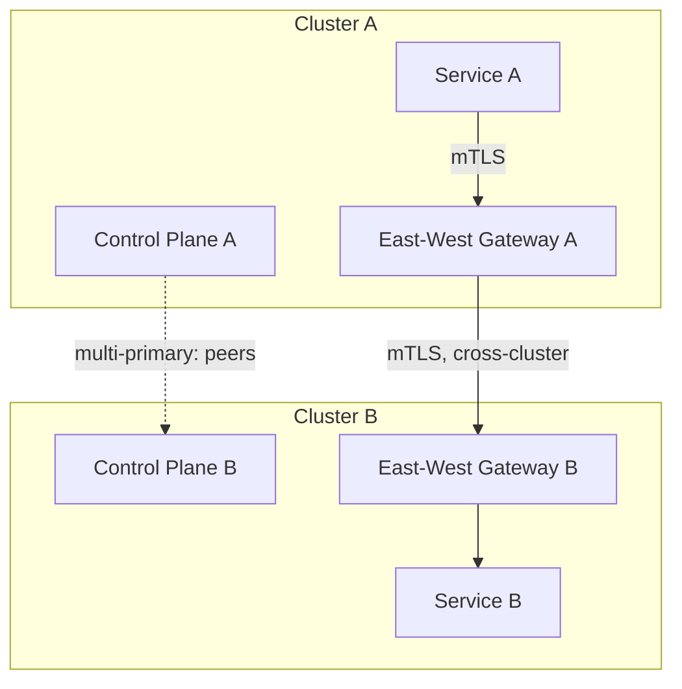
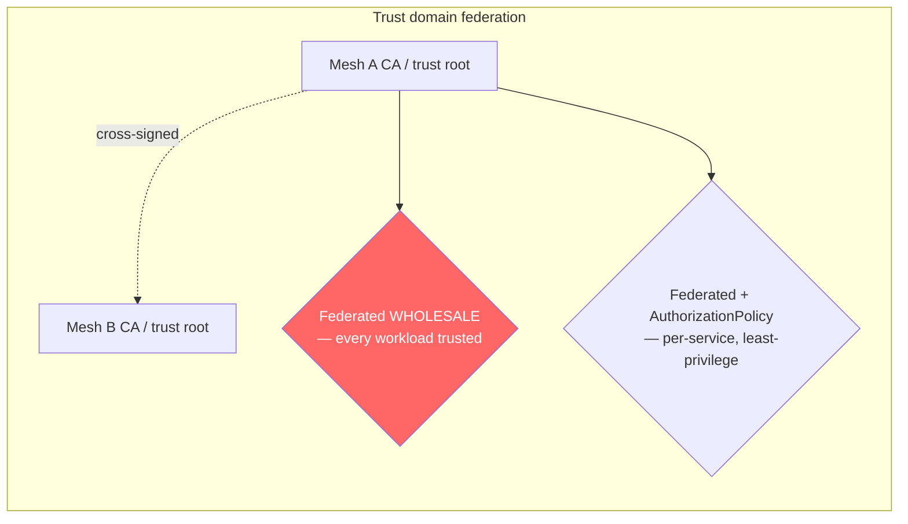
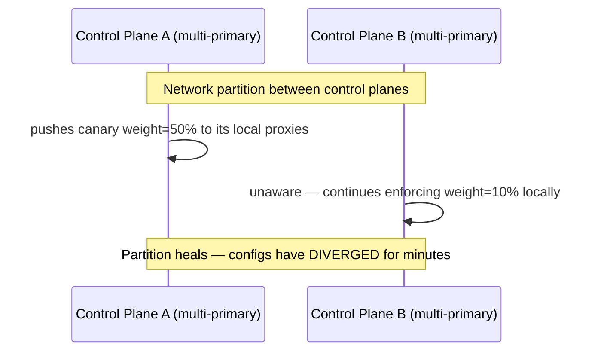
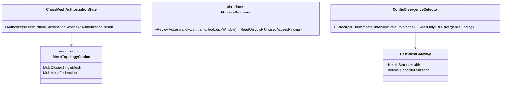

# Service Mesh — Complete Interview Prep (All Topics, One File)

> Domain: Service Mesh | Level: Beginner → Expert | Prerequisite: [[../23-Kubernetes/01-Kubernetes-Interview-Prep]] §11 (Istio/Linkerd basics, sidecars, ambient), [[../17-Microservices/00-Microservices-Interview-Master-Guide-DotNet-TechLead-Architect]] §21 (sidecar), §34 (zero trust), [[../38-API-Gateway/01-API-Gateway-Interview-Prep]]
> **Quick-prep edition** (consolidated 2026-10-03). This one file replaces Module 150. Original: `git show ebb2d5c:39-Service-Mesh/01-MultiCluster-MultiMesh-Federation-AdoptionGovernance.md`
> Each topic has: **Key concepts → YAML example → Most common interview questions with answers.**

| # | Topic | # | Topic |
|---|---|---|---|
| 1 | What a service mesh is | 6 | Observability from the mesh |
| 2 | Data plane vs control plane; sidecar vs ambient | 7 | Multi-cluster: single mesh vs federation |
| 3 | mTLS & workload identity (SPIFFE) | 8 | Trust domains, east-west gateways & cross-cluster discovery |
| 4 | Authorization policies | 9 | Adoption, migration & governance |
| 5 | Traffic management & resilience | 10 | Mesh choices & when not to use one |
| | | 11 | Top 20 rapid-fire + Principal · 12 Mistakes checklist |

---

## 1. What a Service Mesh Is

**Key concepts**
- An infrastructure layer that handles **service-to-service (east-west) communication** transparently: **mTLS** and identity, **authorization**, **traffic management** (routing, retries, timeouts, circuit breaking, traffic splitting, fault injection), and **telemetry** (golden signals, traces) — without changing application code.
- Moves cross-cutting network concerns out of each service's libraries into a uniform, centrally governed layer — valuable in large, polyglot estates.

**Common interview question**

**Q. What problems does a service mesh solve?**
Uniform zero-trust security (automatic mTLS, workload identity, service-level authorization), consistent traffic policy (timeouts, retries, canaries) and telemetry across all services and languages, managed centrally instead of re-implemented in every codebase.

---

## 2. Data Plane vs Control Plane; Sidecar vs Ambient

- **Data plane:** proxies (Envoy for Istio, linkerd2-proxy for Linkerd) that intercept traffic. **Control plane** (istiod, Linkerd control plane): distributes config, certificates and service discovery to proxies.
- **Sidecar model:** a proxy container per pod injected by a mutating webhook — full L7 features; costs CPU/memory per pod, extra latency per hop, startup ordering issues, upgrades require pod restarts.
- **Istio ambient mode:** per-node **ztunnel** handles L4 (mTLS, L4 authorization, telemetry); optional **waypoint proxies** per namespace/service for L7 policies → lower overhead, no pod restarts for mesh upgrades.
- **eBPF-based meshes** (Cilium) implement parts in the kernel.

**Common interview question**

**Q. Sidecar vs ambient mesh?**
Sidecars give every pod a full L7 proxy (rich features, higher resource and latency overhead, tight coupling to pod lifecycle). Ambient splits L4 (shared node proxy) and L7 (waypoints only where needed), cutting overhead and simplifying upgrades — at the cost of a newer, still-evolving model.

---

## 3. mTLS & Workload Identity (SPIFFE)

**Key concepts**
- The control plane acts as a CA issuing short-lived certificates to each workload; identity follows **SPIFFE** format: `spiffe://<trust-domain>/ns/<namespace>/sa/<service-account>`.
- **Modes:** `PERMISSIVE` (accept plaintext and mTLS — migration only) → `STRICT` (mTLS only). Leaving PERMISSIVE is a silent security gap.
- Automatic rotation; no app code changes; external CAs (Vault, cert-manager) for enterprise PKI integration.

```yaml
apiVersion: security.istio.io/v1
kind: PeerAuthentication
metadata: { name: default, namespace: istio-system }   # mesh-wide
spec: { mtls: { mode: STRICT } }
```

**Common interview question**

**Q. How do you migrate a running estate to STRICT mTLS safely?**
Inject proxies everywhere first, run PERMISSIVE while monitoring which connections are still plaintext (mesh telemetry), fix non-mesh clients (jobs, legacy VMs, external callers via gateways), then switch namespace by namespace to STRICT with rollback, and finally enforce mesh-wide.

---

## 4. Authorization Policies

```yaml
# Default deny in the namespace, then allow specific callers
apiVersion: security.istio.io/v1
kind: AuthorizationPolicy
metadata: { name: deny-all, namespace: payments }
spec: {}
---
apiVersion: security.istio.io/v1
kind: AuthorizationPolicy
metadata: { name: allow-orders, namespace: payments }
spec:
  selector: { matchLabels: { app: payments-api } }
  action: ALLOW
  rules:
  - from: [{ source: { principals: ["cluster.local/ns/orders/sa/orders-api"] } }]
    to:   [{ operation: { methods: ["POST"], paths: ["/api/v1/payments*"] } }]
    when: [{ key: request.auth.claims[scope], values: ["payments.write"] }]   # with RequestAuthentication for JWTs
```

- Mesh authorization is **service-level** (who may call which endpoint); **object-level** user authorization remains in the application.

---

## 5. Traffic Management & Resilience

- **Routing:** VirtualService/DestinationRule (Istio) or Gateway API `HTTPRoute` — weighted canaries, header-based routing, mirroring (shadow traffic).
- **Resilience:** timeouts, retries (bounded, only safe methods), outlier detection (ejecting failing endpoints ≈ circuit breaking), connection pool limits (bulkheads), fault injection for chaos tests.
- **Avoid double retries** (mesh + app) → retry amplification; decide one owner per concern.
- Per-request L7 load balancing fixes gRPC/HTTP2 connection pinning.

```yaml
apiVersion: networking.istio.io/v1
kind: DestinationRule
metadata: { name: payments-api, namespace: payments }
spec:
  host: payments-api
  trafficPolicy:
    connectionPool: { http: { http2MaxRequests: 1000, maxRequestsPerConnection: 100 } }
    outlierDetection: { consecutive5xxErrors: 5, interval: 10s, baseEjectionTime: 30s, maxEjectionPercent: 50 }
```

---

## 6. Observability from the Mesh

- Automatic golden signals per service pair (request rate, errors, latency), service graphs (Kiali), access logs, and trace spans per hop — **apps must still propagate trace headers** for end-to-end traces.
- Complements, not replaces, application telemetry (business metrics, internal spans).

---

## 7. Multi-Cluster: Single Mesh vs Federation

| Topology | What | When |
|---|---|---|
| **Multi-cluster single mesh** | one mesh (shared trust domain) spanning clusters; services discover each other across clusters | same organization/platform, need cross-cluster failover and load balancing |
| **Multi-mesh federation** | separate meshes with distinct trust domains, selectively exposing services | separate org units, regulatory isolation, different platforms |

- **Control-plane topologies (Istio):** **multi-primary** (control plane per cluster — resilient) vs **primary-remote** (one control plane serves remote clusters — simpler, but a dependency).
- Network models: flat network (pods routable across clusters) vs **east-west gateways** bridging separate networks.

**Common interview question**

**Q. Multi-cluster single mesh or federation?**
Single mesh when clusters belong to one platform and you want transparent cross-cluster discovery and failover. Federation when meshes are owned by different teams/organizations or must stay isolated (compliance), exposing only selected services across trust boundaries.

---

## 8. Trust Domains, East-West Gateways & Cross-Cluster Discovery

- **Trust domain federation:** meshes trust each other's CAs (shared root or cross-signing) — scope it **narrowly** (only specific identities/services) because a broad trust relationship enlarges the blast radius.
- **East-west gateway:** the controlled bridge for cross-network service traffic (mTLS passthrough) — the synchronous analogue of an event-replication link.
- **Cross-cluster discovery** has its own lag and staleness: endpoints in remote clusters may be outdated → health checks, locality-aware load balancing with failover priorities.
- **Mesh federation ≠ event replication:** the mesh handles synchronous calls across clusters; event backbones (Kafka MirrorMaker/cluster linking) handle async data — you typically need both, each with its own failure modes.

```yaml
# Locality failover: prefer same zone/region, fail over to the other region
trafficPolicy:
  outlierDetection: { consecutive5xxErrors: 3, interval: 5s, baseEjectionTime: 30s }
  loadBalancer:
    localityLbSetting:
      enabled: true
      failover: [{ from: eu-west-1, to: eu-central-1 }]
```

---

## 9. Adoption, Migration & Governance

- **Adopt incrementally:** start with observability and mTLS PERMISSIVE in one namespace; then STRICT; then authorization policies (audit → enforce); then traffic policies.
- **Platform ownership:** a platform team runs the mesh (upgrades, CA, config); app teams own their routes/policies via GitOps with guardrails (Kyverno/OPA validating mesh CRDs).
- **Upgrades:** canary control-plane revisions (Istio revision-based upgrades), test data-plane compatibility, roll namespaces gradually.
- **Governance risks:** policy sprawl, PERMISSIVE left on, conflicting retry policies, mesh config drift — audit with policy reports and periodic verification that enforcement actually works (attempt forbidden calls in tests).

**Common interview question**

**Q. How would you roll out a service mesh to 200 services?**
Platform team owns it; start with a pilot namespace (telemetry + PERMISSIVE mTLS), measure overhead, build golden-path configs and docs, onboard namespaces in waves via automated injection, switch to STRICT mTLS and default-deny authorization progressively with audit mode first, set guardrails for app-team policies, and verify enforcement continuously.

---

## 10. Mesh Choices & When Not to Use One

| Mesh | Strengths | Trade-offs |
|---|---|---|
| **Istio** (sidecar or ambient) | richest features, multi-cluster, ecosystem | complexity, resource overhead (less in ambient) |
| **Linkerd** | simple, lightweight Rust proxy, secure by default | fewer advanced traffic features; licensing changes for stable releases |
| **Cilium Service Mesh** | eBPF, integrates with CNI/NetworkPolicy, Hubble observability | L7 features still require proxies; evolving |
| **Consul** | multi-platform (VMs + K8s), service discovery | HashiCorp ecosystem |
| **AWS App Mesh** | — | being discontinued (end of support 2026) → VPC Lattice / ECS Service Connect |
| **Dapr** | app runtime building blocks (not a network mesh) | different problem |

**Don't use a mesh when:** a few services, a single language with good libraries (Polly/resilience handlers + OTel), no platform team, or latency/resource budgets can't absorb proxies — Kubernetes NetworkPolicies + application mTLS/OAuth may suffice.

**Common interview question**

**Q. When would you not adopt a service mesh?**
For small estates or teams without the capacity to operate it: libraries handle resilience and telemetry, NetworkPolicies handle segmentation, OAuth client credentials handle service auth. Adopt a mesh when uniform mTLS/policy across many polyglot services and a platform team justify the operational cost.

---

## 11. Top 20 Rapid-Fire Questions + Principal Questions

1. **Mesh purpose?** East-west security, traffic, telemetry.
2. **Data plane?** Proxies (Envoy, linkerd2-proxy).
3. **Control plane?** Config + certificates + discovery.
4. **Sidecar cost?** CPU/memory per pod, latency, restarts.
5. **Ambient?** ztunnel L4 + waypoint L7.
6. **Identity format?** SPIFFE.
7. **PERMISSIVE risk?** Plaintext still accepted.
8. **Authorization level?** Service-level, not object-level.
9. **Default deny?** Empty AuthorizationPolicy, then allows.
10. **Retries?** One layer only.
11. **Circuit breaking?** Outlier detection.
12. **gRPC balancing?** Per-request L7.
13. **Mesh telemetry?** Golden signals; apps propagate trace headers.
14. **Single mesh vs federation?** Shared trust vs isolated meshes.
15. **Multi-primary?** Control plane per cluster.
16. **East-west gateway?** Cross-network bridge.
17. **Trust federation scope?** Narrow.
18. **Mesh vs event replication?** Sync calls vs async data — need both.
19. **Upgrades?** Revision-based canaries.
20. **App Mesh?** Deprecated → alternatives.

**Principal-level question**

**P. What can a mesh not protect you from?**
Business-level authorization flaws (BOLA), bad application retries and timeouts outside mesh control, data-layer failures, misconfigured policies that silently allow too much, and overload that needs application load shedding. It's one layer of defence and traffic control, not a substitute for secure, resilient services.

---

## 12. Mistakes Checklist (say why each is wrong)
- [ ] Leaving mTLS PERMISSIVE · broad trust-domain federation
- [ ] Relying on the mesh for object-level authorization
- [ ] Mesh retries stacked on app retries · retrying non-idempotent calls
- [ ] Big-bang mesh rollout · no platform owner · untested upgrades
- [ ] Assuming applied policies are enforced without verification
- [ ] Adopting a mesh for a handful of services without operational capacity

---

## Architecture Diagrams (preserved from the original modules)

> All 5 Mermaid/ASCII diagrams from the original `39-Service-Mesh/` files, kept verbatim and grouped by source module. Originals: `git show ebb2d5c:39-Service-Mesh/<file>.md`.

### Module 150 — Service Mesh: Multi-Cluster & Multi-Mesh Federation at Scale
*Source: `01-MultiCluster-MultiMesh-Federation-AdoptionGovernance.md`*

**1. Fundamentals**

```text
Cluster A (mesh, trust root A) ──east-west gateway──► Cluster B (mesh, trust root A or B?)
 │ │
 Control plane A Control plane A or B?
 (multi-primary: peers with B; (primary-remote: B has no
 primary-remote: A is authoritative) control plane of its own)
 │ │
 └──────── cross-cluster service discovery ───────────────┘
 (its own lag/staleness risk, the pattern recurring)
```

**3. Visual Architecture**



**3. Visual Architecture**



**3. Visual Architecture**



**13. Low-Level Design**


