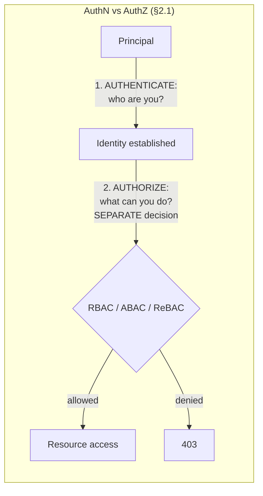
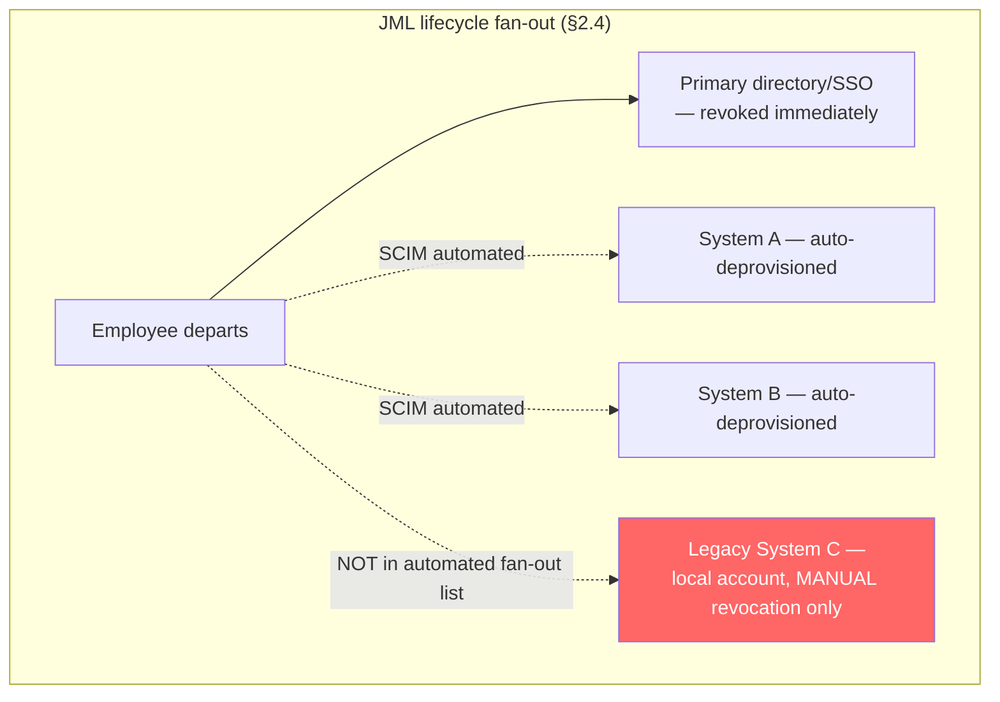
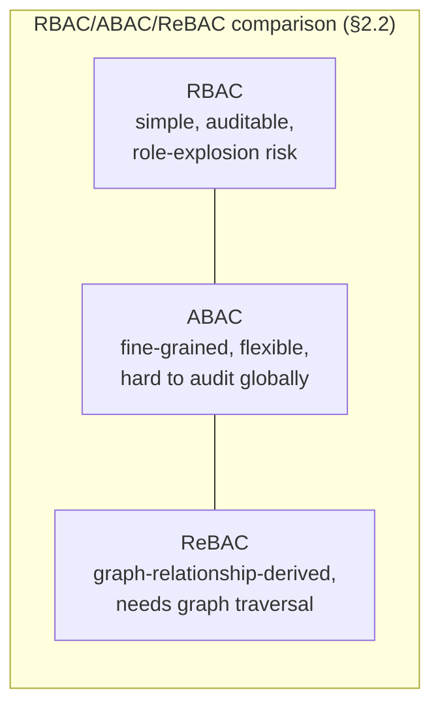
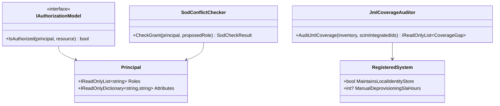

# Module 151 — Identity & Access Management: Fundamentals — Authentication, Authorization Models, Directory Services & Federation

> Domain: IAM | Level: Beginner → Expert | Prerequisite: [[../39-Service-Mesh/01-MultiCluster-MultiMesh-Federation-AdoptionGovernance]] §4 (which closed by naming this domain's central distinction — authentication ≠ authorization — as its own contribution; this module develops that distinction into its full, general treatment), [[../21-AWS/02-IAM-Security-KMS-SecretsManager]] and [[../22-Azure/02-IAM-Security-EntraID-RBAC-KeyVault]] (cloud-provider-specific IAM services, not re-derived here), [[../23-Kubernetes/04-Configuration-Security-ConfigMaps-Secrets-RBAC-PodSecurity]] (Kubernetes-specific RBAC, not re-derived here)

>
> **Scope note:** `40-IAM` scoped as two modules (151-152), autonomously, per the standing "no more waiting" workflow decision. This module covers vendor-neutral, enterprise-wide identity architecture — the discipline underlying every cloud- and platform-specific IAM implementation this course has already covered, not a re-derivation of any of them. OAuth2/OIDC/JWT/PKCE protocol mechanics are deliberately deferred to Module 41, immediately following.

---

## 1. Fundamentals

**What:** Identity & Access Management — the discipline of establishing who a principal is (**authentication**) and, as a distinct, subsequent decision, what that principal is allowed to do (**authorization**), plus the surrounding directory infrastructure, federation protocols, and lifecycle processes that make both questions answerable correctly and consistently across an entire enterprise, not just within one system.

**Why:** Every cloud- and platform-specific IAM system this course has covered — AWS IAM (Module 58), Azure Entra ID (Module 66), Kubernetes RBAC (Module 76) — is an *implementation* of this discipline within one specific provider's boundary. Module 150 §4's incident closed by naming the single most consequential, most commonly conflated distinction in this entire domain: establishing trust (authentication) is not the same as scoping what that trust permits (authorization), and an organization that conflates the two inherits exactly that incident's failure shape at whatever scale it operates.

**When:** Any system distinguishing more than one kind of principal (human users, service accounts, machine identities) or more than one level of access — which, for any enterprise system this course's Elite FinTech Interview Panel lens has assumed throughout, is universal.

**How (30,000-ft view):**
```
Principal ──authenticates──► Identity established (who)
                                       │
                    Identity federated/synchronized across systems
                    (directory services, SCIM provisioning, §2.3)
                                       │
                              ──authorizes──► Access decision (what)
                                       │              (RBAC / ABAC / ReBAC, §2.2)
                              Access must be REVOKED
                              on role change or departure
                              (JML lifecycle, §2.4)
```

---

## 2. Deep Dive

### 2.1 Authentication vs. Authorization — Precisely, and Why Conflating Them Is This Domain's Central Failure Mode
**Authentication (AuthN)** answers "who are you" — verified via something the principal *knows* (a password), *has* (a hardware token, a mobile device), or *is* (biometrics), or some combination. **Authorization (AuthZ)** answers "what are you allowed to do" — a separate, subsequent decision made *after* identity is established, evaluated against a policy (RBAC, ABAC, or ReBAC, §2.2) specific to the resource being accessed. Module 150 §4's incident is the precise, concrete failure of conflating these: cross-mesh trust federation established *authentication* (any federated workload could prove its identity), and the team implicitly, incorrectly treated that as if it also answered *authorization* (which specific calls should actually be permitted) — the identical conflation recurs constantly at the human-identity layer this module addresses, and is the single most common root cause of both over-provisioned access (this module's §4) and, in the opposite direction, unnecessarily brittle systems that re-authenticate when they only actually needed to re-authorize.

### 2.2 Authorization Models — RBAC, ABAC, and ReBAC
- **RBAC (Role-Based Access Control)** — permissions are grouped into roles, and principals are assigned roles. Simple to audit ("who has the Trader role"), coarse-grained, and prone to **role explosion** at scale — a large enterprise accumulates hundreds or thousands of narrowly-tailored roles as teams request ever-more-specific access combinations, eventually undermining the very auditability RBAC's simplicity was meant to provide.
- **ABAC (Attribute-Based Access Control)** — access decisions evaluate policies against *attributes* of the principal, resource, and context (e.g., "allow if `user.department == resource.department AND time.hour in business_hours`"). Materially more flexible and fine-grained than RBAC, expressed as policy-as-code — and, critically, **harder to audit globally**, since understanding "who can access X" requires evaluating a policy against every possible attribute combination rather than reading a role-assignment list, and a subtle policy-logic bug (§14) can silently, broadly misgrant or misdeny access with no obvious symptom.
- **ReBAC (Relationship-Based Access Control)** — access is derived from *relationships* in a graph (e.g., "user can view document X because they are a member of team Y, which owns X" — the model popularized by Google's Zanzibar and implemented in tools like OpenFGA). Powerful for complex, nested sharing models (documents, folders, organizational hierarchies) that RBAC and ABAC both express awkwardly, at the cost of requiring graph-traversal evaluation rather than simple policy or role lookup.

No model is universally superior; §15 develops the common, pragmatic hybrid — RBAC as a coarse, auditable outer gate, with ABAC or ReBAC layered on top for fine-grained, contextual exceptions.

### 2.3 Directory Services and Federation — LDAP/Active Directory, SAML, and SCIM
**LDAP/Active Directory** remains the dominant enterprise identity *store* — the authoritative record of who exists and their basic attributes. **SAML (Security Assertion Markup Language)** is the traditional, still-dominant enterprise B2B and workforce SSO federation protocol — a browser-redirect-based, XML-assertion mechanism by which an Identity Provider (IdP) vouches for a user's identity to a Service Provider (SP), predating and still coexisting alongside OIDC's newer dominance in consumer and API contexts (Module 41's subject). **SCIM (System for Cross-domain Identity Management)** is the standard protocol for *automated* user provisioning and deprovisioning across systems — solving the specific, consequential problem of a user's access needing to propagate to, and be revoked from, every downstream system that maintains its own local identity record, not only the primary directory.

### 2.4 The Joiner-Mover-Leaver (JML) Lifecycle — Deprovisioning as the Actual Hard Problem
Access accumulates over a "mover" employee's career as they change roles, frequently without a corresponding revocation of the access their *previous* role required — **privilege creep**, an authorization-layer analogue to Module 150 §4's unused-but-present trust exposure, now accruing gradually over a human identity's entire tenure rather than arising from a single federation decision. A "leaver" event must trigger deprovisioning across *every* system the individual had access to — and the entire discipline's actual difficulty lives specifically in ensuring that fan-out is genuinely complete, not merely propagated to whichever systems happen to be integrated with the primary directory's automated JML process, exactly §4's incident.

### 2.5 Multi-Factor and Phishing-Resistant Authentication
Authentication factors are commonly categorized as something you *know* (password), *have* (a hardware token, a mobile device), or *are* (biometrics) — multi-factor authentication (MFA) combines two or more. SMS-based one-time passcodes, while better than password-alone, are now considered a weak second factor given SIM-swap attack prevalence; **FIDO2/WebAuthn** hardware security keys provide genuinely **phishing-resistant** authentication, since the cryptographic challenge-response is bound to the legitimate origin at the protocol level, defeating credential-relay phishing techniques that can still trick even a TOTP-based second factor into being relayed to an attacker's session.

### 2.6 Segregation of Duties — an Authorization Constraint Over Role *Assignment*, Not Just Role *Enforcement*
Segregation of Duties (SoD), a specifically financial-services-consequential requirement, states that no single individual should hold two conflicting roles or permissions that, combined, enable fraud (the canonical example: the ability to both create a vendor record and approve a payment to that vendor). This is a fundamentally different kind of authorization concern than RBAC/ABAC/ReBAC's per-request enforcement correctness — SoD requires a control evaluated **at grant time, over the combination of everything a principal already holds**, catching a conflicting *assignment* before it's ever exercised, not merely correctly enforcing any single permission in isolation at the moment it's used.

---

## 3. Visual Architecture







---

## 4. Production Example

**Problem:** A financial firm's identity team operated a mature, SCIM-integrated JML process: departures triggered immediate primary-directory revocation and automated deprovisioning fan-out to every SCIM-integrated downstream system.

**Architecture:** A comprehensive-looking automated deprovisioning pipeline covering the firm's SSO-integrated application estate, correctly tested and functioning for every system within its scope.

**Implementation:** A legacy trade-settlement reporting tool, onboarded years before the current SCIM-based JML process existed, maintained its own local, directory-disconnected user table — never migrated onto automated provisioning, requiring manual, ticket-driven account removal, and — critically — never explicitly included in the automated JML fan-out list's own inventory, since no one on the current identity team had direct institutional knowledge the tool even existed with its own separate identity store.

**Trade-offs:** Deferring the legacy tool's migration to automated provisioning had been a deliberate, resource-prioritization decision years earlier — the tool's low usage volume made it a low priority relative to higher-traffic systems, a reasonable trade-off at the time it was made.

**Lessons learned:** A reduction-in-force event triggered many simultaneous departures. Every departing employee's primary-directory access was correctly, immediately revoked, and every SCIM-integrated downstream system correctly, automatically deprovisioned their access — the automated JML process functioned exactly as designed for everything within its own inventory's scope. The legacy settlement-reporting tool, however, was not in that inventory at all, and its manual, ticket-driven deprovisioning process — dependent on someone specifically remembering the tool existed and generating a ticket for it — simply never triggered for any of the departed employees, since the automated fan-out that would normally have prompted such a ticket had no record of the tool to begin with.

Several departed employees retained active, valid local credentials to the settlement-reporting tool for months. No breach occurred, and no unauthorized access was ever exercised — this incident is entirely about undetected, unexploited excess access, this domain's own precise instance of this course's recurring silent-failure shape, here manifesting at the human-identity-lifecycle layer rather than any technical system's own internal state. Detection came from a periodic access-certification review — a scheduled process requiring each system owner or manager to formally attest that a listed set of individuals' access to their system remained correct and necessary — during which a manager reviewing the settlement-reporting tool's access list flagged a departed employee's name as obviously, immediately wrong.

The fix had three parts. **First**, a comprehensive, centrally-maintained inventory of *every* system maintaining its own local identity store was built and mandated — not assumed automatically complete by virtue of being covered by the primary SSO/JML automated fan-out, precisely because §4 shows that assumption is exactly where the gap lived. **Second**, every inventoried system was migrated to SCIM-based automated provisioning and deprovisioning wherever technically feasible; for any system genuinely unable to support it (a truly legacy, minimally-maintained tool), an explicit, documented compensating control was established — an accelerated, mandatory manual-deprovisioning SLA triggered directly by the JML process's own departure event (rather than depending on ad hoc institutional memory), paired with a materially more frequent access-certification cadence specifically for that system. **Third**, periodic access certification itself was elevated from a compliance-calendar exercise to a permanent, standing backstop — directly reusing this course's now-repeatedly-established "permanent reconciliation" principle (Module 122 §14, Module 143 Advanced Q1), here applied to human access rather than financial or event data.

The generalizable lesson: **an automated deprovisioning process's completeness is only as good as its own inventory of what it covers, and a system silently absent from that inventory produces exactly the same undetected-excess-access risk as a system whose deprovisioning logic is present but broken — the fix for both is the identical, permanent, human-verified backstop this course has established as necessary wherever a fully-automated, structural guarantee is not achievable.**

---

## 5. Best Practices
- Maintain a comprehensive, centrally-owned inventory of every system with its own local identity store, never assuming a system is automatically covered by the primary directory's JML fan-out without explicit verification (§4).
- Treat RBAC's role assignments, ABAC's policies, and ReBAC's relationship graphs each with the testing rigor appropriate to code, since all three are, functionally, code determining access (§2.2, §14).
- Layer fine-grained ABAC or ReBAC exceptions on top of a coarse, auditable RBAC outer gate rather than choosing one model exclusively, for most enterprise authorization needs (§15).
- Enforce Segregation of Duties as a grant-time control over the combination of everything a principal already holds, not merely correct per-request enforcement of any single permission (§2.6).
- Adopt FIDO2/WebAuthn hardware-key authentication for any principal with access to genuinely consequential systems, given SMS OTP's demonstrated weakness against SIM-swap attacks (§2.5).
- Treat periodic access certification as a permanent, standing backstop — never a one-time or purely compliance-calendar exercise — since it is precisely what caught §4's incident when every automated mechanism's own scope silently excluded the affected system.

## 6. Anti-patterns
- Assuming a departing employee's access is fully revoked because their primary directory/SSO account was deprovisioned, without verifying every downstream system's own local identity store is included in that revocation (§4's incident).
- Conflating authentication (establishing identity) with authorization (scoping what that identity may do) — the same conflation Module 150 §4 demonstrated at the mesh-trust layer, recurring at the human-identity layer.
- Treating ABAC policy changes as configuration tweaks exempt from the testing rigor applied to application code, missing that a subtle logic error can silently, broadly misgrant access (§14).
- Choosing RBAC exclusively for a system with genuinely complex, nested sharing requirements, producing unmanageable role explosion as teams request ever-narrower role variants.
- Choosing ABAC or ReBAC exclusively for a system where simple, auditable role assignment would suffice, incurring unnecessary policy-evaluation complexity and audit difficulty.
- Treating access certification as a compliance checkbox exercise rather than a genuine, periodic verification backstop capable of catching gaps no automated mechanism's own scope covers.

---

## 7. Performance Engineering

**CPU/Memory:** ABAC and ReBAC policy evaluation are computationally more expensive per authorization decision than RBAC's simple role lookup, particularly for ReBAC's graph-traversal evaluation over deeply-nested relationship chains.

**Latency:** Authorization decisions sit on the critical path of every protected request; a poorly-indexed ReBAC relationship graph or an inefficiently-evaluated ABAC policy set can become a meaningful contributor to overall request latency at scale, warranting the same caching and precomputation strategies applied to any other latency-sensitive lookup.

**Throughput:** Centralized policy-decision points (a shared authorization service every request calls) can become a throughput bottleneck at sufficient scale, mirroring Module 148's storage-engine capacity-planning lesson applied to an authorization service specifically.

**Scalability:** RBAC's role-explosion risk is itself a scalability concern for the *human* process of managing access, distinct from any technical performance concern — thousands of narrowly-tailored roles become unmanageable to review and certify, undermining RBAC's own core auditability benefit.

**Benchmarking:** Benchmark authorization-decision latency under realistic policy-set size and relationship-graph depth, not a minimal test configuration, since ABAC and ReBAC's evaluation cost scales with policy/graph complexity in ways a small test set would understate.

**Caching:** Authorization decisions are frequently cacheable for a short, bounded window — trading a small staleness risk (a just-revoked permission remaining effective for the cache's TTL) against materially reduced authorization-service load, requiring the identical bounded-staleness discipline this course has established for every other caching layer.

---

## 8. Security

**Threats:** Privilege creep from unrevoked "mover" access (§2.4); undetected excess access from incomplete JML deprovisioning fan-out (§4); phishing-vulnerable authentication factors (SMS OTP, §2.5); silently-misconfigured ABAC policies granting unintended broad access (§14); Segregation-of-Duties violations enabling fraud via a single principal's combined role assignments (§2.6).

**Mitigations:** Comprehensive system inventory and SCIM-based automated deprovisioning wherever feasible, with compensating controls for legacy exceptions (§4); phishing-resistant FIDO2/WebAuthn authentication for consequential access (§2.5); policy-as-code testing discipline for ABAC/ReBAC changes (§14); grant-time SoD conflict-checking (§2.6).

**OWASP mapping:** Broken access control if authentication and authorization are conflated (§2.1); identification and authentication failures if weak MFA factors are relied upon (§2.5); security misconfiguration if policy-as-code changes bypass testing rigor (§14).

**AuthN/AuthZ:** This module's central subject; the precise distinction (§2.1) and its three authorization-model implementations (§2.2) are the core mechanism every other security control in this course's IAM-adjacent content ultimately depends on.

**Secrets:** Directory service credentials and SCIM integration API keys require the highest-tier protection, since their compromise would undermine identity-lifecycle integrity across every integrated downstream system.

**Encryption:** Standard in-transit protection for SAML assertions and SCIM provisioning API calls; SAML assertions specifically should be signed and, where sensitive attributes are included, encrypted, to prevent tampering or interception during the browser-redirect federation flow.

---

## 9. Scalability

**Horizontal scaling:** A centralized authorization/policy-decision service scales horizontally like any other stateless service, with policy/relationship-graph data itself requiring its own scaling strategy (§7).

**Vertical scaling:** Helps individual policy-evaluation latency for compute-intensive ABAC/ReBAC decisions.

**Caching:** §7 — bounded-staleness authorization-decision caching as the primary throughput lever.

**Replication/Partitioning:** Directory services and relationship graphs typically replicate for read availability, inheriting Module 146's consistency-model considerations — a stale replica's authorization decision could reflect a just-revoked permission as still valid, requiring the same bounded-staleness discipline as any other PA/EL-classified read path.

**Load balancing:** Authorization-decision requests distribute across policy-evaluation service replicas; session/authentication state (for stateful SSO flows) may require sticky routing depending on the federation protocol's specific mechanics.

**High Availability:** An unavailable authorization service is, functionally, either a fail-open (dangerous — grants access without evaluation) or fail-closed (safer, but denies legitimate access) design decision — this course's established CP-favoring precedent (Module 118) strongly favors fail-closed for any consequential resource.

**Disaster Recovery:** Directory service and policy-store replication to a DR region inherits Module 142's full RPO/RTO discipline — a DR failover serving stale authorization data risks either denying legitimate access or, more dangerously, granting access that had been revoked shortly before the failover.

**CAP theorem:** Authorization decisions for consequential resources should favor consistency (PC/EC, Module 146) over availability — a stale-but-available authorization check risks granting access a more current state would have denied, the opposite failure direction from most PA/EL use cases this course has covered.

---

## 10. Interview Questions

### Basic (10)

1. **Q: What's the precise difference between authentication and authorization?**
   **A:** Authentication establishes who a principal is; authorization, a separate and subsequent decision, determines what that established identity is allowed to do (§2.1).
   **Why correct:** States both definitions and their sequential, distinct nature.
   **Common mistakes:** Treating the two as a single combined step, or assuming establishing identity automatically implies a scope of permitted access.
   **Follow-ups:** "Where in this course has conflating the two produced a real incident?" (Module 150 §4 — cross-mesh trust federation established authentication only, mistaken for authorization, producing a five-month undetected access exposure.)

2. **Q: What is RBAC, and what is its main scalability risk?**
   **A:** Role-Based Access Control groups permissions into roles assigned to principals; its main risk at scale is role explosion — accumulating hundreds or thousands of narrowly-tailored roles as teams request ever-more-specific combinations, undermining the auditability RBAC's simplicity was meant to provide (§2.2).
   **Why correct:** Defines RBAC and names its specific scaling failure mode.
   **Common mistakes:** Assuming RBAC scales indefinitely without this risk, missing that role proliferation is a common, well-documented enterprise IAM failure pattern.
   **Follow-ups:** "What mitigates role explosion?" (Layering ABAC or ReBAC for fine-grained exceptions on top of a smaller, coarser RBAC role set, §15.)

3. **Q: What is ABAC, and why is it harder to audit than RBAC?**
   **A:** Attribute-Based Access Control evaluates policies against attributes of the principal, resource, and context; it's harder to audit because "who can access X" requires evaluating a policy against every possible attribute combination, rather than reading a simple role-assignment list (§2.2).
   **Why correct:** Defines ABAC and precisely states the auditability trade-off.
   **Common mistakes:** Assuming ABAC's flexibility is a strictly superior property with no corresponding cost.
   **Follow-ups:** "What incident in this module demonstrates ABAC's audit risk concretely?" (§14 — a policy-migration logic error silently granted broad after-hours access for weeks before a compliance scan caught it.)

4. **Q: What is ReBAC, and what kind of access model is it best suited for?**
   **A:** Relationship-Based Access Control derives access from relationships in a graph (e.g., team membership implying document access); it's best suited for complex, nested sharing models RBAC and ABAC both express awkwardly (§2.2).
   **Why correct:** Defines ReBAC and names its distinguishing use case.
   **Common mistakes:** Assuming ReBAC is simply "more advanced ABAC," missing that its underlying evaluation mechanism (graph traversal) is structurally distinct.
   **Follow-ups:** "Name a well-known real-world implementation of this model." (Google's Zanzibar, and open-source implementations like OpenFGA, §2.2.)

5. **Q: What is SCIM, and what problem does it solve?**
   **A:** System for Cross-domain Identity Management — a standard protocol for automated user provisioning and deprovisioning across systems, solving the problem of access needing to propagate to, and be revoked from, every downstream system with its own local identity record, not only the primary directory (§2.3).
   **Why correct:** Defines SCIM and its specific, consequential purpose.
   **Common mistakes:** Assuming primary-directory deprovisioning alone is sufficient, missing that downstream systems maintaining local accounts need their own, separately-triggered revocation.
   **Follow-ups:** "What happens when a system isn't SCIM-integrated?" (§4's incident — manual, ticket-driven deprovisioning that can silently fail to trigger if the system isn't in anyone's tracked inventory.)

6. **Q: What is the Joiner-Mover-Leaver lifecycle, and why is "Mover" a distinct risk from "Leaver"?**
   **A:** The full lifecycle of an employee's identity and access — onboarding, role changes, and departure; "Mover" is distinct because a role change frequently adds new access without revoking the previous role's access, producing privilege creep that accumulates silently over a career, distinct from a "Leaver" event's single, larger deprovisioning need (§2.4).
   **Why correct:** States all three lifecycle stages and precisely distinguishes the Mover-specific risk.
   **Common mistakes:** Focusing only on Leaver-stage deprovisioning, missing that Mover-stage privilege creep is an equally real, if more gradual, excess-access risk.
   **Follow-ups:** "What control specifically catches privilege creep?" (Periodic access certification — the same mechanism that caught §4's Leaver-stage gap also catches Mover-stage creep, §4's fix.)

7. **Q: What went wrong in §4's incident, at a high level?**
   **A:** A legacy settlement-reporting tool maintained its own local identity store, never migrated to automated SCIM provisioning and never included in the automated JML deprovisioning fan-out's inventory — so several departed employees retained active credentials for months, discovered only by a periodic access-certification review, with no breach or exploitation ever occurring (§4).
   **Why correct:** States the mechanism and the detection method.
   **Common mistakes:** Assuming this was a failure of the automated deprovisioning process itself, when the process functioned correctly for everything within its own, incomplete inventory.
   **Follow-ups:** "What was the structural fix?" (A comprehensive, centrally-maintained system inventory, plus compensating controls for any system that can't support automated provisioning, §4's fix.)

8. **Q: Why is SMS-based one-time-passcode MFA now considered weak?**
   **A:** SIM-swap attacks let an attacker redirect a victim's phone number to a device they control, defeating the "something you have" assumption the SMS factor depends on (§2.5).
   **Why correct:** States the specific attack vector undermining the factor's assumed security property.
   **Common mistakes:** Assuming any second factor is equivalently strong regardless of its specific mechanism.
   **Follow-ups:** "What's a genuinely phishing-resistant alternative?" (FIDO2/WebAuthn hardware security keys, whose cryptographic challenge-response is bound to the legitimate origin, §2.5.)

9. **Q: What is Segregation of Duties, and why is it a different kind of control than standard RBAC/ABAC enforcement?**
   **A:** SoD requires that no single individual hold two conflicting roles or permissions that together enable fraud; unlike standard authorization enforcement (correct at the moment of each request), SoD must be evaluated at grant time, over the combination of everything a principal already holds (§2.6).
   **Why correct:** States the definition and precisely distinguishes it from per-request authorization correctness.
   **Common mistakes:** Assuming correctly-enforced individual permissions automatically prevent SoD violations, missing that the risk is specifically in the *combination* of permissions, not any single one.
   **Follow-ups:** "Give the canonical financial-services SoD example." (The ability to both create a vendor record and approve a payment to that vendor, §2.6.)

10. **Q: Why did periodic access certification, rather than any automated mechanism, catch §4's incident?**
    **A:** Because the automated JML deprovisioning process's own inventory never included the affected legacy system, so nothing about the automated pipeline could have surfaced a gap in what it didn't know to cover — only a human, manager-level attestation reviewing the actual access list caught the obviously-wrong departed employee's continued presence (§4).
    **Why correct:** States why the specific detection mechanism was necessary given the automated process's own scope limitation.
    **Common mistakes:** Assuming a sufficiently comprehensive automated system would never need this human backstop, missing that the automated system's completeness is itself unverifiable by the automated system alone.
    **Follow-ups:** "What prior-module pattern does this recur?" (Permanent, human-or-independently-verified reconciliation as the backstop for structural mechanisms that cannot fully self-verify — Module 122 §14, Module 143 Advanced Q1.)

### Intermediate (10)

1. **Q: Walk through why §4's incident wasn't caused by any bug in the automated deprovisioning system.**
   **A:** The automated pipeline correctly, immediately deprovisioned every system within its own tracked inventory for every departed employee — it performed exactly as designed for its actual scope. The failure was in the scope itself being incomplete, not in any logic error within the pipeline's operation on the systems it did track — the settlement-reporting tool was simply invisible to the process, not incorrectly handled by it.
   **Why correct:** Precisely locates the failure as an inventory-completeness gap, not a pipeline-logic defect.
   **Common mistakes:** Searching for a bug in the automated deprovisioning logic itself, when the logic was correct for everything it was actually told to cover.
   **Follow-ups:** "How does this parallel Module 144's own testing-coverage findings?" (Directly — a testing pyramid's coverage is only as good as its own scope, and a system genuinely absent from that scope produces the identical undetected-gap risk as a tested-but-buggy one, Module 144 Expert Q8's topology-change-outrunning-coverage finding.)

2. **Q: Design the system-inventory process §4's fix requires.**
   **A:** A centrally-owned, mandatory registration process for any new system provisioning its own local identity store — treated as a required step in that system's own onboarding, not an optional best practice — plus a retroactive audit of the existing estate specifically searching for systems with local identity stores not currently represented in the JML automated fan-out's own configuration, since §4 shows a purely forward-looking process alone would have missed the pre-existing gap.
   **Why correct:** Specifies both the forward-looking (mandatory registration) and backward-looking (retroactive audit) components necessary to close the actual gap §4 exposed.
   **Common mistakes:** Implementing only the forward-looking registration process, leaving the pre-existing, undiscovered legacy systems' gap unaddressed.
   **Follow-ups:** "How would the retroactive audit actually discover an undocumented local identity store?" (Network/infrastructure scanning for authentication endpoints or local user databases not registered with the central identity team, combined with soliciting inventory from every application team directly, since institutional knowledge alone — as §4 shows — cannot be relied upon.)

3. **Q: Critique treating RBAC role assignment as a purely administrative, non-technical process exempt from change-review rigor.**
   **A:** A role assignment is functionally a grant of capability exactly as consequential as a code change granting a new permission — treating it as "just an admin task" misses that an incorrectly-scoped role (too broad, or missing an SoD conflict check) has the identical consequence as a code-level authorization bug, warranting the same review rigor (a second approver, an automated SoD-conflict check) this course applies to any other consequential change.
   **Why correct:** Identifies that role assignment's administrative *appearance* doesn't reduce its actual consequence, and specifies what rigor should apply.
   **Common mistakes:** Treating IAM administrative actions as inherently lower-risk than application code changes, missing that both are equally capable of producing serious access-control failures.
   **Follow-ups:** "What would an automated SoD-conflict check at grant time look like?" (A policy engine evaluating a proposed role assignment against every SoD rule and the principal's existing role set, blocking the assignment if a conflict is detected — directly reusing §2.6's grant-time evaluation principle as an enforced, not merely documented, control.)

4. **Q: How does the choice between RBAC, ABAC, and ReBAC change for a system with a genuinely hierarchical, nested sharing model (e.g., a document-management system with folders, sub-folders, and inherited permissions)?**
   **A:** RBAC expresses this awkwardly — a role would need to exist per folder or sharing scenario, reproducing role explosion rapidly as the folder hierarchy grows; ABAC can express inheritance via attribute rules but requires careful policy design to correctly model hierarchical inheritance without becoming unmanageably complex; ReBAC is architecturally the best fit, since folder/sub-folder/permission-inheritance relationships map directly onto its native graph-relationship model, which is precisely the class of problem Zanzibar-style systems were built to solve.
   **Why correct:** Evaluates all three models against the specific access-pattern shape and correctly identifies ReBAC's structural advantage for this use case.
   **Common mistakes:** Defaulting to RBAC or ABAC for a genuinely hierarchical sharing model without considering whether ReBAC's graph-native structure would be a materially better architectural fit.
   **Follow-ups:** "What's the cost of choosing ReBAC even where the sharing model is simpler than this?" (Unnecessary graph-evaluation complexity and infrastructure overhead for access patterns RBAC or ABAC would express more simply — ReBAC should be reserved for genuinely relationship-driven access, not adopted as a universal default.)

5. **Q: Apply this course's "declared ≠ actual" theme to §4's incident.**
   **A:** The declared claim was "our automated JML process ensures departed employees lose all access." The claim was true for every system the process's own inventory actually covered, and false for the actual, complete scope of "all access" — a gap invisible because the process's own success (correctly deprovisioning everything it knew about) provided no signal about what it didn't know about.
   **Why correct:** Precisely identifies the gap between the claim's apparent scope ("all access") and its actual, narrower scope (everything in the process's own inventory).
   **Common mistakes:** Treating a passing, error-free automated deprovisioning run as complete evidence the broader "all access revoked" claim holds.
   **Follow-ups:** "How would the claim be stated precisely, post-fix?" (Something like: "automated deprovisioning covers every system in our centrally-maintained inventory, currently N systems, verified complete via [audit method], with periodic certification as a permanent backstop for anything the inventory itself might miss" — a scoped, verifiable claim rather than an unqualified one.)

6. **Q: How should periodic access certification be designed to actually catch a gap like §4's, rather than becoming a rubber-stamp exercise?**
   **A:** The certification request to a manager or system owner should present the *actual, specific list of individuals with access*, requiring an explicit, individual attestation for each one — not a single blanket "everything looks fine" approval — since §4's detection specifically depended on a reviewer seeing a named, obviously-wrong individual on a concrete list, which a blanket approval process would never surface. The review should also explicitly ask "is this list complete and does it match your understanding of who should have access," prompting the reviewer to notice both unauthorized presence and unexpected absence.
   **Why correct:** Specifies the concrete review-UX design (named individuals, explicit per-person attestation) that actually enables the detection mechanism to function, rather than degrading into a rubber-stamp.
   **Common mistakes:** Designing certification as a single blanket approval per system, which removes the specific, individual-level scrutiny that actually caught §4's incident.
   **Follow-ups:** "What would make a manager more likely to actually scrutinize the list rather than rubber-stamping it?" (Making the certification's own completion rate and subsequent audit findings visible to the manager's own leadership — creating accountability for genuine review, not merely process completion, mirroring Module 144's "verify the verifier" applied to human review processes specifically.)

7. **Q: How does this module's SoD concept (§2.6) interact with Module 123's Saga discipline for a multi-step business process like settlement?**
   **A:** SoD constrains *who* is authorized to perform each step of a process (e.g., who may initiate versus who may approve a settlement instruction), while Module 123's Saga discipline governs the *technical orchestration* of the process's steps and compensations — the two are complementary and independently necessary: a technically-correct saga could still be executed by a single individual holding both the initiating and approving roles if SoD isn't separately enforced at the authorization layer, and conversely, correct SoD role separation says nothing about whether the underlying multi-step process itself handles failure and compensation correctly.
   **Why correct:** Precisely distinguishes SoD's who-question from Saga's how-question, showing they operate at different layers of the same business process.
   **Common mistakes:** Assuming a well-designed saga automatically enforces appropriate role separation, or that SoD enforcement alone ensures a business process's technical correctness.
   **Follow-ups:** "Where would an SoD check be enforced within a saga's own steps?" (At each step requiring human approval or initiation, the saga's own orchestration logic should call out to the authorization layer to verify the acting principal doesn't hold a conflicting role for any other step in the same saga instance — an explicit, saga-aware SoD check, not merely a static, role-level policy evaluated in isolation.)

8. **Q: A team proposes replacing RBAC entirely with ABAC across the organization, reasoning that ABAC's flexibility subsumes everything RBAC can express. Evaluate.**
   **A:** Technically true — ABAC can express role-equivalent policies (`user.role == 'Trader'`) — but this discards RBAC's specific auditability advantage (a simple, readable role-assignment list) in favor of ABAC's harder-to-globally-audit policy set, for the substantial fraction of access decisions that are genuinely well-served by simple role membership and never needed ABAC's additional flexibility in the first place. This reproduces §14's exact risk category (a subtle policy-logic error silently misgranting access) for access decisions that didn't need to carry that risk at all.
   **Why correct:** Concedes ABAC's technical expressiveness while identifying the specific auditability cost of discarding RBAC's simplicity for access decisions that don't need ABAC's additional power.
   **Common mistakes:** Evaluating model choice purely on expressive power, without weighing each model's very different auditability and failure-mode characteristics.
   **Follow-ups:** "What's the correct decision criterion?" (§15's hybrid approach — RBAC for the coarse, majority-case access decisions where simple role membership suffices, ABAC/ReBAC reserved specifically for the access decisions that genuinely need their additional expressiveness.)

9. **Q: How does directory/authorization-data replication lag (§9) interact with §4's JML deprovisioning incident, as a distinct risk from the inventory gap?**
   **A:** Even for a system correctly included in the automated deprovisioning inventory, if that system's own local authorization cache or replica reads from a directory replica with nonzero replication lag (Module 146's PA/EL pattern), a revocation could take effect at the authoritative source while a stale, cached or replicated view continues granting access for the duration of that lag — a distinct, narrower risk than §4's inventory gap, but requiring the identical bounded-staleness monitoring discipline this course has established for every other replication-lag scenario.
   **Why correct:** Identifies a second, narrower risk (replication lag for correctly-inventoried systems) distinct from §4's broader inventory-completeness gap, and connects it to established prior-module discipline.
   **Common mistakes:** Assuming a system's inclusion in the automated deprovisioning inventory alone guarantees instantaneous, lag-free revocation, missing the separate replication-lag risk even for correctly-inventoried systems.
   **Follow-ups:** "How would you bound this specific risk?" (An explicit, monitored staleness target for authorization-data replication — directly reusing Module 146 §2.6's bounded-staleness-contract discipline, now applied to authorization data specifically.)

10. **Q: Synthesize how this module extends Module 150's closing finding.**
    **A:** Module 150 named authentication-versus-authorization conflation as its own distinguishing contribution, demonstrated concretely at the mesh-trust-federation layer; this module develops that distinction into its full, general treatment — precise definitions (§2.1), the three concrete authorization-model implementations that give "authorization" actual technical content (§2.2), and the lifecycle and directory infrastructure (§2.3, §2.4) that determine whether authorization decisions, once modeled, remain correct as an organization's actual population of principals and their roles continuously evolves.
    **Why correct:** States precisely what Module 150 named in passing and what this module develops into its full, dedicated treatment.
    **Common mistakes:** Treating this module's content as unrelated to Module 150's closing observation, rather than recognizing it as that observation's direct, promised continuation.
    **Follow-ups:** "What does Module 41 add that this module deliberately deferred?" (The specific protocol mechanics — OAuth2 flows, OIDC token structure, JWT validation, PKCE — implementing federated authentication and authorization at the API/application layer, building on this module's conceptual foundation.)

### Advanced (10)

1. **Q: Diagnose §4's incident and design the complete structural fix.**
   **A:** Root cause: a legacy system's local identity store was never included in the automated JML deprovisioning inventory, so departed employees retained active credentials for months with no error or symptom, discovered only by periodic access certification. Fix: (1) a comprehensive, centrally-owned, mandatory-registration system inventory covering every local identity store in the estate (Intermediate Q2); (2) SCIM-based automated provisioning/deprovisioning for every inventoried system where technically feasible; (3) explicit, accelerated compensating controls (mandatory manual-deprovisioning SLA, heightened certification frequency) for any system genuinely unable to support automation; (4) periodic access certification elevated to a permanent, standing backstop with a review design specifically enabling genuine, individual-level scrutiny (Intermediate Q6), not merely process completion.
   **Why correct:** Addresses the inventory gap, the automation gap, the compensating-control gap for irreducibly-manual systems, and the permanent-verification backstop as four distinct, individually necessary fixes.
   **Common mistakes:** Fixing only the specific legacy system discovered (adding it to automated deprovisioning) without also building the comprehensive inventory process, leaving any *other* undiscovered legacy system equally exposed.
   **Follow-ups:** "Why is point 4 necessary given points 1-3 close the discovered gap?" (Because the inventory process itself, however diligent, cannot guarantee it has found every local identity store in a large, evolving estate — the permanent certification backstop is what catches whatever the inventory process itself misses, mirroring this course's established layered-defense pattern.)

2. **Q: A team proposes eliminating role explosion by consolidating every narrow role into a small number of broad roles, accepting that some individuals will have somewhat more access than their specific job strictly requires. Evaluate.**
   **A:** This trades away least-privilege precision for improved auditability and reduced administrative overhead — a real, sometimes appropriate trade for systems where the over-granted access's actual risk is low, but dangerous for any system touching financially or regulatorily consequential resources, where SoD violations (§2.6) become far more likely as roles broaden and increasingly encompass conflicting capabilities within a single, coarse role. The correct response to role explosion is not blanket consolidation but the hybrid model (§15) — a smaller, well-designed RBAC role set for coarse access, with ABAC/ReBAC exceptions handling the genuine fine-grained variation that drove the original role proliferation.
   **Why correct:** Identifies the specific SoD risk broad-role consolidation introduces and proposes the correct structural alternative rather than accepting the trade-off wholesale.
   **Common mistakes:** Treating role consolidation as a straightforwardly safe simplification, without weighing the SoD-conflict risk broader roles specifically introduce.
   **Follow-ups:** "How would you determine which narrow roles are safe to consolidate and which aren't?" (Explicit SoD-conflict analysis for any proposed consolidation — a role broadening that would combine two SoD-conflicting capabilities within one role is disqualified regardless of its administrative convenience benefit.)

3. **Q: Design a monitoring signal that would have caught §14's ABAC policy-logic error before the compliance scan did.**
   **A:** A policy-as-code CI gate (directly reusing Module 144's contract-testing discipline) requiring every ABAC policy change to pass an explicit test suite exercising both the intended-grant and intended-deny cases for the specific exception the policy encodes — a deliberate test case asserting "a non-on-call employee accessing after business hours is denied" would have failed immediately against the buggy migrated policy, catching the logic-inversion error in CI before deployment, rather than after weeks of silent, broad over-grant in production.
   **Why correct:** Proposes a specific, targeted test case directly exercising the exact logic the migration got wrong, applying Module 144's established policy-as-code testing discipline concretely to this incident.
   **Common mistakes:** Proposing generic policy-review or manual approval alone, missing that a specific, automated test case is what would have caught this exact class of subtle logic error before it ever reached production.
   **Follow-ups:** "Why is a manual review alone insufficient for this class of bug?" (Operator-precedence and attribute-comparison logic errors are exactly the kind of subtle, easy-to-miss defect manual review has repeatedly, across many domains in this course, been shown to overlook — automated, explicit test assertions are required precisely because human review's attention is a fallible, not comprehensive, verification mechanism.)

4. **Q: Critique treating SAML-based SSO federation as providing the same guarantee as SCIM-based provisioning.**
   **A:** SAML federation establishes *authentication* — a user can log into a service provider via the identity provider's assertion — but says nothing about that user's *account existing or being correctly provisioned* within the service provider's own system in the first place; many SAML-only integrations still require a separate, often manual, account-creation step before the federated login can succeed at all, and — critically for this module's subject — SAML federation alone provides no automated *deprovisioning* signal when the user departs, unlike SCIM's explicit, purpose-built provisioning-and-deprovisioning protocol. Conflating "we have SSO" with "we have automated lifecycle management" is a further instance of this module's central authentication-versus-something-else conflation risk.
   **Why correct:** Precisely distinguishes what SAML federation provides (authentication) from what SCIM provides (lifecycle management), identifying the specific gap conflating them produces.
   **Common mistakes:** Assuming SSO federation alone implies comprehensive, automated identity lifecycle management, missing that SAML and SCIM solve genuinely different problems that must both be explicitly implemented.
   **Follow-ups:** "Could a system have SAML SSO without SCIM, and what risk would that specifically create?" (Yes — exactly §4's legacy system's shape in one sense: authenticated login might work via SSO while the underlying local account and its deprovisioning remain entirely manual, reproducing this module's central risk even for a system with modern-looking SSO integration.)

5. **Q: How should Segregation of Duties enforcement interact with Module 146's PACELC/consistency-model framework for a system with globally-distributed, multi-region authorization checks?**
   **A:** SoD's grant-time, combination-checking nature means it must be evaluated against a principal's *complete, current* set of role assignments — an eventually-consistent (PA/EL) view of that principal's roles risks missing a just-granted conflicting role from a different region, momentarily approving a grant that would have been correctly rejected against fully-current state. This makes SoD-conflict checking a strong candidate for Module 146's PC/EC-favoring treatment (consistency over availability), accepting the latency cost of a synchronous, authoritative check specifically because the consequence of a missed SoD conflict (enabled fraud) outweighs the latency this course has repeatedly established as the acceptable cost for correctness-critical operations.
   **Why correct:** Applies Module 146's PACELC framework specifically and correctly to SoD's particular consistency requirement, reasoning from consequence to the appropriate trade-off.
   **Common mistakes:** Applying a uniform, system-wide consistency choice to every authorization-related check, without recognizing SoD-conflict evaluation specifically warrants the stronger, more consequential end of that spectrum.
   **Follow-ups:** "What would an eventually-consistent SoD check's failure look like concretely?" (A role grant made in Region A succeeds because the evaluating service's replicated view of the principal's Region-B-granted conflicting role hasn't yet propagated — a race condition producing a genuine SoD violation despite each individual grant appearing correctly evaluated against the data available at the time.)

6. **Q: A regulator asks how the firm ensures departed employees' access is comprehensively revoked. Answer, given §4's incident.**
   **A:** Describe the layered chain: immediate primary-directory revocation on departure; SCIM-based automated deprovisioning fan-out to every system in a comprehensive, centrally-maintained, mandatorily-registered inventory (Advanced Q1); explicit, accelerated compensating controls for any system genuinely unable to support automation; and permanent, periodic access certification with individual-level attestation as the independent backstop catching any gap the automated mechanisms themselves might miss (Intermediate Q6). State the residual honestly: the certification cadence bounds, rather than eliminates, the maximum possible undetected-exposure window for any gap the inventory process itself hasn't yet discovered — which is why certification cadence is itself calibrated against the organization's risk tolerance, per Module 143 Advanced Q5's differentiated-by-consequence reasoning.
   **Why correct:** Gives the full layered chain and states the honest, cadence-bounded residual, consistent with this course's established answer pattern for "how do you guarantee X" regulatory questions.
   **Common mistakes:** Claiming comprehensive revocation is instantaneously and completely guaranteed, omitting the honest residual and its governing, cadence-based backstop.
   **Follow-ups:** "How would you demonstrate this chain is functioning, not just documented?" (Records of actual certification completions, actual findings (like §4's own discovered gap), and the resulting remediation — evidence of the process operating and catching real gaps, not merely existing on paper, mirroring Module 142 Advanced Q5's drill-realism critique.)

7. **Q: Apply this course's "verify the verifier" theme to periodic access certification itself.**
   **A:** A certification process that technically executes (tickets generated, emails sent) but where managers routinely rubber-stamp without genuine review provides the identical false confidence any other silently-non-functioning verification mechanism has provided throughout this course — the certification's own *completion rate* is not evidence of its *effectiveness*, and requires its own meta-verification: periodically injecting a deliberately-incorrect, known-test entry into a certification list and confirming it gets correctly flagged, rather than trusting the process's mere execution as sufficient evidence it's actually working.
   **Why correct:** Applies the specific, now-repeatedly-demonstrated silent-failure risk of verification mechanisms to periodic access certification itself, and specifies the concrete meta-verification needed.
   **Common mistakes:** Treating certification completion (100% of managers responded) as evidence the process is effectively catching genuine access issues, rather than merely evidence it was administratively completed.
   **Follow-ups:** "How would this synthetic test be safely injected without creating real risk?" (A clearly-labeled, non-functional test account added to a certification list specifically to verify the reviewer notices and correctly flags it — analogous to Module 144's canary-testing discipline, applied to a human review process rather than an automated one.)

8. **Q: How should engineering and IAM leadership jointly decide the appropriate authorization-model mix (RBAC/ABAC/ReBAC) for a new system, synthesizing this module's findings with Module 145's composition-risk theme?**
   **A:** Beyond choosing per-resource-type authorization models individually (§15), leadership must explicitly consider how the *combination* of models across a system's different resources composes — a resource using RBAC and a related resource using ABAC, if their access decisions are ever meant to be jointly consistent (e.g., an SoD rule spanning both), requires the same explicit, composed-testing discipline Module 145 established for any multi-mechanism interaction, since RBAC's role-list auditability and ABAC's policy-evaluation correctness are each individually verifiable while their joint, cross-model consistency is not automatically guaranteed by either model's own internal correctness.
   **Why correct:** Extends Module 145's composition-risk finding specifically to the case of mixed authorization models within one system, correctly identifying that no single model's correctness guarantees cross-model consistency.
   **Common mistakes:** Evaluating each resource's authorization-model choice in isolation, without considering whether cross-resource consistency requirements (like a spanning SoD rule) require additional, composed verification beyond any single model's own guarantees.
   **Follow-ups:** "What would a composed test for this specific risk look like?" (A test scenario granting a principal an RBAC role on one resource and an ABAC-qualifying attribute on a related resource, then asserting the resulting joint access state satisfies (or correctly blocks, per an SoD rule) the intended cross-resource policy — directly mirroring Module 145 §11 Expert's composed-chaos-experiment structure.)

9. **Q: How does this module's finding relate to Module 145's capstone conclusion about composition risk, given §4's incident?**
   **A:** §4 is a further, human-identity-lifecycle-layer instance of that same finding: the automated JML pipeline (individually correct for its own scope) composed with an incomplete system inventory (an individually unremarkable, gradually-accumulated gap in institutional knowledge) to produce an outcome — months of undetected excess access — that neither factor alone, examined in isolation, would predict. This extends Module 145's finding to a domain (human identity governance) quite distinct in character from the purely technical systems (event backbones, CRDTs, storage engines, hedging, mesh federation) its prior instances occurred in, demonstrating the finding's generality beyond purely technical infrastructure.
   **Why correct:** Explicitly connects this module's incident to Module 145's named finding and notes its significance as evidence the pattern generalizes beyond purely technical systems into human-process-adjacent domains.
   **Common mistakes:** Treating this module's incident as an unrelated, IAM-specific lesson rather than recognizing it as further, notably cross-domain evidence for a course-spanning architectural pattern.
   **Follow-ups:** "What does this cross-domain recurrence suggest about how broadly 'composition risk' should be taught within an organization?" (That the finding — individually-correct mechanisms failing at their boundaries — is not confined to any single engineering discipline, and IAM/identity-governance teams should be exposed to the same "verify the verifier" and composed-testing disciplines this course has developed primarily in infrastructure contexts, not treated as a separate, unrelated concern.)

10. **Q: Synthesize the governance for identity and access management across the organization.**
    **A:** (1) A comprehensive, centrally-owned, mandatorily-registered inventory of every system with its own identity store, verified via both forward-looking onboarding requirements and retroactive audit (Advanced Q1). (2) SCIM-based automated provisioning/deprovisioning wherever feasible, with explicit compensating controls for irreducibly-manual legacy systems. (3) A deliberately-chosen, per-resource authorization-model mix (RBAC/ABAC/ReBAC), with cross-model composition risk explicitly tested where joint consistency matters (Advanced Q8). (4) Policy-as-code (ABAC/ReBAC) changes subject to the identical CI-gated testing rigor as application code (Advanced Q3). (5) Grant-time Segregation-of-Duties conflict checking, evaluated against each principal's complete, current, and consistently-read role set (Advanced Q5). (6) Permanent, individual-level periodic access certification as the standing backstop, itself subject to meta-verification (Advanced Q7).
    **Why correct:** Covers system inventory, automated lifecycle management, authorization-model governance, policy-testing discipline, SoD enforcement, and permanent human-verified backstop as six distinct, individually necessary controls.
    **Common mistakes:** Governing the automated JML pipeline's own correctness thoroughly while leaving its scope-completeness (point 1) or the human certification process's own effectiveness (point 6) unaddressed, exactly where this module's incidents concentrated.
    **Follow-ups:** "Which single control would have most changed §4's outcome if it alone had existed beforehand?" (Point 1 — the comprehensive system inventory — since it would have surfaced the legacy tool's existence and its lack of automated deprovisioning well before any departure event ever exercised the gap.)

### Expert (10)

1. **Q: Evaluate whether "our JML process is fully automated" should ever be an unqualified claim.**
   **A:** No — per §4, "fully automated" is only ever true relative to a specific, necessarily-finite inventory of known systems; the claim's actual, defensible scope is "automated for every system in our currently-maintained inventory, which we believe to be comprehensive based on [specific verification method], with permanent certification as a backstop for whatever it might still miss" — the unqualified version invites exactly the false confidence that let §4's gap persist undetected for months.
   **Why correct:** States the precise, scoped claim and names why the unqualified version is specifically dangerous.
   **Common mistakes:** Treating "fully automated" as an achievable, permanent, verifiable-once state rather than a claim whose completeness is itself unverifiable by the automation alone.
   **Follow-ups:** "Why is this a particularly sharp instance of this course's 'declared ≠ actual' theme?" (Because the automation's own successful, error-free operation is precisely what makes the unqualified claim *feel* verified — every system it touches is handled correctly, which is exactly the evidence that would be present whether or not the inventory itself was complete, making the gap specifically undetectable from within the automated system's own vantage point.)

2. **Q: How does this module's RBAC/ABAC/ReBAC framework change the answer to "how would you design authorization for a multi-tenant portfolio analytics platform," extending Module 132's own treatment?**
   **A:** Module 132 established tenant isolation as the dominant concern, with a query-interceptor-based enforcement mechanism whose §4 incident showed a raw-SQL bypass path defeating tenant filtering; this module's framework adds precision to *what kind* of authorization model that enforcement should implement — tenant isolation itself is naturally RBAC-like (a coarse, auditable "this principal belongs to tenant X" gate), while any fine-grained, within-tenant sharing (a specific analyst sharing a specific report with specific colleagues) is more naturally ABAC or ReBAC — meaning Module 132's own architecture is implicitly a hybrid model (§15) that this module's vocabulary makes explicit, and Module 132's incident is itself an instance of this module's §2.1 authentication-versus-authorization-adjacent risk: the query interceptor's bypass meant tenant *identity* was established but the corresponding *authorization* check simply never ran for that code path.
   **Why correct:** Precisely maps Module 132's specific architecture and incident onto this module's general RBAC/ABAC/ReBAC and AuthN/AuthZ vocabulary, showing the two modules describe compatible, mutually-illuminating instances of the same underlying concepts.
   **Common mistakes:** Treating Module 132's tenant-isolation content as unrelated to this module's authorization-model framework, missing that tenant isolation is itself a specific, concrete instance of coarse-grained RBAC-style authorization.
   **Follow-ups:** "Would ReBAC be a good fit for expressing tenant isolation itself?" (Possibly, for a platform with genuinely complex, nested tenant hierarchies (parent organizations, sub-accounts) — Module 132's simpler, flat tenant model is likely well-served by RBAC's simplicity alone, illustrating that model choice should match the actual complexity of the relationship being expressed, not default to the most powerful available option.)

3. **Q: Design the approach for migrating a legacy, RBAC-only system to a hybrid RBAC/ABAC model without reproducing §14's policy-migration risk.**
   **A:** Migrate incrementally, one policy at a time, running the new ABAC policy in shadow/audit-only mode alongside the existing RBAC enforcement — logging what the ABAC policy *would* have decided without actually enforcing it — and comparing the two decision streams for divergence over a meaningful observation window before cutting over enforcement to the new policy, directly reusing Module 136 Advanced Q8's own established mesh-migration discipline (deploy in passthrough/shadow mode first, verify before cutover) applied here to authorization-policy migration specifically.
   **Why correct:** Proposes a concrete, low-risk migration strategy directly reusing an established prior-module pattern for exactly this class of "migrate a policy/configuration mechanism without a cutover-time correctness gap" problem.
   **Common mistakes:** Migrating directly from RBAC enforcement to ABAC enforcement in a single cutover, reproducing §14's exact risk — a silent logic error discovered only after real, consequential access decisions have already been made incorrectly.
   **Follow-ups:** "What would the divergence-comparison specifically need to catch?" (Both false-grant divergences — ABAC granting access RBAC would have denied — and false-deny divergences — ABAC denying access RBAC would have granted — since §14's incident was specifically a false-grant, but the shadow-mode comparison should be symmetric, catching both directions of error.)

4. **Q: A post-mortem on a hypothetical incident finds that Segregation-of-Duties conflict checking was correctly implemented and enforced at grant time, yet a genuine SoD violation still occurred because two individually-non-conflicting roles were each independently, correctly granted to the same principal at different times, and a *later* change to the SoD rule set itself — adding a new conflict definition between those two previously-non-conflicting roles — was never retroactively evaluated against existing role assignments. Diagnose.**
   **A:** This is not a failure of grant-time SoD checking, which functioned correctly against the rules in effect at each grant's own time — it's a failure to treat a *change to the SoD rule set itself* as requiring the identical grant-time-equivalent evaluation, retroactively, against the entire existing population of role assignments. SoD rule changes must trigger a full re-evaluation of current assignments against the new rule, not only govern *future* grants, since existing, previously-compliant assignments can become newly non-compliant purely as a consequence of the rule definition itself evolving.
   **Why correct:** Correctly identifies the failure as occurring at SoD-rule-change time rather than at either individual grant, and specifies the retroactive re-evaluation this class of change requires.
   **Common mistakes:** Assuming SoD compliance, once correctly verified at each individual grant, remains permanently valid regardless of subsequent changes to the SoD rule definitions themselves.
   **Follow-ups:** "How would you design the retroactive re-evaluation to avoid disrupting compliant users unnecessarily?" (Flag newly-non-compliant existing assignments for a mandatory, time-bounded remediation review rather than automatically revoking access immediately — balancing the genuine compliance risk against operational disruption, similar to Module 143 §15's per-stream, explicit-decision approach to a comparably weighted trade-off.)

5. **Q: How should authorization-decision caching (§7) interact with Segregation-of-Duties' grant-time evaluation requirement?**
   **A:** SoD's grant-time evaluation must always read current, authoritative role-assignment state — never a cached view, since the entire point of SoD checking is catching a conflict *before* it takes effect, and a stale cache could permit a grant that current, accurate state would have correctly blocked. Ordinary, per-request authorization *decisions* (RBAC/ABAC/ReBAC evaluation for a specific resource access) can safely tolerate bounded-staleness caching per §7's general discipline, but the *SoD-conflict check specifically performed at grant time* is a narrower, higher-consequence operation warranting the stronger, cache-free consistency guarantee Expert Q4's incident and Advanced Q5's PACELC reasoning both independently establish.
   **Why correct:** Precisely distinguishes ordinary authorization-decision caching (safe to cache with bounded staleness) from SoD-conflict checking specifically (requiring current, authoritative state), correctly scoping where each caching discipline applies.
   **Common mistakes:** Applying uniform caching policy across every authorization-adjacent operation, without recognizing SoD-conflict evaluation specifically warrants exemption from the general caching discipline applied elsewhere.
   **Follow-ups:** "Does this create a performance tension?" (Yes — SoD checks occurring relatively infrequently (at grant time, not per-request) makes the added latency cost of authoritative, cache-free evaluation far more acceptable than it would be for high-frequency, per-request authorization decisions, which is precisely why the two operations warrant different caching treatment despite superficially resembling each other.)

6. **Q: Evaluate whether a firm should build a single, unified, organization-wide authorization service (a "policy decision point" serving every application) versus allowing each application team to implement its own authorization logic independently.**
   **A:** A unified service provides genuine, substantial benefits directly addressed by this module — a single, comprehensive inventory becomes structurally easier to maintain (Advanced Q1's central need), consistent RBAC/ABAC/ReBAC tooling and testing discipline (Advanced Q3) applies uniformly, and SoD conflict-checking (§2.6) can evaluate a principal's *complete* cross-application role set rather than each application only seeing its own local, incomplete view — directly closing the specific class of gap Expert Q4's cross-application SoD blind spot represents. The cost is the unified service becoming a critical, shared dependency (Module 137's shared-dependency risk) whose own availability and correctness now gate every dependent application's access decisions, requiring the fail-closed, high-availability design discipline §9 establishes.
   **Why correct:** Weighs the unified-service approach's genuine, specific benefits (comprehensive inventory, consistent tooling, cross-application SoD visibility) against its real cost (a new, critical shared dependency), rather than treating the choice as obviously favoring either extreme.
   **Common mistakes:** Recommending a unified service purely on the strength of its consistency benefits without acknowledging the shared-dependency risk it introduces, or rejecting it purely on architectural-coupling grounds without weighing its concrete benefit for exactly the cross-application SoD-visibility problem Expert Q4 demonstrates independent per-application authorization cannot solve.
   **Follow-ups:** "How would you mitigate the shared-dependency risk while retaining the unified service's benefits?" (High-availability, fail-closed design (§9) plus a well-defined, bounded-staleness local cache for ordinary authorization decisions at each application (§7), reserving only genuinely cross-application, high-consequence checks like SoD for synchronous, authoritative calls to the central service — a hybrid architecture balancing both concerns.)

7. **Q: Apply this course's "verify the verifier" theme one further time, to the SCIM automated deprovisioning integration itself, given §4's inventory-scope finding.**
   **A:** Even for a system correctly included in the SCIM integration inventory, the SCIM integration's own correctness (does a deprovisioning event actually, reliably propagate and take effect at the downstream system) requires its own ongoing verification — a silently-broken SCIM webhook, an API credential that quietly expired, or a downstream system that stopped correctly processing SCIM deprovisioning requests would each produce the identical undetected-excess-access outcome as §4's inventory gap, just for a system nominally "covered" by automation. This requires the identical periodic, synthetic verification (a deliberately-triggered test deprovisioning event, confirmed to actually take effect) this course has now applied, in structurally identical form, to every other automated mechanism across this entire extension run.
   **Why correct:** Identifies a distinct, narrower failure mode (a broken integration for a nominally-covered system) from §4's broader inventory-scope gap, and applies the now-repeatedly-established meta-verification discipline to it explicitly.
   **Common mistakes:** Assuming a system's presence in the SCIM integration inventory is itself sufficient evidence its deprovisioning actually, reliably functions, without periodic, synthetic confirmation.
   **Follow-ups:** "How does this recursive verification requirement ultimately terminate in practice, per this course's own established reasoning?" (The identical cost-benefit stopping criterion this course established in Module 150 Expert Q6 — formalized, synthetic verification for the highest-consequence mechanisms, with broader organizational practices like periodic access certification (this module's own permanent backstop) serving as the practical, if less formalized, final layer catching whatever the fully-formalized verification chain itself might still miss.)

8. **Q: How should a Principal Engineer weigh the operational and tooling investment required for a comprehensive RBAC/ABAC/ReBAC hybrid authorization architecture against a simpler, RBAC-only approach, for a new financial-services platform being designed today?**
   **A:** The investment should be calibrated against the platform's actual, anticipated access-pattern complexity and consequence profile — a platform with genuinely complex, nested sharing needs (Advanced Q2's document-hierarchy example) or a demonstrated need for fine-grained, contextual access decisions warrants the hybrid investment from the outset, since retrofitting ABAC/ReBAC onto a mature RBAC-only system later (Expert Q3's migration discipline) carries real, avoidable cutover risk; a platform with genuinely simple, role-sufficient access patterns should not pre-emptively adopt ABAC/ReBAC's additional complexity and auditability cost merely because the pattern is available, mirroring this course's consistent finding that architectural sophistication should match demonstrated need, not be adopted by default.
   **Why correct:** Ties the investment decision to the platform's actual, specific access-pattern complexity rather than recommending a uniform default in either direction, and identifies the specific avoidable cost of premature commitment to RBAC-only.
   **Common mistakes:** Defaulting to the simplest available model (RBAC-only) purely to minimize initial implementation cost, without weighing the real, demonstrated migration risk of adding ABAC/ReBAC later once the system has matured and accumulated real, active users and roles.
   **Follow-ups:** "What signal would indicate an RBAC-only system has genuinely outgrown its model and needs the hybrid investment?" (Sustained, accelerating role-count growth (role explosion, §2.2) combined with recurring requests for access patterns RBAC structurally cannot express cleanly — a concrete, measurable trigger rather than a subjective judgment call.)

9. **Q: This module's central subject — authentication versus authorization — was previewed by Module 150's closing line. How does the full development in this module change what a Principal-caliber interview answer about IAM should include, beyond simply defining the two terms?**
   **A:** A Principal-caliber answer should demonstrate that the distinction has *structural, architectural consequences* — that authorization requires a chosen, deliberate model (RBAC/ABAC/ReBAC, each with distinct auditability and complexity trade-offs), that the two concerns require independently-verified controls (a correctly-federated trust relationship says nothing about correctly-scoped access, Module 150 §4), and that the lifecycle governing both (JML, §2.4) is where a substantial fraction of real-world IAM failures actually concentrate, per this module's own §4 incident — not merely reciting the dictionary definitions of "authentication" and "authorization" as an adequate, surface-level answer would.
   **Why correct:** Specifies precisely what elevates an interview answer from adequate (correct definitions) to Principal-caliber (structural, architectural, and lifecycle consequences), consistent with this course's established bar throughout.
   **Common mistakes:** Treating a correct definition of the two terms as itself a complete, sufficient interview answer, missing the deeper architectural and lifecycle implications this module develops.
   **Follow-ups:** "What specific incident would a Principal-caliber answer be able to cite to demonstrate this depth concretely?" (Either this module's own §4 JML-inventory-gap incident or Module 150 §4's mesh-federation-scoping incident — both directly, concretely illustrate the authentication-versus-authorization distinction's real consequence, rather than leaving it as an abstract definitional point.)

10. **Q: Deliver the closing synthesis: what makes identity and access management distinctively hard, beyond "define authentication and authorization correctly"?**
    **A:** Three properties compound. First, **the two governing concepts (authentication, authorization) are conceptually simple and yet, per Module 150 §4 and this module's own incidents, are conflated in practice with real, severe, and — critically — silent consequences**, since establishing trust and scoping what that trust permits are genuinely, structurally distinct decisions that a convenient, time-pressured shortcut can easily merge without any functional symptom revealing the merge occurred. Second, **the authorization model chosen (RBAC/ABAC/ReBAC) is not a purely technical implementation detail but a direct trade-off between auditability and expressiveness**, and choosing wrong in either direction — RBAC's role explosion or ABAC's audit-defeating opacity, §14's own incident — produces a failure mode this course's silent-degradation pattern predicts precisely: correct-looking, individually-plausible configuration producing broad, undetected access consequences. Third, **the lifecycle governing identity over time (JML) is where a substantial fraction of this module's own actual risk concentrates**, not in any single access decision's correctness at the moment it's made, but in whether that access is correctly, comprehensively revoked as circumstances change — and §4's incident shows this is fundamentally an *inventory-completeness* problem before it is ever a *mechanism-correctness* problem, exactly this course's now-repeated finding that a mechanism's own correctness is necessary and insufficient without an equally rigorous accounting of its actual, complete scope. The Principal-level conclusion: identity and access management is not primarily a matter of correctly implementing any single authentication or authorization mechanism — it is the discipline of ensuring that trust, once established, is scoped precisely, evaluated against the correct model for its actual complexity, and continuously, comprehensively revoked as an organization's population of principals and their legitimate needs inevitably, continuously evolve.
    **Why correct:** Names three genuinely distinct compounding difficulties — silent authentication/authorization conflation, the auditability-expressiveness trade-off in model choice, and lifecycle-completeness as the dominant practical risk — and states the actionable, scope-and-lifecycle-focused framing conclusion.
    **Common mistakes:** Treating IAM mastery as primarily about correctly implementing any single mechanism (OAuth2 flows, a specific authorization model), rather than recognizing — as this module's own incidents demonstrate — that the dominant real-world risk concentrates in scope, completeness, and lifecycle discipline surrounding those mechanisms.
    **Follow-ups:** "How does this connect forward to Module 41's OAuth2/OIDC/JWT/PKCE treatment?" (Module 41 develops the specific protocol mechanics implementing federated authentication and token-based authorization at the API layer — this module's conceptual foundation (AuthN/AuthZ distinction, authorization models, lifecycle discipline) is the framework within which Module 41's protocol-level detail must be correctly understood, not a separate, unrelated body of knowledge.)

---

## 11. Coding Exercises

### Easy — RBAC Role-Membership Check (§2.2)
**Problem:** Implement a basic RBAC authorization check.
**Solution:**
```csharp
public bool IsAuthorized(Principal principal, string requiredRole)
{
    return principal.Roles.Contains(requiredRole);      // simple, auditable — §2.2's core RBAC mechanism
}
```
**Time complexity:** O(r) for r roles held by the principal.
**Space complexity:** O(1).
**Optimized solution:** Layer an ABAC exception check (§11 Medium) on top for fine-grained cases, rather than expanding the role set itself, avoiding role explosion (§2.2).

### Medium — ABAC Policy Evaluation With Explicit Test Coverage (§2.2, §14's fix)
**Problem:** Evaluate an attribute-based policy, with the specific test case that would have caught §14's incident.
**Solution:**
```csharp
public bool EvaluateAbacPolicy(Principal principal, ResourceContext context)
{
    bool isBusinessHours = context.CurrentTime.Hour is >= 9 and < 17;
    bool isOnCallEngineer = principal.Attributes.GetValueOrDefault("role") == "OnCallEngineer";

    // correct logic: deny UNLESS business hours OR on-call — §14's bug inverted this comparison
    return isBusinessHours || isOnCallEngineer;
}

// The test that would have caught §14's migration bug:
[Fact]
public void NonOnCallEmployee_AfterHours_IsDenied()
{
    var principal = new Principal(attributes: new() { ["role"] = "RegularEmployee" });
    var context = new ResourceContext(currentTime: new DateTime(2026, 1, 1, 23, 0, 0));   // 11 PM, non-on-call

    Assert.False(EvaluateAbacPolicy(principal, context));   // MUST be denied — the exact case §14 silently broke
}
```
**Time complexity:** O(1) per evaluation.
**Space complexity:** O(1).
**Optimized solution:** Run this and every other policy's explicit grant/deny test pair in CI on every policy-as-code change (Advanced Q3), never relying on manual review alone for logic this subtle.

### Hard — Grant-Time Segregation-of-Duties Conflict Check (§2.6)
**Problem:** Block a role grant that would create an SoD conflict with a principal's existing roles.
**Solution:**
```csharp
public class SodConflictChecker
{
    private readonly IReadOnlyDictionary<string, HashSet<string>> _conflictRules;   // role -> set of roles it conflicts with

    public SodCheckResult CheckGrant(Principal principal, string proposedRole)
    {
        if (!_conflictRules.TryGetValue(proposedRole, out var conflictingRoles))
            return SodCheckResult.NoConflict();

        var existingConflicts = principal.Roles.Intersect(conflictingRoles).ToList();
        if (existingConflicts.Any())
            return SodCheckResult.Blocked(                  // grant-time, over the COMBINATION — §2.6
                $"Granting '{proposedRole}' would conflict with existing role(s): {string.Join(", ", existingConflicts)}");

        return SodCheckResult.NoConflict();
    }
}
```
**Time complexity:** O(r) for r existing roles.
**Space complexity:** O(1) beyond the conflict-rule table.
**Optimized solution:** Re-run this check against the *entire current role population* whenever the conflict-rule set itself changes (Expert Q4), not only at individual future grant time, catching existing assignments that become newly non-compliant purely from a rule-definition change.

### Expert — Comprehensive System Inventory With JML Coverage Verification (§4's fix, Advanced Q1)
**Problem:** Verify every system with a local identity store is covered by automated deprovisioning, flagging gaps.
**Solution:**
```csharp
public IReadOnlyList<CoverageGap> AuditJmlCoverage(
    IReadOnlyList<RegisteredSystem> systemInventory, IReadOnlyList<string> scimIntegratedSystemIds)
{
    var gaps = new List<CoverageGap>();

    foreach (var system in systemInventory.Where(s => s.MaintainsLocalIdentityStore))
    {
        var isAutomated = scimIntegratedSystemIds.Contains(system.Id);
        var hasCompensatingControl = system.ManualDeprovisioningSlaHours is not null;

        if (!isAutomated && !hasCompensatingControl)
            gaps.Add(new CoverageGap(                        // exactly §4's original, undetected state
                system.Id,
                Severity: "Critical",
                Reason: "No automated deprovisioning AND no documented compensating control"));
        else if (!isAutomated)
            gaps.Add(new CoverageGap(
                system.Id, Severity: "Medium",
                Reason: $"Manual deprovisioning only — SLA: {system.ManualDeprovisioningSlaHours}h"));
    }
    return gaps;
}
```
**Time complexity:** O(s) for s systems in the inventory.
**Space complexity:** O(g) for g gaps found.
**Optimized solution:** Run this audit continuously, not periodically, and — critically per §4's actual root cause — pair it with an independent, out-of-band discovery process (network/infrastructure scanning for unregistered identity-store endpoints, Advanced Q1) specifically because a system absent from `systemInventory` entirely is invisible to this audit by construction, mirroring Module 144 Expert Q8's identical "the test only covers what it was told to cover" limitation.

---

## 12. System Design

**Functional requirements**
- Establish authentication for human and service principals via directory services and federation (SAML, LDAP).
- Provide authorization decisions via a deliberately-chosen RBAC/ABAC/ReBAC model mix.
- Automate identity lifecycle (JML) provisioning and deprovisioning across every system in the estate.

**Non-functional requirements**
- Every local-identity-store system inventoried and covered by automated deprovisioning or an explicit compensating control (§4).
- ABAC/ReBAC policy changes subject to CI-gated, explicit-test-case verification (§14, Advanced Q3).
- Segregation-of-Duties conflict checking evaluated against current, authoritative (not cached) role-assignment state (Advanced Q5).
- Permanent, individual-level periodic access certification as a standing, meta-verified backstop (Advanced Q7).

**Capacity estimation**
- Directory service and authorization-decision-point read volume scales with active principal count and per-request authorization-check frequency — bounded-staleness caching (§7) as the primary throughput lever for ordinary decisions.
- **The sensitivity that matters:** the completeness of the system inventory (§4), not the correctness or throughput of any individual, already-inventoried system's deprovisioning integration — §4's incident cost was driven entirely by inventory incompleteness, not by any technical capacity or correctness limit.

**Architecture:** §3 — SAML/LDAP-based authentication and directory services, SCIM-based automated provisioning/deprovisioning, hybrid RBAC/ABAC/ReBAC authorization with grant-time SoD checking, permanent periodic access certification.

**Components:** RBAC role-membership checker (§11 Easy); ABAC policy evaluator with CI-gated test coverage (§11 Medium); grant-time SoD conflict checker (§11 Hard); comprehensive JML-coverage auditor (§11 Expert).

**Database selection:** Directory service (LDAP/AD-backed) as the authoritative identity store; a graph database for any genuinely ReBAC-modeled relationship data.

**Caching:** Bounded-staleness authorization-decision caching for ordinary, per-request checks; explicitly cache-free, authoritative reads for SoD-conflict checking specifically (Advanced Q5).

**Messaging:** SCIM provisioning/deprovisioning events as the primary lifecycle-propagation mechanism; JML departure events triggering both automated fan-out and, for uncovered systems, accelerated manual-SLA ticket generation (§4's fix).

**Scaling:** Authorization-decision-point horizontal scaling with bounded-staleness caching; directory-service replication inheriting Module 146's consistency-model discipline.

**Failure handling:** Fail-closed authorization for any consequential resource under authorization-service unavailability (§9); accelerated compensating controls for any system unable to support full automation (§4).

**Monitoring:** JML-coverage-gap audit findings (§11 Expert); periodic access-certification results with individual-level attestation tracking; ABAC/ReBAC policy CI-test pass rate.

**Trade-offs:** Hybrid authorization-model investment accepted proportional to a system's actual access-pattern complexity (Expert Q8), not adopted uniformly by default.

---

## 13. Low-Level Design

**Requirements:** Authorization decisions are model-appropriate (RBAC/ABAC/ReBAC) and independently testable; SoD conflicts are caught at grant time against authoritative state; JML coverage is comprehensively, continuously audited.

**Class diagram:**


**Sequence diagram:** §3's first diagram — the sequential authenticate-then-authorize flow, and §3's second diagram — JML deprovisioning fan-out with the uncovered-legacy-system gap §4 demonstrates.

**Design patterns used:** Strategy (per-resource RBAC/ABAC/ReBAC model selection); Chain of Responsibility (grant-time SoD conflict checking layered atop base authorization); Observer (periodic access certification reviewing current state against expected).

**SOLID mapping:** Single Responsibility (authentication, authorization-model evaluation, SoD checking, and JML-coverage auditing are independent components); Open/Closed (a new resource type adopts an `IAuthorizationModel` implementation without modifying existing ones); Liskov (every `IAuthorizationModel` implementation must genuinely evaluate against current principal state — one relying on stale cached roles for a consequential decision would silently violate the contract every SoD-adjacent caller depends on, Advanced Q5); Interface Segregation (authentication, authorization, and lifecycle-auditing concerns are distinct interfaces); Dependency Inversion (the SoD checker depends on an abstraction over "current principal role state," allowing the underlying directory or cache implementation to evolve independently).

**Extensibility:** A new system onboards via mandatory registration in the central inventory (§4's fix), triggering SCIM integration where feasible or an explicit compensating-control declaration otherwise.

**Concurrency/thread safety:** SoD-conflict checking and role grants must be evaluated atomically relative to each other — a race between two concurrent grants, each individually non-conflicting against the principal's pre-grant state but jointly conflicting once both apply, must be prevented via the same transactional discipline this course has applied to every other concurrent-write scenario (Module 146's fencing-adjacent reasoning, applied here to role-grant serialization).

---

## 14. Production Debugging

**Incident:** Following §4's remediation — comprehensive system inventory, SCIM migration where feasible, and permanent access certification — a new gap surfaced: a system correctly included in the inventory and correctly SCIM-integrated nonetheless retained a departed employee's access for several weeks, caught again by the now-standing periodic certification process rather than by the automated deprovisioning itself.

**Root cause:** The SCIM integration's API credential, used by the identity platform to push deprovisioning requests to this specific downstream system, had silently expired several months prior during an unrelated credential-rotation exercise — the rotation process updated credentials for most integrations but had, due to this specific system's integration being configured slightly differently from the standard template, missed updating this one. Deprovisioning *requests* continued to be generated and sent correctly by the central identity platform; they simply failed silently at the downstream system's API boundary due to the expired credential, with no alert configured to catch SCIM-request failures specifically, since the integration's own error handling logged the failure without escalating it as a distinct, actionable event.

**Investigation:** The pattern (a nominally-automated, inventoried, SCIM-integrated system nonetheless failing to deprovision) pointed away from Advanced Q1's inventory-gap category entirely and toward the integration's own runtime health; reviewing the SCIM integration's request logs for the affected system directly surfaced a sustained pattern of authentication failures coincident with the credential-rotation exercise's timeline.

**Tools:** SCIM request/response logs for the specific integration; credential-rotation change history cross-referenced against integration configuration; the periodic certification finding that initially surfaced the gap.

**Fix:** The expired credential was rotated correctly for this specific integration, restoring automated deprovisioning function. A standing SCIM-request-failure alert was added, specifically escalating any sustained pattern of failed deprovisioning requests to a specific system as a distinct, actionable, non-dismissible event — precisely Module 150 Advanced Q7's identical finding about a verification mechanism firing correctly but being triaged as noise, here applied one step earlier: the failure hadn't even been surfaced as a distinct signal in the first place.

**Prevention:** (1) The specific credential-rotation and alerting fixes. (2) The credential-rotation process itself was audited and corrected to ensure every integration, including non-standard-template ones, is comprehensively covered by rotation procedures — directly reusing this module's own §4 finding (a comprehensive, verified inventory, not an assumed-comprehensive one) applied to credential management specifically rather than system-identity-store coverage. (3) A further, explicit observation recorded in the team's operational documentation: **this module's own Expert Q7 finding — that even a correctly-inventoried, nominally-automated system's actual, ongoing integration health requires its own separate, periodic, synthetic verification — has now been confirmed in production, not merely reasoned about abstractly, reinforcing that "the system is in our inventory and SCIM-integrated" is itself a claim requiring the identical scoped, verified treatment this course has applied to every other significant claim throughout its entire arc.**

---

## 15. Architecture Decision

**Context:** Choosing an authorization-model strategy for a new financial-services platform with a mix of coarse role-based access needs and genuinely complex, nested sharing requirements for certain resource types.

**Option A — RBAC-only:**
*Advantages:* Simplest to implement, audit, and certify; lowest ongoing tooling investment.
*Disadvantages:* Role explosion risk for the genuinely complex sharing requirements (§2.2); awkward, imprecise expression of nested or contextual access needs.
*Cost:* Lowest. *Risk:* Growing over time as role count and complexity increase, per Advanced Q8's warning signal.

**Option B — ABAC-only:**
*Advantages:* Maximum flexibility and expressiveness for every access pattern, including the coarse, simple ones.
*Disadvantages:* Materially harder to globally audit (§2.2); the auditability cost is paid even for access decisions that never needed ABAC's additional power, and the entire estate inherits §14's policy-logic-error risk category uniformly.
*Cost:* Highest ongoing policy-testing and audit-tooling investment. *Risk:* Concentrated in policy-logic correctness, requiring the full CI-gated testing discipline (Advanced Q3) applied comprehensively, not selectively.

**Option C — Hybrid: RBAC as the coarse, auditable outer gate; ABAC/ReBAC layered for fine-grained, contextual, or relationship-driven exceptions (recommended):**
*Advantages:* Matches each access pattern's actual complexity to the model best suited for it; keeps the majority of access decisions simply auditable while reserving ABAC/ReBAC's additional power and testing burden specifically for the resources that genuinely need it.
*Disadvantages:* Requires deliberate, per-resource-type model selection (§15) and cross-model composition awareness (Advanced Q8) rather than a single, uniform default.
*Cost:* Moderate, concentrated specifically where genuine complexity warrants it. *Risk:* Low, contingent on correct per-resource model selection and the composition-awareness governance Advanced Q8 establishes.

**Recommendation: Option C as the standing default for any financial-services platform with genuinely mixed access-pattern complexity, with the per-resource model selection explicitly documented (Module 106) and re-evaluated as access patterns evolve (Advanced Q8's warning-signal trigger).** The generalizable principle, closing this module: **authorization-model choice, like every architectural decision this course has examined, should match the actual, demonstrated complexity of the access pattern being modeled — neither RBAC's simplicity nor ABAC/ReBAC's expressiveness is universally correct, and the discipline that keeps the resulting hybrid system safe is the same discipline this entire course has established repeatedly: explicit, testable, continuously-verified scope, never an assumed-complete or assumed-correct default.**

---

## 17. Principal Engineer Perspective

**Business impact:** §4's incident represented months of undetected excess access following a large-scale departure event — the business case for comprehensive system inventory and permanent access certification is precisely the difference between a bounded, one-time inventory-building effort and an open-ended, unmonitored compliance and security risk, directly analogous to Module 150 §4's identical business case at the mesh-trust-federation layer.

**Engineering trade-offs:** The central trade this module develops — RBAC's auditability against ABAC/ReBAC's expressiveness — recurs at nearly every layer this course has examined in some form (simplicity versus correctly-scoped complexity), and this module's specific contribution is showing precisely how that general trade manifests in the authorization-model choice, with §14's incident as the concrete demonstration of what choosing the more expressive, harder-to-audit option costs when its testing discipline isn't matched to its complexity.

**Technical leadership:** This module's two production incidents (§4's inventory gap, §14's fix showing the ABAC-testing discipline needed) and its own debugging incident (a credential-expiry silently breaking a nominally-complete integration) together model the identical diagnostic habit this entire extension has taught repeatedly: when an access-control claim appears complete, systematically ask what specific, bounded scope that claim actually covers, and what mechanism — beyond the claim's own internal, self-referential correctness — independently verifies that scope remains both comprehensive and currently functioning.

**Cross-team communication:** §4's incident traces to institutional knowledge about a legacy system's existence not surviving a team transition — Advanced Q1's mandatory-registration fix is as much a knowledge-continuity and process mechanism as a technical one, ensuring system-identity-store inventory doesn't depend on any single individual's memory persisting across personnel changes.

**Architecture governance:** Every system's identity-store status, authorization-model choice, SoD-conflict rules, and JML-coverage status should be recorded and periodically re-validated (Module 106) — this module's own incidents each trace to an assumption (comprehensive inventory; correct policy migration; complete, ongoing integration health) that was never made an explicit, continuously-reviewed governance artifact until an incident, or this module's own follow-up debugging exercise, forced it to become one.

**Cost optimization:** Expert Q8's model-investment-calibration finding is this module's representative cost-optimization case — neither RBAC-only nor ABAC-only investment is universally cheaper; the correct evaluation weighs each against the platform's actual, demonstrated access-pattern complexity, re-evaluated as that complexity genuinely evolves rather than fixed permanently at initial design time.

**Risk analysis:** The dominant risk pattern across this module's incidents is a claim of comprehensiveness or correctness (a "fully automated" JML process, a "correctly migrated" policy, a "fully SCIM-integrated" system) that is true for everything the underlying mechanism actually, verifiably covers, and silently, undetectably false for whatever it doesn't — risk registers for identity and access management should record every automation's actual, current, verified scope explicitly, never an unqualified claim of completeness.

**Long-term maintainability:** What decays, across this module's full arc, is the correspondence between an identity system's originally-comprehensive inventory, correctly-migrated policies, and functioning integrations, and the estate's current, continuously-evolving reality — new systems are onboarded, policies are migrated, credentials rotate, and each of these ordinary, individually-reasonable changes can silently reintroduce exactly the class of gap this module's incidents demonstrate. The permanent, periodic, meta-verified certification and audit disciplines this module establishes throughout are what keep that correspondence from silently decaying the way every one of this module's own incidents independently shows it otherwise will.

---

**Next in this run:** Module 152 — IAM Capstone: Privileged Access Management, Identity Governance & Zero Trust Identity Architecture, closing `40-IAM` by developing just-in-time privileged access, continuous access review, and the identity-specific application of Module 100's Zero Trust principles at financial-services scale.
