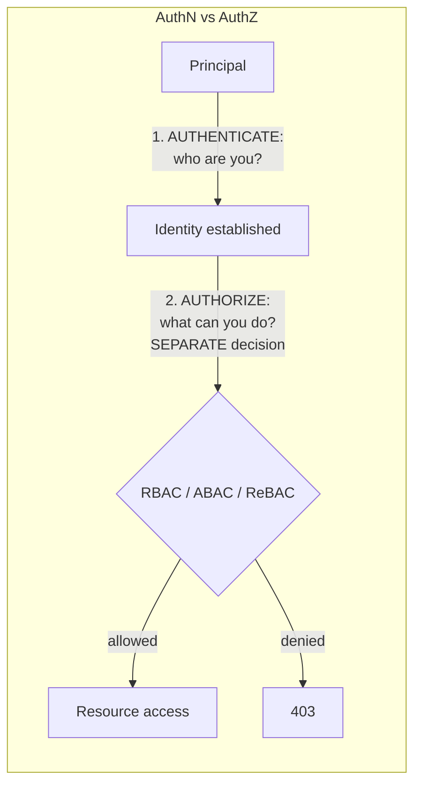
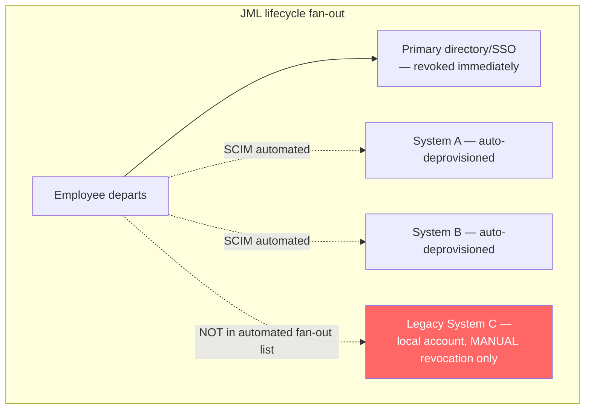
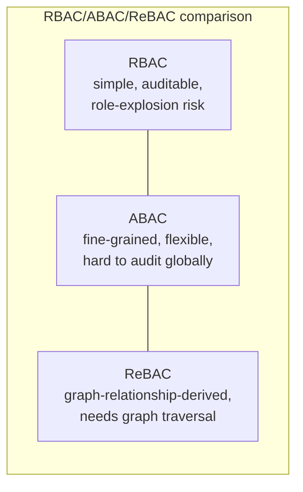
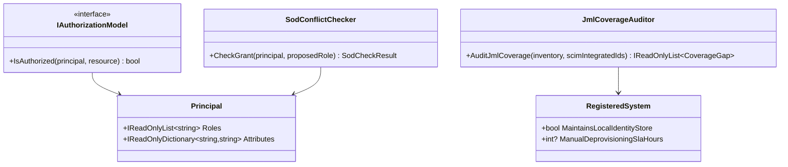
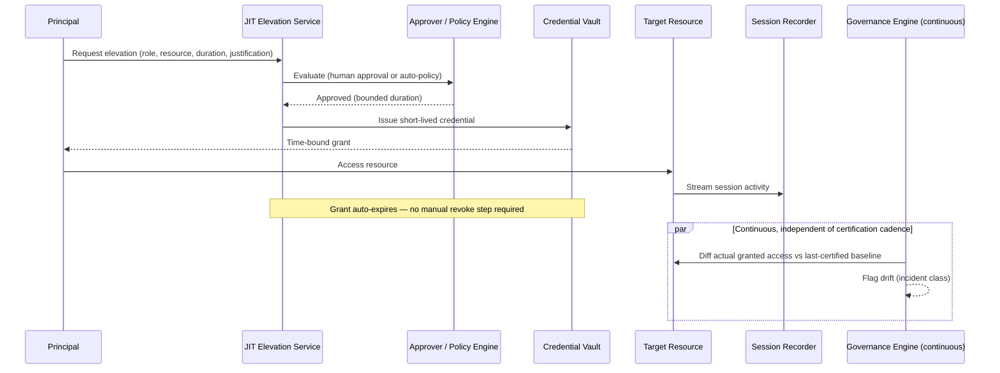

# Identity & Access Management (IAM) — Complete Interview Prep (All Topics, One File)

> Domain: IAM | Level: Beginner → Expert | Prerequisite: [[../28-Security/01-Security-Interview-Prep]] (zero trust, compliance), [[../02-DotNet-AspNetCore/01-DotNet-AspNetCore-Interview-Prep]] §5 (ASP.NET Core auth). Protocols: [[../41-OAuth2-OIDC-JWT-PKCE/01-OAuth2-OIDC-JWT-Interview-Prep]]
> **Quick-prep edition** (consolidated 2026-10-03). This one file replaces Modules 151–152. Originals: `git show ebb2d5c:40-IAM/<file>.md`
> Each topic has: **Key concepts → C#/config example → Most common interview questions with answers.**

| # | Topic | # | Topic |
|---|---|---|---|
| 1 | AuthN vs AuthZ; identity concepts | 7 | Segregation of duties (SoD) |
| 2 | Authentication methods, MFA & phishing resistance | 8 | Privileged Access Management (PAM): JIT, break-glass |
| 3 | Authorization models: RBAC, ABAC, ReBAC, PBAC | 9 | Identity governance: access reviews & certification |
| 4 | Implementing authorization in .NET (policies, OPA, OpenFGA) | 10 | Workload & machine identities |
| 5 | Directory services & federation: AD/LDAP, SAML, OIDC, SCIM | 11 | Zero-trust identity & continuous evaluation |
| 6 | Joiner–mover–leaver (JML) lifecycle | 12 | Top 25 rapid-fire + Principal · 13 Mistakes checklist |

---

## 1. AuthN vs AuthZ; Identity Concepts

**Key concepts**
- **Identification** (who you claim to be) → **Authentication** (prove it) → **Authorization** (what you may do) → **Accounting/audit** (what you did).
- Conflating AuthN and AuthZ is the domain's central failure: "logged in" ≠ "allowed to access this object" (BOLA).
- **Identity types:** workforce (employees), customers (CIAM), partners (B2B), **workload/machine** identities (services, pipelines, bots) — often the largest and least governed population.
- **Identity provider (IdP)** issues identity assertions/tokens (Entra ID, Okta, Ping, Auth0, Keycloak); **service providers/relying parties** consume them.
- **Principle of least privilege** + **need to know**; **IAM = people, process and technology**.

**Common interview question**

**Q. Authentication vs authorization — why does the distinction matter so much?**
Authentication establishes identity; authorization decides access to a specific resource/action. Most serious breaches in APIs are authorization failures on authenticated users (accessing another customer's data, calling admin functions). Systems must authorize every request against the specific object, not just check that a session exists.

---

## 2. Authentication Methods, MFA & Phishing Resistance

**Key concepts**
- **Factors:** knowledge (password), possession (phone, security key), inherence (biometrics). **MFA** combines factors.
- **Phishable MFA:** SMS/voice OTP (SIM swap), TOTP codes and push approvals (real-time phishing proxies, MFA fatigue/push bombing → number matching helps).
- **Phishing-resistant:** **FIDO2/WebAuthn passkeys** and security keys (origin-bound cryptography), smart cards/PIV (certificate-based). Required for admins and increasingly by regulators.
- **Passwordless** (passkeys, Windows Hello for Business) reduces credential theft.
- Account protections: rate limiting, lockout/throttling, breached-password checks, risk-based/adaptive authentication (device, location, behaviour), secure session management.

**Common interview questions**

**Q1. Why isn't SMS OTP enough for privileged users?**
It's vulnerable to SIM swapping, interception and real-time phishing (adversary-in-the-middle proxies relay the code). Phishing-resistant methods (FIDO2 security keys/passkeys, certificate-based auth) bind authentication to the legitimate site, defeating proxies.

**Q2. What is MFA fatigue and how do you mitigate it?**
Attackers with a stolen password spam push approvals until the user accepts. Mitigate with number matching, additional context in prompts, rate limiting prompts, phishing-resistant methods, and alerting on repeated denials.

---

## 3. Authorization Models: RBAC, ABAC, ReBAC, PBAC

| Model | How decisions are made | Strengths | Weaknesses |
|---|---|---|---|
| **ACL** | per-resource lists of principals | simple, precise | hard to manage at scale |
| **RBAC** | users → roles → permissions | simple, auditable, common | **role explosion** for fine-grained/contextual rules |
| **ABAC** | attributes of subject, resource, action, environment (department, data classification, time, location) | fine-grained, contextual | harder to audit/reason about; attribute quality |
| **ReBAC** | relationships graph (user → member of → team → owner of → document) — Google Zanzibar | natural for sharing/hierarchies, scales | needs a relationship store (OpenFGA, SpiceDB) |
| **PBAC** | policies as code combining the above (OPA/Rego, Cedar) | central, testable, versioned | another system to run |

- Practical approach: **RBAC for coarse permissions + ABAC/ReBAC for data-level rules**, expressed as **named policies/permissions** in code (`payments:refund`) so the underlying model can evolve.

**Common interview questions**

**Q1. RBAC or ABAC?**
RBAC for coarse, stable job functions — easy to audit. ABAC when access depends on context (resource owner, tenant, data classification, amount thresholds, time/location). Combine: roles grant capabilities, attributes constrain them (an approver can approve payments up to their limit in their region).

**Q2. What's role explosion and how do you avoid it?**
Creating roles for every combination (EU-Payments-Approver-Under-10k…) until nobody understands them. Avoid it by keeping roles coarse, moving variations into attributes/policies, using groups from the directory, and regular role mining/cleanup.

---

## 4. Implementing Authorization in .NET (Policies, OPA, OpenFGA)

```csharp
// Permission-based policies (names stable even if the underlying model changes)
builder.Services.AddAuthorizationBuilder()
    .SetFallbackPolicy(new AuthorizationPolicyBuilder().RequireAuthenticatedUser().Build())
    .AddPolicy("payments:approve", p => p.RequireClaim("permission", "payments:approve"))
    .AddPolicy("payments:approve-large", p => p.Requirements.Add(new ApprovalLimitRequirement()));

// ABAC-style handler: approver's limit and region vs the resource
public sealed class ApprovalLimitHandler : AuthorizationHandler<ApprovalLimitRequirement, Payment>
{
    protected override Task HandleRequirementAsync(AuthorizationHandlerContext ctx, ApprovalLimitRequirement req, Payment p)
    {
        var limit = decimal.Parse(ctx.User.FindFirst("approval_limit")?.Value ?? "0", CultureInfo.InvariantCulture);
        var region = ctx.User.FindFirst("region")?.Value;
        if (p.Amount <= limit && p.Region == region && p.CreatedBy != ctx.User.FindFirst("sub")?.Value)   // SoD: not own payment
            ctx.Succeed(req);
        return Task.CompletedTask;
    }
}

// Calling an external policy decision point (OPA) — PEP in the service, PDP centralized
var decision = await opaClient.PostAsJsonAsync("/v1/data/payments/allow",
    new { input = new { user = new { id = userId, roles, region }, action = "approve", resource = new { amount, region = payRegion } } });
```

```rego
package payments
default allow := false
allow if {
  input.action == "approve"
  "approver" in input.user.roles
  input.resource.amount <= 10000
  input.user.region == input.resource.region
}
```

- **ReBAC** with OpenFGA/SpiceDB: store relationship tuples (`document:42#owner@user:ana`) and ask `check(user:ana, viewer, document:42)`.
- Decision caching and latency budgets for remote PDPs; fail-closed.

**Common interview question**

**Q. Centralized authorization service or in-process policies?**
In-process policy evaluation (ASP.NET Core handlers, embedded OPA/Cedar with distributed policy bundles) for latency and availability; a central PDP (or ReBAC store) when decisions depend on shared, frequently changing relationship data across many services. Either way, centralize policy *definitions*, version and test them, and log decisions for audit.

---

## 5. Directory Services & Federation: AD/LDAP, SAML, OIDC, SCIM

**Key concepts**
- **Directory:** Active Directory/LDAP (on-prem), **Entra ID** (cloud) — users, groups, devices; **Entra Connect/Cloud Sync** for hybrid identity.
- **Federation:** trust between an IdP and SPs so users sign in once (SSO):
  - **SAML 2.0** — XML assertions, browser POST/redirect; dominant in enterprise SaaS.
  - **OIDC** — identity layer on OAuth 2.0, JSON/JWT, modern apps and APIs, mobile-friendly.
  - **WS-Fed** — legacy Microsoft.
- **SCIM** — standard API for **provisioning/deprovisioning** users and groups into SaaS apps (automates JML).
- **Kerberos/NTLM** for on-prem Windows auth; **LDAPS**.

**Common interview question**

**Q. SAML vs OIDC?**
Both enable SSO. SAML uses signed XML assertions via browser redirects — common for enterprise SaaS and legacy integrations. OIDC uses JWTs over OAuth 2.0 flows, works well for SPAs, mobile and APIs, and is simpler to implement. Large enterprises run both through an identity broker.

---

## 6. Joiner–Mover–Leaver (JML) Lifecycle

**Key concepts**
- **Joiner:** provision access based on role/birthright (HR as the source of truth → IdP → SCIM to apps).
- **Mover:** grant new access **and remove old access** (access accumulation/"privilege creep" is the common failure).
- **Leaver:** **deprovision immediately and completely** — disable the IdP account, revoke sessions and tokens, remove app accounts (SCIM), rotate shared secrets they knew, recover devices. Orphaned accounts are a top audit finding and attack vector.
- Automate from the HR system; reconcile app accounts against the directory regularly (find orphans).

**Common interview question**

**Q. Why is deprovisioning the hard problem?**
Access is spread across many apps, local accounts, API keys, shared credentials and long-lived tokens; disabling the directory account doesn't revoke existing sessions/tokens or app-local accounts. You need automated SCIM deprovisioning, session/token revocation, regular reconciliation for orphans, and credential rotation for anything the leaver had.

---

## 7. Segregation of Duties (SoD)

- Prevent one person from completing a sensitive end-to-end action alone (create vendor + approve payment to it; develop + deploy to production without review).
- Enforce at **assignment time** (toxic role combinations blocked in IAM/IGA) and at **execution time** (four-eyes: approver ≠ initiator, checked per transaction).
- SoD as a **graph problem**: conflicts can arise through indirect paths (nested groups, delegated admin, service accounts the user controls) → analyse effective permissions, not just direct roles.

**Common interview question**

**Q. How do you enforce four-eyes for payments in code?**
Store the initiator on the payment; authorization for approval requires a different user with the approver permission and sufficient limit (ABAC handler checks `initiator != approver`), log both identities immutably, and enforce the same rule in all channels (UI, API, batch).

---

## 8. Privileged Access Management (PAM): JIT, Break-Glass

**Key concepts**
- **Standing privileged access** (permanent admin) is the highest-leverage attack surface → **just-in-time (JIT)** elevation: time-bound, approved, MFA-protected, justified, logged (Entra PIM, AWS IAM Identity Center + temporary elevation, CyberArk, HashiCorp Boundary/Vault).
- **Privileged session management:** recording, bastions/jump hosts, no direct production access.
- **Break-glass accounts:** emergency access when the IdP or normal paths fail — few accounts, strong credentials stored securely (split knowledge/hardware keys), excluded from Conditional Access that could lock them out, **heavily monitored (alert on any use)**, tested regularly, credentials rotated after use.
- Secrets vaulting for service accounts; rotate automatically.

**Common interview questions**

**Q1. How do you remove standing admin access without blocking operations?**
Introduce JIT elevation via PIM/IAM Identity Center with fast approval workflows (or self-approval with MFA and justification for lower-risk roles), time-boxed sessions, automation for routine operations so humans rarely need elevation, and break-glass accounts for emergencies.

**Q2. What are the risks of break-glass accounts and how do you control them?**
They bypass normal controls, so compromise is catastrophic. Control with minimal count, hardware-key MFA, secure split storage, alerts on every sign-in, regular testing, post-use review and credential rotation.

---

## 9. Identity Governance: Access Reviews & Certification

- **IGA** (SailPoint, Saviynt, Entra ID Governance): access requests and approvals, **access reviews/certifications** (managers/owners periodically confirm access), role mining, SoD policy enforcement, entitlement catalogues, reporting for audits (SOX).
- **Certification vs drift:** periodic reviews catch accumulated access, but rubber-stamping makes them theatre → review risky access more often, provide usage data ("last used 9 months ago"), auto-revoke on no response, and remove unused entitlements continuously.

**Common interview question**

**Q. Access reviews are rubber-stamped. How do you make them meaningful?**
Scope them to risky entitlements, show usage evidence, default to revoke on no response, make reviewers owners who understand the access, automate removal of unused access, and measure revocation rates and reviewer behaviour.

---

## 10. Workload & Machine Identities

- Services, pipelines and bots need identities: **managed identities/IAM roles**, **workload identity federation** (Kubernetes service accounts, GitHub Actions OIDC → cloud roles), mTLS certificates (SPIFFE), OAuth **client credentials**.
- Eliminate long-lived secrets (API keys, passwords in config); where unavoidable, vault and rotate them.
- Inventory and ownership for every machine identity; least privilege; monitor anomalous use.

```yaml
# GitHub Actions → Azure with OIDC federation (no stored client secret)
permissions: { id-token: write, contents: read }
steps:
  - uses: azure/login@v2
    with: { client-id: ${{ vars.AZURE_CLIENT_ID }}, tenant-id: ${{ vars.AZURE_TENANT_ID }}, subscription-id: ${{ vars.AZURE_SUBSCRIPTION_ID }} }
```

**Common interview question**

**Q. How do you handle service-to-service authentication without secrets?**
Platform workload identity (managed identities, IRSA/Pod Identity, Entra Workload ID) or mesh mTLS with SPIFFE identities, plus OAuth client-credentials tokens with narrow audiences/scopes issued via federated credentials — no static API keys.

---

## 11. Zero-Trust Identity & Continuous Evaluation

- Identity is the new perimeter: every request evaluated with **identity + device posture + context** (location, risk) — Conditional Access policies.
- **Continuous access evaluation (CAE):** revoke sessions in near real time on risk events (user disabled, password reset, location change) instead of waiting for token expiry.
- Short-lived tokens, sender-constrained tokens (DPoP/mTLS), step-up authentication for sensitive actions.

---

## 12. Top 25 Rapid-Fire Questions + Principal Questions

1. **AuthN vs AuthZ?** Who you are vs what you may do.
2. **MFA factors?** Know, have, are.
3. **Phishing-resistant MFA?** FIDO2/passkeys, certificates.
4. **MFA fatigue fix?** Number matching, limits, FIDO2.
5. **RBAC?** Roles → permissions.
6. **ABAC?** Attribute-based contextual decisions.
7. **ReBAC?** Relationship graph (Zanzibar, OpenFGA).
8. **PBAC?** Policies as code (OPA, Cedar).
9. **Role explosion?** Too many fine-grained roles → use attributes.
10. **SAML vs OIDC?** XML assertions vs JWT on OAuth.
11. **SCIM?** Provisioning API standard.
12. **JML?** Joiner, mover, leaver.
13. **Mover risk?** Privilege creep.
14. **Leaver?** Disable, revoke sessions/tokens, deprovision apps.
15. **SoD?** No one person completes a sensitive flow alone.
16. **Four-eyes?** Approver ≠ initiator.
17. **PAM?** Control privileged access.
18. **JIT?** Time-bound elevation.
19. **Break-glass?** Emergency accounts, monitored.
20. **Access reviews?** Periodic certification.
21. **Machine identities?** Managed identity, workload federation.
22. **CI auth?** OIDC federation.
23. **CAE?** Near-real-time session revocation.
24. **Conditional Access?** Context-based sign-in policies.
25. **Orphaned accounts?** Reconcile against HR/IdP.

**Principal-level questions**

**P1. Design IAM for a bank's internal platforms.**
Single workforce IdP (Entra/Okta) with HR-driven JML and SCIM provisioning; phishing-resistant MFA for all, Conditional Access with device compliance; RBAC for coarse roles + ABAC policies for data and amount limits; SoD rules in IGA and four-eyes in apps; PIM/JIT for privileged roles, no standing admin, monitored break-glass; workload identities for services and pipelines; quarterly risk-based access reviews; immutable audit logs feeding the SIEM.

**P2. Your authorization model must outlive the current org chart. How?**
Code checks permissions/policies by name (`payments:approve`), never roles or org units directly; map roles/groups/attributes to permissions in a central, versioned policy layer; so reorganizations change mappings, not code.

---

## 13. Mistakes Checklist (say why each is wrong)
- [ ] Treating authentication as authorization · checking roles directly in code everywhere
- [ ] SMS OTP for admins · no protection against MFA fatigue
- [ ] Role explosion · nobody owning roles/entitlements
- [ ] Manual provisioning · leavers keeping sessions, tokens or app accounts
- [ ] Standing admin access · unmonitored break-glass accounts
- [ ] Rubber-stamped access reviews · SoD checked only on direct roles
- [ ] Static API keys for services/pipelines · unowned machine identities

---

## Architecture Diagrams (preserved from the original modules)

> All 10 Mermaid/ASCII diagrams from the original `40-IAM/` files, kept verbatim and grouped by source module. Originals: `git show ebb2d5c:40-IAM/<file>.md`.

### Module 151 — Identity & Access Management: Fundamentals — Authentication, Authorization Models, Directory Services & Federation
*Source: `01-IAM-Fundamentals-AuthN-AuthZ-Models-Directory-Federation.md`*

**1. Fundamentals**

```text
Principal ──authenticates──► Identity established (who)
 │
 Identity federated/synchronized across systems
 (directory services, SCIM provisioning)
 │
 ──authorizes──► Access decision (what)
 │ (RBAC / ABAC / ReBAC)
 Access must be REVOKED
 on role change or departure
 (JML lifecycle)
```

**3. Visual Architecture**



**3. Visual Architecture**



**3. Visual Architecture**



**13. Low-Level Design**



### Module 152 — Identity & Access Management Capstone: Privileged Access Management, Identity Governance & Zero Trust Identity Architecture
*Source: `02-Capstone-PAM-IdentityGovernance-ZeroTrustIdentity.md`*

**1. Fundamentals**

```text
Standing admin credential ──eliminate──► JIT elevation request
 │
 Approval (workflow or auto-approved
 by pre-defined risk policy)
 │
 Time-bound grant + full session recording
 │
 Automatic revocation at expiry
 │
 ┌───────────────────────────────┴───────────────────────────────┐
 │ │
 Identity Governance (periodic + continuous) Zero Trust (per-request, continuous)
 - access certification campaigns - re-check device posture, location,
 - SoD conflict detection behavioral risk on EVERY request,
 - entitlement drift detection between not just at login
 certifications - session trust decays with context
 change, not with a fixed timer alone
```

**3. Visual Architecture**



**3. Visual Architecture**

```text
Zero Trust identity — per-request re-evaluation:

Login ──► Session established (initial trust score)
 │
 Every subsequent request:
 │
 ┌──────────┴──────────┐
 │ Re-score context: │
 │ device posture │
 │ network/geo │
 │ behavioral deviation │
 └──────────┬──────────┘
 │
 score OK ─┴─ score degraded
 │ │
 proceed step-up auth / narrow
 permissions / terminate
```

**12. System Design**

```text
 ┌─────────────────────┐
 Principal ───────►│ JIT Elevation API │───► Approval (human or policy engine)
 └──────────┬──────────┘
 │
 ┌──────────▼──────────┐
 │ Credential Vault │──► rotation scheduler
 └──────────┬──────────┘
 │
 ┌──────────▼──────────┐ ┌────────────────────┐
 │ Target Resources │───────►│ Session Recorder │
 └──────────┬──────────┘ └────────────────────┘
 │ (entitlement change events)
 ┌──────────▼──────────┐
 │ Entitlement Event Bus │ (/143 patterns apply)
 └──────────┬──────────┘
 ┌─────────────────┼─────────────────┐
 ┌──────────▼─────────┐ ┌─────▼──────────┐ ┌─────▼─────────────┐
 │ SoD Graph Engine │ │ Drift Detector │ │ Certification Svc │
 │ (pre-commit gate) │ │ (+ self-health) │ │ (scheduled campaigns)│
 └──────────────────────┘ └────────────────┘ └────────────────────┘

 Zero Trust risk scoring: separate, low-latency service consulted per
 sensitive request, backed by a cached, incrementally-updated risk-signal store.
```

**13. Low-Level Design**

```text
IElevationRequest
 ├─ Principal, RequestedRole, Resource, Duration, Justification
 └─ ApprovalPolicy (strategy pattern — auto-policy vs human-approval, I1/I4)

IApprovalPolicy
 ├─ AutoPolicyApproval: IApprovalPolicy (low-risk, narrow scope)
 └─ HumanApprovalGate: IApprovalPolicy (high-risk)

ElevationGrant
 ├─ IssuedAt, Duration, IsBreakGlass (bool)
 └─ RecordedSession: ISessionRecorder

CredentialVault
 ├─ IssueShortLivedCredential(ElevationGrant): Credential
 └─ RotateStandingCredentials

SoDGraph (from Coding Exercise Hard)
 ├─ DefineRole(...), EffectivePermissions(...)
 └─ GrantRoleAndCheck(...): pre-commit gate, throws SoDViolationException on conflict

DriftDetector (from Coding Exercise Expert)
 ├─ ProcessEvent(...): yields drift findings
 └─ IsDetectorHealthy(...): self-verification (Observer-notified externally)

CertificationCampaign
 ├─ Schedule(cadence, riskTier) // I9's risk-tiered cadence
 └─ RecordAttestation(reviewer, principal, decision)
```
