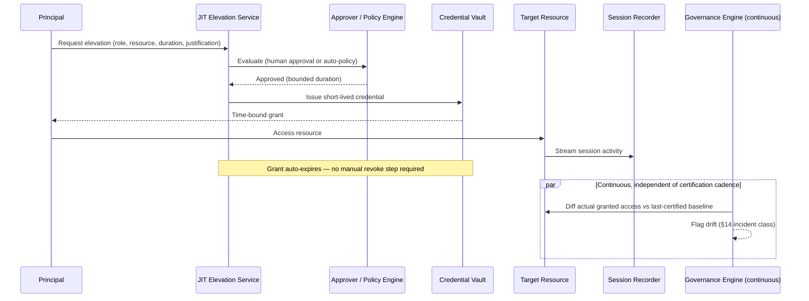

# Module 152 — Identity & Access Management Capstone: Privileged Access Management, Identity Governance & Zero Trust Identity Architecture

> Domain: IAM | Level: Beginner → Expert | Prerequisite: [[../40-IAM/01-IAM-Fundamentals-AuthN-AuthZ-Models-Directory-Federation]] (this module composes its authn/authz models, directory/federation, and JML lifecycle into standing-privilege elimination, governance, and Zero Trust), [[../28-Security/01-OWASP-Top10-Threat-Modeling-SecureSDLC]] and the Module 100 Zero Trust reference (network-position Zero Trust generalized here to identity-context Zero Trust), [[../39-Service-Mesh/01-MultiCluster-MultiMesh-Federation-AdoptionGovernance]] §4 (the trust-scope-creep pattern recurring at the identity layer)

>
> **Scope note:** Second and closing module of `40-IAM`'s 2-module scope. This module deliberately does not re-derive Module 151's authn/authz models or federation mechanics — it assumes them and asks what changes once an enterprise must (a) eliminate standing privileged access, (b) prove — continuously, not once — that granted access still matches need, and (c) stop trusting a session past the moment its context last changed.

---

## 1. Fundamentals

**What:** Three disciplines that together close the gap between "access was correctly granted once" (Module 151) and "access remains correct, minimal, and actively verified over time":
- **Privileged Access Management (PAM):** eliminating standing (always-on) privileged credentials in favor of just-in-time (JIT), time-bound, approved elevation — plus vaulting, rotation, and session recording for the privileged access that must remain.
- **Identity Governance (IGA):** the continuous, evidenced process of proving that granted entitlements still match a principal's actual current need — access certification campaigns, segregation-of-duties (SoD) conflict detection, and entitlement right-sizing.
- **Zero Trust Identity Architecture:** re-evaluating trust per request against current context (device posture, location, behavior, risk signal) rather than once at login and assumed to hold for the session's duration.

**Why:** Module 151 established *how* identity and access decisions are correctly made. Every incident in that module and in this course's broader arc (Module 145's composition risk, Module 147/143's "verify the verifier," Module 150's federation-scope creep) shares one shape: a control that was correct *at the moment it was applied* silently stops matching reality afterward, and nothing was watching for the drift. PAM, IGA, and Zero Trust identity are this domain's three concrete answers to "who is watching for the drift" — respectively: minimizing the *window* in which privileged access can be misused, *continuously* re-proving access still matches need, and *continuously* re-proving the current session still deserves the trust it was granted.

**When:** PAM is mandatory wherever any credential (human admin or service account) can affect production, financial, or customer data — universal at the Elite FinTech Interview Panel bar. IGA is mandatory wherever SOX/PCI-DSS/regulatory audit requires evidenced, periodic proof of least privilege — which is effectively every system this course's financial-services lens covers. Zero Trust identity is warranted specifically where session duration is long relative to how quickly risk context can change (most enterprise sessions), which is why it is the architecture, not merely a hardening option, at this bar.

**How (30,000-ft view):**
```
Standing admin credential  ──eliminate──►  JIT elevation request
                                                    │
                                    Approval (workflow or auto-approved
                                    by pre-defined risk policy)
                                                    │
                                    Time-bound grant + full session recording
                                                    │
                                    Automatic revocation at expiry
                                                    │
                    ┌───────────────────────────────┴───────────────────────────────┐
                    │                                                                │
        Identity Governance (periodic + continuous)              Zero Trust (per-request, continuous)
        - access certification campaigns                          - re-check device posture, location,
        - SoD conflict detection                                    behavioral risk on EVERY request,
        - entitlement drift detection between                       not just at login
          certifications (§14)                                    - session trust decays with context
                                                                      change, not with a fixed timer alone
```

---

## 2. Deep Dive

### 2.1 Why standing privileged access is the highest-leverage attack surface

A standing privileged credential is valuable to an attacker for as long as it exists, independent of whether it is ever used maliciously by its legitimate holder. Its risk is a function of *existence duration*, not usage frequency — an admin credential used once a quarter is exactly as available to a credential-theft attack in the interim as one used daily. JIT elevation converts this from a duration risk to a probability-of-overlap risk: the credential (or the elevated grant) exists only during the narrow window work is actually being done, and a compromise must land inside that window to be useful. This is the same mathematical shape as Module 149's tail-latency fan-out — reducing exposure *duration* reduces aggregate risk even when the per-instant risk is unchanged.

### 2.2 JIT elevation mechanics

1. **Request:** principal requests elevation to a specific role/permission set, for a specific resource, for a bounded duration, with a stated justification (ticket reference in regulated environments).
2. **Approval:** either human approval (for high-risk elevation) or automatic approval against a pre-defined, narrowly-scoped policy (for low-risk, high-frequency elevation — e.g., read-only diagnostic access during an active incident).
3. **Grant:** a short-lived credential or role assumption (e.g., AWS STS `AssumeRole` with a session duration, Module 58) is issued — never a permanent credential.
4. **Session recording:** for privileged sessions specifically (not all access), keystrokes/commands and, where feasible, screen recording are captured — this is the control that makes a compromised-but-legitimately-elevated session forensically distinguishable after the fact.
5. **Automatic revocation:** the grant expires on its own; no manual revocation step is required or reliable enough to depend on (Module 151 §4's incident was precisely a manual-revocation dependency failing at scale).

### 2.3 Break-glass — the necessary exception, and its precise danger

Some incidents (a directory service itself is down; the approval workflow's own dependency is unavailable) require access *without* going through the normal JIT approval path. Break-glass exists for exactly this case: a small number of pre-provisioned, heavily-monitored emergency credentials that bypass normal approval but trigger mandatory, immediate, and un-skippable post-use review. The precise danger — and this module's §4 incident — is that break-glass's exemption from the *approval* step is easily and silently generalized, in practice, into an exemption from the *audit* step as well, because the audit tooling built for the JIT path doesn't automatically cover a path that was designed to route around it.

### 2.4 Identity governance: certification vs. drift

An **access certification campaign** asks resource owners, on a schedule (typically quarterly for high-risk systems in regulated financial services), to explicitly affirm that each of their reports'/systems' current entitlements is still needed, and to revoke what isn't. This produces a *point-in-time* attestation. The gap this module's §14 incident demonstrates: certification proves the entitlement was correct *at the moment reviewed and at the moment revocation was recorded* — it says nothing about whether that revocation *durably held* afterward if some other automated process (HR sync, SCIM provisioning, a birthright-access rule) can silently re-grant it. **Entitlement drift detection** — continuously diffing actual current granted access against the last-certified baseline, independent of and in addition to the next scheduled certification — is the control that catches exactly this gap, the identity-layer instance of Module 143/147's "verify the verifier": the certification process itself needs an independent mechanism confirming its outcome held.

### 2.5 Segregation of duties (SoD) as a graph problem

A SoD conflict exists when a single principal holds two permissions that, in combination, allow an unsupervised, unreviewable action (e.g., "create a payment" + "approve a payment"). At small scale this is a lookup against a static conflict-pair table. At enterprise scale, roles compose (a principal can hold multiple roles, each individually SoD-clean, whose *union* creates a conflict neither role alone does), so SoD detection is properly a graph-reachability problem over the principal → role → permission graph, evaluated on every entitlement change, not merely at certification time — this is Expert Q9 and Coding Exercise (Hard) below.

### 2.6 Zero Trust identity: continuous, contextual, per-request

Module 100's Zero Trust principle — never trust based on network position alone — generalizes at the identity layer to: never trust based on the *authentication event* alone, held to cover the entire session. A session's risk context (device posture, network, geolocation, behavioral baseline, time-of-day) can change materially between the moment of login and any later request within that same session; Zero Trust identity re-evaluates a lightweight risk score on each request (or each sensitive operation) and can step up authentication, narrow the effective permission set, or terminate the session mid-flight in response to a context change — without requiring the user to have done anything "wrong" at login. This is a direct extension of Module 151's authorization model: the access decision is no longer "who are you, evaluated once" but "who are you, evaluated continuously, in this specific context, right now."

---

## 3. Visual Architecture



```
Zero Trust identity — per-request re-evaluation:

Login ──► Session established (initial trust score)
              │
   Every subsequent request:
              │
   ┌──────────┴──────────┐
   │ Re-score context:    │
   │ device posture       │
   │ network/geo          │
   │ behavioral deviation │
   └──────────┬──────────┘
              │
     score OK ─┴─ score degraded
        │              │
   proceed      step-up auth / narrow
                permissions / terminate
```

---

## 4. Production Example

**Problem:** A tier-1 bank's core settlement platform eliminated standing DBA credentials in favor of JIT elevation, with a break-glass path reserved for genuine outages. Access reviews were scoped to audit the JIT approval logs — the intended, designed-for path.

**Architecture:** JIT elevation service issuing time-bound `AssumeRole`-style grants (Module 58) with mandatory session recording; a separate, pre-provisioned break-glass credential set, individually assigned, intentionally exempt from the approval workflow to remain usable when the workflow's own dependencies (directory service, ticketing system) were themselves down.

**Implementation / What happened:** During a period of recurring, minor directory-service flakiness, on-call engineers found break-glass faster and more reliable than fighting an intermittently-failing JIT approval flow, and began using it routinely for ordinary, non-emergency elevation — not maliciously, simply because it worked when the "correct" path sometimes didn't. This was individually reasonable each time and collectively became a persistent, unaudited standing-privilege-equivalent channel, invisible because the governance program's dashboards, alert rules, and quarterly certification scope were all built against the JIT path's logs specifically. It was discovered only when a genuine credential-theft incident used one of the same break-glass accounts, and the incident responders — pulling every credential's usage history — found routine, unreviewed, months-old usage patterns that had never once been examined.

**Trade-offs:** Break-glass cannot be eliminated (a system must be recoverable when its own access-control dependencies fail) but its very design — bypassing the normal path — guarantees it also bypasses whatever monitoring was scoped to the normal path, unless monitoring is explicitly, separately built to cover it.

**Lessons learned:** **An exception path evades exactly the scrutiny the normal path receives, by construction — and un-audited exceptions become the norm precisely because nothing is watching them.** The fix was not to remove break-glass (operationally necessary) but to (1) hold it to *equal-or-greater* audit rigor than the normal path — every use triggers a mandatory, non-optional post-use review within 24 hours, independent of and stricter than JIT's own review cadence, and (2) treat break-glass usage frequency itself as a first-class health signal: rising break-glass usage is evidence the "correct" path is failing users, not evidence of legitimate emergencies, and should trigger investigation of the JIT path's own reliability — which is precisely what the recurring directory-service flakiness should have surfaced months earlier had anyone been watching that signal.

---

## 5. Best Practices

- **JIT by default; standing privilege only by documented, periodically-re-justified exception.** Every remaining standing credential should have an explicit, dated business justification on file, re-reviewed at least as often as certification cadence.
- **Hold break-glass to stricter audit than the normal path, not looser** — per §4, the exemption from approval must not become an exemption from review.
- **Separate "certified" from "currently correct."** Run continuous entitlement-drift detection independent of the certification cadence (§2.4, §14) — certification is a point-in-time attestation, not a durable guarantee.
- **Model SoD as a graph over composed roles, not a static pairwise table** (§2.5) — role composition is exactly where pairwise conflict tables silently miss conflicts.
- **Score Zero Trust identity risk per request for sensitive operations, not merely at login** — session-long trust from a single authentication event is a Module 151-style "declared once, assumed true throughout" gap.
- **Record privileged sessions specifically**, not all access uniformly — session recording is expensive enough (storage, review burden) that it should be concentrated exactly where standing-privilege elimination couldn't fully apply.

---

## 6. Anti-patterns

- **"We removed standing admin access" as an unqualified, permanent claim.** As §4 shows, an unmonitored alternate path silently recreates the same risk under a different name — the claim is only ever true for the specific path it was verified against.
- **Certification as the only governance control.** Point-in-time attestation without continuous drift detection (§14) leaves the exact gap between "certified correct" and "durably correct" permanently unmonitored.
- **Pairwise SoD tables applied to a system with role composition.** Silently misses conflicts that only emerge from a principal's *union* of roles — exactly the failure Coding Exercise (Hard) below is built to catch.
- **Zero Trust "in name only":** re-branding a conventional session-cookie architecture as "Zero Trust" without actually re-evaluating context per request provides none of the model's actual risk reduction — the label is not the control.
- **Treating break-glass usage as inherently low-risk because it's rare.** §4's lesson: rarity is not the same as low-risk when the usage pattern itself is unmonitored; rising frequency is a signal, not noise, and should be tracked as a metric with an alert threshold, not dismissed as expected exceptional-path noise.

---

## 7. Performance Engineering

JIT elevation's approval-latency budget directly trades against incident-response speed: a human-approval step adds tens of seconds to minutes exactly when an on-call engineer is under the most time pressure (§4's proximate cause) — the correct mitigation is tiered auto-approval policy (low-risk, narrowly-scoped elevation auto-approved against a pre-defined policy; only genuinely high-risk elevation requires human approval), not removing the approval step. Continuous entitlement-drift detection (§2.4) is a diffing workload against the full entitlement graph and should run incrementally against a change-event stream (entitlement-change events, Module 143's idempotent-consumer pattern applies directly) rather than as a full periodic recomputation, which does not scale past a few thousand principals without becoming itself a lagging, stale signal — recurring Module 141's lag-monitoring discipline. Zero Trust per-request risk scoring must complete within the request's own latency budget (single-digit milliseconds for synchronous paths) — it is evaluated against cached, incrementally-updated risk signals, never a synchronous full re-authentication, or it reintroduces Module 136-style latency amplification at every request.

---

## 8. Security

PAM and vaulted-credential rotation directly close the "credential existed and was stolen at rest" attack class; JIT elevation closes the "credential existed and was usable long after legitimate need ended" class; session recording provides forensic evidence for the residual "credential was legitimately elevated and then misused" class that neither prevention control eliminates. SoD enforcement is a control against a specific, distinct threat model — not external compromise, but insider risk from a single authorized principal completing an entire sensitive workflow unsupervised — and is a hard, non-negotiable regulatory requirement (SOX) for financial transaction workflows specifically. Zero Trust identity's continuous re-scoring is the direct mitigation for session hijacking and credential-replay attacks that occur *after* a legitimate authentication event — a threat class session-only, login-time authentication structurally cannot detect. Break-glass credentials, given their elevated, approval-bypassing power, should individually be the most tightly scoped, most short-lived, and most heavily alerted-upon credentials in the entire estate — precisely the opposite of §4's failure mode, where their exceptional status was treated as a reason for *less* scrutiny rather than more.

---

## 9. Scalability

Access certification campaigns do not scale linearly with headcount if resource owners are asked to review every entitlement uniformly — risk-tiered certification (high-risk systems reviewed quarterly, low-risk systems annually, informed by Module 151's per-resource authorization-model complexity classification) keeps the reviewer burden proportional to actual risk rather than raw entitlement count. SoD graph evaluation (§2.5) must be incremental (evaluate only the affected subgraph on each entitlement change) rather than full-graph recomputation to remain tractable at enterprise scale — full recomputation on every change is the same anti-pattern as recomputing an entire cache on every write. JIT elevation services themselves must be highly available and horizontally scaled specifically because their *unavailability* is what drove §4's break-glass overuse — an access-control system that is itself a single point of failure defeats its own purpose by forcing legitimate users toward less-monitored bypass paths.

---

## 10. Interview Questions

### Basic (10)

**B1. What is the difference between standing privileged access and just-in-time (JIT) elevation?**
*Ideal Answer:* Standing access is a permanent credential/permission that exists whether or not it's currently being used; JIT elevation grants access only for a bounded window when actually needed, then auto-expires.
*Why correct:* Captures the duration-vs-existence risk distinction central to §2.1.
*Common mistakes:* Describing JIT as "faster access" rather than "time-bounded access" — speed is incidental, the security property is duration limitation.
*Follow-up:* Why does JIT risk reduction hold even if the credential is never misused during its elevated window?

**B2. What is break-glass access?**
*Ideal Answer:* A small set of pre-provisioned emergency credentials that bypass normal approval workflows, reserved for situations where the normal access-control path itself is unavailable.
*Why correct:* Matches §2.3's definition and purpose.
*Common mistakes:* Treating break-glass as "for any urgent situation" rather than specifically for when the normal path is unavailable or too slow relative to genuine incident severity.
*Follow-up:* What audit obligation should break-glass usage carry, and why should it be stricter than the normal path's, not looser?

**B3. What is an access certification campaign?**
*Ideal Answer:* A periodic, evidenced process where resource/system owners explicitly affirm that each principal's current entitlements are still needed, revoking what isn't.
*Why correct:* Matches §2.4's definition.
*Common mistakes:* Describing it as a one-time audit rather than a recurring, scheduled process.
*Follow-up:* What does a "100% certified" result actually guarantee, and what does it not guarantee?

**B4. What is segregation of duties (SoD)?**
*Ideal Answer:* A control ensuring no single principal holds two permissions whose combination allows an unsupervised, unreviewable sensitive action (e.g., create-and-approve the same payment).
*Why correct:* Matches §2.5.
*Common mistakes:* Confusing SoD with least privilege — SoD is about *combinations* of permissions, not the size of any single permission.
*Follow-up:* Why can role composition create an SoD conflict that neither individual role has alone?

**B5. What does Zero Trust identity mean, distinct from Zero Trust network architecture?**
*Ideal Answer:* Re-evaluating a principal's access trust continuously, per request, based on current context (device, location, behavior) rather than relying on network position or a single login-time authentication event held valid for the whole session.
*Why correct:* Matches §2.6's generalization from Module 100.
*Common mistakes:* Describing Zero Trust purely in network terms (no implicit trust by network segment) without the identity-specific, per-request continuous evaluation angle.
*Follow-up:* What can trigger a mid-session trust downgrade under Zero Trust identity that a login-time-only model would miss?

**B6. Why is a standing privileged credential considered high risk even if it's rarely used?**
*Ideal Answer:* Its risk is a function of how long it exists and is available to be stolen, not how often it's legitimately used — an attacker who compromises it has the same access whether the legitimate owner uses it daily or quarterly.
*Why correct:* Matches §2.1's duration-vs-usage-frequency distinction.
*Common mistakes:* Assuming low usage frequency implies low risk.
*Follow-up:* How does JIT elevation change this risk calculus mathematically?

**B7. What is credential vaulting?**
*Ideal Answer:* Storing privileged credentials in a centrally-managed, access-controlled, audited vault rather than distributing them directly to holders, with the vault brokering short-lived access and handling rotation.
*Why correct:* Standard PAM component definition.
*Common mistakes:* Conflating vaulting with encryption alone — vaulting is about centralized access brokering and rotation, not merely encrypting a credential at rest.
*Follow-up:* Why does vaulting make automated credential rotation practical in a way distributed static credentials don't?

**B8. What is entitlement drift?**
*Ideal Answer:* The divergence, over time, between a principal's last-certified access baseline and their actual current granted access, caused by processes outside the certification workflow (e.g., automated provisioning) silently changing entitlements afterward.
*Why correct:* Matches §2.4 and this module's §14 incident.
*Common mistakes:* Assuming certification alone prevents drift — certification only captures a point-in-time state.
*Follow-up:* What kind of independent mechanism detects drift that certification itself cannot?

**B9. Why is session recording specifically applied to privileged sessions rather than all access uniformly?**
*Ideal Answer:* Session recording carries real storage and review cost; concentrating it on privileged sessions targets it at exactly the access class where standing-privilege elimination and JIT bounding couldn't fully eliminate misuse risk, providing forensic evidence for the residual risk.
*Why correct:* Matches §6 and §8's cost/scope reasoning.
*Common mistakes:* Suggesting recording all access "to be safe" without weighing the resulting review-burden and storage cost against the marginal security benefit.
*Follow-up:* What forensic question does session recording answer that access logs alone cannot?

**B10. What regulatory driver most directly mandates SoD enforcement in financial services?**
*Ideal Answer:* SOX (Sarbanes-Oxley) internal-controls requirements, among other financial-services regulations, mandate that no single individual can both initiate and approve a sensitive financial transaction unsupervised.
*Why correct:* Matches §8's regulatory framing.
*Common mistakes:* Citing a generic "security best practice" without naming the specific regulatory driver the Elite FinTech Interview Panel bar expects.
*Follow-up:* How does SoD enforcement differ in threat model from external-compromise-focused controls like MFA?

### Intermediate (10)

**I1. Design a JIT elevation approval policy that balances incident-response speed against audit rigor.**
*Ideal Answer:* Tier elevation requests by risk: low-risk, narrowly-scoped, short-duration requests (e.g., read-only diagnostic access to a non-production system) auto-approve against a pre-defined policy; high-risk requests (production write access, financial-data access) require human approval with a bounded SLA. Both tiers get full session recording and mandatory post-use review, calibrated to risk tier.
*Why correct:* Matches §7's tiered-approval reasoning — treats approval latency as a real cost to be spent deliberately, not eliminated uniformly.
*Common mistakes:* Applying uniform human approval to all elevation requests, which (per §4) drives users toward break-glass when the approval path is too slow.
*Follow-up:* How would you calibrate the auto-approval policy's risk thresholds, and how would you detect if they were miscalibrated?

**I2. Why does certification alone not guarantee durable least privilege, and what closes the gap?**
*Ideal Answer:* Certification proves correctness at the moment reviewed and the moment revocation was recorded; it says nothing about whether some other process (SCIM sync, birthright-access automation) silently re-grants access afterward. Continuous, independent entitlement-drift detection — diffing actual current access against the last-certified baseline on an ongoing basis — closes the gap.
*Why correct:* Directly matches §2.4 and this module's §14 incident.
*Common mistakes:* Proposing "certify more often" as the fix — this reduces the drift window but doesn't eliminate the structural gap between attestation and durable state.
*Follow-up:* What would make drift detection itself untrustworthy, the way the certification tool in §14 was?

**I3. Model SoD conflict detection for a system where principals can hold multiple composable roles.**
*Ideal Answer:* Build a principal → role → permission graph; on each entitlement change, compute the principal's full effective permission set (union across all held roles) and check it against a conflict-pair table, not merely checking each role individually against the table.
*Why correct:* Matches §2.5 — conflicts can emerge only from the union of roles, invisible to per-role checking.
*Common mistakes:* Checking each role independently against the conflict table and concluding "no conflicts" when the conflict only exists in combination.
*Follow-up:* How would you make this check incremental rather than a full-graph recomputation on every change?

**I4. Compare human-approval JIT elevation against fully-automated, policy-based auto-approval. When is each appropriate?**
*Ideal Answer:* Human approval adds judgment and accountability for high-risk, high-blast-radius elevation but adds latency exactly when incident response needs speed. Auto-approval against a narrow, well-tested policy removes latency for low-risk, high-frequency, narrowly-scoped requests but requires the policy itself to be correctly and conservatively scoped, and periodically reviewed as risk profiles change.
*Why correct:* Matches §7 and I1's tiered reasoning.
*Common mistakes:* Presenting this as a binary choice for an entire system rather than a per-request-type tiering decision.
*Follow-up:* Who should own periodic review of the auto-approval policy's scope, and on what trigger should it be re-evaluated?

**I5. What specific audit gap did §4's incident expose, and how would you design monitoring to prevent recurrence?**
*Ideal Answer:* Access-review dashboards and certification scope covered only the JIT path's logs, leaving break-glass usage — a designed-in bypass of that same path — structurally invisible to the same monitoring. Fix: build break-glass-specific monitoring (usage-frequency alerting, mandatory 24-hour post-use review) that is independent of, and at least as rigorous as, JIT path monitoring, and track break-glass usage rate itself as a health signal for the JIT path's own reliability.
*Why correct:* Matches §4 and §6's anti-pattern framing precisely.
*Common mistakes:* Proposing to simply remove or restrict break-glass, ignoring that it's operationally necessary for exactly the failure modes JIT itself is vulnerable to.
*Follow-up:* What metric would have caught the rising break-glass usage trend before the security incident did?

**I6. How does Zero Trust identity change what "session" means compared to traditional session-cookie authentication?**
*Ideal Answer:* Traditional sessions treat the login-time authentication event as valid for the session's full duration; Zero Trust identity treats trust as a continuously-re-evaluated score, so context changes mid-session (new device fingerprint signal, anomalous location, behavioral deviation) can trigger step-up authentication, permission narrowing, or termination without the user re-authenticating from scratch or having done anything overtly wrong.
*Why correct:* Matches §2.6.
*Common mistakes:* Describing Zero Trust identity as "just short session timeouts," which is a blunt proxy, not genuine continuous contextual re-evaluation.
*Follow-up:* What's the latency budget constraint on per-request risk scoring, and how do you keep it from becoming a synchronous full re-authentication?

**I7. Why must entitlement-drift detection run incrementally against a change-event stream rather than full periodic recomputation at enterprise scale?**
*Ideal Answer:* Full-graph recomputation cost grows with total entitlement count and does not scale past a few thousand principals without becoming itself a lagging, stale signal (recurring Module 141's lag-monitoring discipline); incremental evaluation against an entitlement-change event stream keeps detection near-real-time regardless of total estate size.
*Why correct:* Matches §9's scalability reasoning.
*Common mistakes:* Treating this as a pure performance optimization rather than recognizing that a lagging drift-detection signal reintroduces the exact gap it was built to close.
*Follow-up:* What idempotency concern (Module 143) applies to processing an entitlement-change event stream?

**I8. What's the difference in threat model between MFA and SoD enforcement?**
*Ideal Answer:* MFA defends against external credential compromise (proving the principal is who they claim). SoD defends against a single, correctly-authenticated, authorized insider completing an entire sensitive workflow unsupervised — a threat model MFA does nothing to address, since the principal's identity is never in question.
*Why correct:* Matches §8's distinct-threat-model framing.
*Common mistakes:* Treating all access controls as interchangeable "security hardening" without distinguishing which threat class each actually addresses.
*Follow-up:* Give an example of a control that would satisfy MFA but still permit an SoD violation.

**I9. How would you calibrate risk-tiered access certification cadence across a large estate?**
*Ideal Answer:* Certify high-risk systems (financial-transaction, customer-PII, production-write access) quarterly; lower-risk systems annually; calibration should be informed by the same per-resource complexity/risk classification used for authorization-model selection (Module 151 §15), not uniform across the estate.
*Why correct:* Matches §9's risk-tiering reasoning.
*Common mistakes:* Proposing uniform certification cadence "for simplicity," which either over-burdens reviewers for low-risk systems or under-reviews high-risk ones.
*Follow-up:* What signal would tell you a system's risk tier needs to be re-classified?

**I10. Why is JIT elevation service availability itself a security-relevant property, not merely an operational one?**
*Ideal Answer:* As §4 demonstrates, when the JIT path is unreliable, legitimate users route around it toward less-monitored alternatives (break-glass), silently recreating the standing-privilege-equivalent risk the JIT architecture was built to eliminate — the access-control system's own reliability is part of its security posture.
*Why correct:* Matches §4 and §9's framing directly.
*Common mistakes:* Treating elevation-service uptime as a pure operational SLA concern disconnected from the security architecture it enforces.
*Follow-up:* What metric would surface this failure mode before it produces a security incident?

### Advanced (10)

**A1. Design a complete PAM architecture for a bank's core settlement platform, covering standing-privilege elimination, break-glass, and audit.**
*Ideal Answer:* Vaulted credentials for all privileged accounts (no distributed static credentials); tiered JIT elevation (auto-approved low-risk / human-approved high-risk per I1); mandatory session recording for all privileged sessions; a small set of individually-assigned, narrowly-scoped break-glass credentials with mandatory 24-hour post-use review independent of and stricter than JIT's own review cadence; break-glass usage-rate tracked as a first-class health metric for the JIT path's reliability; automatic credential rotation on a fixed schedule and immediately on any suspected compromise.
*Why correct:* Synthesizes §2.2-§2.3, §4, §7, §8 into one coherent architecture addressing both the primary elimination goal and the exception path's specific danger.
*Common mistakes:* Designing JIT elevation thoroughly but treating break-glass as an afterthought exempt from the same design rigor — exactly §4's failure.
*Follow-up:* How would you test this architecture's break-glass audit path without waiting for a genuine emergency?

**A2. A quarterly access certification campaign reports 100% completion with zero flagged excess access. What does this actually prove, and what doesn't it prove?**
*Ideal Answer:* It proves that, as of the review moment, every reviewed entitlement was affirmatively judged still-needed by its resource owner. It does not prove that access remains correct afterward, that the review was accurate (reviewer fatigue/rubber-stamping is a known failure mode), or that no automated process re-grants revoked access later (§14's exact gap) — it is a point-in-time attestation, not a durable guarantee.
*Why correct:* Matches §2.4's precise scope-of-claim reasoning, the course's recurring "declared ≠ actual" theme.
*Common mistakes:* Treating "100% certified" as equivalent to "currently, verifiably least-privilege" without qualifying what was actually checked and when.
*Follow-up:* What independent control would you add specifically to catch a reviewer rubber-stamping without genuine review?

**A3. Walk through §14's incident: an HR/SCIM vendor-ID-reuse bug silently re-provisions a terminated contractor's access after certification recorded correct revocation. Diagnose and fix.**
*Ideal Answer:* Root cause: the HR system flagged the returning contractor as a "rehire" due to vendor ID reuse, and the SCIM provisioning pipeline treated "rehire" as "restore prior entitlements" without any check against the fact that those entitlements had been explicitly, recently revoked for cause via certification. Fix: SCIM provisioning must check current governance state (was this identity's access explicitly revoked, and was the revocation intentional/for-cause) before auto-restoring any entitlement on a rehire event, not simply replay the identity's last-known entitlement snapshot; additionally, continuous drift detection (independent of the provisioning pipeline) should flag any entitlement change occurring outside the certification/JIT workflow for review regardless of its source.
*Why correct:* Correctly separates the proximate cause (a rehire-detection edge case) from the systemic gap (no cross-check between automated provisioning and governance-recorded revocation state, and no independent drift detection).
*Common mistakes:* Fixing only the vendor-ID-reuse bug specifically, without addressing the broader structural gap that any other automated provisioning path could reproduce the same failure shape.
*Follow-up:* Why is fixing only the specific bug (vendor ID reuse) an incomplete fix in the same way Module 145's second EDA incident showed a category-scoped fix doesn't close the whole category?

**A4. Design SoD conflict detection that accounts for role composition, and analyze its computational complexity at scale.**
*Ideal Answer:* Model as a bipartite-then-derived graph: principal → {roles held}, role → {permissions granted}; compute each principal's effective permission set as the union across held roles; check that set against a conflict-pair table (or more generally, a constraint set, for conflicts involving more than two permissions). Naive full recomputation on every entitlement change is O(principals × avg roles × avg permissions) per run; incremental evaluation recomputes only the affected principal's effective set on a change touching them, making it near-constant-time per change event rather than proportional to total estate size.
*Why correct:* Matches §2.5 and I3/I7's incremental-computation reasoning with explicit complexity analysis.
*Common mistakes:* Proposing only pairwise role-level conflict checking (misses composition-driven conflicts) or only full-graph recomputation (doesn't scale).
*Follow-up:* How would you extend this to detect *near*-conflicts — principals one role-grant away from a conflict — as an early-warning signal?

**A5. How does Zero Trust identity's per-request risk scoring avoid becoming a latency or availability liability in a high-throughput trading system?**
*Ideal Answer:* Risk scoring evaluates against cached, incrementally-updated signals (device fingerprint cache, behavioral baseline model, recent geo/network state) rather than synchronous external calls or full re-authentication on every request; the scoring itself must fit within the request's existing latency budget (single-digit milliseconds), with step-up authentication reserved for genuinely elevated risk scores rather than triggered routinely — recurring Module 149's finding that a mitigation applied unconditionally at scale can itself become the dominant latency/availability cost.
*Why correct:* Matches §7's performance-engineering framing and correctly imports Module 149's hedging-cost-inversion lesson to a different mechanism.
*Common mistakes:* Proposing synchronous full re-authentication per request "for maximum security," ignoring the latency/availability cost at trading-system throughput.
*Follow-up:* What happens to open positions or in-flight orders if a mid-session trust downgrade terminates a session abruptly — what does the architecture need to guarantee here?

**A6. Compare centralized identity governance (one IGA platform across the whole estate) against federated, per-domain governance. What does each cost, and when is each appropriate?**
*Ideal Answer:* Centralized IGA gives a single, consistent view of entitlements and certification status across the estate, simplifying cross-system SoD detection (composed roles spanning multiple systems are otherwise invisible) but requires every system to integrate with one platform, creating an onboarding bottleneck and a single point of governance failure. Federated governance lets each domain move independently and integrate at its own pace but makes cross-system SoD detection and estate-wide drift detection structurally incomplete — exactly the coverage gap that let §4's break-glass channel go unmonitored, generalized to entire domains rather than one access path. Recommend centralized for cross-system-sensitive entitlements (financial transaction workflows spanning multiple systems) with federated detail governance for domain-internal, non-cross-cutting access.
*Why correct:* Correctly identifies that federated governance reproduces §4's exact coverage-gap failure shape at a larger scope.
*Common mistakes:* Recommending one model universally without weighing the specific cross-system SoD/drift-detection cost of federation.
*Follow-up:* How would you migrate an estate from federated to centralized governance without a multi-year, all-at-once cutover?

**A7. What's the correct scope and audit rigor for a break-glass credential, and how would you test it operates correctly without waiting for a genuine emergency?**
*Ideal Answer:* Scope: individually assigned (never shared), narrowly permissioned to exactly what's needed to recover from the specific dependency-failure scenarios it's designed for, short validity if issued per-use or tightly rotated if standing. Audit: every use triggers mandatory review within a fixed, short SLA (e.g., 24 hours), independent of the normal JIT review pipeline, with usage-rate tracked as an alerting metric. Testing: scheduled, announced game-day exercises that deliberately exercise the break-glass path (simulating the JIT dependency outage it exists for) and verify both that access works and that the post-use review and alerting actually fire — the same operational-readiness discipline as disaster-recovery failover testing (Module 142).
*Why correct:* Directly answers §4's gap with a concrete, testable design, correctly drawing the DR-testing analogy.
*Common mistakes:* Proposing periodic *credential rotation* as sufficient testing, which verifies the credential still works but not that its audit/alerting path does.
*Follow-up:* Why is an unannounced (rather than scheduled) game day a meaningfully different, additional test of this specific control?

**A8. A principal's effective permissions, computed correctly at grant time, later create an SoD conflict purely because a second, independently-granted role was added by a different team months later. How do you prevent this class of failure architecturally?**
*Ideal Answer:* SoD conflict detection must run on every entitlement change (not merely at grant time or certification time) and must evaluate the principal's full effective permission set post-change, not just the incremental change in isolation — a role grant that is individually SoD-clean must still be checked against the principal's *existing* other roles before being applied, ideally as a pre-commit gate (reject/flag the grant before it takes effect) rather than a post-hoc detection run.
*Why correct:* Correctly identifies that detection-after-the-fact is strictly weaker than a pre-commit gate for a preventable conflict class, and ties back to §2.5's composition-driven conflict pattern.
*Common mistakes:* Proposing periodic batch SoD scans as sufficient, which detects the conflict only after it has already existed for some window rather than preventing it.
*Follow-up:* What operational cost does a pre-commit SoD gate impose on ordinary, non-conflicting role grants, and how would you keep that cost low?

**A9. How does this module's §4 incident (break-glass evading JIT-scoped audit) instantiate the same general failure pattern as Module 150 §4 (federation establishing authentication without authorization) and Module 143 (idempotency scoped narrower than actual redelivery behavior)?**
*Ideal Answer:* All three are instances of a control being correct and effective for its stated, designed-for scope while a real, in-use pathway falls just outside that stated scope and inherits none of the control's protection — federation authenticates but a missing default-deny authorization policy leaves it unbounded; an idempotency key's uniqueness assumption doesn't match a counterparty's actual redelivery behavior; break-glass's exemption from approval is silently read as exemption from audit too. The general lesson: a control's real coverage is exactly what was explicitly designed and verified, and any usage pattern the design didn't anticipate is unprotected by default, not incidentally protected.
*Why correct:* Correctly generalizes the cross-module pattern this course has built toward, matching the "composition risk"/"declared ≠ actual" throughline named across Modules 143, 145, 150.
*Common mistakes:* Describing the three incidents as merely "similar" without articulating the shared underlying structural mechanism (scope of a control ≠ scope of actual usage).
*Follow-up:* What organizational process (not a technical control) would catch this pattern proactively rather than after each individual incident?

**A10. Design entitlement-drift detection so that it itself cannot silently fail the way the certification tool in §14 did.**
*Ideal Answer:* Drift detection must have its own independent health signal — e.g., a synthetic, deliberately-injected entitlement change on a canary principal, verified to be detected and alerted on within a bounded SLA, run continuously (recurring Module 149 §14's stale-canary lesson: a canary that once validated the detector must itself be periodically re-validated against current conditions, not trusted indefinitely). Additionally, drift detection's own event-stream ingestion should alert on gaps or lag (recurring Module 141's lag-monitoring discipline) so that the detector silently falling behind is itself detectable rather than assumed-healthy by default.
*Why correct:* Correctly applies "verify the verifier" recursively — this module's own proposed fix for §14 needs the same meta-verification discipline, not just a one-time build.
*Common mistakes:* Proposing drift detection as a fix for §14 without addressing that the detector itself needs independent verification of its own continued correct operation.
*Follow-up:* How is this recursive verification requirement bounded — at what point do you stop building a verifier for the verifier?

### Expert (10)

**E1. Argue for or against: "Zero Trust identity architecture makes access certification campaigns unnecessary, since trust is continuously re-evaluated anyway."**
*Ideal Answer:* Against. Zero Trust identity re-evaluates *session/request-level context risk* (device, location, behavior) continuously — it answers "is this still plausibly the right person, in a context that still looks safe." It does not answer "should this principal have this entitlement at all, given their current role and business need" — a governance question about *authorization correctness*, not authentication-context risk, that no amount of contextual re-scoring addresses. The two are complementary, not substitutable: Zero Trust reduces the risk of a compromised or hijacked session; governance/certification reduces the risk of a legitimately-authenticated principal holding access they should no longer have.
*Why correct:* Correctly distinguishes the two controls' actual threat models rather than treating "continuous" as a single undifferentiated property.
*Common mistakes:* Conflating "continuously re-evaluated" (Zero Trust's mechanism) with "entitlement correctness" (governance's concern) as though solving one solves the other.
*Follow-up:* Is there a scenario where Zero Trust identity's contextual signals could feed into or accelerate governance's drift detection?

**E2. A financial institution has JIT elevation, IGA with drift detection, and Zero Trust identity all correctly implemented and individually verified. Design an incident scenario that still succeeds despite all three, and identify what's missing.**
*Ideal Answer:* A legitimately-elevated, JIT-approved, currently-certified, contextually-normal-looking session is used by its rightful holder to perform an action that is individually authorized, individually SoD-clean, and individually within Zero Trust's accepted risk score — but the *sequence* of otherwise-independently-valid actions across multiple systems constitutes fraud (e.g., staged, incremental changes across systems each below any single system's SoD threshold). What's missing: none of the three controls reasons about cross-system, cross-time behavioral patterns — that requires a fourth layer (identity/user behavior analytics correlating activity across systems and time) that none of PAM, IGA-at-a-point, or per-request Zero Trust individually provides, directly recurring Module 145's composition-risk finding at the identity-governance layer.
*Why correct:* Correctly identifies that each of the three controls is individually correct within its own designed scope, and the gap lives at their interaction/composition, not within any one of them — the module's own capstone-level instance of the course-wide composition-risk theme.
*Common mistakes:* Proposing to "add more rules" to one of the three existing controls rather than recognizing the gap requires a structurally different layer (cross-system, cross-time behavioral correlation).
*Follow-up:* What false-positive cost does adding behavioral analytics introduce, and how would you keep it from becoming Module 149-style alert fatigue?

**E3. Critique this claim: "We eliminated all standing privileged access, so credential theft can no longer lead to a privileged compromise."**
*Ideal Answer:* False as an unqualified claim. A stolen credential belonging to a principal *currently mid-JIT-elevation* is exactly as dangerous as a stolen standing credential for the elevation's remaining duration — JIT reduces the *window*, not the *peak* risk during that window. It also doesn't address theft of the approval mechanism's own credentials (compromising the approver, not the requester) or theft of a break-glass credential (§4). "Eliminated standing access" is only true for the specific class of always-on credentials — a narrower claim than "eliminated privileged-compromise risk."
*Why correct:* Correctly scopes the claim to what JIT actually changes (duration of exposure) versus what it doesn't (peak risk during an active elevation, or risk to adjacent parts of the approval chain).
*Common mistakes:* Accepting the claim at face value because "standing access" is a commonly-cited risk metric, without examining what residual risk remains.
*Follow-up:* How would you quantify the residual risk window mathematically, analogous to Module 149's tail-latency fan-out formula?

**E4. Design a cost-justified investment sequencing for a financial institution building IAM maturity from scratch: PAM, IGA, Zero Trust identity, and SoD graph detection. What order, and why?**
*Ideal Answer:* PAM first (standing-privilege elimination addresses the single highest-leverage, most regulator-visible risk with the most mature, well-understood tooling); SoD graph detection next (a hard regulatory requirement for financial transaction workflows specifically, and cheap relative to full IGA once basic entitlement data exists); IGA/certification third (requires PAM's entitlement clarity to be meaningful, and its value compounds once drift detection can build on a clean baseline); Zero Trust identity last (highest engineering investment, most valuable once the first three have already reduced standing risk enough that session-level context becomes the marginal remaining gap worth closing). Justify via the same complexity-matched-to-risk principle as Module 151 §15's authorization-model calibration — sequence by where the marginal risk reduction per unit of investment is currently highest, re-evaluated as each layer lands.
*Why correct:* Provides a reasoned, risk-and-dependency-ordered sequencing rather than an arbitrary list, correctly noting IGA's dependency on PAM's cleaner baseline.
*Common mistakes:* Sequencing by implementation difficulty alone (easiest first) without weighing regulatory urgency or genuine risk-reduction-per-dollar.
*Follow-up:* How would this sequencing change for an institution already under active regulatory remediation for an SoD violation specifically?

**E5. Formally define the coverage gap in §4's incident using the same "control scope vs. actual usage scope" framing as A9, and generalize it into a standing governance test.**
*Ideal Answer:* Define Scope(control) as the set of access pathways a given monitoring/audit control was designed and verified to cover, and Scope(actual) as the full set of pathways through which access can actually occur. §4's gap is exactly Scope(actual) \ Scope(control) — the break-glass pathway existed in Scope(actual) but not Scope(control). The generalized governance test: for every access-control mechanism in the estate, enumerate every distinct pathway by which the resource it protects can actually be reached (including designed-in exceptions, legacy pathways, and emergency bypasses), and explicitly verify each one is covered by some monitoring/audit mechanism — treating any pathway with no covering control as an open finding, not an assumed-covered default.
*Why correct:* Correctly formalizes the recurring pattern into a checkable, auditable test rather than leaving it as a narrative lesson, which is what makes it operationally actionable at Principal-Engineer level.
*Common mistakes:* Restating the incident narratively without producing the generalized, checkable governance artifact the question asks for.
*Follow-up:* Who in the organization should own maintaining this pathway-to-control coverage mapping, and on what cadence should it be re-verified as new access pathways are added?

**E6. How would you design SoD conflict detection to catch *emergent* conflicts arising from a merger or acquisition, where two previously-separate role catalogs are combined?**
*Ideal Answer:* Before combining catalogs, run cross-catalog SoD analysis treating every possible role-pairing across the two organizations as a candidate conflict (not just within-catalog pairs), since a principal newly granted roles from both catalogs (common during integration) can create conflicts neither original organization's catalog alone could have contained. This is the identity-governance analogue of Module 150 §4's trust-domain-federation incident — a merger, like federation, must be treated as a new composition surface requiring explicit, narrow analysis rather than an assumed-safe union of two individually-correct systems.
*Why correct:* Correctly imports Module 150's federation-as-composition-risk framing to the SoD domain and gives a concrete cross-catalog analysis method.
*Common mistakes:* Assuming each organization's existing SoD catalog, being individually correct, implies the combined estate is also SoD-clean.
*Follow-up:* How would you prioritize which cross-catalog conflicts to remediate first, given that a full combined catalog likely surfaces far more candidate conflicts than can be fixed immediately?

**E7. A break-glass game-day exercise (A7) reveals that the mandatory post-use review fires correctly, but the alert is routed to a distribution list that includes several people who have since left the team, and no one actually reviewed it. Diagnose the class of failure and its fix.**
*Ideal Answer:* This is a "verify the verifier" failure one level deeper than §14's — the *control* (mandatory review) fired correctly, but the *delivery mechanism* for that control's output silently degraded (stale distribution list) without any signal that it had. The fix is not re-testing the control itself but adding verification of the control's *delivery/consumption* — e.g., requiring an explicit acknowledgment receipt for every mandatory review alert, with escalation if unacknowledged within the SLA window, so that a stale routing list produces a visible escalation rather than silent non-delivery.
*Why correct:* Correctly distinguishes "the control ran" from "the control's output was actually consumed by a human," a distinction the module's other incidents (§4, §14) don't explicitly separate but which is the natural next-order failure mode.
*Common mistakes:* Concluding the game day "passed" because the alert fired, without checking whether it was actually received and acted upon by a current team member.
*Follow-up:* How often should distribution-list currency itself be verified, and by what independent mechanism?

**E8. Compare the cost/benefit of investing further in graph-based SoD precision (catching increasingly subtle composed-role conflicts) versus investing in behavioral analytics (E2) for the same budget. How would you decide?**
*Ideal Answer:* Graph-based SoD precision has a bounded, well-defined problem space (a finite, enumerable set of composed-role conflicts) with diminishing but predictable returns as coverage approaches completeness — appropriate when the institution's known conflict catalog is still materially incomplete. Behavioral analytics addresses a fundamentally different, open-ended threat class (E2's cross-system, cross-time sequencing fraud) that structural SoD graph analysis cannot detect by construction, regardless of graph precision — appropriate once the bounded SoD problem is substantially solved and the marginal risk has shifted to the unbounded behavioral class. Decide by measuring current SoD catalog completeness (a bounded, measurable metric) against known/suspected behavioral-fraud incident rate — invest in whichever gap is currently larger and cheaper to close per unit of risk reduced.
*Why correct:* Correctly identifies that the two investments address structurally different, not overlapping, risk classes, so the decision is about which currently-unaddressed risk is larger, not which technique is "better."
*Common mistakes:* Treating this as a maturity-ladder question (behavioral analytics is "more advanced," therefore better) rather than a genuine risk-class comparison.
*Follow-up:* What metric would tell you the SoD catalog has reached diminishing returns, signaling it's time to shift investment?

**E9. Synthesize this module's throughline (§17) against Module 151's closing finding. What is the single distinguishing contribution of this capstone module relative to its immediate prerequisite?**
*Ideal Answer:* Module 151 established that an access-control claim of comprehensiveness is only ever true for the specific, bounded scope actually verified — a claim about a single point-in-time correctness assertion. This module's distinguishing contribution is showing that even a *correctly, comprehensively verified* access decision decays afterward through mechanisms entirely outside the original decision's own scope of awareness (drift, exception-path evasion, session-context change) — the throughline shifts from "was this decision correct when made" (Module 151) to "does this decision's correctness survive time, exception paths, and changing context, and what specifically is watching for when it doesn't" (this module).
*Why correct:* Correctly articulates the specific delta between the two modules rather than restating either module's content independently.
*Common mistakes:* Describing this module as simply "going deeper" into Module 151's topics without naming the specific structural shift (point-in-time correctness → durable-correctness-over-time and across exception paths).
*Follow-up:* Where does OAuth2/OIDC/JWT/PKCE (Module 41, immediately following) fit into this throughline — what specific, narrower slice of "durable correctness" does token-based authentication protocol design address?

**E10. As the closing module of `40-IAM`, name the single Principal-Engineer-level question this domain's two modules together establish as IAM's defining discipline, and justify why it generalizes beyond IAM to the rest of this course.**
*Ideal Answer:* "For any access-control claim in this system — a grant, a certification, an authentication event, a federation trust boundary — what specific, bounded condition was actually verified, by what mechanism, as of when, and what independently confirms that condition still holds now?" This generalizes because it is the identity-domain instance of the exact question this course's entire arc has converged on repeatedly, in different vocabulary, at every layer examined: Module 145's composition risk, Module 147/143's "verify the verifier," Module 149's stale-canary lesson, Module 150's federation-scope creep — every one of these is the same underlying question (what was actually verified, and is it still true) applied to a different mechanism. IAM is simply the layer where the consequence of getting this question's answer wrong is most directly and immediately regulator-visible.
*Why correct:* Correctly identifies and states the course-wide recurring question explicitly, and grounds why IAM specifically (rather than any other domain) is where the Elite FinTech Interview Panel bar treats it as most consequential.
*Common mistakes:* Naming a narrower, IAM-specific lesson (e.g., "least privilege matters") without connecting it to the course-wide recurring pattern the question explicitly asks for.
*Follow-up:* Which upcoming domain (Module 41 OAuth2/OIDC/JWT/PKCE, or later AI Agents/MCP domains) do you expect this same question to resurface in most sharply, and why?

---

## 11. Coding Exercises

### Easy — Time-bound grant expiry checker

**Problem:** Given a JIT elevation grant with an issued time and a duration, determine whether it is currently valid, and compute remaining seconds if so.

**Solution (C#):**
```csharp
public sealed record ElevationGrant(DateTimeOffset IssuedAt, TimeSpan Duration);

public static class GrantValidator
{
    public static bool IsValid(ElevationGrant grant, DateTimeOffset now) =>
        now < grant.IssuedAt + grant.Duration;

    public static TimeSpan? RemainingTime(ElevationGrant grant, DateTimeOffset now)
    {
        var expiresAt = grant.IssuedAt + grant.Duration;
        return now < expiresAt ? expiresAt - now : null;
    }
}
```
**Time complexity:** O(1). **Space complexity:** O(1).

**Optimized solution:** Already optimal; the realistic "optimization" is architectural — never trust a client-reported expiry, always re-check server-side against the vault's own issued-at record on every use (§2.2), which this function already models correctly by taking `now` as an external, server-controlled input rather than reading a local clock inside the function.

### Medium — Pairwise SoD conflict check

**Problem:** Given a set of permissions a principal holds (across all their roles) and a table of conflicting permission pairs, determine whether the principal has any SoD conflict.

**Solution (C#):**
```csharp
public static class SoDChecker
{
    public static List<(string, string)> FindConflicts(
        HashSet<string> effectivePermissions,
        IEnumerable<(string A, string B)> conflictPairs)
    {
        var found = new List<(string, string)>();
        foreach (var (a, b) in conflictPairs)
        {
            if (effectivePermissions.Contains(a) && effectivePermissions.Contains(b))
                found.Add((a, b));
        }
        return found;
    }
}
```
**Time complexity:** O(P) where P = number of conflict pairs (each check is O(1) via hash set). **Space complexity:** O(1) beyond input.

**Optimized solution:** For very large conflict tables, index conflict pairs by permission (`Dictionary<string, List<string>>`) so the check is O(min(|held permissions|, |conflict pairs|)) instead of scanning the full pair table unconditionally — matters once the conflict catalog grows into the thousands (post-merger, per E6).

### Hard — Composed-role SoD graph detection

**Problem:** Principals hold multiple roles; roles grant permission sets; a conflict exists only when a principal's *union* of permissions across all held roles contains a conflicting pair, even if no single role does. Detect all principals in violation, incrementally, on a single role-grant change.

**Solution (C#):**
```csharp
public sealed class SoDGraph
{
    private readonly Dictionary<string, HashSet<string>> _roleToPermissions = new();
    private readonly Dictionary<string, HashSet<string>> _principalToRoles = new();
    private readonly List<(string A, string B)> _conflictPairs;

    public SoDGraph(List<(string, string)> conflictPairs) => _conflictPairs = conflictPairs;

    public void DefineRole(string role, HashSet<string> permissions) =>
        _roleToPermissions[role] = permissions;

    public HashSet<string> EffectivePermissions(string principal)
    {
        var result = new HashSet<string>();
        if (!_principalToRoles.TryGetValue(principal, out var roles)) return result;
        foreach (var role in roles)
            if (_roleToPermissions.TryGetValue(role, out var perms))
                result.UnionWith(perms);
        return result;
    }

    // Incremental check: only re-evaluates the ONE principal affected by this grant,
    // not the full estate — this is what makes it viable at enterprise scale (§9, I7).
    public List<(string, string)> GrantRoleAndCheck(string principal, string role)
    {
        if (!_principalToRoles.TryGetValue(principal, out var roles))
            _principalToRoles[principal] = roles = new HashSet<string>();
        roles.Add(role);

        var effective = EffectivePermissions(principal);
        var violations = new List<(string, string)>();
        foreach (var (a, b) in _conflictPairs)
            if (effective.Contains(a) && effective.Contains(b))
                violations.Add((a, b));
        return violations; // non-empty => reject/flag the grant BEFORE committing (A8)
    }
}
```
**Time complexity:** Per grant: O(R × P̄ + C) where R = roles held, P̄ = avg permissions per role, C = conflict pairs — independent of total estate size, satisfying the incremental requirement from A4/I7. **Space complexity:** O(total roles × permissions + total principal-role edges).

**Optimized solution:** For estates with very large conflict-pair catalogs, precompute a permission → conflicting-permissions index so the final check is O(|effective permissions|) instead of O(C); combine with a pre-commit gate (A8) that runs `GrantRoleAndCheck` before persisting the role grant, rejecting on any violation rather than detecting after the fact.

### Expert — Entitlement drift detector with lagging-detector self-alerting

**Problem:** Continuously diff actual current entitlements against the last-certified baseline, flagging drift, while also detecting if the detector itself has fallen behind its input event stream (E10/A10's "verify the verifier" requirement).

**Solution (C#):**
```csharp
public sealed record EntitlementChangeEvent(string Principal, string Permission, bool Granted, DateTimeOffset OccurredAt);

public sealed class DriftDetector
{
    private readonly Dictionary<string, HashSet<string>> _certifiedBaseline;
    private readonly Dictionary<string, HashSet<string>> _currentState;
    private DateTimeOffset _lastProcessedEventTime = DateTimeOffset.MinValue;
    private readonly TimeSpan _maxAcceptableLag;

    public DriftDetector(Dictionary<string, HashSet<string>> certifiedBaseline, TimeSpan maxAcceptableLag)
    {
        _certifiedBaseline = certifiedBaseline;
        _currentState = certifiedBaseline.ToDictionary(kv => kv.Key, kv => new HashSet<string>(kv.Value));
        _maxAcceptableLag = maxAcceptableLag;
    }

    public IEnumerable<(string Principal, string Permission, string DriftType)> ProcessEvent(
        EntitlementChangeEvent evt, DateTimeOffset now)
    {
        if (!_currentState.TryGetValue(evt.Principal, out var perms))
            _currentState[evt.Principal] = perms = new HashSet<string>();

        if (evt.Granted) perms.Add(evt.Permission);
        else perms.Remove(evt.Permission);

        _lastProcessedEventTime = evt.OccurredAt;

        var baseline = _certifiedBaseline.TryGetValue(evt.Principal, out var b) ? b : new HashSet<string>();
        var wasCertified = baseline.Contains(evt.Permission);

        // Drift: this specific change was NOT reflected in the last certification decision —
        // i.e., access changed outside the governed workflow (§14's exact failure class).
        if (evt.Granted && !wasCertified)
            yield return (evt.Principal, evt.Permission, "UNCERTIFIED_GRANT");
        if (!evt.Granted && wasCertified)
            yield return (evt.Principal, evt.Permission, "UNEXPECTED_REVOCATION");
    }

    // Self-alerting: the detector reports its OWN health, so a silently-stalled
    // event stream is itself a detectable finding, not an assumed-healthy default (E10).
    public bool IsDetectorHealthy(DateTimeOffset now) =>
        now - _lastProcessedEventTime <= _maxAcceptableLag;
}
```
**Time complexity:** O(1) amortized per event. **Space complexity:** O(total principals × entitlements).

**Optimized solution:** In production, `_lastProcessedEventTime` staleness should itself be scraped by external monitoring (not merely queryable) and paired with a synthetic canary event injected on a fixed interval (A10) — a detector that has genuinely stalled must fail its own health check independent of whether anyone remembers to query `IsDetectorHealthy` manually, closing the exact "detector correctly built, but its output silently unconsumed" gap E7 identifies one level further up the chain.

---

## 12. System Design

**Requirements**

*Functional:* JIT elevation request/approval/grant/revoke; break-glass issuance with mandatory post-use review; credential vaulting and rotation; access certification campaign scheduling and tracking; SoD conflict detection (pre-commit and continuous); entitlement drift detection; Zero Trust per-request risk scoring for sensitive operations.

*Non-functional:* Elevation approval latency low enough not to drive break-glass overuse (§4); SoD/drift detection scaling independent of total estate size (incremental, not full-recompute); five-nines-adjacent availability for the elevation/vaulting service itself (its own unavailability is a security failure, §9); full audit trail immutable and retained per regulatory requirement (SOX/PCI-DSS); risk-scoring latency within single-digit milliseconds for synchronous trading-adjacent paths (A5).

**Architecture**
```
                     ┌─────────────────────┐
   Principal ───────►│  JIT Elevation API   │───► Approval (human or policy engine)
                     └──────────┬──────────┘
                                │
                     ┌──────────▼──────────┐
                     │  Credential Vault     │──► rotation scheduler
                     └──────────┬──────────┘
                                │
                     ┌──────────▼──────────┐        ┌────────────────────┐
                     │  Target Resources     │───────►│ Session Recorder    │
                     └──────────┬──────────┘        └────────────────────┘
                                │ (entitlement change events)
                     ┌──────────▼──────────┐
                     │ Entitlement Event Bus │ (Module 19/143 patterns apply)
                     └──────────┬──────────┘
              ┌─────────────────┼─────────────────┐
   ┌──────────▼─────────┐ ┌─────▼──────────┐ ┌─────▼─────────────┐
   │ SoD Graph Engine     │ │ Drift Detector  │ │ Certification Svc  │
   │ (pre-commit gate)    │ │ (+ self-health) │ │ (scheduled campaigns)│
   └──────────────────────┘ └────────────────┘ └────────────────────┘

   Zero Trust risk scoring: separate, low-latency service consulted per
   sensitive request, backed by a cached, incrementally-updated risk-signal store.
```

**Database selection:** Entitlement graph in a graph-capable store (or a relational schema with indexed adjacency tables, since SoD queries are shallow-depth traversals, not deep graph algorithms) for principal→role→permission; append-only, immutable audit log (Module 148's LSM-tree write-optimized structure fits the write-heavy, rarely-updated audit trail well) for all elevation/certification/drift events; a fast key-value cache for Zero Trust risk signals given the millisecond latency budget (A5).

**Caching:** Risk signals for Zero Trust scoring cached and incrementally updated (not recomputed per request); effective-permission-set caching per principal, invalidated on entitlement-change events specifically (not TTL-only) to avoid the exact stale-permission risk drift detection exists to catch.

**Messaging:** Entitlement changes published as events (Module 143's idempotent-consumer pattern applies directly to SoD/drift consumers) rather than polled, keeping detection latency low without full-estate polling cost.

**Scaling:** SoD and drift detection scale per-event, independent of total estate size (§9, I7); elevation/vaulting service horizontally scaled and highly available specifically to avoid driving break-glass overuse (§4, §9).

**Failure handling:** Elevation service failure must fail toward break-glass (with its own stricter audit, §4) rather than toward silent standing-access fallback; drift detector failure must be self-detected (§Coding Exercise Expert) rather than silently stop producing findings; certification campaign tooling failure must not be interpreted as "no findings" — absence of a report is not evidence access is correct.

**Monitoring:** Break-glass usage rate (leading indicator of JIT reliability problems, §4); drift-detector lag against its input event stream (§Expert exercise); certification campaign completion rate *and* reviewer engagement depth (rubber-stamping detection, A2); SoD pre-commit gate rejection rate (a rising rate may indicate role catalog design problems, not just correctly-caught violations).

**Trade-offs:** Centralized vs. federated governance (A6); human-approval vs. auto-policy elevation tiering (I1, I4); pre-commit SoD gating cost vs. after-the-fact detection risk window (A8).

---

## 13. Low-Level Design

**Requirements:** Model JIT elevation grants, break-glass issuance, SoD conflict detection with role composition, and drift detection as a cohesive, extensible object model supporting the pre-commit gating requirement from A8.

**Class diagram (textual):**
```
IElevationRequest
 ├─ Principal, RequestedRole, Resource, Duration, Justification
 └─ ApprovalPolicy (strategy pattern — auto-policy vs human-approval, I1/I4)

IApprovalPolicy
 ├─ AutoPolicyApproval : IApprovalPolicy   (low-risk, narrow scope)
 └─ HumanApprovalGate : IApprovalPolicy    (high-risk)

ElevationGrant
 ├─ IssuedAt, Duration, IsBreakGlass (bool)
 └─ RecordedSession : ISessionRecorder

CredentialVault
 ├─ IssueShortLivedCredential(ElevationGrant) : Credential
 └─ RotateStandingCredentials()

SoDGraph  (from Coding Exercise Hard)
 ├─ DefineRole(...), EffectivePermissions(...)
 └─ GrantRoleAndCheck(...) : pre-commit gate, throws SoDViolationException on conflict

DriftDetector  (from Coding Exercise Expert)
 ├─ ProcessEvent(...) : yields drift findings
 └─ IsDetectorHealthy(...) : self-verification (Observer-notified externally)

CertificationCampaign
 ├─ Schedule(cadence, riskTier)   // I9's risk-tiered cadence
 └─ RecordAttestation(reviewer, principal, decision)
```

**Sequence diagram (elevation with pre-commit SoD gate):**
```
Principal -> ElevationRequest: submit
ElevationRequest -> ApprovalPolicy: evaluate()
ApprovalPolicy -> SoDGraph: GrantRoleAndCheck(principal, role)
SoDGraph --> ApprovalPolicy: violations (if any)
alt violations found
    ApprovalPolicy --> Principal: rejected (SoD conflict)
else clean
    ApprovalPolicy -> CredentialVault: IssueShortLivedCredential
    CredentialVault --> Principal: time-bound credential
    ElevationRequest -> SessionRecorder: begin recording
end
```

**Design patterns used:** Strategy (IApprovalPolicy — auto vs. human, I1); Observer (drift findings and self-health notifications, decoupling detection from consumption per E7's lesson that detection alone is insufficient without verified delivery); Gateway/pre-commit-gate pattern (SoD check as a synchronous precondition on the write path, A8) rather than a post-hoc batch job.

**SOLID mapping:** SRP — `SoDGraph` only detects conflicts, `CredentialVault` only issues/rotates credentials, `DriftDetector` only diffs state, each independently testable; OCP — new `IApprovalPolicy` implementations (e.g., a risk-score-weighted policy) can be added without modifying `ElevationRequest`; DIP — `ElevationRequest` depends on the `IApprovalPolicy` abstraction, not a concrete approval mechanism, enabling the human/auto tiering from I1/I4 to be swapped per resource risk tier.

**Extensibility:** New drift-finding types (beyond `UNCERTIFIED_GRANT`/`UNEXPECTED_REVOCATION`) can be added to `DriftDetector.ProcessEvent` without touching `SoDGraph`; a new risk-scoring signal for Zero Trust can be added to the cached risk-signal store without changing the elevation flow.

**Concurrency/thread safety:** `SoDGraph.GrantRoleAndCheck` must be atomic per-principal (a race between two concurrent role grants to the same principal must not both pass the pre-commit check independently and jointly create a conflict neither individually triggered) — implemented via per-principal locking or a compare-and-swap on the principal's effective-permission-set version, not a global lock (which would serialize unrelated principals' grants and reintroduce Module 136-style contention at scale).

---

## 14. Production Debugging

**Incident:** Access-certification campaign for a securities-settlement platform completes with 100% attestation and zero flagged excess access. Five months later, a routine security audit finds a terminated contractor with fully active, unrevoked entitlements to the settlement system — entitlements the certification record explicitly shows were reviewed and revoked.

**Root cause:** The contractor was later re-engaged by a different vendor under a new contract, and the HR system's vendor-ID-reuse bug flagged them internally as a "rehire" rather than a genuinely new engagement. The downstream SCIM provisioning pipeline's rehire-handling logic restored the identity's *last-known entitlement snapshot* — taken before the original, deliberate, for-cause revocation — without checking current governance state. The certification tool's own audit trail was completely accurate: it correctly recorded the original revocation. The re-grant happened entirely outside the certification workflow's visibility, hours later, via a completely different automated pipeline.

**Investigation:** Standard certification audit logs showed nothing wrong (because nothing about the certification process itself was wrong). The gap was found only by an engineer independently diffing the platform's actual current entitlement list against the last certification's recorded decisions — precisely the continuous entitlement-drift-detection capability (§2.4) that hadn't yet been built at the time of the incident.

**Tools:** Entitlement-graph diffing (comparing live IAM state against the last certification snapshot); SCIM provisioning pipeline event logs (revealed the rehire-triggered restoration event and its timestamp, five months prior); HR system's vendor-ID audit trail (revealed the underlying ID-reuse bug).

**Fix:** (1) SCIM provisioning's rehire-handling logic now checks current governance state — was this identity's access explicitly, for-cause revoked — before restoring any entitlement snapshot, rather than blindly replaying the last-known state; (2) continuous entitlement-drift detection deployed (§Coding Exercise Expert) as an independent, ongoing check that does not depend on or trust any single provisioning pipeline's correctness; (3) the underlying HR vendor-ID-reuse bug fixed at the source.

**Prevention:** Certification's guarantee must be understood and documented as scoped specifically to "the decision made and recorded at review time," never generalized to "the entitlement state remains correct until the next certification" — that broader guarantee requires the separate, independent drift-detection control this incident's fix adds. Any automated provisioning pathway capable of granting or restoring access (SCIM sync, birthright-access rules, rehire logic) must be inventoried explicitly as a pathway requiring its own coverage under either drift detection or a governance pre-check, per E5's generalized pathway-coverage test — not assumed safe because the certification process governing the *original* grant was itself correct.

---

## 15. Architecture Decision

**Decision:** How should an enterprise structure privileged-access elimination given the operational necessity of an emergency bypass path?

**Option A — No break-glass; all access, including emergency, goes through JIT approval:**
*Advantages:* Uniform audit coverage, no exception path to separately monitor. *Disadvantages:* Structurally fails during the exact incidents it matters most for — an outage in the approval workflow's own dependencies (directory service, ticketing) leaves genuinely no path to recover. *Cost:* Low implementation cost. *Risk:* High — recovery-blocking in precisely the highest-severity incidents.

**Option B — Break-glass with audit scoped identically to normal JIT (i.e., reviewed on the same cadence, not specially flagged):**
*Advantages:* Simple, uniform monitoring configuration. *Disadvantages:* This is exactly §4's failure mode — an exception path monitored with the same tooling built for the normal path silently evades scrutiny scoped to the normal path's usage patterns and volume. *Cost:* Low. *Risk:* High, demonstrated directly by this module's own incident.

**Option C — Break-glass with independent, stricter, mandatory post-use audit and usage-rate health monitoring (recommended):**
*Advantages:* Preserves the operational necessity of an emergency bypass while closing the exact audit gap §4 exposed; treats break-glass usage-rate itself as a leading indicator of JIT-path reliability problems, catching the root operational issue (§4's flaky directory service) that drove overuse in the first place. *Disadvantages:* Requires building and maintaining a second, independent monitoring/review pipeline specifically for break-glass, plus periodic game-day testing (A7) to keep it verified functional rather than dormant-and-assumed-working. *Cost:* Moderate, concentrated specifically on the narrow, high-risk exception path. *Risk:* Low, contingent on the game-day testing discipline actually being maintained (itself subject to E7's "verify the delivery, not just the control" lesson).

**Recommendation: Option C as the standing default for any financial-services platform.** The generalizable principle, closing this module and the `40-IAM` domain: **an access-control architecture is only as strong as its least-monitored pathway — every designed-in exception, bypass, or fallback must be inventoried explicitly and held to audit rigor at least equal to, and ideally stricter than, the normal path it exists to route around, because the exception path's very purpose (routing around normal controls) is also, by construction, what routes it around normal monitoring unless that monitoring is separately, deliberately built.**

---

## 17. Principal Engineer Perspective

**Business impact:** §4's incident represents the gap between a security architecture that is provably strong on paper (standing access genuinely eliminated, JIT genuinely enforced) and one that is strong in practice — the business exposure lived entirely in the unmonitored break-glass channel, invisible to every compliance report the institution had been filing in good faith. The commercial cost of this gap is not merely the eventual incident but the retroactive invalidation of every prior audit attestation that implicitly assumed break-glass was covered.

**Engineering trade-offs:** This module's central trade — approval latency (human review) versus incident-response speed — recurs as the proximate driver of nearly every incident examined (§4's break-glass overuse, A1's tiering design). The Principal-level judgment is not eliminating the trade but making it *explicit and risk-tiered* rather than uniform, and treating the tiering policy itself as a governed artifact subject to periodic review (I1, I9), not a one-time configuration decision.

**Technical leadership:** The distinguishing habit this module and its two production incidents model: when a control reports "100% coverage" or "0 findings," the correct first question is not "is this good news" but "what, specifically, was checked, and what pathway — by design or by drift — falls outside what was checked." This question, asked systematically rather than only after an incident, is what separates proactive governance from incident-driven governance.

**Cross-team communication:** §14's incident required correlating HR system behavior, SCIM provisioning logs, and IAM certification records across three separate teams' domains — no single team owned enough visibility to see the full failure chain, which is itself the organizational instance of this module's technical composition-risk finding. Principal Engineers structuring IAM governance must ensure cross-team incident review explicitly includes every system in an identity's provisioning chain, not just the IAM platform team's own boundary.

**Architecture governance:** Every designed-in exception path (break-glass, rehire-handling automation, birthright-access rules) should be inventoried in an explicit, periodically-reviewed governance register mapping pathway → covering control (E5's generalized test) — absence from this register is itself an open finding, not a neutral default.

**Cost optimization:** E4's investment-sequencing question is this module's representative cost-optimization case: PAM, SoD detection, IGA, and Zero Trust identity each address a different, non-fully-overlapping risk class, and the correct investment order follows current marginal risk-reduction-per-dollar, re-evaluated as each layer lands — not a fixed maturity-model checklist applied uniformly regardless of an institution's actual current risk profile.

**Risk analysis:** The dominant risk pattern across both of this module's incidents, and across the domain's two-module arc as a whole, is a control that is correct and verifiable for its own explicitly stated scope while a real, in-use pathway (an exception, an automated side-channel, a downstream re-provisioning trigger) falls just outside that scope and inherits none of its protection. Risk registers for identity and access management should record, for every control, the specific pathway coverage it verifiably provides — never an unqualified claim of comprehensive protection.

**Long-term maintainability:** What decays across this module's incidents is not any single control's correctness but the *correspondence* between a control's originally-verified scope and the estate's continuously-evolving actual pathways — new automation is added, organizational exceptions accrue, vendor systems introduce edge cases (§14's rehire bug) that no one designed IAM governance to anticipate. The closing lesson of `40-IAM` as a whole: durable access-control correctness is not a state an architecture reaches once, but a property that must be continuously, independently re-verified against the estate's actual current pathways — the same discipline this course has now demonstrated, in structurally identical form, at every layer from storage engines (Module 148) through distributed consensus (Module 146) through event pipelines (Module 145) up to this domain's own most consequential, most regulator-visible layer: who is allowed to do what, and how confidently can that be proven not just once, but continuously.

---

**`40-IAM` domain complete (Modules 151–152).** Next in this run: `41-OAuth2-OIDC-JWT-PKCE`, developing the protocol-level authentication/token mechanics this module deliberately deferred — token lifetime and revocation as the protocol-level instance of this module's JIT-duration-limitation principle, and PKCE as OAuth2's own answer to a composition-risk gap in the authorization-code flow.
