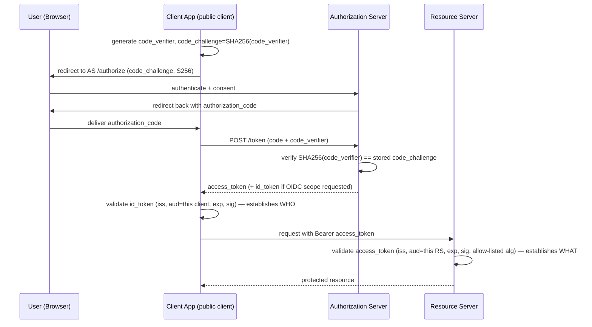

# Module 153 — OAuth2 / OIDC / JWT / PKCE: Fundamentals — Grant Types, PKCE & Token Structure

> Domain: OAuth2/OIDC/JWT/PKCE | Level: Beginner → Expert | Prerequisite: [[../40-IAM/01-IAM-Fundamentals-AuthN-AuthZ-Models-Directory-Federation]] (this module supplies the protocol-level authentication/token mechanics that module deliberately deferred), [[../40-IAM/02-Capstone-PAM-IdentityGovernance-ZeroTrustIdentity]] §2.6 (Zero Trust identity's per-request re-evaluation — token lifetime is this module's concrete protocol-level instance of that same duration-limits-risk principle), [[../21-AWS/02-IAM-Security-KMS-SecretsManager]] and [[../22-Azure/02-IAM-Security-EntraID-RBAC-KeyVault]] (cloud IAM services that issue and consume these tokens under the hood, not re-derived here)

>
> **Scope note:** `41-OAuth2-OIDC-JWT-PKCE` scoped as three modules (153-155), autonomously, per the standing "no more waiting" workflow decision: this module (flows, PKCE, JWT/OIDC fundamentals), a second on token lifecycle and sender-constraining (rotation, revocation, introspection, DPoP/mTLS), and a capstone on enterprise SSO/federation architecture at financial-services scale.

---

## 1. Fundamentals

**What:** **OAuth2** is an *authorization* delegation protocol — it lets a principal grant a third-party application bounded access to a resource without sharing their credentials with that application. **OpenID Connect (OIDC)** is a thin identity layer built directly on top of OAuth2, adding a standardized **ID token** that answers *authentication* — who the principal is — a question OAuth2 itself never answers. A **JWT (JSON Web Token)** is the token format both typically use: a compact, self-contained, cryptographically signed claim set. **PKCE (Proof Key for Code Exchange)** is an extension that closes a specific interception vulnerability in OAuth2's authorization-code flow for clients that cannot hold a secret.

**Why:** This is the single most consequential, most commonly conflated distinction in this entire domain, and Module 151 §1.1's authentication-vs-authorization distinction has its exact protocol-level instantiation here: **OAuth2 access tokens answer "what can this application do," OIDC ID tokens answer "who is this person."** An access token is not proof of identity, and treating it as one (using it to "authenticate" a user by merely inspecting it, rather than validating an ID token specifically) is this domain's most common, most consequential implementation error.

**When:** OAuth2 (with PKCE) is the standard for any application — first-party or third-party — obtaining delegated access to an API on a user's behalf. OIDC is layered on top whenever the application also needs to know who the user is (SSO, login). JWTs are the standard token format when the token's claims must be verifiable by a resource server without a round-trip to the issuer (self-contained validation) — Module 155 will cover when an opaque, non-self-contained token is the better choice.

**How (30,000-ft view — authorization code flow with PKCE):**
```
Client App                          Authorization Server              Resource Server
    │                                       │                               │
    │──1. generate code_verifier,           │                               │
    │     code_challenge = SHA256(verifier) │                               │
    │                                       │                               │
    │──2. redirect: /authorize?             │                               │
    │     code_challenge, code_challenge_method=S256 ──►                    │
    │                                       │                               │
    │                              User authenticates + consents            │
    │                                       │                               │
    │◄──3. redirect back with authorization_code ──                         │
    │                                       │                               │
    │──4. POST /token: code + code_verifier ──►                             │
    │                                       │──validates: SHA256(verifier)  │
    │                                       │   == stored code_challenge?   │
    │◄──5. access_token (+ id_token if OIDC) ──                             │
    │                                       │                               │
    │──6. Bearer access_token ──────────────────────────────────────►       │
    │                                       │                               │◄─validate JWT
```

---

## 2. Deep Dive

### 2.1 The four grant types that matter, and why the implicit grant is deprecated

- **Authorization Code (+ PKCE):** the standard flow for any client with a user present — web apps, mobile apps, SPAs. The authorization code is exchanged for tokens in a back-channel request, never exposed directly to the browser's redirect URI as a token.
- **Client Credentials:** for machine-to-machine access with no user present — a service authenticating as itself, not on behalf of anyone. Directly analogous to Module 151's service-account identity class.
- **Device Code:** for input-constrained devices (smart TVs, CLIs) — the device displays a code the user enters on a separate, trusted device to complete authorization.
- **Resource Owner Password Credentials (deprecated):** the client collects the user's actual password directly — reintroduces the exact credential-sharing problem OAuth2 exists to eliminate; retained historically only for legacy migration paths, never for new designs.
- **Implicit (deprecated):** returned the access token directly in the redirect URI fragment, with no back-channel exchange step. Deprecated because the token is exposed in browser history, referrer headers, and any script running in the page — a structurally weaker delivery channel than the authorization-code flow's back-channel exchange. Modern OAuth2 (RFC 8252, the current Security Best Current Practice) mandates authorization-code-with-PKCE for every client type, including SPAs previously told to use implicit.

### 2.2 Why PKCE exists — the specific vulnerability it closes

Before PKCE, a public client (one that cannot securely hold a client secret — a mobile app or SPA, whose binary/bundle any attacker can inspect) had no way to prove that the entity exchanging an authorization code for tokens was the same entity that initiated the flow. An attacker capable of intercepting the redirect (a malicious app registered for the same custom URI scheme on a mobile device, for instance) could capture the authorization code and exchange it for tokens itself — the code alone was sufficient bearer proof. PKCE closes this precisely: the client generates a random `code_verifier`, derives `code_challenge = SHA256(code_verifier)` (`S256` method — the plain method, which sends the verifier itself as the challenge, exists only for constrained legacy clients and is not the accepted current baseline), and sends only the challenge at the `/authorize` step. Redeeming the code at `/token` requires presenting the original `code_verifier`; the authorization server independently recomputes its hash and compares. **An attacker who intercepts only the authorization code — never the verifier, which never left the legitimate client — cannot complete the exchange.** This is the same "possession of a token alone is not proof of legitimate origin" principle Module 152 §2.2's session recording addresses for privileged sessions, applied at the protocol level to the authorization code itself.

### 2.3 JWT structure and the validation steps a resource server must not skip

A JWT is three base64url-encoded segments — `header.payload.signature`. The header names the signing algorithm (`alg`) and optionally a key identifier (`kid`, used to select which of the issuer's rotating signing keys validates this specific token — Module 155 develops key rotation). The payload carries claims: `iss` (issuer), `sub` (subject — the principal), `aud` (audience — which resource server this token is valid for), `exp`/`nbf` (validity window), plus custom claims. **A resource server validating a JWT must check all of the following, not merely that the signature verifies:**
1. Signature validates against the issuer's current public key for the algorithm/`kid` stated in the header.
2. `iss` matches an expected, trusted issuer — never accept any issuer the token merely claims.
3. `aud` includes this specific resource server — a token issued for a different audience must be rejected even if the signature is otherwise perfectly valid (§2.4's alg-confusion and audience-confusion attacks depend on exactly this check being skipped).
4. `exp` has not passed and `nbf` (if present) has been reached.
5. The signing algorithm itself is on an explicit allow-list matching what the issuer is expected to use — never accepted dynamically from the token's own `alg` header (§2.4).

### 2.4 The algorithm-confusion attack — why `alg` must never be trusted from the token itself

A JWT library that reads the `alg` header from the untrusted token and uses it to decide *how* to validate the signature has an exploitable trust inversion: if the library supports both asymmetric (`RS256`) and symmetric (`HS256`) algorithms, an attacker who knows the issuer's *public* RS256 key (which is, by design, publicly available) can craft a token with `alg: HS256` and sign it using the public key *as if it were an HMAC secret*. A naive validator that dynamically switches to HMAC validation based on the token's own header will use that same public key as the HMAC secret, and the forged signature validates. **The fix is structural, not a token-content check:** the resource server must decide, out-of-band, which single algorithm (or narrow allow-list) it expects for a given issuer, and reject any token whose header claims a different algorithm — never let the token's own header drive validator behavior.

### 2.5 OIDC's ID token vs. access token — the distinction Module 151 anticipated

The **ID token** is a JWT specifically intended for the *client application* to establish who authenticated — it must never be sent to a resource server as a bearer credential, and a resource server that accepts an ID token as if it were an access token has exactly inverted OAuth2/OIDC's authentication/authorization separation. The **access token** is intended for the *resource server* and, per current best practice, should itself be *audience-restricted to that specific resource server* — a single access token valid across every resource server in an estate reintroduces the exact "one credential grants broad access" risk Module 152's least-privilege discipline exists to eliminate at the identity-governance layer, now recurring at the token layer.

---

## 3. Visual Architecture



---

## 4. Production Example

**Problem:** A wealth-management platform's mobile app used the authorization-code flow (correctly, no implicit grant) but, during a rapid multi-client-type rollout, a newly-added internal reporting dashboard's resource-server middleware was configured to accept the *ID token* as its bearer credential for API calls, because a developer testing locally found it "worked" — both token types were valid JWTs signed by the same authorization server, and the middleware's validation logic checked only signature and expiry, not the token's intended audience or type.

**Architecture:** Single authorization server serving both the mobile client (needing an access token for the trading API) and the internal dashboard (needing an ID token for the login flow, and a separate, correctly-scoped access token for its own backend API).

**Implementation / What happened:** Because ID tokens are, per OIDC's own design, broadly issued to establish "who logged in" and are not scoped to any single resource server's audience the way a well-designed access token is, the dashboard's misconfigured middleware accepted *any valid ID token issued to any client*, including the mobile app's — meaning a token intended purely to tell the mobile app who its own user was could be replayed against the dashboard's API and be accepted as a valid credential, even though it was never intended to authorize any resource-server access whatsoever.

**Trade-offs:** No trade-off was actually being made here — this was a pure implementation defect, not a deliberate simplification, which is precisely why it went undetected: nothing about the system's behavior under normal use looked wrong, since legitimate ID tokens for the dashboard's own users also validated correctly by the same over-permissive check.

**Lessons learned:** **A resource server must validate not merely that a JWT is well-formed and correctly signed by a trusted issuer, but that it is the specific token *type* and *audience* intended for that resource server** — signature validity proves the issuer's endorsement of the claims, not that the claims authorize this particular use. This is the token-layer instance of Module 152 A9's recurring pattern: a control (JWT signature validation) correct and effective for its designed scope (proving issuer endorsement) silently provides no protection for a distinct, adjacent question (is this the right token type/audience for this specific use) that a naive implementation assumes is covered by the same check.

---

## 5. Best Practices

- **Always use authorization-code-with-PKCE, for every client type** — including confidential clients (RFC 8252/OAuth 2.1's current baseline), not merely public clients, since PKCE's origin-binding provides defense-in-depth even where a client secret also exists.
- **Enforce an explicit, out-of-band algorithm allow-list per issuer** on every JWT validator — never trust the token's own `alg` header to select validation behavior (§2.4).
- **Scope access tokens to the narrowest audience** (ideally a single resource server) rather than issuing one broad token valid across an entire estate.
- **Never accept an ID token as a resource-server bearer credential** — validate `aud`/token-type explicitly, not merely signature and expiry (§4).
- **Keep token lifetimes short**, consistent with Module 152 §2.6's Zero Trust duration-limitation principle — long-lived access tokens reintroduce the same standing-exposure risk Module 152 eliminated for privileged credentials, now at the API-access layer.
- **Validate every claim the specification requires** (`iss`, `aud`, `exp`, `nbf`, signature) on every request — never cache a "this token was valid once" result past its own stated expiry.

---

## 6. Anti-patterns

- **Implicit grant, or any flow exposing tokens in a browser redirect fragment**, for any new design — deprecated for a specific, structural exposure reason (§2.1), not merely stylistic preference.
- **Dynamic algorithm selection based on the token's own `alg` header** — the direct enabler of the algorithm-confusion attack (§2.4).
- **Treating "the JWT signature validated" as sufficient authorization** — skips the `aud`/`iss`/token-type checks that actually scope what the token proves (§4).
- **Long-lived, broadly-scoped access tokens "for convenience"** — reintroduces Module 152's standing-privilege risk at the token layer; a compromised token's blast radius should be bounded by both scope and time.
- **Storing tokens in `localStorage` for browser-based clients**, exposing them to any injected script (XSS) on the page — tokens should be held in memory or an `HttpOnly` cookie where the flow allows, minimizing the exfiltration surface.

---

## 7. Performance Engineering

JWT validation is CPU-bound (signature verification), not I/O-bound, for self-contained tokens — this is precisely the property that makes JWTs attractive at high request-throughput resource servers, since no network round-trip to the authorization server is required per request (contrast Module 155's opaque-token introspection cost). Signature verification cost is dominated by the algorithm choice: RSA signature verification is meaningfully more expensive per-operation than ECDSA at comparable security levels, a real consideration at trading-system request rates. Public-key caching (fetching the issuer's JWKS endpoint once and caching keyed by `kid`, refreshed on a TTL or on a cache-miss against an unrecognized `kid`) avoids a network round-trip per validation while still picking up key rotation (Module 155) within a bounded staleness window.

---

## 8. Security

PKCE closes the authorization-code-interception vulnerability for public clients (§2.2). The algorithm-confusion defense (§2.4) is a structural control, not a token-content check, and must be enforced at the validator-configuration level. Audience restriction (§2.5, §4) is the primary defense against token replay across resource servers — a token stolen from or leaked by one resource server should not be usable against another. Redirect URI validation at the authorization server (exact-match against a pre-registered allow-list, never wildcard or prefix matching) closes a separate open-redirect-style vulnerability where an attacker registers a malicious redirect URI to capture the authorization code. State parameter (a random, per-request value echoed back by the authorization server) defends against CSRF on the redirect callback specifically, a distinct concern from PKCE's code-verifier binding.

---

## 9. Scalability

Self-contained JWT validation scales horizontally with zero authorization-server load per validation (§7) — the defining scalability advantage over opaque, introspection-requiring tokens (Module 155). The trade-off this defers to Module 155: self-contained tokens cannot be synchronously revoked (a resource server has no way to know a token was revoked before its stated `exp` without an additional mechanism), which is precisely why token lifetime, not merely token format, is the primary lever bounding a compromised token's usable window at scale — directly recurring Module 152 §2.1's duration-vs-existence risk framing at the token layer.

---

## 10. Interview Questions

### Basic (10)

**B1. What is the difference between OAuth2 and OpenID Connect?**
*Ideal Answer:* OAuth2 is an authorization delegation protocol — it answers "what can this application do on the user's behalf." OIDC is an identity layer built on top of OAuth2 that adds a standardized ID token answering "who is this user" — a question OAuth2 alone never answers.
*Why correct:* Matches §1's core distinction, this domain's most consequential one.
*Common mistakes:* Describing OAuth2 as a "login protocol" — it was never designed to answer identity, only delegated access.
*Follow-up:* What specific token does OIDC add that OAuth2 alone doesn't have?

**B2. What problem does PKCE solve?**
*Ideal Answer:* It prevents an attacker who intercepts an authorization code (e.g., via a malicious app registered for the same redirect URI scheme) from exchanging it for tokens, by requiring the token exchange to present a secret (`code_verifier`) that never left the legitimate client and was never transmitted alongside the code itself.
*Why correct:* Matches §2.2.
*Common mistakes:* Describing PKCE as "encrypting the authorization code" — it doesn't encrypt anything; it binds the exchange to proof of possession of a value only the originating client has.
*Follow-up:* Why is the `S256` challenge method preferred over the `plain` method?

**B3. What are the three parts of a JWT?**
*Ideal Answer:* Header (algorithm, key ID), payload (claims), signature — base64url-encoded and dot-separated.
*Why correct:* Matches §2.3.
*Common mistakes:* Describing a JWT as "encrypted" — a standard signed JWT (JWS) is encoded and signed, not encrypted; its claims are readable by anyone who has the token, only tamper-evident, not confidential.
*Follow-up:* What claim(s) tell a validator which resource server the token is intended for?

**B4. What is the client credentials grant used for?**
*Ideal Answer:* Machine-to-machine authorization with no user present — a service obtaining a token to act as itself, not on behalf of any user.
*Why correct:* Matches §2.1.
*Common mistakes:* Confusing it with the resource owner password grant, which does involve a user's credentials.
*Follow-up:* What identity concept from Module 151 does a client-credentials principal correspond to?

**B5. Why is the implicit grant deprecated?**
*Ideal Answer:* It returns the access token directly in the browser redirect URI fragment with no back-channel exchange, exposing it to browser history, referrer leakage, and any script on the page — a structurally weaker delivery channel than the authorization-code flow.
*Why correct:* Matches §2.1.
*Common mistakes:* Saying it's deprecated "because it's old" without naming the specific exposure mechanism.
*Follow-up:* What flow, with what extension, replaced it as the current baseline for public clients?

**B6. What does the `aud` claim in a JWT mean, and why does it matter?**
*Ideal Answer:* Audience — which resource server(s) the token is valid for. A resource server must reject a token whose `aud` doesn't include itself, even if the signature is valid, or it risks accepting tokens intended for a different service.
*Why correct:* Matches §2.3, §2.5, §4.
*Common mistakes:* Treating signature validity alone as sufficient, skipping the audience check.
*Follow-up:* What happened in this module's §4 incident when an audience check was skipped?

**B7. What is the difference between an ID token and an access token?**
*Ideal Answer:* An ID token is for the client application, proving who authenticated. An access token is for the resource server, authorizing what the client can do. An ID token should never be used as a bearer credential against a resource server.
*Why correct:* Matches §2.5.
*Common mistakes:* Treating the two as interchangeable because both are JWTs signed by the same authorization server.
*Follow-up:* What specific validation check, if present, would have prevented §4's incident?

**B8. What does the `state` parameter in the authorization request protect against?**
*Ideal Answer:* CSRF on the redirect callback — it's a random, per-request value the client generates, sends in the authorization request, and verifies is echoed back unchanged on the redirect, ensuring the callback corresponds to a request this client actually initiated.
*Why correct:* Matches §8.
*Common mistakes:* Confusing `state`'s CSRF protection with PKCE's code-interception protection — they defend against different attacks.
*Follow-up:* Could an attacker who doesn't know the client's `code_verifier` still exploit a missing `state` check? How?

**B9. Why should JWT signature validation never trust the `alg` header to choose the validation algorithm?**
*Ideal Answer:* Because a validator that dynamically switches algorithms based on the token's own header is exploitable by an algorithm-confusion attack — an attacker can craft a token claiming a different algorithm (e.g., HMAC using the issuer's known-public RSA key as the HMAC secret) and forge a signature that validates.
*Why correct:* Matches §2.4.
*Common mistakes:* Describing this as "a bug in some libraries" rather than a structural trust-inversion the validator's design must explicitly prevent.
*Follow-up:* What should the validator use instead to decide which algorithm to expect?

**B10. What is a device code flow used for?**
*Ideal Answer:* Input-constrained devices (smart TVs, CLIs) where the device can't easily accept credential input directly — the user completes authorization on a separate, more capable device using a displayed code.
*Why correct:* Matches §2.1.
*Common mistakes:* Confusing it with the client-credentials flow — device code still involves a specific human user authorizing, unlike client credentials.
*Follow-up:* What UX risk does a device-code flow introduce that an authorization-code flow doesn't?

### Intermediate (10)

**I1. Walk through exactly how PKCE prevents an intercepted authorization code from being redeemed by an attacker.**
*Ideal Answer:* The legitimate client generates a random `code_verifier` and sends only its SHA-256 hash (`code_challenge`) at the `/authorize` step. Even if an attacker intercepts the returned authorization code, redeeming it at `/token` requires presenting the original `code_verifier`, which never left the legitimate client and was never transmitted with the code. The authorization server independently hashes the presented verifier and compares against the stored challenge; a mismatch (or missing verifier) rejects the exchange.
*Why correct:* Matches §2.2's full mechanics, not merely the existence of the feature.
*Common mistakes:* Describing PKCE as validating the code itself rather than validating proof of possession of a secret bound to the original request.
*Follow-up:* Why does using `S256` rather than sending the verifier as the challenge directly (`plain` method) matter?

**I2. Design a JWT validation routine for a resource server and enumerate every check it must perform, explaining why skipping any one is exploitable.**
*Ideal Answer:* (1) Signature validates against the issuer's key for an explicitly allow-listed algorithm (never the token's own `alg` header, §2.4); (2) `iss` matches a specifically trusted issuer; (3) `aud` includes this resource server (§4's incident is exactly this check missing); (4) `exp`/`nbf` are within the current validity window; (5) any required custom claims (e.g., token type) are present and correct.
*Why correct:* Synthesizes §2.3-§2.5 into a complete, exploitability-aware checklist.
*Common mistakes:* Listing only signature and expiry, the two checks most implementations get right by default, while omitting the audience/issuer/algorithm checks that are most often silently skipped.
*Follow-up:* Which of these checks, if skipped, would have prevented §4's incident specifically?

**I3. Why is a single, broadly-scoped access token valid across an entire estate a security anti-pattern, even if issued correctly?**
*Ideal Answer:* It reintroduces Module 152's standing-privilege-equivalent risk at the token layer — a single compromised token grants access proportional to its scope, not to what any individual request actually needed; audience-restricting tokens to individual resource servers bounds a compromise's blast radius the same way JIT elevation bounds a credential's usable window.
*Why correct:* Correctly imports Module 152's least-privilege reasoning to the token-scoping decision.
*Common mistakes:* Treating token scope purely as a developer-convenience trade-off without connecting it to the blast-radius/least-privilege principle.
*Follow-up:* What's the operational cost of narrowly-scoped, per-resource-server tokens, and how would you manage it at scale?

**I4. Compare self-contained JWTs against opaque, introspection-requiring tokens for a resource server's validation cost.**
*Ideal Answer:* Self-contained JWTs validate with zero network calls (CPU-bound signature check only), scaling with zero added authorization-server load per validation. Opaque tokens require a synchronous introspection call to the authorization server on every use, adding both latency and authorization-server load proportional to resource-server request volume.
*Why correct:* Matches §7, §9's performance/scalability framing.
*Common mistakes:* Presenting JWTs as strictly superior without naming the trade-off (§9's revocation-latency gap) Module 155 develops.
*Follow-up:* What can a self-contained JWT not do that an opaque, introspected token can?

**I5. Explain the algorithm-confusion attack precisely, including why it specifically requires a validator supporting both asymmetric and symmetric algorithms.**
*Ideal Answer:* If a validator dynamically selects HMAC or RSA/ECDSA verification based on the token's own `alg` header, and the issuer's RSA public key is (by design) publicly known, an attacker can craft a token with `alg: HS256` and sign it using that public key as an HMAC secret. A validator that trusts the header will use the same public key as the HMAC secret to verify, and the forged signature validates — because the attacker computed the exact same HMAC the validator will compute. This specifically requires the validator to support both algorithm families and choose dynamically; a validator that only ever attempts RSA verification for a given issuer is not exploitable this way.
*Why correct:* Matches §2.4's full mechanics and correctly identifies the precondition (dual-algorithm dynamic selection).
*Common mistakes:* Describing the attack vaguely as "using the wrong key" without explaining why the public key becomes usable as an HMAC secret specifically.
*Follow-up:* Does using `kid` to select among multiple valid keys reintroduce this risk if not implemented carefully? How?

**I6. Why must an ID token never be accepted as a resource-server bearer credential, even though it's a validly-signed JWT from a trusted issuer?**
*Ideal Answer:* An ID token is scoped, by OIDC's design, to prove authentication to the client application — it is not intended to authorize resource access and, per §4's incident, may not carry the audience restriction an access token should, making it broadly acceptable across multiple relying parties in a way that defeats the purpose of scoped authorization.
*Why correct:* Matches §2.5 and §4 directly.
*Common mistakes:* Reasoning "it's signed by a trusted issuer, so it should be fine" — signature trust and intended-use scope are separate properties, per §4's core lesson.
*Follow-up:* What specific claim or token-type marker would let a resource server reject a misused ID token even without a full audience-scoping fix?

**I7. Design the redirect URI validation an authorization server should perform, and explain why exact-match matters over prefix or wildcard matching.**
*Ideal Answer:* The authorization server should validate the requested `redirect_uri` against an exact-match, pre-registered allow-list per client. Prefix or wildcard matching allows an attacker to register or exploit a subpath/subdomain under the allowed pattern to redirect the authorization code to an attacker-controlled endpoint, defeating the entire flow's confidentiality regardless of PKCE.
*Why correct:* Matches §8's redirect-URI-validation control.
*Common mistakes:* Assuming PKCE alone is sufficient protection — PKCE protects the code-exchange step, not where the code is initially delivered.
*Follow-up:* Does PKCE provide any protection if the redirect URI itself is compromised via a wildcard-matching flaw? Why or why not?

**I8. A mobile app stores its access token in the device's shared, unencrypted app-preferences storage "for simplicity." What's the risk, and what's the correct alternative?**
*Ideal Answer:* Unencrypted shared storage is readable by any other app with sufficient device permissions or by physical device access, exposing the token to theft independent of any protocol-level flaw. Correct alternative: platform-provided secure storage (Keychain on iOS, Keystore-backed encrypted storage on Android), combined with short token lifetimes (§5) to bound the exposure window even if storage is somehow compromised.
*Why correct:* Extends §6's anti-pattern (browser `localStorage`) to the mobile equivalent, correctly pairing storage security with lifetime as complementary, not substitute, controls.
*Common mistakes:* Proposing only better storage without also addressing token lifetime as a second, independent mitigating control.
*Follow-up:* Why does short token lifetime remain valuable even with perfectly secure storage?

**I9. Why does the client-credentials grant not need PKCE?**
*Ideal Answer:* PKCE protects the authorization-code flow specifically because a public client cannot hold a secret and a user-facing redirect is involved, both exploitable by code interception. Client credentials involves no user, no redirect, and the client authenticates directly to the token endpoint using its own confidential credential (or a stronger client-authentication mechanism) — there is no authorization code to intercept.
*Why correct:* Correctly identifies that PKCE addresses a specific flow's specific vulnerability, not a universal requirement across all grant types.
*Common mistakes:* Assuming PKCE is a blanket OAuth2 security requirement rather than scoped to the authorization-code flow's specific threat model.
*Follow-up:* What client-authentication mechanisms are appropriate for a client-credentials grant, and how do they differ in strength?

**I10. How would you detect, in production, that a resource server is accepting tokens with an incorrect or missing audience check, before it becomes an incident like §4's?**
*Ideal Answer:* Static configuration review/linting of resource-server JWT validation middleware against a checklist (I2); synthetic testing that deliberately presents a wrong-audience, otherwise-valid token and asserts rejection, run continuously as a canary (recurring Module 149 §14/Module 152 A10's canary-must-be-revalidated discipline); centralized, shared validation library/middleware enforced across all resource servers rather than each team implementing its own checks independently, reducing the chance of a per-service omission like §4's.
*Why correct:* Applies this course's recurring "verify the verifier" and shared-platform-reduces-variance themes (Module 139) to JWT validation specifically.
*Common mistakes:* Proposing only a one-time code review, which doesn't catch drift if validation logic changes later without re-review.
*Follow-up:* What's the case for a centralized token-validation library versus each resource server implementing its own, given Module 139's finding about platform adoption lagging currency?

### Advanced (10)

**A1. Design the complete authorization-code-with-PKCE flow for a public SPA client, including every security control at each step, and justify each.**
*Ideal Answer:* (1) Client generates a cryptographically random `code_verifier` and per-request `state`; (2) redirects to `/authorize` with `code_challenge` (S256), `state`, and an exact-registered `redirect_uri`; (3) authorization server validates `redirect_uri` against its exact-match allow-list (I7) before proceeding; (4) user authenticates and consents; (5) authorization server redirects back with `code` and the same `state`; (6) client verifies the returned `state` matches what it generated (CSRF defense, B8) before proceeding; (7) client POSTs `code` + `code_verifier` to `/token` over a back-channel request (never in a redirect); (8) authorization server verifies SHA-256(`code_verifier`) matches the stored `code_challenge` (I1) before issuing tokens; (9) client stores the resulting tokens in memory or secure storage (I8), never `localStorage`; (10) resulting access token is scoped to a single resource server audience (I3).
*Why correct:* Synthesizes every control this module develops into one coherent, correctly-ordered flow with explicit justification per step.
*Common mistakes:* Omitting the `state` verification step specifically, since PKCE alone is easy to mistake for "solving CSRF too" when it solves a distinct problem (I7).
*Follow-up:* Which single step, if omitted, would make this flow vulnerable to the exact attack PKCE was introduced to prevent?

**A2. §4's incident happened because a resource server's middleware accepted any validly-signed JWT regardless of intended audience or type. Design an organizational control, not just a code fix, to prevent recurrence across dozens of independently-built resource servers.**
*Ideal Answer:* A shared, centrally-maintained token-validation library/middleware (Module 139's platform-as-product framing) that enforces the full checklist (I2) by default, making the secure behavior the path of least resistance rather than something each team must independently implement correctly; paired with a synthetic canary test (I10) run against every resource server's live validation endpoint, continuously, verifying wrong-audience and wrong-type tokens are actually rejected — not merely that the shared library exists, since Module 139 §250 established that library *adoption* doesn't guarantee *currency* or *correct configuration* at each consuming service.
*Why correct:* Correctly generalizes from a single-service fix to an organization-scale control, explicitly reusing Module 139's platform-adoption-vs-currency distinction.
*Common mistakes:* Proposing only "write better documentation" or "code review," both of which Module 139's own findings show don't reliably prevent drift at scale.
*Follow-up:* How would you distinguish, at an estate-wide level, "using the shared library" from "correctly configured with the shared library," the way Module 139 distinguished library-reference from library-version?

**A3. Formally explain why PKCE's protection depends specifically on the `code_verifier` never being transmitted alongside the authorization code at any point, and what would break if a client sent both together at step 2.**
*Ideal Answer:* PKCE's entire security property rests on the code exchange requiring proof of possession of a secret (`code_verifier`) that only the legitimate client holds. If the client sent the `code_verifier` alongside the initial `/authorize` request (rather than only its hash, the `code_challenge`), an attacker capable of intercepting that request (or the subsequent redirect, which carries the same information forward through the flow) would have both the code and the verifier needed to complete the exchange — collapsing PKCE back to the pre-PKCE, code-alone-is-sufficient vulnerability it exists to close.
*Why correct:* Correctly identifies that PKCE's security depends on the hash/pre-image asymmetry being preserved end-to-end, not merely on PKCE's presence in the flow.
*Common mistakes:* Describing PKCE as inherently secure "because it's PKCE" without identifying the specific invariant (verifier never transmitted until the back-channel exchange) that must hold for the protection to actually apply.
*Follow-up:* Does storing the `code_verifier` in the browser's `sessionStorage` between steps introduce any risk PKCE's design doesn't address?

**A4. A resource server validates JWTs by fetching the issuer's JWKS (public keys) once at startup and never refreshing. What failure mode does this create, and how do you fix it without losing the performance benefit of caching?**
*Ideal Answer:* If the issuer rotates its signing key (routine key-rotation practice, Module 155), tokens signed with the new key will fail validation because the resource server's cached key set is stale — a legitimate, correctly-issued token is rejected, the reverse failure direction from a security hole but still a production outage. Fix: cache JWKS with a TTL-based refresh, plus a fallback refresh-on-`kid`-miss (if a token references a `kid` not in the current cache, refetch once before rejecting) — preserving the no-round-trip-per-validation performance property (§7) for the common case while remaining correct across key rotation.
*Why correct:* Correctly identifies a distinct, non-security production-availability failure mode from a caching strategy that's individually reasonable (avoid a network call per validation) but incomplete against a real operational event (key rotation).
*Common mistakes:* Proposing to simply increase cache TTL, which shrinks but doesn't eliminate the staleness window, or removing caching entirely, which reintroduces §7's per-validation network-call cost at scale.
*Follow-up:* How does this failure mode differ in blast radius from a resource server that never validates `kid` at all and always uses whatever single key it first cached?

**A5. Compare the security properties of a short-lived JWT access token against a longer-lived opaque token backed by synchronous introspection, specifically for the scenario of a compromised token.**
*Ideal Answer:* A short-lived JWT bounds a compromise's usable window by expiry alone — the authorization server cannot revoke it early without an additional out-of-band mechanism, so the token remains valid for its full stated lifetime regardless of any detected compromise. An opaque token backed by introspection can be revoked instantly at the authorization server, and every subsequent introspection call will reflect that revocation immediately — trading the JWT's zero-round-trip performance advantage (§7, I4) for genuine, immediate revocability.
*Why correct:* Correctly articulates the precise trade this module defers fully to Module 155, using compromise-response speed as the concrete comparison axis.
*Common mistakes:* Treating "short-lived" as functionally equivalent to "revocable" — they bound the same risk via different mechanisms (elapsed time vs. active check) with materially different response latency to an active, in-progress compromise.
*Follow-up:* What hybrid approach would give JWT-like validation performance with closer-to-immediate revocability, and what does it cost?

**A6. Design an incident-response runbook for "we suspect our JWT signing key has been compromised," covering both the immediate and downstream steps.**
*Ideal Answer:* Immediate: rotate the signing key (issue a new key, add its public counterpart to the JWKS endpoint under a new `kid`, begin signing new tokens with it); revoke or otherwise invalidate the old key's trust for new validation as soon as operationally possible, accepting that already-issued, still-unexpired tokens signed with the compromised key remain valid until their own `exp` unless a separate revocation/deny-list mechanism exists (A5's exact trade-off, now under incident pressure). Downstream: audit access logs for tokens signed with the compromised key used after the suspected compromise window began; if any resource server lacks per-`kid` tracking in its logs, this audit is structurally incomplete — a finding that should itself become a standing logging requirement going forward.
*Why correct:* Correctly identifies that JWT's non-revocability (A5) becomes the central operational constraint under exactly this incident type, and that logging gaps discovered mid-incident are themselves a finding to fix afterward.
*Common mistakes:* Assuming "rotate the key" alone fully remediates the incident, without addressing already-issued tokens still valid under the old key.
*Follow-up:* What would change about this runbook if the resource servers used opaque, introspected tokens instead?

**A7. Explain why audience restriction (§2.5) and algorithm allow-listing (§2.4) are both necessary and neither alone is sufficient to prevent §4's class of incident.**
*Ideal Answer:* Algorithm allow-listing prevents an attacker from *forging* a signature the resource server would otherwise trust — it protects the integrity of the "this issuer endorsed these claims" guarantee. Audience restriction ensures that even a genuinely, correctly-issued token (no forgery involved, exactly §4's scenario) is only accepted for its intended use. §4's incident involved no forged signature at all — a completely legitimate, correctly-signed ID token was misused as an access token — so algorithm allow-listing provides zero protection against it; only audience/token-type validation does. Conversely, algorithm allow-listing protects against a threat (forgery) that audience restriction alone does nothing to prevent.
*Why correct:* Correctly distinguishes the two controls' non-overlapping threat coverage rather than treating "JWT security" as one undifferentiated property.
*Common mistakes:* Conflating "properly validating a JWT" into one step, missing that different validation failures are exploited by structurally different attacks requiring structurally different, independently-necessary defenses.
*Follow-up:* Name a third, distinct JWT validation failure mode not covered by either control, and what specifically defends against it.

**A8. A client-credentials-authenticated service account's token is scoped with far broader permissions than the service actually uses, discovered during a Module 152-style access certification review. How does this recur Module 152's findings at the OAuth2 layer, and what's the fix?**
*Ideal Answer:* This is Module 152 §2.4's entitlement-drift/least-privilege discipline applied to OAuth2 client-credentials scopes specifically — a service's registered OAuth2 `scope` grant is itself an entitlement subject to the same certification and right-sizing discipline as any other IAM entitlement, not a one-time configuration decision exempt from governance. Fix: include OAuth2 client registrations and their granted scopes explicitly within the same access-certification campaigns (Module 152 §2.4) covering the rest of the identity estate, with drift detection extended to cover scope changes on client registrations, not just human-principal role grants.
*Why correct:* Correctly generalizes Module 152's governance discipline to a token-layer entitlement type easily overlooked because it's configured at the protocol/client-registration layer rather than the traditional IAM role-assignment layer.
*Common mistakes:* Treating OAuth2 client scopes as a purely technical/protocol concern outside IAM governance's scope, rather than recognizing them as another entitlement class subject to the identical least-privilege and drift risks.
*Follow-up:* What technical mechanism would let you measure a client-credentials service's *actually used* scopes versus its *granted* scopes, analogous to Module 139's adoption-vs-currency measurement gap?

**A9. Design a test suite that would have caught §4's incident before it reached production.**
*Ideal Answer:* A negative test asserting the dashboard's resource-server middleware *rejects* a validly-signed ID token presented as a bearer credential (distinct from a positive test merely confirming legitimate access tokens are accepted); a negative test asserting rejection of a token whose `aud` does not include this specific resource server; both run as part of the shared validation library's own test suite (A2) and, ideally, as a continuously-run synthetic canary against each live deployment (I10), not merely a one-time pre-deployment check.
*Why correct:* Correctly identifies that the original testing gap was an absent *negative* test — positive-path tests (legitimate tokens work) were almost certainly present and passing throughout, exactly the mocked/happy-path blindness Module 144 identified as a recurring testing-discipline gap in a different domain.
*Common mistakes:* Proposing only positive-path testing improvements, missing that the actual gap was the specific absence of negative, should-be-rejected test cases.
*Follow-up:* How does this recur Module 144's finding that a passing test suite with no code-level bug still missed the entire real failure class?

**A10. Critique: "Our resource servers only need to validate the JWT signature — everything else (audience, issuer, expiry) is the authorization server's job to get right before it issues the token."**
*Ideal Answer:* Incorrect. The authorization server is responsible for correctly *issuing* claims (setting the right `aud`, `exp`, `iss` on the token it hands out) — but it has no control over which resource server ultimately receives and validates that token, or whether a client misuses a token issued for one purpose against a different resource server (exactly §4's incident, where the token itself was entirely correctly issued). Claim validation is inescapably the resource server's own responsibility, precisely because the resource server is the only party in a position to check "is this claim correct *for me, specifically, right now*" — the authorization server cannot verify that on the resource server's behalf.
*Why correct:* Directly refutes a plausible-sounding but incorrect division of responsibility, using §4's incident (where the authorization server did nothing wrong) as the concrete counterexample.
*Common mistakes:* Accepting the claim because "the authorization server is the trusted party," conflating trust in the issuer's claims with responsibility for verifying those claims apply to this specific validation context.
*Follow-up:* What would change about this division of responsibility if the resource server used opaque tokens with synchronous introspection instead of self-contained JWTs?

---

## 11. Coding Exercises

### Easy — PKCE code_verifier and code_challenge generation

**Problem:** Generate a cryptographically random `code_verifier` and derive its `S256` `code_challenge`, per RFC 7636.

**Solution (C#):**
```csharp
using System.Security.Cryptography;

public static class Pkce
{
    public static string GenerateCodeVerifier()
    {
        var bytes = RandomNumberGenerator.GetBytes(32); // 256 bits of entropy
        return Base64UrlEncode(bytes);
    }

    public static string DeriveCodeChallenge(string codeVerifier)
    {
        var hash = SHA256.HashData(System.Text.Encoding.ASCII.GetBytes(codeVerifier));
        return Base64UrlEncode(hash);
    }

    private static string Base64UrlEncode(byte[] bytes) =>
        Convert.ToBase64String(bytes).TrimEnd('=').Replace('+', '-').Replace('/', '_');
}
```
**Time complexity:** O(1) (fixed-size input). **Space complexity:** O(1).

**Optimized solution:** Already optimal; the realistic hardening is ensuring `RandomNumberGenerator` (a CSPRNG) is used rather than `Random` — a non-cryptographic RNG here would silently reintroduce the exact interception vulnerability PKCE exists to close, since a predictable verifier is no better than no verifier at all.

### Medium — JWT claim validation (audience, issuer, expiry)

**Problem:** Given a decoded JWT's claims, validate `iss`, `aud`, `exp`, and `nbf` against an expected configuration — the exact check missing in §4's incident.

**Solution (C#):**
```csharp
public sealed record JwtValidationConfig(string ExpectedIssuer, string ExpectedAudience);

public static class ClaimValidator
{
    public static (bool Valid, string? Reason) Validate(
        IDictionary<string, object> claims, JwtValidationConfig config, DateTimeOffset now)
    {
        if (!claims.TryGetValue("iss", out var iss) || (string)iss != config.ExpectedIssuer)
            return (false, "issuer mismatch");

        if (!claims.TryGetValue("aud", out var audObj))
            return (false, "audience missing");
        var audiences = audObj is IEnumerable<object> list
            ? list.Select(a => a.ToString()).ToHashSet()
            : new HashSet<string?> { audObj.ToString() };
        if (!audiences.Contains(config.ExpectedAudience))
            return (false, "audience does not include this resource server"); // §4's exact missing check

        if (!claims.TryGetValue("exp", out var expObj) ||
            DateTimeOffset.FromUnixTimeSeconds(Convert.ToInt64(expObj)) <= now)
            return (false, "token expired");

        if (claims.TryGetValue("nbf", out var nbfObj) &&
            DateTimeOffset.FromUnixTimeSeconds(Convert.ToInt64(nbfObj)) > now)
            return (false, "token not yet valid");

        return (true, null);
    }
}
```
**Time complexity:** O(A) where A = number of audience entries. **Space complexity:** O(A).

**Optimized solution:** In production, this claim check is only half of validation — it must run *after* cryptographic signature verification against an out-of-band algorithm allow-list (§2.4), never on unverified claims alone; combine with the JWKS caching pattern from A4 to avoid a network call per request while remaining correct across key rotation.

### Hard — Algorithm-confusion-resistant JWT validator

**Problem:** Implement a JWT validator wrapper that enforces a per-issuer algorithm allow-list, refusing to validate using any algorithm not explicitly configured for that issuer — regardless of what the token's own header claims — closing §2.4's vulnerability structurally.

**Solution (C#, illustrative structure over a hypothetical low-level JWT library):**
```csharp
public sealed class SafeJwtValidator
{
    // Configured out-of-band, NEVER derived from the token itself.
    private readonly Dictionary<string, (string AllowedAlg, Func<string> GetPublicKeyPem)> _issuerConfig;

    public SafeJwtValidator(Dictionary<string, (string, Func<string>)> issuerConfig) =>
        _issuerConfig = issuerConfig;

    public JwtValidationResult Validate(string rawToken)
    {
        var (header, payload, signature) = JwtParser.SplitUnverified(rawToken);

        if (!payload.TryGetValue("iss", out var issObj) || issObj is not string iss)
            return JwtValidationResult.Reject("missing issuer");

        if (!_issuerConfig.TryGetValue(iss, out var config))
            return JwtValidationResult.Reject("untrusted issuer");

        // Critical: compare the token's claimed alg against our OWN configured
        // expectation for this issuer. Never branch validator behavior on header.alg.
        var claimedAlg = header.TryGetValue("alg", out var a) ? a?.ToString() : null;
        if (claimedAlg != config.AllowedAlg)
            return JwtValidationResult.Reject(
                $"algorithm mismatch: expected {config.AllowedAlg}, token claims {claimedAlg}");

        var verified = CryptoVerify.VerifySignature(
            rawToken, algorithm: config.AllowedAlg, publicKeyPem: config.GetPublicKeyPem());

        return verified
            ? JwtValidationResult.Accept(payload)
            : JwtValidationResult.Reject("signature verification failed");
    }
}

public sealed record JwtValidationResult(bool IsValid, string? RejectReason, IDictionary<string, object>? Claims)
{
    public static JwtValidationResult Accept(IDictionary<string, object> claims) => new(true, null, claims);
    public static JwtValidationResult Reject(string reason) => new(false, reason, null);
}
```
**Time complexity:** O(1) signature verification plus O(C) claim parsing (C = claim count). **Space complexity:** O(C).

**Optimized solution:** Pair with the claim validator (Medium exercise) run only on the `Claims` returned after `IsValid` is confirmed — never on unverified payload contents — and with A4's JWKS caching for `GetPublicKeyPem`, refreshed on TTL or `kid`-miss, to avoid a per-request network fetch while staying correct across key rotation.

### Expert — Token-audience-scoped request router with defense-in-depth

**Problem:** Design a request-handling pipeline for a resource server that (1) validates a bearer token per the full checklist (I2), (2) explicitly rejects ID tokens presented as access tokens even if otherwise well-formed (§4's exact incident), and (3) logs the `kid` used for every validated token to support A6's incident-response audit requirement.

**Solution (C#):**
```csharp
public enum TokenType { Access, Id, Unknown }

public sealed class ResourceServerTokenPipeline
{
    private readonly SafeJwtValidator _validator;
    private readonly string _thisResourceServerAudience;
    private readonly Action<string, string> _logKidUsage; // (kid, sub) -> audit log, for A6

    public ResourceServerTokenPipeline(
        SafeJwtValidator validator, string thisResourceServerAudience, Action<string, string> logKidUsage)
    {
        _validator = validator;
        _thisResourceServerAudience = thisResourceServerAudience;
        _logKidUsage = logKidUsage;
    }

    public AuthorizationOutcome Authorize(string rawToken, DateTimeOffset now)
    {
        var result = _validator.Validate(rawToken);
        if (!result.IsValid)
            return AuthorizationOutcome.Deny($"invalid token: {result.RejectReason}");

        var claims = result.Claims!;

        // §4's exact missing check: explicitly reject ID tokens used as access tokens.
        // A well-formed access token MUST NOT declare typ=id_token, and conversely.
        if (claims.TryGetValue("typ", out var typ) && typ?.ToString() == "id_token")
            return AuthorizationOutcome.Deny("ID token presented as access token — rejected");

        var claimConfig = new JwtValidationConfig(
            ExpectedIssuer: claims["iss"].ToString()!,
            ExpectedAudience: _thisResourceServerAudience);
        var (valid, reason) = ClaimValidator.Validate(claims, claimConfig, now);
        if (!valid)
            return AuthorizationOutcome.Deny($"claim validation failed: {reason}");

        var kid = claims.TryGetValue("kid", out var k) ? k?.ToString() ?? "unknown" : "unknown";
        var sub = claims.TryGetValue("sub", out var s) ? s?.ToString() ?? "unknown" : "unknown";
        _logKidUsage(kid, sub); // enables A6's "audit every kid used after a suspected compromise" step

        return AuthorizationOutcome.Allow(sub);
    }
}

public sealed record AuthorizationOutcome(bool IsAllowed, string? DenyReason, string? Subject)
{
    public static AuthorizationOutcome Allow(string subject) => new(true, null, subject);
    public static AuthorizationOutcome Deny(string reason) => new(false, reason, null);
}
```
**Time complexity:** O(1) validation plus O(C) claim checks, same as the Hard exercise. **Space complexity:** O(C).

**Optimized solution:** In production, `_logKidUsage` should write to an append-only, centrally-queryable audit store (Module 152 §12's audit-log pattern) rather than a local log file, so A6's incident-response audit ("find every token used, signed by the compromised key, since the suspected compromise window began") is a single query rather than a multi-service log-aggregation exercise under incident time pressure.

---

## 12. System Design

**Requirements**

*Functional:* Authorization-code-with-PKCE flow for user-present clients; client-credentials flow for machine-to-machine; OIDC ID token issuance for authentication; JWT access-token issuance, audience-scoped per resource server; centralized, shared token-validation library/middleware (A2) for all resource servers.

*Non-functional:* Token validation must not require a network round-trip per request for the common case (§7, I4); JWKS key rotation must not cause validation outages (A4); every resource server's validation logic must be centrally auditable for the negative-test coverage A9 requires; audit logging of `kid`/`sub` per validated request to support A6-style incident response.

**Architecture**
```
   Client App ──► Authorization Server ──► JWKS endpoint (public keys, rotated)
        │               │
        │      issues: access_token (aud=specific RS), id_token (for client only)
        ▼
   Resource Server 1..N
        │
   Shared Token-Validation Middleware (centrally maintained, A2)
        ├─ signature verify (algorithm allow-listed per issuer, §2.4)
        ├─ iss / aud / exp / nbf checks (§2.3, I2)
        ├─ token-type check (reject id_token as bearer, §4)
        └─ audit log: kid, sub, resource server, outcome
```

**Database selection:** No database required for stateless JWT validation itself; audit logs go to an append-only store (Module 152 §12's LSM-tree-friendly write-heavy pattern); JWKS cache is in-memory per resource-server instance, refreshed via TTL/`kid`-miss (A4).

**Caching:** JWKS public keys cached per resource server instance with TTL refresh and fallback refresh-on-unknown-`kid` (A4) — the central scalability lever making self-contained JWT validation viable at high request throughput (§7, §9).

**Messaging:** Not applicable to the synchronous validation path itself; audit log entries may be emitted asynchronously to an event stream for downstream security-analytics consumption without blocking the request path.

**Scaling:** Validation scales horizontally with zero added authorization-server load per request (§9) — the JWT format's core scalability advantage over introspection-requiring opaque tokens, which Module 155 will show does not hold once synchronous revocability is required.

**Failure handling:** JWKS fetch failure on a `kid`-miss should fail closed (reject the token) rather than open, and should alert — silently accepting unvalidatable tokens is a worse failure mode than a temporary validation outage. Authorization server unavailability blocks new token issuance but must not invalidate already-issued, unexpired tokens (a resource server validates locally against cached keys, so it keeps functioning during a brief authorization-server outage — this availability property returns as a revocation trade-off in Module 155).

**Monitoring:** Rejection-reason breakdown per resource server (a spike in "audience mismatch" rejections may indicate a misconfigured client, while a spike in "token-type" rejections may indicate exactly §4's misuse pattern recurring elsewhere); JWKS cache-refresh failure rate; per-`kid` usage volume (supports A6's incident audit and also surfaces an old key still seeing heavy use well past when a rotation should have shifted traffic to the new one).

**Trade-offs:** Self-contained JWT (fast, not synchronously revocable) vs. opaque/introspected tokens (slower, immediately revocable) — fully developed in Module 155; centralized validation library (consistent, but an adoption/currency gap per Module 139) vs. per-service implementation (flexible, but reproduces §4's exact per-service omission risk).

---

## 13. Low-Level Design

**Requirements:** Model the authorization flow, PKCE binding, and resource-server validation pipeline as a cohesive, testable object model supporting the negative-test coverage A9 requires and the centralized-validation goal from A2.

**Class diagram (textual):**
```
IAuthorizationFlow
 ├─ AuthorizationCodeWithPkceFlow : IAuthorizationFlow
 └─ ClientCredentialsFlow : IAuthorizationFlow

PkceChallenge
 ├─ CodeVerifier, CodeChallenge (from Coding Exercise Easy)
 └─ Verify(presentedVerifier) : bool

SafeJwtValidator  (from Coding Exercise Hard)
 ├─ IssuerConfig : Dictionary<issuer, (allowedAlg, keyProvider)>
 └─ Validate(rawToken) : JwtValidationResult

ClaimValidator  (from Coding Exercise Medium)
 └─ Validate(claims, config, now) : (bool, reason)

ResourceServerTokenPipeline  (from Coding Exercise Expert)
 ├─ composes SafeJwtValidator + ClaimValidator
 ├─ rejects id_token-typed tokens explicitly (§4 fix)
 └─ Authorize(rawToken, now) : AuthorizationOutcome

JwksKeyCache
 ├─ GetKey(kid) : refresh-on-miss (A4)
 └─ RefreshOnTtl()
```

**Sequence diagram:** See §3's mermaid diagram — the LLD composes directly onto that flow, with `ResourceServerTokenPipeline.Authorize` implementing the "validate access_token" step and `PkceChallenge.Verify` implementing the authorization server's code-exchange verification step.

**Design patterns used:** Strategy (`IAuthorizationFlow` — authorization-code-with-PKCE vs. client-credentials, selected per client type); Chain of Responsibility (the validation pipeline's ordered checks — signature, then issuer/audience/expiry, then token-type — each stage able to short-circuit on failure, mirroring I2's ordered checklist); Decorator (the shared validation middleware, A2, wrapping each resource server's own business logic without requiring each to reimplement the checklist).

**SOLID mapping:** SRP — `PkceChallenge` only handles verifier/challenge binding, `SafeJwtValidator` only handles cryptographic + algorithm-scope validation, `ClaimValidator` only handles claim-content checks, each independently unit-testable (directly enabling A9's negative-test suite); OCP — new `IAuthorizationFlow` implementations (e.g., device-code) extend without modifying existing flows; DIP — `ResourceServerTokenPipeline` depends on `SafeJwtValidator`'s abstraction, not a concrete crypto library, allowing the underlying JWT library to be swapped without touching call sites.

**Extensibility:** A new required claim check (e.g., a custom `tenant_id` claim for multi-tenant isolation) can be added to `ClaimValidator` without touching `SafeJwtValidator`'s cryptographic layer; a new token type beyond access/ID (e.g., a refresh token, Module 155) extends the `typ` check without restructuring the pipeline.

**Concurrency/thread safety:** `JwksKeyCache` must handle concurrent refresh-on-miss safely — multiple simultaneous requests referencing the same unknown `kid` should trigger at most one in-flight refresh (coalesced via a per-`kid` lock or a `Lazy<Task<T>>` pattern), not one refresh call per concurrent request, which would otherwise create a thundering-herd load spike against the JWKS endpoint precisely during a key-rotation event — the highest-traffic moment for cache misses.

---

## 14. Production Debugging

**Incident:** A payments platform's newly-deployed partner API resource server begins intermittently rejecting valid partner requests with "invalid token" errors, clustering entirely around key-rotation events on the authorization server, roughly every 30 minutes for a few seconds at a time.

**Root cause:** The resource server's JWT validation middleware cached the authorization server's JWKS at process startup with no refresh mechanism at all (A4's exact failure mode) — but unlike A4's simpler "never refreshes" case, this deployment ran multiple resource-server instances behind a load balancer, each started at a slightly different time, so each instance's cached key set went stale at a slightly different moment relative to the authorization server's rotation schedule, producing a rolling, intermittent failure pattern across instances rather than a single clean outage window — which is what made the pattern initially look like a load-balancer or network flakiness issue rather than a token-validation configuration gap.

**Investigation:** Correlating rejection timestamps per instance against the authorization server's key-rotation event log (once someone thought to check it) showed each instance's failure window began almost exactly at its own next key-rotation event after startup, and resolved once the instance was eventually restarted (picking up the new key at startup, only to repeat the cycle at the next rotation). The rolling, staggered pattern across instances had misled initial triage toward infrastructure causes for several hours.

**Tools:** Authorization-server key-rotation audit log; per-instance JWT validation rejection logs correlated by timestamp and instance ID; JWKS endpoint response inspection confirming the new key was available and correctly published throughout — ruling out an authorization-server-side issue.

**Fix:** JWKS caching changed to TTL-based refresh (a conservative interval well under the rotation cadence) plus refresh-on-`kid`-miss (A4) — an unrecognized `kid` triggers one immediate refetch before rejecting, closing the staleness window down to effectively the JWKS endpoint's own response latency rather than depending on any instance's startup timing.

**Prevention:** Any cache with a real-world upstream rotation/change event (JWKS keys, feature-flag configuration, any credential) must be designed against the *event*, not merely a fixed TTL assumed longer than any realistic staleness window — and must be tested against an actual rotation event in a staging environment before production deployment, not merely assumed correct because a TTL value "seems long enough." This directly recurs Module 148 §14's lesson about configuration changes reasoned as "only ever produces a harmless side effect" crossing a threshold no one explicitly tested against a real triggering event.

---

## 15. Architecture Decision

**Decision:** How should client authentication and token exchange be structured across an enterprise's mix of public clients (mobile, SPA), confidential clients (backend services), and machine-to-machine service accounts?

**Option A — One uniform flow (authorization-code-with-PKCE) for every client type, including machine-to-machine:**
*Advantages:* Maximal consistency, one code path to secure and audit. *Disadvantages:* Client-credentials scenarios have no user and no redirect — forcing PKCE onto them adds meaningless complexity without addressing any actual threat in that context (I9), and misrepresents the trust model to anyone reading the integration later. *Cost:* Low apparent cost, but conceptually confusing. *Risk:* Low technical risk, moderate maintainability/clarity risk.

**Option B — Fully independent, per-team-chosen flows and validation logic per client type:**
*Advantages:* Maximum flexibility per integration's specific needs. *Disadvantages:* Reproduces exactly §4's and §14's failure shape at estate scale — every team's independently-built validation logic is an independent opportunity to omit a check (audience, token-type, JWKS refresh) that a shared implementation would have gotten right once. *Cost:* Low per-integration cost, high aggregate cost from repeated, independently-discovered defects. *Risk:* High, demonstrated directly by this module's own incidents.

**Option C — Flow selection matched to client trust category (authorization-code-with-PKCE for user-present clients, client-credentials for machine-to-machine), backed by one shared, centrally-maintained validation library enforced across all resource servers (recommended):**
*Advantages:* Matches each flow's actual threat model (I9) while eliminating the per-service validation-logic variance that caused both this module's production incidents; centralization makes the negative-test coverage (A9) and algorithm-allow-list configuration (§2.4) a one-time investment rather than a per-team recurring risk.
*Disadvantages:* Requires genuine platform investment and governance to keep the shared library actually adopted *and* current across every resource server (Module 139's adoption-vs-currency gap applies directly) — centralization's benefit is contingent on that governance actually being maintained, not a one-time build.
*Cost:* Moderate upfront, low marginal cost per new resource server onboarded. *Risk:* Low, contingent on the same continuous-currency-verification discipline Module 139 established.

**Recommendation: Option C as the standing default.** The generalizable principle, consistent with this course's platform-engineering findings (Module 139) and identity-governance findings (Module 152): **security-critical logic that must be correct across dozens of independently-built services should be built once, centrally, and verified continuously — because the cost of a single omitted check, as this module's own production incident demonstrates, is not proportional to how obvious or well-documented the correct behavior is, but to how many independent implementations had the opportunity to omit it.**

---

## 17. Principal Engineer Perspective

**Business impact:** §4's incident — a completely legitimate, correctly-issued token misused due to a missing audience check — represents the class of security gap hardest to catch through conventional monitoring, because nothing in the system's logs looks anomalous: every individual request was made with a validly-signed, correctly-issued token. The business exposure is precisely proportional to how long that specific validation gap persists across however many resource servers share the same omission, which is why centralized validation (§15) has outsized business value relative to its engineering cost.

**Engineering trade-offs:** This module's recurring trade — JWT's stateless validation performance versus the revocability opaque tokens provide (I4, A5) — is not resolved within this module by design; it's Module 155's central subject. The Principal-level judgment here is recognizing this as a genuine, unavoidable trade rather than a solvable engineering problem, and choosing token lifetime and format deliberately per use case's actual risk tolerance rather than defaulting uniformly.

**Technical leadership:** Both this module's incidents (§4's audience-check gap, §14's JWKS staleness) share a diagnostic shape worth naming explicitly to a team: a check that "should obviously be there" (audience validation) or a design choice that "seems obviously fine" (cache once at startup) is exactly where a systematic, checklist-driven review (I2, A4) finds gaps that ad hoc review consistently misses — the checklist's value is precisely in covering what feels too obvious to need checking.

**Cross-team communication:** A2's centralized-library recommendation only works if every resource-server-owning team actually adopts and stays current with it — this requires the same platform-adoption governance discipline Module 139 developed, communicated as a standing expectation to every team building a new resource server, not a one-time announcement at the library's initial release.

**Architecture governance:** Every resource server's token-validation configuration (allowed algorithms per issuer, audience expectations, token-type checks) should be a reviewable, auditable artifact — ideally enforced by the shared library's own configuration schema rather than free-form code each team writes independently, directly closing the variance gap that produced §4's incident.

**Cost optimization:** The marginal cost of onboarding a new resource server onto a well-built shared validation library (§15 Option C) is low; the cost of *not* centralizing is the aggregate, compounding cost of every team's independent chance to omit a check — E4-style investment reasoning (Module 152) applies directly: the shared library's ROI grows with the number of resource servers in the estate, making it a higher-priority investment the larger and more heterogeneous the estate already is.

**Risk analysis:** The dominant risk pattern across this module's production incidents is a token or cache that is entirely correct *for the specific thing it was checked against* (a valid signature; a key that was current at startup) while silently incorrect for an adjacent, unchecked dimension (audience/type; ongoing key-rotation currency) — the module-specific instance of this course's recurring "control scope vs. actual usage scope" gap (Module 152 A9), now at the token-validation layer specifically.

**Long-term maintainability:** What decays across both incidents is not any single implementation's initial correctness but its correspondence to conditions that change afterward — a resource server correctly validating tokens at launch drifts out of correctness as new client types are added (§4, a token type the original design didn't anticipate) or as routine operational events occur (§14, key rotation the caching strategy didn't account for). This module's closing lesson, feeding directly into Module 154's token-lifecycle treatment: correctness at issuance and correctness at validation are necessary but not sufficient — an enterprise identity architecture also needs an explicit answer for what happens to a token's validity *between* those two moments, as conditions change out from under it.

---

**Next in this run:** Module 154 — Token Lifecycle & Sender-Constraining: Rotation, Revocation, Introspection, DPoP & mTLS, developing exactly the between-issuance-and-validation gap this module's §17 closes on — how an enterprise bounds and actively manages a token's risk across its full lifetime, not merely at the two endpoints.
