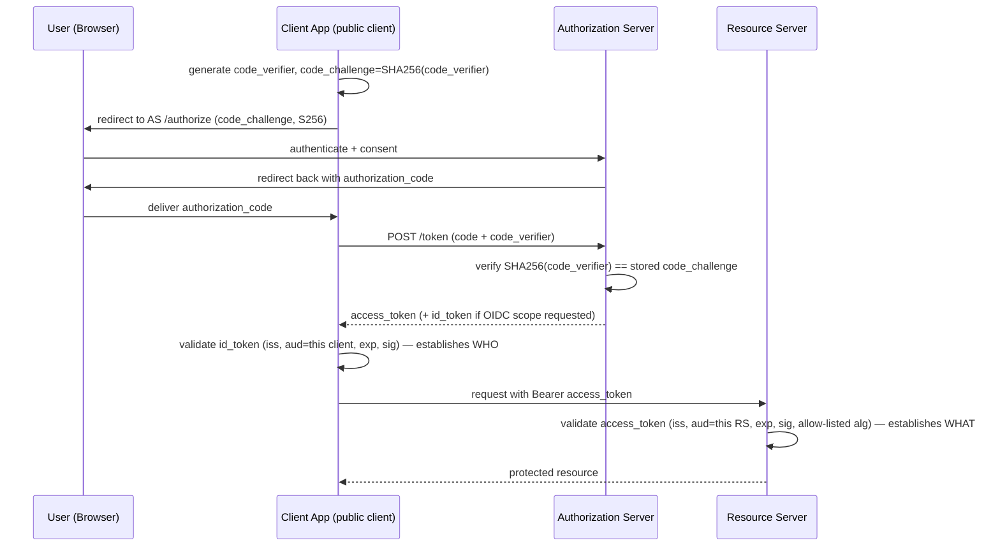
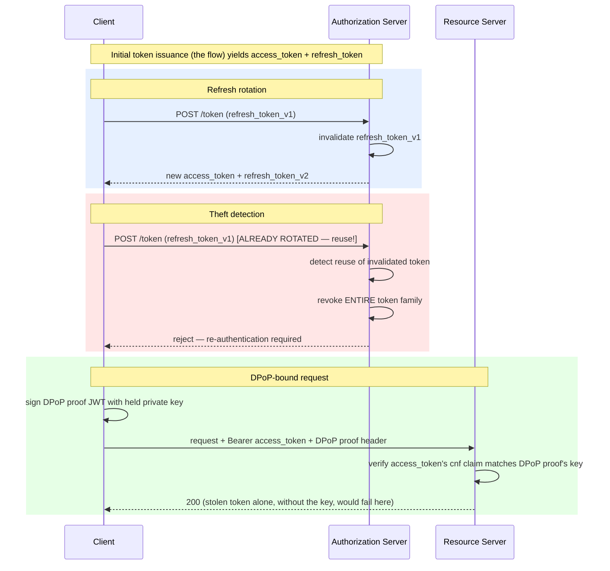
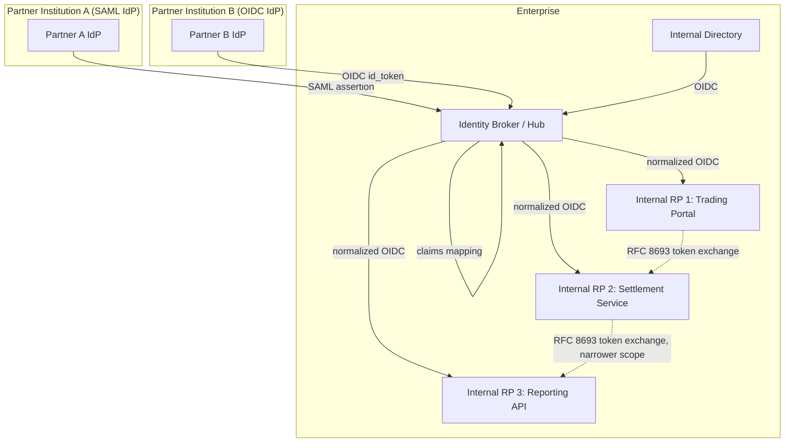

# OAuth 2.0 / OIDC / JWT / PKCE — Complete Interview Prep (All Topics, One File)

> Domain: OAuth2/OIDC/JWT/PKCE | Level: Beginner → Expert | Prerequisite: [[../40-IAM/01-IAM-Interview-Prep]] (identity, federation), [[../02-DotNet-AspNetCore/01-DotNet-AspNetCore-Interview-Prep]] §5 (ASP.NET Core auth), [[../28-Security/01-Security-Interview-Prep]]
> **Quick-prep edition** (consolidated 2026-10-03). This one file replaces Modules 153–155. Originals: `git show ebb2d5c:41-OAuth2-OIDC-JWT-PKCE/<file>.md`
> Each topic has: **Key concepts → C#/HTTP example → Most common interview questions with answers.**

| # | Topic | # | Topic |
|---|---|---|---|
| 1 | OAuth 2.0 vs OIDC vs JWT — the one-line distinction | 8 | Revocation, introspection & short lifetimes |
| 2 | Roles & tokens | 9 | Sender-constrained tokens: DPoP & mTLS |
| 3 | Grant types (and deprecated ones) | 10 | Securing SPAs & mobile apps (BFF, token storage) |
| 4 | Authorization Code + PKCE in detail | 11 | Enterprise SSO, identity brokers & federation |
| 5 | JWT structure & validation | 12 | Token exchange (RFC 8693) & the confused deputy |
| 6 | ID token vs access token; scopes vs claims | 13 | OAuth 2.1, FAPI & financial-grade APIs |
| 7 | Refresh tokens & rotation | 14 | Top 30 rapid-fire + Principal · 15 Mistakes checklist |

---

## 1. OAuth 2.0 vs OIDC vs JWT — the One-Line Distinction

- **OAuth 2.0** = **delegated authorization**: lets a client get an **access token** to call an API on a user's (or its own) behalf, with limited scopes. It is **not** authentication.
- **OpenID Connect (OIDC)** = an **authentication** layer on top of OAuth 2.0: adds the **ID token** (who the user is), `openid` scope, UserInfo endpoint, discovery (`/.well-known/openid-configuration`), standard claims.
- **JWT** = a **token format** (signed JSON) — used for ID tokens and often for access tokens; access tokens can also be opaque.
- **PKCE** = a proof-key extension that protects the authorization code flow from interception (now required for all clients in OAuth 2.1).

**Common interview question**

**Q. OAuth vs OIDC vs JWT?**
OAuth is a framework for obtaining access tokens to call APIs (authorization delegation); OIDC adds standardized user authentication via ID tokens; JWT is just a signed token format that both may use. "Login with OAuth" really means OIDC.

---

## 2. Roles & Tokens

| Role | Example |
|---|---|
| **Resource owner** | the user |
| **Client** | the SPA, mobile app, web app or service requesting access |
| **Authorization server (AS)** | Entra ID, Okta, Auth0, Keycloak, Duende IdentityServer |
| **Resource server (RS)** | your API that validates access tokens |

| Token | Purpose | Audience |
|---|---|---|
| **Access token** | call APIs (scopes/permissions) | the API (`aud`) |
| **ID token** | prove authentication to the client | the client (`aud` = client ID) |
| **Refresh token** | get new access tokens without re-login | the authorization server |

- **Confidential clients** can keep a secret (server-side apps, services) → client secret, private-key JWT, or mTLS. **Public clients** can't (SPAs, mobile, desktop) → PKCE, no secrets.

---

## 3. Grant Types (and Deprecated Ones)

| Grant | Use | Status |
|---|---|---|
| **Authorization Code + PKCE** | users in web apps, SPAs (via BFF ideally), mobile, desktop | ✅ the default for user sign-in |
| **Client Credentials** | service-to-service (no user) | ✅ |
| **Refresh Token** | renew access tokens | ✅ (rotate for public clients) |
| **Device Authorization** | TVs, CLIs, devices without browsers | ✅ |
| **Token Exchange (RFC 8693)** | on-behalf-of / delegation across services | ✅ |
| **CIBA** | decoupled auth (bank app approves a call-centre action) | ✅ (FAPI) |
| **Implicit** | tokens in the URL fragment for SPAs | ❌ deprecated (token leakage) |
| **Resource Owner Password Credentials** | app collects the user's password | ❌ deprecated (breaks SSO/MFA, phishing) |

**Common interview questions**

**Q1. Why is the implicit grant deprecated?**
It returns tokens in the browser URL fragment (exposed in history, logs, referrers, and to injected scripts) with no client authentication or code exchange. Authorization Code + PKCE gives the same SPA usability securely.

**Q2. Why not the password grant?**
The client handles the user's credentials directly — defeating SSO, MFA, phishing-resistant authentication and the security boundary of the IdP. It's removed from OAuth 2.1.

---

## 4. Authorization Code + PKCE in Detail

**Flow**
1. Client creates a random **`code_verifier`** and its **`code_challenge = BASE64URL(SHA256(code_verifier))`**, plus `state` (CSRF) and `nonce` (OIDC replay protection).
2. Redirect the browser to `/authorize?response_type=code&client_id=…&redirect_uri=…&scope=openid profile payments.read&state=…&nonce=…&code_challenge=…&code_challenge_method=S256`.
3. User authenticates (MFA, consent) → AS redirects back with `code` + `state`.
4. Client verifies `state`, then POSTs to `/token` with `code`, `redirect_uri` and the **`code_verifier`**.
5. AS checks `SHA256(code_verifier) == code_challenge` → issues tokens.
- **The vulnerability PKCE closes:** **authorization code interception** (malicious app registered on the same custom URI scheme, leaked redirect, logs) — a stolen code is useless without the verifier, which never left the client. Also mitigates code injection.
- **Exact redirect URI matching** at the AS (no wildcards).

```http
GET /authorize?response_type=code&client_id=payments-spa-bff
  &redirect_uri=https%3A%2F%2Fapp.example.com%2Fsignin-oidc
  &scope=openid%20profile%20offline_access%20api%3A%2F%2Fpayments%2Fpayments.read
  &state=af0ifjsldkj&nonce=n-0S6_WzA2Mj
  &code_challenge=E9Melhoa2OwvFrEMTJguCHaoeK1t8URWbuGJSstw-cM&code_challenge_method=S256

POST /token
grant_type=authorization_code&code=SplxlOBeZQQYbYS6WxSbIA&redirect_uri=https%3A%2F%2Fapp.example.com%2Fsignin-oidc
&client_id=payments-spa-bff&code_verifier=dBjftJeZ4CVP-mB92K27uhbUJU1p1r_wW1gFWFOEjXk
```

```csharp
// ASP.NET Core web app / BFF: OIDC with code flow + PKCE (PKCE is on by default)
builder.Services.AddAuthentication(o => { o.DefaultScheme = CookieAuthenticationDefaults.AuthenticationScheme; o.DefaultChallengeScheme = OpenIdConnectDefaults.AuthenticationScheme; })
    .AddCookie(o => { o.Cookie.HttpOnly = true; o.Cookie.SecurePolicy = CookieSecurePolicy.Always; o.Cookie.SameSite = SameSiteMode.Lax; })
    .AddOpenIdConnect(o =>
    {
        o.Authority = "https://login.example.com/";
        o.ClientId = "payments-web";
        o.ClientSecret = builder.Configuration["Oidc:ClientSecret"];   // confidential (server-side) client
        o.ResponseType = "code";
        o.UsePkce = true;
        o.SaveTokens = true;                                          // tokens kept server-side in the auth cookie/session
        o.Scope.Add("api://payments/payments.read");
        o.Scope.Add("offline_access");
        o.MapInboundClaims = false;
        o.TokenValidationParameters.NameClaimType = "name";
    });
```

**Common interview questions**

**Q1. What exactly does PKCE protect against?**
Theft or injection of the authorization code: an attacker who intercepts the code can't redeem it without the original `code_verifier`, which is never transmitted until the back-channel token request. It replaces the client secret for public clients and adds defence for confidential ones.

**Q2. What are `state` and `nonce` for?**
`state` ties the authorization response to the request (CSRF protection on the redirect). `nonce` is embedded in the ID token so the client can detect ID token replay/injection.

---

## 5. JWT Structure & Validation

**Key concepts**
- `header.payload.signature` (Base64URL). Header: `alg` (RS256/ES256/PS256…), `kid` (key ID), `typ` (`at+jwt` for access tokens). Payload claims: `iss`, `sub`, `aud`, `exp`, `nbf`, `iat`, `jti`, `scope`/`scp`, `roles`, custom claims.
- JWTs are **signed (JWS)**, usually **not encrypted** — anyone can read the payload → no secrets/PII in tokens. Encrypted JWTs (JWE) exist for confidentiality.
- **Validation a resource server must not skip:** signature with the issuer's key from **JWKS** (by `kid`, cached, rotated), **`alg` allow-list** (never trust `alg` from the token), **`iss`**, **`aud`** (your API!), **`exp`/`nbf`** with small clock skew, token type, then **scopes/permissions** for the endpoint.
- **Algorithm confusion attacks:** `alg: none` accepted, or switching RS256→HS256 and signing with the *public key* as an HMAC secret → validation libraries must pin expected algorithms/key types.
- **Asymmetric signing** (RS/ES) so APIs only need public keys; symmetric HS256 shares the secret with every verifier (avoid across services).

```csharp
builder.Services.AddAuthentication(JwtBearerDefaults.AuthenticationScheme)
    .AddJwtBearer(o =>
    {
        o.Authority = "https://login.example.com/";                  // discovery → issuer + JWKS (auto key rotation)
        o.Audience = "api://payments";
        o.MapInboundClaims = false;
        o.TokenValidationParameters = new TokenValidationParameters
        {
            ValidateIssuer = true, ValidateAudience = true, ValidateLifetime = true, ValidateIssuerSigningKey = true,
            ValidAlgorithms = [SecurityAlgorithms.RsaSha256, SecurityAlgorithms.EcdsaSha256],   // pin algorithms
            ValidTypes = ["at+jwt", "JWT"],
            ClockSkew = TimeSpan.FromMinutes(1)
        };
    });
builder.Services.AddAuthorizationBuilder()
    .AddPolicy("payments.read", p => p.RequireAssertion(c =>
        c.User.FindFirst("scp")?.Value.Split(' ').Contains("payments.read") == true));
```

**Common interview questions**

**Q1. What must an API validate on a JWT?**
Signature against the trusted issuer's keys (JWKS, `kid`), an allow-listed algorithm, issuer, audience equal to this API, expiry/not-before with small skew, token type, and then authorization (scopes/roles/permissions) — plus object-level authorization in the business logic.

**Q2. Explain the algorithm confusion attack.**
If a library trusts the token's `alg` header, an attacker can set `alg: none` (no signature) or change RS256 to HS256 and sign with the server's *public* key as an HMAC secret; a naive verifier accepts it. Pin allowed algorithms and key types and use well-maintained libraries.

**Q3. Why is skipping audience validation dangerous?**
A token issued for a different API (perhaps a less-trusted one) would be accepted by yours — cross-service privilege escalation and confused-deputy problems.

---

## 6. ID Token vs Access Token; Scopes vs Claims

- **ID token:** for the **client** to learn who signed in (audience = client ID); **never send it to APIs** as an access token.
- **Access token:** for the **API**; clients should treat it as opaque (don't parse it in SPAs to make decisions).
- **Scopes** = what the client is allowed to do on behalf of the user (delegated permissions, consented: `payments.read`). **Roles/claims** = facts about the user (app roles, group membership, tenant). APIs check both: client scope **and** user permission.
- **App-only (client credentials)** tokens carry application permissions (roles) and no user.
- Keep tokens small: avoid huge group lists (group overage) — fetch details server-side if needed.

**Common interview question**

**Q. Can an API accept ID tokens?**
No. ID tokens are issued to the client to prove authentication; their audience is the client, they aren't scoped for API access, and accepting them breaks the OAuth model. APIs accept access tokens with their own audience.

---

## 7. Refresh Tokens & Rotation

**Key concepts**
- Access tokens are **short-lived** (5–60 min) to limit damage; **refresh tokens** obtain new ones without user interaction (`offline_access` scope).
- **Refresh token rotation:** each use returns a new refresh token and invalidates the old one; **reuse detection** — if an old refresh token is presented again, the AS revokes the whole token family (theft detected).
- Bind refresh tokens to the client (confidential client authentication, DPoP for public clients); absolute lifetime and idle timeout; revoke on logout/password change.
- Store refresh tokens **server-side** (BFF) — not in browser storage.

**Common interview question**

**Q. How does refresh token rotation detect theft?**
Each refresh token is single-use; when a stolen token and the legitimate one are both used, the AS sees reuse of an already-rotated token and revokes the entire family, forcing re-authentication — limiting the attacker to at most one use.

---

## 8. Revocation, Introspection & Short Lifetimes

**Key concepts**
- **Self-contained JWTs can't be revoked** before expiry by default — APIs validate locally without contacting the AS.
- Options: **short access-token lifetimes** (minutes) + revocable refresh tokens; **token introspection** (RFC 7662 — API asks the AS if a token is active: real-time truth at a latency/availability cost; cache briefly); **opaque/reference tokens** (always introspected); **revocation lists/deny lists** by `jti` or session ID distributed to APIs; **Continuous Access Evaluation** (Entra) for near-real-time revocation events.
- **Revocation endpoint** (RFC 7009) for clients to revoke tokens on logout.

**Common interview questions**

**Q1. You need to revoke a user's access immediately. How, given JWTs?**
Revoke their refresh tokens and sessions at the AS, and for immediate effect on access tokens: short lifetimes plus a distributed deny list (session ID/`jti`/user "revoked-after" timestamp) checked by APIs, or switch sensitive APIs to introspection/reference tokens, or use CAE-capable APIs. Choose per risk: high-risk operations (payments) can introspect.

**Q2. Introspection vs local JWT validation?**
Local validation is fast and available without the AS but can't see revocation until expiry. Introspection gives real-time token status at the cost of latency and a hard dependency on the AS (mitigate with short caching). Many systems use local validation generally and introspection for high-risk endpoints.

---

## 9. Sender-Constrained Tokens: DPoP & mTLS

**Key concepts**
- Bearer tokens work for whoever holds them → stolen tokens are replayable. **Sender-constraining** binds a token to a key the client holds.
- **mTLS (RFC 8705):** the token is bound to the client's TLS certificate (`cnf.x5t#S256`); the API checks the presented certificate matches — strong, but requires PKI and mTLS infrastructure (common in FAPI/open banking for confidential clients).
- **DPoP (RFC 9449):** the client signs a per-request **DPoP proof JWT** (HTTP method, URL, timestamp, nonce, access token hash) with its private key; the token's `cnf.jkt` contains the key thumbprint → works for public clients (SPAs, mobile) without mTLS infrastructure.

```http
GET /api/v1/accounts HTTP/1.1
Authorization: DPoP eyJhbGciOiJFUzI1NiIs...        (access token bound to the client's key)
DPoP: eyJ0eXAiOiJkcG9wK2p3dCIsImFsZyI6IkVTMjU2IiwiandrIjp7Li4ufX0...   (proof: htm=GET, htu=…/accounts, iat, jti, ath)
```

**Common interview question**

**Q. DPoP vs mTLS for sender-constraining?**
mTLS binds tokens to client certificates — strong and established in financial APIs, but needs certificate issuance/management and TLS termination that preserves client certs. DPoP binds tokens to an application-level key with signed proofs per request — easier for SPAs/mobile and through proxies, with replay protection via nonces/`jti`.

---

## 10. Securing SPAs & Mobile Apps (BFF, Token Storage)

**Key concepts**
- **SPAs:** the recommended pattern is a **Backend-for-Frontend (BFF)**: the BFF (confidential client) performs the OIDC code flow, keeps tokens server-side, issues an **HttpOnly, Secure, SameSite** session cookie to the browser, and proxies API calls attaching access tokens. Avoids tokens in JavaScript-accessible storage (XSS theft).
- If tokens must live in the browser: code + PKCE, tokens in memory only (not localStorage), short lifetimes, refresh rotation, DPoP, strict CSP.
- **CSRF** returns with cookies → SameSite + antiforgery for the BFF's state-changing endpoints.
- **Mobile/native:** code + PKCE via the **system browser** (ASWebAuthenticationSession/Custom Tabs, not embedded webviews), claimed HTTPS redirect URIs (App Links/Universal Links) over custom schemes, tokens in Keychain/Keystore.

**Common interview questions**

**Q1. How would you secure a React/Angular SPA calling your APIs?**
A BFF in ASP.NET Core (e.g., Duende BFF or YARP + OIDC): it handles the code+PKCE flow as a confidential client, stores tokens server-side, gives the SPA an HttpOnly SameSite cookie, enforces antiforgery, and forwards API calls with access tokens. The browser never sees tokens.

**Q2. Why not store tokens in localStorage?**
Any XSS can read localStorage and exfiltrate long-lived tokens. HttpOnly cookies (BFF) can't be read by JavaScript; in-memory tokens limit exposure; sender-constraining makes stolen tokens less useful.

---

## 11. Enterprise SSO, Identity Brokers & Federation

**Key concepts**
- **Identity broker/hub:** applications trust **one** internal IdP/broker; the broker federates with many upstream IdPs (workforce Entra/Okta, partner IdPs via SAML/OIDC, social, customer identities) → avoids N×M point-to-point trusts, centralizes policy (MFA, Conditional Access), normalizes claims.
- **Claims mapping/normalization:** partners send different claim names/semantics (`role` vs `groups`, email as ID) → map to a canonical set in the broker; never let partner-supplied claims directly grant internal privileges without mapping rules (silent divergence risk).
- **Home realm discovery:** route users to their IdP by email domain.
- **Single sign-out:** front-channel/back-channel logout across apps — hard at federation scale; combine with short sessions.
- **SAML still coexists** with OIDC for enterprise SaaS and partners.

**Common interview questions**

**Q1. Why use an identity broker instead of each app federating directly?**
One trust relationship per app, centralized MFA/Conditional Access and auditing, consistent claims, easier onboarding/offboarding of partner IdPs, and a single place to change identity providers.

**Q2. What can go wrong with partner federation claims?**
Partners may send claims with different meanings or allow users to influence them (e.g., self-asserted email or role), leading to privilege escalation or account takeover via email collisions. Map claims explicitly in the broker, use stable unique identifiers (issuer + subject), and restrict which partner claims influence authorization.

---

## 12. Token Exchange (RFC 8693) & the Confused Deputy

**Key concepts**
- Service A receives a user's token (aud = A) and needs to call service B as the user → exchange it at the AS for a new token with **aud = B**, narrowed scopes, preserving the subject (and recording the actor `act` claim for delegation chains). Entra calls this **On-Behalf-Of**.
- **Confused deputy:** a service with broad privileges is tricked into using them for a caller who shouldn't have them (e.g., forwarding a token with the wrong audience, or using its own app-only token for a user request). Token exchange with audience-specific, user-bound tokens prevents it.
- Don't forward the original token to downstream services (audience confusion).

```http
POST /token
grant_type=urn:ietf:params:oauth:grant-type:token-exchange
&subject_token=eyJ...(user token, aud=orders)
&subject_token_type=urn:ietf:params:oauth:token-type:access_token
&audience=api://payments
&scope=payments.write
```

**Common interview question**

**Q. How do you propagate user identity from service A to service B securely?**
Token exchange/OBO: A exchanges the user's token for a new one with audience B and minimal scopes; B validates its own audience and enforces authorization for that user. Avoid forwarding A's token (wrong audience) or using A's app-only identity (confused deputy).

---

## 13. OAuth 2.1, FAPI & Financial-Grade APIs

- **OAuth 2.1** (consolidation draft): PKCE required for all authorization code flows, implicit and password grants removed, exact redirect URI matching, refresh tokens sender-constrained or rotated for public clients, bearer tokens not in query strings.
- **FAPI 2.0** (OpenID Foundation, financial-grade): **PAR** (Pushed Authorization Requests — request parameters sent server-to-server, not in the browser URL), sender-constrained tokens (mTLS or DPoP), strong client authentication (private_key_jwt or mTLS), short-lived codes, `iss` in authorization responses; used in open banking (UK, Brazil, Australia CDR) and PSD2 contexts.
- **RAR** (Rich Authorization Requests) for fine-grained consent ("pay €100 to X").
- **CIBA** for decoupled authentication.

**Common interview question**

**Q. What changes when you design OAuth for a bank's open banking APIs?**
FAPI profile: PAR, PKCE, private_key_jwt or mTLS client authentication, sender-constrained tokens (mTLS/DPoP), short-lived tokens, strict redirect URIs, fine-grained consent (RAR), comprehensive audit and consent management, and certified conformance testing.

---

## 14. Top 30 Rapid-Fire Questions + Principal Questions

1. **OAuth?** Delegated authorization (access tokens).
2. **OIDC?** Authentication layer (ID tokens).
3. **JWT?** Signed token format.
4. **PKCE?** Code verifier/challenge against code interception.
5. **Default user flow?** Authorization Code + PKCE.
6. **Service-to-service?** Client credentials.
7. **Devices/CLIs?** Device authorization grant.
8. **Deprecated grants?** Implicit, password.
9. **`state`?** CSRF protection on redirect.
10. **`nonce`?** ID token replay protection.
11. **JWT parts?** Header, payload, signature.
12. **JWT encrypted?** Usually not (signed only).
13. **Must-validate claims?** iss, aud, exp/nbf + signature + alg.
14. **Algorithm confusion?** Trusting `alg` from the token.
15. **Key discovery?** JWKS via OIDC discovery, by `kid`.
16. **ID token to API?** Never.
17. **Scopes vs roles?** Client delegation vs user permissions.
18. **Short access tokens?** Limit theft impact.
19. **Refresh rotation?** Single-use with reuse detection.
20. **JWT revocation?** Short TTL + deny lists / introspection.
21. **Introspection?** Real-time token status from the AS.
22. **DPoP?** Proof-of-possession per request.
23. **mTLS tokens?** Bound to client certificate.
24. **SPA pattern?** BFF with HttpOnly cookies.
25. **localStorage tokens?** XSS-exposed — avoid.
26. **Mobile login?** System browser + PKCE.
27. **Identity broker?** One hub federating many IdPs.
28. **Token exchange?** Audience-specific delegated tokens.
29. **Confused deputy?** Misused privileges across services.
30. **FAPI?** Financial-grade OAuth profile (PAR, sender-constrained).

**Principal-level questions**

**P1. Design identity for a platform with web, mobile, partner APIs and 50 microservices.**
A central authorization server/broker (Entra/Okta/Duende) federating workforce and partner IdPs; BFF pattern for the web app; code+PKCE via system browser for mobile with DPoP; client credentials (private_key_jwt) or mTLS for partners with FAPI-style hardening where money moves; gateway validates tokens coarsely; services validate audience and enforce object-level authorization; token exchange for user-context downstream calls; short-lived access tokens, refresh rotation, revocation via CAE/deny lists; centralized audit.

**P2. A token was leaked in logs. Impact and response?**
Impact depends on lifetime, scope, audience and sender-constraining. Respond: revoke related sessions/refresh tokens, push deny-list entries, shorten lifetimes if needed, scrub logs, review access logs for misuse, fix the logging (redaction of `Authorization` headers and query strings), and add detection for tokens in logs.

---

## 15. Mistakes Checklist (say why each is wrong)
- [ ] Using OAuth access tokens as proof of login (instead of OIDC ID tokens) · sending ID tokens to APIs
- [ ] Implicit or password grants · no PKCE · wildcard redirect URIs
- [ ] Skipping audience validation · trusting the token's `alg` · HS256 shared across services
- [ ] Long-lived access tokens · no refresh rotation · no revocation strategy
- [ ] Tokens in localStorage or URLs · logging Authorization headers
- [ ] Forwarding user tokens unchanged to downstream services (audience confusion)
- [ ] Partner claims mapped directly to privileges · email as the unique user key across IdPs

---

## Architecture Diagrams (preserved from the original modules)

> All 13 Mermaid/ASCII diagrams from the original `41-OAuth2-OIDC-JWT-PKCE/` files, kept verbatim and grouped by source module. Originals: `git show ebb2d5c:41-OAuth2-OIDC-JWT-PKCE/<file>.md`.

### Module 153 — OAuth2 / OIDC / JWT / PKCE: Fundamentals — Grant Types, PKCE & Token Structure
*Source: `01-OAuth2-OIDC-JWT-Fundamentals-Flows-PKCE.md`*

**1. Fundamentals**

```text
Client App Authorization Server Resource Server
 │ │ │
 │──1. generate code_verifier, │ │
 │ code_challenge = SHA256(verifier) │ │
 │ │ │
 │──2. redirect: /authorize? │ │
 │ code_challenge, code_challenge_method=S256 ──► │
 │ │ │
 │ User authenticates + consents │
 │ │ │
 │◄──3. redirect back with authorization_code ── │
 │ │ │
 │──4. POST /token: code + code_verifier ──► │
 │ │──validates: SHA256(verifier) │
 │ │ == stored code_challenge? │
 │◄──5. access_token (+ id_token if OIDC) ── │
 │ │ │
 │──6. Bearer access_token ──────────────────────────────────────► │
 │ │ │◄─validate JWT
```

**3. Visual Architecture**



**12. System Design**

```text
 Client App ──► Authorization Server ──► JWKS endpoint (public keys, rotated)
 │ │
 │ issues: access_token (aud=specific RS), id_token (for client only)
 ▼
 Resource Server 1..N
 │
 Shared Token-Validation Middleware (centrally maintained, A2)
 ├─ signature verify (algorithm allow-listed per issuer)
 ├─ iss / aud / exp / nbf checks (I2)
 ├─ token-type check (reject id_token as bearer)
 └─ audit log: kid, sub, resource server, outcome
```

**13. Low-Level Design**

```text
IAuthorizationFlow
 ├─ AuthorizationCodeWithPkceFlow: IAuthorizationFlow
 └─ ClientCredentialsFlow: IAuthorizationFlow

PkceChallenge
 ├─ CodeVerifier, CodeChallenge (from Coding Exercise Easy)
 └─ Verify(presentedVerifier): bool

SafeJwtValidator (from Coding Exercise Hard)
 ├─ IssuerConfig: Dictionary<issuer, (allowedAlg, keyProvider)>
 └─ Validate(rawToken): JwtValidationResult

ClaimValidator (from Coding Exercise Medium)
 └─ Validate(claims, config, now): (bool, reason)

ResourceServerTokenPipeline (from Coding Exercise Expert)
 ├─ composes SafeJwtValidator + ClaimValidator
 ├─ rejects id_token-typed tokens explicitly (fix)
 └─ Authorize(rawToken, now): AuthorizationOutcome

JwksKeyCache
 ├─ GetKey(kid): refresh-on-miss (A4)
 └─ RefreshOnTtl
```

### Module 154 — OAuth2 / OIDC / JWT / PKCE: Token Lifecycle — Rotation, Revocation, Introspection, DPoP & mTLS
*Source: `02-Token-Lifecycle-Rotation-Revocation-Introspection-DPoP-mTLS.md`*

**1. Fundamentals**

```text
Bearer token's core weakness: possession = usable, regardless of who currently possesses it

 Refresh rotation ──► detects theft AFTER replay (reactive)
 Revocation ──► invalidates on-demand, but propagation is the hard part for JWTs
 Introspection ──► trades stateless-validation speed for real-time truth
 Sender-constraining──► prevents a stolen token from being usable at all (proactive,
 the only one of the four that changes the theft's consequence
 rather than detecting or bounding it after the fact)
```

**3. Visual Architecture**



**12. System Design**

```text
 ┌─────────────────────────┐
 Client ────►│ Token Endpoint │──► TokenFamily store (A5: O(1) per family)
 │ (rotation + DPoP check) │
 └────────────┬─────────────┘
 │ reuse / key-mismatch
 ▼
 ┌─────────────────────────┐
 │ Security Alerting │ (I6 — must verify delivery, not just firing)
 └─────────────────────────┘

 Resource Servers:
 Low-risk endpoints ──► local JWT validation (zero AS load)
 High-risk endpoints ──► Introspection Endpoint ──► short-TTL cache (I8, A4)
 │
 fail-closed on outage (A4)

 Service-to-service (client-credentials) ──► mTLS-bound tokens
```

**13. Low-Level Design**

```text
TokenFamily
 ├─ FamilyId, CurrentValidTokenHash, BoundKeyThumbprint, Revoked
 └─ (persisted with atomic CAS on CurrentValidTokenHash)

DPoPBoundRotationService (from Coding Exercise Expert)
 ├─ Rotate(familyId, presentedTokenHash, presentedKeyThumbprint): RotationOutcome
 └─ raises alerts via IAnomalyNotifier (Observer, distinguishing ReuseDetected vs KeyMismatch)

IAnomalyNotifier
 └─ NotifyAndAwaitAcknowledgment(familyId, outcome): ensures delivery, not just firing (I6)

RiskTieredTokenValidator (from Coding Exercise Hard)
 ├─ IsValidAsync(token, tier, now): bool
 ├─ delegates Low tier to local JWT validation (the SafeJwtValidator)
 └─ delegates High tier to IIntrospectionClient with short-TTL cache

IIntrospectionClient
 └─ IntrospectAsync(token): IntrospectionResult, fails closed on timeout (A4)

DPoPValidator (from Coding Exercise Medium)
 └─ Verify(proof, tokenCnfThumbprint, expectedMethod, expectedUrl, now): (bool, reason)
```

### Module 155 — OAuth2/OIDC/JWT/PKCE Capstone: Enterprise SSO & Federation Architecture at Financial-Services Scale
*Source: `03-Capstone-Enterprise-SSO-Federation-Architecture.md`*

**1. Fundamentals**

```text
Internal SSO:
 User ──► Identity Broker/Hub ──► many internal RPs (each trusts the broker, not each other)

B2B Federation:
 Partner Institution's own IdP ──(SAML/OIDC federation)──► Identity Broker ──► internal RPs
 (broker translates/maps partner's claims into internal claims — the seam examines)

Service-to-service delegation:
 RP A (holds user's token) ──(RFC 8693 token exchange)──► RP B
 (RP B gets a NEW, narrower-scoped token representing "A, acting for this user" —
 never simply forwards A's own broadly-scoped token, the seam examines)
```

**3. Visual Architecture**



**3. Visual Architecture**

```text
Single Sign-Out propagation:

 User clicks logout at Broker
 │
 ┌────┴─────────────────────────┐
 │ Back-channel logout (preferred)│
 │ Broker → RP1, RP2, RP3 │
 │ server-to-server, independent │
 │ of browser reachability │
 └──────────────────────────────────┘
 │
 Any RP whose logout endpoint fails/times out
 leaves a live session — the exact incident
```

**12. System Design**

```text
 Partner IdPs (SAML/OIDC) ──┐
 ├──► Identity Broker/Hub
 Internal Directory ─────────┘ │
 ├─ Claims Mapping Engine (governed, versioned,
 │ attestation-tracked per partner)
 ├─ Token Exchange Service (scope-narrowing
 │ enforcement, Hard exercise)
 └─ Federated Logout Orchestrator (Expert exercise)
 │
 ┌────────────────────┼────────────────────┐
 Internal RP 1 Internal RP 2... N External-facing
 (OIDC) (OIDC) partner portals
```

**13. Low-Level Design**

```text
ClaimsMappingEntry (from Coding Exercise Medium)
 ├─ PartnerId, PartnerClaimValue, InternalEntitlement, LastAttestedAt, AttestationCadence
 └─ IsMappingCurrentlyTrusted(now): bool — fail-closed gate on token issuance

IIdentityProviderAdapter
 ├─ SamlAdapter: IIdentityProviderAdapter (partner SAML federation)
 └─ OidcAdapter: IIdentityProviderAdapter (internal + fintech-partner OIDC)

ClaimsMappingEngine
 ├─ MapClaims(providerClaims, mappingTable): internal claims
 └─ checks IsMappingCurrentlyTrusted per claim before including it in output

TokenExchangeService (from Coding Exercise Hard)
 └─ Exchange(request): enforces scope ⊆ (callingServiceScope ∩ originalTokenScope)

FederatedLogoutOrchestrator (from Coding Exercise Expert)
 └─ SignOutEverywhereAsync(relyingPartyIds): per-RP confirmed/failed results, never silently assumed
```
