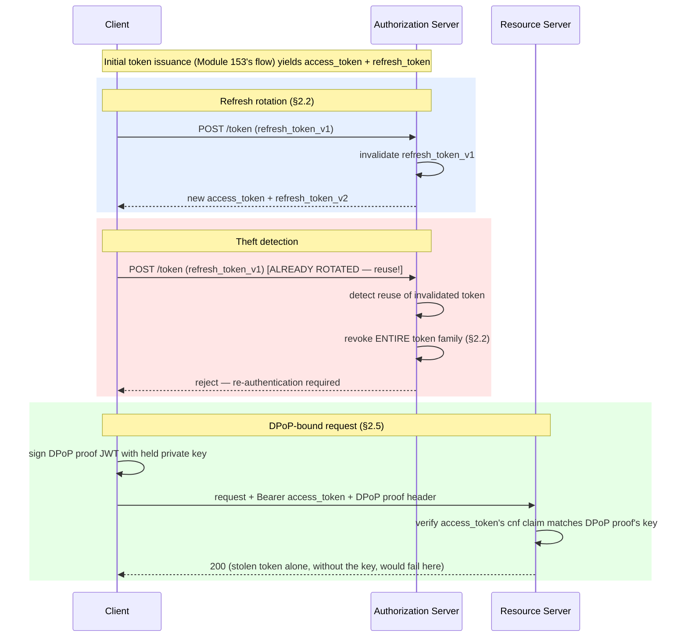

# Module 154 — OAuth2 / OIDC / JWT / PKCE: Token Lifecycle — Rotation, Revocation, Introspection, DPoP & mTLS

> Domain: OAuth2/OIDC/JWT/PKCE | Level: Beginner → Expert | Prerequisite: [[../41-OAuth2-OIDC-JWT-PKCE/01-OAuth2-OIDC-JWT-Fundamentals-Flows-PKCE]] (this module develops exactly the gap that module's §17 closed on — a token's risk *between* issuance and validation, not merely at those two moments), [[../40-IAM/02-Capstone-PAM-IdentityGovernance-ZeroTrustIdentity]] §2.1-§2.2 (JIT elevation's duration-bounding principle, now applied to tokens specifically), [[../18-Event-Driven-Architecture/06-Idempotency-ExactlyOnce-Deduplication-At-Scale]] (refresh-token rotation's replay-detection problem is structurally the same as this module's dedup-key design)

>
> **Scope note:** Second of three modules scoping `41-OAuth2-OIDC-JWT-PKCE`. This module assumes Module 153's flow/PKCE/JWT-structure mechanics and asks what an enterprise does *after* a token is correctly issued and *before* it's used in any single validation — refresh-token rotation and theft detection, revocation propagation, opaque-token introspection, and sender-constraining (DPoP, mTLS) as the answer to bearer tokens' single largest structural weakness.

---

## 1. Fundamentals

**What:** Four mechanisms that manage a token's risk across its full lifetime rather than only at issuance or validation:
- **Refresh token rotation:** issuing a new refresh token on every use of the previous one, invalidating the old one, so a stolen-and-replayed refresh token is structurally detectable.
- **Revocation:** an explicit mechanism to invalidate a token before its stated expiry, and the propagation problem this creates for self-contained (JWT) tokens.
- **Introspection (RFC 7662):** a synchronous authorization-server endpoint a resource server calls to check a token's *current* validity, trading JWT's zero-round-trip performance for genuine real-time revocability.
- **Sender-constraining (DPoP, mTLS):** binding a token cryptographically to the specific client that obtained it, so a stolen token alone — without also stealing the client's private key — is unusable.

**Why:** Module 153 §17 closed by naming the gap this module fills: correctness at issuance (the authorization server issued the right claims) and correctness at validation (the resource server checked the right claims) are both necessary but neither says anything about whether the token *should still be trusted right now*, given everything that may have happened since issuance — theft, a detected compromise, a user's access being revoked mid-session. A bearer token — the default OAuth2 model, where possession alone is proof of the right to use it — has exactly one structural weakness underlying every mechanism in this module: **anyone who possesses it can use it, and nothing about the token itself proves who currently holds it is who it was issued to.**

**When:** Refresh-token rotation is standard practice for any long-lived session using short-lived access tokens (the common, recommended pattern). Revocation/introspection matter wherever a token must be invalidatable faster than its natural expiry — security incidents, immediate access termination (Module 152's JML lifecycle). Sender-constraining (DPoP/mTLS) matters specifically where bearer-token theft is a credible, high-consequence threat — increasingly the default expectation, not an exotic hardening option, at the Elite FinTech Interview Panel bar.

**How (30,000-ft view):**
```
Bearer token's core weakness: possession = usable, regardless of who currently possesses it

  Refresh rotation  ──► detects theft AFTER replay (reactive)
  Revocation        ──► invalidates on-demand, but propagation is the hard part for JWTs
  Introspection     ──► trades stateless-validation speed for real-time truth
  Sender-constraining──► prevents a stolen token from being usable at all (proactive,
                          the only one of the four that changes the theft's consequence
                          rather than detecting or bounding it after the fact)
```

---

## 2. Deep Dive

### 2.1 Refresh tokens and why they exist

A short access-token lifetime (Module 153 §5 — minutes, not hours) bounds a compromised access token's usable window, but re-running the full authorization-code-with-PKCE flow (including user interaction) every few minutes is unusable. A **refresh token** — long-lived, issued alongside the access token, usable only against the token endpoint (never against a resource server directly) — lets the client silently obtain a new, short-lived access token without user interaction. This shifts the "long-lived, high-value credential" risk from the access token (used on every request, against every resource server, maximal exposure surface) to the refresh token (used only against the authorization server's token endpoint, minimal exposure surface) — a deliberate risk concentration, not risk elimination.

### 2.2 Refresh token rotation and replay detection

Because the refresh token is now the long-lived, high-value credential, it needs its own protection beyond mere confidentiality. **Rotation** issues a brand-new refresh token on every use and immediately invalidates the one just used — a refresh token is single-use. This creates a powerful, structural detection property: if an attacker steals a refresh token and uses it before the legitimate client does, the legitimate client's next attempt to use its (now-invalidated) copy fails — and critically, **that failure is itself the theft signal**. A correctly-implemented authorization server, on detecting reuse of an already-rotated (invalidated) refresh token, should treat this as a high-confidence compromise indicator and revoke the *entire token family* (every access and refresh token descended from that original grant), not merely reject the one reused request — because at that point, it cannot distinguish which of the two competing holders (attacker or legitimate client) is the real one, and revoking the whole family is the only response that closes the exposure for both possible worlds simultaneously.

### 2.3 The revocation-propagation problem for self-contained JWTs

A self-contained JWT's entire value proposition (Module 153 §7/§9 — zero-round-trip validation) is exactly what makes it structurally resistant to revocation: a resource server validating locally, against cached keys, has no channel through which "this specific token was revoked five minutes ago" reaches it before the token's own stated `exp`. Three real mitigations exist, each with a distinct cost:
1. **Short expiry** (Module 153's default recommendation) — bounds the propagation gap to the token's own lifetime, at the cost of more frequent refresh-token round-trips.
2. **A deny-list the resource server checks** — reintroduces a synchronous check (partially undoing the stateless-validation benefit) but only for the (rare) revoked case, if implemented as a fast, small, cache-friendly negative check rather than a full introspection call per request.
3. **Full introspection** (§2.4) — abandons self-contained validation's performance property entirely in exchange for genuine real-time correctness.
There is no mechanism that provides both JWT's zero-round-trip validation *and* instant revocation — this is a structural trade, not an engineering gap waiting to be closed.

### 2.4 Introspection — trading performance for real-time truth

An **introspection endpoint** (RFC 7662) lets a resource server present a token (often itself opaque — a random identifier with no independently-verifiable structure) and receive back the authorization server's *current* assessment of its validity and associated claims. This makes revocation instant and correct by construction (the authorization server's own record is definitionally authoritative and current) at the direct cost of a synchronous network call — and corresponding availability dependency — on every single resource-server request. This is precisely Module 153 A5's compromise-response-speed trade made concrete: introspection is the right choice when a token's usable window under active compromise must be closed in seconds, not bounded merely by a short expiry's minutes.

### 2.5 DPoP (Demonstrating Proof-of-Possession) — sender-constraining without mTLS's infrastructure cost

**DPoP** (RFC 9449) binds an access token to a client-held key pair without requiring full mutual-TLS infrastructure. On each request, the client generates a signed DPoP proof JWT (containing the HTTP method, URL, a timestamp, and a hash binding it to the access token) using a private key it holds; the resource server verifies both the access token *and* that the DPoP proof was signed by the same key the token was originally bound to at issuance (the token itself carries a `cnf` — confirmation — claim referencing the key's public-key thumbprint). **A stolen access token alone is now insufficient** — using it requires also possessing the private key that never leaves the legitimate client, converting the theft's consequence from "fully usable stolen credential" to "useless string without the matching key." This is the direct token-layer analogue of Module 153 §2.2's PKCE — proof of possession of a value that never travels with the credential itself, now applied to prevent *use* of a stolen bearer token rather than *issuance* of one via an intercepted code.

### 2.6 mTLS sender-constraining — the heavier-infrastructure alternative

**Mutual TLS (mTLS) token binding** (RFC 8705) achieves the same sender-constraining goal at the transport layer — the client authenticates to the authorization server (and to resource servers) using a TLS client certificate, and the issued token is bound to that certificate's public key (via a certificate-thumbprint confirmation claim, structurally identical in purpose to DPoP's `cnf` claim). Using the token later requires presenting the same client certificate on the TLS connection. mTLS provides marginally stronger sender-constraining (bound at the transport layer, not the application layer) but requires full client-certificate provisioning and TLS infrastructure across every client and resource server — appropriate for high-security service-to-service (client-credentials) scenarios already using mTLS for other reasons (Module 79's service-mesh mTLS), but generally too heavy for consumer-facing public clients, where DPoP's lighter-weight, application-layer binding is the current, more widely applicable answer.

---

## 3. Visual Architecture



---

## 4. Production Example

**Problem:** A retail-banking mobile app used refresh tokens with a 30-day lifetime and no rotation — a single refresh token, reused unchanged across its entire lifetime, silently persisted in the device's storage.

**Architecture:** Standard authorization-code-with-PKCE (Module 153) issuing short-lived access tokens (15 minutes) plus a long-lived, non-rotating refresh token, under the reasoning that PKCE already protected the initial code exchange and short access-token lifetime already bounded risk.

**Implementation / What happened:** A device-storage vulnerability in a third-party SDK bundled into the app (unrelated to the bank's own code) allowed a malicious co-installed app to read the refresh token from shared storage on rooted/jailbroken devices. Because the refresh token never rotated, the theft was permanently, silently usable for the token's entire 30-day lifetime, and — critically — because it never rotated, there was no reuse event to serve as a detection signal: the attacker and the legitimate user could both use *the same, unchanging* refresh token indefinitely without either side's usage ever producing an anomaly the authorization server could observe.

**Trade-offs:** Short access-token lifetime alone was reasoned as sufficient protection, treating the refresh token as a secondary concern since it "only" talks to the token endpoint — missing that the token endpoint *is* the place where a stolen long-lived credential eventually gets converted into fully usable access tokens, repeatedly, for its entire lifetime.

**Lessons learned:** **Short access-token lifetime bounds exposure only for the access token itself — it does nothing to bound or detect compromise of the refresh token behind it**, and a non-rotating refresh token provides no structural theft-detection signal at all, since legitimate and illegitimate use of an unchanging credential are indistinguishable to the issuing server. The fix — refresh-token rotation with reuse detection (§2.2) — doesn't just shorten the exposure window, it converts an otherwise-invisible, months-long compromise into a detectable event the very next time the legitimate client attempts to refresh.

---

## 5. Best Practices

- **Always rotate refresh tokens on use, with reuse-detection triggering full token-family revocation** (§2.2) — non-rotating refresh tokens provide zero structural theft-detection signal, as §4 demonstrates directly.
- **Choose introspection over self-contained JWTs specifically where sub-minute revocation matters** (§2.4) — don't default to introspection everywhere "for safety," since it forfeits JWT's zero-round-trip scalability for use cases that don't need it.
- **Use DPoP (or mTLS for service-to-service) wherever bearer-token theft is a credible threat** — for consumer-facing public clients specifically, given how much easier device/browser-level token theft is than intercepting a properly-secured TLS channel.
- **Treat a `cnf` (confirmation) claim binding as mandatory to check**, not optional — a resource server that validates a DPoP-bound token's signature and claims but skips the `cnf`-to-proof-key match provides zero sender-constraining benefit despite the token nominally being sender-constrained.
- **Alert on refresh-token-reuse events as security incidents**, not silent rejections — the entire value of rotation's detection property depends on someone actually acting on the signal it produces.

---

## 6. Anti-patterns

- **Long-lived, non-rotating refresh tokens** — §4's exact failure; provides no detection signal and no bounded exposure window for the estate's actual longest-lived credential.
- **Reacting to refresh-token reuse by rejecting only the single reused request**, leaving the rest of the token family (including whichever side — attacker or legitimate client — didn't trigger the detected reuse) still valid — §2.2's full-family revocation is the correct response precisely because the two competing holders can't be distinguished after the fact.
- **"Sender-constrained" tokens whose resource-server validation never actually checks the `cnf` binding** — the binding exists only if it's enforced on every validation, not merely present in the token.
- **Defaulting to introspection everywhere "to be safe,"** discarding JWT's scalability advantage (Module 153 §7/§9) for use cases where a short expiry already provides adequate risk bounding.
- **mTLS client-certificate provisioning treated as a one-time setup task**, with no certificate-rotation or revocation discipline of its own — reintroducing exactly the standing-credential risk Module 152 addresses, now at the transport-layer client-identity layer.

---

## 7. Performance Engineering

Refresh-token rotation adds one additional authorization-server round-trip per refresh cycle relative to a non-rotating design, negligible against the security value given refresh cycles are inherently infrequent (tied to access-token lifetime, typically minutes-to-hours apart, not per-request). Introspection's cost is the opposite profile — a synchronous call *per resource-server request*, making its latency and the authorization server's horizontal scalability a first-class, request-path-critical concern in a way JWT validation (Module 153 §7) never is; introspection-backed resource servers should cache negative and positive introspection results for a bounded, short TTL (materially shorter than the token's own remaining lifetime) to blunt request-path load without meaningfully reopening the revocation-latency gap introspection exists to close. DPoP proof generation (a signature per request, client-side) and verification (resource-server-side) add CPU cost proportional to request volume, comparable in shape to Module 153 §7's JWT-signature-verification cost, and should use ECDSA over RSA for the same latency reasons noted there.

---

## 8. Security

Refresh-token rotation with reuse detection is this module's primary proactive-detection control (§2.2) — it is the rare security mechanism that converts an otherwise fully-silent compromise into an actively-alerting one, without requiring any additional monitoring infrastructure beyond the authorization server's own token-family bookkeeping. Sender-constraining (DPoP/mTLS) is the module's primary prevention control — unlike every other mechanism here, which detects or bounds a theft's consequence after the fact, sender-constraining makes a stolen bearer token structurally unusable in the first place, changing the threat model from "protect the token" to "protect the token *and* a key that must independently also be exfiltrated." Introspection's security value is bounded by the authorization server's own availability and correctness — an introspection endpoint that's itself compromised or unavailable undermines every resource server depending on it, making its own security posture (Module 152's PAM/governance disciplines, applied reflexively) disproportionately consequential relative to its architectural size.

---

## 9. Scalability

Introspection's synchronous-call-per-request model means the authorization server's introspection endpoint must scale with the *sum* of all resource servers' combined request volume — a materially different (and larger) scaling target than the authorization server's token-issuance endpoint alone, which scales only with login/refresh frequency. This is the direct cost side of §2.4's trade and the reason most large-scale deployments reserve introspection for specifically high-risk flows rather than applying it estate-wide. Refresh-token rotation's family-revocation bookkeeping (tracking lineage across rotations) grows with active-session count, not request volume, and should be indexed for fast family-wide revocation lookups (a single compromised leaf token must trigger revocation across the entire family in one operation, not an iterative walk) to keep incident response fast at scale.

---

## 10. Interview Questions

### Basic (10)

**B1. What is a refresh token, and why does it exist separately from the access token?**
*Ideal Answer:* A long-lived credential, usable only against the authorization server's token endpoint, that lets a client obtain new short-lived access tokens without requiring the user to re-authenticate interactively each time.
*Why correct:* Matches §2.1.
*Common mistakes:* Describing refresh tokens as "just another access token" rather than a distinct credential with a narrower usage surface and different risk profile.
*Follow-up:* Why is a stolen refresh token arguably more dangerous than a stolen access token, despite being used far less often?

**B2. What is refresh token rotation?**
*Ideal Answer:* Issuing a brand-new refresh token every time the current one is used, and invalidating the one just used, making each refresh token single-use.
*Why correct:* Matches §2.2.
*Common mistakes:* Confusing rotation with simply shortening the refresh token's lifetime — rotation is about single-use invalidation, not duration.
*Follow-up:* What specific security property does rotation provide that a merely-shorter-lived, non-rotating refresh token doesn't?

**B3. What should an authorization server do when it detects a refresh token being reused after it was already rotated?**
*Ideal Answer:* Treat it as a high-confidence compromise signal and revoke the entire token family descended from that original grant, not merely reject the single reused request.
*Why correct:* Matches §2.2's full-family-revocation reasoning.
*Common mistakes:* Proposing to reject only the reused request, leaving the rest of the (now ambiguous, possibly-compromised) token family active.
*Follow-up:* Why can't the authorization server simply figure out which of the two competing holders is the legitimate one and only revoke the other?

**B4. What is token introspection?**
*Ideal Answer:* A synchronous endpoint (RFC 7662) a resource server calls to check a token's current validity and claims directly against the authorization server's own record, rather than validating a self-contained token locally.
*Why correct:* Matches §2.4.
*Common mistakes:* Confusing introspection with JWT validation — introspection specifically involves a network call to the authorization server; JWT validation is local.
*Follow-up:* What does introspection provide that self-contained JWT validation structurally cannot?

**B5. Why can't a self-contained JWT be instantly revoked?**
*Ideal Answer:* A resource server validates a JWT locally against cached signing keys with no channel for "this specific token was just revoked" to reach it before the token's own stated expiry.
*Why correct:* Matches §2.3.
*Common mistakes:* Assuming revocation is simply an unimplemented feature rather than a structural consequence of self-contained, stateless validation.
*Follow-up:* Name the three real mitigations for this gap and the cost each one accepts.

**B6. What does "sender-constrained" mean for an access token?**
*Ideal Answer:* The token is cryptographically bound to the specific client that obtained it, so possessing the token string alone is insufficient to use it — the holder must also prove possession of a private key the token is bound to.
*Why correct:* Matches §2.5/§2.6.
*Common mistakes:* Confusing sender-constraining with encryption — the token itself isn't hidden, using it just requires an additional proof the thief doesn't have.
*Follow-up:* Name the two standard mechanisms for sender-constraining and the main difference between them.

**B7. What is DPoP?**
*Ideal Answer:* Demonstrating Proof-of-Possession (RFC 9449) — an application-layer sender-constraining mechanism where the client signs a proof JWT per request with a private key, and the resource server verifies it matches the key the access token was bound to at issuance.
*Why correct:* Matches §2.5.
*Common mistakes:* Confusing DPoP with mTLS — DPoP works at the application layer without requiring TLS client certificates.
*Follow-up:* What claim in the access token itself enables this binding check?

**B8. Why is mTLS token binding considered "heavier" infrastructure than DPoP?**
*Ideal Answer:* mTLS requires full TLS client-certificate provisioning and management across every client and resource server, whereas DPoP achieves comparable sender-constraining at the application layer with a lighter-weight key pair and signed proof per request.
*Why correct:* Matches §2.6.
*Common mistakes:* Assuming mTLS and DPoP provide fundamentally different security properties rather than the same goal (sender-constraining) via different infrastructure layers.
*Follow-up:* In what scenario would mTLS still be preferred over DPoP despite the heavier infrastructure cost?

**B9. What's the core structural weakness of a bearer token that all four mechanisms in this module respond to?**
*Ideal Answer:* Possession alone proves the right to use it — nothing about a bearer token itself proves the current holder is who it was originally issued to.
*Why correct:* Matches §1's framing.
*Common mistakes:* Describing the weakness as "tokens can be stolen" without the more precise "possession is the only proof required" framing that explains why each mitigation works the way it does.
*Follow-up:* Which of the four mechanisms actually changes this core weakness rather than merely detecting or bounding its consequence?

**B10. Why should introspection results be cached, and what's the risk of caching them too long?**
*Ideal Answer:* Caching avoids a network round-trip on every single resource-server request, reducing load and latency; caching too long reopens the exact revocation-latency gap introspection was chosen specifically to close, since a cached "valid" result could persist past an actual revocation event.
*Why correct:* Matches §7's caching guidance.
*Common mistakes:* Treating introspection caching as a pure performance optimization without acknowledging it partially reintroduces the trade introspection was meant to avoid.
*Follow-up:* How would you choose a cache TTL that balances this trade appropriately?

### Intermediate (10)

**I1. Design a refresh-token rotation and reuse-detection system, including exactly what state the authorization server must track.**
*Ideal Answer:* Each refresh token belongs to a "family" (originating from one initial grant). On each use, mark the presented token invalidated and issue a new one in the same family. Track, per family, which token is currently the valid "head." If a request presents any token in the family other than the current head, treat it as reuse — revoke the entire family (every access and refresh token descended from it) and require full re-authentication.
*Why correct:* Matches §2.2's full mechanics with explicit state-tracking detail.
*Common mistakes:* Tracking only "is this specific token valid" without the family-lineage structure needed to revoke the whole family on detected reuse.
*Follow-up:* What's the storage/lookup cost implication of tracking full token-family lineage at scale (Module 154's own §9)?

**I2. Compare the operational cost of introspection-backed resource servers against JWT-validating resource servers as request volume scales into the millions per day.**
*Ideal Answer:* JWT validation scales with zero added authorization-server load regardless of resource-server request volume (Module 153 §7/§9). Introspection's load on the authorization server scales directly with the *sum* of all resource servers' request volume — at high scale, this can make the authorization server's introspection endpoint the dominant capacity-planning concern for the entire identity architecture, requiring it to be scaled and made highly-available to a degree token issuance alone never would.
*Why correct:* Matches §9's scaling-target distinction precisely.
*Common mistakes:* Treating introspection as "slightly slower JWT validation" rather than recognizing it fundamentally changes what must scale and by how much.
*Follow-up:* What caching strategy would you apply to blunt this cost without meaningfully reopening the revocation-latency gap?

**I3. Why does DPoP require checking a `cnf` claim specifically, and what happens if a resource server validates the DPoP proof's signature correctly but skips the `cnf`-binding check?**
*Ideal Answer:* The `cnf` claim in the access token records the public-key thumbprint the token was bound to at issuance; checking it against the DPoP proof's signing key is what actually enforces "this specific client, and no other, may use this token." Skipping that check means the resource server correctly verifies *a* valid DPoP proof exists, but not that it was signed by the *right* key — an attacker holding a stolen access token could generate their own key pair, produce a validly-signed DPoP proof with their own key, and the resource server would accept it despite the token being sender-constrained to a different, legitimate key entirely.
*Why correct:* Correctly identifies that DPoP's protection is entirely contingent on the `cnf` binding check specifically, not on DPoP proofs existing in general — directly parallel to Module 153 §4's lesson that signature validity alone doesn't imply the full set of necessary checks.
*Common mistakes:* Assuming "the request included a DPoP proof and it validated" is sufficient, missing that the proof must be checked against the *specific* key the token itself claims to be bound to.
*Follow-up:* How does this recur Module 153 §4's exact failure shape (a valid, correctly-signed artifact used to satisfy a check it wasn't actually scoped to satisfy)?

**I4. §4's incident involved a non-rotating refresh token stolen via a third-party SDK vulnerability. Would rotation alone have fully closed this specific incident's risk? Why or why not?**
*Ideal Answer:* Rotation would not have prevented the initial theft (the SDK vulnerability is a separate, orthogonal issue) but would have converted the compromise from a silent, months-long, undetectable one into a detectable event at the next legitimate refresh attempt — the moment the legitimate client's stored (now-invalidated) token is rejected. Rotation changes detection and blast-radius duration, not the initial attack surface.
*Why correct:* Correctly distinguishes what rotation does and doesn't address, avoiding the common mistake of treating it as a complete fix for the underlying vulnerability class.
*Common mistakes:* Claiming rotation "prevents" the theft, when its actual value is bounding the compromise's duration and making it detectable, not preventing the initial exfiltration.
*Follow-up:* What mechanism from this module, layered on top of rotation, would have prevented the stolen token from being usable at all, regardless of detection timing?

**I5. When would you choose mTLS sender-constraining over DPoP for a given integration?**
*Ideal Answer:* When the integration is service-to-service (client-credentials, no browser/mobile constraints) and already operates within an mTLS-secured environment for other reasons (e.g., a service mesh, Module 79) — the client-certificate infrastructure cost is already sunk, and mTLS's transport-layer binding is marginally stronger. For consumer-facing public clients (mobile, SPA), DPoP's lighter application-layer approach avoids provisioning and rotating client certificates across an uncontrolled device fleet.
*Why correct:* Matches §2.6's cost/context reasoning.
*Common mistakes:* Treating the choice as purely a security-strength comparison without weighing the infrastructure cost each option assumes is already present.
*Follow-up:* What operational discipline does mTLS client-certificate provisioning require that, if neglected, would reproduce Module 152's standing-credential risk?

**I6. Design the negative-outcome monitoring you'd put in place around refresh-token rotation to ensure the reuse-detection signal is actually acted on.**
*Ideal Answer:* Every detected reuse event should generate a distinct, alertable security event (not merely a logged rejection), routed to a monitored channel with a defined response SLA (analogous to Module 152 A7's break-glass post-use review requirement); the rate of reuse-detection events should itself be tracked as a metric, since a rising rate across an estate may indicate a broader, systemic client-side vulnerability (like §4's SDK issue) rather than isolated incidents.
*Why correct:* Correctly extends §8's point that rotation's value depends on the signal actually being consumed, applying Module 152 E7's "verify the delivery, not just the control" lesson to this specific signal.
*Common mistakes:* Treating rotation's reuse-rejection as sufficient on its own, without an explicit alerting/response pathway ensuring a human or automated system actually acts on it.
*Follow-up:* How would you distinguish a genuine theft-driven reuse event from a benign client-side bug (e.g., a race condition retrying a refresh call) producing the same reuse signature?

**I7. Explain why short access-token lifetime and refresh-token rotation are complementary rather than substitutable controls.**
*Ideal Answer:* Short access-token lifetime bounds the *access token's* exposure window but does nothing about the refresh token behind it (§4's exact gap). Refresh-token rotation bounds and detects compromise of the *refresh token* specifically but doesn't change the access token's own lifetime or exposure profile. Using only one leaves the other credential's corresponding risk fully open.
*Why correct:* Directly matches §4 and §5's best-practice framing.
*Common mistakes:* Assuming a sufficiently short access-token lifetime makes refresh-token protection less important, missing that the refresh token is the credential that mints new access tokens repeatedly for its own, much longer lifetime.
*Follow-up:* If you had to choose only one to implement first under a resource constraint, which would you prioritize, and why?

**I8. A resource server caches introspection results for 10 minutes to reduce load. A user's access is revoked via Module 152's JIT-elevation expiry mid-session. What's the maximum delay before the revocation actually takes effect at this resource server, and is that acceptable?**
*Ideal Answer:* Up to 10 minutes (the cache TTL) beyond the actual revocation moment, since a cached "valid" introspection result will continue to be honored until it expires from cache regardless of the authorization server's now-current "revoked" state. Whether this is acceptable depends entirely on the use case's risk tolerance — acceptable for a low-risk internal tool, likely unacceptable for a high-value financial transaction path, where a materially shorter TTL (or no caching) would be warranted.
*Why correct:* Correctly quantifies the caching/revocation-latency trade from I2/§7/§10-B10 with a concrete scenario, and correctly frames the acceptability question as risk-dependent rather than universally answerable.
*Common mistakes:* Answering "instant" (ignoring the cache) or "10 minutes" without acknowledging the answer depends on the specific resource's risk profile.
*Follow-up:* How would you design differentiated caching TTLs across resource servers of varying risk levels within the same estate?

**I9. Why does DPoP's proof include the HTTP method and URL, not just a timestamp and the token-binding key?**
*Ideal Answer:* Including the method and URL binds the proof to this *specific* request, preventing an attacker who somehow captures a valid DPoP proof (e.g., via a request-logging leak) from replaying it against a different endpoint or method than it was originally generated for — narrowing the proof's validity to exactly the request it was created for, not merely to a time window.
*Why correct:* Correctly identifies the specific replay-prevention purpose of binding to method/URL beyond the timestamp/key binding.
*Common mistakes:* Assuming the timestamp alone (replay-window limiting) is sufficient, missing that method/URL binding prevents cross-endpoint replay within that same window.
*Follow-up:* What additional check (beyond method, URL, and key) does a resource server need to prevent replay of the *same* DPoP proof against the *same* endpoint within its valid time window?

**I10. How would you extend this module's refresh-token-family revocation concept to Module 152's break-glass audit requirement?**
*Ideal Answer:* Treat a break-glass-issued token grant as its own "family" with mandatory heightened logging of every token minted under it; any reuse-after-rotation event or anomalous usage pattern within a break-glass-originated family should trigger the same mandatory 24-hour post-use review Module 152 §15 established for break-glass generally, giving the technical reuse-detection mechanism a concrete organizational consumer specifically for the highest-risk credential class.
*Why correct:* Correctly connects this module's technical mechanism to Module 152's organizational control, showing how the two domains compose.
*Common mistakes:* Treating token-family tracking and break-glass audit as unrelated concerns rather than recognizing the technical mechanism can directly instrument the organizational requirement.
*Follow-up:* What's the risk of applying full token-family tracking and mandatory review uniformly to every token, rather than concentrating it on break-glass-originated grants specifically?

### Advanced (10)

**A1. Design a complete token-lifecycle architecture for a trading platform's mobile app, justifying every lifetime, rotation, and sender-constraining decision.**
*Ideal Answer:* Access tokens: 5-15 minute lifetime, DPoP-bound (mobile is a credible bearer-token-theft target, and DPoP avoids mTLS's device-certificate provisioning burden). Refresh tokens: rotated on every use with reuse-detection triggering full-family revocation and a security alert (I6); refresh token itself also DPoP-bound to the same key pair, so a stolen refresh token alone (without the device's private key) is equally unusable as a stolen access token. Introspection reserved specifically for the highest-value transaction-execution endpoints (order placement, fund transfers) where sub-minute revocation matters most, while lower-risk read-only endpoints rely on short-lived JWT validation alone for better scalability (I2). Break-glass/service-account flows (client-credentials) use mTLS given they already operate within controlled infrastructure.
*Why correct:* Synthesizes every mechanism this module covers into one coherent, risk-tiered architecture with explicit justification per decision, rather than applying one uniform policy everywhere.
*Common mistakes:* Applying introspection or DPoP uniformly across every endpoint "for maximum security" without weighing the scalability cost (I2) against each endpoint's actual risk profile.
*Follow-up:* How would you migrate this architecture incrementally from a legacy bearer-token-only design without a disruptive, all-at-once cutover?

**A2. §4's incident (non-rotating refresh token, third-party SDK theft) went undetected for months. Design the specific monitoring that would have caught it within days instead.**
*Ideal Answer:* Since the original design had no rotation, there was no reuse-detection signal available at all — the actual fix isn't better monitoring of the existing design but implementing rotation itself, which manufactures a detection signal that didn't previously exist. Absent rotation, the closest available detection would be anomaly-based: correlating refresh-token usage against unexpected device/IP/geolocation shifts (a Zero Trust identity-style contextual signal, Module 152 §2.6) — a weaker, higher-false-positive-rate substitute for rotation's clean, structural signal, illustrating why rotation is the preferred primary control and behavioral monitoring a secondary, defense-in-depth layer, not a replacement.
*Why correct:* Correctly recognizes that the described monitoring gap isn't fixable by "monitoring harder" within the flawed design — it requires the structural fix (rotation) that manufactures the missing signal, with behavioral analytics as a secondary, imperfect layer.
*Common mistakes:* Proposing only better anomaly-detection monitoring without recognizing that rotation itself is the higher-leverage, lower-false-positive fix the incident is actually calling for.
*Follow-up:* Why is a structural, protocol-level detection signal (rotation reuse) generally preferable to a statistical, behavioral one (anomaly detection) when both are available?

**A3. Formally compare the risk-reduction mechanism of refresh-token rotation against DPoP sender-constraining — are they redundant, or complementary? Justify with a scenario where only one provides protection.**
*Ideal Answer:* Complementary, not redundant — they defend against different failure timings. Rotation detects theft *after* an attacker has already used a stolen token at least once (reactive, post-hoc), converting silent compromise into a detectable event. DPoP prevents a stolen token from being usable *at all*, regardless of detection (proactive, pre-emptive). Scenario where only rotation helps: an attacker steals a non-DPoP-bound refresh token and uses it exactly once before the legitimate client's next refresh — DPoP wouldn't have existed to stop this in a rotation-only design, but rotation's reuse detection still catches it on the legitimate client's subsequent attempt. Scenario where only DPoP helps: an attacker steals a DPoP-bound token but never possesses the private key — the theft is entirely inert; there is no usage event for rotation-based detection to ever observe, because the attempted use simply fails at the DPoP-verification step.
*Why correct:* Correctly identifies the two mechanisms address non-overlapping points in the attack timeline (before-use prevention vs. after-use detection) with concrete, differentiating scenarios for each.
*Common mistakes:* Treating the two as interchangeable "extra security" measures without articulating the specific, different failure mode each independently closes.
*Follow-up:* Given they're complementary, why might an architecture reasonably choose to implement only one of the two under resource constraints, and which would you prioritize?

**A4. A financial institution's introspection endpoint experiences a 30-second outage. What happens to every resource server depending on it, and how should the architecture be designed to fail safely?**
*Ideal Answer:* Every resource server unable to complete an introspection call during the outage must decide whether to fail open (allow the request, assuming the token is probably still valid) or fail closed (reject the request, since validity cannot currently be confirmed) — fail closed is the correct default for financial-services-grade risk tolerance, accepting an availability cost during the outage in exchange for never granting access it cannot currently verify, consistent with Module 152 §12's "fail closed on validation failure" pattern. To reduce the blast radius of this trade-off, the introspection endpoint itself must be built to the same high-availability bar as any other request-path-critical financial-services dependency (multi-region, redundant), since — per I2 — its availability is now load-bearing for every dependent resource server's own availability, not merely a convenience feature.
*Why correct:* Correctly identifies the fail-open/fail-closed decision as the central design question and justifies fail-closed specifically for this risk tier, while also naming the underlying availability investment needed to make that choice tolerable in practice.
*Common mistakes:* Proposing fail-open "to preserve availability" without weighing that this reintroduces exactly the unrevoked-access risk introspection was chosen to close.
*Follow-up:* How does a short, bounded local cache of recent introspection results (I8) change this outage's actual impact, and what new risk does that cache reintroduce?

**A5. Design a refresh-token family data model that supports (1) fast reuse detection, (2) fast full-family revocation, and (3) bounded storage growth for an estate with tens of millions of active sessions.**
*Ideal Answer:* Store each token family under a single family ID, with the family record holding only the current valid token's identifier/hash and a revoked flag — not the full history of every previously-rotated token in the family. On each refresh: look up the family by the presented token's family ID; if the presented token hash doesn't match the family's current valid token, it's a reuse event (I1) — set `revoked=true` on the family record (single write, O(1), no need to enumerate or individually invalidate every historical token) and treat every future validation referencing this family ID as invalid by that flag alone. This keeps storage per family constant (not growing with rotation count) and both detection and full-family revocation O(1).
*Why correct:* Correctly avoids the naive "store every historical token in the family and check membership" design, which would grow storage unboundedly and make reuse detection itself increasingly expensive over a long-lived session's many rotations.
*Common mistakes:* Proposing to store and check against the full rotation history per family, which doesn't scale in either storage or lookup cost as session duration and rotation frequency grow.
*Follow-up:* How would you extend this model to support Module 152-style forensic review of exactly what happened during a detected-reuse incident, given the minimal per-family record you've proposed intentionally discards rotation history?

**A6. Critique: "We use DPoP everywhere, so bearer-token theft is no longer a concern for our platform."**
*Ideal Answer:* Overstated. DPoP protects the *access and refresh tokens* specifically — it says nothing about other bearer credentials that may exist alongside them (session cookies for a web frontend calling the same backend, API keys for legacy integrations, service-account credentials not yet migrated to DPoP). It also depends entirely on every resource server correctly enforcing the `cnf` binding check (I3) — DPoP proofs present but unchecked provide zero actual protection. "We use DPoP" is only true for the specific token types and resource servers that have correctly and completely implemented the binding check, not an estate-wide guarantee by default.
*Why correct:* Correctly scopes the claim to what DPoP actually covers, applying this course's recurring "claim ≠ verified actual coverage" theme (Module 152 E5) to sender-constraining specifically.
*Common mistakes:* Accepting the claim because DPoP is individually a strong mechanism, without checking its actual deployment completeness across the full credential surface.
*Follow-up:* How would you build the estate-wide coverage-verification test (analogous to Module 152 E5's pathway-to-control mapping) specifically for sender-constraining adoption?

**A7. How does refresh-token-family revocation interact with Module 152's identity-governance drift detection when a principal's access is revoked at the IAM layer mid-session?**
*Ideal Answer:* IAM-layer revocation (Module 152) and token-family revocation are two independent mechanisms addressing the same underlying goal (this principal should no longer have access) at different layers and different latencies — IAM revocation changes the *authoritative* entitlement record, but a still-valid, unexpired access token issued before that revocation remains usable at the resource-server layer until it either expires or the resource server checks against updated state (introspection, §2.4, or a deny-list, §2.3). A mature architecture explicitly triggers proactive token-family revocation as part of the IAM revocation workflow itself (not merely relying on the token's natural expiry), closing the gap between "entitlement revoked" and "tokens derived from that entitlement stop working" rather than leaving it to elapse naturally.
*Why correct:* Correctly identifies that IAM-layer and token-layer revocation are structurally separate mechanisms that must be explicitly wired together, not assumed to be synchronized automatically — directly recurring Module 152 §14's "certification recorded a decision; a separate downstream mechanism didn't automatically reflect it" gap.
*Common mistakes:* Assuming IAM-layer revocation automatically and immediately invalidates all previously-issued tokens, without recognizing this requires an explicit, deliberately-built integration between the two systems.
*Follow-up:* What would you build to make this integration itself independently verifiable, the way Module 152's drift detector verifies its own continued correct operation?

**A8. Design a test suite for refresh-token rotation that specifically verifies the reuse-detection and full-family-revocation behavior, not merely the happy-path rotation flow.**
*Ideal Answer:* Positive test: successive legitimate refreshes each succeed and issue a new token, with the previous one subsequently rejected. Negative/adversarial test: simulate two concurrent clients presenting the *same* refresh token (a race, or a genuine theft-and-replay scenario) and assert that (a) exactly one succeeds, (b) the family is immediately marked revoked upon the second (reuse) attempt, and (c) a subsequent legitimate refresh attempt using the token issued from the successful branch is *also* rejected, proving full-family revocation actually took effect rather than only rejecting the specific reused token. A concurrency/race test specifically, since a naive non-atomic "check then update" implementation could allow both concurrent requests to succeed, silently defeating the single-use invariant entirely.
*Why correct:* Correctly identifies that the highest-value tests here are adversarial/negative and concurrency-focused, directly recurring Module 153 A9's finding that the original incident's gap was an absent negative test, not a broken positive path.
*Common mistakes:* Testing only the sequential happy-path rotation flow, missing the concurrent-reuse race condition that a real theft-and-replay scenario would actually exercise.
*Follow-up:* What data-store consistency guarantee (Module 146's PACELC framing) does the "check then update" step in reuse detection require to avoid the race this test is designed to catch?

**A9. A resource server's introspection-result cache (I2, I8) is keyed only by the token string. A revoked token is later re-issued with the exact same string value due to a token-generation bug producing colliding identifiers. What happens, and how do you prevent it?**
*Ideal Answer:* The cache would serve the stale "valid" (or "revoked," depending on which was cached first) result for the colliding new token, since the cache key doesn't distinguish the two logically-distinct tokens that happen to share a string value — a direct instance of Module 143's idempotency-key-uniqueness-must-match-actual-scope lesson, now surfacing as a caching-key-collision bug rather than a dedup-key bug. Prevention: token identifiers must be generated with sufficient entropy (a CSPRNG, per Module 153's Coding Exercise Easy) that collision is cryptographically infeasible, and any observed collision should be treated as a critical token-generation defect requiring immediate remediation, not a caching edge case to be worked around.
*Why correct:* Correctly identifies the root cause as a token-generation entropy failure (not a caching design flaw) while still correctly describing the caching-layer symptom, and explicitly connects it to Module 143's general idempotency-key-scope lesson.
*Common mistakes:* Proposing to fix this by changing the cache's key structure, treating the symptom rather than the actual root cause (insufficient token entropy).
*Follow-up:* How would you detect a token-generation entropy weakness in production before a collision-driven incident like this occurs, rather than after?

**A10. Synthesize this module's four mechanisms against Module 153's closing question (§17): "what happens to a token's validity between issuance and validation, as conditions change out from under it?" Name which specific condition-change each mechanism addresses.**
*Ideal Answer:* Refresh-token rotation addresses the condition "the refresh token itself may have been stolen and is being used by someone other than the legitimate client" — detected via the reuse signal. Revocation/deny-lists address "the principal's access was explicitly terminated" (Module 152's JML lifecycle) before the token's natural expiry. Introspection addresses "the authoritative state may have changed since this token was issued, and I need to know the current truth, not the issuance-time truth, right now." Sender-constraining (DPoP/mTLS) addresses "the token itself may have been exfiltrated to a party other than its legitimate holder" — pre-emptively, by requiring proof of an additional factor theft alone doesn't provide. Together, they cover the four distinct ways a token's issuance-time correctness can diverge from its current, real-time correctness.
*Why correct:* Correctly maps each of the module's four mechanisms to a specific, distinct condition-change rather than treating them as a generic, undifferentiated "extra security" bundle — demonstrating the module's own organizing structure explicitly.
*Common mistakes:* Describing the four mechanisms as redundant or interchangeable "security hardening," missing that each closes a structurally different gap.
*Follow-up:* Which of these four condition-changes is structurally impossible for a resource server relying solely on self-contained JWT validation, with no supplementary mechanism, to ever detect on its own?

---

## 11. Coding Exercises

### Easy — Refresh token family reuse detector

**Problem:** Given a refresh-token family's current valid token identifier, determine whether a presented token is a legitimate next-use or a reuse (theft) event.

**Solution (C#):**
```csharp
public sealed record TokenFamily(string FamilyId, string CurrentValidTokenHash, bool Revoked);

public enum RefreshOutcome { Accepted, ReuseDetected, FamilyAlreadyRevoked }

public static class RefreshValidator
{
    public static RefreshOutcome Check(TokenFamily family, string presentedTokenHash)
    {
        if (family.Revoked) return RefreshOutcome.FamilyAlreadyRevoked;
        return presentedTokenHash == family.CurrentValidTokenHash
            ? RefreshOutcome.Accepted
            : RefreshOutcome.ReuseDetected; // §2.2: trigger full-family revocation on this outcome
    }
}
```
**Time complexity:** O(1). **Space complexity:** O(1).

**Optimized solution:** Already optimal for the check itself; the real-world hardening is ensuring the lookup of `family` by the presented token's family ID, and the subsequent update on `Accepted`, happen atomically (A8's concurrency test) — a non-atomic read-then-write here is exactly what would let a genuine concurrent-reuse race silently defeat single-use enforcement.

### Medium — DPoP proof binding verification

**Problem:** Given an access token's `cnf` (confirmation) claim and an incoming DPoP proof, verify the proof was signed by the key the token is actually bound to, and that it matches this specific request's method and URL.

**Solution (C#):**
```csharp
public sealed record DPoPProof(string Method, string Url, DateTimeOffset IssuedAt, string SigningKeyThumbprint, bool SignatureValid);

public static class DPoPValidator
{
    private static readonly TimeSpan MaxProofAge = TimeSpan.FromSeconds(60);

    public static (bool Valid, string? Reason) Verify(
        DPoPProof proof, string tokenCnfThumbprint, string expectedMethod, string expectedUrl, DateTimeOffset now)
    {
        if (!proof.SignatureValid)
            return (false, "DPoP proof signature invalid");

        // The check that actually enforces sender-constraining (Advanced Q3):
        if (proof.SigningKeyThumbprint != tokenCnfThumbprint)
            return (false, "DPoP proof key does not match token's cnf binding");

        if (proof.Method != expectedMethod || proof.Url != expectedUrl)
            return (false, "DPoP proof does not match this request's method/URL"); // Intermediate Q9

        if (now - proof.IssuedAt > MaxProofAge)
            return (false, "DPoP proof expired — possible replay");

        return (true, null);
    }
}
```
**Time complexity:** O(1). **Space complexity:** O(1).

**Optimized solution:** Add a short-TTL, per-proof-JTI (unique proof identifier) replay cache so an intercepted, still-fresh (within `MaxProofAge`) proof cannot be replayed against the *same* method/URL within its validity window — the method/URL/timestamp checks alone bound replay to a narrow window and a specific endpoint, but a JTI cache closes the remaining within-window replay gap entirely.

### Hard — Risk-tiered token validation router

**Problem:** Route each incoming request to either fast local JWT validation or synchronous introspection, based on a per-resource-server-endpoint risk classification, and cache introspection results with a TTL bounded well below the token's remaining lifetime.

**Solution (C#):**
```csharp
public enum RiskTier { Low, High } // High = requires near-real-time revocation correctness (§2.4)

public sealed class RiskTieredTokenValidator
{
    private readonly Func<string, JwtValidationResultLite> _validateJwtLocally;
    private readonly Func<string, Task<IntrospectionResult>> _introspect;
    private readonly Dictionary<string, (IntrospectionResult Result, DateTimeOffset CachedAt)> _introspectionCache = new();
    private readonly TimeSpan _introspectionCacheTtl;

    public RiskTieredTokenValidator(
        Func<string, JwtValidationResultLite> validateJwtLocally,
        Func<string, Task<IntrospectionResult>> introspect,
        TimeSpan introspectionCacheTtl)
    {
        _validateJwtLocally = validateJwtLocally;
        _introspect = introspect;
        _introspectionCacheTtl = introspectionCacheTtl;
    }

    public async Task<bool> IsValidAsync(string token, RiskTier tier, DateTimeOffset now)
    {
        if (tier == RiskTier.Low)
            return _validateJwtLocally(token).IsValid; // §7/§9: zero authorization-server load

        // High risk: prefer a fresh introspection call, but use a short-TTL cache
        // to blunt request-path load without meaningfully reopening the revocation gap (I8, A4).
        if (_introspectionCache.TryGetValue(token, out var cached) &&
            now - cached.CachedAt < _introspectionCacheTtl)
        {
            return cached.Result.Active;
        }

        var result = await _introspect(token);
        _introspectionCache[token] = (result, now);
        return result.Active;
    }
}

public sealed record JwtValidationResultLite(bool IsValid);
public sealed record IntrospectionResult(bool Active);
```
**Time complexity:** O(1) for low-risk path; O(1) amortized (cache hit) or one network round-trip (cache miss) for high-risk path. **Space complexity:** O(cached tokens).

**Optimized solution:** In production, fail closed (A4) on an introspection call failure/timeout for high-risk requests rather than falling back to a stale cache entry or assuming validity; evict cache entries proactively on any explicit revocation event pushed from the authorization server (if such a channel exists) rather than relying on TTL expiry alone, tightening the worst-case revocation-latency bound below the TTL value.

### Expert — Sender-constrained refresh-token rotation combining §2.2 and §2.5

**Problem:** Combine refresh-token rotation with DPoP sender-constraining so that both the reuse-detection *and* the sender-constraining checks must pass for a refresh to succeed, and a failure of either produces a distinguishable, correctly-handled outcome.

**Solution (C#):**
```csharp
public enum RotationOutcome { Accepted, ReuseDetected, KeyMismatch, FamilyAlreadyRevoked }

public sealed class DPoPBoundRotationService
{
    private readonly Dictionary<string, TokenFamily> _families = new();
    private readonly Action<string, RotationOutcome> _alertOnAnomaly;

    public DPoPBoundRotationService(Action<string, RotationOutcome> alertOnAnomaly) =>
        _alertOnAnomaly = alertOnAnomaly;

    public RotationOutcome Rotate(
        string familyId, string presentedTokenHash, string presentedDPoPKeyThumbprint, out string? newTokenHash)
    {
        newTokenHash = null;

        if (!_families.TryGetValue(familyId, out var family))
            return RotationOutcome.FamilyAlreadyRevoked; // unknown family treated as revoked, fail closed

        if (family.Revoked)
            return RotationOutcome.FamilyAlreadyRevoked;

        // Reuse check (§2.2) — must pass BEFORE the key-binding check, since a reused
        // token is grounds for full revocation regardless of which key presented it.
        if (presentedTokenHash != family.CurrentValidTokenHash)
        {
            _families[familyId] = family with { Revoked = true };
            _alertOnAnomaly(familyId, RotationOutcome.ReuseDetected);
            return RotationOutcome.ReuseDetected;
        }

        // Sender-constraining check (§2.5) — an attacker who somehow obtained the CURRENT
        // valid refresh token but not the bound private key still cannot rotate it.
        if (presentedDPoPKeyThumbprint != family.BoundKeyThumbprint)
        {
            _families[familyId] = family with { Revoked = true }; // treat as compromise too — A6
            _alertOnAnomaly(familyId, RotationOutcome.KeyMismatch);
            return RotationOutcome.KeyMismatch;
        }

        newTokenHash = GenerateNewTokenHash();
        _families[familyId] = family with { CurrentValidTokenHash = newTokenHash };
        return RotationOutcome.Accepted;
    }

    private static string GenerateNewTokenHash() =>
        Convert.ToBase64String(System.Security.Cryptography.RandomNumberGenerator.GetBytes(32));
}

public sealed record TokenFamily(string FamilyId, string CurrentValidTokenHash, string BoundKeyThumbprint, bool Revoked);
```
**Time complexity:** O(1) per rotation attempt. **Space complexity:** O(active families).

**Optimized solution:** Persist `_families` in a store supporting atomic compare-and-swap on `CurrentValidTokenHash` (A8's concurrency requirement) rather than in-memory, and route `RotationOutcome.KeyMismatch` specifically (distinct from `ReuseDetected`) to security monitoring with its own signature — a key mismatch with a *correctly*-presented current token is a materially different, arguably more alarming signal (someone has the valid token string but not the bound key) than a stale-token reuse, and conflating the two alert types would obscure exactly the diagnostic distinction A3's scenario analysis depends on.

---

## 12. System Design

**Requirements**

*Functional:* Refresh-token issuance and rotation with reuse-detection and full-family revocation; introspection endpoint for high-risk resource servers; DPoP proof issuance (client) and verification (resource server); mTLS-bound client-credentials flow for service-to-service integrations.

*Non-functional:* Introspection endpoint scaled to the sum of all high-risk resource servers' combined request volume (§9), materially higher availability target than token issuance alone; refresh-token-family storage bounded (constant per family, A5) regardless of session duration/rotation count; reuse-detection and key-mismatch alerts delivered and acknowledged within a defined SLA (I6, Module 152 E7's delivery-verification lesson).

**Architecture**
```
              ┌─────────────────────────┐
  Client ────►│ Token Endpoint            │──► TokenFamily store (A5: O(1) per family)
              │ (rotation + DPoP check)   │
              └────────────┬─────────────┘
                            │ reuse / key-mismatch
                            ▼
              ┌─────────────────────────┐
              │ Security Alerting         │ (I6 — must verify delivery, not just firing)
              └─────────────────────────┘

  Resource Servers:
    Low-risk endpoints  ──► local JWT validation (Module 153, zero AS load)
    High-risk endpoints ──► Introspection Endpoint ──► short-TTL cache (I8, A4)
                                    │
                          fail-closed on outage (A4)

  Service-to-service (client-credentials) ──► mTLS-bound tokens (§2.6)
```

**Database selection:** Token-family records in a low-latency key-value store supporting atomic compare-and-swap (A8) given the reuse-detection race requirement; introspection endpoint backed by the authoritative entitlement/revocation state (shared with Module 152's governance stores) so introspection results are never stale relative to IAM-layer revocation (A7's integration requirement).

**Caching:** Introspection results cached with a short, risk-tier-appropriate TTL (I8); JWKS caching per Module 153 A4 for the local-JWT-validation path.

**Messaging:** Reuse-detection and key-mismatch events published to a security-event stream for both immediate alerting (I6) and downstream behavioral-analytics correlation (Module 152 E2).

**Scaling:** Introspection endpoint horizontally scaled and given a materially higher availability SLA than the token-issuance endpoint, since its unavailability degrades every dependent high-risk resource server (§9, A4) — the identical "the access-control system's own availability is a security property" lesson from Module 152 §9, now at the introspection layer specifically.

**Failure handling:** Introspection timeout/outage fails closed (A4) for high-risk endpoints; unknown/malformed token-family lookups fail closed (Expert exercise); reuse-detection and key-mismatch both trigger full-family revocation, distinguished by alert type (Expert exercise) for downstream forensic clarity.

**Monitoring:** Reuse-detection rate (rising rate = possible systemic client vulnerability, A2); key-mismatch rate (a materially more alarming signal than plain reuse, per the Expert exercise); introspection endpoint latency/availability (load-bearing for every high-risk resource server, A4); DPoP `cnf`-check enforcement coverage across resource servers (A6's estate-wide verification requirement).

**Trade-offs:** JWT-local-validation scalability vs. introspection's real-time correctness (§9, I2, A1's risk-tiered resolution); DPoP's lighter application-layer binding vs. mTLS's heavier but marginally stronger transport-layer binding (§2.6, I5).

---

## 13. Low-Level Design

**Requirements:** Model refresh-token rotation, reuse detection, and DPoP sender-constraining as a cohesive object model supporting the atomic compare-and-swap requirement (A8) and the risk-tiered validation routing (A1, Hard exercise).

**Class diagram (textual):**
```
TokenFamily
 ├─ FamilyId, CurrentValidTokenHash, BoundKeyThumbprint, Revoked
 └─ (persisted with atomic CAS on CurrentValidTokenHash)

DPoPBoundRotationService  (from Coding Exercise Expert)
 ├─ Rotate(familyId, presentedTokenHash, presentedKeyThumbprint) : RotationOutcome
 └─ raises alerts via IAnomalyNotifier (Observer, distinguishing ReuseDetected vs KeyMismatch)

IAnomalyNotifier
 └─ NotifyAndAwaitAcknowledgment(familyId, outcome) : ensures delivery, not just firing (I6)

RiskTieredTokenValidator  (from Coding Exercise Hard)
 ├─ IsValidAsync(token, tier, now) : bool
 ├─ delegates Low tier to local JWT validation (Module 153's SafeJwtValidator)
 └─ delegates High tier to IIntrospectionClient with short-TTL cache

IIntrospectionClient
 └─ IntrospectAsync(token) : IntrospectionResult, fails closed on timeout (A4)

DPoPValidator  (from Coding Exercise Medium)
 └─ Verify(proof, tokenCnfThumbprint, expectedMethod, expectedUrl, now) : (bool, reason)
```

**Sequence diagram:** See §3's mermaid diagram for the combined rotation-and-DPoP-verification flow; the LLD's `DPoPBoundRotationService.Rotate` implements the "theft detection" and "DPoP-bound request" boxes as one unified, ordered check (reuse before key-binding, per the Expert exercise's explicit ordering rationale).

**Design patterns used:** Strategy (`RiskTieredTokenValidator` selecting local-JWT vs. introspection per endpoint risk tier, A1); Observer (`IAnomalyNotifier`, decoupling detection from guaranteed-delivered alerting, I6/Module 152 E7); Circuit Breaker (introspection client failing closed on repeated timeouts rather than continuing to attempt and block every request during an extended outage, A4).

**SOLID mapping:** SRP — `DPoPBoundRotationService` only handles rotation/reuse/key-binding logic, `IIntrospectionClient` only handles the introspection call and its failure mode, kept independently testable per the negative-test discipline Module 153 A9 established; OCP — new risk tiers or validation strategies extend `RiskTieredTokenValidator` without modifying existing tier logic; DIP — `DPoPBoundRotationService` depends on `IAnomalyNotifier`'s abstraction, letting the alerting/acknowledgment mechanism evolve independently of rotation logic.

**Extensibility:** A new sender-constraining mechanism (e.g., mTLS-bound refresh tokens for service accounts) can implement the same key-binding-check shape as `DPoPValidator` without altering `DPoPBoundRotationService`'s reuse-detection logic, which is mechanism-agnostic by design (it only needs *a* key-thumbprint comparison, regardless of whether the thumbprint comes from a DPoP proof or an mTLS client certificate).

**Concurrency/thread safety:** `TokenFamily.CurrentValidTokenHash` updates must be atomic compare-and-swap keyed on the family's current state (A8) — two concurrent rotation attempts against the same family must not both succeed against a stale read of the "current valid token," which would silently defeat single-use enforcement exactly as A8's adversarial test is designed to catch.

---

## 14. Production Debugging

**Incident:** A brokerage platform's high-risk order-execution API, backed by introspection for real-time revocability (per this module's own risk-tiering recommendation), experiences a sustained latency spike during a market-open volume surge, with several order-placement requests timing out entirely.

**Root cause:** The introspection endpoint, though individually scaled adequately for steady-state traffic, had not been capacity-planned against peak market-open volume specifically — directly recurring Module 148 §4's storage-engine incident (compaction capacity provisioned against average rather than measured peak) at the introspection layer. Because every order-execution request synchronously depended on introspection completing (§2.4's design, deliberately chosen for this endpoint's risk tier), the introspection endpoint's own latency degradation propagated directly and immediately into order-execution latency, with no isolating buffer between the two.

**Investigation:** Distributed tracing (Module 93's observability patterns) showed order-execution request latency tracking near-identically with introspection-call latency throughout the incident window, isolating the dependency immediately; introspection endpoint's own metrics showed CPU saturation coinciding exactly with the market-open volume spike, confirming under-provisioning relative to peak rather than a code-level defect.

**Tools:** Distributed tracing correlating order-execution and introspection-call latency; introspection endpoint capacity metrics (CPU, request queue depth) against historical peak-volume baselines; the short-TTL introspection cache's hit-rate metric, which — if unexpectedly low during the spike — would separately indicate the cache itself wasn't providing its intended load-shedding benefit under this specific traffic pattern (many distinct, first-seen tokens during a volume surge, naturally producing more cache misses than steady-state traffic).

**Fix:** Introspection endpoint capacity re-provisioned against measured historical peak (market-open volume specifically), not steady-state average, mirroring Module 148 §4's exact fix; a circuit breaker added to the order-execution path so that a genuinely overloaded introspection endpoint fails closed fast (a clear, immediate rejection) rather than every request queuing and timing out slowly, which — per Module 149's tail-latency reasoning — was itself compounding the incident by holding connections and threads open far longer than a fast, explicit rejection would have.

**Prevention:** Any endpoint whose capacity planning is based on average or steady-state volume, where the underlying business activity is known to have sharp, predictable peaks (market open, month-end settlement, per Module 141's lag-recovery findings), must be explicitly re-evaluated against peak-specific historical data — this is the same finding as Module 148 §4, now recurring at the introspection layer, reinforcing that capacity-planning-against-average is a general anti-pattern this course has now identified independently at the storage-engine layer and the identity-token layer, not a domain-specific lesson either time.

---

## 15. Architecture Decision

**Decision:** For a financial-services platform's mix of endpoint risk tiers, how should token validation strategy be assigned?

**Option A — Introspection uniformly, for every endpoint regardless of risk tier:**
*Advantages:* Maximal, uniform real-time revocation correctness everywhere; simplest mental model (one validation strategy). *Disadvantages:* Makes the introspection endpoint's availability and capacity load-bearing for the entire platform's request volume (§9), not just its highest-risk paths — as §14's incident demonstrates directly, this concentrates catastrophic-outage risk onto a single dependency far more broadly than necessary. *Cost:* High — introspection infrastructure must scale to total platform request volume. *Risk:* High, demonstrated directly by §14.

**Option B — Self-contained JWT validation uniformly, everywhere, relying only on short expiry for revocation bounding:**
*Advantages:* Maximal scalability, zero authorization-server request-path dependency (Module 153 §9). *Disadvantages:* No sub-expiry revocation capability anywhere, including the platform's highest-value, highest-risk transaction paths — unacceptable for a financial institution's regulatory and risk posture on order-execution or fund-transfer endpoints specifically. *Cost:* Low. *Risk:* High for genuinely high-value endpoints, though acceptable for low-risk ones.

**Option C — Risk-tiered validation strategy per endpoint, matched to each endpoint's actual revocation-latency requirement, with introspection capacity explicitly planned against peak (recommended):**
*Advantages:* Concentrates introspection's cost and operational risk only where its real-time-correctness benefit is actually needed, while the majority of lower-risk traffic retains JWT validation's full scalability advantage; explicitly closes §14's capacity-planning gap as part of the design, not an afterthought. *Disadvantages:* Requires an explicit, governed risk classification per endpoint (who decides, and on what basis, that an endpoint is "high-risk") and ongoing re-evaluation as endpoints' actual usage and risk profile evolve. *Cost:* Moderate, concentrated proportionally to genuine risk. *Risk:* Low, contingent on the risk classification itself remaining accurate and the introspection endpoint's peak-capacity planning being genuinely maintained.

**Recommendation: Option C as the standing default**, directly mirroring this module's own A1 architecture. The generalizable principle, closing this module: **revocation-latency guarantees, like every other cross-cutting correctness property this course has examined, should be matched to each specific use case's actual, demonstrated risk — applying the strongest, most expensive guarantee uniformly everywhere doesn't produce a more secure system, it produces a system whose single most expensive dependency is now load-bearing for traffic that never needed that guarantee in the first place, concentrating exactly the kind of capacity-planning and availability risk §14's incident demonstrates.**

---

## 17. Principal Engineer Perspective

**Business impact:** §14's incident shows that a *security-motivated* design decision (introspection for real-time revocability) can itself become the proximate cause of a *business-availability* incident if its own capacity planning doesn't match the business's actual peak-load reality — security and availability engineering are not separable concerns at this layer, and treating them as independently-owned workstreams (a security team choosing introspection, a platform team capacity-planning it against generic averages) is precisely how this gap goes unnoticed until a live market-open event exposes it.

**Engineering trade-offs:** This module's central trade — JWT's scalability versus introspection's real-time correctness (§9, A1, §15) — is not resolved once for an entire platform; it must be re-decided per endpoint against that endpoint's actual, specific risk tolerance, and re-evaluated as endpoints' usage patterns and business criticality evolve over time, not fixed permanently at initial design.

**Technical leadership:** Both this module's production incidents (§4's non-rotating refresh token, §14's under-provisioned introspection endpoint) share a diagnostic habit worth modeling explicitly: a security or reliability mechanism that is individually well-designed and correctly implemented can still fail in production because of an operational dimension (rotation absence removing a detection signal; capacity planning against the wrong load profile) that the mechanism's own design didn't structurally force anyone to consider — the Principal-level habit is asking not just "is this mechanism correct" but "what operational assumption does this mechanism's correctness silently depend on, and who owns verifying that assumption continuously holds."

**Cross-team communication:** §14's incident required correlating a security-architecture decision (introspection for high-risk endpoints) with a platform capacity-planning process that hadn't been informed of the specific SLA and peak-load implications that decision created — token-validation-strategy decisions with request-path availability implications should be explicitly communicated to and co-owned with the platform/SRE teams responsible for capacity planning, not treated as a purely security-team decision with no downstream operational briefing.

**Architecture governance:** Every resource-server endpoint's risk-tier classification (and corresponding validation-strategy assignment) should be a reviewable, periodically-re-evaluated governance artifact (Option C, §15) — analogous to Module 152 §9's risk-tiered certification-cadence governance — rather than a one-time implementation decision made independently by whichever team built that specific endpoint.

**Cost optimization:** Risk-tiered validation strategy (Option C) directly optimizes cost by concentrating introspection's genuine infrastructure and operational cost only where its real-time-correctness benefit justifies it, rather than either overpaying (Option A, introspection everywhere) or underprotecting the platform's genuinely highest-risk paths (Option B, JWT everywhere).

**Risk analysis:** The dominant risk pattern across this module's two production incidents is a mechanism whose *security* correctness was never in question (rotation logic was correct once implemented; introspection's revocation semantics were correct) while an *adjacent, non-obvious operational dimension* (detection-signal absence in a non-rotating design; capacity planning against the wrong load profile) produced the actual incident — reinforcing this course's recurring finding that production risk concentrates disproportionately at the boundary between a mechanism's internal correctness and the operational assumptions its correctness silently depends on.

**Long-term maintainability:** What decays across this module's arc, closing the domain's second module: a token-lifecycle architecture's correctness is not a property established once at design time but one that must be continuously re-verified against both its security assumptions (is rotation's reuse-detection signal still being acted on, per I6) and its operational assumptions (is introspection capacity still matched to actual current peak load, per §14) — feeding directly into Module 155's capstone question of how an enterprise composes every mechanism from both this module and Module 153 into one coherent, governed SSO/federation architecture at genuine financial-services scale, where these per-mechanism maintenance disciplines must all hold simultaneously, continuously, across every integrated relying party.

---

**Next in this run:** Module 155 — Capstone: Enterprise SSO & Federation Architecture at Financial-Services Scale, closing `41-OAuth2-OIDC-JWT-PKCE` by composing Modules 153-154's protocol mechanics into one multi-relying-party federation architecture, addressing what changes once dozens of internal applications and external partner institutions all federate through the same identity fabric.
