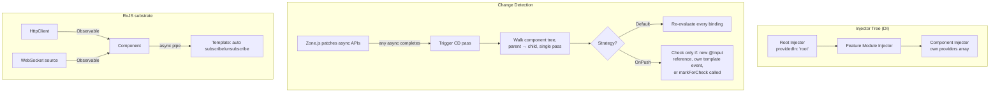

# Module 156 — Angular Fundamentals: Component Architecture, Dependency Injection, Change Detection Internals & RxJS

> Domain: Angular | Level: Beginner → Expert | Prerequisite: [[../18-Event-Driven-Architecture/01-EDA-Fundamentals-Choreography-vs-Orchestration]] (RxJS's Observable/Subject model is a single-process, in-memory instance of the same push-based, event-driven reasoning that domain develops at distributed-system scale), [[../11-Design-Patterns/01-CSharp-Design-Patterns-Fundamentals]] (Angular's DI container is a direct architectural cousin of the DI patterns already covered for backend C#/.NET services)

>
> **Scope note:** `42-Angular` scoped as three modules (156-158), autonomously, per the standing "no more waiting" workflow decision — a fresh domain with no prior groundwork in this course, mirroring the 3-module depth already used for `41-OAuth2-OIDC-JWT-PKCE`. This module covers component architecture, DI, change detection internals, and RxJS fundamentals; Module 157 covers state management, forms, and performance/micro-frontend architecture; Module 158 is a capstone case study. `43-React` (immediately following) will be written comparatively against this domain, per this repo's established sibling-domain treatment (Azure vs. AWS, Modules 65-72).

---

## 1. Fundamentals

**What:** Angular is an opinionated, batteries-included TypeScript framework for building component-based single-page applications, built around four load-bearing subsystems this module develops: a **component/template model** (declarative UI bound to component class state), a **hierarchical dependency injection system** (services resolved through an injector tree, not manually constructed), a **change detection mechanism** (the process by which the framework decides when and what to re-render after state changes), and **RxJS** (the reactive-stream library Angular's own APIs — the `HttpClient`, the Router, reactive forms — are built on top of).

**Why:** Every one of these four subsystems has a specific, non-obvious internal behavior that a candidate who has only used Angular at a surface level (i.e., "components have templates, services are injected, `ngOnChanges` fires when things change") will not be able to explain under a Principal-level interview's follow-up pressure — and each subsystem's internal behavior directly explains a real, common production failure mode (change-detection storms, DI provider-scope bugs, memory leaks from unmanaged subscriptions) that this module's later sections examine concretely.

**When:** Angular's opinionated, all-in-one structure (routing, forms, HTTP, DI, and testing utilities all first-party and mutually consistent) makes it a common choice for large, long-lived enterprise applications with big teams — exactly the kind of application this course's Elite FinTech Interview Panel lens assumes (multi-desk trading platforms, back-office operations consoles, compliance dashboards) — where a shared, enforced structure across many contributors matters more than the flexibility a less-opinionated library provides.

**How (30,000-ft view):**
```
Component class (state + logic)
        │
   Template (declarative binding: {{ }}, [property], (event), *directives)
        │
   Change Detection (Zone.js patches async APIs → triggers a check pass
        │              → walks the component tree → updates the DOM
        │              where bound expressions changed)
        │
   Dependency Injection (constructor-declared dependencies resolved by
                          walking up the injector tree at component
                          creation time, not manually `new`'d)

RxJS threads through all of it: HttpClient returns Observables, the Router's
navigation events are Observables, reactive forms' valueChanges are Observables —
Angular's async model is RxJS's push-based model, not Promises', throughout.
```

---

## 2. Deep Dive

### 2.1 The component/template compilation model — Ivy

Angular's current compiler and runtime (**Ivy**, since Angular 9, universal since) compiles each component's template into a set of **instructions** — a sequence of function calls (`ɵɵelementStart`, `ɵɵtextInterpolate`, `ɵɵproperty`, etc.) that directly construct and update the DOM, rather than an intermediate virtual-DOM diffing step. This is a structurally different rendering model from React's virtual-DOM reconciliation (Module 157/158's comparative counterpart, `43-React`, develops this contrast fully): **Ivy's generated update instructions already know, at compile time, exactly which DOM nodes correspond to which template bindings** — change detection's job is not to diff a tree and compute a minimal patch, but to *execute* those already-known update instructions and let each one decide, via a cheap identity/value check, whether its specific binding actually changed.

### 2.2 Change detection internals — Zone.js and the check cycle

Angular's default change-detection strategy relies on **Zone.js**, a library that monkey-patches every async browser API (`setTimeout`, `addEventListener`, `Promise.then`, XHR callbacks) so that Angular can be notified whenever *any* asynchronous operation completes anywhere in the application — the trigger for "something might have changed, time to check." On each such trigger, Angular runs a **change detection pass**: it walks the component tree (in a single, predictable, parent-to-child order — Angular's tree walk is *unidirectional*, unlike some other frameworks' potential re-entrant update cycles) and, for every component using the default `ChangeDetectionStrategy.Default`, re-evaluates every template binding to check whether its value has changed since the last pass, updating the DOM only where it has. **The critical, often-missed cost model:** because Zone.js triggers a full tree walk on *any* async completion anywhere in the app, a high-frequency async source (a WebSocket streaming market-tick updates, a `setInterval` polling loop) can trigger the *entire component tree* to be re-checked on every single message — even for components with no relationship whatsoever to that data source. This is Module 158's central production incident.

### 2.3 `OnPush` — narrowing what triggers a check

`ChangeDetectionStrategy.OnPush` tells Angular a specific component subtree only needs re-checking when one of three specific things happens: (1) one of its `@Input()`-bound properties receives a new *reference* (not merely a mutated object — `OnPush` uses reference/identity comparison, not deep equality, which is why in-place mutation of an `@Input()` object is a classic `OnPush` bug), (2) an event originating from within that component's own template fires, or (3) the component explicitly calls `ChangeDetectorRef.markForCheck()`. This converts change detection from "check everything, every time" to "check only the parts of the tree that have a specific, structural reason to have changed" — the primary performance lever this module's §7 develops, and the direct fix for Module 158's incident.

### 2.4 Dependency injection — the hierarchical injector tree

Angular's DI system resolves a component or service's constructor-declared dependencies by walking an **injector tree** that mirrors (but is distinct from) the component tree: a request for a dependency first checks the requesting component's own element injector, then walks up through parent element injectors, and finally reaches the **root injector** (populated by `providedIn: 'root'` services, module-level `providers` arrays, or `bootstrapApplication`'s providers). **This means the same injection token can resolve to a genuinely different instance depending on where in the tree it's requested from** — a service provided at a specific component's `providers` array creates a new instance scoped to that component and its descendants only, shadowing the root-level instance for that subtree exactly the way a nested C# DI scope shadows its parent container (a direct structural parallel to this course's own backend DI coverage). Getting this scoping wrong — expecting a singleton where a component-scoped provider actually created a new instance per component — is this domain's most common DI-specific production bug class.

### 2.5 RxJS — push-based reactive streams as Angular's async substrate

An RxJS `Observable` represents a stream of values delivered over time via a `subscribe()` callback — structurally similar to Module 18's EDA event-stream model, but entirely in-process and single-application-instance-scoped rather than distributed. Angular's own APIs return Observables throughout (`HttpClient.get()`, `Router.events`, `FormControl.valueChanges`) specifically because Observables, unlike Promises, are **lazy** (no work happens until `subscribe()` is called), **cancellable** (`unsubscribe()` stops in-flight work — critical for a router navigating away mid-request), and **support multiple values over time** (a Promise resolves exactly once; a WebSocket-backed Observable can emit indefinitely). **The `async` pipe in templates (`{{ value$ | async }}`) is the idiomatic, framework-managed subscription mechanism** — it subscribes on component initialization and, critically, automatically unsubscribes on component destruction, closing the exact manual-subscription-management gap that produces this domain's most common memory-leak class (§6, §14).

### 2.6 Lifecycle hooks and the change-detection-adjacent hook ordering

Angular's component lifecycle hooks (`ngOnChanges` → `ngOnInit` → `ngDoCheck` → `ngAfterContentInit` → `ngAfterContentChecked` → `ngAfterViewInit` → `ngAfterViewChecked` → `ngOnDestroy`) are not arbitrary — several fire *as part of* the change-detection pass itself, not independently of it: `ngDoCheck` and `ngAfterViewChecked` in particular run on **every single change detection cycle**, meaning any non-trivial logic placed inside them (a common mistake) directly multiplies the cost of every check pass across the entire app, not merely the cost of this one component's own state changes.

---

## 3. Visual Architecture



```
Ivy compiled template — NOT virtual-DOM diffing:

  Template source          Compiled instructions (simplified)
  ─────────────────        ──────────────────────────────────
  <div>{{name}}</div>  →   ɵɵelementStart('div')
                            ɵɵtext(0)
                            ɵɵelementEnd()
                            // update fn, run on each CD pass:
                            ɵɵtextInterpolate(ctx.name)  ← cheap identity
                                                            check per binding,
                                                            not a tree diff
```

---

## 4. Production Example

**Problem:** A brokerage's internal operations console — a large Angular single-page application used continuously by desk staff throughout the trading day — began exhibiting progressively worsening UI sluggishness over the course of each session, severe enough by mid-afternoon that staff were manually refreshing the page to restore responsiveness.

**Architecture:** The console subscribed directly (via `.subscribe()` in component code, not the `async` pipe) to a WebSocket-backed Observable delivering real-time position updates, in a component that stayed mounted for the application's entire session lifetime, alongside dozens of other feature components using the framework's default change-detection strategy throughout.

**Implementation / What happened:** Two independent, compounding defects: first, each position-update subscription was established in `ngOnInit` but never explicitly torn down in `ngOnDestroy` — because the parent container never actually destroyed and recreated this particular component during normal navigation, the leak wasn't from the *expected* route-navigation teardown path, but from a secondary widget within the console being opened and closed repeatedly throughout the day, each open cycle adding one more permanent, never-cleaned-up subscription to the same underlying WebSocket stream. Second — and this is what converted a memory leak into an *interactivity* problem, not merely a memory-growth one — every incoming WebSocket message, being an async event Zone.js had patched, triggered a full change-detection pass across the *entire* application's default-strategy component tree, meaning each of the accumulating, duplicate subscriptions' resulting state updates multiplied the cost of every single check cycle across every visible component, not merely the position widget itself.

**Trade-offs:** Manual `.subscribe()` calls were originally chosen over the `async` pipe specifically because the widget needed to perform imperative side effects (triggering a toast notification, updating a non-template internal cache) on each message — a legitimate reason the `async` pipe alone doesn't cover, but one that required manually replicating the exact lifecycle discipline (`ngOnDestroy` cleanup) the `async` pipe provides automatically, and that discipline was inconsistently applied across the widget's several open/close code paths.

**Lessons learned:** **A manually-managed RxJS subscription's lifetime is a fact about the code, not the framework — nothing enforces it is torn down correctly, unlike the `async` pipe's automatic, structurally-guaranteed cleanup.** And separately, independent of the leak itself: **any component using Angular's default change-detection strategy pays the cost of every async event firing anywhere in the application, not just events relevant to that component** — the two defects compounded because the leak kept adding new trigger sources, and the default strategy kept charging their full cost against the entire tree on every single one.

---

## 5. Best Practices

- **Prefer the `async` pipe over manual `.subscribe()` in components wherever the subscription's only purpose is populating template state** — its automatic unsubscribe-on-destroy (§2.5) eliminates an entire class of manual-lifecycle-discipline bugs by construction.
- **Adopt `OnPush` as the default change-detection strategy for any component tree with meaningful size**, especially subtrees receiving high-frequency data (§2.3, §4) — narrows the check-cycle cost from "the whole app, every async event" to "only what has a structural reason to have changed."
- **Scope DI providers deliberately** — understand whether a service should be a true singleton (`providedIn: 'root'`) or intentionally per-component-subtree-scoped (a component-level `providers` array), and treat an unexpected "why do I have two instances of this service" bug as a scoping question first (§2.4), not a code defect in the service itself.
- **Keep `ngDoCheck`/`ngAfterViewChecked` bodies trivially cheap or empty** — anything non-trivial here runs on every single change-detection cycle app-wide, not just this component's own updates (§2.6).
- **Treat every manually-created `Subscription` as requiring an explicit, auditable teardown path** — accumulate them in a single `Subscription` (via `.add()`) or use the `takeUntilDestroyed()` operator (Angular's structural, first-party fix for exactly §4's pattern) rather than scattering ad hoc unsubscribe logic across multiple lifecycle branches.

---

## 6. Anti-patterns

- **Manual `.subscribe()` calls with no corresponding, verified `ngOnDestroy` cleanup** — §4's exact incident; the single most common Angular memory-leak source.
- **Mutating an `@Input()`-bound object in place under `OnPush`** — since `OnPush` checks reference identity (§2.3), an in-place mutation produces no new reference and the component silently fails to re-render, a bug that looks like "the data updated but the UI didn't."
- **Heavy computation inside `ngDoCheck` or `ngAfterViewChecked`** — directly multiplies the cost of every change-detection pass across the entire component subtree beneath it (§2.6).
- **Assuming a service is a singleton without checking its `providedIn` configuration and where it's referenced in a `providers` array** — the component-scoping behavior (§2.4) is easy to introduce accidentally via a copy-pasted module/component declaration.
- **High-frequency data sources (WebSockets, `setInterval` polling) feeding directly into default-strategy component trees** without `OnPush` or explicit change-detection scoping — the direct cause of §4's tree-wide check-cost multiplication.

---

## 7. Performance Engineering

Change-detection cost is fundamentally a function of **(check-cycle frequency) × (tree size subject to Default-strategy checking)** — §4's incident is the concrete demonstration of both factors compounding simultaneously. `OnPush` (§2.3) is the primary lever on the second factor; reducing the *frequency* of triggering events is the primary lever on the first — batching high-frequency updates (e.g., buffering WebSocket messages over a short interval via RxJS's `bufferTime`/`throttleTime` operators before they reach component state) trades a small, deliberate latency cost for a large reduction in check-cycle count, directly analogous to Module 149's hedged-request-budgeting reasoning (bound the cost of a mitigation rather than applying it unconditionally). Angular's newer **zoneless change detection** (running without Zone.js, relying instead on Signals — Module 157 §2 — for fine-grained, explicit change notification) removes the "any async event anywhere triggers a full-tree check" cost model entirely, at the cost of requiring every reactive data source in the app to explicitly participate in the Signals model rather than being implicitly covered by Zone.js's blanket monkey-patching.

---

## 8. Security

Angular's template binding is **sanitized by default** — interpolation (`{{ }}`) and property binding (`[innerHTML]`, etc.) automatically escape or sanitize values to prevent XSS, and the framework explicitly requires an opt-in (`bypassSecurityTrustHtml` and similar `DomSanitizer` methods) to render raw, unsanitized content — a structural default-safe posture directly analogous to this course's parameterization-over-sanitization finding (Module 97) for SQL injection, now applied to DOM injection. **`bypassSecurityTrustHtml` and its siblings are the single highest-risk API surface in Angular's security model** — every use is an explicit, auditable assertion that a specific value is safe despite bypassing the framework's own default protection, and should be treated with the same governance rigor as any other explicitly-declared trust boundary this course has examined (Module 152's pathway-coverage discipline applies directly: every `bypassSecurityTrust*` call site should be inventoried and periodically re-justified, not merely present in code review history once). Content Security Policy (CSP) headers, served independently of Angular's own sanitization, provide defense-in-depth against exactly the residual risk a sanitization bypass or a third-party dependency vulnerability introduces.

---

## 9. Scalability

The injector-tree model (§2.4) scales cleanly to large applications specifically because it allows genuinely independent feature areas to provide their own component-scoped service instances without any risk of state leaking across unrelated parts of the tree — the same encapsulation benefit Module 32's Clean Architecture and Module 33's Hexagonal Architecture provide at the backend service layer, now expressed through Angular's own DI hierarchy at the frontend component layer. Lazy-loaded feature modules (loaded on-demand via the Router rather than bundled into the initial payload) keep initial load time bounded independent of total application size — directly analogous to Module 89's monorepo affected-project computation, both solving "don't pay the cost of code you don't need for this specific navigation/build."

---

## 10. Interview Questions

### Basic (10)

**B1. What is the difference between a component and a directive in Angular?**
*Ideal Answer:* A component is a directive with its own template — it controls a section of the DOM directly. A directive (attribute or structural) modifies the behavior or appearance of an existing DOM element without providing its own template.
*Why correct:* Matches the standard Angular architectural distinction directly.
*Common mistakes:* Describing components and directives as unrelated concepts rather than components being directives-with-templates specifically.
*Follow-up:* Give an example of a structural directive and explain what makes it "structural."

**B2. What triggers Angular's change detection by default?**
*Ideal Answer:* Zone.js monkey-patches asynchronous browser APIs (timers, event listeners, Promises, XHR) so that Angular is notified whenever any such async operation completes anywhere in the application, triggering a change-detection pass.
*Why correct:* Matches §2.2.
*Common mistakes:* Assuming change detection only runs when a component's own bound data explicitly changes, missing that it's actually triggered by *any* async completion app-wide.
*Follow-up:* What's the performance implication of this "any async event anywhere" trigger model at scale?

**B3. What does `OnPush` change-detection strategy do?**
*Ideal Answer:* Restricts when a component subtree is re-checked to three cases: a new `@Input()` reference, an event from within the component's own template, or an explicit `markForCheck()` call.
*Why correct:* Matches §2.3.
*Common mistakes:* Describing `OnPush` as "only checks when data changes," without the precise reference-identity qualifier that explains its most common gotcha.
*Follow-up:* Why does mutating an `@Input()` object in place fail to trigger a re-render under `OnPush`?

**B4. What is Angular's dependency injection system, at a high level?**
*Ideal Answer:* A hierarchical system resolving constructor-declared dependencies by walking an injector tree from the requesting component up toward the root injector, rather than requiring manual instantiation.
*Why correct:* Matches §2.4.
*Common mistakes:* Describing DI purely as "Angular provides services" without the tree-walking, scope-resolution mechanism that explains scoping bugs.
*Follow-up:* What does `providedIn: 'root'` mean, and how does it differ from providing a service in a specific component's `providers` array?

**B5. What is an RxJS Observable, and how does it differ from a Promise?**
*Ideal Answer:* An Observable represents a stream of values over time, is lazy (no work until subscribed), and is cancellable (via unsubscribe); a Promise resolves exactly once and begins executing immediately upon creation, with no built-in cancellation.
*Why correct:* Matches §2.5.
*Common mistakes:* Describing Observables as "just a fancier Promise" without the lazy/cancellable/multi-value distinctions that explain why Angular's own APIs are built on Observables specifically.
*Follow-up:* Why does the Angular Router specifically benefit from Observables' cancellability?

**B6. What does the `async` pipe do?**
*Ideal Answer:* Subscribes to an Observable (or Promise) directly in the template, automatically unsubscribing when the component is destroyed, and returns the latest emitted value for rendering.
*Why correct:* Matches §2.5.
*Common mistakes:* Describing it only as "displays Observable values" without the automatic subscription-lifecycle management that's its actual architectural value.
*Follow-up:* What manual lifecycle responsibility does using `.subscribe()` directly in a component, instead of the `async` pipe, place on the developer?

**B7. Name three Angular lifecycle hooks, in their firing order, and what each is for.**
*Ideal Answer:* `ngOnChanges` (fires on `@Input()` changes, before `ngOnInit`), `ngOnInit` (one-time initialization after the first `ngOnChanges`), `ngOnDestroy` (cleanup before the component is removed).
*Why correct:* Matches §2.6's ordering and standard hook purposes.
*Common mistakes:* Getting `ngOnChanges` vs. `ngOnInit` ordering backwards, or omitting `ngOnDestroy`'s cleanup role.
*Follow-up:* Which lifecycle hooks fire on every single change-detection cycle, not just once?

**B8. What is Ivy, and how does its rendering model differ conceptually from virtual-DOM diffing?**
*Ideal Answer:* Ivy is Angular's compiler/runtime that compiles templates directly into DOM-manipulation instruction functions at compile time, rather than building and diffing an intermediate virtual-DOM tree at runtime.
*Why correct:* Matches §2.1.
*Common mistakes:* Describing Ivy as "just Angular's rendering engine" without the compile-time-instructions-vs-runtime-diffing distinction.
*Follow-up:* What does Ivy already know at compile time that a virtual-DOM diffing approach has to compute at runtime instead?

**B9. Why does Angular sanitize template bindings by default?**
*Ideal Answer:* To prevent XSS — values bound via interpolation or property binding are automatically escaped/sanitized unless a developer explicitly opts out via a `DomSanitizer` bypass method.
*Why correct:* Matches §8.
*Common mistakes:* Assuming sanitization is optional or must be manually applied, rather than being the automatic, structural default.
*Follow-up:* What's the risk of using `bypassSecurityTrustHtml`, and when is it legitimately necessary?

**B10. What is a lazy-loaded feature module, and why does it matter for large applications?**
*Ideal Answer:* A module loaded on-demand (typically via the Router, when a user navigates to a route that needs it) rather than bundled into the application's initial payload, keeping initial load time bounded independent of total application size.
*Why correct:* Matches §9.
*Common mistakes:* Confusing lazy loading with `OnPush` change detection — they solve different problems (initial load time vs. runtime check-cycle cost).
*Follow-up:* What Angular Router mechanism enables lazy loading a module?

### Intermediate (10)

**I1. Explain precisely why a high-frequency WebSocket stream feeding a single small widget can degrade the performance of an entire, otherwise-unrelated Angular application.**
*Ideal Answer:* Because Zone.js's async-patching triggers a change-detection pass on *any* async completion app-wide (§2.2), and by default every component in the tree using `ChangeDetectionStrategy.Default` is re-checked on every such pass — a high-frequency source anywhere multiplies the total number of full-tree checks performed, charging its cost against every component regardless of relevance.
*Why correct:* Matches §4 and §7's cost-model reasoning precisely.
*Common mistakes:* Assuming the performance cost is isolated to the widget itself, missing that Zone.js's trigger mechanism is genuinely global, not scoped to the triggering component's own subtree.
*Follow-up:* What are the two independent levers (§7) for reducing this cost, and which addresses trigger frequency versus tree-size cost?

**I2. Walk through what happens, step by step, when a component under `OnPush` receives a new `@Input()` value that is a mutated (not replaced) object.**
*Ideal Answer:* The object reference passed to `@Input()` is unchanged (same object, mutated in place) — `OnPush`'s reference-identity check finds no difference, so the component is not marked for re-check, and its template does not re-render even though the underlying data has genuinely changed. The fix requires either replacing the object with a new reference (immutable update pattern) or manually calling `markForCheck()`.
*Why correct:* Matches §2.3's precise mechanics with the specific bug scenario spelled out.
*Common mistakes:* Assuming `OnPush` performs some form of deep-equality check, rather than the cheaper reference/identity check that's actually the source of this bug class.
*Follow-up:* Why does Angular's team recommend immutable data patterns specifically for `OnPush`-heavy applications?

**I3. Design the DI provider configuration for a service that must be a true, app-wide singleton, versus one that must be freshly instantiated per instance of a reusable component.**
*Ideal Answer:* True singleton: `providedIn: 'root'` (or a root-level `providers` array), resolved once and shared via the root injector for the application's lifetime. Per-instance: declared in that specific component's own `providers` array, which creates a new instance for each instantiation of that component, scoped to it and its descendants, shadowing any root-level provider of the same token for that subtree.
*Why correct:* Matches §2.4's scoping mechanics with both configurations explicitly contrasted.
*Common mistakes:* Assuming `providedIn: 'root'` and a component-level `providers` array are interchangeable ways to "provide a service," missing the fundamentally different instance-scoping behavior each produces.
*Follow-up:* What debugging symptom would you observe if a service intended as a singleton was accidentally provided at a component level instead?

**I4. Why does the `async` pipe's automatic unsubscription not fully solve every subscription-management scenario, and when is manual subscription still legitimately necessary?**
*Ideal Answer:* The `async` pipe only manages subscriptions used for template rendering — it doesn't help when a component needs to perform imperative side effects (a toast notification, a non-template internal state update, a service call chained off an emission) in response to each value. Those cases require manual `.subscribe()`, which then places the full burden of correct `ngOnDestroy` cleanup on the developer (§4's exact incident).
*Why correct:* Matches §4's root-cause reasoning precisely, correctly identifying the legitimate reason manual subscription was chosen in that incident.
*Common mistakes:* Claiming manual subscription is always avoidable/wrong, missing genuine cases (side effects) the `async` pipe structurally doesn't cover.
*Follow-up:* What first-party Angular mechanism, beyond manual `ngOnDestroy` discipline, exists specifically to reduce this risk for manual subscriptions?

**I5. Compare Ivy's compiled-instruction rendering model against virtual-DOM diffing for update performance on a template with many static (non-changing) bindings.**
*Ideal Answer:* Ivy's compiled update instructions already know, per binding, exactly which check to run and which DOM node it affects — a static binding's update function still runs on each check pass but performs a cheap, direct identity comparison with no tree traversal or diffing overhead. A virtual-DOM approach must construct or otherwise account for the tree structure to compute what changed, generally at higher per-pass overhead for equivalent static-heavy templates, though optimized virtual-DOM implementations narrow this gap considerably in practice.
*Why correct:* Matches §2.1's distinction while correctly avoiding an overstated "always faster" claim.
*Common mistakes:* Claiming one approach is unconditionally faster than the other in all cases, rather than characterizing the specific mechanical difference in what work each approach performs per check.
*Follow-up:* Does Ivy's compile-time-known-instructions model change what `OnPush` is able to skip, relative to a virtual-DOM framework's equivalent optimization?

**I6. A service provided via `providedIn: 'root'` unexpectedly has multiple, independent instances across an application. What are the two most likely causes, and how would you diagnose which applies?**
*Ideal Answer:* (1) The service is also explicitly listed in one or more components' or lazily-loaded modules' own `providers` arrays, creating shadowing instances for those subtrees despite the root-level declaration; (2) a lazily-loaded module was configured with its own separate injector scope (common in older, `NgModule`-based lazy loading) rather than sharing the root injector. Diagnose by inspecting each suspect component/module's `providers` configuration and by logging the service's constructor to observe how many times and from which injection context it's actually instantiated.
*Why correct:* Correctly identifies both realistic root causes for this common DI-scoping confusion, matching §2.4's mechanics.
*Common mistakes:* Assuming `providedIn: 'root'` is an unconditional, unshadowable guarantee of singleton behavior, missing that a more specific provider declaration always takes precedence for its own subtree.
*Follow-up:* How does standalone component-based lazy loading (Angular's newer model) change this diagnostic compared to the older `NgModule`-based lazy-loading approach?

**I7. Design a strategy for handling a high-frequency WebSocket data source (e.g., live market ticks) feeding a component, balancing UI responsiveness against change-detection cost.**
*Ideal Answer:* Apply `OnPush` to the receiving component and its relevant subtree (§2.3) to prevent the rest of the app from being charged for these updates; additionally, buffer or throttle the incoming stream (RxJS `bufferTime`/`throttleTime`) before it reaches component state, trading a small, bounded rendering latency for a large reduction in the number of change-detection passes actually triggered — rather than re-rendering on every single tick.
*Why correct:* Matches §7's two-lever reasoning (trigger frequency and tree-size scoping) applied concretely.
*Common mistakes:* Applying only one of the two levers (e.g., `OnPush` alone) without addressing the underlying trigger frequency, which still leaves the receiving component itself re-checking on every single message.
*Follow-up:* What's the UX trade-off of buffering/throttling a live market-data feed, and how would you choose an appropriate interval for a trading-desk audience specifically?

**I8. Why is `bypassSecurityTrustHtml` considered the highest-risk API surface in Angular's security model, and what governance would you apply to its use?**
*Ideal Answer:* It's an explicit, developer-asserted override of Angular's default XSS-prevention sanitization — every call site is a point where the framework's own protection is deliberately disabled, and its correctness depends entirely on the developer's own judgment about the value's actual safety, not on any framework-enforced guarantee. Governance: treat every call site as requiring explicit code-review justification and periodic re-audit (analogous to Module 152's pathway-coverage discipline for access-control exceptions), never merged without documented justification for why the bypassed content is genuinely trusted.
*Why correct:* Matches §8's risk framing and correctly imports this course's exception-path-governance discipline (Module 152 §15) to a frontend security control.
*Common mistakes:* Treating `bypassSecurityTrustHtml` as a routine API rather than recognizing it as a deliberate, auditable trust-boundary exception comparable in risk profile to a backend access-control bypass.
*Follow-up:* What's a legitimate, common use case where `bypassSecurityTrustHtml` is genuinely necessary rather than a shortcut around proper escaping?

**I9. Explain the relationship between RxJS's laziness and the Angular Router's navigation-cancellation behavior.**
*Ideal Answer:* Because an Observable performs no work until subscribed and supports cancellation via unsubscription, the Router can begin a navigation (subscribing to route guards, resolvers, and data-fetching Observables), and if the user navigates elsewhere before that navigation completes, the Router can simply unsubscribe from the in-flight Observable chain, cleanly stopping any further work (including in-flight HTTP requests, which `HttpClient`'s Observable-based API supports cancelling on unsubscribe) — a cancellation model a Promise-based API cannot provide once a Promise has already been created and its underlying work started.
*Why correct:* Matches §2.5's laziness/cancellability distinction with the concrete Router use case that motivates it.
*Common mistakes:* Describing this only as "Observables can be cancelled" without connecting it to the specific Router navigation-abandonment scenario that makes the property architecturally significant.
*Follow-up:* What would happen to an in-flight HTTP request triggered by a route resolver if the underlying API used Promises instead of Observables and the user navigated away mid-request?

**I10. Why does placing non-trivial logic inside `ngAfterViewChecked` pose a disproportionate performance risk compared to placing the same logic inside `ngOnInit`?**
*Ideal Answer:* `ngOnInit` fires exactly once per component instance; `ngAfterViewChecked` (like `ngDoCheck`) fires on *every single change-detection pass* that reaches this component, for as long as the component exists — non-trivial logic here is not a one-time cost but a cost multiplied by every check cycle the entire application triggers for the lifetime of the component (§2.6), directly compounding with §4/§7's tree-wide check-frequency concerns.
*Why correct:* Matches §2.6's precise firing-frequency distinction.
*Common mistakes:* Treating all lifecycle hooks as roughly equivalent in cost profile, missing the specific, dramatic frequency difference between one-time and per-check-cycle hooks.
*Follow-up:* What legitimate use case exists for `ngAfterViewChecked` despite its per-cycle cost, and how would you keep that use case's cost bounded?

### Advanced (10)

**A1. Design the change-detection strategy for a large enterprise trading application with a mix of static reference panels, a high-frequency live-tick grid, and interactive order-entry forms.**
*Ideal Answer:* Static reference panels: `OnPush` with immutable data (§2.3), since they rarely change and reference-identity checking is cheap and sufficient. Live-tick grid: `OnPush` plus buffered/throttled ingestion (I7) to bound check frequency, with virtual scrolling (Module 158's capstone develops this) to bound the DOM node count subject to update regardless of check frequency. Order-entry forms: `OnPush` combined with Reactive Forms' own `valueChanges` Observable (Module 157) driving explicit, scoped updates rather than relying on Zone.js's blanket trigger — keeping form-interaction-driven checks local to the form's own subtree rather than propagating unnecessary cost elsewhere.
*Why correct:* Correctly differentiates strategy by each UI area's actual update-frequency and data-shape profile rather than applying one uniform policy, synthesizing §2.3, §7, and I7.
*Common mistakes:* Applying `OnPush` uniformly as a blanket fix without addressing the live-tick grid's underlying trigger-frequency problem, which `OnPush` alone doesn't solve (I7).
*Follow-up:* How would zoneless change detection (§7, Module 157 §2) change this design, and what would each of the three UI areas need to do differently to participate correctly?

**A2. §4's incident had two independent, compounding root causes. Design a code-review and tooling checklist that would have caught each independently, before they combined into a production incident.**
*Ideal Answer:* For the subscription leak: a lint rule or code-review checklist item flagging any manual `.subscribe()` call not paired with a corresponding `ngOnDestroy` teardown (or use of `takeUntilDestroyed()`) — RxJS ESLint plugins can enforce this mechanically rather than relying on manual review discipline alone. For the change-detection cost: a checklist item requiring `OnPush` justification (or explicit sign-off on its absence) for any component subscribing to a high-frequency data source, flagged specifically during code review of components touching WebSocket/polling sources.
*Why correct:* Proposes concrete, largely automatable checks for each independent root cause rather than a single generic "review more carefully" recommendation.
*Common mistakes:* Proposing only one of the two checks, missing that the incident required *both* defects to compound — catching either independently would have prevented the specific incident's severity.
*Follow-up:* Why is a mechanical lint rule generally more reliable than a manual code-review checklist item for the subscription-leak check specifically?

**A3. Explain, mechanically, why Zone.js's monkey-patching approach to change-detection triggering is both Angular's most distinctive architectural choice and its most commonly cited performance liability, and how zoneless Angular resolves the trade-off.**
*Ideal Answer:* Zone.js's blanket async-API patching means *any* Angular developer's code automatically participates in change detection with zero explicit wiring — an enormous ergonomic win, since a developer never has to remember to "notify Angular" after an async operation. The liability is exactly the same mechanism applied indiscriminately: every async completion anywhere triggers a full-tree check candidate (§2.2, §4), with no way to distinguish "this async event is relevant to visible UI state" from "this async event is unrelated background work." Zoneless Angular (using Signals, Module 157 §2, for explicit, fine-grained change notification) trades the automatic-by-default ergonomic win for precise, opt-in reactivity — a developer must explicitly model state as a Signal for it to trigger updates, but doing so means only genuinely state-changing operations trigger any check at all, eliminating the "any async event anywhere" over-triggering entirely.
*Why correct:* Correctly frames the zone-based and zoneless models as opposite ends of an ergonomics-versus-precision trade-off, not simply "one is strictly better."
*Common mistakes:* Presenting zoneless Angular as an unconditional improvement without acknowledging the explicit-modeling burden it shifts onto developers relative to Zone.js's automatic coverage.
*Follow-up:* What migration risk exists for a large, established application moving from zone-based to zoneless change detection, given the codebase's existing implicit reliance on Zone.js's blanket coverage?

**A4. A component-scoped DI provider is used to give each instance of a reusable "trading widget" component its own isolated state service. A developer later adds a second, nested instance of the same widget inside the first. What DI behavior results, and is it correct?**
*Ideal Answer:* Each nested instance creates its own separate injector scope (since the provider is declared at the component level, §2.4), so the outer widget and the inner, nested widget each resolve to genuinely different instances of the state service — this is very likely the *correct*, intended behavior for isolated widget state (each widget instance should have its own independent state), but it becomes a bug specifically if the nested widget was meant to share state with its parent (e.g., a "drill-down" view that should reflect the same underlying position data) — in which case the component-level provider was the wrong scoping choice for that specific relationship, and the dependency should instead be resolved from a shared ancestor injector.
*Why correct:* Correctly identifies that the DI behavior itself (separate instances per nested provider declaration) is mechanically consistent and not inherently a bug — whether it's *correct for the use case* depends entirely on the intended relationship between the widgets, which the question forces the candidate to reason about explicitly rather than assuming DI scoping mistakes are always obviously wrong.
*Common mistakes:* Assuming nested component instances always share the same injected service by default, missing that a component-level `providers` array creates a genuinely new scope at every nesting level where it's declared.
*Follow-up:* How would you refactor the DI configuration if the nested widget needed to share the parent's state service instance specifically?

**A5. Design a testing strategy for verifying that a component correctly implements `OnPush` semantics — i.e., that it re-renders when it should and does not re-render (for performance reasons) when it shouldn't.**
*Ideal Answer:* Positive test: mutate an `@Input()` via a genuinely new reference (immutable update) and assert the template reflects the change after triggering change detection (`fixture.detectChanges()` in Angular's testing utilities). Negative test: mutate the same `@Input()` object *in place* (no new reference) and assert the template does *not* reflect the change — a negative test specifically verifying the reference-identity-only check behavior, directly reusing this course's recurring finding (Module 153 A9) that negative-path tests are the more commonly missing, more consequential gap.
*Why correct:* Correctly designs both a positive and, critically, a negative test verifying the specific mechanical behavior (`OnPush`'s reference-check-only semantics) that's this domain's most common source of confusion.
*Common mistakes:* Testing only the positive case (new reference triggers re-render), missing the negative case that would actually catch a developer's mistaken assumption that `OnPush` performs deep equality.
*Follow-up:* How would this test suite need to change if the component were later migrated to a Signals-based, zoneless reactivity model?

**A6. Critique: "Since Ivy compiles templates to direct DOM-update instructions rather than diffing a virtual DOM, Angular applications are always faster than virtual-DOM-based frameworks at runtime."**
*Ideal Answer:* Overstated. Ivy's compiled-instruction model changes *what kind* of work happens per check (direct, per-binding identity checks rather than tree-diffing), but the actual runtime performance for any specific application depends heavily on the change-detection strategy in use (Default vs. `OnPush`), the frequency and scope of triggering events (§2.2, §4), and the specific workload — a poorly-scoped Default-strategy Angular application with a high-frequency trigger source (exactly §4's incident) can perform far worse than a well-optimized virtual-DOM application, and vice versa. The compilation model is one factor among several, not a blanket performance guarantee.
*Why correct:* Correctly refutes an overgeneralized claim by identifying the actual, workload-dependent factors that determine real performance, rather than accepting a framework-level architectural difference as sufficient evidence of a universal performance ordering.
*Common mistakes:* Accepting or rejecting the claim based on the compilation model alone, without engaging with the change-detection-strategy and trigger-frequency factors that this module has established as the dominant real-world performance determinants.
*Follow-up:* Under what specific conditions would you expect Ivy's compiled-instruction model to provide its clearest performance advantage over virtual-DOM diffing?

**A7. A financial-services Angular application's compliance team requires an audit of every location in the codebase where Angular's default XSS sanitization is bypassed. Design the audit process and the ongoing control that keeps it current.**
*Ideal Answer:* Initial audit: a codebase-wide search for every `bypassSecurityTrustHtml`/`bypassSecurityTrustScript`/`bypassSecurityTrustUrl`/`bypassSecurityTrustResourceUrl` call site, each requiring documented justification for why the bypassed content is genuinely trusted (its origin, and why that origin cannot itself be compromised or manipulated by an untrusted party). Ongoing control: a CI-enforced lint rule or static-analysis check that fails the build on any *new* bypass call site lacking an accompanying, reviewed justification comment/annotation, directly reusing Module 99's SAST-tooling pattern (a mechanical, always-running check rather than a one-time manual audit that inevitably drifts stale, per Module 99's own tool-degradation incident).
*Why correct:* Correctly designs both the one-time audit and, critically, the ongoing enforcement mechanism preventing exactly the "audit becomes stale" pattern Module 99 identified in a different tooling context.
*Common mistakes:* Proposing only the one-time audit without an ongoing, automated control preventing new, unreviewed bypass call sites from being introduced after the initial audit completes.
*Follow-up:* What would you do if a legitimate, currently-necessary bypass call site cannot be eliminated (e.g., rendering trusted, pre-sanitized content from a controlled CMS) — how do you keep the ongoing control from producing constant false-positive friction?

**A8. Explain why RxJS's Observable-based `HttpClient` API makes race-condition bugs in "search-as-you-type" features both more likely to occur accidentally and more straightforward to fix correctly, compared to a naive Promise-based implementation.**
*Ideal Answer:* More likely accidentally: each keystroke naively triggering a new HTTP request via Promises, with no built-in mechanism preventing an earlier, slower request's response from arriving and overwriting a later, faster request's more-current result — a classic out-of-order-response race. More straightforward to fix correctly: RxJS's `switchMap` operator, applied to the keystroke-triggered Observable stream, automatically unsubscribes from (cancelling) any previous in-flight request the moment a new one begins, structurally guaranteeing only the most recent request's response is ever used — a fix that requires no manual request-ID tracking or response-ordering logic, unlike the equivalent Promise-based fix.
*Why correct:* Correctly identifies both why the race condition is a natural failure mode without RxJS's cancellation model and the specific, idiomatic RxJS operator (`switchMap`) that structurally prevents it.
*Common mistakes:* Describing the fix vaguely as "debounce the input" without addressing the actual race-condition mechanism (out-of-order response arrival), which debouncing alone reduces in frequency but doesn't structurally eliminate.
*Follow-up:* When would `mergeMap` be the correct choice instead of `switchMap` for a similar user-triggered-request scenario, and why would using it for search-as-you-type reintroduce the race condition `switchMap` prevents?

**A9. Design a migration plan for converting a large, established Angular application's highest-traffic, highest-update-frequency component subtree from Default to `OnPush` change detection, without introducing the silent-stale-render bug class (I2) across the migration.**
*Ideal Answer:* Migrate incrementally, one component subtree at a time (never the whole application at once, reusing this course's recurring incremental-migration discipline, Module 107/136), starting with leaf components with the fewest, most clearly-understood `@Input()` sources; for each migrated component, audit every code path that mutates its `@Input()`-sourced data and convert any in-place mutations to immutable-update patterns (I2's exact bug source) *before* applying `OnPush`; add the negative-test pattern from A5 for each migrated component to catch any remaining in-place-mutation path the audit missed; monitor for user-reported "stale data" bugs specifically in the days following each subtree's migration, since this bug class is easy to miss in code review but immediately visible to actual users interacting with genuinely-changing data.
*Why correct:* Correctly sequences the migration to address the specific risk (`OnPush`'s reference-check-only semantics silently breaking in-place-mutation code paths) proactively, with both audit and test-based verification plus a monitoring-based safety net.
*Common mistakes:* Proposing a single, application-wide `OnPush` migration in one change, maximizing the blast radius of any missed in-place-mutation code path across the entire application simultaneously.
*Follow-up:* How would you prioritize which component subtrees to migrate first, given the migration's cost is proportional to audit effort but its benefit is proportional to that subtree's actual check-frequency exposure (§7)?

**A10. Synthesize this module's four subsystems (component/template model, change detection, DI, RxJS) against this course's recurring "declared ≠ actual" theme. Where does that theme concretely manifest in this module?**
*Ideal Answer:* Most sharply in `OnPush`: a component *declares* itself dependent on its `@Input()` data (the template renders based on it), but its *actual* re-render behavior is contingent on reference identity specifically, not on the data's genuine semantic change — code that mutates in place is "correct" in the sense that the underlying data did change, while being silently "incorrect" from the framework's own narrower, reference-based definition of change, exactly the shape of a declared assumption (the UI reflects the data) silently diverging from actual behavior (the UI reflects only reference-identity changes to the data) that this course has traced across every domain from Kubernetes object presence through this module's own change-detection semantics.
*Why correct:* Correctly identifies the specific, precise instance of the course-wide theme within this module's content, rather than a generic restatement of the theme without concrete grounding in this module's own material.
*Common mistakes:* Citing memory leaks (§4) as the theme's instance here, which is a real defect but a more conventional resource-management bug rather than the sharper "declared reactivity contract ≠ actual reactivity behavior" instance `OnPush` specifically demonstrates.
*Follow-up:* Does Angular's newer Signals-based reactivity model (Module 157 §2) narrow or widen this specific "declared ≠ actual" gap relative to `OnPush`'s Input-reference-based model?

---

## 11. Coding Exercises

### Easy — `OnPush`-safe immutable state update

**Problem:** Given a component receiving a `positions: Position[]` `@Input()` under `OnPush`, write the update logic for adding a new position that correctly triggers re-render (avoiding I2's in-place-mutation bug).

**Solution (TypeScript):**
```typescript
interface Position {
  symbol: string;
  quantity: number;
}

@Component({
  selector: 'app-position-list',
  changeDetection: ChangeDetectionStrategy.OnPush,
  template: `<div *ngFor="let p of positions">{{ p.symbol }}: {{ p.quantity }}</div>`
})
export class PositionListComponent {
  @Input() positions: Position[] = [];
}

// Parent component — the update that actually triggers OnPush re-check:
export class PositionsContainerComponent {
  positions: Position[] = [];

  addPosition(newPosition: Position): void {
    // NEW array reference — OnPush's identity check sees this as changed.
    this.positions = [...this.positions, newPosition];

    // WRONG (the I2 bug): this.positions.push(newPosition);
    // — same reference, OnPush never re-renders.
  }
}
```
**Time complexity:** O(n) for the array copy (n = current position count). **Space complexity:** O(n) for the new array.

**Optimized solution:** For very large, frequently-updated lists where an O(n) copy per update becomes a genuine cost, use an immutable data structure library (e.g., Immer, or a persistent-data-structure library) providing structural sharing — an update produces a new top-level reference (satisfying `OnPush`) while sharing unchanged sub-structure internally, avoiding the full O(n) copy cost.

### Medium — `switchMap`-based search-as-you-type without race conditions

**Problem:** Implement a search-as-you-type feature using RxJS, avoiding the out-of-order-response race condition Advanced Q8 describes.

**Solution (TypeScript):**
```typescript
@Component({
  selector: 'app-instrument-search',
  template: `
    <input [formControl]="searchControl" placeholder="Search instruments...">
    <div *ngFor="let result of results$ | async">{{ result.name }}</div>
  `
})
export class InstrumentSearchComponent {
  searchControl = new FormControl('');

  results$: Observable<Instrument[]> = this.searchControl.valueChanges.pipe(
    debounceTime(200),               // reduce request volume, not a race-condition fix by itself
    distinctUntilChanged(),          // skip redundant identical queries
    switchMap(query =>               // cancels any in-flight request on a new query — THE race-condition fix
      this.searchService.search(query ?? '').pipe(
        catchError(() => of([]))     // don't let one failed search break the stream permanently
      )
    )
  );

  constructor(private searchService: InstrumentSearchService) {}
}
```
**Time complexity:** O(1) per emission (excluding the network call itself). **Space complexity:** O(1) — `switchMap` holds at most one in-flight inner subscription.

**Optimized solution:** Already idiomatic; the realistic hardening is ensuring `searchService.search()` itself supports genuine HTTP cancellation (Angular's `HttpClient` does, via unsubscription, per §2.5/I9) rather than merely discarding a still-in-flight response client-side — cancelling the underlying request, not just ignoring its result, avoids unnecessary backend load from abandoned searches.

### Hard — Component-scoped DI for isolated widget state with explicit sharing opt-in

**Problem:** Implement a reusable "trading widget" component whose state service is isolated per instance by default (Advanced Q4), but supports an explicit opt-in for a nested instance to share its parent's state instance instead.

**Solution (TypeScript):**
```typescript
@Injectable()
export class WidgetStateService {
  private readonly stateSubject = new BehaviorSubject<WidgetState>(initialState);
  readonly state$ = this.stateSubject.asObservable();

  updateState(patch: Partial<WidgetState>): void {
    this.stateSubject.next({ ...this.stateSubject.value, ...patch });
  }
}

@Component({
  selector: 'app-trading-widget',
  providers: [WidgetStateService], // isolated instance by default (Advanced Q4)
  template: `<ng-content></ng-content>`
})
export class TradingWidgetComponent {
  constructor(public state: WidgetStateService) {}
}

@Component({
  selector: 'app-shared-trading-widget',
  // NO own providers entry — explicit opt-in to inherit the ancestor's instance
  // instead of creating a new isolated one, resolving `WidgetStateService`
  // by walking UP the injector tree per §2.4's mechanics.
  template: `<ng-content></ng-content>`
})
export class SharedTradingWidgetComponent {
  constructor(public state: WidgetStateService) {} // resolves to nearest ANCESTOR's instance
}
```
**Time complexity:** O(1) injector resolution per instantiation (bounded by injector-tree depth). **Space complexity:** O(1) per isolated instance; zero additional state for the sharing variant.

**Optimized solution:** In production, make the sharing behavior an explicit, self-documenting input (e.g., an `@Input() isolated: boolean = true` combined with a factory provider conditionally supplying either a new or an injected-from-parent instance) rather than relying on component-naming convention (`SharedTradingWidgetComponent` vs. `TradingWidgetComponent`) alone to communicate the scoping intent to future maintainers — the naming-convention-only version is exactly the kind of implicit, undocumented behavior this course's "declared ≠ actual" theme (Advanced Q10) warns against.

### Expert — Change-detection-cost-bounded live tick feed with virtual scrolling groundwork

**Problem:** Design a component ingesting a high-frequency WebSocket tick stream (§4/I7's exact scenario) that bounds change-detection cost via both `OnPush` and buffered ingestion, exposing a clean, throttled Observable for template consumption.

**Solution (TypeScript):**
```typescript
interface Tick { symbol: string; price: number; timestamp: number; }

@Injectable({ providedIn: 'root' })
export class TickFeedService {
  private readonly rawTicks$: Observable<Tick> = this.webSocketSource();

  // Buffer bursts of ticks over a short window rather than emitting (and
  // triggering change detection for) every single message individually —
  // the trigger-frequency lever from §7/I7.
  readonly bufferedTicks$: Observable<Tick[]> = this.rawTicks$.pipe(
    bufferTime(100),                         // 100ms batching window
    filter(batch => batch.length > 0),       // skip empty windows
    map(batch => this.dedupeToLatestPerSymbol(batch)), // collapse rapid re-quotes
    shareReplay({ bufferSize: 1, refCount: true })     // one subscription shared across consumers
  );

  private dedupeToLatestPerSymbol(batch: Tick[]): Tick[] {
    const latest = new Map<string, Tick>();
    for (const tick of batch) latest.set(tick.symbol, tick); // last-write-wins within the window
    return Array.from(latest.values());
  }

  private webSocketSource(): Observable<Tick> {
    return new Observable<Tick>(subscriber => {
      const ws = new WebSocket('wss://market-data.internal/ticks');
      ws.onmessage = (event) => subscriber.next(JSON.parse(event.data));
      ws.onerror = (err) => subscriber.error(err);
      return () => ws.close(); // structural cleanup on unsubscribe — closes §4's exact leak class
    });
  }
}

@Component({
  selector: 'app-tick-grid',
  changeDetection: ChangeDetectionStrategy.OnPush, // tree-size lever from §7
  template: `
    <div *ngFor="let tick of (tickFeed.bufferedTicks$ | async); trackBy: trackBySymbol">
      {{ tick.symbol }}: {{ tick.price }}
    </div>
  `
})
export class TickGridComponent {
  constructor(public tickFeed: TickFeedService) {}
  trackBySymbol(_: number, tick: Tick): string { return tick.symbol; }
}
```
**Time complexity:** O(k) per buffer window (k = ticks in that 100ms window, typically ≪ total tick volume). **Space complexity:** O(distinct symbols) for the dedup map per window.

**Optimized solution:** For grids displaying thousands of instruments simultaneously, combine this buffered-ingestion pattern with Angular CDK's virtual scrolling (rendering only currently-visible DOM rows regardless of total dataset size) — Module 158's capstone develops this combination fully as the production-scale answer to §4's incident, bounding cost on both the *update-frequency* axis (this exercise) and the *DOM-node-count* axis (virtual scrolling) simultaneously.

---

## 12. System Design

**Requirements**

*Functional:* Component-based UI composition with clear ownership boundaries; hierarchical DI supporting both true singletons and isolated per-widget state; reactive data flow from HTTP/WebSocket sources through to template rendering; automatic sanitization of any dynamically-rendered content.

*Non-functional:* Change-detection cost bounded independent of total application size for high-frequency data sources (§4, §7); memory-stable across long-lived sessions (no accumulating subscription leaks, §4); initial load time bounded independent of total feature count (lazy loading, §9); XSS-safe by default with an auditable, governed exception path (§8, A7).

**Architecture**
```
   Root Injector (providedIn: 'root' singletons)
        │
   Lazy-loaded Feature Modules/Routes (own injector scope where needed, §2.4)
        │
   Component Tree
        ├─ Static/reference-data subtrees: OnPush + immutable data (A1)
        ├─ High-frequency data subtrees: OnPush + buffered ingestion (Expert exercise)
        └─ Form-heavy subtrees: OnPush + Reactive Forms valueChanges (Module 157)

   RxJS substrate: HttpClient / WebSocket sources ──► services (shareReplay
   for shared subscriptions) ──► async pipe (auto-managed) or manual
   .subscribe() + takeUntilDestroyed() (§5) ──► component state
```

**Database selection:** Not directly applicable at the frontend layer; relevant backend APIs (HttpClient targets) are the resource servers this course's backend domains (Modules 1-155) already cover.

**Caching:** `shareReplay` (Expert exercise) for RxJS streams consumed by multiple components, avoiding redundant subscriptions (and redundant underlying HTTP/WebSocket connections) to the same source; Angular's Router-level route-resolver caching for data that doesn't need to be re-fetched on every navigation to the same route.

**Messaging:** WebSocket-backed Observables (Expert exercise) as the frontend's real-time messaging substrate, structurally mirroring Module 18/140's backend event-stream consumption patterns at the single-client, in-browser scale.

**Scaling:** Lazy-loaded modules (§9) bound initial-load scaling with total application feature count; `OnPush` plus buffered ingestion (§7, Expert exercise) bound change-detection scaling with data-update frequency; virtual scrolling (Module 158) bounds DOM-update scaling with dataset size.

**Failure handling:** WebSocket source failures should surface as an explicit error state to the consuming component (Expert exercise's `ws.onerror`) rather than silently stalling the Observable; RxJS `catchError` at the appropriate pipeline stage (Medium exercise) prevents one failed request from permanently breaking a long-lived, shared stream.

**Monitoring:** Change-detection pass frequency and duration (Angular DevTools' profiler, or custom instrumentation) as the frontend-layer equivalent of Module 101's backend performance profiling; subscription-count tracking in long-lived, high-traffic components to catch §4-class leaks before they manifest as user-visible sluggishness.

**Trade-offs:** Zone-based automatic reactivity (ergonomic, but "any async event anywhere" over-triggering, §2.2/A3) vs. zoneless Signals-based reactivity (precise, but requires explicit modeling of every reactive source, Module 157 §2); manual `.subscribe()` (supports imperative side effects, but places lifecycle-management burden on the developer, §4/I4) vs. the `async` pipe (automatic lifecycle management, but template-rendering-only).

---

## 13. Low-Level Design

**Requirements:** Model the component/DI/change-detection/RxJS interaction as a cohesive, testable structure supporting the negative-test discipline (Advanced Q5) and the isolated-vs-shared DI pattern (Hard exercise).

**Class diagram (textual):**
```
TickFeedService  (from Coding Exercise Expert, providedIn: 'root' — true singleton)
 ├─ bufferedTicks$ : Observable<Tick[]>  (shareReplay — one shared subscription)
 └─ webSocketSource() : structural cleanup on unsubscribe

WidgetStateService  (from Coding Exercise Hard, per-component providers — isolated by default)
 ├─ state$ : Observable<WidgetState>
 └─ updateState(patch) : immutable update (BehaviorSubject.next with spread)

TickGridComponent  (OnPush)
 ├─ injects TickFeedService (root-scoped, shared across all grid instances)
 └─ async pipe consumption — no manual subscription-lifecycle burden

TradingWidgetComponent (OnPush, providers: [WidgetStateService])
 └─ injects its OWN isolated WidgetStateService instance

SharedTradingWidgetComponent (OnPush, no own providers)
 └─ injects ANCESTOR's WidgetStateService instance (explicit opt-in via absence of own provider)
```

**Sequence diagram (buffered tick ingestion → render):**
```
WebSocket -> TickFeedService: raw tick message
TickFeedService -> TickFeedService: bufferTime(100), dedupeToLatestPerSymbol
TickFeedService -> TickGridComponent: bufferedTicks$ emission (via async pipe)
TickGridComponent -> Angular CD: markForCheck (implicit, via async pipe under OnPush)
Angular CD -> TickGridComponent: re-check THIS component's subtree only
Angular CD -.-> Rest of app: NOT re-checked (OnPush + async pipe scoping)
```

**Design patterns used:** Observer (RxJS Observables/Subjects as the core reactive-stream pattern throughout); Dependency Injection (Angular's hierarchical injector, §2.4, directly analogous to this course's backend DI coverage); Facade (`TickFeedService` presenting a clean, buffered, deduplicated stream over the raw, high-frequency WebSocket source); Strategy (`ChangeDetectionStrategy.Default` vs. `OnPush` as an interchangeable, per-component strategy selection).

**SOLID mapping:** SRP — `TickFeedService` only handles tick ingestion/buffering, `WidgetStateService` only handles widget-local state, each independently testable; OCP — a new data source (e.g., a REST-polling fallback) can be added as an alternative `Observable<Tick>` source without modifying `TickGridComponent`; DIP — components depend on injected service abstractions (constructor-declared dependencies), never directly instantiating their own data sources, enabling clean substitution in tests (mocking `TickFeedService` entirely for `TickGridComponent`'s unit tests).

**Extensibility:** A new high-frequency data type (e.g., order-book depth updates) can reuse the exact buffering/dedup/`shareReplay` pattern established in `TickFeedService` without modifying existing tick-handling code; the isolated-vs-shared DI pattern (Hard exercise) extends to any future reusable widget needing the same per-instance-vs-shared-state choice.

**Concurrency/thread safety:** JavaScript's single-threaded execution model means there's no traditional multi-threaded race condition within a single component tree — but RxJS's *asynchronous ordering* still requires the same discipline as true concurrency: `switchMap`'s cancellation-on-new-emission (Advanced Q8) is this domain's direct analogue of the atomic compare-and-swap patterns this course's backend modules (Module 152's `SoDGraph`, Module 154's `TokenFamily`) used to prevent races — here, preventing an out-of-order async response from corrupting UI state rather than preventing a concurrent write from corrupting persisted state.

---

## 14. Production Debugging

**Incident:** Following §4's original incident and its `async`-pipe/`OnPush` remediation, a different desk's Angular application — built by a separate team reusing the same `TickFeedService` pattern — begins exhibiting the identical symptom (progressive session-long sluggishness) roughly three months after initial rollout, despite having been built with `OnPush` and the `async` pipe from the start.

**Root cause:** The new team's `TickFeedService` correctly used `shareReplay({ bufferSize: 1, refCount: true })` for its buffered tick stream — but `refCount: true` means the underlying WebSocket connection and buffering pipeline are torn down and recreated whenever the subscriber count drops to zero and a new subscriber later appears, rather than staying permanently alive for the application's session. A specific navigation pattern (repeatedly opening and closing a particular dashboard panel throughout the day) caused the subscriber count to cycle to zero and back up dozens of times per session — and each recreation re-established a *new* WebSocket connection without reliably closing the previous one, because the panel's own component had an `ngOnDestroy` race: the WebSocket's `close()` call (inside the Observable's teardown function, correctly implemented per the Expert exercise's pattern) was occasionally interrupted by the *new* subscription's connection attempt firing first, due to Angular's own change-detection and component-destruction/creation ordering during a single, rapid navigation transition.

**Investigation:** Browser DevTools' Network tab, filtered to WebSocket connections, showed the connection count climbing steadily throughout each session rather than staying at a stable one-connection baseline — directly visible evidence distinguishing this from a pure change-detection-cost problem (which would show one stable connection but growing CPU cost) and pointing specifically at connection-lifecycle mismanagement instead.

**Tools:** Browser DevTools Network panel (WebSocket connection count over session time); RxJS's own `shareReplay` subscriber-count behavior reviewed against the actual navigation pattern generating rapid unsubscribe/resubscribe cycles; a minimal reproduction isolating the rapid open/close navigation pattern against a bare `shareReplay({ refCount: true })` stream to confirm the connection-recreation race independent of the rest of the application.

**Fix:** Changed `refCount: true` to `refCount: false` (keeping the underlying WebSocket connection alive for the application's full session regardless of temporary zero-subscriber gaps) for this specific stream, since the tick feed's connection cost is justified by its near-certain reuse within the same session — trading a small amount of always-on background resource usage for eliminating the reconnection race entirely; where `refCount: true`'s teardown-when-unused behavior is genuinely desired for a different, less certainly-reused stream, the fix would instead be adding explicit connection-lifecycle logging and a debounced teardown delay to avoid tearing down and immediately recreating a connection across a rapid unsubscribe/resubscribe cycle.

**Prevention:** `shareReplay`'s `refCount` option has a real, non-obvious behavioral consequence (full connection teardown and recreation on zero-subscribers, not merely "pause updates") that a team copying a working pattern from another team's codebase can easily miss if the specific navigation patterns their own application exercises differ from the original implementation's — reinforcing that a shared, reusable pattern (Module 139's platform-adoption theme, recurring here at the frontend layer) needs the *reasoning* behind its specific configuration choices documented and understood, not merely the code copied, or a team can reproduce the exact incident class the original pattern was built to prevent, through a subtly different triggering mechanism.

---

## 15. Architecture Decision

**Decision:** How should a large, long-lived enterprise Angular application handle its change-detection strategy — uniformly Default, uniformly `OnPush`, or a mixed approach?

**Option A — Default strategy throughout, relying on Zone.js's automatic coverage:**
*Advantages:* Simplest mental model; no risk of `OnPush`'s reference-identity gotchas (I2) anywhere in the codebase; every developer's mutations "just work" without needing to reason about change-detection strategy at all. *Disadvantages:* Directly exposed to §4's exact failure mode — any high-frequency async source anywhere in the app charges its full cost against every component, with no structural ceiling as the application grows. *Cost:* Low upfront engineering cost. *Risk:* High and growing with application size and data-update frequency, demonstrated directly by §4.

**Option B — `OnPush` uniformly across the entire application from day one:**
*Advantages:* Maximal, consistent change-detection cost discipline; forces immutable-data patterns application-wide from the start, avoiding A9-style incremental-migration risk entirely. *Disadvantages:* Every developer must understand and correctly apply immutable-update patterns everywhere, for every component, including many with no genuine performance need for it — raising the baseline cognitive/discipline cost of ordinary feature development across the whole team, for a benefit that's only actually needed in specific, high-frequency-update areas.
*Cost:* Higher upfront and ongoing developer-discipline cost, uniformly applied regardless of actual need. *Risk:* Low performance risk, but real risk of I2-class silent-stale-render bugs proliferating across many components if the required discipline isn't consistently maintained team-wide.

**Option C — Default strategy as the baseline, with `OnPush` deliberately and incrementally applied to specific, identified high-update-frequency or large subtrees (recommended):**
*Advantages:* Concentrates the immutable-data discipline cost specifically where its performance benefit is actually needed (§7's tree-size lever applied surgically), while the majority of ordinary, low-frequency UI code retains Default strategy's simpler mental model; matches this course's recurring "match control rigor to actual, demonstrated risk" principle (Module 152 §9's risk-tiering, Module 154 A1's endpoint-risk-tiered validation, now at the frontend performance layer). *Disadvantages:* Requires an explicit, ongoing process for identifying which subtrees warrant `OnPush` (A9's migration discipline) and risks under-migrating a genuinely high-frequency area that wasn't correctly identified in time.
*Cost:* Moderate, concentrated proportionally to genuine performance need. *Risk:* Low, contingent on the identification process (profiling, Module 101's discipline applied at the frontend layer) actually catching high-frequency areas before they produce a §4-class incident.

**Recommendation: Option C as the standing default**, directly reapplying this course's risk-tiered-investment principle to Angular's change-detection strategy specifically. The generalizable principle, closing this module: **a framework-level performance optimization like `OnPush` should be applied where profiling demonstrates genuine need, not uniformly by default or uniformly withheld — matching the same risk-and-cost-proportional reasoning this course has now applied at every architectural layer, from backend token-validation strategy (Module 154) to identity governance cadence (Module 152) to, here, frontend change-detection strategy.**

---

## 17. Principal Engineer Perspective

**Business impact:** §4's incident directly affected desk staff's ability to work effectively throughout the trading day — a frontend performance defect in a mission-critical operations console has the same class of business consequence (degraded operator effectiveness during active market hours) as a backend latency incident, even though frontend performance issues are sometimes treated with less operational urgency than backend/infrastructure incidents at organizations that haven't yet internalized this course's recurring finding that user-facing responsiveness is itself a production-reliability concern, not merely a UX nicety.

**Engineering trade-offs:** This module's central trade — Zone.js's automatic-but-imprecise reactivity versus `OnPush`'s precise-but-discipline-requiring reactivity (§2.2, §2.3, A3) — recurs at the architectural-decision level (§15) exactly the way this course has found the same shape recur at every other domain's centralization/precision trade-off (Module 155's broker centralization, Module 152's IAM governance investment).

**Technical leadership:** The diagnostic habit this module's two production incidents (§4's compounding leak-plus-change-detection-cost, §14's `shareReplay` `refCount` reconnection race) both model: a symptom that presents as "the application gets slower over time" has multiple, genuinely distinct possible root causes (memory/subscription leaks, change-detection cost growth, connection-lifecycle mismanagement) that require different diagnostic tooling (Network panel vs. change-detection profiling vs. subscription-count tracking) to distinguish — a Principal-level engineer's first diagnostic step should be establishing *which* resource is actually growing (connections, DOM nodes, check-cycle count, memory) before reasoning about why, rather than assuming a single familiar root cause.

**Cross-team communication:** §14's incident occurred because a second team correctly copied a working pattern's *code* without fully absorbing the *reasoning* behind one of its specific configuration choices (`refCount`'s teardown behavior) — reinforcing, at the frontend layer, this course's repeated finding (Module 139, Module 155 §14) that a shared pattern's safe reuse depends on transferring understanding, not merely code, across team boundaries.

**Architecture governance:** Change-detection-strategy decisions (§15), DI-scoping decisions (§2.4, A4), and sanitization-bypass usage (§8, A7) should each be reviewable, documented architectural decisions for any component handling high-frequency data, shared state, or dynamically-rendered content — not implicit, undocumented choices a future maintainer must reverse-engineer from behavior alone.

**Cost optimization:** Option C's risk-tiered `OnPush` investment (§15) directly optimizes engineering cost by concentrating the immutable-data-discipline burden specifically where profiling demonstrates genuine performance need, rather than either paying that cost uniformly everywhere (Option B) or accepting unbounded performance risk everywhere (Option A).

**Risk analysis:** The dominant risk pattern across this module's two production incidents is a mechanism (change detection, `shareReplay`) whose default or commonly-used configuration behaves correctly and performantly under a narrower set of conditions than a team's actual usage pattern exercises — §4's default strategy assumed a small, low-frequency application; §14's `refCount: true` assumed a stable, non-cycling subscriber count — reinforcing this course's recurring finding that a mechanism's documented default behavior is a claim scoped to typical or assumed usage, not a universal guarantee independent of how it's actually exercised in a specific application's real traffic patterns.

**Long-term maintainability:** What decays across this module's arc is the correspondence between an application's original scale/update-frequency assumptions (under which Default change detection or `shareReplay`'s default `refCount` behavior was perfectly adequate) and its actual, evolved usage pattern months or years later (a new high-frequency data source added, a new rapid-navigation UI pattern introduced) — the same "correctness decays as conditions change out from under an original, once-valid assumption" finding this course has now traced from storage engines (Module 148) through identity federation (Module 155) to, here, frontend reactivity configuration, reinforcing that this finding is genuinely architecture-layer-agnostic, not specific to any one domain this course has examined.

---

**Next in this run:** Module 157 — Advanced Angular: State Management (NgRx & Signals), Reactive Forms, Performance Optimization & Micro-Frontend Architecture, developing the state-management and zoneless-reactivity directions this module's §7/A3 previewed.
