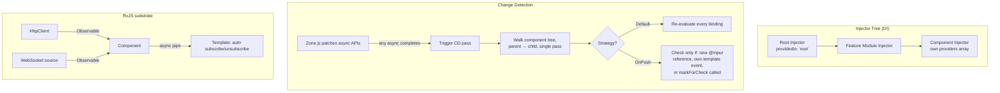
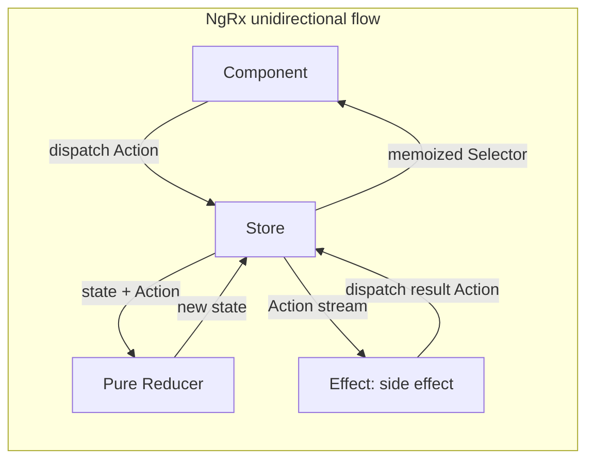
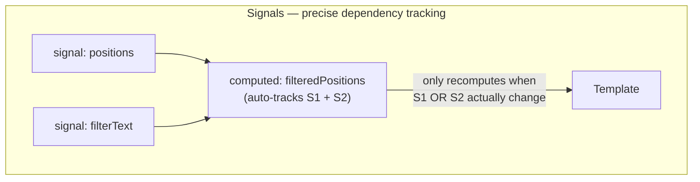
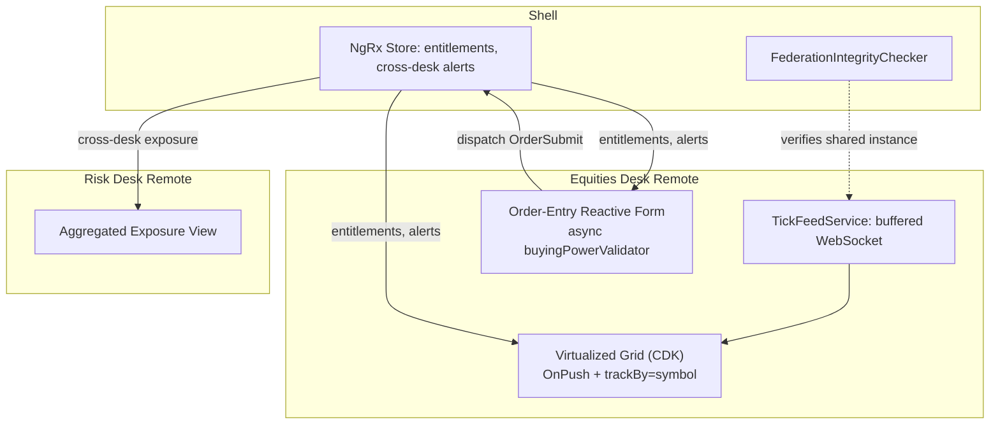
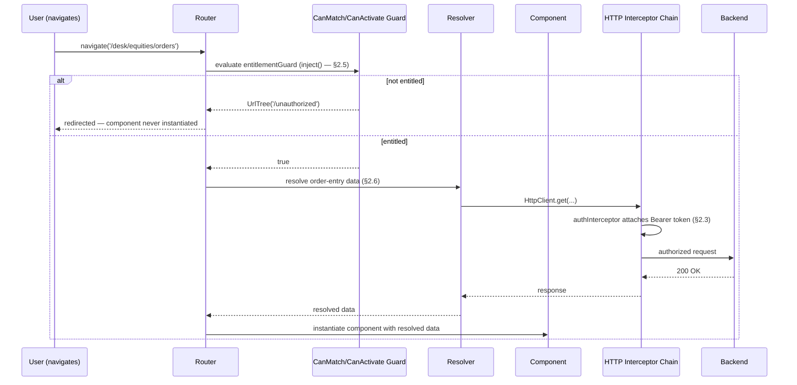

# Angular — Complete Interview Prep (All Topics, One File)

> Domain: Angular | Level: Beginner → Expert | Prerequisite: [[../03-REST-APIs/01-REST-APIs-Interview-Prep]], [[../41-OAuth2-OIDC-JWT-PKCE/01-OAuth2-OIDC-JWT-Interview-Prep]] (SPA security). Comparative: [[../43-React/01-React-Interview-Prep]]
> **Quick-prep edition** (consolidated 2026-10-03). This one file replaces Modules 156–158 and 193. Originals: `git show ebb2d5c:42-Angular/<file>.md`
> Each topic has: **Key concepts → TypeScript/template code → Most common interview questions with answers.** Targets Angular 17–20 (standalone, signals, new control flow).

| # | Topic | # | Topic |
|---|---|---|---|
| 1 | Angular architecture & the Ivy compiler | 9 | HTTP client, interceptors & error handling |
| 2 | Components, templates, data binding & lifecycle | 10 | Routing, guards, resolvers & lazy loading |
| 3 | Standalone APIs & project structure | 11 | Forms: reactive vs template-driven |
| 4 | Dependency injection & `inject()` | 12 | State management: NgRx vs signals stores |
| 5 | Change detection: Zone.js, OnPush, zoneless | 13 | Performance: OnPush, virtual scroll, @defer, SSR/hydration |
| 6 | Signals (signal, computed, effect, input, model) | 14 | Security: XSS, CSRF, auth in SPAs |
| 7 | RxJS essentials & signals interop | 15 | Testing & accessibility |
| 8 | New control flow (@if/@for/@switch) & @defer | 16 | Micro-frontends & capstone (trading dashboard) |
| | | 17 | Top 35 rapid-fire + Principal · 18 Mistakes checklist |

---

## 1. Angular Architecture & the Ivy Compiler

**Key concepts**
- A full **framework** (opinionated): components, DI, router, forms, HttpClient, testing, CLI, SSR — TypeScript-first.
- **Ivy** (AOT compiler/runtime): compiles templates into instructions (incremental DOM style — creation/update code per component), enabling tree-shaking, smaller bundles, locality (each component compiled independently).
- **Build:** Angular CLI with **esbuild + Vite** application builder (default since v17).
- **Bootstrapping:** `bootstrapApplication(AppComponent, appConfig)` with providers (`provideRouter`, `provideHttpClient`, `provideZonelessChangeDetection`…).

**Common interview question**

**Q. Angular vs React in one minute?**
Angular is a batteries-included framework with DI, routing, forms, HTTP and strong conventions — great for large teams needing consistency. React is a UI library; you assemble routing, state, data fetching and forms from the ecosystem — more flexibility, more decisions. Both are component-based and support SSR and signals-like reactivity patterns.

---

## 2. Components, Templates, Data Binding & Lifecycle

**Key concepts**
- **Component** = TypeScript class + template + styles + metadata (`selector`, `imports`, `changeDetection`).
- **Binding:** interpolation `{{ }}`, property `[prop]`, event `(event)`, two-way `[(ngModel)]` / `model()`, attribute `[attr.x]`, class/style bindings.
- **Communication:** parent → child via **inputs** (`input()`), child → parent via **outputs** (`output()`), shared services, signals/stores; `@ViewChild`/`viewChild()` for child access; content projection (`<ng-content>`).
- **Lifecycle hooks:** `ngOnChanges` → `ngOnInit` → `ngDoCheck` → `ngAfterContentInit/Checked` → `ngAfterViewInit/Checked` → `ngOnDestroy`; `DestroyRef`/`takeUntilDestroyed` for cleanup; `afterNextRender`/`afterRender` for DOM work.
- **View encapsulation:** Emulated (default), ShadowDom, None.

```typescript
import { Component, input, output, computed, ChangeDetectionStrategy } from '@angular/core';
import { CurrencyPipe } from '@angular/common';

export interface Position { isin: string; qty: number; price: number; }

@Component({
  selector: 'app-position-row',
  imports: [CurrencyPipe],
  changeDetection: ChangeDetectionStrategy.OnPush,
  template: `
    <td>{{ position().isin }}</td>
    <td>{{ position().qty }}</td>
    <td>{{ marketValue() | currency:'EUR' }}</td>
    <td><button (click)="close.emit(position().isin)">Close</button></td>
  `,
})
export class PositionRowComponent {
  position = input.required<Position>();
  close = output<string>();
  marketValue = computed(() => this.position().qty * this.position().price);
}
```

**Common interview questions**

**Q1. How do components communicate?**
Inputs and outputs for parent/child; services (with signals or RxJS subjects) for siblings or distant components; a store (NgRx/signal store) for app-wide state; router state for URL-driven state.

**Q2. `ngOnInit` vs constructor?**
The constructor is for DI (prefer `inject()` fields) and trivial setup; inputs aren't set yet. `ngOnInit` runs after the first inputs are set — the place for initialization that needs inputs (signal inputs reduce the need for this).

---

## 3. Standalone APIs & Project Structure

**Key concepts**
- **Standalone components** (default since v17/19) import their dependencies directly (`imports: [...]`) — no `NgModule` needed; simpler lazy loading (`loadComponent`), better tree-shaking.
- App configuration via **providers functions** in `app.config.ts`.
- **Structure for enterprise apps:** feature folders (domain-based), `core` (singletons: auth, interceptors), `shared` (UI components, pipes), libraries in an Nx monorepo with module boundary rules (`@nx/enforce-module-boundaries`).

```typescript
// app.config.ts
export const appConfig: ApplicationConfig = {
  providers: [
    provideZonelessChangeDetection(),                       // Angular 20 (stable); v18-19: provideExperimentalZonelessChangeDetection
    provideRouter(routes, withComponentInputBinding(), withViewTransitions()),
    provideHttpClient(withInterceptors([authInterceptor, errorInterceptor]), withXsrfConfiguration({})),
    provideAnimationsAsync(),
  ],
};
// main.ts
bootstrapApplication(AppComponent, appConfig);
```

**Common interview question**

**Q. Why standalone components over NgModules?**
Less boilerplate, explicit dependencies per component, simpler lazy loading at component/route level, better tree-shaking, and an easier mental model; NgModules remain supported for legacy code and can interoperate.

---

## 4. Dependency Injection & `inject()`

**Key concepts**
- **Hierarchical injectors:** environment injectors (root/platform, lazy route injectors) and **element injectors** (component/directive `providers`) → resolution walks up the tree.
- `@Injectable({ providedIn: 'root' })` = app-wide singleton, tree-shakable. `providers` on a component = **instance per component** (scoped state, e.g., per-desk store).
- **`inject()`** function (in field initializers/constructors/factories) replaces constructor parameters; works in functional guards/interceptors.
- **InjectionToken** for non-class values (config); `useClass`/`useValue`/`useFactory`/`useExisting`; `multi: true` providers.
- Resolution modifiers: `optional`, `self`, `skipSelf`, `host`.

```typescript
export const API_BASE_URL = new InjectionToken<string>('API_BASE_URL');

@Injectable({ providedIn: 'root' })
export class PortfolioApi {
  private http = inject(HttpClient);
  private base = inject(API_BASE_URL);
  positions(accountId: string) { return this.http.get<Position[]>(`${this.base}/accounts/${accountId}/positions`); }
}

@Component({
  selector: 'app-desk',
  providers: [DeskStore],                // a separate DeskStore instance per <app-desk>
  template: `...`,
})
export class DeskComponent { store = inject(DeskStore); }
```

**Common interview questions**

**Q1. How does Angular's hierarchical DI work?**
Each component can have its own element injector; requests resolve from the requesting element up through parent elements, then environment injectors (lazy route → root → platform). Providing a service in a component gives that subtree its own instance; `providedIn: 'root'` gives one app-wide singleton.

**Q2. Why might a "singleton" service have two instances?**
It's provided both in root and in a component/lazy route `providers`, or a lazy-loaded route has its own environment injector providing it again. Provide app-wide services only via `providedIn: 'root'`.

---

## 5. Change Detection: Zone.js, OnPush, Zoneless

**Key concepts**
- **Zone.js** patches async APIs (events, timers, XHR, promises) and triggers change detection **after every async task**, checking the component tree top-down → simple but can over-check large trees.
- **Default strategy:** check every component each cycle. **OnPush:** check only when an **input reference changes**, an event originates in the component/its children, an **async pipe/signal** it reads emits, or explicitly marked (`markForCheck`).
- **Immutability** matters with OnPush (mutating an array in place won't trigger).
- **Zoneless** (stable in Angular 20): no Zone.js; change detection scheduled by **signals**, `markForCheck`, async pipe and events → smaller bundles, better performance, clearer stack traces.
- `ExpressionChangedAfterItHasBeenCheckedError` (dev mode) → state changed during a check; fix data flow.
- Escape hatches: `runOutsideAngular` (high-frequency events like mousemove/websocket ticks), `ChangeDetectorRef.detach/detectChanges`.

**Common interview questions**

**Q1. How does change detection work and how do you optimize it?**
Zone.js triggers a check after async events; Angular walks the component tree comparing bindings. Optimize with OnPush everywhere, immutable updates, signals (fine-grained), `track` in `@for`, running high-frequency work outside Angular and batching updates, and moving toward zoneless.

**Q2. Why didn't my OnPush component update?**
The input object was mutated (same reference), or data came from a non-signal source without `markForCheck`/async pipe. Use immutable updates, signals or the async pipe.

---

## 6. Signals (signal, computed, effect, input, model)

**Key concepts**
- **`signal(value)`** — writable reactive value (`set`, `update`); **`computed()`** — derived, memoized, lazy; **`effect()`** — side effects when dependencies change (use sparingly: logging, syncing to non-signal APIs); **`linkedSignal`** — writable signal derived from another; **`resource()`/`httpResource`** — async data as signals (experimental in v19/20).
- **Signal inputs/outputs/model:** `input()`, `input.required()`, `output()`, `model()` (two-way), `viewChild()`, `contentChildren()`.
- Fine-grained reactivity: templates reading signals update only the affected views → enables zoneless.
- **Interop with RxJS:** `toSignal(observable$)`, `toObservable(signal)`.
- Signals for synchronous state; RxJS for event streams, async orchestration, cancellation (switchMap), websockets.

```typescript
@Component({
  selector: 'app-order-ticket',
  changeDetection: ChangeDetectionStrategy.OnPush,
  template: `
    <input type="number" [value]="qty()" (input)="qty.set(+$any($event.target).value)" />
    <p>Notional: {{ notional() }}</p>
    @if (overLimit()) { <p class="warn">Exceeds your limit</p> }
  `,
})
export class OrderTicketComponent {
  price = input.required<number>();
  limit = input(1_000_000);
  qty = signal(0);
  notional = computed(() => this.qty() * this.price());
  overLimit = computed(() => this.notional() > this.limit());
  constructor() { effect(() => console.debug('notional changed', this.notional())); }
}
```

**Common interview questions**

**Q1. Signals vs RxJS — when each?**
Signals for synchronous, current-value state and derived values in components (simple, glitch-free, fine-grained updates). RxJS for streams over time: HTTP orchestration, debouncing, cancellation, websockets, combining async sources. Convert at the boundary with `toSignal`/`toObservable`.

**Q2. Why be careful with `effect()`?**
Effects run side effects whenever dependencies change; using them to set other signals creates hidden data flow and loops. Prefer `computed`/`linkedSignal` for derived state; use effects for syncing with external systems (localStorage, logging, imperative APIs).

---

## 7. RxJS Essentials & Signals Interop

**Key concepts**
- **Observable** (lazy, push, multiple values, cancellable) vs Promise (eager, single value).
- **Subjects:** `Subject`, `BehaviorSubject` (current value), `ReplaySubject`.
- **Flattening operators (most asked):**
  - **`switchMap`** — cancel the previous inner request (search-as-you-type, route params).
  - **`mergeMap`** — run all concurrently (independent requests).
  - **`concatMap`** — queue in order (sequential saves).
  - **`exhaustMap`** — ignore new while one is running (submit button, login).
- Others: `debounceTime`, `distinctUntilChanged`, `combineLatest`, `forkJoin`, `withLatestFrom`, `catchError`, `retry({ count, delay })`, `shareReplay({ bufferSize: 1, refCount: true })`, `takeUntilDestroyed()`.
- **Memory leaks:** unsubscribed long-lived subscriptions → async pipe, `takeUntilDestroyed`, `toSignal`.
- **Hot vs cold:** HTTP observables are cold (each subscription = new request) → `shareReplay` to share.

```typescript
@Component({
  selector: 'app-instrument-search',
  imports: [ReactiveFormsModule],
  template: `
    <input [formControl]="query" placeholder="Search instruments" />
    @for (i of results(); track i.isin) { <div>{{ i.name }} ({{ i.isin }})</div> }
  `,
})
export class InstrumentSearchComponent {
  private api = inject(InstrumentApi);
  query = new FormControl('', { nonNullable: true });
  results = toSignal(
    this.query.valueChanges.pipe(
      debounceTime(300),
      distinctUntilChanged(),
      filter(q => q.length >= 2),
      switchMap(q => this.api.search(q).pipe(catchError(() => of([])))),   // cancels stale requests
    ),
    { initialValue: [] as Instrument[] },
  );
}
```

**Common interview questions**

**Q1. `switchMap` vs `mergeMap` vs `concatMap` vs `exhaustMap`?**
`switchMap` cancels the previous inner observable (latest wins — search). `mergeMap` runs concurrently (order not guaranteed). `concatMap` waits and preserves order (sequential writes). `exhaustMap` ignores new emissions while busy (prevent double submit).

**Q2. How do you avoid RxJS memory leaks?**
Prefer the async pipe or `toSignal` (auto-unsubscribe), use `takeUntilDestroyed()` for manual subscriptions, avoid nested subscribes (use flattening operators), and complete subjects in long-lived services when appropriate.

---

## 8. New Control Flow (@if/@for/@switch) & @defer

**Key concepts**
- Built-in control flow (v17+) replaces `*ngIf`/`*ngFor`/`ngSwitch`: compiled more efficiently, better type narrowing, no imports.
- **`@for` requires `track`** (identity for DOM reuse — the equivalent of `trackBy`/React `key`); `@empty` block.
- **`@defer`** — lazily load parts of a template (and their dependencies' code) with triggers: `on viewport`, `on idle`, `on interaction`, `on hover`, `on timer`, `when condition`, `prefetch on …`; blocks `@placeholder`, `@loading`, `@error`. It defers **code and rendering**, not data fetching by itself.
- Incremental hydration with `@defer (hydrate on …)` for SSR apps (v19+).

```html
@if (user(); as u) {
  <h2>Welcome {{ u.name }}</h2>
} @else {
  <app-login-button />
}

@for (trade of trades(); track trade.id) {
  <app-trade-row [trade]="trade" />
} @empty {
  <p>No trades today</p>
}

@defer (on viewport; prefetch on idle) {
  <app-risk-chart [positions]="positions()" />
} @placeholder {
  <div class="chart-skeleton"></div>
} @loading (minimum 300ms) {
  <app-spinner />
}
```

**Common interview question**

**Q. Why is `track` mandatory in `@for`?**
Angular uses it to match items to existing DOM nodes across updates; with a stable ID it moves/updates rows instead of destroying and recreating them — critical for performance and preserving component/DOM state (focus, inputs) in large or frequently updated lists.

---

## 9. HTTP Client, Interceptors & Error Handling

**Key concepts**
- `HttpClient` returns cold observables; typed responses; `provideHttpClient(withInterceptors([...]), withFetch())`.
- **Functional interceptors** form a chain (order = registration order for requests, reverse for responses): auth headers, correlation IDs, retries (idempotent only), error mapping, loading indicators, caching.
- **XSRF:** `HttpClient` reads the `XSRF-TOKEN` cookie and sends `X-XSRF-TOKEN` for **same-origin mutating requests** only — the server must issue and validate it.
- Global error handling: `ErrorHandler`, interceptor for HTTP errors (401 → re-auth, 403 → message, 5xx → retry/toast), ProblemDetails parsing.

```typescript
export const authInterceptor: HttpInterceptorFn = (req, next) => {
  const auth = inject(AuthService);
  if (!req.url.startsWith(inject(API_BASE_URL))) return next(req);          // never leak tokens to third parties
  const token = auth.accessToken();
  return next(token ? req.clone({ setHeaders: { Authorization: `Bearer ${token}` } }) : req);
};

export const errorInterceptor: HttpInterceptorFn = (req, next) => {
  const notify = inject(NotificationService);
  return next(req).pipe(
    retry({ count: req.method === 'GET' ? 2 : 0, delay: 500 }),            // retry idempotent GETs only
    catchError((err: HttpErrorResponse) => {
      if (err.status === 401) inject(Router).navigate(['/login']);
      else notify.error(err.error?.title ?? 'Unexpected error', err.error?.traceId);
      return throwError(() => err);
    }),
  );
};
```

*(With the BFF pattern, the browser sends cookies and no bearer token — the interceptor then only adds correlation and XSRF headers.)*

---

## 10. Routing, Guards, Resolvers & Lazy Loading

**Key concepts**
- `provideRouter(routes)`; **lazy loading** with `loadComponent`/`loadChildren`; route params as signal inputs (`withComponentInputBinding()`).
- **Functional guards:** `canActivate`, `canMatch` (prevents loading the lazy chunk), `canDeactivate` (unsaved changes), `canActivateChild`. **Guards are UX, not security** — the server must enforce authorization.
- **Resolvers** pre-fetch data before activation (route waits; consider skeletons instead for perceived speed).
- Preloading strategies; route-level providers.

```typescript
export const routes: Routes = [
  { path: '', loadComponent: () => import('./dashboard/dashboard.component').then(m => m.DashboardComponent) },
  {
    path: 'payments',
    canMatch: [() => inject(AuthService).hasPermission('payments:read')],
    loadChildren: () => import('./payments/payments.routes').then(m => m.PAYMENTS_ROUTES),
  },
  {
    path: 'orders/:id',
    loadComponent: () => import('./orders/order-detail.component').then(m => m.OrderDetailComponent),
    resolve: { order: (route: ActivatedRouteSnapshot) => inject(OrdersApi).get(route.paramMap.get('id')!) },
    canDeactivate: [(c: { hasUnsavedChanges(): boolean }) => !c.hasUnsavedChanges() || confirm('Discard changes?')],
  },
];
```

**Common interview question**

**Q. Do route guards secure your app?**
No — they're client-side UX controls (hide/redirect) that anyone can bypass with dev tools or direct API calls. Security is enforced by the API (authentication + object-level authorization). Use `canMatch` to avoid even downloading code for unauthorized users.

---

## 11. Forms: Reactive vs Template-Driven

**Key concepts**
- **Reactive forms:** explicit model in TypeScript (`FormGroup`, `FormControl`, `FormArray`, `FormBuilder`, **typed forms**), synchronous/async validators, cross-field validators, value/status streams — preferred for complex forms.
- **Template-driven:** `ngModel` in templates — simpler for small forms.
- **Signal forms** are emerging (experimental in Angular 21) — know they exist.
- Validation UX: show errors on touched/dirty; disable submit while pending; server-side validation still required (ProblemDetails → map errors to controls).
- **Double-submit protection** for high-consequence forms (order entry): `exhaustMap`, disable on submit, idempotency key per submission.

```typescript
@Component({
  selector: 'app-payment-form',
  imports: [ReactiveFormsModule],
  template: `
    <form [formGroup]="form" (ngSubmit)="submit()">
      <input formControlName="iban" placeholder="IBAN" />
      @if (form.controls.iban.touched && form.controls.iban.hasError('iban')) { <span>Invalid IBAN</span> }
      <input formControlName="amount" type="number" />
      <button [disabled]="form.invalid || submitting()">Pay</button>
    </form>`,
})
export class PaymentFormComponent {
  private fb = inject(NonNullableFormBuilder);
  private api = inject(PaymentsApi);
  submitting = signal(false);
  private idempotencyKey = crypto.randomUUID();
  form = this.fb.group({
    iban: ['', [Validators.required, ibanValidator]],
    amount: [0, [Validators.required, Validators.min(0.01), Validators.max(100_000)]],
  });
  submit() {
    if (this.form.invalid || this.submitting()) return;
    this.submitting.set(true);
    this.api.create(this.form.getRawValue(), this.idempotencyKey)
      .pipe(finalize(() => this.submitting.set(false)))
      .subscribe(() => (this.idempotencyKey = crypto.randomUUID()));
  }
}
export const ibanValidator: ValidatorFn = c => /^[A-Z]{2}\d{2}[A-Z0-9]{11,30}$/.test(String(c.value).replace(/\s/g, '')) ? null : { iban: true };
```

**Common interview question**

**Q. Reactive or template-driven forms?**
Reactive for anything non-trivial: dynamic fields, cross-field validation, testability, typed models and streams. Template-driven for simple forms with minimal logic.

---

## 12. State Management: NgRx vs Signal Stores

**Key concepts**
- **Local component state** (signals) → **service with signals** (feature state) → **NgRx Store** (global, Redux: actions → reducers (pure) → state → selectors (memoized); **effects** for side effects) or **NgRx SignalStore** (signal-based, less boilerplate) or other libraries.
- NgRx benefits: predictable unidirectional flow, DevTools time travel, traceability (audit of actions), strong patterns for large teams. Costs: boilerplate, indirection.
- **Entity adapter** for normalized collections; **ComponentStore**/SignalStore for local complex state.
- Rule: don't put everything in the global store — server cache, form state and UI state often belong locally.

```typescript
// NgRx SignalStore for a trading desk (per-desk instance when provided in a component)
export const DeskStore = signalStore(
  withState({ positions: [] as Position[], loading: false, filter: '' }),
  withComputed(({ positions, filter }) => ({
    visible: computed(() => positions().filter(p => p.isin.includes(filter()))),
    totalMv: computed(() => positions().reduce((s, p) => s + p.qty * p.price, 0)),
  })),
  withMethods((store, api = inject(PortfolioApi)) => ({
    setFilter: (filter: string) => patchState(store, { filter }),
    load: rxMethod<string>(pipe(
      tap(() => patchState(store, { loading: true })),
      switchMap(accountId => api.positions(accountId).pipe(
        tapResponse({ next: positions => patchState(store, { positions, loading: false }),
                      error: () => patchState(store, { loading: false }) }))),
    )),
  })),
);
```

**Common interview questions**

**Q1. When do you need NgRx?**
When many components across features share complex state with many interactions, you need traceability/debugging of state changes, and the team benefits from strict patterns. For smaller apps, services with signals or a SignalStore are enough.

**Q2. NgRx Store vs SignalStore?**
Store: global Redux architecture with actions/reducers/effects — maximal traceability, more boilerplate. SignalStore: signal-native, composable, less ceremony, great for feature/local stores. Many apps combine them (global cross-feature state in Store, feature state in SignalStores).

---

## 13. Performance: OnPush, Virtual Scroll, @defer, SSR/Hydration

**Checklist**
- OnPush + signals everywhere; zoneless for new apps; immutable data.
- `@for` with `track`; **virtual scrolling** (`cdk-virtual-scroll-viewport`) for long lists — DOM cost independent of data size (requires fixed/estimated item size and stable `track`).
- **Lazy loading** routes and `@defer` blocks; analyze bundles (`ng build --stats-json`, source-map-explorer); tree-shakable providers.
- High-frequency updates (market data): throttle/batch (e.g., `auditTime(100)`), `runOutsideAngular` for raw ticks, update signals in batches, avoid layout thrashing.
- Pure pipes (memoized) instead of method calls in templates.
- **SSR** (`@angular/ssr`) + **hydration** (non-destructive, incremental via `@defer` hydrate triggers) + event replay for fast first paint and SEO; prerendering for static pages.
- Images: `NgOptimizedImage`.
- Measure: Angular DevTools profiler, Lighthouse/Core Web Vitals (LCP, INP, CLS).

**Common interview question**

**Q. A trading grid with 10,000 rows updating several times per second is janky. Fix it?**
Virtual scrolling with a stable `track` by instrument ID; OnPush/signals so only changed rows update; batch incoming ticks (auditTime/requestAnimationFrame) instead of updating per message; process WebSocket messages outside Angular's zone (or go zoneless); avoid expensive template expressions (pure pipes/computed); profile with Angular DevTools.

---

## 14. Security: XSS, CSRF, Auth in SPAs

- **XSS:** Angular sanitizes and escapes bindings by default; avoid `bypassSecurityTrust*` and `innerHTML` with untrusted data; use a strict **CSP** (Angular supports nonces: `ngCspNonce`/`CSP_NONCE`); Trusted Types support.
- **CSRF:** relevant with cookie auth — HttpClient XSRF support + server validation + SameSite cookies.
- **Auth:** prefer the **BFF pattern** (cookies, tokens server-side); if tokens are in the SPA, use OIDC code + PKCE (e.g., angular-auth-oidc-client/MSAL Angular), keep tokens in memory, short lifetimes.
- Route guards are not security; never embed secrets in the bundle (it's public).

---

## 15. Testing & Accessibility

- **Unit/component tests:** Jasmine/Karma historically → Jest or **Vitest** (Angular 20+ experimental support) with `TestBed`; Angular Testing Library for user-centric tests; `HttpTestingController` for HTTP; harnesses (CDK component harnesses) for robust tests.
- **E2E:** Playwright or Cypress.
- **Accessibility:** semantic HTML, ARIA only when needed, keyboard navigation and focus management (CDK a11y: `FocusTrap`, `LiveAnnouncer`), color contrast, form labels/errors, axe checks in CI; WCAG 2.1/2.2 AA.

```typescript
it('shows an error for an invalid IBAN', async () => {
  await render(PaymentFormComponent, { providers: [{ provide: PaymentsApi, useValue: { create: () => of({}) } }] });
  await userEvent.type(screen.getByPlaceholderText('IBAN'), 'XX00');
  await userEvent.tab();
  expect(screen.getByText('Invalid IBAN')).toBeInTheDocument();
});
```

---

## 16. Micro-Frontends & Capstone (Trading Dashboard)

**Micro-frontends**
- Split a large UI by business domain into independently deployable frontends; composition via **Module Federation** / **Native Federation** (Angular), web components, or route-level composition in a shell app.
- **Shared dependency negotiation:** shared singletons (Angular core, RxJS) with compatible versions — version skew is the main pain; strict versioning policy and shared design system.
- Costs: complexity, duplicated dependencies, cross-app state/auth/routing, consistent UX. Use only when team autonomy and independent deployment justify it.

**Capstone — enterprise real-time trading dashboard**
- Shell app (auth via BFF, layout, routing) + feature areas (blotter, order entry, risk, positions) — lazy loaded or federated per team.
- **Data:** WebSocket/SignalR streams → a market-data service (outside Angular zone) → batched signal updates per instrument.
- **State:** NgRx Store for cross-desk/global state (user, entitlements, selected account); per-desk **SignalStore** instances (provided per component) for desk-internal state.
- **Grid:** virtual scrolling + `track` by ID, OnPush, pure pipes for formatting.
- **Order entry:** reactive form, client validation + server validation, `exhaustMap`/disable to prevent double submit, idempotency key, confirmation step for large orders, audit-friendly error display with trace IDs.
- **Resilience:** reconnect with backoff, stale-data indicators, snapshot + delta resync.

**Common interview question**

**Q. Would you use micro-frontends for our banking portal?**
Only if multiple autonomous teams need independent release cycles on clearly separated domains and the organisation can invest in a shell, shared design system and dependency governance. Otherwise a well-structured Nx monorepo with lazy-loaded feature libraries gives most benefits with far less complexity.

---

## 17. Top 35 Rapid-Fire Questions + Principal Questions

1. **Angular compiler?** Ivy (AOT).
2. **Standalone?** Components import their own dependencies; no NgModule.
3. **Bootstrap?** `bootstrapApplication` + providers.
4. **Data binding types?** Interpolation, property, event, two-way.
5. **Signal input?** `input()` / `input.required()`.
6. **Output?** `output()`.
7. **Two-way with signals?** `model()`.
8. **DI singleton?** `providedIn: 'root'`.
9. **Per-component instance?** Component `providers`.
10. **`inject()`?** Functional DI.
11. **InjectionToken?** Non-class dependencies.
12. **Zone.js role?** Trigger change detection after async tasks.
13. **OnPush triggers?** Input reference change, events, async pipe/signals, markForCheck.
14. **Zoneless?** Signals-driven CD, no Zone.js (stable v20).
15. **computed?** Memoized derived signal.
16. **effect?** Side effects; use sparingly.
17. **toSignal?** Observable → signal.
18. **switchMap?** Cancel previous.
19. **exhaustMap?** Ignore while busy (submit).
20. **concatMap?** Sequential.
21. **Leak prevention?** async pipe, takeUntilDestroyed, toSignal.
22. **`@for` requirement?** `track`.
23. **`@defer`?** Lazy-load template parts with triggers.
24. **Interceptors?** Functional chain for cross-cutting HTTP concerns.
25. **XSRF in HttpClient?** Cookie → header for same-origin mutations.
26. **Lazy route?** `loadComponent`/`loadChildren`.
27. **canMatch vs canActivate?** Prevents loading vs prevents activation.
28. **Guards = security?** No.
29. **Reactive forms?** Model-driven, typed, testable.
30. **NgRx flow?** Action → reducer → state → selector; effects for side effects.
31. **SignalStore?** Signal-based NgRx store.
32. **Large lists?** Virtual scroll + track.
33. **SSR + hydration?** Fast first paint, SEO; incremental hydration.
34. **Angular XSS protection?** Default sanitization; avoid bypassSecurityTrust.
35. **Micro-frontends?** Module/Native Federation — only with real team autonomy needs.

**Principal-level questions**

**P1. Set frontend architecture standards for 10 Angular teams.**
Nx monorepo (or polyrepo with shared libs) with module-boundary rules, standalone + signals + OnPush/zoneless defaults, a shared design system and component library with accessibility built in, BFF-based auth, a state-management decision guide (local → service → SignalStore → Store), lint/format/test templates, performance budgets in CI (bundle size, Lighthouse), and upgrade cadence (Angular majors every 6 months via `ng update`).

**P2. Migrating a large AngularJS/old Angular app — strategy?**
Incremental: upgrade Angular versions stepwise with `ng update`, migrate to standalone (schematics), introduce signals and new control flow via automated migrations, strangle legacy AngularJS screens with the upgrade adapter or route-level replacement, protect behaviour with E2E tests, and track progress per feature.

---

## 18. Mistakes Checklist (say why each is wrong)
- [ ] Default change detection with huge trees · mutating inputs under OnPush
- [ ] Nested subscribes · forgotten subscriptions · cold HTTP observables subscribed multiple times
- [ ] `mergeMap` for search (race conditions) · no double-submit protection on payments
- [ ] `@for`/`*ngFor` without track · rendering 10k rows without virtual scrolling
- [ ] Using guards as security · tokens in localStorage · secrets in the bundle
- [ ] `bypassSecurityTrustHtml` with user data · no CSP
- [ ] Everything in the global store · effects setting signals in loops
- [ ] Services provided in multiple injectors unintentionally
- [ ] Micro-frontends without team-autonomy drivers or version governance

---

## Architecture Diagrams (preserved from the original modules)

> All 21 Mermaid/ASCII diagrams from the original `42-Angular/` files, kept verbatim and grouped by source module. Originals: `git show ebb2d5c:42-Angular/<file>.md`.

### Module 156 — Angular Fundamentals: Component Architecture, Dependency Injection, Change Detection Internals & RxJS
*Source: `01-Angular-Fundamentals-Components-DI-ChangeDetection-RxJS.md`*

**1. Fundamentals**

```text
Component class (state + logic)
 │
 Template (declarative binding: {{ }}, [property], (event), *directives)
 │
 Change Detection (Zone.js patches async APIs → triggers a check pass
 │ → walks the component tree → updates the DOM
 │ where bound expressions changed)
 │
 Dependency Injection (constructor-declared dependencies resolved by
 walking up the injector tree at component
 creation time, not manually `new`'d)

RxJS threads through all of it: HttpClient returns Observables, the Router's
navigation events are Observables, reactive forms' valueChanges are Observables —
Angular's async model is RxJS's push-based model, not Promises', throughout.
```

**3. Visual Architecture**



**3. Visual Architecture**

```text
Ivy compiled template — NOT virtual-DOM diffing:

 Template source Compiled instructions (simplified)
 ───────────────── ──────────────────────────────────
 <div>{{name}}</div> → ɵɵelementStart('div')
 ɵɵtext(0)
 ɵɵelementEnd
 // update fn, run on each CD pass:
 ɵɵtextInterpolate(ctx.name) ← cheap identity
 check per binding,
 not a tree diff
```

**12. System Design**

```text
 Root Injector (providedIn: 'root' singletons)
 │
 Lazy-loaded Feature Modules/Routes (own injector scope where needed)
 │
 Component Tree
 ├─ Static/reference-data subtrees: OnPush + immutable data (A1)
 ├─ High-frequency data subtrees: OnPush + buffered ingestion (Expert exercise)
 └─ Form-heavy subtrees: OnPush + Reactive Forms valueChanges

 RxJS substrate: HttpClient / WebSocket sources ──► services (shareReplay
 for shared subscriptions) ──► async pipe (auto-managed) or manual
.subscribe + takeUntilDestroyed ──► component state
```

**13. Low-Level Design**

```text
TickFeedService (from Coding Exercise Expert, providedIn: 'root' — true singleton)
 ├─ bufferedTicks$: Observable<Tick[]> (shareReplay — one shared subscription)
 └─ webSocketSource: structural cleanup on unsubscribe

WidgetStateService (from Coding Exercise Hard, per-component providers — isolated by default)
 ├─ state$: Observable<WidgetState>
 └─ updateState(patch): immutable update (BehaviorSubject.next with spread)

TickGridComponent (OnPush)
 ├─ injects TickFeedService (root-scoped, shared across all grid instances)
 └─ async pipe consumption — no manual subscription-lifecycle burden

TradingWidgetComponent (OnPush, providers: [WidgetStateService])
 └─ injects its OWN isolated WidgetStateService instance

SharedTradingWidgetComponent (OnPush, no own providers)
 └─ injects ANCESTOR's WidgetStateService instance (explicit opt-in via absence of own provider)
```

### Module 157 — Advanced Angular: State Management (NgRx & Signals), Reactive Forms, Performance Optimization & Micro-Frontend Architecture
*Source: `02-Advanced-Angular-StateManagement-Forms-Performance-MicroFrontends.md`*

**1. Fundamentals**

```text
NgRx (Redux pattern):
 Component dispatches Action → Reducer (pure fn) computes new Store state
 → Effect (impure, side-effect-isolated) reacts
 to Actions, may dispatch further Actions
 → Selectors derive read-only views for components

Signals (fine-grained reactivity):
 signal(initialValue) → computed(=> derive from other signals,
 auto-tracked dependencies) → effect(=> react
 to signal changes) — no Zone.js required

Micro-Frontends (Module Federation):
 Shell application ──dynamically loads at runtime──► Remote micro-frontend A
 ──dynamically loads at runtime──► Remote micro-frontend B
 (each independently built/deployed; "shared" dependencies negotiated
 at runtime, the exact composition-risk seam)
```

**3. Visual Architecture**



**3. Visual Architecture**



**3. Visual Architecture**

```text
Module Federation — shared-dependency negotiation:

 Shell (declares rxjs@^7.8.0 shared, singleton: true)
 │
 ├── loads Remote A at runtime (declares rxjs@^7.8.0 shared) ──► COMPATIBLE, single shared instance
 │
 └── loads Remote B at runtime (declares rxjs@^7.5.0 shared) ──► range technically overlaps,
 but federation runtime may
 silently load a SECOND
 instance instead of erroring —
 The exact composition risk
```

**12. System Design**

```text
 Shell Application
 │
 ├─ Shared NgRx Store / Signal-based store (cross-desk state ONLY, A1)
 │ └─ Actions/Reducers/Effects/Selectors
 │
 ├─ FederationIntegrityChecker (Expert exercise — runs post-load,
 │ before trusting a remote to participate in shared state)
 │
 └─ Dynamically loads, at runtime, each Remote:
 Remote (Desk A) ── own local Signals/Selectors, own Reactive Forms
 Remote (Desk B) ── own local Signals/Selectors, own Reactive Forms
...
 (each independently built/deployed; shared deps pinned exactly,/A2/A7)
```

**13. Low-Level Design**

```text
SharedNotificationService (from Coding Exercise Expert, providedIn: 'root')
 ├─ instanceId: unique per actual instantiation (identity-verification anchor)
 └─ alerts$: Observable<Alert>

FederationIntegrityChecker (from Coding Exercise Expert)
 └─ verifySharedInstance(shellService, remoteServiceFactory): { ok, reason? }
 — fails LOUDLY (throws) rather than silently degrading

PnlStateService (from Coding Exercise Medium, Signals-based)
 ├─ positionsSignal: WritableSignal<PositionPnl[]>
 ├─ totalPnl: computed, PURE (Advanced Q8)
 └─ constructor: effect for side-effect logging, SEPARATE from computed

buyingPowerValidator (from Coding Exercise Hard)
 └─ AsyncValidatorFn using switchMap for race-condition-safe validation

EffectDispatchLoopGuard (Advanced Q5's structural safeguard, dev-mode)
 └─ wraps Effects, throws/warns on repeated same-Action-type dispatch within a window
```

### Module 158 — Angular Capstone: Enterprise-Scale Real-Time Trading Dashboard — Architecture, State, Performance & Production Incidents
*Source: `03-Capstone-EnterpriseRealTimeTradingDashboard.md`*

**1. Fundamentals**

```text
Shell (owns cross-desk NgRx store: entitlements, global alerts)
 │
 ├─ FederationIntegrityChecker verifies shared-instance identity (/Expert)
 │
 ├── Remote: Equities Desk
 │ ├─ TickFeedService (buffered WebSocket ingestion)
 │ ├─ Virtualized order/position grid (OnPush + CDK virtual scroll, THIS module's new ground)
 │ └─ Order-entry Reactive Form (async buying-power validator)
 │
 ├── Remote: Fixed Income Desk (same pattern, independent team/deploy cadence)
 ├── Remote: FX Desk (same pattern)
 ├── Remote: Derivatives Desk (same pattern)
 └── Remote: Risk Desk (consumes cross-desk NgRx store's aggregated exposure)
```

**3. Visual Architecture**



**13. Low-Level Design**

```text
TopMoversGridComponent (from Coding Exercise Easy)
 ├─ trackBySymbol(index, item): stable identity + dev-mode uniqueness assertion
 └─ (OnPush, CDK virtual scroll, buffered TickFeedService input)

RowIntegrityCanaryService (from Coding Exercise Expert)
 └─ checkGridIntegrity(gridElement, currentData): emits mismatches$ — production safety net

selectAggregatedExposureWithStaleness (from Coding Exercise Medium)
 └─ derives { totalExposure, isFullyCurrent, staleDeskIds } — Risk desk's staleness-aware view

Order-submission composition (Hard exercise's test target):
 OrderEntryFormComponent ──dispatch──► NgRx Store ──Effect──► OrderApiService
 │
 reducer updates deskExposures
 │
 TopMoversGridComponent reflects update
 (through the REAL OnPush+trackBy+virtual-scroll pipeline)
```

### Module 193 — Angular: Modern Application Architecture — Standalone APIs, HTTP Interceptors, Route Guards & Resolvers, Control Flow, Deferrable Views, Zoneless Change Detection, Testing & Accessibility
*Source: `04-ModernArchitecture-Standalone-Interceptors-Guards-ControlFlow-Defer-Zoneless-Testing-Accessibility.md`*

**1. Fundamentals**

```text
bootstrapApplication(AppComponent, {
  providers: [
    provideHttpClient(withInterceptors([authInterceptor, xsrfCheckInterceptor])),
    provideRouter(routes),          // routes carry functional guards + resolvers
    provideZonelessChangeDetection  // or provideZoneChangeDetection — Module 157 §2.4's
  ]                                  // conceptual choice, now an actual bootstrap decision
})
        │
        ▼
Route navigation ──► CanMatch/CanActivate guard (inject()-based) ──► Resolver
        │                                                          (pre-fetches data)
        ▼
Standalone Component tree
  ├─ @if / @for (mandatory track) / @switch — compiled control flow
  ├─ @defer (on viewport/interaction/idle/timer) — incremental hydration boundary
  └─ every HTTP call routed through the interceptor chain (auth header, XSRF, retry)
        │
        ▼
SSR (optional): server-rendered HTML ──► non-destructive hydration ──► client takes over
   (a hydration MISMATCH here is this module's second incident's exact mechanism)
```

**Route navigation — the full guard/resolver/interceptor pipeline**



**Single-flight token refresh — this module's §4 incident, and its fix**

```text
WITHOUT single-flight coordination (the incident):

  Grid component ──401──┐
  Order form     ──401──┼──► THREE independent refresh calls fired concurrently
  Risk panel      ──401──┘        against a SINGLE-USE rotating refresh token
                                   (Module 154 §2 — rotation)
                                        │
                              first refresh call: succeeds, rotates the token
                              second + third:      REJECTED — token already
                                                    rotated out from under them
                                        │
                              two of three original requests never recover ──► forced logout

WITH single-flight coordination (§4's fix, §11 Hard exercise):

  Grid component ──401──┐
  Order form     ──401──┼──► RefreshCoordinator.refresh$ (shareReplay(1))
  Risk panel      ──401──┘         │
                          first 401 SUBSCRIBES and triggers the actual call
                          second/third 401s SUBSCRIBE to the SAME in-flight
                          Observable — no second call fires
                                        │
                              ONE refresh call, ONE rotation
                                        │
                          all three original requests retry ONCE with the
                          new token after the shared Observable emits
```

**`@defer` lifecycle and the accessibility seam (§14's incident)**

```text
@defer (on viewport) {              trigger fires (IntersectionObserver) ──► @loading shown
  <compliance-disclosure />           (min 200ms, avoids flash-of-spinner)
}                                             │
@placeholder { <div>...</div> }              ▼
@loading (minimum 200ms) { ... }    content mounts, participates in normal
@error { ... }                      change detection from here on (§2.8)
                                              │
                          ⚠ NOTHING in this pipeline moves keyboard focus
                            or calls LiveAnnouncer — that is an EXPLICIT,
                            separate responsibility (§2.11), and its
                            absence is invisible to every test that
                            only checks "did the content render"
```

**Architecture**

```text
┌─────────────────────────────────────────────────────────────┐
│ Tab 1                          Tab 2                          │
│ ┌─────────────┐               ┌─────────────┐                │
│ │ TokenStore  │◄─────sync─────┤ TokenStore  │                │
│ │(in-memory)  │  BroadcastChannel│(in-memory)│                │
│ └──────┬──────┘               └──────┬──────┘                │
│        │ authInterceptor             │ authInterceptor        │
│        ▼                             ▼                        │
│ RefreshCoordinator            RefreshCoordinator               │
│  (single-flight, THIS tab only — cross-tab handled by sync)    │
└────────┬───────────────────────────────┬─────────────────────┘
         │ Authorization: Bearer <token>  │
         ▼                                ▼
              Authorization Server (Module 153/154)
         httpOnly refresh-token cookie — never read by JS
```

**13. Low-Level Design — The Single-Flight Refresh Coordinator**

```text
TokenStore (providedIn: 'root' — true singleton per tab, §Module156-2.4)
 └─ accessToken: Signal<string | null>

RefreshCoordinator (providedIn: 'root')
 ├─ refreshInFlight$: Observable<string> | null  — the single-flight marker
 └─ refresh(): Observable<string>
       returns the EXISTING in-flight Observable if one is active,
       otherwise creates one via shareReplay({ refCount: false })

CrossTabSessionSync (providedIn: 'root')
 ├─ channel: BroadcastChannel
 ├─ broadcastRefresh(token, seq)
 └─ broadcastLogout(seq)

authInterceptor (functional, HttpInterceptorFn)
 └─ injects TokenStore + RefreshCoordinator — NEVER calls the token
    endpoint directly; every refresh request routes through the
    coordinator, exactly the "one function provably on every request's
    path" discipline §2.3 establishes
```

**13. Low-Level Design — The Single-Flight Refresh Coordinator**

```text
Grid    ──401──► authInterceptor ──► RefreshCoordinator.refresh()
Form    ──401──► authInterceptor ──► RefreshCoordinator.refresh()  ┐ all three SUBSCRIBE
Risk    ──401──► authInterceptor ──► RefreshCoordinator.refresh()  ┘ to the SAME Observable

RefreshCoordinator ──(first subscription only)──► AuthService.refreshToken()
AuthService ──► Authorization Server: rotate token
Authorization Server ──► AuthService: new access token
AuthService ──► RefreshCoordinator: emit newToken (shareReplay multicasts to all 3 subscribers)
RefreshCoordinator ──► Grid/Form/Risk interceptors: each retries ONCE with newToken
```
