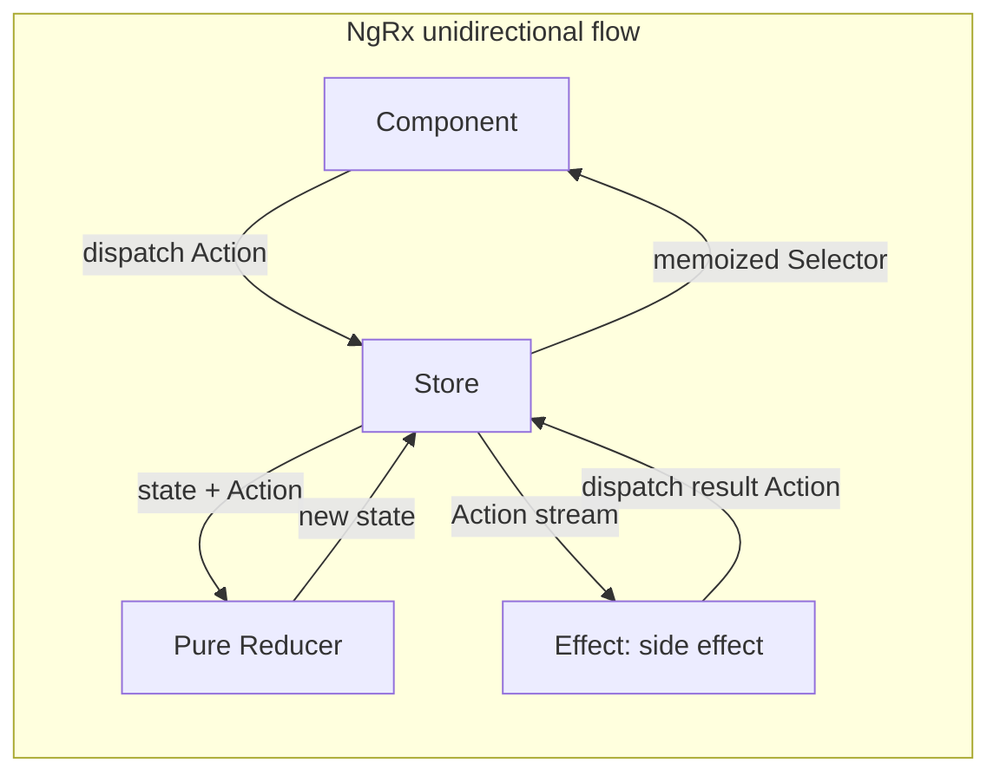
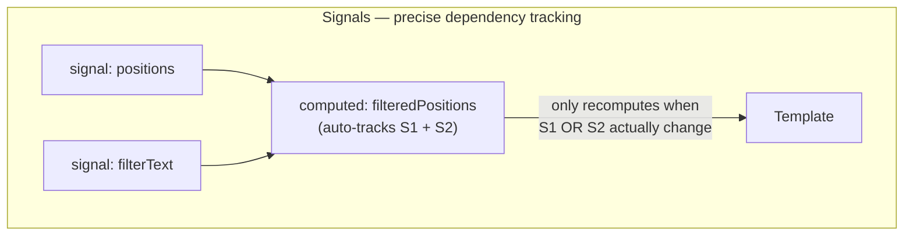

# Module 157 — Advanced Angular: State Management (NgRx & Signals), Reactive Forms, Performance Optimization & Micro-Frontend Architecture

> Domain: Angular | Level: Beginner → Expert | Prerequisite: [[../42-Angular/01-Angular-Fundamentals-Components-DI-ChangeDetection-RxJS]] (this module develops the zoneless-reactivity and change-detection-cost directions that module's §7/A3 previewed), [[../34-CQRS/01-CQRSFundamentals-CommandQuerySeparation-ReadModels-ComplexityThreshold]] (NgRx's action/reducer/selector model is a single-process, in-browser instance of the same command/event/read-model separation that domain develops at distributed-system scale), [[../30-Architecture-Patterns/01-ArchitecturalStyles-Monolith-ModularMonolith-SOA-Microservices-Serverless]] (micro-frontend architecture is this module's frontend-layer instance of that domain's service-decomposition and Conway's-Law reasoning)

>
> **Scope note:** Second of three modules scoping `42-Angular`. This module assumes Module 156's component/DI/change-detection/RxJS mechanics and covers what's needed to build and scale a genuinely large, multi-team Angular application: structured state management (NgRx and the newer Signals primitive), Reactive Forms, deliberate performance-optimization technique, and micro-frontend decomposition for multi-team ownership.

---

## 1. Fundamentals

**What:** Four techniques that address what happens once a single Angular application grows beyond what component-local state, ad hoc services, and a single team can comfortably manage: **NgRx** (a Redux-pattern state-management library — a single, immutable store updated only through dispatched actions and pure reducers, with side effects isolated into Effects), **Signals** (Angular's newer, fine-grained reactive primitive — `signal()`, `computed()`, `effect()` — providing explicit, dependency-tracked reactivity as an alternative to Zone.js's blanket triggering), **Reactive Forms** (a model-driven, `FormGroup`/`FormControl`-based approach to form state, validation, and value tracking, contrasted with Angular's other, template-driven forms approach), and **micro-frontend architecture** (splitting a single large application into independently-built, independently-deployable frontend units, most commonly via Webpack's **Module Federation**).

**Why:** Module 156 established Angular's core reactive substrate (Zone.js, RxJS, component-local state) at the scale of a single, moderately-sized application built by one team. Every one of this module's four techniques exists because that substrate's assumptions — implicit, blanket change-detection triggering; ad hoc, scattered state living in individual components; one team owning the entire codebase — stop holding as an application and organization genuinely scale, in the exact same way this course has found scaling to break implicit assumptions at every other architectural layer (Module 105's monolith-to-microservices decomposition, Module 155's point-to-point-to-broker federation).

**When:** NgRx (or an equivalent structured state pattern) becomes valuable once state is shared and mutated across many, otherwise-unrelated components in ways that ad hoc service-with-`BehaviorSubject` patterns make hard to trace — not a default for every application regardless of size (§15 develops this calibration explicitly). Signals are Angular's current, actively-recommended direction for new reactive state, increasingly the default even for moderate-sized applications given the change-detection-cost benefits Module 156 §7/A3 previewed. Reactive Forms are the standard choice for any form with non-trivial validation, dynamic structure, or programmatic value manipulation. Micro-frontends matter specifically once genuinely independent teams need independent deployment cadences for different parts of one user-facing application — the same organizational driver Module 105 identified for backend service decomposition.

**How (30,000-ft view):**
```
NgRx (Redux pattern):
  Component dispatches Action → Reducer (pure fn) computes new Store state
                               → Effect (impure, side-effect-isolated) reacts
                                 to Actions, may dispatch further Actions
                               → Selectors derive read-only views for components

Signals (fine-grained reactivity):
  signal(initialValue) → computed(() => derive from other signals,
                          auto-tracked dependencies) → effect(() => react
                          to signal changes) — no Zone.js required

Micro-Frontends (Module Federation):
  Shell application ──dynamically loads at runtime──► Remote micro-frontend A
                    ──dynamically loads at runtime──► Remote micro-frontend B
  (each independently built/deployed; "shared" dependencies negotiated
   at runtime, §2.4's exact composition-risk seam)
```

---

## 2. Deep Dive

### 2.1 NgRx — the Redux pattern as unidirectional, traceable state flow

An NgRx **Store** holds the application's shared state as a single, immutable object tree. State can only change via a **dispatched Action** (a plain, serializable object describing "what happened," directly analogous to Module 34/35's Command/Event vocabulary) being processed by a **pure Reducer function** — given the current state and an action, a reducer returns a *new* state object (never mutating the existing one, the same reference-identity discipline Module 156 §2.3's `OnPush` depends on) with no side effects, no randomness, no external calls. This unidirectional flow (dispatch → reduce → new state → re-render) makes every state change traceable and replayable — the direct frontend-layer instance of Module 121's Event Sourcing reasoning (a log of what happened, from which current state is derived) rather than mutable, ad hoc state scattered across services.

### 2.2 NgRx Effects — isolating side effects from pure reducers

Because reducers must be pure, any genuine side effect (an HTTP call, a WebSocket subscription, browser storage access) cannot live inside a reducer. **Effects** are RxJS-based streams that listen for specific dispatched Actions, perform the side effect, and typically dispatch a *new* Action describing the result (a success or failure action) back into the Store — closing the loop through the same reducer pathway rather than mutating state directly. This isolation is valuable specifically because it keeps state transitions (reducers) trivially testable with no mocking required, while concentrating all the genuinely hard-to-test, side-effect-laden logic into Effects, which can be tested with RxJS's marble-testing utilities in isolation from the rest of the Store.

### 2.3 Selectors — memoized, composable derived state

A **Selector** is a pure function deriving a specific slice or computed view of Store state for a component to consume, typically built via `createSelector`, which **memoizes** its result — recomputing only when its specific input state slices have changed reference, not on every Store update — directly extending Module 156 §2.3's `OnPush` reference-identity discipline into the state-derivation layer itself. Composing small, focused selectors (rather than each component reading and recomputing from raw Store state independently) is what keeps a large NgRx application's component tree from redundantly recomputing the same derived values across many components.

### 2.4 Signals — Angular's structural answer to Module 156's Zone.js over-triggering problem

A **Signal** (`signal(initialValue)`) is a reactive primitive holding a value and notifying dependents specifically when that value changes — `computed(() => ...)` derives a new signal that automatically, precisely tracks which other signals it read during its last evaluation (no manual dependency array, unlike some other frameworks' equivalent primitives) and only recomputes when one of those specific dependencies changes. This is architecturally the opposite of Module 156 §2.2's Zone.js model: instead of "any async event anywhere triggers a check of everything," Signals provide "exactly the things that could have changed, and only those, are notified" — the direct structural fix for Module 156 §4's incident class, at the cost (Module 156 A3) of requiring state to be explicitly modeled as a Signal to participate, rather than being implicitly covered by Zone.js's blanket patching. Angular's newer versions increasingly run **zoneless**, dropping Zone.js entirely and relying on Signals (plus explicit `markForCheck`-equivalent notifications from other reactive sources) as the sole change-detection trigger mechanism.

### 2.5 Reactive Forms — model-driven form state as an explicit object graph

A `FormGroup` (composed of `FormControl` and nested `FormGroup`/`FormArray` instances) represents a form's entire state — values, validation status (`valid`/`invalid`/`pending`/`disabled`), and dirty/touched tracking — as an explicit, inspectable, programmatically-manipulable object graph, separate from the template. `valueChanges` and `statusChanges` are Observables (Module 156 §2.5's substrate, reused here), enabling the exact `switchMap`-based race-condition-safe async-validation patterns Module 156 Advanced Q8 developed, now applied to cross-field or server-side validation. This is a deliberate contrast with Angular's other, template-driven forms approach, where form state lives implicitly in the template via directives — Reactive Forms' explicit object graph is what makes complex, dynamic, or extensively-tested forms (this course's Elite FinTech lens assumes order-entry, KYC, and compliance forms of exactly this complexity) tractable at all.

### 2.6 Micro-frontend architecture and Module Federation's shared-dependency negotiation

**Module Federation** (a Webpack 5 capability, with a framework-agnostic **Native Federation** alternative gaining adoption) lets a **shell** application dynamically load and mount **remote** micro-frontends — separately built, separately deployed bundles — at runtime, rather than at the shell's own build time. Each remote can declare certain dependencies (commonly Angular itself, RxJS, and any shared design-system library) as **shared**, meaning the shell and every remote attempt to negotiate using a *single, shared instance* of that dependency at runtime rather than each bundling and loading its own separate copy — critical both for bundle-size efficiency and, more importantly, for correctness where a shared singleton's internal state (an RxJS `Subject` crossing a micro-frontend boundary, an Angular `Injector`'s DI graph) must genuinely be the same instance on both sides of the boundary to behave correctly. **This negotiation is a runtime, version-range-based process — if the shell and a remote declare compatible-but-non-identical version ranges for a shared dependency, Webpack's federation runtime can silently fall back to loading two separate instances instead of failing loudly**, exactly the composition-risk seam this module's §4 incident examines.

---

## 3. Visual Architecture





```
Module Federation — shared-dependency negotiation (§2.6):

  Shell (declares rxjs@^7.8.0 shared, singleton: true)
        │
        ├── loads Remote A at runtime (declares rxjs@^7.8.0 shared) ──► COMPATIBLE, single shared instance
        │
        └── loads Remote B at runtime (declares rxjs@^7.5.0 shared) ──► range technically overlaps,
                                                                          but federation runtime may
                                                                          silently load a SECOND
                                                                          instance instead of erroring —
                                                                          §4's exact composition risk
```

---

## 4. Production Example

**Problem:** A multi-desk trading platform, decomposed into a shell application plus five independently-owned micro-frontends via Module Federation, began exhibiting an intermittent, hard-to-reproduce bug where a shared "active order alerts" notification stream (an RxJS `Subject` exposed by a shared, root-injected service, intended as a singleton crossing every micro-frontend boundary) would silently stop delivering notifications to exactly one specific micro-frontend, while continuing to work correctly for the shell and every other micro-frontend.

**Architecture:** Shell application declaring RxJS and the shared notification service as `singleton: true` federated dependencies; five remotes, each independently built and deployed by separate desk-aligned teams on independent release schedules, each also declaring the same dependencies as shared.

**Implementation / What happened:** One team, working on an unrelated feature, upgraded their remote's own `package.json` RxJS dependency to a newer minor version during routine maintenance — still within a version range that Webpack's semver-based shared-module negotiation considered technically compatible with the shell's declared range, so no build-time or deployment-time error occurred anywhere. At runtime, however, a subtle difference in how that specific RxJS minor version's internal `Subject` implementation handled a particular edge case (rather than a documented breaking change) caused Webpack's federation runtime to make a different internal decision about whether the versions were close enough to safely share a single instance — for this one remote specifically, it silently loaded its own separate copy of RxJS instead of sharing the shell's instance, meaning the "shared, singleton" notification `Subject` this remote held was, in fact, a completely different object from the one every other part of the application was publishing to.

**Trade-offs:** The shared-dependency declaration was correctly configured by every team involved, and every individual build succeeded — there was no code-level defect in any single micro-frontend's own codebase; the incident lived entirely in the *runtime negotiation* between independently-built, independently-versioned bundles, invisible to any single team's own testing since each team's remote worked perfectly correctly in isolation.

**Lessons learned:** **Module Federation's shared-dependency singleton guarantee is a runtime negotiation outcome, not a build-time contract enforced by any individual team's own tooling** — this is the exact composition-risk shape Module 155's closing synthesis named at the identity-federation layer, now recurring precisely at the frontend micro-frontend layer: five individually-correct, independently-deployed bundles produced an incident that lived entirely in the *assumption linking them* (that "shared: true" guarantees one instance) rather than in any single bundle's own code. The fix required pinning shared dependencies to *exact*, not range-based, versions across every micro-frontend team, plus a CI check failing any deployment whose shared-dependency versions drifted from the shell's pinned baseline — converting an implicit, runtime-negotiated assumption into an explicitly, mechanically verified one.

---

## 5. Best Practices

- **Keep NgRx reducers strictly pure** (§2.1) — no side effects, no mutation, no non-deterministic behavior — and push every side effect into Effects (§2.2), keeping the state-transition logic itself trivially, deterministically testable.
- **Build small, focused, composed Selectors** (§2.3) rather than having components read and recompute from raw Store state independently — memoization only provides its benefit when selectors are actually reused and composed consistently.
- **Default new reactive state to Signals** (§2.4) where the application's Angular version supports them, given their precise, structurally-narrower change-detection cost model relative to Zone.js's blanket triggering (Module 156 §7/A3).
- **Use Reactive Forms, not template-driven forms, for any form with non-trivial validation, dynamic fields, or a need for thorough automated testing** (§2.5) — the explicit object-graph model is what makes complex financial-services forms (KYC, order entry) tractable and testable.
- **Pin shared Module Federation dependencies to exact versions across every micro-frontend team**, with a CI check enforcing it (§4's fix) — never rely on semver-range-based "compatible enough" negotiation for a dependency whose shared-singleton correctness genuinely matters, such as RxJS or the Angular framework itself.

---

## 6. Anti-patterns

- **An NgRx Effect that dispatches an Action which, directly or indirectly, re-triggers the same Effect** without an explicit termination condition — the module's own §14 incident develops this concretely as a silent, CPU-spinning infinite-dispatch loop.
- **Reading and independently recomputing derived state in multiple components instead of composing shared, memoized Selectors** (§2.3) — defeats memoization's benefit and multiplies redundant computation across the component tree.
- **Relying on Module Federation's semver-range-based shared-dependency negotiation for a dependency whose singleton correctness genuinely matters** (§4) — a technically-compatible version range is not the same guarantee as an actually-shared runtime instance.
- **Mixing Reactive and template-driven forms within the same form** — produces two, partially-overlapping sources of truth for the same form's state, a direct frontend-layer instance of this course's recurring "which system is authoritative" confusion.
- **Adopting NgRx (or any structured state library) for an application without genuinely cross-cutting, complex shared state** — imposes the pattern's real cognitive and boilerplate cost (§15) without the corresponding traceability benefit that justifies it.

---

## 7. Performance Engineering

Signals' precise dependency tracking (§2.4) directly narrows Module 156 §7's change-detection cost model — a `computed()` signal recomputes only when a dependency it actually read last time changes, and (under zoneless Angular) a component reading only signals triggers re-checks scoped precisely to itself and its dependents, not the "any async event anywhere" tree-wide cost Zone.js imposes. NgRx's memoized Selectors (§2.3) provide an analogous, coarser-grained benefit for Redux-pattern state specifically. Module Federation's runtime-loaded remotes add a real, first-load latency cost (fetching a remote's bundle over the network at the moment it's first needed) that should be weighed against a shell's overall initial-load budget — lazy-loading remotes only when actually navigated to (mirroring Module 156 §9's lazy-loaded-module reasoning) keeps this cost bounded rather than front-loaded into the shell's own initial payload.

---

## 8. Security

NgRx's centralized, single-source-of-truth Store is a natural place to concentrate authorization-relevant client-side state (the current user's permitted actions, feature flags) — but client-side state of this kind is never a substitute for server-side enforcement (directly recurring Module 127's gateway-auth-as-defense-in-depth-first-layer finding): a component conditionally hiding an action based on Store state provides UX guidance, not a security boundary, since any client-side state is inspectable and modifiable by the end user's own browser tooling. Module Federation's dynamically-loaded remotes introduce a supply-chain-adjacent trust question distinct from a conventional, single-build application's dependency risk: a shell loading a remote from a URL it doesn't fully control (a third-party-hosted or separately-deployed-by-another-team remote) is trusting that remote's runtime code to the same degree as its own first-party code, making the deployment pipeline and hosting integrity of every federated remote a security-relevant dependency of the shell as a whole.

---

## 9. Scalability

Micro-frontend decomposition via Module Federation (§2.6) is this module's primary organizational-scalability lever — directly mirroring Module 105's finding that decomposition value comes from enabling genuinely independent teams to deploy independently, not from the technical splitting itself. NgRx's centralization of shared state (§2.1) trades a real cognitive/boilerplate cost for making cross-cutting state changes traceable at scale — the same centralization-versus-variance trade-off this course has found repeatedly (Module 155 §15's broker centralization, Module 153 A2's shared validation library), calibrated in §15 below specifically for state management. Signals' fine-grained reactivity (§2.4) scales the change-detection cost model independent of total application size, the frontend-layer parallel to Module 148's storage-engine finding that a system's actual scaling behavior comes from its underlying physical/computational structure, not its category label.

---

## 10. Interview Questions

### Basic (10)

**B1. What is the core unidirectional data flow NgRx enforces?**
*Ideal Answer:* Components dispatch Actions; pure Reducers compute new state from the current state and an Action; Selectors derive read-only views of state for components to consume — state can only change through this dispatch-reduce cycle, never by direct mutation.
*Why correct:* Matches §2.1.
*Common mistakes:* Describing NgRx as "just a global variable store" without the enforced, unidirectional dispatch/reduce discipline that's its actual architectural value.
*Follow-up:* Why must reducers be pure functions specifically?

**B2. What is an NgRx Effect for?**
*Ideal Answer:* Isolating side effects (HTTP calls, WebSocket subscriptions) that cannot live inside a pure reducer — an Effect listens for specific Actions, performs the side effect, and typically dispatches a new Action with the result.
*Why correct:* Matches §2.2.
*Common mistakes:* Confusing Effects with Reducers, or assuming Effects directly mutate Store state rather than looping back through a dispatched Action.
*Follow-up:* Why does isolating side effects into Effects make reducers easier to test?

**B3. What does a Signal provide that a plain class property doesn't?**
*Ideal Answer:* Automatic, precise change notification to anything that reads it — a `computed()` signal or `effect()` reading a signal automatically tracks that dependency and re-runs specifically when the signal's value changes, with no manual wiring.
*Why correct:* Matches §2.4.
*Common mistakes:* Describing Signals as "just reactive variables" without the automatic, precise dependency-tracking mechanism that distinguishes them from Zone.js's blanket triggering.
*Follow-up:* How does a Signal's change-notification scope differ from Zone.js's default change-detection trigger?

**B4. What is a memoized Selector in NgRx?**
*Ideal Answer:* A pure function deriving a slice of Store state, built via `createSelector`, that recomputes only when its specific input state slices have changed, rather than on every Store update.
*Why correct:* Matches §2.3.
*Common mistakes:* Assuming Selectors always recompute on every state change, missing the memoization behavior that's their actual performance value.
*Follow-up:* What makes a Selector's memoization ineffective if used incorrectly?

**B5. What is the difference between Reactive Forms and template-driven forms?**
*Ideal Answer:* Reactive Forms represent form state as an explicit, programmatically-manipulable object graph (`FormGroup`/`FormControl`) defined in component code; template-driven forms manage state implicitly through directives in the template itself.
*Why correct:* Matches §2.5.
*Common mistakes:* Describing the two as interchangeable stylistic choices without the explicit-object-graph-versus-implicit-template-state distinction that determines which is appropriate for complex forms.
*Follow-up:* Why are Reactive Forms generally preferred for forms with complex, cross-field, or asynchronous validation?

**B6. What is a micro-frontend, and what problem does it solve?**
*Ideal Answer:* An independently-built, independently-deployable portion of a larger frontend application, typically owned by a separate team — solves the same organizational-scaling problem backend microservices solve (Module 105), allowing independent teams to deploy on independent schedules.
*Why correct:* Matches §1/§9.
*Common mistakes:* Describing micro-frontends purely as a technical splitting technique without naming the organizational/team-independence driver that actually justifies the added complexity.
*Follow-up:* What Webpack capability commonly implements micro-frontend composition in Angular applications?

**B7. What does declaring a dependency as "shared" in Module Federation mean?**
*Ideal Answer:* The shell and remotes attempt to negotiate, at runtime, using a single shared instance of that dependency rather than each bundling and loading its own separate copy.
*Why correct:* Matches §2.6.
*Common mistakes:* Assuming "shared" guarantees a single instance unconditionally, missing that it's a runtime, version-range-based negotiation that can fall back to loading duplicate instances.
*Follow-up:* What happens if two remotes declare incompatible version ranges for the same shared dependency?

**B8. Why must NgRx reducers avoid side effects and mutation?**
*Ideal Answer:* Purity makes reducers deterministic and trivially testable with no mocking, and enables NgRx's time-travel debugging and predictable state-change tracing — a reducer with side effects or mutation breaks the unidirectional, traceable data flow the entire pattern depends on.
*Why correct:* Matches §2.1/§2.2.
*Common mistakes:* Treating purity as an arbitrary style rule rather than a structural requirement the pattern's traceability and testability benefits depend on.
*Follow-up:* What NgRx debugging tool specifically depends on reducer purity to function correctly?

**B9. What does `valueChanges` on a `FormControl` provide, and what type is it?**
*Ideal Answer:* An Observable emitting the control's current value every time it changes — the same RxJS substrate Module 156 established, now applied to form state specifically.
*Why correct:* Matches §2.5.
*Common mistakes:* Assuming `valueChanges` is a Promise or a plain callback rather than an Observable supporting the full RxJS operator set (debouncing, switchMap-based async validation, etc.).
*Follow-up:* How would you use `valueChanges` to implement debounced, race-condition-safe server-side validation?

**B10. Why is client-side NgRx state never a substitute for server-side authorization enforcement?**
*Ideal Answer:* Client-side state is inspectable and modifiable by the end user's own browser tooling — hiding a UI action based on Store state provides UX guidance only, not a genuine security boundary, which must always be enforced server-side.
*Why correct:* Matches §8, directly reusing Module 127's defense-in-depth-layering finding.
*Common mistakes:* Treating a well-designed client-side permission check as sufficient security on its own.
*Follow-up:* What's the appropriate relationship between client-side permission-based UI hiding and server-side enforcement?

### Intermediate (10)

**I1. Design the NgRx Action/Reducer/Effect flow for fetching a user's positions from a backend API, including loading and error states.**
*Ideal Answer:* Dispatch `loadPositions` (Action) → reducer sets `loading: true, error: null` in Store state → an Effect listens for `loadPositions`, calls the API, and on success dispatches `loadPositionsSuccess` (with the resulting data) or on failure dispatches `loadPositionsFailure` (with the error) → the reducer for each of those two result Actions sets `loading: false` plus either the populated data or the error state — closing the loop entirely through dispatched Actions and pure reducers, with the Effect itself never directly mutating Store state.
*Why correct:* Matches §2.1/§2.2's full request/response cycle, correctly modeling loading and error states as first-class, reducer-owned state.
*Common mistakes:* Having the Effect directly set component or service state outside the Store, bypassing the reducer pathway entirely and breaking the pattern's traceability guarantee.
*Follow-up:* How would you extend this to prevent a second `loadPositions` dispatch from triggering a redundant, concurrent API call while one is already in flight?

**I2. Explain precisely how a `computed()` Signal's automatic dependency tracking differs from a manually-specified dependency array (as used in some other frameworks' equivalent primitives).**
*Ideal Answer:* A `computed()` Signal tracks dependencies implicitly, by observing which other Signals are actually *read* during its evaluation function's execution — no manual list is specified or maintained; if the evaluation function's logic changes to read a different set of Signals (e.g., a new conditional branch reads an additional Signal), the tracked dependency set automatically updates on the next evaluation, with no risk of an out-of-date, manually-maintained dependency list becoming incorrect.
*Why correct:* Matches §2.4's precise mechanics, correctly distinguishing automatic tracking from the manual-array pattern common elsewhere.
*Common mistakes:* Describing Signals as functionally identical to a manual-dependency-array primitive, missing the specific "reads determine dependencies, automatically and dynamically" mechanism.
*Follow-up:* What happens to a `computed()` Signal's dependency tracking if its evaluation function conditionally reads different Signals on different executions?

**I3. Walk through §4's incident mechanically: why did two independently-correct micro-frontend builds produce a runtime state-sharing failure with no build-time error anywhere?**
*Ideal Answer:* Module Federation's shared-dependency negotiation is a *runtime* process based on semver-range compatibility declared by each bundle — one remote's RxJS upgrade stayed within a range Webpack's build tooling considered compatible with the shell's declared range, so no build or deployment step ever flagged an incompatibility. The actual failure occurred in Webpack's runtime federation logic, which made a different internal decision about whether the specific versions were close enough to safely share one instance, silently loading a second, separate RxJS instance for that one remote instead of erroring — a decision with no corresponding build-time signal for any team to have caught in advance.
*Why correct:* Correctly locates the failure specifically in the runtime negotiation step, distinguishing it from a build-time or code-level defect in any individual team's work.
*Common mistakes:* Describing this as "a bug in the RxJS upgrade" rather than correctly identifying it as a composition-risk failure at the federation-runtime boundary between two individually-correct builds.
*Follow-up:* What specific technical change (§5's fix) converts this implicit, runtime-negotiated risk into an explicitly, mechanically verified one?

**I4. Compare NgRx and a plain Angular service exposing state via a `BehaviorSubject`, for a moderately-sized feature with some shared state across three sibling components.**
*Ideal Answer:* A `BehaviorSubject`-based service is simpler, requires no additional library or boilerplate (Actions, reducers, Effects, Selectors), and is entirely adequate for state genuinely scoped to one feature area shared among a small number of components. NgRx's added value — traceable, replayable, centrally-inspectable state changes across a large, cross-cutting surface — only pays for its added complexity once state genuinely spans many, otherwise-unrelated parts of a large application, which a three-component, single-feature scenario doesn't yet demonstrate.
*Why correct:* Correctly calibrates the recommendation to the described scale rather than defaulting to "always use NgRx for shared state," matching §15's explicit scoping guidance.
*Common mistakes:* Recommending NgRx unconditionally for any shared-state scenario, without weighing its real cost against the genuinely modest scale described.
*Follow-up:* At what specific signal (not just "the app got bigger") would you recommend migrating this feature from a `BehaviorSubject` service to NgRx?

**I5. Design a Reactive Forms validator that asynchronously checks whether a proposed trade ticket size is within a client's currently-available buying power, avoiding the race condition Module 156 Advanced Q8 identified for search-as-you-type.**
*Ideal Answer:* An async validator function returning an `Observable<ValidationErrors | null>`, using `switchMap` internally (or relying on Angular's own async-validator infrastructure, which similarly cancels a superseded pending validation) so that a rapidly-changing ticket-size input doesn't leave an earlier, slower buying-power check's result overwriting a later, more current input's validation state — the exact `switchMap` race-condition-prevention pattern Module 156 established, now applied to form validation instead of search.
*Why correct:* Correctly transfers Module 156's `switchMap` race-condition reasoning to a new, analogous scenario, demonstrating the cross-cutting applicability of the underlying RxJS pattern.
*Common mistakes:* Implementing the async validator with `mergeMap` or no explicit cancellation handling, reintroducing the exact out-of-order-response race Module 156 Advanced Q8 warned against.
*Follow-up:* What UX indicator should the form show while this async validation is pending, given `FormControl.status` includes a `PENDING` state specifically for this scenario?

**I6. Why does isolating side effects into NgRx Effects make reducer unit testing require no mocking, while Effects themselves require RxJS-specific testing techniques?**
*Ideal Answer:* A reducer is a pure function — given a specific state and Action, it deterministically returns a specific new state, with no external dependency to mock, so a reducer unit test is simply an input/output assertion. An Effect, by contrast, genuinely performs asynchronous, RxJS-stream-based side effects (HTTP calls, timing-dependent operators like `debounceTime`), requiring marble-testing utilities (RxJS's `TestScheduler`) to deterministically simulate time and stream timing without relying on real, non-deterministic async execution during tests.
*Why correct:* Correctly distinguishes the two testing approaches and explains precisely why each is necessary given the underlying code's actual nature (pure vs. effectful/time-dependent).
*Common mistakes:* Assuming Effects can be tested with the same simple input/output assertions as reducers, missing that their genuinely asynchronous, stream-based nature requires specialized tooling.
*Follow-up:* What does RxJS marble testing let you express about timing that a conventional `async`/`await`-based test cannot as precisely?

**I7. A micro-frontend remote fails to load at runtime (network failure, deployment issue). Design the shell's failure-handling behavior.**
*Ideal Answer:* The shell should catch the dynamic-import/federation-loading failure explicitly and render a graceful, scoped fallback UI for just that remote's mount point (an error boundary equivalent) rather than allowing the failure to propagate and break the entire shell application — since other, independently-deployed remotes and the shell's own core functionality have no structural dependency on this one remote's availability and should remain fully functional.
*Why correct:* Correctly applies fault-isolation reasoning (directly analogous to Module 136's circuit-breaker/bulkhead patterns at the backend service layer) to the micro-frontend composition layer.
*Common mistakes:* Allowing an unhandled remote-loading failure to crash or blank the entire shell application, defeating one of micro-frontends' primary organizational benefits — that one team's deployment issue shouldn't take down the whole platform.
*Follow-up:* How would you monitor remote-loading failure rates in production to distinguish a transient network blip from a genuinely broken remote deployment?

**I8. Explain how NgRx Selectors' memoization could produce a stale-looking UI bug analogous to Module 156's `OnPush` in-place-mutation bug (I2 in that module).**
*Ideal Answer:* If a reducer accidentally mutates a nested object within the Store state in place (rather than returning a new, top-level object with new references down the mutated path) a Selector reading that nested slice may see no reference change on its memoized input and fail to recompute — even though the underlying data genuinely changed — reproducing `OnPush`'s exact reference-identity-versus-semantic-change gap at the state-derivation layer instead of the component-input layer.
*Why correct:* Correctly identifies the structurally identical bug mechanism recurring at a different layer (Selector memoization vs. `OnPush` input checking), both ultimately depending on the same reference-identity/immutability discipline.
*Common mistakes:* Treating Selector staleness and `OnPush` staleness as unrelated bug classes, missing that both trace back to the identical root requirement — consistent, disciplined immutable updates throughout the state layer.
*Follow-up:* What tooling (e.g., a strict-mode reducer wrapper) would catch an accidental in-place mutation in a reducer before it reaches this failure mode in production?

**I9. Design the migration path for converting an existing NgRx-Selector-derived value into an equivalent Signal-based `computed()`, and identify what changes about its change-detection cost profile.**
*Ideal Answer:* Angular provides interop utilities (`toSignal()`) converting an Observable (including a Selector's output, itself an Observable via the Store) into a Signal; once converted, a component reading that Signal (rather than subscribing via the `async` pipe to the Selector's Observable) participates in Signals' precise, zoneless-compatible change-detection model rather than Zone.js's blanket triggering — narrowing the component's re-check scope from "whenever any async event anywhere fires" to "specifically when this Signal's tracked dependency actually changes."
*Why correct:* Correctly identifies both the concrete interop mechanism and the resulting change-detection-cost improvement, tying back to Module 156 §7/A3's cost-model framing.
*Common mistakes:* Describing the migration as a purely syntactic change with no actual behavioral or performance implication, missing the underlying change-detection-model shift it enables.
*Follow-up:* Does this migration require the rest of the application to also move to zoneless change detection to realize its full benefit, or does it provide partial benefit even within a Zone.js-based application?

**I10. Why should a shell application's error-handling strategy for a failed remote load (I7) differ from its handling of an error thrown *within* a successfully-loaded remote's own code?**
*Ideal Answer:* A failed remote *load* (network/deployment failure before the remote's code ever executes) is cleanly isolable at the shell's mounting boundary — the shell simply never received working code to run. An error thrown *within* an already-mounted remote's running code may occur after that remote has already partially rendered, made API calls, or mutated shared state (e.g., a shared NgRx Store, if the architecture uses one across the federation boundary) — requiring an actual runtime error-boundary mechanism (catching and isolating the failure at the component-tree level) rather than merely a load-time fallback, and raising the additional question of whether any shared state the failing remote had already touched needs to be rolled back or flagged as potentially inconsistent.
*Why correct:* Correctly distinguishes the two failure timings and their different blast-radius/state-consistency implications, rather than treating "the remote failed" as one undifferentiated failure mode.
*Common mistakes:* Applying only load-time fallback handling (I7) without considering that a remote's in-flight runtime failure has already had the opportunity to affect shared application state before the failure was detected.
*Follow-up:* If the architecture shares a single NgRx Store across the shell and all remotes, what does a mid-execution remote failure imply about the trustworthiness of Actions that remote already dispatched before failing?

### Advanced (10)

**A1. Design the state-management architecture for a multi-desk trading platform composed of a shell plus five micro-frontends, addressing what state is genuinely shared versus desk-local, and how each is managed.**
*Ideal Answer:* Genuinely cross-desk shared state (authenticated user identity/entitlements, global market-status indicators, cross-desk alert notifications) lives in a single, shell-owned NgRx Store (or Signal-based store) exposed to remotes via a well-defined, versioned shared service interface — never each remote independently re-fetching or re-deriving the same cross-cutting state. Desk-local state (a specific desk's own order-entry form state, its own local UI preferences) stays entirely within that desk's own remote, using whatever internal state-management approach (Signals, a local NgRx feature store, or a plain service) that team judges appropriate for its own scope — explicitly NOT centralized into the shell's shared store, avoiding unnecessary cross-team coupling for state with no genuine cross-desk relevance.
*Why correct:* Correctly applies the same shared-vs.-local state-scoping discipline this course has established at the backend layer (Module 152's entitlement scoping, Module 135's data-consistency-across-boundaries reasoning) to the frontend micro-frontend layer specifically.
*Common mistakes:* Centralizing all state into one shared NgRx Store regardless of whether it's genuinely cross-desk, reintroducing exactly the tight coupling micro-frontend decomposition was meant to avoid.
*Follow-up:* How would you version the shared service interface between the shell and remotes so that one desk's remote can be deployed independently without breaking against an incompatible shell-side shared-state contract?

**A2. §4's incident was fixed by pinning shared dependencies to exact versions with a CI check. Design that CI check concretely, and identify its limitation.**
*Ideal Answer:* A CI step, run against every micro-frontend remote's deployment pipeline, that reads the remote's declared shared-dependency versions (from its Module Federation configuration) and fails the build if any declared version doesn't exactly match a centrally-maintained, shell-published baseline manifest — directly analogous to Module 153 A2's centralized-validation-library governance pattern, now enforcing dependency-version consistency instead of token-validation logic. Limitation: this only catches drift for dependencies actually declared as shared and checked by this specific CI step — a new dependency added to the shared list without updating the check, or a transitive dependency version drifting independently, would not be caught, reproducing exactly the same "control scope vs. actual coverage" gap Module 152 A9/E5 identified generally.
*Why correct:* Correctly designs the concrete CI mechanism while honestly identifying its own bounded scope of coverage, rather than presenting it as a complete, unconditional fix.
*Common mistakes:* Proposing the CI check without acknowledging its coverage is bounded to exactly what it explicitly checks, missing the recurring "verify the verifier" caution this course has applied to every other governance mechanism.
*Follow-up:* How would you extend this check to catch transitive shared-dependency drift, not just the directly-declared dependencies each team explicitly lists?

**A3. Critique: "Since Signals provide precise, automatic dependency tracking, migrating an entire large NgRx application to Signals-based state eliminates the need for NgRx's Action/Reducer/Effect discipline entirely."**
*Ideal Answer:* Overstated. Signals solve the change-detection-cost/precision problem (§2.4, Module 156 §7) — they don't, on their own, provide NgRx's traceability, replayability, and enforced-unidirectional-flow discipline (§2.1), which is valuable specifically for auditing *how* and *why* state changed over time, independent of rendering performance. A large application with genuine need for that traceability (e.g., regulatory audit requirements around what user action caused what state change, directly relevant to this course's Elite FinTech lens) still benefits from NgRx's structured Action/Reducer pattern even while using Signals as the underlying reactive-notification mechanism (NgRx's newer versions increasingly integrate Signals internally for exactly this reason, combining both benefits rather than treating them as mutually exclusive).
*Why correct:* Correctly distinguishes the two techniques' actual, non-overlapping value propositions (change-detection precision vs. state-change traceability/governance) rather than treating Signals as a strict superset replacement for NgRx's architectural discipline.
*Common mistakes:* Accepting the claim because Signals are newer and address a real limitation of Zone.js-based reactivity, without examining whether NgRx's distinct traceability value is actually redundant with what Signals provide.
*Follow-up:* For which of this platform's application areas (per A1) would NgRx's traceability specifically matter enough to justify keeping the Action/Reducer discipline even after adopting Signals for change-detection performance?

**A4. Design a test suite that would have caught §4's incident before it reached production, given that every individual remote's own test suite passed throughout.**
*Ideal Answer:* An integration-level test that actually assembles the shell and all five remotes together in a realistic, federation-loaded runtime configuration (not each remote tested in isolation, which is exactly what every team's own passing test suite already did) and asserts that a shared singleton (the notification `Subject` from §4) is genuinely the *same object reference* across the shell and every remote after a full federation load — a structural, identity-based assertion directly analogous to Module 153 A9's negative-test-coverage finding, here applied to shared-instance identity rather than token-audience rejection.
*Why correct:* Correctly identifies that the actual gap was the *absence of an integration-level, cross-remote identity assertion* — every individual team's own isolated testing was necessarily blind to a failure that only manifests when multiple independently-built bundles are actually composed together at runtime.
*Common mistakes:* Proposing more thorough per-remote unit testing, which — as the incident itself demonstrates — cannot catch a failure that only exists at the composition boundary between independently-correct units.
*Follow-up:* How often should this integration test run, and against what combination of remote versions, given that any team can independently deploy a new remote version at any time?

**A5. Design an Effect-based safeguard preventing the infinite-dispatch-loop anti-pattern (§6) structurally, rather than relying solely on careful manual review of each new Effect.**
*Ideal Answer:* A development-mode (not necessarily production) NgRx meta-reducer or Effects middleware that tracks recent Action dispatch history per Effect and throws or logs a loud warning if the same Action type is dispatched by the same Effect chain more than a defined threshold within a short time window — a circuit-breaker-style structural safeguard (directly reusing Module 136's circuit-breaker pattern) catching runaway dispatch loops during development and testing before they reach production, rather than depending entirely on a reviewer manually tracing every Effect's action-dispatch graph by eye.
*Why correct:* Correctly proposes a mechanical, structural safeguard rather than relying solely on manual review discipline, matching this course's recurring preference for automatable checks over manual-only processes (Module 153 A2, Module 156 A2).
*Common mistakes:* Proposing only "review Effects more carefully in PR review" as the mitigation, missing that a mechanical, always-running safeguard is both more reliable and catches the specific class of bug (§14) that's easy to miss by eye, especially with a wildcarded action-type Effect trigger.
*Follow-up:* Why would you scope this safeguard to development/testing environments specifically rather than also running it in production, given its detection value?

**A6. How does Module Federation's shared-dependency negotiation risk (§4) recur Module 150's multi-mesh trust-federation composition-risk finding, specifically?**
*Ideal Answer:* Module 150 §4's incident had every workload in a federated trust domain gain validly-mTLS-authenticated access to every service in the core platform because federation established authentication without a corresponding, explicitly-scoped authorization boundary — individually correct authentication, composed without a narrow-enough scoping mechanism, producing an unintended broad-access outcome. §4's incident here has individually correct, independently-built bundles compose, via a runtime negotiation mechanism (shared-dependency resolution) that similarly lacks a hard, fail-loud guarantee of the specific outcome (singleton sharing) every team implicitly assumed — both incidents share the exact shape of "a federation/composition mechanism provides a real but narrower guarantee than what independent, individually-reasonable teams assumed it provided," differing only in domain (network trust vs. runtime dependency instance sharing).
*Why correct:* Correctly identifies the specific, shared structural pattern (a composition mechanism's actual guarantee being narrower than assumed) connecting the two otherwise very different-looking incidents across completely different technical domains.
*Common mistakes:* Describing the connection only vaguely ("both are about federation") without articulating the specific structural parallel — a real-but-narrower-than-assumed guarantee — that makes the comparison precise rather than superficial.
*Follow-up:* What single organizational practice (not a technical control) would help teams building both kinds of federated systems (network-trust and micro-frontend) recognize this recurring pattern proactively, before their own domain's specific incident occurs?

**A7. Design a governance process for approving which shared, cross-cutting dependencies (RxJS, Angular itself, a shared design-system library) a multi-team micro-frontend platform allows, and how version upgrades to those dependencies are coordinated.**
*Ideal Answer:* A small, explicitly-maintained allowlist of dependencies eligible for `shared: true` federation configuration (not every dependency any team happens to use), each with a single, centrally-owned version baseline (the shell's declared version) that every remote must match exactly (§5's fix); version upgrades to any allowlisted shared dependency require a coordinated, scheduled rollout across every remote team simultaneously (or a deliberate, time-boxed dual-version transition period with the CI check from A2 temporarily relaxed and explicitly tracked) — never a single team unilaterally upgrading a shared dependency in their own remote's `package.json` without cross-team coordination, which is precisely what caused §4's incident.
*Why correct:* Correctly designs both the ongoing governance structure (allowlist, centralized baseline) and the specific coordination process for the one event (a shared-dependency version upgrade) that actually triggers this risk class.
*Common mistakes:* Proposing only a technical CI check (A2) without the organizational coordination process governing *when and how* a shared dependency's baseline version is allowed to change in the first place.
*Follow-up:* Who should own the shared-dependency baseline manifest, and what escalation path exists if one team urgently needs a shared-dependency upgrade (e.g., a security patch) faster than the coordinated rollout process normally allows?

**A8. A `computed()` Signal's evaluation function has a side effect (e.g., logging, or mutating an external variable) inside it. What breaks, and why does this differ from an equivalent mistake in an NgRx reducer?**
*Ideal Answer:* A `computed()` Signal's evaluation function can be called an indeterminate number of times by Angular's reactivity system (including speculative re-evaluations it may discard) — a side effect inside it can fire more or fewer times than the developer expects, non-deterministically, unlike NgRx's reducer, which is called exactly once per dispatched Action with a precisely predictable invocation count. Both require purity for correctness, but violating it in a `computed()` Signal produces a more subtly non-deterministic bug (inconsistent side-effect count) than violating it in a reducer (whose invocation pattern is simpler and more predictable even when misused).
*Why correct:* Correctly identifies the specific, distinct failure mode `computed()` impurity produces, tied to Signals' actual re-evaluation semantics rather than a generic "purity matters" restatement.
*Common mistakes:* Treating `computed()` and reducer purity violations as producing the same kind of bug, missing the specific non-deterministic-invocation-count distinction that makes `computed()` impurity harder to diagnose.
*Follow-up:* What Angular primitive is the *correct* place for a genuine side effect that should run in response to a Signal's change, if not `computed()`?

**A9. Design a rollback strategy for a micro-frontend platform when a newly-deployed remote is discovered, in production, to be silently causing the exact shared-dependency-instance-splitting failure §4 describes.**
*Ideal Answer:* Because the failure is specific to that one remote's deployed version (its `package.json` shared-dependency declaration), the fastest, lowest-blast-radius fix is rolling back that single remote's deployment to its prior, known-good version — Module Federation's runtime-loaded-remote architecture (§2.6) means this rollback affects only that one remote's users/desk, not the shell or any other remote, directly realizing the fault-isolation benefit micro-frontend decomposition is meant to provide (I7's failure-isolation reasoning extended to a post-deployment discovered defect rather than a load-time failure). This should be paired with immediately auditing every other remote's currently-declared shared-dependency versions against the baseline manifest (A2), since a version drift subtle enough to pass CI (if the check itself has a coverage gap, per A2's own limitation) may not be unique to the one remote where the symptom was first observed.
*Why correct:* Correctly leverages micro-frontends' independent-deployability property specifically for a fast, scoped rollback, while also recognizing the incident may indicate a broader, not-yet-symptomatic drift elsewhere requiring a wider audit.
*Common mistakes:* Proposing a full-shell rollback or redeployment, missing that the whole point of the micro-frontend architecture is that a single remote's issue should be fixable with a correspondingly narrow, single-remote rollback.
*Follow-up:* How would you detect this specific failure class (silent shared-instance splitting) via production monitoring, rather than only via the kind of hard-to-reproduce user-reported symptom §4's original incident description implies?

**A10. Synthesize this module's four techniques (NgRx, Signals, Reactive Forms, Module Federation) against this course's recurring "declared ≠ actual" theme, naming this module's single sharpest instance.**
*Ideal Answer:* Module Federation's `shared: true` declaration (§4, §2.6) is this module's sharpest instance — the configuration *declares* a shared-singleton guarantee, but the *actual*, runtime-negotiated outcome can silently diverge from that declaration under conditions (a technically-in-range but practically-incompatible version) no individual team's own build or test process observes, producing a failure that lives entirely in the gap between the declared intent and the runtime-verified reality — directly extending Module 155's closing "declared ≠ durably/currently/contextually true" finding from the identity-federation domain to the frontend micro-frontend-federation domain, using the identical vocabulary (a federation mechanism's guarantee is narrower and more conditional than its name implies) in a structurally unrelated technical area.
*Why correct:* Correctly identifies the specific instance and explicitly connects it to the exact prior-module finding it parallels, demonstrating the cross-domain synthesis this course's workflow rules require.
*Common mistakes:* Citing the NgRx infinite-loop anti-pattern (§6/§14) as the sharpest instance, which is a real defect but a more conventional logic bug rather than the specific "declared configuration guarantee ≠ actual runtime behavior" shape that the Module Federation example demonstrates most precisely.
*Follow-up:* Does Signals' explicit, automatic dependency-tracking model (§2.4) reduce or increase the surface area for this kind of "declared ≠ actual" gap, relative to Zone.js's implicit, blanket-coverage model?

---

## 11. Coding Exercises

### Easy — Memoized NgRx selector for filtered positions

**Problem:** Given a Store slice containing `positions: Position[]` and `filterText: string`, write a memoized selector deriving the filtered list, verifying it doesn't recompute when unrelated state changes.

**Solution (TypeScript):**
```typescript
export interface AppState {
  positions: Position[];
  filterText: string;
  unrelatedCounter: number; // changing this should NOT trigger recomputation
}

export const selectPositions = (state: AppState) => state.positions;
export const selectFilterText = (state: AppState) => state.filterText;

export const selectFilteredPositions = createSelector(
  selectPositions,
  selectFilterText,
  (positions, filterText) =>
    positions.filter(p => p.symbol.toLowerCase().includes(filterText.toLowerCase()))
  // Only recomputes when `positions` or `filterText` REFERENCES change —
  // `unrelatedCounter` changing elsewhere in the Store has zero effect here.
);
```
**Time complexity:** O(n) per actual recomputation (n = position count); O(1) when memoization hits. **Space complexity:** O(1) beyond the memoized result cache.

**Optimized solution:** For very large position lists with frequent filter-text changes, debounce the `filterText` state update itself (via an Effect using `debounceTime` on a raw user-input Action before dispatching the Store-updating Action) so filtering doesn't recompute on every single keystroke — trading a small UX latency for a large reduction in filter recomputation frequency.

### Medium — Signal-based computed with explicit effect for side-effect logging

**Problem:** Model a live position P&L using Signals, with a `computed()` deriving total P&L and a separate `effect()` (not the computed itself, per Advanced Q8's purity requirement) logging whenever total P&L crosses a risk threshold.

**Solution (TypeScript):**
```typescript
interface PositionPnl { symbol: string; pnl: number; }

@Injectable({ providedIn: 'root' })
export class PnlStateService {
  private readonly positionsSignal = signal<PositionPnl[]>([]);

  readonly totalPnl = computed(() =>
    // PURE — no side effects here, per Advanced Q8's purity requirement.
    this.positionsSignal().reduce((sum, p) => sum + p.pnl, 0)
  );

  constructor() {
    // Side effect (logging) lives in effect(), NOT in the computed() above.
    effect(() => {
      const total = this.totalPnl();
      if (total < -1_000_000) {
        console.warn(`Risk threshold breached: total P&L = ${total}`);
      }
    });
  }

  updatePosition(symbol: string, pnl: number): void {
    this.positionsSignal.update(current => {
      const idx = current.findIndex(p => p.symbol === symbol);
      if (idx === -1) return [...current, { symbol, pnl }];
      const updated = [...current];
      updated[idx] = { symbol, pnl };
      return updated; // new array reference — consistent with Module 156's immutability discipline
    });
  }
}
```
**Time complexity:** O(n) per `updatePosition` call (n = position count, for the find + copy). **Space complexity:** O(n).

**Optimized solution:** For a very large position count updated at high frequency, switch the internal representation to a `Map<string, number>`-backed signal (O(1) update) with `computed()` deriving the total via incremental tracking rather than a full `reduce` on every recomputation — trading a small implementation-complexity increase for O(1) amortized update cost instead of O(n).

### Hard — Reactive Forms async validator with race-condition safety

**Problem:** Implement an async validator checking proposed order size against available buying power, structurally preventing the race condition Intermediate Q5 describes.

**Solution (TypeScript):**
```typescript
export function buyingPowerValidator(
  buyingPowerService: BuyingPowerService
): AsyncValidatorFn {
  return (control: AbstractControl): Observable<ValidationErrors | null> => {
    const proposedSize = control.value;
    if (proposedSize == null || proposedSize <= 0) return of(null);

    return control.valueChanges.pipe(
      startWith(proposedSize),         // evaluate the current value immediately
      switchMap(size =>                // cancels any prior in-flight check — the race-condition fix
        buyingPowerService.checkAvailability(size).pipe(
          map(available => (available ? null : { insufficientBuyingPower: true })),
          catchError(() => of({ buyingPowerCheckFailed: true }))
        )
      ),
      first() // AsyncValidatorFn expects a single emission per validation run
    );
  };
}

// Usage:
const orderForm = new FormGroup({
  size: new FormControl(0, {
    asyncValidators: [buyingPowerValidator(injectedBuyingPowerService)],
    updateOn: 'blur' // reduces validation-trigger frequency, complementing switchMap's race safety
  })
});
```
**Time complexity:** O(1) per validation trigger, excluding the network call itself. **Space complexity:** O(1).

**Optimized solution:** Combine `updateOn: 'blur'` (reducing how often validation triggers at all) with the `switchMap`-based cancellation shown here (ensuring correctness even for the triggers that do occur) — the two are complementary, not redundant: one bounds frequency, the other guarantees correctness under whatever frequency remains, directly mirroring Module 156 §7's two-lever (frequency + scope) cost-reduction reasoning.

### Expert — Module Federation shared-instance integrity check

**Problem:** Implement a runtime, post-federation-load integration check (Advanced Q4) that verifies a shared singleton service is genuinely the same instance across the shell and a loaded remote, failing loudly rather than silently if it isn't.

**Solution (TypeScript):**
```typescript
// A well-known, shell-injected marker token every remote also requests,
// specifically to make instance-identity verifiable at runtime.
export const SHARED_INSTANCE_MARKER = new InjectionToken<{ instanceId: string }>('SHARED_INSTANCE_MARKER');

@Injectable({ providedIn: 'root' })
export class SharedNotificationService {
  readonly instanceId = crypto.randomUUID(); // unique per actual instantiation
  private readonly alertsSubject = new Subject<Alert>();
  readonly alerts$ = this.alertsSubject.asObservable();

  publish(alert: Alert): void {
    this.alertsSubject.next(alert);
  }
}

export class FederationIntegrityChecker {
  // Called by the shell AFTER loading a remote, before trusting it to
  // participate in shared state — closes exactly §4's undetected-until-production gap.
  static verifySharedInstance(
    shellService: SharedNotificationService,
    remoteServiceFactory: () => SharedNotificationService
  ): { ok: boolean; reason?: string } {
    const remoteService = remoteServiceFactory();

    if (remoteService.instanceId !== shellService.instanceId) {
      return {
        ok: false,
        reason:
          `Shared-dependency singleton violation: shell instance ${shellService.instanceId} ` +
          `!= remote instance ${remoteService.instanceId}. Module Federation likely loaded ` +
          `a duplicate dependency instance instead of sharing (see §4/§2.6).`
      };
    }
    return { ok: true };
  }
}

// Shell bootstrap, after loading a remote:
const result = FederationIntegrityChecker.verifySharedInstance(
  shellInjector.get(SharedNotificationService),
  () => remoteInjector.get(SharedNotificationService)
);
if (!result.ok) {
  // Fail LOUDLY — surface to monitoring immediately, per §4's fix, rather
  // than allowing the remote to silently run with a split, broken singleton.
  throw new Error(result.reason);
}
```
**Time complexity:** O(1) per check. **Space complexity:** O(1).

**Optimized solution:** In production, run this check continuously (not merely once at initial load) for any remote that can be independently redeployed while the shell session remains open (a hot-reloaded or independently-versioned remote), and report failures to the same centralized monitoring pipeline Module 152/155 established for security-relevant anomalies — treating a shared-singleton violation as an operational incident requiring the same alerting rigor as any other cross-team composition-risk failure this course has examined.

---

## 12. System Design

**Requirements**

*Functional:* Structured, traceable state management for genuinely cross-cutting application state; precise, low-cost reactivity for high-frequency or large-scale UI updates; robust, testable forms with complex/async validation; independent build/deploy for team-owned application segments.

*Non-functional:* Change-detection cost bounded by actual data-update frequency, not blanket Zone.js triggering (Module 156 §7, this module §2.4); shared-dependency correctness verified at integration time, not assumed from individual build success (§4, Advanced Q4); micro-frontend failure isolated to its own segment, never cascading to the shell or sibling remotes (I7, Advanced Q9).

**Architecture**
```
   Shell Application
        │
        ├─ Shared NgRx Store / Signal-based store (cross-desk state ONLY, A1)
        │     └─ Actions/Reducers/Effects/Selectors (§2.1-§2.3)
        │
        ├─ FederationIntegrityChecker (Expert exercise — runs post-load,
        │   before trusting a remote to participate in shared state)
        │
        └─ Dynamically loads, at runtime, each Remote:
              Remote (Desk A) ── own local Signals/Selectors, own Reactive Forms
              Remote (Desk B) ── own local Signals/Selectors, own Reactive Forms
              ...
              (each independently built/deployed; shared deps pinned exactly, §5/A2/A7)
```

**Database selection:** Not directly applicable at this layer; relevant backend persistence is covered by this course's data-layer domains (Modules 4-8).

**Caching:** NgRx Selector memoization (§2.3) and Signal `computed()` (§2.4) both provide in-memory derived-value caching scoped to actual dependency changes; `shareReplay` (Module 156 §14) for RxJS streams shared across multiple consumers within or across micro-frontend boundaries.

**Messaging:** The shell's shared notification service (Expert exercise) as the cross-micro-frontend "messaging bus," structurally analogous to Module 18's backend event-bus pattern but scoped to a single browser session rather than distributed infrastructure.

**Scaling:** Micro-frontend decomposition (§2.6, §9) scales team independence with team count; Signals scale change-detection cost with actual data-change frequency rather than total application size (§2.4, Module 156 §7); lazy-loaded remotes (§7) scale initial-load time with actual navigation pattern rather than total platform feature count.

**Failure handling:** Remote-load failures isolated per-remote with a scoped fallback UI (I7); shared-instance integrity violations fail loudly at integration time (Expert exercise) rather than silently degrading; NgRx Effects wrap side effects in `catchError` to prevent one failed side effect from breaking the entire Effects stream permanently.

**Monitoring:** Shared-dependency version drift against the centrally-maintained baseline manifest (A2, A7); shared-instance-identity check failure rate in production (Expert exercise); Signal/Selector recomputation frequency as the frontend-layer equivalent of Module 101's backend profiling discipline; per-remote load-failure rate distinguishing transient network issues from genuinely broken deployments (I7).

**Trade-offs:** NgRx's traceability/governance value versus its boilerplate/cognitive cost (§15, A3, I4); Module Federation's team-independence benefit versus its shared-dependency-negotiation composition risk (§4, A6); exact-version-pinning's safety versus the coordination overhead it imposes on every shared-dependency upgrade (A7).

---

## 13. Low-Level Design

**Requirements:** Model the shared-state, forms-validation, and federation-integrity mechanisms as a cohesive, independently-testable structure supporting Advanced Q4's integration-test requirement and Advanced Q5's structural infinite-loop safeguard.

**Class diagram (textual):**
```
SharedNotificationService  (from Coding Exercise Expert, providedIn: 'root')
 ├─ instanceId : unique per actual instantiation (identity-verification anchor)
 └─ alerts$ : Observable<Alert>

FederationIntegrityChecker  (from Coding Exercise Expert)
 └─ verifySharedInstance(shellService, remoteServiceFactory) : { ok, reason? }
    — fails LOUDLY (throws) rather than silently degrading

PnlStateService  (from Coding Exercise Medium, Signals-based)
 ├─ positionsSignal : WritableSignal<PositionPnl[]>
 ├─ totalPnl : computed(), PURE (Advanced Q8)
 └─ constructor(): effect() for side-effect logging, SEPARATE from computed()

buyingPowerValidator  (from Coding Exercise Hard)
 └─ AsyncValidatorFn using switchMap for race-condition-safe validation

EffectDispatchLoopGuard  (Advanced Q5's structural safeguard, dev-mode)
 └─ wraps Effects, throws/warns on repeated same-Action-type dispatch within a window
```

**Sequence diagram (federation load with integrity check):**
```
Shell -> Webpack Federation Runtime: load remote bundle
Webpack Federation Runtime -> Shell: remote module (shared deps negotiated)
Shell -> FederationIntegrityChecker: verifySharedInstance(shellService, remoteFactory)
FederationIntegrityChecker -> FederationIntegrityChecker: compare instanceId
alt instanceId mismatch (§4's failure class)
    FederationIntegrityChecker -> Shell: throw — fail loudly, do NOT mount remote
else instanceId matches
    Shell -> Remote: mount, remote participates in shared state safely
end
```

**Design patterns used:** Redux/Flux (NgRx's Action/Reducer/Store pattern, §2.1); Observer (Signals' dependency tracking and RxJS Observables throughout, both this module and Module 156); Facade (a shell-exposed shared-service interface hiding each remote's internal implementation from the others); Circuit Breaker (`EffectDispatchLoopGuard`, Advanced Q5, structurally preventing runaway dispatch cascades).

**SOLID mapping:** SRP — `SharedNotificationService` only handles cross-remote notification, `FederationIntegrityChecker` only handles instance-identity verification, `PnlStateService` only handles P&L state, each independently testable; OCP — a new shared cross-desk service can be added and integrity-checked using the same `FederationIntegrityChecker` pattern without modifying existing checks; DIP — remotes depend on injected service abstractions resolved through the federation-negotiated shared injector, never directly instantiating their own copies of genuinely cross-cutting services.

**Extensibility:** A new async-validated form field (beyond buying power) reuses the exact `switchMap`-based `AsyncValidatorFn` pattern from the Hard exercise; a new shared cross-desk service extends the same instance-identity-verification pattern the Expert exercise establishes, without needing a bespoke integrity-check mechanism per service.

**Concurrency/thread safety:** As in Module 156, JavaScript's single-threaded model means the relevant discipline is async-ordering correctness, not true concurrency — `switchMap`'s cancellation-on-new-emission (Hard exercise) and NgRx's serialized, one-Action-at-a-time dispatch processing both provide the same "no torn, partially-applied state update" guarantee this course's backend modules achieved via atomic compare-and-swap (Module 152's `SoDGraph`, Module 154's `TokenFamily`), here achieved through the reactive-stream libraries' own sequencing guarantees instead.

---

## 14. Production Debugging

**Incident:** A multi-desk trading platform's NgRx-based order-management remote begins consuming progressively more CPU over the course of each trading session, eventually causing the browser tab to become unresponsive — but only on days with an elevated rate of a specific, otherwise-benign backend validation-rejection response.

**Root cause:** An Effect listening for `orderSubmitFailure` (dispatched whenever the backend rejects a submitted order, e.g., for a routine, expected reason like a stale price) was implemented using a wildcarded action-type matcher (`ofType(startsWith('order'))`, intended to catch several related order-lifecycle actions with less boilerplate) that inadvertently also matched the very `orderRetryFailure` action *this Effect itself dispatched* as its own error-recovery response — creating a self-triggering loop: `orderSubmitFailure` → Effect dispatches `orderRetryFailure` → the same wildcarded matcher catches `orderRetryFailure` too → Effect fires again → dispatches another `orderRetryFailure` → indefinitely, at the maximum rate the browser's event loop and NgRx's dispatch pipeline could sustain, with each iteration entirely silent from the application's own visible UI state (the P&L/order-status shown to the user never visibly changed, since the looping actions carried no new, user-relevant data).

**Investigation:** Chrome DevTools' Performance profiler showed near-100% main-thread CPU consumption with a repeating, extremely-high-frequency call stack pattern rooted in NgRx's Effect-dispatch machinery — immediately distinguishing this from a change-detection-cost problem (Module 156 §4's pattern, which would show a different profiler signature centered on Angular's own change-detection functions) and pointing specifically at the Effects layer. Redux DevTools' action log, once opened, showed thousands of `orderRetryFailure` dispatches in rapid succession — though the tool's own UI throttling had initially made this pattern easy to miss during a first, cursory inspection, since only the most recent handful of actions were visible without scrolling through the full, enormous log.

**Tools:** Chrome DevTools Performance profiler (isolated the hot call stack to NgRx's Effects dispatch pipeline specifically); Redux DevTools action log (revealed the actual runaway dispatch pattern, once inspected past its default, throttled recent-actions view); a minimal reproduction isolating the specific wildcarded matcher pattern against a controlled sequence of dispatched actions, confirming the self-triggering loop independent of the rest of the application.

**Fix:** Replaced the wildcarded `startsWith('order')` matcher with an explicit, enumerated list of the specific action types this Effect was actually meant to react to (excluding its own dispatched result actions by construction, since an explicit list cannot accidentally include an action that didn't exist when the list was written unless deliberately added) — directly closing the loop; additionally, the structural dispatch-loop safeguard from Advanced Q5 was added to the Effects testing/development pipeline specifically to catch any future instance of this bug class mechanically, rather than depending solely on careful manual review of matcher patterns.

**Prevention:** Wildcarded or pattern-based Action-type matchers in Effects are a specific, recurring risk for exactly this failure class — they trade a small amount of boilerplate reduction for a structural risk that a *future* action, added anywhere in the codebase by any team, might unintentionally match an existing Effect's trigger pattern and reintroduce a dispatch loop that reviewer eyes are poorly suited to catch reliably across a large, evolving action taxonomy — reinforcing that explicit, enumerated action-type lists, though more verbose, are the safer default specifically because they make an Effect's actual trigger surface a closed, auditable set rather than an open-ended pattern match.

---

## 15. Architecture Decision

**Decision:** For a large, multi-team Angular application, how should the team choose between plain services with `BehaviorSubject`s, NgRx, and Signals-based state management?

**Option A — Plain services with `BehaviorSubject`s throughout, uniformly, regardless of state scope or complexity:**
*Advantages:* Minimal library dependency and boilerplate; a familiar, simple pattern for any team already comfortable with RxJS from Module 156. *Disadvantages:* No enforced discipline against ad hoc mutation or scattered, hard-to-trace state changes as the application and team count grow — the exact organizational-scaling failure Module 105 identified for backend monoliths, now at the frontend-state layer; genuinely cross-cutting state shared across many, independently-built micro-frontends (A1) has no structural mechanism ensuring consistent, traceable updates. *Cost:* Low upfront. *Risk:* Growing, unbounded risk as application/team scale increases, with no natural point at which the pattern's limitations become mechanically enforced rather than merely felt.

**Option B — NgRx uniformly, for every piece of state regardless of scope, including purely local, single-component concerns:**
*Advantages:* Maximal, uniform traceability and structural discipline everywhere. *Disadvantages:* Imposes NgRx's real boilerplate and cognitive cost (Actions, reducers, Effects, Selectors) even for state with no genuine cross-cutting complexity or audit-traceability need, directly reproducing Module 152 §9's "uniform strongest control applied regardless of actual risk" anti-pattern, now at the frontend state-management layer. *Cost:* High and uniformly applied regardless of actual need. *Risk:* Low technical risk, but real risk of developer friction and reduced velocity for the (likely majority of) state that never needed this level of ceremony.

**Option C — Risk/scope-tiered state management: Signals as the default for local and moderately-shared state, NgRx reserved specifically for genuinely cross-cutting, audit-relevant, multi-team-shared state (A1), with plain services for the simplest, most narrowly-scoped cases (recommended):**
*Advantages:* Matches this course's recurring risk-and-scope-proportional investment principle (Module 154 A1, Module 152 §9) to frontend state-management choice specifically — concentrates NgRx's real cost exactly where its traceability/governance benefit justifies it, while the majority of state gets Signals' precise, low-cost reactivity by default. *Disadvantages:* Requires an explicit, team-shared understanding of *which* state belongs in which tier — a judgment call that, absent clear guidance, individual developers may make inconsistently across a large, multi-team codebase. *Cost:* Moderate, concentrated proportionally to genuine need. *Risk:* Low, contingent on the tiering guidance being clear, documented, and consistently applied — directly analogous to Module 154 A1's own contingency on risk-classification governance remaining accurate.

**Recommendation: Option C as the standing default**, directly reapplying this course's risk-tiered-investment principle — now demonstrated identically at the backend token-validation layer (Module 154), the identity-governance layer (Module 152), the frontend change-detection layer (Module 156), and here, the frontend state-management layer. The generalizable principle, closing this module: **a structured, disciplined pattern like NgRx earns its real cost specifically where genuine cross-cutting complexity, multi-team coordination, or audit-traceability need justifies it — applying it uniformly, in either direction, produces either unmanaged risk (Option A) or unjustified friction (Option B), and the calibration itself must be an explicit, documented, team-shared decision rather than an implicit, individually-varying one.**

---

## 17. Principal Engineer Perspective

**Business impact:** §4's incident, though it produced no user-visible functional error for most users, represents exactly the class of defect hardest to catch through conventional QA — a shared-singleton violation affecting one specific remote's notification delivery is easy to dismiss as "flaky" or environment-specific until someone traces it to its actual, structural root cause; the business cost of a missed critical order-alert notification on a trading platform specifically carries real, potentially severe consequence, making this module's frontend composition-risk finding just as operationally significant as this course's backend composition-risk incidents (Module 145, Module 150, Module 155), despite occurring in a domain (frontend architecture) sometimes treated with less production-reliability rigor than backend systems.

**Engineering trade-offs:** This module's central trade — NgRx's traceability/governance value versus Signals'/plain-services' lower ceremony (§15, A3) — is not resolved uniformly for an entire application; like every other centralization-versus-flexibility trade this course has examined, it should be decided per state-scope, explicitly, and re-evaluated as an application's actual cross-cutting-state surface evolves.

**Technical leadership:** Both this module's production incidents (§4's shared-instance splitting, §14's wildcarded-matcher dispatch loop) model the same diagnostic habit worth reinforcing explicitly with a team: a symptom presenting as "gets worse over a session" or "intermittent, hard to reproduce" warrants first establishing precisely *which* resource or mechanism is actually degrading (a profiler-driven "is this change detection, Effects dispatch, or connection count" triage, directly extending Module 156 §17's identical finding) before reasoning about root cause from a familiar-feeling but potentially wrong prior assumption.

**Cross-team communication:** §4's incident required correlating one team's unrelated, individually-reasonable dependency-maintenance decision (an RxJS minor-version upgrade) with a completely different team's runtime symptom — reinforcing, at the frontend-federation layer, the same cross-team blast-radius-awareness finding Module 139's platform-engineering incidents and Module 155 §14's deployment-classification incident established at the backend layer: a change classified as "routine, isolated maintenance" by the team making it can still have consequences its own team has no visibility into.

**Architecture governance:** Shared-dependency allowlists and version-baseline ownership (A7), state-management-tier classification guidance (§15's Option C), and Effect action-matcher review standards (Advanced Q5/§14) should each be explicit, documented, centrally-maintained governance artifacts for any multi-team Angular platform — not implicit conventions each team independently reinvents or unconsciously diverges from.

**Cost optimization:** Option C's tiered state-management investment (§15) and the risk-tiered `OnPush`/Signals adoption Module 156 §15 established directly compound: a well-architected large Angular application concentrates its highest-ceremony patterns (NgRx, careful manual change-detection-strategy tuning) specifically where genuine complexity or shared-state risk justifies the cost, keeping the majority of ordinary feature development fast and low-friction.

**Risk analysis:** The dominant risk pattern across this module's two production incidents is, once again, a mechanism whose name or common understanding (a "shared" dependency; an Effect's action matcher) implies a guarantee stronger and more precisely-scoped than what it actually, mechanically provides — reinforcing this course's single most-repeated finding, now demonstrated at the frontend state-management and micro-frontend-composition layer specifically: a declared configuration or naming convention is a claim about intended behavior, and only continuous, structural verification (the integrity checker, the dispatch-loop guard) closes the gap between that claim and the system's actual, current, runtime behavior.

**Long-term maintainability:** What decays across this module's arc, closing directly into Module 158's capstone: an Angular application's state-management architecture, DI scoping, and micro-frontend composition boundaries are all decisions made against a specific, point-in-time understanding of the application's scale and team structure — as both genuinely grow (more shared state, more independently-deployed remotes, more Effects reacting to a larger action taxonomy), the original calibration (§15's tiering, §2.6's shared-dependency assumptions) requires active, periodic re-evaluation, or it silently drifts into exactly the kind of composition-risk incident both this module's production examples demonstrate concretely.

---

**Next in this run:** Module 158 — Capstone: Enterprise-Scale Real-Time Trading Dashboard — Architecture, State, Performance & Production Incident, closing `42-Angular` by composing Modules 156-157's full mechanics into one production-grade, multi-desk trading platform case study.
