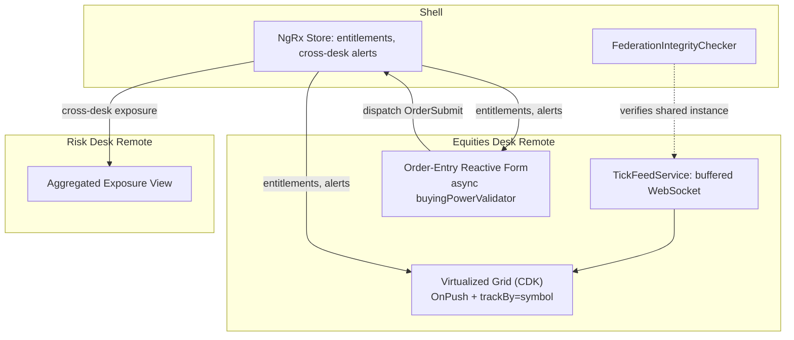

# Module 158 — Angular Capstone: Enterprise-Scale Real-Time Trading Dashboard — Architecture, State, Performance & Production Incidents

> Domain: Angular | Level: Beginner → Expert | Prerequisite: [[../42-Angular/01-Angular-Fundamentals-Components-DI-ChangeDetection-RxJS]] and [[../42-Angular/02-Advanced-Angular-StateManagement-Forms-Performance-MicroFrontends]] (this capstone composes both modules' mechanics into one production-scale platform), [[../14-System-Design/09-Designing-RealTime-Portfolio-Risk-Engine]] (the backend real-time-correctness discipline this module now extends to the client rendering it)

>
> **Scope note:** Third and closing module of `42-Angular`'s 3-module scope. This module is a single, running case study — "TradeView," a multi-desk trading platform — synthesizing Modules 156-157's component/DI/change-detection/RxJS/state-management/micro-frontend mechanics into one coherent, production-grade architecture, then walking through two incidents that occur specifically at the *composition* of otherwise individually-correct mechanisms, continuing this course's recurring capstone finding.

---

## 1. Fundamentals

**What:** TradeView is a shell-plus-five-micro-frontend Angular platform (Equities, Fixed Income, FX, Derivatives, and Risk desks, each an independently-built-and-deployed Module Federation remote) presenting real-time order blotters, live market-data grids, and order-entry forms to several hundred concurrent trading-desk users throughout each session, built entirely on the mechanics Modules 156-157 established: `OnPush` change detection with buffered WebSocket ingestion for high-frequency ticks, Signals for local desk state, a shell-owned NgRx store for genuinely cross-desk shared state (entitlements, global risk alerts), Reactive Forms with async buying-power validation for order entry, and CDK virtual scrolling for grids displaying thousands of instruments simultaneously.

**Why:** Every individual mechanism in this architecture was independently developed and validated in Modules 156-157. This capstone's purpose is what every capstone in this course has established as distinctively valuable (Module 145, Module 150, Module 155): demonstrating that composing individually-correct mechanisms is not itself automatically correct, and that a Principal-level engineer's job at this scale is reasoning about the *seams* between mechanisms specifically, not re-verifying any single mechanism in isolation.

**When:** This architecture pattern — micro-frontend decomposition, tiered state management, buffered high-frequency ingestion, virtualized rendering — is the appropriate answer specifically once an Angular application reaches genuine multi-team, high-update-frequency, large-dataset scale simultaneously; a smaller trading tool serving one desk with modest instrument counts would rightly stay a simpler, single-team, Default-change-detection application per Module 156 §15/Module 157 §15's risk-tiered reasoning.

**How (30,000-ft view):**
```
Shell (owns cross-desk NgRx store: entitlements, global alerts)
   │
   ├─ FederationIntegrityChecker verifies shared-instance identity (Module 157 §4/Expert)
   │
   ├── Remote: Equities Desk
   │     ├─ TickFeedService (buffered WebSocket ingestion, Module 156 Expert exercise)
   │     ├─ Virtualized order/position grid (OnPush + CDK virtual scroll, THIS module's new ground)
   │     └─ Order-entry Reactive Form (async buying-power validator, Module 157 Hard exercise)
   │
   ├── Remote: Fixed Income Desk  (same pattern, independent team/deploy cadence)
   ├── Remote: FX Desk            (same pattern)
   ├── Remote: Derivatives Desk   (same pattern)
   └── Remote: Risk Desk          (consumes cross-desk NgRx store's aggregated exposure)
```

---

## 2. Deep Dive

### 2.1 Virtual scrolling — bounding DOM cost independent of dataset size

Angular CDK's `<cdk-virtual-scroll-viewport>` renders only the DOM rows currently within (plus a small buffer around) the visible viewport, regardless of the underlying dataset's total size — a grid holding position data for 8,000 instruments renders perhaps 40-60 actual DOM rows at any moment, recycling those DOM elements as the user scrolls rather than creating one element per data item. This is the direct DOM-node-count analogue of Module 156 §7's change-detection-cost bounding: just as `OnPush` and buffered ingestion bound *how often* and *how broadly* checks run, virtual scrolling bounds *how many DOM nodes* any single render pass must touch, independent of total dataset growth.

### 2.2 The `trackBy` contract and why it's virtual scrolling's load-bearing correctness requirement

Virtual scrolling's DOM-element recycling depends entirely on Angular's `*ngFor`/`@for` **`trackBy` function** correctly identifying each data item's stable identity across re-renders — `trackBy` tells Angular "this specific DOM row, previously bound to item X, should now be rebound to item Y" precisely when the underlying array is reordered, filtered, or partially updated, rather than Angular assuming positional (index-based) identity by default. **This is not merely a performance optimization; it is a correctness requirement specifically for virtualized or recycled rendering**: if `trackBy` returns an item's *array index* rather than a genuinely stable identifier (its instrument symbol, its unique ID), Angular has no way to distinguish "this item moved to a new position because the array was re-sorted" from "this position now holds a completely different item" — it will reuse and rebind the *same DOM row* to whatever item now occupies that index, which is correct behavior when items are added/removed but produces a **stale-binding mismatch** the instant the array is *reordered* without the underlying DOM row being told its identity changed. This is this capstone's own §4 incident.

### 2.3 Composing NgRx (cross-desk) with local Signals (desk-internal) correctly

TradeView's shell NgRx store holds only genuinely cross-desk state — a trader's entitlements (which instruments/desks they're authorized to view, itself sourced from Module 40's IAM/OAuth2 domains' backend authorization decisions, never re-derived client-side per Module 157 §8's defense-in-depth finding) and firm-wide risk alerts requiring cross-desk visibility. Each desk's own tick data, grid sort/filter state, and order-entry form state live entirely in that desk's own local Signals, per Module 157 §15's Option C tiering — the shell never needs to know an Equities trader's current grid sort column, and centralizing it would violate the exact unnecessary-coupling anti-pattern Module 157 A1 warned against.

### 2.4 Order-entry form submission as the platform's highest-consequence composition point

An order submission is where every one of this platform's mechanisms converge in a single user action: the Reactive Form's async buying-power validator (Module 157 Hard exercise) must complete before submission is enabled; the submission itself dispatches an NgRx Action if it affects cross-desk-visible exposure (via an Effect performing the actual backend call, Module 157 §2.2); the resulting order confirmation or rejection flows back through the buffered tick/update pipeline (§2.1's virtualized grid) to reflect the new position. **A defect at any single seam between these mechanisms — not necessarily within any one of them — can produce an order-entry experience that is individually validated-correct at every component boundary while still producing an incorrect end-to-end outcome**, directly the shape this course's composition-risk finding has established repeatedly.

---

## 3. Visual Architecture



```
trackBy correctness (§2.2) — the module's own §4 incident mechanism:

  Correct:   trackBy: (i, item) => item.symbol   → DOM row follows the SYMBOL
                                                      across re-sorts. Correct.

  INCORRECT: trackBy: (i, item) => i              → DOM row follows the INDEX.
                                                      On re-sort, row at index 3
                                                      keeps showing whatever NEW
                                                      item now sits at index 3 —
                                                      stale price/symbol mismatch.
```

---

## 4. Production Example

**Problem:** TradeView's Equities desk grid included a "Top Movers" view — the same underlying position grid, re-sorted every few seconds by absolute price-change magnitude, so the row order itself changed frequently and substantially as market conditions shifted during the volatile market-open window.

**Architecture:** The grid used CDK virtual scrolling (§2.1) for performance at the desk's ~6,000-instrument universe, with `OnPush` and buffered tick ingestion (Module 156 Expert exercise) already correctly in place from the platform's initial build — the exact pattern this course's own prior module established as the correct fix for change-detection cost.

**Implementation / What happened:** The `*ngFor` powering the grid was implemented with `trackBy: (index, item) => index` — a common, easy-to-reach-for default that works correctly for the platform's *other* grids (which only ever append/update in place, never reorder) but was silently incorrect for the specifically-reordering "Top Movers" view. During the market-open volatility window — precisely when the re-sort was both most frequent and most consequential — a trader briefly observed a stale price bound to the wrong symbol's row: as the sort order shifted, a DOM row previously showing Symbol A's now-outdated price was recycled and rebound to Symbol B's data, but for one buffered-ingestion cycle (Module 156's ~100ms window) displayed Symbol B's *symbol label* against Symbol A's *still-rendering* price value mid-transition, a momentary but genuinely visible incorrect pairing. No error was thrown anywhere — the component, the buffering pipeline, and the virtual-scroll viewport were all individually functioning exactly as built; the defect lived entirely in `trackBy`'s identity contract being violated for this one specific, reordering usage of an otherwise-correct, reusable grid component.

**Trade-offs:** The index-based `trackBy` was not a careless omission but a copy-paste inheritance from the platform's other grids, where it was genuinely, correctly harmless — the component itself was reused across multiple views with different reordering behavior, and nothing in the component's own interface signaled that `trackBy` needed to be reconsidered per-usage rather than treated as a fixed, inherited default.

**Lessons learned:** **A shared, reusable component's correctness is not a fixed property of the component itself when one of its configuration parameters' correctness depends on how the specific consuming context uses it** — `trackBy: index` is correct for append/update-only usage and silently incorrect for reordering usage, and nothing about the grid component's own contract communicated this distinction to a team reusing it for a new, reordering-heavy view. This directly recurs Module 155 §14's "control fired correctly, but its actual effect was never independently verified for this specific usage" finding, now at the frontend component-reuse layer: the grid component "worked" by every test it had ever been run against, because none of those prior tests exercised reordering specifically.

---

## 5. Best Practices

- **Treat `trackBy` as a per-usage correctness decision, never an inherited default** (§2.2, §4) — a component reused across views with different reordering behavior needs its `trackBy` function explicitly reconsidered for each new usage, not copy-pasted from a prior, superficially-similar usage.
- **Reserve NgRx for genuinely cross-desk, audit-relevant state; keep desk-local state in Signals** (§2.3, Module 157 §15) — TradeView's shell store staying narrowly scoped is what keeps five independent teams' deployment cadences genuinely independent.
- **Never derive authorization/entitlement decisions client-side from cached state** (§2.3) — always treat client-held entitlement data as a UX cache of a server-side decision, re-verified server-side on every consequential action (order submission), per Module 157 §8's defense-in-depth finding.
- **Test virtualized/recycled grids specifically against reordering, not merely append/update scenarios** (§4's exact gap) — a grid's correctness under `OnPush` + `trackBy` + virtual scrolling is a genuinely different test surface than its correctness under simple data updates.
- **Instrument the order-submission path (§2.4) end-to-end**, not merely each mechanism (form validation, NgRx dispatch, backend confirmation) independently — the highest-consequence composition point deserves its own dedicated, end-to-end verification distinct from any single mechanism's unit tests.

---

## 6. Anti-patterns

- **Index-based `trackBy` on any grid whose underlying data can be reordered** — §4's precise incident; correct only for strictly append/update-only usage.
- **Copy-pasting a working component's configuration into a new usage context without re-verifying every configuration choice remains valid for the new context's specific behavior** (§4, §5) — the platform-adoption-without-currency-verification pattern Module 139 identified, now at the component-reuse layer.
- **Deriving client-visible authorization state from a stale, cached NgRx entitlements slice without re-verification at consequential action points** — reintroduces exactly the client-side-security-boundary anti-pattern Module 157 §8 warns against.
- **Treating a virtualized grid's correctness as fully covered by the same test suite used for a non-virtualized, non-reordering grid** — misses the specific, distinct failure surface reordering-under-recycling introduces.
- **Centralizing desk-local, high-frequency state into the shell's cross-desk NgRx store "for consistency"** — reintroduces the unnecessary cross-team coupling Module 157 A1 explicitly warned against, and needlessly widens the shell's own change-detection/state-update surface.

---

## 7. Performance Engineering

TradeView's performance budget is the composed product of every lever this course's Angular domain has established: `OnPush` plus buffered ingestion bound change-detection frequency and scope (Module 156 §7); virtual scrolling (§2.1) bounds DOM-node count independent of dataset size; Signals' precise dependency tracking (Module 157 §2.4) bounds recomputation to genuinely-changed derived values; lazy-loaded, independently-deployed remotes (Module 156 §9) bound initial-load cost to only the desks a given trader actually needs. **The critical, composition-specific performance insight this capstone adds: these levers compose multiplicatively, not additively** — a grid correctly using `OnPush`, buffering, virtual scrolling, and precise `trackBy` simultaneously handles a market-open volume spike that any single lever alone, however well-tuned, could not absorb on its own; §4's incident demonstrates that a single incorrectly-configured lever (`trackBy`) can silently undermine the correctness guarantee the other three, individually correct, levers were assumed to jointly provide.

---

## 8. Security

Every order-entry submission (§2.4) is a consequential financial action requiring the same defense-in-depth discipline this course's backend domains established: client-side buying-power validation (Module 157 Hard exercise) is a UX convenience, never a substitute for the identical check re-run authoritatively server-side before an order is actually accepted (Module 157 §8, directly recurring Module 127's gateway-defense-in-depth finding). TradeView's entitlement-driven UI visibility (§2.3) — hiding instruments a trader isn't authorized to view — is likewise a UX layer over server-side-enforced access control (this course's Module 40/41 IAM/OAuth2 domains), never itself the authorization boundary; a trader manipulating client-side NgRx state via browser developer tools must never be able to gain actual access to data or actions the backend hasn't independently authorized.

---

## 9. Scalability

TradeView's five-remote micro-frontend decomposition (Module 157 §9) scales team independence with desk count — each desk team ships on its own schedule, verified against the shared-instance integrity check (Module 157 §4/Expert exercise) rather than requiring shell-team coordination for every change. Virtual scrolling (§2.1) scales rendering cost with viewport size, not instrument-universe size, letting the platform's total addressable instrument count grow without a corresponding grid-performance regression. The shell's deliberately narrow cross-desk NgRx store (§2.3) scales independent of any single desk's internal state complexity, keeping the platform's single shared-coupling surface bounded and explicit rather than growing implicitly as desks add features.

---

## 10. Interview Questions

### Basic (10)

**B1. What does CDK virtual scrolling do, and why does it matter for a large trading grid?**
*Ideal Answer:* Renders only the DOM rows currently within (plus a small buffer around) the visible viewport, recycling DOM elements as the user scrolls, keeping DOM-node count bounded independent of total dataset size.
*Why correct:* Matches §2.1.
*Common mistakes:* Describing virtual scrolling as "loading data lazily," confusing it with data pagination rather than DOM-rendering optimization for already-loaded data.
*Follow-up:* What would happen to rendering performance for an 8,000-row grid without virtual scrolling?

**B2. What is `trackBy`, and why does virtual scrolling depend on it being correct?**
*Ideal Answer:* A function telling Angular's `*ngFor`/`@for` how to identify each data item's stable identity across re-renders; virtual scrolling's DOM-element recycling depends on this identity being correct to know whether a recycled row should be rebound to a different item or represents the same item that moved.
*Why correct:* Matches §2.2.
*Common mistakes:* Treating `trackBy` as a pure performance nicety rather than a correctness requirement specifically for recycled/virtualized rendering.
*Follow-up:* What specifically goes wrong if `trackBy` uses array index for a list that gets reordered?

**B3. Why does TradeView keep desk-local tick data out of the shell's NgRx store?**
*Ideal Answer:* That state has no genuine cross-desk relevance — centralizing it would introduce unnecessary coupling between independently-deployed teams and needlessly widen the shell's own state-update surface, per Module 157's risk/scope-tiered state management principle.
*Why correct:* Matches §2.3.
*Common mistakes:* Assuming all shared-feeling state belongs in a central store regardless of whether it's actually cross-cutting.
*Follow-up:* What kind of state genuinely does belong in the shell's cross-desk store?

**B4. Why must client-side buying-power validation never be trusted as the sole check before an order is accepted?**
*Ideal Answer:* Client-side state and validation logic are inspectable and modifiable by the end user's own browser tooling; the authoritative check must be re-run server-side before the order is actually accepted.
*Why correct:* Matches §8.
*Common mistakes:* Treating a well-implemented client-side validator as sufficient on its own.
*Follow-up:* What's the appropriate role of the client-side async validator, if not the authoritative check?

**B5. What are the four independent performance levers this capstone composes for the tick-data grid?**
*Ideal Answer:* `OnPush` change detection, buffered/throttled WebSocket ingestion, Signals' precise dependency tracking, and virtual scrolling.
*Why correct:* Matches §7.
*Common mistakes:* Naming only one or two levers, missing that the capstone's point is specifically their multiplicative composition.
*Follow-up:* Which lever bounds DOM-node count specifically, as opposed to change-detection frequency?

**B6. What does the `FederationIntegrityChecker` verify, and why does TradeView need it?**
*Ideal Answer:* That a shared, cross-remote service (like a notification stream) is genuinely the same instance across the shell and a loaded remote, catching Module 157's shared-dependency-instance-splitting failure class before trusting a remote to participate in shared state.
*Why correct:* Matches §3's diagram and Module 157 §4/Expert exercise.
*Common mistakes:* Assuming Module Federation's "shared: true" configuration alone guarantees this without any additional verification.
*Follow-up:* What specifically would this check catch that no individual remote's own test suite could?

**B7. Why was §4's incorrect `trackBy` not caught by the platform's existing tests?**
*Ideal Answer:* The component's existing tests exercised append/update scenarios (where index-based `trackBy` is genuinely harmless) but never the specific reordering behavior the new "Top Movers" view introduced.
*Why correct:* Matches §4's root-cause framing precisely.
*Common mistakes:* Assuming the component was simply "untested," missing that it was tested — just not against the specific new usage pattern that exposed the defect.
*Follow-up:* What specific test would have caught this before production, per §5's recommendation?

**B8. What is the highest-consequence "composition point" in TradeView's architecture, and why?**
*Ideal Answer:* Order submission — it's where the Reactive Form's async validation, the NgRx dispatch/Effect pipeline, and the buffered-tick-driven grid update all converge in a single user action with real financial consequence.
*Why correct:* Matches §2.4.
*Common mistakes:* Naming only one mechanism (e.g., "the form") rather than identifying it specifically as the convergence point of multiple mechanisms.
*Follow-up:* Why does a defect at this convergence point not necessarily indicate a defect within any single one of the converging mechanisms?

**B9. Why does TradeView use independently-deployed Module Federation remotes rather than one monolithic Angular application?**
*Ideal Answer:* To let five independent desk teams ship on independent schedules without requiring shell-team coordination for every change — the same organizational-scaling driver Module 105 established for backend microservices.
*Why correct:* Matches §9 and Module 157 §1/§9.
*Common mistakes:* Citing only technical reasons (bundle size) without the organizational/team-independence driver that's the primary justification.
*Follow-up:* What verification mechanism must run whenever a new remote version is deployed, given this independence?

**B10. In §4's incident, was any individual component or mechanism actually broken?**
*Ideal Answer:* No — `OnPush`, the buffering pipeline, and the virtual-scroll viewport were all functioning exactly as built; the defect lived entirely in `trackBy`'s identity contract being violated for one specific, reordering usage context.
*Why correct:* Matches §4's precise root-cause framing.
*Common mistakes:* Assuming a visible incorrect-data bug implies some component was internally broken, missing that this is a composition/configuration-context defect instead.
*Follow-up:* What course-wide recurring finding does this incident most directly instantiate?

### Intermediate (10)

**I1. Design the `trackBy` function for TradeView's "Top Movers" grid correctly, and explain precisely why it fixes §4's incident.**
*Ideal Answer:* `trackBy: (index, item) => item.symbol` (or another genuinely stable, unique identifier such as an instrument ID) — this tells Angular that a DOM row's identity follows the *symbol*, not its *position*, so when the array is re-sorted, Angular correctly recognizes that Symbol A's row moved to a new index (and rebinds/repositions the existing row accordingly) rather than assuming the row at each index now represents a different item requiring full rebinding of unrelated data.
*Why correct:* Matches §2.2's mechanics and directly closes §4's incident.
*Common mistakes:* Proposing a `trackBy` function returning a non-unique or non-stable value (e.g., the current price, which changes on every tick), reintroducing the same class of bug via a different specific defect.
*Follow-up:* What would happen if two different instruments momentarily shared the same `trackBy` return value due to a data-quality issue upstream?

**I2. Explain why TradeView's NgRx store scope decision (§2.3) is itself a DI/state-management analogue of Module 156's component-scoped-provider reasoning.**
*Ideal Answer:* Just as Module 156 §2.4 established that a service should be deliberately scoped (root singleton vs. component-local instance) based on whether its state is genuinely meant to be shared, TradeView's shell-vs-desk-local state split (§2.3) applies the identical reasoning at the state-management layer: cross-desk-relevant state gets the "root/shared" treatment (the NgRx store), while desk-internal state gets the "locally-scoped" treatment (Signals within that desk's own remote) — both are instances of matching a state/service's actual sharing scope to its architectural placement, rather than defaulting to either extreme uniformly.
*Why correct:* Correctly draws the structural parallel between two mechanisms (DI scoping and state-management scoping) that address the same underlying question at different layers.
*Common mistakes:* Treating DI scoping and NgRx-vs-Signals state placement as unrelated concerns, missing the shared underlying principle both apply.
*Follow-up:* What would go wrong, analogous to Module 156's DI-scoping bug, if a desk's local Signal-based state were accidentally exposed through the shell's shared injector instead of staying properly desk-scoped?

**I3. Design an end-to-end test specifically for the order-submission composition point (§2.4), distinct from unit tests of the form validator, the NgRx reducer, and the grid update independently.**
*Ideal Answer:* A test that submits a realistic order through the actual Reactive Form (triggering the real async validator), asserts the correct Action is dispatched and processed through the real reducer/Effect pipeline (with a mocked backend response), and then asserts the resulting state change is correctly reflected in the grid's rendered output (including under `OnPush` + virtual scrolling + `trackBy`, i.e., using the real rendering pipeline, not a shallow render bypassing it) — verifying the full chain end-to-end rather than each mechanism's correctness in isolation, directly matching Module 157 Advanced Q4's integration-test reasoning applied to this specific composition point.
*Why correct:* Correctly designs a genuine end-to-end test exercising the actual composed pipeline, matching §2.4/§5's explicit recommendation.
*Common mistakes:* Proposing only more thorough unit tests of each individual mechanism, missing that §4's own incident already demonstrates individually-correct units can still compose incorrectly.
*Follow-up:* Why is it specifically important that this test use the real rendering pipeline (`OnPush`, virtual scrolling, `trackBy`) rather than a simplified test harness that bypasses them?

**I4. A desk team wants to reuse TradeView's virtualized grid component for a new view that never reorders data, only appends new rows. Do they need to reconsider `trackBy`?**
*Ideal Answer:* Less urgently than for a reordering view, but still worth an explicit, deliberate decision rather than a silent inheritance — an append-only view is exactly the case where index-based `trackBy` is genuinely harmless (§4), but the team should still document *why* it's safe for this specific usage (append-only, no reordering) rather than treating the choice as unexamined, since a future change to this same view (adding a sort feature, for instance) would silently reintroduce §4's exact risk if the `trackBy` choice was never explicitly reasoned about and recorded.
*Why correct:* Correctly distinguishes "currently safe" from "safe by explicit, documented reasoning that will catch future risk," reusing §5's best-practice recommendation.
*Common mistakes:* Concluding no action is needed at all, missing that undocumented "currently safe" configuration is exactly what allowed §4's original incident to occur when a new, reordering usage was later introduced.
*Follow-up:* What lightweight documentation or code-level annotation would make this reasoning visible to a future developer modifying this view?

**I5. Why does the `FederationIntegrityChecker` (§3) need to run specifically for TradeView's shared notification service, but not necessarily for every dependency each remote uses?**
*Ideal Answer:* The check's value is specifically for dependencies whose *singleton identity* — not merely their functional behavior — matters for correctness (a shared `Subject`-backed notification stream must genuinely be the same instance for cross-remote pub/sub to work at all); a dependency each remote uses independently, with no cross-remote instance-identity requirement, has no analogous failure mode for this check to catch, so applying it universally would add verification cost with no corresponding risk reduction.
*Why correct:* Correctly scopes the check to the specific risk class it addresses (singleton-identity-dependent shared state), matching this course's recurring risk-proportional-investment principle.
*Common mistakes:* Proposing to apply the check to every shared dependency uniformly, missing that its value is specifically tied to singleton-identity-dependent use cases.
*Follow-up:* Name another TradeView dependency, beyond the notification service, that would also warrant this specific check, and one that clearly wouldn't.

**I6. How does TradeView's buffered tick ingestion (§7) interact with `trackBy`'s correctness requirement during a rapid re-sort event specifically?**
*Ideal Answer:* Buffering batches incoming tick updates over a short window before they reach component state, meaning a re-sort driven by newly-arrived price data effectively happens once per buffer window rather than on every individual tick — this reduces the *frequency* of reorder events the grid must handle, but does not change whether `trackBy` handles each individual reorder event *correctly* when it does occur; §4's incident would still have occurred, just somewhat less frequently, even with buffering correctly in place, because buffering addresses trigger frequency (Module 156 §7's first lever) while `trackBy` correctness is an entirely separate, orthogonal requirement (§2.2).
*Why correct:* Correctly identifies that buffering and `trackBy` correctness are independent, non-substitutable concerns — one reduces reorder frequency, the other determines whether any given reorder is handled correctly.
*Common mistakes:* Assuming buffering "fixes" or reduces the severity of a `trackBy` defect in some structural way, rather than recognizing the two mechanisms address entirely orthogonal failure modes.
*Follow-up:* Would increasing the buffer window's duration have reduced §4's incident's user-visible frequency, and would that have been an appropriate mitigation versus fixing `trackBy` directly?

**I7. Design the entitlement-check flow for TradeView's order-entry form, correctly placing both a client-side UX check and the authoritative server-side check.**
*Ideal Answer:* Client-side: the form reads the trader's entitlements from the shell's NgRx store (populated from a server-side authorization decision at session start) to immediately disable/hide instruments the trader isn't authorized to trade, providing instant UX feedback with no round-trip. Server-side (authoritative): the backend order-submission endpoint independently re-verifies the trader's current entitlement for the specific instrument being ordered at the moment of submission, never trusting that the client-side check was faithfully executed or that the cached entitlement snapshot is still current — directly reusing Module 127's gateway-defense-in-depth-first-layer finding, now with the client-side NgRx-store check as an even-earlier, purely-UX-layer instance of the same pattern.
*Why correct:* Correctly designs both layers with an explicit statement of which one is authoritative, matching §8's precise framing.
*Common mistakes:* Describing only one of the two layers, or treating the client-side check as sufficient on its own.
*Follow-up:* What could cause the client-side cached entitlement snapshot to be stale relative to the actual, current server-side entitlement, and how should the UI handle a server-side rejection that the client-side check didn't anticipate?

**I8. Why is it significant that §4's incident occurred specifically during the market-open volatility window, rather than at a random time during the trading day?**
*Ideal Answer:* The market-open window is precisely when re-sort events are both most frequent (rapid price movement continuously reshuffling "Top Movers" ranking) and most consequential (traders making time-sensitive decisions based on exactly this view) — the incident's risk was concentrated directly on the conditions where the underlying mechanism (reordering) occurs most often and where a momentarily-incorrect price/symbol pairing carries the highest potential cost, directly recurring Module 148 §4's finding that failure risk concentrates disproportionately on the highest-volume, highest-consequence conditions rather than being uniformly distributed across all operating conditions.
*Why correct:* Correctly connects the specific timing of the incident's manifestation to the underlying mechanism's trigger frequency, and explicitly ties it to this course's recurring "risk concentrates on peak/high-consequence conditions" finding from a different domain.
*Common mistakes:* Treating the market-open timing as incidental or coincidental rather than a direct, mechanically-explainable consequence of when reorder events are most frequent.
*Follow-up:* What testing practice would specifically exercise this "high reorder frequency" condition rather than relying on it occurring naturally in production first?

**I9. A new desk (Commodities) is being added to TradeView as a sixth Module Federation remote. What from this capstone's architecture should the new team be required to reuse versus build independently?**
*Ideal Answer:* Reuse: the `FederationIntegrityChecker` pattern for any shared, singleton-identity-dependent dependency they consume; the shell's NgRx store contract for genuinely cross-desk state (never re-deriving entitlements independently); the buffered-ingestion + `OnPush` + virtual-scrolling pattern for any high-frequency, large-dataset grid, explicitly re-verifying `trackBy` correctness for their own specific usage (I4) rather than assuming it's automatically inherited correctly. Build independently: their own desk-local Signals-based state, their own Reactive Forms validation logic specific to commodities trading, their own deployment pipeline and release cadence.
*Why correct:* Correctly distinguishes which elements are genuinely reusable, shared infrastructure (where consistency matters) versus which are legitimately desk-specific (where independence matters), matching this module's own architecture's stated boundaries.
*Common mistakes:* Proposing either "reuse everything" (recreating unnecessary coupling, Module 157 A1) or "build everything independently" (losing the consistency benefit and reproducing risk this course has repeatedly found in ungoverned, independently-reinvented patterns, Module 153 A2).
*Follow-up:* What governance process (not merely documentation) would ensure the new team correctly re-verifies `trackBy` for their own specific grid usage rather than silently copy-pasting an existing desk's configuration?

**I10. How would you monitor TradeView in production to detect a §4-class incident (a silent, momentary price/symbol mismatch) before it's discovered through a trader's manual report?**
*Ideal Answer:* Since the defect produces no thrown error and no application-level exception, conventional error-rate monitoring provides zero signal; detection requires either (a) a client-side integrity check periodically asserting that each rendered row's displayed symbol matches its bound data model's symbol (a runtime self-consistency check specifically targeting this failure class), or (b) synthetic, automated UI testing that specifically exercises rapid-reorder scenarios against the live application on a recurring schedule (directly reusing Module 152 A10/Module 155 A7's continuous-synthetic-canary discipline, here applied to a rendering-correctness property rather than a security or availability property).
*Why correct:* Correctly recognizes that this defect class is invisible to conventional error monitoring and requires a purpose-built detection mechanism, matching this course's recurring "silent-wrongness requires explicit, dedicated verification" finding (the same theme the earlier buy-side System Design run, Modules 129-134, established for backend silent-correctness failures).
*Common mistakes:* Proposing only conventional application-error monitoring (exception tracking, log aggregation), which would show nothing wrong throughout this specific incident, since no component ever threw an error.
*Follow-up:* How does this detection challenge connect to this course's Modules 129-134 finding that "correctness is unobservable at the point of consumption yet immediately consequential"?

### Advanced (10)

**A1. Design the complete, correct architecture for TradeView's "Top Movers" grid from scratch, addressing every lever this capstone has established.**
*Ideal Answer:* `OnPush` change detection on the grid component; buffered WebSocket tick ingestion (100ms window, Module 156 Expert exercise) feeding the underlying data; a `trackBy` function keyed on instrument symbol, not array index (I1), explicitly documented as required specifically because this view reorders; CDK virtual scrolling for DOM-node-count bounding independent of the 6,000-instrument universe size; a dedicated end-to-end test (I3) exercising the full pipeline under a simulated rapid-reorder scenario specifically, run in CI before any change to this component ships; a client-side row-integrity runtime check (I10) as a production safety net independent of the CI test's coverage.
*Why correct:* Synthesizes every mechanism and lesson this capstone (and its two constituent modules) has established into one coherent, fully-justified design, explicitly addressing §4's incident's specific gap.
*Common mistakes:* Omitting the explicit documentation/justification requirement for `trackBy`'s choice (I4), reproducing the exact "silent, unexamined inheritance" risk that caused §4's original incident.
*Follow-up:* Which of these five elements would you prioritize implementing first if resource-constrained, and why?

**A2. §4's incident and Module 157 §4's incident (shared-dependency instance splitting) are both "composition risk" incidents. Precisely distinguish the two failure shapes.**
*Ideal Answer:* Module 157 §4's failure occurred at a genuine *organizational* composition boundary — independently-built-and-deployed bundles from separate teams, negotiated at runtime via a mechanism (Module Federation) whose guarantee proved narrower than assumed. This module's §4 failure occurred entirely *within* a single team's own component, at the boundary between a *reused configuration choice* (`trackBy: index`) and a *new usage context* (a reordering view) that same team introduced — no cross-team or cross-deployment boundary was involved at all. Both are composition-risk incidents in the sense that no single mechanism was internally broken, but they differ in *scope*: one is inter-organizational (federation-runtime), the other is intra-team (component-reuse-context).
*Why correct:* Correctly distinguishes the two incidents' actual scope (inter-team/runtime-federation vs. intra-team/component-reuse) while still identifying their shared underlying shape (individually-correct pieces, incorrect composition).
*Common mistakes:* Treating the two incidents as identical simply because both are labeled "composition risk," missing the meaningfully different organizational scope each actually involves.
*Follow-up:* Does this distinction imply the two incidents warrant different kinds of governance response, given one crosses team boundaries and the other doesn't?

**A3. Critique: "Since TradeView's shell/desk state split (§2.3) already follows Module 157's risk-tiered state-management principle correctly, the platform's state-management architecture is fully de-risked."**
*Ideal Answer:* Overstated. The *state-management tiering decision* being correct doesn't guarantee every *individual state-management implementation detail* within either tier is also correct — §4's incident occurred entirely within desk-local, correctly-tiered Signals-based grid state, demonstrating that getting the higher-level architectural tiering decision right is necessary but not sufficient; correctness still depends on every specific mechanism within each tier (here, `trackBy`) being independently, correctly implemented for its actual usage context. A correct architectural framework doesn't eliminate the need for correct implementation within that framework.
*Why correct:* Correctly distinguishes architectural-tiering correctness from implementation-level correctness within a correctly-tiered architecture, using §4's own incident as direct counter-evidence to the overstated claim.
*Common mistakes:* Accepting the claim because the state-management tiering genuinely is well-designed, without recognizing that good architecture at one level doesn't structurally guarantee correctness at every level beneath it.
*Follow-up:* What specific verification (beyond "the architecture is well-designed") would be needed to actually substantiate a claim of full de-risking?

**A4. Design a code-review checklist item specifically targeting §4's failure class, and evaluate its limitation as a purely human-review-based control.**
*Ideal Answer:* Checklist item: "Does this `*ngFor`/`@for` usage's underlying data ever get reordered (sorted, re-ranked)? If so, does `trackBy` use a genuinely stable, unique identifier rather than array index?" Limitation: like every purely human-review-based control this course has examined (Module 153 A2's per-service validation-logic variance, Module 152's certification-versus-drift gap), it depends entirely on a reviewer both remembering to ask this specific question and correctly reasoning about whether the *specific* view under review reorders — for a component reused across many views by many different developers over time, a mechanical, automated check (a lint rule flagging index-based `trackBy` usage, requiring an explicit override comment to suppress) would be more reliable than review-checklist discipline alone.
*Why correct:* Proposes the human-review control while explicitly, correctly identifying its inherent limitation and the more reliable mechanical alternative, matching this course's consistent preference for automatable checks over manual-only discipline.
*Common mistakes:* Proposing the checklist item without acknowledging its dependency on consistent reviewer diligence, missing the opportunity to identify the stronger, automatable alternative.
*Follow-up:* Design the specific lint rule (conceptually) that would catch index-based `trackBy` usage automatically, and identify what legitimate use case it would need to allow via explicit override.

**A5. TradeView's Risk desk aggregates cross-desk exposure via the shell's NgRx store. Design the data flow ensuring the Risk desk's aggregated view reflects genuinely current, not stale, per-desk position data, addressing this course's recurring staleness-detection theme.**
*Ideal Answer:* Each desk's Effects dispatch position-update Actions to the shell's cross-desk store specifically at the moments those positions genuinely change (order fills, not merely UI-local sort/filter changes) — never a periodic snapshot poll, which would introduce an unbounded and unmonitored staleness window. The Risk desk's aggregated Selector should additionally expose, alongside the aggregated value itself, the most recent update timestamp per contributing desk, so a desk whose Effects pipeline has silently stopped dispatching updates (a Module 156 §14-style connection-lifecycle failure, recurring here) produces a visibly stale timestamp for that specific desk rather than an aggregated total that looks current while actually being partially frozen — directly reusing this course's "verify the verifier" discipline (Module 152, Module 154) at the cross-desk-aggregation layer.
*Why correct:* Correctly designs both the update-triggering mechanism and an explicit staleness-detection signal, rather than assuming the aggregation is automatically current simply because the underlying architecture is well-designed.
*Common mistakes:* Designing only the aggregation mechanism itself without an explicit mechanism for detecting when one contributing desk's updates have silently stopped flowing.
*Follow-up:* How would this staleness-per-desk signal have helped detect Module 156 §14's `shareReplay` reconnection-race incident, had it existed on that platform?

**A6. How would zoneless change detection (Module 156 §2.4, Module 157 §2.4), if adopted platform-wide, change the diagnostic approach to a future incident resembling §4?**
*Ideal Answer:* Under zoneless Angular, the grid's re-render would be triggered specifically by the Signal(s) backing its data changing — meaning a diagnostic investigation could directly inspect which Signal updates correlate with the incorrect render, with a much narrower, more precisely-scoped causal chain to trace than under Zone.js's blanket "any async event anywhere" triggering. However, `trackBy`'s correctness requirement (§2.2) is entirely orthogonal to the change-detection triggering mechanism — zoneless adoption would make the *triggering* easier to diagnose but would do nothing to prevent or more easily surface the *`trackBy`-identity* defect itself, since that defect lives in Angular's rendering/recycling logic, not in when a check is triggered.
*Why correct:* Correctly distinguishes what zoneless adoption would and wouldn't change about this specific incident class, avoiding the common mistake of assuming a change-detection-model improvement addresses every category of rendering defect.
*Common mistakes:* Assuming zoneless adoption would have prevented §4's incident entirely, missing that `trackBy` correctness is an orthogonal concern to the change-detection triggering mechanism.
*Follow-up:* Given this orthogonality, is zoneless migration a meaningful risk-reduction investment relative to `trackBy`-specific verification (A4), or are they addressing genuinely independent risk categories that both warrant investment?

**A7. Design the rollback and incident-response process TradeView's Equities desk team should follow upon discovering §4's incident in production.**
*Ideal Answer:* Immediate: since Module Federation's independent-remote-deployability (Module 157 §2.6) means only the Equities desk's remote needs to change, roll back specifically that remote to its prior deployed version with the correct (or absent, pre-feature) "Top Movers" view — not a shell-wide or platform-wide rollback, directly reusing Module 157 Advanced Q9's fault-isolation reasoning. Concurrent: notify affected traders and compliance of the specific window during which the incorrect display could have occurred, given the financial-services context's regulatory expectation around any incident that could have influenced a trading decision (this course's Elite FinTech Interview Panel lens' recurring compliance-awareness requirement). Follow-up: audit every other grid view across all five desks for the same index-based `trackBy` anti-pattern (A4's lint rule, run retroactively across the full codebase), since §4's own incident demonstrates the defect pattern is not unique to the one view where it was first discovered.
*Why correct:* Correctly sequences a scoped technical rollback, an appropriately compliance-aware communication step specific to this course's financial-services context, and a systemic retroactive audit rather than treating the fix as complete once the one discovered instance is corrected.
*Common mistakes:* Treating the incident as fully resolved once the specific "Top Movers" view's `trackBy` is fixed, without auditing for the same latent defect pattern potentially present elsewhere in the codebase.
*Follow-up:* What would make this incident specifically reportable to a regulator or compliance function, versus an incident an engineering team could resolve without escalation?

**A8. Synthesize why this capstone's own incident (§4) uses a genuinely different technical mechanism than either of Modules 156-157's own production incidents, and explain what this diversity demonstrates about the domain as a whole.**
*Ideal Answer:* Module 156 §4 was a subscription-lifecycle/change-detection-cost incident; Module 157 §4 was a federation-runtime shared-dependency-instance incident; this module's §4 is a rendering-identity/`trackBy`-contract incident — three structurally distinct technical mechanisms, none reducible to the others, yet all three share the identical underlying shape this course has traced across every domain: individually-correct, individually-tested mechanisms producing an incorrect outcome specifically at an under-examined seam between them (subscription lifecycle vs. tree-wide change detection; federation negotiation vs. singleton assumption; reusable-component configuration vs. new-usage-context requirements). This demonstrates the composition-risk finding is not tied to any single Angular mechanism specifically, but recurs structurally across the framework's genuinely different subsystems whenever two individually-well-understood mechanisms are combined without an explicit examination of their combined, rather than separate, correctness.
*Why correct:* Correctly identifies the three incidents' technical diversity while precisely articulating the shared structural pattern underlying all three, demonstrating genuine domain-level synthesis rather than restating any one incident.
*Common mistakes:* Describing the three incidents as "all just Angular bugs" without identifying the specific, shared composition-risk shape that distinguishes this pattern from an arbitrary collection of unrelated defects.
*Follow-up:* Is there a general engineering practice (not specific to any one of these three mechanisms) that would help a team proactively look for this class of risk before shipping a new feature, rather than discovering each instance reactively?

**A9. TradeView is considering server-side rendering (Angular Universal/hydration) for the shell application specifically to improve initial load time. Evaluate whether this is a worthwhile investment given the platform's actual usage pattern.**
*Ideal Answer:* SSR's primary value — faster perceived initial load and improved SEO/crawlability — is most valuable for public-facing, frequently-freshly-loaded content. TradeView is an internal, authenticated, session-long tool where users load the application once at the start of a trading session and then interact with it continuously for hours (Module 156 §4's "session-long" framing) — SEO is irrelevant, and the one-time initial-load cost is a small fraction of the session's total value, meaning SSR's engineering investment (hydration complexity, server infrastructure, the added risk of hydration-mismatch bugs — themselves a new instance of this module's "individually-correct-server-and-client-rendering-composing-incorrectly" risk class) is poorly matched to this specific application's actual usage profile. A more valuable investment for TradeView's actual profile is the lazy-loading and virtual-scrolling techniques this capstone already emphasizes, which reduce ongoing, session-long cost rather than only the one-time initial load.
*Why correct:* Correctly evaluates the investment against the platform's actual, specific usage pattern rather than defaulting to "SSR is generally good practice," and correctly identifies hydration mismatch as a new instance of this module's own recurring composition-risk theme.
*Common mistakes:* Recommending SSR based on its general reputation as a performance best practice without evaluating whether its specific value proposition (fast initial load, SEO) actually matches this platform's specific, session-long, authenticated, internal-tool usage pattern.
*Follow-up:* Under what different usage-pattern assumption would SSR become a clearly worthwhile investment for a similar trading-platform-adjacent application?

**A10. As the closing module of `42-Angular`, synthesize the domain's full three-module arc into its single defining lesson, and connect it explicitly to this course's broader, cross-domain composition-risk theme (Module 145, 150, 155).**
*Ideal Answer:* Module 156 established Angular's core reactive substrate and its own internal composition risk (change-detection scope vs. trigger frequency, `OnPush`'s reference-identity gap). Module 157 extended this to structured state management and organizational-scale composition (NgRx/Signals tiering, Module Federation's runtime-negotiated guarantees). This capstone demonstrates that composing even a fully-Module-156/157-compliant architecture correctly at every individual layer still produces a genuine, production-reaching defect (§4) precisely at an under-examined seam — a component's configuration choice assumed valid across a new usage context — extending Module 145's course-wide finding ("composition risk is distinct from and additional to component risk") to the frontend framework layer specifically, and demonstrating it recurs identically whether the composition boundary is inter-organizational (Module 155's identity federation, Module 157's micro-frontend federation) or intra-team (this module's component-reuse boundary) — the scope of the boundary varies, but the underlying shape (individually-correct pieces, unverified combination) does not.
*Why correct:* Correctly synthesizes all three modules into one explicit throughline and connects it precisely to the specific, named cross-domain finding this course has established repeatedly, demonstrating the capstone-level synthesis this course's workflow rules require.
*Common mistakes:* Summarizing each module's content independently without articulating the specific, unifying "composition risk recurs at every boundary scope" throughline connecting them.
*Follow-up:* Given this recurring pattern spans backend distributed systems, identity federation, and now frontend framework architecture, what does that breadth suggest about whether composition risk is a solvable, one-time engineering problem or a permanent operating condition requiring ongoing, structural vigilance?

---

## 11. Coding Exercises

### Easy — Symbol-stable `trackBy` with defensive uniqueness assertion

**Problem:** Implement the corrected `trackBy` for the "Top Movers" grid (I1), with a development-mode assertion catching the "two items share the same tracked identity" edge case Intermediate Q1 raised.

**Solution (TypeScript):**
```typescript
@Component({ /* ... */ })
export class TopMoversGridComponent {
  private readonly seenInDevMode = new Set<string>();

  trackBySymbol(_: number, item: Position): string {
    if (!environment.production) {
      if (this.seenInDevMode.has(item.symbol)) {
        console.error(
          `trackBy uniqueness violation: duplicate symbol "${item.symbol}" in one render pass. ` +
          `Virtual scrolling correctness depends on trackBy returning a UNIQUE value per item.`
        );
      }
      this.seenInDevMode.add(item.symbol);
    }
    return item.symbol; // stable across re-sorts — the §4 fix
  }

  // Called once per render pass to reset the dev-mode duplicate check.
  resetDevModeTracking(): void {
    if (!environment.production) this.seenInDevMode.clear();
  }
}
```
**Time complexity:** O(1) per item in production; O(1) amortized per item in dev mode (Set lookup/insert). **Space complexity:** O(n) in dev mode only (n = items per render pass); O(1) in production.

**Optimized solution:** Strip the dev-mode uniqueness check entirely from production builds (already gated via `environment.production`) to avoid any runtime cost in the hot rendering path once the correctness property has been verified during development and testing.

### Medium — Cross-desk exposure aggregation with per-desk staleness tracking

**Problem:** Implement the Risk desk's aggregated-exposure Selector with per-desk update-timestamp tracking (Advanced Q5), flagging any desk whose data hasn't updated within an expected window.

**Solution (TypeScript):**
```typescript
interface DeskExposure { deskId: string; exposure: number; lastUpdatedAt: number; }
interface RiskState { deskExposures: Record<string, DeskExposure>; }

const STALENESS_THRESHOLD_MS = 30_000; // desk data older than this is flagged

export const selectDeskExposures = (state: { risk: RiskState }) => state.risk.deskExposures;

export const selectAggregatedExposureWithStaleness = createSelector(
  selectDeskExposures,
  (deskExposures) => {
    const now = Date.now();
    const desks = Object.values(deskExposures);

    const staleDesks = desks.filter(d => now - d.lastUpdatedAt > STALENESS_THRESHOLD_MS);
    const totalExposure = desks.reduce((sum, d) => sum + d.exposure, 0);

    return {
      totalExposure,
      isFullyCurrent: staleDesks.length === 0,
      staleDeskIds: staleDesks.map(d => d.deskId), // A5's "which desk went silent" signal
    };
  }
);
```
**Time complexity:** O(d) per recomputation (d = desk count, typically small and fixed). **Space complexity:** O(d).

**Optimized solution:** In production, pair this Selector's `staleDeskIds` output with an active alert (not merely a passive UI indicator) routed to platform monitoring whenever any desk exceeds the staleness threshold — treating cross-desk exposure staleness with the same alerting rigor Module 141 established for backend consumer-lag monitoring, since a silently-stale Risk-desk aggregate carries genuine compliance/risk-management consequence.

### Hard — Order-submission end-to-end composition test harness

**Problem:** Implement the end-to-end test structure (Intermediate Q3) exercising the full order-submission pipeline: Reactive Form validation → NgRx dispatch/Effect → grid update, using the real rendering pipeline.

**Solution (TypeScript, Angular Testing Library-style pseudocode):**
```typescript
describe('Order submission — end-to-end composition', () => {
  it('reflects a submitted order in the grid after full pipeline processing', async () => {
    const { fixture, store } = await renderTradingDeskComponent({
      // Real reducers, real Effects (with a MOCKED backend HTTP layer only —
      // everything else in the pipeline is genuine, not shallow-rendered).
      providers: [
        provideMockStore({ initialState: initialDeskState }),
        { provide: OrderApiService, useValue: mockOrderApiReturning(successResponse) },
      ],
    });

    const sizeInput = fixture.debugElement.query(By.css('[data-testid=order-size]'));
    setInputValue(sizeInput, '500');
    fixture.detectChanges();

    // Wait for the REAL async buying-power validator (switchMap-based) to resolve —
    // not mocked away, since I3 specifically requires exercising the real validator.
    await fixture.whenStable();

    const submitButton = fixture.debugElement.query(By.css('[data-testid=submit-order]'));
    expect(submitButton.nativeElement.disabled).toBe(false); // validation passed

    submitButton.nativeElement.click();
    fixture.detectChanges();

    // Assert the dispatched Action reached the real reducer:
    const dispatchedActions = store.selectSignal(selectRecentActions)();
    expect(dispatchedActions).toContain(jasmine.objectContaining({ type: '[Order] Submit Success' }));

    // Assert the grid — rendered through the REAL OnPush + virtual-scroll +
    // trackBy pipeline, not a shallow stub — reflects the new position:
    const gridRow = fixture.debugElement.query(By.css('[data-testid="position-row-AAPL"]'));
    expect(gridRow.nativeElement.textContent).toContain('500');
  });
});
```
**Time complexity:** N/A (test infrastructure). **Space complexity:** N/A.

**Optimized solution:** Extend this harness with a second test case specifically simulating a rapid re-sort event occurring *during* the async validation's pending window (I8's high-reorder-frequency condition, deliberately reproduced under test rather than waiting for it to occur naturally in production), directly closing §4's original test-coverage gap by exercising the exact composition condition — reordering concurrent with an in-flight async operation — that the original incident's test suite never covered.

### Expert — Client-side row-integrity runtime canary (production detection for §4-class incidents)

**Problem:** Implement the production self-consistency check (Intermediate Q10) that periodically verifies every currently-rendered grid row's displayed symbol matches its underlying bound data model, detecting a §4-class `trackBy` mismatch without relying on a thrown error.

**Solution (TypeScript):**
```typescript
interface RenderedRowSnapshot { domSymbol: string; boundDataSymbol: string; }

@Injectable({ providedIn: 'root' })
export class RowIntegrityCanaryService {
  private readonly mismatchSubject = new Subject<RenderedRowSnapshot>();
  readonly mismatches$ = this.mismatchSubject.asObservable();

  // Called on a recurring interval (e.g., every 2s) against a live grid instance —
  // a production safety net independent of and complementary to CI testing (Hard exercise).
  checkGridIntegrity(gridElement: HTMLElement, currentData: readonly Position[]): void {
    const dataBySymbol = new Map(currentData.map(p => [p.symbol, p]));
    const rows = gridElement.querySelectorAll('[data-testid^="position-row-"]');

    rows.forEach(row => {
      const domSymbol = row.getAttribute('data-symbol');
      const domPrice = row.querySelector('[data-testid=price]')?.textContent?.trim();
      if (!domSymbol) return;

      const boundData = dataBySymbol.get(domSymbol);
      if (!boundData) return; // row for a symbol no longer in the dataset — not this check's concern

      const expectedPrice = boundData.price.toFixed(2);
      if (domPrice !== expectedPrice) {
        // A DOM row's displayed price doesn't match its OWN data-symbol's current
        // price — exactly the §4 failure signature, caught without any thrown error.
        this.mismatchSubject.next({ domSymbol, boundDataSymbol: boundData.symbol });
      }
    });
  }
}
```
**Time complexity:** O(v) per check (v = currently-visible/virtualized row count — bounded by §2.1, not total dataset size). **Space complexity:** O(v).

**Optimized solution:** In production, route `mismatches$` to the same centralized monitoring/alerting pipeline this course's backend domains established for silent-correctness failures (Module 129-134's "how would we know if this were wrong" discipline, and Module 152/155's security-anomaly alerting), treating a detected row-integrity mismatch as a genuine production incident requiring the same response rigor as any other silent-wrongness failure this course has examined — not merely a debug-console warning easily lost among routine log noise.

---

## 12. System Design

**Requirements**

*Functional:* Real-time, multi-desk order blotter and market-data grids; order-entry with async, race-condition-safe validation; cross-desk risk aggregation; independent per-desk deployment.

*Non-functional:* Change-detection and DOM-rendering cost bounded independent of instrument-universe size and update frequency (§7); rendering correctness verified specifically under reordering, not merely append/update scenarios (§4, A1); shared cross-remote dependency identity verified at integration time (Module 157 §4); order-submission's full composition chain verified end-to-end (I3, Hard exercise), not merely per-mechanism; silent, non-erroring rendering defects detected via active, purpose-built monitoring (I10, Expert exercise), not passive error tracking alone.

**Architecture:** See §3's mermaid diagram — the shell/five-remote structure, shell-scoped NgRx store, per-desk buffered-tick + `OnPush` + virtual-scroll + `trackBy`-correct grids, and `FederationIntegrityChecker` gate together compose this system's full architecture.

**Database selection:** Not directly applicable at this frontend layer; the backend order-management, position, and risk-aggregation persistence is covered by this course's System Design domain (Modules 129-134), which this capstone's frontend explicitly consumes rather than re-derives.

**Caching:** `shareReplay`-backed tick streams (Module 156 §14) shared across all components within a desk needing the same data; memoized NgRx Selectors and Signal `computed()`s (Module 157 §2.3-§2.4) throughout.

**Messaging:** WebSocket-backed Observables (Module 156 Expert exercise) as the real-time transport; the shell's cross-desk NgRx store as the in-browser "message bus" for genuinely cross-desk events (risk alerts, entitlement changes).

**Scaling:** Independent per-desk deployment (Module 157 §9) scales team count; virtual scrolling (§2.1) scales instrument-universe size; buffered ingestion + `OnPush` (Module 156 §7) scales update frequency — all three levers compose multiplicatively (§7) to absorb genuine market-open-scale load.

**Failure handling:** Remote-load failures isolated per-desk (Module 157 I7); `FederationIntegrityChecker` fails loudly rather than silently on shared-instance mismatch (Module 157 Expert exercise); order-submission failures surface explicit rejection states through the same Action/reducer pathway as success (§2.4); row-integrity canary (Expert exercise) provides a production safety net for the specific silent-rendering-defect class conventional error handling cannot catch.

**Monitoring:** Row-integrity mismatch rate (Expert exercise); per-desk data-staleness in cross-desk aggregation (Medium exercise); shared-dependency-instance-identity check failures (Module 157); change-detection pass frequency/duration per desk (Module 156 §17).

**Trade-offs:** Micro-frontend team-independence versus shared-dependency-negotiation composition risk (Module 157 §4, §15); NgRx traceability versus Signals' lower ceremony, tiered per state's actual cross-desk relevance (Module 157 §15); SSR's initial-load benefit versus its poor fit for this platform's actual session-long, authenticated usage pattern (A9).

---

## 13. Low-Level Design

**Requirements:** Model the grid-rendering-correctness, cross-desk-aggregation-staleness, and order-submission-composition mechanisms as one cohesive, independently-testable structure closing every gap this capstone's incidents identified.

**Class diagram (textual):**
```
TopMoversGridComponent  (from Coding Exercise Easy)
 ├─ trackBySymbol(index, item) : stable identity + dev-mode uniqueness assertion
 └─ (OnPush, CDK virtual scroll, buffered TickFeedService input)

RowIntegrityCanaryService  (from Coding Exercise Expert)
 └─ checkGridIntegrity(gridElement, currentData) : emits mismatches$ — production safety net

selectAggregatedExposureWithStaleness  (from Coding Exercise Medium)
 └─ derives { totalExposure, isFullyCurrent, staleDeskIds } — Risk desk's staleness-aware view

Order-submission composition (Hard exercise's test target):
 OrderEntryFormComponent ──dispatch──► NgRx Store ──Effect──► OrderApiService
                                              │
                                    reducer updates deskExposures
                                              │
                                    TopMoversGridComponent reflects update
                                    (through the REAL OnPush+trackBy+virtual-scroll pipeline)
```

**Sequence diagram:** See §3's mermaid diagram for the platform's static structure; the Hard exercise's test harness sequence (form → dispatch → reducer/Effect → grid) is this LLD's dynamic composition-point flow, and Module 157 §3's federation-integrity-check sequence gates every remote's participation before any of this flow is trusted to execute against a genuinely shared instance.

**Design patterns used:** Observer (RxJS/Signals throughout, both prior modules); Memento-adjacent snapshot comparison (`RowIntegrityCanaryService`'s DOM-vs-data-model reconciliation, structurally a runtime self-consistency check rather than a classic Memento); Facade (`TickFeedService`, Module 156, presenting a clean buffered stream over raw WebSocket data); Strategy (per-desk state-management tier selection — NgRx vs. Signals — per Module 157 §15's Option C).

**SOLID mapping:** SRP — `RowIntegrityCanaryService` only performs integrity checking, `TopMoversGridComponent` only renders, `selectAggregatedExposureWithStaleness` only derives staleness-aware aggregation, each independently testable; OCP — a new desk's grid extends the established `OnPush`+buffered-ingestion+correct-`trackBy` pattern without modifying existing desks' components; DIP — `TopMoversGridComponent` depends on injected `TickFeedService`/Store abstractions, never directly instantiating its own WebSocket connections, enabling the Hard exercise's test harness to substitute mocked dependencies cleanly.

**Extensibility:** A sixth desk (Advanced Q9's Commodities example) extends every established pattern — buffered ingestion, `OnPush`, correct `trackBy`, the federation-integrity check, the row-integrity canary — without requiring any change to existing desks' components, provided the new team correctly re-verifies `trackBy` for their own specific view's reordering behavior (I4/I9) rather than silently inheriting a configuration that may not fit their new usage context.

**Concurrency/thread safety:** As throughout this domain, the relevant discipline is async-ordering correctness rather than true multi-threading — `switchMap`'s cancellation (Module 157 Hard exercise) for the buying-power validator, buffered ingestion's batching (Module 156 Expert exercise) for tick updates, and the Hard exercise's end-to-end test explicitly exercising a reorder event concurrent with an in-flight async validation together verify that TradeView's composed async pipeline produces no torn or inconsistent intermediate state under realistic, overlapping-event conditions.

---

## 14. Production Debugging

**Incident:** Several months after §4's `trackBy` fix, TradeView's FX desk — a separate team from Equities, but sharing the same underlying `TickFeedService` pattern (Module 156 Expert exercise) — reports that after roughly six to eight hours of continuous session use, the desk's grid becomes noticeably laggy, and Chrome's own "This tab is using significant memory" warning eventually appears.

**Root cause:** The FX desk's `TickFeedService` implementation correctly used `shareReplay` and correctly closed its WebSocket connection on teardown (avoiding Module 156 §4/§14's specific leak classes) — but its `dedupeToLatestPerSymbol` buffering step (Module 156 Expert exercise's pattern) fed into a secondary, desk-specific "recently active instruments" cache the FX team had added independently, which recorded every symbol ever seen during the session in a `Map` with no eviction policy — for a desk trading thousands of currency-pair permutations across an eight-hour session, this cache grew essentially unbounded, and because the cache held full `Tick` objects (not merely symbol keys), its retained memory grew substantially faster than its entry count alone would suggest, eventually pressuring the browser tab's heap enough to degrade rendering performance broadly, not merely within the cache-consuming component itself.

**Investigation:** Chrome DevTools' Memory panel, using heap snapshots taken at the start and after several hours of the session, showed a steadily-growing retained-size cluster rooted in the FX desk's custom cache structure — immediately distinguishable from Module 156 §4/§14's subscription-count-growth or change-detection-cost signatures, since this incident showed stable subscription and change-detection-pass counts alongside genuinely growing heap size, pointing specifically at an unbounded in-memory data structure rather than a lifecycle-management or change-detection defect.

**Tools:** Chrome DevTools Memory panel, heap snapshot comparison across session duration; the retained-size dominator-tree view isolating the specific unbounded `Map` as the largest growing retainer; a targeted code review of the FX desk's own additions on top of the shared `TickFeedService` pattern, since the shared pattern itself (already scrutinized in Modules 156-157) was quickly ruled out as the cause.

**Fix:** The FX team's "recently active instruments" cache was bounded to a fixed maximum size with an LRU (least-recently-used) eviction policy, and — since the underlying business need was genuinely just "show recently-active instruments for quick re-selection," not "retain every instrument ever seen this session" — the cache's actual required scope was far smaller than its unbounded implementation had assumed.

**Prevention:** A team building on top of an already-verified, shared pattern (`TickFeedService`) can still introduce a genuinely new, unrelated defect in their own additional code layered on top of it — reinforcing that a shared pattern's prior verification (Modules 156-157's own incident-driven hardening) bounds risk specifically for the pattern's own, already-examined behavior, not for whatever a consuming team subsequently builds around it; any team extending a shared, high-frequency-data-consuming service with their own additional stateful structure should apply the same bounded-growth discipline (explicit size limits, eviction policies) this course has now established repeatedly (Module 141's backpressure/lag-bound reasoning, Module 148's compaction-debt bounding) to any structure accumulating data over a long-lived session, by default, rather than as an afterthought discovered only once a session runs long enough to expose it.

---

## 15. Architecture Decision

**Decision:** Should TradeView adopt server-side rendering (Angular Universal/hydration) for the shell application, given its actual usage profile (Advanced Q9)?

**Option A — Full SSR with hydration for the shell:**
*Advantages:* Faster perceived initial load, standard SEO/crawlability benefits. *Disadvantages:* TradeView is an internal, authenticated, session-long tool where SEO is irrelevant and initial load is a small fraction of total session value (A9); hydration introduces a new, genuine composition-risk surface (server-rendered markup must exactly match client-side Angular's expectations, or hydration-mismatch defects occur — structurally the same "two independently-correct rendering paths composing incorrectly" shape as this module's own §4 incident, now at the server/client rendering boundary specifically) for a benefit poorly matched to the platform's actual usage pattern. *Cost:* High — server infrastructure, hydration-testing discipline, ongoing maintenance of a second rendering path. *Risk:* A new composition-risk category introduced for a benefit this platform's specific usage profile doesn't strongly need.

**Option B — Client-side rendering only (TradeView's actual, current architecture):**
*Advantages:* No hydration-mismatch risk class at all; matches the platform's actual session-long, authenticated usage pattern where one-time initial load cost is proportionally small. *Disadvantages:* Slightly slower absolute initial load than SSR would provide, though this cost is paid once per session, not repeatedly. *Cost:* Lower — no server-rendering infrastructure required. *Risk:* Low, and well-matched to the platform's actual usage profile.

**Option C — SSR specifically for the shell's initial authentication/entitlement-loading screen only, with CSR for everything after login:**
*Advantages:* Captures SSR's initial-load benefit specifically for the one screen where it might matter most (before a trader has authenticated and entitlements have loaded), while keeping the entire authenticated, session-long application (where the real engineering investment this capstone has focused on actually lives) purely client-side, avoiding hydration-mismatch risk for the platform's most complex, highest-risk rendering surfaces. *Disadvantages:* Adds architectural complexity (two distinct rendering strategies within one application) for a benefit scoped to a single, pre-authentication screen whose load-time impact on total session value is minimal.
*Cost:* Moderate, narrowly scoped. *Risk:* Low, since the hydration boundary is confined to the simplest, lowest-risk part of the application.

**Recommendation: Option B as the standing choice for TradeView specifically**, with Option C worth revisiting only if the pre-authentication screen's load time becomes a genuinely measured, material friction point for traders — not adopted preemptively based on SSR's general reputation. The generalizable principle, closing this capstone and the `42-Angular` domain: **a technique's real-world value is always relative to a specific application's actual, measured usage pattern, never a property of the technique's general reputation** — the same calibration discipline this entire domain has applied to `OnPush` adoption (Module 156 §15), NgRx-versus-Signals tiering (Module 157 §15), and now server-side rendering, reinforcing that this course's risk-and-context-proportional investment principle applies as much to frontend architectural technique selection as to any backend domain this course has examined.

---

## 17. Principal Engineer Perspective

**Business impact:** §4's incident — a momentary, silent, non-erroring price/symbol mismatch during the trading day's highest-consequence window — represents exactly the kind of defect this course's Elite FinTech Interview Panel lens treats as maximally serious despite producing no downtime, no exception, and no failed request: a trader briefly shown incorrect data during active decision-making carries real financial and, depending on what action followed, potential regulatory consequence, reinforcing that frontend rendering correctness is a production-reliability concern of the same class as backend data correctness, not a secondary UX consideration.

**Engineering trade-offs:** This capstone's central finding — that every individual mechanism from Modules 156-157 can be correctly implemented while their *composition* still produces a defect — means the marginal engineering investment with the highest remaining risk-reduction value, once the individual mechanisms are already well-built, shifts specifically to composition-boundary verification (end-to-end tests, integrity canaries, cross-team governance) rather than further individual-mechanism refinement, directly mirroring Module 145's identical finding at the backend event-pipeline layer.

**Technical leadership:** The diagnostic habit this capstone's two incidents (§4's `trackBy` mismatch, §14's FX-desk unbounded cache) both reinforce, alongside Modules 156-157's own incidents: a "gets worse over time/session" symptom always warrants first establishing precisely *which* resource is degrading (DOM node count, subscription count, heap size, change-detection frequency) via the appropriate profiling tool before reasoning about root cause — a five-incident pattern now established across this domain's three modules, making this diagnostic discipline the single most transferable, reusable skill this domain has taught.

**Cross-team communication:** §14's incident occurred because the FX team correctly reused a shared, already-hardened pattern (`TickFeedService`) but introduced their own additional, unbounded structure on top of it — reinforcing, once more, this course's repeated finding (Module 139, Module 155 §14, Module 157 §14) that a shared pattern's prior hardening bounds risk only for its own already-examined scope, never for whatever any consuming team subsequently builds around it, and that this boundary must be made explicit to every team adopting a shared pattern, not assumed self-evident.

**Architecture governance:** `trackBy` correctness-per-usage-context (A4's lint rule), shared-dependency version governance (Module 157 A7), and bounded-growth discipline for any long-lived-session data structure (§14's fix) should each be explicit, platform-wide engineering standards enforced mechanically wherever feasible — not conventions each of TradeView's five (soon six) independent desk teams must independently rediscover through their own production incident.

**Cost optimization:** This capstone's four composable performance levers (§7) each carry a real implementation and testing cost that should be applied where profiling demonstrates genuine need (per Module 156/157 §15's risk-tiered principle) — but this capstone's own incidents demonstrate that *correctness*-focused investment (end-to-end composition testing, `trackBy` governance, bounded-cache discipline) delivers risk-reduction value independent of and complementary to *performance*-focused investment, and a platform that has invested heavily in the latter without a corresponding investment in the former (exactly TradeView's state entering §4's incident) remains exposed to composition-risk incidents regardless of how well-tuned its individual performance mechanisms are.

**Risk analysis:** The dominant risk pattern across this capstone's two incidents, and across this domain's full three-module arc, is the identical shape this course has now traced through every backend domain it has examined: a mechanism or configuration choice, correct and verified for the specific scope it was originally built and tested against, silently failing to hold for a new, adjacent scope (a new usage context, a new team's additional logic layered on top) that no single component's own correctness could have anticipated or prevented.

**Long-term maintainability:** Closing both this capstone and the `42-Angular` domain: TradeView's architecture, like every system this course has examined from storage engines (Module 148) through identity federation (Module 155) to this domain's own frontend framework layer, is not a system whose correctness is established once and then permanently holds — it is a system whose correctness depends on continuous, structural, composition-aware verification (end-to-end tests exercising real composed pipelines, production integrity canaries, cross-team governance of shared patterns' actual scope) precisely because every one of its individually-correct mechanisms was, is, and will remain individually correct while the platform's actual, evolving usage — new views, new teams, new session durations, new market conditions — continues to probe exactly the seams between them that no single mechanism's own test suite was ever positioned to cover.

---

**`42-Angular` domain complete (Modules 156–158).** Next in this run: `43-React`, written comparatively against this domain per the repo's established sibling-domain treatment (Azure vs. AWS, Modules 65-72) — mapping concepts (virtual-DOM reconciliation vs. Ivy's compiled instructions, hooks vs. RxJS/Signals, Redux/Context vs. NgRx/Signals, Module Federation's framework-agnostic reuse across both) and flagging genuine divergences rather than re-deriving fundamentals already established here.
