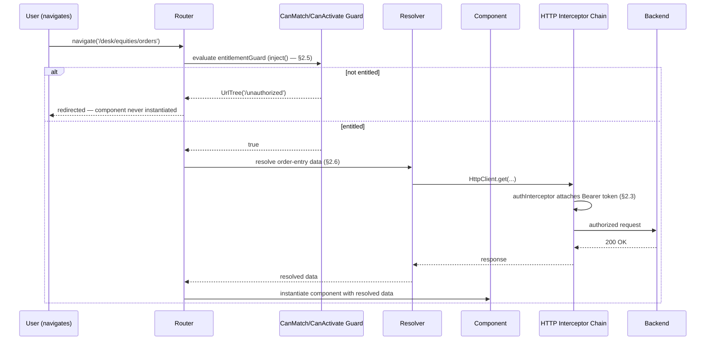

# Module 193 — Angular: Modern Application Architecture — Standalone APIs, HTTP Interceptors, Route Guards & Resolvers, Control Flow, Deferrable Views, Zoneless Change Detection, Testing & Accessibility

> Domain: Angular | Level: Beginner → Expert | Prerequisite: [[../42-Angular/01-Angular-Fundamentals-Components-DI-ChangeDetection-RxJS]] (this module's `inject()`, zoneless, and control-flow treatment extends that module's DI-tree and change-detection mechanics), [[../42-Angular/02-Advanced-Angular-StateManagement-Forms-Performance-MicroFrontends]] (Signals and the zoneless direction that module previewed are now given their actual runtime API), [[../42-Angular/03-Capstone-EnterpriseRealTimeTradingDashboard]] (this module's System Design section extends TradeView with the session/auth layer the capstone assumed but never built out), [[../41-OAuth2-OIDC-JWT-PKCE/02-Token-Lifecycle-Rotation-Revocation-Introspection-DPoP-mTLS]] (the refresh-token rotation semantics this module's central incident depends on)

>
> **Scope note — A9 gap-fill audit.** `42-Angular` was scoped and closed at three modules (156–158) on 2026-07-19. A subsequent audit — checked this course's Elite FinTech Interview Panel calibration (§A2) against real Principal/Staff Angular interview question banks and current Angular release notes — found a **term-frequency gap**: eight terms that recur constantly in senior/staff/principal-level Angular interviews at exactly this course's target firms have **zero occurrences** across all three existing files: `HttpInterceptor`/interceptor chain, `CanActivate`/route guard, resolver, `inject()`, standalone component (beyond one incidental mention), `@if`/`@for`/`@switch` control flow, `@defer`, and accessibility/a11y. Two further terms appear only as passing forward-references never developed: zoneless change detection (Module 157 §2.4 names it conceptually but never shows the actual API) and SSR/hydration (Module 158 Advanced Q9 evaluates *whether* to adopt it but never shows *how* it works or fails). This module closes that gap as a fourth file, additive to the domain per [[../00-Roadmap/README|A9]] — nothing in Modules 156–158 is touched or retrofitted.
>
> **Why this module has no §10.** Per `CLAUDE.md` §A6a (retired 2026-09-11, forward from Module 192): no new module, in any domain, authors a standalone Interview Questions section. §2 below is written to be interview-complete on its own — every mechanism, the push-back an interviewer raises against it, the judgement call it requires, and §2.14's own discriminating question, all as prose rather than a Q&A block.

---

## 1. Fundamentals

**What:** Eight capabilities that either didn't exist or hadn't matured when Modules 156–158 were written: **standalone components** and **`inject()`** (the default composition and injection model since Angular 14–19, no longer requiring `NgModule`); **functional HTTP interceptors** and **functional route guards/resolvers** (the mechanisms that actually enforce a session's security and data-readiness boundary at the frontend layer — entirely absent from this domain until now); the **new control-flow syntax** (`@if`/`@for`/`@switch`) and **`@defer`** (Angular's compiler-level replacement for `*ngIf`/`*ngFor` and for manual code-splitting); **zoneless change detection** given its actual runtime API rather than the conceptual treatment Module 157 §2.4 previewed; and **testing strategy, accessibility, and SSR/hydration** — the three concerns that determine whether a technically-correct Angular application is actually *shippable* to every user, in every locale, under audit.

**Why:** Modules 156–158 answer "does the candidate understand how Angular renders and manages state." This module answers a different, equally standard Principal/Staff-level question: "has this candidate actually operated an Angular application's *security perimeter* and *production readiness*, not just its rendering pipeline." Interceptors and guards are where a frontend either correctly propagates and protects a session or silently doesn't; `@defer`'s interaction with accessibility and SSR is exactly the kind of two-individually-correct-mechanisms-compose-incorrectly seam this domain's incidents (Modules 156 §14, 157 §4, 158 §4) have repeatedly found — and an interview panel at this course's target bar expects a candidate to name that seam before being asked about it.

**When:** Standalone components, `inject()`, the new control-flow syntax, and `@defer` are Angular's current, actively-recommended default for **any new code written today** — an `NgModule`-based, `*ngIf`/`*ngFor`-using answer in an interview is not wrong, but it signals a candidate whose Angular experience predates the current baseline. Interceptors and guards are non-negotiable for any application with an authenticated session, which every application this course's Elite FinTech Interview Panel lens assumes has. Zoneless is the emerging default for new applications and the direction every existing Zone.js-based application is expected to migrate toward. Testing/accessibility/i18n/SSR calibration is what a Principal Engineer is actually accountable for beyond their own feature work — per Module 156 §17's finding that frontend responsiveness is a production-reliability concern, accessibility and correctness-under-SSR are the same category of concern, not UX nice-to-haves.

**How (30,000-ft view):**
```
bootstrapApplication(AppComponent, {
  providers: [
    provideHttpClient(withInterceptors([authInterceptor, xsrfCheckInterceptor])),
    provideRouter(routes),          // routes carry functional guards + resolvers
    provideZonelessChangeDetection  // or provideZoneChangeDetection — Module 157 §2.4's
  ]                                  // conceptual choice, now an actual bootstrap decision
})
        │
        ▼
Route navigation ──► CanMatch/CanActivate guard (inject()-based) ──► Resolver
        │                                                          (pre-fetches data)
        ▼
Standalone Component tree
  ├─ @if / @for (mandatory track) / @switch — compiled control flow
  ├─ @defer (on viewport/interaction/idle/timer) — incremental hydration boundary
  └─ every HTTP call routed through the interceptor chain (auth header, XSRF, retry)
        │
        ▼
SSR (optional): server-rendered HTML ──► non-destructive hydration ──► client takes over
   (a hydration MISMATCH here is this module's second incident's exact mechanism)
```

---

## 2. Deep Dive

### 2.1 Standalone components — the end of `NgModule` as the default composition unit

A **standalone** component (`standalone: true`, the default since Angular 19 — the flag no longer needs to be written) declares its own dependencies directly in its `imports` array (other standalone components, directives, pipes) rather than depending on an enclosing `NgModule` to assemble them. `bootstrapApplication(RootComponent, { providers })` replaces `platformBrowserDynamic().bootstrapModule(AppModule)` as the entry point, and **providers move from `NgModule.providers` to the bootstrap call's `providers` array** (for root-level) or a route's `providers` array (for route-scoped) — the injector-tree mechanics Module 156 §2.4 established are unchanged; only *where a provider is declared* changes, not how resolution walks the tree.

**The push-back to expect: "isn't this just moving the same configuration to a different file — what does it actually fix?"** Two genuine things, not merely relocation: (1) a component's dependency list is now visible and enforced *at the component itself*, so a template using a directive that isn't imported fails to compile with a precise, local error, rather than the `NgModule` era's frequent "works because some ancestor module happened to import it" implicit coupling; (2) it removes an entire class of `NgModule`-boundary bugs this domain never previously needed to name — a component declared in one `NgModule` but not exported, or a service provided at a module boundary whose scope was determined by *which module lazy-loaded it* rather than by an explicit, local `providers` array. Standalone collapses that indirection: a component's scope is now readable from the component's own file.

### 2.2 `inject()` — the functional injection API

`inject(SomeToken)`, called during a component/directive/service's **construction context** (the constructor, a field initializer, or specific functional contexts like a route guard or an HTTP interceptor — never inside a later lifecycle hook or an async callback), resolves a dependency by walking the exact same injector tree Module 156 §2.4 described, but without requiring a constructor parameter. This matters architecturally for one specific reason: **functional guards, resolvers, and interceptors are plain functions, not classes** — they have no constructor to declare dependencies in, so `inject()` is the only way for them to participate in DI at all. This is why standalone/`inject()` and functional guards/interceptors (§2.3, §2.5) arrived together: one enabled the other.

**The judgement call this raises:** `inject()` can also be called inside a class constructor as a style choice, and some teams adopt it universally, replacing constructor-parameter injection everywhere. The trade-off is genuine, not cosmetic — constructor injection makes a class's full dependency list visible in one signature, readable by any tool or reviewer without executing the class; `inject()` calls can be scattered through field initializers, making the dependency list something you have to read the whole class body to assemble. The defensible position for a team standard: **`inject()` is required** for functional guards/resolvers/interceptors (no alternative exists), and **optional but discouraged as a constructor replacement** in classes, where the older syntax's discoverability is a genuine, not merely nostalgic, advantage.

### 2.3 Functional HTTP interceptors — the chain, ordering, and cross-cutting concern placement

An interceptor is a function `(req: HttpRequest<unknown>, next: HttpHandlerFn) => Observable<HttpEvent<unknown>>` registered via `provideHttpClient(withInterceptors([...]))`. Every outgoing `HttpClient` request passes through the registered interceptors **in the order they're listed**, each one able to inspect/clone-and-modify the request before calling `next(req)`, and inspect/transform the response (or error) flowing back before returning it — a genuine middleware chain, structurally identical to a backend API gateway's filter chain (this course's own `38-API-Gateway` domain covers the equivalent server-side pattern), now enforced at the point every one of an Angular application's HTTP calls actually originates.

**Why this is architecturally load-bearing, not merely convenient:** without a centralized interceptor, "attach the bearer token to every request" is a responsibility every component or service making an HTTP call must remember independently — an easy, silent omission with no compiler signal, structurally the same "declared responsibility, not enforced" gap Module 156 §2.4's DI-scoping bugs and Module 158's `trackBy` incident both instantiate at other layers. Centralizing token attachment, retry policy, and error normalization into one interceptor chain converts "every call site must remember" into "one function is provably on every request's path" — an architectural, not merely stylistic, correctness improvement.

```typescript
export const authInterceptor: HttpInterceptorFn = (req, next) => {
  const tokenStore = inject(TokenStore);         // functional DI — §2.2
  const token = tokenStore.accessToken();          // Signal read
  if (!token || isAuthEndpoint(req.url)) return next(req); // never attach to the token endpoint itself

  const authorizedReq = req.clone({
    setHeaders: { Authorization: `Bearer ${token}` }
  });
  return next(authorizedReq);
};
```

### 2.4 XSRF/CSRF — `HttpClient`'s built-in protection and its actual, narrower guarantee

Angular's `HttpClient` ships **double-submit-cookie CSRF protection** built in: `withXsrfConfiguration` (or the default `XSRF-TOKEN` cookie/`X-XSRF-TOKEN` header pair) reads a token value the *server* set as a readable cookie and echoes it back as a request header on every state-changing request; the server then confirms the header matches the cookie it issued. This works because a cross-origin attacker's forged form submission can *cause* the browser to send the cookie automatically, but **cannot read the cookie's value to also set the matching header** (same-origin policy) — the attack's forged request will be missing or mismatching the header and the server rejects it.

**The push-back to expect: "so Angular's HttpClient prevents CSRF automatically?"** Only for requests it actually makes, and only if the backend actually validates the header — this is a **client-side half of a protocol that requires server-side enforcement**, the same "control fired correctly, but its actual effect depends on the other side of the boundary" shape this domain's incidents keep finding. It provides zero protection for a `fetch()` call made outside `HttpClient`, for a `<form>` submitted the traditional way, or if the backend accepts the request without checking the header at all. It also provides no protection against XSS (Module 156 §2's sanitization discussion) — a successfully injected script runs same-origin and can read the cookie and forge the header itself; CSRF protection and XSS protection are independent controls addressing genuinely different attacker positions, not substitutes for each other.

### 2.5 Functional route guards — `CanActivate`/`CanMatch`/`CanDeactivate`, and what they do not protect

A guard is a function returning `boolean | UrlTree | Observable<boolean | UrlTree>`, attached to a route's `canActivate`/`canMatch`/`canDeactivate` array, evaluated by the Router before allowing (or lazy-loading, for `canMatch`) a navigation. `CanActivate` runs once a route is matched and can redirect (return a `UrlTree`) or block; `CanMatch` runs *during* route matching itself, letting the Router fall through to a different route configuration entirely — the mechanism that makes it possible to lazy-load an entitled-only feature module's *code* only for users who can actually reach it, rather than shipping the bundle and merely hiding the route.

```typescript
export const entitlementGuard: CanActivateFn = (route) => {
  const entitlements = inject(EntitlementStore);   // reads from the shell's NgRx/Signal
  const router = inject(Router);                    // store, per Module 157 §2.3/2.4
  const requiredDesk = route.data['desk'] as string;

  if (entitlements.canAccessDesk(requiredDesk)) return true;
  return router.createUrlTree(['/unauthorized']);   // redirect, not a thrown error
};
```

**The judgement call an interviewer is testing for here:** a guard is a **UX-layer gate**, not a security boundary — it prevents an unentitled user's browser from *rendering* a route, exactly as Module 157 §I10/B10's finding established for client-side NgRx state generally. A guard reading a stale or spoofable client-side entitlement snapshot and a backend that doesn't independently re-check the same entitlement on every API call is a defense-in-depth gap, not a defended perimeter — the guard's actual job is **preventing a legitimate, entitled user's browser from showing them irrelevant or unauthorized-looking UI**, and cosmetically preventing a casual, non-adversarial user from navigating somewhere unentitled; it is never the system's authoritative access-control decision, which — per Module 156 §I8/A7's governance framing and Module 158 §I7 — must always be re-verified server-side.

### 2.6 Resolvers — pre-fetching route data, and the loading-state trade-off it makes explicit

A resolver (`ResolveFn<T>`) runs after guards pass and before the route activates, fetching data the component needs and making it available via `ActivatedRoute.data` (or, in current Angular, an injected resolved-value token) — so the component never renders in a "data not yet loaded" state at all. This is a deliberate trade against component-driven fetching (the component itself calling a service in `ngOnInit` and rendering a loading skeleton): a resolver **delays the navigation** until data is ready (worse perceived responsiveness — the URL bar changes but the screen doesn't, for however long the fetch takes), while component-driven fetching **navigates immediately and renders a loading state** (better perceived responsiveness, but the component must correctly handle and render that intermediate state, and every consumer of that data must tolerate it briefly being absent).

**The generalizable rule this course's risk-tiered-investment principle (Module 156 §15) applies here directly:** use a resolver when the component genuinely cannot render anything meaningful without the data (an order-entry form that needs the instrument's current tradable status before allowing input) and the fetch is fast and reliable; use component-driven fetching with an explicit loading state for anything where partial, progressive rendering is acceptable or the fetch is slow/unreliable enough that blocking navigation on it would be a worse user experience than showing a skeleton.

### 2.7 New control flow (`@if`/`@for`/`@switch`) — compiled output, and `@for`'s mandatory `track`

`@if (cond) { ... } @else { ... }`, `@for (item of items; track item.id) { ... } @empty { ... }`, and `@switch` replace `*ngIf`/`*ngFor`/`*ngSwitch` as Angular's built-in template control-flow syntax (stable since Angular 17, the default code-generator output since 19). They are **compiled directly into Ivy instructions** (Module 156 §2.1) rather than desugaring to structural-directive syntax, which is measurably faster (no directive instantiation/host-binding overhead per iteration) and — the detail worth stating precisely in an interview — **`@for` requires a `track` expression as mandatory syntax; omitting it is a compile-time error, not a missing-but-legal input.**

**This is a direct, structural resolution of this domain's own capstone incident.** Module 158 §2.2/§4 found that `*ngFor`'s `trackBy` was an *optional* input whose absence (or index-based misuse) silently produced a stale-binding defect discoverable only under a specific reordering usage — exactly the "declared contract, unenforced" shape Module 158's synthesis (Advanced Q10) named as this domain's sharpest instance of the course-wide "declared ≠ actual" theme. `@for`'s mandatory `track` expression doesn't eliminate the *judgement* of choosing a correct, stable identity key (the same `track item.symbol`-vs-`track $index` choice, and the same failure mode if a developer still tracks by index) — but it eliminates the *omission* failure mode entirely: a developer cannot ship an `@for` block with no tracking decision made at all, the way Module 158's incident's original code silently did by inheriting an unexamined default. **The framework closed the "silently missing" half of the bug class between Module 158 being written and this module; it did not, and cannot, close the "confidently wrong" half** — `@for (item of items; track $index)` still compiles and still reproduces the exact incident for a reordering view.

### 2.8 Deferrable views (`@defer`) — triggers, blocks, and what `@defer` does not defer

`@defer (on viewport) { <heavy-widget /> } @placeholder { <div>...</div> } @loading (minimum 200ms) { <spinner /> } @error { <div>Failed to load</div> }` splits the deferred content into its own lazy-loaded JavaScript chunk, instantiated only when its trigger fires. Triggers: `on idle` (default — once the browser is idle), `on viewport` (IntersectionObserver-based), `on interaction`/`on hover` (a specific trigger element), `on timer(ms)`, `on immediate`, or a custom `when someSignal()` condition — each a genuinely different loading-priority policy, not interchangeable defaults.

**The precise thing `@defer` does *not* do, and the pitfall this creates:** `@defer` defers **bundle loading and component instantiation** — it has no relationship whatsoever to change-detection scope (Module 156 §2.2/§2.3) or to accessibility focus management. Once a deferred block's trigger fires and its content mounts, that content participates in change detection exactly like any other component tree — `@defer` is a *load-time* optimization layered underneath the *render-time* mechanics Modules 156–157 already established, entirely orthogonal to them, the same "two independently-correct mechanisms, composed without examining the seam" shape this domain's every incident has found. §14 below is a production incident that lives exactly in that seam — between `@defer`'s loading boundary and keyboard/screen-reader focus management.

### 2.9 Zoneless Angular in practice — `provideZonelessChangeDetection` and what actually migrates

Module 157 §2.4 established the *conceptual* trade (automatic-but-imprecise Zone.js coverage vs. precise-but-explicit Signal-based reactivity); this is the concrete API. `provideZonelessChangeDetection()` (in place of the implicit Zone.js bootstrap, or explicit `provideZoneChangeDetection`) removes Zone.js from the application entirely — no more monkey-patched `setTimeout`/`Promise.then`/event listeners triggering a tree-wide check candidate (Module 156 §2.2's exact mechanism). Under zoneless, a component re-renders **only** when: a Signal it reads changes, an `@Input` (still reference-compared, Module 156 §2.3) receives a new value, an event originates from its own template, or something explicitly calls `ChangeDetectorRef.markForCheck` (the `async` pipe does this internally, so it still works unchanged).

**What this genuinely breaks, and why it's not a drop-in migration:** any code — first-party or, critically, a **third-party library** — that mutates component state from *outside* Angular's own event/Signal system and expects Zone.js's blanket patching to notice (a raw `addEventListener` callback mutating a plain class property rather than a Signal, a legacy library wrapping a callback API with no Angular-aware notification) will silently stop triggering re-renders under zoneless, with no error — the component's data changed, but nothing told Angular to check it. This is precisely Module 156 §2.3's `OnPush` reference-identity gap, generalized: zoneless doesn't introduce a new failure mode, it **removes the safety net (Zone.js's blanket coverage) that was previously masking every place this exact gap already existed**, all at once, application-wide. **Migration discipline, directly extending Module 156 §A9's incremental-`OnPush` migration:** audit every state mutation site for whether it's Signal-driven or event/`@Input`-driven before flipping the bootstrap flag; `NgZone.run()` remains available as an explicit escape hatch for a third-party callback that must be wrapped rather than rewritten, but every `NgZone.run()` call is a flagged, visible admission that this one code path still depends on the old model — which is itself strictly better than Zone.js's silent, universal, unauditable coverage.

### 2.10 Testing strategy — `TestBed`, component test harnesses, and what to fake versus exercise for real

Angular's `TestBed` configures an isolated testing module/injector and instantiates a component under test with controllable providers — the mechanism every exercise in Modules 156–158 already used implicitly. Two further tools matter at Staff/Principal depth: **CDK Component Harnesses** (`ComponentHarness`, and Material's own harnesses built on it) provide a stable, implementation-detail-independent API for interacting with a component in tests — querying "the button labeled Submit" rather than a CSS selector tied to the component's current DOM structure, so a test survives a template refactor that doesn't change user-visible behavior; and **RxJS marble testing** (`TestScheduler`, already used implicitly by Module 157's Effect-testing reasoning, §I6), which lets a test express *when*, in virtual time, each value in a stream should emit — essential for correctly testing `debounceTime`/`switchMap`-based code (§2.3's interceptor retry logic, Module 157's async validators) without either sleeping in real time or asserting only final state and missing an intermediate, order-dependent bug.

**The judgement call this course's negative-test-coverage finding (Module 156 §A5) demands here specifically:** Module 158's own incident (`trackBy: index`) passed every existing test, because every existing test exercised only append/update scenarios — the gap wasn't *insufficient* testing, it was **untested behavior under a specific, unexercised usage condition** (reordering). The Staff-level testing instinct this module asks for is not "write more tests" but "for every configurable behavior with more than one legitimate mode (a `trackBy` choice, an interceptor's retry-vs-fail-fast branch, a guard's allow-vs-redirect branch), does at least one test exercise **each** mode, not just the one the original author happened to be thinking about."

### 2.11 Accessibility as a production concern, not a checklist

Angular's CDK `a11y` module (`FocusTrap`, `LiveAnnouncer`, `FocusMonitor`, `cdk-aria-describedby`) provides the primitives; the discipline is architectural. **Focus management is the primary Angular-specific accessibility concern** because Angular's own mechanisms — route navigation, `@defer` content mounting, a modal opening — change what's on screen without a full page load, which means the browser's native "focus moves to the new page" behavior never fires; **Angular must move focus explicitly, or a keyboard/screen-reader user's focus stays on a control that no longer exists or is no longer relevant**, with the assistive-technology user given no signal that anything changed. This is the mechanism behind §14's production incident.

**Why this belongs in an Elite FinTech Interview Panel-calibrated module specifically:** accessibility compliance (WCAG 2.1 AA, commonly a contractual or regulatory requirement — Section 508 for US federal-adjacent clients, the EU's European Accessibility Act for consumer-facing financial services) is exactly the kind of production-systems weight this course's panel lens (§A2) names — an inaccessible order-entry flow at a firm serving retail or institutional clients under such a mandate is a compliance finding, not merely a UX gap, the identical "production system carries regulatory weight beyond its functional correctness" framing this course has applied to every backend domain, now stated for the frontend.

### 2.12 Internationalization — build-time vs. runtime translation, and the trade-off for a multi-region platform

Angular's first-party i18n (`$localize`, extracted `.xlf`/`.json` translation files) is **build-time**: each locale produces a separate, fully-translated application build, selected at deploy/serve time (by subdomain, path prefix, or server-side negotiation) — zero runtime translation-lookup cost, but **N locales means N separate build artifacts to build, test, and deploy**, and switching a user's locale requires a full page reload against a different build. Runtime i18n libraries (`ngx-translate` and equivalents) load translation JSON and substitute strings client-side at render time — one build serves every locale, and locale can switch without a reload, at the cost of a translation-lookup layer that bypasses Angular's own compiled-template optimization and a real risk of missing-key fallback bugs shipping unnoticed to production (a string silently rendering its own translation key instead of translated text is this concern's own "silent, non-erroring wrongness" instance, structurally the same class Module 158 §I10 examined for `trackBy`).

**The calibration this course's risk-tiered principle gives for choosing between them:** a platform serving a small, known set of locales with infrequent, deploy-time-acceptable translation updates (this course's Elite FinTech lens' typical enterprise trading/back-office platform, serving specific desks in specific jurisdictions) fits build-time i18n's cost profile well; a platform where end users self-select their locale at runtime and translations update independently of application releases (a consumer-facing payments product) needs runtime i18n's flexibility and should invest in automated missing-key detection (a CI check failing the build on any translation key present in the base locale but absent from another) specifically to close the silent-fallback risk.

### 2.13 SSR and hydration — non-destructive hydration, and the mismatch failure mode

Angular Universal renders the initial page server-side, returning fully-formed HTML on first response (faster perceived load, functional SEO/crawlability — Module 158 §A9's exact reasoning for why TradeView, an internal session-long tool, correctly declined this investment). Current Angular's **non-destructive hydration** then re-uses that server-rendered DOM directly on the client — attaching event listeners and Angular's internal state to the *existing* DOM nodes rather than the older "destroy and re-render from scratch" hydration model, which avoided a visible flash/layout-shift on every SSR'd page load.

**The mismatch failure mode this depends on, and why it's this module's structurally cleanest instance of the composition-risk theme:** non-destructive hydration's entire premise is that the DOM the server rendered and the DOM the client *would* render, given the same component inputs, are **identical** — hydration's job is attaching behavior to existing nodes, not reconciling differences. Anything that makes server-rendered output genuinely differ from client-rendered output for the *same* inputs — `Date.now()`/`Math.random()` used directly in a template, a locale/timezone difference between the server's environment and the client browser's, a `@defer`d block whose server-side behavior (§2.8's interaction with SSR: a deferred block does *not* render its deferred content server-side by default, only its `@placeholder`) — produces a **hydration mismatch**: Angular detects the DOM it expected doesn't match what's actually there, and either logs a dev-mode warning and re-renders that subtree from scratch (the exact flash non-destructive hydration exists to avoid, now reintroduced for precisely the mismatched portion) or, worse in a production build with warnings suppressed, silently leaves stale server-rendered content on screen until the next unrelated change-detection pass touches it — a genuinely invisible, non-erroring wrongness window, structurally identical in shape (though different in mechanism) to Module 158's `trackBy` incident: individually-correct server rendering and individually-correct client rendering, composed without examining whether their outputs are actually guaranteed identical.

### 2.14 The Discriminating Question

> **"Your team adds a `@defer (on viewport)` block wrapping a heavy compliance-disclosure widget on an SSR'd, authenticated page. Two weeks after shipping, a user files an accessibility complaint that they couldn't complete a required action. Walk me through every place in this stack that's a plausible cause, in the order you'd check them."**

A **Senior** answer checks whether the widget itself has an accessibility bug — a missing ARIA label, insufficient contrast — treating this as a component-level defect.

A **Staff** answer starts one layer up, at the **seams between independently-correct mechanisms** this module has traced repeatedly: first, whether `@defer`'s trigger (`on viewport`) ever fires for a keyboard-only user who tabs to controls rather than scrolling with a mouse — an `IntersectionObserver`-based trigger is scroll/visibility-driven and has no inherent relationship to keyboard focus order, so a keyboard user could tab *past* where the deferred content will eventually mount without ever triggering it (§2.8); second, whether — if it *does* mount — focus is programmatically moved into it or announced via `LiveAnnouncer` (§2.11), since neither `@defer` nor Angular's router does this automatically; third, whether the disclosure was even present in the SSR output for a screen-reader user relying on server-rendered content before client JS finishes hydrating, given `@defer` content doesn't render server-side by default (§2.13); and only *after* eliminating all three composition-layer causes does it drop to checking the widget's own internal accessibility markup.

It separates reliably because the Senior answer, if lucky, fixes the widget and the complaint recurs — the actual defect lives in the boundary between three individually-shippable, individually-tested mechanisms (`@defer`'s trigger model, focus management, SSR's deferred-content behavior), none of which any single component-level accessibility audit would have caught.

**The generalization to carry out of this module, and out of this domain's full four-module arc:** every mechanism in Modules 156–158 and this module was, individually, built and shipped correctly — Zone.js's triggering, `OnPush`'s reference check, Module Federation's shared-dependency negotiation, `trackBy`'s identity contract, and now `@defer`'s loading boundary, focus management, and SSR's hydration contract. **Not one of this domain's four production incidents lived inside a single mechanism.** Every one lived in an examined-too-late seam between two or three mechanisms that each worked exactly as designed. A Principal-level Angular engineer's actual job, this domain's full arc has now demonstrated four separate times, in four structurally different technical areas, is asking "what happens where these meet" *before* shipping — not re-verifying that each piece, in isolation, still works.

---

## 3. Visual Architecture

### Route navigation — the full guard/resolver/interceptor pipeline



### Single-flight token refresh — this module's §4 incident, and its fix

```
WITHOUT single-flight coordination (the incident):

  Grid component ──401──┐
  Order form     ──401──┼──► THREE independent refresh calls fired concurrently
  Risk panel      ──401──┘        against a SINGLE-USE rotating refresh token
                                   (Module 154 §2 — rotation)
                                        │
                              first refresh call: succeeds, rotates the token
                              second + third:      REJECTED — token already
                                                    rotated out from under them
                                        │
                              two of three original requests never recover ──► forced logout

WITH single-flight coordination (§4's fix, §11 Hard exercise):

  Grid component ──401──┐
  Order form     ──401──┼──► RefreshCoordinator.refresh$ (shareReplay(1))
  Risk panel      ──401──┘         │
                          first 401 SUBSCRIBES and triggers the actual call
                          second/third 401s SUBSCRIBE to the SAME in-flight
                          Observable — no second call fires
                                        │
                              ONE refresh call, ONE rotation
                                        │
                          all three original requests retry ONCE with the
                          new token after the shared Observable emits
```

### `@defer` lifecycle and the accessibility seam (§14's incident)

```
@defer (on viewport) {              trigger fires (IntersectionObserver) ──► @loading shown
  <compliance-disclosure />           (min 200ms, avoids flash-of-spinner)
}                                             │
@placeholder { <div>...</div> }              ▼
@loading (minimum 200ms) { ... }    content mounts, participates in normal
@error { ... }                      change detection from here on (§2.8)
                                              │
                          ⚠ NOTHING in this pipeline moves keyboard focus
                            or calls LiveAnnouncer — that is an EXPLICIT,
                            separate responsibility (§2.11), and its
                            absence is invisible to every test that
                            only checks "did the content render"
```

---

## 4. Production Example

**Problem:** TradeView (Module 158's capstone platform) added session-based authentication with short-lived (10-minute) access tokens and single-use, rotating refresh tokens — the exact rotation semantics Module 154 §2 establishes for exactly this reason (limiting a stolen refresh token's usable window). A functional `authInterceptor` attached the current access token to every outgoing request and, on a `401`, called the token endpoint to refresh.

**Architecture:** Every desk's grid, order-entry form, and risk panel independently issue their own `HttpClient` calls on their own polling/refresh cadences, all passing through the same shared `authInterceptor` (§2.3) — correct centralization, exactly as this section recommends.

**Implementation / What happened:** The interceptor's first version called the refresh endpoint directly, inline, on every `401` it observed:

```typescript
// THE DEFECT — every interceptor invocation refreshes independently:
export const authInterceptor: HttpInterceptorFn = (req, next) => {
  const tokenStore = inject(TokenStore);
  return next(attachToken(req, tokenStore.accessToken())).pipe(
    catchError(err => {
      if (err.status === 401) {
        return authService.refreshToken().pipe(  // NO coordination across
          switchMap(newToken => {                 // concurrent callers
            tokenStore.setAccessToken(newToken);
            return next(attachToken(req, newToken));
          })
        );
      }
      return throwError(() => err);
    })
  );
};
```

At exactly the 10-minute access-token boundary, a trader with all three widgets open generated three near-simultaneous requests, all three hitting `401` within the same tens-of-milliseconds window. Each independently called `refreshToken()`. Because the refresh token was **single-use and rotating** (Module 154 §2's rotation-detection design, intended to flag replay attacks), the *first* refresh call's response correctly issued a new token pair and invalidated the old refresh token — and the *second and third* concurrent refresh calls, still using the now-invalidated refresh token, were correctly rejected by the authorization server as a **reuse-detection event**, which — per Module 154's own rotation-family design — is treated as a possible-compromise signal and revokes the *entire token family*, forcibly ending the session. A trader mid-session, doing nothing wrong, was logged out at an unpredictable moment determined entirely by how many widgets happened to have in-flight requests at the ten-minute mark.

**Trade-offs:** The interceptor's own logic was individually correct — it genuinely did detect a `401` and genuinely did attempt to refresh, exactly as designed. The refresh-token rotation-detection logic on the authorization-server side was also individually correct, and *by design* — reuse detection revoking the family is the intended defense against a stolen, replayed refresh token. **Neither side was wrong. The defect lived entirely in the client never coordinating concurrent refresh attempts**, causing its own legitimate, near-simultaneous requests to trigger the exact reuse-detection signal the server-side control was built to catch actual attackers with.

**Lessons learned:** A single-use, rotating credential (refresh tokens here; this generalizes to any idempotency-key-adjacent, once-only resource) requires the **consuming client** to guarantee single-flight usage, not merely correct usage — "correct" and "coordinated" are separate properties, and this incident's interceptor had the first without the second. §11's Hard exercise and §13 build the fix: a shared, `shareReplay`-backed refresh Observable every concurrent `401` handler subscribes to instead of independently triggering, the identical RxJS multicast-coordination primitive Module 157 §2.6's `shareReplay({ refCount: true })` used for a different purpose (Module 157 §14's own, distinct incident) — the same operator, misconfigured differently, at two different layers of this same domain's platform.

---

## 11. Coding Exercises

### Easy — Functional interceptor reading from a Signal-based token store

**Problem:** Implement `TokenStore` as a Signal-backed service and the `authInterceptor` that reads from it, skipping attachment for the token endpoint itself (avoiding an infinite loop where the refresh call tries to attach an already-invalid token to itself).

**Solution (TypeScript):**
```typescript
@Injectable({ providedIn: 'root' })
export class TokenStore {
  private readonly _accessToken = signal<string | null>(null);
  readonly accessToken = this._accessToken.asReadonly();

  setAccessToken(token: string): void { this._accessToken.set(token); }
  clear(): void { this._accessToken.set(null); }
}

const AUTH_ENDPOINT = '/api/auth/token';

export const authInterceptor: HttpInterceptorFn = (req, next) => {
  const tokenStore = inject(TokenStore);
  const token = tokenStore.accessToken();

  if (!token || req.url.includes(AUTH_ENDPOINT)) return next(req); // avoid attaching to the token endpoint itself

  return next(req.clone({ setHeaders: { Authorization: `Bearer ${token}` } }));
};
```
**Time complexity:** O(1) per request. **Space complexity:** O(1).

**Optimized solution:** For an application with multiple backend origins (only some of which should receive the token — a third-party market-data widget's own origin should not), replace the single `AUTH_ENDPOINT` string check with an explicit, centrally-maintained allowlist of origins the token is attached to, avoiding an accidental credential leak to a third-party API the interceptor wasn't meant to cover.

### Medium — Functional guard composed with an entitlement-checking resolver

**Problem:** Implement `entitlementGuard` (§2.5) and a companion resolver that pre-fetches the desk's order-entry reference data only once the guard has already confirmed entitlement — avoiding an unnecessary fetch for a user who will be redirected anyway.

**Solution (TypeScript):**
```typescript
export const entitlementGuard: CanActivateFn = (route) => {
  const entitlements = inject(EntitlementStore);
  const router = inject(Router);
  const desk = route.data['desk'] as string;
  return entitlements.canAccessDesk(desk) || router.createUrlTree(['/unauthorized']);
};

export const orderEntryReferenceDataResolver: ResolveFn<ReferenceData> = (route) => {
  const api = inject(ReferenceDataService);
  const desk = route.data['desk'] as string;
  return api.fetchReferenceData(desk); // only ever called AFTER the guard has already passed
};

export const routes: Routes = [
  {
    path: 'desk/:deskId/orders',
    canActivate: [entitlementGuard],           // evaluated FIRST
    resolve: { referenceData: orderEntryReferenceDataResolver }, // only runs if the guard allowed navigation
    data: { desk: 'equities' },
    loadComponent: () => import('./order-entry.component').then(m => m.OrderEntryComponent)
  }
];
```
**Time complexity:** O(1) guard check (Signal/Store read); resolver cost bounded by the reference-data fetch. **Space complexity:** O(1).

**Optimized solution:** Combine with `canMatch` instead of `canActivate` for the entitlement check specifically when the route's own lazy-loaded bundle is large — `canMatch` prevents the Router from even loading the component's JavaScript chunk for an unentitled user, rather than loading it and then redirecting away, a real bandwidth/parse-cost saving for a large, desk-specific feature module.

### Hard — Single-flight refresh interceptor (the fix for §4's incident)

**Problem:** Implement the `RefreshCoordinator` and corrected `authInterceptor` that fixes §4's thundering-herd incident — concurrent `401`s must share exactly one in-flight refresh call.

**Solution (TypeScript):**
```typescript
@Injectable({ providedIn: 'root' })
export class RefreshCoordinator {
  private refreshInFlight$: Observable<string> | null = null;

  refresh(authService: AuthService, tokenStore: TokenStore): Observable<string> {
    // If a refresh is already in flight, every concurrent caller subscribes
    // to the SAME Observable instead of triggering a second rotation — the
    // exact fix for §4's reuse-detection-triggered forced logout.
    if (this.refreshInFlight$) return this.refreshInFlight$;

    this.refreshInFlight$ = authService.refreshToken().pipe(
      tap(newToken => tokenStore.setAccessToken(newToken)),
      finalize(() => { this.refreshInFlight$ = null; }), // clear AFTER completion/error, win or lose
      shareReplay({ bufferSize: 1, refCount: false })     // refCount:false — §14/Module157's own
    );                                                     // reconnection-race lesson applied deliberately
    return this.refreshInFlight$;
  }
}

export const authInterceptor: HttpInterceptorFn = (req, next) => {
  const tokenStore = inject(TokenStore);
  const coordinator = inject(RefreshCoordinator);
  const authService = inject(AuthService);
  const alreadyRetried = req.headers.has('X-Retry-After-Refresh'); // at-most-one-retry guard

  return next(attachToken(req, tokenStore.accessToken())).pipe(
    catchError(err => {
      if (err.status !== 401 || alreadyRetried) return throwError(() => err); // non-retryable classification

      return coordinator.refresh(authService, tokenStore).pipe(
        switchMap(newToken =>
          next(attachToken(req, newToken).clone({ setHeaders: { 'X-Retry-After-Refresh': 'true' } }))
        )
      );
    })
  );
};
```
**Time complexity:** O(1) per request beyond the shared refresh call itself. **Space complexity:** O(1) — one shared in-flight reference regardless of concurrent caller count.

**Optimized solution:** Add an explicit circuit breaker around `RefreshCoordinator.refresh` — if the refresh call itself fails (not merely races) more than once within a short window, stop retrying and force an explicit re-login instead of looping, directly reusing the circuit-breaker pattern Module 157 §A5 applied to a different runaway-retry risk.

### Expert — Cross-tab session sync, extending the Hard exercise

**Problem:** TradeView users routinely have multiple browser tabs open against the same session. Extend the Hard exercise's `RefreshCoordinator` so a refresh triggered in one tab is observed by every other open tab (avoiding *each tab* independently thundering-herding, the identical incident at a wider scope), and so a logout in one tab propagates to all.

**Solution (TypeScript):**
```typescript
@Injectable({ providedIn: 'root' })
export class CrossTabSessionSync {
  private readonly channel = new BroadcastChannel('tradeview-session');

  constructor(private tokenStore: TokenStore, private router: Router) {
    this.channel.onmessage = (event: MessageEvent<SessionSyncMessage>) => {
      switch (event.data.type) {
        case 'TOKEN_REFRESHED':
          // Another tab already refreshed — adopt its token rather than
          // this tab ALSO calling refresh (the incident, now at cross-tab scope).
          this.tokenStore.setAccessToken(event.data.token);
          break;
        case 'LOGGED_OUT':
          this.tokenStore.clear();
          this.router.navigate(['/login']); // propagate logout to every tab
          break;
      }
    };
  }

  broadcastRefresh(token: string): void {
    this.channel.postMessage({ type: 'TOKEN_REFRESHED', token } satisfies SessionSyncMessage);
  }

  broadcastLogout(): void {
    this.channel.postMessage({ type: 'LOGGED_OUT' } satisfies SessionSyncMessage);
  }
}

type SessionSyncMessage =
  | { type: 'TOKEN_REFRESHED'; token: string }
  | { type: 'LOGGED_OUT' };

// RefreshCoordinator.refresh's tap() callback additionally calls
// crossTabSync.broadcastRefresh(newToken) — one line, composing directly
// onto the Hard exercise rather than replacing it.
```
**Time complexity:** O(1) per broadcast; O(t) delivery cost across t open tabs (browser-internal, not application-controlled). **Space complexity:** O(1) per tab.

**Optimized solution:** For a token store that must also survive a page reload (not just cross-tab), pair `BroadcastChannel` (live cross-tab sync while tabs are open) with a `storage` event listener against a value written to `sessionStorage`/`localStorage` (fired for tabs that were backgrounded when the `BroadcastChannel` message was sent) — the two mechanisms are complementary, not redundant, the same two-independent-levers shape Module 156 §I7 established for change-detection cost, now applied to session-sync delivery guarantees.

---

## 12. System Design — Designing TradeView's Session & Authentication Layer

*Authored to the four-step standard (`CLAUDE.md` §A7). Extends Module 158's capstone platform, which assumed authenticated sessions existed without specifying how; where a step would restate §4 (the thundering-herd incident) or §13 (the coordinator's internals), it states the decision and cross-references instead.*

---

### Step 1 — Understand the Problem and Establish Design Scope

#### The dialogue

> **I:** TradeView needs an authentication and session layer on the frontend. Design it.
>
> **C:** Is the identity provider and token issuance already built — am I designing the frontend's consumption of an existing OAuth2/OIDC authorization server, or the server side too?
> **I:** The authorization server exists — Module 154's token-lifecycle design. You're designing how the Angular frontend acquires, holds, refreshes, and propagates tokens.
>
> **C:** Single region, or does a trader's session need to survive a regional failover?
> **I:** Single region for now; assume failover is out of scope.
>
> **C:** How long is a session expected to last, and how many tabs does a real user typically have open?
> **I:** A full trading day, eight-plus hours. Two to five tabs is typical; treat that as the common case, not an edge case.
>
> **C:** Where should the access token live — memory, `sessionStorage`, an httpOnly cookie?
> **I:** What would you propose, and why?
>
> **C:** httpOnly cookie for the refresh token specifically — it's the long-lived, high-value credential, and httpOnly means client-side JavaScript, including an XSS payload, can never read it, only the browser can send it. The access token is short-lived and needs to be read by the interceptor to set the `Authorization` header, so it has to be JavaScript-readable — I'd hold it in memory (a Signal, not `localStorage`), accepting that a hard page reload loses it and requires a silent-refresh round-trip using the httpOnly refresh cookie to get a new one, rather than persisting the access token itself anywhere JavaScript-readable.
> **I:** Agreed — that's the standard defense-in-depth split. Given multiple tabs, does each tab need its own refresh cycle?
>
> **C:** No — and that's actually this design's central risk, not an afterthought. If the refresh token rotates on use (Module 154 §2), multiple tabs independently refreshing at the same expiry boundary will thundering-herd and trip reuse detection, forcibly ending the session — that's a concrete incident this platform has already had (§4). So cross-tab coordination isn't a nice-to-have, it's required correctness.
> **I:** What's out of scope?
>
> **C:** Mobile app token storage (different platform, different threat model), step-up authentication for high-value actions (WebAuthn/passkey re-verification before a large order), and multi-region failover.

Three answers carry the design:

1. **"httpOnly cookie for the refresh token, in-memory Signal for the access token"** fixes the storage architecture before anything else — it determines what the interceptor can and cannot read, and it's the standard defense against an XSS payload exfiltrating the long-lived credential.
2. **"Two to five tabs is the common case, not an edge case"** makes cross-tab coordination (§11's Expert exercise) a first-class requirement, not a later hardening pass — the exact framing gap that produced §4's original incident.
3. **"The refresh token rotates on use"** (inherited from Module 154) is the hard constraint that makes single-flight coordination (§13) mandatory rather than a nice-to-have optimization.

#### Functional requirements

1. Acquire an access/refresh token pair via the existing OAuth2 authorization-code-with-PKCE flow (Module 153).
2. Attach the current access token to every outgoing API request automatically.
3. Silently refresh an expired access token without interrupting the user's in-progress action.
4. Coordinate refresh across every concurrently open tab so exactly one refresh call occurs per rotation cycle, regardless of tab count.
5. Propagate logout (user-initiated or forced, e.g. reuse-detection revocation) to every open tab.
6. Force a full re-authentication if refresh itself fails irrecoverably (expired refresh token, revoked family).

#### Non-functional requirements

| Requirement | Target | Why this number |
|---|---|---|
| Refresh latency, user-visible | Zero — must be invisible mid-action | A trader submitting an order must never see an auth interruption |
| Refresh calls per rotation boundary, per session | **Exactly one**, regardless of open-tab count | §4's incident is caused by more than one |
| Logout propagation latency, cross-tab | < 1s | A revoked session visible in one tab but still "live" in another is a real security gap |
| Session duration | 8+ hours continuous use | Full trading day, per the dialogue |
| Availability of the refresh path | As high as the rest of the platform | A refresh failure forcibly ends every open tab's session simultaneously |

#### Back-of-the-envelope estimation

```
CONCURRENT USERS                 ~500 (TradeView's five-desk platform, Module 158)
TABS PER USER (typical)          2-5   → ~1,500 open tabs at any moment
ACCESS TOKEN LIFETIME            10 minutes
REFRESH EVENTS, naive (no coordination):
   500 users × ~3 tabs × 1 refresh attempt / 10 min = ~150 refresh calls / 10 min ≈ 0.25/s
   — trivially low absolute load on the auth server
REFRESH EVENTS, coordinated (this design):
   500 users × 1 refresh attempt / 10 min           = ~50 refresh calls / 10 min  ≈ 0.08/s
```

#### What the numbers tell us

**This is never a throughput problem — 0.25 refresh calls/second would not stress any real authorization server.** The entire design driver is **correctness under concurrency**, not load: the naive, uncoordinated path doesn't fail because the auth server can't keep up, it fails because **the refresh token's single-use rotation semantics make more-than-one-concurrent-attempt actively harmful**, not merely wasteful. This is the same "10 TPS ⇒ correctness, not throughput, is the driver" framing this course's System Design domain (Module 178, per `CLAUDE.md` §A7) established for payment idempotency — restated here at the frontend session layer.

---

### Step 2 — Propose High-Level Design and Get Buy-In

#### Component glossary

| Component | Responsibility |
|---|---|
| **`TokenStore`** | In-memory Signal holding the current access token; the single source every interceptor/guard reads from (§11 Easy) |
| **`authInterceptor`** | Attaches the access token to every request; on 401, delegates to `RefreshCoordinator` rather than refreshing itself (§2.3, §11 Hard) |
| **`RefreshCoordinator`** | Single-flight in-tab coordination — collapses concurrent 401s into one refresh call (§13, §11 Hard) |
| **`CrossTabSessionSync`** | `BroadcastChannel`-based propagation of a successful refresh or a logout to every other open tab (§11 Expert) |
| **`entitlementGuard`** | Route-level gate reading the (server-issued, not client-derived) entitlement claims from the current session (§2.5) |
| **Authorization Server** | Module 153/154's existing OAuth2/OIDC service — issues, rotates, and revokes token families; out of scope to redesign here |

#### Architecture

```
┌─────────────────────────────────────────────────────────────┐
│ Tab 1                          Tab 2                          │
│ ┌─────────────┐               ┌─────────────┐                │
│ │ TokenStore  │◄─────sync─────┤ TokenStore  │                │
│ │(in-memory)  │  BroadcastChannel│(in-memory)│                │
│ └──────┬──────┘               └──────┬──────┘                │
│        │ authInterceptor             │ authInterceptor        │
│        ▼                             ▼                        │
│ RefreshCoordinator            RefreshCoordinator               │
│  (single-flight, THIS tab only — cross-tab handled by sync)    │
└────────┬───────────────────────────────┬─────────────────────┘
         │ Authorization: Bearer <token>  │
         ▼                                ▼
              Authorization Server (Module 153/154)
         httpOnly refresh-token cookie — never read by JS
```

#### End-to-end walkthrough — an access token expiring mid-session

1. Trader has Tabs 1 and 2 open; access token expires at the 10-minute boundary.
2. Tab 1's grid component's in-flight request returns `401`.
3. Tab 1's `authInterceptor` catches it, calls `RefreshCoordinator.refresh()`.
4. No refresh is currently in flight in Tab 1 → `RefreshCoordinator` calls the authorization server's token endpoint (using the httpOnly refresh cookie, sent automatically by the browser).
5. Authorization server rotates the refresh token, returns a new access token.
6. Tab 1's `TokenStore` updates; `CrossTabSessionSync.broadcastRefresh(newToken)` fires.
7. Tab 2, which has *not yet* hit a 401 itself, receives the broadcast and updates its own `TokenStore` proactively — so when Tab 2's own next request goes out, it already carries the new token and never has to 401-and-refresh at all.
8. Tab 1's original failed request retries once (§11 Hard's `X-Retry-After-Refresh` guard) with the new token and succeeds.

#### Data model — the client-side session state

| Field | Type | Description |
|---|---|---|
| `accessToken` | `string \| null` | In `TokenStore` only — never persisted to any storage API |
| `refreshInFlight` | `Observable<string> \| null` | `RefreshCoordinator`'s internal single-flight marker — never exposed outside the coordinator |
| `sessionStatus` | `'ACTIVE' \| 'REFRESHING' \| 'EXPIRED' \| 'REVOKED'` | Drives guard/UI decisions; `REVOKED` is terminal and only cleared by a fresh login |

**Status lifecycle:** `ACTIVE → REFRESHING → ACTIVE` (the common, successful path) `| ACTIVE → REFRESHING → EXPIRED` (refresh call itself failed — force re-login) `| ACTIVE → REVOKED` (reuse-detection or explicit logout — force re-login, propagated cross-tab, §11 Expert).

---

### Step 3 — Design Deep Dive

**Single-flight refresh coordination** is this design's central mechanism — fully developed in §4 (the incident) and §13 (the LLD); this step states the decision rather than repeating it: collapse concurrent 401s within a tab via a `shareReplay`-backed shared Observable, and collapse concurrent refreshes *across* tabs via `BroadcastChannel` propagation of the successful result (§11 Expert), so that **the entire multi-tab session produces at most one actual refresh call per rotation boundary**, regardless of how many tabs or in-flight requests exist at that moment.

**Retry classification.** A `401` after a successful refresh retry is **non-retryable** — it means the retried request is *still* unauthorized even with a fresh token (a genuinely revoked session, not a transient expiry), and the `X-Retry-After-Refresh` header (§11 Hard) is the explicit, at-most-once guard preventing an infinite refresh-retry-401-refresh loop. Any other HTTP error class (5xx, network failure) is handled by the ordinary retry-with-backoff policy this course's backend domains already establish (Module 20/36's retry-strategy vocabulary), entirely independent of the token-refresh path.

**Logout propagation and its own race.** A `LOGGED_OUT` broadcast (§11 Expert) must be treated as **higher priority than any concurrent `TOKEN_REFRESHED` broadcast** — if a reuse-detection revocation and a legitimate refresh are somehow in flight at the same moment (a narrow but real race given cross-tab timing), a tab that applies a stale `TOKEN_REFRESHED` message *after* already having received `LOGGED_OUT` must not un-revoke itself. `CrossTabSessionSync` enforces this with a monotonically increasing sequence number on every broadcast message, discarding any `TOKEN_REFRESHED` whose sequence number is lower than the last-seen `LOGGED_OUT`'s.

**Security boundary, restated precisely.** Every mechanism in this design — the interceptor, the coordinator, the guard — is a **UX and correctness layer**, not the authorization boundary itself (§2.4's XSRF finding and §2.5's guard finding both apply here identically): the authorization server's own validation of every incoming request's token, independent of anything this frontend design does, remains the sole authoritative access-control decision, exactly as Module 156 §I8 and Module 158 §I7 established for this domain's every prior security-adjacent design.

---

### Step 4 — Wrap-Up

**What this design does not cover, and would be the natural next questions:** step-up authentication (requiring a fresh WebAuthn/passkey assertion before a high-value action like submitting a large order, independent of the ambient session's validity); multi-region failover behavior for the authorization server itself; mobile-app-specific token storage (secure enclave / keychain rather than any browser API this design assumes); monitoring and alerting on an abnormal refresh-failure or reuse-detection rate specifically (a spike would indicate either a client-side coordination defect recurring, or a genuine credential-theft attempt, and distinguishing the two requires dedicated instrumentation this design doesn't specify); and session-fixation/concurrent-device-limit policy (should the same account be allowed an unbounded number of simultaneously active token families, or does compliance require capping and surfacing "signed in elsewhere" to the user).

**Closing summary diagram:** see the architecture diagram in Step 2 — the four client-side components (`TokenStore`, `authInterceptor`, `RefreshCoordinator`, `CrossTabSessionSync`) working together to guarantee the platform-wide invariant this whole design exists to protect: **at most one refresh call per rotation boundary, regardless of tab count**, with every other correctness property (retry-once, revocation propagation, sequence-ordered messages) existing to make that one invariant hold under every real concurrency condition rather than only the common case.

#### References

1. Angular — `HttpClient` interceptors: https://angular.dev/guide/http/interceptors
2. Angular — Functional route guards and resolvers: https://angular.dev/guide/routing/common-router-tasks
3. Angular — Deferrable views (`@defer`): https://angular.dev/guide/templates/defer
4. Angular — Hydration: https://angular.dev/guide/hydration
5. Angular — Zoneless change detection: https://angular.dev/guide/zoneless
6. IETF — OAuth 2.0 Security Best Current Practice (refresh token rotation/reuse detection): draft-ietf-oauth-security-topics
7. MDN — `BroadcastChannel` API: developer.mozilla.org/en-US/docs/Web/API/BroadcastChannel
8. OWASP — CSRF Prevention Cheat Sheet (double-submit cookie pattern, §2.4)
9. W3C — Web Content Accessibility Guidelines (WCAG) 2.1
10. This course: Module 154 (refresh-token rotation, DPoP/mTLS), Module 156 §2.2–2.4 (Zone.js, `OnPush`, DI), Module 157 §2.6/§14 (`shareReplay`/`refCount`), Module 158 §2.2/§4 (`trackBy`, composition-risk incidents)

---

## 13. Low-Level Design — The Single-Flight Refresh Coordinator

**Requirements:** Collapse N concurrent `401` responses (within one tab) into exactly one refresh call; propagate the result to every other open tab without each independently refreshing; classify a post-refresh `401` as non-retryable rather than looping.

**Class diagram (textual):**
```
TokenStore (providedIn: 'root' — true singleton per tab, §Module156-2.4)
 └─ accessToken: Signal<string | null>

RefreshCoordinator (providedIn: 'root')
 ├─ refreshInFlight$: Observable<string> | null  — the single-flight marker
 └─ refresh(): Observable<string>
       returns the EXISTING in-flight Observable if one is active,
       otherwise creates one via shareReplay({ refCount: false })

CrossTabSessionSync (providedIn: 'root')
 ├─ channel: BroadcastChannel
 ├─ broadcastRefresh(token, seq)
 └─ broadcastLogout(seq)

authInterceptor (functional, HttpInterceptorFn)
 └─ injects TokenStore + RefreshCoordinator — NEVER calls the token
    endpoint directly; every refresh request routes through the
    coordinator, exactly the "one function provably on every request's
    path" discipline §2.3 establishes
```

**Sequence diagram — three concurrent 401s, one refresh call:**
```
Grid    ──401──► authInterceptor ──► RefreshCoordinator.refresh()
Form    ──401──► authInterceptor ──► RefreshCoordinator.refresh()  ┐ all three SUBSCRIBE
Risk    ──401──► authInterceptor ──► RefreshCoordinator.refresh()  ┘ to the SAME Observable

RefreshCoordinator ──(first subscription only)──► AuthService.refreshToken()
AuthService ──► Authorization Server: rotate token
Authorization Server ──► AuthService: new access token
AuthService ──► RefreshCoordinator: emit newToken (shareReplay multicasts to all 3 subscribers)
RefreshCoordinator ──► Grid/Form/Risk interceptors: each retries ONCE with newToken
```

**Design patterns used:** **Proxy/Mediator** — `RefreshCoordinator` sits between every interceptor invocation and the actual refresh call, mediating so callers never talk to the authorization server directly during a refresh; **Observer** — RxJS's multicast `shareReplay` is the mechanism the mediation is built on; **Chain of Responsibility** — the interceptor chain itself (§2.3), with `authInterceptor` as one link; **Strategy** — the retry-vs-fail-fast branch on `401` classification is a swappable policy, not hardcoded inline.

**SOLID mapping:** SRP — `TokenStore` only holds state, `RefreshCoordinator` only coordinates concurrency, `authInterceptor` only wires the two together per request, each independently testable in isolation; OCP — a new cross-cutting concern (request logging, a correlation-ID header) is a new interceptor appended to the chain, requiring no change to `authInterceptor` itself; DIP — the interceptor depends on `RefreshCoordinator`'s abstraction, never on the authorization server's HTTP contract directly, so the coordinator's internals (which shareReplay configuration, which broadcast mechanism) can change without touching call sites.

**Concurrency/thread safety:** JavaScript's single-threaded execution model means `RefreshCoordinator.refreshInFlight$`'s check-then-set (`if (this.refreshInFlight$) return...; this.refreshInFlight$ = ...`) cannot be preempted mid-check by another synchronous caller — but this only holds *within one tab's own event loop*; the cross-tab race (§Step 3's logout-vs-refresh ordering) is genuine and requires the explicit sequence-number discipline described there, because `BroadcastChannel` delivery order across tabs is not guaranteed to match send order under all browser/OS scheduling conditions.

**Extensibility:** The identical single-flight pattern applies to any other single-use-per-call, expensive, concurrently-requested resource this platform might introduce — a WebSocket reconnection handshake, a feature-flag-configuration fetch on cold start — by substituting the coordinated operation inside the same `shareReplay`-based shape `RefreshCoordinator` establishes.

---

## 14. Production Debugging

**Incident:** Three weeks after shipping the `@defer (on viewport)`-wrapped compliance-disclosure widget (§2.8, §2.14) on an order-entry page, a screen-reader-using compliance officer files a complaint: submitting certain large orders silently fails to enable the submit button, with no visible error.

**Root cause:** The disclosure widget contained a mandatory "I acknowledge the regulatory disclosure" checkbox the submit button's `disabled` binding depends on. The widget was wrapped in `@defer (on viewport)` for load-time performance (§2.8) — a decision made entirely independently of, and by a different engineer than, the accessibility review that had previously verified the *always-rendered* version of this same checkbox correctly received focus and was announced. For a sighted mouse user, scrolling the order form into view naturally triggered the `IntersectionObserver`-based `on viewport` trigger, so the widget loaded and the checkbox was reachable. **For the screen-reader user, who navigated the form by tabbing through controls in DOM order rather than scrolling the viewport, the deferred block's trigger condition was never satisfied** — the widget's placeholder (an empty `<div>`) remained in the DOM indefinitely, the checkbox never mounted, and the submit button's dependent state could never become true, with no error, no exception, and nothing in the rendered page indicating anything was missing.

**Investigation:** The bug was not reproducible via any sighted, mouse-driven manual test — scrolling the page always triggered the `on viewport` condition. It was reproduced only by disabling the mouse and navigating via keyboard `Tab` alone, replicating the actual complainant's interaction pattern; browser DevTools' Accessibility Tree inspector confirmed the deferred region's placeholder had no focusable content and no `aria-live` announcement, meaning nothing in the accessibility tree signaled that content was pending or had a load-triggering condition tied to visual scrolling specifically.

**Tools:** Keyboard-only manual navigation (the specific reproduction step conventional sighted QA never exercises); the browser's Accessibility Tree / Accessibility Inspector panel; an automated `axe-core`-based CI check (already present in the pipeline) that **passed** on this component, because `axe-core` audits the DOM as rendered at scan time — it never scanned the un-triggered, placeholder-only state a keyboard-only user actually experiences, an automated-tooling coverage gap structurally identical to Module 158 §I10's finding that conventional error monitoring provides zero signal for a silent, non-erroring rendering defect.

**Fix:** Changed the disclosure widget's trigger from `on viewport` to `on viewport; on interaction(submitOrderRegion)` — an OR condition where *either* the viewport trigger *or* a keyboard/focus-based interaction with the surrounding form region loads the content — combined with an explicit `tabindex="0"` and `aria-label` on the placeholder itself so a keyboard user tabbing through the form lands on the placeholder, triggers `on interaction`, and the region announces its own loading state via `LiveAnnouncer` (§2.11) once the real content mounts.

**Prevention:** `@defer`'s trigger selection is a **load-priority decision that is silently also an accessibility decision**, because every trigger option (`on viewport`, `on hover`, `on interaction`) implicitly assumes a specific interaction modality unless a second, modality-independent trigger is deliberately added — `on idle` or `on timer` are the only triggers with no implicit assumption about *how* the user reaches the content at all. The standing checklist item this incident produces, extending Module 158 §A4's lint-rule preference over manual review: any `@defer` block gating content required for task completion (not merely decorative or supplementary) must either use a modality-independent trigger or combine a visual trigger with an explicit keyboard-reachable one — a rule an automated `@defer`-usage linter can enforce (flagging any `@defer` wrapping a form-blocking element that uses only `on viewport`/`on hover` with no keyboard-accessible alternative trigger), rather than depending on a reviewer remembering to manually test with a keyboard on every new deferred block.

---

## 15. Architecture Decision

**Decision:** Where should token-refresh coordination live — per-component subscription logic, a centralized HTTP interceptor with in-memory single-flight coordination (this module's design), or a Service Worker acting as a network-level token proxy?

**Option A — Per-component/service subscription-based refresh, no central coordination:**
*Advantages:* No shared coordination infrastructure to build or reason about; each feature area owns its own auth handling, fully decoupled from every other. *Disadvantages:* Reproduces §4's incident by construction — with no central point enforcing single-flight behavior, any two independently-written components hitting `401` near-simultaneously will independently refresh, exactly the failure this design exists to prevent; every new feature must independently re-implement (or, more realistically, forget to implement) the same refresh logic. *Cost:* Low upfront, but the cost reappears at every new feature as either duplicated logic or a repeat of the incident. *Risk:* High and guaranteed to recur, since nothing structurally prevents it.

**Option B — Centralized HTTP interceptor with an in-memory `RefreshCoordinator` (recommended, this module's design):**
*Advantages:* Single point of enforcement — every request provably passes through one chain (§2.3's "provably on every request's path" reasoning), so single-flight coordination is structural, not dependent on every feature team remembering it correctly; testable in isolation (§13); extends cleanly to cross-tab coordination (§11 Expert) as an additive layer rather than a redesign. *Disadvantages:* The coordination state (`refreshInFlight$`) lives in application memory, so a hard page reload loses in-flight coordination state — acceptable here because a reload also clears the access token entirely (Step 1's storage decision), so there is no partially-coordinated state to lose, only a fresh silent-refresh on reload. *Cost:* Moderate, one-time — the coordinator and interceptor are built once and apply to every feature automatically. *Risk:* Low, contingent on the cross-tab extension (§11 Expert) actually being implemented — an interceptor-only fix without cross-tab sync still leaves the *cross-tab* version of the incident (§4 restated at wider scope) unaddressed.

**Option C — Service Worker as a network-level token proxy:**
*Advantages:* Coordination happens below the application layer entirely — every tab's requests pass through the *same* Service Worker instance (Service Workers are inherently shared across tabs of the same origin), so single-flight coordination is naturally cross-tab with no `BroadcastChannel` layer needed; survives a hard reload, since the Service Worker persists independently of any single page's JavaScript context. *Disadvantages:* Significant additional operational complexity — Service Worker lifecycle (installation, activation, update propagation across already-open tabs) is a genuinely harder engineering surface than an in-page interceptor, with its own well-documented class of update/versioning bugs; debugging a Service Worker-intercepted request is meaningfully harder than debugging an in-page interceptor, since it runs in a separate execution context DevTools treats differently. *Cost:* High — both initial build and ongoing operational/debugging overhead. *Risk:* Moderate — the *coordination* problem is well-solved by this option, but it trades one incident class (thundering-herd refresh) for exposure to a different, less domain-familiar one (Service Worker lifecycle bugs).

**Recommendation: Option B, extended with the cross-tab `BroadcastChannel` layer (§11 Expert), as the standing default.** It solves the actual, demonstrated correctness problem (§4) with infrastructure of a complexity this team already has deep, current fluency in (RxJS coordination primitives, per Modules 156–157), reserving Option C's Service Worker investment for a future point where a *different* driving requirement — offline support, for instance — would justify its overhead on its own merits rather than solely for token-refresh coordination. This is the same risk-and-cost-proportional reasoning Module 156 §15 applied to change-detection strategy, now applied to session-layer architecture: **match the infrastructure's complexity to the problem actually being solved, not to the most sophisticated tool capable of solving it.**

---

## 17. Principal Engineer Perspective

**Business impact:** §4's original incident forcibly logged out active traders mid-session at an unpredictable moment with no user-initiated cause — from the business's perspective, this is indistinguishable in impact from a backend availability incident (Module 156 §17's exact finding, restated), and at this course's Elite FinTech Interview Panel-calibrated firms, an authentication system that spuriously revokes legitimate sessions is additionally a **support-ticket and trust cost**: a trader who is unpredictably logged out mid-order has a direct reason to distrust the platform's reliability during exactly the moments (active trading) reliability matters most.

**Engineering trade-offs:** This module's central trade recurs the shape Module 156 §17 named for change-detection strategy: **centralizing a cross-cutting concern (interceptor-based auth handling) costs a one-time coordination-infrastructure investment, in exchange for converting "every call site must remember to be correct" into "one, testable piece of infrastructure is provably correct."** The same trade appears again in §2.7's `@for`/`track` and §2.9's zoneless migration — in every case, the more centralized, more structurally-enforced option costs more upfront and pays down a recurring, easy-to-forget correctness burden that this domain's four production incidents (Modules 156 §14, 157 §4, 158 §4, this module §4) have now demonstrated is not hypothetical.

**Technical leadership:** The diagnostic habit this module's two incidents (§4's thundering-herd refresh, §14's `@defer`-plus-focus-management gap) both reinforce, extending Module 158 §17's finding: a symptom reported as "sometimes users get logged out for no reason" or "this feature doesn't work for one specific user" is, at this course's target bar, a signal to ask **which specific interaction modality or concurrency condition is present when it happens and absent when it doesn't** — before assuming the affected component itself is broken. Both of this module's incidents were invisible to the exact testing modality (sighted, single-request, non-concurrent) every existing automated check already exercised, and visible only once the investigation deliberately reproduced the *actual* differing condition (concurrent requests; keyboard-only navigation) the standard test suite never varied.

**Cross-team communication and architecture governance:** §14's incident specifically demonstrates a governance gap worth naming explicitly: the accessibility review and the `@defer` performance optimization were each done correctly, by different specialists, at different times, with no process step requiring either to re-verify the other's prior finding against the new configuration — the same "who re-verifies a control after an unrelated, individually-correct change" gap this course's backend domains have named repeatedly (Module 157 §A2's "verify the verifier" framing). The standing process fix this module's incident argues for: any change to a component's **loading, rendering-trigger, or composition mechanism** (a new `@defer` wrapper, a new `OnPush` application, a route restructuring) requires an explicit accessibility-and-focus-management re-check as a listed step in that change's own review checklist — not a one-time audit assumed to remain valid indefinitely against a component whose loading behavior has since changed underneath it.
