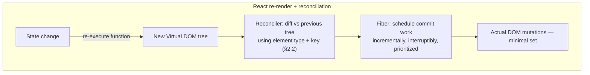

# Module 159 — React Fundamentals: Virtual DOM, Fiber Reconciliation & Hooks — Comparative Against Angular

> Domain: React | Level: Beginner → Expert | Prerequisite: [[../42-Angular/01-Angular-Fundamentals-Components-DI-ChangeDetection-RxJS]] (this module is written comparatively against it, per this repo's established sibling-domain treatment — Azure vs. AWS, Modules 65-72 — mapping concepts and flagging genuine divergences rather than re-deriving fundamentals)

>
> **Scope note:** `43-React` scoped as three modules (159-161), mirroring `42-Angular`'s depth exactly, so each module maps directly onto its Angular counterpart: this module ↔ Module 156 (rendering/reactivity substrate), Module 160 ↔ Module 157 (state management/performance/micro-frontends), Module 161 ↔ Module 158 (capstone case study). Where a concept is functionally identical to its Angular counterpart, this module states that explicitly and moves on rather than re-deriving it; time is spent specifically on genuine divergences.

---

## 1. Fundamentals

**What:** React is an unopinionated, library-not-framework approach to building component-based UIs, built around three load-bearing subsystems that map onto, but diverge sharply from, Module 156's four: a **Virtual DOM and reconciliation algorithm** (React's counterpart to Ivy's compiled-instruction model, but architecturally opposite — see §2.1), **Fiber** (React's incremental, interruptible rendering engine, with no direct Angular counterpart), and **Hooks** (`useState`, `useEffect`, `useContext`, `useReducer`, and friends — React's reactivity primitive family, replacing what Angular splits across DI, RxJS, and lifecycle hooks).

**Why:** The single most consequential divergence between the two frameworks, established immediately and referenced throughout both this module and Module 160-161: **Angular's default behavior is "check everything on any async event, unless you opt into `OnPush`" (Module 156 §2.2); React's default behavior is "re-run this entire component function on every state change, unless you opt into memoization" (§2.3 below).** Both defaults produce the identical practical risk — unnecessary, potentially expensive re-work — but from architecturally opposite starting points, and a candidate who has only used one framework will systematically misapply that framework's specific opt-in-vs-opt-out intuition to the other.

**When:** React's unopinionated nature (routing, state management, and forms are all third-party choices, unlike Angular's first-party, all-in-one suite) makes it a common choice where a team wants to select best-of-breed libraries per concern, or where an existing team's skill set and ecosystem preference already lean that direction — this course's Elite FinTech Interview Panel lens treats the Angular-vs-React choice as largely a team/ecosystem/organizational decision (Module 158 §15's calibration-to-actual-context principle) rather than either framework being categorically superior for financial-services UI specifically.

**How (30,000-ft view):**
```
JSX (declarative UI description, compiled to React.createElement calls)
        │
   Component function re-executes on every state change (re-render)
        │
   Virtual DOM: a new element tree is produced in memory
        │
   Reconciliation (diffing): compare new tree against previous tree,
        │                     using element type + `key` for identity (§2.2)
        │
   Fiber: schedules the actual DOM commit work incrementally,
        │      interruptibly, prioritized (§2.1) — NOT a synchronous,
        │      single-pass walk the way Angular's change detection is
        │
   Hooks thread through all of it: useState/useReducer hold state across
   re-renders via call-order identity (§2.4); useEffect handles side effects
   and subscriptions, the rough functional equivalent of Angular's
   ngOnInit/ngOnDestroy PLUS manual RxJS subscription management combined
```

---

## 2. Deep Dive

### 2.1 Virtual DOM diffing and Fiber — the architectural inverse of Ivy

Module 156 §2.1 established that Ivy compiles templates into instruction functions that already know, at compile time, exactly which DOM node each binding affects — change detection *executes* pre-known update instructions. React's Virtual DOM model does the structural opposite: on every re-render, React builds an entirely new, in-memory tree of lightweight element descriptors, then **diffs** that tree against the previous render's tree at runtime to compute the minimal set of actual DOM mutations needed — the "which nodes changed" question is answered by comparison at runtime, not known in advance from compilation. **Fiber** (React's reconciler since React 16) is what makes this diffing-and-committing process **incremental and interruptible**: rather than walking the whole component tree in one uninterruptible synchronous pass (Angular's model, Module 156 §2.2), Fiber breaks rendering work into units it can pause, prioritize (a user keystroke's update can preempt a lower-priority background re-render already in progress), and resume — a capability with no Angular counterpart at all, since Angular's change-detection tree walk is not natively interruptible or priority-schedulable in the same way.

### 2.2 The `key` prop — React's `trackBy`, but mandatory-by-convention and present in every list render by default

**This is the single most direct, load-bearing comparison this module makes to Module 158.** React's reconciler, when diffing a list of child elements, uses each element's `key` prop as its identity across renders — structurally identical in *purpose* to Angular's `trackBy` (Module 156 §2.2, Module 158's entire capstone incident): both tell the framework "this specific rendered output, previously representing item X, should now be understood as representing item Y" when a list reorders. **The divergence:** Angular's `trackBy` is an explicit, opt-in performance/correctness parameter developers must deliberately add (defaulting to no `trackBy` function at all, which falls back to Angular's own internal object-identity tracking, not index-based by default) — whereas React's `key` prop is asked for on *every single list render* via a console warning if omitted, making the "you need a stable identity for reordering lists" lesson far more front-loaded and visible in React than in Angular, even though the exact same underlying failure mode (using array index as the identity source for a reorderable list) is possible, common, and just as silently incorrect in both frameworks. **React's warning nudges developers toward providing *a* key; it does not and cannot verify that the key they chose is actually semantically stable** — an index-based key silences the warning while reproducing Module 158 §4's identical incident mechanism exactly.

### 2.3 Re-render defaults and `memo`/`useMemo`/`useCallback` — React's inverse of `OnPush`

Module 156 §2.3 established `OnPush` as an opt-in narrowing of Angular's default "check everything" behavior. React's default is the mirror image: **a component function re-executes in full on every state change anywhere that affects it, including re-creating every inline object, array, and function literal defined in its body on every single render** — `React.memo()` (wrapping a component to skip re-rendering when its props are shallowly unchanged, directly analogous to `OnPush`'s reference-identity check) and `useMemo`/`useCallback` (memoizing a specific computed value or function reference across renders, so a *child* wrapped in `memo()` actually sees a stable prop reference rather than a fresh one every parent re-render) are the opt-in narrowing tools. **The critical, distinctly-React footgun this produces:** passing an inline arrow function or object literal as a prop to a `memo()`-wrapped child (`<Child onClick={() => doThing()} />`) creates a *new* function reference on every parent render, defeating `memo()`'s shallow-comparison optimization even though the child's actual behavior never changed — the React-specific instance of Module 156 I2's exact reference-identity gotcha, but arising from the *opposite* structural direction (React creates new references by default and must be told to stabilize them; Angular's `OnPush` assumes stable references by default and is broken by in-place mutation instead).

### 2.4 Hooks — call-order-based state identity and the Rules of Hooks

`useState` and `useReducer` hold a component instance's state across re-renders not by any named field (as Angular's class-based components use named class properties) but by **the *order* in which hooks are called within the component function** — React's runtime maintains an internal, per-component-instance list of hook state slots, indexed by call order, and matches each `useState()` call in a given render to its corresponding slot from the *previous* render strictly by position. This is why the **Rules of Hooks** (never call a hook conditionally, never call a hook inside a loop, always call hooks in the same order on every render) are not a style preference but a structural correctness requirement — a hook called conditionally can shift every subsequent hook's call-order index, causing React to match the wrong stored state to the wrong hook, silently. **This has no meaningful Angular analogue**: Angular's DI-resolved, class-property-based state has no equivalent call-order-dependent identity mechanism, since a class instance's fields are always accessed by name, not by declaration-order position.

### 2.5 `useEffect` and the stale-closure problem — React's most distinctive, most-tested footgun

`useEffect(() => { ... }, [dependencies])` is React's mechanism for side effects (subscriptions, data fetching, manual DOM work) — the rough functional-component equivalent of Angular's `ngOnInit`/`ngOnDestroy` pair, but implemented as a *closure* captured fresh on every render, not a stable class-instance method. **The single most distinctive React-specific bug class this creates, with no direct Angular counterpart:** an effect's callback closes over whatever values were in scope *at the time that specific render's effect was created* — if the effect's dependency array omits a value the closure actually reads, the effect will keep running with that value's *original, stale* snapshot indefinitely, never seeing subsequent updates, even though the component itself has since re-rendered many times with fresh values. Angular's equivalent subscription-management code (Module 156 §2.5, §4) can certainly leak (fail to unsubscribe) or race, but it does not have this specific *stale-closure-over-a-since-changed-variable* failure mode, because Angular's class-based `ngOnDestroy`/service-injected state isn't re-created fresh, closure-style, on every render the way a function component's body is.

### 2.6 Context API — React's DI-adjacent, but structurally thinner, mechanism

React's `Context` (`createContext`/`useContext`) lets a value be provided at one point in the component tree and consumed by any descendant without prop-drilling through every intermediate level — structurally similar in *purpose* to Angular's hierarchical injector tree (Module 156 §2.4), including the same "nearest provider wins, allowing scoped overrides at any subtree" resolution behavior. **The divergence:** Angular's DI is a full container — services are resolved by *type* (an injection token), can themselves have their own injected dependencies resolved transitively, and integrate with the framework's own instantiation lifecycle. React's Context provides *values* (which can certainly be objects, including objects with methods) to consuming components via a hook, with no equivalent formal dependency-graph resolution, no automatic constructor-style injection of one context's value into another's provider — any "DI-like" behavior beyond simple value-provision in React is a convention teams build on top of Context (or a third-party DI library), not a first-party framework capability the way Angular's injector is.

---

## 3. Visual Architecture



```
Ivy (Module 156) vs. Virtual DOM+Fiber (this module) — opposite directions:

  Ivy:    compile-time-known instructions  →  runtime executes them (cheap per-binding checks)
  React:  runtime builds a NEW full tree   →  runtime DIFFS it against the old one

Angular OnPush (opt-IN to skip checking)  vs.  React memo() (opt-IN to skip re-rendering)
  — same opt-in shape, OPPOSITE default starting point (§2.3)
```

```
trackBy (Angular, Module 156/158) vs. key (React, §2.2) — same PURPOSE, different DEFAULT VISIBILITY:

  Angular: trackBy is silent-by-default (no warning if omitted) — Module 158's incident
           went undetected until production specifically because nothing flagged its absence.
  React:   key triggers a console warning if omitted from ANY list render — more visible,
           but the warning only checks PRESENCE, never SEMANTIC STABILITY (index-as-key
           silences the warning while reproducing the identical incident mechanism).
```

---

## 4. Production Example

**Problem:** A brokerage's React-based order-entry widget subscribed to a live WebSocket price feed inside a `useEffect`, using the current order's proposed price as part of a client-side pre-trade sanity check (flagging if the proposed price deviated more than a threshold from the live market price) before allowing submission.

**Architecture:** A functional component holding `orderPrice` (from a controlled form input) and `livePrice` (from the WebSocket feed) as separate `useState` values, with a `useEffect` establishing the WebSocket subscription once on mount, intended to run the sanity check inside the message handler using both values.

**Implementation / What happened:** The `useEffect`'s dependency array was written as `[]` (run once on mount only, a common, deliberate pattern for "subscribe once, don't resubscribe on every render") — but the WebSocket message handler *inside* that effect read `orderPrice` directly from the surrounding closure. Because the effect (and its closure) was created exactly once, at mount, with whatever `orderPrice` value existed *at that moment*, every subsequent price-tick message for the rest of the component's lifetime ran the sanity check against that original, stale `orderPrice` value — never the trader's actual, currently-typed order price — silently comparing live market moves against a snapshot from whenever the form happened to be empty or hold an initial default value, producing a sanity check that was, in practice, permanently checking against the wrong number and either firing false warnings or (more dangerously) failing to fire genuine ones.

**Trade-offs:** The empty dependency array was not a careless mistake but a deliberate, individually-reasonable choice to avoid the WebSocket subscription being torn down and re-established on every keystroke in the order-price input (which *would* have been a genuine, separate performance problem) — the team correctly avoided one failure mode (resubscription thrashing) while not recognizing that the same fix silently introduced the stale-closure failure mode instead, since both share the identical `useEffect` dependency-array configuration point.

**Lessons learned:** **A `useEffect`'s dependency array is not merely a performance-tuning knob (how often does this re-run) — it is a correctness contract about which values the effect's closure is allowed to safely read**, and omitting a value the closure genuinely uses doesn't merely risk "a slightly stale UI," it can silently and permanently disconnect a safety-relevant check from the value it was supposed to validate against, with the framework providing zero runtime signal (React's `eslint-plugin-react-hooks` *exhaustive-deps* lint rule is a static, opt-in check catching exactly this class of bug at write-time — but only if enabled and heeded, not a runtime guarantee). This is React's own, structurally distinct instance of Module 158 §4's "individually-correct-seeming configuration choice silently wrong for the actual usage" composition-risk shape, occurring specifically at the closure-capture seam that has no Angular counterpart at all.

---

## 5. Best Practices

- **Enable and enforce `eslint-plugin-react-hooks`'s `exhaustive-deps` rule** across the codebase — it is the closest mechanical safeguard against §4's exact stale-closure failure class, catching a missing dependency at write-time rather than relying on a developer noticing a silently-wrong runtime value.
- **Use the functional-update form of `setState`** (`setOrderPrice(prev => ...)`) when a state update depends on the previous state value, rather than reading the outer closure's snapshot — sidesteps a category of stale-closure bugs specifically for state *updates*, independent of the effect-dependency-array discipline needed for state *reads* inside effects.
- **Treat `key` as always requiring a genuinely stable, unique identifier drawn from the data itself** (an instrument symbol, a database ID) — never array index for any list that can reorder, filter, or have items inserted/removed from the middle, directly reusing Module 158 §2.2/I1's Angular `trackBy` guidance verbatim.
- **Wrap expensive child components in `memo()` deliberately, and stabilize the props passed to them with `useMemo`/`useCallback`** — matching Module 156 §15's risk-tiered `OnPush` adoption principle: apply where profiling demonstrates genuine re-render cost, not uniformly by default.
- **Prefer the Rules-of-Hooks-compliant, unconditional hook-call pattern always**, even when it feels like it requires slightly more verbose conditional logic *inside* a hook body rather than conditionally calling the hook itself (§2.4) — this is a hard, non-negotiable structural requirement, not a style preference.

---

## 6. Anti-patterns

- **A `useEffect` reading a value from its closure that isn't listed in its dependency array** — §4's exact incident; React's single most distinctive, most commonly interview-tested footgun.
- **Array-index-based `key` props on any reorderable, filterable, or insert/delete-in-the-middle list** — the React-specific instance of Module 158 §4's identical incident mechanism, made only marginally more visible by React's presence-only console warning.
- **Passing inline object/array/function literals as props to a `memo()`-wrapped child** — silently defeats the memoization the wrapping was added specifically to provide (§2.3), a distinctly-React footgun with no Angular equivalent since Angular's `OnPush` doesn't depend on prop-reference stability being independently maintained by the *parent's* own render behavior in the same way.
- **Conditionally calling a hook** (inside an `if`, a loop, or after an early `return`) — a structural correctness violation, not a style issue, per §2.4's call-order-identity mechanism.
- **Treating Context as a full dependency-injection replacement for Angular's injector** — Context provides value distribution with scoped overrides, but not the transitive, type-resolved dependency graph Angular's DI provides; teams migrating between the two frameworks who assume feature parity here are systematically surprised (§2.6).

---

## 7. Performance Engineering

React's default "re-render the whole function on any relevant state change" model (§2.3) means the *reconciliation diffing cost* — not a Zone.js-style blanket change-detection trigger — is the dominant cost model: Fiber's incremental scheduling (§2.1) bounds *when* work happens (deferring low-priority re-renders behind high-priority ones, via `startTransition`/`useDeferredValue` in React 18+, a capability with no Angular analogue) but does not, on its own, reduce *how much* diffing work a given re-render requires — that reduction is `memo`/`useMemo`/`useCallback`'s job specifically (§2.3), the React-layer equivalent of Module 156 §7's two-lever (frequency and scope) reasoning, but mapped onto different concrete mechanisms: Fiber's prioritization addresses something closer to *when/frequency of committed work*, while `memo` addresses *scope* (which subtrees re-render at all). A high-frequency data source (a live tick feed) feeding React state should be buffered/throttled before triggering `setState` for exactly the same reason Module 156 §7 established for Angular — reducing state-update frequency reduces the number of reconciliation passes triggered, independent of how well-memoized the receiving components are.

---

## 8. Security

React, like Angular (Module 156 §8), sanitizes rendered content by default — JSX's `{expression}` interpolation automatically escapes values, and React requires an explicit, clearly-named opt-out (`dangerouslySetInnerHTML`, whose deliberately alarming name is itself a design choice signaling the same risk Angular's `bypassSecurityTrustHtml` methods carry) to render raw, unescaped HTML. The identical governance recommendation applies verbatim: every `dangerouslySetInnerHTML` call site should be inventoried, justified, and periodically re-audited (Module 156 §8/A7's discipline transfers directly, with no meaningful divergence between the two frameworks here beyond naming convention).

---

## 9. Scalability

Fiber's interruptible, priority-scheduled rendering (§2.1) is React's most distinctive scalability lever with no Angular counterpart — a large, complex UI update can be deferred behind a more urgent user interaction automatically, rather than blocking the main thread for a single, uninterruptible synchronous pass the way Angular's change-detection tree walk does by default (Module 156 §2.2). React's code-splitting (`React.lazy` plus dynamic `import()`) provides the same initial-load-bounding benefit as Angular's lazy-loaded modules (Module 156 §9) via a structurally near-identical mechanism (both ultimately rely on the bundler's dynamic-import support) — this is a case of genuine, near-total parity rather than divergence.

---

## 10. Interview Questions

### Basic (10)

**B1. What is the Virtual DOM, and how does React use it?**
*Ideal Answer:* An in-memory, lightweight tree representation of the UI that React builds fresh on every re-render, then diffs against the previous render's tree to compute the minimal set of actual DOM mutations needed.
*Why correct:* Matches §2.1.
*Common mistakes:* Describing the Virtual DOM as making updates instant or free, rather than as a mechanism for computing a *minimal* update relative to a full DOM rebuild.
*Follow-up:* How does this differ architecturally from Angular's Ivy compiler's approach (Module 156 §2.1)?

**B2. What is Fiber, and what capability does it provide that Angular's change detection lacks?**
*Ideal Answer:* React's reconciler engine, enabling rendering work to be broken into interruptible, prioritizable units — a high-priority update (e.g., user input) can preempt a lower-priority one already in progress, unlike Angular's single, uninterruptible synchronous tree walk.
*Why correct:* Matches §2.1/§9.
*Common mistakes:* Describing Fiber merely as "React's rendering engine" without the specific interruptible/prioritizable capability that distinguishes it.
*Follow-up:* Name a React 18+ API that directly exposes this prioritization capability to application code.

**B3. What is the `key` prop for, and why does React warn if it's missing from a list render?**
*Ideal Answer:* Tells the reconciler each list item's stable identity across renders, so it can correctly distinguish "this item moved" from "this position now holds a different item" — the warning exists because omitting it risks exactly this kind of misidentification.
*Why correct:* Matches §2.2.
*Common mistakes:* Describing `key` purely as a performance hint rather than a correctness-relevant identity mechanism.
*Follow-up:* Does React's warning verify that a provided `key` is actually semantically stable, or only that one was provided at all?

**B4. Why does calling a Hook conditionally break a component?**
*Ideal Answer:* Hooks are matched to their stored state by call-order position, not by name — a conditionally-skipped hook call shifts every subsequent hook's position, causing React to associate the wrong stored state with the wrong hook.
*Why correct:* Matches §2.4.
*Common mistakes:* Describing this as an arbitrary style rule ("the Rules of Hooks say so") rather than explaining the underlying call-order-identity mechanism that makes it a structural requirement.
*Follow-up:* Does Angular have an equivalent call-order-dependent state-identity mechanism? Why or why not?

**B5. What does `React.memo()` do, and what is its Angular counterpart?**
*Ideal Answer:* Wraps a component so it skips re-rendering when its props are shallowly unchanged — the direct counterpart to Angular's `OnPush` change-detection strategy.
*Why correct:* Matches §2.3.
*Common mistakes:* Describing `memo()` as caching the component's rendered output permanently, rather than as a per-render shallow-props-comparison gate.
*Follow-up:* What specifically defeats `memo()`'s optimization when a parent passes an inline arrow function as a prop?

**B6. What is a stale closure in the context of `useEffect`?**
*Ideal Answer:* When an effect's callback reads a value from its surrounding scope that isn't included in the effect's dependency array, causing the effect to keep using that value's original snapshot from whenever the closure was created, never seeing subsequent updates.
*Why correct:* Matches §2.5.
*Common mistakes:* Confusing a stale closure with a subscription-leak bug (Module 156 §4) — the two are distinct failure modes, one about reading outdated data, the other about failing to tear down a subscription at all.
*Follow-up:* What ESLint rule specifically helps catch this bug class at write-time?

**B7. What does React's Context API provide, and how does it differ from Angular's dependency injection?**
*Ideal Answer:* Context lets a value be provided at one point in the component tree and consumed by descendants without prop-drilling, with the same "nearest provider wins" scoping behavior as Angular's injector — but it provides values via a hook, with no equivalent formal, type-resolved dependency graph or transitive injection the way Angular's DI container provides.
*Why correct:* Matches §2.6.
*Common mistakes:* Treating Context as a full DI-container replacement with feature parity to Angular's injector.
*Follow-up:* What would a team need to build on top of Context to approximate Angular's transitive dependency resolution?

**B8. Why does JSX require sanitization to be opted out of explicitly, rather than opted into?**
*Ideal Answer:* JSX interpolation (`{expression}`) automatically escapes rendered values by default to prevent XSS; rendering raw, unescaped HTML requires the explicit, deliberately alarmingly-named `dangerouslySetInnerHTML` prop.
*Why correct:* Matches §8, directly paralleling Angular's default-safe sanitization (Module 156 §8).
*Common mistakes:* Assuming React requires manual escaping by default, rather than recognizing escaping as React's own default-safe posture.
*Follow-up:* What governance discipline should apply to every `dangerouslySetInnerHTML` call site?

**B9. What is `useState`'s functional-update form, and when should it be used?**
*Ideal Answer:* `setState(prevState => newState)` — computing the new state from the previous state via a function argument rather than reading the outer closure's state variable directly, avoiding a category of stale-closure bugs specifically for state updates that depend on the prior value.
*Why correct:* Matches §5.
*Common mistakes:* Assuming the functional-update form is merely a stylistic alternative rather than a specific fix for a specific closure-related correctness risk.
*Follow-up:* Why doesn't the functional-update form help with §4's incident specifically, which involved reading state inside a WebSocket message handler rather than updating it?

**B10. What React 18+ capability has no Angular equivalent, and why?**
*Ideal Answer:* Fiber's interruptible, priority-scheduled rendering, exposed via APIs like `startTransition`/`useDeferredValue` — Angular's change-detection tree walk (Module 156 §2.2) is a single, synchronous, uninterruptible pass with no native prioritization mechanism.
*Why correct:* Matches §2.1/§9.
*Common mistakes:* Naming a feature (e.g., hooks generally) that does have a rough Angular counterpart (Signals), rather than specifically identifying Fiber's prioritization capability, which genuinely doesn't.
*Follow-up:* What kind of user-facing responsiveness problem does this capability specifically address?

### Intermediate (10)

**I1. Walk through precisely why §4's `useEffect` with an empty dependency array produced a permanently stale `orderPrice` value inside the WebSocket handler.**
*Ideal Answer:* An empty dependency array tells React "only re-run this effect once, on mount" — meaning the effect's callback closure is created exactly once, capturing whatever value `orderPrice` held at that single moment. Every subsequent WebSocket message handled by that same, never-recreated closure reads that original, captured value — not the component's current, re-rendered `orderPrice` state — because the closure itself was never regenerated to capture a fresh value.
*Why correct:* Matches §4/§2.5's precise mechanics.
*Common mistakes:* Assuming the effect somehow "re-reads" the latest state on each message automatically, missing that a closure captures its enclosing scope's values at creation time, not dynamically at each later invocation.
*Follow-up:* What's the minimal, correct fix that preserves the "subscribe once" behavior while avoiding the stale value?

**I2. Design the corrected version of §4's `useEffect`, preserving the "subscribe once" behavior while reading current `orderPrice` correctly.**
*Ideal Answer:* Keep the WebSocket subscription itself in a `useEffect` with an empty dependency array (correctly avoiding resubscription thrashing), but use a `useRef` to hold the current `orderPrice` value, updated via a separate, lightweight effect (or directly during render) whenever `orderPrice` changes — the WebSocket handler then reads `orderPriceRef.current` inside its closure, which always reflects the latest value because a ref's `.current` property is mutated in place, not captured by value at closure-creation time the way a plain variable is.
*Why correct:* Correctly identifies `useRef` as the idiomatic fix for exactly this "need current value, but only want to subscribe once" tension — a very common, specifically-React pattern.
*Common mistakes:* Proposing to simply add `orderPrice` to the dependency array, which reintroduces the exact resubscription-thrashing problem the empty array was originally chosen to avoid.
*Follow-up:* Why does mutating `.current` in place not trigger a re-render, and why is that specifically desirable for this use case?

**I3. Compare the visibility of Angular's `trackBy` omission (Module 158 §4) against React's `key` omission, and evaluate which framework's default better prevents the underlying incident class.**
*Ideal Answer:* Angular provides no warning at all if `trackBy` is omitted, silently falling back to its own internal identity tracking — Module 158's incident occurred specifically because nothing flagged the index-based `trackBy` choice as risky. React's console warning fires whenever `key` is omitted entirely, providing strictly more visibility for the *presence* question — but neither framework's warning (React's, or Angular's complete absence of one) actually verifies *semantic stability* of whatever identity value is provided, meaning an index-based `key` in React silences the warning while reproducing the identical incident mechanism Module 158 examined. React's default is therefore meaningfully better at catching *complete omission*, but equally vulnerable to the *wrong-but-present* variant of the same mistake.
*Why correct:* Correctly distinguishes the two frameworks' actual, different levels of protection while precisely identifying the shared residual risk neither framework's tooling addresses.
*Common mistakes:* Concluding React's warning "solves" the problem Module 158 examined, missing that an index-based key silences the warning while remaining just as incorrect.
*Follow-up:* What lint rule or code-review practice would catch an index-based `key` specifically, given React's own tooling doesn't?

**I4. Explain mechanically why passing `<Child onClick={() => doThing()} />` to a `memo()`-wrapped `Child` defeats the memoization, and design the fix.**
*Ideal Answer:* The inline arrow function `() => doThing()` is a *new* function object created fresh on every parent render — `memo()`'s shallow prop comparison sees a different `onClick` reference every time, regardless of whether `doThing`'s actual behavior changed, and re-renders `Child` accordingly. Fix: wrap the handler in `useCallback(() => doThing(), [doThing])` in the parent, so the same function reference is passed across renders unless `doThing` itself genuinely changes, letting `memo()`'s shallow comparison actually succeed.
*Why correct:* Matches §2.3's precise mechanics with the concrete, idiomatic fix.
*Common mistakes:* Proposing to remove `memo()` entirely rather than correctly stabilizing the prop reference, which defeats the optimization's purpose rather than fixing its actual defeat mechanism.
*Follow-up:* Does this same "new reference every render" problem apply to inline object/array literals passed as props, not just functions? Why?

**I5. Design an ESLint configuration that would have caught §4's incident before it reached production.**
*Ideal Answer:* Enable `eslint-plugin-react-hooks`'s `exhaustive-deps` rule, configured to error (not merely warn) on any `useEffect` whose callback reads a value not present in its dependency array — this rule would have flagged the WebSocket handler's `orderPrice` read against the empty `[]` dependency array directly at write time, forcing the team to either add the dependency (reintroducing the resubscription concern, prompting the correct `useRef`-based fix, I2) or explicitly, visibly suppress the rule with a comment requiring justification.
*Why correct:* Correctly identifies the specific, mechanical, already-available tooling that directly targets this exact bug class, rather than proposing a generic "review more carefully" recommendation.
*Common mistakes:* Proposing only manual code-review discipline, missing that this exact class of bug is precisely what a well-known, purpose-built lint rule already exists to catch mechanically.
*Follow-up:* What's the risk of a team routinely suppressing `exhaustive-deps` warnings with `// eslint-disable-next-line` comments rather than fixing the underlying dependency issue?

**I6. Compare Fiber's rendering prioritization to Angular's zoneless Signals-based change detection (Module 157 §2.4) — do they solve the same problem?**
*Ideal Answer:* No — they solve genuinely different problems. Zoneless Signals narrow *which components are even candidates for re-checking* (precise dependency tracking replacing Zone.js's blanket triggering) — a *scope* reduction. Fiber's prioritization doesn't reduce how much work a given render requires; it changes *when* and in what *order* already-necessary work is performed, letting high-priority updates preempt lower-priority ones — a *scheduling* improvement, not a scope reduction. A React application could have Fiber's full prioritization benefit while still doing unnecessarily broad re-renders if `memo`/`useMemo` aren't applied; conversely a React application with excellent memoization but no use of `startTransition` still commits all its (now-smaller) necessary work in a single, unprioritized batch.
*Why correct:* Correctly distinguishes scope-reduction (Signals, memoization) from scheduling/prioritization (Fiber) as two independent, non-substitutable performance dimensions.
*Common mistakes:* Treating Fiber and Signals as solving "the same performance problem" in different frameworks, missing that they address genuinely different aspects (scheduling vs. scope) of the overall cost model.
*Follow-up:* Could React benefit from adding a Signals-like scope-reduction primitive on top of Fiber's existing scheduling benefit? What would that combination provide that neither alone does?

**I7. A team migrating from Angular to React expects Context to provide the same transitive dependency resolution Angular's DI container provides. What specifically will surprise them?**
*Ideal Answer:* Angular's DI resolves a service's own constructor-declared dependencies automatically and transitively, walking the injector tree as needed (Module 156 §2.4) — Context provides only the *value* placed into a given Provider, with no automatic mechanism for one Context's value to itself receive other Context values injected into it the way an Angular service's constructor does; any such composition must be built manually (e.g., a Provider component that itself consumes other Context values via hooks and constructs the value it then provides), which is straightforward but is application code the team must write, not a capability Context itself provides out of the box.
*Why correct:* Matches §2.6's precise divergence with a concrete illustration of what specifically differs in practice.
*Common mistakes:* Describing Context as "basically the same as Angular DI," missing the specific transitive-resolution capability gap.
*Follow-up:* What third-party library patterns exist in the React ecosystem specifically to approximate Angular-DI-like transitive resolution, and what trade-off do they introduce?

**I8. Why does React's default "re-render the whole function" model make `useMemo` valuable even for a pure, synchronous computation with no side effects?**
*Ideal Answer:* Because the entire component function body re-executes on every re-render by default (§2.3), even an expensive, side-effect-free computation (e.g., filtering/sorting a large array) re-runs on every render regardless of whether its actual inputs changed, unless explicitly wrapped in `useMemo` to skip recomputation when its dependency array's values are unchanged — a cost Angular's `OnPush`-gated, per-binding-check model doesn't impose in the same way, since a check that determines "nothing changed" for a given binding doesn't require re-executing an equivalent arbitrary computation from scratch.
*Why correct:* Correctly connects `useMemo`'s value specifically to React's function-re-execution default, distinguishing it from Angular's different underlying cost model.
*Common mistakes:* Describing `useMemo` purely as "for expensive computations" without connecting its necessity specifically to React's re-execute-the-whole-function default.
*Follow-up:* Would `useMemo` provide meaningfully less value in a hypothetical React variant that used Ivy-style compiled instructions instead of re-executing the full function body? Why?

**I9. Design a code-review checklist item specifically targeting the stale-closure risk class (§2.5), distinct from Module 158 A4's `trackBy` checklist item.**
*Ideal Answer:* "Does this `useEffect`'s callback (including any nested callbacks, like a WebSocket or event-listener handler defined inside it) read any component state or props not listed in the dependency array? If the dependency array is intentionally narrower than what the closure reads (e.g., to avoid resubscription), is a `useRef` or equivalent pattern used to access the current value instead of relying on the stale closure?" — distinct from the `trackBy`-focused checklist item (Module 158 A4) because it targets a fundamentally different mechanism (closure capture over time) rather than list-rendering identity.
*Why correct:* Correctly designs a checklist item targeting the specific, distinct mechanism (closures, not list-reconciliation identity) this bug class involves, and explicitly distinguishes it from the superficially-similar-sounding but mechanically different Angular `trackBy` checklist item.
*Common mistakes:* Reusing or conflating this checklist item with the `trackBy`-focused one, missing that stale closures and identity-tracking bugs are mechanically unrelated despite both being common framework-specific footguns.
*Follow-up:* Which of the two checklist items (this one, or Module 158 A4's) is more amenable to full automation via a lint rule, and why?

**I10. Why might a financial-services platform choose Angular over React specifically for its all-in-one, opinionated structure, independent of any technical performance comparison?**
*Ideal Answer:* Angular's first-party routing, forms, HTTP client, and DI mean a large team building a long-lived, compliance-sensitive platform inherits one consistent, framework-enforced structure across every contributor and every feature area — reducing the variance-across-independently-chosen-libraries risk this course has repeatedly identified as a composition-risk source (Module 153 A2's per-service validation-logic variance, now at the frontend-tooling-choice layer) — whereas React's unopinionated nature requires the *organization itself* to make and enforce equivalent structural consistency decisions (which state library, which forms library, which DI-equivalent pattern) across every team, a governance burden Angular's opinionated defaults absorb by design.
*Why correct:* Correctly identifies the organizational-consistency trade-off as the primary driver, independent of raw technical/performance comparison, matching this course's recurring emphasis on organizational-scale reasoning over purely technical framework comparison.
*Common mistakes:* Answering purely with a technical/performance argument, missing that the two frameworks' most consequential difference at genuine enterprise scale is opinionated-structure-versus-flexibility, not raw rendering performance.
*Follow-up:* What specific risk does a large, multi-team React platform face if it does *not* establish and enforce equivalent organizational conventions Angular would have provided by default?

### Advanced (10)

**A1. Design a complete migration checklist for a team moving §4's stale-closure-prone WebSocket integration pattern to a correct, idiomatic React implementation, addressing every mechanism this module has established.**
*Ideal Answer:* (1) Move the current-value read into a `useRef`, updated on every render or via a dedicated effect (I2); (2) enable and enforce `exhaustive-deps` (I5) across the codebase, requiring explicit, commented justification for any suppressed instance; (3) add an integration test specifically simulating a state update *after* the effect's initial mount, then a subsequent WebSocket message, asserting the handler uses the *current*, not the mount-time, state value — directly analogous to Module 158 Hard exercise's end-to-end composition test, here targeting the closure-staleness seam specifically; (4) document the `useRef` pattern as the team's standing convention for "subscribe once, read current value" scenarios, so future features reuse the correct pattern by default rather than reinventing the empty-dependency-array mistake independently.
*Why correct:* Synthesizes the fix, the mechanical prevention tooling, a verification test, and an organizational-consistency measure into one complete checklist, mirroring the structure Module 158 A1 established for its own capstone incident.
*Common mistakes:* Proposing only the immediate code fix (I2) without the mechanical prevention (I5) and verification (a specific test) layers that would catch a *future* instance of the same mistake in a different feature.
*Follow-up:* How would you retroactively audit the rest of the codebase for other instances of this same pattern, given `exhaustive-deps` wasn't enabled from the start?

**A2. Critique: "Since React's `key` prop triggers a console warning when missing, React is structurally safer than Angular against Module 158's incident class."**
*Ideal Answer:* Overstated, per I3's precise analysis — React's warning provides strictly better protection against *complete omission* of an identity mechanism, but Module 158's actual incident involved a *present but semantically wrong* `trackBy` (index-based), and React's `key` warning provides zero protection against the analogous *present but semantically wrong* `key` (also commonly index-based) — the exact incident mechanism Module 158 examined is fully reproducible in React with no warning firing at all, since a key was technically provided. "Structurally safer" is true only for the narrower claim "better protected against complete omission," not the broader claim the statement makes.
*Why correct:* Correctly scopes the claim to what React's tooling actually verifies (presence) versus what it doesn't (semantic stability), avoiding the overstated generalization.
*Common mistakes:* Accepting the claim because React's warning is a real, genuine improvement over Angular's silence, without precisely bounding what specific risk that improvement does and doesn't cover.
*Follow-up:* Design a lint rule or static-analysis check that WOULD catch an index-based `key` specifically, closing the gap React's built-in warning leaves open.

**A3. Design a Fiber-aware performance strategy for a high-frequency trading-tick component tree, using `startTransition`/`useDeferredValue` alongside `memo`/`useMemo`, and explain why both categories of technique are independently necessary.**
*Ideal Answer:* Wrap the tick-driven grid update's `setState` call in `startTransition` (or derive the grid's rendered value via `useDeferredValue`) so that a burst of rapid tick updates doesn't block higher-priority work (e.g., the user actively typing into an order-entry field) — this addresses *scheduling/prioritization* (§2.1, I6). Independently, wrap the grid's row components in `memo()` with correctly-stabilized props (`useCallback`/`useMemo` for any function/object props) so that when a render *does* commit, it touches only the rows whose data actually changed — this addresses *scope* (§2.3). Per I6, these are non-substitutable: `startTransition` alone would still commit an unnecessarily-broad re-render eventually (just at a better-scheduled time), and `memo` alone would still block on a burst of updates with no prioritization if a genuinely higher-priority interaction arrives mid-burst.
*Why correct:* Correctly applies both, independently-necessary technique categories with clear justification for why neither alone suffices, directly building on I6's scope-vs-scheduling distinction.
*Common mistakes:* Applying only one category (commonly just `memo`/`useMemo`, since it's more familiar) and claiming the performance strategy is complete, missing the independent scheduling benefit Fiber-aware APIs provide.
*Follow-up:* How would you measure, empirically, whether `startTransition` is providing genuine benefit for this specific component tree versus adding complexity with no measurable improvement?

**A4. A React codebase's `useEffect` dependency arrays are extensively, correctly exhaustive per `exhaustive-deps`, yet a stale-closure-shaped bug still occurs. What's the remaining failure mode, and how does it differ from §4's incident?**
*Ideal Answer:* `exhaustive-deps` verifies that every value the closure *reads* is present in the dependency array — but it cannot verify that the *effect re-running* on every one of those dependency changes is actually the *desired* behavior for the use case; a correctly-exhaustive dependency array on a WebSocket-subscribing effect would now correctly re-subscribe (tearing down and re-establishing the connection) on every dependency change, which — if the dependency changes frequently (e.g., on every keystroke, exactly the resubscription-thrashing concern the original, incorrect empty array was trying to avoid) — reintroduces a different, equally real problem: connection churn, not staleness. The remaining failure mode is that `exhaustive-deps` guarantees closure-read correctness but says nothing about whether the resulting re-run *frequency* is appropriate for the effect's actual side effect (a cheap computation re-running frequently is fine; a WebSocket reconnecting frequently is not).
*Why correct:* Correctly identifies the boundary of what `exhaustive-deps` actually verifies (dependency completeness) versus what it doesn't (whether the resulting re-run frequency is desirable), distinguishing this from §4's original, different-shaped bug.
*Common mistakes:* Assuming `exhaustive-deps` fully "solves" the `useEffect` dependency problem category, missing that fixing the closure-staleness risk (this checklist item) can reintroduce the connection-churn risk the original, buggy code was trying (incorrectly) to avoid — requiring the `useRef` pattern (I2) specifically, not merely an exhaustive dependency array.
*Follow-up:* Why is `useRef`'s pattern specifically the correct resolution to this tension, rather than either extreme (empty array, or fully exhaustive array)?

**A5. Design a test verifying `memo()`'s optimization is actually effective for a specific component, distinct from testing the component's functional correctness.**
*Ideal Answer:* A test that renders a parent component twice with props/state that should NOT affect a specific `memo()`-wrapped child (i.e., the child's own props are unchanged across the two parent renders), then asserts — via a render-count spy/mock on the child, or React DevTools Profiler's programmatic API — that the child rendered exactly once, not twice; a second, negative-style test verifying the child DOES re-render when its actual props genuinely change, confirming the memoization isn't simply "stuck," directly reusing this course's recurring negative-test-coverage discipline (Module 153 A9, Module 156 Advanced Q5).
*Why correct:* Correctly designs both a positive (memoization prevents unnecessary re-render) and negative (memoization doesn't prevent necessary re-renders) test, matching the same dual-test structure Module 156 Advanced Q5 established for Angular's `OnPush`.
*Common mistakes:* Testing only that the component renders correct output (functional correctness), which says nothing about whether it re-rendered more often than necessary — a `memo()` wrapper that provides zero actual optimization benefit would still pass a purely functional-correctness test.
*Follow-up:* How would you extend this test to catch A4's specific "inline prop reference" defeat mechanism directly, rather than only the memoization's aggregate render-count behavior?

**A6. How does the `useRef`-based fix from I2 relate to Angular's `ChangeDetectorRef.markForCheck()` (Module 156 §2.3) conceptually, despite the two solving superficially different-looking problems?**
*Ideal Answer:* Both are escape hatches that let application code explicitly bypass a framework's default state-tracking mechanism when that default doesn't fit a specific need: `markForCheck()` lets a component explicitly signal "re-check me" outside `OnPush`'s normal reference-identity-triggered checks; `useRef` lets a closure explicitly read a *mutable, always-current* value outside React's normal state-triggers-re-render model. Both represent the same underlying pattern — an escape hatch for reading or signaling state changes outside a framework's primary, automatic reactivity mechanism — applied to two different frameworks' different primary mechanisms (change-detection triggering vs. closure-capture-based effects).
*Why correct:* Correctly identifies the shared underlying pattern (an explicit escape hatch around each framework's own primary automatic mechanism) despite the two APIs looking unrelated on the surface, demonstrating genuine comparative synthesis rather than surface-level feature listing.
*Common mistakes:* Describing the two as "solving completely different problems" because their concrete syntax and immediate use cases look dissimilar, missing the shared underlying architectural role both play.
*Follow-up:* Does Angular have anything structurally equivalent to `useRef`'s "mutable value with no re-render/re-check trigger" property specifically, distinct from `markForCheck()`'s "trigger a check" property?

**A7. Design an organizational governance recommendation for a large, multi-team React platform (this course's Elite FinTech Interview Panel context) addressing the specific risk I10 identifies — React's lack of Angular's enforced, opinionated structure.**
*Ideal Answer:* Establish and mechanically enforce (via a shared ESLint configuration, a shared component-library/design-system, and a documented, mandatory architectural decision record for state-management/forms/routing library choice) a single, platform-wide set of conventions functionally replacing what Angular provides by default — directly reusing Module 153 A2's centralized-governance-over-per-team-independent-choice principle, now applied to React's ecosystem-fragmentation risk specifically rather than a security-validation-logic risk; critically, this governance should be established *before* multiple teams independently make divergent choices (state library, effect patterns, memoization conventions), since retrofitting consistency after divergence has already occurred is a substantially harder, more disruptive migration than establishing it upfront.
*Why correct:* Correctly designs a governance response directly targeting the specific organizational risk I10 identified, reusing this course's established centralized-governance pattern rather than proposing an unrelated technical fix.
*Common mistakes:* Proposing only technical linting without the broader organizational decision-record/design-system layer, or proposing the governance without noting the significant cost advantage of establishing it before divergence occurs rather than after.
*Follow-up:* What early warning signal would indicate that a multi-team React platform's conventions are beginning to diverge dangerously, before it becomes a full-blown, costly-to-fix fragmentation problem?

**A8. Explain why `useMemo`/`useCallback` are described in the React community as "not a semantic guarantee" — what does this mean for a developer relying on them for correctness rather than performance?**
*Ideal Answer:* React's documentation explicitly reserves the right to occasionally "forget" a memoized value under certain conditions (e.g., under experimental concurrent-rendering optimizations) and recompute it anyway — `useMemo`/`useCallback` are officially a *performance* optimization hint, not a correctness guarantee that a value will *never* be recomputed. A developer relying on `useMemo`'s memoization for actual correctness (e.g., assuming a specific object reference will *never* change across renders in order to avoid a genuinely necessary side effect) is relying on an implementation detail the framework does not contractually guarantee, unlike, for example, a `useRef`'s `.current` mutation, which genuinely is a stable, guaranteed-not-to-be-reset-by-the-framework reference.
*Why correct:* Correctly identifies the precise, non-obvious distinction between `useMemo`'s advertised performance role and what it does not guarantee, a genuinely subtle point most Intermediate-level React developers get wrong.
*Common mistakes:* Treating `useMemo` and `useRef` as interchangeable "stable value" mechanisms, missing that only `useRef` provides an actual, contractual stability guarantee.
*Follow-up:* Given this distinction, was `useMemo` ever the correct tool for I2's stale-closure fix, or was `useRef` specifically required? Why?

**A9. A team benchmarks their React application's reconciliation cost against an equivalent Angular application's change-detection cost for an identical workload and finds React noticeably faster. Should this result be generalized into a platform-wide framework recommendation?**
*Ideal Answer:* No, not without significant qualification — per Module 156 Advanced Q6's identical caution about overgeneralizing framework-level performance claims, this benchmark result is specific to this workload's particular shape (its actual re-render frequency, list-reordering behavior, memoization discipline in the React version, `OnPush` discipline in the Angular version) and does not generalize to a different workload with a different profile; a workload dominated by frequent, broad state changes with poor memoization discipline might show the opposite result, and vice versa for a workload matching each framework's specific strengths (Fiber's prioritization for bursty, interactive UIs; Ivy's compiled-instruction efficiency for static-heavy, `OnPush`-disciplined templates).
*Why correct:* Correctly refuses to generalize a single benchmark into a universal claim, matching this course's repeated caution (Module 156 A6) against overgeneralized, workload-independent performance claims specifically applied to a cross-framework comparison.
*Common mistakes:* Accepting the benchmark result as generalizable evidence for a platform-wide recommendation without qualifying it against the specific workload's characteristics and each framework implementation's discipline level.
*Follow-up:* What would a genuinely fair, generalizable comparison require that a single benchmark on one workload doesn't provide?

**A10. Synthesize this module's divergences from Module 156 against this course's recurring "declared ≠ actual" theme — is React's version of this theme sharper or softer than Angular's `OnPush` instance (Module 156 A10), and why?**
*Ideal Answer:* Arguably sharper, specifically because of §2.5's stale-closure mechanism: Angular's `OnPush` gap (Module 156 A10) is a *reference-identity* mismatch — the underlying data genuinely changed, but the framework's narrower definition of "changed" (reference equality) didn't register it, a comparatively legible, single-dimension gap once understood. React's stale-closure gap is a *temporal* mismatch — the effect's closure is not merely comparing values incorrectly, it is holding an entirely different, frozen point-in-time snapshot of the world that the rest of the component has already moved past, silently, for the closure's entire remaining lifetime — a gap that is harder to reason about because it requires understanding not just what changed, but *when* the closure stopped being able to see subsequent changes at all, a temporal rather than purely comparative form of "declared ≠ actual."
*Why correct:* Correctly compares the two frameworks' respective sharpest "declared ≠ actual" instances and provides a substantive, specific argument for why one is arguably sharper (temporal snapshot-freezing vs. reference-comparison mismatch), rather than merely restating both without genuine comparative judgment.
*Common mistakes:* Declining to make a genuine comparative judgment, or asserting one is sharper without articulating the specific structural reason (temporal vs. comparative gap) that justifies the claim.
*Follow-up:* Does Module 160's upcoming coverage of React state-management libraries introduce any *additional* instance of this theme beyond what `useEffect`'s stale closures and `key`'s semantic-stability gap already establish?

---

## 11. Coding Exercises

### Easy — Symbol-stable `key` for a reorderable list

**Problem:** Implement the `key` prop correctly for a reorderable "Top Movers" list, mirroring Module 158's `trackBy` fix.

**Solution (TSX):**
```tsx
interface Position { symbol: string; price: number; changePercent: number; }

function TopMoversList({ positions }: { positions: Position[] }) {
  return (
    <ul>
      {positions.map(position => (
        // key = stable, unique identifier — NEVER array index for a reorderable list.
        <li key={position.symbol}>
          {position.symbol}: {position.price.toFixed(2)} ({position.changePercent}%)
        </li>
      ))}
    </ul>
  );
}
```
**Time complexity:** O(n) per render (n = position count), same reconciliation cost class as Module 158's Angular equivalent. **Space complexity:** O(n).

**Optimized solution:** For very large lists, combine with `react-window` or `react-virtualized` (React's ecosystem equivalent of Angular CDK's virtual scrolling, Module 158 §2.1) to bound DOM-node count independent of dataset size — the `key`-correctness requirement applies identically whether or not virtualization is layered on top.

### Medium — `useRef`-based current-value access avoiding stale closures

**Problem:** Fix §4's incident: implement a WebSocket subscription that runs once on mount but reads the *current* `orderPrice` inside its message handler.

**Solution (TSX):**
```tsx
function OrderEntryWidget() {
  const [orderPrice, setOrderPrice] = useState(0);
  const orderPriceRef = useRef(orderPrice);

  // Keep the ref in sync with the latest render's state — this effect
  // is cheap and intentionally has NO subscription/side-effect cost,
  // just a plain mutation, so re-running it on every orderPrice change is fine.
  useEffect(() => {
    orderPriceRef.current = orderPrice;
  }, [orderPrice]);

  useEffect(() => {
    const ws = new WebSocket('wss://market-data.internal/prices');
    ws.onmessage = (event) => {
      const livePrice = JSON.parse(event.data).price;
      // Reads the REF's .current — always up to date, regardless of when
      // this closure was originally created. Fixes §4's exact incident.
      const deviation = Math.abs(livePrice - orderPriceRef.current) / livePrice;
      if (deviation > 0.02) {
        console.warn(`Price deviation alert: order=${orderPriceRef.current}, live=${livePrice}`);
      }
    };
    return () => ws.close();
  }, []); // correctly empty — subscribes exactly once, no resubscription thrashing

  return <input value={orderPrice} onChange={e => setOrderPrice(Number(e.target.value))} />;
}
```
**Time complexity:** O(1) per message. **Space complexity:** O(1).

**Optimized solution:** Enable `eslint-plugin-react-hooks`'s `exhaustive-deps` rule (Intermediate Q5) so any *future* similar effect that reads a non-ref'd, non-dependency-listed value is flagged automatically at write time, rather than depending on every future developer independently rediscovering this exact pattern.

### Hard — `memo`-safe child with stabilized callback and object props

**Problem:** Fix Advanced Q4's `memo()`-defeating inline-prop-reference pattern for a grid row component receiving both a callback and a configuration object as props.

**Solution (TSX):**
```tsx
const GridRow = memo(function GridRow({
  position,
  onSelect,
  displayConfig
}: {
  position: Position;
  onSelect: (symbol: string) => void;
  displayConfig: { decimals: number; showPercent: boolean };
}) {
  return (
    <div onClick={() => onSelect(position.symbol)}>
      {position.symbol}: {position.price.toFixed(displayConfig.decimals)}
      {displayConfig.showPercent && ` (${position.changePercent}%)`}
    </div>
  );
});

function PositionGrid({ positions }: { positions: Position[] }) {
  const [selected, setSelected] = useState<string | null>(null);

  // Stabilized across renders — memo() on GridRow now actually works,
  // since this reference doesn't change unless setSelected itself changes
  // (which it never does, being a useState setter — stable by React's own guarantee).
  const handleSelect = useCallback((symbol: string) => setSelected(symbol), []);

  // Stabilized object reference — WITHOUT this, a new {decimals, showPercent}
  // object literal on every PositionGrid render would defeat memo() exactly
  // as the inline-function case does (Advanced Q4's object-literal variant).
  const displayConfig = useMemo(() => ({ decimals: 2, showPercent: true }), []);

  return (
    <>
      {positions.map(p => (
        <GridRow key={p.symbol} position={p} onSelect={handleSelect} displayConfig={displayConfig} />
      ))}
    </>
  );
}
```
**Time complexity:** O(1) per row per render when `memo()` correctly skips (the common case); O(n) when a genuine data change requires re-rendering all rows. **Space complexity:** O(n) for the position list.

**Optimized solution:** Verify the memoization is actually effective using Advanced Q5's render-count test pattern rather than assuming correctness from the code's structure alone — `useCallback`/`useMemo` with an incorrect or overly-broad dependency array can silently fail to provide the intended stability, and only an explicit render-count assertion catches this reliably.

### Expert — Fiber-aware buffered tick ingestion with `useDeferredValue`

**Problem:** Implement the React equivalent of Module 156's buffered WebSocket tick-ingestion pattern, additionally using `useDeferredValue` so a burst of tick updates doesn't block higher-priority user input (e.g., typing in the order-entry field).

**Solution (TSX):**
```tsx
interface Tick { symbol: string; price: number; timestamp: number; }

function useBufferedTicks(): Tick[] {
  const [ticks, setTicks] = useState<Tick[]>([]);
  const bufferRef = useRef<Map<string, Tick>>(new Map());

  useEffect(() => {
    const ws = new WebSocket('wss://market-data.internal/ticks');
    ws.onmessage = (event) => {
      const tick: Tick = JSON.parse(event.data);
      bufferRef.current.set(tick.symbol, tick); // dedupe-to-latest-per-symbol, same as Module 156
    };

    // Flush the buffer on a fixed interval — the React equivalent of
    // RxJS's bufferTime(100), bounding state-update (and therefore
    // reconciliation) FREQUENCY, independent of Fiber's scheduling (§7).
    const flushInterval = setInterval(() => {
      if (bufferRef.current.size > 0) {
        setTicks(Array.from(bufferRef.current.values()));
        bufferRef.current.clear();
      }
    }, 100);

    return () => {
      ws.close();
      clearInterval(flushInterval);
    };
  }, []);

  return ticks;
}

function TickGrid() {
  const ticks = useBufferedTicks();

  // Fiber-aware SCOPE/SCHEDULING lever, independent of the buffering-frequency
  // lever above — lets React deprioritize rendering this potentially-large
  // grid update behind more urgent work (e.g., active user input elsewhere).
  const deferredTicks = useDeferredValue(ticks);

  return (
    <div>
      {deferredTicks.map(tick => (
        <GridRow key={tick.symbol} position={tickToPosition(tick)} onSelect={() => {}} displayConfig={{ decimals: 2, showPercent: false }} />
      ))}
    </div>
  );
}
```
**Time complexity:** O(k) per buffer flush (k = distinct symbols ticked within the window). **Space complexity:** O(distinct symbols) for the buffer.

**Optimized solution:** Combine with `react-window` virtualization (Easy exercise's note) and the Hard exercise's `memo`-safe `GridRow` for the full, composed performance strategy this module's §7/A3 established — buffering bounds update *frequency*, `useDeferredValue` bounds update *priority/scheduling*, `memo` bounds re-render *scope*, and virtualization bounds *DOM-node count* — the React-ecosystem equivalent of Module 158 §7's four-lever composed architecture, mapped onto React's specific primitives.

---

## 12. System Design

**Requirements:** Functionally identical to Module 158 §12's TradeView requirements (real-time multi-desk grids, order-entry with async validation, cross-desk aggregation, independent per-team deployment) — this section focuses specifically on what changes in the React implementation.

**Architecture:**
```
   Shell (React) — Module Federation (same underlying Webpack mechanism as
   Module 157 §2.6; the shared-dependency-negotiation risk from Module 157 §4
   applies IDENTICALLY to a React-based federation setup — this is a case
   of genuine parity, not divergence, since the risk lives in Webpack's
   runtime, not either framework's own reactivity model)
        │
        ├─ Context-provided cross-desk state (entitlements, alerts) —
        │   React's counterpart to the shell's NgRx store, though typically
        │   paired with a state library (Redux/Zustand, Module 160) for
        │   anything beyond simple value distribution, since Context alone
        │   lacks NgRx's Action/Reducer traceability discipline (§2.6, I7)
        │
        └── Remote: Equities Desk
              ├─ useBufferedTicks (Expert exercise) — buffered WebSocket ingestion
              ├─ memo()-wrapped, key-correct virtualized grid (Hard/Easy exercises)
              └─ Order-entry form with useRef-based current-value access (Medium exercise)
```

**Database/Caching/Messaging/Scaling/Failure handling/Monitoring:** Identical in substance to Module 158 §12 — the backend and cross-cutting infrastructure concerns are framework-agnostic; only the client-side implementation primitives differ, as detailed throughout this module.

**Trade-offs:** React's unopinionated flexibility (choose your own state-management, forms, and DI-equivalent libraries) versus Angular's enforced consistency (§15/I10/A7) is this system design's most consequential divergence from Module 158's — a React-based TradeView requires the organization to *build* the equivalent governance Angular provides by default.

---

## 13. Low-Level Design

**Requirements:** Model the `useRef`-based stale-closure fix, `memo`-safe prop stabilization, and buffered-ingestion patterns as a cohesive, reusable structure — the React counterpart to Module 158 §13's Angular LLD.

**Class/hook diagram (textual):**
```
useBufferedTicks()  (custom Hook, Expert exercise)
 ├─ internal useRef<Map> buffer, internal useState<Tick[]> flushed output
 └─ returns Tick[] — consumed via useDeferredValue for Fiber-aware scheduling

GridRow  (memo-wrapped, Hard exercise)
 ├─ requires STABILIZED props (useCallback/useMemo in the parent) to
 │   actually benefit from memo() — a CONTRACT the parent must uphold,
 │   unlike Angular's OnPush, which depends on the CHILD's own input
 │   handling (immutability discipline) rather than the PARENT's callback
 │   stabilization discipline — a genuine architectural divergence worth
 │   naming explicitly (Advanced Q6's escape-hatch parallel doesn't fully
 │   cover this asymmetry: OnPush's correctness burden sits with whoever
 │   MUTATES the input; memo()'s correctness burden sits with whoever
 │   CONSTRUCTS the props passed down)
 └─ key: symbol (Easy exercise)

orderPriceRef pattern  (Medium exercise)
 └─ generalizes to any "subscribe once, read current value" scenario
```

**Design patterns used:** Observer (React's own re-render-on-state-change model, plus WebSocket event handling); Memoization (`memo`/`useMemo`/`useCallback`, React's opt-in performance pattern, contrasted throughout with Angular's opt-in `OnPush`); Custom Hook as Facade (`useBufferedTicks` presenting a clean, buffered stream over raw WebSocket events, the React idiom replacing Module 156's injectable Angular service for the equivalent responsibility).

**SOLID mapping:** SRP — `useBufferedTicks` only handles ingestion/buffering, `GridRow` only renders, each independently testable; OCP — a new data source can implement the same custom-hook-returns-an-array contract without modifying consuming components; DIP — components depend on a Hook's returned data/callbacks, never directly instantiating WebSocket connections themselves, mirroring Module 158 §13's DI-based dependency-abstraction principle even though React has no formal DI container providing it structurally.

**Concurrency/thread safety:** As throughout this domain, JavaScript's single-threaded model means the relevant discipline is async-ordering correctness — Fiber's own internal scheduling guarantees (not application-code concern) ensure a component's render is never torn mid-execution by a higher-priority interruption; the *application-level* discipline (I2/Medium exercise's `useRef` pattern, ensuring a closure reads current rather than stale values) is the React-specific analogue of the atomic-update discipline this course's backend and Angular modules established via different concrete mechanisms.

---

## 14. Production Debugging

**Incident:** Following the Medium exercise's `useRef`-based fix being rolled out platform-wide as the team's new standard pattern, a different desk's order-entry widget begins occasionally validating against a `orderPriceRef.current` value that is one render *behind* the input the user can visibly see on screen — a much narrower staleness window than §4's original incident, but still a genuine, detectable data-lag.

**Root cause:** The team's second `useEffect` (syncing `orderPriceRef.current = orderPrice`) ran with a dependency array of `[orderPrice]`, correct in isolation — but this desk's specific input component used React's uncontrolled-input pattern combined with a debounced `onChange` handler updating `orderPrice` state, meaning the *visible* DOM input value could update (uncontrolled, directly by the browser) one or more keystrokes ahead of the debounced state update that would eventually trigger the ref-sync effect — a timing gap specific to this desk's particular input-handling choice, not present in §4's original controlled-input implementation the pattern was originally built and tested against.

**Investigation:** React DevTools' Profiler, correlated against manually-logged `orderPriceRef.current` values at each WebSocket message, showed the ref's value updating with a small but measurable lag behind the visible input's displayed value specifically during rapid typing — distinguishing this from a complete staleness failure (§4's original incident, where the ref/state never updated at all) and pointing instead at a timing/debouncing interaction specific to this desk's input implementation.

**Tools:** React DevTools Profiler (correlating render timing against ref-value logging); a targeted comparison of this desk's input-handling code against the original, `useRef`-pattern-establishing desk's controlled-input implementation, which surfaced the uncontrolled-input-plus-debounce divergence as the specific, desk-local variation the shared pattern's original design and testing never covered.

**Fix:** Standardized every desk's order-price input on the controlled-input pattern (the DOM input's value is always driven directly by React state, with no browser-native uncontrolled lag possible) specifically for any field feeding into a safety-relevant `useRef`-based current-value pattern, documenting this as a hard requirement of the shared pattern's contract, not merely an implementation detail left to each desk team's discretion.

**Prevention:** A shared, platform-wide pattern (the `useRef`-based current-value fix) that was correctly verified against its *original* implementation context can still be silently invalidated when a different team combines it with a different, individually-reasonable implementation choice (uncontrolled inputs plus debouncing) the original pattern's design and testing never anticipated — directly recurring this course's now-repeated finding (Module 157 §14, Module 158 §14) that a shared pattern's prior hardening bounds risk only for its originally-examined scope, reinforcing that any shared pattern's documented contract must explicitly state its *preconditions* (here: "assumes a controlled input"), not merely its implementation, so a consuming team can verify compatibility before reuse rather than discovering an incompatibility in production.

---

## 15. Architecture Decision

**Decision:** For a large, multi-team financial-services platform choosing between Angular and React, how should the decision be made?

**Option A — Choose based on raw rendering/reconciliation performance benchmarks:**
*Advantages:* Ostensibly objective, measurable. *Disadvantages:* Per Advanced Q9, a single benchmark's result is workload-specific and does not generalize — this course has found performance claims of this shape (Module 156 A6's identical caution) consistently overstated when generalized beyond their specific measured conditions, and neither framework is categorically faster across all realistic enterprise workloads. *Cost:* Low decision cost, but potentially high downstream cost if the benchmark doesn't represent the platform's actual eventual workload profile. *Risk:* High risk of an unjustified, non-generalizable decision basis.

**Option B — Choose based purely on individual developer/team familiarity, with no organizational governance layer:**
*Advantages:* Fast initial velocity, no ramp-up cost. *Disadvantages:* For React specifically, this risks exactly I10/A7's organizational-fragmentation exposure — without deliberate, upfront governance, independent teams will make independently-reasonable but divergent choices (state libraries, effect patterns) that compound into platform-wide inconsistency; Angular's opinionated defaults partially protect against this even without explicit governance, but not entirely (this module's own §14 incident shows even Angular's more prescriptive structure doesn't eliminate cross-team divergence risk). *Cost:* Low upfront. *Risk:* High and compounding, specifically for React, as team count grows.

**Option C — Choose based on organizational fit (team structure, existing ecosystem investment, governance capacity), with the losing framework's key disciplines (Angular's enforced structure, or React's Fiber-based scheduling/`exhaustive-deps` tooling) deliberately, explicitly replicated via governance regardless of which framework is chosen (recommended):**
*Advantages:* Grounds the decision in the dimension (organizational fit, Module 108's ATAM-style trade-off framing) most predictive of long-term platform health at genuine enterprise multi-team scale, rather than a raw technical metric unlikely to generalize; explicitly ports each framework's structural strengths into governance regardless of the choice, closing both frameworks' respective largest organizational risk (React's fragmentation exposure, and — less severe but real — Angular's own capacity for cross-team pattern-reuse-without-precondition-verification, per this module's §14 incident).
*Disadvantages:* Requires genuine, ongoing governance investment regardless of which framework is chosen — there is no "free" choice that avoids this cost entirely. *Cost:* Moderate, but proportional to the platform's actual multi-team scale. *Risk:* Low, contingent on the governance actually being established and maintained, per this course's now-repeated contingency caveat for every centralization/governance recommendation it has made.

**Recommendation: Option C as the standing default.** The generalizable principle, closing this comparative module: **the Angular-versus-React choice is, at genuine enterprise scale, an organizational-governance decision wearing a technical-framework-choice costume** — every one of this module's genuine technical divergences (Fiber's scheduling, the stale-closure risk, `key`'s presence-only warning, Context's thinner DI) matters less to a platform's long-term health than whether the organization deliberately, explicitly builds the governance discipline (shared conventions, precondition-documented patterns, mechanical lint enforcement) that lets many independent teams compose correctly on top of whichever framework's specific strengths and specific footguns they've chosen to live with.

---

## 17. Principal Engineer Perspective

**Business impact:** §4's incident — a safety-relevant sanity check silently validating against a frozen, stale snapshot for a trading platform's entire session — carries the same class of real financial and compliance consequence as Module 158's Angular capstone incident, reinforcing across two entirely different frameworks that frontend rendering-and-reactivity correctness is a production-reliability concern at the same severity tier as backend correctness, independent of which framework a given platform happens to use.

**Engineering trade-offs:** This module's central comparative finding — Angular's opt-out-of-blanket-checking default versus React's opt-out-of-full-re-render default (§1, §2.3) — produces structurally mirror-image, equally-real risk if either framework's respective opt-in optimization tools (`OnPush`, `memo`) are applied without discipline; neither framework's default is "safer" in an absolute sense, only differently-shaped.

**Technical leadership:** The diagnostic habit this module's own incidents (§4's stale closure, §14's uncontrolled-input timing gap) reinforce, alongside Module 158's identical finding: a shared, previously-hardened pattern's *documented preconditions* (here: "assumes a controlled input") are exactly as important to communicate and verify as the pattern's implementation itself — a Principal-level engineer reviewing a team's reuse of an existing pattern should verify the *precondition match*, not merely that the pattern's code was copied correctly.

**Cross-team communication:** §14's incident, like Module 157/158's own recurring finding, traces to one team's individually-reasonable implementation choice (debounced, uncontrolled input handling) interacting unexpectedly with another team's already-hardened, seemingly-unrelated pattern — reinforcing this course's now firmly cross-domain finding that shared-pattern reuse requires transferring the pattern's *preconditions and reasoning*, not merely its code, across team boundaries.

**Architecture governance:** `exhaustive-deps` enforcement, `key`-correctness review discipline, `memo`-effectiveness verification (Advanced Q5), and explicit precondition documentation for any shared, reusable pattern should each be standing, platform-wide React governance artifacts — the React-ecosystem-specific instantiation of the identical governance discipline Module 156-158 established for Angular, confirming this course's finding that the *need* for such governance is framework-agnostic even where its *specific mechanical form* (a lint rule, a documented convention) differs.

**Cost optimization:** Option C's organizational-fit-driven framework choice, paired with deliberate governance investment regardless of the choice, directly optimizes for this course's now-repeated finding that a framework choice's long-term cost is dominated by organizational-consistency risk at scale, not by any single technical performance dimension a benchmark might favor one direction or the other.

**Risk analysis:** The dominant risk pattern across this module's own incidents, and across its full comparison against Module 158, is — once more — a mechanism (a closure, a shared pattern, a memoization wrapper) that is correct and verified for its own originally-examined scope while a genuinely different, individually-reasonable adjacent choice (a different input-handling pattern, a different list's reordering behavior) silently falls outside that scope, reinforcing that this finding is not merely cross-domain (Module 145 through 155) or cross-framework (Angular through React) but appears to be a structural property of composed software systems generally, independent of the specific technology stack examined.

**Long-term maintainability:** Closing this module and setting up Module 160's advanced-state-management coverage: React's specific technical primitives (Fiber, closures, `key`, Context) differ substantially from Angular's (Ivy, Zone.js, `trackBy`, the injector tree) in their concrete mechanics, but this module's own two incidents demonstrate the identical underlying maintainability challenge this entire course has traced across 158 prior modules — a system's correctness is not a property established once by choosing the right framework or the right individual pattern, but one that must be continuously, structurally re-verified against every new team, every new usage context, and every new adjacent implementation choice that composes with what was previously, correctly built.

---

**Next in this run:** Module 160 — Advanced React: State Management (Redux/Zustand/Context), Data Fetching, Performance & Micro-Frontends — Comparative Against Angular, mapping directly onto Module 157's NgRx/Signals/Reactive-Forms/Module-Federation coverage.
