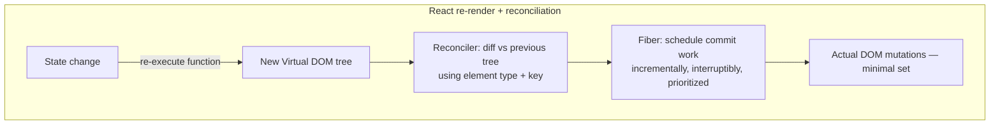
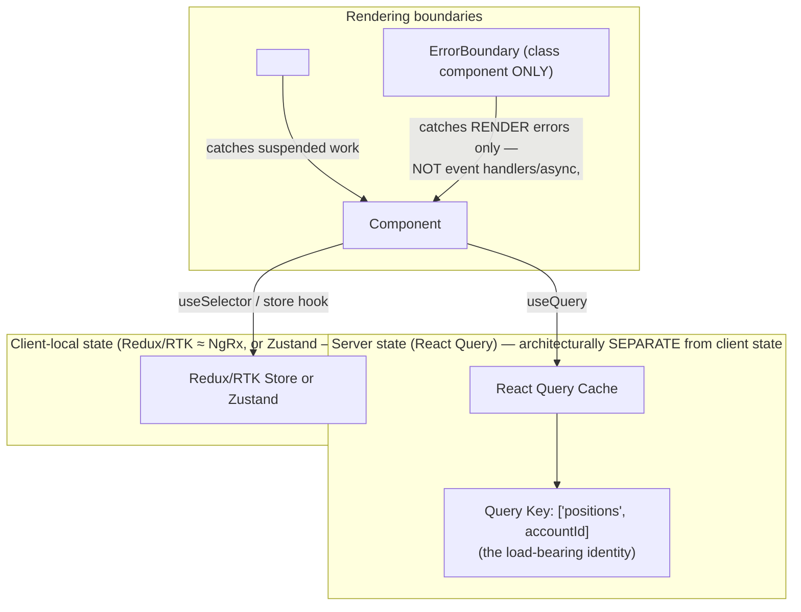
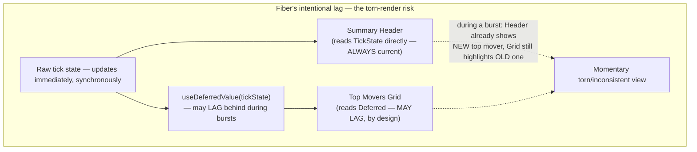

# React — Complete Interview Prep (All Topics, One File)

> Domain: React | Level: Beginner → Expert | Prerequisite: [[../42-Angular/01-Angular-Interview-Prep]] (comparative baseline), [[../41-OAuth2-OIDC-JWT-PKCE/01-OAuth2-OIDC-JWT-Interview-Prep]] §10 (SPA security, BFF)
> **Quick-prep edition** (consolidated 2026-10-03). This one file replaces Modules 159–161. Originals: `git show ebb2d5c:43-React/<file>.md`
> Each topic has: **Key concepts → TypeScript/JSX code → Most common interview questions with answers.** Targets React 18/19 (concurrent rendering, Actions, React Compiler).

| # | Topic | # | Topic |
|---|---|---|---|
| 1 | React's model: UI = f(state); vs Angular | 9 | Server state: TanStack Query |
| 2 | JSX, components, props & composition | 10 | Forms & React 19 Actions |
| 3 | Virtual DOM, reconciliation & Fiber | 11 | Error boundaries & Suspense |
| 4 | Keys & list rendering | 12 | Concurrent rendering: transitions, deferred values, tearing |
| 5 | State & hooks: useState, useReducer, rules of hooks | 13 | Performance & React Compiler |
| 6 | useEffect, stale closures & cleanup | 14 | Routing, SSR/RSC & Next.js |
| 7 | Memoization: memo, useMemo, useCallback | 15 | Security, testing & accessibility |
| 8 | Context, custom hooks & client state (Redux Toolkit, Zustand) | 16 | Capstone: TradeView-React (vs Angular) |
| | | 17 | Top 35 rapid-fire + Principal · 18 Mistakes checklist |

---

## 1. React's Model: UI = f(state); vs Angular

**Key concepts**
- React is a **UI library**: components are functions that return a description of UI from props and state; when state changes React **re-renders** the component and reconciles the result to the DOM.
- **One-way data flow**: data down via props, events up via callbacks.
- Ecosystem choices you own: routing (React Router/TanStack Router), data fetching (TanStack Query/RTK Query), state (Redux Toolkit/Zustand), forms (React Hook Form), framework (Next.js/Remix-React Router v7).

| Concern | Angular | React |
|---|---|---|
| Nature | Framework (DI, router, forms, HTTP) | Library + ecosystem |
| Rendering update | Change detection (Zone.js/signals) checks bindings | Re-render component → diff virtual DOM |
| Opt-out of work | OnPush, signals | memo/useMemo/useCallback, React Compiler |
| DI | Hierarchical injector | Context (thinner; no per-instance scopes by default) |
| List identity | `track` | `key` |
| Global state | NgRx | Redux Toolkit / Zustand |
| Templates | HTML templates + control flow | JSX (JavaScript expressions) |

**Common interview question**

**Q. Why choose React over Angular (or vice versa) for an enterprise?**
React: flexibility, huge ecosystem/hiring pool, Next.js for SSR/RSC; the cost is assembling and governing your own stack. Angular: one opinionated toolkit (DI, forms, router, testing) with consistent conventions across many teams. Choose on team skills, consistency needs, SSR requirements and the organization's ability to govern ecosystem choices.

---

## 2. JSX, Components, Props & Composition

**Key concepts**
- **JSX** compiles to `jsx()` calls producing elements (plain objects). Expressions in `{}`; `className`; conditional rendering with `&&`/ternaries.
- **Function components** only in modern code; props are read-only.
- **Composition over inheritance:** `children`, render props, component slots via props; compound components.
- **Controlled vs uncontrolled** inputs: value in state vs DOM (`ref`).
- React 19: `ref` as a normal prop (no `forwardRef` needed), `<Context>` as provider, document metadata (`<title>`) in components.

```tsx
type Position = { isin: string; qty: number; price: number };

function PositionRow({ position, onClose }: { position: Position; onClose: (isin: string) => void }) {
  const marketValue = position.qty * position.price;
  return (
    <tr>
      <td>{position.isin}</td>
      <td>{position.qty}</td>
      <td>{marketValue.toLocaleString('en-GB', { style: 'currency', currency: 'EUR' })}</td>
      <td><button onClick={() => onClose(position.isin)}>Close</button></td>
    </tr>
  );
}

function Card({ title, children }: { title: string; children: React.ReactNode }) {
  return <section className="card"><h3>{title}</h3>{children}</section>;   // composition via children
}
```

**Common interview question**

**Q. Controlled vs uncontrolled components?**
Controlled: React state is the source of truth (`value` + `onChange`) — easy validation and derived UI, re-renders per keystroke. Uncontrolled: the DOM holds the value, read via ref or form submission — fewer re-renders, simpler for large forms (React Hook Form uses this approach).

---

## 3. Virtual DOM, Reconciliation & Fiber

**Key concepts**
- **Render phase:** call components to produce a new element tree; **reconciliation** diffs it against the previous tree; **commit phase** applies minimal DOM changes and runs layout effects/effects.
- **Diff heuristics (O(n)):** different element types → replace subtree; same type → update props and recurse; lists matched by **key**.
- **Fiber:** the reconciler's unit-of-work data structure, enabling **interruptible, prioritized rendering** (concurrent features): render work can be paused, resumed or discarded; commit is synchronous.
- **Batching:** state updates are batched automatically (React 18+), including in promises/timeouts.
- Contrast with Angular Ivy: Angular compiles templates to update instructions and checks bindings; React re-executes components and diffs output.

**Common interview questions**

**Q1. What happens when you call `setState`?**
React schedules an update with a priority (lane), batches it with other updates, re-renders the component (and by default its children) in the render phase, reconciles against the previous tree, then commits DOM changes and runs effects.

**Q2. Is the virtual DOM "fast"?**
It's not inherently faster than direct DOM manipulation; it's a programming model that makes declarative UI practical with reasonable performance. Cost comes from re-rendering components — the main optimization lever is avoiding unnecessary renders and keeping render functions cheap.

---

## 4. Keys & List Rendering

- `key` gives list items a stable identity across renders so React can move/update items instead of recreating them.
- Use **stable IDs** (trade ID, ISIN), not array indexes when the list can reorder/insert/delete — index keys cause **state attached to the wrong row** (input values, focus, expanded state) and unnecessary re-renders.
- Changing a component's key intentionally **resets its state** (a useful trick).

```tsx
{trades.map(t => <TradeRow key={t.id} trade={t} />)}
<TradeForm key={selectedAccountId} accountId={selectedAccountId} />   {/* reset form state when the account changes */}
```

**Common interview question**

**Q. Why are index keys a bug, not just a performance issue?**
When items are inserted or reordered, the index now points to a different item, so React reuses the wrong component instance — its local state (typed text, checkboxes, expanded rows) appears on the wrong record. In a trading blotter that's a correctness problem.

---

## 5. State & Hooks: useState, useReducer, Rules of Hooks

**Key concepts**
- **`useState`** — local state; updates are asynchronous and batched; use the **functional updater** (`setCount(c => c + 1)`) when based on previous state; state must be **updated immutably**.
- **`useReducer`** — complex state transitions in a pure reducer (actions) — testable, predictable.
- **`useRef`** — mutable value that doesn't trigger renders; DOM refs.
- **Rules of Hooks:** call hooks only at the top level of components/custom hooks, never conditionally or in loops — React identifies hook state by **call order**.
- **Derive, don't store:** compute derived values during render instead of syncing extra state with effects.
- React 19: `use(promise | context)` can be called conditionally (exception to the rule), `useOptimistic`, `useActionState`, `useFormStatus`.

```tsx
type State = { status: 'idle' | 'submitting' | 'done' | 'error'; error?: string };
type Action = { type: 'submit' } | { type: 'success' } | { type: 'failure'; error: string };

function reducer(state: State, action: Action): State {
  switch (action.type) {
    case 'submit':  return { status: 'submitting' };
    case 'success': return { status: 'done' };
    case 'failure': return { status: 'error', error: action.error };
  }
}

function OrderTicket({ price, limit }: { price: number; limit: number }) {
  const [qty, setQty] = useState(0);
  const [state, dispatch] = useReducer(reducer, { status: 'idle' });
  const notional = qty * price;                 // derived during render — no extra state/effect
  const overLimit = notional > limit;
  return (
    <>
      <input type="number" value={qty} onChange={e => setQty(Number(e.target.value))} />
      <p>Notional: {notional}</p>
      {overLimit && <p className="warn">Exceeds your limit</p>}
      <button disabled={overLimit || state.status === 'submitting'} onClick={() => dispatch({ type: 'submit' })}>Send</button>
    </>
  );
}
```

**Common interview questions**

**Q1. Why can't hooks be called conditionally?**
React stores hook state in a list per component instance and matches hooks by call order on each render. A conditional call shifts the order, so the wrong state is read. Lint with `eslint-plugin-react-hooks`.

**Q2. Why doesn't my state update immediately after `setState`?**
State updates are scheduled and batched; the variable in the current render is a snapshot. The new value appears on the next render. Use the functional updater for sequential updates and derived values for computed data.

---

## 6. useEffect, Stale Closures & Cleanup

**Key concepts**
- **`useEffect`** synchronizes a component with an **external system** (subscriptions, WebSockets, timers, non-React widgets, analytics) after commit. **Not for** derived state or handling user events ("You might not need an effect").
- **Dependency array**: effect re-runs when listed values change; omitting dependencies causes **stale closures** (the effect sees old props/state).
- **Cleanup** function runs before the next effect and on unmount → unsubscribe, abort fetches, clear timers.
- **Strict Mode** (dev) mounts → unmounts → remounts to surface missing cleanup.
- **Race conditions in fetching**: ignore/abort stale responses (AbortController) — or use TanStack Query.
- `useLayoutEffect` for measuring layout before paint; `useEffectEvent` (React 19.2) to read the latest values without re-subscribing.

```tsx
function usePriceStream(isin: string) {
  const [price, setPrice] = useState<number | null>(null);
  useEffect(() => {
    const ws = new WebSocket(`wss://md.example.com/prices/${isin}`);
    ws.onmessage = e => setPrice(JSON.parse(e.data).price);
    return () => ws.close();                     // cleanup: no leaked sockets when isin changes/unmounts
  }, [isin]);                                     // re-subscribe when isin changes
  return price;
}

// Stale closure bug and fix
function Ticker() {
  const [count, setCount] = useState(0);
  useEffect(() => {
    const id = setInterval(() => setCount(c => c + 1), 1000);   // functional update avoids stale `count`
    return () => clearInterval(id);
  }, []);
  return <span>{count}</span>;
}
```

**Common interview questions**

**Q1. What is a stale closure in React?**
A function created in an earlier render captures that render's props/state. If an effect or callback isn't recreated when those values change (missing dependency), it keeps using old values — e.g., an interval always seeing `count = 0`. Fix with correct dependencies, functional updates, refs or `useEffectEvent`.

**Q2. Why does my effect run twice in development?**
Strict Mode deliberately mounts, unmounts and remounts components to reveal effects without proper cleanup. It doesn't happen in production; the fix is idempotent effects with cleanup.

---

## 7. Memoization: memo, useMemo, useCallback

**Key concepts**
- By default, **a parent re-render re-renders all children** (the inverse of Angular OnPush).
- **`React.memo(Component)`** skips re-render if props are shallowly equal.
- **`useMemo`** caches an expensive computed value; **`useCallback`** caches a function identity so memoized children don't re-render.
- Memoization helps only when props are stable — new object/array/function literals each render break it.
- **React Compiler** (stable 1.0, 2025) auto-memoizes components and hooks at build time → much less manual `useMemo`/`useCallback`.
- Other levers: move state down (colocate), lift content up (`children`), split contexts, virtualize lists.

```tsx
const TradeRow = memo(function TradeRow({ trade, onSelect }: { trade: Trade; onSelect: (id: string) => void }) {
  return <tr onClick={() => onSelect(trade.id)}><td>{trade.id}</td><td>{trade.qty}</td></tr>;
});

function Blotter({ trades, filter }: { trades: Trade[]; filter: string }) {
  const [selected, setSelected] = useState<string>();
  const visible = useMemo(() => trades.filter(t => t.symbol.includes(filter)), [trades, filter]);
  const onSelect = useCallback((id: string) => setSelected(id), []);   // stable identity for memoized rows
  return <table><tbody>{visible.map(t => <TradeRow key={t.id} trade={t} onSelect={onSelect} />)}</tbody></table>;
}
```

**Common interview question**

**Q. Should you wrap everything in useMemo/useCallback?**
No. Memoization has costs (memory, comparisons, complexity) and only helps when it prevents expensive work or re-renders of memoized children. Profile first; fix structure (state colocation, children composition); with React Compiler most manual memoization becomes unnecessary.

---

## 8. Context, Custom Hooks & Client State (Redux Toolkit, Zustand)

**Key concepts**
- **Context** passes values through the tree without prop drilling (theme, auth user, locale). **Every consumer re-renders when the value changes** → split contexts, memoize values, avoid high-frequency data in context.
- Context is DI-adjacent but thinner than Angular DI: no per-instance scoping/resolution modifiers by default (you create a provider per subtree to emulate scoping).
- **Custom hooks** extract reusable stateful logic (`usePriceStream`, `useAuth`).
- **Client state libraries:** **Redux Toolkit** (slices, Immer, RTK Query; structural parity with NgRx — actions/reducers/selectors/middleware), **Zustand** (minimal store with selector subscriptions), Jotai (atoms).
- **Server state ≠ client state** → server data belongs in TanStack Query/RTK Query caches, not global client stores.

```tsx
// Per-desk store with Zustand + context (emulating Angular's per-component provider scope)
const createDeskStore = () => createStore<DeskState>()(set => ({
  filter: '', positions: [],
  setFilter: filter => set({ filter }),
  setPositions: positions => set({ positions }),
}));
const DeskStoreContext = createContext<ReturnType<typeof createDeskStore> | null>(null);

function DeskProvider({ children }: { children: React.ReactNode }) {
  const [store] = useState(createDeskStore);                         // one store per <DeskProvider> instance
  return <DeskStoreContext value={store}>{children}</DeskStoreContext>;
}
function useDesk<T>(selector: (s: DeskState) => T) {
  const store = useContext(DeskStoreContext);
  if (!store) throw new Error('useDesk must be used inside DeskProvider');
  return useStore(store, selector);                                  // re-render only when the selected slice changes
}
```

**Common interview questions**

**Q1. Context vs Redux?**
Context is a transport for low-frequency values; every consumer re-renders on change and there are no selectors. Redux/Zustand provide stores with selector-based subscriptions, middleware, devtools — suited to frequently changing shared state. Server data should live in a query cache instead.

**Q2. How do you get per-component-instance state scope like Angular's component providers?**
Create the store inside a provider component (`useState(createStore)`), expose it via context, and consume with selector hooks — each provider instance owns a separate store.

---

## 9. Server State: TanStack Query

**Key concepts**
- Server state is **remote, shared, async, potentially stale** → caching, deduplication, background refetching, stale-while-revalidate, retries, pagination, optimistic updates, invalidation.
- **Query keys** identify cache entries — include **every parameter** (account, tenant, filters) or users see each other's/wrong data (cache-key scoping bug).
- `staleTime` vs `gcTime`; `invalidateQueries` after mutations; `useSuspenseQuery`.

```tsx
const positionsQuery = (accountId: string) => queryOptions({
  queryKey: ['positions', accountId],                 // key includes all inputs
  queryFn: ({ signal }) => fetch(`/api/accounts/${accountId}/positions`, { signal }).then(r => r.json() as Promise<Position[]>),
  staleTime: 30_000,
});

function Positions({ accountId }: { accountId: string }) {
  const { data, isPending, error } = useQuery(positionsQuery(accountId));
  if (isPending) return <Spinner />;
  if (error) return <ErrorPanel error={error} />;
  return <PositionsTable rows={data} />;
}

function useClosePosition(accountId: string) {
  const qc = useQueryClient();
  return useMutation({
    mutationFn: (isin: string) => fetch(`/api/accounts/${accountId}/positions/${isin}/close`,
      { method: 'POST', headers: { 'Idempotency-Key': crypto.randomUUID() } }),
    onSuccess: () => qc.invalidateQueries({ queryKey: ['positions', accountId] }),
  });
}
```

**Common interview question**

**Q. Why not fetch in useEffect and store results in Redux?**
You'd re-implement caching, dedupe, race handling, retries, background refresh and invalidation — usually with bugs. Query libraries handle server-state concerns declaratively; Redux stays for genuinely client-owned state.

---

## 10. Forms & React 19 Actions

- **React Hook Form** (uncontrolled, performant) + **Zod** schemas for validation; or Formik (older).
- **React 19 Actions:** `<form action={fn}>`, **`useActionState`** (pending state + result), **`useFormStatus`**, **`useOptimistic`** (optimistic UI with automatic rollback); works with Server Actions in frameworks.
- Double-submit protection, idempotency keys and server-side validation remain mandatory for payments.

```tsx
function PaymentForm() {
  const [state, submit, isPending] = useActionState(async (_prev: { error?: string } | null, form: FormData) => {
    const res = await fetch('/api/payments', {
      method: 'POST',
      headers: { 'Content-Type': 'application/json', 'Idempotency-Key': String(form.get('idemKey')) },
      body: JSON.stringify({ iban: form.get('iban'), amount: Number(form.get('amount')) }),
    });
    return res.ok ? null : { error: (await res.json()).title as string };
  }, null);
  const [idemKey] = useState(() => crypto.randomUUID());
  return (
    <form action={submit}>
      <input type="hidden" name="idemKey" value={idemKey} />
      <input name="iban" required pattern="[A-Z]{2}[0-9]{2}[A-Z0-9]{11,30}" />
      <input name="amount" type="number" min="0.01" step="0.01" required />
      <button disabled={isPending}>Pay</button>
      {state?.error && <p role="alert">{state.error}</p>}
    </form>
  );
}
```

---

## 11. Error Boundaries & Suspense

**Key concepts**
- **Error boundaries** catch errors **during rendering, lifecycle and constructors** of descendants and show fallback UI. They do **not** catch errors in event handlers, async code (promises, setTimeout), SSR, or the boundary itself → handle those with try/catch and state, or rethrow into render.
- Still class-only (`getDerivedStateFromError`, `componentDidCatch`) — commonly used via `react-error-boundary`.
- **Suspense** shows a fallback while children wait (lazy components, `use(promise)`, suspense-enabled data libraries); nested boundaries control loading granularity.

```tsx
const RiskChart = lazy(() => import('./RiskChart'));

<ErrorBoundary fallbackRender={({ error, resetErrorBoundary }) => <ErrorPanel error={error} onRetry={resetErrorBoundary} />}>
  <Suspense fallback={<ChartSkeleton />}>
    <RiskChart accountId={accountId} />
  </Suspense>
</ErrorBoundary>
```

**Common interview question**

**Q. Will an error boundary catch a failed fetch in onClick?**
No — event handlers and async callbacks run outside rendering. Catch the error and set error state (or use a query library's error state); with `react-error-boundary`, `showBoundary(error)` can forward it to the nearest boundary.

---

## 12. Concurrent Rendering: Transitions, Deferred Values, Tearing

- **`startTransition`/`useTransition`** — mark updates as non-urgent (filtering a big list) so urgent ones (typing) stay responsive; React can interrupt and restart the transition render.
- **`useDeferredValue`** — render with a lagging copy of a value for expensive children.
- **Tearing:** with interruptible rendering, components reading an **external mutable store** could show inconsistent values within one render → use **`useSyncExternalStore`** (Redux/Zustand do) for external stores; never read mutable globals during render.

```tsx
function InstrumentFilter({ instruments }: { instruments: Instrument[] }) {
  const [query, setQuery] = useState('');
  const deferredQuery = useDeferredValue(query);                    // typing stays responsive
  const results = useMemo(() => instruments.filter(i => i.name.includes(deferredQuery)), [instruments, deferredQuery]);
  return <>
    <input value={query} onChange={e => setQuery(e.target.value)} />
    <div style={{ opacity: query !== deferredQuery ? 0.6 : 1 }}><InstrumentList items={results} /></div>
  </>;
}

// External store (market data) read safely under concurrent rendering
const price = useSyncExternalStore(marketData.subscribe, () => marketData.getPrice(isin));
```

**Common interview question**

**Q. What is tearing and how do you prevent it?**
In concurrent rendering, a render can be paused while an external store changes, so parts of the UI render with old values and parts with new — an inconsistent screen (dangerous in a trading UI). `useSyncExternalStore` forces consistent snapshots; state managed by React (useState/useReducer) is safe.

---

## 13. Performance & React Compiler

**Checklist**
- Measure with React DevTools Profiler and Core Web Vitals (INP especially).
- Colocate state; avoid high-frequency values in context; split components.
- React Compiler or targeted `memo`/`useMemo`/`useCallback`.
- **Virtualize** long lists (TanStack Virtual, react-window) with stable keys.
- Batch high-frequency updates (market ticks) — buffer and flush per animation frame; use transitions for non-urgent updates.
- Code splitting with `lazy` + Suspense, route-based chunks; analyze bundles.
- Avoid expensive work in render; web workers for heavy computation.
- SSR/streaming and RSC to reduce client JS.

---

## 14. Routing, SSR/RSC & Next.js

- **Client routing:** React Router (v7 also as a framework mode), TanStack Router (type-safe); route-level code splitting and loaders.
- **SSR** renders HTML on the server then **hydrates**; **streaming SSR** with Suspense; **React Server Components (RSC)**: components that run only on the server (zero client JS, direct data access), mixed with `'use client'` components; **Server Actions** for mutations.
- **Next.js App Router** implements RSC, streaming, caching and server actions — choose it when SEO/first-paint matter; internal dashboards are often fine as SPAs (Vite) behind a BFF.
- Security with RSC/Server Actions: they're public endpoints — authenticate and authorize every action; don't leak server-only data into client props.

**Common interview question**

**Q. SPA or Next.js for an internal trading dashboard?**
Usually a Vite SPA behind a BFF: authenticated users, no SEO needs, heavy real-time client interactivity. Next.js/RSC shines for public, content-heavy or SEO-sensitive apps and for reducing client JS; it adds server infrastructure and caching complexity.

---

## 15. Security, Testing & Accessibility

- **XSS:** JSX escapes by default; `dangerouslySetInnerHTML` only with sanitized content (DOMPurify); validate URLs (`javascript:` in `href`); CSP.
- **Auth:** BFF pattern with HttpOnly cookies + CSRF protection; or OIDC code + PKCE with in-memory tokens; never secrets in the bundle; client-side route protection is UX only.
- **Testing:** Vitest/Jest + **React Testing Library** (test behaviour via roles/labels), MSW for API mocking, Playwright for E2E.
- **Accessibility:** semantic HTML, labels, focus management in modals (focus trap, return focus), `aria-live` for streaming updates, keyboard support; eslint-plugin-jsx-a11y; axe in CI.

```tsx
test('shows API error on failed payment', async () => {
  server.use(http.post('/api/payments', () => HttpResponse.json({ title: 'Insufficient funds' }, { status: 422 })));
  render(<PaymentForm />);
  await userEvent.type(screen.getByRole('textbox', { name: /iban/i }), 'GB82WEST12345698765432');
  await userEvent.type(screen.getByRole('spinbutton', { name: /amount/i }), '100');
  await userEvent.click(screen.getByRole('button', { name: /pay/i }));
  expect(await screen.findByRole('alert')).toHaveTextContent('Insufficient funds');
});
```

---

## 16. Capstone: TradeView-React (vs Angular)

Rebuilding the Angular trading dashboard ([[../42-Angular/01-Angular-Interview-Prep]] §16) in React:
- **Inherits cleanly:** feature-based structure, BFF auth, Module Federation micro-frontends (near-total parity), Redux Toolkit for cross-desk state (parity with NgRx), virtualization with stable keys (`key` ≈ `track`), server state in TanStack Query.
- **The missing primitive:** no native per-component-instance DI scope → per-desk stores via provider components + context + selector hooks (§8).
- **New failure mode:** concurrent rendering + external market-data store → **tearing** risk → `useSyncExternalStore` for the price store; `useDeferredValue` only for non-critical views (never for the price shown on the order ticket at submit time).
- **High-frequency updates:** buffer ticks outside React, flush per animation frame into the store; rows subscribe by instrument ID selector.
- **Order entry:** Actions/`useActionState` or React Hook Form, disabled while pending, idempotency key, server validation, confirmation for large orders, error boundary per panel so a failing chart doesn't take down order entry.

**Common interview question**

**Q. What's genuinely different when porting an Angular trading app to React?**
Mostly parity (stores, federation, virtualization). The real differences: no hierarchical DI (emulate scoped stores with context providers), default re-render-everything semantics (need memoization/compiler and selector subscriptions), and concurrent rendering's tearing risk with external stores (use `useSyncExternalStore`).

---

## 17. Top 35 Rapid-Fire Questions + Principal Questions

1. **React?** UI library; UI = f(state).
2. **JSX?** Syntax compiled to element objects.
3. **Props vs state?** Inputs vs internal memory.
4. **Reconciliation?** Diff new vs old tree.
5. **Fiber?** Interruptible, prioritized render work units.
6. **Batching?** Automatic in React 18+.
7. **Keys?** Stable identity in lists; not indexes.
8. **Key reset trick?** Change key to remount.
9. **Rules of hooks?** Top level only; call order.
10. **Functional updater?** `setX(x => …)`.
11. **useReducer?** Complex transitions in pure reducer.
12. **useRef?** Mutable value without re-render.
13. **useEffect purpose?** Sync with external systems.
14. **Stale closure?** Old render's values captured.
15. **Effect twice in dev?** Strict Mode remount check.
16. **Cleanup?** Unsubscribe/abort/clear.
17. **memo?** Skip re-render on equal props.
18. **useMemo vs useCallback?** Value vs function identity.
19. **React Compiler?** Automatic memoization.
20. **Context pitfall?** All consumers re-render.
21. **Redux Toolkit?** Slices + Immer + RTK Query.
22. **Zustand?** Minimal selector-based store.
23. **Server state?** TanStack Query.
24. **Query key rule?** Include every input.
25. **Error boundaries miss?** Events, async, SSR.
26. **Suspense?** Declarative loading fallbacks.
27. **useTransition?** Non-urgent updates.
28. **useDeferredValue?** Lagging value for expensive renders.
29. **Tearing?** Inconsistent external store reads → useSyncExternalStore.
30. **useActionState?** Form action state + pending.
31. **useOptimistic?** Optimistic UI with rollback.
32. **RSC?** Server-only components, no client JS.
33. **Server Actions security?** Public endpoints — authorize.
34. **dangerouslySetInnerHTML?** Sanitize or avoid.
35. **Testing?** RTL + MSW + Playwright.

**Principal-level questions**

**P1. Standardize the React stack for 15 teams.**
A paved road: Vite (or Next.js where SSR/SEO matters), TypeScript strict, React Router/TanStack Router, TanStack Query for server state, Zustand/RTK for client state with a decision guide, React Hook Form + Zod, shared design system with accessibility, BFF auth, React Compiler, lint rules (hooks, a11y), RTL/MSW/Playwright templates, performance budgets in CI, and an architecture review for deviations.

**P2. React or Angular for a new bank-wide platform?**
Assess team skills and hiring, consistency needs, existing component libraries, SSR needs and governance capacity. Angular reduces stack decisions and enforces consistency; React offers ecosystem breadth and Next.js. Either works with a strong paved road; mixing both doubles platform cost unless micro-frontend boundaries justify it.

---

## 18. Mistakes Checklist (say why each is wrong)
- [ ] Index keys on dynamic lists · mutating state in place
- [ ] Hooks called conditionally · missing effect dependencies (stale closures)
- [ ] Effects for derived state or event handling · no cleanup for subscriptions
- [ ] Fetching in effects without race handling · server data in Redux
- [ ] Query keys missing tenant/account parameters
- [ ] High-frequency data in context · memoizing everything blindly
- [ ] Reading mutable external stores during render (tearing)
- [ ] Expecting error boundaries to catch async/event errors
- [ ] Tokens in localStorage · `dangerouslySetInnerHTML` with user content · unauthorized Server Actions

---

## Architecture Diagrams (preserved from the original modules)

> All 10 Mermaid/ASCII diagrams from the original `43-React/` files, kept verbatim and grouped by source module. Originals: `git show ebb2d5c:43-React/<file>.md`.

### Module 159 — React Fundamentals: Virtual DOM, Fiber Reconciliation & Hooks — Comparative Against Angular
*Source: `01-React-Fundamentals-VirtualDOM-Fiber-Hooks-vs-Angular.md`*

**1. Fundamentals**

```text
JSX (declarative UI description, compiled to React.createElement calls)
 │
 Component function re-executes on every state change (re-render)
 │
 Virtual DOM: a new element tree is produced in memory
 │
 Reconciliation (diffing): compare new tree against previous tree,
 │ using element type + `key` for identity
 │
 Fiber: schedules the actual DOM commit work incrementally,
 │ interruptibly, prioritized — NOT a synchronous,
 │ single-pass walk the way Angular's change detection is
 │
 Hooks thread through all of it: useState/useReducer hold state across
 re-renders via call-order identity; useEffect handles side effects
 and subscriptions, the rough functional equivalent of Angular's
 ngOnInit/ngOnDestroy PLUS manual RxJS subscription management combined
```

**3. Visual Architecture**



**12. System Design**

```text
 Shell (React) — Module Federation (same underlying Webpack mechanism as
; the shared-dependency-negotiation risk
 applies IDENTICALLY to a React-based federation setup — this is a case
 of genuine parity, not divergence, since the risk lives in Webpack's
 runtime, not either framework's own reactivity model)
 │
 ├─ Context-provided cross-desk state (entitlements, alerts) —
 │ React's counterpart to the shell's NgRx store, though typically
 │ paired with a state library (Redux/Zustand) for
 │ anything beyond simple value distribution, since Context alone
 │ lacks NgRx's Action/Reducer traceability discipline (I7)
 │
 └── Remote: Equities Desk
 ├─ useBufferedTicks (Expert exercise) — buffered WebSocket ingestion
 ├─ memo-wrapped, key-correct virtualized grid (Hard/Easy exercises)
 └─ Order-entry form with useRef-based current-value access (Medium exercise)
```

**13. Low-Level Design**

```text
useBufferedTicks (custom Hook, Expert exercise)
 ├─ internal useRef<Map> buffer, internal useState<Tick[]> flushed output
 └─ returns Tick[] — consumed via useDeferredValue for Fiber-aware scheduling

GridRow (memo-wrapped, Hard exercise)
 ├─ requires STABILIZED props (useCallback/useMemo in the parent) to
 │ actually benefit from memo — a CONTRACT the parent must uphold,
 │ unlike Angular's OnPush, which depends on the CHILD's own input
 │ handling (immutability discipline) rather than the PARENT's callback
 │ stabilization discipline — a genuine architectural divergence worth
 │ naming explicitly (Advanced Q6's escape-hatch parallel doesn't fully
 │ cover this asymmetry: OnPush's correctness burden sits with whoever
 │ MUTATES the input; memo's correctness burden sits with whoever
 │ CONSTRUCTS the props passed down)
 └─ key: symbol (Easy exercise)

orderPriceRef pattern (Medium exercise)
 └─ generalizes to any "subscribe once, read current value" scenario
```

### Module 160 — Advanced React: State Management, Data Fetching, Error Boundaries & Micro-Frontends — Comparative Against Angular
*Source: `02-Advanced-React-StateManagement-DataFetching-Performance-vs-Angular.md`*

**3. Visual Architecture**



**12. System Design**

```text
 Shell (React) — Module Federation, IDENTICAL risk profile to

 ├─ Shared QueryClient config (A9's governed defaults: explicit
 │ staleTime requirement, typed key-factory enforcement)
 │
 ├─ Client-local cross-desk state: Redux/RTK or Zustand (I7)
 │
 └── Remote: Equities Desk
 ├─ DeskErrorBoundary (Hard exercise) at the remote's root
 ├─ usePositions (Easy exercise) — typed, fully-scoped query key
 ├─ usePositionFillInvalidation (Medium exercise) — event-driven freshness
 ├─ useCacheConsistencyCanary (Expert exercise) — production safety net
 └─ explicit try/catch around order-submission onClick (Hard/I3)
```

**13. Low-Level Design**

```text
positionKeys (typed key factory, Easy exercise)
 └─ byAccount(deskId, accountId): structurally prevents under-scoped keys

usePositions (Easy exercise)
 └─ useQuery with governed key + explicit staleTime

usePositionFillInvalidation (Medium exercise)
 └─ WebSocket-driven queryClient.invalidateQueries — bridges real-time
 events into React Query's otherwise passive staleness model

ErrorBoundaryImpl / DeskErrorBoundary (Hard exercise)
 ├─ class component (STRUCTURALLY REQUIRED,/A4)
 └─ functional-component-friendly wrapper — most consuming code never
 touches the class directly, matching modern Hooks-first React style

useCacheConsistencyCanary (Expert exercise)
 └─ periodic self-consistency check, independent of and complementary to
 the query-key governance layer — catches what governance MISSES,
 not a substitute for correct governance
```

### Module 161 — React Capstone: Enterprise-Scale Real-Time Trading Dashboard — Comparative Rebuild Against the Angular Original
*Source: `03-Capstone-TradeView-React-ComparativeRebuild.md`*

**1. Fundamentals**

```text
Shell (React) — Module Federation (IDENTICAL risk to the Angular shell)
 │
 ├─ Redux/RTK store (cross-desk state ONLY, ≈ the NgRx scoping discipline)
 │
 ├── Remote: Equities Desk
 │ ├─ React Query (buying-power validation via async-safe query, positions via
 │ │ correctly-scoped cache keys, the fix applied from day one)
 │ ├─ react-window virtualized grid, memo-wrapped rows, key=symbol ('s
 │ │ lesson applied from day one — NOT this capstone's incident)
 │ ├─ useDeferredValue-scheduled tick updates (Fiber-aware,/)
 │ └─ "Mini Portfolio" widget — per-account isolated state (THIS capstone's new ground,
 │ — approximating Angular's component-scoped DI with no native equivalent)
 │
 └── DeskErrorBoundary per remote
```

**3. Visual Architecture**



**13. Low-Level Design**

```text
useMiniPortfolioState(accountId) (Easy exercise)
 └─ ALL state declared via useState INSIDE the hook body — genuine per-instance
 isolation, verified by the cross-instance isolation test (I5)

TopMoversGrid (Hard exercise)
 ├─ useDeferredValue(currentTicks) — intentional, documented lag
 ├─ isLagging derived via reference comparison
 └─ explicit "Updating…" indicator — closes the coordination gap

useTornRenderCanary (Medium exercise)
 └─ periodic cross-view comparison — production safety net, independent
 of and complementary to the Hard exercise's proactive UI fix
```
