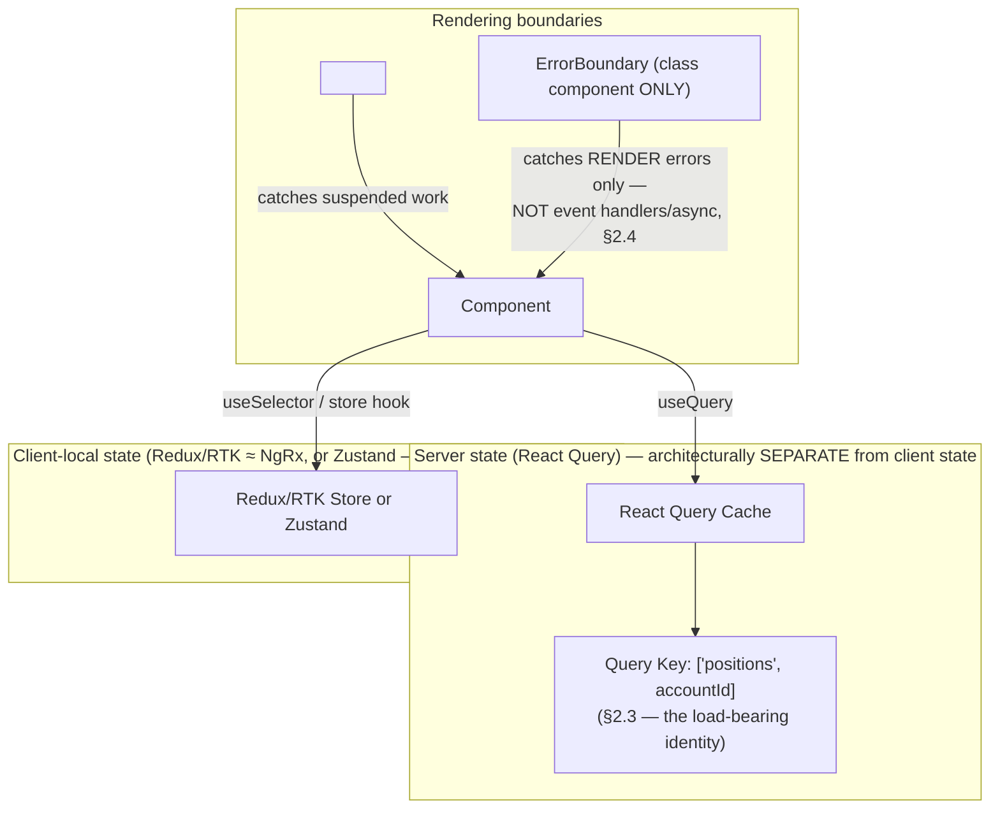

# Module 160 — Advanced React: State Management, Data Fetching, Error Boundaries & Micro-Frontends — Comparative Against Angular

> Domain: React | Level: Beginner → Expert | Prerequisite: [[../43-React/01-React-Fundamentals-VirtualDOM-Fiber-Hooks-vs-Angular]] (this module's comparative counterpart is [[../42-Angular/02-Advanced-Angular-StateManagement-Forms-Performance-MicroFrontends]] — same mapping convention: state parity noted explicitly, divergences developed in depth)

>
> **Scope note:** Second of three modules scoping `43-React`, mapping directly onto Module 157. Redux's Action/Reducer/Store pattern is near-total structural parity with NgRx (NgRx was explicitly modeled after Redux) — stated once, not re-derived. This module's actual new ground is where React's ecosystem genuinely diverges: server-state data-fetching libraries (React Query/TanStack Query) as a first-class architectural category Angular's culture doesn't separate as sharply, Suspense's declarative loading-boundary model, Error Boundaries' React-specific catch-scope limitations, and the ecosystem-fragmentation-versus-governance tension Module 159 §15/I10/A7 already introduced and this module now examines concretely through a state-library selection lens.

---

## 1. Fundamentals

**What:** Four techniques addressing the same "application beyond one team, one component tree" scaling problem Module 157 examined for Angular: **Redux (or Redux Toolkit) and its lighter-weight alternatives** (Zustand, Jotai, Recoil — client-state management, near-parity with NgRx structurally, but ecosystem-fragmented rather than singular), **React Query/TanStack Query** (server-state fetching, caching, and synchronization — a genuinely distinct architectural category with no single, equally-dominant Angular counterpart), **Suspense and Error Boundaries** (React's declarative loading/error-boundary primitives, structurally unlike anything in Angular's lifecycle-hook model), and **Module Federation** (functionally near-identical to Module 157 §2.6 — the underlying mechanism and its composition risk are Webpack-runtime concerns, not framework-specific ones).

**Why:** Module 159 established that React's ecosystem is unopinionated by design (§1, I10) — this module's central finding is exactly what that unopinionated-ness produces in practice: where Angular ships one blessed state-management answer (NgRx) and one blessed forms answer (Reactive Forms), React's ecosystem offers *several* mutually-competing, individually-reasonable answers to the same problems, each with genuinely different trade-offs, requiring the *organization*, not the framework, to make and enforce the equivalent consistency decision Module 159 A7 already flagged as React's distinguishing governance burden.

**When:** Redux/RTK matters for genuinely cross-cutting, traceable client state (Module 157 §15's Option C tiering, mapped directly). React Query matters specifically for *server-derived* state — data fetched from an API that has its own independent lifecycle, caching, and staleness semantics distinct from purely client-local UI state — a distinction this course's Elite FinTech lens treats as architecturally significant given how much of a trading platform's state is genuinely server-authoritative (positions, orders, entitlements) rather than client-invented. Error Boundaries matter specifically for isolating one component subtree's render-time failure from crashing the entire application, directly analogous to Module 157 I7's remote-load-failure isolation but for in-tree render errors specifically.

**How (30,000-ft view):**
```
Client-local, cross-cutting state:  Redux/RTK (≈ NgRx, near-total parity)
                                     or Zustand/Jotai (lighter, atomic — no
                                     direct Angular counterpart)

Server-derived state:               React Query — fetches, CACHES (with
                                     explicit staleness/invalidation
                                     semantics), and synchronizes server
                                     data, treated as architecturally
                                     DISTINCT from client-local state
                                     (§2.2's divergence)

Loading/error boundaries:           <Suspense fallback={...}> for loading states
                                     <ErrorBoundary> (class-component-only,
                                     §2.4) for render-time errors

Micro-frontends:                    Module Federation — SAME mechanism,
                                     SAME shared-dependency-negotiation
                                     risk as Module 157 §2.6/§4 — genuine
                                     parity, not divergence
```

---

## 2. Deep Dive

### 2.1 Redux/RTK versus NgRx — near-total structural parity, stated once

Redux's Action/Reducer/Store model, and Redux Toolkit's (RTK) `createSlice`/`createAsyncThunk` conveniences on top of it, map essentially one-to-one onto NgRx's Action/Reducer/Store/Effects (Module 157 §2.1-§2.2) — both are Flux-pattern implementations, both require pure reducers, both isolate side effects into a distinct layer (RTK's thunks/`createAsyncThunk`, or Redux-Saga, versus NgRx's Effects), both provide memoized derived-state selection (`reselect`'s `createSelector` versus NgRx's `createSelector` — genuinely the same library concept, independently converged on by both ecosystems). **This module does not re-derive any of this** — every principle Module 157 §2.1-§2.3 established (reducer purity, Effect/thunk side-effect isolation, memoized selector composition) applies to Redux/RTK with only syntactic, not conceptual, differences.

### 2.2 React Query — server state as an architecturally distinct category

Module 157 §2.1 treated NgRx's Store as the single home for both client-local and server-derived shared state (with Effects handling the fetch). React's ecosystem has converged on a materially different architectural convention: **React Query (or its close sibling SWR) treats server-fetched data as its own distinct state category**, with its own cache, its own explicit staleness model (`staleTime`, `cacheTime`/`gcTime`), and its own automatic refetch-on-window-focus/reconnect/interval behaviors — deliberately *not* stored in Redux/Zustand at all. **The core mental-model shift:** rather than treating a fetched position list as "data I fetched once and now own in my store, which I must remember to manually invalidate/refetch," React Query treats it as "a cached, possibly-stale view of the server's own truth, which the library itself actively, automatically manages the freshness of" — a stale-while-revalidate model (return cached data immediately, silently refetch in the background, re-render only if the result actually differs) that has no single, equally dominant, first-party equivalent in Angular's culture, where the same effect is achievable via RxJS operators but is not a widely-adopted, singular architectural convention the way React Query has become in the React ecosystem specifically.

### 2.3 React Query cache keys — the load-bearing identity mechanism, and its own scoping-risk parallel

**A React Query cache entry's identity is entirely determined by its query key** — an array (commonly `['positions', accountId]`) the library uses to decide whether two components requesting data are asking for "the same thing" (and should share one cached entry, one in-flight request, one staleness clock) or "different things" (and need separate cache entries). **This is structurally, precisely analogous to Module 158 §2.2's `trackBy`/`key` identity mechanism, applied to server-state caching instead of list rendering**: a query key that omits a parameter the underlying data actually varies by (e.g., `['positions']` without `accountId`, when positions genuinely differ per account) causes React Query to treat requests for *different* underlying data as the *same* cached entry — silently serving one account's cached position data to a component that just switched context to a different account, with no error anywhere, since every individual query call, cache read, and render is behaving exactly as the (incorrectly-scoped) key configuration specifies. This directly recurs Module 103's cache-key-scoping-as-an-IDOR-equivalent-leakage-risk finding from this course's backend Performance Engineering domain, now demonstrated concretely at the frontend data-fetching layer — this module's §4 incident.

### 2.4 Error Boundaries — class-component-only, and a narrower catch scope than intuition suggests

An Error Boundary is a component (as of current React versions, **it must be a class component** — there is no `useErrorBoundary` Hook equivalent, one of the few remaining places React's Hooks-based, function-component-first model has a genuine, unclosed gap) implementing `static getDerivedStateFromError` and/or `componentDidCatch`, which catches errors thrown during **rendering, in lifecycle methods, and in constructors of the component tree below it**, rendering a fallback UI instead of unmounting the whole application. **The single most commonly interview-tested, most consequential limitation:** Error Boundaries do **not** catch errors thrown inside event handlers, inside asynchronous code (a `.then()` callback, a `setTimeout`, an `async` function's awaited rejection), during server-side rendering, or errors thrown in the Error Boundary's own error-handling code itself. This is a fundamentally different catch-scope model than Angular's global `ErrorHandler` service (Module 156's domain doesn't cover this explicitly, but Angular's `ErrorHandler` is registered once, application-wide, and — depending on the specific error source and zone context — has meaningfully broader default catch coverage across async boundaries than React's render-scoped Error Boundaries provide) — this module's §14 incident develops the concrete consequence.

### 2.5 Suspense — declarative loading boundaries, and its coupling to Fiber

`<Suspense fallback={<Spinner />}>` lets a component subtree "suspend" (signal it isn't ready to render yet — originally designed for code-splitting via `React.lazy`, increasingly extended to data-fetching via libraries like React Query's Suspense-mode integration) and have React automatically render the nearest ancestor `Suspense` boundary's fallback instead, resuming the real render once the suspended work completes — a capability directly built on Fiber's interruptible rendering (Module 159 §2.1), since suspending and later resuming a partially-rendered tree requires exactly the pausable/resumable rendering model Fiber provides and Angular's synchronous change-detection walk does not. Angular's nearest structural equivalent (an `*ngIf` gated by an `isLoading` flag, manually managed) achieves a similar *visual* outcome but without Suspense's automatic, declarative, tree-coordinating behavior (multiple independently-suspending components beneath one `Suspense` boundary automatically coordinate to show one fallback until all are ready, rather than each requiring its own manually-tracked loading flag).

### 2.6 Module Federation — genuine, near-total parity restated

As Module 159 §12 already noted explicitly: Module Federation's shared-dependency negotiation mechanism, and its exact composition-risk shape (Module 157 §4's incident), is a **Webpack-runtime-level concern, entirely independent of which UI framework — Angular, React, or any other — the shell and remotes happen to be built with**. A React-based micro-frontend platform faces the identical `FederationIntegrityChecker`-class risk and requires the identical mitigation (Module 157 A2's exact-version-pinning-plus-CI-check) as an Angular-based one. This module does not re-derive that finding; it is stated here once, for completeness, as the domain's clearest instance of *genuine, non-divergent parity* between the two frameworks, existing precisely because the risk lives one architectural layer below either framework's own reactivity model.

---

## 3. Visual Architecture



```
React Query cache-key scoping (§2.3) — same failure SHAPE as Module 158's trackBy:

  UNDER-SCOPED key:  ['positions']              → same cache entry for
                                                    EVERY account — §4's
                                                    exact incident.

  CORRECTLY SCOPED:  ['positions', accountId]   → distinct cache entry
                                                    per account — data
                                                    never crosses accounts.
```

```
Error Boundary catch scope (§2.4) — NARROWER than intuition suggests:

  CAUGHT:      throw during render / lifecycle / constructor
  NOT CAUGHT:  throw inside onClick handler
  NOT CAUGHT:  throw inside .then() / async function / setTimeout callback
  NOT CAUGHT:  throw during SSR
  NOT CAUGHT:  throw inside the Error Boundary's OWN error-handling code
```

---

## 4. Production Example

**Problem:** A wealth-management platform's React-based portfolio dashboard let relationship managers switch between viewing several different client accounts within a single session, displaying each account's positions via a `useQuery(['positions'], fetchPositions)` call — the query function itself correctly accepted the currently-selected account ID as a parameter and fetched the right account's data from the backend.

**Architecture:** React Query configured with its default caching behavior; the position-fetching hook's query *function* correctly used the current account ID (read from a Zustand store tracking the currently-selected account) to call the right backend endpoint — but the query *key* passed to `useQuery` was the static array `['positions']`, with no account identifier included.

**Implementation / What happened:** When a relationship manager switched from viewing Client A's account to Client B's account, React Query — seeing the *identical* query key (`['positions']`) as the previous query, since the key itself never referenced the account ID — treated the new request as "the same query, possibly needing a background refetch," not as "a genuinely different query for different data." Under React Query's default stale-while-revalidate behavior, it briefly, correctly displayed Client A's *cached* position data (instantly, before any network round-trip completed) under the newly-selected Client B context — a real, visible, if brief, cross-account data exposure in a wealth-management platform, occurring specifically during the window between switching accounts and the background refetch (which was fetching the *correct* new data, using the correctly-parameterized query function) completing and replacing the stale cached display.

**Trade-offs:** The query *function* was implemented correctly from the very first day — it always fetched the right account's data given the right account ID — meaning the bug was entirely invisible to any test asserting "does this hook fetch the correct data for a given account," since it did. The defect lived entirely in the *cache key*, a configuration detail entirely separate from the fetching logic's own correctness, and easy to overlook specifically because it required no obviously-wrong code to write — merely an omission of one array element.

**Lessons learned:** **A React Query cache key's scope must include every parameter the underlying data actually varies by — omitting one produces a cache-identity collision indistinguishable, from the query function's own perspective, from correct behavior**, directly reproducing this course's Module 103 cache-key-scoping finding (a cache key must be scoped to match the actual dimensions data varies along, or it silently serves the wrong tenant's/account's/user's cached data to the wrong context) at the frontend data-fetching layer specifically, and simultaneously reproducing Module 158 §2.2's `trackBy`-identity-mismatch shape a second time in this domain, now via an entirely different mechanism (cache-entry identity rather than DOM-row identity).

---

## 5. Best Practices

- **Include every parameter the underlying server data actually varies by in the React Query cache key** (§2.3, §4) — `['positions', accountId]`, never a static, under-scoped key for any query whose result genuinely depends on more than the query function's own hardcoded logic.
- **Treat server-derived state and client-local state as architecturally distinct**, using React Query (or an equivalent) for the former and Redux/Zustand for the latter (§2.2) — resist the temptation to manually copy fetched server data into a Redux store "for consistency," which discards React Query's automatic staleness/synchronization behavior and reintroduces the manual-invalidation burden it exists to eliminate.
- **Never assume an Error Boundary catches an event-handler or async error** (§2.4) — wrap consequential async operations (an order-submission API call) in explicit `try`/`catch` with their own, deliberate error-state handling, rather than relying on an Error Boundary to catch a failure it structurally cannot.
- **Establish one, organization-wide-governed state-management stack** (Redux/RTK or Zustand for client state, React Query for server state) rather than letting individual teams independently choose among React's many competing options — directly reusing Module 159 A7's governance recommendation, now applied concretely to state-management-library selection specifically.
- **Use Suspense's declarative boundary model for genuinely coordinated, multi-component loading states** (§2.5) — where several independently-suspending components should show one unified loading state, rather than each maintaining its own manually-tracked `isLoading` flag.

---

## 6. Anti-patterns

- **A React Query cache key that omits a parameter the query's actual result depends on** — §4's exact incident; the single most consequential, easy-to-overlook React Query mistake.
- **Manually copying React Query's fetched data into a Redux/Zustand store** — discards the caching library's own staleness/synchronization guarantees and reintroduces exactly the manual-invalidation burden it was adopted to eliminate, while now maintaining two, potentially-diverging copies of the same server data.
- **Relying on an Error Boundary to catch an error thrown inside an `onClick` handler or an `async` function** — structurally impossible per §2.4; produces an unhandled promise rejection or an uncaught exception with no fallback UI shown at all, often a worse user experience than no Error Boundary at all, since the failure mode is silent rather than gracefully degraded.
- **Each team independently choosing its own state-management library** (Redux here, Zustand there, MobX in a third remote) across a multi-team micro-frontend platform — reproduces React's ecosystem-fragmentation risk (Module 159 I10/A7) concretely, multiplying the cross-team-consistency burden with every additional library choice.
- **Treating Module Federation's shared-dependency risk (§2.6) as somehow reduced or different because the platform uses React instead of Angular** — the risk is identical, per §2.6's explicit restatement; assuming otherwise is itself a "declared framework difference ≠ actual risk difference" instance.

---

## 7. Performance Engineering

React Query's cache directly reduces network request volume and redundant loading states for data multiple components need simultaneously — a component-tree-wide caching benefit with no manual `shareReplay`-equivalent wiring required (contrast Module 156 §14's manual RxJS `shareReplay` configuration, where the sharing behavior's specific `refCount` semantics were themselves a production-incident source). Suspense's coordinated-loading-boundary model (§2.5) can reduce perceived loading-state flicker (avoiding several independent, staggered spinners appearing and disappearing at slightly different times) by coordinating multiple components' loading states under one boundary — a UX-performance benefit distinct from, and complementary to, Module 159 §7's `memo`/Fiber-scheduling performance levers. Redux/RTK's memoized selectors (§2.1, near-parity with Module 157 §2.3) provide the identical performance benefit via the identical mechanism as NgRx's Selectors.

---

## 8. Security

React Query's cache — like NgRx's Store (Module 157 §8) — is client-side, inspectable state, never itself a security boundary; the same defense-in-depth discipline applies verbatim: authorization decisions cached client-side (via React Query or otherwise) are a UX convenience only, always re-verified server-side at consequential action points. **§4's incident additionally demonstrates a security-adjacent risk distinct from the authorization question**: even where the *authorization* to view an account's data is genuinely, correctly granted (the relationship manager is authorized to view both Client A's and Client B's accounts), a cache-scoping defect can still produce an incorrect *data-attribution* exposure — displaying the wrong client's data under the wrong client's context — a distinct failure mode from an authorization bypass, but one carrying comparable regulatory/confidentiality consequence in a financial-services context specifically, since client data segregation is often itself a compliance requirement independent of whether the viewing party happens to be broadly authorized across multiple accounts.

---

## 9. Scalability

React Query's automatic background refetching, deduplication of simultaneous identical requests, and configurable staleness windows scale a platform's actual backend request volume down significantly relative to a naive, manually-triggered-fetch-per-component approach — directly comparable in benefit shape to Module 156 §14's `shareReplay` sharing, but provided as React Query's own first-party, well-tested default behavior rather than requiring each team to correctly hand-roll the equivalent RxJS operator chain independently (reducing exactly the per-team-implementation-variance risk this course has repeatedly flagged, Module 153 A2). Module Federation's team-independence scaling benefit (§2.6, Module 157 §9) applies identically regardless of framework.

---

## 10. Interview Questions

### Basic (10)

**B1. What is the key architectural distinction React Query draws that Angular's ecosystem doesn't as sharply?**
*Ideal Answer:* React Query treats server-fetched data as its own distinct state category — with its own cache, staleness model, and automatic synchronization behavior — deliberately separate from client-local state (Redux/Zustand), whereas Angular's NgRx Store commonly holds both together.
*Why correct:* Matches §2.2.
*Common mistakes:* Describing React Query as "just a fetch wrapper" without the architectural server-state-versus-client-state separation that's its actual distinguishing contribution.
*Follow-up:* What behavior does React Query provide automatically that a manually-managed NgRx Store holding the same fetched data would require explicit code to replicate?

**B2. What determines a React Query cache entry's identity?**
*Ideal Answer:* Its query key — an array React Query uses to decide whether two requests are asking for the same cached data or different data.
*Why correct:* Matches §2.3.
*Common mistakes:* Assuming the cache is keyed by the query function itself, rather than the explicitly-passed key array.
*Follow-up:* What happens if two components use the same query key but different query functions?

**B3. What is Redux Toolkit's (RTK) relationship to classic Redux, and to NgRx?**
*Ideal Answer:* RTK is a set of conveniences (`createSlice`, `createAsyncThunk`) built on top of classic Redux's Action/Reducer/Store pattern, reducing boilerplate; it maps essentially one-to-one onto NgRx's Action/Reducer/Store/Effects model conceptually.
*Why correct:* Matches §2.1.
*Common mistakes:* Treating RTK as a fundamentally different pattern from Redux, rather than an ergonomic layer over the identical underlying Flux pattern.
*Follow-up:* What NgRx concept does RTK's `createAsyncThunk` most directly correspond to?

**B4. Can a functional component (using only Hooks) be an Error Boundary?**
*Ideal Answer:* No — as of current React, Error Boundaries must be class components implementing `static getDerivedStateFromError` and/or `componentDidCatch`; there is no Hook-based equivalent.
*Why correct:* Matches §2.4.
*Common mistakes:* Assuming any component can be an Error Boundary with the right Hook, missing this specific, still-unclosed gap in React's Hooks-first model.
*Follow-up:* What React lifecycle-error-handling methods does an Error Boundary class component implement?

**B5. Does an Error Boundary catch an error thrown inside an `onClick` handler?**
*Ideal Answer:* No — Error Boundaries only catch errors during rendering, in lifecycle methods, and in constructors; event-handler errors are not caught.
*Why correct:* Matches §2.4's precise, commonly-tested catch-scope limitation.
*Common mistakes:* Assuming Error Boundaries provide blanket error catching across the entire component subtree regardless of when/how the error is thrown.
*Follow-up:* What's the correct way to handle an error thrown inside an event handler, given Error Boundaries won't catch it?

**B6. What does `<Suspense fallback={...}>` do?**
*Ideal Answer:* Renders the fallback UI while any suspending component within its subtree isn't yet ready (originally for code-splitting via `React.lazy`, increasingly for data-fetching), automatically resuming the real render once ready.
*Why correct:* Matches §2.5.
*Common mistakes:* Describing Suspense as a general-purpose loading-spinner component rather than a framework-level rendering-coordination mechanism.
*Follow-up:* What React capability does Suspense's suspend/resume behavior depend on?

**B7. Is Module Federation's shared-dependency-negotiation risk (Module 157 §4) different for a React-based platform than an Angular-based one?**
*Ideal Answer:* No — the risk lives in Webpack's runtime negotiation mechanism, entirely independent of which UI framework the shell and remotes are built with.
*Why correct:* Matches §2.6's explicit restatement.
*Common mistakes:* Assuming a framework-specific difference exists where none does — this is the domain's clearest instance of genuine parity.
*Follow-up:* What would need to be true for this risk to actually differ meaningfully between the two frameworks?

**B8. What is `stale-while-revalidate`, and which technique in this module implements it?**
*Ideal Answer:* A caching strategy that returns cached data immediately (even if potentially stale) while silently refetching fresh data in the background, updating the UI only if the result differs — React Query implements this as its default query behavior.
*Why correct:* Matches §2.2.
*Common mistakes:* Confusing stale-while-revalidate with a simple TTL-based cache that blocks until expiry, missing the "return stale immediately, refetch in background" specific behavior.
*Follow-up:* What UX benefit does stale-while-revalidate provide relative to a cache that blocks rendering until a fresh fetch completes?

**B9. Why is React's ecosystem described as more fragmented than Angular's for state management specifically?**
*Ideal Answer:* Angular ships one first-party, blessed state-management answer (NgRx); React's ecosystem offers several mutually-competing, individually-reasonable libraries (Redux/RTK, Zustand, Jotai, Recoil, MobX), requiring the organization itself to choose and enforce consistency.
*Why correct:* Matches §1/Module 159 I10.
*Common mistakes:* Describing this as purely a technical limitation of React rather than a consequence of React's deliberately unopinionated, library-not-framework design philosophy.
*Follow-up:* What organizational risk does this fragmentation create for a large, multi-team platform specifically?

**B10. In §4's incident, was the React Query *query function* implemented incorrectly?**
*Ideal Answer:* No — it correctly fetched the right account's data given the right account ID; the defect lived entirely in the cache *key*, which omitted the account ID and therefore caused React Query to treat requests for different accounts as the same cached entry.
*Why correct:* Matches §4's precise root-cause framing.
*Common mistakes:* Assuming the fetching logic itself was buggy, missing that the defect was purely a cache-identity/configuration issue separate from the fetch logic's own correctness.
*Follow-up:* Why was this defect invisible to a test asserting "does this hook fetch the correct data for a given account ID"?

### Intermediate (10)

**I1. Design the corrected React Query hook for §4's incident, and explain precisely why the fix closes the cross-account exposure.**
*Ideal Answer:* `useQuery(['positions', accountId], () => fetchPositions(accountId))` — including `accountId` in the key means switching accounts produces a genuinely *different* cache key, so React Query correctly treats it as a distinct query requiring its own fetch and its own cache entry, rather than serving the previous account's cached data under the new key's identity; the stale-while-revalidate behavior now correctly applies *per account*, never crossing accounts.
*Why correct:* Matches §2.3's mechanics and §4's precise fix.
*Common mistakes:* Proposing to disable caching entirely (e.g., `staleTime: 0` for every query) as the fix, which resolves the specific incident but discards React Query's actual caching value for every other, correctly-scoped query in the codebase.
*Follow-up:* What test would specifically verify this fix, distinct from a test merely asserting the query function itself is correct?

**I2. Compare React Query's stale-while-revalidate default against Module 156's `shareReplay`-based tick-feed sharing for architectural risk.**
*Ideal Answer:* Both provide a similar practical benefit (avoiding redundant network/connection overhead for data multiple components need) but via different risk profiles: `shareReplay`'s `refCount` behavior (Module 156 §14) is a manually-configured RxJS operator whose specific teardown/recreation semantics a team must correctly understand and configure per use case; React Query's caching is a first-party, well-tested default behavior requiring no equivalent manual configuration for the *sharing* mechanism itself — but, per §4, still requires correct manual configuration of the *cache key's scope*, which is where its own analogous risk concentrates instead.
*Why correct:* Correctly identifies that both mechanisms shift risk to a different specific configuration point (RxJS operator semantics vs. cache-key scoping) rather than one being simply safer than the other in an unqualified sense.
*Common mistakes:* Concluding React Query is unconditionally safer because it's a more "batteries-included" library, missing that it relocates rather than eliminates the underlying configuration-risk category.
*Follow-up:* Which of the two risk categories (RxJS operator semantics, cache-key scoping) do you judge more likely to be caught by code review, and why?

**I3. Design the correct error-handling approach for an order-submission button's `onClick` handler, given Error Boundaries cannot catch its errors.**
*Ideal Answer:* Wrap the handler's async logic in an explicit `try`/`catch`, setting a local error state (`useState`) on failure and rendering an inline error message or toast notification directly from that state — never relying on an ambient Error Boundary to catch a failure this specific code path structurally cannot reach.
*Why correct:* Matches §2.4/§5's explicit recommendation.
*Common mistakes:* Wrapping the button in an Error Boundary and assuming this provides adequate error handling for the click handler's own async logic.
*Follow-up:* Would a `try`/`catch` around the handler ALSO catch a render-time error in a child component the handler doesn't directly touch? Why or why not?

**I4. Why does React Query's architectural separation of server state from client state (§2.2) reduce the specific risk category Module 157 §8 identified for NgRx's client-side entitlement caching?**
*Ideal Answer:* It doesn't directly reduce that specific risk (client-side authorization state still requires server-side re-verification regardless of which library caches it, §8) — but it does provide a clearer, more explicit *signal* about which state is genuinely server-authoritative (and therefore inherently a cache of a server decision, never a source of truth) versus which state is legitimately client-owned, making the "this must be re-verified server-side" discipline easier to apply consistently, since server-derived state's very presence in React Query (rather than commingled in a general-purpose client store) is itself a naming/architectural signal of its authoritative-elsewhere nature.
*Why correct:* Correctly identifies that the architectural separation provides an organizational/clarity benefit rather than a structural security guarantee, avoiding an overstated claim about what the separation actually achieves.
*Common mistakes:* Claiming React Query's separation directly solves the authorization-caching risk, rather than correctly identifying it as a clarity/convention benefit that still requires the identical underlying discipline (§8) to actually matter.
*Follow-up:* Could a team still make Module 157 §8's exact mistake (trusting client-cached entitlement data as authoritative) even while correctly using React Query for it? How?

**I5. A component wrapped in `<Suspense fallback={<Spinner />}>` contains three independently-fetching child components using React Query's Suspense mode. Describe the loading UX this produces, and contrast it with three components each managing their own `isLoading` flag independently.**
*Ideal Answer:* With Suspense: a single spinner shows until *all three* children's data is ready, then all three render together simultaneously — a coordinated, "everything appears at once" UX. With independent `isLoading` flags: each component's own loading state resolves independently, potentially causing three separate, staggered pop-in moments as each child's data arrives at a different time — a less coordinated, more visually fragmented UX.
*Why correct:* Matches §2.5/§7's coordinated-boundary framing with a concrete UX contrast.
*Common mistakes:* Describing the two approaches as functionally equivalent, missing Suspense's specific coordinating behavior across multiple independently-suspending children.
*Follow-up:* What's a scenario where the independent-flags approach would actually be the better UX choice despite Suspense's coordination benefit?

**I6. Design a code-review checklist item specifically targeting React Query cache-key scoping, distinct from Module 158/159's `trackBy`/`key` checklist items.**
*Ideal Answer:* "Does this query key include every parameter the query function's result actually varies by (account ID, tenant ID, any filter/pagination parameter)? If the query function reads a value not present in the key array, will two different values of that parameter incorrectly share one cache entry?" — mechanically similar in shape to Module 158 A4's `trackBy` checklist item, but targeting cache-entry identity rather than DOM-row identity, reusing the identical underlying "does this identity/key parameter match every dimension the data actually varies by" question this course has now applied at three distinct layers (backend cache keys, Module 103; DOM-row identity, Module 158; React Query cache identity, this module).
*Why correct:* Correctly designs a targeted checklist item while explicitly connecting it to the structurally identical prior checklist items this course has established, demonstrating the pattern's cross-layer recurrence.
*Common mistakes:* Treating this as an unrelated, novel risk requiring an entirely new mental model, rather than recognizing it as the third instance of an already-familiar "identity/key scope must match actual data variance" pattern.
*Follow-up:* Would a mechanical lint rule (analogous to Module 158 A4's `trackBy` lint rule) be feasible for this specific check? What would make it harder to fully automate than the `trackBy` case?

**I7. Compare Redux/RTK's ecosystem position against Zustand's for a mid-sized React feature team, using Module 157 §15's Option C tiering logic.**
*Ideal Answer:* Redux/RTK provides NgRx-equivalent traceability and structured discipline (§2.1) — valuable for genuinely cross-cutting, audit-relevant state, matching Module 157 §15's "reserve the heavier pattern for genuine need" recommendation. Zustand provides a much lighter-weight, less boilerplate-heavy API for state that's shared across some components but doesn't need Redux's full traceability/middleware ecosystem — closer in spirit to Module 157 §15's "Signals as default for local/moderately-shared state" tier, though Zustand's store-based model differs mechanically from Signals' fine-grained dependency tracking. Choice should follow the same risk/scope-tiered logic: Redux/RTK for state warranting real audit traceability, Zustand for moderate cross-component sharing without that need.
*Why correct:* Correctly maps the two React libraries onto Module 157's existing tiering framework rather than treating the choice as an unrelated, novel decision.
*Common mistakes:* Recommending one library unconditionally as "generally better," missing that the correct choice — as with every other state-management decision this course has examined — depends on the specific state's actual scope and traceability need.
*Follow-up:* What organizational risk (per §6) exists if different teams on the same platform make this choice independently and inconsistently?

**I8. Why can't a `try`/`catch` around a component's `render` function body serve as a substitute for a proper class-component Error Boundary?**
*Ideal Answer:* A functional component's body executing during render is not itself wrapped in a `try`/`catch` a developer can meaningfully add around "the render," because React's own rendering machinery calls the function — there's no code the developer writes that sits "outside" the render call the way an Error Boundary's `componentDidCatch` sits outside its children's render calls structurally, via React's own component-tree-error-propagation mechanism; a `try`/`catch` inside a function component's body only catches synchronous errors thrown by code *within* that specific function's own execution, not errors thrown by *child* components React renders as a result, which is exactly what an Error Boundary's tree-level catching (§2.4) uniquely provides.
*Why correct:* Correctly explains why Error Boundaries' catch mechanism operates at a structurally different level (child-tree error propagation via React's own reconciliation) than any manually-placed `try`/`catch` a function component's body could contain.
*Common mistakes:* Assuming a `try`/`catch` inside a functional component provides equivalent protection to a class-based Error Boundary, missing the tree-propagation-versus-local-execution distinction.
*Follow-up:* Given function components can't be Error Boundaries, what's the idiomatic pattern for using an Error Boundary within an otherwise fully-Hooks-based, functional codebase?

**I9. A React Query-cached "positions" query has `staleTime: 5 * 60 * 1000` (5 minutes). A position genuinely changes (an order fills) 30 seconds after the last fetch. What does the UI show, and is this correct?**
*Ideal Answer:* The UI continues showing the cached, now-stale position data for up to the remainder of the 5-minute `staleTime` window (React Query won't automatically trigger a background refetch until the cached data is considered stale), unless a separate, explicit invalidation trigger (e.g., a WebSocket-driven `queryClient.invalidateQueries(['positions', accountId])` call fired specifically when a fill event arrives) forces an earlier refresh — this is *correct behavior given the configuration*, but likely *incorrect for a use case requiring near-real-time position accuracy*, illustrating that `staleTime` must be deliberately calibrated (or explicitly bypassed via event-driven invalidation) to match the actual data's real-world change frequency, not left at a default value mismatched to the use case.
*Why correct:* Correctly identifies both that the behavior is mechanically consistent with the configuration and that the configuration itself may be poorly matched to the use case's actual requirements — distinguishing "working as configured" from "correctly configured for this specific need."
*Common mistakes:* Describing this as a bug in React Query itself, rather than correctly identifying it as a configuration-calibration issue analogous to any other cache-TTL mismatch this course has examined (Module 103).
*Follow-up:* Design the event-driven invalidation trigger that would make this specific query correctly reflect near-real-time fill events rather than relying on `staleTime` alone.

**I10. How does §4's incident recur Module 155's closing three-dimensional "validity" framing (cryptographic/temporal/cross-organizational scope), if at all?**
*Ideal Answer:* Loosely, but genuinely — §4's incident is a *scope* failure (the cache key's scope didn't match the data's actual variance dimension), directly analogous to Module 155's cross-organizational semantic-scope dimension (a claim's scope silently narrower or broader than assumed) rather than the temporal (Module 154) or cryptographic (Module 153) dimensions specifically — reinforcing that "is this identity/scope declaration actually as narrow/broad as the underlying reality requires" is a recurring question this course has now applied to OAuth token audiences, IAM claims-mapping, Angular `trackBy`, and React Query cache keys, each a structurally distinct technical mechanism sharing the identical underlying scope-verification question.
*Why correct:* Correctly identifies the specific dimension of Module 155's three-part framework this incident most closely parallels (scope-mismatch) while accurately noting the connection is loose/structural rather than a literal application of token-validity mechanics.
*Common mistakes:* Either forcing an overly literal mapping (treating the cache key as if it were literally a security token) or dismissing any connection at all, missing the genuine structural parallel in the underlying "declared scope ≠ actual data variance" question.
*Follow-up:* Which of this course's prior "identity/scope must match actual variance" instances (Module 103, Module 152's SoD graph, Module 155's claims mapping, Module 158's trackBy) is most mechanically similar to React Query's cache-key scoping, and why?

### Advanced (10)

**A1. Design a complete, correct React Query architecture for TradeView's (Module 158's case study) position and order data, addressing cache-key scoping, staleness calibration, and event-driven invalidation.**
*Ideal Answer:* Cache keys scoped to every genuinely-varying dimension: `['positions', deskId, accountId]`; `staleTime` calibrated per query's actual real-world change frequency (short or near-zero for order-status queries given their consequence, longer for relatively static reference data); WebSocket-driven fill/order-update events triggering explicit `queryClient.invalidateQueries` calls targeting the specific, correctly-scoped keys affected, rather than relying on `staleTime`'s passive expiry alone for anything genuinely real-time-sensitive (I9); a shared, platform-wide query-key-construction helper/convention (e.g., a typed factory function `positionsKey(deskId, accountId)`) enforced across every desk team, preventing the kind of ad hoc, inconsistently-scoped key construction that produced §4's incident.
*Why correct:* Synthesizes cache-key scoping, staleness calibration, and event-driven invalidation into one coherent, governed architecture, directly addressing §4's root cause with a systemic, not merely one-off, fix.
*Common mistakes:* Addressing only the immediate cache-key fix (I1) without the platform-wide governance convention (a shared key-construction helper) that would prevent a different team from reproducing the identical mistake independently.
*Follow-up:* How would you retroactively audit an existing, large React Query-based codebase for other instances of §4's under-scoped-key pattern?

**A2. Critique: "Since React Query automatically manages staleness and refetching, teams no longer need to think carefully about cache invalidation the way they did with manually-managed RxJS/NgRx caching."**
*Ideal Answer:* Overstated, per §4's incident directly. React Query automates the *mechanics* of staleness tracking and background refetching once correctly configured — it does not automate the *design decision* of what the cache key's scope should be, nor does it automate calibrating `staleTime` to match a specific query's actual real-world change frequency (I9); both remain genuine, consequential design decisions a team must get right, and getting them wrong (§4) produces incidents just as real as a manually-mismanaged RxJS cache would, merely via a different specific configuration surface (the key array and `staleTime` value, rather than a `shareReplay` operator's `refCount` setting).
*Why correct:* Correctly refutes the overstated claim by identifying the specific design decisions React Query's automation does *not* cover, using §4 as direct counter-evidence.
*Common mistakes:* Accepting the claim because React Query genuinely does automate substantial mechanical complexity, without recognizing that automation of mechanics doesn't eliminate the need for correct configuration-level design decisions.
*Follow-up:* Name one specific caching-design decision that IS fully automated away by React Query relative to a manually-managed RxJS cache, to contrast with what isn't.

**A3. Design a test that specifically verifies React Query cache-key scoping correctness, distinct from a test verifying the query function's own fetch logic.**
*Ideal Answer:* A test that renders a component using the query hook, triggers a fetch for account A (asserting the correct data renders), then changes the account context to account B *without* the component unmounting (simulating the exact §4 scenario — an in-session context switch), and asserts the rendered output reflects account B's data specifically, including asserting no stale account-A data is visible even momentarily before the account-B fetch resolves if `staleTime`/cache configuration would otherwise permit that — directly targeting the cache-*identity* question rather than the fetch-*correctness* question a simpler test would cover.
*Why correct:* Correctly designs a test targeting the specific failure mode (cache-key scoping across an in-session context switch) that §4's original test suite, focused on fetch-function correctness alone, never exercised — directly mirroring this course's recurring negative/composition-test-coverage finding (Module 153 A9, Module 158 A4).
*Common mistakes:* Proposing only a test that the query function fetches correct data for a given account (which §4's incident already had passing), missing that the actual gap was specifically in the cache-*key* configuration, not the fetch logic.
*Follow-up:* How would this test need to change if the account-switch UI unmounted and remounted the component entirely, rather than switching context within a persistent component instance?

**A4. Explain why React's Error Boundary catch-scope limitation (§2.4) is architecturally consistent with, not an oversight relative to, React's overall component-tree-based error-propagation model.**
*Ideal Answer:* Error Boundaries catch errors specifically because React's own rendering machinery is what's executing the child components' render/lifecycle code — React can structurally intercept a failure occurring *within its own call stack* during that process and redirect to a fallback. An event-handler callback or an `async` function's continuation, by contrast, executes *outside* React's own synchronous render call stack (the event handler runs later, in response to a browser event; the async continuation runs later still, off the original call stack entirely) — React has no structural mechanism to "be in the call stack" for either of those executions the way it is during rendering, meaning Error Boundaries' catch scope isn't an arbitrary limitation but a direct, unavoidable consequence of *when* React itself is actually executing code versus when application code is executing independently of any React call in progress.
*Why correct:* Correctly explains the catch-scope limitation as a structural, principled consequence of React's actual execution model rather than an arbitrary or fixable oversight, demonstrating genuine understanding of the underlying mechanism rather than rote memorization of the limitation's existence.
*Common mistakes:* Describing the limitation simply as "a known gap" without explaining the underlying call-stack/execution-timing reason it exists and is unlikely to be closeable without a fundamentally different mechanism.
*Follow-up:* Could React's Fiber architecture (Module 159 §2.1) theoretically be extended to also intercept async-code errors? What would such an extension need to look like?

**A5. Design a governance process for React state-management library selection across a multi-team platform, directly extending Module 159 A7's recommendation with this module's specific libraries.**
*Ideal Answer:* A small, explicitly-documented, architecturally-approved stack — Redux/RTK (or a single alternative, chosen once, platform-wide) for cross-cutting client state, React Query for all server state, a single Error Boundary + Suspense usage convention — recorded as a mandatory architectural decision record every new team/remote must adopt, with a shared, versioned starter-template or scaffolding tool (directly reusing Module 96's golden-path-scaffolding pattern from this course's Observability domain) providing correctly-pre-configured examples of each (a query-key-construction helper, a pre-wired Error Boundary) so the *correct*, governed pattern is also the *path of least resistance* for a new team to adopt, rather than requiring each team to independently rediscover the platform's conventions from documentation alone.
*Why correct:* Correctly extends Module 159 A7's governance recommendation with concrete mechanisms (a golden-path scaffold, directly reusing a named prior-module pattern) rather than only restating the need for governance abstractly.
*Common mistakes:* Proposing only a written architectural decision record without the golden-path-scaffolding mechanism that Module 96 already established as necessary for genuine, durable adoption rather than one-time, documentation-only compliance.
*Follow-up:* How would you detect, across a large multi-team platform, that a team's remote has silently drifted from the golden-path scaffold's original, correctly-configured state — directly reusing Module 96's own capstone finding about golden-path drift?

**A6. A team wraps their entire application in a single, top-level Error Boundary and considers their error-handling strategy complete. Evaluate this design given §2.4/A4's findings.**
*Ideal Answer:* Incomplete on two independent dimensions: (1) a single, top-level boundary means *any* render-time error anywhere in the tree replaces the *entire* application with one generic fallback — a much larger blast radius than necessary, when multiple, strategically-placed boundaries around independent feature areas (each desk's remote, in a TradeView-style platform) would isolate a failure to just that one area, directly analogous to Module 157 I7's per-remote fault-isolation reasoning; (2) per §2.4/A4, the boundary provides zero protection against the (likely much more common in practice) category of event-handler and async errors, which require their own, separate `try`/`catch`-based handling regardless of how many or how well-placed the render-time Error Boundaries are.
*Why correct:* Correctly identifies both the blast-radius-scoping gap and the catch-scope gap as two independent, both-necessary-to-address deficiencies in the "one top-level boundary" design.
*Common mistakes:* Identifying only one of the two gaps (commonly the catch-scope limitation, since it's more frequently discussed) without also addressing the blast-radius/granularity concern.
*Follow-up:* Where specifically would you place Error Boundaries in a TradeView-style, five-remote micro-frontend platform, and why at those specific boundaries rather than others?

**A7. Design a monitoring strategy that would detect a §4-class cache-scoping incident in production, given it produces no thrown error anywhere.**
*Ideal Answer:* Directly analogous to Module 158's row-integrity canary: a client-side, periodic self-consistency check comparing the currently-rendered account context (from the client-local Zustand/Redux state tracking "which account is currently selected") against the `accountId` embedded in the React Query cache entry actually backing the currently-displayed data — flagging a mismatch as a genuine, alertable production incident, since no conventional error-tracking tool would ever observe this specific failure class (every individual React Query call, cache read, and component render behaves exactly as configured throughout).
*Why correct:* Correctly identifies the need for a purpose-built, self-consistency-style detection mechanism (directly reusing Module 158 Expert exercise's pattern) given the silent, non-erroring nature of this failure class, rather than proposing conventional error monitoring which would show nothing.
*Common mistakes:* Proposing only conventional error-rate or exception-tracking monitoring, missing that this specific failure class produces zero errors anywhere in the stack.
*Follow-up:* How would you extend this canary check to also catch a `staleTime` miscalibration (I9) — a query correctly scoped but simply not refreshed often enough for its use case — which is a related but mechanically distinct risk?

**A8. Compare the "declared ≠ actual" instance this module's §4 incident demonstrates against Module 159's stale-closure instance (Module 159 A10). Which is architecturally closer to Module 158's `trackBy` incident, and why?**
*Ideal Answer:* This module's cache-key-scoping incident is architecturally much closer to Module 158's `trackBy` incident than to Module 159's stale-closure incident: both `trackBy`/`key` (Module 158) and React Query's cache key (this module) are *explicit identity-declaration mechanisms* whose correctness depends on matching an actual data-variance dimension (item reordering identity; account-scoped data identity) — a *scope-matching* failure shape. Module 159's stale closure, by contrast, is a *temporal snapshot-freezing* failure shape (a value's binding to a point in time, not its declared identity/scope) — a genuinely different underlying mechanism despite both being labeled "declared ≠ actual" instances in this course's recurring vocabulary.
*Why correct:* Correctly distinguishes two structurally different sub-categories of the "declared ≠ actual" theme (scope-matching versus temporal-freezing) and precisely identifies which of this module's own incidents belongs to which category, demonstrating genuine comparative and taxonomic reasoning rather than treating every instance of the theme as interchangeable.
*Common mistakes:* Treating all three incidents (Module 158's `trackBy`, Module 159's stale closure, this module's cache key) as equivalent instances of one undifferentiated theme, missing the genuine, useful sub-classification this question asks for.
*Follow-up:* Is Module 155's cross-organizational claims-mapping-drift incident (IAM/OAuth2 domain) a scope-matching or temporal-freezing instance, or does it require a third category?

**A9. Design the platform-wide React Query configuration defaults TradeView (Module 158's case study, hypothetically rebuilt in React) should establish, and justify each default against this module's findings.**
*Ideal Answer:* A shared `QueryClient` configuration with conservative, explicit default `staleTime` (never React Query's own library default, which may not match this platform's real-time-sensitive needs, per I9) requiring every query to explicitly, deliberately override it with a justified value rather than silently inheriting a default that might be wrong for that query's specific data; a mandatory, enforced (via a custom ESLint rule or a typed key-factory convention, A1) requirement that every query key be constructed via a shared, typed helper function rather than an inline array literal, structurally reducing the chance of an under-scoped key like §4's; Error Boundaries placed at each desk-remote's root (A6) plus explicit `try`/`catch` handling required by code-review convention around every consequential async event-handler (order submission, per I3).
*Why correct:* Synthesizes this module's findings (cache-key governance, staleness calibration, Error Boundary placement, event-handler error handling) into one coherent, justified platform default configuration, directly mirroring Module 158 A1's equivalent synthesis for the Angular capstone.
*Common mistakes:* Proposing only a subset of these defaults (commonly just the cache-key convention) without the complementary Error Boundary placement and staleness-calibration defaults this module has also established as necessary.
*Follow-up:* Which of these defaults would you prioritize enforcing mechanically (via tooling) versus relying on code-review discipline, and why?

**A10. Synthesize this module's findings against Module 159's closing comparative judgment (Module 159 A10) — does this module's own sharpest incident (§4) support or complicate that prior judgment about which framework's "declared ≠ actual" instance is sharper?**
*Ideal Answer:* Complicates it usefully: Module 159 A10 judged React's stale-closure gap sharper than Angular's `OnPush` gap specifically because of its temporal, snapshot-freezing character. This module's §4 incident, however, is a *scope-matching* failure (per A8) — structurally much closer to Angular's own `trackBy` incident (Module 158) than to React's own stale-closure incident (Module 159) — demonstrating that React's ecosystem contains *both* failure shapes (temporal-freezing via closures, and scope-matching via cache keys), while Angular's own incidents across Modules 156-158 have been predominantly scope-matching and reference-identity shaped, with no equally sharp temporal-freezing instance identified in this course's Angular coverage. This suggests React's specific technical model (closures re-created per render, Hooks' call-order state) introduces an *additional* failure category beyond what Angular's class-instance-based model exhibits, rather than React simply having "a different but equally-sized" set of footguns — a genuinely asymmetric, not merely differently-flavored, comparative finding.
*Why correct:* Correctly revisits and refines the prior module's comparative judgment using this module's own new evidence, rather than treating Module 159 A10's conclusion as fixed and separate from this module's findings — demonstrating the kind of cross-module synthesis this course's workflow explicitly requires.
*Common mistakes:* Treating this module's findings as unrelated to Module 159's comparative judgment, missing the opportunity to genuinely revise or sharpen a prior conclusion in light of new, relevant evidence — exactly the kind of shallow, non-synthesizing treatment this course's cross-module-synthesis requirement exists to prevent.
*Follow-up:* Does Module 161's upcoming capstone need to specifically engineer a scenario exercising BOTH failure shapes (temporal-freezing and scope-matching) simultaneously to properly close this comparative arc, or has each already been sufficiently demonstrated independently?

---

## 11. Coding Exercises

### Easy — Correctly-scoped React Query hook with typed key factory

**Problem:** Implement the corrected, governed position-fetching hook (A1) using a typed query-key factory preventing under-scoped keys.

**Solution (TSX):**
```typescript
// Shared, typed key factory — the mechanical governance control from A1/A5,
// making the CORRECT, fully-scoped key construction the path of least resistance.
export const positionKeys = {
  all: ['positions'] as const,
  byAccount: (deskId: string, accountId: string) =>
    [...positionKeys.all, deskId, accountId] as const,
};

function usePositions(deskId: string, accountId: string) {
  return useQuery({
    queryKey: positionKeys.byAccount(deskId, accountId), // impossible to accidentally omit accountId
    queryFn: () => fetchPositions(deskId, accountId),
    staleTime: 15_000, // explicit, deliberate — never the library's own unexamined default (I9)
  });
}
```
**Time complexity:** O(1) per cache lookup (React Query's internal key-hashing). **Space complexity:** O(distinct desk/account combinations cached).

**Optimized solution:** Enforce the key-factory convention via a custom ESLint rule flagging any `useQuery` call whose `queryKey` is an inline array literal rather than a call to an approved factory function (A5's mechanical-enforcement recommendation) — closing the gap a purely documented convention leaves open for a developer who simply doesn't know the convention exists.

### Medium — Event-driven cache invalidation on WebSocket fill events

**Problem:** Extend the Easy exercise's hook with WebSocket-driven invalidation ensuring near-real-time accuracy despite a longer `staleTime` (I9).

**Solution (TSX):**
```typescript
function usePositionFillInvalidation(deskId: string, accountId: string) {
  const queryClient = useQueryClient();

  useEffect(() => {
    const ws = new WebSocket(`wss://fills.internal/${deskId}/${accountId}`);
    ws.onmessage = () => {
      // A genuine fill occurred — invalidate the EXACT, correctly-scoped key,
      // triggering an immediate background refetch regardless of staleTime.
      queryClient.invalidateQueries({ queryKey: positionKeys.byAccount(deskId, accountId) });
    };
    return () => ws.close();
  }, [deskId, accountId, queryClient]); // exhaustive-deps compliant (Module 159 I5)
}
```
**Time complexity:** O(1) per fill event. **Space complexity:** O(1).

**Optimized solution:** Batch rapid, successive fill events within a short window (directly reusing Module 156/159's buffering pattern) before triggering `invalidateQueries`, avoiding a burst of redundant refetches during a high-fill-volume period — the React Query-layer instance of the identical buffering discipline this domain has applied repeatedly at the raw-data-ingestion layer.

### Hard — Class-component Error Boundary with functional-component-friendly wrapper

**Problem:** Implement a reusable Error Boundary (necessarily class-based, §2.4) with a functional-component-friendly wrapper API, matching how most modern, Hooks-first React codebases actually consume this one remaining class-only primitive.

**Solution (TSX):**
```tsx
interface ErrorBoundaryProps {
  fallback: (error: Error, reset: () => void) => React.ReactNode;
  children: React.ReactNode;
  onError?: (error: Error, info: React.ErrorInfo) => void;
}
interface ErrorBoundaryState { error: Error | null; }

class ErrorBoundaryImpl extends React.Component<ErrorBoundaryProps, ErrorBoundaryState> {
  state: ErrorBoundaryState = { error: null };

  static getDerivedStateFromError(error: Error): ErrorBoundaryState {
    return { error };
  }

  componentDidCatch(error: Error, info: React.ErrorInfo): void {
    this.props.onError?.(error, info); // route to centralized monitoring, A7's pattern
  }

  reset = (): void => this.setState({ error: null });

  render(): React.ReactNode {
    if (this.state.error) {
      return this.props.fallback(this.state.error, this.reset);
    }
    return this.props.children;
  }
}

// Functional-component-friendly export — most call sites never see the class directly.
export function DeskErrorBoundary({ deskName, children }: { deskName: string; children: React.ReactNode }) {
  return (
    <ErrorBoundaryImpl
      onError={(error) => reportToMonitoring({ desk: deskName, error })}
      fallback={(error, reset) => (
        <div role="alert">
          <p>{deskName} desk failed to render: {error.message}</p>
          <button onClick={reset}>Retry</button>
        </div>
      )}
    >
      {children}
    </ErrorBoundaryImpl>
  );
}
```
**Time complexity:** O(1) — error handling, not a per-render-cost concern. **Space complexity:** O(1).

**Optimized solution:** Place one `DeskErrorBoundary` per micro-frontend remote's mount point (Advanced Q6's placement recommendation) rather than one application-wide boundary, and pair it with the explicit `try`/`catch` discipline (Intermediate Q3) for every consequential event handler this boundary structurally cannot protect — the two mechanisms are complementary, not substitutes, per A6's precise finding.

### Expert — Client-side cache-consistency canary (production detection for §4-class incidents)

**Problem:** Implement the production self-consistency check (Advanced Q7) verifying the currently-displayed account context matches the React Query cache entry actually backing the current render.

**Solution (TSX):**
```typescript
interface CacheConsistencyMismatch {
  displayedAccountId: string;
  cachedDataAccountId: string;
}

export function useCacheConsistencyCanary(
  currentAccountId: string,
  deskId: string
): void {
  const queryClient = useQueryClient();

  useEffect(() => {
    const intervalId = setInterval(() => {
      const cacheKey = positionKeys.byAccount(deskId, currentAccountId);
      const cachedData = queryClient.getQueryData<Position[]>(cacheKey);

      // Defensive check: if the data object itself carries its own accountId
      // (a server-returned field, independent of the CLIENT-side key used to
      // store it), verify the two actually agree — catching exactly §4's
      // failure class, where the cache KEY and the cache CONTENTS silently
      // diverge because the key was under-scoped.
      if (cachedData && cachedData.length > 0) {
        const dataAccountId = (cachedData[0] as any).accountId;
        if (dataAccountId && dataAccountId !== currentAccountId) {
          reportCacheConsistencyMismatch({
            displayedAccountId: currentAccountId,
            cachedDataAccountId: dataAccountId,
          } satisfies CacheConsistencyMismatch);
        }
      }
    }, 5_000);

    return () => clearInterval(intervalId);
  }, [currentAccountId, deskId, queryClient]);
}
```
**Time complexity:** O(1) per check (single cache-entry lookup). **Space complexity:** O(1).

**Optimized solution:** In production, route `reportCacheConsistencyMismatch` to the identical centralized monitoring pipeline this course established for Module 158's row-integrity canary and Module 152/155's security-anomaly alerting — treating a detected cache-identity mismatch with the same incident-response rigor as any other silent-wrongness failure this course has examined, and specifically flagging it as a candidate compliance-relevant incident given the cross-account data-exposure consequence §4's original scenario demonstrated.

---

## 12. System Design

**Requirements:** Functionally identical to Module 158 §12/159 §12's TradeView requirements — this section focuses on what a React-based implementation adds/changes: correctly-scoped React Query cache keys for every server-derived data type; explicit, calibrated `staleTime` per query's real-world change frequency; per-remote Error Boundary placement; explicit event-handler error handling independent of Error Boundaries.

**Architecture:**
```
   Shell (React) — Module Federation, IDENTICAL risk profile to Module 157 §2.6

        ├─ Shared QueryClient config (A9's governed defaults: explicit
        │   staleTime requirement, typed key-factory enforcement)
        │
        ├─ Client-local cross-desk state: Redux/RTK or Zustand (§2.1, I7)
        │
        └── Remote: Equities Desk
              ├─ DeskErrorBoundary (Hard exercise) at the remote's root
              ├─ usePositions (Easy exercise) — typed, fully-scoped query key
              ├─ usePositionFillInvalidation (Medium exercise) — event-driven freshness
              ├─ useCacheConsistencyCanary (Expert exercise) — production safety net
              └─ explicit try/catch around order-submission onClick (Hard/I3)
```

**Database/Caching/Messaging/Scaling/Failure handling/Monitoring:** Substantively identical to Module 158 §12/159 §12; the React-specific additions are the query-key governance layer, the Error Boundary placement strategy, and the cache-consistency canary detailed throughout this module.

**Trade-offs:** React Query's automated staleness/refetch mechanics versus the residual, still-fully-manual cache-key-scoping and staleness-calibration design decisions it doesn't automate away (A2); Error Boundaries' render-time-only catch scope requiring a complementary, explicit async/event-handler error-handling discipline layered on top (A6).

---

## 13. Low-Level Design

**Requirements:** Model the query-key governance, event-driven invalidation, Error Boundary, and cache-consistency-canary mechanisms as one cohesive, reusable structure — the React counterpart to Module 158 §13.

**Class/hook diagram (textual):**
```
positionKeys  (typed key factory, Easy exercise)
 └─ byAccount(deskId, accountId) : structurally prevents under-scoped keys

usePositions  (Easy exercise)
 └─ useQuery with governed key + explicit staleTime

usePositionFillInvalidation  (Medium exercise)
 └─ WebSocket-driven queryClient.invalidateQueries — bridges real-time
    events into React Query's otherwise passive staleness model

ErrorBoundaryImpl / DeskErrorBoundary  (Hard exercise)
 ├─ class component (STRUCTURALLY REQUIRED, §2.4/A4)
 └─ functional-component-friendly wrapper — most consuming code never
    touches the class directly, matching modern Hooks-first React style

useCacheConsistencyCanary  (Expert exercise)
 └─ periodic self-consistency check, independent of and complementary to
    the query-key governance layer — catches what governance MISSES,
    not a substitute for correct governance
```

**Design patterns used:** Factory (`positionKeys`, structurally preventing a whole class of key-scoping mistakes rather than merely documenting the convention); Observer (React Query's cache-subscription model, WebSocket event handling); Template Method (`ErrorBoundaryImpl`'s class-based lifecycle hooks, wrapped by a functional "template" `DeskErrorBoundary` API).

**SOLID mapping:** SRP — `positionKeys` only constructs keys, `usePositionFillInvalidation` only bridges events to invalidation, `useCacheConsistencyCanary` only detects mismatches, each independently testable; OCP — a new desk's query hooks reuse `positionKeys`' factory pattern without modifying existing desks' keys; DIP — components depend on the `usePositions`/`useCacheConsistencyCanary` hook abstractions, never directly calling `fetch`/`WebSocket` themselves, mirroring this domain's consistent DI-adjacent dependency-abstraction principle across both frameworks.

**Concurrency/thread safety:** React Query's own internal request-deduplication (simultaneous identical-key requests coalesce into one in-flight fetch) provides the React-ecosystem equivalent of Module 156 §14's `shareReplay`-based sharing, without requiring manual RxJS operator configuration — reducing exactly the manual-configuration-risk surface `shareReplay`'s own incident demonstrated, while (per §4) relocating the residual risk specifically to key-scoping correctness instead.

---

## 14. Production Debugging

**Incident:** Following A9's governed `QueryClient` defaults being rolled out platform-wide, including the mandatory `staleTime` requirement, a specific desk's "Reference Data" remote (relatively static instrument metadata, correctly configured with a long `staleTime` of one hour, deliberately calibrated per I9's guidance for genuinely slow-changing data) begins showing visibly outdated instrument names for several hours after a legitimate, backend-driven reference-data correction, despite the correction being immediately visible via direct API inspection.

**Root cause:** The one-hour `staleTime` was correctly calibrated *for routine, expected reference-data change frequency* — but this specific correction was an urgent, out-of-band data-quality fix the operations team needed reflected immediately, and no event-driven invalidation trigger (Medium exercise's pattern) existed for reference-data changes specifically, since the original architecture judged reference data "static enough" to not warrant one, an individually-reasonable judgment for *routine* changes that didn't anticipate this specific, urgent, out-of-band correction scenario.

**Investigation:** React Query DevTools (the library's own browser-extension inspector) directly showed the affected query's cache entry with its `staleTime` clock confirming the one-hour window was still active, quickly ruling out a code-level defect and correctly identifying the delay as an expected consequence of the deliberately-long `staleTime` configuration meeting an unanticipated urgent-correction scenario.

**Tools:** React Query DevTools (cache-entry inspection, staleness-timer visibility) — a capability with no direct manual-RxJS equivalent, making this specific diagnostic notably faster than an equivalent investigation would have been against a hand-rolled `shareReplay`-based cache lacking comparable first-party inspection tooling.

**Fix:** Added a manual, operations-team-triggerable cache-invalidation action (a simple admin-tool button calling `queryClient.invalidateQueries` for the reference-data query key) for exactly this "urgent, out-of-band correction" scenario — not changing the routine `staleTime` calibration itself, which remained correctly tuned for ordinary reference-data change frequency, but adding an explicit escape hatch for the specific scenario class the original calibration correctly didn't optimize for.

**Prevention:** A `staleTime` value correctly calibrated for a data type's *routine* change frequency (I9) is not automatically correct for *all* legitimate change scenarios that data type might ever experience — an urgent, out-of-band correction is a distinct scenario class from routine drift, and any caching architecture should explicitly account for both, either via a manual invalidation escape hatch (this incident's fix) or an event-driven trigger covering the urgent-correction case specifically, rather than assuming one calibrated `staleTime` value adequately serves every scenario a data type might encounter across its full operational lifetime.

---

## 15. Architecture Decision

**Decision:** Should a large React platform adopt React Query (or an equivalent) for all server-derived state uniformly, or selectively?

**Option A — React Query for every server-derived query, uniformly, platform-wide:**
*Advantages:* Consistent caching/staleness/invalidation behavior everywhere; every team benefits from the same well-tested library rather than hand-rolling fetch logic independently. *Disadvantages:* Every query, regardless of its actual caching-suitability, inherits the full cache-key-scoping and staleness-calibration design burden (§4, I9) — for genuinely one-shot, non-reusable, non-cacheable data (a one-time export-generation request, say), the caching machinery adds configuration surface with no corresponding benefit. *Cost:* Low marginal cost per query given the shared library. *Risk:* Low for genuinely cacheable data; unnecessary complexity for genuinely non-cacheable, one-shot requests.

**Option B — Plain `fetch`/`useEffect`-based data fetching for every server interaction, no caching library:**
*Advantages:* Maximal simplicity for genuinely one-shot requests. *Disadvantages:* For the platform's actual majority use case (repeatedly-displayed, multi-component-shared, genuinely cacheable server state — positions, orders, reference data), this reintroduces every manual staleness/deduplication/invalidation burden React Query exists specifically to solve, and reproduces Module 159 §4's exact stale-closure risk class far more pervasively across the codebase, since every team hand-rolls its own `useEffect`-based fetching independently. *Cost:* Low upfront, high aggregate ongoing cost. *Risk:* High, both for staleness-management burden and for the stale-closure risk class this course has already examined in depth.

**Option C — React Query as the default for genuinely cacheable, multi-consumer, repeatedly-displayed server state; plain `fetch` reserved for genuinely one-shot, non-cacheable interactions, with the choice governed by an explicit, documented decision criterion rather than per-team discretion (recommended):**
*Advantages:* Matches this course's now-thoroughly-established risk/scope-tiered investment principle to the caching-library-adoption decision specifically — concentrates React Query's real configuration burden (and its real, substantial benefit) exactly where genuine caching value exists, while genuinely one-shot interactions stay simple. *Disadvantages:* Requires an explicit, documented decision criterion (what counts as "genuinely cacheable, multi-consumer" data) applied consistently, or individual teams' inconsistent judgment calls reproduce exactly the ecosystem-fragmentation risk (§6, Module 159 A7) this course has repeatedly flagged as React's distinguishing governance burden.
*Cost:* Moderate, concentrated proportionally to genuine caching need. *Risk:* Low, contingent on the decision criterion being clear and consistently applied — the same contingency caveat this course has attached to every prior risk-tiered recommendation.

**Recommendation: Option C as the standing default**, directly extending Module 157/158/159's identical risk-tiered-investment principle to this module's specific technology choice. The generalizable principle, closing this module: **React Query's substantial, genuine value is realized specifically where server data is actually shared, repeatedly displayed, and benefits from automatic staleness management — applying it uniformly regardless of actual fit imposes real, avoidable configuration burden (and, per §4, real avoidable risk) for data that never needed it, while applying it nowhere forfeits substantial, well-tested automation for the platform's actual majority use case.**

---

## 17. Principal Engineer Perspective

**Business impact:** §4's incident — a brief but genuine cross-account data exposure in a wealth-management context — carries direct regulatory and client-trust consequence specific to this course's Elite FinTech lens, reinforcing that a frontend caching-library configuration detail (a query key's scope) can carry business consequence fully comparable to a backend authorization defect, despite living entirely in client-side, seemingly "just a performance optimization" code.

**Engineering trade-offs:** This module's central trade — React Query's substantial caching automation versus the residual, still fully-manual cache-key-scoping and staleness-calibration design burden it doesn't eliminate (A2, §15) — is the domain's clearest instance of this course's now-repeated finding that automating a mechanism's *mechanics* never automates the *design decisions* that mechanism's correct operation still depends on.

**Technical leadership:** The diagnostic habit both this module's incidents (§4's cache-key scoping, §14's staleTime-versus-urgent-correction mismatch) reinforce: a caching configuration that is correctly calibrated for its *anticipated* scenario can still fail for a genuinely different, unanticipated scenario the original calibration never considered — a Principal-level engineer designing any caching layer should explicitly enumerate not just the routine case a `staleTime`/cache-key choice optimizes for, but the plausible *exception* scenarios (an urgent correction, a cross-context switch) that same choice might not correctly handle, and provide an explicit escape hatch for each.

**Cross-team communication:** A5/A9's governed `QueryClient` defaults and typed key-factory convention only provide their intended protection if genuinely adopted platform-wide — reinforcing, for the fourth time across this domain's own modules (156-160), that a shared pattern's value is contingent on consistent, verified cross-team adoption, not merely its own correct initial design.

**Architecture governance:** Query-key construction conventions, `staleTime` calibration requirements, Error Boundary placement strategy, and the state-management-library selection criterion (§15) should each be explicit, mechanically-enforced-where-feasible platform standards — the React-ecosystem-specific instantiation of the identical governance discipline this course has now established as necessary regardless of which specific frontend framework a platform happens to use.

**Cost optimization:** Option C's tiered React Query adoption (§15) directly optimizes engineering cost by concentrating the library's real configuration burden specifically where its real, substantial caching benefit justifies it — the same calibration principle this course has applied, without exception, to every technology-adoption decision examined across Modules 152 through 160.

**Risk analysis:** The dominant risk pattern across this module's two incidents is, once more, a caching or error-handling mechanism whose documented default or common configuration behaves correctly for the specific scenario it was designed and tested against, while a genuinely different, individually-reasonable adjacent scenario (an in-session account switch; an urgent, out-of-band data correction) falls silently outside that scope — the identical structural finding this course has now traced through every module in this domain and every domain before it.

**Long-term maintainability:** Closing this module and setting up Module 161's capstone: React's specific technical primitives (React Query's cache keys, Error Boundaries' narrow catch scope, closures' temporal-freezing risk) differ substantially from Angular's, but this domain's own five production incidents across three modules (156, 157, 158, 159, 160) demonstrate that both frameworks' correctness ultimately depends on the identical underlying discipline: continuous, structural, composition-aware verification that a system's declared configuration — whatever specific shape it takes in whatever specific framework — actually, currently matches the real-world scope and timing of the data and events it's meant to represent.

---

**Next in this run:** Module 161 — React Capstone: Enterprise-Scale Real-Time Trading Dashboard (Comparative Rebuild), closing `43-React` by rebuilding Module 158's TradeView case study in React specifically, synthesizing this module's and Module 159's full mechanics and directly contrasting the resulting architecture's failure modes against Module 158's Angular original.
