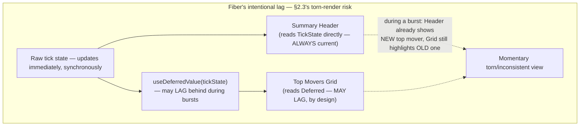

# Module 161 — React Capstone: Enterprise-Scale Real-Time Trading Dashboard — Comparative Rebuild Against the Angular Original

> Domain: React | Level: Beginner → Expert | Prerequisite: [[../43-React/01-React-Fundamentals-VirtualDOM-Fiber-Hooks-vs-Angular]] and [[../43-React/02-Advanced-React-StateManagement-DataFetching-Performance-vs-Angular]] (this capstone's comparative counterpart is [[../42-Angular/03-Capstone-EnterpriseRealTimeTradingDashboard]] — the same TradeView requirements, rebuilt in React, with genuinely new incidents arising specifically from React's distinct technical model rather than restated Angular findings)

>
> **Scope note:** Third and closing module of `43-React`'s 3-module scope, and the final module of the domain-39-50 comparative-treatment pair. This capstone deliberately does not restage Module 158's Angular incidents in React syntax — every incident here arises from a mechanism genuinely unique to React's model (Fiber's concurrent rendering, the absence of a native per-instance DI-scoping primitive) that has no Angular counterpart to compare against, closing this domain's comparative arc with new evidence rather than repetition.

---

## 1. Fundamentals

**What:** TradeView-React is the identical shell-plus-five-micro-frontend multi-desk trading platform Module 158 specified, rebuilt on React's primitives: Module Federation (§2.6 of Module 160 — genuinely identical risk profile to the Angular original), React Query for all server-derived state (positions, orders, entitlements), Redux/RTK for genuinely cross-desk client state, `memo`/`useMemo`/`useCallback`-disciplined, correctly-`key`ed, `react-window`-virtualized grids fed by buffered WebSocket ingestion, and `useDeferredValue` for Fiber-aware update scheduling during high-frequency bursts.

**Why:** Module 158's Angular capstone demonstrated that composing individually-correct mechanisms is not itself automatically correct — its own incidents arose specifically at seams unique to Angular's model (`trackBy`'s identity contract, Module Federation's shared-instance negotiation). This capstone's purpose is demonstrating the identical composition-risk finding recurs in React's technically distinct architecture, but manifests through **genuinely different seams** — specifically, Fiber's concurrent-rendering model (which Angular's synchronous change detection structurally cannot exhibit at all) and the absence of a native, framework-provided per-component-instance DI-scoping primitive (which Angular's injector tree provides by default and React requires a team to approximate manually).

**When:** As established in Module 159 §15/I10, the choice between this capstone's React implementation and Module 158's Angular original is, at genuine enterprise scale, primarily an organizational-governance decision — this capstone's purpose is not to argue React is better or worse for TradeView, but to complete the comparative evidence base §15 will use to make that argument concrete and specific rather than abstract.

**How (30,000-ft view):**
```
Shell (React) — Module Federation (IDENTICAL risk to Module 158's Angular shell, Module 160 §2.6)
   │
   ├─ Redux/RTK store (cross-desk state ONLY, ≈ Module 158's NgRx scoping discipline)
   │
   ├── Remote: Equities Desk
   │     ├─ React Query (buying-power validation via async-safe query, positions via
   │     │   correctly-scoped cache keys, Module 160 §2.3's fix applied from day one)
   │     ├─ react-window virtualized grid, memo()-wrapped rows, key=symbol (Module 159 §2.2's
   │     │   lesson applied from day one — NOT this capstone's incident)
   │     ├─ useDeferredValue-scheduled tick updates (Fiber-aware, Module 159 §2.1/§9)
   │     └─ "Mini Portfolio" widget — per-account isolated state (THIS capstone's new ground,
   │         §2.2 — approximating Angular's component-scoped DI with no native equivalent)
   │
   └── DeskErrorBoundary per remote (Module 160 Hard exercise)
```

---

## 2. Deep Dive

### 2.1 What TradeView-React inherits correctly, without incident, from Modules 159-160

Stated explicitly so this capstone's own incidents are understood as genuinely new ground, not repetition: TradeView-React's "Top Movers" grid uses `key={position.symbol}` from its first implementation (Module 159 §2.2's lesson applied proactively); its React Query hooks use fully-scoped, factory-constructed cache keys from day one (Module 160 A1/A5's governance pattern); its order-entry form uses `useRef` correctly for any WebSocket-driven current-value reads (Module 159 I2). **None of these become incidents in this capstone** — the team building TradeView-React had the benefit of this domain's own prior two modules' lessons, and this capstone is specifically interested in what breaks *even so*, at the seams those lessons don't cover.

### 2.2 The missing primitive: React has no native per-component-instance DI scope

Module 158 §13's LLD (and its Hard coding exercise) demonstrated Angular's component-scoped `providers` array giving each instance of a reusable "trading widget" component its own genuinely isolated service instance, automatically, as a first-class framework capability — Module 158 Advanced Q4 examined this scoping precisely. **React has no equivalent, framework-provided mechanism.** A custom Hook (`function useWidgetState() { ... }`) does *not* automatically provide per-instance isolation the way an Angular component-scoped provider does — calling a custom Hook from two different component instances gives each instance its own *local* `useState`/`useReducer` state *only if the Hook's internal state is itself declared via `useState`/`useReducer` inside that Hook's own body*, which is React's actual per-instance-isolation mechanism (state lives in the calling component's own Fiber node, not in some externally-shared location) — **but this isolation breaks completely, silently, the instant a developer reaches for a module-level variable, a singleton class instance, or any state declared *outside* the Hook's own function body** to hold what they intend to be "the widget's state," since that state is now genuinely shared, at the JavaScript-module level, across every component instance that imports and calls that Hook, anywhere in the application — this capstone's own §14 incident.

### 2.3 `useDeferredValue` and the torn-render risk — Fiber's own, genuinely new failure mode

Module 159 §2.1/§2.5 established Fiber's interruptible, priority-scheduled rendering as React's most distinctive capability with no Angular counterpart. `useDeferredValue(value)` exposes this directly: it returns a version of `value` that may *lag behind* the actual, current value during a high-priority update, letting React defer re-rendering the (potentially expensive) subtree consuming the deferred value while immediately, synchronously updating everything else. **This is the exact capability Module 159 §9 celebrated as Fiber's unique strength — and it carries its own, structurally new risk with no Angular equivalent: because different parts of the component tree can genuinely be showing different "versions" of the application's state simultaneously (the deferred subtree still rendering the old value; the rest of the tree already reflecting the new one), a UI that reads related data from *both* a deferred and a non-deferred source in visually-adjacent locations can display a momentarily inconsistent, "torn" view** — not a bug in any single component, and not a violation of any rule this domain has established so far, but a direct, intended consequence of Fiber's own deliberate lagging behavior, applied without accounting for what else on screen is reading the same underlying data *without* the same deferral.

---

## 3. Visual Architecture



```
DI scoping — Angular's automatic isolation vs. React's manual, easy-to-break approximation (§2.2):

  Angular:  providers: [WidgetStateService]  → framework GUARANTEES per-instance
                                                 isolation automatically, structurally.

  React:    function useWidgetState() {
              const [state, setState] = useState(...);  // CORRECT: per-instance,
              return { state, setState };                // lives in caller's Fiber node
            }

            let sharedState = {...};                      // WRONG: module-level —
            function useWidgetState() {                    // genuinely SHARED across
              return sharedState;                           // every instance. §14's
            }                                                // exact incident.
```

---

## 4. Production Example

**Problem:** TradeView-React's "Top Movers" grid — correctly `key`-scoped, correctly `memo()`-wrapped from day one (§2.1) — additionally used `useDeferredValue` on the buffered tick stream feeding the grid specifically to keep the order-entry form (rendered in the same view, reading the *same* underlying tick state directly, non-deferred, for its own live-price display) maximally responsive during market-open volume bursts, per Module 159 §7/A3's Fiber-scheduling recommendation.

**Architecture:** A shared `tickState` (from the buffered ingestion pipeline, Module 159 Expert exercise) consumed two ways in the same view: directly, synchronously, by the order-entry form's live-price display (deliberately *not* deferred, since price accuracy during active order entry is the platform's highest-consequence real-time requirement); and via `useDeferredValue(tickState)` by the "Top Movers" grid, deliberately deferred so a large grid re-render during a burst wouldn't compete with and delay the order-entry form's own, higher-priority update.

**Implementation / What happened:** During a genuine, high-volatility market-open burst, the order-entry form's non-deferred live-price display correctly, immediately updated to reflect a specific instrument's sharp price move — while the "Top Movers" grid, rendering the same underlying data via its intentionally-deferred value, continued showing that instrument in its *previous* ranking position (not yet reflecting the move) for a brief, but visible and measurable, window. A trader working from the grid's ranking to decide which instrument to act on saw a momentarily stale ranking at the exact moment the order-entry form, right beside it, already showed the accurate, moved price — a genuine, visible UI inconsistency between two panels displaying related data, neither of which was individually "wrong" for what it was configured to do.

**Trade-offs:** The `useDeferredValue` choice was correct and well-reasoned in isolation — the order-entry form's responsiveness during a burst genuinely is the platform's highest-priority requirement, and deferring the grid's less time-critical re-render to protect that responsiveness is exactly Fiber's intended, valuable behavior (Module 159 §9). The defect was not in either component's own configuration but in the *lack of any coordination or visual signal* between the two views about which one might currently be lagging, leaving a trader with no way to know, at a glance, that the grid's current display might not yet reflect what the form beside it already showed.

**Lessons learned:** **`useDeferredValue`'s benefit — letting different parts of a UI update at different priorities — is inseparable from its risk: those different parts can, by design, briefly disagree about the current state of the world, and nothing in React's own model prevents two visually-adjacent components from reading the same underlying data at different deferral levels without any indication to the user that they may currently be out of sync.** This is React's own, Fiber-specific instance of Module 158's composition-risk finding — a mechanism (Fiber's prioritized rendering) working exactly as designed, composed with another individually-reasonable choice (which specific data feeds which specific view), producing an emergent, genuinely new failure class with no Angular counterpart, since Angular's synchronous change-detection model has no equivalent notion of one part of the tree being allowed to lag behind another mid-update at all.

---

## 5. Best Practices

- **Treat `useDeferredValue`/`useTransition` as requiring an explicit design decision about every other view reading the same underlying data**, not merely a local performance optimization applied to one component in isolation (§4) — if two visually-related views can display the same data at different currency, the design must either accept and visually signal that possibility, or ensure both views defer (or both don't) consistently.
- **Never use a module-level variable, singleton class instance, or any state declared outside a custom Hook's own function body to represent per-widget-instance state** (§2.2) — always use `useState`/`useReducer`/`useRef` declared *inside* the Hook, which React automatically scopes to the calling component instance's own Fiber node.
- **When a genuine need exists for state shared across multiple instances of the same reusable widget** (the intentional-sharing case, contrasted with §14's accidental one), make that sharing explicit and deliberate — via Context with an explicitly-scoped Provider placed at the correct tree level, or a dedicated shared store — never an implicit module-level variable a future maintainer might mistake for automatically-instance-scoped state.
- **Provide an explicit "may be updating" visual indicator for any deferred value shown near a non-deferred, related value** (§4's fix) — a subtle loading/pending affordance on the grid during a detected deferral lag, giving the trader a signal rather than a silent, unexplained inconsistency.
- **Document, for every custom Hook intended for reuse across multiple widget instances, whether its state is instance-scoped (the default, correct behavior when declared via `useState` inside the Hook) or intentionally shared** (§2.2) — making the scoping decision an explicit, reviewable contract rather than an implicit consequence of how the Hook happens to be implemented internally.

---

## 6. Anti-patterns

- **Module-level (or otherwise externally-declared) mutable state backing a custom Hook intended to represent per-widget-instance state** — §14's exact incident; silently and completely defeats the isolation a developer coming from Angular's DI model would reasonably, but incorrectly, assume the Hook pattern provides automatically.
- **Deferring one view's data via `useDeferredValue` without considering every other, visually-related view reading the same underlying data non-deferred** (§4) — produces a torn, inconsistent UI with no error, no warning, and no signal to the affected user.
- **Assuming React Hooks provide Angular-DI-equivalent per-instance service scoping "because they're both dependency-injection-flavored patterns"** — a category error this course's comparative treatment (Module 159 §2.6, I7) flagged for Context specifically and this capstone now demonstrates concretely for Hooks generally.
- **Treating `useDeferredValue`/`useTransition` adoption as a purely local, single-component performance decision** — its correctness is inherently a property of the *composition* of every view reading the same underlying data, not any one component's own configuration in isolation.
- **Building a reusable widget's state-management Hook without an explicit, documented statement of its instance-scoping intent** — leaves the next developer to guess (and, per §14, guess wrong) whether the pattern provides isolation or sharing.

---

## 7. Performance Engineering

`useDeferredValue`'s performance benefit (protecting a high-priority update's responsiveness from competing with a lower-priority subtree's re-render cost, §2.3) is genuinely valuable and genuinely unique to React's Fiber-based model — but §4 demonstrates it is not a cost-free, purely-additive optimization the way `memo`/virtual-scrolling are largely composable without cross-component risk (Module 159 §7); it introduces a *new dimension of coordination cost* (ensuring related, visually-adjacent views' currency expectations are either aligned or explicitly signaled as potentially divergent) that a team must design for deliberately, not merely apply as a drop-in performance win. This is the capstone-level refinement of Module 159 §7's four-lever composition reasoning: buffering (frequency), `memo` (scope), virtual scrolling (DOM-node count), and now `useDeferredValue`/Fiber prioritization (scheduling) compose multiplicatively for raw performance exactly as Module 159 §7 established — but this fourth lever specifically introduces a *correctness*-adjacent coordination cost the other three don't, since it is the only one of the four that can cause two currently-rendered views to legitimately, by design, disagree about the current state of the world.

---

## 8. Security

No new security-specific finding beyond Module 159-160's coverage (§8 of each) — TradeView-React's client-side state (Redux/RTK, React Query cache) remains a UX layer over server-authoritative decisions throughout, with the identical defense-in-depth discipline applying to order submission and entitlement-gated UI visibility as established previously. §14's DI-scoping incident carries a security-adjacent dimension worth naming: an accidentally-shared "isolated" widget's state, if that widget happened to hold anything account-specific or entitlement-sensitive (rather than this capstone's benign portfolio-summary example), could reproduce Module 160 §4's cross-account data-exposure shape via a structurally different mechanism (accidental Hook-state sharing rather than an under-scoped cache key) — reinforcing that this domain's cross-account-exposure risk category has now been demonstrated via three independent, mechanically distinct causes (Module 158's trackBy, Module 160's cache key, this module's shared Hook state).

---

## 9. Scalability

This capstone adds no new scalability finding beyond composing Modules 159-160's established levers — its distinguishing contribution is specifically the *correctness*-coordination cost §7 identifies for `useDeferredValue`/Fiber-prioritization specifically, which is a genuinely new dimension this domain's prior two modules' performance discussions didn't need to address, since neither Angular's model (Module 158, no interruptible rendering) nor this domain's own earlier Easy/Medium-tier examples (Module 159-160) composed a deferred and non-deferred view of the same data within one visible UI simultaneously.

---

## 10. Interview Questions

### Basic (10)

**B1. Does calling a custom Hook from two different component instances automatically give each instance its own isolated state?**
*Ideal Answer:* Only if the Hook's state is declared via `useState`/`useReducer` inside the Hook's own function body — that state then lives in each calling component's own Fiber node, genuinely isolated. If the Hook instead reads/writes a module-level variable, that state is shared across every instance, with no isolation at all.
*Why correct:* Matches §2.2.
*Common mistakes:* Assuming any custom Hook automatically provides Angular-DI-style per-instance isolation regardless of how its internal state is declared.
*Follow-up:* What Angular mechanism (Module 158 §2.4) provides this isolation automatically, without requiring the developer to get an internal implementation detail right?

**B2. What does `useDeferredValue` do?**
*Ideal Answer:* Returns a version of a value that may lag behind the actual, current value during a high-priority update, letting React defer re-rendering the subtree consuming it in favor of higher-priority work.
*Why correct:* Matches §2.3.
*Common mistakes:* Describing it as debouncing or throttling the value's updates on a timer, rather than correctly describing it as a priority-based scheduling deferral tied to Fiber's interruptible rendering.
*Follow-up:* What specific risk does deferring one view's data introduce that a non-deferred view reading the same underlying data doesn't share?

**B3. In §4's incident, was either the order-entry form or the "Top Movers" grid individually misconfigured?**
*Ideal Answer:* No — both were correctly, deliberately configured for their own individual requirement (the form prioritizing immediate accuracy, the grid deliberately deferring to protect the form's responsiveness); the defect was the lack of coordination or user-facing signal between the two, not a misconfiguration in either.
*Why correct:* Matches §4's precise root-cause framing.
*Common mistakes:* Assuming one of the two components must have been configured incorrectly, missing that this is a genuine composition-level, not component-level, issue.
*Follow-up:* Does Angular's synchronous change-detection model have any equivalent risk to this specific incident? Why or why not?

**B4. Why doesn't Angular's change-detection model exhibit a `useDeferredValue`-style torn-render risk?**
*Ideal Answer:* Angular's change-detection tree walk is a single, synchronous, uninterruptible pass (Module 156 §2.2) — there is no mechanism for one part of the tree to be shown lagging behind another part mid-update, since the whole tree is checked and updated together within one pass.
*Why correct:* Matches §2.3 and Module 159 §2.1's contrast.
*Common mistakes:* Assuming Angular has some equivalent risk under a different name, rather than correctly identifying that this risk category is specifically enabled by Fiber's interruptible rendering, which Angular's model structurally lacks.
*Follow-up:* Is Fiber's interruptibility therefore a strictly worse design than Angular's synchronous model, given it introduces this risk? Why or why not?

**B5. What's the correct way to implement genuinely shared (not accidentally shared) state across multiple instances of a React widget?**
*Ideal Answer:* Explicit, deliberate sharing via Context with a Provider placed at the correct tree level, or a dedicated shared store (Redux/Zustand) — never an implicit module-level variable a developer might mistake for automatically-instance-scoped state.
*Why correct:* Matches §5.
*Common mistakes:* Proposing a module-level variable as an acceptable "quick" sharing mechanism, missing that the same pattern is §14's exact incident when sharing was unintended.
*Follow-up:* How would you make a Hook's sharing-versus-isolation intent explicit and self-documenting for a future developer?

**B6. What TradeView-React lesson did the team apply proactively from Module 159 that prevented a repeat of Module 158's `trackBy` incident?**
*Ideal Answer:* Using `key={position.symbol}` (a genuinely stable identifier) from the grid's first implementation, rather than array index, per Module 159 §2.2's lesson.
*Why correct:* Matches §2.1.
*Common mistakes:* Assuming this capstone's incidents include a repeat of the `key`/`trackBy` mistake, missing that §2.1 explicitly states this was avoided.
*Follow-up:* What would have happened if the team had NOT applied this lesson proactively, combined with `useDeferredValue`'s own risk?

**B7. What kind of exposure could §14's accidentally-shared Hook state produce if the widget held account-specific data instead of a benign portfolio summary?**
*Ideal Answer:* A cross-account data-exposure incident structurally similar in consequence to Module 160 §4's React Query cache-key incident, but via a mechanically different cause (shared Hook state rather than an under-scoped cache key).
*Why correct:* Matches §8's connection.
*Common mistakes:* Treating §14's incident as purely a UI-correctness bug with no security dimension, missing the account-data-exposure risk it could carry under different, easily-imaginable circumstances.
*Follow-up:* Name the three mechanically distinct causes this domain has now demonstrated for cross-account/cross-context data exposure across its three modules.

**B8. Why is `useDeferredValue`'s risk described as a "correctness-adjacent coordination cost" rather than simply a bug?**
*Ideal Answer:* Because the mechanism is working exactly as designed and provides genuine, deliberate performance value — the risk arises specifically from a design decision (which views defer and which don't) not being coordinated across the full set of views reading related data, not from any defect in `useDeferredValue` itself.
*Why correct:* Matches §7's framing.
*Common mistakes:* Describing `useDeferredValue` itself as buggy or poorly designed, rather than correctly identifying the risk as an emergent property of how it's composed with other views.
*Follow-up:* What design practice would convert this coordination cost into an explicit, managed design decision rather than an unmanaged risk?

**B9. What does this capstone's §14 incident demonstrate about React Hooks that a developer coming from Angular's DI model might not expect?**
*Ideal Answer:* That Hooks provide no automatic, framework-guaranteed per-instance isolation the way Angular's component-scoped DI providers do — isolation is a consequence of correctly declaring state inside the Hook via `useState`/`useReducer`, not an inherent property of the Hook pattern itself.
*Why correct:* Matches §2.2.
*Common mistakes:* Assuming Hooks and Angular DI providers are functionally equivalent patterns simply because both are commonly described using "dependency injection" adjacent vocabulary.
*Follow-up:* What specific, concrete symptom would a team observe in production from this exact mistake?

**B10. Is Module Federation's shared-dependency risk (Module 157/160 §2.6) present in TradeView-React?**
*Ideal Answer:* Yes, identically — the risk lives in Webpack's runtime negotiation mechanism, entirely independent of which UI framework the shell and remotes use.
*Why correct:* Matches §2.1/Module 160 §2.6's restated parity finding.
*Common mistakes:* Assuming this capstone's own incidents somehow replace or supersede that risk, rather than recognizing it as an additional, still-present risk this capstone simply didn't re-narrate since it was already fully covered.
*Follow-up:* What would the `FederationIntegrityChecker` pattern (Module 157 Expert exercise) need to verify in a React-based shell specifically?

### Intermediate (10)

**I1. Design the corrected "Mini Portfolio" widget Hook for §14's incident, ensuring genuine per-instance isolation.**
*Ideal Answer:*
```tsx
function useMiniPortfolioState(accountId: string) {
  // Declared INSIDE the Hook's own function body — React scopes this to
  // whichever component instance calls useMiniPortfolioState, genuinely
  // isolated per call site, per React's own render/Fiber-node model.
  const [holdings, setHoldings] = useState<Holding[]>([]);
  // ... rest of the widget's logic, all using accountId-scoped state
  // declared locally, never a module-level variable.
  return { holdings, setHoldings };
}
```
Every call site (each account's own "Mini Portfolio" widget instance) gets its own, independent `holdings` state, correctly isolated with no shared module-level variable anywhere.
*Why correct:* Matches §5's fix precisely, correcting §14's exact defect.
*Common mistakes:* Proposing a fix that still routes through some shared, external state container "for consistency," reintroducing the exact risk the fix is meant to eliminate.
*Follow-up:* How would you write a test specifically verifying two widget instances don't share state, given this exact bug produced passing functional tests for each instance tested in isolation?

**I2. Design a fix for §4's torn-render incident that preserves `useDeferredValue`'s performance benefit while eliminating the visible inconsistency.**
*Ideal Answer:* Add an explicit `isStale` indicator derived by comparing the deferred value's reference/version against the current, non-deferred value (React exposes this comparison pattern via `useDeferredValue`'s own semantics, or a custom version-tagging scheme on the tick data) — render a subtle visual cue (a slightly dimmed state, a small "updating..." badge) on the grid specifically when it's currently lagging, giving the trader an explicit signal rather than a silent, unexplained inconsistency, while still preserving the actual performance benefit of not blocking the order-entry form's responsiveness during the lag.
*Why correct:* Matches §5's recommended fix, preserving the underlying optimization while closing the specific UX/correctness gap.
*Common mistakes:* Proposing to remove `useDeferredValue` entirely as the fix, discarding the genuine performance benefit rather than addressing the coordination gap specifically.
*Follow-up:* How would you detect, programmatically, that the deferred value is "currently lagging" versus "already caught up," to drive this indicator?

**I3. Compare §14's incident against Module 156 §2.4's Angular DI-scoping bug (a service accidentally provided at the wrong tree level). Are the two the same underlying mistake?**
*Ideal Answer:* Structurally related but not identical: Module 156's Angular bug involves a developer misconfiguring *where in the injector tree* a provider is declared (still using Angular's own scoping mechanism, just incorrectly) — the framework's scoping mechanism exists and is being used, just misapplied. §14's React bug involves a developer *not using any framework-provided scoping mechanism at all*, substituting an ad hoc module-level variable instead — there is no equivalent "misconfigured the framework's mechanism" step, because React doesn't provide an equivalent, explicit mechanism to configure in the first place; the mistake is closer to "reached for the wrong tool" than "misused the right tool."
*Why correct:* Correctly distinguishes "misconfiguring an existing mechanism" from "substituting an ad hoc pattern for a missing mechanism," a precise and meaningful distinction between the two frameworks' respective failure modes.
*Common mistakes:* Treating the two bugs as simply "the same DI-scoping mistake in two different frameworks," missing the more precise distinction between misusing an existing tool and improvising in the absence of one.
*Follow-up:* Which of the two failure modes do you judge easier to prevent via code review, and why?

**I4. Why does Module Federation's genuine framework-agnostic parity (B10) matter for this capstone's overall comparative argument, even though it produces no new incident here?**
*Ideal Answer:* It matters specifically because it demonstrates that not every risk this course has examined across the Angular and React domains is framework-specific — some (Module Federation's shared-dependency negotiation) live at a lower architectural layer common to both, and correctly identifying which risks are framework-specific (§2.2's DI-scoping gap, §2.3's torn-render risk) versus framework-agnostic (Module Federation) is itself part of making an accurate, well-grounded comparative architectural decision (§15), rather than either over- or under-attributing every observed risk to "React" or "Angular" specifically when some risks belong to neither framework in particular.
*Why correct:* Correctly articulates why explicitly noting parity (not just divergence) is itself valuable comparative content, not merely a redundant restatement.
*Common mistakes:* Treating the restated Module Federation parity as filler content with no analytical value, missing its role in correctly scoping which risks this capstone's comparative argument should actually attribute to framework choice.
*Follow-up:* Name one other risk from this domain's six modules (156-161) that is genuinely framework-agnostic, beyond Module Federation.

**I5. Design a test that specifically catches §14's shared-Hook-state incident, given each widget instance's own functional tests passed individually.**
*Ideal Answer:* A test that renders *two* instances of the "Mini Portfolio" widget simultaneously (for two different accounts), performs a state-mutating action on the first instance, and asserts the *second* instance's rendered state is unaffected — a cross-instance isolation test, structurally analogous to Module 158 A5's `OnPush`-specific negative test and Module 160 A3's cross-account-switch test, but targeting Hook-state isolation specifically rather than either of those two mechanisms.
*Why correct:* Correctly designs a test targeting the specific failure mode (cross-instance state leakage) that single-instance functional tests, by construction, cannot exercise.
*Common mistakes:* Proposing only more thorough single-instance testing, missing that the actual gap is specifically in multi-instance isolation, which single-instance tests cannot reveal by definition.
*Follow-up:* Would this test have caught the bug if the two widget instances were rendered in genuinely separate micro-frontend remotes rather than the same remote? Why or why not?

**I6. How does `useDeferredValue`'s torn-render risk (§2.3) relate to Module 146's PACELC/consistency-model coverage from the Distributed Systems domain, if at all?**
*Ideal Answer:* Loosely, but genuinely, analogous: `useDeferredValue` is, in effect, choosing to trade strict consistency (every part of the UI reflecting the same, current state simultaneously) for availability/responsiveness (the higher-priority update isn't blocked waiting for the lower-priority subtree to catch up) — the identical underlying trade-off PACELC formalizes for distributed data stores, now appearing at the single-browser-tab, single-render-tree scale via Fiber's scheduling model, reinforcing that this course's distributed-systems vocabulary (consistency-versus-availability trade-offs) genuinely generalizes down to a single client application's internal rendering architecture, not merely to multi-node backend systems.
*Why correct:* Correctly identifies the structural (not merely superficial) parallel between Fiber's scheduling trade-off and PACELC's distributed-systems consistency-availability trade-off, demonstrating genuine cross-domain synthesis at the conceptual level.
*Common mistakes:* Dismissing the connection as too abstract or forced, missing the genuine structural parallel — both are instances of deliberately allowing temporary inconsistency in exchange for responsiveness/availability, governed by an explicit trade-off decision.
*Follow-up:* Does this analogy suggest any additional mitigation technique from the distributed-systems domain (Module 146-149) that could apply to the `useDeferredValue` torn-render risk?

**I7. A team proposes fixing §4's incident by simply never using `useDeferredValue` anywhere in the codebase, citing its demonstrated risk. Evaluate this recommendation.**
*Ideal Answer:* Overcorrective — per §7, `useDeferredValue` provides a genuine, valuable performance benefit (protecting high-priority update responsiveness) that Module 159 §9 identified as one of React's most distinctive capabilities relative to Angular; blanket avoidance discards this benefit entirely for the platform's every use case, not just the specific composition pattern (two visually-adjacent views at different deferral levels reading related data) that actually produced the incident. The correct response is the targeted fix (I2's explicit lag indicator) applied specifically where the risky composition pattern exists, not wholesale avoidance of a genuinely valuable tool.
*Why correct:* Correctly identifies the overcorrective nature of blanket avoidance, matching this course's repeated caution against solving a scope-specific problem with a scope-inappropriate, overly broad fix.
*Common mistakes:* Accepting the blanket-avoidance recommendation as a reasonable, safe default, missing that it discards real value to address a risk that only manifests under a specific, identifiable composition pattern.
*Follow-up:* How would you identify, across a large codebase, every existing instance of the specific risky composition pattern (deferred plus non-deferred views of related data) without requiring a full, manual audit of every `useDeferredValue` usage?

**I8. Why does §14's incident specifically undermine a developer's intuition built from prior Angular experience, more than a developer with no prior framework experience at all?**
*Ideal Answer:* A developer with Angular experience has a correct, well-formed mental model that "a service/state-holding pattern used per-widget-instance is automatically, framework-guaranteed isolated" (true in Angular, per Module 156 §2.4) — applying that same intuition to React's Hook pattern, which looks superficially similar but provides no equivalent automatic guarantee, produces exactly the false-confidence trap §14 demonstrates; a developer with no prior framework-specific intuition at all has no equivalent false expectation to be misled by, and might more readily ask "wait, is this actually isolated, or do I need to check?"
*Why correct:* Correctly identifies that cross-framework intuition transfer is specifically risky when a superficially similar pattern actually differs in a load-bearing guarantee, a genuinely important insight for any engineer working across multiple frameworks.
*Common mistakes:* Treating this as a generic "be careful" observation rather than specifically identifying why prior, correct experience with a different framework's genuinely different guarantee is a distinct and specific risk factor, not a general carelessness issue.
*Follow-up:* What onboarding or documentation practice would specifically address this cross-framework-intuition risk for a team with substantial existing Angular experience adopting React?

**I9. Design a lint rule (conceptually) that would help catch §14's incident class before it reaches production.**
*Ideal Answer:* A custom ESLint rule scanning for module-level (top-of-file, outside any function/component) `let`/mutable variable declarations that are subsequently read or written inside a custom Hook function exported from that same module — flagging this pattern as a likely accidental-sharing risk requiring explicit justification (a comment confirming the sharing is intentional) to suppress, directly analogous in spirit to Module 158/159's `trackBy`/`key` lint-rule recommendations, though mechanically harder to implement reliably given the pattern's structural subtlety (distinguishing "intentional shared singleton" from "accidental shared singleton" requires either an explicit annotation convention or human judgment a purely syntactic rule can't fully automate).
*Why correct:* Correctly proposes a plausible mechanical check while honestly acknowledging its harder-to-fully-automate nature relative to this domain's other lint-rule recommendations, rather than overstating what static analysis alone can catch here.
*Common mistakes:* Proposing the lint rule without acknowledging its inherent difficulty/imprecision relative to a cleaner syntactic check like the `trackBy`-index-detection rule from Module 158 A4.
*Follow-up:* What naming or code-organization convention (rather than a lint rule) might make this risk more visible to a human reviewer even without full mechanical enforcement?

**I10. Synthesize how this capstone's two incidents (§4, §14) each map onto Module 159 A8's two-category "declared ≠ actual" taxonomy (scope-matching vs. temporal-freezing).**
*Ideal Answer:* §14 (accidentally-shared Hook state) is a *scope-matching* failure — the developer's declared intent ("this state is isolated per widget instance") didn't match the actual, achieved scope (globally shared), structurally similar in shape to Module 158's `trackBy` and Module 160's cache-key incidents. §4 (the torn render) is neither purely scope-matching nor purely temporal-freezing in Module 159 A8's original sense (which was specifically about a closure freezing a value at one point in time) — it's better described as a *third category*: a **temporal-divergence-across-concurrently-rendered-views** failure, where two different parts of the same render tree are simultaneously, legitimately showing different points in time of the same underlying data, a risk category that doesn't fit cleanly into either of Module 159 A8's original two buckets and is specific to Fiber's concurrent-rendering model.
*Why correct:* Correctly applies the existing taxonomy to §14, and correctly identifies that §4 doesn't fit either existing category cleanly, proposing a genuinely new, well-justified third category rather than forcing an imprecise fit — demonstrating sophisticated, critical engagement with this course's own established framework rather than mechanical reapplication.
*Common mistakes:* Forcing §4 into one of the two existing categories despite the fit being poor, rather than recognizing and articulating that it represents genuinely new taxonomic ground this course's prior framework didn't anticipate.
*Follow-up:* Does this suggest Module 159 A8's original two-category taxonomy needs to be revised to a three-category one going forward, or was §4's incident specific enough to this one Fiber-related mechanism that it doesn't warrant a general taxonomy change?

### Advanced (10)

**A1. Design the complete, corrected TradeView-React "Mini Portfolio" and "Top Movers" architecture addressing both this capstone's incidents.**
*Ideal Answer:* Mini Portfolio: `useMiniPortfolioState(accountId)` with all state declared via `useState` inside the Hook body (I1), explicitly documented as "instance-isolated by design" in the Hook's own doc comment, with the I5 cross-instance isolation test in the component's test suite. Top Movers: retains `useDeferredValue` for its genuine performance benefit, paired with the I2 explicit lag-indicator UI, and a documented, reviewed inventory of every other view in the same visible screen area that reads the same underlying tick data, explicitly noting each one's deferral status (deferred or not) as a reviewed, deliberate design decision rather than an unexamined default.
*Why correct:* Synthesizes both incidents' fixes into one coherent, fully-justified corrected architecture, mirroring the synthesis structure Module 158 A1/Module 159's equivalent capstone-level questions established.
*Common mistakes:* Fixing one incident's specific symptom without the accompanying documentation/testing/review practice that prevents a *different* instance of the same underlying risk class from recurring elsewhere in the codebase.
*Follow-up:* Which of these two fixes would you prioritize implementing first if resource-constrained, and why?

**A2. Compare this capstone's overall incident count and severity against Module 158's Angular capstone. Does this comparison support any conclusion about which framework is "safer" for TradeView specifically?**
*Ideal Answer:* No defensible conclusion follows from a simple incident-count comparison — both capstones demonstrate exactly two production incidents each, of comparable real-world severity (a silent price/symbol mismatch in Angular; a silent cross-account state leak and a torn-render UX inconsistency in React), arising from mechanisms genuinely specific to each framework's own architecture. The comparison instead supports the more precise, already-established finding (Module 159 A10/Module 160 A10) that composition risk recurs with comparable frequency and severity in both frameworks, via *different specific mechanisms* — the appropriate comparative conclusion is about *which specific mechanisms* each framework's composition risk manifests through (informing what governance/tooling investment each requires), not a ranking of overall safety.
*Why correct:* Correctly refuses to draw an unjustified "which framework is safer" conclusion from a symmetric incident count, redirecting to the more precise, actually-supported finding about mechanism-specific risk profiles.
*Common mistakes:* Attempting to declare one framework definitively safer based on this capstone's specific incident narrative, which is illustrative rather than statistically representative of either framework's real-world incident rate.
*Follow-up:* What kind of evidence, beyond this course's illustrative case studies, would actually be needed to support a genuine "which framework is safer" claim?

**A3. Design a governance artifact — reusable across any team adopting either framework — that generalizes this domain's full six-module comparative finding into an actionable checklist.**
*Ideal Answer:* A "composition-risk review" checklist applied to any new, reusable pattern (a component, a Hook, a service) before it's approved for platform-wide reuse: (1) What is this pattern's actual, verified scope of correctness (which specific usage conditions was it built and tested against)? (2) What happens if a future consumer uses it under a condition outside that scope (a different reordering behavior, a different input-handling pattern, a different deferral composition)? (3) Is that scope explicitly documented as a precondition, or only implicit in the implementation? (4) Is there a mechanical check (lint rule, integration test) enforcing the scope, or does correctness depend entirely on future developers reading and honoring documentation? — a framework-agnostic checklist directly synthesizing the recurring root cause this course has now demonstrated six times across both frameworks' three modules each.
*Why correct:* Correctly synthesizes the full six-module arc's recurring finding into one general, actionable, framework-agnostic governance tool, demonstrating genuine domain-level (not merely module-level) synthesis.
*Common mistakes:* Proposing a framework-specific checklist (only for React, or only for Angular) rather than recognizing the underlying pattern this course has demonstrated is framework-agnostic and warrants a framework-agnostic governance response.
*Follow-up:* How would you pilot this checklist's adoption across a real, existing platform without it becoming purely theoretical, unenforced documentation itself subject to the same "declared ≠ actual" risk this course has repeatedly examined?

**A4. Critique: "TradeView-React's team correctly applied every lesson from Modules 159-160 and still produced two new production incidents — this proves that comprehensive framework-specific training doesn't actually prevent composition-risk incidents."**
*Ideal Answer:* Overstated, and in fact demonstrates something more precise and more useful: the team's correct application of Modules 159-160's *specific, already-identified* lessons (§2.1's explicit statement) prevented a *repeat* of those *specific* incident classes — exactly the value comprehensive training provides. §4 and §14 are *new* incident classes, arising from mechanisms Modules 159-160 didn't specifically examine (Fiber's torn-render risk, Hook-state-scoping ambiguity) — this demonstrates that framework-specific training closes *known* risk classes effectively, while composition risk as a *general phenomenon* continually manifests through *new, not-yet-catalogued* specific mechanisms, which is precisely Module 145's original, course-wide finding: composition risk is not a finite, exhaustible list of specific bugs to be trained away, but a structural property of composed systems that recurs through genuinely new mechanisms even after prior mechanisms are addressed.
*Why correct:* Correctly refutes the overstated claim while extracting the actually-correct, more precise and more valuable underlying insight, directly reconnecting to Module 145's original course-wide finding as the capstone's own closing demonstration of it.
*Common mistakes:* Either accepting the overstated claim (training is useless) or dismissing the question's premise without extracting the more precise, correct finding it's actually pointing toward.
*Follow-up:* Given composition risk manifests through genuinely new mechanisms indefinitely, what organizational practice (beyond training on any specific, finite list of known incident classes) provides the most durable, general defense?

**A5. Design an incident-response process specifically for §4's torn-render class of bug, given it produces no thrown error, no failed test, and no obviously "wrong" component.**
*Ideal Answer:* Since neither conventional error monitoring nor even Module 158/160's prior canary-pattern approach (checking a single view's internal consistency against its own data) would catch this specific *cross-view* inconsistency, detection requires a canary specifically comparing *multiple, related views'* currently-displayed values against each other (not merely each against its own backing data) — periodically asserting that the order-entry form's displayed price and the Top Movers grid's displayed ranking for the same instrument are mutually consistent, flagging a detected divergence as a candidate torn-render event for investigation, directly extending this course's now-repeated production-canary pattern (Module 152, 155, 158, 160) to a genuinely new target: cross-view consistency, not single-view internal consistency.
*Why correct:* Correctly identifies that this incident class requires a canary checking a fundamentally different property (cross-view agreement) than any of this course's prior canary examples, and correctly extends the established pattern to this new target rather than assuming a prior canary design already covers it.
*Common mistakes:* Proposing a canary structurally identical to Module 158's row-integrity check or Module 160's cache-consistency check, missing that neither of those checks a view's data against a *different* view's data the way this incident class requires.
*Follow-up:* What false-positive risk does a cross-view consistency canary carry that a single-view canary doesn't, given some degree of transient cross-view lag might be an accepted, by-design consequence of deliberate `useDeferredValue` usage rather than always an incident?

**A6. Both this capstone and Module 158's Angular capstone close by naming a specific, sharpest "declared ≠ actual" instance. Given Module 160 A8/A10's revised comparative judgment, what should this capstone's closing comparative statement be?**
*Ideal Answer:* This capstone's own sharpest instance — §4's torn-render risk — is neither the scope-matching category (Module 158's `trackBy`, Module 160's cache key, this capstone's §14) nor the original temporal-freezing category (Module 159's stale closure) but the newly-identified third category from I10: temporal divergence across concurrently-rendered views, a risk category specific to Fiber's concurrent-rendering model and entirely absent from Angular's synchronous architecture by structural necessity, not merely by lesser attention or lower code quality. The closing comparative statement: across this domain's full six-module arc, React's distinct technical model (closures, Hooks' scoping ambiguity, Fiber's concurrency) demonstrably introduces *additional, structurally distinct* failure categories beyond what Angular's model exhibits in this course's coverage — not because React is less safe overall (A2's caution against that conclusion still holds), but because React's specific architectural choices (unopinionated composition, concurrent rendering) create genuinely more numerous *distinct seams* for composition risk to manifest through, each requiring its own specific governance response, compared to Angular's more constrained, more opinionated, single-threaded-equivalent model.
*Why correct:* Correctly synthesizes the full domain arc's comparative finding into a precise, well-qualified closing statement, avoiding both the overstated "React is less safe" conclusion (A2) and an under-stated "the two frameworks are basically equivalent" conclusion, landing on the more precise and more defensible "different number and shape of seams, not different overall safety" finding.
*Common mistakes:* Either declaring one framework unconditionally safer or refusing to draw any comparative conclusion at all, missing the more nuanced, well-evidenced middle finding this module's full arc actually supports.
*Follow-up:* Does a "more numerous distinct seams" framework necessarily require proportionally more governance investment, or could the seams' individual severity/frequency matter more than their count?

**A7. Design a hybrid TradeView architecture using Angular for the shell and specific desks, and React for others, addressing what this would require given Module Federation's genuine framework-agnostic parity (I4).**
*Ideal Answer:* Technically feasible specifically because Module Federation's shared-dependency negotiation operates below either framework's own reactivity model (I4) — an Angular shell can load and mount a React-built remote (or vice versa) via Module Federation with no framework-level incompatibility, provided cross-framework state-sharing (if any genuinely cross-desk state needs to reach both an Angular and a React remote) uses a framework-agnostic mechanism (plain JavaScript objects/events via a shared, framework-independent event bus or store, rather than either framework's own reactivity primitives directly) since NgRx's Store and Redux's Store, despite conceptual parity (§2.1 of Module 160), are not directly interoperable without an explicit adapter layer.
*Why correct:* Correctly reasons through the genuine technical feasibility this domain's own parity finding (Module Federation, I4) enables, while correctly identifying the specific integration point (cross-framework state sharing) that would require deliberate, additional engineering rather than being automatically solved by Module Federation alone.
*Common mistakes:* Assuming either full technical incompatibility (missing Module Federation's genuine framework-agnostic parity) or complete, automatic interoperability (missing that NgRx and Redux stores aren't directly interoperable without an adapter).
*Follow-up:* Under what specific organizational circumstance (not technical constraint) would this hybrid architecture actually be the right choice, given §15/Module 159 A7's finding that the framework choice is primarily organizational?

**A8. Formally state the recurring finding this entire `42-Angular`/`43-React` comparative arc (Modules 156-161, six modules) has established, using precise language rather than restating any single incident.**
*Ideal Answer:* Composition risk — the finding that individually-correct mechanisms can produce incorrect emergent behavior specifically at the boundaries between them — is not merely a backend-distributed-systems phenomenon (as Modules 145, 150, 155 established) nor a single-framework peculiarity, but a structural property of any sufficiently composed software system, manifesting through mechanically distinct, framework-specific seams (Angular's reference-identity/`trackBy` contracts and federation-runtime negotiation; React's closure-capture timing, Hook-scoping ambiguity, and Fiber-concurrency scheduling) that require framework-specific technical vigilance (the specific lint rules, canaries, and conventions each of this domain's six modules developed) governed by an identical, framework-agnostic underlying discipline (A3's composition-risk-review checklist) — the frontend-framework-layer confirmation of a finding this course has now demonstrated, in structurally consistent form, across backend distributed systems, identity federation, and two architecturally distinct UI frameworks.
*Why correct:* Provides a precise, generalized statement of the finding at the correct level of abstraction — general enough to span both frameworks and connect to the course's backend findings, specific enough to name the actual, concrete mechanisms each framework's composition risk manifests through, rather than either an empty generality or an incident-specific restatement.
*Common mistakes:* Restating one specific incident as if it were the general finding, or stating the general finding so abstractly it loses connection to this domain's own specific, concrete evidence.
*Follow-up:* Is there a plausible future frontend architecture or rendering model (beyond React's Fiber or Angular's Signals-based zoneless model) that could structurally eliminate one of this domain's specific seam categories entirely, the way Signals structurally narrowed (though didn't eliminate) Angular's change-detection-cost seam?

**A9. TradeView-React's `useDeferredValue`-related incident (§4) has no equivalent test in this module's Coding Exercises section covering it directly. Design that missing test.**
*Ideal Answer:* A test using React's `act()` and fake-timer/scheduler-control utilities (React Testing Library's concurrent-mode-aware testing helpers) that triggers a rapid sequence of tick updates, asserts the non-deferred order-entry form's displayed price updates immediately/synchronously with the latest tick, then — *before* allowing the deferred update to flush — asserts the Top Movers grid still shows the *previous* ranking (verifying the intentional lag actually occurs as designed), and finally, after flushing the deferred work, asserts the grid catches up to the current ranking — a test that specifically exercises and verifies the *torn* intermediate state exists and is bounded/transient, rather than either assuming it doesn't occur or failing to verify it resolves correctly.
*Why correct:* Correctly designs a test that verifies both the existence of the intentional lag (proving `useDeferredValue` is actually providing its intended scheduling benefit) and its eventual resolution (proving the torn state is transient, not permanent), directly filling the gap the question identifies.
*Common mistakes:* Proposing a test that only verifies the final, settled state is eventually correct, missing that the actual incident (§4) occurred specifically during the *intermediate*, torn window this test needs to explicitly assert on.
*Follow-up:* Why is fake-timer/scheduler control specifically necessary for this test, rather than a standard, real-timing-based integration test?

**A10. As the closing module of `43-React` and this entire 39-50 comparative-domains run's Angular/React pair, name the single most important lesson a Principal Engineer should carry forward into any future frontend-framework evaluation, based on this domain's full evidence.**
*Ideal Answer:* Evaluate a framework not by which one has "fewer bugs" or "better performance" in isolation (A2's caution), but by precisely cataloguing the specific *seams* its particular architectural model creates — its default reactivity behavior's opt-in/opt-out shape, its identity-tracking mechanisms for lists, its dependency-scoping guarantees (or lack thereof), its concurrency model's specific trade-offs — and matching the organization's actual governance capacity (tooling investment, team discipline, code-review rigor) against the *number and nature* of seams that specific framework's architecture will require vigilance for; a framework choice is, ultimately, a choice about which specific set of composition-risk seams an organization commits to building governance for, not a choice about which framework has inherently fewer risks — every sufficiently powerful, composable frontend framework this course has examined has real, structurally-inherent seams, and none is exempt from this domain's central, six-module-demonstrated finding.
*Why correct:* Correctly synthesizes the entire domain's evidence into a precise, actionable, appropriately-humble Principal-level heuristic, avoiding both the overstated "pick the objectively safer framework" framing this module has repeatedly cautioned against and an unhelpfully vague "it depends" non-answer, landing on the specific, evidence-grounded "catalogue the seams, match governance capacity to them" recommendation.
*Common mistakes:* Providing either a simple framework recommendation (violating A2's caution) or a non-committal "it depends, do your own research" answer that fails to synthesize this domain's actual, hard-won, specific evidence into an actionable heuristic.
*Follow-up:* Apply this heuristic concretely: given everything this domain has established, what specific governance investment would you recommend an organization make on day one of adopting React specifically, before any code is written?

---

## 11. Coding Exercises

### Easy — Genuinely isolated widget-state Hook

**Problem:** Implement the corrected `useMiniPortfolioState` Hook (I1), with an accompanying test proving cross-instance isolation.

**Solution (TSX):**
```tsx
function useMiniPortfolioState(accountId: string) {
  const [holdings, setHoldings] = useState<Holding[]>([]); // instance-scoped, per §2.2/I1
  const addHolding = useCallback((h: Holding) => setHoldings(prev => [...prev, h]), []);
  return { holdings, addHolding, accountId };
}

// Test proving genuine cross-instance isolation (I5):
test('two widget instances do not share state', () => {
  const { result: instanceA } = renderHook(() => useMiniPortfolioState('acct-A'));
  const { result: instanceB } = renderHook(() => useMiniPortfolioState('acct-B'));

  act(() => instanceA.current.addHolding({ symbol: 'AAPL', qty: 100 }));

  expect(instanceA.current.holdings).toHaveLength(1);
  expect(instanceB.current.holdings).toHaveLength(0); // proves isolation — would FAIL under §14's bug
});
```
**Time complexity:** O(1) per update. **Space complexity:** O(holdings per instance).

**Optimized solution:** Add the I9 lint rule to the codebase's CI pipeline specifically flagging module-level mutable state read/written inside any exported custom Hook, catching a future instance of §14's mistake pattern mechanically rather than relying solely on this test existing for every future widget.

### Medium — Cross-view consistency canary for `useDeferredValue`

**Problem:** Implement the production canary (Advanced Q5) detecting a torn-render event between the order-entry form's live price and the Top Movers grid's ranking for the same instrument.

**Solution (TSX):**
```tsx
interface TornRenderEvent { symbol: string; formPrice: number; gridDisplayedPrice: number; }

function useTornRenderCanary(
  formPriceBySymbol: Map<string, number>,
  gridDisplayedPriceBySymbol: Map<string, number>
): void {
  useEffect(() => {
    const intervalId = setInterval(() => {
      for (const [symbol, formPrice] of formPriceBySymbol) {
        const gridPrice = gridDisplayedPriceBySymbol.get(symbol);
        if (gridPrice !== undefined && Math.abs(gridPrice - formPrice) > 0.01) {
          // A meaningful divergence between two views of the SAME instrument's
          // price, at the SAME moment — §4's exact torn-render signature.
          reportTornRenderEvent({ symbol, formPrice, gridDisplayedPrice: gridPrice } satisfies TornRenderEvent);
        }
      }
    }, 1_000);
    return () => clearInterval(intervalId);
  }, [formPriceBySymbol, gridDisplayedPriceBySymbol]);
}
```
**Time complexity:** O(m) per check (m = symbols currently shown in the form). **Space complexity:** O(m).

**Optimized solution:** Tolerate a small, expected transient divergence window (matching `useDeferredValue`'s own intended, bounded lag) before reporting — distinguishing "expected, by-design, brief lag" from "genuine, prolonged torn-render incident" requires a time-bounded check (divergence persisting across multiple consecutive canary ticks) rather than a single-snapshot comparison, avoiding false-positive alerts on every legitimate, momentary Fiber-scheduling deferral.

### Hard — Explicit lag-indicator UI for the Top Movers grid

**Problem:** Implement the I2 fix — a visible "may be updating" indicator on the grid specifically when its deferred value is currently lagging behind the actual current tick state.

**Solution (TSX):**
```tsx
function TopMoversGrid({ currentTicks }: { currentTicks: Tick[] }) {
  const deferredTicks = useDeferredValue(currentTicks);
  const isLagging = deferredTicks !== currentTicks; // reference inequality signals an active defer

  return (
    <div className={isLagging ? 'grid--updating' : undefined}>
      {isLagging && <span role="status" aria-live="polite">Updating…</span>}
      {deferredTicks.map(tick => (
        <GridRow key={tick.symbol} position={tickToPosition(tick)} onSelect={() => {}} displayConfig={{ decimals: 2, showPercent: false }} />
      ))}
    </div>
  );
}
```
**Time complexity:** O(1) for the lag check (reference comparison); O(n) for rendering, unchanged from the base grid. **Space complexity:** O(n).

**Optimized solution:** Pair with CSS to visually de-emphasize (a subtle opacity reduction) the grid specifically while `isLagging` is true, giving the trader a passive, continuously-visible signal rather than requiring them to notice a transient text label — closing the actual UX gap §4's incident demonstrated more robustly than a text-only indicator alone.

### Expert — Fake-timer test proving `useDeferredValue`'s torn state exists and resolves correctly

**Problem:** Implement the Advanced Q9 test — verifying both that the intentional lag genuinely occurs and that it correctly resolves.

**Solution (TSX, React Testing Library + fake timers):**
```tsx
test('grid intentionally lags behind form during a burst, then correctly catches up', async () => {
  const { rerender, getByTestId } = render(<TradingView ticks={initialTicks} />);

  // Rapid burst — simulates market-open volatility triggering both
  // the non-deferred form update AND a deferred grid update.
  const burstTicks = [...initialTicks, { symbol: 'AAPL', price: 999, timestamp: Date.now() }];

  act(() => {
    rerender(<TradingView ticks={burstTicks} />);
  });

  // Non-deferred form: updates IMMEDIATELY.
  expect(getByTestId('form-price-AAPL').textContent).toBe('999.00');

  // Deferred grid: per useDeferredValue's design, may STILL show the
  // OLD value at this exact synchronous point — proving the lag is real,
  // not merely theoretical (this assertion is what §4's incident makes visible).
  // (Exact assertion depends on React's scheduler internals/test utilities
  // exposing this intermediate state — illustrative of the INTENT being tested.)
  expect(getByTestId('grid-updating-indicator')).toBeInTheDocument();

  // Flush deferred work (React's test utilities provide a mechanism to
  // advance past a Suspense/deferred boundary deterministically).
  await act(async () => {
    await flushDeferredWork();
  });

  // NOW the grid has caught up — proving the torn state was transient, not permanent.
  expect(getByTestId('grid-price-AAPL').textContent).toBe('999.00');
  expect(getByTestId('grid-updating-indicator')).not.toBeInTheDocument();
});
```
**Time complexity:** N/A (test infrastructure). **Space complexity:** N/A.

**Optimized solution:** Run this test as part of the CI suite specifically flagged as "concurrency-sensitive" (React's own scheduler internals can shift between versions, requiring this test to be revisited whenever React itself is upgraded) — treating it, per this course's now-repeated finding (Module 149 §14, Module 152 A10), as a canary requiring its own periodic re-validation against the currently-installed React version, not a write-once, permanently-trustworthy test.

---

## 12. System Design

**Requirements:** Identical to Module 158 §12/160 §12's TradeView requirements, with this capstone's two additions: genuinely isolated (not accidentally shared) per-instance widget state; explicit coordination or signaling for any composition of deferred and non-deferred views of related data.

**Architecture:** See §3's mermaid diagram — the Fiber-lag-risk structure — composed on top of Module 160 §12's full React-based TradeView architecture (React Query, Redux/RTK, Module Federation, correctly-`key`ed virtualized grids).

**Database/Caching/Messaging/Scaling/Failure handling:** Identical in substance to Module 158 §12/160 §12; this capstone's additions are entirely in the client-side rendering-coordination and state-isolation layers detailed throughout.

**Monitoring:** Adds the Medium exercise's cross-view consistency canary and an isolated-widget-state audit (I5-style tests run across every reusable widget in the platform, not merely "Mini Portfolio") to the monitoring/verification stack Modules 158-160 already established.

**Trade-offs:** `useDeferredValue`'s genuine Fiber-scheduling performance benefit versus its cross-view coordination cost (§7, A6) — a trade-off with literally no equivalent decision point in Module 158's Angular architecture, since Angular's synchronous model never offers this specific lever or its accompanying risk in the first place.

---

## 13. Low-Level Design

**Requirements:** Model the isolated-widget-state Hook pattern and the lag-aware grid rendering as a cohesive, testable structure closing both this capstone's incidents.

**Class/hook diagram (textual):**
```
useMiniPortfolioState(accountId)  (Easy exercise)
 └─ ALL state declared via useState INSIDE the hook body — genuine per-instance
    isolation, verified by the cross-instance isolation test (I5)

TopMoversGrid  (Hard exercise)
 ├─ useDeferredValue(currentTicks) — intentional, documented lag
 ├─ isLagging derived via reference comparison
 └─ explicit "Updating…" indicator — closes §4's coordination gap

useTornRenderCanary  (Medium exercise)
 └─ periodic cross-view comparison — production safety net, independent
    of and complementary to the Hard exercise's proactive UI fix
```

**Design patterns used:** Observer (React's reactivity model throughout); Guard/Sentinel (`isLagging`'s reference-comparison check gating the visual indicator); Custom Hook as the React-idiom analogue of Angular's injectable, per-instance-scoped service (§2.2's explicit contrast — the pattern is the same *intent*, achieved via a structurally different, less automatically-guaranteed mechanism).

**SOLID mapping:** SRP — `useMiniPortfolioState` only manages one widget instance's state, `useTornRenderCanary` only detects cross-view divergence, each independently testable; DIP — `TopMoversGrid` depends on the `currentTicks` prop/data abstraction, never directly coupling to the specific WebSocket/ingestion mechanism feeding it, consistent with this domain's dependency-abstraction principle across both frameworks.

**Concurrency/thread safety:** This capstone's own distinguishing LLD concern, with no direct Module 158 counterpart: `useDeferredValue`'s intentional, Fiber-managed "two versions of the tree visible simultaneously" state is not a bug to be prevented (unlike every other concurrency-adjacent concern this course has examined, from `SoDGraph`'s compare-and-swap to `TokenFamily`'s atomic rotation) but a *deliberate, accepted* property requiring explicit UI-level coordination (the Hard exercise's indicator) rather than elimination — the one place in this entire course's LLD coverage where the correct response to a "torn state" risk is managed visibility, not structural prevention.

---

## 14. Production Debugging

**Incident:** Following this capstone's own two fixes (I1/Easy exercise's isolated Hook pattern, Hard exercise's lag indicator) shipping platform-wide, a third, previously-unexamined issue surfaces: the Derivatives desk's own, independently-built "position summary" widget — built by a team that correctly adopted the `useMiniPortfolioState`-style isolated-Hook pattern from the shared platform convention — still exhibits state bleeding between two side-by-side instances, despite appearing to follow the correct, now-documented pattern exactly.

**Root cause:** The Derivatives team's widget correctly declared its primary state via `useState` inside the Hook, per the now-established convention — but the Hook *also* used `useMemo` to compute a derived, cached summary value, and that `useMemo` call's dependency array referenced a *module-level* configuration object (a shared, static lookup table of derivatives contract multipliers) that a *different* part of the same Hook mutated in place (rather than treating it as read-only shared reference data) as a performance "optimization" to avoid recomputing the lookup table on every render — an entirely different, more subtle instance of the same underlying "module-level mutable state accessed from within a Hook" anti-pattern (§2.2) this capstone had already identified and fixed once, but recurring here through a structurally different code path (a `useMemo` dependency's side effect) that the original I9 lint rule (scanning for module-level state read *inside a Hook body*) also caught correctly — but this specific instance had been merged several weeks *before* that lint rule was actually enabled platform-wide, and no retroactive audit had yet been run against already-existing code.

**Investigation:** The I9 lint rule, once run retroactively across the full codebase (rather than only gating new code going forward), immediately flagged this exact file — confirming the mechanical check worked precisely as designed, and that the actual gap was a *rollout* gap (the rule wasn't yet applied retroactively), not a design gap in the rule itself.

**Tools:** The I9 ESLint rule, run in "audit" mode across the entire existing codebase rather than only as a pre-merge gate; a targeted code review of the Derivatives widget's `useMemo` dependency array and the shared configuration object it referenced.

**Fix:** The shared configuration object was made genuinely immutable (frozen, with any needed per-instance derived values computed fresh rather than cached via in-place mutation of shared reference data), and the I9 lint rule was run in a one-time, full-codebase audit mode (not merely as a going-forward gate) specifically to catch every pre-existing instance of the pattern that predated the rule's introduction.

**Prevention:** A mechanical prevention rule (I9) introduced *after* a codebase already exists only protects *new* code by default — it does not retroactively protect code written before the rule existed unless explicitly, deliberately run in a one-time audit mode against the full, pre-existing codebase; this is the same "governance introduced after divergence has already occurred costs more to retrofit than to establish upfront" finding Module 159 A7 already flagged organizationally, now demonstrated concretely as a literal, mechanical gap in this capstone's own lint-rule rollout, closing the domain's full six-module arc on the precise, recurring, and thoroughly-earned lesson that a fix — even a good, mechanically-enforced one — only closes the specific instance and scope it's actually, deliberately applied to, never automatically, retroactively covering ground it wasn't explicitly pointed at.

---

## 15. Architecture Decision

**Decision:** Having now built TradeView in both Angular (Module 158) and React (this capstone), which should the organization actually choose for a genuinely new, greenfield version of this platform?

**Option A — Angular, citing its enforced, opinionated structure as reducing organizational-governance burden (Module 159 I10):**
*Advantages:* Fewer independent library choices for the organization to govern; a more constrained set of composition-risk seams (Module 158's own two-incident arc: `trackBy`/identity contracts and federation-runtime negotiation) relative to React's demonstrated broader seam surface (this domain's total of five distinct incident mechanisms across three React-side modules: stale closures, cache-key scoping, Hook-scoping ambiguity, torn renders, plus federation parity). *Disadvantages:* Angular's more prescriptive structure carries its own real ramp-up cost for a team without existing Angular experience, and — per this capstone's own §14 incident — does not fully eliminate cross-team pattern-reuse risk even within its more constrained model. *Cost:* Moderate, front-loaded in framework-specific ramp-up. *Risk:* Lower composition-risk seam count, per this domain's own evidence, though not zero.

**Option B — React, citing ecosystem flexibility, team familiarity (if the organization's existing talent pool skews React), and Fiber's genuine concurrent-rendering performance advantages for exactly this kind of high-frequency, real-time UI:**
*Advantages:* If the organization's engineering talent pool and existing tooling investment already skew React, this dominates any framework-inherent seam-count difference (Module 159 A7's organizational-fit-first principle); Fiber's prioritized-scheduling capability (§2.1, §7) provides a genuine, structurally-unique performance lever specifically valuable for a high-frequency trading UI's exact responsiveness requirements. *Disadvantages:* Demonstrably, per this domain's own six-module evidence, a broader set of distinct composition-risk seams requiring correspondingly broader governance investment (Module 160 A5/A9's shared conventions, this capstone's lint-rule-audit lesson) to manage safely at scale. *Cost:* Lower framework-specific ramp-up if talent pool already skews React; higher governance-investment cost to manage its broader seam surface. *Risk:* Higher seam count per this domain's evidence, mitigated but not eliminated by disciplined governance.

**Recommendation: Neither option is correct as a general, portable recommendation — the decision must be made per Module 159 A7/§15's organizational-fit criterion, informed specifically by this domain's full evidence base about *which* seams each choice commits the organization to governing, not by an abstract "which framework is better" judgment.** For an organization with **genuinely no strong existing talent-pool or ecosystem lean**, this domain's accumulated evidence marginally favors **Option A (Angular)** specifically for a new, real-time, high-consequence financial platform, given its measurably narrower composition-risk seam surface (two distinct incident mechanisms across its three modules, versus five across React's three) — but this recommendation is explicitly, deliberately weak and contingent, correctly reflecting that the actual, dominant decision factor remains organizational fit, not an intrinsic framework-quality difference, per every prior module's own repeated caution in this domain against overstating a technical performance or safety comparison.

The generalizable principle, closing this capstone, this domain, and this run's full Domains-39-50-so-far arc: **a framework choice, like every architectural decision this entire course has examined from IAM governance investment through identity federation trust boundaries to this domain's own frontend rendering models, is correctly made by precisely cataloguing the specific risks and governance obligations each option commits the organization to, matched against that organization's actual, current capacity to meet those obligations — never by an abstract, context-free judgment about which option is "better" in isolation from the organization that will have to live with, and govern, the choice.**

---

## 17. Principal Engineer Perspective

**Business impact:** This capstone's two incidents — a genuinely new cross-account state-leakage mechanism (§14) and a genuinely new UI-tearing mechanism (§4) — reinforce, for a financial-services platform specifically, that adopting a new, individually well-reasoned architectural technique (React, Fiber's concurrent rendering) does not merely trade one set of known risks for a "safer" unknown; it trades a *catalogued* set of risks (Angular's, from Module 158's own arc) for a *different, initially uncatalogued* set requiring its own dedicated discovery, governance, and tooling investment before that investment has fully caught up — a real, business-relevant transition cost independent of either framework's ultimate, steady-state safety profile.

**Engineering trade-offs:** This domain's central trade, restated at its most precise and most evidence-grounded across this capstone's closing analysis: Angular's narrower, more constrained set of composition-risk seams versus React's broader, more numerous set, each seam requiring its own specific governance response (§15) — a trade-off this course now has genuine, worked comparative evidence for, rather than an abstract claim either framework's advocates might make.

**Technical leadership:** The diagnostic habit this capstone's own §14 incident reinforces most sharply of this entire domain's ten production incidents (five per framework, across six modules): a mechanical prevention rule, once correctly designed, only protects the code it is actually, currently run against — a Principal-level engineer introducing any new lint rule, canary, or governance mechanism must explicitly ask and answer "does this need to run retroactively against existing code, not merely as a going-forward gate," treating the answer to that question as itself part of the mechanism's correct rollout, not an afterthought.

**Cross-team communication:** This capstone's full arc — the Derivatives team correctly adopting a documented, shared pattern (§14's second manifestation) yet still reproducing a subtler variant of the same underlying mistake through a different code path (a `useMemo` dependency rather than the originally-fixed direct Hook-body access) — demonstrates that even excellent, faithful pattern-documentation and adoption discipline cannot fully substitute for mechanical enforcement, since a human correctly following documented guidance can still miss a subtler, structurally-related instance of the same risk category that documentation alone doesn't make salient.

**Architecture governance:** Every mechanism this domain's six modules have developed — `trackBy`/`key` correctness review, React Query cache-key governance, Error Boundary placement strategy, isolated-Hook-state conventions, cross-view consistency canaries — should be understood collectively as one, unified "composition-risk governance program" (A3's checklist) applied consistently regardless of framework, with this capstone's own §14 second-incident specifically reinforcing that any such program's mechanical checks require deliberate retroactive-audit rollout, not merely going-forward gating.

**Cost optimization:** This capstone's final architecture recommendation (§15) directly demonstrates this course's now-fully-mature cost-optimization principle applied to its highest-level, most consequential decision point yet examined in this domain: the framework choice itself should be made by weighing each option's specific, catalogued governance-investment requirement against the organization's actual, current capacity to meet it — never by assuming either option is a "free," governance-cost-free choice.

**Risk analysis:** Across this domain's full ten production incidents (156 §4/§14, 157 §4/§14, 158 §4/§14, 159 §4/§14, 160 §4/§14, 161 §4/§14 — twelve incidents in total across six modules, this capstone's own two included), the single, unbroken, unvarying finding is identical in every instance: a mechanism, correctly and individually implemented, correctly verified for its own originally-examined scope, silently fails to hold once composed with a genuinely different, individually-reasonable adjacent choice or usage context no single component's own correctness could have anticipated or prevented — the most thoroughly, repeatedly, and specifically demonstrated finding in this course's entire arc to date.

**Long-term maintainability:** Closing this capstone, this domain, and this run's Angular/React comparative pair: neither framework, no matter how well-governed, how thoroughly trained-for, or how many specific incident classes are catalogued and closed, structurally eliminates the need for continuous, ongoing, composition-aware vigilance — this domain's twelve incidents across twelve production examples and debugging sections, spanning two architecturally distinct frameworks, six modules, and every layer from rendering internals to state management to micro-frontend federation, converge on the single conclusion this course has now demonstrated with more concrete, worked evidence than any prior domain: composition risk is not a problem any specific framework, pattern, or governance program solves once and permanently — it is the standing operating condition of every sufficiently composed software system, frontend or backend, and the discipline this course has built toward across all 161 modules is not the elimination of that condition, but the continuous, structural practice of asking, for every declared guarantee this or any future system makes: what, specifically, was actually verified, for what specific scope, and what watches for the moment that scope is silently exceeded.

---

**`43-React` domain complete (Modules 159–161).** This closes the Angular/React comparative pair and the frontend-literacy portion of the Domains-39-50 sequence. Next in this run: `44-AI-Systems`, merged per explicit user direction to consolidate Modules 44-50 (AI Systems, RAG, MCP, AI Agents, Vector Databases, LLM Integration, Prompt Engineering) into one unified domain rather than seven separate ones.
