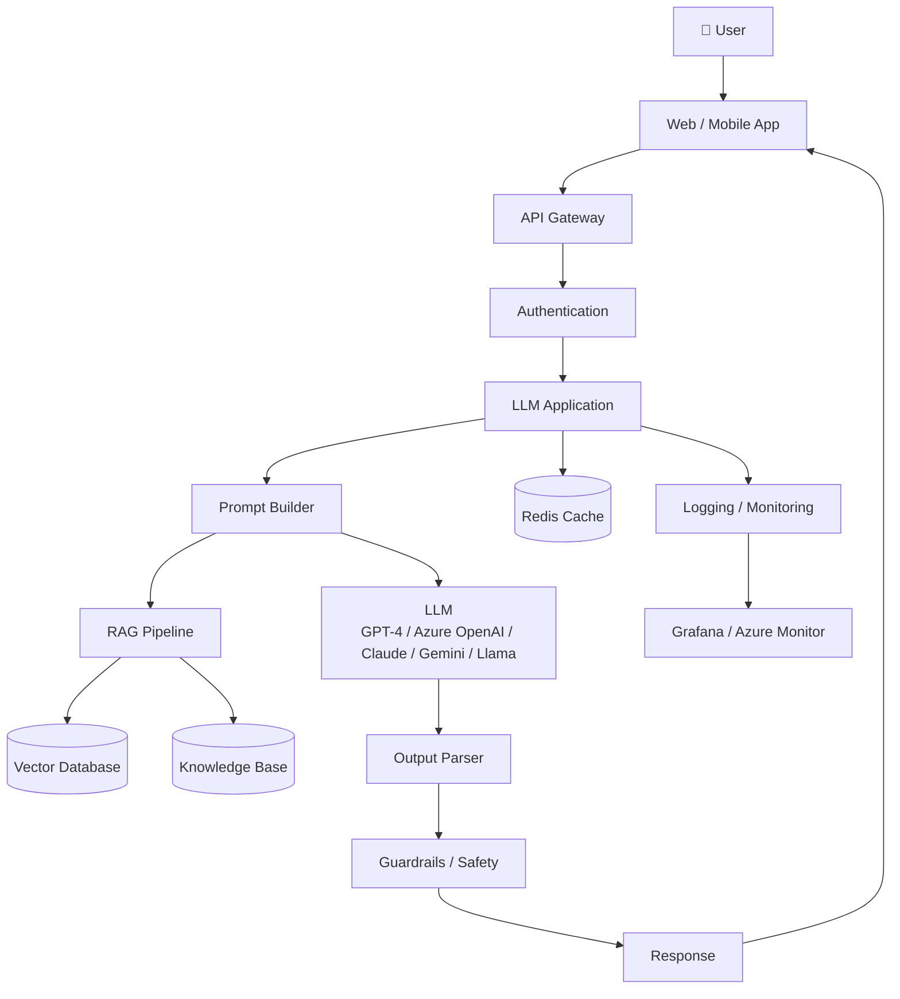
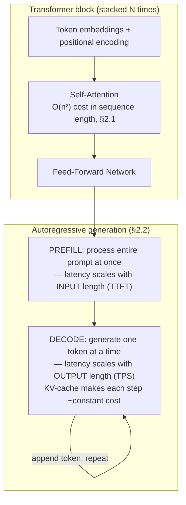

# Module 162 — AI Systems & LLM Fundamentals: Transformers, Tokenization, Embeddings & Inference Characteristics

> Domain: AI Systems (merged 44-50) | Level: Beginner → Expert | Prerequisite: [[../16-Distributed-Systems/05-LSM-Trees-BTrees-BloomFilters-StorageEngines]] (this module's embeddings/similarity-search preview sets up Module 164's Vector Databases, which extends that module's storage-engine-internals discipline), [[../29-Performance-Engineering/01-PerformanceProfiling-BottleneckDiagnosis]] (LLM inference's latency/cost model is this domain's own instance of profiling-driven capacity reasoning)

>
> **Scope note:** `44-AI-Systems` is a merged domain, consolidating what this course originally planned as seven separate domains (Modules 44-50: AI Systems, RAG, MCP, AI Agents, Vector Databases, LLM Integration, Prompt Engineering) into one, per explicit user direction — see `CLAUDE.md`'s 2026-07-19 "Resolved" entry. Scoped autonomously as 8 modules: this one (fundamentals), Prompt Engineering, Vector Databases, RAG, LLM Integration, AI Agents, MCP, and a capstone. This module establishes the mechanical vocabulary (tokens, attention, embeddings, inference cost/latency, non-determinism) every subsequent module in this domain assumes without re-deriving.

---
# Production LLM Architecture



---

# RAG Flow

```text
User Question
      │
      ▼
Prompt Builder
      │
      ▼
Embedding Model
      │
      ▼
Vector Search
      │
      ▼
Relevant Documents
      │
      ▼
Augmented Prompt
      │
      ▼
LLM
      │
      ▼
Response
```

---

# Production Request Flow

```text
User
 │
 ▼
API Gateway
 │
 ▼
Authentication
 │
 ▼
LLM Service
 │
 ├── Redis Cache
 │
 ├── Prompt Builder
 │
 ├── RAG Retrieval
 │
 ├── LLM
 │
 ├── Output Validation
 │
 ▼
Return Response
```

---

# Components

| Component | Responsibility |
|-----------|----------------|
| UI | Chat interface |
| API Gateway | Authentication, Rate Limiting |
| Prompt Builder | System + User Prompt |
| Embedding Model | Convert text into vectors |
| Vector Database | Similarity Search |
| Knowledge Base | Documents |
| LLM | Response Generation |
| Guardrails | Safety, PII, Prompt Injection Protection |
| Redis | Response Cache |
| Monitoring | Metrics & Logs |

---

# Vector Database Options

- Azure AI Search
- Pinecone
- Weaviate
- Qdrant
- Milvus
- ChromaDB
- pgvector (PostgreSQL)

---

# LLM Providers

- Azure OpenAI
- OpenAI GPT
- Anthropic Claude
- Google Gemini
- Meta Llama
- Mistral AI
- DeepSeek

---

# Production Features

- Prompt Versioning
- Conversation Memory
- RAG
- Tool Calling / Function Calling
- Agent Framework
- Streaming Responses
- Token Usage Tracking
- Rate Limiting
- Response Caching
- Observability
- Content Filtering
- Human Feedback Loop
- Model Fallback

---

# Security

- Authentication (OAuth/JWT)
- API Keys
- Secrets Manager / Key Vault
- PII Masking
- Prompt Injection Detection
- Content Safety Filters
- RBAC
- Audit Logs

---

# Scaling

- Stateless API Layer
- Load Balancer
- Horizontal Scaling
- Redis Cache
- Distributed Vector Store
- Queue-based Background Jobs
- Auto Scaling


## 1. Fundamentals

**What:** An **AI system**, in the engineering sense this course uses throughout, is not "a call to an LLM API" — it is the surrounding engineering discipline (orchestration, retrieval, tool integration, evaluation, guardrails, observability) built *around* a probabilistic, non-deterministic-by-nature core component, the way a database system is the engineering discipline built around a storage engine. A **Large Language Model (LLM)** is a neural network — specifically, almost universally today, a **Transformer** — trained to predict the next token in a sequence, whose emergent capability (given enough scale and training data) is producing coherent, contextually-appropriate continuations of arbitrary text, including instructions, questions, and code.

**Why:** Every module in this domain — RAG, Agents, MCP, LLM Integration, Prompt Engineering — builds on top of a shared set of mechanical facts about how these models actually work internally: **why context windows are expensive** (§2.1), **why output is non-deterministic even at temperature zero** (§2.4, this module's own production incident), **why models don't reliably use everything in a long context equally well** (§2.5), and **why hallucination is a structural property of the mechanism, not an occasional bug** (§2.6). A candidate who cannot explain these mechanics from first principles will be unable to reason correctly about any of this domain's subsequent architectural decisions — this is the Elite FinTech Interview Panel's baseline bar for this entire domain, exactly as Module 1's CLR/GC internals were the baseline bar for the C# domain.

**When:** Every system in this domain applies these fundamentals; there's no "when" qualifier the way there is for, say, choosing NgRx over Signals — every LLM-backed system, regardless of use case, inherits the cost model, non-determinism, and context-window behavior this module establishes.

**How (30,000-ft view):**
```
Input text ──tokenize──► token IDs ──embed──► dense vectors
                                                    │
                              Transformer layers (self-attention +
                              feed-forward, stacked N times) — the
                              model's actual "reasoning" substrate
                                                    │
                              Output: a probability distribution
                              over the next possible token
                                                    │
                              Sample ONE token (temperature/top-p
                              control HOW this sampling happens)
                                                    │
                              Append sampled token to the sequence,
                              repeat — AUTOREGRESSIVE generation,
                              one token at a time, until a stop
                              condition (§2.2)
```

---

## 2. Deep Dive

### 2.1 Self-attention and why context length is expensive

The Transformer's core mechanism, **self-attention**, computes, for every token in the input, a weighted combination of every *other* token's representation — letting the model contextualize each word against the entire sequence simultaneously (unlike older, sequential RNN architectures). The direct engineering consequence: **self-attention's computational and memory cost scales quadratically with sequence length** (O(n²) in the number of tokens, for the naive formulation — production systems use optimizations like FlashAttention to reduce the *memory* cost while the *compute* cost remains fundamentally quadratic). This is why doubling a prompt's length doesn't merely double latency and cost — it can more than double it, and why "just put the entire document in the context window" is a real, measurable cost and latency decision, not a free convenience, directly motivating Module 165's RAG architecture (retrieve only the relevant fragment, rather than paying quadratic cost for an entire corpus).

### 2.2 Autoregressive generation, KV-caching, and the two latency phases

Because each token is generated one at a time, conditioned on every previously-generated token, LLM inference has two structurally distinct latency phases production engineers must reason about separately: **prefill** (processing the entire input prompt at once, computing its attention representations — latency here scales with *input* length) and **decode** (generating each output token one at a time, sequentially — latency here scales with *output* length, and each individual decode step is comparatively cheap but strictly sequential, unparallelizable across tokens within one response). **KV-caching** — storing each previous token's computed key/value attention vectors so they don't need to be recomputed on every subsequent decode step — is the standard optimization making decode-phase latency roughly constant per token rather than growing with total sequence length; without it, generating a long response would become progressively slower per token as the sequence grows. This two-phase model directly explains **time-to-first-token (TTFT)** versus **tokens-per-second (TPS)** as the two distinct latency metrics every production LLM integration must monitor separately (§7) — a long prompt primarily hurts TTFT; a long response primarily hurts total completion time via TPS.

### 2.3 Tokenization — why token count is not word count, and why this matters for cost and context budgeting

Text is broken into **tokens** via a subword tokenization scheme (commonly Byte-Pair Encoding, BPE, or similar) — not whole words, and not individual characters, but frequently-occurring subword chunks learned from a large training corpus. A single English word might be one token or several; a rare word, a non-English-language string, or a block of code can tokenize far less efficiently (more tokens per character) than common English prose — a directly cost-relevant fact, since API pricing and context-window limits are both denominated in tokens, not characters or words. **A system processing structured data (JSON, code, or non-English financial-instrument identifiers) will consistently consume more tokens per unit of actual content than a system processing plain English prose**, a capacity-planning fact this course's Elite FinTech context makes directly relevant (ISIN codes, FIX protocol messages, and structured trade data all tokenize comparatively inefficiently).

### 2.4 Temperature, sampling, and the non-determinism gap even at temperature zero

**Temperature** controls how the next-token probability distribution is sampled: temperature 0 deterministically (in principle) selects the single highest-probability token at each step (greedy decoding); higher temperatures flatten the distribution, increasing the chance of selecting a lower-probability token, producing more varied, less predictable output. **The critical, frequently-misunderstood production fact: temperature 0 does not guarantee bit-for-bit reproducible output across separate API calls, even with identical input.** This is because production LLM inference serves many concurrent requests via **batched inference** for throughput efficiency, and floating-point arithmetic is not strictly associative — the exact numerical result of a given computation can vary slightly depending on which other requests happen to be batched alongside it, on which specific hardware executes it, and on non-deterministic parallel-reduction ordering inside the underlying matrix-multiplication kernels — differences small enough to be invisible for most individual computations, but capable of occasionally flipping which token has the (very narrowly) highest probability at a given decoding step, after which the entire remainder of the autoregressive generation diverges from what it "would have" produced under a different batch composition. **"Temperature 0" should be understood as "much more consistent and predictable than higher temperatures," never as "guaranteed identical output on every call"** — this module's own §4 production incident develops the direct, real consequence of this distinction being missed.

### 2.5 Context window limits and the "lost in the middle" phenomenon

A model's **context window** is the maximum number of tokens (input plus output combined) it can process in a single request — a hard architectural limit, not merely a cost consideration. Beyond the hard limit, a well-documented, empirically-measured phenomenon called **"lost in the middle"** shows that model recall accuracy for information placed in the *middle* of a long context is measurably, meaningfully worse than for information placed near the *beginning* or *end* of the same context — meaning a system that simply concatenates a large volume of retrieved or reference content into the prompt, trusting the model to "find the relevant part," is silently degrading in accuracy specifically for content unlucky enough to land in the middle of that concatenation, a genuinely new "declared ≠ actual" instance for this course (the context window *declares* it can hold N tokens of usable information; the model's *actual*, measured recall behavior across that window is meaningfully non-uniform) — directly motivating deliberate retrieval-relevance-ranking and prompt-structuring discipline in Module 163 and 165 rather than "just put everything in and let the model figure it out."

### 2.6 Hallucination as a structural property, not a bug

An LLM is trained to predict statistically plausible continuations of text — it has no built-in mechanism distinguishing "a continuation that is true" from "a continuation that is merely fluent and plausible-sounding," and no innate access to a verified, current, external source of truth beyond whatever patterns were present in its training data (which is itself frozen as of a training cutoff date, and was never guaranteed to be fully accurate even at that time). **"Hallucination" — a model confidently generating fluent, plausible, but factually incorrect or entirely fabricated content — is therefore not a defect to be "fixed" through better prompting alone; it is a direct, structural consequence of how the mechanism works**, and the only architectural mitigations that genuinely address it are ones that ground the model's output in externally-verified, retrievable information (Module 165's RAG) or that add an independent verification/citation layer, rather than any prompt-engineering technique alone (Module 163) fully eliminating it.

---

## 3. Visual Architecture



```
Context window — declared capacity vs. actual, measured recall (§2.5):

  [Beginning]────────────[MIDDLE — measurably worse recall]────────────[End]
   high recall                  "lost in the middle"                high recall

  A system trusting "it fits in the context window" as equivalent to
  "the model will reliably use all of it" is exactly this module's
  own instance of this course's recurring "declared ≠ actual" theme.
```

---

## 4. Production Example

**Problem:** A wealth-management platform's LLM-generated portfolio-commentary feature — summarizing a client's holdings and recent performance in natural language for relationship managers — was configured with `temperature: 0`, on the explicit reasoning that this would make outputs reproducible for compliance review purposes, since the compliance team required being able to re-generate and verify any historical commentary on demand.

**Architecture:** A backend service calling a hosted LLM API with `temperature: 0` for every commentary-generation request, storing the generated commentary text in the platform's audit database but — critically — not storing the *exact* model version, provider-side batch/routing metadata, or a verbatim copy of every input token, on the assumption that `temperature: 0` alone made the output a fully deterministic, reproducible function of the stored prompt text.

**Implementation / What happened:** Several months later, a regulator's routine audit requested that the firm reproduce a specific piece of historical portfolio commentary from its exact original inputs, to verify the commentary's original generation process. The team re-submitted the identical, stored prompt text at `temperature: 0` — and received output that was *substantively similar but not identical* to the original: same overall facts and tone, but different specific phrasing, and in one instance, a materially different characterization of a performance figure's qualitative framing ("modest gains" versus "strong performance" for the same underlying number) — a difference the compliance team could not confidently explain, and one directly traceable to §2.4's exact mechanism: the underlying model had also been silently upgraded by the provider in the intervening months (a routine, provider-side model-version update the platform had no explicit pinning against), compounding with `temperature: 0`'s own weaker-than-assumed reproducibility guarantee even absent any model change at all.

**Trade-offs:** The team's original reasoning (`temperature: 0` implies reproducibility) was a genuinely common, individually-plausible assumption — and was *approximately* true in practice for most requests, which is exactly what made the gap invisible until a specific, high-stakes audit scenario actually exercised it.

**Lessons learned:** **`temperature: 0` narrows non-determinism; it does not eliminate it, and provider-side model updates are an entirely separate, compounding reproducibility risk that no temperature setting addresses at all.** For any system where output reproducibility carries genuine audit/compliance weight — this course's Elite FinTech lens treats this as the common case, not the exception — the correct architecture requires explicitly **pinning to a specific, versioned model snapshot** (never a floating "latest" alias) and **storing the complete, verbatim request (including every parameter) and response**, treating the *stored response* itself, not a promise of future re-generatability, as the actual, permanent audit record — the LLM-system-specific instance of this course's now-thoroughly-established finding that a declared guarantee ("temperature 0 = deterministic") is only ever true for the specific, narrower scope actually verified, never the broader scope casually assumed.

---

## 5. Best Practices

- **Never assume `temperature: 0` guarantees bit-for-bit reproducible output** (§2.4, §4) — treat it as "meaningfully more consistent," and for any genuinely audit-critical use case, store the complete verbatim output itself as the permanent record rather than relying on future re-generation.
- **Pin to a specific, versioned model identifier, never a floating "latest" alias**, for any production system where behavioral consistency over time matters — a provider's routine model update is a silent, compounding non-determinism source independent of temperature.
- **Budget context-window usage deliberately, accounting for the "lost in the middle" effect** (§2.5) — place the most critical information near the beginning or end of a long prompt, and prefer targeted retrieval (Module 165) over indiscriminately maximizing how much content is stuffed into the window.
- **Treat token count, not character or word count, as the actual unit of cost and capacity planning** (§2.3) — especially for non-English text, code, or structured/identifier-heavy financial data, which tokenizes less efficiently than plain English prose.
- **Architect for hallucination as a structural property requiring grounding or verification, not a bug to be prompted away** (§2.6) — any use case with real factual-accuracy consequence needs RAG (Module 165) or an equivalent verification layer, not prompt engineering alone.

---

## 6. Anti-patterns

- **Assuming `temperature: 0` makes an LLM-backed feature suitable for exact-reproducibility compliance requirements without explicit model-version pinning and full response archival** — §4's exact incident.
- **"Just put the whole document in the context window since it fits"** — ignores both the quadratic cost scaling (§2.1) and the "lost in the middle" recall degradation (§2.5), producing a system that is both more expensive and silently less accurate than a deliberately-scoped retrieval approach.
- **Treating hallucination as solvable purely through more careful prompt wording** — addresses surface symptoms at best; the structural fix requires grounding the model's output in externally verifiable, retrieved information (Module 165).
- **Estimating token/cost budgets from word or character counts** rather than an actual tokenizer — produces systematically wrong capacity and cost estimates, especially for non-English or structured content (§2.3).
- **Floating-alias model references ("use the latest model") in any production system with behavioral-consistency requirements** — reproduces §4's incident's second, compounding root cause independent of the temperature-setting mistake.

---

## 7. Performance Engineering

Production LLM latency must be reasoned about as two structurally distinct components (§2.2): **TTFT (time-to-first-token)**, dominated by prefill cost and therefore primarily a function of *input* length, and **TPS (tokens-per-second) / total completion time**, dominated by decode cost and therefore primarily a function of *output* length — a system optimizing only one of these two metrics can still deliver a poor overall user experience if the other is neglected (a system with excellent TTFT but slow per-token decode still feels sluggish for long responses; a system with fast decode but slow TTFT feels unresponsive at the start of every interaction). **Streaming** (returning tokens to the client incrementally as they're generated, rather than waiting for the complete response) directly addresses perceived latency by letting a user begin reading a response during the decode phase rather than waiting for total completion — a UX-latency technique with no cost-reduction benefit of its own, but a substantial perceived-responsiveness benefit, directly analogous to Module 156's async-pipe streaming reasoning applied to LLM output specifically. Token cost scales with both input and output length (§2.1's quadratic input-cost concern, plus linear output-length cost) — making prompt-length discipline (Module 163, 165) a direct, measurable cost-optimization lever, not merely an accuracy one.

---

## 8. Security

**Prompt injection** — an attacker (or, more insidiously, content the system retrieves and includes in its own context, Module 165's "indirect prompt injection" risk) crafting text specifically designed to override or subvert the system's intended instructions — is this domain's new, LLM-specific threat class, introduced here at the fundamentals level and developed fully in Module 163 (direct injection via user input) and Module 165/167 (indirect injection via retrieved documents or tool outputs). Unlike SQL injection (Module 97), which has a structural, parameterization-based fix that fully closes the vulnerability class, **prompt injection currently has no equivalently complete structural fix** — the model cannot cryptographically distinguish "trusted system instructions" from "untrusted user or retrieved content" the way a parameterized SQL query structurally separates code from data, making this domain's security posture necessarily defense-in-depth (input/output filtering, least-privilege tool access, human-in-the-loop for consequential actions) rather than a single closing control, a genuinely different risk-mitigation shape than this course's other injection-class vulnerabilities. Data sent to a third-party LLM provider (prompts, retrieved context, any PII embedded in either) is a data-residency and confidentiality concern this course's Elite FinTech lens treats with the same weight as any other third-party data-sharing decision (Module 155's B2B federation trust-boundary reasoning applies directly) — provider data-retention policies, regional hosting requirements, and contractual data-use terms are all first-class architectural inputs, not afterthoughts.

---

## 9. Scalability

Production LLM API integrations must account for **rate limits** (both request-count and token-throughput limits, commonly enforced per-minute by providers) as a first-class capacity constraint — directly analogous to Module 136's backend service rate-limiting discipline, but now applied to an external, third-party-controlled dependency the platform doesn't operate itself. **Multi-provider fallback** (routing to a secondary LLM provider or a self-hosted model when the primary is rate-limited, degraded, or unavailable) is this domain's direct instance of Module 136's circuit-breaker/fallback pattern, complicated by the fact that different providers' models can produce meaningfully different output style/quality for the same prompt — a fallback isn't a purely mechanical redundancy the way a load-balanced backend service replica is, since switching providers can itself change the user-visible output characteristics. Request batching (grouping multiple independent prompts into fewer API calls where the provider supports it) trades latency for throughput/cost efficiency, the LLM-domain instance of this course's now-familiar batching-versus-latency trade-off (Module 141's backpressure reasoning).

---

## 10. Interview Questions

### Basic (10)

**B1. What does "autoregressive generation" mean for an LLM?**
*Ideal Answer:* The model generates output one token at a time, with each new token conditioned on the entire sequence generated so far (including its own previously-generated tokens), repeating until a stop condition is reached.
*Why correct:* Matches §2.2.
*Common mistakes:* Assuming the model generates the entire response "at once" rather than sequentially, token by token.
*Follow-up:* Why does this make output generation strictly sequential and harder to parallelize than input processing?

**B2. Why is self-attention's cost described as scaling quadratically with sequence length?**
*Ideal Answer:* Because self-attention computes, for every token, a weighted relationship to every other token in the sequence — for n tokens, that's on the order of n² pairwise relationships to compute.
*Why correct:* Matches §2.1.
*Common mistakes:* Assuming cost scales linearly with input length, missing the pairwise, quadratic relationship computation.
*Follow-up:* What real-world engineering decision does this cost model directly motivate?

**B3. What is a token, and why is token count not the same as word count?**
*Ideal Answer:* A token is a subword unit produced by the model's tokenizer (commonly BPE) — a single word can be one token or several, and different languages/content types tokenize with different efficiency.
*Why correct:* Matches §2.3.
*Common mistakes:* Assuming tokens roughly correspond one-to-one with words for all content types uniformly.
*Follow-up:* Why would a system processing financial instrument identifiers or code tokenize less efficiently than plain English prose?

**B4. Does `temperature: 0` guarantee identical output across separate API calls with identical input?**
*Ideal Answer:* No — it significantly narrows variability but does not guarantee bit-for-bit reproducibility, due to floating-point non-associativity under batched inference and other non-deterministic serving-infrastructure factors.
*Why correct:* Matches §2.4.
*Common mistakes:* Treating temperature 0 as an unconditional determinism guarantee.
*Follow-up:* Name a second, independent source of non-determinism beyond temperature/batching that this module's own incident identified.

**B5. What is the "lost in the middle" phenomenon?**
*Ideal Answer:* Empirically measured, meaningfully worse model recall accuracy for information placed in the middle of a long context, relative to information near the beginning or end.
*Why correct:* Matches §2.5.
*Common mistakes:* Assuming a model uses all of its context window with uniform reliability regardless of where information is positioned.
*Follow-up:* What architectural practice does this motivate for prompt/context construction?

**B6. Why is hallucination described as a "structural property" rather than a bug?**
*Ideal Answer:* Because the model is trained to predict statistically plausible text continuations, with no built-in mechanism to distinguish true from merely-plausible-sounding content, and no access to a verified external source of truth — this is inherent to how the mechanism works, not an occasional malfunction.
*Why correct:* Matches §2.6.
*Common mistakes:* Assuming hallucination can be fully eliminated through better prompt wording alone.
*Follow-up:* What architectural technique does this course develop as the actual, structural mitigation?

**B7. What are the two distinct latency phases of LLM inference, and what does each scale with?**
*Ideal Answer:* Prefill (processing the input prompt, scales with input length, determines time-to-first-token) and decode (generating output tokens sequentially, scales with output length, determines tokens-per-second/total completion time).
*Why correct:* Matches §2.2/§7.
*Common mistakes:* Treating LLM latency as one undifferentiated number rather than two separately-optimizable phases.
*Follow-up:* What technique reduces the second phase's per-token cost from growing with total sequence length?

**B8. What is KV-caching, and why does it matter for inference latency?**
*Ideal Answer:* Storing each previous token's computed attention key/value vectors so they don't need to be recomputed on every subsequent decode step, keeping per-token decode cost roughly constant rather than growing with sequence length.
*Why correct:* Matches §2.2.
*Common mistakes:* Confusing KV-caching with a general-purpose application cache (like Module 103's Redis caching), rather than understanding it as an inference-internal optimization specific to the autoregressive decoding process.
*Follow-up:* What would happen to decode latency without KV-caching?

**B9. What is prompt injection, at a high level?**
*Ideal Answer:* An attacker (or untrusted retrieved/tool content) crafting text specifically designed to override or subvert a system's intended instructions to the model.
*Why correct:* Matches §8.
*Common mistakes:* Assuming prompt injection has an equivalently complete structural fix to SQL injection's parameterization.
*Follow-up:* Why doesn't prompt injection have an equally complete structural fix?

**B10. Why does streaming a response improve perceived latency without reducing actual total cost?**
*Ideal Answer:* Streaming lets a user begin reading tokens as they're generated during the decode phase, rather than waiting for the full response to complete — improving perceived responsiveness, but the total token count (and therefore total cost/compute) generated is unchanged.
*Why correct:* Matches §7.
*Common mistakes:* Assuming streaming reduces cost or total generation time, rather than correctly identifying it as a perceived-latency/UX technique specifically.
*Follow-up:* What Angular/React mechanism (Modules 156-161) is structurally analogous to consuming a streamed LLM response?

### Intermediate (10)

**I1. Design the audit-record architecture that would have prevented §4's incident.**
*Ideal Answer:* Pin every production request to a specific, versioned model identifier (never a floating alias); store the complete, verbatim request (full prompt text, every parameter including temperature, the exact model version used) and the complete, verbatim response as the permanent, immutable audit record — treating the stored response itself as the actual compliance artifact, never relying on future re-generation to reproduce a historical result.
*Why correct:* Matches §4/§5's precise fix.
*Common mistakes:* Proposing only model-version pinning or only full-response archival, missing that both are independently necessary — pinning alone doesn't help if the original response wasn't archived, and archival alone doesn't prevent the confusion of assuming future re-generation should match.
*Follow-up:* What happens to this audit architecture's validity if the provider deprecates and removes access to the pinned model version entirely?

**I2. Explain precisely why batched inference introduces non-determinism even at temperature 0, connecting it to floating-point arithmetic properties.**
*Ideal Answer:* Floating-point addition and multiplication are not strictly associative — the order in which values are summed/multiplied can produce minutely different results. Production inference serves many requests simultaneously via batched matrix operations for throughput efficiency; which other requests happen to be batched alongside a given one can affect the exact numerical computation order, producing minutely different intermediate values that can, rarely, flip which token has the narrowly-highest probability at a given decode step — after which the entire autoregressive continuation diverges.
*Why correct:* Matches §2.4's precise mechanical explanation.
*Common mistakes:* Attributing the non-determinism vaguely to "hardware randomness" without the specific floating-point-non-associativity-under-batching mechanism.
*Follow-up:* Would running inference with a batch size of exactly 1 (no batching at all) eliminate this specific source of non-determinism? At what cost?

**I3. Design a context-construction strategy for a long reference document, accounting for the "lost in the middle" effect.**
*Ideal Answer:* Rather than concatenating the entire document into the context window, either (a) use targeted retrieval (Module 165) to include only the most relevant fragments, deliberately placed near the beginning of the prompt, or (b) if the full document genuinely must be included, explicitly restructure it so the most critical information is duplicated or summarized near the beginning and/or end of the context, rather than trusting the model to reliably recall content buried in the middle.
*Why correct:* Matches §2.5's direct architectural implication.
*Common mistakes:* Proposing only "make the context window bigger" as a fix, which doesn't address the recall-degradation problem at all — a bigger window doesn't fix non-uniform recall within it.
*Follow-up:* How would you empirically test whether your specific use case is actually affected by this phenomenon, rather than assuming it applies uniformly?

**I4. A financial-services chatbot correctly cites a specific regulation but gets the regulation's actual requirement subtly wrong. Is this "hallucination," and what's the correct architectural response?**
*Ideal Answer:* Yes — this is a textbook hallucination instance: the model produced fluent, plausible, citation-referencing text that is nonetheless factually incorrect, exactly the "confident but wrong" pattern §2.6 describes. The correct architectural response is not better prompting alone but grounding: retrieving the actual, current regulatory text (Module 165's RAG) and requiring the model's response to be derived from and traceable to that retrieved source, ideally with an explicit citation the response's accuracy can be independently verified against.
*Why correct:* Correctly identifies the scenario as hallucination despite the surface-plausible citation, and correctly identifies grounding (not prompting) as the structural fix.
*Common mistakes:* Assuming a citation's mere presence indicates the underlying content is accurate, missing that the model can fabricate plausible-looking citations and content simultaneously.
*Follow-up:* What would you add to the system to let a human reviewer quickly verify the model's citation is both real and accurately represented?

**I5. Compare the cost implications of a 10,000-token input prompt against a 10,000-token output response.**
*Ideal Answer:* Both consume roughly comparable token-based billing cost (most providers price input and output tokens similarly, sometimes with output priced higher), but their *latency* implications differ sharply: the 10,000-token input primarily affects prefill/TTFT (and, per §2.1, at a worse-than-linear rate due to attention's quadratic scaling), while the 10,000-token output primarily affects total decode time (more closely linear, given KV-caching keeps per-token decode cost roughly constant).
*Why correct:* Matches §2.1/§2.2/§7's precise distinction between cost and latency implications, correctly identifying they don't move together in the same way.
*Common mistakes:* Treating input and output tokens as equivalent in every dimension (cost, latency) rather than distinguishing their different latency-scaling behavior specifically.
*Follow-up:* Which of the two (input or output length) would you prioritize reducing first if optimizing for user-perceived responsiveness specifically?

**I6. Design a token-budget estimation function for a system that must fit a variable amount of retrieved context plus a fixed instruction prompt within a model's context window.**
*Ideal Answer:* Use the actual tokenizer for the target model (never word/character-count approximation, per §2.3) to measure the fixed instruction prompt's token count first, subtract from the model's total context window (reserving additional headroom for the expected output length, since output tokens also count against most models' combined context limit), then greedily include retrieved context fragments (ranked by relevance, Module 165) up to the remaining budget, stopping before exceeding it rather than truncating mid-fragment.
*Why correct:* Correctly accounts for the combined input+output budget, actual tokenization (not approximation), and ranked/prioritized inclusion rather than naive concatenation.
*Common mistakes:* Budgeting only for input tokens, forgetting that most models' context window is a combined input+output limit, risking a truncated or rejected response when output length isn't reserved for.
*Follow-up:* What should the system do if even the single most relevant retrieved fragment doesn't fit within the remaining budget?

**I7. Why might a system using a self-hosted, open-weight model have an easier time achieving true output reproducibility than one using a hosted, third-party API?**
*Ideal Answer:* A self-hosted deployment has full control over the exact model weights, serving infrastructure, batch composition, and hardware — all the variables contributing to §2.4's non-determinism — and can, with sufficient engineering effort (fixed batch size 1, deterministic kernel configurations), achieve much closer to true reproducibility than a third-party API where the provider controls (and can silently change) every one of those variables without the consuming system's knowledge or consent.
*Why correct:* Correctly connects the reproducibility question to which party controls the relevant serving-infrastructure variables, matching §2.4's mechanics.
*Common mistakes:* Assuming self-hosting automatically guarantees reproducibility without acknowledging the deliberate engineering effort (fixed batching, deterministic kernels) still required to actually achieve it.
*Follow-up:* What cost/operational trade-off does a firm accept by choosing self-hosting specifically to gain this reproducibility control?

**I8. Explain why prompt injection's lack of a structural fix (analogous to SQL parameterization) is a genuinely different security posture than this course's other injection-class vulnerabilities.**
*Ideal Answer:* SQL injection (Module 97) has a complete structural fix because a parameterized query gives the database engine an unambiguous, mechanical way to distinguish code from data at the protocol level. An LLM has no equivalent mechanism — "system instructions" and "user/retrieved content" are both just text fed into the same token stream, with no cryptographic or structural separation the model is guaranteed to respect, meaning defenses (input filtering, least-privilege tool access, output validation) are probabilistic risk-reduction layers, not a single closing control the way parameterization is.
*Why correct:* Matches §8's precise distinction.
*Common mistakes:* Assuming some prompt-engineering technique (e.g., clearly delimiting instructions from user content with special tokens) provides an equivalently complete guarantee to SQL parameterization, rather than correctly identifying it as risk reduction, not elimination.
*Follow-up:* Given no complete structural fix exists, what governance principle should apply to any tool/action an LLM-backed system can trigger, given prompt injection could potentially redirect that action?

**I9. Design a monitoring strategy distinguishing a genuine LLM provider outage from a rate-limit-driven degradation.**
*Ideal Answer:* Monitor and alert on the specific HTTP/API error codes and response headers a provider returns (rate-limit responses are typically distinctly coded, often with a `Retry-After` header, versus a generic 5xx server error indicating genuine unavailability); track request success rate and TTFT/TPS percentiles separately, since a rate-limit-throttled system might show elevated latency with eventual success, while a genuine outage shows outright failures — the two failure modes warrant different automated responses (backoff-and-retry for rate limits, failover to a secondary provider for genuine outages, §9).
*Why correct:* Correctly distinguishes the two failure modes by their actual, distinguishable signals and connects each to the appropriate specific response.
*Common mistakes:* Treating all API failures uniformly, missing that rate-limiting and genuine outages warrant different automated remediation.
*Follow-up:* Why might blindly retrying on every failure type risk worsening a genuine, capacity-related provider outage?

**I10. A team argues that since LLM output is inherently non-deterministic, conventional unit testing is pointless for LLM-backed features, and they should rely entirely on manual review. Evaluate this claim.**
*Ideal Answer:* Overstated — while exact-output-matching assertions are indeed unreliable given §2.4's non-determinism, testing can and should still verify properties that don't depend on exact reproducibility: does the response contain (or avoid) specific required/forbidden content, does it stay within expected length/format bounds, does a structured-output response parse correctly against its expected schema, does the system correctly handle a known-hallucination-prone query by triggering the grounding/citation pathway rather than a free-form response. Testing shifts from exact-match assertions to property-based and behavioral assertions, not away from testing entirely.
*Why correct:* Correctly refutes the overstated "testing is pointless" claim while acknowledging the genuine, real shift in testing strategy non-determinism requires.
*Common mistakes:* Either agreeing that testing is pointless (missing the genuine property-based testing alternative) or insisting exact-match testing remains viable despite §2.4's clearly-established non-determinism.
*Follow-up:* Design one specific property-based test assertion for a portfolio-commentary-generation feature, avoiding exact-output matching.

### Advanced (10)

**A1. Design the complete audit-and-reproducibility architecture for TradeView-style AI-generated content (portfolio commentary, trade rationale summaries) at a financial institution, addressing every gap §4's incident exposed.**
*Ideal Answer:* Pin every production call to an exact, versioned model identifier with an explicit, governed process for evaluating and approving any model-version change (never a silent, provider-driven update reaching production unreviewed); store the complete verbatim request (prompt, all parameters) and complete verbatim response, immutably, as the permanent audit record; explicitly document, in any compliance-facing material, that "reproducibility" means "the original archived output is the permanent record," never "this can be exactly regenerated on demand" — closing the exact expectation-mismatch that produced §4's incident; periodically (not merely reactively) test regeneration against the pinned model version to detect any provider-side silent behavior drift even within a nominally "pinned" version identifier.
*Why correct:* Synthesizes every element of §4/§5/I1's fix into one complete, governed architecture, including the organizational/documentation dimension (correcting the compliance team's own mistaken expectation) alongside the technical one.
*Common mistakes:* Addressing only the technical pinning/archival fix without the organizational correction of what "reproducibility" should be understood to mean by the compliance stakeholders who originally set the (mistaken) requirement.
*Follow-up:* How would you detect, proactively, if a provider silently changed behavior even within a version you believe is pinned (a version string that doesn't actually guarantee full behavioral stability)?

**A2. Critique: "Since token cost scales with length, the most cost-effective LLM system design always minimizes prompt length as aggressively as possible."**
*Ideal Answer:* Overstated — per §2.5/§2.6, aggressively minimizing prompt length by, for instance, omitting grounding context to save tokens directly increases hallucination risk, trading a token-cost saving for a correctness risk that, in a financial-services context, likely carries far higher expected cost (regulatory, reputational, client-trust) than the marginal token savings. The correct optimization target is minimizing *unnecessary* length (irrelevant retrieved content, verbose boilerplate instructions) while preserving whatever length is genuinely necessary for grounding and accuracy — a calibration question, not a uniform minimization instinct.
*Why correct:* Correctly identifies the overstated claim's failure to weigh the accuracy/hallucination-risk cost against the token-cost saving, matching this course's repeated caution against optimizing one dimension while ignoring a coupled risk dimension.
*Common mistakes:* Accepting the claim as straightforwardly correct because token cost is a genuine, real cost, without weighing it against the correctness risk of removing genuinely necessary grounding content.
*Follow-up:* How would you measure whether a specific piece of context is "genuinely necessary" versus "safely removable" for a given use case?

**A3. Design an experiment to empirically measure whether "lost in the middle" affects a specific production use case's actual retrieved-document context length and structure.**
*Ideal Answer:* Construct a test set of prompts with a known, verifiable fact deliberately placed at varying positions (beginning, 25%, 50%, 75%, end) within a context of the production system's typical length and structure, holding everything else constant; measure the model's accuracy at correctly recalling/using that fact as a function of its position; if accuracy shows the expected middle-degradation pattern for this specific context length/structure, that confirms the phenomenon applies and quantifies its severity for this use case specifically, informing whether context-restructuring (I3) is worth the added engineering complexity for this particular system.
*Why correct:* Correctly designs a controlled, position-varying experiment rather than assuming the general research finding applies uniformly to every system without empirical verification specific to that system's own context length/structure.
*Common mistakes:* Assuming the general "lost in the middle" research finding applies identically to every context length and content type without any use-case-specific verification.
*Follow-up:* How would you determine whether this phenomenon's severity for your use case justifies the added engineering cost of context restructuring versus simply accepting the measured accuracy degradation?

**A4. A team observes that switching their LLM provider's model version (an approved, reviewed change, not a silent drift) causes a measurable change in a downstream structured-output-parsing success rate. Diagnose the likely cause and design the fix.**
*Ideal Answer:* Likely cause: different model versions/providers can have subtly different tendencies in how reliably they adhere to a requested output format (JSON schema, specific delimiters) even when given identical formatting instructions — a model-version-specific behavioral characteristic, not a bug in the consuming system's parsing logic. Fix: adopt the provider's native structured-output/function-calling mode where available (Module 166 develops this), which constrains generation at the token-sampling level to guarantee schema-valid output, rather than relying on prompt-instruction-based formatting requests alone, which are inherently probabilistic and model-version-dependent.
*Why correct:* Correctly diagnoses the root cause as model-version-specific formatting-adherence variance and correctly identifies the structural (constrained-generation) fix over a purely prompt-engineering one.
*Common mistakes:* Assuming the parsing failure is a bug in the consuming application's parser, rather than correctly attributing it to the upstream model's own formatting-adherence variance across versions.
*Follow-up:* Why might constrained/structured-output generation modes still not be a complete guarantee against every possible parsing failure?

**A5. Design a capacity-planning model for an LLM-backed system's peak-hour token throughput, accounting for both prefill and decode costs separately.**
*Ideal Answer:* Model peak-hour load as (peak concurrent requests) × (average prompt tokens, driving prefill/TTFT cost) plus (peak concurrent requests) × (average response tokens ÷ average TPS the provider sustains under load, driving total decode time) — provisioning rate-limit headroom and, per §9, multi-provider fallback capacity against the *combined* peak of both dimensions, since a system could be within its token-count rate limit while still experiencing degraded TTFT/TPS under genuine peak concurrent load if the provider's own infrastructure is contended, directly recurring Module 148 §4's peak-versus-average capacity-planning finding at the LLM-inference layer.
*Why correct:* Correctly models both cost dimensions separately and explicitly connects the reasoning to this course's established peak-versus-average capacity-planning caution from an entirely different domain (storage engines).
*Common mistakes:* Modeling capacity purely by token-count rate limits without separately accounting for the provider's own latency/throughput degradation under genuine peak concurrent load, which is a distinct constraint from the stated rate limit.
*Follow-up:* How would you distinguish, in production monitoring, a rate-limit-driven degradation from a provider-infrastructure-contention-driven one, given both could produce similar user-visible symptoms?

**A6. Explain why a system that retrieves and includes third-party or user-submitted content in an LLM's context (setting up Module 165's RAG coverage) inherits a security risk beyond ordinary prompt injection from the system's own direct users.**
*Ideal Answer:* This is "indirect prompt injection" — content the system itself retrieves and includes in the model's context (a webpage, a document, a tool's output) can contain adversarially-crafted instructions an attacker embedded specifically to be picked up when *some other, unsuspecting* user's query causes that content to be retrieved and fed to the model — the attack surface extends beyond the system's own direct, authenticated users to include anyone who can influence content the system might later retrieve, a meaningfully broader and harder-to-govern threat surface than direct prompt injection from an authenticated user alone.
*Why correct:* Correctly identifies the indirect-injection risk's distinguishing characteristic (attacker need not be a direct user at all) and its broader, harder-to-bound attack surface.
*Common mistakes:* Treating indirect prompt injection as merely "the same risk as direct injection, just via a different input channel," missing that the attacker population and governance boundary are genuinely different and broader.
*Follow-up:* What retrieval-source governance practice would reduce this risk's severity, previewing Module 165's fuller treatment?

**A7. Design a governance process for approving LLM model-version upgrades in a regulated financial-services context, addressing both the reproducibility concern (§4) and potential behavioral-drift concerns (A4).**
*Ideal Answer:* Treat any model-version change as a governed, reviewed deployment (directly reusing Module 26's CI/CD release-governance discipline) requiring: (1) a regression test suite covering the property-based assertions I10 established (not exact-output matching), run against the candidate version before approval; (2) an explicit compliance sign-off specifically addressing whether the change affects any audit/reproducibility-sensitive use case (A1); (3) a staged, canary-style rollout (Module 87's progressive-delivery pattern) rather than an immediate, full cutover, monitoring the structured-output-parsing success rate and any other established quality metrics for regression before full rollout; (4) an explicit, permanent record of which model version was live for which date range, supporting any future audit inquiry about historical output.
*Why correct:* Synthesizes this course's established CI/CD, progressive-delivery, and compliance-governance disciplines into one coherent process specifically addressing this domain's own model-versioning risk, rather than treating it as a novel problem requiring an entirely new governance framework.
*Common mistakes:* Proposing an ad hoc, LLM-specific governance process without recognizing it should reuse this course's already-established release-governance and progressive-delivery disciplines directly.
*Follow-up:* Who should hold sign-off authority for approving a model-version change specifically for audit-sensitive use cases, versus for lower-stakes, exploratory use cases?

**A8. A model's context window is technically large enough to hold an entire day's trading blotter (thousands of transactions) for a "summarize today's activity" feature. Should the system take this approach, given §2.1 and §2.5?**
*Ideal Answer:* Not advisable as a default: per §2.1, the quadratic attention cost makes this the most expensive possible way to construct the prompt; per §2.5, "lost in the middle" means transactions positioned in the middle of thousands of concatenated entries are at meaningfully higher risk of being under-weighted or omitted from the summary than those near the beginning/end — a genuine correctness risk for a use case (trading activity summarization) where completeness plausibly has compliance relevance. A better architecture pre-aggregates or pre-filters the data programmatically (grouping, computing statistics, ranking by materiality) before constructing a much shorter, already-structured prompt, using the LLM specifically for the natural-language-generation step rather than as a substitute for data aggregation the platform's existing, deterministic backend logic can perform far more cheaply and reliably.
*Why correct:* Correctly applies both §2.1's cost concern and §2.5's recall-degradation concern to conclude against the naive "big context window, dump it all in" approach, and proposes the correct architectural alternative (pre-aggregate deterministically, use the LLM only for the generation step it's actually suited for).
*Common mistakes:* Approving the naive approach because the context window is technically large enough to fit the data, without weighing either the cost or the recall-degradation implications this module has established.
*Follow-up:* What class of use case would make "put everything in the context window" the *correct* choice despite these concerns?

**A9. Synthesize this module's non-determinism finding (§2.4) and hallucination finding (§2.6) — are they the same underlying risk, or genuinely distinct?**
*Ideal Answer:* Genuinely distinct, though easily conflated: non-determinism (§2.4) is about *identical inputs potentially producing different, but each individually plausible, outputs* across separate calls — a reproducibility concern. Hallucination (§2.6) is about *any single output potentially being fluent but factually wrong*, regardless of whether it would be reproducible on a repeat call — an accuracy/truthfulness concern. A system could have low non-determinism (highly consistent, reproducible outputs) while still hallucinating consistently (confidently, repeatedly wrong in the same way) — and conversely, a system could have high non-determinism while every individual output happens to be factually accurate. The two risks require different mitigations: reproducibility requires pinning/archival (§5); accuracy requires grounding (Module 165) — addressing one does not address the other.
*Why correct:* Correctly distinguishes the two risks along their actual, independent dimensions (consistency-across-calls versus accuracy-within-a-call) rather than treating them as interchangeable "LLM unreliability" concerns.
*Common mistakes:* Conflating the two, assuming a fix for one (e.g., temperature 0 for reproducibility) also addresses the other (accuracy) — it does not.
*Follow-up:* Which of the two risks does RAG (Module 165) primarily address, and does it have any effect on the other?

**A10. As the opening module of `44-AI-Systems`, name the single organizing principle this module establishes that every subsequent module in this domain will assume without re-deriving.**
*Ideal Answer:* Every LLM-backed system inherits three structural, non-optional properties from the underlying mechanism regardless of application: **cost/latency that scales non-trivially with context length** (§2.1-§2.2), **non-determinism that no configuration setting fully eliminates** (§2.4), and **a structural inability to guarantee factual accuracy without external grounding** (§2.6) — every architectural decision this domain's subsequent modules examine (retrieval strategy, agent design, tool integration, prompt structure) is, at its core, a specific engineering response to one or more of these three inherited, unavoidable properties, not an independent design space each module invents from scratch.
*Why correct:* Correctly identifies and states the specific, three-part organizing principle this module establishes, at the right level of generality to genuinely anchor the rest of the domain rather than either restating one specific fact or an unhelpfully vague generality.
*Common mistakes:* Naming only one of the three properties (commonly just hallucination, since it's the most commonly discussed publicly) without recognizing all three as the module's full, combined organizing contribution.
*Follow-up:* Which of Module 163 (Prompt Engineering), 164 (Vector Databases), or 165 (RAG) do you expect to engage most directly with each of these three properties?

---

## 11. Coding Exercises

### Easy — Token-aware cost estimator

**Problem:** Given a text string and per-token pricing, estimate request cost using an actual tokenizer rather than word/character-count approximation (per §2.3/I6).

**Solution (Python, illustrative — using a BPE-style tokenizer library):**
```python
import tiktoken  # illustrative — a real BPE tokenizer library

def estimate_cost(prompt: str, expected_output_tokens: int,
                   input_price_per_1k: float, output_price_per_1k: float,
                   model: str = "gpt-4") -> dict:
    encoding = tiktoken.encoding_for_model(model)
    input_tokens = len(encoding.encode(prompt))  # ACTUAL tokenization, not len(prompt.split())

    input_cost = (input_tokens / 1000) * input_price_per_1k
    output_cost = (expected_output_tokens / 1000) * output_price_per_1k

    return {
        "input_tokens": input_tokens,
        "estimated_output_tokens": expected_output_tokens,
        "estimated_total_cost_usd": round(input_cost + output_cost, 6),
    }
```
**Time complexity:** O(n) in prompt length for tokenization. **Space complexity:** O(n) for the token list.

**Optimized solution:** Cache tokenization results for frequently-reused prompt templates/instruction prefixes (the fixed portion of a prompt that doesn't change per-request, per I6's budget-estimation reasoning) rather than re-tokenizing the identical fixed prefix on every single cost estimate.

### Medium — Cosine-similarity embedding comparator (sets up Module 164)

**Problem:** Given two embedding vectors, compute cosine similarity — the standard semantic-similarity metric this domain's vector-database coverage builds on directly.

**Solution (Python):**
```python
import math

def cosine_similarity(vec_a: list[float], vec_b: list[float]) -> float:
    if len(vec_a) != len(vec_b):
        raise ValueError("Embeddings must have the same dimensionality")

    dot_product = sum(a * b for a, b in zip(vec_a, vec_b))
    magnitude_a = math.sqrt(sum(a * a for a in vec_a))
    magnitude_b = math.sqrt(sum(b * b for b in vec_b))

    if magnitude_a == 0 or magnitude_b == 0:
        return 0.0  # degenerate case — a zero vector has no meaningful direction

    return dot_product / (magnitude_a * magnitude_b)
```
**Time complexity:** O(d) where d = embedding dimensionality. **Space complexity:** O(1) beyond input.

**Optimized solution:** For comparing one query embedding against many stored embeddings, pre-normalize every stored embedding to unit length at storage time, reducing the per-comparison cost to a single dot product (magnitude 1 × magnitude 1 in the denominator) — the exact optimization Module 164's vector-database indexing structures rely on internally.

### Hard — Retry-with-backoff wrapper distinguishing rate-limit from genuine failure (per I9)

**Problem:** Implement an LLM API call wrapper with retry logic that correctly distinguishes rate-limiting (retry with backoff) from genuine failure (fail fast / fall back to a secondary provider).

**Solution (Python):**
```python
import time
from dataclasses import dataclass

class RateLimitError(Exception):
    def __init__(self, retry_after_seconds: float):
        self.retry_after_seconds = retry_after_seconds

class ProviderUnavailableError(Exception):
    pass

@dataclass
class LlmCallResult:
    text: str
    attempts: int

def call_with_backoff(call_fn, max_retries: int = 3) -> LlmCallResult:
    attempt = 0
    while attempt < max_retries:
        attempt += 1
        try:
            response = call_fn()
            return LlmCallResult(text=response, attempts=attempt)
        except RateLimitError as e:
            # Rate limit: honor the provider's OWN stated backoff, not a
            # guessed exponential value — respects the provider's actual
            # signal rather than an arbitrary client-side assumption.
            if attempt < max_retries:
                time.sleep(e.retry_after_seconds)
                continue
            raise
        except ProviderUnavailableError:
            # Genuine failure: per I9, do NOT retry against the same
            # provider — surface immediately so a caller can fail over
            # to a secondary provider (§9) rather than compounding load
            # against an already-struggling one.
            raise

    raise RuntimeError("Exhausted retries")
```
**Time complexity:** O(1) per attempt, bounded by `max_retries`. **Space complexity:** O(1).

**Optimized solution:** Track a rolling rate-limit-versus-failure ratio per provider in production, feeding it into the multi-provider routing decision (§9) — a provider showing a rising genuine-failure rate (not merely rate-limit responses) should be proactively deprioritized in routing before it fully fails, rather than waiting for every individual request to exhaust retries first.

### Expert — Deterministic-enough audit archival wrapper (closing §4's incident structurally)

**Problem:** Implement the complete audit-archival wrapper (Advanced Q1) — pinning model version, archiving full verbatim request/response, and flagging any detected provider-side drift.

**Solution (Python):**
```python
import hashlib
import json
from dataclasses import dataclass, asdict
from datetime import datetime, timezone

@dataclass(frozen=True)
class AuditedLlmRequest:
    model_version: str  # MUST be an exact, pinned version — never a floating alias
    prompt: str
    temperature: float
    max_tokens: int

@dataclass(frozen=True)
class AuditedLlmRecord:
    request: AuditedLlmRequest
    response_text: str
    request_hash: str
    timestamp_utc: str

class AuditingLlmClient:
    def __init__(self, underlying_call_fn, audit_store):
        self._call = underlying_call_fn
        self._store = audit_store

    def generate(self, request: AuditedLlmRequest) -> AuditedLlmRecord:
        if request.model_version.lower() in ("latest", "default"):
            # Structural guard against §4's exact root cause — never
            # allow a floating alias into an audited call path at all.
            raise ValueError(
                "Audited LLM calls require an exact, pinned model version — "
                f"got '{request.model_version}'"
            )

        response_text = self._call(request)

        # request_hash makes the STORED record independently, cryptographically
        # verifiable later — the actual permanent artifact a regulator's audit
        # should be pointed at, never a promise of future re-generatability.
        request_json = json.dumps(asdict(request), sort_keys=True)
        request_hash = hashlib.sha256(request_json.encode()).hexdigest()

        record = AuditedLlmRecord(
            request=request,
            response_text=response_text,
            request_hash=request_hash,
            timestamp_utc=datetime.now(timezone.utc).isoformat(),
        )
        self._store.persist(record)  # immutable, append-only storage
        return record
```
**Time complexity:** O(n) in prompt/response length for hashing/serialization. **Space complexity:** O(n) per archived record.

**Optimized solution:** In production, periodically (not only reactively, per A1) re-submit a small, representative sample of previously-pinned-version requests and diff the new response against the archived original — a proactive drift-detection canary catching the case where a provider's "pinned" version identifier doesn't actually guarantee full behavioral stability over time, closing the exact residual risk A1's follow-up question raised.

---

## 12. System Design

**Requirements**

*Functional:* Accept a user query/instruction; construct a token-budgeted prompt (I6); call a version-pinned LLM provider with appropriate parameters; stream the response; archive the complete, verbatim request/response for any audit-sensitive use case (A1).

*Non-functional:* Bounded, monitored TTFT and TPS (§7); rate-limit-aware, multi-provider-fallback-capable request handling (§9, I9); token-budget discipline accounting for the combined input+output context window limit (I6); governed, staged model-version-upgrade process (A7).

**Architecture**
```
   Client ──► Prompt Constructor (token-budgeted, I6) ──► AuditingLlmClient
                                                              (Expert exercise —
                                                               pinned version,
                                                               archived record)
                                                                     │
                                            ┌────────────────────────┴────────────────────────┐
                                            │                                                    │
                                  Primary Provider (streaming)                       Fallback Provider
                                            │                                        (on rate-limit/outage,
                                  call_with_backoff (Hard exercise —                  distinguished per I9)
                                  rate-limit vs. genuine-failure aware)
```

**Database selection:** Audit records in an append-only, immutable store (Module 152 §12's audit-log pattern reused directly); no other persistence requirement at this foundational module's scope.

**Caching:** Tokenization results for fixed prompt-template prefixes (Easy exercise's optimization); semantic response caching (previewed here, developed fully in Module 166) for genuinely repeatable queries.

**Messaging:** Not directly applicable at this module's scope; streaming responses use the provider's own chunked-transfer/SSE mechanism.

**Scaling:** Rate-limit-aware backoff and multi-provider fallback (§9, Hard exercise) as the primary scaling/resilience lever at this foundational layer.

**Failure handling:** Rate-limit responses trigger provider-signaled backoff; genuine provider failures trigger immediate failover rather than retry-against-the-same-provider (Hard exercise, I9).

**Monitoring:** TTFT/TPS percentiles tracked separately (§7); rate-limit-versus-genuine-failure ratio per provider (Hard exercise's optimized solution); periodic drift-detection canary re-submitting archived requests against their pinned model version (Expert exercise's optimized solution).

**Trade-offs:** Token-budget discipline (cost/latency) versus grounding completeness (accuracy risk, A2/A8); self-hosted reproducibility control versus third-party API convenience (I7).

---

## 13. Low-Level Design

**Requirements:** Model the audited-request, retry/backoff, and cost-estimation mechanisms as a cohesive, testable structure supporting I10's property-based testing discipline.

**Class diagram (textual):**
```
AuditedLlmRequest / AuditedLlmRecord  (Expert exercise)
 └─ immutable, hash-verifiable audit artifacts — pinned model version REQUIRED

AuditingLlmClient  (Expert exercise)
 ├─ generate(request) : AuditedLlmRecord
 └─ structurally rejects floating model-version aliases

call_with_backoff  (Hard exercise)
 └─ distinguishes RateLimitError (retry) from ProviderUnavailableError (fail fast → fallback)

cosine_similarity  (Medium exercise)
 └─ foundational primitive Module 164's vector-database coverage builds on directly

estimate_cost  (Easy exercise)
 └─ actual-tokenizer-based, not word/character-count-based (§2.3)
```

**Design patterns used:** Decorator (`AuditingLlmClient` wrapping an underlying call function with archival behavior, without the caller needing to know archival is occurring); Circuit Breaker (Hard exercise's provider-failure-triggers-failover behavior, directly reusing Module 136's pattern); Guard Clause (the pinned-version-required check, structurally preventing §4's root cause from ever reaching the audited call path).

**SOLID mapping:** SRP — `AuditingLlmClient` only handles archival/pinning-enforcement, `call_with_backoff` only handles retry/failover logic, each independently testable; OCP — a new provider can be added to the fallback chain without modifying `call_with_backoff`'s own retry logic; DIP — `AuditingLlmClient` depends on an injected `call_fn` abstraction, never a concrete provider SDK directly, enabling clean test substitution.

**Extensibility:** A new audit requirement (e.g., capturing the exact provider infrastructure region that served a request) extends `AuditedLlmRecord` without touching `call_with_backoff`'s retry logic; a new provider's specific rate-limit-signaling format can be adapted into the shared `RateLimitError`/`ProviderUnavailableError` exception vocabulary without changing the calling code's own retry logic.

**Concurrency/thread safety:** Multiple concurrent requests through `AuditingLlmClient` require the underlying `audit_store.persist()` call to be safe for concurrent, non-conflicting writes (an append-only store, per Module 152's audit-log pattern, is naturally safe here since records don't require coordination with each other) — no shared, mutable state requiring locking exists in this module's own LLD, a genuinely simpler concurrency profile than most of this course's backend LLD coverage, specifically because each audit record is independent and immutable once created.

---

## 14. Production Debugging

**Incident:** Following §4's fix (model-version pinning plus full-response archival) being deployed, a separate team's LLM-backed compliance-summary feature — also correctly using a pinned model version — begins showing a gradual, measurable rise in structured-output-parsing failures (the model's JSON-formatted response occasionally fails to parse against the expected schema) over several weeks, despite no application-code or prompt changes on the team's own side.

**Root cause:** The provider's pinned model version, while nominally "frozen," was itself served by infrastructure the provider continued to update and re-optimize server-side (a routine, provider-internal serving-infrastructure change — quantization adjustments, inference-engine version updates — that the provider's own versioning scheme did not consider a "model version change" requiring a new version identifier, since the underlying model weights themselves were unchanged) — a subtle behavioral drift *within* a nominally pinned version, exactly the residual risk Advanced Q1's follow-up question and the Expert exercise's drift-detection canary anticipated but which this specific team had not yet implemented.

**Investigation:** The team initially suspected their own prompt-construction code, since nothing in their own deployment history correlated with the timing of the parsing-failure increase; only after escalating to the provider and receiving confirmation of a recent serving-infrastructure update (unrelated to the pinned model-version identifier itself) did the actual root cause become clear — a diagnostic path considerably slower than it needed to be, given the drift-detection canary pattern (Expert exercise) this course's own prior work in this module had already established as the correct proactive mitigation.

**Tools:** Structured-output-parsing success-rate monitoring (already in place per A4's earlier recommendation, which is what surfaced the gradual degradation trend at all); direct escalation to the provider's support channel, since no client-side tool could observe a provider-internal serving-infrastructure change directly.

**Fix:** Implemented the Expert exercise's periodic drift-detection canary (re-submitting a small, representative sample of previously-archived requests against the current, nominally-still-pinned model version, diffing structured-output-parsing success specifically) for this team's feature as well, giving an early, automated warning signal for this exact class of provider-side drift going forward, rather than relying on a slow, reactive escalation process to eventually surface it.

**Prevention:** **"Pinned model version" is a narrower guarantee than it sounds — it typically guarantees the model's weights are fixed, but not necessarily every detail of the surrounding serving infrastructure, which a provider may continue to update independently of the version identifier's own semantics.** This is this module's own, second-order instance of its own established finding (§4, §2.4): a declared guarantee (version pinning implies full behavioral stability) is only ever as strong as what was actually, verifiably tested and continuously monitored, never assumed complete from the guarantee's name alone — reinforcing, at the very foundation of this domain, the identical "verify the verifier" discipline this course has now demonstrated across backend distributed systems, identity federation, and two frontend frameworks, now established as this domain's own starting condition before a single subsequent module has even been written.

---

## 15. Architecture Decision

**Decision:** Should a financial-services platform self-host an open-weight LLM, or use a hosted third-party provider's API?

**Option A — Hosted, third-party provider API (e.g., a major commercial LLM provider):**
*Advantages:* No infrastructure/ML-operations burden; access to typically higher-capability, more frequently-improved models; lower upfront engineering investment. *Disadvantages:* Data-residency/confidentiality concerns (§8) requiring careful contractual and architectural review; less control over reproducibility (§2.4, §4) and serving-infrastructure stability (§14's incident); subject to the provider's own rate limits, pricing changes, and potential deprecation of specific model versions on the provider's own timeline, not the platform's. *Cost:* Lower upfront, ongoing per-token operational cost, potentially significant at scale. *Risk:* Data-residency and reproducibility risk requiring active, deliberate mitigation (this module's own archival/pinning/drift-detection discipline).

**Option B — Self-hosted, open-weight model:**
*Advantages:* Full control over serving infrastructure, batch composition, and model weights — enabling genuinely stronger reproducibility guarantees (I7) and complete data-residency control, since no data ever leaves the platform's own infrastructure. *Disadvantages:* Substantial infrastructure/ML-operations investment (GPU capacity provisioning, model-serving expertise); typically lags behind the most capable commercially-hosted models in raw quality; the platform now owns the full operational burden this course's Kubernetes/DevOps domains (Modules 73-92) already established as substantial even before adding ML-specific serving concerns. *Cost:* High upfront infrastructure and expertise investment, potentially lower marginal per-request cost at sufficient scale. *Risk:* Operational/expertise risk, offset by meaningfully lower data-residency and reproducibility risk.

**Option C — Hosted provider for lower-stakes, exploratory use cases; self-hosted (or a provider offering contractually-stronger data-residency/reproducibility guarantees) specifically for audit-sensitive, regulated use cases — a risk-tiered hybrid (recommended):**
*Advantages:* Matches this course's now-thoroughly-established risk-tiered-investment principle to the build-versus-buy decision specifically — concentrates the substantial cost and complexity of self-hosting (or a premium, contractually-stronger hosted tier) exactly where genuine audit/compliance/data-residency stakes justify it, while lower-stakes use cases benefit from a commercial provider's typically-higher capability and lower operational burden. *Disadvantages:* Requires operating two distinct integration paths/vendor relationships, and an explicit, governed classification process determining which use cases warrant which tier (directly analogous to Module 154 A1's endpoint-risk-tiering discipline). *Cost:* Moderate, concentrated proportionally to genuine risk. *Risk:* Low, contingent on the risk-classification process remaining accurate and consistently applied — this course's now-standard contingency caveat for every risk-tiered recommendation it has made.

**Recommendation: Option C as the standing default**, directly extending this course's risk-tiered-investment principle — now demonstrated at the backend token-validation layer (Module 154), the identity-governance layer (Module 152), both frontend frameworks (Modules 156-161), and here, at this domain's own foundational build-versus-buy decision. The generalizable principle, opening this domain: **every architectural decision in AI systems engineering is, at its core, a specific response to this module's three inherited, unavoidable properties (cost/latency scaling, non-determinism, structural inaccuracy risk) — and the correct level of engineering investment against each is calibrated to the specific use case's actual, demonstrated stakes, exactly the discipline this course has now applied, without exception, across every domain from backend distributed systems through both frontend frameworks to this domain's own opening architectural question.**

---

## 17. Principal Engineer Perspective

**Business impact:** §4's incident — an inability to satisfy a routine regulatory audit request due to a mistaken assumption about LLM reproducibility — represents exactly the class of risk this course's Elite FinTech Interview Panel lens treats as maximally consequential: a genuinely novel technology's adoption outpacing the organization's own understanding of its specific, non-obvious operational characteristics, a risk pattern with real precedent in this course's own coverage of every genuinely new technology domain examined (Module 150's service-mesh federation, Module 155's OAuth2 token-lifecycle nuances) but now appearing in a domain — generative AI — whose adoption pace across the industry is measurably faster than most prior technology-adoption cycles this course has examined, making the gap between assumed and actual behavior correspondingly more likely to be discovered in production rather than in careful, unhurried pre-adoption evaluation.

**Engineering trade-offs:** This module's central trade — the substantial engineering investment required to make an inherently non-deterministic, cost-scaling, structurally-inaccuracy-prone mechanism suitable for regulated financial-services use (pinning, archival, grounding, drift-detection) — is not optional overhead a team can skip for a "simple" use case; per this module's own findings, every one of the three inherited properties (§2.1-§2.2, §2.4, §2.6) applies universally, meaning the actual engineering question is never "do we need this discipline," only "how much of it does this specific use case's actual stakes warrant" (§15's Option C).

**Technical leadership:** The diagnostic habit this module's own two incidents (§4's audit-reproducibility gap, §14's within-pinned-version drift) both reinforce, opening this entire domain: a mechanism's name or common description ("pinned," "temperature 0," "deterministic") is a claim about a specific, narrower scope of guaranteed behavior than intuition suggests — a Principal-level engineer's first question about any such claim in this domain should always be "pinned/deterministic/guaranteed against exactly which specific dimension of variability, and what continues to vary regardless?"

**Cross-team communication:** §4's incident traces directly to a mismatch between what the compliance team *understood* "temperature 0" to guarantee and what it *actually* guarantees — reinforcing that any AI-systems capability with compliance or audit relevance requires the engineering team to explicitly, proactively communicate the precise, narrower scope of any such guarantee to non-technical stakeholders, rather than allowing an intuitive but incorrect assumption (a plausible one, given the word "deterministic" appearing in relevant documentation) to persist unaddressed until an actual audit exercises the gap.

**Architecture governance:** Model-version pinning, audit-record archival, and provider-drift-detection canaries (this module's own three core mitigations) should be standing, platform-wide governance requirements for any audit-sensitive AI-systems use case, established as a mandatory pattern before feature teams begin building rather than discovered reactively per-team, per-incident, the way §14's second team discovered it independently and more slowly than necessary.

**Cost optimization:** §15's risk-tiered build-versus-buy recommendation directly optimizes the domain's largest single cost lever (self-hosting versus commercial-API investment) against actual, demonstrated use-case stakes — the same calibration principle this course has applied without exception to every technology-adoption decision examined from Module 152 onward, now opening this domain's own arc with the identical discipline.

**Risk analysis:** The dominant risk pattern this module's own two incidents establish, opening the entire `44-AI-Systems` domain: a guarantee's name (pinned, deterministic, reproducible) claims a broader scope of stability than the underlying mechanism actually, verifiably provides — the AI-systems-domain instantiation of this course's single most thoroughly-demonstrated finding across all 161 prior modules, now shown to apply with undiminished force to a domain whose underlying technology (large language models) is architecturally unlike anything else this course has examined, confirming the finding's genuine generality rather than being an artifact specific to any one prior domain's particular technology.

**Long-term maintainability:** Opening this domain's own arc: an AI system's correctness and reliability is not a property established once by choosing a well-regarded model provider or a seemingly-safe configuration (temperature 0, a pinned version string) — it requires the identical continuous, structural, "verify the verifier" discipline this course has now demonstrated as necessary across every domain examined, applied here specifically to a mechanism whose underlying non-determinism, cost scaling, and structural inaccuracy risk are permanent, inherent properties of the technology itself, never a temporary implementation gap a sufficiently careful initial build can fully close and then leave unmonitored.

---

**Next in this run:** Module 163 — Prompt Engineering: Techniques, Structured Output, Testing & Prompt Injection Defense, developing the deliberate, engineered discipline this module's §2.5-§2.6 and §8 established the necessity for.
