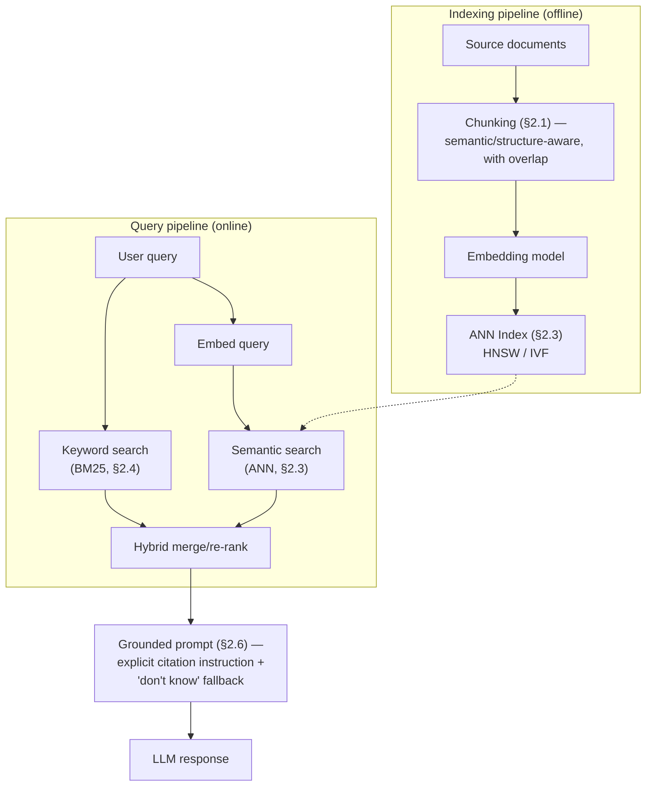

# Module 164 — Retrieval-Augmented Generation (RAG): Embeddings, Chunking, Hybrid Search & Hallucination Grounding

> Domain: AI Systems (merged 44-50) | Level: Beginner → Expert | Prerequisite: [[../44-AI-Systems/01-AI-Systems-LLM-Fundamentals-Transformers-Tokenization-Inference]] §2.5-§2.6 (this module is the direct architectural answer to that module's "lost in the middle" and hallucination findings), [[../16-Distributed-Systems/05-LSM-Trees-BTrees-BloomFilters-StorageEngines]] (this module's embedding-index coverage extends that module's storage-engine-internals discipline to Approximate Nearest Neighbor structures specifically)

>
> **Scope note:** Third of seven modules scoping the merged `44-AI-Systems` domain (re-scoped from 8 to 7 per the 2026-07-19 CLAUDE.md "Resolved" entry — Vector Databases is not a standalone module; its genuinely necessary mechanics — embeddings, ANN indexing — are covered here, inline, at the depth RAG actually requires, not re-derived as a separate deep-dive). This module covers the full retrieval pipeline: chunking strategy, embedding-based semantic search, ANN indexing trade-offs, hybrid (semantic-plus-keyword) search, and evaluation methodology — the domain's concrete, structural answer to Module 162 §2.6's hallucination finding.

---

## 1. Fundamentals

**What:** **RAG (Retrieval-Augmented Generation)** is the architecture that grounds an LLM's output in externally retrieved, verifiable information — rather than relying solely on the model's frozen, potentially-outdated training data — by (1) **chunking** a corpus of source documents into retrievable fragments, (2) computing an **embedding** (a dense vector representation capturing semantic meaning, Module 162's Coding Exercise Medium previewed the underlying cosine-similarity math) for each chunk and storing it in a searchable index, (3) at query time, embedding the user's query and retrieving the most semantically-similar chunks via **Approximate Nearest Neighbor (ANN) search**, and (4) including the retrieved chunks in the LLM's prompt context, instructing the model to ground its response in that specific, provided material.

**Why:** Module 162 §2.6 established hallucination as structural, not fixable through prompting alone — RAG is this domain's primary, genuinely structural mitigation: rather than asking the model to recall facts from its frozen training data (facts it may never have seen, may have seen incorrectly, or may have "forgotten" the specifics of while retaining only a vague, confidently-stated impression), RAG gives the model the actual, current, verifiable source material directly in its context and asks it to synthesize/summarize *that*, a task the model performs far more reliably than open-ended factual recall. Module 162 §2.1's quadratic cost concern is exactly why RAG retrieves only the *relevant* fragments rather than dumping an entire corpus into every prompt.

**When:** RAG is warranted specifically when a use case requires grounding in information that is (a) too large to fit in any single context window, (b) more current than the model's training cutoff, (c) proprietary/private and never part of the model's training data at all, or (d) requires citable, verifiable sourcing for compliance/trust reasons — this course's Elite FinTech lens treats condition (d) as close to universal for any client-facing or compliance-relevant generated content.

**How (30,000-ft view):**
```
INDEXING (offline, batch):
  Source documents ──chunk (§2.1)──► Chunks ──embed──► Vectors ──► ANN Index (§2.3)

QUERY (online, per-request):
  User query ──embed──► Query vector ──ANN search──► Top-K relevant chunks
                                                              │
                                    Chunks + query ──► LLM prompt (Module 163's
                                                         grounding-instruction technique)
                                                              │
                                                    Grounded, citable response
```

---

## 2. Deep Dive

### 2.1 Chunking strategy — the retrieval unit's own "declared ≠ actual" surface

**Chunking** — splitting source documents into retrievable fragments — has a direct, measurable effect on retrieval quality that's easy to under-examine: **chunks too large** dilute a fragment's embedding (a long chunk covering multiple distinct topics produces an embedding that's a blurred semantic average, retrieved less precisely for any single one of those topics — directly recurring Module 162 §2.5's "lost in the middle" concern, now at the chunk-construction layer rather than the prompt-construction layer); **chunks too small** lose necessary surrounding context (a fragment stating "the fee is 2%" with no indication of *which* fee, because the sentence identifying it was split into a different chunk, is retrievable but useless once retrieved). **Semantic/structure-aware chunking** (splitting along natural document boundaries — paragraphs, sections, or using an LLM itself to identify coherent semantic units) meaningfully outperforms naive fixed-size-character chunking for most real-world document types, at the cost of additional preprocessing complexity. **Chunk overlap** (having consecutive chunks share a small window of content) mitigates the boundary-splitting problem at the cost of some index redundancy and storage overhead.

### 2.2 Embeddings and the semantic-similarity assumption

An embedding model maps text to a dense vector such that semantically similar text produces vectors that are close together (by cosine similarity, Module 162's Medium exercise) in the embedding space — this is a *learned*, model-specific property, not a mathematical guarantee, meaning **embedding quality is directly bounded by the specific embedding model's own training**, and a model trained predominantly on general web text may embed domain-specific financial/legal terminology less precisely than a model fine-tuned or specifically evaluated on that domain's vocabulary — a genuine, measurable quality gap this course's Elite FinTech context makes directly relevant (regulatory terminology, financial instrument identifiers, and internal firm-specific jargon are all domains where a general-purpose embedding model's semantic-similarity judgments may be measurably less reliable than for common English prose).

### 2.3 ANN indexing — extending Module 148's storage-engine discipline

Exact nearest-neighbor search (computing similarity against every stored vector) is O(n) per query — intractable at scale for anything beyond a small corpus. **Approximate Nearest Neighbor (ANN)** index structures trade a small, tunable amount of recall accuracy for dramatically better query latency: **HNSW (Hierarchical Navigable Small World)**, the most common production choice, builds a multi-layer graph structure enabling logarithmic-ish search complexity by navigating from coarse, long-range graph connections down to fine-grained, local ones; **IVF (Inverted File Index)** partitions the vector space into clusters (via a coarse quantization step) and searches only the clusters nearest the query vector, trading some recall for reduced search scope. **This is a direct extension of Module 148's storage-engine-internals discipline**: exactly as Module 148 established that a database's actual performance characteristics come from its underlying physical structure (B-tree versus LSM-tree) far more than its category label, a vector database's actual recall/latency/memory trade-off comes from its specific ANN algorithm and its tunable parameters (HNSW's `ef_search`/`M`, IVF's cluster count), not from the vector-database product's marketing category — and, per Module 148's own finding, this trade-off's correctness is workload-dependent, requiring the same peak-versus-average capacity-planning discipline that module established for a completely different storage-engine class.

### 2.4 Hybrid search — semantic similarity alone is not sufficient

Pure semantic (embedding-based) search retrieves by *meaning*, which fails specifically for queries requiring **exact, literal matching** — a specific account number, an exact regulatory citation code, a precise product SKU — where two texts can be semantically unrelated by an embedding model's judgment while one is nonetheless the *exact* literal answer the query needs. **Hybrid search** combines semantic (vector) search with traditional **keyword/lexical search** (BM25 or similar, the same term-frequency-based ranking this course's SQL Server full-text-search coverage touches on), merging or re-ranking results from both to capture both semantic relevance and exact-match precision — a genuinely necessary combination for any real-world RAG system handling financial-services content, where exact instrument identifiers, account numbers, and regulatory codes are common, high-stakes query targets pure semantic search handles poorly.

### 2.5 Retrieval evaluation — precision, recall, and the ground-truth problem

Evaluating RAG retrieval quality requires the same precision/recall vocabulary as any information-retrieval system: **precision** (of the chunks retrieved, what fraction are actually relevant) and **recall** (of the chunks that are actually relevant, what fraction were retrieved) — with a genuine, use-case-dependent trade-off between them (retrieving more chunks generally improves recall at the cost of precision, and vice versa). **The harder, more consequential problem is establishing ground truth at all**: unlike a classification task with clear labels, "is this chunk relevant to this query" is often itself a judgment call requiring either careful human annotation (expensive, slow) or an LLM-as-judge evaluation approach (Module 165's own hallucination-adjacent risk — using an LLM to evaluate another LLM's retrieval quality inherits the identical non-determinism and potential-inaccuracy properties Module 162 established, requiring the evaluation process itself to be validated against a smaller, human-verified sample rather than trusted unconditionally).

### 2.6 Grounding instructions and citation — closing the loop back to hallucination

Retrieving the right chunks is necessary but not sufficient — the LLM must still be explicitly instructed (Module 163's prompting discipline) to ground its response specifically in the retrieved material, ideally with **explicit citation** (attributing each claim to its specific source chunk), and — critically — instructed on what to do when the retrieved chunks *don't* actually contain a good answer to the query (explicitly stating "I don't have information on this" rather than falling back to the model's own, ungrounded, potentially-hallucinated general knowledge, which defeats RAG's entire purpose if the model silently reverts to unguarded generation whenever retrieval comes up empty or weak).

---

## 3. Visual Architecture



---

## 4. Production Example

**Problem:** A private-banking platform's client-facing "policy assistant" — answering client questions about account terms, fee schedules, and product features by retrieving from the firm's internal policy documentation — used fixed-size, 500-character chunking with no overlap, applied uniformly across every document type in the corpus, including a fee-schedule document structured as a table.

**Architecture:** Standard RAG pipeline: fixed-size chunking → embedding → HNSW index → top-3 retrieval → grounded prompt with citation instruction.

**Implementation / What happened:** The fee-schedule table, split by the fixed-character-count chunker with no awareness of table structure, had its column headers (identifying which fee applied to which account tier) separated into a different chunk from several of the actual fee values — retrieval correctly found the chunk containing "2.5%" as semantically relevant to a client's fee question, but that specific chunk, in isolation, no longer contained the information indicating this was the *premium-tier* fee, not the client's own *standard-tier* fee. The model, following its grounding instructions faithfully, generated a response stating the client's applicable fee was 2.5% — factually derived entirely from retrieved, "grounded" content, and therefore passing a naive "is this response grounded in retrieved material" check, while being substantively, materially wrong for this specific client's actual account tier.

**Trade-offs:** Fixed-size chunking was chosen for its implementation simplicity and uniform applicability across the corpus's varied document types — a reasonable default for prose-heavy documents, but silently unsuited to structured, tabular content where the boundary between "which chunk" and "which chunk" carries load-bearing semantic meaning the chunker had no awareness of.

**Lessons learned:** **RAG's grounding guarantee only holds if the retrieved chunk itself contains sufficient context to answer correctly — chunking that severs a piece of information from the surrounding context it depends on (a table's headers, a clause's governing conditions) produces a response that is technically "grounded" in retrieved content while being substantively wrong**, a sharper, more insidious version of Module 162 §2.6's hallucination risk specifically because it passes any naive citation/grounding check. This directly recurs this course's now-thoroughly-established finding (Module 158's `trackBy`, Module 160's cache keys, Module 163's few-shot distribution) that a mechanism's declared guarantee (grounding prevents hallucination) is only as strong as a specific, easily-overlooked configuration detail (chunking strategy) actually, verifiably supporting it for the specific content type it's applied to.

---

## 5. Best Practices

- **Use structure-aware chunking for structured content types** (tables, forms, code) rather than uniform fixed-size chunking across an entire heterogeneous corpus (§2.1, §4) — a table's rows should never be separated from their governing column headers by a chunk boundary.
- **Include chunk overlap for prose content** to mitigate boundary-splitting information loss, calibrated against the storage/redundancy cost it introduces (§2.1).
- **Evaluate embedding model quality specifically against the platform's own domain vocabulary**, not only general-purpose benchmarks (§2.2) — financial/regulatory terminology may embed measurably less reliably in a general-purpose model.
- **Implement hybrid (semantic-plus-keyword) search for any corpus containing exact identifiers, codes, or account-specific values** (§2.4) — pure semantic search systematically underperforms for exact-match retrieval needs.
- **Explicitly instruct the model to decline answering, rather than fall back to ungrounded general knowledge, when retrieval returns weak or irrelevant results** (§2.6) — closing the exact gap that defeats RAG's purpose if the model silently reverts to unguarded generation.

---

## 6. Anti-patterns

- **Uniform fixed-size chunking applied indiscriminately to structured/tabular content** — §4's exact incident; severs load-bearing context (headers, governing conditions) from the values that depend on it.
- **Treating "the response cites a retrieved source" as sufficient evidence of correctness** — as §4 demonstrates, a response can be faithfully grounded in a retrieved chunk while that chunk itself is insufficient or misleading in isolation.
- **Relying on pure semantic search for a corpus with exact-match retrieval needs** (account numbers, regulatory codes, SKUs) — systematically underperforms relative to hybrid search for exactly the queries where precision matters most.
- **Skipping retrieval-quality evaluation because ground-truth labeling seems too expensive** — produces a RAG system whose actual retrieval precision/recall is genuinely unknown, undermining every downstream claim about the system's grounding quality.
- **Allowing the model to fall back to ungrounded general knowledge when retrieval is weak, with no explicit instruction against doing so** — silently defeats RAG's entire structural purpose for exactly the queries where retrieval quality is poorest.

---

## 7. Performance Engineering

ANN index parameters (HNSW's `ef_search`, IVF's cluster-probe count) directly trade recall against query latency — a higher `ef_search` value examines more of the graph per query, improving recall at real, measurable latency cost, requiring the same empirical, workload-specific tuning discipline Module 148 established for storage-engine configuration generally. Retrieval latency adds directly to Module 162 §2.2's prefill-phase cost (the retrieved chunks become part of the LLM's input context), meaning an ANN index's own query latency and the number of chunks retrieved (top-K) both compound into the overall request's TTFT — a genuinely multi-stage latency budget (retrieval latency plus LLM prefill plus LLM decode) requiring end-to-end, not component-isolated, latency monitoring.

---

## 8. Security

Retrieved content is, per Module 163 §2.6, an indirect-prompt-injection surface requiring the trust-tier classification and defense-in-depth stack that module established — RAG's retrieval corpus is precisely the "retrieved content" category that module's framework addresses, meaning every RAG corpus source should be explicitly classified by trust tier and defended proportionally. RAG additionally introduces an **access-control propagation** concern this course's Elite FinTech lens treats as consequential: if the underlying document corpus has per-document or per-client access restrictions (a client's own confidential account documents, restricted internal policy material), the retrieval index must enforce the *identical* access-control boundary at query time — a RAG system that indexes documents from multiple clients/permission levels into one shared, undifferentiated vector index and retrieves without access-control filtering can produce exactly the cross-account/cross-client data-exposure incident this course has now examined at the backend (Module 103), frontend (Module 160 §4), and now retrieval-pipeline layer.

---

## 9. Scalability

ANN index build and query cost both scale with corpus size, requiring the same capacity-planning discipline Module 148 established — a corpus growing from thousands to millions of documents needs index-structure re-evaluation (HNSW's memory footprint grows substantially with corpus size; IVF's cluster count needs re-tuning as data volume grows) rather than assuming a configuration validated at a smaller scale remains adequate indefinitely. Incremental indexing (adding new documents without full index rebuild) versus periodic batch re-indexing is a genuine architectural trade-off — real-time-relevant corpora (breaking news, live regulatory updates) need incremental indexing support; slowly-changing reference corpora can tolerate periodic batch rebuilds at lower operational complexity.

---

## 10. Interview Questions

### Basic (10)

**B1. What are the four stages of a RAG pipeline?**
*Ideal Answer:* Chunking source documents, embedding chunks and storing them in a searchable index, retrieving the most relevant chunks for a query via similarity search, and including those chunks in the LLM's prompt context to ground its response.
*Why correct:* Matches §1.
*Common mistakes:* Omitting the chunking step, treating RAG as merely "embedding plus retrieval" without acknowledging chunking as a distinct, consequential design decision.
*Follow-up:* Which of these four stages does §4's incident trace to specifically?

**B2. Why does chunk size matter for retrieval quality?**
*Ideal Answer:* Chunks too large dilute a fragment's embedding across multiple topics, reducing retrieval precision; chunks too small can lose necessary surrounding context, making a retrieved fragment technically relevant but practically unusable.
*Why correct:* Matches §2.1.
*Common mistakes:* Assuming smaller chunks are always better ("more granular retrieval"), missing the context-loss risk at the small end.
*Follow-up:* What chunking approach specifically mitigates the context-loss risk at some storage cost?

**B3. What is an ANN (Approximate Nearest Neighbor) index, and why is it needed instead of exact search?**
*Ideal Answer:* An index structure (e.g., HNSW, IVF) trading a small, tunable amount of recall accuracy for dramatically better query latency at scale — exact nearest-neighbor search is O(n) per query, intractable for large corpora.
*Why correct:* Matches §2.3.
*Common mistakes:* Assuming ANN indexes provide exact results, missing the approximate, recall-versus-latency trade-off inherent to the technique.
*Follow-up:* Name the two most common production ANN index structures and briefly distinguish their approach.

**B4. What is hybrid search, and why is pure semantic search insufficient on its own?**
*Ideal Answer:* Combining semantic (embedding-based) search with keyword/lexical search (e.g., BM25) — pure semantic search fails for exact-match retrieval needs (account numbers, regulatory codes) where two texts can be semantically unrelated by embedding judgment while one is nonetheless the exact literal answer needed.
*Why correct:* Matches §2.4.
*Common mistakes:* Assuming semantic search alone is always sufficient for any retrieval need.
*Follow-up:* Name a query type from a financial-services context where pure semantic search would likely underperform.

**B5. What is the "grounding instruction," and why does it matter beyond retrieval quality itself?**
*Ideal Answer:* An explicit instruction telling the model to base its response specifically on retrieved content (with citation where possible) and to decline answering rather than fall back to ungrounded general knowledge when retrieval is weak — without this, good retrieval alone doesn't guarantee a grounded response.
*Why correct:* Matches §2.6.
*Common mistakes:* Assuming retrieving the right chunks alone guarantees a grounded, accurate response, missing that the model must also be explicitly instructed to actually use them and to acknowledge retrieval gaps.
*Follow-up:* What happens if this instruction is omitted and retrieval returns weak, low-relevance results?

**B6. In §4's incident, was the retrieval step itself incorrect?**
*Ideal Answer:* No — the retrieval correctly found a chunk that was semantically relevant to the query; the defect was that the chunking step had severed that chunk from the surrounding context (the table's column headers) needed to interpret it correctly.
*Why correct:* Matches §4's precise root-cause framing.
*Common mistakes:* Assuming the incident indicates a retrieval-ranking bug rather than correctly attributing it to the upstream chunking decision.
*Follow-up:* Would improving the embedding model's quality alone have prevented this incident?

**B7. What does "precision" and "recall" mean in the context of RAG retrieval evaluation?**
*Ideal Answer:* Precision: of the chunks retrieved, what fraction are actually relevant. Recall: of the chunks that are actually relevant, what fraction were retrieved.
*Why correct:* Matches §2.5.
*Common mistakes:* Confusing the two metrics or describing them without the specific numerator/denominator distinction that differentiates them.
*Follow-up:* What's the typical trade-off between the two as top-K (number of retrieved chunks) increases?

**B8. Why is RAG described as extending Module 148's storage-engine-internals discipline?**
*Ideal Answer:* Because a vector database's actual recall/latency/memory trade-off comes from its specific ANN algorithm and tunable parameters, not its product category label — the same "physical structure determines actual behavior, not category" finding Module 148 established for B-trees versus LSM-trees.
*Why correct:* Matches §2.3's explicit connection.
*Common mistakes:* Treating vector databases as an entirely novel category unrelated to this course's prior storage-engine coverage.
*Follow-up:* Name one HNSW-specific tunable parameter and what it trades off.

**B9. What access-control risk does RAG introduce beyond a conventional document-storage system?**
*Ideal Answer:* If the retrieval index doesn't propagate and enforce the same per-document/per-client access restrictions the underlying corpus has, a RAG system can retrieve and expose content across access boundaries it shouldn't cross.
*Why correct:* Matches §8.
*Common mistakes:* Assuming access control is automatically preserved through the embedding/indexing process without explicit, deliberate enforcement.
*Follow-up:* Name a prior module in this course establishing an analogous cross-account/cross-client data-exposure risk in a different technical layer.

**B10. Why is establishing ground truth for retrieval evaluation described as harder than for a typical classification task?**
*Ideal Answer:* "Is this chunk relevant to this query" is often itself a judgment call requiring expensive human annotation or an LLM-as-judge approach, which inherits the same non-determinism and potential-inaccuracy properties as the system being evaluated.
*Why correct:* Matches §2.5.
*Common mistakes:* Assuming relevance judgments are as straightforward and objective as a typical labeled classification dataset.
*Follow-up:* What validates an LLM-as-judge evaluation approach's own reliability?

### Intermediate (10)

**I1. Design the corrected chunking strategy for §4's fee-schedule table, and explain why it prevents the incident.**
*Ideal Answer:* Use structure-aware chunking specifically for tabular content — treating each table as a single chunking unit (or chunking by logical row-with-headers, ensuring every retrievable fragment includes its governing column/header context), rather than applying uniform fixed-character-count splitting that has no awareness of table structure; this ensures any retrieved fragment containing a fee value also contains the tier/category information needed to correctly interpret it.
*Why correct:* Matches §5's fix precisely, correctly explaining the mechanism (preserving header-value co-location) that prevents recurrence.
*Common mistakes:* Proposing only "use smaller chunks" or "use larger chunks," missing that the actual fix is structure-awareness, not merely a different size parameter within the same structure-blind approach.
*Follow-up:* How would you detect other structured-content types (forms, nested lists) in the corpus that might share this same risk, before they produce their own incident?

**I2. Design a retrieval evaluation test set that would have caught §4's incident before production.**
*Ideal Answer:* A held-out test set of realistic client questions paired with human-verified correct answers, specifically including questions targeting structured/tabular content (fee schedules, tiered pricing tables) as a distinct test category — measuring not just whether the "right" chunk was retrieved (precision/recall, §2.5) but whether the retrieved chunk, in isolation, contains sufficient context to produce a *correct* answer, a distinct property from mere topical relevance.
*Why correct:* Correctly identifies that the missing test dimension was specifically "does the retrieved chunk contain sufficient standalone context," not merely "is the retrieved chunk topically relevant" — the precise distinction §4's incident demonstrates.
*Common mistakes:* Proposing only a general relevance-evaluation test set without specifically targeting structured-content retrieval as its own test category.
*Follow-up:* How would you scale this evaluation approach beyond manual, human-curated test questions to cover a large, evolving corpus?

**I3. Compare the cost/latency trade-off of retrieving top-3 versus top-10 chunks for a given query.**
*Ideal Answer:* Top-10 improves recall (more likely to include the genuinely relevant chunk somewhere in the set) at the cost of increased prompt token count (Module 162 §2.1's quadratic-ish attention cost), increased "lost in the middle" risk (Module 162 §2.5) for chunks positioned in the middle of a now-longer context, and potentially reduced precision (more low-relevance chunks diluting the model's attention) — the correct top-K value is a genuine, empirically-tunable trade-off, not a value to maximize by default.
*Why correct:* Correctly connects the top-K decision to both Module 162's cost/attention findings and the recall/precision trade-off (§2.5), demonstrating cross-module synthesis.
*Common mistakes:* Assuming a higher top-K value is unconditionally better for retrieval quality, missing the compounding cost and "lost in the middle" risks a longer, more diluted context introduces.
*Follow-up:* How would you empirically determine the appropriate top-K value for a specific corpus and query distribution?

**I4. A hybrid search system's semantic and keyword search components disagree — semantic search ranks Document A highest, keyword search ranks Document B highest. Design the merge/re-ranking logic.**
*Ideal Answer:* A common approach is Reciprocal Rank Fusion (RRF) — combining each result's rank position (not raw score, which isn't directly comparable across the two different scoring systems) from both search methods into one unified ranking, giving documents that rank well in *either* method meaningful combined weight, rather than requiring agreement from both; alternatively, a learned re-ranking model can be trained specifically to combine the two signals, though this adds its own model-quality and maintenance burden.
*Why correct:* Correctly identifies the raw-score-incomparability problem (semantic similarity scores and keyword relevance scores aren't on the same scale) and proposes rank-based fusion as the standard, principled solution.
*Common mistakes:* Proposing to directly average or sum the two methods' raw scores, missing that they're not on comparable scales and such a combination would be arbitrary and hard to reason about.
*Follow-up:* Under what circumstance would you weight keyword search more heavily than semantic search in the fusion, and vice versa?

**I5. Design the access-control enforcement for a multi-client RAG system where each client's documents must only be retrievable in response to that specific client's own queries.**
*Ideal Answer:* Tag every indexed chunk with its owning client's identifier as metadata at indexing time; at query time, apply a mandatory, non-optional filter restricting the ANN search to only chunks matching the requesting client's own identifier — implemented as a structural constraint on the search itself (most vector databases support metadata-filtered search natively), never as a post-retrieval filter applied after an unrestricted search, which would still expose cross-client relevance-ranking information (which other clients' documents scored highly) even if their content were subsequently filtered out.
*Why correct:* Correctly identifies that filtering must happen at the search-constraint level, not merely as a post-hoc filter, closing a subtler information-leakage risk (relevance-ranking information itself) a naive post-filter approach would still expose.
*Common mistakes:* Proposing only a post-retrieval filter, missing the subtler leakage risk even filtered-out results' mere presence/ranking can represent.
*Follow-up:* How would you test this access-control enforcement specifically, given a functional test might pass while still leaking ranking-adjacent information?

**I6. Why might an embedding model that performs excellently on general-purpose semantic-similarity benchmarks still underperform for this course's financial-services use cases specifically?**
*Ideal Answer:* General-purpose benchmarks typically evaluate on broad, common-domain text; financial/regulatory terminology, instrument identifiers, and firm-specific jargon are comparatively under-represented in most embedding models' training data relative to common English prose, meaning the model's learned semantic-similarity judgments for this specific vocabulary may be measurably less reliable despite strong general-benchmark performance — directly recurring Module 162 §2.3's tokenization-efficiency finding (financial content is measurably different from general prose) now applied to embedding-quality rather than token-count.
*Why correct:* Matches §2.2, correctly connecting to Module 162's related, earlier finding about financial content's distinctive characteristics.
*Common mistakes:* Assuming a benchmark-leading embedding model is automatically the best choice for any domain-specific application without domain-specific evaluation.
*Follow-up:* How would you evaluate an embedding model's domain-specific quality before committing to it in production?

**I7. Design the "decline to answer" fallback behavior for a RAG system when retrieval returns only weakly-relevant chunks (per §2.6).**
*Ideal Answer:* Establish an explicit relevance-score threshold (calibrated empirically per corpus, §2.5) below which retrieved chunks are considered insufficient; when the top retrieved result(s) fall below this threshold, explicitly instruct the model (via the grounding prompt, Module 163's technique) to state it doesn't have sufficient information to answer confidently, rather than allowing it to silently synthesize a response from its own general, ungrounded training knowledge — and log these "insufficient retrieval" events for review, since a rising rate may indicate a genuine coverage gap in the underlying corpus that should be addressed by adding documentation, not merely tolerated indefinitely.
*Why correct:* Correctly designs both the immediate fallback behavior and the feedback loop (logging/monitoring insufficient-retrieval events) that surfaces genuine corpus-coverage gaps over time.
*Common mistakes:* Designing only the immediate fallback without the monitoring/feedback loop that would help the corpus itself improve over time in response to observed gaps.
*Follow-up:* How would you distinguish a genuine corpus-coverage gap from a poorly-phrased or out-of-scope user query using this same signal?

**I8. A RAG system's evaluation shows high precision and recall on its test set, yet users report frequent, subjectively "unhelpful" responses. What's a likely gap in the evaluation methodology?**
*Ideal Answer:* Precision/recall measure whether the *right chunks* were retrieved — they don't measure whether the *final generated response*, after the LLM processes those chunks, is actually helpful, well-synthesized, or correctly interprets the retrieved context (exactly §4's incident's failure mode, which involved a correctly-retrieved but insufficiently-contextualized chunk). The evaluation methodology needs an additional, end-to-end quality assessment of the *generated response* itself, not merely the *retrieval* step in isolation — directly recurring this course's now-repeated finding (Module 158 A3's end-to-end composition testing) that testing individual pipeline stages in isolation can miss defects that only manifest in their composition.
*Why correct:* Correctly identifies the specific gap (retrieval-stage-only evaluation missing generation-stage quality) and connects it to this course's established composition-testing discipline.
*Common mistakes:* Assuming strong retrieval metrics alone guarantee a good end-to-end user experience, missing the generation stage's own, independent failure surface.
*Follow-up:* Design one end-to-end quality metric that would specifically have caught §4's incident, distinct from retrieval precision/recall.

**I9. Compare incremental indexing versus periodic batch re-indexing for a corpus of regulatory updates that change frequently but unpredictably.**
*Ideal Answer:* A frequently, unpredictably-changing corpus (regulatory updates) warrants incremental indexing — adding new/changed documents to the index as they arrive, without waiting for a scheduled batch rebuild — since a periodic batch approach would leave the index measurably stale between rebuild cycles for content whose currency directly matters (an outdated regulatory citation retrieved and presented as current carries real compliance risk, directly recurring Module 162's audit/currency concerns). The trade-off is incremental indexing's typically higher operational complexity and, depending on the specific ANN structure, potential index-quality degradation over many incremental updates without periodic full rebuilds to restore optimal structure.
*Why correct:* Correctly matches the indexing strategy to the corpus's actual update-frequency and currency-sensitivity characteristics, per §9's guidance, with an honest accounting of incremental indexing's own trade-off cost.
*Common mistakes:* Recommending one approach unconditionally without weighing it against this specific corpus's actual update pattern and currency requirements.
*Follow-up:* How would you detect index-quality degradation from many incremental updates, prompting a periodic full rebuild even for an otherwise-incremental system?

**I10. Why does this module describe itself as "the domain's primary, genuinely structural mitigation" for hallucination, while Module 163 described its own techniques as merely "reshaping rather than eliminating" hallucination risk?**
*Ideal Answer:* RAG addresses hallucination's root cause more directly than Module 163's techniques (few-shot, chain-of-thought, structured output) because it changes *what information the model has access to* (verifiable, current, retrievable source material) rather than merely shaping *how the model uses its existing, frozen training knowledge* — but RAG is still not a complete elimination, per §4's own incident: RAG's grounding guarantee is only as strong as the chunking, retrieval, and grounding-instruction discipline actually supporting it, meaning RAG reshapes the hallucination risk into a narrower, more governable (chunking/retrieval-quality) risk surface rather than eliminating hallucination risk entirely.
*Why correct:* Correctly reconciles the two modules' framing, showing genuine synthesis: RAG is a stronger, more structural mitigation than Module 163's prompting techniques, while still not achieving full elimination — both modules' findings are consistent, at different points along the same risk-reduction spectrum.
*Common mistakes:* Treating RAG as achieving complete hallucination elimination (contradicted by §4's own incident) or dismissing it as no better than Module 163's techniques (missing RAG's genuinely stronger, more structural nature).
*Follow-up:* What would a system need to add beyond RAG to further narrow this residual risk, previewing Module 167's Agents coverage of verification loops?

### Advanced (10)

**A1. Design the complete, corrected RAG architecture for the private-banking policy assistant, synthesizing every mechanism this module establishes.**
*Ideal Answer:* Structure-aware chunking (I1) differentiated by content type (tables chunked to preserve header-value co-location; prose chunked semantically with overlap); domain-evaluated embedding model (I6) verified against the firm's own financial/regulatory vocabulary, not general benchmarks alone; hybrid search (§2.4) for the corpus's exact-identifier-heavy content (account numbers, product codes); mandatory client-scoped access-control filtering at the search-constraint level (I5); an explicit relevance threshold with a "decline to answer" fallback and monitored insufficient-retrieval logging (I7); end-to-end response-quality evaluation (I8) alongside retrieval-stage precision/recall, specifically including a structured-content test category (I2) in the evaluation set.
*Why correct:* Synthesizes every element this module establishes into one complete, governed architecture directly closing §4's root cause and every adjacent risk this module has identified.
*Common mistakes:* Addressing only the chunking fix without the accompanying evaluation, access-control, and fallback-behavior layers this module also establishes as necessary.
*Follow-up:* Which of these elements would you prioritize implementing first if resource-constrained, given the platform's current, unmitigated risk profile?

**A2. Critique: "Since RAG grounds responses in retrieved content, a RAG-based system's outputs can be fully trusted without further verification, unlike a non-RAG LLM system."**
*Ideal Answer:* Overstated, directly refuted by §4's own incident — a RAG system's grounding is only as reliable as its chunking, retrieval, and generation stages, each independently capable of introducing error even when every individual stage appears to be "working" (correct retrieval of a chunk that's individually insufficient; correct grounding in content that's itself ambiguous without lost surrounding context). RAG substantially reduces hallucination risk relative to an ungrounded system (I10's "genuinely structural mitigation" framing) but does not eliminate the need for the same verification discipline (citation review, response-quality evaluation, I8) this course has established for every other AI-systems output.
*Why correct:* Correctly refutes the overstated "fully trusted" claim using §4 as direct counter-evidence, while correctly preserving RAG's genuine, substantial risk-reduction value rather than dismissing it entirely.
*Common mistakes:* Either accepting the overstated claim or overcorrecting to "RAG provides no real benefit," missing the nuanced, evidence-grounded middle position this question requires.
*Follow-up:* What specific verification step would you add to a RAG pipeline's output for genuinely high-stakes use cases, beyond the grounding instruction itself?

**A3. Design an experiment measuring whether a specific corpus and query distribution actually benefit from hybrid search versus semantic search alone, before committing to the added complexity.**
*Ideal Answer:* Construct a representative test-query set spanning the corpus's actual query distribution, explicitly including queries requiring exact-match retrieval (account numbers, codes) alongside general semantic queries; measure precision/recall (§2.5) separately for semantic-only, keyword-only, and hybrid configurations across this full query set; if the exact-match-query subset shows a measurable precision/recall gap for semantic-only search that hybrid search closes, that empirically justifies the added complexity — directly reusing this course's now-standard empirical-verification-before-adoption discipline (Module 159 A3's Fiber-scheduling verification, Module 163 A3's chain-of-thought cost/benefit verification) applied to this module's own architectural decision.
*Why correct:* Correctly designs a controlled, empirical comparison rather than assuming hybrid search's benefit universally applies, matching this course's now-repeated caution against adopting a technique without use-case-specific verification.
*Common mistakes:* Adopting hybrid search by default based on its general reputation as an improvement, without empirically verifying its benefit for this specific corpus's actual query distribution.
*Follow-up:* Under what corpus/query-distribution characteristics would hybrid search's added complexity NOT be empirically justified?

**A4. A RAG system's insufficient-retrieval fallback rate (I7) rises sharply after a routine corpus update (new documents added, some old ones archived). Diagnose the likely cause.**
*Ideal Answer:* Likely cause: the corpus update's chunking and re-indexing process introduced a systematic issue affecting retrieval quality broadly (a chunking-configuration regression, an embedding-model-version mismatch between old and newly-indexed content if the update process used a different embedding model version than the original index, or an ANN index-parameter drift from an un-re-tuned configuration now serving a meaningfully different corpus size/distribution than it was originally tuned for, per §9's capacity-planning discipline) — a genuine, systemic degradation distinct from ordinary, individual query-level retrieval misses, warranting investigation of the update process itself rather than the underlying corpus content.
*Why correct:* Correctly identifies multiple plausible systemic causes tied to the specific triggering event (the corpus update) rather than treating the rising fallback rate as unrelated, isolated retrieval noise.
*Common mistakes:* Investigating individual failed queries in isolation without first checking whether the triggering event (the corpus update itself) introduced a systemic regression across the whole index.
*Follow-up:* How would you design the corpus-update process to catch this class of regression before it reaches production, rather than discovering it via a rising production fallback rate?

**A5. Design a governance process for approving new document sources into a RAG corpus, addressing both content-quality and access-control/trust-tier classification (Module 163 §2.6).**
*Ideal Answer:* Require every new corpus source to be explicitly reviewed and classified along two independent dimensions: (1) trust tier (first-party curated versus externally-writable, per Module 163 §2.6, determining injection-defense rigor) and (2) access-control scope (which clients/permission levels the content is visible to, per §8/I5, determining index-filtering requirements) — neither dimension substitutable for the other, since a source can be high-trust but access-restricted (internal, confidential policy documents) or lower-trust but broadly accessible (a public regulatory website); document both classifications alongside the source in a governed registry, and require the corresponding chunking/indexing/access-control configuration to be explicitly reviewed against that classification before the source goes live.
*Why correct:* Correctly identifies that trust tier and access-control scope are independent, both-necessary classification dimensions, avoiding the common mistake of conflating "sensitive/restricted" with "untrusted" when they're genuinely orthogonal properties.
*Common mistakes:* Collapsing the two dimensions into one classification, missing that a source can independently vary along each.
*Follow-up:* Design a concrete example of a document source that is high-trust but access-restricted, and one that is low-trust but broadly accessible.

**A6. Explain how §4's incident recurs Module 162 §2.5's "lost in the middle" finding at a structurally different layer.**
*Ideal Answer:* Module 162 §2.5's finding concerns information *within a single, already-constructed prompt* being unreliably recalled based on its position; §4's incident concerns information being *severed at the chunking stage*, before the prompt is even constructed — a chunk missing its governing context isn't "lost in the middle" of a long prompt, it's simply never present in the prompt at all, having been excluded by the chunk boundary itself. The two findings share the underlying theme (information availability/positioning within the model's effective context affects output reliability) but operate at genuinely different pipeline stages (prompt-internal positioning versus chunk-construction boundaries) requiring different specific mitigations (context restructuring for the former, structure-aware chunking for the latter).
*Why correct:* Correctly identifies the shared underlying theme while precisely distinguishing the two findings' different pipeline stages and different required mitigations, demonstrating genuine, precise cross-module synthesis rather than an imprecise conflation.
*Common mistakes:* Either declaring the two findings identical (missing the different pipeline stage) or entirely unrelated (missing the shared underlying theme).
*Follow-up:* Could a RAG system exhibit BOTH failure modes simultaneously — a chunking-stage information-severing issue AND a prompt-internal "lost in the middle" issue — for the same query? Design a scenario where both would occur together.

**A7. Design a production monitoring dashboard for a RAG system, synthesizing every metric this module has established.**
*Ideal Answer:* Retrieval-stage: precision/recall against a periodically-refreshed evaluation set (§2.5); ANN index query latency percentiles (§7); insufficient-retrieval fallback rate (I7), with alerting on sharp rises (A4). Generation-stage: end-to-end response-quality evaluation (I8), sampled and reviewed regularly, not merely retrieval-stage metrics in isolation. Access-control: a periodic audit verifying indexed-content access-control tags match the actual, current source-document permissions (since document permissions can change after initial indexing, a drift this module hasn't yet explicitly examined but which follows directly from this course's now-standard "entitlement drift" finding, Module 152 §2.4, applied to this domain). Corpus health: source freshness/staleness per document type (I9), and new-source trust-tier/access-scope classification compliance (A5).
*Why correct:* Synthesizes every metric this module has established into one coherent monitoring architecture, and correctly extends this course's Module 152 entitlement-drift finding to a genuinely new scenario (document permissions changing post-indexing) this module hadn't explicitly covered, demonstrating live, generative synthesis rather than only restating already-stated content.
*Common mistakes:* Listing only retrieval-stage metrics without the generation-stage, access-control-drift, and corpus-health dimensions this module's full arc has also established as necessary.
*Follow-up:* How would you detect the specific access-control-drift scenario this answer identifies — a source document's permissions changing after it was already indexed — given the index itself has no inherent mechanism to observe that external change?

**A8. A team proposes using the platform's own production LLM to automatically re-chunk and re-index the corpus whenever new documents are added, rather than a deterministic, rule-based chunking algorithm. Evaluate this proposal against this module's findings.**
*Ideal Answer:* An LLM-based chunking approach could genuinely improve structure-awareness (§2.1) for complex, varied document types a deterministic rule-based chunker struggles to handle uniformly — but it inherits Module 162's non-determinism (§2.4) and potential-inaccuracy (§2.6) properties at the chunking stage itself, meaning the chunking process's own correctness now requires the identical evaluation and monitoring discipline (§2.5, A7) this module established for retrieval and generation, effectively adding a third stage requiring this same governance rather than eliminating governance need at the chunking stage; the proposal is not unreasonable, but should be evaluated (A3's empirical-verification discipline) against a deterministic baseline specifically on the structured-content risk class §4's incident demonstrated, not adopted on the general intuition that "LLM-based" implies better quality.
*Why correct:* Correctly identifies both the genuine potential benefit and the specific, non-obvious cost (the chunking stage itself now inherits Module 162's non-determinism/accuracy risks, requiring its own governance) rather than either uncritically endorsing or rejecting the proposal.
*Common mistakes:* Either uncritically endorsing LLM-based chunking as an obvious improvement or rejecting it outright without acknowledging its genuine potential to address exactly this module's own structure-awareness finding better than a rule-based approach might.
*Follow-up:* Design the specific evaluation (per A3) you'd run to decide between deterministic and LLM-based chunking for the specific structured-content risk §4's incident demonstrated.

**A9. Synthesize why this module's own findings (chunking-stage information loss, embedding-model domain-quality gaps, access-control propagation) are each instances of this course's "composition risk" theme (Module 145 onward), despite RAG itself being a single, coherent pipeline rather than multiple independently-built systems.**
*Ideal Answer:* Composition risk, per this course's full arc, is not exclusively about multiple *independently-built* systems interacting — it more generally describes risk arising at the *boundary* between stages, components, or assumptions that are each individually reasonable in isolation. RAG's own pipeline stages (chunking, embedding, retrieval, generation) are each individually well-designed and independently testable, yet §4's incident arose specifically at the *boundary* between chunking and generation (a chunk correct in isolation, insufficient once separated from its original document context) — the identical underlying shape this course has traced across genuinely independent systems (Module 155's identity federation) and, now, across sequential stages of one single, coherent pipeline, confirming the composition-risk finding generalizes beyond multi-system federation to any sufficiently-staged processing pipeline.
*Why correct:* Correctly generalizes the composition-risk finding beyond its original multi-system framing to a genuinely new context (sequential pipeline stages within one system), demonstrating sophisticated, expanding synthesis of this course's central recurring theme.
*Common mistakes:* Assuming composition risk only applies to genuinely separate, independently-deployed systems, missing that this module's own single-pipeline incident is a valid, structurally-identical instance.
*Follow-up:* Given this generalization, does every multi-stage data-processing pipeline this course has examined (Module 18's EDA stream processing, for instance) share this identical risk shape? Name one specific example.

**A10. As this domain's third module, and its direct answer to Module 162's hallucination finding, state precisely what RAG achieves and what residual risk remains, informing Module 165's LLM Integration coverage.**
*Ideal Answer:* RAG structurally reduces hallucination risk by grounding generation in externally-verifiable, retrievable content rather than the model's frozen, unverifiable training knowledge — a genuine, substantial improvement over ungrounded generation. The residual risk, demonstrated concretely by §4, is that RAG's grounding guarantee is only as strong as the weakest link in its own multi-stage pipeline (chunking, embedding quality, retrieval precision, access-control propagation, generation-stage faithfulness to retrieved content) — meaning a production RAG system requires the same continuous, structural verification discipline (evaluation, monitoring, governed corpus-source review) this course has established as necessary everywhere else, never a one-time architectural choice assumed to close the hallucination risk permanently. This sets up Module 165's LLM Integration coverage to address the remaining, adjacent concern: even a well-grounded RAG response must still be reliably delivered, integrated, and operated at production scale and reliability, a distinct engineering concern from grounding quality itself.
*Why correct:* Correctly and precisely states both RAG's genuine achievement and its bounded, residual risk, and correctly previews the next module's distinct concern rather than treating RAG as either a complete solution or a marginal improvement.
*Common mistakes:* Either overstating RAG as fully solving hallucination or understating its genuine, substantial value, missing the precise, evidence-grounded middle position this module's own §4 incident and §5 best-practices establish.
*Follow-up:* Does Module 167's AI Agents coverage, which will introduce tool-calling and multi-step reasoning, introduce any NEW residual risk beyond what RAG alone leaves unaddressed?

---

## 11. Coding Exercises

### Easy — Structure-aware chunker distinguishing tables from prose

**Problem:** Implement a chunker that detects simple tabular structure (markdown-style tables) and chunks them as whole units, preventing §4's exact incident, while chunking prose normally.

**Solution (Python):**
```python
import re

def chunk_document(text: str, prose_chunk_size: int = 500) -> list[str]:
    chunks = []
    # Detect markdown-style table blocks — kept as ONE chunk, preserving
    # header-value co-location (§4's exact fix).
    table_pattern = re.compile(r"(\|.+\|\n)+", re.MULTILINE)

    last_end = 0
    for match in table_pattern.finditer(text):
        # Chunk any prose BEFORE this table normally.
        prose_before = text[last_end:match.start()]
        chunks.extend(_chunk_prose(prose_before, prose_chunk_size))

        # The table itself: ONE chunk, never split — headers stay with values.
        chunks.append(match.group().strip())
        last_end = match.end()

    chunks.extend(_chunk_prose(text[last_end:], prose_chunk_size))
    return [c for c in chunks if c.strip()]

def _chunk_prose(text: str, chunk_size: int) -> list[str]:
    return [text[i:i + chunk_size] for i in range(0, len(text), chunk_size)]
```
**Time complexity:** O(n) in document length. **Space complexity:** O(n) for the chunk list.

**Optimized solution:** Extend table detection to also preserve a table's caption/title line (often appearing just before the table, identifying what the table represents) as part of the same chunk — closing a residual variant of §4's incident where the table's own headers are preserved but the surrounding context identifying *which* fee schedule the table represents is still lost.

### Medium — Metadata-filtered ANN search enforcing access control (per I5)

**Problem:** Implement search-constraint-level access-control filtering, never a post-retrieval filter, per I5's finding.

**Solution (Python, illustrative over a hypothetical vector-DB client):**
```python
def search_with_access_control(
    vector_db_client,
    query_embedding: list[float],
    requesting_client_id: str,
    top_k: int = 5,
) -> list[dict]:
    # Filter applied AS PART OF the search itself — the vector DB never even
    # SCORES chunks outside this client's access scope, closing the subtler
    # ranking-information leakage a post-hoc filter would still expose (I5).
    return vector_db_client.search(
        query_vector=query_embedding,
        top_k=top_k,
        metadata_filter={"owning_client_id": requesting_client_id},
    )
```
**Time complexity:** O(log n) or better, depending on the ANN index's native metadata-filtering support. **Space complexity:** O(top_k) for results.

**Optimized solution:** For a vector database whose ANN index doesn't natively support metadata-pre-filtering efficiently (some implementations filter post-search, reintroducing the leakage risk internally even if the API looks the same), explicitly verify the specific product/index configuration's actual filtering behavior — another instance of this course's "verify the verifier," since two vector databases both offering a `metadata_filter` parameter may implement genuinely different, differently-safe underlying behavior.

### Hard — Reciprocal Rank Fusion for hybrid search (per I4)

**Problem:** Implement RRF combining semantic and keyword search result rankings into one unified ranking.

**Solution (Python):**
```python
def reciprocal_rank_fusion(
    semantic_results: list[str],  # document IDs, ranked best-first
    keyword_results: list[str],
    k: int = 60,  # standard RRF smoothing constant
) -> list[tuple[str, float]]:
    scores: dict[str, float] = {}

    for rank, doc_id in enumerate(semantic_results, start=1):
        scores[doc_id] = scores.get(doc_id, 0.0) + 1.0 / (k + rank)

    for rank, doc_id in enumerate(keyword_results, start=1):
        scores[doc_id] = scores.get(doc_id, 0.0) + 1.0 / (k + rank)

    # Documents ranking well in EITHER method accumulate meaningful combined
    # score — never requiring agreement from both (I4's precise finding).
    return sorted(scores.items(), key=lambda item: item[1], reverse=True)
```
**Time complexity:** O(m + n) where m, n = result-list lengths. **Space complexity:** O(distinct documents across both lists).

**Optimized solution:** Empirically tune the `k` smoothing constant (A3's verification discipline) against the specific corpus's query distribution — a smaller `k` weights top-ranked results more heavily; a larger `k` flattens the ranking's sensitivity to exact position, and the correct choice is workload-dependent, not a universal default.

### Expert — End-to-end RAG evaluation harness (per I8/A7)

**Problem:** Implement an evaluation harness measuring both retrieval precision/recall AND end-to-end generated-response quality, closing the specific gap I8 identified.

**Solution (Python):**
```python
from dataclasses import dataclass

@dataclass
class EvalCase:
    query: str
    relevant_doc_ids: set[str]           # ground truth for retrieval evaluation
    expected_answer_contains: list[str]   # property-based generation checks (Module 163 §2.4)
    expected_answer_excludes: list[str]

def evaluate_rag_system(rag_pipeline, eval_cases: list[EvalCase]) -> dict:
    retrieval_precisions, retrieval_recalls = [], []
    generation_pass_count = 0

    for case in eval_cases:
        retrieved = rag_pipeline.retrieve(case.query)  # returns doc IDs
        retrieved_ids = {r.doc_id for r in retrieved}

        # RETRIEVAL-stage metrics (§2.5) — necessary but, per I8, NOT sufficient.
        true_positives = retrieved_ids & case.relevant_doc_ids
        precision = len(true_positives) / len(retrieved_ids) if retrieved_ids else 0.0
        recall = len(true_positives) / len(case.relevant_doc_ids) if case.relevant_doc_ids else 0.0
        retrieval_precisions.append(precision)
        retrieval_recalls.append(recall)

        # GENERATION-stage, end-to-end quality check — closes I8's specific gap.
        response = rag_pipeline.generate(case.query, retrieved)
        contains_all_required = all(phrase in response for phrase in case.expected_answer_contains)
        excludes_all_forbidden = all(phrase not in response for phrase in case.expected_answer_excludes)
        if contains_all_required and excludes_all_forbidden:
            generation_pass_count += 1

    return {
        "avg_retrieval_precision": sum(retrieval_precisions) / len(eval_cases),
        "avg_retrieval_recall": sum(retrieval_recalls) / len(eval_cases),
        "generation_quality_pass_rate": generation_pass_count / len(eval_cases),  # THE metric §4 needed
    }
```
**Time complexity:** O(e × (r + g)) where e = eval cases, r/g = retrieval/generation cost per case. **Space complexity:** O(e).

**Optimized solution:** Run this harness continuously in CI against every corpus-update or pipeline-configuration change (A4's regression-detection discipline), not only as a one-time pre-launch check, and specifically include a dedicated structured-content (`table`/`form`) subset within `eval_cases` — the exact test category I2 identified as the one that would have caught §4's incident before production.

---

## 12. System Design

**Requirements:** Grounded, citable responses over a large, heterogeneous, access-controlled document corpus, with hybrid semantic-plus-keyword retrieval and continuous quality monitoring.

**Architecture**
```
   Document ingestion ──► Structure-aware chunker (Easy exercise)
                                    │
                    ┌───────────────┼───────────────┐
                    │                                 │
           Embedding + ANN Index          Keyword/BM25 Index
           (metadata-tagged: trust           (same metadata tags)
            tier, client access scope)
                    │                                 │
                    └───────────────┬───────────────┘
                                     │
   Query ──► search_with_access_control (Medium exercise)
                    │
           reciprocal_rank_fusion (Hard exercise)
                    │
           Grounding-instructed LLM generation (Module 163)
                    │
           Response (with citation, or explicit "insufficient information" fallback)

   Continuous: evaluate_rag_system (Expert exercise) — retrieval AND generation metrics
```

**Trade-offs:** Chunk granularity (retrieval precision vs. context completeness, §2.1); incremental vs. batch re-indexing (§9); hybrid search's added complexity vs. exact-match query coverage (A3).

---

## 13. Low-Level Design

**Class diagram (textual):**
```
chunk_document / _chunk_prose  (Easy exercise)
 └─ structure-aware — tables preserved as atomic units

search_with_access_control  (Medium exercise)
 └─ filter at SEARCH-CONSTRAINT level, never post-hoc (I5)

reciprocal_rank_fusion  (Hard exercise)
 └─ rank-based, not raw-score-based, fusion

EvalCase / evaluate_rag_system  (Expert exercise)
 └─ retrieval-stage AND generation-stage metrics, closing I8's gap
```

**Design patterns used:** Strategy (chunking strategy selectable per content type); Composite (RRF combining two independent ranking strategies into one); Template Method (`evaluate_rag_system`'s per-case evaluation loop, extensible with new metric types).

**SOLID mapping:** SRP — each function handles exactly one pipeline stage; OCP — a new content type's chunking strategy extends `chunk_document` without modifying existing prose/table logic; DIP — `evaluate_rag_system` depends on an injected `rag_pipeline` abstraction, enabling clean substitution for testing different pipeline configurations.

---

## 14. Production Debugging

**Incident:** Following A1's corrected architecture, a routine quarterly corpus refresh (re-indexing updated fee schedules) causes the generation-quality-pass-rate metric (Expert exercise) to drop measurably for exactly the structured-content evaluation subset, despite the chunking logic itself being unchanged.

**Root cause:** The corpus-refresh process re-generated embeddings using a newer, provider-updated embedding-model version (an unpinned, floating model reference in the indexing pipeline specifically — the embedding-generation equivalent of Module 162 §4's exact root cause, now recurring at this pipeline's own embedding stage) — while the *query-time* embedding call still used the previously-pinned version, since the query path and the indexing path had been implemented and maintained by different team members who hadn't coordinated their respective model-version references, producing a subtle but real *embedding-space mismatch*: query embeddings and newly-indexed document embeddings, generated by different model versions, no longer reliably measured semantic similarity consistently against each other.

**Investigation:** The generation-quality-pass-rate drop was isolated specifically to newly-refreshed content (older, not-yet-re-indexed documents still scored normally), pointing directly at the refresh process rather than a query-side or generation-side regression; comparing the indexing pipeline's and query pipeline's respective embedding-model version references revealed the mismatch.

**Fix:** Unified both the indexing and query paths to reference one, single, explicitly-pinned embedding-model-version configuration (directly reusing Module 162's version-pinning discipline, now applied to the embedding stage specifically, not merely the generation stage that module originally examined) — and added a CI check verifying both paths reference the identical embedding-model version before any deployment.

**Prevention:** Module 162's version-pinning discipline must be applied consistently across *every* model call in a multi-stage AI pipeline — the embedding model, not merely the generation model — since a mismatch between any two stages that are supposed to operate in the same semantic/vector space (query embeddings versus indexed document embeddings) silently breaks the entire retrieval mechanism's core assumption, reinforcing this domain's now-thrice-demonstrated finding that a governance discipline established for one specific mechanism (Module 162's generation-model pinning) doesn't automatically extend to a structurally analogous but distinct mechanism (this module's embedding-model pinning) unless deliberately, explicitly applied there too.

---

## 15. Architecture Decision

**Decision:** Should a RAG system use a single, general-purpose embedding model uniformly, or multiple, specialized embedding models per content type/domain?

**Option A — Single, general-purpose embedding model uniformly:** *Advantages:* Operational simplicity, one embedding space to manage and keep synchronized (directly avoiding §14's exact mismatch-risk class, since there's only one version to pin and coordinate). *Disadvantages:* Per §2.2/I6, measurably weaker semantic-similarity quality for domain-specific vocabulary. *Cost:* Low operational complexity. *Risk:* Bounded quality gap for domain-specific content.

**Option B — Multiple, specialized embedding models per content domain:** *Advantages:* Potentially stronger domain-specific retrieval quality. *Disadvantages:* Each specialized model requires independent version-pinning, coordination, and evaluation (multiplying §14's exact risk class across every additional model); results from different embedding spaces generally cannot be directly compared/merged without additional normalization work. *Cost:* High operational complexity, multiplying this module's version-coordination burden. *Risk:* High, specifically the coordination/mismatch risk §14 demonstrated, now multiplied across multiple models.

**Recommendation: Option A as the default, with Option B considered only for a specific content domain empirically demonstrating (per A3's verification discipline) a large enough quality gap to justify the added coordination burden and risk.** The generalizable principle: **the operational-complexity cost of a specialized technique (per-domain embedding models) must be weighed against its empirically-verified benefit, and every additional model introduced into a multi-stage pipeline multiplies this module's own demonstrated version-coordination risk class (§14) — a cost easy to underweight against the intuitive appeal of "specialized should be better."**

---

## 17. Principal Engineer Perspective

**Business impact:** §4's incident — a client receiving an incorrect fee figure from a "grounded," citation-bearing response — carries direct client-trust and potential regulatory consequence in a private-banking context, reinforcing that RAG's grounding mechanism, while genuinely reducing hallucination risk, does not eliminate the need for the same production-reliability rigor this course has applied to every other client-facing system.

**Engineering trade-offs:** This module's central trade — chunk granularity's precision-versus-context-completeness tension (§2.1) — has no universal correct answer, requiring the same empirical, per-content-type calibration (A3) this course has applied throughout; a Principal Engineer's role is establishing the *evaluation methodology* (Expert exercise) that lets each specific content type's correct calibration be determined empirically, not prescribing one fixed configuration.

**Technical leadership:** Both this module's incidents (§4's chunking-context-loss, §14's embedding-version mismatch) reinforce Module 162's diagnostic habit at a genuinely new pipeline layer: a multi-stage AI pipeline's governance discipline (version pinning) must be explicitly, deliberately applied to *every* model-dependent stage independently — it does not automatically propagate from one stage's correct implementation to a structurally similar but distinct stage.

**Cross-team communication:** §14's incident traces directly to a coordination gap between the team maintaining the indexing pipeline and the team maintaining the query pipeline — reinforcing this course's now-repeated finding (Module 155 §14, Module 157 §14) that a shared, correctly-designed pipeline's actual correctness depends on cross-team coordination discipline that no single team's own correct implementation can guarantee alone.

**Architecture governance:** Chunking-strategy-per-content-type review, embedding-model version-pinning (extended explicitly to the indexing stage, not merely generation), corpus-source trust/access-tier classification (A5), and end-to-end evaluation-harness coverage (Expert exercise) should each be standing, governed artifacts for any production RAG system.

**Cost optimization:** §15's default-to-single-embedding-model recommendation directly optimizes against this module's own demonstrated version-coordination risk (§14), reserving the added complexity and risk of specialized, per-domain models for cases empirically justifying it.

**Risk analysis:** The dominant risk pattern across this module's two incidents is, once more, this course's single most-repeated finding: a pipeline stage's individually-correct behavior (correct retrieval; correctly-pinned generation model) silently fails to compose correctly with an adjacent stage (insufficient chunk context; an unpinned or independently-pinned embedding model) that no single stage's own testing could have caught in isolation.

**Long-term maintainability:** Closing this module: a RAG system's grounding guarantee, like every guarantee this course has examined, decays as its constituent pipeline stages — chunking configuration, embedding-model version, corpus access-control tags, retrieval-evaluation baselines — drift independently over time and across team boundaries, requiring the same continuous, structural, end-to-end verification discipline this course has now established as the permanent operating condition of every system examined, now demonstrated concretely across this domain's own multi-stage retrieval pipeline specifically.

---

**Next in this run:** Module 165 — LLM Integration: Production API Patterns, Streaming, Function Calling, Caching & Multi-Provider Resilience, developing the production-operational discipline Module 164 A10 previewed as the domain's next, distinct concern beyond grounding quality itself.
