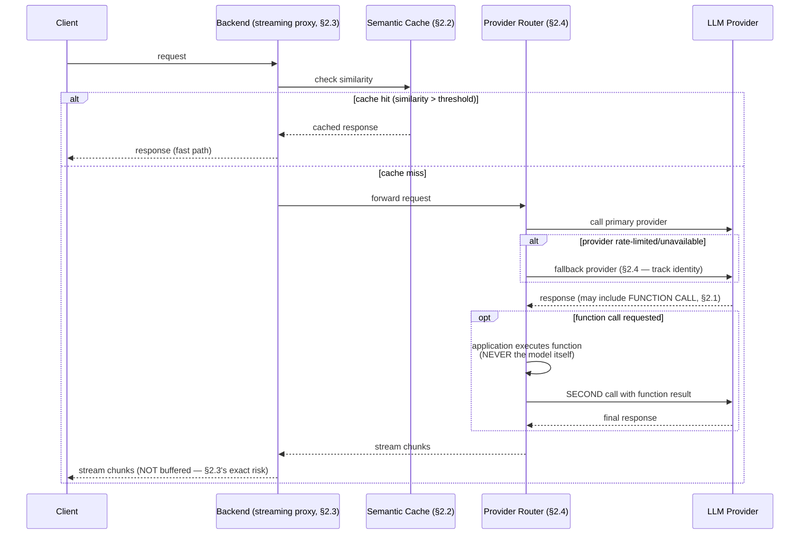

# Module 165 — LLM Integration: Production API Patterns, Function Calling, Semantic Caching & Multi-Provider Resilience

> Domain: AI Systems (merged 44-50) | Level: Beginner → Expert | Prerequisite: [[../44-AI-Systems/03-RAG-Retrieval-Augmented-Generation-ChunkingStrategies-HybridSearch-Evaluation]] A10 (this module is the distinct, production-operational concern that module previewed — reliably delivering and operating a well-grounded response at scale, not grounding quality itself), [[../17-Microservices/02-Service-Discovery-Communication-Backpressure]] (this module's multi-provider fallback and backpressure handling directly extend that module's resilience-pattern coverage to an LLM-provider dependency specifically)

>
> **Scope note:** Fourth of seven modules scoping the merged `44-AI-Systems` domain. This module covers the production-engineering discipline of integrating LLM calls reliably into a larger system: function/tool calling as the mechanism enabling Module 167's Agents, semantic caching, streaming integration patterns, and multi-provider resilience — deliberately not re-deriving Module 162's inference mechanics or Module 163's prompting technique, which this module assumes throughout.

---

## 1. Fundamentals

**What:** LLM Integration is the production-engineering discipline of embedding LLM calls reliably into a larger software system — **function/tool calling** (letting a model request a specific, structured function invocation rather than only generating text, the mechanism Module 167's AI Agents build on directly), **semantic caching** (caching responses by semantic similarity of the query, not merely exact-match), **streaming integration** (correctly consuming and forwarding a token-by-token response through a multi-hop system), and **multi-provider resilience** (routing, fallback, and degradation strategies when a primary LLM provider is unavailable, rate-limited, or underperforming).

**Why:** Modules 162-164 established the LLM's own internal mechanics and the RAG architecture grounding its output — this module addresses what happens once that well-designed core must actually run reliably, at scale, integrated with the rest of a production system, exactly the transition Module 164 A10 named as this domain's next concern. Function calling specifically is the mechanism that turns an LLM from "a text generator" into "a component that can trigger real, consequential actions in other systems" — directly setting up this domain's highest-stakes subsequent module (167, AI Agents) and this module's own sharpest security finding (§8).

**When:** Every production LLM integration needs multi-provider resilience and appropriate caching discipline at genuine scale; function calling specifically matters whenever an LLM-backed system needs to trigger a deterministic action (a database query, an API call, a calculation) rather than merely generate descriptive text — this course's Elite FinTech lens treats this as the common case for any AI system beyond a purely informational chatbot.

**How (30,000-ft view):**
```
Request ──► Semantic cache check (§2.2) ──[hit]──► Return cached response
                    │ [miss]
                    ▼
        Provider router (§2.4) ──► Primary provider
                    │                    │ [rate-limited/unavailable]
                    │                    ▼
                    └──────────► Fallback provider

        Response may include a FUNCTION CALL request (§2.1) —
        not final text, but a structured request for the CALLING
        system to execute a specific function and return the result
        for a SECOND model call to incorporate
```

---

## 2. Deep Dive

### 2.1 Function/tool calling — a two-round-trip protocol, not a single call

**Function calling** lets a model, instead of (or in addition to) generating free text, return a structured request identifying a specific function name and arguments it wants invoked — e.g., `get_account_balance(account_id="12345")` — which the *calling application*, never the model itself, actually executes, feeding the result back to the model in a *second* API call so it can incorporate that result into its final response. **This is a fundamentally two-round-trip (at minimum) protocol**, not a single request-response cycle: latency and cost calculations (Module 162 §2.2/§7) must account for at least two full prefill/decode cycles for any function-calling interaction, and a multi-step tool-use chain (Module 167's Agents) compounds this further. **The model itself never executes anything** — this is the load-bearing security fact this module's §8 and Module 163 §8 both depend on: the function call is a *request*, and the calling application's own authorization layer, entirely independent of the model, decides whether to actually honor it.

### 2.2 Semantic caching — caching by meaning, not exact match

Conventional caching (Module 103's coverage) keys on exact request identity — semantic caching instead embeds an incoming query (Module 164's embedding mechanics reused directly) and checks whether a sufficiently-similar *prior* query's cached response exists, returning it without a new LLM call if the similarity exceeds a threshold. **This directly trades cost/latency savings against a genuine, tunable correctness risk**: two queries can be semantically similar by embedding-similarity measure while requiring meaningfully different answers (e.g., "what's my current balance" asked by two different users, or the same phrasing asked at two different points in time for genuinely time-sensitive data) — semantic caching is appropriate specifically for queries whose *correct answer* is actually stable across the similarity threshold's tolerance, and inappropriate for user-specific or time-sensitive queries where surface-similar phrasing doesn't imply an identical correct answer, directly recurring this module's own version of Module 160's React-Query-cache-key-scoping finding: the *scope* of what's considered "the same query" must match the actual, underlying data-variance dimension, or the cache silently serves a wrong-context answer.

### 2.3 Streaming through a multi-hop system

Module 162 §7 established streaming's perceived-latency benefit at the client layer — in a production system where an LLM call passes through an intermediate backend service (rather than the client calling the provider directly), that backend must itself correctly proxy the streamed response chunk-by-chunk (typically via Server-Sent Events or a chunked-transfer HTTP response) rather than buffering the complete response before forwarding it, or the entire streaming benefit is silently discarded at that hop — a genuinely common integration mistake, since a naive backend implementation (awaiting the full provider response before returning anything to its own client) trivially "works" functionally while completely defeating the latency purpose streaming exists for, invisible to any test that only checks final response correctness rather than measuring time-to-first-byte at the client's actual vantage point.

### 2.4 Multi-provider resilience and the output-consistency problem

Module 162 §9 previewed multi-provider fallback as this domain's instance of Module 136's circuit-breaker pattern — this module develops the complication that finding makes explicit: **switching providers mid-session (or even between two calls in the same user interaction) can produce a meaningfully different response style, tone, or even factual framing for the identical underlying query**, since different providers' models are different underlying systems, not interchangeable implementations of one specification the way two load-balanced replicas of the same backend service are. A fallback strategy must therefore account for **response-consistency risk**, not merely availability — appropriate mitigations include normalizing output through a consistent post-processing/formatting layer regardless of which provider generated it, explicitly tracking and monitoring which provider served which request (so a support/compliance review can attribute a specific response to its actual generating provider, directly extending Module 162 §4's audit-archival discipline to include provider identity as a first-class archived field), and, for genuinely consistency-critical use cases, treating a fallback event itself as requiring human review rather than silent, automatic substitution.

### 2.5 Cost governance and the multiplicative-request-chain problem

Function calling's multi-round-trip nature (§2.1) and Module 167's forthcoming multi-step agent loops compound Module 162's per-token cost model multiplicatively rather than additively — a single user interaction triggering three sequential tool calls, each requiring its own prefill/decode cycle, incurs roughly three times the cost of a single-turn response, a cost-scaling reality easy to underestimate when reasoning about "the cost of one LLM call" in isolation rather than the cost of an entire, potentially-multi-step interaction chain. **Production cost governance requires tracking and budgeting at the *interaction* level, not the individual-API-call level** — a per-request cost ceiling, and explicit monitoring of interactions that exceed an expected step count, both directly analogous to Module 141's backend backpressure/lag-monitoring discipline applied to LLM-call-chain depth specifically.

---

## 3. Visual Architecture



---

## 4. Production Example

**Problem:** A wealth-management platform's client-facing chatbot used semantic caching to reduce cost for its most common query pattern — "what is my current portfolio balance" — with a similarity threshold tuned to catch the many surface-level phrasing variations clients used to ask this same question.

**Architecture:** A semantic cache keyed purely on query-text embedding similarity, with no per-client scoping and no time-based invalidation, on the reasoning that the *question* ("what is my balance") was semantically identical across every client asking it.

**Implementation / What happened:** The cache correctly recognized "what's my balance," "how much do I have," and "current portfolio value" as semantically similar variants of the same underlying question — and, because the cache key was scoped purely to query-text similarity with **no client-identity dimension included**, it began serving one client's cached balance response to a *different* client asking a phrasing-similar question, a direct, cross-client data-exposure incident structurally identical to Module 160 §4's React Query cache-key-scoping incident, now occurring at the semantic-caching layer instead of the frontend data-fetching layer, and additionally serving stale balances to the *same* client across genuinely different points in time, since no time-based invalidation existed for what is, by nature, a rapidly-changing value.

**Trade-offs:** The caching approach correctly identified that the *question phrasing* varied enormously while the *underlying query type* was genuinely reusable — the specific defect was applying that genuine insight without also including the two dimensions (client identity, data currency) the *answer* actually depends on, exactly the "cache key scope must match the answer's actual variance dimensions, not merely the question's surface phrasing" finding §2.2 established.

**Lessons learned:** **Semantic caching's similarity threshold operates on the *question's* meaning — it says nothing about whether the *correct answer* to that question is actually stable across the dimensions (which client is asking, when they're asking) the cache key omits.** This is this module's own, third instance in this course's now-repeated cache/identity-scoping finding (Module 158's `trackBy`, Module 160's cache keys, this module's semantic-cache key) — a configuration mechanism's declared scope (question-similarity) must be verified to actually match every dimension the underlying, correct answer genuinely varies by, never assumed sufficient because the question-similarity dimension alone was reasoned about carefully.

---

## 5. Best Practices

- **Scope semantic-cache keys to every dimension the correct answer actually varies by**, not merely question-text similarity (§2.2, §4) — client identity, data currency/freshness requirements, and any other context-dependent variable must be included in the cache key, never inferred solely from question phrasing.
- **Verify streaming is preserved end-to-end through every hop of a multi-service integration**, measured at the client's actual vantage point (time-to-first-byte), not merely assumed correct because the final response content is functionally accurate (§2.3).
- **Track and archive which specific provider served each response**, extending Module 162's audit-archival discipline to include provider identity as a first-class field (§2.4) — essential for any compliance review needing to attribute a specific historical response to its actual generating system.
- **Budget and monitor cost/latency at the interaction level, not the individual-API-call level**, for any function-calling or multi-step agent workflow (§2.5) — a per-request cost ceiling and step-count monitoring catch runaway multi-call chains before they compound into a significant, unexpected cost event.
- **Never let the model itself execute a function call directly** — the function-call response is always a *request* the calling application's own, independent authorization layer evaluates and executes (§2.1, §8).

---

## 6. Anti-patterns

- **Semantic cache keys scoped to question-text similarity alone, omitting client identity or data-currency dimensions** — §4's exact incident; a genuine, severe cross-client data-exposure risk.
- **A backend service buffering a provider's streamed response fully before forwarding it to its own client** — silently discards streaming's entire latency benefit while appearing functionally correct (§2.3).
- **Treating a provider fallback event as a purely mechanical, invisible substitution** with no tracking of which provider actually served a given response — undermines any future audit or compliance review needing to attribute historical output to its actual source (§2.4).
- **Reasoning about LLM integration cost per individual API call** rather than per full interaction/tool-call chain — systematically underestimates the true cost of any function-calling or multi-step workflow (§2.5).
- **Allowing a model's function-call request to trigger direct execution with no independent, application-side authorization check** — the exact security anti-pattern §8 develops fully, reusing Module 163 §8's "never trust the model's own generated intent" principle.

---

## 7. Performance Engineering

Function calling's minimum-two-round-trip structure (§2.1) means its latency floor is at least double a single-turn response's, before accounting for the function-execution time itself — a genuinely different latency budget category from simple text generation, requiring separate SLA/monitoring targets (Module 162 §7's TTFT/TPS framework, now applied per-round-trip within a multi-step interaction). Semantic caching's cost/latency benefit (§2.2) is directly proportional to cache-hit rate for genuinely cacheable query patterns — a system should track hit rate as a first-class metric distinguishing genuinely effective caching from a poorly-tuned similarity threshold providing negligible actual benefit. Streaming's client-perceived-latency benefit (§2.3) is entirely orthogonal to total-completion-time/cost — a system optimizing only for streaming correctness without also addressing Module 162's underlying token-cost/decode-time factors has improved perceived responsiveness without improving actual throughput or cost efficiency.

---

## 8. Security

**This module's central, non-negotiable security principle, extending Module 163 §8's foundation directly: a function-call request from the model is untrusted input, exactly like any user-submitted request, and must be independently, structurally authorized by the calling application before execution — regardless of how the request was generated (a legitimate user's genuine intent, or a successfully-injected, adversarial instruction).** This means every function/tool a model can request must have its own, explicit least-privilege authorization scope (never a blanket "the AI system can do anything the underlying service account can do"), and any function whose execution has genuine, consequential real-world effect (a funds transfer, an account modification, an external communication) should require an additional confirmation layer — either a human-in-the-loop approval step or a structurally-narrower, pre-authorized action scope — before execution, directly extending Module 152's PAM/least-privilege discipline to this domain's own action-triggering mechanism.

---

## 9. Scalability

Multi-provider routing (§2.4) provides the identical availability benefit Module 136 established for backend service circuit-breaking, with the added complication (§2.4) that provider substitution isn't a purely mechanical, output-equivalent failover the way a load-balanced backend replica swap is — production systems at genuine scale should track per-provider success rate, latency, and (where feasible) output-quality metrics independently, routing traffic proportionally rather than treating every configured provider as fully interchangeable. Semantic-cache hit rate (§7) directly reduces the *effective* request volume reaching the underlying LLM provider, a genuine, measurable capacity-planning lever at scale — but one that, per §4, must never be tuned purely for hit-rate maximization without equally weighting the correctness-scoping discipline §2.2 establishes.

---

## 10. Interview Questions

### Basic (10)

**B1. What is function/tool calling, and who actually executes the requested function?**
*Ideal Answer:* A model returns a structured request identifying a function name and arguments it wants invoked; the calling application — never the model itself — actually executes the function and returns the result in a second API call.
*Why correct:* Matches §2.1.
*Common mistakes:* Assuming the model itself performs the function's actual execution.
*Follow-up:* Why is this "the model never executes anything" fact security-critical?

**B2. Why is function calling described as a minimum-two-round-trip protocol?**
*Ideal Answer:* The first call returns the function-call request; the calling application executes it and sends the result back in a second call for the model to incorporate into its final response.
*Why correct:* Matches §2.1/§7.
*Common mistakes:* Treating function calling as a single request-response cycle with no added latency implication.
*Follow-up:* How does this compound for a multi-step tool-use chain?

**B3. What is semantic caching, and how does it differ from conventional exact-match caching?**
*Ideal Answer:* Caching keyed by embedding-based similarity of the query to prior queries, rather than exact request-identity matching — returning a cached response for a sufficiently similar (not necessarily identical) new query.
*Why correct:* Matches §2.2.
*Common mistakes:* Confusing semantic caching with conventional TTL-based caching without the similarity-threshold mechanism.
*Follow-up:* What specific risk does semantic caching introduce that exact-match caching doesn't?

**B4. Why can a semantic cache be dangerous for user-specific queries?**
*Ideal Answer:* Two different users' phrasing-similar questions can have embedding similarity above the cache threshold while requiring genuinely different, user-specific correct answers — if the cache key doesn't include user/client identity, it can silently serve one user's cached answer to a different user.
*Why correct:* Matches §2.2/§4.
*Common mistakes:* Assuming semantic similarity alone is a sufficient basis for cache-key scoping regardless of the underlying data's actual variance dimensions.
*Follow-up:* Name the two specific dimensions §4's incident's cache key omitted.

**B5. What happens if a backend service buffers a provider's full streamed response before forwarding it to its own client?**
*Ideal Answer:* The streaming latency benefit is silently discarded at that hop — the client experiences the same wait-for-full-response latency as a non-streaming call, despite the underlying provider call being correctly configured for streaming.
*Why correct:* Matches §2.3.
*Common mistakes:* Assuming streaming configuration at the provider-call layer alone guarantees the end-to-end, client-perceived benefit.
*Follow-up:* What measurement would reveal this defect, given the response's final content is still functionally correct?

**B6. Why can switching LLM providers mid-session produce a noticeably different user experience?**
*Ideal Answer:* Different providers' models are different underlying systems, not interchangeable implementations of one specification — they can differ in response style, tone, and even factual framing for the identical query.
*Why correct:* Matches §2.4.
*Common mistakes:* Assuming provider fallback is a purely mechanical, output-equivalent substitution, the way a backend service replica swap typically is.
*Follow-up:* What archival practice should accompany every provider-fallback event?

**B7. Why does function calling and multi-step tool use compound LLM cost multiplicatively rather than additively?**
*Ideal Answer:* Each tool call in a chain requires its own full prefill/decode cycle — three sequential tool calls incur roughly three times a single-turn response's cost, not a fixed, small increment.
*Why correct:* Matches §2.5.
*Common mistakes:* Reasoning about cost per individual API call in isolation rather than per full, potentially-multi-step interaction chain.
*Follow-up:* What monitoring practice catches an unexpectedly long tool-call chain before it produces a significant cost event?

**B8. Why must a function-call request from the model always be independently authorized by the calling application?**
*Ideal Answer:* The request is untrusted input — exactly like a user-submitted request — and could result from a successfully-injected, adversarial instruction rather than legitimate user intent; independent, structural authorization is the only defense that doesn't depend on the model's own behavior being trustworthy.
*Why correct:* Matches §8, directly reusing Module 163 §8's foundational principle.
*Common mistakes:* Assuming sufficiently careful prompting reduces the need for independent authorization enforcement.
*Follow-up:* What additional layer should a consequential function (e.g., a funds transfer) require beyond ordinary authorization?

**B9. In §4's incident, was the caching technique itself flawed?**
*Ideal Answer:* No — semantic caching correctly identified genuine question-phrasing variation as reusable; the defect was the cache key's scope omitting client-identity and data-currency dimensions the correct answer actually depends on.
*Why correct:* Matches §4's precise root-cause framing.
*Common mistakes:* Concluding semantic caching is inherently unsafe for this use case, rather than correctly attributing the failure to incomplete key scoping specifically.
*Follow-up:* What's the minimal fix that preserves the caching benefit while closing the exposure?

**B10. Why does a per-provider success-rate and latency tracking matter beyond simple availability monitoring?**
*Ideal Answer:* It enables proportional, quality-aware traffic routing rather than treating every configured provider as fully interchangeable — supporting both resilience (routing away from a degrading provider before it fully fails) and the output-consistency tracking §2.4 requires.
*Why correct:* Matches §9.
*Common mistakes:* Treating multi-provider routing as a purely binary up/down decision with no gradated, quality-aware routing consideration.
*Follow-up:* What Module 154 A4-analogous incident could this per-provider monitoring have caught earlier?

### Intermediate (10)

**I1. Design the corrected semantic-cache key for §4's incident, and explain why it closes the exposure.**
*Ideal Answer:* Scope the cache key to include both the query-text embedding AND the requesting client's identity (never serving one client's cached response to a different client, regardless of question-phrasing similarity) AND a time-based invalidation/TTL appropriate to the underlying data's actual currency requirement (a rapidly-changing balance value should have a very short TTL, or bypass caching for such values entirely) — closing both dimensions §4's incident demonstrated as missing.
*Why correct:* Matches §5/§4's precise fix, addressing both the cross-client and staleness dimensions independently.
*Common mistakes:* Fixing only one of the two dimensions (client-scoping or time-invalidation) without the other, leaving a residual risk from whichever dimension remains unaddressed.
*Follow-up:* For which specific query types would you consider bypassing semantic caching entirely, rather than attempting to scope it correctly?

**I2. Design a test that specifically verifies streaming is preserved end-to-end through a multi-hop backend, per §2.3.**
*Ideal Answer:* A test measuring time-to-first-byte at the actual client's vantage point (not merely asserting the final response content is correct) — asserting that the first chunk of the response arrives measurably before the full response would complete, distinguishing genuine end-to-end streaming from a backend that buffers the full provider response before forwarding, which would produce an identical final response with a very different, and incorrect, timing profile.
*Why correct:* Correctly designs a timing-based, not content-based, test targeting the specific defect class §2.3 identifies.
*Common mistakes:* Testing only final response content correctness, which — per §2.3 — would pass identically whether or not streaming was actually preserved end-to-end.
*Follow-up:* Why is this test specifically a negative-test-coverage gap analogous to this course's other negative-testing findings (Module 153 A9)?

**I3. Compare the archival requirements for a provider-fallback event against Module 162's original model-version-pinning audit requirement.**
*Ideal Answer:* Both require the same underlying discipline (archive the complete, specific context that produced a given response) extended to a new dimension: Module 162 required archiving the exact model version; this module additionally requires archiving which specific *provider* served a given response, given fallback events mean the serving provider is no longer a fixed, assumed constant the way a single-provider system's provider identity would be — a genuinely new field the original audit schema (Module 162's Expert exercise) would need to be extended to capture.
*Why correct:* Correctly identifies both the shared underlying discipline and the specific, new field this module's multi-provider architecture requires beyond Module 162's original scope.
*Common mistakes:* Assuming Module 162's audit-archival design automatically covers this new requirement without explicit extension.
*Follow-up:* Extend Module 162's Expert exercise's `AuditedLlmRequest` dataclass to include this new field.

**I4. A function-calling agent requests `transfer_funds(amount=5000, to_account="external-123")`. Design the authorization check this request must pass before execution, independent of the model's own reasoning.**
*Ideal Answer:* Verify, independently of any explanation or justification the model provided in its own generated text, that: the requesting user/session has genuine, current authorization to initiate a transfer of this type and magnitude; the destination account is not on any fraud/sanctions watchlist; the amount doesn't exceed any applicable transaction limit; and — given the consequential nature of this specific action — require an additional, explicit human confirmation step before execution, regardless of how confidently or correctly the model's own reasoning appeared to justify the request.
*Why correct:* Matches §8's precise principle, correctly treating the function-call request as untrusted input requiring full, independent authorization regardless of the model's own apparent reasoning quality.
*Common mistakes:* Proposing an authorization check that relies in any way on the model's own stated justification/reasoning as a trust signal, rather than treating the request as requiring the identical scrutiny any other untrusted, user-originated request would receive.
*Follow-up:* Should this authorization check differ if the request originated from a fully-automated agent loop (Module 167) versus a direct, single-turn user request? Why or why not?

**I5. Design a cost-governance dashboard for a function-calling-enabled customer support system, per §2.5.**
*Ideal Answer:* Track cost and latency at the *interaction* level (a full user session/conversation, potentially spanning multiple tool calls), not merely per individual API call; alert on interactions exceeding an expected step-count threshold (a conversation requiring an unusually long tool-call chain, which may indicate either a genuinely complex legitimate case or a runaway/looping agent behavior warranting investigation); track cost per interaction category (e.g., simple Q&A versus multi-tool-call troubleshooting) to identify which interaction types are driving disproportionate cost.
*Why correct:* Correctly designs interaction-level (not call-level) tracking with specific, actionable alerting thresholds matching §2.5's precise finding.
*Common mistakes:* Proposing only per-API-call cost tracking, missing the interaction-level aggregation §2.5 establishes as the correct unit of cost governance.
*Follow-up:* How would you distinguish a genuinely complex, legitimate long tool-call chain from a runaway/looping one using this same monitoring data?

**I6. Why does §2.4's output-consistency risk matter more for a financial-services chatbot than for, say, an internal, non-client-facing developer tool using the same multi-provider fallback architecture?**
*Ideal Answer:* A client-facing financial-services chatbot's response style, tone, and precise factual framing carry direct client-trust, brand-consistency, and potential compliance implications (a subtly different framing of a fee or risk disclosure between two providers could itself be a compliance concern) — an internal developer tool's output-consistency variance across providers, while still a real UX consideration, generally carries much lower stakes, making the additional archival/monitoring/human-review overhead §2.4 recommends proportionally less justified for that lower-stakes use case, per this course's now-standard risk-tiered-investment principle.
*Why correct:* Correctly applies risk-tiered reasoning to distinguish the two use cases' actual stakes, rather than treating §2.4's full recommendation as universally warranted regardless of context.
*Common mistakes:* Applying the same full output-consistency governance uniformly to every use case regardless of its actual client-facing/compliance stakes.
*Follow-up:* At what specific point would you recommend an internal tool DOES warrant the full output-consistency governance §2.4 establishes?

**I7. A semantic cache's hit rate is very high (95%), suggesting excellent cost savings — but the product team reports users frequently complaining responses feel "generic" or "not quite what I asked." Diagnose the likely cause.**
*Ideal Answer:* A very high hit rate combined with user dissatisfaction suggests the similarity threshold is tuned too loosely — genuinely different queries, with meaningfully different intended answers, are being classified as "similar enough" to share a cached response, producing technically-fast but substantively generic or mismatched answers; the fix is tightening the similarity threshold (trading some cost-savings for improved answer specificity) and empirically re-validating the trade-off (directly reusing this course's now-standard empirical-verification discipline, Module 164 A3) rather than optimizing hit rate as an isolated, unqualified success metric.
*Why correct:* Correctly diagnoses the likely cause (over-loose similarity threshold) and identifies hit rate alone as an insufficient, potentially-misleading success metric without a corresponding answer-quality/specificity check.
*Common mistakes:* Treating a high hit rate as unconditionally good news without considering it might indicate the threshold is too permissive, sacrificing answer specificity for cost savings the team never explicitly intended to trade away.
*Follow-up:* Design a monitoring metric combining hit rate with user-satisfaction/complaint signal that would have surfaced this trade-off earlier.

**I8. Why does this module describe multi-provider fallback as "the identical availability benefit Module 136 established" while also identifying a genuinely new complication (output-consistency) Module 136's backend circuit-breaking never needed to address?**
*Ideal Answer:* The *availability* mechanism (detect failure, route to an alternative) is structurally identical to Module 136's circuit-breaker pattern — but Module 136's backend service replicas are, by construction, meant to be functionally identical implementations of the same service contract, so switching between them changes nothing about the response's actual content or style. Two different LLM providers are NOT interchangeable implementations of one specification — they're genuinely different underlying systems, meaning the *content* of the response itself, not merely its availability, can meaningfully differ upon fallback, a complication with no counterpart in Module 136's original backend-service context.
*Why correct:* Correctly distinguishes what genuinely transfers from Module 136's pattern (the availability/routing mechanism) from what's genuinely new to this domain (output-consistency risk), demonstrating precise cross-module comparison rather than either over- or under-stating the parallel.
*Common mistakes:* Either treating the two as fully equivalent (missing the output-consistency complication) or treating them as entirely unrelated (missing the genuine, transferable availability-mechanism parallel).
*Follow-up:* Name one additional resilience pattern from Module 136 that transfers cleanly to this domain, and one that doesn't, beyond the output-consistency example already discussed.

**I9. Design the monitoring that would distinguish a genuine LLM provider outage from a semantic-cache-driven false sense of continued availability (i.e., the cache is masking a provider that's actually down).**
*Ideal Answer:* Track cache-hit-versus-miss request routing separately from provider health — specifically monitor the success/failure rate of cache-*miss* requests (the ones that genuinely reach the provider) independently from the aggregate request success rate, since a high aggregate success rate driven mostly by cache hits could mask a provider that's actually failing for every genuine, cache-miss request, a scenario where the system appears healthy in aggregate while its actual, live-request path is completely broken.
*Why correct:* Correctly identifies that aggregate success-rate monitoring can be misleadingly masked by cache-hit traffic, requiring cache-miss-specific monitoring to see the provider's genuine, current health accurately.
*Common mistakes:* Monitoring only aggregate request success rate, missing that a high cache-hit rate can mask a completely broken underlying provider for the traffic that actually needs it.
*Follow-up:* How would this masking risk change if the semantic cache had no TTL/expiration at all versus a short, frequently-refreshing TTL?

**I10. Synthesize why this module's semantic-caching incident (§4) is the third instance of this course's cache/identity-scoping finding — name the first two and precisely compare the three.**
*Ideal Answer:* First: Module 158's `trackBy`/`key` incident — a DOM-rendering identity mechanism scoped to array index rather than the data's actual, reorder-relevant identity dimension. Second: Module 160's React Query cache-key incident — a server-state cache scoped to query text alone, omitting the account-ID dimension the underlying data actually varied by. Third: this module's semantic cache — scoped to question-text similarity alone, omitting the client-identity and data-currency dimensions the correct answer actually varies by. All three share the identical underlying shape: a caching/identity mechanism's declared scope (index position; query text; question similarity) is narrower than the actual dimensions the underlying, correct data varies by, producing a silent, non-erroring cross-context data exposure or staleness incident — this module's instance is the first occurring specifically in an AI-systems-native mechanism (semantic similarity) rather than a conventional, exact-match-based caching mechanism, demonstrating the underlying pattern transfers even to a genuinely novel, embedding-based caching technique.
*Why correct:* Correctly identifies and precisely compares all three instances, including the genuinely new dimension (AI-native semantic similarity rather than conventional exact-match) this module's instance adds to the pattern.
*Common mistakes:* Naming only one or two of the three prior instances, or failing to identify the specific new dimension (semantic-similarity-based rather than exact-match-based caching) this module's instance contributes to the pattern.
*Follow-up:* Predict, before Module 167 covers it, whether AI Agents' own state/memory mechanisms are likely to exhibit a fourth instance of this same pattern, and why.

### Advanced (10)

**A1. Design the complete, corrected LLM-integration architecture for the wealth-management chatbot, synthesizing every mechanism this module establishes.**
*Ideal Answer:* Semantic cache scoped to query embedding + client identity + appropriate TTL per query-currency requirement (I1); streaming verified end-to-end via time-to-first-byte testing at the actual client vantage point (I2); provider-fallback events archived with provider identity as a first-class field, extending Module 162's audit schema (I3); every function-calling capability scoped to least-privilege, independently authorized regardless of the model's own stated reasoning, with consequential actions (transfers) requiring human confirmation (I4); interaction-level cost/latency monitoring with step-count alerting (I5); cache-hit-versus-miss-specific health monitoring distinguishing genuine provider health from cache-masked appearance of health (I9).
*Why correct:* Synthesizes every element this module establishes into one complete, governed architecture directly closing §4's root cause and every adjacent risk this module identifies.
*Common mistakes:* Addressing only the immediate cache-scoping fix without the accompanying streaming-verification, audit-extension, authorization, cost-governance, and health-monitoring layers this module also establishes as necessary.
*Follow-up:* Which of these six elements carries the highest business/regulatory risk if omitted, and why, informing implementation prioritization under a resource constraint?

**A2. Critique: "Since function calls are only executed by the calling application, never the model itself, a system with a correctly-implemented authorization layer is fully protected against any harm from prompt injection, regardless of what tools the model has access to."**
*Ideal Answer:* Overstated in one specific, important way: a correctly-implemented authorization layer prevents an *unauthorized* action from executing, but it does not prevent an *authorized* action from being triggered under a *manipulated context* — e.g., an injection attack that doesn't request an unauthorized action, but instead manipulates the model into requesting a fully-authorized action (a legitimate fund transfer the user IS authorized to make) based on injected, false information (a fabricated urgent reason, a manipulated account number the user didn't actually intend) — the authorization layer correctly verifies the *user* is allowed to do X, but has no visibility into whether the *specific instance* of X was genuinely, knowingly requested by that user or manufactured by a successful injection attack operating entirely within the user's own legitimate permission scope.
*Why correct:* Correctly identifies a genuine, non-obvious residual risk (authorized-but-manipulated actions) that authorization-layer enforcement alone doesn't close, refining rather than simply accepting or rejecting the overstated claim.
*Common mistakes:* Accepting the claim at face value because authorization enforcement genuinely is the correct, necessary primary control, without recognizing this specific residual gap it doesn't close on its own.
*Follow-up:* What additional control, beyond authorization-layer enforcement, would address this specific residual risk (an authorized action triggered by manipulated context)?

**A3. Design an empirical experiment measuring whether a proposed semantic-cache similarity-threshold change actually improves the cost-versus-quality trade-off, per I7's diagnostic finding.**
*Ideal Answer:* Construct a held-out set of realistic query pairs, each labeled by human judgment as "should share a cached answer" or "should NOT share a cached answer despite surface similarity" (directly analogous to Module 164 §2.5's retrieval-relevance ground-truth challenge, now applied to cache-sharing appropriateness); measure, at both the current and proposed threshold, the false-positive rate (pairs incorrectly sharing a cached answer) and false-negative rate (pairs that could have safely shared a cache but didn't); choose the threshold minimizing false-positive rate specifically (since a false positive is this module's own cross-client/staleness exposure risk, a materially more severe failure mode than the cost-inefficiency a false negative merely represents) subject to a minimum acceptable hit-rate/cost-savings floor.
*Why correct:* Correctly designs an empirical, ground-truth-labeled evaluation explicitly prioritizing false-positive-rate minimization (the severe risk) over hit-rate maximization (the mere efficiency metric), matching this course's risk-over-efficiency prioritization principle.
*Common mistakes:* Optimizing purely for hit rate or aggregate cost savings without the explicit false-positive/false-negative distinction this specific risk profile requires.
*Follow-up:* Why is minimizing false-positive rate specifically prioritized over false-negative rate here, given both represent some form of "incorrect" threshold calibration?

**A4. A financial-services platform's multi-provider LLM architecture routes 80% of traffic to Provider A and 20% to Provider B for load-balancing purposes (not fallback). A compliance audit later requires reproducing a specific historical client interaction. What does §2.4's archival requirement need to additionally support, beyond simple provider-identity logging?**
*Ideal Answer:* Beyond logging which provider served the interaction, the archival record must also capture the *exact, pinned model version* for whichever provider actually served it (Module 162's original pinning requirement, now conditionally applied per-provider rather than assuming a single, fixed provider/version pair) — meaning the audit architecture needs a provider-and-version composite key, not merely a provider-name field, since each provider independently has its own version-pinning and potential drift risk (Module 164 §14's exact finding, now recurring for whichever provider is randomly selected for load-balancing on any given request).
*Why correct:* Correctly identifies that multi-provider load-balancing (not merely failover) compounds the version-pinning requirement across every configured provider independently, extending I3's finding with the added load-balancing-specific nuance.
*Common mistakes:* Assuming provider-identity logging alone is sufficient, missing that each provider still independently requires its own version-pinning and drift-monitoring discipline.
*Follow-up:* Does load-balancing across multiple providers (rather than pure failover) increase or decrease the platform's overall exposure to Module 164 §14's provider-drift incident class, and why?

**A5. Design a canary/synthetic-monitoring test specifically detecting §2.3's streaming-defeated-at-a-hop defect class in production, continuously, rather than only at initial deployment.**
*Ideal Answer:* A synthetic, periodically-run test client that issues a real request through the full production integration path, measuring actual time-to-first-byte against an established baseline/threshold, alerting if TTFB degrades to a level consistent with buffering having been silently reintroduced (e.g., by an unrelated backend refactor or a new intermediate proxy/gateway hop added later that doesn't preserve chunked-transfer behavior) — directly reusing this course's now-standard continuous-canary discipline (Module 149 §14, Module 152 A10) applied to this module's own streaming-integrity concern specifically.
*Why correct:* Correctly extends this course's established continuous-canary pattern to a genuinely new target (streaming integrity through a multi-hop path) with a concrete, measurable signal (TTFB against baseline).
*Common mistakes:* Proposing only a one-time, pre-deployment streaming test, missing that a later, unrelated infrastructure change (a new proxy hop, per Module 155 §14's identical "unrelated deployment breaks a previously-correct property" pattern) could silently reintroduce the defect after initial verification passed.
*Follow-up:* What specific unrelated infrastructure change (analogous to Module 155 §14's load-balancer migration) would most plausibly reintroduce this defect in a real production environment?

**A6. Compare this module's function-calling authorization principle (§8, I4) against Module 152's PAM/least-privilege discipline. Is function-tool scoping the identical mechanism applied to a new domain, or genuinely distinct?**
*Ideal Answer:* Structurally near-identical in principle — both establish that a requesting entity's stated intent or request (a JIT elevation request; a function-call request) must be independently verified against a least-privilege, pre-established authorization scope before being honored, never trusted purely on the basis of the requester's own stated justification. The genuine distinction: Module 152's PAM addresses a *human* (or service-account) principal's explicitly-requested elevation, evaluated against that principal's own established identity and role; this module's function-call authorization addresses a *model-generated* request, where the "principal" requesting the action is, in a meaningful sense, the model's own generated output rather than a directly-identifiable human/service principal — requiring the authorization check to reason about the *underlying user/session* the model is acting on behalf of (similar to Module 155's token-exchange delegation-chain reasoning, `act` claims) rather than the model itself as the principal, a genuinely new wrinkle Module 152's original PAM framing didn't need to address.
*Why correct:* Correctly identifies both the strong structural parity and the genuinely new complication (reasoning about delegated, model-mediated intent rather than a directly-identifiable principal) this domain introduces, connecting to Module 155's token-exchange delegation-chain vocabulary specifically as the closer structural parallel for this particular nuance.
*Common mistakes:* Declaring the two mechanisms either fully identical or entirely unrelated, missing the precise "same core principle, one genuinely new wrinkle" finding this question requires.
*Follow-up:* Design the `act`-claim-equivalent (Module 155 §2.3) structure for a function-call authorization record, capturing both the model's request and the underlying user/session it's acting on behalf of.

**A7. Design a governance process for approving which functions/tools an LLM-backed system is permitted to call, given §8's least-privilege requirement.**
*Ideal Answer:* Every function exposed to a model requires an explicit, reviewed registration specifying: its precise authorization scope (what it's permitted to affect, and for which requesting-user context); whether it's classified as consequential (requiring human confirmation, per §8) or benign (safe for fully-automated execution); and periodic re-review as the function's own underlying implementation evolves — directly reusing this course's now-standard governed-artifact-registry pattern (Module 152's claims-mapping governance, Module 160's cache-key-factory convention, Module 163's prompt-template registry) applied to this module's own function-registration mechanism.
*Why correct:* Correctly reuses this course's established governed-registry pattern for a new, domain-specific artifact type (function/tool registrations), rather than proposing an ad hoc, novel governance mechanism.
*Common mistakes:* Proposing a one-time review with no ongoing re-validation as the underlying function implementation or its access requirements evolve over time.
*Follow-up:* Who should hold approval authority for classifying a new function as "consequential" versus "benign," and what criteria should inform that classification?

**A8. A team observes their semantic cache's false-positive rate (per A3's metric) rises measurably after the underlying embedding model is upgraded to a newer version. Diagnose the likely cause and connect it to a prior module's finding.**
*Ideal Answer:* The embedding model's own learned notion of "semantic similarity" is model-version-specific (Module 164 §2.2's finding, now recurring here) — a newer embedding-model version may judge two queries as more or less similar than the previous version did for the identical text pair, meaning the similarity threshold, empirically tuned (A3) against the *old* embedding model's specific similarity distribution, may no longer correspond to the same actual semantic-equivalence boundary under the new model, silently shifting the false-positive rate without any change to the cache's own configuration or code — directly recurring both Module 162 §4/§14's model-version-drift finding and Module 164 §14's embedding-version-mismatch finding, now demonstrated a third time in a third distinct pipeline location (the semantic-cache similarity threshold specifically).
*Why correct:* Correctly connects this new incident to two distinct, prior, structurally-related findings (model-version drift generally, and embedding-version mismatch specifically), demonstrating precise, multi-module synthesis.
*Common mistakes:* Diagnosing this as an unrelated, novel issue rather than recognizing it as a third instance of this course's now-well-established model-version-drift pattern.
*Follow-up:* Design the governance process (extending A7's pattern) that would require re-validating the similarity threshold specifically whenever the underlying embedding model version changes.

**A9. Synthesize why this module's own two incidents (§4's cache-scoping, and a hypothetical streaming-defeat incident per §2.3/A5) both represent a "silent, non-erroring" failure class this course's Modules 129-134 System Design run originally named. Is this pattern's continued recurrence in the AI Systems domain evidence the pattern generalizes, or evidence this course is over-applying a familiar template?**
*Ideal Answer:* Genuine evidence of generalization, not template over-application, for a specific, defensible reason: the "silent, non-erroring, correctness-unobservable-at-consumption" failure shape recurs specifically because both this domain and the original Modules 129-134 buy-side systems share the same underlying structural property — a system whose individual components each report success/functioning-normally status while the actual, delivered correctness of their composed output is a property no single component's own health-check or error-handling can observe directly, requiring dedicated, purpose-built verification (this module's TTFB canary; those modules' reconciliation processes) rather than conventional error-rate monitoring. The pattern's recurrence here is not coincidental repetition but confirmation that AI-systems architectures share this specific structural property with the highest-stakes backend financial systems this course has examined, not merely surface-level analogy.
*Why correct:* Provides a precise, structural (not merely thematic) justification for why the pattern's recurrence here is evidence of genuine, warranted generalization rather than an over-applied template, directly engaging with the meta-question about this course's own recurring-finding methodology.
*Common mistakes:* Either dismissing the connection as coincidental/superficial or accepting it uncritically without articulating the specific, structural reason (correctness-unobservable-at-consumption) that justifies treating the two domains as genuinely, structurally related rather than merely thematically similar.
*Follow-up:* Given this structural similarity, would the specific reconciliation-based detection techniques Modules 129-134 developed for backend financial systems transfer usefully to this domain, or does this domain require genuinely different detection techniques despite the shared underlying failure shape?

**A10. As this domain's fourth module, and the transition point from "grounding/generation quality" (Modules 162-164) to "production operation" (this module) to "autonomous action" (Module 167, next-but-one), state the specific risk dimension this module adds that neither its predecessors nor Module 167 will need to re-derive.**
*Ideal Answer:* This module's distinctive, non-re-derivable contribution is establishing that a well-grounded, well-prompted LLM response's *production delivery* — through caching, streaming, multi-provider routing, and function-call authorization — introduces its own, independent risk surface separate from the underlying response's own generation quality; a system could have flawless RAG grounding (Module 164) and flawless prompt engineering (Module 163) while still silently exposing one client's cached data to another (§4) or defeating its own latency architecture at an intermediate hop (§2.3) — risks that exist entirely at the *delivery/integration* layer, orthogonal to and independent of generation-quality risk, meaning Module 167's Agents coverage can assume this module's delivery-layer disciplines (authorization, cost governance, provider resilience) as already-established infrastructure and focus specifically on the genuinely new risk multi-step, autonomous reasoning introduces on top of it.
*Why correct:* Correctly identifies the specific, non-overlapping risk dimension this module contributes (delivery/integration correctness, independent of generation quality) and correctly frames how this positions Module 167 to build on top of, rather than re-derive, this module's findings.
*Common mistakes:* Describing this module's contribution vaguely as "making the system production-ready" without the precise "delivery risk is independent of generation-quality risk" distinction that's the module's actual, specific analytical contribution.
*Follow-up:* Given this module establishes delivery-layer risk as independent of generation-quality risk, predict one specific way Module 167's Agents module might combine or compound risks from both layers simultaneously.

---

## 11. Coding Exercises

### Easy — Client-and-currency-scoped semantic cache

**Problem:** Implement the corrected semantic-cache key from I1, scoped to client identity and appropriate TTL, closing §4's exact incident.

**Solution (Python):**
```python
import time
from dataclasses import dataclass

@dataclass
class CacheEntry:
    query_embedding: list[float]
    response: str
    client_id: str
    cached_at: float
    ttl_seconds: float

class SemanticCache:
    def __init__(self, similarity_threshold: float = 0.95):
        self._entries: list[CacheEntry] = []
        self._threshold = similarity_threshold

    def get(self, query_embedding: list[float], client_id: str) -> str | None:
        now = time.time()
        for entry in self._entries:
            # BOTH dimensions required — §4's exact fix: client identity AND freshness,
            # never question-similarity alone.
            if entry.client_id != client_id:
                continue
            if now - entry.cached_at > entry.ttl_seconds:
                continue
            if cosine_similarity(query_embedding, entry.query_embedding) >= self._threshold:
                return entry.response
        return None

    def put(self, query_embedding: list[float], response: str, client_id: str, ttl_seconds: float) -> None:
        self._entries.append(CacheEntry(query_embedding, response, client_id, time.time(), ttl_seconds))
```
**Time complexity:** O(n) per lookup (n = cached entries for a naive scan; production systems index by client_id first). **Space complexity:** O(n).

**Optimized solution:** Index entries by `client_id` first (a dictionary keyed on client, each holding only that client's own entries) before the similarity scan, reducing lookup cost from O(total entries) to O(entries for this one client) — both a performance optimization and a structural reinforcement of the client-scoping requirement itself.

### Medium — Streaming-preserving proxy verifying TTFB (per I2/A5)

**Problem:** Implement a backend proxy correctly forwarding a streamed provider response chunk-by-chunk, with an accompanying synthetic TTFB test.

**Solution (Python, illustrative async):**
```python
async def proxy_streamed_response(provider_stream, client_response_writer) -> None:
    async for chunk in provider_stream:
        # Forward EACH chunk immediately — never accumulate into a buffer
        # first, which is §2.3's exact, silently-latency-destroying mistake.
        await client_response_writer.write(chunk)
        await client_response_writer.flush()

async def measure_time_to_first_byte(client) -> float:
    start = time.monotonic()
    async for _ in client.stream_request("test query"):
        return time.monotonic() - start  # returns on the FIRST chunk only
    raise RuntimeError("No chunks received")
```
**Time complexity:** O(1) per chunk forwarded. **Space complexity:** O(1) — no buffering of the full response.

**Optimized solution:** Run `measure_time_to_first_byte` as a continuously-scheduled synthetic canary (A5) with alerting against a baseline threshold, rather than only as a one-time deployment test — catching a future, unrelated infrastructure change silently reintroducing buffering at some new intermediate hop.

### Hard — Least-privilege function-call authorization gate (per I4/§8)

**Problem:** Implement the independent authorization check gating function-call execution, distinguishing benign from consequential functions.

**Solution (Python):**
```python
from enum import Enum
from dataclasses import dataclass

class FunctionRiskTier(str, Enum):
    BENIGN = "benign"                    # safe for fully-automated execution
    CONSEQUENTIAL = "consequential"       # requires human confirmation, §8

@dataclass
class FunctionCallRequest:
    function_name: str
    arguments: dict
    requesting_user_id: str
    requesting_session_id: str

class FunctionAuthorizationGate:
    def __init__(self, function_registry: dict, authz_service):
        self._registry = function_registry  # A7's governed registration
        self._authz = authz_service

    def authorize_and_prepare(self, request: FunctionCallRequest) -> dict:
        registration = self._registry.get(request.function_name)
        if registration is None:
            raise PermissionError(f"Unregistered function: {request.function_name}")

        # Independent authorization check — NEVER trusts the model's own
        # generated reasoning/justification text, only the request's structural
        # content and the user's OWN, independently-verified permissions (§8/A2).
        if not self._authz.user_can_perform(
            user_id=request.requesting_user_id,
            action=request.function_name,
            resource_context=request.arguments,
        ):
            raise PermissionError(
                f"User {request.requesting_user_id} not authorized for {request.function_name}"
            )

        if registration["risk_tier"] == FunctionRiskTier.CONSEQUENTIAL:
            return {"status": "PENDING_HUMAN_CONFIRMATION", "request": request}

        return {"status": "AUTHORIZED", "request": request}
```
**Time complexity:** O(1) per authorization check. **Space complexity:** O(1).

**Optimized solution:** Log every authorization decision (approved, denied, pending-confirmation) with the full request context to the same audit-archival pipeline Module 162's Expert exercise established, extended per I3 with provider/session context — supporting the exact compliance-review use case Module 162's original audit architecture was built for, now covering function-call authorization decisions specifically.

### Expert — Interaction-level cost governance with step-count anomaly detection (per I5)

**Problem:** Implement the interaction-level cost/latency tracker with anomalous-chain-length alerting.

**Solution (Python):**
```python
from dataclasses import dataclass, field

@dataclass
class InteractionCostTracker:
    interaction_id: str
    total_cost_usd: float = 0.0
    step_count: int = 0
    step_costs: list[float] = field(default_factory=list)

class CostGovernor:
    def __init__(self, max_steps_before_alert: int = 5, max_cost_before_alert: float = 1.0):
        self._interactions: dict[str, InteractionCostTracker] = {}
        self._max_steps = max_steps_before_alert
        self._max_cost = max_cost_before_alert

    def record_step(self, interaction_id: str, step_cost_usd: float) -> None:
        tracker = self._interactions.setdefault(
            interaction_id, InteractionCostTracker(interaction_id)
        )
        tracker.total_cost_usd += step_cost_usd
        tracker.step_count += 1
        tracker.step_costs.append(step_cost_usd)

        # Interaction-level thresholds — NOT per-individual-call thresholds,
        # per §2.5's precise finding: the multiplicative-chain risk only
        # becomes visible at the AGGREGATE, interaction-scoped level.
        if tracker.step_count > self._max_steps:
            self._alert(f"Interaction {interaction_id} exceeded {self._max_steps} tool-call steps "
                        f"— possible runaway agent loop, needs investigation")
        if tracker.total_cost_usd > self._max_cost:
            self._alert(f"Interaction {interaction_id} exceeded ${self._max_cost} cost ceiling")

    def _alert(self, message: str) -> None:
        # Route to monitoring/alerting pipeline
        print(f"[COST GOVERNANCE ALERT] {message}")
```
**Time complexity:** O(1) per step recorded. **Space complexity:** O(interactions × steps per interaction).

**Optimized solution:** In production, distinguish a "genuinely complex, legitimate long chain" from a "runaway/looping agent" (I5's follow-up question) by additionally tracking whether consecutive steps show genuine, distinct progress (different function names/arguments) versus repeated, near-identical calls — the latter pattern specifically indicating a loop, directly reusing Module 154's `TokenFamily` reuse-detection pattern's underlying "repetition of an identical prior state is the actionable anomaly signal" logic, now applied to agent tool-call chains.

---

## 12. System Design

**Requirements:** Reliable, cost-governed, multi-provider-resilient LLM integration supporting function calling with independent authorization, end-to-end streaming, and correctly-scoped semantic caching.

**Architecture**
```
   Client ──► Backend proxy (streaming-preserving, Medium exercise)
                    │
        SemanticCache (Easy exercise — client+TTL scoped)
                    │ [miss]
        Provider Router (multi-provider, output-consistency-tracked, §2.4)
                    │
        FunctionAuthorizationGate (Hard exercise — independent, least-privilege)
                    │
        CostGovernor (Expert exercise — interaction-level, step-count-anomaly-aware)
                    │
        AuditedLlmClient (Module 162 Expert exercise, extended per I3 with provider identity)
```

**Monitoring:** TTFB canary (Medium exercise); cache-hit-versus-miss health split (I9); per-provider success rate/latency; interaction-level cost/step-count anomalies (Expert exercise); function-call authorization decision audit trail (Hard exercise).

**Trade-offs:** Semantic-cache correctness-scoping cost versus hit-rate/cost-savings (A3); consequential-function human-confirmation friction versus fully-automated throughput (§8, A7).

---

## 13. Low-Level Design

**Class diagram (textual):**
```
SemanticCache  (Easy exercise)
 └─ client_id + TTL scoped, per-client indexed

proxy_streamed_response / measure_time_to_first_byte  (Medium exercise)
 └─ never buffers; TTFB is the canary's core signal

FunctionAuthorizationGate  (Hard exercise)
 ├─ NEVER trusts model-generated justification
 └─ risk-tiered: benign (auto) vs. consequential (human confirmation)

CostGovernor / InteractionCostTracker  (Expert exercise)
 └─ interaction-scoped, not call-scoped — step-count AND cost thresholds
```

**Design patterns used:** Proxy (streaming forwarder); Gate/Guard Clause (`FunctionAuthorizationGate`); Circuit Breaker (provider routing, reusing Module 136); Observer (`CostGovernor` accumulating per-step events into interaction-level state).

**SOLID mapping:** SRP — each component handles exactly one concern; DIP — `FunctionAuthorizationGate` depends on an injected `authz_service` abstraction, never embedding authorization logic directly, enabling reuse of the platform's existing, independently-tested authorization infrastructure (Module 152's IAM domain) rather than reinventing it for this domain specifically.

---

## 14. Production Debugging

**Incident:** Following A1's corrected architecture, a support-escalation agent's function-call chain begins consistently hitting the `CostGovernor`'s step-count alert threshold for a specific, common escalation-type query, despite the underlying task genuinely requiring only 2-3 legitimate tool calls to resolve.

**Root cause:** One of the registered functions (`lookup_customer_history`) had a subtle bug causing it to occasionally return a response format the model's own function-calling logic didn't reliably parse as "task complete" — leading the model to re-request the identical function call again, believing its first request hadn't been fulfilled, a genuine (not malicious) loop arising from an ordinary function-implementation defect rather than any AI-specific failure, caught specifically because the Expert exercise's cost-governance alerting was watching for exactly this class of anomalous chain-length pattern.

**Investigation:** The Expert exercise's step-count alerting flagged the specific interaction pattern; examining the archived function-call chain (Hard exercise's audit trail) showed the identical function called with identical arguments multiple times in succession — the "repeated, near-identical calls" signature the Expert exercise's own optimized-solution note had anticipated as the loop-versus-genuine-complexity distinguishing signal.

**Fix:** Fixed the `lookup_customer_history` function's response-format bug directly; additionally added the repeated-identical-call detection (Expert exercise's optimized solution) as an automated, structural safeguard specifically flagging this exact pattern going forward, rather than relying solely on the coarser step-count threshold to eventually catch it.

**Prevention:** A function-calling system's cost-governance monitoring (Module 165's own contribution) can surface genuine, non-AI-specific application bugs (an ordinary API response-format defect) that happen to manifest as an AI-specific symptom (a runaway tool-call loop) — reinforcing that this module's monitoring infrastructure has value beyond AI-specific risk detection alone, catching conventional software defects whose consequence is amplified and made newly visible specifically because of the multiplicative cost structure (§2.5) this domain's function-calling architecture introduces.

---

## 15. Architecture Decision

**Decision:** Should consequential function-call actions (§8) always require human confirmation, or should some be eligible for fully-automated execution under sufficiently strict, narrow authorization conditions?

**Option A — Human confirmation for every consequential action, always:** *Advantages:* Maximal safety, no risk of an automated, manipulated-context action (A2's finding) ever executing without a human check. *Disadvantages:* Eliminates the throughput/responsiveness benefit that motivated automating the workflow in the first place for high-volume, low-individual-risk consequential actions (a small, routine refund below a strict monetary ceiling, say). *Cost:* Human-review capacity becomes the throughput bottleneck. *Risk:* Low.

**Option B — Fully automated execution for every registered function, including consequential ones, relying solely on the authorization gate:** *Disadvantages:* Per A2, authorization-layer enforcement alone doesn't close the "authorized-but-manipulated" residual risk — a genuinely dangerous default for any high-value or hard-to-reverse action. *Risk:* High, specifically for the residual risk class A2 identifies.

**Option C — Risk-tiered: fully automated for consequential-but-narrowly-bounded actions (e.g., a refund strictly below a small monetary ceiling, to an account with an established prior relationship) meeting additional, structurally-verifiable safety conditions beyond authorization alone; human confirmation required for anything exceeding those bounds (recommended):** Matches this course's risk-tiered-investment principle precisely, concentrating human-review capacity on genuinely higher-stakes actions while allowing narrowly-bounded, lower-risk consequential actions to benefit from full automation.

**Recommendation: Option C.** The generalizable principle: **"consequential" is not binary — a function's actual risk is a function of both its action type AND its specific parameters (amount, destination, context), and the human-confirmation requirement should be calibrated to that specific, parameterized risk level, not applied as a uniform blanket rule across an entire function regardless of the specific instance's actual magnitude.**

---

## 17. Principal Engineer Perspective

**Business impact:** §4's incident — a cross-client data exposure occurring specifically in the mechanism designed to reduce cost — reinforces that a genuine efficiency optimization (semantic caching) can introduce a severe correctness/security risk if its scoping discipline doesn't match this course's now-thoroughly-established cache-key-scoping principle, regardless of the optimization's genuine underlying value.

**Engineering trade-offs:** This module's central trade — function-calling's multiplicative cost/latency structure (§2.5) versus its genuine capability benefit (enabling real, consequential actions rather than descriptive text alone) — requires the same interaction-level, empirically-governed cost discipline this course has applied throughout, never reasoned about at the individual-call level alone.

**Technical leadership:** This module's own incident (§4) and its debugging incident (§14) both reinforce a genuinely new diagnostic habit for this domain specifically: an AI-systems monitoring infrastructure (cost governance, step-count alerting) can surface conventional, non-AI-specific software defects that happen to manifest with AI-specific symptoms (a runaway loop) — a Principal-level engineer should treat this domain's own monitoring as a general diagnostic asset, not narrowly scoped to "AI-specific" problems alone.

**Cross-team communication:** §8's function-authorization principle requires close coordination between the AI-systems engineering team building the function registry and the platform's existing IAM/authorization team (Module 152's domain) — this module's authorization gate should reuse, not reimplement, the platform's existing, independently-hardened authorization infrastructure, requiring deliberate cross-team integration rather than a siloed, AI-team-only implementation.

**Architecture governance:** Function/tool registration (A7), semantic-cache-key-scoping review, and consequential-action risk-tiering (§15) should each be standing, governed artifacts reviewed by both the AI-systems team and the platform's existing security/authorization governance function, not an independent, siloed AI-team decision.

**Cost optimization:** Interaction-level cost governance (§2.5, Expert exercise) is this module's clearest, most directly actionable cost-optimization lever, directly preventing the multiplicative cost-scaling risk function calling and multi-step agent workflows introduce.

**Risk analysis:** The dominant risk pattern across this module's incidents is, for the fourth consecutive module in this domain, the identical finding: a mechanism's declared scope (a cache key's similarity dimension; a streaming configuration's assumed end-to-end preservation) is narrower than what the mechanism's correct operation actually requires, producing a silent, non-erroring failure invisible to any verification that doesn't specifically, deliberately check the omitted dimension.

**Long-term maintainability:** Closing this module: an LLM integration's production reliability depends on the identical continuous, structural, "verify the verifier" discipline this course has established throughout — cache-scoping correctness, streaming-integrity preservation, provider-consistency tracking, and function-authorization scope all decay independently as the system evolves, requiring the same ongoing, dedicated monitoring this course has now demonstrated as necessary at every layer of every domain examined, including — as this module's own findings make explicit — layers (semantic caching, function-call authorization) that are entirely novel to this specific, genuinely new technology domain.

---

**Next in this run:** Module 166 — AI Agents: Planning, Tool Orchestration, Multi-Agent Systems & Autonomy Risk, developing the multi-step, autonomous-reasoning risk dimension this module's A10 identified as building on top of, not re-deriving, this module's delivery-layer disciplines.
