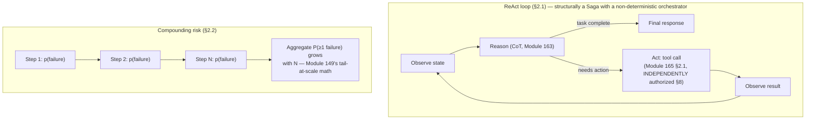

# Module 166 — AI Agents: Planning Loops, Tool Orchestration, Multi-Agent Systems & Autonomy Risk

> Domain: AI Systems (merged 44-50) | Level: Beginner → Expert | Prerequisite: [[../44-AI-Systems/04-LLM-Integration-ProductionAPIPatterns-Streaming-FunctionCalling-Caching-Resilience]] A10 (this module builds directly on that module's delivery-layer disciplines — authorization, cost governance, provider resilience — rather than re-deriving them, focusing specifically on the new risk multi-step, autonomous reasoning introduces on top of them), [[../36-Saga/01-SagaFundamentals-OrchestrationVsChoreography-CompensatingTransactions]] (an agent's multi-step tool-use loop is structurally a saga with a non-deterministic, model-generated orchestrator, inheriting that domain's compensating-transaction and idempotency requirements)

>
> **Scope note:** Fifth of seven modules scoping the merged `44-AI-Systems` domain. This module covers the ReAct-style plan-act-observe loop, multi-step tool orchestration and its compounding failure surface, multi-agent architectures (orchestrator-worker and peer-to-peer), and autonomy-risk governance — deliberately assuming Module 165's authorization/cost/provider-resilience infrastructure as already-solved, load-bearing groundwork.

---

## 1. Fundamentals

**What:** An **AI agent**, in the engineering sense, is an LLM-driven system that operates in a **loop** — observing its current state, reasoning about what action to take next (Module 163's chain-of-thought technique applied iteratively), invoking a tool (Module 165's function calling), observing the result, and repeating until it determines the task is complete or it hits a bound — rather than a single-turn request-response interaction. This pattern, commonly called **ReAct** (Reason + Act), is the dominant architecture underlying nearly every production "agent" system: **plan → act → observe → re-plan**, iterated.

**Why:** Every mechanism this domain has established up through Module 165 (grounding, prompting, delivery, authorization) assumed a bounded, predictable interaction shape — one query, one (possibly multi-round-trip) response. An agent's defining, genuinely new property is that **the *number* and *sequence* of steps is itself determined by the model's own, non-deterministic reasoning at runtime**, not by the calling application's own code — meaning every risk this domain has established (hallucination, cost compounding, authorization scope, injection) must now be reasoned about not for a single, bounded interaction, but for an **unbounded, self-directed sequence of interactions** whose length and shape the system's own designers cannot fully predict in advance.

**When:** Agentic architectures are warranted specifically for tasks whose solution path isn't known in advance and must be discovered through iterative investigation (multi-step research, complex troubleshooting, tasks requiring dynamically-determined tool sequences) — not for tasks with a known, fixed workflow, which are better served by Module 165's simpler, bounded function-calling pattern or a conventional, deterministically-orchestrated workflow (this course's Module 123 Saga pattern) with LLM calls at specific, well-defined steps.

**How (30,000-ft view):**
```
Task ──► [LOOP, bounded by max_steps]:
              │
    1. Observe current state (prior tool results, conversation history)
              │
    2. Reason: what should happen next? (may conclude "task complete")
              │
    3. Act: invoke a tool (Module 165's function-calling, independently
       authorized per Module 165 §8 — the loop does NOT bypass this)
              │
    4. Observe the tool's result
              │
    └──────────────────────────────► back to step 2, OR exit if complete
                                        or max_steps/budget exceeded
                                        (Module 165 §2.5's cost governance)
```

---

## 2. Deep Dive

### 2.1 The plan-act-observe loop and why it's structurally a saga

An agent's step sequence is functionally identical in shape to Module 123's Saga pattern: a sequence of steps, each potentially affecting external state, where the overall "transaction" (the user's task) succeeds or fails based on the cumulative outcome of every step — **with one critical, genuinely new difference: the saga's orchestration logic (which step comes next) is not deterministic, pre-defined application code, but the model's own, non-deterministic (Module 162 §2.4) reasoning at each iteration.** This means every discipline Module 123 established for sagas — idempotent steps (a step re-executed due to a retry must not double-apply its effect), compensating transactions (a partially-completed multi-step task that fails partway through needs an explicit undo path, not merely abandonment), and saga-liveness monitoring (Module 123 §14's stalled-saga detection) — applies directly to agent loops, but must now be designed against an orchestrator whose specific step sequence cannot be known or tested exhaustively in advance the way a fixed, code-defined saga's step sequence can be.

### 2.2 Compounding failure surface — why an N-step agent inherits every single-step risk N times

Module 165 §2.5 established function calling's multiplicative cost structure — this module extends that finding to *every* risk category this domain has established, not merely cost: an N-step agent loop inherits hallucination risk (Module 162 §2.6), injection risk (Module 163 §2.5-§2.6), and authorization risk (Module 165 §8) **independently, at each of its N steps**, meaning the *aggregate* probability of at least one step exhibiting some failure mode grows with step count — directly the same "tail-at-scale" mathematics Module 149 established for distributed-system fan-out (P(≥1 failure) = 1-(1-p)^n), now applied to an agent's own sequential step count rather than a parallel fan-out width. **A single step with a small, individually-acceptable hallucination or injection-vulnerability rate compounds into a meaningfully higher aggregate risk across a long agent chain** — directly motivating both Module 165 §2.5's step-count monitoring and this module's own bounded, explicitly-limited step budgets as a first-class safety control, not merely a cost control.

### 2.3 Multi-agent architectures — orchestrator-worker versus peer-to-peer

**Orchestrator-worker** architectures have one agent (often with a simpler, more constrained role — planning and delegation) directing a set of specialized worker agents, each responsible for a narrower sub-task — directly analogous to Module 123's saga-orchestration pattern, inheriting that pattern's advantage (centralized, auditable control flow) over choreography's advantage (independent, decoupled worker evolution). **Peer-to-peer** multi-agent architectures have agents communicate and negotiate directly with each other with no central coordinator — offering more flexibility for genuinely emergent, unplanned collaboration patterns, at the cost of the same auditability and control-flow-traceability loss Module 123 §15 identified for choreography relative to orchestration, now compounded by the fact that *each* peer agent's own individual behavior is separately non-deterministic. **For this course's Elite FinTech context, orchestrator-worker is the strongly preferred default** for exactly the reason Module 123 §15 originally established for sagas: regulated financial workflows need centralized, auditable control flow far more than they need the flexibility multi-agent choreography provides.

### 2.4 Memory and context management across a long-running agent session

An agent's "memory" — what it retains and can reference across steps and, for longer-running or multi-session agents, across separate interactions entirely — faces Module 162 §2.1/§2.5's context-window and "lost in the middle" constraints directly: a long agent loop's accumulated history (every prior step's reasoning, tool call, and result) can itself exceed the context window or suffer recall degradation for information buried in the middle of a long history. Production agent architectures address this via **explicit context management** — summarizing or truncating older steps' history rather than retaining full verbatim transcripts indefinitely, or using an external, structured memory store (directly reusing Module 164's RAG/retrieval mechanics — an agent's own accumulated history becomes a retrievable corpus rather than a monolithic, ever-growing prompt) — a design decision carrying the identical chunking-and-retrieval-quality risk Module 164 §2.1/§4 established, now applied to an agent's own operational history rather than an external document corpus.

### 2.5 Autonomy risk and the human-in-the-loop calibration question

**Autonomy risk** is this module's own, higher-order version of Module 165 §8's function-authorization concern: not merely "is this specific action authorized," but "how much of the overall task's decision-making is the agent permitted to determine on its own, without human review, before delivering a final result." Module 165 §15's risk-tiered, magnitude-calibrated human-confirmation framework extends directly: **a task's appropriate autonomy level should be calibrated to the compounded risk (§2.2) of its actual step count and the consequentiality of its constituent actions, not fixed uniformly across every agentic task the platform supports** — a research-and-summarize agent operating over read-only, non-consequential data warrants far less human-in-the-loop friction than a multi-step agent capable of triggering financial transactions, even though both are architecturally "agents" in the same sense this module's §1 defines.

---

## 3. Visual Architecture



```
Orchestrator-Worker (§2.3, RECOMMENDED for this course's FinTech context)
  vs.
Peer-to-Peer (more flexible, less auditable — Module 123 §15's identical trade-off, restated)
```

---

## 4. Production Example

**Problem:** A brokerage's internal research-assistant agent — designed to investigate a flagged trading pattern by querying multiple internal systems (trade history, client communications, market-data context) and producing a summary report for a compliance analyst — was configured with a generous `max_steps` budget of 25, on the reasoning that complex investigations genuinely required many steps and a tight limit would produce incomplete, unhelpful reports.

**Architecture:** A ReAct-style loop with five available tools (query trade history, query client communications, query market data, calculate statistics, draft summary), each independently authorized per Module 165 §8, with the loop terminating either when the model determined the task complete or at the 25-step ceiling.

**Implementation / What happened:** For a specific class of ambiguous, edge-case trading pattern, the agent entered a genuine but non-obvious reasoning loop: at each step, its own reasoning concluded it needed "slightly more context" before finalizing its assessment, repeatedly querying overlapping, only-marginally-different slices of the same underlying trade history — never repeating an *identical* tool call (which would have tripped Module 165's exact repeated-call detection) but never converging toward a final answer either, consuming the full 25-step budget and producing, at the ceiling, an incomplete report with no clear indication to the reviewing compliance analyst that the underlying investigation had genuinely stalled rather than reached a considered, complete conclusion within its budget.

**Trade-offs:** The generous step budget was a reasonable response to the genuine variability of investigation complexity — a tighter budget would have cut off legitimately complex, multi-faceted investigations prematurely just as often as it would have caught this specific stalling pattern, meaning the fix couldn't simply be "use a smaller number."

**Lessons learned:** **A step-count ceiling alone (Module 165 §2.5's cost-governance control) bounds cost and prevents unbounded runaway loops, but does not by itself distinguish "genuinely converging toward completion" from "unproductively churning without progress"** — the two consume budget identically and are indistinguishable from step count alone. The fix required an explicit **progress-detection signal** independent of step count: tracking whether each successive step's tool calls target genuinely new information (not merely non-identical, per Module 165's narrower repeated-call check) or substantively overlap with already-queried context, flagging a stalled — as opposed to merely lengthy — investigation for explicit human escalation rather than silently exhausting its budget and delivering an incomplete result presented with the same confidence as a genuinely complete one.

---

## 5. Best Practices

- **Set `max_steps` as a genuine safety ceiling, never the primary mechanism for detecting a stalled or unproductive loop** (§4, §2.2) — pair it with an explicit progress-detection signal distinguishing genuine convergence from unproductive churning.
- **Treat every agent step's authorization exactly as Module 165 §8 established for a single function call** — an agent loop must never be granted a broader, session-level authorization bypassing per-step, independent verification.
- **Calibrate autonomy/human-in-the-loop requirements to the compounded risk of the specific task's actual step count and action consequentiality** (§2.5), never uniformly across every agentic capability the platform supports.
- **Explicitly manage agent memory/context** (summarization, external retrieval, per §2.4) for any agent whose interaction can plausibly exceed a manageable context length — never assume unbounded verbatim history retention is safe or reliable.
- **Prefer orchestrator-worker over peer-to-peer multi-agent architectures for regulated, auditability-sensitive workflows** (§2.3) — the same centralized-control-flow preference this course established for sagas generally.

---

## 6. Anti-patterns

- **Relying on `max_steps` alone as the sole safeguard against a stalled or unproductively-looping agent** — §4's exact incident; a step ceiling bounds cost, not quality or productive progress.
- **Delivering an agent's result at its step-budget ceiling with the same presentation confidence as a genuinely converged, complete result** — silently masks the distinction between "finished" and "ran out of budget," a distinction the downstream consumer critically needs to know.
- **Session-level or task-level authorization bypassing Module 165 §8's per-step, independent verification** — reintroduces exactly the "trust the model's own generated intent" anti-pattern that module established as unacceptable, now at agent-loop scale.
- **Peer-to-peer multi-agent architectures for regulated, compliance-sensitive workflows** where centralized auditability is a genuine, non-negotiable requirement — trades auditability for flexibility the use case doesn't need.
- **Unbounded, unmanaged agent context/memory growth** with no summarization or external-retrieval strategy — reproduces Module 162 §2.5's "lost in the middle" risk at agent-history scale, silently degrading the agent's own ability to recall its own earlier findings.

---

## 7. Performance Engineering

An N-step agent loop's total latency and cost is the *sum* of N individual step latencies/costs (each itself potentially a Module 165 §2.1 two-round-trip function call) — directly compounding Module 162's per-call latency budget by the loop's actual, runtime-determined step count, which — unlike a conventional, fixed-shape API call — is not knowable in advance, making agent-based features' latency/cost distribution inherently long-tailed and harder to provide a tight SLA for than a single-turn interaction. Production agent systems should track and expose step-count distribution (p50/p95/p99, directly analogous to Module 101's latency-percentile discipline) as a first-class metric, since a small fraction of interactions consuming disproportionately many steps (exactly §4's incident pattern) can dominate aggregate cost even when the median interaction is well-behaved and efficient.

---

## 8. Security

Every risk this domain has established compounds across an agent loop's steps (§2.2), making this module's security posture the union, not merely the sum, of every prior module's individual security finding, now applied iteratively: prompt injection (Module 163 §2.5-§2.6) becomes more dangerous specifically because a successful injection at any single step can redirect the *entire remainder* of the loop's subsequent reasoning and tool calls, not merely that one step's own output — an agent's iterative, self-referential reasoning process means a single successful injection has a substantially larger blast radius than the equivalent injection against a single-turn interaction. **This directly motivates treating each step's tool-call authorization (Module 165 §8) as the primary, load-bearing defense against this amplified risk** — since even a fully-redirected reasoning process cannot cause harm beyond what its available tools' own least-privilege authorization scope permits, the same "authorization is the backstop, since prompting/injection defenses alone cannot be complete" principle Module 163 §8 established, now doing even more load-bearing work given the amplified injection-blast-radius this module's iterative architecture introduces.

---

## 9. Scalability

Multi-agent orchestrator-worker architectures (§2.3) scale horizontally by parallelizing genuinely independent sub-tasks across worker agents — directly analogous to Module 123's parallel-saga-branch pattern (Module 124's capstone) — while remaining subject to the identical join/synchronization discipline that module established for reconciling parallel branches' results. Agent memory/context-management strategy (§2.4) directly determines whether a long-running or multi-session agent's operational cost and latency scale linearly with accumulated history (unmanaged, verbatim retention) or remain bounded (summarization/external-retrieval-based management) — a genuine, first-class scalability design decision for any agent expected to operate across sessions longer than a single, short interaction.

---

## 10. Interview Questions

### Basic (10)

**B1. What is the ReAct pattern?**
*Ideal Answer:* Reason + Act — an iterative loop where the model observes its current state, reasons about the next action, invokes a tool, observes the result, and repeats until the task is complete or a bound is reached.
*Why correct:* Matches §1.
*Common mistakes:* Describing an agent as merely "an LLM with tools" without the specific, iterative loop structure that distinguishes it from Module 165's single (or two-round-trip) function calling.
*Follow-up:* What genuinely new property does an agent's step count/sequence have that a single function call doesn't?

**B2. Why is an agent loop described as structurally a saga?**
*Ideal Answer:* Both are sequences of steps, each potentially affecting external state, where overall success depends on the cumulative outcome — inheriting saga's idempotency and compensating-transaction requirements, with the genuinely new complication that the agent's orchestration logic is the model's own non-deterministic reasoning rather than fixed application code.
*Why correct:* Matches §2.1.
*Common mistakes:* Missing the specific, genuinely new complication (non-deterministic orchestration) that distinguishes an agent loop from a conventional, code-defined saga.
*Follow-up:* Name one saga discipline (Module 123) that applies directly to agent loops.

**B3. Why does a single step's small hallucination risk become more consequential across an N-step agent loop?**
*Ideal Answer:* The aggregate probability of at least one step exhibiting a failure grows with step count, following the same tail-at-scale mathematics Module 149 established for parallel fan-out, now applied to sequential steps.
*Why correct:* Matches §2.2.
*Common mistakes:* Assuming per-step risk doesn't compound, treating each step's risk as independent of the loop's overall length.
*Follow-up:* What Module 149 formula captures this compounding relationship?

**B4. What is the difference between orchestrator-worker and peer-to-peer multi-agent architectures?**
*Ideal Answer:* Orchestrator-worker has one agent directing specialized workers with centralized control flow; peer-to-peer has agents communicating directly with no central coordinator, offering more flexibility at the cost of auditability.
*Why correct:* Matches §2.3.
*Common mistakes:* Assuming the two architectures are functionally interchangeable rather than carrying genuinely different auditability/control-flow trade-offs.
*Follow-up:* Which is recommended for this course's regulated financial-services context, and why?

**B5. Why can't `max_steps` alone reliably detect an unproductively-looping agent?**
*Ideal Answer:* A step-count ceiling bounds cost and prevents unbounded runaway execution, but a genuinely stalled, unproductively-churning agent and a genuinely complex, legitimately-many-step investigation both consume budget identically — step count alone can't distinguish the two.
*Why correct:* Matches §4/§5.
*Common mistakes:* Assuming a tighter step-count limit alone solves the stalling problem, rather than recognizing the need for a distinct, progress-based detection signal.
*Follow-up:* What additional signal, beyond step count, would distinguish genuine progress from unproductive churning?

**B6. What is autonomy risk?**
*Ideal Answer:* How much of a task's overall decision-making an agent is permitted to determine on its own, without human review, before delivering a result — a higher-order concern beyond individual action authorization.
*Why correct:* Matches §2.5.
*Common mistakes:* Conflating autonomy risk with individual function-call authorization (Module 165 §8) rather than recognizing it as a distinct, task-level calibration question.
*Follow-up:* What factor should determine a task's appropriate autonomy/human-in-the-loop calibration?

**B7. Why does prompt injection carry a larger blast radius in an agent loop than in a single-turn interaction?**
*Ideal Answer:* A successful injection at any single step can redirect the entire remainder of the loop's subsequent reasoning and tool calls, not merely that one step's own output.
*Why correct:* Matches §8.
*Common mistakes:* Assuming injection risk is identical regardless of whether the interaction is single-turn or an iterative agent loop.
*Follow-up:* What defense mechanism does this amplified risk make even more load-bearing than in a single-turn context?

**B8. Why does an agent's accumulated step history face the same risk as Module 162's "lost in the middle" finding?**
*Ideal Answer:* A long agent loop's accumulated history can itself exceed the context window or suffer recall degradation for information buried in the middle of a long operational history, exactly as Module 162 established for any long context.
*Why correct:* Matches §2.4.
*Common mistakes:* Assuming agent memory is a fundamentally different mechanism unrelated to Module 162's context-window findings, rather than recognizing it as the identical constraint applied to accumulated operational history.
*Follow-up:* Name two production strategies for managing this risk.

**B9. In §4's incident, did the agent violate its authorization scope at any step?**
*Ideal Answer:* No — every individual tool call was independently, correctly authorized per Module 165 §8; the defect was the loop's inability to distinguish productive investigation from unproductive churning, not an authorization failure.
*Why correct:* Matches §4's precise root-cause framing.
*Common mistakes:* Assuming the incident represents a security/authorization failure rather than correctly identifying it as a progress-detection gap.
*Follow-up:* What's the risk of presenting a step-budget-exhausted result with the same confidence as a genuinely complete one?

**B10. Why is orchestrator-worker recommended over peer-to-peer for regulated financial workflows specifically?**
*Ideal Answer:* Regulated workflows need centralized, auditable control flow more than they need the flexibility peer-to-peer coordination provides — the identical trade-off Module 123 §15 established for saga orchestration over choreography.
*Why correct:* Matches §2.3/§9.
*Common mistakes:* Assuming the choice is purely a technical/performance decision unrelated to auditability/compliance requirements.
*Follow-up:* What specific auditability property does centralized orchestration provide that peer-to-peer coordination doesn't?

### Intermediate (10)

**I1. Design the progress-detection signal that would have caught §4's incident, distinct from step-count monitoring.**
*Ideal Answer:* Track, across consecutive steps, whether each new tool call's target information (the specific data queried, not merely the function name/arguments literal identity) substantively overlaps with already-queried context from prior steps — computing an overlap or novelty score (potentially via the same embedding-similarity mechanics Module 164 established) and flagging a run of low-novelty, high-overlap steps as a stalling signal distinct from genuine, novel-information-seeking investigation, triggering escalation to human review before the step budget is exhausted rather than only at the ceiling.
*Why correct:* Matches §4/§5's precise fix, correctly using an embedding-based overlap measure (reusing Module 164's mechanics) rather than merely a literal repeated-call check (Module 165's narrower mechanism).
*Common mistakes:* Proposing only Module 165's exact repeated-call detection, which §4's incident specifically demonstrates is insufficient (the agent never repeated an identical call, only substantively overlapping ones).
*Follow-up:* How would you tune the overlap threshold to avoid false-positive escalation for genuinely complex, legitimately-overlapping-context investigations?

**I2. Design the result-presentation change for an agent hitting its step-budget ceiling versus genuinely converging, per §4's finding.**
*Ideal Answer:* Explicitly, visibly distinguish the two outcomes in the delivered result — a genuinely converged result presented as a complete finding; a budget-exhausted result explicitly flagged as incomplete/inconclusive, with a summary of what was investigated and what remains uncertain, routed for mandatory human follow-up rather than presented with the same confidence and finality as a genuinely complete investigation.
*Why correct:* Matches §4's precise lesson about presentation confidence needing to reflect actual completion status.
*Common mistakes:* Focusing only on preventing the stall itself without addressing the equally important downstream question of how an unavoidably-incomplete result should be presented differently from a complete one.
*Follow-up:* What compliance/audit risk does silently presenting a budget-exhausted result as if complete introduce specifically in this course's financial-services context?

**I3. Compare the idempotency requirement for an agent's tool-call steps against Module 123's saga-step idempotency requirement.**
*Ideal Answer:* Structurally identical — a tool call re-executed (whether due to a genuine retry after a transient failure, or the model's own reasoning independently re-requesting a similar action) must not double-apply its effect if that effect is consequential (e.g., a query is naturally idempotent by nature; an action like "flag this trade for review" must be implemented idempotently, e.g., checking whether it's already flagged before applying the flag again), exactly the discipline Module 123 established for saga steps generally, now required for every consequential tool in an agent's registry.
*Why correct:* Correctly identifies the direct structural parity with Module 123's established idempotency requirement.
*Common mistakes:* Assuming idempotency is less critical for agent tool calls than for conventional saga steps, missing that the requirement transfers identically.
*Follow-up:* Design the idempotency check for a "flag this trade for review" tool specifically.

**I4. Design a compensating-action strategy for an agent task that partially completes (some consequential steps executed) before failing or being manually terminated.**
*Ideal Answer:* Directly reusing Module 123's compensating-transaction pattern: every consequential tool registered in the agent's function registry (Module 165 A7) should have a corresponding, explicit compensating action (or be explicitly documented as non-reversible, requiring the human-in-the-loop confirmation Module 165 §15/this module §2.5 established for exactly such actions) — on task failure/termination, the orchestrating system walks back through the executed step history and invokes the compensating action for each consequential step that was completed, exactly the semantic (not literal) compensation Module 123 §1 established.
*Why correct:* Correctly and directly reuses Module 123's compensating-transaction framework rather than proposing a novel, agent-specific mechanism.
*Common mistakes:* Assuming agent task failures don't need explicit compensation the way a conventional saga does, missing that a partially-completed agent task carries the identical partial-effect risk.
*Follow-up:* What tool-registration requirement (per Module 165 A7's governance pattern) would ensure every newly-added consequential tool has its compensating action defined before going live?

**I5. Explain why the injection-blast-radius amplification (§8) specifically strengthens the case for Module 165 §8's authorization-as-backstop principle, rather than weakening it.**
*Ideal Answer:* Because prompt injection has no complete structural fix (Module 162/163 §8) and an agent's iterative nature amplifies a single successful injection's consequence across the entire remaining loop, the *only* control this domain has established that remains effective regardless of how successfully an injection redirects the model's reasoning is independent, per-step, least-privilege authorization (Module 165 §8) — every other defense (input filtering, structural role separation) operates at the level of preventing or detecting the injection itself, which the agent's iterative amplification makes harder to fully rely on, making the authorization backstop's own robustness (it doesn't depend on the injection ever being detected or prevented) even more load-bearing than in a single-turn context.
*Why correct:* Correctly identifies why authorization's defense-in-depth value specifically increases (not merely remains constant) as injection's blast radius grows, a precise, non-obvious strengthening of the prior modules' finding.
*Common mistakes:* Treating this module's injection-amplification finding as simply "the same risk, more of it," missing the specific reasoning for why it disproportionately elevates the relative importance of the authorization layer over the other defense-in-depth layers.
*Follow-up:* Does this reasoning suggest authorization scoping should be even MORE narrowly, granularly defined for agent-accessible tools than for single-turn function-calling tools? Why?

**I6. Design the context-management strategy for a multi-session customer-service agent that must recall relevant details from a client's prior interactions weeks later.**
*Ideal Answer:* Rather than retaining full verbatim transcripts of every prior session (which would eventually exceed any context window and suffer §2.4's recall-degradation risk even before hitting the hard limit), summarize each completed session into a structured, retrievable record (directly reusing Module 164's RAG mechanics — the agent's own interaction history becomes an indexed, retrievable corpus), retrieving only the specific, relevant prior-session summaries for a new interaction rather than the full historical transcript — inheriting Module 164's own chunking-and-retrieval-quality discipline (structure-aware summarization preserving load-bearing context, per Module 164 §2.1/§4) applied to the agent's own operational memory.
*Why correct:* Correctly applies Module 164's RAG mechanics to this module's memory-management challenge, demonstrating direct, appropriate reuse rather than inventing a parallel, redundant mechanism.
*Common mistakes:* Proposing unbounded verbatim retention "to be safe," missing both the context-window/recall-degradation risk and the more scalable, already-established RAG-based alternative.
*Follow-up:* What Module 164 §4-style risk (chunking-severed context) could this session-summarization approach introduce if not carefully designed?

**I7. A multi-agent orchestrator-worker system has one worker agent fail partway through its sub-task. Design the orchestrator's handling of this failure, per Module 123's saga-recovery discipline.**
*Ideal Answer:* The orchestrator should treat the failed worker's sub-task the same way a saga orchestrator treats a failed saga step (Module 123 §1): either retry the sub-task (if the failure is plausibly transient and the sub-task is idempotent, per I3), route to a compensating action for any partial effects the failed worker already produced (per I4), or escalate to human review if neither automated recovery path is appropriate — never silently proceeding to the next planned step as if the failed worker's sub-task had succeeded, which would produce a downstream result built on a false assumption of completeness.
*Why correct:* Correctly and directly reuses Module 123's saga-failure-recovery discipline (retry/compensate/escalate) rather than proposing an ad hoc, agent-specific recovery mechanism.
*Common mistakes:* Assuming worker-agent failures are somehow fundamentally different from conventional saga-step failures, missing the direct structural parity this course has now established repeatedly for agent architectures generally.
*Follow-up:* How would the orchestrator distinguish a "plausibly transient, safe to retry" worker failure from one requiring compensation or escalation?

**I8. Why does this module describe an agent's autonomy-risk calibration (§2.5) as "higher-order" relative to Module 165 §8's per-action authorization?**
*Ideal Answer:* Module 165 §8's authorization addresses whether a *specific, individual* action is permitted; this module's autonomy-risk calibration addresses a broader, task-level question — how much of the *overall sequence and outcome* of a multi-step task the agent is permitted to determine and deliver without human review, a question that remains meaningful even when every individual constituent action is, in isolation, fully authorized (per-step authorization doesn't guarantee the aggregate, compounded task outcome is one a human would have approved if reviewing the full sequence holistically).
*Why correct:* Correctly distinguishes the two, related-but-distinct governance layers (per-action authorization versus task-level autonomy calibration), matching §2.5's precise framing.
*Common mistakes:* Conflating the two, assuming that if every individual step is authorized, the overall task's autonomy level requires no separate consideration.
*Follow-up:* Design a scenario where every individual step in an agent's task is fully authorized, yet the aggregate task outcome would still warrant human review before delivery.

**I9. Design the step-count percentile monitoring (§7) that would help a platform team understand and manage an agentic feature's true cost/latency distribution.**
*Ideal Answer:* Track step-count and total-cost distributions per agentic feature/use case, reporting p50/p95/p99 (Module 101's latency-percentile discipline applied to agent step count and cost specifically) rather than only an average — since, per §4's incident and §7's finding, a small fraction of interactions consuming disproportionately many steps can dominate aggregate cost while remaining invisible in an average-based metric, requiring the same percentile-based visibility this course established for backend latency monitoring generally.
*Why correct:* Correctly applies Module 101's percentile-monitoring discipline to this module's own, genuinely new metric (agent step count), matching this course's now-standard "average metrics hide tail risk" finding.
*Common mistakes:* Proposing only average step-count/cost monitoring, missing that this specific metric's distribution is exactly the kind of long-tailed distribution where averages are most misleading.
*Follow-up:* What specific action should a rising p99 step-count trend (even with a stable p50) trigger for the platform team?

**I10. Synthesize why this module's §4 incident is a genuinely new instance of this course's recurring findings, rather than a restatement of a prior module's incident in agent-specific clothing.**
*Ideal Answer:* Genuinely new: while this module's §4 incident shares this course's general "a declared safety mechanism's actual scope is narrower than assumed" shape (the step-count ceiling was assumed to bound risk comprehensively, but only bounds cost, not quality/progress), the *specific* mechanism failing — an iterative, self-referential reasoning loop's inability to self-detect its own unproductive churning — has no direct precedent in this course's prior 165 modules, none of which examined a system whose own control-flow decisions are generated by the same non-deterministic process the system is trying to bound safely; this is a structurally new risk category (a safety mechanism reasoning about a system whose own decision-making process the mechanism cannot fully predict or verify in advance), not merely a familiar finding restated with new terminology.
*Why correct:* Correctly identifies both the genuine, shared underlying theme with prior modules AND the specific, non-precedented new element (a safety mechanism governing a self-referential, non-deterministic decision-making loop) that makes this incident genuinely novel rather than a restatement.
*Common mistakes:* Either dismissing the incident as "just another instance of the same old finding" or failing to recognize the genuine thematic continuity with this course's broader arc, missing the precise "same theme, genuinely new specific mechanism" answer this question requires.
*Follow-up:* Given this genuinely new risk category (safety mechanisms governing self-referential, non-deterministic control flow), does Module 167's MCP coverage introduce any comparably novel risk category, or does it operate entirely within categories this domain has already established?

### Advanced (10)

**A1. Design the complete, corrected research-assistant agent architecture for §4's incident, synthesizing every mechanism this module establishes.**
*Ideal Answer:* Progress-detection overlap scoring (I1) flagging low-novelty step runs for early escalation, well before the `max_steps` ceiling; explicit, visible distinction in the delivered result between "converged" and "budget-exhausted/incomplete" outcomes (I2); idempotent, compensable tool design for every consequential action in the agent's registry (I3/I4); orchestrator-worker structure if the investigation genuinely decomposes into parallelizable sub-investigations (§2.3/§9); autonomy-risk calibration (§2.5) requiring mandatory human review for any investigation exceeding a defined step/novelty-overlap threshold, regardless of whether it technically "completed" within budget; step-count/cost percentile monitoring (I9) at the platform level to catch this incident class trending across the broader agentic-feature population, not merely this one instance.
*Why correct:* Synthesizes every element this module establishes into one complete, governed architecture directly closing §4's root cause and every adjacent risk this module identifies.
*Common mistakes:* Addressing only the immediate progress-detection fix without the accompanying result-presentation, compensation, and platform-level monitoring layers this module also establishes as necessary.
*Follow-up:* Which element would you prioritize first if this fix had to ship incrementally rather than all at once?

**A2. Critique: "Since every individual tool call in an agent loop is independently authorized per Module 165 §8, a multi-step agent task cannot cause any harm beyond what a single, equivalent function call could cause."**
*Ideal Answer:* Overstated — per-step authorization bounds what any *single* action can do, but an agent's compounded sequence of otherwise-individually-authorized actions can produce an aggregate effect no single action alone could (e.g., a sequence of several small, individually-authorized-and-innocuous data queries that, combined, reconstruct a picture of information the platform's access-control design never intended any single interaction to assemble — a genuinely emergent, composition-level risk directly analogous to Module 152's SoD-composition-risk finding, "no single role has this permission combination, but the union does," now recurring at the agent-action-sequence layer instead of the role-composition layer).
*Why correct:* Correctly identifies a genuine, non-obvious residual risk (emergent, composition-level harm from an aggregate sequence of individually-authorized actions) and precisely connects it to Module 152's SoD-composition finding as the closest structural parallel.
*Common mistakes:* Accepting the claim because per-step authorization genuinely is the correct, necessary primary control, without recognizing this specific, higher-order composition risk it doesn't fully close on its own.
*Follow-up:* Design a monitoring or governance mechanism specifically detecting this emergent, sequence-level composition risk, distinct from per-step authorization.

**A3. Design an empirical evaluation methodology for calibrating a specific agentic task's appropriate `max_steps` and autonomy-level defaults, per this course's now-standard empirical-verification discipline.**
*Ideal Answer:* Run the agent against a representative test set of realistic task instances, recording actual step-count distribution for genuinely successful, converged completions specifically (excluding budget-exhausted, non-converged runs from this baseline calculation); set `max_steps` at a percentile (e.g., p95 or p99) of the genuinely-converged distribution, providing headroom for legitimate complexity while still bounding the worst-case cost exposure; separately, measure the actual, human-reviewed correctness rate of fully-autonomous (no human-in-the-loop) task completions across this same test set, using that measured correctness rate — not an assumed or hoped-for one — to inform whether full autonomy is empirically justified for this specific task type or whether mandatory human review should be the default.
*Why correct:* Correctly designs an empirical, data-driven calibration methodology for both `max_steps` and autonomy level, directly reusing this course's now-standard empirical-verification-before-adoption discipline (Module 164 A3, Module 163 A3).
*Common mistakes:* Proposing an arbitrarily-chosen `max_steps` value or autonomy default with no empirical grounding in this specific task type's actual, measured step-count and correctness distributions.
*Follow-up:* How would you re-run this calibration periodically as the underlying model version or tool registry evolves, avoiding this course's now-repeated "calibration silently drifts stale" finding?

**A4. A peer-to-peer multi-agent system (chosen for a genuinely exploratory, research-oriented internal tool, not a regulated client-facing workflow) produces a result the team cannot fully trace back to which specific agent's reasoning drove the final outcome. Diagnose whether this is an acceptable trade-off given the use case, or a genuine architectural defect.**
*Ideal Answer:* Acceptable, contingent on the use case's actual stakes — per §2.3/§9's risk-tiered framing, peer-to-peer's reduced auditability is a known, deliberate trade-off explicitly justified for exploratory, lower-stakes internal tooling, exactly the scenario this question describes; it would be a genuine defect specifically if applied to a regulated, compliance-sensitive, or client-facing workflow, where Module 123 §15's centralized-auditability requirement is non-negotiable — the architecture choice itself (peer-to-peer) isn't inherently defective, its correctness is entirely a function of whether it's matched to a use case whose actual stakes tolerate the trade-off.
*Why correct:* Correctly applies risk-tiered reasoning to conclude the trade-off's acceptability is genuinely use-case-dependent, rather than declaring peer-to-peer architectures universally acceptable or universally unacceptable.
*Common mistakes:* Declaring the reduced traceability an unconditional defect regardless of use case, missing that this course has established repeatedly that architectural trade-offs are correctly evaluated against actual, specific stakes, not judged in the abstract.
*Follow-up:* At what specific point would you require this exploratory tool to be re-architected toward orchestrator-worker, if its usage or stakes evolved over time?

**A5. Design a red-team exercise specifically targeting an agent's compounded-injection-blast-radius risk (§8), distinct from Module 163's single-turn injection red-teaming.**
*Ideal Answer:* Rather than testing a single injected input against a single-turn response (Module 163's approach), inject adversarial content at a specific, *intermediate* step of a multi-step agent task (e.g., within a tool's returned result at step 3 of a planned 6-step investigation) and measure whether the injection successfully redirects the *remaining* steps' reasoning and tool selection — specifically testing whether the agent's later steps inherit and act on the injected redirection, distinct from testing whether the injection succeeds at the single step where it was introduced; measure this across multiple injection-insertion points (early, middle, late in a task) to characterize how blast radius varies by injection timing.
*Why correct:* Correctly designs a red-team methodology targeting the specific, genuinely new risk dimension this module's iterative architecture introduces (downstream-step redirection), distinct from and extending Module 163's single-turn-focused red-teaming.
*Common mistakes:* Proposing only Module 163's existing single-turn injection tests applied to an agent's first step, missing the specific, new "does the redirection propagate to subsequent steps" dimension this module's architecture requires testing.
*Follow-up:* Would you expect injection blast radius to be worse for an injection introduced early versus late in a multi-step task? Justify your prediction, then design the experiment that would empirically verify it.

**A6. Explain why Module 123's semantic (not literal) compensation principle is even more important for agent-executed compensating actions than for conventional, code-defined saga steps.**
*Ideal Answer:* A conventional saga's steps and their exact effects are fully known and fixed at design time, so a corresponding compensating action can be precisely, deterministically designed against that known effect. An agent's specific action within a consequential tool call (e.g., exactly which trade was flagged, with what specific reasoning/parameters) is determined at runtime by the model's own non-deterministic reasoning — meaning the compensating action must be designed to correctly reverse *whatever specific, runtime-determined effect actually occurred*, not a single, fully-predictable effect a designer could exhaustively enumerate in advance, making semantic (business-meaning-preserving) compensation logic — rather than a literal, effect-specific undo script — the only tractable approach for agent-executed consequential actions specifically.
*Why correct:* Correctly identifies why the non-deterministic, runtime-determined nature of agent actions specifically strengthens (not merely restates) Module 123's original semantic-compensation principle.
*Common mistakes:* Restating Module 123's semantic-compensation principle without the specific reasoning for why it's MORE necessary, not merely equally necessary, in this module's agent context.
*Follow-up:* Design the semantic compensating action for a "flag this trade for review, with model-determined reasoning text" tool call, given the specific reasoning text can vary arbitrarily at runtime.

**A7. Design a governance process for approving a new agentic capability (a new agent type, or a significant expansion of an existing agent's tool registry) before production deployment.**
*Ideal Answer:* Require, before approval: (1) the empirical `max_steps`/autonomy calibration (A3); (2) idempotency and compensation-action verification for every newly-added consequential tool (I3/I4/A6); (3) the extended, multi-step-specific red-team exercise (A5) rather than only single-turn injection testing; (4) an explicit autonomy-risk classification (§2.5) determining the default human-in-the-loop requirement; (5) step-count/cost percentile monitoring (I9) instrumented before launch, not added reactively after an incident — directly reusing this course's now-standard governed-capability-registration pattern (Module 165 A7's function-registry governance) extended to the agent/multi-step-capability layer specifically.
*Why correct:* Correctly synthesizes this module's own findings into a concrete, pre-deployment governance checklist, directly extending Module 165 A7's established pattern to this module's genuinely new risk surface.
*Common mistakes:* Proposing a governance process that doesn't specifically address this module's own new findings (progress-detection calibration, compensation-action design, multi-step-specific red-teaming), merely restating Module 165's single-function governance checklist without extension.
*Follow-up:* Who should hold final approval authority for a new agentic capability specifically involving financial-transaction-triggering tools, versus a purely informational/research agent?

**A8. A financial-services firm's compliance team asks: "Can you guarantee this agent will never take an unauthorized action?" Formulate the precise, honest answer given this module's and Module 165's findings.**
*Ideal Answer:* "We can guarantee every individual action the agent takes is independently, structurally verified against the platform's existing, hardened authorization system (Module 165 §8) before execution — this guarantee does not depend on the agent's own reasoning being trustworthy or uninjected, since it's enforced entirely outside the model itself. What we cannot fully guarantee is that the agent's own *reasoning process* won't be successfully manipulated to *request* actions a human wouldn't have chosen, though every such request still passes through the identical, independent authorization check before any effect occurs — and for any action classified as consequential (§2.5), that check includes a mandatory human confirmation step specifically because we cannot make the stronger, unconditional guarantee the question asks for." This precisely distinguishes what genuinely is guaranteed (authorization enforcement) from what isn't (immunity from manipulated requests), never overstating the system's actual assurance.
*Why correct:* Provides a precise, honest, appropriately-scoped answer distinguishing structural authorization guarantees from the residual risk (A2's emergent composition risk, and manipulated-but-authorized requests, per Module 165 A2) this domain has established cannot be fully eliminated, modeling exactly the kind of precise, non-overstated communication this course has established as necessary throughout (Module 162 §17's "communicate the precise, narrower scope of any guarantee" finding).
*Common mistakes:* Either overstating the guarantee ("yes, fully guaranteed") or understating the platform's genuine, real protection ("no, we can't guarantee anything"), missing the precise, nuanced, and ultimately more useful answer this question requires.
*Follow-up:* How would you present this same distinction to a non-technical compliance stakeholder who may not be familiar with the authorization-versus-reasoning distinction this answer depends on?

**A9. Synthesize this module's compounding-risk finding (§2.2) against Module 149's tail-at-scale mathematics precisely — is the analogy exact, or does agent step-sequencing differ from Module 149's parallel fan-out in a way that changes the actual risk-compounding formula?**
*Ideal Answer:* The analogy is structurally similar (aggregate failure probability grows with count) but not mathematically identical: Module 149's formula, P(≥1 failure) = 1-(1-p)^n, assumes n *independent*, *parallel* trials — an agent's N sequential steps are not fully independent, since each step's context (and therefore its own failure probability) is influenced by the outcome of every prior step (a step following a low-quality or partially-incorrect prior step may itself have an elevated failure probability, correlated with, not independent of, the prior step's outcome) — meaning the true aggregate risk for a sequential agent chain likely compounds *faster* than the naive independent-trial formula would predict, since errors can propagate and amplify across steps rather than remaining independent, isolated events the way parallel, unrelated fan-out calls are.
*Why correct:* Correctly identifies both the genuine structural similarity and the precise, important mathematical distinction (sequential/correlated versus parallel/independent trials) that means this module's actual risk-compounding is likely worse than a naive application of Module 149's formula would suggest, demonstrating sophisticated, critical engagement rather than an uncritical, surface-level analogy.
*Common mistakes:* Applying Module 149's formula directly and uncritically without recognizing the independence assumption doesn't hold for sequential, context-dependent agent steps, understating the true compounding risk.
*Follow-up:* What empirical measurement would let a team estimate the actual, correlation-adjusted compounding rate for their specific agent architecture, rather than relying on the (likely understated) naive independent-trial formula?

**A10. As this domain's fifth module, and the point at which "single-turn/bounded" interactions (Modules 162-165) become "multi-step/autonomous" ones, state precisely what changes and what doesn't about this course's central "declared ≠ actual" theme.**
*Ideal Answer:* What doesn't change: every specific mechanism this theme has manifested through in prior modules (cache-key scoping, model-version pinning, chunking-context loss) remains fully present and relevant in an agentic system, since an agent is built from exactly these same underlying components. What changes: this module adds a genuinely new instance-*generator* — the agent's own step count and sequence, being runtime-determined by non-deterministic reasoning rather than fixed by design-time code, means a "declared ≠ actual" gap can now emerge not only from a static configuration choice (a cache key, a chunking strategy) being wrong, but from the *system's own control-flow decisions* themselves silently diverging from what a designer would have approved, had they been able to review the specific, runtime-generated sequence in advance — a fundamentally new *source* of the theme's recurrence, not merely a new *instance* of an already-familiar source.
*Why correct:* Correctly distinguishes what's preserved from prior modules versus what's genuinely, structurally new about this module's contribution to the course's central theme, providing the precise, domain-level synthesis this course's workflow requires at a module transition point.
*Common mistakes:* Describing this module as simply "another example of declared ≠ actual" without identifying the specific, novel mechanism (self-generated, non-deterministic control flow as a new source of the gap) that distinguishes this module's contribution from a mere repetition of prior modules' findings.
*Follow-up:* Given this genuinely new source (self-generated control flow), does Module 167's MCP module — a protocol standardizing tool/context exposure, not itself introducing new autonomous decision-making — represent a return to "familiar instance of an existing source," or does it introduce its own, third genuinely new source? Preview your expectation before that module confirms it.

---

## 11. Coding Exercises

### Easy — Bounded ReAct loop with explicit completion-versus-exhaustion signaling

**Problem:** Implement a basic ReAct loop with `max_steps`, explicitly distinguishing a converged result from a budget-exhausted one (per I2).

**Solution (Python):**
```python
from dataclasses import dataclass, field
from enum import Enum

class LoopOutcome(str, Enum):
    CONVERGED = "converged"
    BUDGET_EXHAUSTED = "budget_exhausted"  # I2's critical, explicit distinction

@dataclass
class AgentResult:
    outcome: LoopOutcome
    final_response: str
    step_count: int
    step_history: list[dict] = field(default_factory=list)

def run_react_loop(task: str, llm_reason_fn, tool_registry: dict, max_steps: int = 10) -> AgentResult:
    history: list[dict] = []

    for step in range(1, max_steps + 1):
        decision = llm_reason_fn(task, history)  # returns {"action": "tool_name"|"complete", ...}

        if decision["action"] == "complete":
            return AgentResult(
                outcome=LoopOutcome.CONVERGED,
                final_response=decision["final_response"],
                step_count=step,
                step_history=history,
            )

        tool_fn = tool_registry[decision["action"]]
        result = tool_fn(**decision.get("arguments", {}))
        history.append({"step": step, "action": decision["action"], "result": result})

    # Budget exhausted — NEVER silently presented as equivalent to a converged
    # result (I2's exact fix). Caller MUST handle this outcome distinctly.
    return AgentResult(
        outcome=LoopOutcome.BUDGET_EXHAUSTED,
        final_response="Investigation incomplete — step budget exhausted.",
        step_count=max_steps,
        step_history=history,
    )
```
**Time complexity:** O(max_steps) worst case. **Space complexity:** O(max_steps) for history.

**Optimized solution:** Downstream consumers of `AgentResult` should be structurally required (e.g., via a non-optional, must-be-handled enum in a strongly-typed language, or a mandatory branch check) to handle `BUDGET_EXHAUSTED` distinctly from `CONVERGED` — never allowing a code path that silently treats both outcomes identically, closing §4's exact presentation-confidence gap at the type-system/API-contract level rather than relying on documentation alone.

### Medium — Progress-detection overlap scorer (per I1)

**Problem:** Implement the embedding-based overlap-scoring mechanism detecting unproductive churning, distinct from Module 165's literal repeated-call check.

**Solution (Python):**
```python
def compute_step_novelty_score(
    current_step_query_embedding: list[float],
    prior_step_query_embeddings: list[list[float]],
) -> float:
    if not prior_step_query_embeddings:
        return 1.0  # first step is maximally novel by definition

    # NOVELTY = 1 - highest similarity to any PRIOR step's query —
    # catches substantive overlap even when no two calls are LITERALLY
    # identical (Module 165's narrower check), per I1's exact finding.
    max_similarity = max(
        cosine_similarity(current_step_query_embedding, prior_embedding)
        for prior_embedding in prior_step_query_embeddings
    )
    return 1.0 - max_similarity

def detect_stalling(novelty_scores: list[float], window: int = 3, threshold: float = 0.15) -> bool:
    if len(novelty_scores) < window:
        return False
    recent = novelty_scores[-window:]
    # A sustained RUN of low-novelty steps — not a single occurrence,
    # which could be a legitimate, brief context-confirmation step.
    return all(score < threshold for score in recent)
```
**Time complexity:** O(s) per step (s = prior step count, for the max-similarity scan). **Space complexity:** O(s) for stored prior embeddings.

**Optimized solution:** Route a `detect_stalling` positive result to immediate human escalation (I2's fix) rather than allowing the loop to continue consuming its remaining step budget unproductively — the earlier this signal fires relative to `max_steps`, the more of §4's original incident's wasted cost and delayed-discovery risk it closes.

### Hard — Idempotent, compensable consequential tool wrapper (per I3/I4)

**Problem:** Implement a wrapper enforcing idempotency and registered compensation for consequential agent-callable tools, per Module 123's saga discipline.

**Solution (Python):**
```python
from dataclasses import dataclass
from typing import Callable

@dataclass
class ConsequentialToolRegistration:
    execute_fn: Callable
    is_already_applied_fn: Callable  # idempotency check, I3
    compensate_fn: Callable            # semantic compensation, A6

class ConsequentialToolExecutor:
    def __init__(self):
        self._registry: dict[str, ConsequentialToolRegistration] = {}
        self._execution_log: list[dict] = []  # supports A6's compensation walk-back

    def register(self, tool_name: str, registration: ConsequentialToolRegistration) -> None:
        self._registry[tool_name] = registration

    def execute(self, tool_name: str, arguments: dict, interaction_id: str) -> dict:
        registration = self._registry[tool_name]

        # Idempotency check FIRST — a re-requested action (retry, or the
        # model independently re-deciding to take the same action) must
        # not double-apply (I3, Module 123's core saga-step requirement).
        if registration.is_already_applied_fn(**arguments):
            return {"status": "already_applied", "skipped": True}

        result = registration.execute_fn(**arguments)
        self._execution_log.append({
            "interaction_id": interaction_id,
            "tool_name": tool_name,
            "arguments": arguments,
            "result": result,
        })
        return {"status": "applied", "result": result}

    def compensate_interaction(self, interaction_id: str) -> None:
        # Walk back through executed steps for a failed/terminated interaction,
        # invoking each tool's SEMANTIC compensation (A6) — never assuming a
        # single, literal undo script covers every runtime-determined effect.
        steps = [e for e in self._execution_log if e["interaction_id"] == interaction_id]
        for entry in reversed(steps):
            registration = self._registry[entry["tool_name"]]
            registration.compensate_fn(**entry["arguments"], original_result=entry["result"])
```
**Time complexity:** O(1) per execute call; O(k) for compensation (k = executed steps for the interaction). **Space complexity:** O(total executed consequential steps).

**Optimized solution:** Persist `_execution_log` to durable storage (not in-memory) and make `compensate_interaction` independently, externally triggerable (e.g., by a monitoring system detecting a genuinely abandoned interaction per Module 123 §14's saga-liveness-monitoring pattern) — closing the gap where an interaction fails or is terminated in a way that never reaches the calling code's own `compensate_interaction` invocation path.

### Expert — Multi-agent orchestrator with parallel worker join and per-worker failure handling (per I7)

**Problem:** Implement an orchestrator-worker structure with parallel sub-task delegation and Module 123-style failure handling per worker.

**Solution (Python, illustrative async):**
```python
from enum import Enum
from dataclasses import dataclass

class WorkerOutcome(str, Enum):
    SUCCESS = "success"
    FAILED_RETRYABLE = "failed_retryable"
    FAILED_NEEDS_COMPENSATION = "failed_needs_compensation"
    FAILED_NEEDS_ESCALATION = "failed_needs_escalation"

@dataclass
class WorkerResult:
    worker_id: str
    outcome: WorkerOutcome
    data: dict | None = None

async def run_orchestrator(
    sub_tasks: list[dict],
    worker_fn,  # async def worker_fn(sub_task) -> WorkerResult
    compensate_fn,
    max_retries: int = 2,
) -> dict:
    async def run_with_recovery(sub_task: dict) -> WorkerResult:
        for attempt in range(max_retries + 1):
            result = await worker_fn(sub_task)
            if result.outcome == WorkerOutcome.SUCCESS:
                return result
            if result.outcome == WorkerOutcome.FAILED_RETRYABLE and attempt < max_retries:
                continue  # I7's "retry if plausibly transient and idempotent"
            return result  # exhausted retries, or a non-retryable outcome
        return result

    # PARALLEL delegation — Module 123's parallel-saga-branch pattern (Module 124).
    results = await asyncio.gather(*(run_with_recovery(t) for t in sub_tasks))

    failed_needing_compensation = [r for r in results if r.outcome == WorkerOutcome.FAILED_NEEDS_COMPENSATION]
    failed_needing_escalation = [r for r in results if r.outcome == WorkerOutcome.FAILED_NEEDS_ESCALATION]

    if failed_needing_compensation:
        # JOIN failure — per I7, roll back successfully-completed peer
        # workers too, exactly Module 124's all-completed-branches
        # compensation requirement for a joint, parallel saga.
        for r in results:
            if r.outcome == WorkerOutcome.SUCCESS:
                await compensate_fn(r)

    return {
        "results": results,
        "requires_human_escalation": len(failed_needing_escalation) > 0,
    }
```
**Time complexity:** O(max(worker latencies)) due to parallelism, not O(sum). **Space complexity:** O(worker count).

**Optimized solution:** Directly reuse Module 124's own capstone LLD for joint, all-branches-completed compensation logic rather than reimplementing it independently here — this exercise's `compensate_fn` invocation on join-failure is structurally identical to that module's own multi-party settlement orchestration pattern, and should share its tested, hardened implementation rather than maintaining a parallel, potentially-diverging one.

---

## 12. System Design

**Requirements:** A bounded, idempotent, compensable, progress-monitored multi-step agent architecture supporting both single-agent ReAct loops and orchestrator-worker multi-agent delegation, with autonomy-risk-calibrated human-in-the-loop gating.

**Architecture**
```
   Task ──► run_react_loop (Easy exercise) OR run_orchestrator (Expert exercise)
                    │
        Per-step: LLM reasoning ──► ConsequentialToolExecutor (Hard exercise —
                                      idempotent, compensable, INDEPENDENTLY authorized
                                      per Module 165 §8)
                    │
        compute_step_novelty_score / detect_stalling (Medium exercise) —
        runs continuously, escalates BEFORE max_steps exhaustion
                    │
        AgentResult: explicit CONVERGED vs. BUDGET_EXHAUSTED (Easy exercise)
                    │
        Autonomy-risk gate: consequential/high-step-count results require
        human confirmation before delivery (§2.5)
```

**Monitoring:** Step-count/cost percentile distribution (I9); stalling-detection trigger rate; compensation-invocation rate and success; per-worker failure/retry rate for orchestrator-worker deployments.

**Trade-offs:** `max_steps` headroom (legitimate complexity tolerance) versus cost-exposure bound (A3); orchestrator-worker's auditability versus peer-to-peer's flexibility (§2.3/A4).

---

## 13. Low-Level Design

**Class diagram (textual):**
```
run_react_loop / AgentResult / LoopOutcome  (Easy exercise)
 └─ explicit CONVERGED/BUDGET_EXHAUSTED — never silently conflated

compute_step_novelty_score / detect_stalling  (Medium exercise)
 └─ embedding-based, catches SUBSTANTIVE overlap, not just literal repeats

ConsequentialToolRegistration / ConsequentialToolExecutor  (Hard exercise)
 ├─ idempotency check BEFORE execution
 └─ SEMANTIC compensation, walk-back-capable via execution log

run_orchestrator / WorkerResult / WorkerOutcome  (Expert exercise)
 └─ retry / compensate / escalate — Module 123's saga-recovery triad
```

**Design patterns used:** State Machine (`LoopOutcome`/`WorkerOutcome` as explicit, exhaustive outcome states); Command (each tool call as a discrete, loggable, compensable command); Saga/Orchestrator (`run_orchestrator`, directly reusing Module 123's pattern); Observer (novelty-scoring continuously monitoring the loop's own progress).

**SOLID mapping:** SRP — each function/class handles exactly one concern (loop execution, novelty detection, tool execution/compensation, multi-worker orchestration); OCP — a new tool registers via `ConsequentialToolRegistration` without modifying `ConsequentialToolExecutor`'s core logic; DIP — `run_react_loop` depends on injected `llm_reason_fn` and `tool_registry` abstractions, enabling clean test substitution.

---

## 14. Production Debugging

**Incident:** Following A1's corrected architecture, a different agentic feature — a multi-agent, orchestrator-worker document-review system — begins showing a rising compensation-invocation rate (per the Expert exercise's monitoring) specifically correlated with a recent, otherwise-unrelated increase in overall platform request volume during a busy reporting period.

**Root cause:** Under genuine, elevated concurrent load, several worker agents' underlying LLM API calls began hitting Module 165's rate-limit handling more frequently, triggering the `FAILED_RETRYABLE` path (Expert exercise) — but the retry logic's `max_retries` window, combined with the now-longer queueing delay under load, meant a meaningful fraction of workers exceeded a separate, unrelated timeout the *orchestrator* itself enforced on total sub-task wait time, causing the orchestrator to classify these merely-slow-but-eventually-would-have-succeeded workers as `FAILED_NEEDS_COMPENSATION` and unnecessarily roll back their (and their successfully-completed peers') work — a cascading, load-triggered false-positive compensation storm rather than any genuine, individual task failure.

**Investigation:** Correlating the compensation-rate spike against platform-wide request-volume metrics (rather than investigating individual failed interactions first) immediately surfaced the load-correlation; examining the orchestrator's own timeout configuration relative to Module 165's rate-limit backoff timing under load revealed the two systems' independently-reasonable timeout values weren't coordinated against each other's worst-case interaction under genuine concurrent load.

**Fix:** Extended the orchestrator's own sub-task timeout to explicitly account for Module 165's rate-limit backoff's worst-case duration (rather than the two being independently, uncoordinatedly configured), and added a distinct `FAILED_RATE_LIMITED` outcome (separate from the generic `FAILED_RETRYABLE`) so the orchestrator's compensation decision could specifically account for load-driven, transient rate-limiting rather than conflating it with a genuine, unrecoverable worker failure.

**Prevention:** Two independently-reasonable timeout/retry configurations (Module 165's provider-level rate-limit backoff, and this module's own orchestrator-level sub-task timeout) can compose incorrectly under a load condition neither configuration was independently designed against — directly recurring this course's now-thoroughly-established composition-risk finding (Module 145 onward), now demonstrated specifically between two of this domain's own, previously-independently-verified mechanisms (Module 165's resilience layer and this module's orchestration layer), reinforcing that even mechanisms this domain has individually hardened across its own prior modules can still compose incorrectly at their own internal boundaries.

---

## 15. Architecture Decision

**Decision:** Should a platform build one, general-purpose agent framework supporting arbitrary tool registries and task types, or multiple, narrowly-scoped agents each purpose-built for a specific task category?

**Option A — One general-purpose agent framework:** *Advantages:* Single implementation to harden, test, and govern (this module's full arc of safeguards built once). *Disadvantages:* A single, broad tool registry accessible to one general agent maximizes the emergent, composition-level risk A2 identified (more available tools in combination means a larger space of potentially-harmful, individually-authorized action sequences); autonomy-risk calibration (§2.5) becomes harder to reason about uniformly across a genuinely heterogeneous range of task types the general agent might be asked to perform. *Risk:* Higher composition-risk surface, harder-to-calibrate autonomy defaults.

**Option B — Multiple, narrowly-scoped, purpose-built agents, each with a minimal tool registry specific to its task category:** *Advantages:* Each agent's tool registry, and therefore its composition-risk surface (A2) and appropriate autonomy calibration (A3), is narrower and more tractable to reason about and govern precisely; directly reuses this course's least-privilege principle (Module 152) at the agent-architecture level. *Disadvantages:* More individual agent implementations to build, test, and maintain; potential duplication of common infrastructure (the ReAct loop mechanics, progress detection, compensation handling) across multiple agent instances unless deliberately shared.

**Recommendation: Option B, with the *underlying infrastructure* (the ReAct loop engine, progress-detection, compensation-handling, cost-governance mechanisms this module has built) shared as a common, reusable platform layer across every narrowly-scoped agent** — directly mirroring Module 96's platform-engineering pattern (shared infrastructure, per-use-case-scoped configuration) applied to this domain's own agent architecture. The generalizable principle, closing this module: **narrow the tool registry and autonomy scope per specific task category (least privilege at the agent-capability level), while sharing the underlying safety infrastructure (this module's own progress-detection, compensation, and monitoring mechanisms) as common, centrally-hardened platform capability — never narrowing the infrastructure investment along with the tool scope.**

---

## 17. Principal Engineer Perspective

**Business impact:** §4's incident — an incomplete investigation delivered with the same presentational confidence as a complete one — carries direct compliance risk in this course's financial-services context, where a compliance analyst acting on an unknowingly-incomplete AI-generated investigation summary could make a materially wrong downstream decision, reinforcing that this domain's own presentation-layer discipline (explicitly distinguishing converged from exhausted results) carries the same weight as any of this course's other correctness-communication findings.

**Engineering trade-offs:** This module's central trade — `max_steps` headroom for legitimate complexity versus bounded cost/risk exposure (A3) — cannot be resolved by a single, universal default; it requires the same empirical, per-task-type calibration this course has established throughout, now applied to a genuinely new parameter (agent step count) this domain specifically introduces.

**Technical leadership:** This module's own two incidents (§4's stalling, §14's cross-mechanism timeout composition) both reinforce a genuinely new diagnostic habit for this domain: an agentic system's failure modes span both *within-loop* risk (a single agent's own reasoning stalling or drifting) and *across-mechanism* risk (two independently-hardened components, like Module 165's rate-limit handling and this module's orchestration timeout, composing incorrectly under a condition neither was independently tested against) — a Principal-level engineer diagnosing an agentic-system incident should explicitly check both categories rather than assuming a symptom's cause lives entirely within one.

**Cross-team communication:** A7's governance checklist for new agentic capabilities requires coordination across the AI-systems team, the platform's existing authorization/IAM team (Module 152), and — per this module's finding that agent actions carry the identical financial/compliance weight as any other consequential platform action — the business/compliance stakeholders who must define what "consequential" and "acceptable autonomy" mean for each specific task category.

**Architecture governance:** New-agent-capability approval (A7), idempotency/compensation verification for every consequential tool (A6), and the multi-step-specific red-team exercise (A5) should each be standing, mandatory pre-deployment gates — this domain's own instantiation of the release-governance discipline this course established generally (Module 26) and has now applied domain-specifically at every layer of `44-AI-Systems`.

**Cost optimization:** The empirical `max_steps`/autonomy calibration (A3) and step-count percentile monitoring (I9) are this module's clearest cost-optimization levers, directly preventing exactly the kind of disproportionate, tail-driven cost exposure §4's incident demonstrated.

**Risk analysis:** The dominant risk pattern across this module's incidents is, for the fifth consecutive module in this domain, a mechanism's declared scope (a step-count ceiling's assumed comprehensiveness; two independently-reasonable timeout configurations' assumed independence) proving narrower or more fragile than assumed once composed with the system's actual, runtime behavior under real operating conditions — this domain's now-unbroken confirmation of this course's single most-repeated finding, extended specifically to a system whose own control flow is itself non-deterministically, runtime-generated.

**Long-term maintainability:** Closing this module: an agentic system's safety and reliability, more than any other system this course has examined, depends on infrastructure (progress detection, compensation, cost governance) that must itself be continuously monitored and periodically re-calibrated (A3), precisely because the system it's governing generates its own control flow at runtime rather than executing a fixed, fully-predictable, design-time-verifiable sequence — making this domain's "verify the verifier" discipline not merely important but structurally unavoidable, since no amount of design-time testing can exhaustively enumerate every sequence a sufficiently capable agent might generate in production.

---

**Next in this run:** Module 167 — MCP (Model Context Protocol): Architecture, Tool/Resource/Prompt Primitives & Cross-System Standardization, developing the protocol-standardization layer this module's A10 previewed as potentially either a familiar-instance or a genuinely new risk source.
