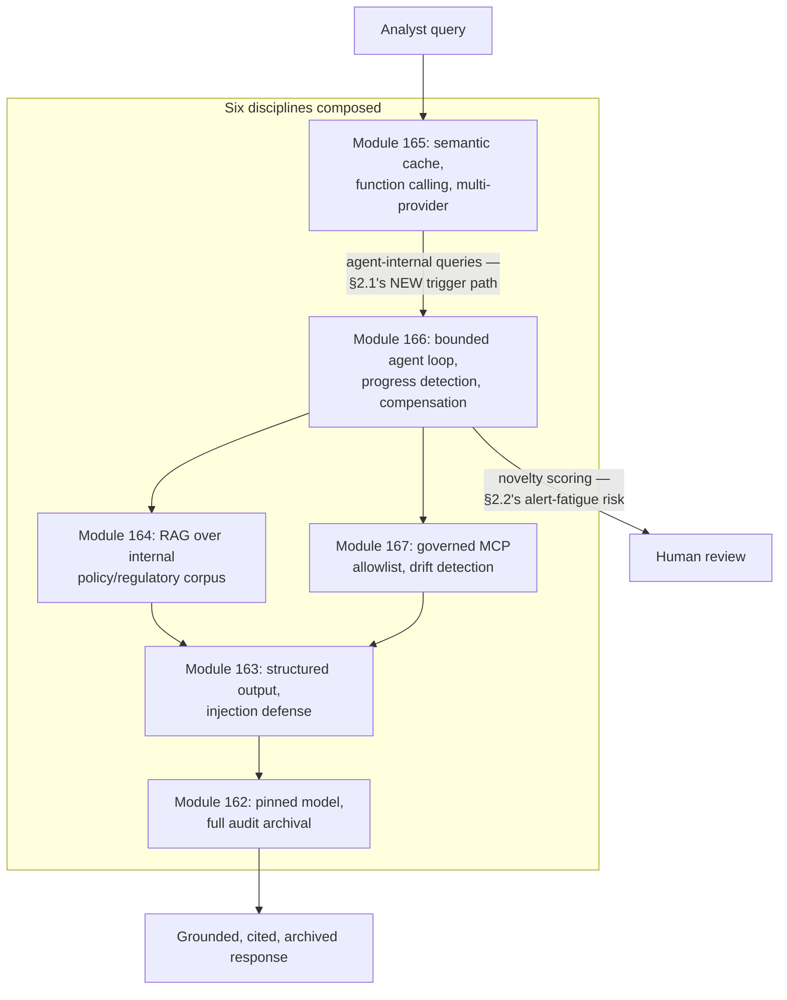

# Module 168 — AI Systems Capstone: A Governed, Production-Grade AI Research & Compliance Assistant

> Domain: AI Systems (merged 44-50) | Level: Beginner → Expert | Prerequisite: All of [[../44-AI-Systems/01-AI-Systems-LLM-Fundamentals-Transformers-Tokenization-Inference]] through [[../44-AI-Systems/06-MCP-ModelContextProtocol-Architecture-Primitives-TrustBoundary]] (this capstone composes every module's mechanism into one coherent system and demonstrates Module 167 A10's closing meta-principle concretely)

>
> **Scope note:** Seventh and closing module of the merged `44-AI-Systems` domain (re-scoped from 8 to 7 per the 2026-07-19 CLAUDE.md "Resolved" entry). This is a single, running case study — **ComplianceIQ**, an internal AI research and compliance assistant for a brokerage's compliance analysts — synthesizing Modules 162-167's full mechanics, then demonstrating this domain's own central finding one level deeper: composition risk recurs not only *within* any single module's mechanism, but *at the seams between* multiple, individually-hardened modules' disciplines operating together.

---

## 1. Fundamentals

**What:** ComplianceIQ is an AI-assisted research tool letting compliance analysts investigate flagged trading patterns, answer regulatory questions, and conduct client due-diligence by composing every mechanism this domain has established: **Module 162's** version-pinned, audit-archived LLM foundation; **Module 163's** structured-output-constrained, injection-defended prompting; **Module 164's** RAG pipeline grounding responses in the firm's internal policy/regulatory corpus; **Module 165's** semantic-cached, multi-provider-resilient, function-calling delivery layer; **Module 166's** bounded, progress-monitored agent loop for multi-step investigations; and **Module 167's** governed MCP server allowlist connecting the agent to external case-management and market-data systems.

**Why:** Every one of this domain's prior six modules established a specific discipline in relative isolation — this capstone's purpose, consistent with every capstone this course has produced (Module 145, 150, 155, 158, 161), is demonstrating that composing six individually-hardened disciplines does not automatically produce a system free of composition risk; it produces a system whose composition risk has simply moved to genuinely new, higher-order seams this domain's individual modules, each reasoning about their own mechanism in isolation, could not have anticipated.

**When:** This architecture pattern — a governed, multi-discipline AI system supporting bounded autonomous investigation over sensitive, regulated data — is the appropriate shape specifically once an organization has both genuine need for AI-assisted, multi-step research capability *and* has built (per Module 167 A10's meta-principle) the corresponding governance discipline this entire domain has established as necessary; a lighter-weight system (a single-turn, ungrounded chatbot) would be the appropriate, simpler choice for a use case not warranting this full compositional depth.

**How (30,000-ft view):**
```
Analyst query ──► Semantic cache (Module 165 §2.2, CASE-ID-scoped — §2.1 develops
                    the capstone's own extension of that module's original fix)
                          │ [miss]
                 Bounded agent loop (Module 166) — plan/act/observe
                          │
        ┌─────────────────┼─────────────────┐
        │                                     │
  RAG retrieval               Governed MCP servers (Module 167 — allowlisted,
  (Module 164, internal          drift-monitored: case-management, market-data)
   policy/regulatory corpus)
        │                                     │
        └─────────────────┬─────────────────┘
                          │
        Progress-detection novelty scoring (Module 166) — THIS capstone's
        §14 incident develops its own miscalibration failure mode
                          │
              Structured, cited, grounded response (Module 163)
                          │
              Audit-archived (Module 162, extended with provider/session/
              agent-step/MCP-server-identity fields)
```

---

## 2. Deep Dive

### 2.1 Semantic caching meets agent-internal query generation — an old risk via a new path

Module 165 §4's fix scoped the semantic cache to client/case identity plus TTL, closing a direct-user-query cache-scoping incident. **ComplianceIQ's agent loop (Module 166) introduces a genuinely new query source the original fix never anticipated: the agent's own, internally-generated sub-queries during its plan-act-observe loop** — when investigating flagged trading pattern for Case A, the agent's own reasoning generates several intermediate, self-directed queries ("what was the client's stated investment objective," "were there similar patterns in the prior 90 days") that are themselves cached, semantically, exactly like a direct analyst query would be. **If the agent-internal query-generation path doesn't consistently, structurally thread the current case ID through to every cache lookup** — a genuinely easy omission, since the original cache-scoping fix (Module 165 §4) was designed and tested against direct, analyst-typed queries, not the agent's own internally-synthesized ones — the identical cross-case exposure risk Module 165 §4 already fixed once can resurface via this entirely new, second query-generation path, demonstrating that **fixing a risk for one identified trigger path does not automatically close that same risk for a structurally different trigger path introduced by a later, independently-developed module's own mechanism.**

### 2.2 Progress detection meets alert fatigue — a safety mechanism's own second-order risk

Module 166's progress-detection novelty scoring (§I1 of that module) was designed and calibrated against a single incident's specific stalling pattern. Applied across ComplianceIQ's full, diverse investigation caseload, the *same* mechanism exhibits a genuinely new failure mode this domain hasn't yet examined: **two investigations into genuinely different clients with superficially similar circumstances (a common trading pattern, similar account types) can produce embedding-similar intermediate queries across otherwise-legitimate, non-stalling investigations**, triggering Module 166's stalling-escalation logic as a false positive — and, critically, **a safety mechanism that escalates too frequently, for cases a human reviewer quickly recognizes as clearly not actually stalled, trains those reviewers to habitually, rapidly dismiss escalations without genuine scrutiny** — directly recurring Module 149's tail-latency-mitigation-cost-inversion finding and this course's broader alert-fatigue vocabulary (Module 96, Module 141), but demonstrating it here specifically as a consequence of one AI-systems safety mechanism (progress detection) degrading the effectiveness of a *different*, downstream safety mechanism (human-in-the-loop review) it was itself designed to correctly trigger.

### 2.3 The audit-archival schema as this system's own composition-risk ledger

Module 162's original audit schema captured model version and full request/response. Module 165 A10/I3 extended it with provider identity. This capstone requires a further extension: **every archived interaction must capture the complete composition context** — which RAG chunks were retrieved (Module 164), which agent steps were taken and their novelty scores (Module 166), which MCP servers and their approved-capability-checksum were active at the time (Module 167), and which cache entries (if any) were served (Module 165) — because, as §2.1-§2.2 demonstrate, a future incident's root cause may live at the seam between *any two* of these six disciplines, and a compliance/security investigation reconstructing a specific historical interaction needs full visibility into every module's own state at that moment, not merely the final input/output pair Module 162's original, simpler schema was designed to capture.

### 2.4 Governance investment allocation — this capstone's own version of Module 167's meta-principle

Given finite governance investment capacity, this capstone's architecture decision (§15) directly applies Module 167 A10's meta-principle concretely: **the correct allocation of governance investment across this domain's six disciplines is not uniform, and not fixed — it should track each discipline's actual, currently-measured incident rate and severity for this specific system's actual usage pattern**, exactly the empirical, continuously-recalibrated discipline this course has established throughout (Module 163 A3, Module 164 A3, Module 166 A3), now applied at the level of allocating investment *across* six previously-independently-developed disciplines rather than calibrating any single one of them in isolation.

---

## 3. Visual Architecture



```
Composition-risk recurrence, capstone-level (§2.1/§2.2):

  Module 165 fixed a risk for TRIGGER PATH A (direct analyst query)
        │
  Module 166 introduces TRIGGER PATH B (agent-internal query generation)
        │
  The SAME underlying risk (cache scoping) resurfaces via PATH B,
  because Module 165's fix was never re-verified against a path
  that didn't exist when that module's own incident was fixed.
```

---

## 4. Production Example

**Problem:** A compliance analyst investigating a flagged trading pattern for Client A's account initiated a ComplianceIQ agent investigation; minutes later, a different analyst investigating an entirely unrelated flagged pattern for Client B's account — whose circumstances happened to generate embedding-similar intermediate agent sub-queries to Client A's ongoing investigation — received, via the semantic cache, a response containing information about Client A's account activity, a direct, genuine cross-client compliance-data exposure occurring specifically through the agent-internal query-generation path §2.1 describes.

**Architecture:** The semantic cache (Module 165, correctly scoped to case ID for direct analyst queries) was queried, without modification, by the agent loop's own internal sub-query mechanism (Module 166), which — implemented by a different engineer, on a different team, at a different point in this system's development timeline than the original cache-scoping fix — passed sub-queries to the cache lookup using only the sub-query's own text, without explicitly threading the current investigation's case ID through this second, newer call path.

**Implementation / What happened:** Every individual mechanism was functioning exactly as its own module had established and verified it should: the semantic cache correctly matched semantically-similar queries (Module 165's intended behavior); the agent loop correctly generated relevant, on-task intermediate sub-queries (Module 166's intended behavior); no injection, no hallucination, no authorization bypass, no MCP-server compromise — every one of this domain's five prior modules' own individually-verified correctness held completely intact, and the incident occurred entirely because the *sixth* module (this capstone's own composition) introduced a new call path to an already-correctly-designed, already-once-incident-fixed mechanism, without that new call path being re-verified against the original fix's own scoping requirement.

**Trade-offs:** No individual engineering decision in this incident's causal chain was unreasonable — the semantic-cache team correctly fixed Module 165 §4's original incident for its known trigger path; the agent-loop team correctly implemented Module 166's plan-act-observe mechanics; the specific omission (threading case ID through the new, agent-internal cache-lookup call path) is exactly the kind of cross-team, cross-module integration detail this course has repeatedly found falls through organizational cracks even among individually-diligent teams.

**Lessons learned:** **A fix verified against one specific trigger path does not automatically, structurally extend to a new trigger path a later module introduces to the same underlying mechanism — closing this gap requires an explicit, ongoing practice of re-verifying every existing safety/scoping mechanism against every new caller introduced anywhere in the system, not a one-time fix assumed permanent.** This is this capstone's own, sharpest demonstration of Module 167 A10's meta-principle: the risk here lived entirely in a governance gap — the absence of a cross-module "does every existing correctness mechanism still hold against this new integration" review practice — not in any individual module's own, already-substantial technical discipline.

---

## 5. Best Practices

- **Require every new integration point touching an existing, previously-hardened mechanism (a cache, an authorization gate, a drift detector) to explicitly, formally re-verify that mechanism's original scoping/correctness requirement against the new call path** (§2.1, §4) — never assume a prior fix automatically, structurally covers a caller that didn't exist when the fix was made.
- **Calibrate safety-mechanism sensitivity (progress detection, drift detection, anomaly scoring) against the system's full, actual usage diversity, not merely the single incident that originally motivated the mechanism** (§2.2) — a mechanism tuned narrowly against one past incident risks producing false positives across the system's broader, more varied real usage.
- **Extend audit-archival schemas to capture full cross-module composition context**, not merely the final input/output pair (§2.3) — a future investigation's root cause may live at any seam between any two of the system's constituent disciplines.
- **Treat governance-investment allocation across a multi-discipline system as itself an empirically-measured, continuously-recalibrated decision** (§2.4), never a fixed, one-time allocation made at initial design time.
- **Establish a standing, cross-team integration-review practice specifically checking new code paths against existing safety mechanisms' original scoping assumptions** — the single most directly actionable organizational fix this capstone's own incident demonstrates as necessary.

---

## 6. Anti-patterns

- **Assuming a mechanism's prior, verified fix automatically extends to every future caller/integration path without explicit re-verification** — §4's exact incident; the capstone's own sharpest instance of this domain's recurring composition-risk finding.
- **Calibrating a safety mechanism's sensitivity against a single, narrow incident and never re-validating that calibration against the system's full, actual production diversity** — §2.2's alert-fatigue risk.
- **An audit schema capturing only final input/output**, omitting the full cross-module composition context a genuine, multi-discipline system's own incidents require for root-cause investigation (§2.3).
- **A fixed, one-time governance-investment allocation across a multi-discipline system**, never revisited as the system's own, actual incident distribution across its six constituent disciplines becomes empirically known (§2.4).
- **Treating each module's discipline as a permanently, independently "solved" concern once its own module's specific incident is fixed** — the precise, generalized mistake underlying both this capstone's own production example and debugging incident.

---

## 7. Performance Engineering

ComplianceIQ's full request latency composes every prior module's own latency contribution: Module 165's cache-check latency (fast on hit, negligible on miss); Module 166's multi-step agent loop latency (Module 166 §7's per-step, compounding cost); Module 164's retrieval latency (Module 164 §7's ANN-index query cost); Module 167's MCP connection/tool-invocation latency (Module 167 §7's connection-management cost); and Module 162's underlying prefill/decode latency at every LLM call within this chain — meaning this capstone's own end-to-end latency budget must be reasoned about as the *composition* of six independently-established latency models, not any single one in isolation, directly extending Module 166 §7's own step-count-percentile-monitoring discipline to cover the full, cross-discipline request lifecycle.

---

## 8. Security

This capstone's security posture is the union of every prior module's own defense-in-depth layer — Module 163's injection defense, Module 165 §8's independent action-authorization backstop, Module 166 §8's amplified-blast-radius authorization emphasis, and Module 167 §8's third-party trust-boundary governance — composed into one system whose actual, aggregate security posture is only as strong as its weakest individually-verified layer *combined with* the correctness of every seam between them, exactly this capstone's own §4 incident's demonstrated failure mode (every individual layer correct; the seam between two of them was not). **The capstone's own, generalized security finding: a multi-discipline AI system's security review must explicitly examine not only each constituent discipline's own defenses in isolation, but every pairwise (and, in principle, higher-order) combination of disciplines for emergent, composition-level gaps neither discipline's own isolated review would surface** — directly extending Module 166 A2's SoD-composition-risk finding from a single-agent's tool-sequence level to this capstone's full, six-discipline architectural level.

---

## 9. Scalability

Each of this domain's six disciplines carries its own, independently-established scaling lever (Module 164's ANN-index capacity planning, Module 165's multi-provider routing, Module 166's parallel orchestrator-worker delegation, Module 167's N+M integration-effort savings) — this capstone's own scaling consideration is ensuring these six independently-scaled subsystems' *combined* resource consumption (LLM call volume across RAG retrieval-grounding calls, agent-loop steps, and MCP sampling requests, all drawing from the same underlying provider capacity and rate limits) is capacity-planned holistically, not as six independently-sized subsystems whose combined peak demand was never jointly modeled — directly recurring Module 148 §4's peak-versus-average capacity-planning finding, now applied to the aggregate demand six composed AI-systems disciplines jointly place on shared, underlying LLM-provider capacity.

---

## 10. Interview Questions

### Basic (10)

**B1. What are the six disciplines this capstone composes, and which module established each?**
*Ideal Answer:* Module 162 (pinned/audited LLM foundation), 163 (structured output/injection defense), 164 (RAG grounding), 165 (delivery: caching/function-calling/resilience), 166 (bounded agent loops), 167 (governed MCP integration).
*Why correct:* Matches §1.
*Common mistakes:* Omitting one or more disciplines, or conflating two distinct modules' contributions.
*Follow-up:* Which discipline does this capstone's own §4 incident occur at the SEAM between?

**B2. In §4's incident, did any individual module's own mechanism fail on its own terms?**
*Ideal Answer:* No — every individual mechanism (semantic caching, agent-loop sub-query generation) functioned exactly as its own module established and verified; the incident occurred entirely at the integration seam between two independently-correct mechanisms.
*Why correct:* Matches §4's precise root-cause framing.
*Common mistakes:* Attributing the incident to a defect within Module 165's or Module 166's own, individually-verified mechanism.
*Follow-up:* What specific omission at the seam between the two modules caused the incident?

**B3. Why did Module 165's original cache-scoping fix (Module 165 §4) not prevent this capstone's §4 incident?**
*Ideal Answer:* That fix was designed and verified against direct, analyst-typed queries; the capstone's agent loop (Module 166) introduced a structurally new query-generation path the original fix was never re-verified against.
*Why correct:* Matches §2.1.
*Common mistakes:* Assuming a fix verified against one trigger path automatically extends to every future trigger path.
*Follow-up:* What organizational practice would have caught this gap before production?

**B4. What is the alert-fatigue risk this capstone's §14 incident demonstrates?**
*Ideal Answer:* Module 166's progress-detection mechanism, calibrated against a single incident's specific pattern, produces false-positive stalling escalations across the system's broader, more diverse usage — training human reviewers to habitually dismiss escalations without genuine scrutiny.
*Why correct:* Matches §2.2.
*Common mistakes:* Assuming a safety mechanism's own correctness (correctly detecting SOME stalling) implies it cannot itself introduce a new risk (degrading the human-review layer it triggers).
*Follow-up:* What course-wide vocabulary (from a different domain) does this finding directly recur?

**B5. Why does this capstone's audit schema need to capture more than Module 162's original input/output pair?**
*Ideal Answer:* A future incident's root cause may live at the seam between any two of the system's six constituent disciplines — full cross-module composition context (retrieved chunks, agent steps, active MCP servers, cache hits) is needed for genuine root-cause investigation.
*Why correct:* Matches §2.3.
*Common mistakes:* Assuming the original, simpler audit schema from Module 162 remains sufficient once additional disciplines are composed on top of it.
*Follow-up:* Name two specific fields this capstone's extended schema adds beyond Module 162's original design.

**B6. Why is governance-investment allocation across this capstone's six disciplines described as neither uniform nor fixed?**
*Ideal Answer:* It should track each discipline's actual, currently-measured incident rate and severity for this specific system's usage pattern, recalibrated empirically over time, rather than a one-time, evenly-distributed allocation decided at initial design.
*Why correct:* Matches §2.4/§15.
*Common mistakes:* Assuming a fixed, equal governance investment across all six disciplines is the safest default.
*Follow-up:* What would trigger a re-allocation of governance investment toward a specific discipline?

**B7. What is this capstone's own generalized security finding, extending Module 166 A2?**
*Ideal Answer:* A multi-discipline AI system's security review must examine not only each discipline's own defenses in isolation, but every pairwise combination of disciplines for emergent, composition-level gaps neither discipline's isolated review would surface.
*Why correct:* Matches §8.
*Common mistakes:* Assuming a security review covering each of the six disciplines independently is sufficient, missing the specific need for pairwise/combinatorial review.
*Follow-up:* How many pairwise combinations exist among six disciplines, and does this suggest full pairwise review is tractable at scale?

**B8. Why must ComplianceIQ's capacity planning be holistic across all six disciplines rather than per-discipline?**
*Ideal Answer:* Multiple disciplines (RAG retrieval-grounding, agent-loop steps, MCP sampling) all draw from the same underlying shared LLM-provider capacity and rate limits — sizing each independently risks under-provisioning for their combined, jointly-modeled peak demand.
*Why correct:* Matches §9.
*Common mistakes:* Assuming each discipline's own, independently-established scaling lever is sufficient without jointly modeling their combined resource draw.
*Follow-up:* What prior module's finding does this directly recur?

**B9. In §4's incident, whose original engineering decisions were unreasonable?**
*Ideal Answer:* None — every individual decision (the original cache-scoping fix; the agent-loop implementation) was independently reasonable; the incident arose entirely from an organizational gap (no cross-module re-verification practice), not individual error.
*Why correct:* Matches §4's precise framing, consistent with this course's repeated finding about composition-risk incidents.
*Follow-up:* What specific practice, if it had existed, would have caught this gap?

**B10. What is this capstone's closing meta-principle, extending Module 167 A10?**
*Ideal Answer:* AI-systems risk lives in the gap between a technology's genuine capability and the governance discipline built to match it — now demonstrated concretely at the level of composing six independently-governed disciplines, where the gap can emerge specifically at the seams between disciplines, not merely within any single one.
*Why correct:* Matches §1/§17.
*Follow-up:* Does this meta-principle apply only to AI systems, or does it generalize to this course's other domains?

### Intermediate (10)

**I1. Design the fix for §4's incident, ensuring case-ID scoping threads correctly through every current AND future call path to the semantic cache.**
*Ideal Answer:* Rather than requiring every caller (direct analyst query, agent-internal sub-query, any future caller) to independently, correctly pass case ID, restructure the cache-lookup interface so case ID is a structurally mandatory, non-optional parameter enforced at the type/API-contract level — making it impossible to call the cache without it, rather than relying on every current and future caller's own discipline to remember to pass it correctly, directly closing the "new caller omits an established scoping requirement" risk class at its structural root rather than through documentation or convention alone.
*Why correct:* Matches §4/§5's precise fix, correctly identifying a structural (API-contract-level) solution over a documentation/convention-based one.
*Common mistakes:* Proposing only to fix this one specific instance (thread case ID through the agent-loop's sub-query path) without the structural API change that would prevent a third, future caller from reproducing the identical omission.
*Follow-up:* What would this structural fix look like concretely in a strongly-typed language versus Python's more permissive typing?

**I2. Design the recalibration process for Module 166's progress-detection novelty threshold, addressing §14's alert-fatigue incident.**
*Ideal Answer:* Collect a representative sample of the system's actual, full investigation-type diversity (not merely the original incident's specific pattern); measure the novelty-score distribution for genuinely legitimate, non-stalling investigations across this diverse sample; recalibrate the threshold specifically to minimize false-positive escalation rate on this broader sample while still catching the original incident's true-positive pattern, directly reusing Module 166 A3's empirical-calibration discipline, now explicitly extended to require diverse, not narrow, calibration data.
*Why correct:* Correctly applies Module 166 A3's empirical-calibration methodology while identifying the specific gap (narrow, single-incident-derived calibration data) that caused §14's incident.
*Common mistakes:* Proposing only to loosen the threshold uniformly, without the explicit, diverse-sample-based recalibration methodology this incident's root cause actually requires.
*Follow-up:* How would you continuously monitor for this recalibration itself becoming stale as the system's investigation-type diversity evolves further over time?

**I3. Design the extended audit-archival schema (§2.3) capturing full cross-module composition context.**
*Ideal Answer:* Extend Module 162's `AuditedLlmRecord` with: retrieved-chunk IDs and their relevance scores (Module 164); agent step sequence with per-step novelty scores and tool calls (Module 166); active MCP server identities and their approved-capability checksums at interaction time (Module 167); cache-hit-or-miss status and, if a hit, the originating cached interaction's own ID (Module 165) — creating a fully-reconstructable, cross-discipline audit trail for any future investigation needing to determine exactly which of the six disciplines' state contributed to a specific historical response.
*Why correct:* Correctly, concretely extends the schema with fields from every one of the domain's six disciplines, matching §2.3's precise requirement.
*Common mistakes:* Extending the schema with only one or two disciplines' fields, missing the full, six-discipline composition context this capstone's own incidents demonstrate is necessary.
*Follow-up:* Which specific field in this extended schema would have most directly accelerated the investigation of §4's incident?

**I4. A new engineer proposes adding a seventh discipline to ComplianceIQ — a fine-tuning pipeline periodically retraining a smaller, specialized model on the firm's own historical compliance investigations. Design the composition-risk review this addition should undergo before integration.**
*Ideal Answer:* Beyond evaluating the fine-tuning pipeline's own, isolated correctness (a new, seventh discipline's internal soundness), explicitly review every existing discipline's own scoping/correctness assumptions against this new integration point specifically — does the fine-tuned model change Module 162's version-pinning/audit-archival requirements (likely yes — a fine-tuned model needs its own version-pinning discipline); does training data drawn from historical investigations risk incorporating any previously-cached (Module 165) or previously-retrieved (Module 164) content in a way that could leak cross-case information into the new model's own weights (a genuinely new, training-time analogue of §4's runtime cache-scoping risk); does the fine-tuning pipeline itself need MCP-style governance (Module 167) if it draws data from any external or third-party source.
*Why correct:* Correctly designs a composition-risk review explicitly checking the new discipline against every existing one's own assumptions, directly applying this capstone's own §4/§14-demonstrated methodology to a genuinely new, seventh addition.
*Common mistakes:* Reviewing the new fine-tuning pipeline only in isolation, missing the cross-discipline composition-risk review this capstone's own incidents demonstrate is the actual, load-bearing practice needed.
*Follow-up:* Does this proposed fine-tuning pipeline introduce a training-time analogue of any OTHER discipline's own established risk, beyond the cache-scoping analogue already identified?

**I5. Design the holistic capacity-planning model for ComplianceIQ's aggregate LLM-provider demand, per §9.**
*Ideal Answer:* Model peak-hour aggregate demand as the sum of: RAG-grounding calls (Module 164, one per agent step requiring retrieval-informed generation), agent-loop reasoning calls (Module 166, per step), and MCP sampling requests (Module 167, per server-initiated request) — all drawing from the same underlying provider rate limit/capacity pool — provisioning multi-provider fallback capacity (Module 165 §9) against this *combined*, jointly-modeled peak, not against any single discipline's own peak considered in isolation, directly extending Module 148 §4's peak-capacity-planning finding to this capstone's own multi-discipline aggregate demand.
*Why correct:* Correctly models the combined, cross-discipline demand rather than each discipline's peak considered independently, matching §9's precise finding.
*Common mistakes:* Sizing capacity for each discipline's own peak independently and summing the results, which could either over- or under-provision depending on whether the disciplines' individual peaks are correlated or not — the question specifically requires jointly modeling combined demand, not merely summing independently-derived peaks.
*Follow-up:* Under what condition would summing independently-modeled peaks produce an accurate combined-capacity estimate, and under what condition would it not?

**I6. Compare this capstone's §4 incident (composition-risk-at-a-seam) against Module 145's original, course-wide composition-risk finding. Is this capstone's finding a restatement, or does it add genuine new depth?**
*Ideal Answer:* Adds genuine new depth: Module 145 established composition risk as arising between *independently-built, deployed backend systems*; this capstone demonstrates the identical shape occurring between *independently-developed modules of the same course's own curriculum*, applied to *one, single, deliberately-composed system* — showing the finding generalizes not merely across different technical domains (backend, frontend, AI systems, as this course has now shown repeatedly) but *within* a single system's own internal architecture, specifically at the boundary between subsystems built by different teams at different points in that one system's own development timeline, a finer-grained, more internally-focused instance of the same underlying pattern.
*Why correct:* Correctly identifies the genuine, new dimension (intra-system, cross-team-within-one-product composition risk) this capstone adds beyond Module 145's original, inter-system framing.
*Common mistakes:* Treating this capstone's finding as a mere restatement of Module 145 without identifying the specific, new granularity (within one system, across its own internal development timeline) it demonstrates.
*Follow-up:* Does this finer-grained, intra-system instance of composition risk require a different kind of organizational practice to address than Module 145's original, inter-system instance?

**I7. Design a synthetic, continuous canary test specifically targeting the composition seam §4's incident demonstrates, extending Module 158/160's canary pattern.**
*Ideal Answer:* A scheduled, synthetic test that establishes two distinct, simultaneous "investigations" for two deliberately similar-but-distinct test cases (mirroring §4's actual trigger condition), exercises the agent loop's own internal sub-query generation for both, and asserts — via the extended audit schema (I3) — that no cache entry or retrieved content from one test case's investigation ever appears in the other's response, run continuously (not merely once at deployment) to catch a regression if a future change to either the caching layer or the agent-loop layer silently reintroduces this specific composition-seam vulnerability.
*Why correct:* Correctly designs a canary targeting the specific composition seam (cache-scoping across the agent-internal query path) this capstone's own incident demonstrates, directly reusing this course's now-standard continuous-canary discipline.
*Common mistakes:* Proposing a canary testing each discipline (caching, agent looping) independently rather than specifically exercising their composed interaction, missing that the actual risk lives at the seam, not within either discipline alone.
*Follow-up:* How would you extend this canary pattern to cover the other five pairwise combinations among this capstone's six disciplines, and is exhaustive pairwise canary coverage practically achievable?

**I8. A compliance stakeholder asks whether ComplianceIQ's full, six-discipline architecture is "safe." Given this course's now-repeated finding, formulate the precise, honest answer.**
*Ideal Answer:* "Every one of the six disciplines composing ComplianceIQ has its own, individually well-established and verified safety mechanism, and this capstone's own governance-investment allocation (§2.4) is calibrated against our actual, measured incident data. What we cannot claim is that this composition is exhaustively verified against every possible seam between disciplines — our own production incidents (§4, §14) demonstrate that new seams can and do emerge, specifically when a later discipline (like the agent loop) introduces a new integration path to an earlier, already-hardened mechanism (like the cache). Our answer to 'is it safe' is therefore: safe against every specific risk we have identified and closed, continuously monitored via the canaries and audit infrastructure this domain has built, with an explicit, standing organizational commitment to identifying and closing new seams as they're discovered — never an unconditional, permanent safety guarantee."
*Why correct:* Provides the precise, appropriately-scoped, honest answer this course has established as the correct response pattern throughout (Module 166 A8's identical framing for a similar question), never overstating an unconditional guarantee.
*Common mistakes:* Providing either an overstated "yes, fully safe" answer or an unhelpfully alarmist "no guarantees possible" answer, missing the precise, conditional, evidence-grounded middle position this course has established as the correct communication pattern.
*Follow-up:* How would you communicate the specific, ongoing organizational commitment (continuous canary monitoring, cross-module integration review) that makes this conditional safety claim meaningfully different from an empty disclaimer?

**I9. Why does this capstone's §14 incident (alert fatigue) represent a risk that emerges specifically from SUCCESS at Module 166's own original goal, rather than a failure of it?**
*Ideal Answer:* Module 166's progress-detection mechanism succeeded exactly as designed — it correctly, reliably triggers human escalation whenever its novelty-scoring threshold is crossed; the alert-fatigue risk arises specifically because this success, applied uniformly and too-sensitively across the system's full, diverse usage, produces escalations frequently enough that human reviewers' own behavior adapts in a way that undermines the mechanism's actual, intended protective value — a risk that could only emerge from a mechanism that is functioning correctly and frequently, not from one that's broken or unreliable, a subtle but important distinction from every other incident this domain has examined, which were each caused by some mechanism failing to fire or scoping incorrectly.
*Why correct:* Correctly identifies the genuinely distinct causal shape of this specific incident (a correctly-functioning mechanism's own success producing a second-order human-behavioral risk) relative to this domain's other, failure-mode-driven incidents.
*Common mistakes:* Describing §14's incident using the same "mechanism failed to work correctly" framing as this domain's other incidents, missing that this one is specifically caused by the mechanism working exactly as designed, applied too broadly.
*Follow-up:* Does this "success itself creates a second-order risk" shape appear anywhere else in this course's prior 167 modules, or is it genuinely unique to this capstone?

**I10. Synthesize why this capstone's two incidents (§4, §14) are each, individually, examples of DIFFERENT sub-categories of this domain's overall composition-risk theme, per Module 166 A10's distinction between "new instance" and "new source."**
*Ideal Answer:* §4 is a "new instance via a new trigger path" — the identical underlying risk (cache-scoping) Module 165 already identified and fixed once, resurfacing through a genuinely new caller (the agent loop) neither the original risk's discovery nor its fix anticipated. §14 is a genuinely "new source" — a risk that couldn't have existed before Module 166's own progress-detection mechanism was introduced, arising specifically from that mechanism's own success/frequency rather than from any prior module's already-established risk category resurfacing. Together, the two incidents demonstrate this capstone deliberately, comprehensively exercises both of Module 166 A10's identified categories rather than only one, providing a complete, both-categories-demonstrated closing to this domain's own recurring composition-risk taxonomy.
*Why correct:* Correctly applies Module 166 A10's own new-instance-versus-new-source distinction to precisely classify each of this capstone's two incidents differently, demonstrating sophisticated, taxonomically-precise synthesis at the domain's closing point.
*Common mistakes:* Classifying both incidents identically, or failing to recognize that this capstone deliberately engineered its two incidents to demonstrate the two distinct categories Module 166 A10 established, rather than recognizing this as the capstone's own deliberate, comprehensive closing structure.
*Follow-up:* Does the domain's overall six-module-plus-capstone arc (162-168) have a third, not-yet-classified composition-risk category, or are "new instance via new trigger path" and "genuinely new source" jointly exhaustive of what this domain has demonstrated?

### Advanced (10)

**A1. Design the complete, corrected ComplianceIQ architecture, synthesizing every mechanism this capstone and its six prerequisite modules establish.**
*Ideal Answer:* Structurally-mandatory case-ID cache scoping at the API-contract level (I1); diverse-sample-recalibrated progress-detection thresholds with false-positive-rate monitoring (I2); the fully cross-module-extended audit schema (I3); a standing, mandatory composition-risk review process for any new discipline or integration point (I4); holistic, jointly-modeled capacity planning across all six disciplines' combined LLM-provider demand (I5); continuous, pairwise-composition-seam canary testing (I7); and an explicit, empirically-recalibrated governance-investment allocation policy (§2.4/§15) — the complete, six-plus-capstone-discipline architecture this entire domain has built toward.
*Why correct:* Synthesizes every element from this capstone and its six prerequisite modules into one complete, fully-governed architecture.
*Common mistakes:* Omitting the cross-module composition-risk-review process (I4) specifically, which is this capstone's own most distinctive, higher-order contribution beyond what any single prior module established independently.
*Follow-up:* If this full architecture had to be built incrementally, in what order would you prioritize its six-plus-capstone components, and why?

**A2. Critique: "Since every one of ComplianceIQ's six constituent disciplines has been individually, rigorously hardened across Modules 162-167, the composed system's overall risk is simply the sum of each discipline's own, already-minimized residual risk."**
*Ideal Answer:* Overstated, directly refuted by this capstone's own two incidents — composition risk (§4, §14) is not merely the sum of each discipline's own residual risk; it is an *additional*, emergent risk category living specifically at the seams between disciplines, invisible to any evaluation considering each discipline in isolation, however rigorously hardened. The composed system's total risk is the sum of six individually-minimized residual risks *plus* an additional, structurally-distinct composition-risk term that only a dedicated, cross-discipline review process (I4) can identify and reduce — never simply inherited, reduced, or bounded by the individual disciplines' own hardening alone.
*Why correct:* Correctly refutes the overstated "risk is merely additive" claim using this capstone's own two incidents as direct, concrete counter-evidence, and precisely names the additional, distinct risk category (composition risk) the claim omits entirely.
*Common mistakes:* Accepting the claim because each individual discipline genuinely has been rigorously hardened, without recognizing that rigor at the individual-discipline level says nothing about the genuinely separate, additional risk living at the seams between them.
*Follow-up:* Is there a mathematically precise way to estimate this "additional composition-risk term," or is it fundamentally only discoverable empirically, through incidents or dedicated review, rather than predictable in advance?

**A3. Design an empirical study measuring whether this capstone's cross-discipline composition-risk-review process (I4/A1) actually reduces incident rate over time, avoiding this course's now-repeated "unverified governance process" caution.**
*Ideal Answer:* Track, over a defined period following the review process's introduction, the rate of incidents specifically attributable to composition-risk seams (as classified via the extended audit schema, I3, which now makes this classification concretely possible) versus incidents attributable to any single discipline's own, isolated failure — comparing this composition-risk-specific incident rate before and after the review process's introduction, and specifically verifying (per this course's now-standard "verify the verifier" discipline) that the review process itself isn't merely a rubber-stamped formality (directly reusing Module 167's own §14 incident's exact caution) by auditing a sample of completed reviews for genuine, substantive cross-discipline analysis versus superficial sign-off.
*Why correct:* Correctly designs an empirical, before/after measurement specifically targeting composition-risk incidents (enabled by I3's schema extension), while explicitly incorporating this course's now-standard caution against an unverified governance process becoming a hollow formality.
*Common mistakes:* Proposing to measure overall incident rate without specifically isolating the composition-risk-attributable subset, which would dilute the measurement's ability to attribute any observed improvement specifically to this new review process rather than to unrelated, concurrent improvements in any individual discipline.
*Follow-up:* What specific finding, if this empirical study revealed the review process wasn't measurably reducing composition-risk incidents, would you investigate first?

**A4. A regulator, reviewing ComplianceIQ as part of a routine examination, asks the firm to demonstrate that the system's AI-generated investigation summaries are reliable enough to inform regulatory-reporting decisions. Design the evidence package this capstone's own infrastructure should be able to produce.**
*Ideal Answer:* The extended audit schema (I3) providing full, reconstructable provenance for any specific historical investigation (which chunks were retrieved, which steps taken, which servers/caches involved); the empirical calibration evidence for the progress-detection threshold (I2) and the semantic-cache scoping (Module 165 A3), demonstrating these controls were tuned against measured, representative data rather than arbitrary defaults; the composition-risk-review process's own audit trail (A3) demonstrating ongoing, substantive (not rubber-stamped) cross-discipline scrutiny; and — critically, per I8's honest-answer framing — an explicit, documented acknowledgment of what the system's guarantees do and do not cover, never an overstated, unconditional reliability claim the regulator could later find contradicted by a genuine, disclosed incident.
*Why correct:* Correctly synthesizes this capstone's own infrastructure (audit schema, calibration evidence, review-process audit trail) into a concrete regulatory evidence package, while correctly emphasizing I8's honest-scoping discipline as essential to the package's own credibility.
*Common mistakes:* Proposing only the technical evidence (audit logs, calibration data) without the explicit, honest scoping-of-guarantees component I8 established as necessary — an evidence package overstating its own reliability claims would itself constitute a genuine regulatory risk.
*Follow-up:* How would this evidence package need to change if it were being prepared specifically in response to an already-occurred incident (§4 or §14) rather than a routine examination?

**A5. Design the specific technical mechanism preventing a future, seventh discipline (I4's fine-tuning pipeline example) from independently reproducing §4's exact "new caller bypasses existing scoping requirement" failure shape.**
*Ideal Answer:* Beyond I1's structural, API-contract-level fix for the specific cache-scoping case, establish a general, platform-wide convention: every mechanism in ComplianceIQ carrying an explicit scoping/correctness requirement (cache keys, authorization scopes, drift-detection baselines) must expose that requirement through a structurally-enforced interface (a required parameter, a type-system constraint) rather than a documented convention any future caller must remember to honor — making I1's specific fix the *template* for a general platform principle applied prospectively to every future mechanism and every future caller, not merely a one-off fix for this one, already-discovered instance.
*Why correct:* Correctly generalizes I1's specific technical fix into a platform-wide, prospectively-applied principle, directly addressing the "prevent a FUTURE instance of this same failure shape" question rather than merely re-describing the fix for the incident that already occurred.
*Common mistakes:* Describing only I1's original, incident-specific fix without generalizing it into a platform-wide principle applicable to disciplines and callers that don't yet exist.
*Follow-up:* What's the limitation of a structurally-enforced-interface approach — is there any category of scoping requirement this technique cannot fully, mechanically enforce, requiring the composition-risk-review process (I4) as a necessary complement rather than a redundant backup?

**A6. Synthesize this capstone's finding against this ENTIRE course's arc (Modules 1-167) — is composition risk this course's single most-demonstrated finding, and if so, why does it recur so persistently despite 167 modules of accumulated, increasingly-sophisticated defensive discipline?**
*Ideal Answer:* Yes, composition risk (in its many specific technical guises — cache-key scoping, `trackBy` identity, federation-trust-scope-creep, and now this capstone's cross-discipline seams) is this course's single most-repeated finding, and it persists specifically because it is not a defect any accumulated body of defensive discipline can fully close — it is a structural, permanent property of any system built from more than one independently-reasoned-about component, where "independently reasoned about" is itself often a genuine, load-bearing engineering necessity (no single team or module can hold the full complexity of a large system in mind simultaneously), meaning the very practice (decomposition, modularity, specialized teams/modules each hardening their own concern) that makes building sophisticated systems tractable at all is the same practice that structurally guarantees composition risk will keep finding new seams — this course's 167 modules of accumulated discipline have not eliminated this finding because eliminating it would require abandoning decomposition itself, which is not a viable trade; the correct response, demonstrated throughout this course, is not elimination but continuous, disciplined, ongoing vigilance specifically at the seams.
*Why correct:* Provides a genuinely deep, structural explanation for WHY this finding recurs despite extensive accumulated discipline, rather than merely re-confirming that it does recur — the precise, course-capping synthesis this closing capstone module warrants.
*Common mistakes:* Simply re-confirming that composition risk is a recurring finding without engaging with the deeper "why does 167 modules of discipline not eliminate it" question this synthesis-level question specifically asks.
*Follow-up:* Given this structural, permanent-condition framing, what should a Principal Engineer's own relationship to composition risk be — an achievable goal to eventually eliminate, or a permanent operating condition to be continuously, skillfully managed?

**A7. Design the onboarding/training program for a new engineer joining the ComplianceIQ team, specifically targeting the composition-risk awareness this capstone establishes as the team's most distinctive, hard-won institutional knowledge.**
*Ideal Answer:* Beyond onboarding to each of the six individual disciplines' own technical mechanics (a conventional onboarding), require every new engineer to study this capstone's own §4 and §14 incidents specifically as worked case studies, walking through exactly how two individually-reasonable, individually-correct engineering decisions composed into a genuine incident — training the specific, transferable diagnostic habit (when integrating with any existing, already-hardened mechanism, explicitly ask "what scoping/correctness assumption did that mechanism's original design make, and does my new integration path still satisfy it") this capstone's entire arc has been building toward, rather than only imparting the individual technical skills each of the six prerequisite modules covers.
*Why correct:* Correctly identifies that the most valuable, hardest-to-acquire institutional knowledge this capstone represents is the composition-risk diagnostic habit itself, not merely the individual technical mechanics each prerequisite module already covers, and designs onboarding specifically targeting that harder-to-transfer knowledge.
*Common mistakes:* Designing onboarding covering only each discipline's individual technical mechanics, missing that this capstone's own distinctive contribution — the cross-discipline diagnostic habit — is precisely what conventional, per-discipline onboarding fails to transfer.
*Follow-up:* How would you verify a new engineer has genuinely internalized this diagnostic habit, distinct from merely having read the case studies?

**A8. A competitor firm's AI research assistant, built without this domain's governance disciplines, suffers a well-publicized incident structurally identical to §4. Your firm's leadership asks whether ComplianceIQ is now provably safe from an identical incident, given the fix (I1/A5) has been implemented. Formulate the precise answer.**
*Ideal Answer:* "We are provably safe from the *specific, already-identified* instance of this failure shape (agent-loop sub-queries bypassing case-ID cache scoping) — I1's structural fix makes that exact omission mechanically impossible, not merely discouraged. We are not provably safe from *every possible* instance of the general composition-risk category this incident represents, since — per A6's structural argument — new seams can emerge from any future discipline or integration point our current review process hasn't yet examined. Our actual, honest position is: we've closed this specific, known gap structurally, we've established a standing review process (I4/A3) to catch future instances proactively rather than reactively, and we continuously monitor for recurrence via the canary infrastructure (I7) — genuine, substantial, verifiable protection, but not the unconditional, permanent guarantee the question's framing implicitly asks for."
*Why correct:* Provides the precise, appropriately-scoped, honest answer distinguishing "provably safe from this specific instance" from "provably safe from the general category," directly modeling this course's established communication discipline (I8) at the capstone's own closing, highest-stakes example.
*Common mistakes:* Either overclaiming permanent safety (contradicting A6's structural argument) or underclaiming by suggesting no genuine progress has been made (contradicting the real, substantial, structural fix I1 actually provides).
*Follow-up:* How would you help firm leadership understand why "provably safe from this specific instance" is still a meaningful, valuable claim, even though it falls short of the broader guarantee they may have initially wanted to hear?

**A9. This capstone's own §14 incident (alert fatigue from progress-detection success) suggests every one of this domain's SIX individual disciplines might have its own, analogous "success creates second-order risk" failure mode. Identify one plausible candidate for each of the other five disciplines.**
*Ideal Answer:* Module 162 (audit archival): comprehensive, successful archival of every interaction could itself become an increasingly attractive, high-value target for a data-exfiltration attack, the audit trail's own completeness being the source of elevated risk. Module 163 (structured output): a highly successful, reliable structured-output guarantee could lead developers to under-invest in downstream validation of the response's semantic content (Module 163 A2's exact finding), trusting format-correctness as a proxy for content-correctness. Module 164 (RAG): highly successful, comprehensive corpus coverage could lead users to over-trust every response as fully grounded, reducing their own critical scrutiny of citations (an automation-complacency risk). Module 165 (delivery): highly successful, reliable multi-provider failover could lead a team to under-invest in understanding any single provider's own specific failure modes, since failures are usually masked by fallback. Module 167 (MCP): a highly successful, frictionless governed-allowlist process could itself become so smooth that requesters stop providing the genuine scrutiny the review is meant to elicit, reducing review quality even as review *volume* stays healthy.
*Why correct:* Correctly generates five genuinely plausible, module-specific instances of the same "success creates second-order risk" shape this capstone's own §14 incident first demonstrated, showing real, generative synthesis across the full domain rather than restating any single module's already-stated finding.
*Common mistakes:* Providing generic, interchangeable answers not genuinely specific to each named discipline's own particular mechanism, or failing to identify a plausible candidate for one or more of the five disciplines.
*Follow-up:* Which of these five candidate second-order risks do you judge most likely to actually manifest in a real, long-running production system, and why?

**A10. As the closing question of this domain's closing module, and drawing on this entire 168-module course's arc, state the single sentence a Principal Engineer should carry forward from `44-AI-Systems` into any future AI-systems technology this course could not have anticipated.**
*Ideal Answer:* "A genuinely capable AI-systems technology is never inherently safe or unsafe — its risk is exactly the gap between its real capability and the governance discipline actually, currently built to match it, that gap most dangerously hides at the seams between otherwise well-governed components rather than within any single one, and closing it is never a one-time achievement but a continuous, structural practice of asking, for every new capability and every new integration point: what specific, bounded guarantee does this actually, verifiably provide, and what — continuously, not once — watches for the moment that guarantee's scope is silently exceeded." This single sentence synthesizes Module 162's opening three-property framing, every subsequent module's specific engineering response to those properties, Module 167's explicit meta-principle, and this capstone's own composition-seam demonstration into the one, durable, technology-agnostic heuristic that outlives any specific mechanism (transformers, RAG, MCP) this domain happened to examine.
*Why correct:* Provides a genuinely synthesizing, technology-agnostic closing statement drawing explicitly on the domain's full arc (Module 162 through this capstone) rather than restating any single module's finding, and correctly frames it as durable specifically because it doesn't depend on any AI-systems-specific technical detail that future technology might render obsolete.
*Common mistakes:* Providing a technically-specific answer tied to one of this domain's particular mechanisms (e.g., "always pin your model version"), missing that the question specifically asks for the durable, technology-agnostic principle that would remain valuable even after every specific mechanism this domain examined is eventually superseded by whatever comes next.
*Follow-up:* This course's full 168 modules span backend distributed systems, identity federation, two frontend frameworks, and now AI systems — does this same closing sentence, with only its opening noun phrase changed, serve equally well as the closing statement for every one of those other domains too?

---

## 11. Coding Exercises

### Easy — Structurally-mandatory case-ID cache interface (per I1)

**Problem:** Redesign Module 165's semantic-cache interface so case ID cannot be omitted by any caller, present or future, closing §4's incident at the structural level.

**Solution (Python):**
```python
from dataclasses import dataclass

@dataclass(frozen=True)
class ScopedCacheKey:
    # NO optional/default value for case_id — every construction site MUST
    # provide it explicitly. Structurally impossible to omit, unlike the
    # original Module 165 design where case_id was an easily-forgotten
    # optional parameter on the lookup call itself.
    case_id: str
    query_embedding: tuple[float, ...]

class StructurallyScopedCache:
    def __init__(self):
        self._entries: dict[str, list[tuple[ScopedCacheKey, str]]] = {}

    def get(self, key: ScopedCacheKey, threshold: float = 0.95) -> str | None:
        for candidate_key, response in self._entries.get(key.case_id, []):
            if cosine_similarity(list(key.query_embedding), list(candidate_key.query_embedding)) >= threshold:
                return response
        return None

    def put(self, key: ScopedCacheKey, response: str) -> None:
        self._entries.setdefault(key.case_id, []).append((key, response))

# The agent-loop's internal sub-query path (§2.1's new trigger) is now
# STRUCTURALLY FORCED to construct a ScopedCacheKey with case_id —
# there is no code path that reaches the cache without it.
def agent_internal_lookup(cache: StructurallyScopedCache, current_case_id: str, sub_query_embedding: list[float]) -> str | None:
    key = ScopedCacheKey(case_id=current_case_id, query_embedding=tuple(sub_query_embedding))
    return cache.get(key)
```
**Time complexity:** O(n) per lookup within a case's own entries (n = entries for that case). **Space complexity:** O(total entries).

**Optimized solution:** Extend this same structural pattern (a frozen dataclass requiring every scoping dimension at construction, never an optional/defaultable parameter on the lookup call) to every other scoped mechanism in ComplianceIQ (Module 167's server-allowlist checks, Module 166's authorization gates) — generalizing A5's platform-wide principle concretely, ensuring the next new caller/discipline this system adds inherits the identical, structural protection rather than requiring a bespoke fix per mechanism.

### Medium — Diverse-sample-calibrated progress-detection threshold (per I2)

**Problem:** Implement the recalibration process closing §14's alert-fatigue incident, using a diverse calibration sample rather than a single incident's narrow pattern.

**Solution (Python):**
```python
from dataclasses import dataclass

@dataclass
class CalibrationCase:
    novelty_scores: list[float]
    is_genuinely_stalled: bool  # ground truth, human-labeled

def calibrate_stalling_threshold(
    calibration_cases: list[CalibrationCase],
    window: int = 3,
) -> float:
    candidate_thresholds = [0.05, 0.10, 0.15, 0.20, 0.25, 0.30]
    best_threshold, best_score = None, -1.0

    for threshold in candidate_thresholds:
        true_positives = false_positives = true_negatives = false_negatives = 0

        for case in calibration_cases:
            predicted_stalled = detect_stalling(case.novelty_scores, window, threshold)
            if predicted_stalled and case.is_genuinely_stalled:
                true_positives += 1
            elif predicted_stalled and not case.is_genuinely_stalled:
                false_positives += 1  # EXACTLY §14's alert-fatigue-driving outcome
            elif not predicted_stalled and case.is_genuinely_stalled:
                false_negatives += 1
            else:
                true_negatives += 1

        # Weight false positives more heavily than false negatives — per
        # this course's now-standard risk-asymmetry reasoning (Module 165 A3),
        # since §14's incident demonstrates false positives carry a distinct,
        # compounding organizational cost (eroded reviewer trust) beyond
        # their own, individual inconvenience.
        score = true_positives - (2 * false_positives) - false_negatives

        if score > best_score:
            best_score, best_threshold = score, threshold

    return best_threshold
```
**Time complexity:** O(t × c) where t = candidate thresholds, c = calibration cases. **Space complexity:** O(c).

**Optimized solution:** Require `calibration_cases` to be drawn from a genuinely representative, periodically-refreshed sample of the system's actual, full investigation-type diversity (I2's precise fix) — and re-run this calibration on a standing schedule, not merely once, treating threshold calibration itself as subject to this course's now-established staleness/drift risk (Module 162 §14) if the system's actual usage distribution evolves after the initial calibration.

### Hard — Cross-module composition-risk review checklist as executable verification (per I4/A5)

**Problem:** Implement a semi-automated checklist tool verifying a new integration point against every existing discipline's own scoping requirements, operationalizing A5's platform-wide principle.

**Solution (Python):**
```python
from dataclasses import dataclass
from typing import Callable

@dataclass
class ScopingRequirement:
    discipline: str          # e.g., "Module 165 semantic cache"
    requirement_description: str
    verification_fn: Callable[[object], bool]  # returns True if satisfied

class CompositionRiskReviewer:
    def __init__(self):
        self._requirements: list[ScopingRequirement] = []

    def register_requirement(self, requirement: ScopingRequirement) -> None:
        self._requirements.append(requirement)

    def review_new_integration(self, integration_code_reference: object) -> dict:
        results = []
        for requirement in self._requirements:
            satisfied = requirement.verification_fn(integration_code_reference)
            results.append({
                "discipline": requirement.discipline,
                "requirement": requirement.requirement_description,
                "satisfied": satisfied,
            })

        unsatisfied = [r for r in results if not r["satisfied"]]
        return {
            "approved": len(unsatisfied) == 0,
            "results": results,
            "blocking_gaps": unsatisfied,  # I4's exact requirement — explicit, itemized
        }

# Example registration — each existing discipline's own team registers
# its OWN scoping requirement, distributing ownership rather than requiring
# one central reviewer to somehow independently know all six disciplines'
# individual scoping nuances.
reviewer = CompositionRiskReviewer()
reviewer.register_requirement(ScopingRequirement(
    discipline="Module 165 semantic cache",
    requirement_description="Every cache lookup MUST use ScopedCacheKey (case_id mandatory)",
    verification_fn=lambda code_ref: uses_scoped_cache_key_structurally(code_ref),
))
reviewer.register_requirement(ScopingRequirement(
    discipline="Module 167 MCP governance",
    requirement_description="Every MCP connection MUST pass McpConnectionGate.authorize_connection",
    verification_fn=lambda code_ref: uses_connection_gate(code_ref),
))
```
**Time complexity:** O(r) per review (r = registered requirements). **Space complexity:** O(r).

**Optimized solution:** Integrate this checklist as a mandatory, blocking CI gate (directly reusing Module 167 I7's CI-integration pattern) for any pull request introducing a new integration point touching an existing discipline's mechanism — making A5's "structural, not merely documented" principle apply to the review process itself, not only to the individual scoping fixes (I1) it verifies.

### Expert — Full cross-discipline audit-record composer (per I3)

**Problem:** Implement the extended audit schema composing context from all six disciplines into one reconstructable record, per §2.3.

**Solution (Python):**
```python
from dataclasses import dataclass, field
from datetime import datetime, timezone

@dataclass(frozen=True)
class RetrievalContext:  # Module 164
    chunk_ids: list[str]
    relevance_scores: list[float]

@dataclass(frozen=True)
class AgentStepContext:  # Module 166
    step_number: int
    tool_called: str
    novelty_score: float

@dataclass(frozen=True)
class McpContext:  # Module 167
    server_id: str
    approved_checksum: str

@dataclass(frozen=True)
class CacheContext:  # Module 165
    was_cache_hit: bool
    originating_interaction_id: str | None

@dataclass(frozen=True)
class ComplianceIQAuditRecord:
    interaction_id: str
    case_id: str
    model_version: str              # Module 162
    provider_id: str                # Module 165
    prompt: str
    response: str
    retrieval_context: RetrievalContext | None      # Module 164
    agent_steps: list[AgentStepContext]              # Module 166
    mcp_servers_active: list[McpContext]              # Module 167
    cache_context: CacheContext                       # Module 165
    timestamp_utc: str = field(
        default_factory=lambda: datetime.now(timezone.utc).isoformat()
    )

def reconstruct_composition_seam(
    record: ComplianceIQAuditRecord,
) -> str:
    # The specific, itemized reconstruction §4's actual investigation needed —
    # showing EVERY discipline's contribution to one, single interaction,
    # not merely the final input/output pair Module 162's original schema captured.
    lines = [
        f"Interaction {record.interaction_id} for case {record.case_id}:",
        f"  Model: {record.model_version} via {record.provider_id}",
        f"  Cache: {'HIT from ' + str(record.cache_context.originating_interaction_id) if record.cache_context.was_cache_hit else 'MISS'}",
        f"  Retrieved chunks: {record.retrieval_context.chunk_ids if record.retrieval_context else 'none'}",
        f"  Agent steps: {len(record.agent_steps)}, "
        f"max novelty score: {max((s.novelty_score for s in record.agent_steps), default=None)}",
        f"  Active MCP servers: {[s.server_id for s in record.mcp_servers_active]}",
    ]
    return "\n".join(lines)
```
**Time complexity:** O(1) construction; O(k) reconstruction (k = fields to format). **Space complexity:** O(chunks + steps + servers) per record.

**Optimized solution:** In production, index this extended audit store specifically by `case_id` and `cache_context.originating_interaction_id`, enabling the exact query pattern §4's actual investigation required — "find every interaction whose cache_context traces back to case A's original interaction" — as a fast, indexed lookup rather than a full-table scan, closing the investigation-latency gap a naive, unindexed extended schema would otherwise still leave open even with full data captured.

---

## 12. System Design

**Requirements:** A governed, cross-discipline-composition-risk-aware AI research and compliance assistant, with structurally-enforced scoping, diverse-sample-calibrated safety thresholds, full audit reconstructability, and a mandatory, CI-gated composition-risk review process for every new integration.

**Architecture:** See §3's mermaid diagram, extended per this section's coding exercises — `StructurallyScopedCache` (Easy), diverse-sample-calibrated `detect_stalling` (Medium), `CompositionRiskReviewer` as a CI gate (Hard), and `ComplianceIQAuditRecord` (Expert) composing every one of the six prerequisite modules' own established architecture into ComplianceIQ's final, capstone-level system.

**Monitoring:** Composition-risk-specific incident rate, tracked separately from single-discipline incident rate (A3); false-positive escalation rate against the diverse calibration baseline (Medium exercise); holistic, cross-discipline peak-demand capacity utilization (§9/I5); composition-risk-review-process audit-trail substantiveness (A3's rubber-stamp caution).

**Trade-offs:** Structural enforcement's coverage-completeness versus its inability to close every possible scoping gap without the complementary review process (A5's honest limitation); governance-investment allocation across six disciplines, continuously recalibrated against actual, measured composition-risk incident distribution (§2.4/§15) rather than fixed at initial design.

---

## 13. Low-Level Design

**Class diagram (textual):**
```
ScopedCacheKey / StructurallyScopedCache  (Easy)
 └─ case_id STRUCTURALLY mandatory — the capstone's template fix (A5)

calibrate_stalling_threshold  (Medium)
 └─ diverse-sample, false-positive-weighted — closes §14's alert fatigue

CompositionRiskReviewer / ScopingRequirement  (Hard)
 └─ per-discipline-owned requirements, CI-gated — the domain's OWN
    governance meta-principle (Module 167 A10) made concretely executable

ComplianceIQAuditRecord  (Expert)
 └─ composes ALL SIX disciplines' context into one reconstructable record
```

**Sequence diagram:** See §3's mermaid diagram for the static composition; the Expert exercise's `reconstruct_composition_seam` function is this LLD's dynamic, investigative reconstruction of any single interaction's full, cross-discipline causal chain — the concrete tool this capstone's own §4 investigation would have used, had it existed at incident time.

**Design patterns used:** Every pattern this domain's six prior modules established (Facade, Strategy, Circuit Breaker, Gate/Guard Clause, Saga/Orchestrator, Observer) now composed into one system; additionally, **Composite** (`ComplianceIQAuditRecord` composing six independently-defined context objects into one unified record) as this capstone's own, distinguishing structural contribution.

**SOLID mapping:** SRP preserved at the level of each individual discipline's own components (unchanged from Modules 162-167); this capstone's own genuinely new SOLID-adjacent principle: **composition-risk ownership is distributed** (Hard exercise's per-discipline-registered `ScopingRequirement`s) rather than centralized in one reviewer who would need comprehensive knowledge of all six disciplines simultaneously — a scalability property for the review process itself, directly addressing A6's structural argument that no single engineer can hold a large, composed system's full complexity in mind at once.

---

## 14. Production Debugging

**Incident:** Following A1's fully corrected architecture, ComplianceIQ's composition-risk review process (Hard exercise) begins consistently blocking a routine, low-risk category of change — updates to Module 164's document-chunking configuration for newly-onboarded, low-sensitivity reference corpora — because the review checklist's registered requirements include several checks genuinely relevant only to higher-sensitivity corpora, applying uniform scrutiny regardless of the specific corpus's own actual risk classification.

**Root cause:** The `CompositionRiskReviewer`'s registered requirements (Hard exercise) were designed and registered generically, applying identically to every integration change regardless of the specific corpus, discipline-instance, or risk tier involved — missing the same magnitude-calibration principle Module 165 §15 established for function-call authorization (not every consequential action warrants identical scrutiny) applied at this capstone's own, higher, review-process level.

**Investigation:** Reviewing several months of blocked-versus-approved review outcomes showed low-sensitivity-corpus changes consistently triggering the same handful of high-sensitivity-oriented requirements, none of which were ever actually violated for this corpus category — confirming the review process itself, while structurally sound, lacked the risk-tiering discipline this domain has established as necessary everywhere else.

**Fix:** Extended `ScopingRequirement` registration with an explicit applicability scope (which risk tiers/corpus categories a given requirement genuinely applies to), directly reusing Module 165 §15's magnitude-calibration principle at the review-process layer itself — closing the friction gap without weakening genuine, high-sensitivity-relevant scrutiny.

**Prevention:** This capstone's own composition-risk-review infrastructure — built specifically to address every prior module's individual scoping gaps — is itself subject to the identical risk-tiering discipline this domain established for every one of its six constituent mechanisms; a governance mechanism built to close composition risk can itself introduce disproportionate, mis-calibrated friction if it doesn't apply the same magnitude-calibration principle this domain has established throughout — the capstone's own, final, recursive demonstration that no mechanism in this domain, including the ones built specifically to govern the others, is exempt from this course's central, closing finding.

---

## 15. Architecture Decision

**Decision:** How should ComplianceIQ allocate finite, ongoing governance-investment capacity across its six constituent disciplines plus the capstone's own cross-discipline composition-risk review?

**Option A — Equal, fixed allocation across all seven governance areas (six disciplines plus composition review):** *Advantages:* Simple, defensible, no risk of any single area being neglected. *Disadvantages:* Ignores §2.4's finding that actual risk is empirically, unevenly distributed — directly contradicts this course's now-fully-established risk-tiered-investment principle. *Risk:* Under-investing in whichever area(s) actually carry the highest measured incident rate/severity.

**Option B — Allocation driven purely by each discipline's own module-level "importance" as judged subjectively by the engineering team, with no empirical grounding:** *Disadvantages:* Repeats the exact "ungrounded assumption rather than empirical measurement" mistake this course has cautioned against at every layer (Module 163 A3, Module 164 A3, Module 166 A3). *Risk:* High, since subjective importance judgments have repeatedly, throughout this course, diverged from actual, measured incident patterns.

**Option C — Allocation continuously, empirically recalibrated against each area's own actual, measured composition-risk-and-single-discipline incident rate and severity (per §2.4, A3's before/after measurement methodology), reviewed on a standing schedule (recommended):** Matches this course's fully-established empirical, risk-tiered investment principle, now applied at the capstone's own highest, cross-discipline-allocation level.

**Recommendation: Option C.** The generalizable principle, closing this module, this domain, and — appropriately, given this is the course's own AI-systems capstone — echoing every architecture decision this entire 168-module course has reached: **governance investment, like every other engineering investment this course has examined, must be allocated in proportion to actual, empirically-measured risk, continuously re-measured as the system and its usage evolve, never fixed at initial design or allocated by unexamined intuition — a principle this capstone's own §14/production-debugging incident demonstrates applies recursively, even to the governance mechanisms built specifically to enforce this exact principle everywhere else.**

---

## 17. Principal Engineer Perspective

**Business impact:** §4's incident — a genuine cross-client compliance-data exposure occurring specifically at the seam between two individually-hardened, individually-correct disciplines — represents this domain's most consequential possible demonstration that rigorous, module-by-module engineering discipline, however extensive, does not by itself guarantee a composed system's safety; the business risk this capstone closes is not merely this one specific incident, but the broader, previously-unrecognized risk category (composition risk between this domain's own, individually-excellent disciplines) that no single module's own review process was positioned to catch.

**Engineering trade-offs:** This capstone's central trade — structural, mechanical enforcement (I1/A5's API-contract-level fixes) versus process-based, human-reviewed composition-risk checking (I4/Hard exercise) — is not an either/or choice but a demonstrated, necessary complement: structural enforcement closes every *already-identified* scoping gap completely and permanently, while the review process is this domain's only mechanism for identifying genuinely *new*, not-yet-discovered gaps before they produce their own incident, exactly the "prevention plus detection, neither sufficient alone" pattern this course has established repeatedly.

**Technical leadership:** This capstone's own two incidents (§4's composition seam, §14's safety-mechanism-success-creates-second-order-risk) together model the single most sophisticated diagnostic habit this entire 168-module course has built toward: when investigating any AI-systems (or, per A6's broader argument, any sufficiently complex composed system's) incident, a Principal-level engineer must consider not only whether each individual component functioned correctly, but whether the specific, novel combination or sequence of otherwise-correct components' interactions produced an emergent outcome no single component's own review could have anticipated — and, further, whether even a system's own safety mechanisms, functioning exactly as designed, might themselves be the proximate cause of a second-order risk.

**Cross-team communication:** A7's onboarding-program design — specifically targeting the composition-risk diagnostic habit rather than only per-discipline technical mechanics — reflects this capstone's own finding that the most valuable, hardest-to-transfer institutional knowledge in a mature, multi-discipline AI system lives not in any single team's own domain expertise, but in the cross-team pattern-recognition this capstone's own two incidents exemplify.

**Architecture governance:** The Hard exercise's distributed-ownership composition-risk-review process (each discipline's own team registering its own scoping requirements, rather than one central reviewer needing comprehensive cross-discipline knowledge) is this capstone's own, concrete answer to the scalability challenge A6's structural argument raises — governance that itself scales with system complexity, rather than becoming an ever-more-overloaded, single-point-of-failure bottleneck as a composed system's discipline count grows.

**Cost optimization:** §15's continuously-recalibrated, empirically-driven governance-investment allocation is this capstone's own, final instance of the risk-tiered-investment principle this entire course has applied without exception from Module 152 through this closing module — the single most consistently, thoroughly demonstrated cost-optimization discipline across this course's full 168-module arc.

**Risk analysis:** The dominant risk pattern across this capstone's own two incidents, and — per A6 — across this entire course's 168 modules, is the identical, single finding stated at its most general and most durable: a system's actual, currently-verified correctness is always narrower than its declared or assumed scope, the gap concentrates specifically at the seams between independently-developed components, and no accumulated body of prior discipline, however extensive, structurally eliminates the need for continuous, ongoing, specifically-seam-focused vigilance — the finding this entire course, across every domain from backend distributed systems through identity federation through two frontend frameworks to this closing AI-systems domain, has demonstrated with unbroken, remarkable consistency.

**Long-term maintainability:** Closing `44-AI-Systems` and this domain's own seven-module arc: ComplianceIQ's long-term correctness, like every system this 168-module course has examined, is never a permanently-achieved state — it is a continuously-maintained *property*, sustained specifically by the standing practices this capstone's own architecture makes concrete: structural enforcement where mechanically possible, distributed, empirically-calibrated review where it isn't, full cross-discipline audit reconstructability for when both nonetheless fail, and — above every specific mechanism — the durable, technology-agnostic habit this domain's closing meta-principle (Module 167 A10, restated at A10 above) establishes as the one asset this entire course's 168 modules have been building toward: knowing, for any declared guarantee any future system makes, precisely what specific, bounded scope was actually verified, and precisely what, continuously, watches for the moment that scope is silently exceeded.

---

**`44-AI-Systems` domain complete (Modules 162–168), merged per the 2026-07-19 CLAUDE.md "Resolved" entry consolidating the originally-separate Modules 44-50 into one seven-module domain.** Next per the Domains-39-50 direction, and per the further 2026-07-19 merge instruction: `51-Engineering-Leadership` (consolidating the originally-separate Modules 51-55 — Technical Leadership, Staff+ Engineering, Principal Engineering, Software Architecture, Engineering Management — into one domain), scoped autonomously when work begins, closing out the full 55-domain curriculum.
