# Engineering Leadership (Tech Lead, Staff+, Principal, Architect, EM) — Complete Interview Prep (All Topics, One File)

> Domain: Engineering Leadership | Level: Senior → Principal/Architect | Prerequisite: [[../30-Architecture-Patterns/01-Architecture-Patterns-Interview-Prep]] (ADRs, fitness functions), [[../17-Microservices/00-Microservices-Interview-Master-Guide-DotNet-TechLead-Architect]] Part V (Principal depth)
> **Quick-prep edition** (consolidated 2026-10-03). This one file replaces Modules 169–172 and 187 (and covers the never-written Module 188, Engineering Management, in §9). Originals: `git show ebb2d5c:51-Engineering-Leadership/<file>.md`
> Each topic has: **Key concepts → a concrete artifact/template → Most common interview questions with model answers.** Behavioural answers use **STAR+L** (Situation, Task, Action, Result, **Lesson**) with numbers.

| # | Topic | # | Topic |
|---|---|---|---|
| 1 | How the leadership roles differ | 7 | Software architecture as a role |
| 2 | Technical leadership: influence without authority | 8 | Governance, golden paths & fitness functions |
| 3 | Written leverage: RFCs, ADRs, strategy docs | 9 | Engineering management: people, performance, hiring, org design |
| 4 | Disagree & commit; technical debt as business narrative | 10 | Working with executives, regulators & product |
| 5 | Staff+ engineering: archetypes, problem selection, glue work | 11 | Behavioural question bank with model answers |
| 6 | Principal engineering: org-wide strategy, build vs buy, risk | 12 | Top 30 rapid-fire + Principal · 13 Mistakes checklist |

---

## 1. How the Leadership Roles Differ

| Role | Primary scope | Main lever | Success looks like |
|---|---|---|---|
| **Senior engineer** | features/components | own code and designs | reliable delivery of complex work |
| **Tech lead** | one team's technical direction | design reviews, planning, unblocking | team ships coherent, maintainable systems |
| **Staff engineer** | multiple teams / a domain | technical strategy, cross-team alignment, hard problems | multi-team outcomes that wouldn't happen otherwise |
| **Principal engineer** | org-wide (department/company) | decision systems, strategy, risk ownership, executive partnership | org-level technical direction and capability |
| **Software/solutions/enterprise architect** | system/solution/portfolio structure | constraints, standards, reference architectures, stakeholder translation | coherent, compliant, evolvable architecture adopted by teams |
| **Engineering manager** | people and team health | hiring, growth, performance, process, org design | high-performing, sustainable teams delivering outcomes |

- **The mechanism changes with level:** seniors solve problems; staff choose problems and align teams; principals design the **systems that make decisions** (standards, review forums, paved roads) and own aggregate risk.
- IC and management tracks are **parallel**, not ranks of each other; principals partner with directors/VPs.

**Common interview question**

**Q. What is the difference between a Staff and a Principal engineer?**
Staff engineers drive outcomes across several teams — choosing the right problems, setting technical direction in a domain, and aligning teams. Principal engineers operate at org level: they shape strategy with executives, design decision-making mechanisms (architecture governance, golden paths), make or guide org-wide bets like build-vs-buy, and own aggregate technical risk. The principal's output is mostly multiplied through others and through systems, not through their own code.

---

## 2. Technical Leadership: Influence Without Authority

**Key concepts**
- Authority-based models fail mechanically in engineering: you rarely control the teams, priorities or budgets you need → **influence** through credibility, clarity, and shared goals.
- **Influence toolkit:** understand others' incentives and constraints; frame proposals in their goals; build coalitions early (pre-wire); data and prototypes over opinions; make it easy to say yes (incremental, reversible steps); give credit generously.
- **Credibility ledger:** you earn it by being right, delivering, admitting mistakes, and helping others succeed; you spend it on asks — don't overdraw on low-value battles.
- **Failure modes:** hero-mode (doing everything yourself), ivory tower (designs without delivery), bike-shedding, avoiding conflict, winning arguments but losing relationships.

**Common interview questions**

**Q1. How do you get teams you don't manage to adopt your proposal?**
Start with their problems: interview the teams, quantify the pain, and co-design the solution with influential engineers from those teams. Pre-wire key stakeholders before the forum, propose an incremental path with a pilot that proves value, make adoption easy (templates, migration tooling, support), and publicize early wins with credit to the adopting teams. If it's mandatory (e.g., security), get explicit leadership sponsorship and still reduce the cost of compliance.

**Q2. How do you handle a strong senior engineer who disagrees with your design?**
Separate facts from preferences: ask them to make the strongest case, agree on decision criteria (requirements, risks, costs), test assumptions with data or a spike, and decide through the agreed process (owner/ADR). Record dissent in the ADR, then disagree and commit. Often they're seeing a real risk — incorporate it.

---

## 3. Written Leverage: RFCs, ADRs, Strategy Docs

**Key concepts**
- Writing scales your thinking across time zones, teams and time; it forces clarity and creates an audit trail (valued highly in regulated firms).
- **RFC/design doc:** context, goals/non-goals, options with trade-offs, recommendation, risks, rollout/rollback, open questions — reviewed asynchronously, decided in a forum with a named decider.
- **ADR:** short, immutable record of one decision (context → decision → consequences → status).
- **Strategy doc:** diagnosis → guiding policy → coherent actions (Rumelt), with time horizons and measurable outcomes.

```markdown
# ADR-042: Use the transactional outbox for payment event publication
Status: Accepted (2026-05-12) · Decider: Payments Architecture Forum · Supersedes: ADR-017
## Context
Dual writes between SQL Server and Kafka lost 0.02% of PaymentSettled events in Q1 (3 reconciliation breaks, 1 regulatory report delay).
## Decision
All services publishing domain events use the shared outbox library (MassTransit EF outbox) with idempotent consumers (inbox).
## Options considered
1. Outbox + polling relay (chosen) — simple, proven, ~1s latency.  2. CDC/Debezium — lower latency, needs Kafka Connect ops.  3. Status quo — unacceptable loss rate.
## Consequences
+ No lost events; consistent pattern across 14 services.  − Outbox table growth (purge job); at-least-once ⇒ consumers must dedupe.
## Verification
Fitness function: CI check fails builds that reference IProducer directly outside the relay. Monthly reconciliation reports zero missing events.
```

**Common interview question**

**Q. What makes a design doc effective?**
It states the problem and goals/non-goals crisply, compares real options with explicit trade-offs and costs, makes a clear recommendation, addresses risks, rollout and rollback, names the decider and timeline, and is short enough to be read. Its purpose is a better decision and alignment, not documentation for its own sake.

---

## 4. Disagree & Commit; Technical Debt as Business Narrative

**Disagree and commit — the precise discipline**
- Argue fully **before** the decision (with data, in the right forum); once decided by the accountable owner, **commit fully** — no passive resistance, no "I told you so".
- Commit ≠ silence forever: agree on **revisit triggers** (metrics, dates) up front; raise new information through the process.
- Exception: ethical, legal or safety issues → escalate, don't commit.

**Technical debt as a business narrative**
- Executives fund risk reduction and outcomes, not "refactoring". Translate debt into **cost of delay, incident risk, regulatory exposure, lost revenue, slower delivery**, with numbers.
- Template: *"Our settlement engine's batch design causes ~4 hours of manual reconciliation daily (2 FTE, £180k/yr), produced 3 Sev-2 incidents last quarter, and blocks T+1 settlement required by May 2027. A 2-quarter, 4-engineer investment removes the manual work, reduces incident risk and meets the regulatory deadline."*
- Fund debt via a standing capacity allocation (e.g., 20%), tie big items to business initiatives, and show progress with metrics.

**Common interview questions**

**Q1. How do you convince leadership to invest in paying down technical debt?**
Quantify impact in business terms (incidents, lead time, manual effort, compliance risk, cost), connect it to upcoming business goals it blocks, propose an incremental plan with milestones and measurable outcomes, and offer options (do nothing/minimal/full) with risks. Report results to build credibility for the next ask.

**Q2. Tell me about a time you disagreed with a decision but committed.**
(STAR+L) Situation: leadership chose a vendor platform I believed would limit flexibility. Action: I presented a cost/risk comparison, lost the decision, then committed — led the integration, built an abstraction layer to reduce lock-in, and defined metrics to revisit at 12 months. Result: delivered on schedule; the review later confirmed the vendor met 90% of needs. Lesson: my concerns improved the design (the abstraction) without blocking the decision.

---

## 5. Staff+ Engineering: Archetypes, Problem Selection, Glue Work

**Key concepts**
- **Archetypes** (Will Larson): **Tech Lead** (guides a team's approach), **Architect** (direction in a critical area), **Solver** (deep-dives into hard problems), **Right Hand** (extends an executive's reach). Knowing yours sets expectations for scope and evaluation.
- **Problem selection is the dominant term in impact:** work on problems that are important, urgent-but-neglected, and where you have unique leverage; stop working on things that would happen without you. Avoid "snacking" (easy, low-impact work) and "preening" (visible but low-impact).
- **Glue work** (onboarding, coordination, documentation, process) is valuable and often invisible → make it visible, time-box it, tie it to outcomes, and make sure it's recognized in promotion; don't let it crowd out technical leadership.
- **Technical strategy** as the durable deliverable: a written path for a domain over 1–3 years.
- **Sponsorship vs mentorship:** mentoring gives advice; sponsoring spends your credibility to give people opportunities (nominate for high-visibility projects).

**Common interview questions**

**Q1. How do you decide what to work on as a staff engineer?**
I map the org's top goals and biggest risks, find where technical problems block them and nobody owns the solution, check where I have leverage (domain knowledge, relationships), and validate with my manager/director. I revisit quarterly and drop work that's no longer the highest-leverage, including work I enjoy.

**Q2. How do you scale yourself?**
Through writing (strategies, ADRs, guides), building paved roads and tooling, mentoring and sponsoring engineers to own areas, setting up review forums, and delegating ownership with clear context — measuring success by what happens without me in the room.

---

## 6. Principal Engineering: Org-Wide Strategy, Build vs Buy, Risk

**Key concepts**
- **Change of mechanism:** from making decisions to **designing the decision system** — who decides what (decision rights), forums, standards, escalation paths, reversible vs irreversible decisions ("one-way vs two-way doors").
- **Build vs buy at org scale:** core differentiation → build; commodity → buy/SaaS/open source. Consider total cost of ownership (licensing, integration, operations, exit cost), vendor risk (concentration, third-party risk management — DORA in EU finance), talent, time-to-market, regulatory requirements, data residency, and exit strategy.
- **Org-wide technical strategy:** diagnosis of current state with data, target state, guiding principles, investment roadmap, measurable outcomes, governance for exceptions.
- **Owning aggregate risk:** individual teams optimize locally; principals see systemic risks (single points of failure, end-of-life platforms, concentration on one vendor/region, key-person dependencies, skills gaps) → risk register with owners and mitigation plans.
- **Executive partnership:** concise, decision-oriented communication; bring options with trade-offs and a recommendation; speak in money, risk and time.

**Common interview questions**

**Q1. How do you approach a build-vs-buy decision for a core banking component?**
Clarify whether it differentiates us; define requirements including regulatory and resilience needs; shortlist options (build, buy, open source + support); compare 5-year TCO, time to value, fit, integration effort, operational burden, vendor viability and concentration risk, data residency and exit strategy; run a time-boxed proof of concept on the riskiest requirements; involve procurement, security, risk and architecture; decide with an ADR including revisit triggers.

**Q2. How would you set technical strategy for a 300-engineer organization?**
Diagnose: interview leaders and teams, gather data (incidents, lead times, costs, tech radar, risk register). Define a few guiding policies (e.g., "event-driven integration via the platform", "cloud-native on paved roads", "no new mainframe dependencies"). Translate into a sequenced roadmap tied to business outcomes, with owners, metrics and funding. Socialize and iterate with stakeholders, publish it, and review quarterly against outcomes.

---

## 7. Software Architecture as a Role

**Key concepts**
- **The architect's product is constraints** (standards, principles, reference architectures) — every constraint has a cost to teams; impose only those that pay for themselves (security, interoperability, resilience, compliance).
- **Facilitator, not adjudicator:** help teams make good decisions with clear options and trade-offs; reserve mandates for cross-cutting or irreversible concerns.
- **Make the right thing the default:** golden paths/templates/platforms beat documents and review boards.
- **Architecture is a claim requiring continuous verification:** declared architecture ≠ actual system → fitness functions, dependency checks, runtime telemetry, periodic reviews.
- **Stakeholder translation** both ways: business goals → architectural decisions; technical risk → business language.
- **Why EA functions fail:** ivory tower standards nobody follows, slow review boards, no delivery accountability, diagrams disconnected from reality, being seen as gatekeepers → fix with embedded architects, lightweight decision records, paved roads, and measuring adoption and outcomes.
- **Architecture views:** C4 (context, container, component, code), arc42, quality attribute scenarios, ATAM-style trade-off analysis.

**Common interview questions**

**Q1. Teams ignore the enterprise architecture standards. What do you do?**
Find out why — usually the standards are costly, unclear or don't solve their problems. Cut to the few constraints that truly matter, explain the why, provide golden paths and tooling that make compliance the easiest option, embed architects with teams, automate checks (fitness functions) instead of review boards, offer a fast exception process, and measure adoption.

**Q2. How do you evaluate a colleague's architecture proposal?**
Check it against the problem and quality attributes (scalability, availability, security, compliance, cost, operability); ask about failure modes, data consistency, migration and rollback, ownership and operational load; compare against simpler alternatives; and give specific, prioritized feedback separating must-fix risks from preferences.

---

## 8. Governance, Golden Paths & Fitness Functions

**Key concepts**
- **Lightweight governance:** decision rights matrix (team vs domain vs org decisions), ADRs, an architecture forum for cross-cutting/irreversible decisions with SLAs (decide within 2 weeks), exception process with expiry.
- **Golden paths/paved roads:** service templates with logging, auth, CI/CD, observability, security scanning baked in → compliance by default (key in regulated firms for SOX/PCI evidence).
- **Fitness functions:** automated checks of architectural characteristics — dependency rules (ArchUnitNET/NetArchTest), latency budgets in performance tests, security scans, cost thresholds, policy-as-code (OPA) in pipelines.
- **Tech radar:** adopt/trial/assess/hold for technologies.
- **Measuring success:** DORA metrics, incident trends, adoption of paved roads, cost per transaction, time to first deploy for new services.

```csharp
// Fitness function: domain layer must not depend on infrastructure (NetArchTest)
[Fact]
public void Domain_does_not_depend_on_infrastructure()
{
    var result = Types.InAssembly(typeof(Payment).Assembly)
        .That().ResideInNamespace("Payments.Domain")
        .ShouldNot().HaveDependencyOnAny("Payments.Infrastructure", "Microsoft.EntityFrameworkCore", "Confluent.Kafka")
        .GetResult();
    Assert.True(result.IsSuccessful, string.Join(", ", result.FailingTypeNames ?? []));
}
```

**Common interview question**

**Q. How do you govern architecture across 40 teams without slowing them down?**
Clear decision rights so most decisions stay with teams; a small set of non-negotiable standards enforced automatically (fitness functions, policy-as-code, golden paths); a time-bound forum only for cross-cutting/irreversible decisions; ADRs for transparency; fast exceptions with expiry; and metrics to verify both compliance and delivery speed.

---

## 9. Engineering Management: People, Performance, Hiring, Org Design

**Key concepts**
- **People systems:** regular 1:1s, clear expectations (career ladders/leveling), feedback (timely, specific, behaviour + impact), growth plans, recognition, psychological safety.
- **Performance management:** set clear goals; address underperformance early with specific feedback and support; document; performance improvement plans as a last resort with real support; distinguish skill vs will vs context problems; handle high performers too (stretch, sponsorship, retention).
- **Hiring:** structured interviews with defined competencies and rubrics, calibrated interviewers, diverse panels, work-sample tasks, fast decisions, good candidate experience; hire for the team's gaps.
- **Delivery & process:** planning with clear priorities, limiting WIP, removing blockers, healthy on-call (load, compensation, follow-ups), sustainable pace.
- **Org design:** **Team Topologies** — stream-aligned, platform, enabling, complicated-subsystem teams; interaction modes (collaboration, X-as-a-service, facilitating); **Conway's law** / inverse Conway maneuver; team size 5–9; minimize cognitive load and handoffs.
- **Metrics:** DORA + SPACE (satisfaction, performance, activity, communication, efficiency) — measure teams and systems, not individuals' lines of code.

**Common interview questions**

**Q1. How do you handle an underperforming engineer?**
Diagnose first (skills, motivation, personal circumstances, unclear expectations, wrong role). Give clear, specific feedback early with examples and expectations; agree on a plan with support (mentoring, pairing, smaller scoped goals) and regular check-ins; document progress. If there's no improvement, follow the formal process fairly with HR. Often clarity and support resolve it.

**Q2. How would you organize 60 engineers building a payments platform?**
Stream-aligned teams per business capability (pay-ins, payouts, ledger, reconciliation, fraud) owning services end to end; a platform team providing paved roads (CI/CD, observability, Kafka, K8s); an enabling team for security/SRE practices; a complicated-subsystem team if needed (e.g., ISO 20022 messaging engine). Align team boundaries with domain boundaries (inverse Conway), keep teams 5–9 people, and define interaction modes.

**Q3. How do you run a hiring process for senior engineers?**
Define the competencies (system design, coding, collaboration, ownership) and rubrics; train and calibrate interviewers; structured interviews with realistic problems; debrief with evidence against the rubric, not gut feel; move fast; sell the role honestly; review funnel metrics and fairness.

---

## 10. Working with Executives, Regulators & Product

- **Executives:** start with the conclusion and the ask; options with cost/risk/time; one page; know the business metrics; bring problems early with a plan.
- **Regulators/auditors:** factual, evidence-based, consistent; show controls, monitoring and audit trails; never speculate; coordinate with compliance/legal; commit only to what you can deliver.
- **Product:** shared outcomes, not feature lists; make technical constraints and opportunities visible; joint prioritization of debt/reliability work with explicit trade-offs; error budgets as a shared language for reliability vs speed.
- **Incidents:** calm communication, regular updates, clear ownership, blameless postmortems with tracked actions.

**Common interview question**

**Q. How do you say no to a senior executive's request?**
Understand the underlying goal; explain the impact of the request in their terms (risk, cost, delays to other priorities); offer alternatives that meet the goal (smaller scope, phased approach, different timeline); make the trade-off explicit and let the accountable person decide — escalating with data if it creates unacceptable risk (security, compliance).

---

## 11. Behavioural Question Bank with Model Answers (STAR+L)

**B1. Tell me about the most complex system you designed.**
Situation: legacy batch settlement (nightly, 6-hour window) couldn't support T+1. Task: redesign for near-real-time settlement with zero data loss. Action: event-driven architecture with outbox, sagas for multi-party settlement, reconciliation service, strangler migration by currency; led design reviews across 5 teams. Result: settlement latency from hours to minutes, manual breaks −85%, no Sev-1 during migration. Lesson: reconciliation must be designed in from day one, not added later.

**B2. Describe a major production incident you led.**
Situation: payment API latency spiked to 8s at peak. Action: incident commander; stabilized by shedding non-critical traffic and scaling; root cause: thread-pool starvation from sync-over-async in a new library version; fixed and added load tests and an analyzer rule. Result: 45-minute recovery, no lost payments. Lesson: performance tests must run on dependency upgrades; blameless postmortem led to platform-level guardrails.

**B3. Tell me about a time you influenced a decision without authority.**
Proposed standardizing on OpenTelemetry across 20 teams; interviewed teams about debugging pain, built a pilot with two teams showing MTTR −40%, provided a library and templates; adoption reached 80% in two quarters. Lesson: data from a pilot persuades better than slides.

**B4. Tell me about a failure.**
I pushed a microservices split too early for a small team; operational load slowed delivery. I recognized it via cycle-time metrics, proposed merging services back into a modular monolith, and documented the lesson in an ADR. Lesson: match architecture to team size and maturity; set revisit triggers.

**B5. How did you grow other engineers?**
Mentored three seniors toward staff: gave them ownership of cross-team initiatives, reviewed their design docs, sponsored them in forums; two were promoted within 18 months. Lesson: sponsorship (opportunities) matters more than advice.

**B6. Handling conflict between two teams.**
Two teams disputed ownership of customer data. I facilitated a session mapping the domain (event storming), proposed bounded contexts with clear ownership and integration events, documented in an ADR approved by both leads. Result: duplicated work stopped, integration incidents fell.

**B7. Balancing delivery pressure with quality.**
A regulatory deadline vs. known debt: I negotiated scope (MVP meeting the regulation), protected essential quality gates (tests, security), scheduled debt paydown right after with leadership agreement, and tracked it. Delivered on time; paydown completed next quarter.

---

## 12. Top 30 Rapid-Fire Questions + Principal Questions

1. **Staff vs principal?** Multi-team outcomes vs org-wide decision systems and risk.
2. **Influence tools?** Credibility, data, pre-wiring, pilots, coalitions.
3. **Credibility ledger?** Earn by delivering; spend on asks.
4. **RFC contents?** Context, goals/non-goals, options, recommendation, risks, rollout.
5. **ADR?** One immutable decision record.
6. **Strategy structure?** Diagnosis, guiding policy, coherent actions.
7. **Disagree & commit?** Argue before, commit after, revisit triggers.
8. **Tech debt pitch?** Business impact in money/risk/time.
9. **Staff archetypes?** Tech lead, architect, solver, right hand.
10. **Problem selection?** Important, neglected, where you have leverage.
11. **Glue work?** Valuable; make visible; time-box.
12. **Sponsorship?** Spending credibility for others' opportunities.
13. **One-way vs two-way doors?** Irreversible vs reversible decisions.
14. **Build vs buy?** Differentiation, TCO, risk, exit.
15. **Third-party risk?** Vendor concentration, exit plans (DORA).
16. **Aggregate risk?** Systemic risks across teams.
17. **Architect's product?** Constraints with a cost.
18. **Make it default?** Golden paths.
19. **Fitness functions?** Automated architecture checks.
20. **EA failure causes?** Ivory tower, slow boards, no verification.
21. **C4?** Context, container, component, code.
22. **Decision rights?** Who decides what, explicitly.
23. **Team Topologies?** Stream-aligned, platform, enabling, complicated-subsystem.
24. **Conway's law?** Systems mirror communication structures.
25. **Underperformance?** Diagnose, feedback, support, document.
26. **Hiring?** Structured, rubric-based, calibrated.
27. **Metrics?** DORA + SPACE, not individual LOC.
28. **Exec communication?** Conclusion and ask first.
29. **Regulator communication?** Evidence, no speculation.
30. **Saying no?** Goal, trade-offs, alternatives, decider.

**Principal-level questions**

**P1. You join as principal and find 12 teams with inconsistent architectures and frequent incidents. First 90 days?**
Days 1–30: listen — meet leaders and teams, review incidents, metrics, architecture and risks; build relationships. Days 31–60: diagnose and publish a short assessment with top risks and opportunities; pick 1–2 high-leverage, visible wins (e.g., incident-review process, observability standard). Days 61–90: propose strategy with guiding principles, decision rights and a roadmap; set up lightweight governance (ADRs, forum, fitness functions); get executive sponsorship and measurable goals.

**P2. How do you measure your own impact as a principal?**
Outcomes the org achieved because of decisions/systems I shaped: incident reduction, delivery speed (DORA), cost savings, risk retired, adoption of paved roads, quality of decisions (ADRs revisited and validated), and engineers grown into larger scope.

---

## 13. Mistakes Checklist (say why each is wrong)
- [ ] Leading by authority or title · winning arguments while losing allies
- [ ] Designs without delivery ownership (ivory tower) · hero mode
- [ ] Undocumented decisions · design docs with no options or decider
- [ ] Passive resistance after a decision · committing without revisit triggers
- [ ] Pitching debt in technical terms · no metrics
- [ ] Snacking on easy work · invisible, endless glue work
- [ ] Standards without paved roads or verification · slow review boards
- [ ] Measuring individuals by activity metrics · org design ignoring Conway's law
- [ ] Behavioural answers without results, numbers or lessons

---

## Architecture Diagrams (preserved from the original modules)

> All 24 Mermaid/ASCII diagrams from the original `51-Engineering-Leadership/` files, kept verbatim and grouped by source module. Originals: `git show ebb2d5c:51-Engineering-Leadership/<file>.md`.

### Module 170 — Technical Leadership: Influence Without Authority, Written Leverage & Disagree-and-Commit
*Source: `02-TechnicalLeadership-InfluenceWithoutAuthority-WrittenLeverage-DisagreeAndCommit.md`*

**1. Fundamentals**

```text
   A technical outcome that needs work from people you cannot direct
                        │
                        ▼
   1. ESTABLISH THE PROBLEM IS REAL
      Evidence, not assertion -- incident counts, latency, cost in
      currency, velocity drag. Measured, not claimed.
                        │
                        ▼
   2. WRITE IT DOWN
      Design doc / RFC / ADR, with options compared honestly.
      This is the leverage step: a document read by 50 people
      scales an argument no meeting can.
                        │
                        ▼
   3. SOCIALIZE BEFORE YOU CONVENE
      1:1s with each affected owner BEFORE any group forum, so
      objections surface privately -- where changing your mind
      is still cheap.
                        │
                        ▼
   4. DECIDE -- AND CLOSE THE WINDOW
      Explicit decision, explicit owner, explicit date.
      Disagree-and-commit starts HERE, not before.
                        │
                        ▼
   5. MAKE IT THE DEFAULT PATH
      Scaffolding, CI gate, template, lint rule. A decision that
      requires everyone to remember it will drift.
                        │
                        ▼
   6. VERIFY IT ACTUALLY HELD
      Measure adoption, not announcement. "Verify the verifier" --
      this course's most-repeated finding, applied to a human
      decision rather than to a system.
```

**2.2 Written artifacts as the primary leverage mechanism**

```text
 REVERSIBLE IRREVERSIBLE
 ┌──────────────────┬──────────────────────┐
 MULTI-TEAM │ Short RFC │ Full design doc │
 / EXTERNAL │ (1-2 pages) │ + review board │
 │ │ + ADR │
 ├──────────────────┼──────────────────────┤
 SINGLE-TEAM │ Slack thread / │ ADR (1 page) │
 / INTERNAL │ PR description │ │
 └──────────────────┴──────────────────────┘
```

**3.1 The decision lifecycle — and where each failure mode attaches**

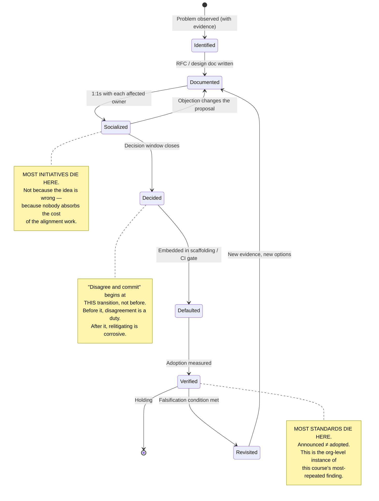

**3.2 Influence propagation vs. authority propagation**

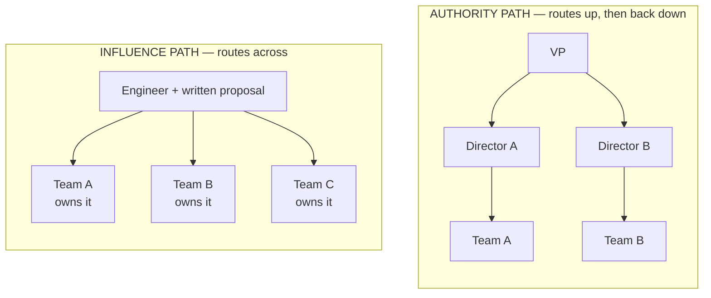

**Architecture**

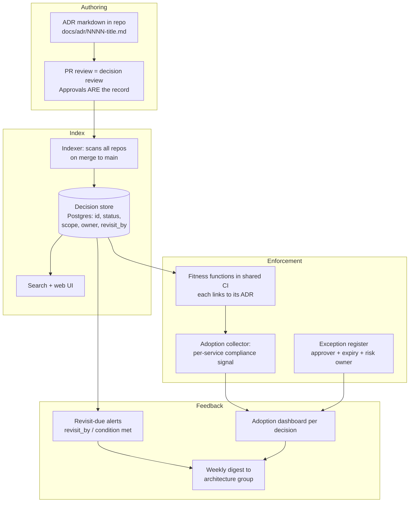

**Class diagram**

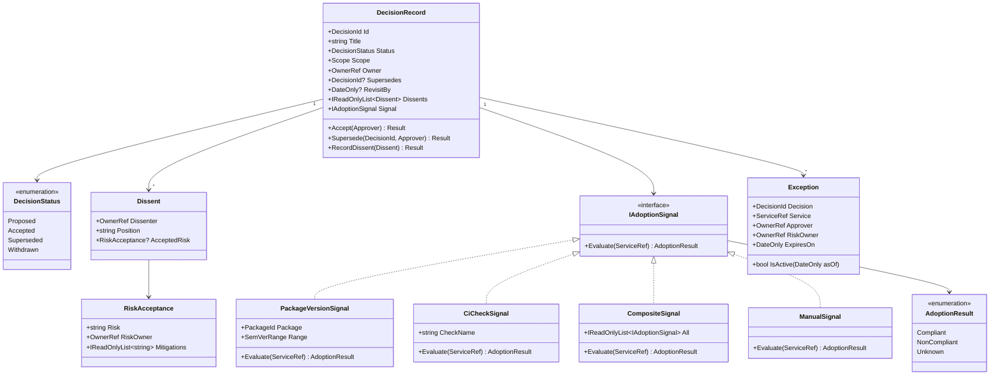

**Sequence diagram — adoption evaluation, failing closed**

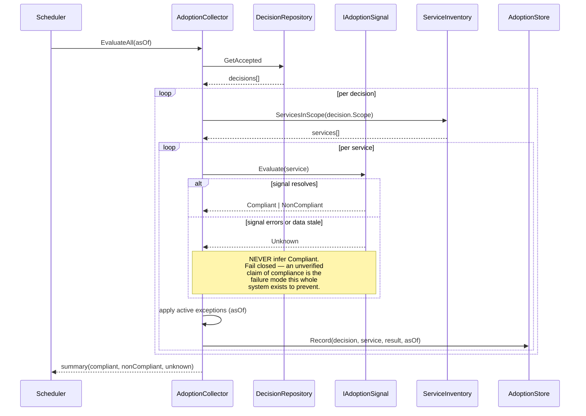

### Module 171 — Staff+ Engineering: Archetypes, Problem Selection, Glue Work & Technical Strategy
*Source: `03-StaffPlusEngineering-Archetypes-ScopeSelection-GlueWork-TechnicalStrategy.md`*

**1. Fundamentals**

```text
   MAINTAIN A MODEL OF THE ORG'S TECHNICAL REALITY
   Where the seams are. What keeps breaking. What is slow and why.
   Who is blocked on what. Built from incidents, cycle-time data,
   and conversations -- not from architecture diagrams.
                            │
                            ▼
   SELECT the highest-leverage problem you are UNIQUELY positioned
   to solve. Not the hardest, not the most interesting: the one
   where (impact x your unique positioning) is maximal.
                            │
           ┌────────────────┼────────────────┐
           ▼                ▼                ▼
           SOLVE            MULTIPLY         DOCUMENT
           directly         others           durably
           (deep work,      (design review,  (strategy,
           prototypes)      pairing,         reference impl,
                            sponsorship)     ADR)
           │                │                │
           └────────────────┼────────────────┘
                            ▼
   HAND OFF to a team that will own it permanently. A Staff
   engineer who still owns everything they have built has
   stopped being able to select new problems.
                            │
                            └──────>  back to the top (loop)
```

**2.3 Problem selection — the dominant term in the impact equation**

```text
Leverage = Impact × Uniqueness × Tractability
 ───────────────────────────────────────
 Cost

 Impact — what changes if this is solved? (incidents removed,
 velocity unblocked, risk retired, cost saved)
 Uniqueness — would this get solved anyway without me? If a team
 already owns it and is competent, my marginal
 contribution is small even if impact is large.
 Tractability — is it actually solvable in a reasonable horizon by
 someone in my position? Or is it a re-org problem
 wearing a technical costume?
 Cost — my time, plus the organizational cost of the change.
```

**3.1 Where Staff+ scope sits relative to org structure**

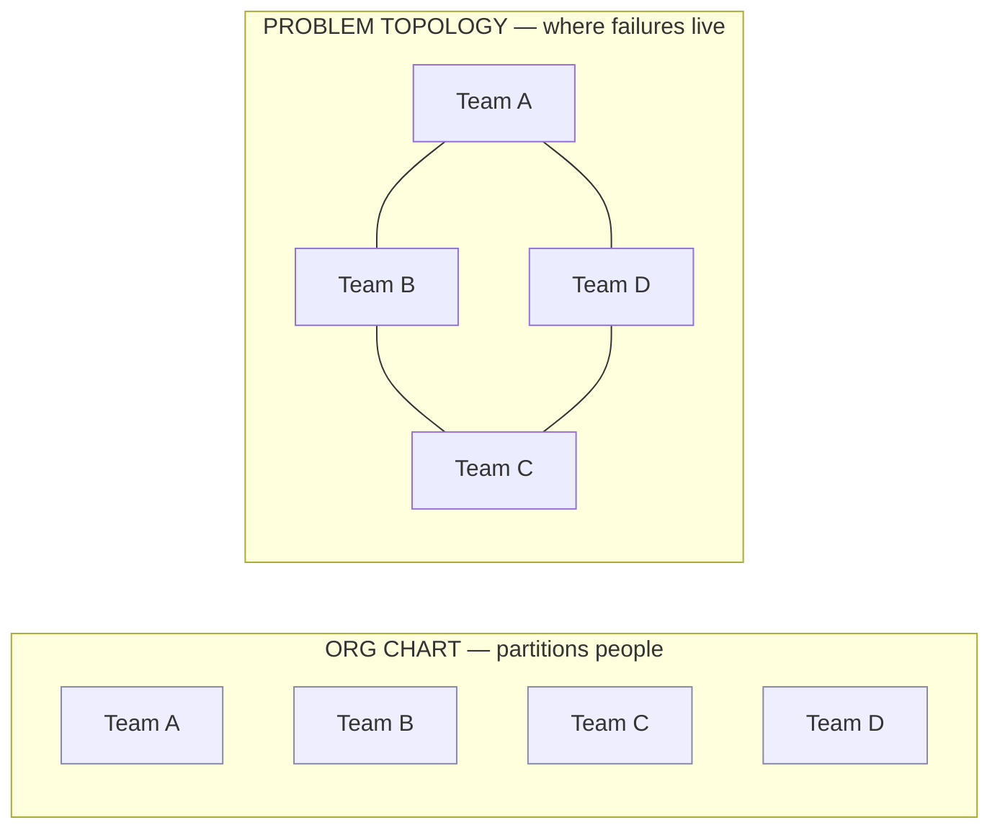

**3.2 Archetype selection as a function of organizational state**

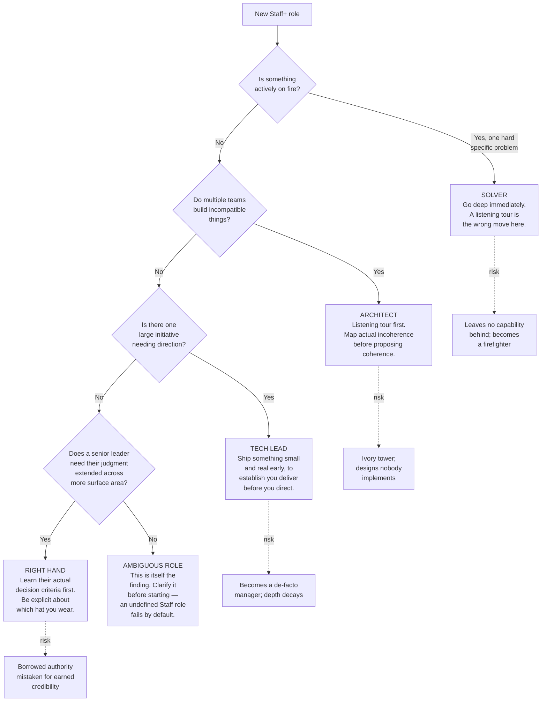

**Architecture**

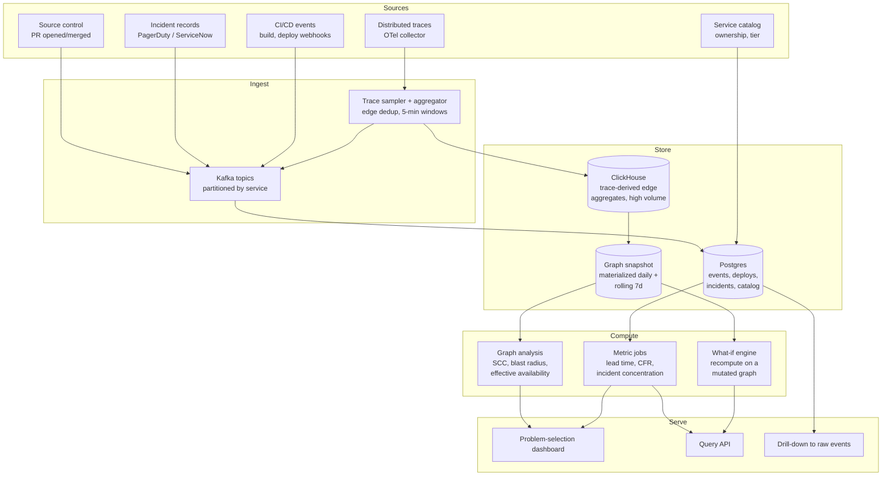

**Class diagram**

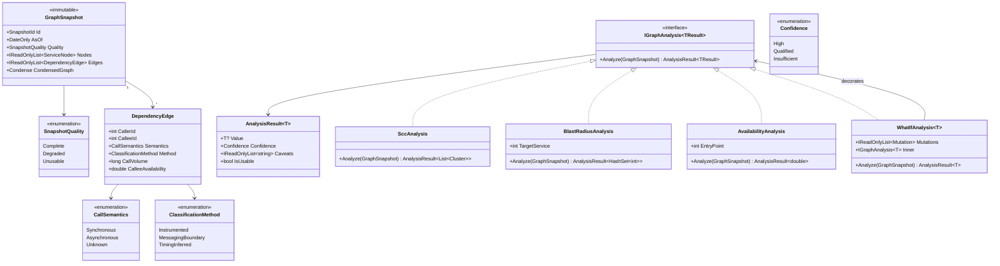

**Sequence diagram — a what-if query carrying confidence through**

```mermaid
sequenceDiagram
 participant U as Staff Engineer
 participant API as Query API
 participant Cache as ResultCache
 participant WI as WhatIfAnalysis
 participant Snap as SnapshotStore
 participant Inner as AvailabilityAnalysis

 U->>API: "If order-service→risk-service becomes async,<br/>what is checkout's availability?"
 API->>Cache: TryGet(snapshotId, mutations, analysis)
 alt cache hit
 Cache-->>API: AnalysisResult
 else miss
 API->>Snap: Load(latest)
 Snap-->>API: GraphSnapshot (Quality=Degraded,<br/>3 services missing trace data)
 API->>WI: Analyze(snapshot)
 WI->>WI: apply mutations → derived snapshot<br/>(still immutable; original untouched)
 WI->>Inner: Analyze(mutatedSnapshot)
 Inner->>Inner: traverse sync subgraph,<br/>multiply availabilities once per service
 Note over Inner: 2 edges on the path are<br/>TimingInferred → Confidence<br/>degrades to Qualified
 Inner-->>WI: AnalysisResult(0.9962, Qualified,<br/>["2 of 7 edges timing-inferred"])
 WI-->>API: result + mutation caveats
 API->>Cache: Put(key, result)
 end
 API-->>U: 99.62%, QUALIFIED<br/>Caveats: 2 of 7 edges timing-inferred;<br/>snapshot degraded — 3 services missing.<br/>Do not use for a funding decision<br/>without instrumenting those edges.
```

### Module 172 — Principal Engineering: Org-Wide Strategy, Governance at Scale, Build-vs-Buy & Risk Ownership
*Source: `04-PrincipalEngineering-OrgWideStrategy-GovernanceAtScale-BuildVsBuy-RiskOwnership.md`*

**1. Fundamentals**

```text
   MAINTAIN AN AGGREGATE MODEL OF TECHNICAL RISK & CAPABILITY
   Not systems -- the *distribution*. Where is the firm fragile?
   What is it structurally unable to do? What is it paying for and
   not getting? Built from portfolio-level data, never from personal
   familiarity (which no longer scales).
                            │
           ┌────────────────┼────────────────┐
           ▼                ▼                ▼
           SET              DESIGN THE       MAKE THE FEW
           DIRECTION        DECISION SYSTEM  BETS PERSONALLY

           Multi-year       Who decides      Build-vs-buy at
           technical        what. Golden     org scale.
           strategy.        paths so most    Platform choices.
           Explicit         decisions need   5-10 year horizons.
           non-goals.       not be made.     Irreversible, high
                            Exceptions with  blast radius.
                            expiry.          ~2-4 per year.
                            Mechanical
                            verification.
           │                │                │
           └────────────────┼────────────────┘
                            ▼
   DEVELOP THE STAFF+ LAYER THAT EXECUTES ALL OF IT
   This is not a side activity. A Principal without a capable Staff+
   population has no execution mechanism and is structurally limited
   to whatever they can personally do -- i.e. they are a Staff
   engineer with a larger title.
                            │
                            ▼
   VERIFY IN AGGREGATE
   Not "did this team comply" but "what is the distribution of
   compliance, and is it moving?" Point-in-time approval verifies
   intent; continuous measurement verifies reality.
```

**3.1 The mechanism shift, drawn**

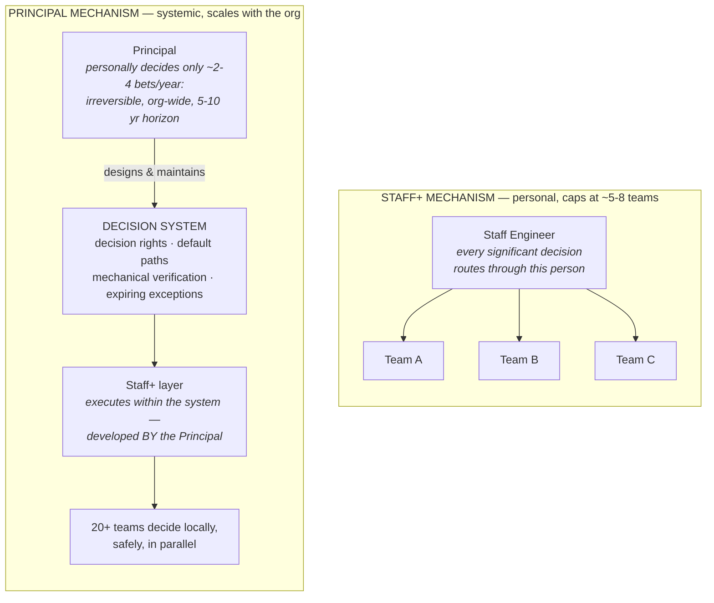

**Architecture**

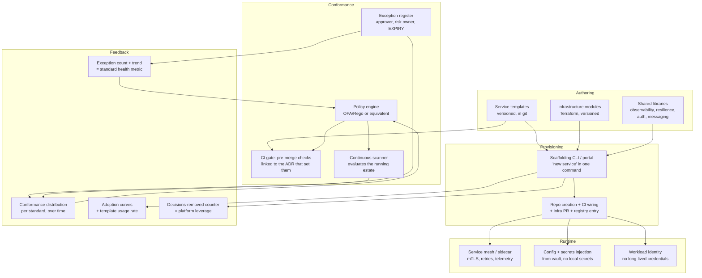

**Class diagram**

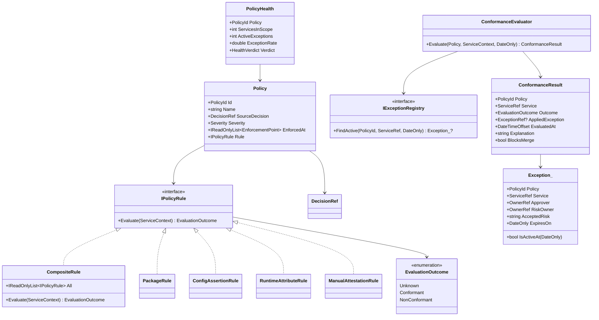

**Sequence diagram — evaluation with exception and health feedback**

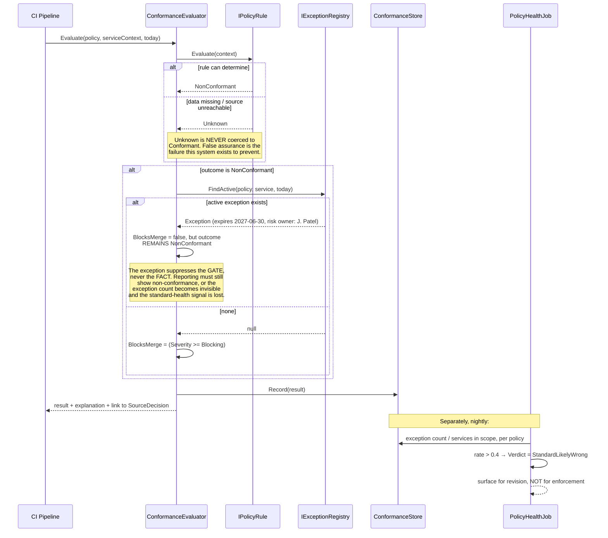

### Module 187 — Software Architecture as a Role: Decision Rights, Golden Paths & Stakeholder Translation
*Source: `05-SoftwareArchitecture-AsARole-DecisionRights-GoldenPaths-StakeholderTranslation.md`*

**1. Fundamentals**

```text
   1. UNDERSTAND WHAT ACTUALLY EXISTS
      Not the diagram -- the running estate: what calls what, what
      data flows where, what is actually load-bearing. Most
      architecture functions skip this and describe the estate they
      believe in rather than the one that exists.
                            │
                            ▼
   2. DECIDE WHAT MUST BE COMMON, AND WHAT MUST NOT
      The whole job is this boundary. Constrain interfaces, controls,
      and shared data. Leave implementation alone. Over-constraining
      is the failure that kills the function.
                            │
                            ▼
   3. MAKE THE CONSTRAINT THE PATH OF LEAST RESISTANCE
      Reference implementation, template, library, scaffold. A
      constraint that costs teams effort to honour will be honoured
      on paper only. This step separates an architect who changes
      outcomes from one who writes documents.
                            │
                            ▼
   4. VERIFY CONTINUOUSLY THAT IT HELD
      Fitness functions, conformance checks, drift detection. An
      architecture diagram is a CLAIM; something must keep the claim
      true, or it becomes fiction on a schedule.
                            │
                            ▼
   5. TRANSLATE, IN BOTH DIRECTIONS
      Business intent  ->  technical constraint.
      Technical risk   ->  business consequence.
      This is half the job in a bank, and is why the role often sits
      organizationally between engineering and the business.
```

**3.2 The drift problem, drawn**

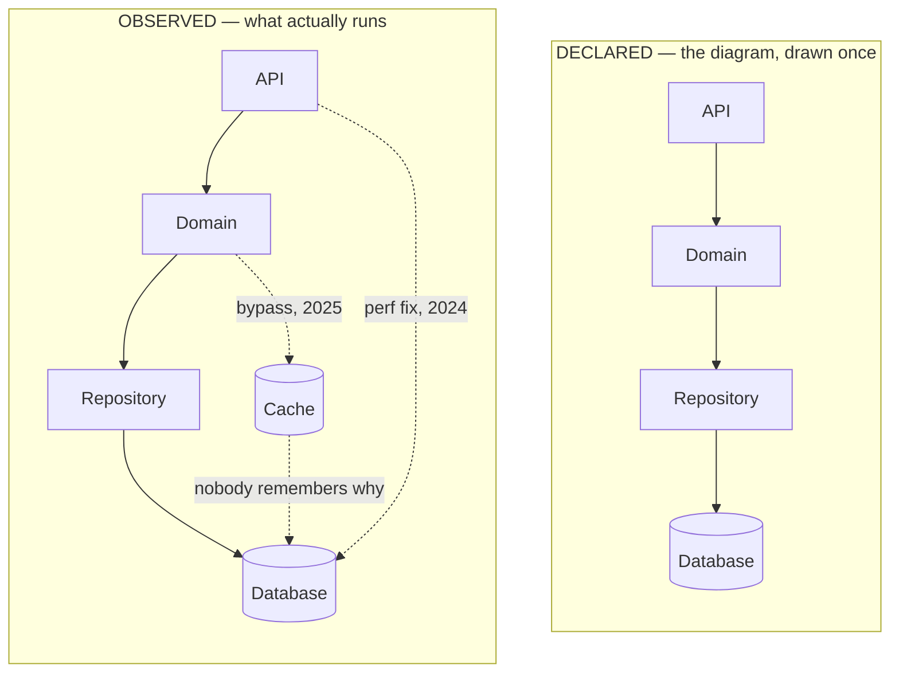

**Architecture**

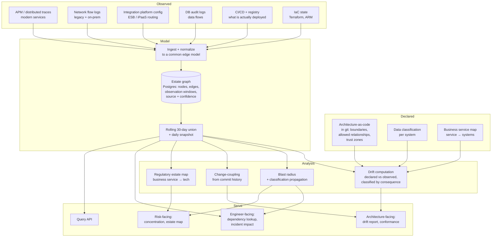

**Class diagram**

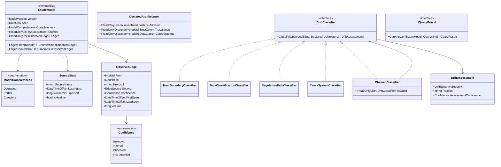

**Sequence diagram — a regulatory query against a degraded model**

```mermaid
sequenceDiagram
 participant U as Risk Analyst
 participant API as Query API
 participant G as IQueryGuard
 participant M as EstateModel
 participant Q as BlastRadiusQuery

 U->>API: "Which systems support the payment service?"<br/>(regulatory estate map)
 API->>M: LoadCurrent
 M-->>API: EstateModel(Completeness=Degraded,<br/>flow-log source stale 3 days)
 API->>G: CanAnswer(model, QueryKind.RegulatoryEstateMap)

 alt model complete
 G-->>API: Allowed
 API->>Q: Execute(model)
 Q-->>API: systems[] + confidence mix
 API-->>U: result + "derived 2026-07-25, all sources healthy,<br/>3 edges inferred (low confidence)"
 else model degraded AND query requires completeness
 G-->>API: Refused("flow-log source stale since 2026-07-22;<br/>legacy estate edges may be missing")
 Note over G,API: HARD REFUSAL, not a warning.<br/>An understated estate map submitted<br/>to a regulator is materially worse<br/>than a delayed one. The guard makes<br/>the wrong answer unavailable rather<br/>than merely discouraged.
 API-->>U: 409 — cannot answer while degraded.<br/>Missing source, expected recovery,<br/>and who to contact.
 end
```
