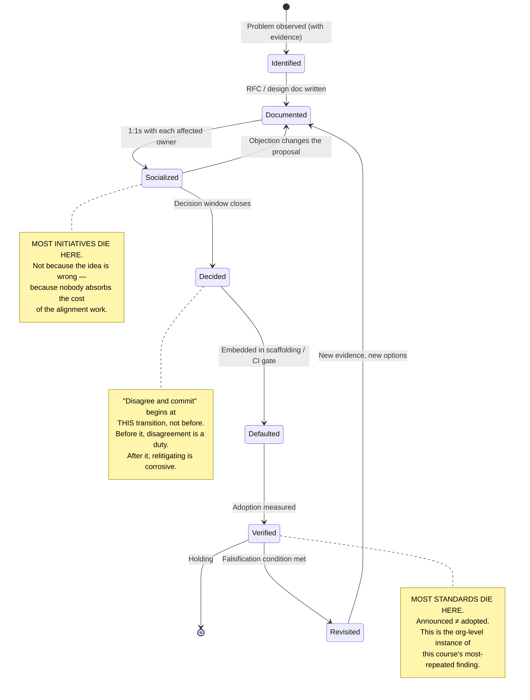
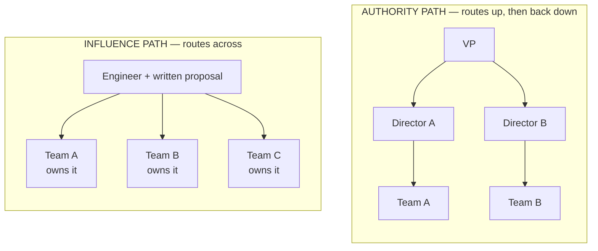
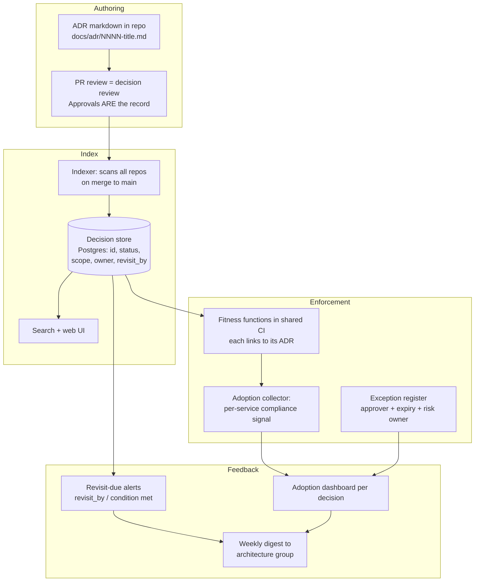
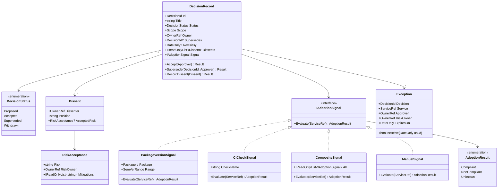
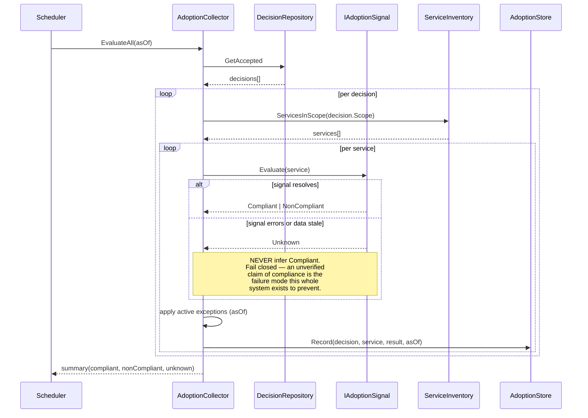

# Module 170 — Technical Leadership: Influence Without Authority, Written Leverage & Disagree-and-Commit

> Domain: Engineering Leadership (merged 51-55) | Level: Beginner → Expert | Prerequisite: [[01-EngineeringLeadership-TechnicalLeadership-StaffPlus-Principal-Architecture-Management]] (which introduced the five leadership threads in outline — this module is the first of five giving one thread the full treatment), [[../30-Architecture-Patterns/02-EvolutionaryArchitecture-FitnessFunctions-ADRs-Governance]] (the ADR mechanics, which this module uses as the *unit of written leverage*), [[../30-Architecture-Patterns/04-ArchitectureTradeoffAnalysis-PrincipalDecisionMaking]] (the honest, non-laundered decision matrices — the standard every artifact in this module is held to)

>
> **Scope note:** Earlier analysis covered all five leadership threads in a single, deliberately compressed file. That file stands as-is (this repo's established no-retrofit precedent). Modules 170–175 are the **depth pass**: five full-template modules, one per thread, plus a behavioral-interview capstone. This module takes **Technical Leadership** — the *behavior*, exercised at every level from senior engineer through Principal and by good Engineering Managers too, never a title.
>
> **A note on what makes this module different from every prior module in this course:** Modules 1–168 taught disciplines where the failure modes are mechanical — a lock is held too long, an offset is committed too early, a token is validated against the wrong issuer. This module's failure modes are *social*, and social failure modes have a property mechanical ones don't: **the person committing them is usually convinced they are behaving correctly.** An engineer who relitigates a decided decision experiences themselves as conscientious. An engineer who avoids hard feedback experiences themselves as kind. That asymmetry — between how these failures feel from inside and how they read from outside — is why this domain is interviewed for so heavily and why textbook answers fail so visibly.

---

## 1. Fundamentals

**What:** Technical leadership is the practice of driving a technical outcome to completion **through influence rather than authority** — where "authority" means the ability to direct someone's work as a condition of their employment, and "influence" means everything else: evidence, clarity, track record, reciprocity, and the willingness to do unglamorous work that makes someone else's decision easy.

The definition matters because it is *behavioral, not positional*. A senior engineer leading a migration across three teams and a Principal Engineer setting a firm-wide standard are, in that moment, doing the identical thing. An Engineering Manager who tells their reports to adopt a pattern is using authority; the same EM convincing a peer EM's team to adopt it is doing technical leadership. The title on the org chart determines how *often* you must do this, not *whether*.

**Why:** Because in any organization above roughly 50 engineers, **the number of decisions that need making exceeds the number that any authority structure can route**. Most consequential technical decisions — which serialization format the new service uses, whether the payments team's idempotency keys are compatible with the ledger team's, whether the shared library gets a breaking change — are made by people with no authority over each other. If those decisions can only be made by escalating to a common manager, the organization's decision throughput collapses to the calendar availability of a handful of directors, and its architecture becomes whatever those directors happened to have time to think about.

This is the organizational restatement of a finding this course reached repeatedly in technical form: **a central bottleneck that must approve every instance does not scale, so correctness must be pushed to the edges and verified rather than gated.** said it about architecture governance; said it about golden paths; said it about platform standards. Technical leadership is the human mechanism that makes edge-decision-making produce coherent results instead of divergent ones.

**When:** You are doing technical leadership whenever all three of these are true:
1. An outcome requires work from people you cannot direct.
2. The correct path is not self-evident to everyone (if it were, no leadership is needed — just communication).
3. Someone must absorb the cost of making it evident.

If (1) is false you have authority — use it, sparingly and explicitly. If (2) is false you have a documentation problem, not a leadership one, and treating it as a leadership problem is how organizations acquire meeting cultures. If (3) is false — if nobody is willing to absorb the cost — the initiative does not happen, regardless of how correct it is. **Most failed technical initiatives fail at (3), not at (2).** The idea was right; nobody was willing to do the six weeks of unglamorous alignment work it needed.

**How (30,000-ft view):**

```
   A technical outcome that needs work from people you cannot direct
                        │
                        ▼
   1. ESTABLISH THE PROBLEM IS REAL
      Evidence, not assertion -- incident counts, latency, cost in
      currency, velocity drag. Measured, not claimed.
                        │
                        ▼
   2. WRITE IT DOWN
      Design doc / RFC / ADR, with options compared honestly.
      This is the leverage step: a document read by 50 people
      scales an argument no meeting can.
                        │
                        ▼
   3. SOCIALIZE BEFORE YOU CONVENE
      1:1s with each affected owner BEFORE any group forum, so
      objections surface privately -- where changing your mind
      is still cheap.
                        │
                        ▼
   4. DECIDE -- AND CLOSE THE WINDOW
      Explicit decision, explicit owner, explicit date.
      Disagree-and-commit starts HERE, not before.
                        │
                        ▼
   5. MAKE IT THE DEFAULT PATH
      Scaffolding, CI gate, template, lint rule. A decision that
      requires everyone to remember it will drift.
                        │
                        ▼
   6. VERIFY IT ACTUALLY HELD
      Measure adoption, not announcement. "Verify the verifier" --
      this course's most-repeated finding, applied to a human
      decision rather than to a system.
```

Steps 1, 5, and 6 are where technical leadership differs most sharply from what candidates describe in interviews. Almost everyone describes steps 2–4. Very few describe step 1 with actual numbers, and almost nobody describes steps 5–6 at all — which is precisely why "the standard we agreed on last year is followed by three of nine teams" is such a common organizational state.

---

## 2. Deep Dive

### 2.1 Why authority-based models fail, mechanically

Consider an organization of 9 payment-processing teams. A shared concern arises: idempotency key formats have diverged, so a retry from Team A's service is not recognized as a duplicate by Team B's, producing double-posted ledger entries under retry storms.

**The authority path:** escalate to the common manager. For 9 teams the common manager is likely a Director or VP. That person must (a) acquire enough context to have an opinion, (b) adjudicate between 9 teams' local constraints, (c) issue a direction, (d) follow up on compliance. Steps (a) and (b) are the expensive ones, and they are expensive *in the scarcest resource in the organization* — senior leadership attention.

Now observe the arithmetic. If the org has ~40 such cross-cutting decisions per year and each consumes 8 hours of Director attention, that is 320 hours — about 20% of a Director's working year spent adjudicating technical detail they are, by role, furthest from. In practice what happens instead is: most of the 40 decisions never get escalated, each team solves locally, and the divergence compounds. **The authority path does not produce bad decisions; it produces absent decisions.**

**The influence path:** one engineer with no authority over any of the 9 teams writes a 6-page document establishing the incident cost with data, comparing three key-format options honestly, and recommending one. They spend two weeks in 1:1s. The decision gets made by the people who own the code, costs the Director 45 minutes of review, and — critically — the 9 teams own the outcome because they participated in it.

The influence path's cost is *front-loaded and borne by the leader*. The authority path's cost is *distributed and borne by the organization, later, as divergence*. This asymmetry is why technical leadership is undersupplied: its cost is visible and personal, its benefit is diffuse and delayed.

**The Principal-level nuance:** influence is not always correct. Authority is the right tool when (a) the decision must be made faster than consensus can form (an active incident, a regulatory deadline), (b) the decision is genuinely non-negotiable (a security control mandated by the regulator), or (c) consensus has genuinely been attempted and failed. Using influence where authority is warranted is its own failure mode — it reads as indecision and burns credibility. **The skill is not "always influence"; it is knowing which of the two the situation calls for, and being willing to use authority explicitly when it is, rather than pretending a mandated decision is up for discussion.** Fake consultation is worse than open direction: it wastes everyone's time and destroys trust in every future consultation you run.

### 2.2 Written artifacts as the primary leverage mechanism

**The core claim:** a technical leader's throughput is bounded by how many people their reasoning can reach, and writing is the only medium whose reach is decoupled from their calendar.

A meeting reaches its attendees, once, imperfectly, and produces a shared memory that diverges immediately afterward. A document reaches everyone who will ever join the team, is reviewable asynchronously across time zones (decisive in the globally-distributed engineering orgs typical at JPMC, HSBC, Standard Chartered, or Barclays), and — the underrated property — **forces the author to discover the weak parts of their own argument.** Most bad technical arguments do not survive being written down carefully. They survive being said aloud confidently.

**Anatomy of a document that actually decides something:**

| Section | Purpose | The failure mode it prevents |
|---|---|---|
| **Problem statement with evidence** | Establish the problem is real and quantified | Solving a problem nobody agrees exists |
| **Constraints and non-goals** | Bound the discussion explicitly | Scope creep in review; "what about X?" for every X |
| **Options considered (≥3, honestly)** | Show the space was genuinely explored | The reviewer suspecting the conclusion was predetermined |
| **Trade-off table** | Make comparison mechanical, not rhetorical | Advocacy disguised as analysis |
| **Recommendation with reasoning** | Take a position | The "here are some options" doc that decides nothing |
| **What would change our mind** | Pre-commit to falsifiability | Indefinite relitigation |
| **Decision, date, owner** | Close the loop | The doc that was "well-received" and changed nothing |

The **"options considered, honestly"** row is where most documents fail and where interviewers probe hardest. Earlier analysis named this precisely: a decision matrix where the recommended option happens to win on every criterion is not analysis, it is **advocacy with a table.** A genuinely honest matrix has the recommendation *losing* on at least one criterion you care about, with an explicit statement of why that loss is acceptable. A reviewer who sees a clean sweep correctly infers the alternatives were constructed to lose — and once they infer that, they stop trusting the document, and you have spent credibility to gain nothing.

The **"what would change our mind"** row is the single highest-leverage and least-used section. It converts a decision from a position into a hypothesis with a falsification condition. It makes revisiting the decision a *planned event* rather than a *social confrontation*, which is what defuses the relitigating dynamic addresses.

**Document tiering — because ceremony has a cost:**

Not every decision warrants a document. Over-formalizing is itself a leadership failure — it slows the organization for no commensurate benefit and trains people to route around process. The calibration is **scope × reversibility** (the own framework):

```
 REVERSIBLE IRREVERSIBLE
 ┌──────────────────┬──────────────────────┐
 MULTI-TEAM │ Short RFC │ Full design doc │
 / EXTERNAL │ (1-2 pages) │ + review board │
 │ │ + ADR │
 ├──────────────────┼──────────────────────┤
 SINGLE-TEAM │ Slack thread / │ ADR (1 page) │
 / INTERNAL │ PR description │ │
 └──────────────────┴──────────────────────┘
```

Two calibration notes that separate an excellent answer from an adequate one:

- **Irreversibility is usually about data, not code.** Code decisions are almost always reversible; a schema migration that drops a column, an event format published to downstream consumers, a customer-visible API contract, or a vendor contract with a 3-year term are not. In a regulated environment add a fourth: anything that has been *reported to a regulator* is irreversible in practice, because correcting it is a disclosure event, not a deploy.
- **Reversibility is a spectrum you can engineer.** The strongest technical-leadership move is often not "decide well" but "restructure the decision to be more reversible" — put the choice behind an abstraction (the branch-by-abstraction), run both in parallel (the parallel run), or ship it dark. A decision you can undo cheaply needs far less ceremony, so **reducing the ceremony cost is itself an available move**, not a fixed input.

### 2.3 Disagree and commit — the precise discipline

This is the single most-tested behavioral competency at Staff+ level, and the one candidates most often answer in a way that fails without their realizing it.

**The discipline has two halves, and the failure is almost always in the second.**

**Half one — disagree, properly:** Raise the objection *during the decision window*, in the forum where the decision is being made, with evidence rather than preference, and with a concrete alternative rather than only a critique. "I don't like this" is not a disagreement; "this couples our settlement path to a vendor with a 4-hour published RTO, which exceeds our 1-hour regulatory RTO for T+0 settlement, and here are two alternatives that don't" is.

**Half two — commit, fully:** Once decided, implement it well, defend it to others, and do not relitigate.

The precision that matters is in the word "commit," and specifically in what it **excludes**:

| Behavior | Is it committing? | Why |
|---|---|---|
| Implementing the decision well | ✅ Yes | The core of it |
| Defending the decision to a third party who wasn't in the room | ✅ Yes | The part most people skip |
| Raising *new evidence* that emerges later | ✅ Yes | This is not relitigating; see below |
| Implementing it, but telling peers privately it's a mistake | ❌ No | Fails "commit" entirely — the corrosive case |
| Implementing it deliberately poorly to prove the point | ❌ No | This is sabotage, and it is recognizable |
| Staying silent when it visibly starts failing | ❌ No | Over-corrects into a different failure |
| Re-raising the same argument with no new information | ❌ No | This is relitigating |

**The line between "raising new evidence" and "relitigating" is the crux, and it is not subjective.** It is: *has the information changed, or only your patience?* If you are making the same argument you made before the decision, with the same evidence, you are relitigating regardless of how you frame it. If you have a new incident, a new benchmark, a new regulatory notice, a new cost figure — that is new information, and raising it is not merely permitted but *obligatory*. This is why the "what would change our mind" section is so valuable: it establishes the falsification condition in advance, so producing it later is executing the agreed plan rather than reopening a fight.

**Why organizations care so much:** an organization where decisions do not durably stick cannot compose decisions. Every subsequent decision that depends on this one is built on sand, and the cost of re-deciding compounds. This is the human instance of a pattern this course found repeatedly in technical form — **composition requires that each component's guarantee actually hold**; a decision that silently doesn't stick is a component whose declared guarantee is false, and everything built on it inherits that falseness.

**The FinTech-specific weight:** in a regulated environment the "commit" half has a compliance dimension most engineers miss. If a decision was documented, reviewed, and approved through a change-management process, an engineer who quietly does something different is not merely being difficult — they have created an **undocumented deviation from an approved control**, which is an audit finding. The relitigating engineer at a payments firm is a conduct risk, not just a culture problem. Interviewers at Visa, Mastercard, Fiserv, and the major banks probe this specifically.

### 2.4 Translating technical debt into a business narrative

Engineers systematically fail to get technical debt funded, and the reason is a translation failure, not a prioritization injustice.

**What the engineer says:** "The settlement service is a mess. It's got a 4,000-line God class, no tests, and every change is terrifying."
**What the business hears:** "An engineer is aesthetically unhappy."

**The translation is to convert the internal-quality claim into an external-consequence claim, with a number.** Three currencies work, in descending order of persuasiveness:

1. **Incidents / risk realized.** "The settlement service caused 6 of our 11 Sev-2s this year. Mean time to restore on those was 3.2 hours against a 1-hour target. Two were reportable under our operational-resilience obligations."
2. **Velocity drag.** "Changes to this service take a median 14 days from PR open to production, against 2 days for our other services. We have 3 roadmap items queued behind it representing 2 quarters of committed delivery."
3. **Direct cost.** "It runs on 40 instances because it can't be scaled horizontally below whole-service granularity. Rightsizing after decomposition saves ~$180k/year."

Currency 1 is the strongest in financial services specifically, because **operational resilience is a board-level and regulator-level concern**, not an engineering preference. In the UK, the FCA/PRA operational-resilience regime requires firms to identify important business services and set impact tolerances; in the US, the OCC and Fed examine operational risk directly. An argument framed as "this system's failure rate threatens our stated impact tolerance for the payment service" reaches an audience that "this code is messy" never will.

**The three-part structure that works:**

> **Cost of the status quo** (measured, with a time period) →
> **Cost of the fix** (engineer-months, honestly, including the risk of the fix itself) →
> **What we get, and when we'd know it worked** (the metric that would move, and by when)

The third part is what distinguishes a Staff+ pitch from a senior one. Most debt pitches end at "and then it will be better." A Staff+ pitch pre-commits to a measurable outcome — "MTTR on this service drops below 1 hour and we stop being the top Sev-2 contributor by Q3" — which makes the investment *auditable* and, not incidentally, makes the next debt pitch far easier to fund because you built a track record of predicting outcomes correctly.

**The honest counter-position, which excellent candidates raise unprompted:** sometimes the right answer is *not* to fix the debt. A system scheduled for decommission in 9 months should be left alone. A system that is ugly but stable, rarely changed, and not on a critical path is *correctly* deprioritized — "ugly and untouched" is a legitimate steady state. Technical leadership includes the discipline to **not** advocate for work you'd personally enjoy. Interviewers notice when a candidate volunteers this; it signals the difference between someone who wants clean code and someone who allocates capital.

### 2.5 The credibility ledger

Influence is not a constant property of a person; it is a **balance that is earned, spent, and can go overdrawn**. Modeling it explicitly is what lets a technical leader decide which battles to fight.

**Credits are earned by:**
- Predictions that came true, *especially uncomfortable ones you documented in advance*. Saying "this will not scale past 10k TPS" and being right, on the record, is worth more than a year of good work.
- Doing unglamorous work that visibly helped someone else succeed.
- Being demonstrably willing to change your position when shown evidence. Counter-intuitively, publicly changing your mind *increases* credibility, because it proves your positions track evidence rather than ego — which makes your *unchanged* positions more believable.
- Shipping. Nothing substitutes for it. A technical leader with no recent delivery is spending down a depleting balance.

**Credits are spent by:**
- Asking a team to do work that serves your priority over theirs.
- Blocking something. (Expensive. A block spends credibility proportional to how much the blocked party wanted it.)
- Being wrong, particularly when you were confident and public.
- Escalating. Escalation is a *withdrawal against the relationship*, not a free action, and it prices in for future interactions.

Three operational consequences:

- **Do not spend credibility on decisions that don't matter.** The engineer who argues equally hard about the serialization format and the tab-versus-spaces question is teaching people to discount them uniformly. Conserving your objections is what makes them land.
- **Escalate narrowly and rarely, and tell the person first.** Escalating without warning the person you are escalating past converts a technical disagreement into a personal grievance, permanently. "I don't think we're going to converge on this and I'm going to raise it with Priya on Thursday — do you want to write your side up so she sees both?" costs you nothing and preserves the relationship.
- **Balances are domain-scoped and decay.** Credibility earned in the payments domain transfers only partly to a market-data conversation, and credibility from three years ago transfers only partly to today. This is the mechanical reason Staff+ engineers must keep genuine technical depth: depth is what refills the ledger.

### 2.6 The recognizable failure modes

Interviewers are pattern-matching against these. Each one feels virtuous from the inside, which is exactly why they persist.

| Failure mode | How it feels from inside | How it reads from outside | The correction |
|---|---|---|---|
| **The Hero** | "I'm the only one who can fix this, so I do." | Creates a bus factor of 1, prevents others growing, hoards context | Fix it *with* someone; write the runbook; make the second incident someone else's to lead |
| **The Blocker** | "I'm maintaining the quality bar." | Every proposal dies in their review; teams route around them | Distinguish "wrong" from "not how I'd do it"; block rarely, explicitly, with the condition for unblocking stated |
| **The Martyr** | "Nobody else will do the glue work, so I sacrifice." | Visibly resentful; the work is real but the resentment poisons it; also becomes a bus factor | Make the glue work visible and *shared*; if it's genuinely unowned, propose an owner rather than absorbing it silently |
| **The Passive-Aggressor** | "I'm complying, but I want it on record I disagreed." | Fails the "commit" half; corrodes the decision for everyone | Disagree in the window, then commit genuinely, and document the falsification condition instead of the grievance |
| **The Architect Astronaut** | "I'm thinking about the long term." | Proposals with no delivery attached; loses credibility with people who ship | Attach every architectural position to a concrete, near-term deliverable you personally own a piece of |
| **The Consensus Seeker** | "I'm being collaborative." | Decisions never close; the group is exhausted; the loudest voice eventually wins by attrition | Set an explicit decision date at the start; state that you will decide if consensus doesn't form; then actually decide |

The last one deserves emphasis because it is the most common failure among *technically excellent* engineers newly in a leadership role. Seeking consensus is correct; requiring unanimity is not. **The job is to make sure everyone is heard, not that everyone agrees** — and the person running the process is responsible for closing it, including against residual objection. A leader who cannot close a decision has substituted process for judgment.

---

## 3. Visual Architecture

### 3.1 The decision lifecycle — and where each failure mode attaches



### 3.2 Influence propagation vs. authority propagation



| | Authority path | Influence path |
|---|---|---|
| **Latency** | Weeks — calendar-bound | Weeks — often longer |
| **Cost falls on** | Scarce executive attention | The leader's own time |
| **Ownership produced** | Imposed → low adherence | Participatory → high adherence |
| **Concurrent capacity** | ~5 contested decisions/quarter | As many as you have capable leaders |

The critical read: **the influence path is not faster.** It is often slower for any single decision. Its advantage is that it *parallelizes* — an organization can run as many influence-path decisions concurrently as it has people willing to lead them, whereas the authority path is serialized through a small number of calendars. Candidates who claim influence is faster are usually describing a case where they had informal authority already.

### 3.3 The credibility ledger over time

A credibility balance is earned, spent, and can be overdrawn. Traced over one engineer's first two years in an organisation:

| # | Event | Direction | Why the balance moves that way |
|---|---|---|---|
| 1 | Joins the organisation | **Zero** | Credibility does not transfer from a previous employer; it is earned locally |
| 2 | Ships a small, genuinely useful thing early | **↑** | Delivery is the only unconditional deposit |
| 3 | Is confidently wrong in public about Kafka partition sizing | **↓↓** | Confidence multiplies the cost of being wrong |
| 4 | Publicly changes position when shown benchmark data | **↑↑** | Counter-intuitive: proves positions track evidence, so *unchanged* positions become more believable |
| 5 | Blocks a launch — correct call, real delivery cost | **↓** | A block always spends, in proportion to how much the blocked party wanted it |
| 6 | The Q3 incident happens exactly as they documented in advance | **↑↑↑** | A written, dated, uncomfortable prediction that came true is the single largest deposit available |

Two properties that follow from the model: the balance is **domain-scoped** (credit earned in payments transfers only partly to a market-data argument), and it **decays** — which is the mechanical reason Staff+ engineers must keep genuine technical depth rather than trading on past results.

---

## 4. Production Example

### Scenario

**Firm:** A tier-1 European bank's payments technology division. ~180 engineers across 9 teams,.NET 8 microservices on AKS, SQL Server for ledger-of-record, Kafka for inter-service events, Azure Service Bus for a legacy path still in service.

**Your role:** Staff Engineer on the Payment Orchestration team. You have authority over nobody outside your own team of 7.

**The problem:** Over 14 months, retry handling has diverged. Each of the 9 teams independently implemented idempotency, and the implementations are mutually incompatible:

- 3 teams use a client-supplied `Idempotency-Key` header, stored 24h in Redis.
- 4 teams derive a key from a hash of the request body — which means a semantically identical retry with a re-serialized JSON body (different key ordering) produces a different hash and is *not* deduplicated.
- 2 teams have no idempotency at all and rely on "the caller won't retry."

The realized cost: in the preceding 12 months, **six production incidents involving double-posted ledger entries**, of which two required manual reconciliation with the operations team over a weekend, and one was reported to the regulator as an operational incident because customer-visible balances were wrong for 3 hours. Total identified duplicate postings: 1,847 transactions, ~£2.3M gross (net-zero after correction, but the *control failure* is the finding, not the money).

**Why nobody had fixed it:** Everyone knew. It had been raised in three separate architecture forums. Each time it dissolved into a debate about whose implementation was correct, and each time the meeting ended without a decision because no one owned closing it. **This is the (3) failure: the problem was evident; nobody would absorb the cost of making it decided.**

### Architecture of the intervention

The intervention is not primarily technical. The technical answer — a shared idempotency library with a canonical key format — was obvious to everyone in month 2. The 12 remaining months were an alignment failure. So the design is a *social* design with a technical deliverable attached.

**Step 1 — Establish the problem is real, in the currency that matters (3 days).**

Not "our idempotency is inconsistent." Instead, pulled from the incident-management system and the ledger:

| Metric | Value | Source |
|---|---|---|
| Sev-1/Sev-2 incidents attributable to duplicate posting, trailing 12mo | 6 | ServiceNow incident records |
| Engineer-hours on incident response + reconciliation | ~310 | Incident timelines |
| Ops-team weekend reconciliation events | 2 | Ops escalation log |
| Regulator-reportable operational incidents | 1 | Compliance register |
| Duplicate postings identified | 1,847 (£2.3M gross) | Ledger reconciliation queries |
| Teams with *no* idempotency control at all | 2 of 9 | Code audit (half a day) |

The last row is what changed the conversation. "Two of our nine payment services have no duplicate-suppression control" is a **control gap**, and a control gap in a payments firm is not an engineering preference — it is an audit finding waiting to be written. This reframed the initiative from "engineering wants to refactor" to "we have an unremediated control gap in scope for the next internal audit," which is a sentence that gets calendar time from people whose calendars are otherwise full.

**Step 2 — Write the document (1 week).**

An 8-page RFC. Structure. The parts that mattered:

- **Three options compared honestly:** (A) canonical client-supplied key + shared library; (B) server-derived deterministic key from a normalized subset of business fields; (C) full transactional outbox with dedup at the consumer (the pattern).
- **The recommendation (A) explicitly lost on one criterion:** it requires every *caller*, including two external partner integrations, to supply a key — meaning a partner-facing API change with a 6-month deprecation window. Option B required no caller change. Stating that loss plainly, up front, is what made the rest of the document credible. Reviewers who had been burned by advocacy-disguised-as-analysis in the previous three forums specifically commented on it.
- **"What would change our mind":** if the partner-integration change proved to take longer than 2 quarters, fall back to B for the partner-facing edge and A internally, accepting a documented boundary translation.

**Step 3 — Socialize before convening (2.5 weeks).**

Nine 1:1s (or small-group) conversations with each team's tech lead, *before* any group forum. Purpose is not persuasion — it is **objection discovery while changing your mind is still cheap**. What surfaced:

- Team 4's tech lead pointed out that the proposed 24-hour key retention was insufficient for their reconciliation flow, which can legitimately retry a settlement instruction up to 5 days later. **The RFC was wrong.** Retention became configurable with a 7-day default. Catching this in a 1:1 cost 40 minutes; catching it in the group forum would have cost the proposal its credibility; catching it in production would have been incident #7.
- Team 7's lead was not opposed but had zero capacity for two quarters. This is not an objection to the decision, it is a constraint on the rollout — a distinction that matters enormously and that group forums routinely conflate. Team 7 was sequenced last, with an explicit dated commitment rather than a vague one.
- Two teams' leads had been the loudest in the previous failed forums. Both, in private, agreed readily. Their prior resistance had been to *being told* in a group setting, not to the substance. This is extremely common and is the single strongest practical argument for the socialize-before-convene rule.

**Step 4 — Decide, and close the window (1 forum, 50 minutes).**

Because every objection had been surfaced and either incorporated or explicitly acknowledged, the forum was a ratification, not a debate. The decision was recorded as an ADR with: the chosen option, the two dissenting positions and why they were not adopted, the named owner, the rollout sequence with dates, and the falsification condition.

Recording the **dissenting positions** in the ADR is a deliberate and underused move. It signals the objections were heard rather than steamrolled, it gives future engineers the context for why the road not taken was not taken, and — practically — it substantially reduces relitigating, because the dissenter's position is on the record and they no longer need to keep restating it to feel heard.

**Step 5 — Make it the default path (6 weeks).**

This is the step that separates a standard that holds from one that decays:

- A shared NuGet package `Payments.Idempotency` with an ASP.NET Core middleware — adopting it is ~4 lines in `Program.cs`, versus ~200 lines to implement it correctly by hand. **The correct path became the cheap path.**
- The service template (the golden-path scaffolding) was updated so every *new* service gets it by default with no decision required.
- An architecture fitness function added to the shared CI pipeline: any service exposing a POST endpoint under `/payments/**` without registering the middleware fails the build with a link to the ADR.
- The two teams with no idempotency were sequenced *first*, not last — closing the control gap took priority over harmonizing the teams that at least had *a* control.

**Step 6 — Verify it held (ongoing).**

A weekly automated report: for each of the 9 services, the library version in use and the dedup-hit-rate metric. Two findings from this that would have been invisible otherwise:

- One team adopted the library but configured a 60-second retention, defeating it for their retry pattern (which retries at 5 minutes). **Object present, guarantee absent** — the exact pattern this course named repeatedly across Modules 74/75/76. Caught in week 3.
- Dedup hit rate on one service was 0.0% for six weeks — not because it was working, but because the middleware was registered *after* the endpoint routing and never executed. Caught by the metric, not by review.

### Trade-offs

| Dimension | What was accepted |
|---|---|
| **Time** | ~5 weeks of one Staff engineer's time before a line of shared code was written. Real cost, borne by one team's roadmap. |
| **Partner impact** | A partner-facing API change with a 6-month deprecation. Chosen deliberately over the zero-caller-change option because server-derived keys are fragile under upstream refactoring — a correctness argument that beat a convenience argument. |
| **Autonomy** | 9 teams gave up local control of one component. Mitigated by the library being configurable where teams had genuine differing needs (retention) and rigid where they did not (key format). **Getting that boundary right is the whole game in platform work** — rigid where variance is harmful, configurable where variance is legitimate. |
| **The CI gate** | Genuinely coercive, and deliberately so, but scoped narrowly (one path prefix, one control) with a documented exception process. A broad gate would have triggered a backlash that a narrow one did not. |

### Lessons learned

1. **The problem was never technical.** The correct design was known 12 months earlier. What was missing was one person willing to absorb the alignment cost. Interviewers at this level are testing for whether you are that person, not whether you know what idempotency is.
2. **Evidence in the right currency changes the audience.** "Inconsistent idempotency" is an engineering topic. "An unremediated control gap in two payment services" is a risk-committee topic. Identical facts; entirely different rooms.
3. **The 1:1 round was worth more than the RFC.** The RFC was necessary but the objections that improved it — and the objections that turned out to be about process rather than substance — only surfaced privately.
4. **Being wrong in the RFC, publicly, and fixing it, bought more credibility than being right would have.** Team 4's retention objection was a genuine defect. Incorporating it visibly, with attribution, converted the most technically-engaged skeptic into the proposal's strongest advocate.
5. **Announcement is not adoption.** Two of nine services had the control present but non-functional. Without step 6 the initiative would have been declared a success while remaining a control gap — which is materially worse than the original state, because now everyone *believes* it is fixed.

---

## 5. Best Practices

**Do the evidence work before the persuasion work.** *Why it matters:* an argument from data survives a change of audience; an argument from authority or eloquence does not. *When to use:* always, for any cross-team initiative. *When NOT to:* when the evidence-gathering itself would take longer than the reversible decision is worth — do not spend three weeks measuring to justify a two-day change.

**Socialize privately before convening publicly.** *Why:* objections surface where changing your mind is cheap; you separate substantive objection from status objection; you avoid the dynamic where people resist *being told* in front of peers. *When NOT to:* genuine emergencies, and situations where private pre-alignment would read as backroom politics — notably when the decision affects a group that would resent being consulted in a deliberate sequence. Where that risk exists, run an open forum for *input* first, then 1:1s on the draft.

**Write the recommendation, not just the options.** *Why:* a document that surveys and does not recommend delegates the hard part back to the reader and usually decides nothing. *When NOT to:* when you genuinely are gathering input at a stage where you'd be anchoring prematurely — but say that explicitly ("this is a problem-framing doc, not a proposal") rather than hedging.

**State what would change your mind, in writing, before the decision.** *Why:* converts future disagreement from a social confrontation into an agreed check, and makes you visibly falsifiable, which is credibility-generating. *When NOT to:* rarely — this is close to universally applicable.

**Record dissent in the decision record.** *Why:* dissenters who are on the record stop needing to relitigate to be heard; future readers get the real context. *When NOT to:* if it would attribute a position to someone in a way that could harm them; anonymize if needed, but keep the substance.

**Embed decisions in defaults, not documents.** *Why:* the golden-path finding — a decision that requires every team to independently remember and correctly apply it will drift. *When NOT to:* where variance is legitimate. Enforcing uniformity on a dimension where teams have genuinely different needs is how platform teams become the thing everyone routes around.

**Measure adoption, not announcement.** *Why:* the entire course's most-repeated finding, at the organizational layer. *When NOT to:* never — but calibrate the cost of measurement to the stakes.

**Escalate rarely, narrowly, and with prior notice to the person you're escalating past.** *Why:* preserves the relationship and prices correctly. *When NOT to:* safety, security, and regulatory issues where speed dominates relationship — escalate immediately, and say so.

**Attach a delivery to every architectural position.** *Why:* the fastest way to lose standing with engineers who ship is to be the person who only opines. *When NOT to:* at genuinely high scope (Principal) the ratio shifts — but it never goes to zero.

---

## 6. Anti-patterns

**The forum-only initiative.** *What it looks like:* raising a cross-cutting concern repeatedly in architecture forums, expecting the forum to decide. *Why it fails:* forums have no owner and no follow-through; the concern is genuinely acknowledged each time and nothing happens. The bank did this three times over 12 months. *Fix:* one named person takes the pen. Forums ratify; they do not originate.

**The clean-sweep decision matrix.** *What it looks like:* a comparison table where the recommendation wins every criterion. *Why it fails:* reviewers correctly infer the alternatives were constructed as strawmen, and discount the whole document. *Fix:* find the criterion your recommendation loses on and state it first. If it genuinely loses on none, your criteria are incomplete.

**Consultation theatre.** *What it looks like:* running a consultation on a decision that has already been made or is non-negotiable. *Why it fails:* it wastes people's effort and, worse, teaches them that your future consultations are also fake — which destroys the mechanism you'll need next time. *Fix:* say "this one is mandated; I'm consulting on the *how*, not the *whether*," and mean it.

**Winning by attrition.** *What it looks like:* re-raising an argument until objectors give up. *Why it fails:* it produces compliance without belief, so the decision decays the moment you look away; and it is precisely the relitigating behavior identifies as corrosive. *Fix:* if you cannot win on evidence, either find better evidence or accept the outcome.

**The silent veto.** *What it looks like:* agreeing in the room, then deprioritizing indefinitely without explicit refusal. *Why it fails:* it is the hardest failure to detect and the most common way cross-team initiatives die. *Fix (as the leader):* extract a dated commitment, not an agreement in principle; then measure. A team that will not commit to a date is telling you no — hear it, and either resequence or escalate explicitly.

**Escalation as first resort.** *What it looks like:* routing to a manager at the first disagreement. *Why it fails:* burns relationship capital, signals inability to operate laterally (which is the entire competency being assessed at Staff+), and trains peers to escalate against you preemptively. *Fix:* exhaust the lateral path visibly, then escalate with notice.

**Debt advocacy without a currency.** *What it looks like:* "we need to pay down tech debt" with no measured cost. *Why it fails:* it competes against roadmap items that *do* have quantified value and loses every time, correctly. *Fix:* the three currencies, and pre-commit to the outcome metric.

**The permanent objection.** *What it looks like:* an engineer whose disagreement, once registered, never expires — surfacing in every retro, every design review, every incident postmortem for years. *Why it fails:* it converts a legitimate one-time objection into a persistent tax on every subsequent conversation, and it eventually gets the person excluded from forums, which costs the organization their genuine expertise. *Fix (as the objector):* register it once, in writing, with a falsification condition — then let the record carry it. *Fix (as the leader):* record their dissent explicitly so the record does carry it.

---

## 7. Performance Engineering

The template's performance section, applied honestly to a leadership topic, is about the **throughput and latency of organizational decision-making**. This is not a metaphor — these quantities are measurable and they bound engineering output.

**Decision latency.** Time from a decision being *needed* to being *made and communicated*. In most organizations this is dominated not by deliberation but by queuing — the decision waits for a forum that meets fortnightly, or for one person's calendar. Measure it: sample 20 recent cross-team decisions and record `identified → decided`. Typical enterprise values are 4–12 weeks; the deliberation content is usually under 4 hours. **The work is not the bottleneck; the queue is.** This is precisely the same finding as the on system profiling — measure before optimizing, and the bottleneck is rarely where intuition puts it.

**Decision throughput.** Decisions closed per quarter. Authority-routed decisions are serialized through a small number of calendars and cap at roughly 3–6 per senior leader per quarter for genuinely contested ones. Influence-routed decisions parallelize across as many leaders as you have. **Growing decision throughput is therefore a people-development problem, not a process problem** — the lever is more people capable of running a decision to closure, not a better forum.

**Rework rate.** Fraction of decisions reopened within 12 months. A healthy rate is *not zero* — zero means either nothing is being revisited when evidence changes (rigidity) or nothing consequential is being decided. A rate above ~25% usually indicates decisions are being closed before objections were genuinely surfaced, i.e. step 3 is being skipped.

**Adoption lag.** Time from `decided` to `adopted by 90% of affected teams`. In the example this was 6 weeks *because* the decision was embedded in scaffolding; documentation-only decisions commonly never reach 90% at all. Plotting adoption over time distinguishes a standard that is landing from one that is decaying, and it does so early enough to intervene.

**The caching analogy that actually holds:** a written decision record is a **cache of reasoning**. The first person to reason through the problem pays the full cost; everyone afterward pays a lookup. An organization without decision records recomputes the same reasoning repeatedly — which is why the same debate recurs quarterly. And like any cache, it has an invalidation problem: a decision record whose context has changed but which is still being cited is a **stale cache serving wrong results**, which is materially worse than no cache. Hence the falsification condition: it is a TTL.

**The benchmarking discipline:** before claiming a process change improved anything, capture the baseline. "We introduced RFCs and things are better" is exactly the unsubstantiated claim this course has rejected in every technical module. Capture decision latency and rework rate for one quarter before changing anything.

---

## 8. Security

Technical leadership has three specific and heavily-interviewed security dimensions in financial services.

**Psychological safety is a security control.** The dominant failure mode in security incidents is not that nobody noticed — it is that someone noticed and did not say so. An engineer who suspects they mishandled a credential, pasted a secret into a Slack channel, or deployed a misconfigured network policy will report it in an organization where reporting is rewarded and conceal it in one where it is punished. **The mean time to detect a self-inflicted security incident is a direct function of how the last person who reported one was treated.** A technical leader's most consequential security contribution is often how they respond, publicly, the first time someone self-reports a mistake. This is the human layer of defence-in-depth, and it is fragile in exactly the way a misconfigured control is not: it degrades silently.

**Blameless postmortems, and their precise limit.** Blameless means the analysis targets the system that permitted the error, not the individual who made it. It does **not** mean consequence-free: deliberate circumvention of a control, or repeated negligence after remediation, is a conduct matter, and pretending otherwise makes the blameless norm non-credible for everyone else. Excellent candidates hold both halves. Weak candidates recite "blameless" as a slogan and cannot state its boundary — which is a question interviewers at banks ask specifically, because in a regulated firm the distinction between *error* and *conduct* has legal weight.

**Escalation duty overrides the influence norm.** Everything about escalating rarely and preserving relationships is correct for ordinary technical disagreement and **wrong for security and regulatory issues**. If you believe a control is absent or bypassed, the influence path's patience is a liability. Escalate immediately, in writing, to the accountable owner, and say plainly that you are doing so. In firms subject to individual-accountability regimes — the UK's SMCR is the sharpest example — a senior engineer who knew of a control gap and handled it "diplomatically" over months has a personal problem, not just an organizational one.

**Secrets in artifacts.** A mundane but real one: the design docs, RFCs, and incident timelines that are this discipline's primary tools routinely accumulate connection strings, sample tokens, real customer identifiers in "example" payloads, and internal hostnames. These documents are typically stored in wikis with far broader read access than the code. Treat every written artifact as a potential disclosure surface: use synthetic data in examples, reference secrets by name rather than value, and check that the incident timeline you are about to share firm-wide has had customer PII scrubbed. In a PCI-DSS environment a design doc containing a real PAN is in scope for exactly the same controls as the database.

---

## 9. Scalability

**How the practice changes as scope grows.** The mechanisms do not scale uniformly — each has a range beyond which it breaks and must be replaced.

| Scope | What works | What breaks | The transition |
|---|---|---|---|
| **1 team** | Direct conversation; PR reviews; shared context is free | — | — |
| **2–5 teams** | Written RFCs; 1:1 socialization round (the pattern) | Informal alignment; "everyone was in the meeting" | You must start writing things down |
| **5–20 teams** | Named owners per domain; golden-path scaffolding; fitness functions | Personally socializing every decision — the 1:1 round becomes 20 conversations and you become the bottleneck | You must delegate decision *rights*, not just work |
| **20+ teams / org-wide** | Standards with distributed owners; exception processes; measurement | Any model where you personally review instances | You must shift from deciding to *designing the decision system* (→) |

**The specific scaling failure to name in an interview:** the technical leader who scales their influence by *doing more of it personally* hits a hard ceiling at roughly 5–8 teams and then becomes the organization's bottleneck — the exact pathology they were hired to remove. The transition that must happen is from **"I make the good decisions"** to **"I make it structurally likely that good decisions get made without me."** That is the boundary between Staff+ and Principal scope, and it is developed fully in Modules 171–172.

**Replication and single points of failure.** A technical leader who is the only person who can run a cross-team decision is a bus factor of 1 on the organization's decision throughput. The counter is deliberate: co-lead initiatives with someone less experienced and let them hold the pen; write the *process* down (a template RFC, a checklist for the socialization round) so it is transferable; and measure whether decisions are being closed by people other than you. An org where every successful cross-team initiative traces back to the same two engineers has a resilience problem it has not noticed.

**Disaster recovery, organizationally.** What happens to in-flight decisions when the person driving them leaves? In most organizations: they die silently, and are rediscovered as problems 18 months later. The mitigation is the same as the technical one — **durable state outside the process**: decisions in ADRs, in-flight initiatives in a visible register with named owners and dates, and context in documents rather than in one person's head. This is why the written artifact is not merely a persuasion tool; it is the organization's write-ahead log.

---

## 10. Interview Questions

### Basic (10)

**B1. Q: What is technical leadership, and how is it different from engineering management?**
*Ideal Answer:* Technical leadership is driving a technical outcome through influence rather than formal authority — it is a *behavior*, exercised by senior engineers, Staff+/Principal engineers, and good managers alike. Engineering management is a distinct *role* whose scaling mechanism is formal authority over people: hiring, performance, growth, org design. The two overlap (managers exercise technical leadership constantly) but are not the same thing, and neither is a promotion from the other.
*Why correct:* Separates behavior from role, and identifies influence-vs-authority as the operative distinction rather than seniority.
*Common mistakes:* Describing technical leadership as "being the most senior engineer"; treating management as the next rung above Staff engineer.
*Follow-up:* Can a mid-level engineer exercise technical leadership? (Yes — the definition is behavioral. Leading a migration across two teams is technical leadership regardless of title.)

**B2. Q: You strongly disagreed with a technical decision your team made. It has been decided. What do you do?**
*Ideal Answer:* Voice the disagreement clearly, with evidence and a concrete alternative, *during* the decision window. Once decided: implement it well, defend it to people outside the room, and do not relitigate. If genuinely new information emerges later — an incident, a benchmark, a changed constraint — raise it with that data, not as "I told you so."
*Why correct:* States both halves of disagree-and-commit and correctly locates the boundary at *new information*, not at *renewed conviction*.
*Common mistakes:* Describing compliance-with-visible-resentment ("I did it but made sure everyone knew I disagreed") — this fails the commit half entirely and is the specific behavior the question screens for.
*Follow-up:* What is the difference between committing to a decision and staying silent when it starts visibly failing? (Silence is over-correction; new evidence obliges you to speak.)

**B3. Q: Why write a design document instead of just discussing it in a meeting?**
*Ideal Answer:* Reach is decoupled from the calendar — a document reaches everyone who will ever join the team, asynchronously, across time zones. It produces a durable record rather than diverging memories. And writing forces the author to find the weak parts of their own argument, which speaking confidently does not.
*Why correct:* Names the three distinct benefits: reach, durability, and self-review.
*Common mistakes:* Only citing "documentation" — missing that the primary value is leverage and forced rigor, not record-keeping.
*Follow-up:* When is a document the wrong choice? (When ceremony exceeds the stakes — a reversible, single-team decision.)

**B4. Q: How do you decide whether a decision needs a formal RFC or just a Slack thread?**
*Ideal Answer:* Scope × reversibility. Multi-team and hard-to-reverse warrants a written, reviewable artifact; single-team and easily-reversible does not. Over-formalizing is itself a failure — it slows the organization and trains people to route around process.
*Why correct:* Gives an explicit two-axis framework and names the cost of over-ceremony.
*Common mistakes:* "Always write it down" — this is a real anti-pattern, not diligence.
*Follow-up:* Which is usually harder to reverse, a code decision or a data decision? (Data — schemas, published event formats, and anything already reported to a regulator.)

**B5. Q: What does "influence without authority" actually mean in practice?**
*Ideal Answer:* Getting work done by people who do not report to you, using evidence, clarity, reciprocity, and track record instead of direction. Practically: establishing the problem with data, writing the case down, aligning stakeholders individually, and making the desired path the easiest one.
*Why correct:* Converts an abstract phrase into concrete mechanisms.
*Common mistakes:* Describing it as charisma or relationship-building alone; the evidence and artifact work is the substance.
*Follow-up:* Is influence always the right tool? (No — emergencies, regulatory mandates, and genuinely failed consensus call for explicit authority.)

**B6. Q: How do you make the case for paying down technical debt?**
*Ideal Answer:* Translate internal-quality claims into external-consequence claims with numbers: incidents caused, velocity drag (cycle time, blocked roadmap items), or direct cost. Then state the cost of the fix honestly and pre-commit to the metric that would prove it worked.
*Why correct:* Identifies the translation as the core skill and includes the outcome commitment most candidates omit.
*Common mistakes:* Arguing from code quality directly ("it's messy," "it's hard to work in") — this loses to quantified roadmap items, correctly.
*Follow-up:* When should you *not* advocate paying down debt? (Systems being decommissioned; stable, rarely-changed, non-critical systems.)

**B7. Q: A teammate's design has a flaw you think is significant. How do you raise it?**
*Ideal Answer:* Privately first where the flaw is significant enough to be embarrassing; specifically, naming the observable consequence rather than a judgment ("under a partial network partition this leaves the ledger and the cache divergent" rather than "this design is wrong"); with a question first, because you may be missing context they have.
*Why correct:* Directness paired with respect, and genuine openness to being wrong.
*Common mistakes:* Raising it publicly first as a default; leading with the conclusion rather than the observation.
*Follow-up:* What if you raise it and they disagree? (Escalate the *evidence*, not the disagreement — propose a test that would settle it.)

**B8. Q: What is an ADR and why would you use one?**
*Ideal Answer:* An Architecture Decision Record: a short, immutable document capturing a decision, its context, the options considered, and the consequences. Its value is that future engineers encountering a surprising design can find *why* rather than assuming it was accidental — which is what prevents both cargo-culting it and carelessly reversing it.
*Why correct:* Names the actual failure it prevents (lost context) rather than just describing the format.
*Common mistakes:* Describing ADRs as documentation of *what* was built; the value is the *why* and the *rejected alternatives*.
*Follow-up:* Should an ADR ever be edited after acceptance? (No — supersede it with a new one; the record's value depends on being an honest snapshot.)

**B9. Q: Your cross-team initiative is being ignored — no explicit refusal, just permanent deprioritization. What do you do?**
*Ideal Answer:* Recognize that this *is* a refusal and treat it as one. Go to the team lead directly and ask for either a dated commitment or an explicit "no." If neither is forthcoming, either resequence around them or escalate — with prior notice to them — framing the escalation as a prioritization conflict between two legitimate priorities, which is genuinely a manager's job to adjudicate.
*Why correct:* Names the silent veto, and converts an ambiguous state into an explicit one, which is the actual move.
*Common mistakes:* Continuing to send reminders indefinitely; escalating without notice.
*Follow-up:* Why insist on a date rather than agreement in principle? (Agreement in principle is free; a date is a commitment that can be tracked and that forces the real prioritization conversation.)

**B10. Q: What makes someone's technical opinion carry weight in an organization?**
*Ideal Answer:* Track record — specifically, documented predictions that came true; recent, visible delivery; demonstrated willingness to change position when shown evidence; and having done unglamorous work that helped others succeed. Credibility is earned, spent, domain-scoped, and it decays.
*Why correct:* Treats credibility as a dynamic balance rather than a fixed attribute, and includes the counter-intuitive point about changing one's mind.
*Common mistakes:* Citing tenure or title.
*Follow-up:* Why does publicly changing your mind *increase* credibility? (It proves your positions track evidence, which makes your unchanged positions more believable.)

---

### Intermediate (10)

**I1. Q: Walk me through how you would drive adoption of a new standard across eight teams that do not report to you.**
*Ideal Answer:* Establish the problem with measured evidence in a currency the audience cares about; write an RFC comparing at least three options honestly, including where the recommendation loses; socialize 1:1 with every affected owner *before* any group forum, to surface objections while changing your mind is still cheap; close the decision explicitly with a named owner, dates, and recorded dissent; embed it in defaults (shared library, service template, CI gate) so the correct path is the cheap path; then measure actual adoption rather than announcement.
*Why correct:* Covers all six steps including the two most candidates omit — evidence-first and verify-adoption.
*Common mistakes:* Starting at the group forum; ending at "we announced it and it was well-received."
*Follow-up:* Which of those steps is most often skipped, and what does skipping it cost? (Verification — the result is a standard everyone believes is in place and is not, which is worse than a known gap.)

**I2. Q: You wrote an RFC, socialized it, and a respected senior engineer disagrees publicly in the review. How do you handle it?**
*Ideal Answer:* First, genuinely consider that they are right — a respected engineer disagreeing after socialization usually means either you missed them in the 1:1 round or they have context you lack. Ask specifically what outcome they expect that your proposal produces badly. If they are right, say so publicly and revise; that is credibility-generating, not losing. If they are not, respond to the substance in the document rather than in the thread, and if you still do not converge, record their dissent in the decision record and close the decision anyway.
*Why correct:* Leads with genuine openness, distinguishes substance from status, and — critically — is willing to close over residual objection rather than requiring unanimity.
*Common mistakes:* Treating it as a status contest; or the opposite failure, deferring automatically to seniority and never closing.
*Follow-up:* When would you *not* close over their objection? (Security, regulatory, or safety objections from someone with domain accountability — those warrant resolution, not override.)

**I3. Q: How do you tell the difference between someone raising new evidence and someone relitigating a decision?**
*Ideal Answer:* Has the information changed, or only their patience? New evidence means a new incident, benchmark, cost figure, or constraint that did not exist at decision time. Relitigating is the same argument with the same evidence, restated. The clean way to make this distinction non-subjective is to write a falsification condition into the original decision — "we would revisit this if X" — so producing X later is executing the agreed plan rather than reopening a fight.
*Why correct:* Gives an objective test rather than a judgment call, and names the mechanism that pre-empts the ambiguity.
*Common mistakes:* Treating any re-raising as relitigating, which suppresses legitimate correction and is how organizations persist in known-bad decisions.
*Follow-up:* What is the risk of being too strict about this? (Rigidity — decisions that should have been revisited are defended on process grounds.)

**I4. Q: Your decision matrix shows your recommended option winning on every criterion. Is that good?**
*Ideal Answer:* No — it is a warning sign. A clean sweep usually means the alternatives were constructed to lose, and experienced reviewers read it that way, discounting the whole document. A credible matrix has the recommendation losing on at least one criterion you genuinely care about, with an explicit statement of why that loss is acceptable. If it genuinely loses on nothing, the criteria are incomplete.
*Why correct:* Recognizes the credibility mechanics, not just the analytical form.
*Common mistakes:* Treating a clean sweep as a sign of a strong proposal.
*Follow-up:* How do you handle it when the honest loss is on the criterion your audience cares most about? (State it first, quantify it, and address it directly — burying it guarantees it surfaces later, at higher cost.)

**I5. Q: How do you build credibility when you have just joined an organization at a senior level?**
*Ideal Answer:* Ship something real and useful early, even if small — nothing substitutes for delivery. Spend the first period asking rather than asserting, because most of your prior context does not transfer and confident wrong statements are expensive early. Find the unglamorous problem everyone complains about and nobody owns, and fix it. Deliberately withhold opinions on decisions that do not matter, so that your first strong position is on something that does.
*Why correct:* Recognizes credibility is earned locally and that early confident wrongness is disproportionately costly.
*Common mistakes:* Leading with a re-architecture proposal in the first month; assuming credibility transfers from the previous employer.
*Follow-up:* How long before you should be taking strong positions? (When you can state the local constraints that make the obvious answer wrong — that is the test that you have context, not tenure.)

**I6. Q: Two teams you need are in genuine conflict — Team A wants a synchronous API, Team B insists on events. Neither reports to you. How do you resolve it?**
*Ideal Answer:* Find the requirement underneath each position. "Synchronous" usually encodes a real need — a user waiting on a result, or a consistency requirement. "Events" usually encodes decoupling or load isolation. These are frequently both satisfiable (synchronous read path, asynchronous write propagation; or a synchronous facade over an event-driven core). If they are genuinely irreconcilable, make the trade-off explicit and dated — quantify the latency cost of the event path and the coupling cost of the sync path — and take it to the accountable owner as a decision with a recommendation, not as a dispute to arbitrate.
*Why correct:* Moves from positions to interests, and if that fails, escalates a *decision* rather than a *conflict*.
*Common mistakes:* Splitting the difference into an architecture neither team wanted; or escalating the disagreement itself, which asks a manager to do the technical work.
*Follow-up:* What if the real conflict is that Team B does not trust Team A's uptime? (Then the disagreement is about reliability, not architecture — address the actual concern with SLOs and error budgets.)

**I7. Q: How do you quantify the cost of technical debt for a business audience?**
*Ideal Answer:* Three currencies in descending order of persuasiveness: incidents realized (count, severity, MTTR against target, any regulator-reportable events); velocity drag (cycle time for this component versus the fleet median, and the roadmap items queued behind it); and direct infrastructure cost. In financial services, incidents are strongest because operational resilience is a board and regulator concern, not an engineering preference — framing a debt item as a threat to a stated impact tolerance reaches an audience that code-quality arguments never will.
*Why correct:* Ranks the currencies and grounds the ranking in why the fintech audience specifically responds to the first.
*Common mistakes:* Using a "technical debt score" from a static-analysis tool as the argument — it measures the wrong thing for this audience.
*Follow-up:* How do you get the incident data if incidents are not tagged by service? (Half a day reading incident timelines manually — this is exactly the unglamorous evidence work that makes the argument, and doing it yourself is credibility-generating.)

**I8. Q: You are the technical lead on a project that is going to miss its date. When and how do you communicate that?**
*Ideal Answer:* As soon as you believe it, not when it becomes undeniable — the value of the information decays fast, because it is only actionable while there is still time to change scope or resources. Communicate: the revised estimate with your confidence in it, *why* it changed, the options (cut scope, add time, add people with the honest caveat that late additions usually slow delivery), and your recommendation. Never deliver a slip without options.
*Why correct:* Prioritizes early communication and treats the slip as a decision to be made rather than news to be reported.
*Common mistakes:* Waiting for certainty; reporting the slip without a recommendation; over-promising recovery to soften it.
*Follow-up:* What if you have slipped the same date twice already? (Then your estimation process is the problem, and you should say so explicitly and change it — a third confident date has no credibility.)

**I9. Q: How do you run a design review that produces a decision rather than a discussion?**
*Ideal Answer:* Circulate the document in advance and require it to be read — the meeting is for objections, not exposition. State the decision to be made and the decision date at the top. Timebox discussion per open question. Assign every unresolved item an owner and a date rather than letting it float. Close by stating the decision explicitly out loud, including who dissented, and record it same-day.
*Why correct:* Names the specific mechanisms — pre-reading, explicit framing, timeboxing, and an explicit close — rather than describing facilitation generally.
*Common mistakes:* Presenting the document in the meeting, which consumes the time that objections needed; ending without an explicit stated decision.
*Follow-up:* What do you do when people clearly have not read it? (Take the 10 minutes of silent reading — it is cheaper than a discussion built on misunderstanding, and doing it once establishes the norm.)

**I10. Q: Describe how you would introduce a practice like ADRs to a team that does not use them and is skeptical of process.**
*Ideal Answer:* Do not propose it as a policy. Write ADRs yourself for your own decisions, keep them genuinely short, and reference them when someone asks "why is this like this?" — the value becomes visible without argument. Once two or three people have benefited, propose it lightly. Skeptical teams reject process pitched abstractly and adopt it when it demonstrably saved them time.
*Why correct:* Demonstration over mandate, which is the influence-path pattern applied to process adoption itself.
*Common mistakes:* Proposing a template and a policy first; making them long, which confirms the skeptics' fear.
*Follow-up:* What if leadership mandates it firm-wide instead? (Then your job shifts to making the mandated thing genuinely cheap — the template, the examples, the tooling — because a mandated process with high friction gets satisfied nominally and not substantively.)

---

### Advanced (10)

**A1. Q: You have run the socialization round, incorporated objections, and closed the decision. Six months later, adoption is at 40%. What went wrong and what do you do?**
*Ideal Answer:* Most likely the decision was never embedded in defaults — it lives in a document that requires every team to remember and correctly apply it, which reliably drifts. Diagnose first: is the 60% non-adoption *refusal* (they disagree), *friction* (adopting is expensive), or *invisibility* (they do not know)? These have entirely different fixes. Friction is most common and is addressed by making the correct path cheaper than the alternative — a library, a template, a scaffold. Then add a mechanical check so drift is detected rather than assumed absent. If it is genuinely refusal, the decision was closed prematurely and needs reopening honestly rather than enforcing.
*Why correct:* Distinguishes three causes with different remedies rather than jumping to enforcement, and names the golden-path fix.
*Common mistakes:* Escalating for compliance immediately, which addresses refusal but not friction — and friction is the usual cause.
*Follow-up:* How would you have detected this at 8 weeks instead of 6 months? (An adoption metric defined at decision time, reported automatically.)

**A2. Q: A VP asks you to publicly support a technical direction you believe is wrong. How do you handle it?**
*Ideal Answer:* Separate two questions: is it wrong, or is it not what I would have chosen? If the latter, support it — that is disagree-and-commit at the appropriate scale. If genuinely wrong, state the specific risk with quantified consequence privately first, and propose what would need to be true for you to be comfortable. If the business knowingly accepts the risk with full information, you can support the *decision* while ensuring the risk is documented with a named owner. What you cannot do is publicly assert a technical claim you believe is false — that spends the credibility that makes you useful, and in a regulated firm it may be a personal accountability issue.
*Why correct:* Distinguishes preference from correctness, offers the documented-risk-acceptance path, and identifies the line that cannot be crossed.
*Common mistakes:* Framing it as refuse-or-comply; missing that the durable move is making the risk visible and attributable rather than winning the argument.
*Follow-up:* What if they decline to document the risk? (That refusal is itself information, and in a regulated environment it is escalatable on its own — a risk that cannot be written down is one someone does not want owned.)

**A3. Q: How do you handle an engineer who is technically excellent but whose review comments consistently block their peers' work?**
*Ideal Answer:* Name the pattern with specific examples rather than a general characterization, and establish the distinction they are likely collapsing: between "this is wrong" and "this is not how I would do it." Ask them to reserve blocking for the former and to make every block include the explicit condition for unblocking. Frame it around impact they care about — their blocking is reducing the throughput of engineers they are trying to help, and it is causing people to route around their genuinely valuable expertise. If it persists, it is a performance conversation about collaboration, and their manager needs to own it.
*Why correct:* Targets the specific cognitive distinction, gives a concrete behavioral ask, and correctly routes the escalation.
*Common mistakes:* Framing it as "be nicer," which misses the mechanism; or avoiding it because the person is valuable, which is how the pattern persists for years.
*Follow-up:* What if you are their peer with no authority? (Raise it directly with them once, specifically; if unchanged, raise the *impact* with their manager — the pattern, not the person.)

**A4. Q: Your organization has a standard that everyone agrees with and nobody follows. Diagnose it.**
*Ideal Answer:* Universal agreement plus universal non-compliance almost always means the standard is more expensive to follow than to ignore, and there is no consequence for ignoring it. "Agreement" in that state is cheap — agreeing costs nothing. The diagnosis is a friction problem, not a belief problem. Fix by inverting the economics: make compliance the default (scaffolding, library, template) so following it requires no effort, and add detection so drift is visible. If compliance genuinely cannot be made cheap, the standard is probably wrong for at least some of the cases it claims to cover, and should be narrowed rather than enforced.
*Why correct:* Reads "agreement without compliance" as an economic signal rather than a discipline failure, and allows that the standard itself may be the problem.
*Common mistakes:* Concluding the organization lacks discipline and proposing enforcement.
*Follow-up:* Give an example of a standard that cannot be made cheap. (Anything requiring genuine per-case judgment — e.g. "services must define meaningful SLOs." You can scaffold the mechanism but not the judgment, so these need review rather than automation.)

**A5. Q: How do you lead technically when you are the least experienced person in the domain?**
*Ideal Answer:* Lead the *process*, not the content. You can run a rigorous decision without being the deepest expert: extract the options from the experts, insist the trade-offs are stated honestly, make sure the quiet expert is heard as much as the loud one, force the criteria to be named before the options are scored, and close the decision. Be explicit that you are facilitating rather than adjudicating. This is genuinely valuable and is frequently what a room of experts lacks — several strong opinions and nobody closing.
*Why correct:* Separates process leadership from technical adjudication, which is a distinction Staff+ engineers must be able to operate.
*Common mistakes:* Faking expertise, which is detected immediately and is unrecoverable; or abdicating, leaving the decision unclosed.
*Follow-up:* What is the risk of process-only leadership? (You can be manipulated by a confident expert into a bad decision — mitigate by requiring falsifiable claims and by asking each expert to argue the other's position.)

**A6. Q: An initiative you drove failed. How do you handle the postmortem when you were the decision-maker?**
*Ideal Answer:* Run it as you would any incident review — targeting the decision process rather than the people, including yourself. State plainly what you got wrong and what information you had at the time, distinguishing a *bad decision* (wrong given what was knowable) from a *bad outcome* (right decision, unlucky result); conflating them teaches the organization to avoid all risk. Identify the specific signal you missed and what would need to change to catch it next time. Doing this publicly and without defensiveness is one of the highest-credibility acts available, and it licenses everyone else to do the same.
*Why correct:* Holds the decision-versus-outcome distinction, which is the analytically important one, and recognizes the modeling effect.
*Common mistakes:* Excessive self-flagellation, which is as unhelpful as defensiveness and makes others uncomfortable reporting their own failures; or quietly not running the postmortem at all.
*Follow-up:* How do you tell a bad decision from a bad outcome? (Ask whether a reasonable person with the same information would have decided the same way. If yes, the process was sound and only the outcome was bad — the lesson is about information, not judgment.)

**A7. Q: How do you decide which technical battles to fight?**
*Ideal Answer:* Explicitly, as a budget. Credibility is a finite, spendable, domain-scoped balance. Fight where the decision is hard to reverse, where the blast radius is large, or where a control or regulatory obligation is at stake. Concede where the decision is reversible, locally-scoped, or where you would be arguing preference. The engineer who argues equally hard about everything teaches people to discount them uniformly — conserving objections is what makes them land. And crucially, *say* you are conceding: "I'd have done this differently, but it's reversible and it's your call" builds credibility rather than spending it.
*Why correct:* Treats it as capital allocation with an explicit criterion, and includes the visible-concession move.
*Common mistakes:* Framing it as picking your battles for political reasons rather than as a reversibility and blast-radius calculation.
*Follow-up:* What is the cost of never fighting? (You become someone whose agreement carries no information, which is a different way of being ignored.)

**A8. Q: You discover a peer team is about to ship something you believe will cause a production incident. You have no authority and they are a day from release. What do you do?**
*Ideal Answer:* Move fast and go directly. Tell them immediately, specifically, and in writing — the exact failure mode, the conditions that trigger it, and ideally a test or a query that demonstrates it. Offer to help rather than to block. If they disagree and you are confident it is a genuine production risk rather than a preference, escalate immediately with prior notice to them — this is one of the cases where the escalate-rarely norm is overridden, because the cost of being right and silent exceeds the relationship cost. Frame the escalation as "I may be wrong, and here is why I think the risk warrants a day," not as an accusation.
*Why correct:* Recognizes that time-criticality and production risk override the ordinary influence patience, while preserving the notice norm.
*Common mistakes:* Extended diplomatic approach under time pressure; or escalating without telling them, which converts a technical concern into a permanent grievance.
*Follow-up:* What if you escalate, they ship anyway, and you were right? (Do not say so. Contribute to the postmortem factually, and let the record speak — the credibility accrues without you claiming it, and claiming it forfeits it.)

**A9. Q: How do you scale technical leadership beyond the point where you can personally socialize every decision?**
*Ideal Answer:* Stop scaling by doing more of it personally — that hits a ceiling around 5–8 teams and turns you into the bottleneck you were meant to remove. Shift to designing the decision system: delegate decision *rights* by domain to named owners, invest in golden-path defaults so most decisions never need to be made at all, define a narrow exception process, and measure outcomes rather than reviewing instances. Develop other people who can run a decision to closure — decision throughput is a people-development problem, not a process problem.
*Why correct:* Names the specific ceiling, the bottleneck pathology, and the transition to system design — the Staff-to-Principal boundary.
*Common mistakes:* Proposing better tooling or more forums, which optimizes the wrong thing.
*Follow-up:* How do you know you have become the bottleneck? (Decisions in your domain wait on your calendar; and no cross-team initiative in the last year was closed by anyone but you.)

**A10. Q: How do you handle being consistently overruled by someone more senior whose technical judgment you think is worse than yours?**
*Ideal Answer:* First, seriously entertain that you are wrong — "more senior with worse judgment" is a conclusion that is right sometimes and is also the most common self-serving misreading in engineering, usually because they are weighting constraints you are not seeing. Test it: make specific, falsifiable predictions in writing before the outcomes are known, and check your hit rate over a few decisions. If you are consistently right on the record, that record is the argument, and you present it as a pattern rather than relitigating individual decisions. If you are not, you have learned something valuable. If you are right and it changes nothing, that is genuine information about whether the role is worth staying in — and recognizing that is a legitimate outcome, not a failure.
*Why correct:* Leads with genuine falsifiability rather than assumed correctness, gives a concrete mechanism, and does not pretend every situation is salvageable.
*Common mistakes:* Assuming the premise; or the opposite, deferring indefinitely to seniority and losing the value of genuine expertise.
*Follow-up:* How do you make predictions falsifiable without appearing to set traps? (Frame them as risks to monitor with agreed thresholds, in the decision record — which is a service, not a trap.)

---

### Expert (10)

**E1. Q: You are asked to establish a firm-wide engineering standard at a bank where three regional divisions have historically operated with full autonomy and are actively hostile to central mandates. Design your approach.**
*Ideal Answer:* Do not lead with the standard. Lead with a problem all three divisions independently acknowledge — usually an incident class, an audit finding, or a cost that shows up in all three. Establish that shared problem with each division's *own* data, not aggregate data, because aggregate data invites "that's the other region's problem." Then propose the standard as a *minimum interoperability contract* rather than a uniform implementation: specify the interface and the guarantee, leave the implementation to each division. This distinction is decisive — divisions resist losing implementation autonomy far more than they resist a contract, and most of the value of a standard lives in the contract anyway. Build it with a working group containing a respected engineer from each division, and let them present it rather than presenting it yourself; a standard proposed by the regions is a different object from one proposed by the centre. Enforce mechanically only at the boundary (the contract), and give each division a documented exception path with a named approver, because an exception process that exists is what makes the standard credible rather than aspirational.
*Why correct:* Attacks the actual obstacle (autonomy loss) by narrowing the standard's scope to interfaces, and uses local authorship for legitimacy — this is how firm-wide standards actually land in federated organizations.
*Common mistakes:* Proposing a uniform implementation standard; using aggregate data; enforcing without an exception path, which guarantees either revolt or nominal compliance.
*Follow-up:* What if one division simply refuses? (Then you need the accountable executive, and the ask should be narrow — the contract at the boundary only — because a broad mandate will be conceded nominally and evaded substantively.)

**E2. Q: Distinguish the cases where influence is the wrong tool and authority should be used explicitly. Give the decision rule.**
*Ideal Answer:* Authority is correct when (a) the decision must be made faster than consensus can form — an active incident, a regulatory deadline; (b) the decision is genuinely non-negotiable — a mandated control, a legal obligation — where consultation would be theatre; or (c) consensus has been genuinely attempted, at cost, and failed, and the cost of no decision now exceeds the cost of an imposed one. The rule is: **influence is the default because it produces ownership; authority is correct when the cost of delay or the non-negotiability of the outcome exceeds the value of that ownership.** The critical discipline is being *explicit* about which you are using. Running a consultation on a decision that is actually mandated is worse than open direction — it wastes effort and destroys trust in every future consultation, which is the mechanism you will need next time.
*Why correct:* Gives three concrete triggers and a general rule, and identifies fake consultation as the specific failure that damages the influence mechanism itself.
*Common mistakes:* Treating influence as always superior; failing to name the explicitness requirement.
*Follow-up:* How do you preserve goodwill when using authority? (Say plainly that it is a directive and why consultation is not being run — people accept explicit direction far better than they accept discovering their input was decorative.)

**E3. Q: An engineer on another team has been quietly circumventing an approved control — using a shared service account instead of the per-service identity your standard mandates — because it is faster. Walk me through your handling in a regulated firm.**
*Ideal Answer:* This is not a technical-leadership situation; it is a control deviation, and the ordinary influence patience is the wrong tool. Verify the facts precisely first. Then it must be reported through the proper channel — the risk or compliance function and the accountable owner — regardless of how sympathetic the engineer's reasoning is, because an undocumented deviation from an approved control is an audit finding whether or not it is discovered internally, and choosing not to report it makes you party to it. Tell the engineer you are reporting it and why. Separately, and importantly, treat the friction they were routing around as a real signal: if the compliant path is slow enough that a competent engineer circumvented it, the compliant path is a defect and fixing it is the durable remediation. Handle both — the reporting is non-negotiable, the friction fix is what prevents recurrence.
*Why correct:* Correctly identifies that escalation duty overrides the relationship norm, holds the line on reporting, and still extracts the systemic lesson.
*Common mistakes:* Handling it "diplomatically" by asking them to stop — which leaves an unreported control deviation and creates personal exposure under individual-accountability regimes; or reporting it punitively without addressing the friction, guaranteeing recurrence.
*Follow-up:* How do you keep this from destroying your ability to influence that team? (Tell them first, be factual rather than accusatory, and visibly champion the friction fix — being the person who reported it *and* fixed the cause is a different reputation from being the person who reported it.)

**E4. Q: How do you build a culture where engineers raise problems early, and how would you know if you had failed?**
*Ideal Answer:* The mechanism is that the observed consequence of raising a problem must be better than the observed consequence of concealing it — and this is learned from watching what happens to *other* people, not from stated policy. So the highest-leverage acts are public: how you respond the first time someone self-reports a mistake, whether the person who escalated a slip early was visibly treated better than the one who reported it late, and whether you visibly change decisions in response to bad news. Blameless postmortems matter but must retain their boundary: error is systemic, deliberate control circumvention is conduct — a blameless norm without that boundary is not credible and everyone knows it. **How you would know you failed:** the leading indicator is not incident count but *when* you learn about things. Problems surfacing at the deadline rather than three weeks before, incidents discovered by monitoring rather than by the engineer who caused them, and postmortems that are unanimously agreed and produce no action items are all signs the reporting channel is closed. A genuinely healthy org has *more* early bad news, not less.
*Why correct:* Identifies the learning mechanism (observation of others' consequences), holds the blameless boundary, and gives falsifiable failure indicators — the second half is what most candidates cannot produce.
*Common mistakes:* Describing culture as a set of stated values; using low incident counts as evidence of health, when they equally indicate suppressed reporting.
*Follow-up:* What single act most damages this? (Punishing someone visibly for a self-reported error — one instance teaches the whole organization, and recovery takes years.)

**E5. Q: You have been asked to reverse a major architectural decision you personally championed two years ago, and the reversal is correct. How do you handle it, given you have staked credibility on it?**
*Ideal Answer:* Lead the reversal yourself, publicly and early. State plainly what changed — new information, changed scale, changed constraints — and separate honestly whether it was a bad decision or a good decision overtaken by events, because the two carry different lessons and conflating them either lets you off the hook or punishes sound judgment. If it was genuinely wrong given what was knowable, say that too. Counter-intuitively this is the single largest credibility-generating act available: it proves your positions track evidence rather than ego, which makes every position you hold *afterwards* more believable. The alternative — defending it, or letting someone else lead the reversal while you stay quiet — costs far more, because everyone can see it and the inference they draw is about your judgment generally.
*Why correct:* Recognizes the counter-intuitive credibility mechanics and holds the bad-decision-versus-bad-outcome distinction.
*Common mistakes:* Defending the original decision on sunk-cost grounds; or over-apologizing, which is its own signal and makes others reluctant to take positions.
*Follow-up:* How do you protect people who backed you? (Own it publicly and specifically as your decision — the people who supported it followed a documented, reasoned recommendation, which is exactly what you want people to keep doing.)

**E6. Q: Your organization's decision-making is too slow. You have measured it: median time from problem identified to decision made is 9 weeks, and actual deliberation is under 4 hours. Diagnose and fix.**
*Ideal Answer:* The 4-hours-of-work-in-9-weeks ratio says this is a queuing problem, not a deliberation problem — exactly the finding established for system profiling. Diagnose where the queue is: waiting for a fortnightly forum, waiting on one person's calendar, waiting for someone to volunteer to own it, or waiting because no one knows who decides. Each has a different fix. Unclear decision rights is the most common and the most fixable: publish, per decision class, who decides and who is consulted, so nothing waits to discover its owner. Forum-queuing is fixed by allowing async decisions with a comment deadline rather than requiring a meeting slot. Owner-vacuum is the hardest — it means nobody will absorb the cost, which is a capability and incentive problem, not a process one. Then re-measure; a process change without a before-and-after is exactly the unsubstantiated claim this course rejects everywhere else.
*Why correct:* Reads the ratio correctly as queuing, enumerates causes with distinct fixes, and insists on measurement.
*Common mistakes:* Adding a forum, which usually increases latency; optimizing the deliberation, which is 4 hours out of 9 weeks.
*Follow-up:* Why is the owner-vacuum case hardest? (Because it means the organization is not rewarding the alignment work — you cannot process-fix an incentive problem.)

**E7. Q: How do you exercise technical leadership across a genuinely distributed organization — London, Singapore, New York — where synchronous alignment is nearly impossible?**
*Ideal Answer:* Distribution forces the written mechanism from a good practice to the only viable one, and it changes what a document must contain: it must be readable without the author present, which means the objections must be anticipated and answered in the text rather than in the room. Practically: write the decision with an explicit comment deadline spanning at least two working days in every region; make the default an async decision with a synchronous session only if unresolved objections remain; rotate whatever synchronous meetings do exist so the same region is not always taking the 10pm call, because who absorbs the timezone cost is read as a signal about whose region matters. Watch specifically for the pathology where the region co-located with leadership makes the real decisions and the others receive them — this is the most common failure in distributed banks and it is corrosive; the counter is having decisions authored and owned by the remote regions, not merely reviewed by them.
*Why correct:* Identifies the specific structural pathology of distributed orgs and the ownership-based counter, rather than generic remote-work advice.
*Common mistakes:* Treating it as a tooling problem; proposing more synchronous meetings, which taxes the remote regions further.
*Follow-up:* How do you detect the co-location pathology? (Look at who authored the last 20 accepted decision records — if they are overwhelmingly from one region, the others are not participating regardless of what the process says.)

**E8. Q: A decision you closed is being quietly ignored by one team, and you suspect their manager is tacitly endorsing it. How do you proceed?**
*Ideal Answer:* Establish the fact before the intent — get the adoption data and verify the non-compliance is real, because "quietly ignored" is often actually friction or invisibility (A1's three causes). If it is real, go to the manager directly and privately, and ask rather than accuse: there may be a constraint you do not know, and if so it is genuine information about whether the decision was right. If they confirm they are deprioritizing it, ask for either a date or an explicit exception request through the documented process — the point is to convert a silent deviation into a visible one, because a documented exception is a manageable organizational state and a silent one is not. If they will do neither, escalate with notice, and escalate the *unmanaged deviation* rather than the personality, because that is the thing your management chain can actually act on. In a control-relevant domain, an undocumented deviation is escalatable on its own terms regardless of anyone's intent.
*Why correct:* Verifies before attributing, and correctly frames the objective as converting silent deviation into documented exception rather than as winning compliance.
*Common mistakes:* Escalating on suspicion without adoption data; framing the escalation as a conflict with the manager rather than as an unmanaged deviation.
*Follow-up:* Why is a documented exception an acceptable outcome? (Because the risk becomes visible, owned, and reviewable — which is the actual goal. Universal compliance was never the goal; managed risk was.)

**E9. Q: Assess this claim: "Technical leadership is fundamentally about communication skills."**
*Ideal Answer:* Substantially wrong, in an instructive way. Communication is the *delivery mechanism*, and it is necessary — but the substance is judgment: knowing which problems are worth solving, which decisions are irreversible, where the real constraint sits, and what evidence would actually settle a question. An excellent communicator with poor technical judgment is dangerous precisely because they are persuasive; they move organizations efficiently in wrong directions, and this failure mode is common enough at senior levels to have a recognizable shape. Conversely, excellent judgment with poor communication is merely wasted, which is a smaller failure. The honest formulation is that technical leadership is judgment *made transmissible* — and the credibility that makes transmission work is itself earned through demonstrated judgment, not through communication skill. So the causality runs the other way from what the claim implies.
*Why correct:* Inverts the claim with a specific argument about the direction of causality, and notes the asymmetry of the two failure modes.
*Common mistakes:* Agreeing, which is the conventional and shallow answer; or dismissing communication entirely, which is equally wrong.
*Follow-up:* What is the fastest way to detect the persuasive-but-wrong pattern? (Check their record of falsifiable predictions. Persuasion leaves no track record; predictions do — which is why insisting decisions carry falsification conditions is a structural defence against it.)

**E10. Q: You are joining a firm as a Principal Engineer. The organization has a functioning but decaying technical culture: standards exist and are ignored, decisions are made and reversed, and the strongest engineers have stopped engaging in architecture discussions. Give your 90-day plan and say what you would deliberately *not* do.**
*Ideal Answer:* **Days 0–30, diagnose without prescribing.** Read the last 30 decision records and the last 20 incident postmortems — they tell you what the organization actually does, versus what it says. Talk to the disengaged strong engineers first and specifically; their disengagement is the highest-signal fact available, and it is almost always a rational response to a specific past event where engagement was punished or futile. Find that event. Measure one thing concretely — decision latency, or adoption rate on the most-cited ignored standard — so you have a baseline. **Days 30–60, one visible proof.** Pick a single decision that is genuinely stuck, genuinely matters, and is closable, and run it end-to-end properly: evidence, honest options, socialization, explicit close with recorded dissent, embedded default, measured adoption. One completed cycle is worth more than any amount of proposed process, because the disengaged engineers are not waiting for a better framework — they are waiting for evidence that a decision can stick. **Days 60–90, generalize only what worked.** Codify the specific mechanism that made it work, recruit two other engineers to run the next two, and publish the adoption measurement so the organization can see the difference between announced and adopted. **What I would deliberately not do:** propose a new governance framework, architecture review board, or standards program in the first 90 days. The organization already has standards it ignores; adding more confirms to the disengaged engineers that leadership responds to broken process with more process. I also would not re-litigate the reversed decisions — the reversals are a symptom of decisions being closed without genuine socialization, and fixing the mechanism matters more than correcting the instances.
*Why correct:* Diagnoses before prescribing, identifies engineer disengagement as the highest-signal symptom with a rational cause, demonstrates rather than proposes, and — critically — names an explicit non-action with a reason, which is the part that distinguishes Principal-level judgment from Staff-level enthusiasm.
*Common mistakes:* Arriving with a governance framework; treating disengagement as an attitude problem rather than a rational response; over-indexing on the first 30 days' diagnosis and never producing a visible result.
*Follow-up:* What if the disengaged engineers refuse to engage even after a successful cycle? (Then find out from them specifically what would change it — and be prepared for the honest answer that a past event is unrecoverable for them personally, in which case the strategy is to build the new pattern with people who will engage rather than to spend indefinitely on recovery.)

---

## 11. Practical Exercises

> **Template adaptation, stated explicitly:** this course's standard is *Coding Exercises* with complexity analysis. For a leadership module, forcing code would be artificial — the deliverables of this discipline are written artifacts and conversations. These exercises preserve the section's structure (Easy → Expert, each with a problem, a worked solution, and an explicit standard for what "good" looks like) with written artifacts as the output. Modules 173 and 174 return to genuine code where the topic supports it (decision-tracking tooling, org-topology analysis).

### Easy — Convert a quality complaint into a business case

**Problem:** An engineer tells you: "The reconciliation service is a nightmare. It's one 4,200-line class, there are no tests, and I'm scared every time I touch it." Convert this into two sentences you could send to a Director.

**Worked solution:**
> "The reconciliation service caused 6 of our 11 Sev-2 incidents this year, with a median MTTR of 3.2 hours against our 1-hour operational target, and one of those was reportable under our operational-resilience obligations. Median cycle time for changes to it is 14 days versus 2 days across our other services, and three Q3 roadmap items are queued behind it."

**What good looks like:** two currencies (incidents, velocity), a comparison baseline (fleet median), a named consequence the audience already cares about (reportable incident, roadmap), and zero adjectives about code quality.
**Common failure:** keeping "no tests" and "4,200 lines" in the sentence. Those are causes, not consequences, and they belong in the remediation plan, not the pitch. A Director cannot act on a line count.
**Extension:** add the third part — the cost of the fix and the metric that would prove it worked.

---

### Medium — Write the honest trade-off table

**Problem:** You are recommending Option A (canonical client-supplied idempotency keys) over Option B (server-derived keys from normalized business fields) and Option C (transactional outbox with consumer-side dedup). Produce a trade-off table that a sceptical reviewer would find credible.

**Worked solution:**

| Criterion | A: Client-supplied key | B: Server-derived key | C: Outbox + consumer dedup |
|---|---|---|---|
| Correctness under upstream refactor | **Strong** — key is explicit | **Weak** — re-serialization or field change silently alters the key | Strong |
| Caller impact | **Weak** — breaking API change, 6-month deprecation for 2 partners | **Strong** — none | Moderate — no caller change, but consumers must be idempotent |
| Implementation effort | Moderate (~6 weeks incl. library) | Low (~2 weeks) | **High** (~4 months, touches every service's write path) |
| Operational complexity | Low — Redis TTL store | Low | **High** — relay, ordering, poison handling |
| Auditability of the control | **Strong** — key is a first-class, logged field | Moderate — derived, harder to evidence to an auditor | Strong |

**Recommendation:** A, accepting the caller-impact loss, because correctness under refactoring is the property that actually failed in all six incidents, and B's failure mode is silent.

**What good looks like:** the recommendation *loses clearly* on a criterion the audience cares about (caller impact), the loss is stated in the recommendation itself rather than buried, and the tie-break reasoning references the observed failure mode rather than a general principle.
**Common failure:** A winning every row. If your table looks like that, either your criteria are incomplete or you constructed strawmen — and reviewers who have seen advocacy-with-a-table before will discount the entire document.

---

### Hard — Design the socialization round

**Problem:** You have an RFC ready affecting 9 teams. You have two weeks before the architecture forum. Design the socialization round: who you talk to, in what order, and what you are trying to learn from each.

**Worked solution:**

1. **First — the most likely substantive objector** (usually the team with the most unusual constraint). Purpose: find out if the RFC is *wrong*, while changing it is still free. In the case this was Team 4, whose 5-day retry window broke the proposed 24-hour retention. Going to them first meant the RFC was corrected before anyone else read it, rather than being publicly holed.
2. **Second — the team whose adoption is most expensive.** Purpose: separate *objection to the decision* from *constraint on the rollout*. These are constantly conflated in group settings, and conflating them either kills a correct decision or produces an undeliverable schedule.
3. **Third — the previously-loudest voices.** Purpose: give them a private forum. Resistance in prior group settings is frequently to *being told in front of peers* rather than to substance; this is common enough to plan around explicitly.
4. **Fourth — the quiet teams.** Purpose: their silence is not agreement. Silent teams are where the silent veto originates. Extract a position, not a nod.
5. **Last — the accountable senior stakeholder.** Purpose: arrive having already resolved the objections, so their 45 minutes are spent on the decision rather than on discovery.

**What good looks like:** the order is driven by *what you need to learn when*, with correctness-threatening objections surfaced earliest because they are cheapest to fix early; and it explicitly plans for the objection-versus-constraint distinction and the silent-veto risk.
**Common failure:** going to the friendly teams first to build momentum. This feels productive and inverts the value — you spend your first conversations on the people who will agree anyway, and discover the RFC's actual defect in the public forum.
**Extension:** what do you change if one of the 9 leads is on leave for the whole window? (Either delay the decision or explicitly record that they were not consulted and give them a post-decision objection window — never let silence-by-absence be recorded as consent.)

---

### Expert — Write the decision record for a decision you lost

**Problem:** You advocated Option A. The decision went to Option B. You are the person who owns writing the ADR. Write it.

**Worked solution (structure and the properties that matter):**

> **Status:** Accepted · **Date:** 2026-03-14 · **Owner:** [named] · **Decision-makers:** [named]
>
> **Context.** [The problem, with the same evidence used in the RFC — unchanged, including the evidence that supported the rejected option.]
>
> **Decision.** We will adopt Option B (server-derived keys).
>
> **Options considered.** [All three, with the same trade-off table, unedited.]
>
> **Rationale.** B was chosen primarily because the partner-facing API change required by A could not be delivered within the audit remediation window, and an unremediated control gap for two further quarters was judged the larger risk.
>
> **Dissent recorded.** [Your name] argued for A on the grounds that B's key derivation fails silently under upstream serialization changes, a failure mode that produced 4 of the 6 historical incidents. This risk is accepted, owned by [named], with the mitigation below.
>
> **Mitigations for the accepted risk.** A contract test asserting key stability across serialization changes, run in every upstream service's CI; an alert on dedup-hit-rate deviation greater than 2σ week-over-week.
>
> **What would cause us to revisit.** Any production incident traced to key derivation instability; or completion of the partner API migration, after which A's caller-impact objection no longer applies.

**What good looks like — and this is the whole exercise:** the record is *indistinguishable in quality* from one written by the winning side. The rejected option's evidence is presented at full strength. The dissent is recorded factually, without editorializing, and — crucially — it is converted into a *monitored risk with mitigations and an owner*, which is the mature form of losing an argument. The revisit condition is stated, so the dissenter never needs to relitigate; if they are right, the alert fires and the record already says what happens next.

**Common failure — three distinct ones, all recognizable:** (1) writing the rejected option weakly, which is the most common and the most damaging, because it destroys the record's value for whoever reads it in two years; (2) omitting the dissent, which guarantees it resurfaces informally and permanently; (3) writing the dissent with an edge ("despite clear evidence to the contrary") — which converts a professional record into a grievance and tells every future reader more about you than about the decision.

**Why this is the Expert exercise:** writing a fair record of a decision you lost is the most concrete, verifiable test of disagree-and-commit that exists. It is observable, it is durable, and it is exactly what a hiring panel means when they ask whether someone can operate at Staff+ without being corrosive. Nearly everyone can *describe* disagree-and-commit in an interview; the artifact is what proves it.

---

## 12. System Design — An Organizational Decision System

### Requirements

**Functional**
- Capture technical decisions with context, options, rationale, dissent, owner, and revisit conditions.
- Make decisions discoverable at the point of need — from code, not only from a wiki search.
- Track adoption of decisions that imply an action across teams.
- Support a documented exception process with named approvers and expiry.
- Provide an audit trail suitable for internal audit and regulatory examination.

**Non-functional**
- **Low friction to author** — if writing a decision takes more than ~30 minutes, it will not be written, and the system's value is dominated by capture rate, not by feature richness.
- **Durable** — must outlive individual tools, teams, and reorganizations. A decision record whose storage was a since-deprecated wiki is a lost decision.
- **Discoverable at the point of need** — an engineer about to violate a decision should encounter it in their editor or their CI output, not be expected to remember to search.
- **Immutable history** — decisions are superseded, never edited; audit depends on this.
- **Low operating cost** — this is infrastructure that must survive budget scrutiny, so it should not require a dedicated team.

### Architecture



**The load-bearing design choice: ADRs live in the repository, as markdown, reviewed via pull request.** This is not a storage-format preference; it is what makes the rest work:
- Authoring uses the tools engineers already use, so friction is near zero.
- Review is code review — the approval trail *is* the decision-approval evidence, which satisfies change-management audit requirements without a parallel process.
- Immutability comes free from git.
- Decisions live next to the code they govern, so they are discoverable in context.
- It survives tool migration; markdown in git outlasts every wiki.

A central wiki or a bespoke tool inverts every one of these properties, which is why decision systems built that way have poor capture rates regardless of their feature sets.

### Component detail

**Indexer.** Watches merges to default branches across all repositories, parses ADR front-matter (id, title, status, scope, owner, supersedes, revisit_by, adoption_signal), and upserts into the decision store. Idempotent and re-runnable — a full reindex must be safe, since parsing bugs are inevitable and recovery must not require manual repair.

**Adoption collector.** For decisions that declare a machine-checkable `adoption_signal` (e.g. `package:Payments.Idempotency>=2.0`, or the presence of a specific CI check), collects per-service compliance. Decisions without a machine-checkable signal are marked `manual` — deliberately, and visibly, because **the count of `manual` decisions is itself a metric worth watching**: a governance program drifting toward unverifiable standards is decaying, and this makes that drift measurable rather than a matter of opinion.

**Exception register.** Every exception has an approver, a stated risk, a risk owner, and a mandatory expiry. Expiry is the critical field — a permanent exception is an undocumented standard change wearing a disguise. Expiring exceptions generate a renewal decision, which forces periodic reconsideration.

**Revisit alerting.** Two triggers: a date (`revisit_by`) and a condition (the falsification condition, where machine-checkable). This is what converts revisiting from a social confrontation into a scheduled event, and it is the single highest-value feature for the disagree-and-commit dynamic.

### Database selection

**Postgres** for the decision store and adoption history. The access pattern is low-volume (thousands of decisions, tens of thousands of adoption samples), relational (decisions → services → exceptions → owners), and query-shaped ("all decisions affecting the payments domain with adoption below 80%"), which is squarely relational. Time-series adoption samples are modest enough for a partitioned table (the partitioning) rather than warranting a dedicated TSDB — introducing one here would be complexity without benefit, and this is exactly the kind of over-engineering an interviewer probes for.

**Git remains the source of truth** for decision *content*; Postgres is a derived, rebuildable index. This division matters: it means a corrupted or lost index is a re-run, not a data-loss incident, and it means the audit-relevant artifact is the git history rather than a database an engineer could update directly.

### Caching, messaging, scaling

Caching is essentially unnecessary at this scale and adding it would be over-engineering. Messaging: the indexer consumes repository webhooks; a queue (SQS/Service Bus) between webhook and indexer absorbs bursts during mass-merge events and gives retry semantics. Scaling: the system is read-light and write-light; the only component with real volume is the adoption collector, and it scales by sharding across repositories.

### Failure handling

| Failure | Consequence | Handling |
|---|---|---|
| Indexer down | New decisions not searchable | Non-urgent — git is still authoritative; backfill on recovery. Alert at 24h, not immediately. |
| Adoption collector wrong | **Dangerous** — false compliance reporting | Highest-severity failure in the system. Collector must fail *closed*: report `unknown`, never `compliant`, on error. A governance tool that silently reports compliance it did not verify is worse than no tool — this is the system's own instance of the course's most-repeated finding. |
| Exception expires unnoticed | Silent standard violation | Expiry alerts to both approver and risk owner, escalating at 7 and 30 days. |
| Decision superseded but old one still cited | Stale cache serving wrong results | Superseded decisions render with a prominent banner and a link forward; the indexer flags inbound references to superseded decisions. |

### Monitoring

The metrics that matter are about the *practice*, not the service: decisions authored per quarter (capture rate), median decision latency, adoption rate per decision at 4/8/12 weeks, count of decisions with no machine-checkable signal, count of expired-but-unrenewed exceptions, and rework rate. Service health (uptime, latency) matters far less — a decision system that is up 99.99% and captures three decisions a quarter has failed.

### Trade-offs

**Accepted:** git-based authoring means non-engineers (risk, compliance, some architects) cannot easily author, which is a real cost mitigated by a simple web form that opens a PR. **Rejected:** a bespoke workflow tool with approval chains — higher fidelity to formal change management, but capture rate collapses, and a governance system nobody uses generates the *appearance* of governance, which is the failure mode with the worst risk profile of all the options. **Deliberately not built:** any automated blocking based on the decision store itself. Enforcement lives in the CI fitness functions where engineers already expect it; a central system that can block builds becomes an availability risk on the critical path of every deployment, for governance benefit that the distributed checks already deliver.

---

## 13. Low-Level Design — Decision Lifecycle and Adoption Tracking

### Requirements

Model a decision's lifecycle, its supersession chain, its exceptions, and its adoption signal, such that: status transitions are legal-only; superseded decisions cannot be silently resurrected; exceptions cannot outlive their expiry; and adoption evaluation fails closed.

### Class diagram



### Sequence diagram — adoption evaluation, failing closed



### Reference implementation (C# 13 /.NET 9)

```csharp
public enum AdoptionResult { Unknown = 0, Compliant, NonCompliant }

// Unknown is deliberately the zero value: a default-constructed or
// unassigned result can never be mistaken for Compliant. The type
// system enforces fail-closed at the cheapest possible point.

public interface IAdoptionSignal
{
    ValueTask<AdoptionResult> EvaluateAsync(ServiceRef service, CancellationToken ct);
}

public sealed class PackageVersionSignal(PackageId package, SemVerRange range, IPackageInventory inventory)
: IAdoptionSignal
{
    public async ValueTask<AdoptionResult> EvaluateAsync(ServiceRef service, CancellationToken ct)
    {
        var installed = await inventory.TryGetVersionAsync(service, package, ct);
        return installed switch
        {
            { IsStale: true } => AdoptionResult.Unknown, // data older than freshness SLA
            { Version: var v } when range.Satisfies(v) => AdoptionResult.Compliant,
            { } => AdoptionResult.NonCompliant,
                null => AdoptionResult.Unknown // absence is not evidence of absence
        };
    }
}

public sealed class CompositeSignal(IReadOnlyList<IAdoptionSignal> all): IAdoptionSignal
{
    // Compliant only if EVERY child is Compliant.
    // Any Unknown poisons the result to Unknown — never silently ignored.
    public async ValueTask<AdoptionResult> EvaluateAsync(ServiceRef service, CancellationToken ct)
    {
        var sawUnknown = false;
        foreach (var signal in all)
        {
            switch (await signal.EvaluateAsync(service, ct))
            {
                case AdoptionResult.NonCompliant: return AdoptionResult.NonCompliant;
                case AdoptionResult.Unknown: sawUnknown = true; break;
            }
        }
        return sawUnknown? AdoptionResult.Unknown: AdoptionResult.Compliant;
    }
}

public sealed record Exception_(
    DecisionId Decision, ServiceRef Service, OwnerRef Approver,
        OwnerRef RiskOwner, DateOnly ExpiresOn)
{
    public bool IsActive(DateOnly asOf) => asOf <= ExpiresOn;
    // No indefinite exceptions are representable. A permanent exception
    // is a standard change in disguise, and the type prevents expressing it.
}
```

**Status transitions, enforced rather than documented:**

```csharp
public sealed class DecisionRecord
{
    private static readonly FrozenDictionary<DecisionStatus, FrozenSet<DecisionStatus>> Legal =
    new Dictionary<DecisionStatus, FrozenSet<DecisionStatus>>
    {
        [DecisionStatus.Proposed] = [DecisionStatus.Accepted, DecisionStatus.Withdrawn],
            [DecisionStatus.Accepted] = [DecisionStatus.Superseded],
            [DecisionStatus.Superseded] = [], // terminal — cannot be resurrected
            [DecisionStatus.Withdrawn] = [] // terminal
    }.ToFrozenDictionary(kv => kv.Key, kv => kv.Value.ToFrozenSet);

    public Result TransitionTo(DecisionStatus next, Approver by) =>
        Legal[Status].Contains(next)
    ? Apply(next, by)
    : Result.Invalid($"{Status} → {next} is not a legal transition");
}
```

### Design patterns used

- **Strategy** (`IAdoptionSignal`) — adoption checks vary independently of collection logic, and new signal types (SBOM presence, config assertion) are added without touching the collector.
- **Composite** (`CompositeSignal`) — a decision requiring several conditions is expressed as a tree, uniformly evaluated.
- **State** (transition table) — legal transitions are data the type enforces, not a convention reviewers must catch.
- **Specification** (`SemVerRange.Satisfies`) — version-range logic is isolated and independently testable.
- **Null Object** (`ManualSignal` returning `Unknown`) — decisions without a machine-checkable signal participate uniformly rather than requiring null handling everywhere; and they surface in reports as `Unknown`, which is exactly the visibility that matters.

### SOLID mapping

- **SRP** — the collector orchestrates; signals evaluate; the store persists; exceptions are applied as a distinct concern.
- **OCP** — a new signal type requires no change to the collector.
- **LSP** — every `IAdoptionSignal` returns the same three-valued result with the same fail-closed contract; `ManualSignal` is a valid substitute precisely because `Unknown` is a first-class value rather than an error.
- **ISP** — `IAdoptionSignal` has one method; consumers of the inventory depend on `IPackageInventory`, not on the full inventory surface.
- **DIP** — the collector depends on the `IAdoptionSignal` abstraction and on repository interfaces, not on Postgres or on the package registry.

### Extensibility

New signal types are additive. Supporting a new scope dimension (by regulatory jurisdiction, say, for a decision applying only to EU-resident services) requires extending `Scope` and `ServiceInventory.ServicesInScope`, with no change to signals or the collector.

### Concurrency and thread safety

The collector fans out across services with a bounded `Parallel.ForEachAsync` degree of parallelism — bounded specifically because the package registry and CI API are shared, rate-limited resources and an unbounded fan-out turns a governance job into a self-inflicted denial of service against the organization's own build infrastructure (the failure mode examined as backpressure absence). `DecisionRecord` instances are loaded per-evaluation and never shared mutable; signals are stateless and safe to share. `AdoptionStore` writes are append-only with `(decision, service, asOf)` as the natural key, making the whole job **idempotent and safely re-runnable** — which matters because the recovery procedure for a bad collector deploy is "re-run it," and that must be unconditionally safe.

---

## 14. Production Debugging — An Organizational Incident

> This section applies the course's standard incident-analysis framing to an *organizational* failure. The methodology transfers exactly: symptom, investigation, root cause, fix, prevention. The only difference is the instrumentation.

### Symptom

Fourteen months after a firm-wide decision mandating structured logging with correlation IDs across all payment services, an incident occurs: a customer-reported duplicate charge cannot be traced end-to-end. The investigation that should take 20 minutes takes 9 hours across three teams, because two services in the path emit unstructured logs with no correlation ID.

The decision was made. It was well-attended, unanimously agreed, documented, and announced. Fourteen months later, two of nine services do not implement it — and, critically, **nobody knew that until an incident forced the discovery.**

### Investigation

**Step 1 — Establish the actual adoption state, not the believed one.** A script scanning all nine services' logging configuration: 7 compliant, 2 not. But more revealing, the *degree* varied among the "compliant" seven — three emitted correlation IDs on inbound requests but dropped them on outbound calls to downstream services, which means the trace broke silently mid-path. The believed state was "9 of 9." The actual state was "4 of 9 fully, 3 partially, 2 not at all."

**Step 2 — Determine which of the three non-adoption causes applies** (per A1: refusal, friction, or invisibility). Interviews with the two non-adopting teams:

- Team 6: **invisibility.** The two engineers who attended the decision forum had both left the firm within 8 months. The decision had never been written anywhere the team's current members would encounter it — it lived in meeting notes in a wiki space they did not have bookmarked. The current tech lead had genuinely never heard of it.
- Team 9: **friction.** They knew about it. Implementing it required replacing their logging abstraction, which was entangled with a vendor SDK. It was a 3-week job with no visible business value, and it lost every prioritization round for 14 months. Each individual deferral was locally rational.

**Step 3 — Determine why the partial adopters were partial.** All three had implemented the *inbound* half from the example in the decision document, which showed inbound correlation-ID extraction and did not show outbound propagation. **They implemented exactly what the example showed.** The document's prose described full propagation; the code sample did not. Everyone copied the sample.

### Root cause

Three distinct root causes, none of which is "people didn't follow the standard":

1. **The decision had no durable home.** It lived in a forum's meeting notes. Organizational memory of a decision decays at roughly the attrition rate of the people who attended it — which for a decision made in a single meeting is total within about two years. The decision needed to live where the affected code lives.
2. **The decision was never made the default path.** No shared library, no service-template update, no CI check. It required nine teams to independently remember and correctly implement it, which — per the golden-path finding — reliably drifts.
3. **The example was the specification.** People implement what the sample shows, not what the prose says. A decision document whose code sample is incomplete has effectively specified the incomplete version. This is a specific, recurring documentation failure with an outsized consequence.

The meta-cause: **there was no verification.** Adoption was assumed from agreement. This is precisely the pattern this course named repeatedly at the technical layer — *object present, guarantee absent* (Modules 74/75/76), *declared correctness is only as strong as continuous verification* — now recurring at the organizational layer with the same shape and the same 14-month detection delay.

### Tools

- Configuration scan across all repositories (a 40-line script — the diagnostic cost was trivial; the reason it had never been run was that nobody owned asking the question).
- Distributed-trace completeness analysis in the APM tool: percentage of traces reaching the terminal span, per entry point. **This metric would have shown the problem in week two.** It existed the whole time; nobody had connected it to the decision.
- Incident timeline reconstruction to quantify the cost.
- Exit-interview and team-tenure data to establish the attrition-driven memory loss, which turned an anecdote into a mechanism.

### Fix

**Immediate:** the two non-adopting services instrumented within a sprint — Team 9's vendor-SDK entanglement resolved by a shim rather than the full 3-week replacement they had been deferring, which is a general lesson in itself: *the deferred work was oversized, and nobody had revisited whether the full version was necessary.*

**Structural:**
1. The decision was rewritten as an ADR in the shared platform repository, with the code sample corrected to show **both** inbound extraction and outbound propagation, and the incomplete original sample explicitly called out as the cause of the partial adoptions — so that the record teaches the lesson rather than merely the rule.
2. A shared `Payments.Observability` package reduced correct implementation to a single line of registration.
3. The service template was updated so new services are compliant by default.
4. A CI fitness function asserts the package is registered and the outbound handler is wired.
5. A weekly trace-completeness report per service, with the threshold alerting at below 95%.

### Prevention

- **Every cross-team decision must declare an adoption signal at decision time.** If it cannot be machine-checked, that is recorded explicitly (`ManualSignal`) and the count of such decisions is itself reported — a governance program drifting toward unverifiable standards is decaying, and this makes the drift visible.
- **Decisions live in version control next to the code they govern**, never in meeting notes. Meeting notes have a half-life of about one attrition cycle.
- **Code samples in decision documents are treated as normative** and are reviewed as carefully as the prose, because they are what people actually implement. Ideally the sample is extracted from a compiled, tested reference implementation so it cannot drift from correctness.
- **Adoption is reported on a schedule**, not discovered during incidents. The specific check: for each accepted decision, what percentage of in-scope services are compliant, and is that trending up or down?
- **A quarterly review of decisions whose adoption is below target**, with the explicit option to *withdraw* the decision rather than enforce it. A standard that 14 months of evidence says teams will not adopt is often a wrong standard, not an undisciplined organization — and being willing to withdraw is what keeps the remaining standards credible.

---

## 15. Architecture Decision — How Should Cross-Team Technical Decisions Be Governed?

### Problem

An organization of ~180 engineers across 9 teams needs cross-cutting technical decisions to be made, to stick, and to be verifiable — without creating a bottleneck, and while satisfying a regulated firm's change-management and audit obligations.

### Option 1 — Central Architecture Review Board

A standing board of senior architects reviews and approves all cross-team technical decisions.

| Dimension | Assessment |
|---|---|
| Advantages | Consistent standards; clear accountability; a single obvious audit artifact; genuinely familiar to bank risk functions |
| Disadvantages | Serialized through the board's calendar; the board is furthest from the code; teams route around it or engage nominally; decision latency typically 6–12 weeks |
| Cost | ~0.3 FTE per board member × 6 = ~1.8 FTE ongoing |
| Complexity | Low to establish, high to sustain |
| Maintainability | Degrades — boards accrete scope and become slower over time |
| Performance | Poor: 3–6 contested decisions per quarter |
| Scalability | Does not scale past ~10 teams |
| Operational overhead | High and permanent |

### Option 2 — Fully Autonomous Teams, No Central Governance

Each team decides everything within its own boundary.

| Dimension | Assessment |
|---|---|
| Advantages | Maximum velocity locally; high ownership; zero governance overhead |
| Disadvantages | Divergence at every boundary — exactly the idempotency situation; no answer for genuinely cross-cutting concerns; unacceptable for controls in a regulated firm |
| Cost | Zero direct; high indirect (integration cost, incident cost, remediation) |
| Complexity | Lowest |
| Maintainability | Poor at the seams, good within teams |
| Performance | Excellent for local decisions, non-existent for cross-cutting ones |
| Scalability | Local scaling is fine; the *integration* cost grows superlinearly |
| Operational overhead | Zero direct, substantial hidden |

### Option 3 — Federated Decisions with Mechanical Verification (recommended)

Decision rights delegated by domain to named owners; decisions authored as ADRs in version control; enforcement through golden-path defaults and CI fitness functions rather than review gates; a central group that owns the *system*, not the decisions; documented exceptions with expiry.

| Dimension | Assessment |
|---|---|
| Advantages | Parallel decision-making; decided by the people closest to the code; enforcement is mechanical and continuous rather than point-in-time; the audit trail is a byproduct of normal work rather than a parallel process; scales with the organization |
| Disadvantages | Requires enough people capable of running a decision to closure — a real capability constraint; risks inconsistency across domains; higher upfront investment in tooling and templates |
| Cost | ~0.5 FTE ongoing for the platform/tooling; distributed authoring cost absorbed in normal work |
| Complexity | Moderate upfront, low ongoing |
| Maintainability | Good — the system is small and the decisions are distributed |
| Performance | Best: parallel, bounded by the number of capable leaders rather than by a calendar |
| Scalability | Scales to hundreds of teams (this is how large technology firms actually operate) |
| Operational overhead | Low after establishment |

### Option 4 — Hybrid: Board for Irreversible, Federated for Everything Else

Central board reviews only decisions meeting an explicit irreversibility/blast-radius threshold; everything else federated.

| Dimension | Assessment |
|---|---|
| Advantages | Concentrates scarce senior attention where it genuinely matters; preserves velocity elsewhere; maps well to regulated change-management tiering |
| Disadvantages | The threshold is contested constantly and drifts upward as the board's scope creeps; two processes to maintain; teams game the classification to avoid the slow path |
| Cost | ~0.3 FTE board + 0.5 FTE platform |
| Complexity | Highest — two systems plus a classification rule |
| Maintainability | Moderate; the threshold requires active defence |
| Performance | Good, if the threshold is genuinely narrow |
| Scalability | Good |
| Operational overhead | Moderate |

### Recommendation

**Option 3, federated with mechanical verification, with a narrow and explicitly-bounded Option 4 element for a small, enumerated class of decisions.**

The reasoning:

**Against Option 1:** its fundamental defect is that it puts the decision furthest from the information. The board members do not have the local context, so they either rubber-stamp (making the process theatre and the audit artifact misleading) or block on incomplete understanding (making the process an obstacle). Both outcomes are common and both are worse than they appear, because the *existence* of the board is taken as evidence that governance is happening.

**Against Option 2:** untenable in a regulated firm, and is the empirical demonstration — nine teams, nine incompatible idempotency implementations, six incidents, one regulator-reportable. Local autonomy is correct within a team's boundary and produces divergence at every seam. This is the organizational restatement of a finding this course reached repeatedly: **the failures concentrate at the boundaries between independently-developed components.**

**For Option 3:** it is the only option whose verification is *continuous* rather than point-in-time. A board approves a design once; a fitness function checks every build, forever. the incident is the precise argument — the decision there was approved by a well-attended forum and was 55% non-compliant fourteen months later, undetected. Point-in-time approval verifies intent; mechanical checks verify reality, and the entire lesson of this course is that those two diverge silently unless something continuously reconciles them.

**Why a narrow Option 4 element anyway:** a small, explicitly-enumerated class of decisions genuinely warrants senior review — those that are irreversible *and* firm-wide: adopting a new primary datastore technology, a vendor commitment above a stated threshold, any change to a control that appears in a regulatory filing, and any change to a customer-facing data contract. The list must be *enumerated rather than criteria-based*, because criteria drift and enumerations require an explicit, visible decision to expand. This is the mechanism that keeps the board's scope from creeping, which is the failure mode that destroys every hybrid.

**Honest assessment of where the recommendation is weakest:** Option 3's dependence on having enough people who can run a decision to closure is a genuine constraint and it is the most common reason this model fails in practice. An organization that adopts the tooling without developing the people gets ADRs that are minutes-of-meeting in a different format, and adoption signals that are all `Manual`. **The tooling is the easy half.** If I could only do one thing, it would be developing three or four people capable of running a decision end-to-end — the system without the people produces governance theatre with better version control, whereas the people without the system still produce good decisions, just less durably.

---

## 17. Principal Engineer Perspective

**Business impact.** The business consequence of weak technical leadership is not visible as a line item — it appears as an organization that is busy and slow. Six incidents from divergent idempotency, 310 engineer-hours on incident response, two weekends of operations reconciliation, one regulator-reportable event: none of these appear in a roadmap review, and all of them trace to a decision nobody would own for 12 months. A Principal Engineer's job includes making this cost *legible*, because an invisible cost is never funded against.

**Engineering trade-offs.** The core trade-off in this discipline is **speed of decision versus durability of decision**. Authority decides fast and produces compliance without ownership, which decays. Influence decides slowly and produces ownership, which holds. The mature position is not a preference for one but a calibration: match the mechanism to reversibility and to how much the outcome depends on genuine adoption rather than nominal compliance. A decision that will be mechanically enforced can tolerate being imposed; a decision that depends on nine teams' ongoing judgment cannot.

**Technical leadership.** The single largest transition in this discipline is from *making good decisions* to *making it structurally likely that good decisions get made without you*. Engineers are promoted to Staff on the strength of the first and then fail at Principal because they scale it by doing more of it personally — which caps at 5–8 teams and turns the person into the bottleneck they were hired to remove. The tell is diagnostic and worth stating in an interview: **if every successful cross-team initiative in the last year traces back to you, you have not scaled; you have become a dependency.**

**Cross-team communication.** The asymmetry to internalize: the same facts land completely differently depending on the currency they are denominated in. "Inconsistent idempotency implementations" is an engineering topic that will be politely acknowledged in an architecture forum. "An unremediated control gap in two payment services" is a risk topic that gets a Director's calendar within a week. Neither framing is dishonest; they are the same facts. Choosing the frame that reaches the audience with the authority to act is not politics — it is the job.

**Architecture governance.** The governance lesson this module reaches, and which every prior domain in this course reached in its own vocabulary: **approval is point-in-time; adoption is continuous; and the gap between them opens silently.** the decision was unanimously agreed and 55% non-compliant fourteen months later, discovered only by an incident. Any governance model whose verification is an approval event rather than an ongoing check will produce that outcome — and will produce it while everyone involved believes the standard is in place, which is strictly worse than a known gap because it removes the motivation to check.

**Cost optimization.** Decision latency is a cost that compounds invisibly. Nine weeks from problem-identified to decided, with four hours of actual deliberation, means the organization is paying for 8.9 weeks of queuing per decision — across 40 decisions a year, at whatever the carrying cost of an unresolved architectural question is in delayed roadmap and accumulated divergence. The cheapest available intervention is almost never more process; it is publishing who decides what, so decisions stop waiting to discover their owner.

**Risk analysis.** The specific organizational risk to name is **decision decay** — the state where standards exist, everyone believes they are followed, and they are not. It is more dangerous than having no standard, because the belief suppresses the checking. The controls against it are the same three this module has repeated: embed decisions in defaults so compliance is the cheap path, declare an adoption signal at decision time, and report adoption on a schedule rather than discovering it in incidents. In a regulated firm add a fourth: make exceptions documented and expiring, because the alternative is an undocumented deviation from an approved control, which is an audit finding whether or not anyone has found it yet.

**Long-term maintainability.** Decisions outlive the people who made them by a wide margin, and organizational memory decays at the attrition rate of the meeting's attendees — the Team 6 lost the decision entirely within eight months. This is the durable argument for version-controlled decision records over any forum-based mechanism: not process rigor, but that the organization's reasoning must survive its people. The question a Principal should be able to answer about any significant decision in their domain is *"where would an engineer who joined last week find out why this is like this?"* — and if the honest answer is "they would ask me," that decision is not yet durable, and the Principal is the single point of failure.

---

**Next:** [[03-StaffPlusEngineering-Archetypes-ScopeSelection-GlueWork-TechnicalStrategy]] — Module 171 takes the second thread: Staff+ Engineering, its four archetypes, the problem-selection skill that dominates its impact, and the glue-work trap.
