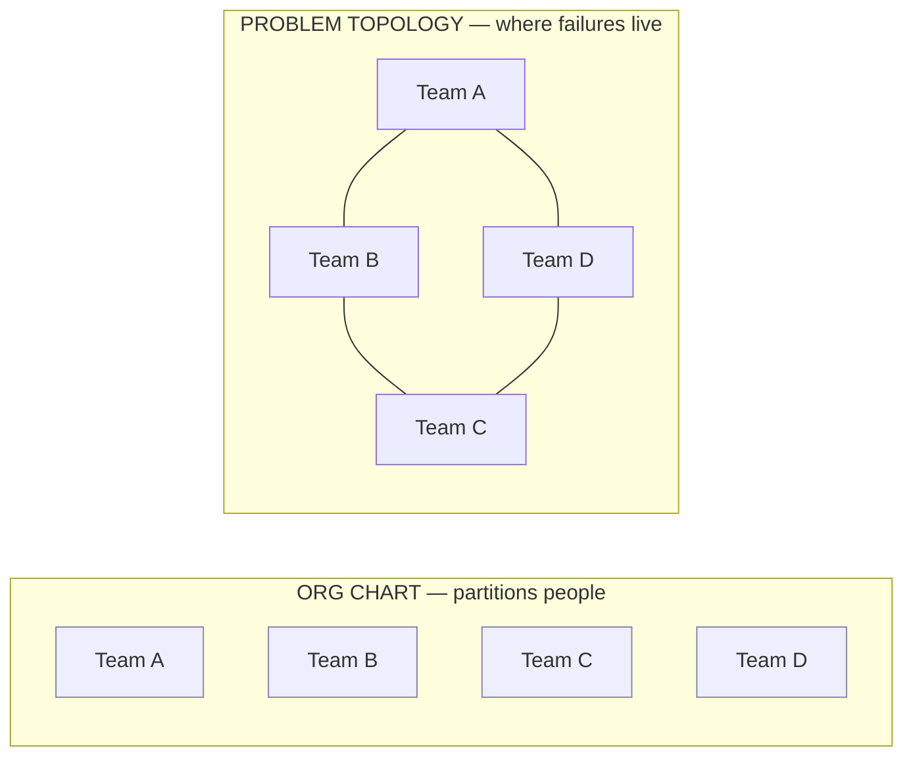
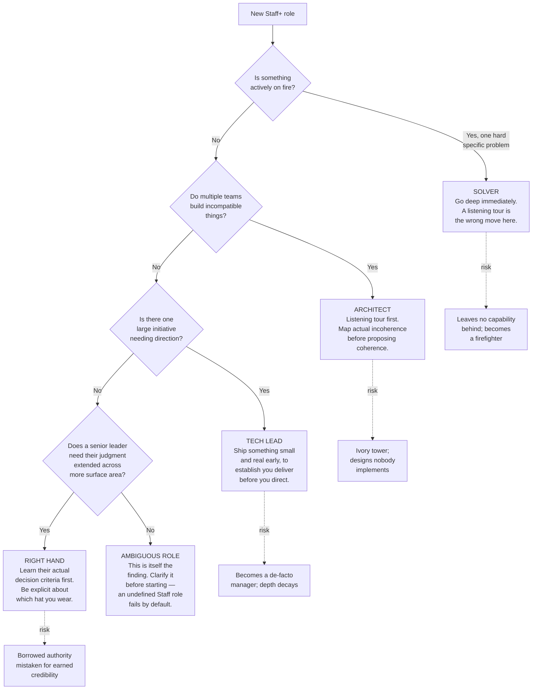
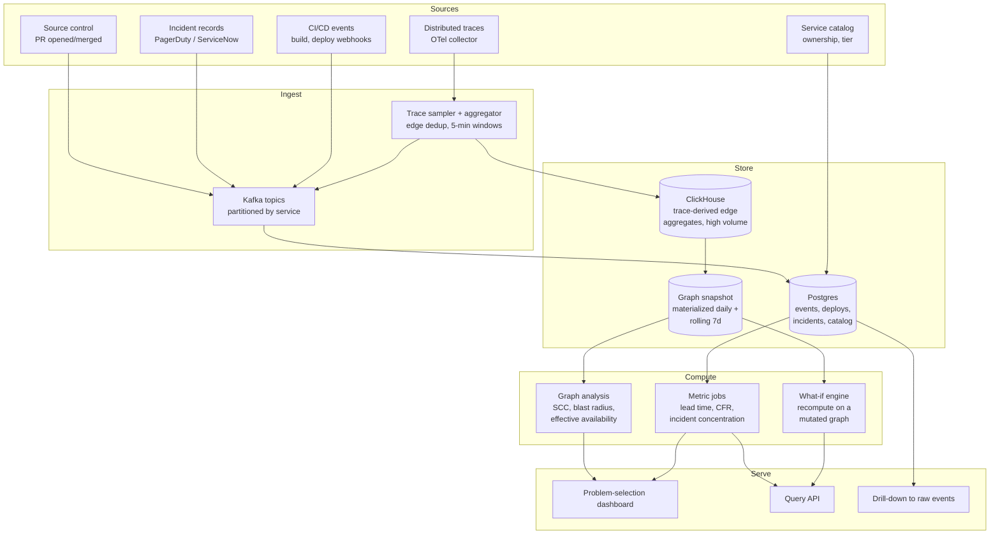
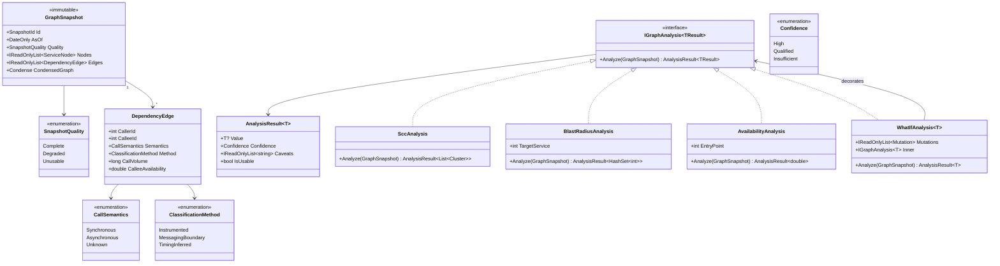

# Module 171 — Staff+ Engineering: Archetypes, Problem Selection, Glue Work & Technical Strategy

> Domain: Engineering Leadership (merged 51-55) | Level: Beginner → Expert | Prerequisite: [[02-TechnicalLeadership-InfluenceWithoutAuthority-WrittenLeverage-DisagreeAndCommit]] (Staff+ is the role in which technical leadership becomes the *primary* job rather than an occasional behavior; its credibility ledger and decision mechanics are assumed here), [[01-EngineeringLeadership-TechnicalLeadership-StaffPlus-Principal-Architecture-Management]] (the archetype outline), [[../17-Microservices/07-Decomposition-Failures-Service-Right-Sizing]] (the service-boundary failures — the technical substrate of the seam problems Staff engineers are most often deployed against)

>
> **Scope note:** Second of the Engineering Leadership depth pass (Modules 170–175). This module takes **Staff+ Engineering** — Staff, Senior Staff, and Distinguished Engineer — as a *role* with a distinct job description, not as "a very senior senior engineer."
>
> **On:** unlike, this module's coding exercises are genuine code with complexity analysis. The Staff+ engineer's characteristic analytical object is the **service dependency graph** — the structure that determines where seams are, what the blast radius of a change is, and which problems are worth solving. That is a graph-algorithms problem, and it is interviewed as one at this level.

---

## 1. Fundamentals

**What:** A Staff+ engineer is an individual contributor whose primary value is **multiplying the effectiveness of the engineers around them**, at a scope spanning multiple teams, without formal authority over any of them.

The definition is deliberately not "writes the hardest code." A Staff engineer often does write the hardest code, but that is a *tool* they use, not the job. The job is that the organization's output is measurably higher because they are in it — and the mechanisms by which that happens are: choosing which problems get worked on, solving the problems that span team boundaries (where no single team has both the context and the mandate), raising the technical ceiling of the people around them, and producing durable artifacts — strategies, standards, reference implementations — that outlive any single project.

**Why the role exists:** Because organizations above roughly 30–40 engineers develop a class of problem that is **structurally unownable**. Consider: a settlement failure that occurs only when Team A's retry policy interacts with Team B's connection pooling under Team C's load pattern. Each team's monitoring is green. Each team's on-call correctly concludes it is not their problem. Each is right. The problem lives *at the seam*, and seams have no owner because org charts partition people, not failure modes.

This is the organizational consequence of a finding this course reached in nearly every technical domain: **failures concentrate at the boundaries between independently-developed components.** Modules 74–76 found it in Kubernetes, in outbox relays, in service decomposition, in composed AI systems. A Staff+ engineer is the organizational answer — a person whose scope is deliberately defined to *span* boundaries rather than sit inside one.

**When someone is operating at Staff level** — three tests, all of which must hold:
1. **Scope spans teams.** Their work routinely requires changing things owned by people who do not report to their manager.
2. **They select their own problems.** A senior engineer is given hard problems; a Staff engineer is substantially responsible for identifying which problems matter. This is the largest single behavioral difference and the one interviews probe hardest.
3. **Their output includes durable artifacts, not only shipped features.** A strategy document that redirects two years of work, a reference implementation nine teams adopt, a standard that eliminates a class of incident.

If (1) is absent, the person is a strong senior engineer, which is a completely respectable thing to be and not the same job. If (2) is absent, they are a Staff-titled senior engineer, and this is the most common form of miscalibration — organizations promote for depth and then wonder why the person does not operate at scope.

**How (30,000-ft view) — the Staff+ loop:**

```
   MAINTAIN A MODEL OF THE ORG'S TECHNICAL REALITY
   Where the seams are. What keeps breaking. What is slow and why.
   Who is blocked on what. Built from incidents, cycle-time data,
   and conversations -- not from architecture diagrams.
                            │
                            ▼
   SELECT the highest-leverage problem you are UNIQUELY positioned
   to solve. Not the hardest, not the most interesting: the one
   where (impact x your unique positioning) is maximal.
                            │
           ┌────────────────┼────────────────┐
           ▼                ▼                ▼
           SOLVE            MULTIPLY         DOCUMENT
           directly         others           durably
           (deep work,      (design review,  (strategy,
           prototypes)      pairing,         reference impl,
                            sponsorship)     ADR)
           │                │                │
           └────────────────┼────────────────┘
                            ▼
   HAND OFF to a team that will own it permanently. A Staff
   engineer who still owns everything they have built has
   stopped being able to select new problems.
                            │
                            └──────>  back to the top (loop)
```

The **hand-off** step is the one most often missing, and its absence is why some Staff engineers plateau: each solved problem adds permanent operational load, and after four or five, their capacity to select new problems is gone. They have become a very senior maintenance engineer with a large surface area.

---

## 2. Deep Dive

### 2.1 The four archetypes, and why the distinction is operational rather than taxonomic

Will Larson's taxonomy — **Tech Lead, Architect, Solver, Right Hand** — is widely cited and widely misused as a personality quiz. Its actual value is that the four archetypes have **different success criteria, different failure modes, and different first-90-days**, so misidentifying which one a role calls for causes concrete, predictable failure.

| Archetype | Scope | Primary output | Success looks like | Characteristic failure |
|---|---|---|---|---|
| **Tech Lead** | One team, or one cross-team initiative | Technical direction + delivery of a specific thing | The initiative ships and the team levelled up doing it | Becomes a de-facto manager; loses technical depth; or hoards the interesting work |
| **Architect** | A domain or platform (many teams) | Coherence — a design that many teams build within | Teams make locally-good decisions that compose correctly | Ivory tower: designs nobody implements; or over-specifies and removes teams' judgment |
| **Solver** | Wherever the hardest current problem is | A specific, previously-intractable problem, solved | The problem is gone and does not recur | Never builds anything durable; becomes a firefighter; leaves no capability behind |
| **Right Hand** | Extends a senior leader's attention across an org | Judgment, at scale, on the leader's behalf | The leader can act on more surface area, correctly | Borrowed authority mistaken for earned credibility; becomes a proxy nobody trusts |

**Three points that separate a strong interview answer from a recited one:**

**First, these are situational, not dispositional.** Most Staff engineers operate predominantly in one archetype at a given time and shift between them as the organization's needs change. A candidate who says "I'm a Solver" as an identity claim has misread the framework; one who says "this role is described as a Solver role, but the actual problem statement — three teams building incompatible things — is an Architect problem, and I'd want to align on that before starting" has understood it, and has also just demonstrated the diagnostic skill the role requires.

**Second, the archetype determines the first 90 days almost entirely:**
- A **Solver** role warrants going deep on the stated hardest problem immediately. Spending six weeks on a listening tour is the wrong move — you were hired because something is on fire.
- An **Architect** role warrants exactly that listening tour: you cannot propose coherence for a domain whose actual current incoherence you have not mapped. Proposing an architecture in week two is the classic, credibility-destroying error.
- A **Tech Lead** role warrants shipping something small and real quickly, to establish that you deliver before you direct.
- A **Right Hand** role warrants understanding the leader's actual decision criteria before representing them — the failure mode is representing what you would decide rather than what they would.

**Third, the Right Hand archetype has a distinctive and underappreciated risk.** Its authority is borrowed. When a Right Hand says "we should do X," people hear the VP. That makes them effective quickly and fragile permanently: if they are ever wrong in a way that is attributed to the leader, the leader withdraws the mandate, and they are left with whatever credibility they earned independently — which, if they leaned entirely on the borrowed kind, is nothing. The mitigation is to be explicit about which hat is on ("this is my view, not a direction from Sarah") and to keep earning independent credibility through delivery.

### 2.2 Scope, depth, and the relationship between them

The most common misconception about Staff+ is that it is a trade of depth for breadth. It is not. **It is depth plus breadth, where the depth is what makes the breadth credible.**

The mechanism, precisely: a Staff engineer's influence rests on the credibility ledger, and that ledger is refilled almost exclusively by demonstrated technical judgment. An engineer whose depth has eroded still has opinions, but those opinions no longer track reality, and — critically — *the engineers around them detect this well before they do*. The characteristic sign is that people stop bringing them hard problems and start bringing them process questions. That is a demotion the org chart has not recorded yet.

**What "maintaining depth" actually means at Staff scope** — because "keep coding" is too glib:

- **Deliberate narrowness.** You cannot stay deep in nine domains. Pick two or three where your judgment must be trusted, and be honest that elsewhere you are a facilitator, not an authority. Saying "I don't have the depth here; Priya does, and I'd weight her view over mine" is credibility-generating, not diminishing.
- **Building, not only reviewing.** Code review maintains familiarity but not fluency — you can review code in a system you could no longer write in. The distinction matters because design judgment comes from having hit the problems, not from having read about them. Prototypes, spikes, and reference implementations are the highest-value form: they are genuine deep work *and* they produce the durable artifact the role is measured on.
- **Being on the incident rotation, at least sometimes.** Nothing else gives an unfiltered view of how the system actually behaves versus how it is documented. A Staff engineer who has been off-call for three years is reasoning about a system that no longer exists.

**How to know your depth has eroded** — the honest self-tests:
- You can no longer estimate how long a change in your "deep" area would take, within a factor of two.
- Your technical suggestions in review are increasingly about structure and naming rather than about behavior under load, failure, or concurrency.
- You find yourself citing what you did at a previous company more often than what happened in this system last quarter.

### 2.3 Problem selection — the dominant term in the impact equation

This is the single highest-leverage skill in the role and the most under-taught.

**The claim:** at Staff+ level, variance in impact is dominated by *which problem you chose*, not by *how well you executed it*. A brilliantly-executed solution to the org's seventh-most-important problem is worth less than a competent solution to its first. Since Staff engineers are generally all competent executors, selection is where the differences actually appear.

**The selection function.** A usable formulation:

```
Leverage = Impact × Uniqueness × Tractability
 ───────────────────────────────────────
 Cost

 Impact — what changes if this is solved? (incidents removed,
 velocity unblocked, risk retired, cost saved)
 Uniqueness — would this get solved anyway without me? If a team
 already owns it and is competent, my marginal
 contribution is small even if impact is large.
 Tractability — is it actually solvable in a reasonable horizon by
 someone in my position? Or is it a re-org problem
 wearing a technical costume?
 Cost — my time, plus the organizational cost of the change.
```

**The Uniqueness term is what most people omit, and it is the one that most changes conclusions.** The org's biggest problem is often already owned by a competent team who will solve it in six months. Your marginal contribution there is small. The right target is frequently the *second or third* biggest problem — the one that is genuinely unowned because it spans boundaries, which is precisely the class the role exists for.

**The Tractability term is where Staff engineers waste the most time.** A large fraction of apparently-technical problems are organizational: "our services are too coupled" is often "these two teams have overlapping mandates and neither will concede," and no amount of architecture solves it. Recognizing that a problem is not tractable *from your position* — and either escalating it as an org problem or picking something else — is a skill, not a defeat. The failure mode is spending two quarters on an architecture initiative that dies because the real obstacle was never technical.

**Three heuristics that work in practice:**

1. **Follow the incidents.** Incident data is the least-biased signal in the organization about where reality diverges from design. Read the last 30 postmortems. Problems that appear in five of them are structural, and structural problems that span teams are the role's natural target.
2. **Follow the cycle time.** Which components have change-lead-times far above the fleet median? That is where the organization is paying a tax it may not have noticed. This is measurable and it is rarely where intuition puts it — the same lesson taught for system profiling.
3. **Follow the recurring conversation.** If the same architectural debate resurfaces quarterly, it is unresolved for a structural reason, and the recurrence itself is the cost. Resolving it once, durably, retires an ongoing tax.

**What to decline, explicitly.** A Staff engineer who takes every request is executing someone else's selection function. The declines that matter: work a competent team already owns (Uniqueness ≈ 0); work that is interesting but low-impact (the most seductive category, because it is genuinely fun and the rationalization is easy); and work that is genuinely urgent but that you taking on would prevent someone else from growing into. The third is the hardest, because it feels like helping.

### 2.4 Glue work — its value, its trap, and how to hold both

**Glue work** is the connective, largely invisible labor that makes an organization function: writing the doc nobody will write, noticing the cross-team dependency before it bites, running the retro, onboarding the new hire, updating the runbook, chasing the ambiguous ownership question until someone owns it.

**Its value is genuine and systematically undercounted.** Performance systems historically reward shipped code because shipped code is legible. Glue work's output is *the absence of a problem*, and absences do not appear in a review packet. Tanya Reilly's formulation — that glue work is what makes the difference between a group of engineers and a team — is right.

**The trap is equally genuine, and it has two distinct forms that are often conflated:**

**Trap form 1 — the credibility drain.** A Staff engineer who does only glue work erodes the technical depth that their influence rests on. After 18 months of coordination they are, functionally, a project manager with an engineering title — and their technical opinions have quietly stopped carrying weight. This is a slow failure and it is usually invisible to the person experiencing it, because the work genuinely needed doing every single time.

**Trap form 2 — the distribution problem.** Glue work is not distributed randomly. It reliably accretes to whoever is most conscientious about it, and — as Reilly and subsequent research on non-promotable work have documented — that distribution is not demographically neutral. An organization where the same people always do the glue is one where those people's careers are being taxed to subsidize everyone else's. A Staff engineer who absorbs all of it is not only harming themselves; they are *concealing a structural problem* by compensating for it.

**Holding both — the operational answer:**

- **Do the glue work that only you can do, and systematize the rest.** If the cross-team dependency tracking works only because you are personally tracking it, build the mechanism that tracks it, then hand it over. The Staff-level move is not doing the glue; it is *removing the need for the glue* — which is the same golden-path principle applied to decisions.
- **Make it visible, always.** Glue work that nobody knows happened cannot be valued, cannot be fairly distributed, and cannot be evidence in your own promotion case. Naming it plainly in a status update is not self-promotion; it is making a real cost legible.
- **Rotate it deliberately.** If you are running the incident review every time, you are also the only person learning to run one. Rotating is simultaneously fairness, resilience, and development.
- **Keep a ratio, and check it.** A rough working guide: if less than roughly a third of your time is genuinely deep technical work over a quarter, your depth is decaying regardless of how valuable the other two-thirds were. The exact fraction is arguable; the discipline of measuring it is not.

### 2.5 Technical strategy as the durable deliverable

The most durable artifact a Staff+ engineer produces is usually not code. It is a **technical strategy**: a written argument that redirects what the organization builds, and that keeps doing so after the author has moved on.

**What distinguishes a strategy from a plan, precisely:** a plan says what will be done. A strategy says **what will be done, what will deliberately not be done, and why the trade-off is correct given a specific diagnosis.** Richard Rumelt's framing — diagnosis, guiding policy, coherent action — is the useful skeleton, and its most important element is the diagnosis, which is exactly the element most engineering "strategies" omit.

**The anatomy that works:**

| Element | What it contains | Why it is load-bearing |
|---|---|---|
| **Diagnosis** | What is actually true and problematic, with evidence — not a restatement of goals | Without it, every proposal is equally justifiable; the diagnosis is what makes some actions obviously wrong |
| **Guiding policy** | The approach chosen, and the approaches deliberately rejected | Makes the strategy *falsifiable* and gives it teeth |
| **Coherent actions** | A small number of mutually-reinforcing moves | Coherence is the point — actions that do not reinforce are a list, not a strategy |
| **What we are not doing** | Explicit non-goals | The most-skipped and most-valuable section. A strategy that forecloses nothing constrains nothing |
| **Falsification** | What would tell us this is wrong | Prevents the strategy becoming dogma after its context changes |

**The "what we are not doing" section is the test.** A strategy that says "we will invest in reliability, developer experience, and delivery speed" has said nothing — those are goals, all obviously good, and it gives no guidance for any actual trade-off. A strategy that says "we will accept a slower feature-delivery rate in payments for two quarters in exchange for retiring the dual-write between the ledger and the reporting store, and we will explicitly not modernize the reconciliation UI in that window despite its known problems" is a strategy: it can be disagreed with, which is what makes it useful.

**Why strategies fail** — three failure modes, all recognizable:
1. **No diagnosis** — it lists initiatives without establishing what is wrong, so it cannot rule anything out.
2. **No teeth** — nothing is foreclosed, so every team continues doing what they were already doing while citing the strategy as support.
3. **No owner after publication** — strategies decay exactly like decisions do. Without someone connecting each quarter's roadmap back to it, it becomes a document people were once excited about.

### 2.6 Sponsorship, and why it differs from mentorship

Both are ways a Staff+ engineer multiplies others; they are not the same mechanism and conflating them limits impact.

- **Mentorship** is *advice*: you help someone become more capable. It costs your time and it scales poorly — roughly linear in hours.
- **Sponsorship** is *risk*: you spend your own credibility to put someone in a position they have not yet proven they can hold, and you are exposed if they fail. It costs credibility rather than time, and it is disproportionately what actually changes careers.

Concretely: mentoring is reviewing someone's design doc. Sponsoring is putting their name forward to lead the migration, in a room where you are the one whose judgment is on the line for the recommendation.

**The Staff+ relevance:** mentorship is what most senior engineers do and it is good. Sponsorship is what distinguishes someone who multiplies others *structurally*. It is also the more honest test of whether you are developing people or merely advising them — because sponsorship requires you to actually believe they can do it, and to accept the downside if you are wrong.

Two disciplines that make sponsorship work rather than backfire: **sponsor into stretch, not into failure** — the assignment should be a level above their demonstrated ability, not three; and **stay available without taking over.** The single fastest way to destroy the value of a sponsorship is to step in and rescue the moment it wobbles, because the visible outcome then becomes "they needed rescuing," which is worse for them than not having been sponsored at all.

---

## 3. Visual Architecture

### 3.1 Where Staff+ scope sits relative to org structure



| | Org chart | Problem topology |
|---|---|---|
| **Unit** | The box | The line between boxes |
| **Ownership** | Every box has a named owner | The lines have no owner |
| **Monitoring** | Every box is monitored | Every team's dashboard is green during a seam failure |
| **Consequence** | Team-scoped problems get solved | Seam problems persist indefinitely |

> **Staff+ scope is the lines.** The role's scope is deliberately defined to *span* boundaries, because org charts partition people while failures partition by seam — and a boundary that belongs to nobody is where the unowned problems accumulate.

### 3.2 Archetype selection as a function of organizational state



### 3.3 The time-allocation reality, and the failure it hides

| Activity | Ideal (as advertised) | Actual (unmanaged, after 18 months) |
|---|---|---|
| Deep technical work | ████████ 40% | ██ 10% |
| Multiplying others | ██████ 30% | ████ 20% |
| Strategy / writing | ████ 20% | ██ 10% |
| Glue / coordination | ██ 10% | ████████████ 60% |

**The drift is monotonic and invisible.** Every individual instance of glue work genuinely needed doing, and taking it on was the right call each time — which is precisely why the aggregate is never noticed. The role becomes coordination one defensible decision at a time.

**The tell:** people stop bringing you hard problems and start bringing you process questions. That is a demotion the org chart has not recorded yet.

---

## 4. Production Example — Problem Selection at an Asset Manager

### Scenario

**Firm:** A global asset manager. Investment-platform engineering: ~120 engineers, 14 teams..NET 8 services on AWS (EKS, Aurora PostgreSQL, MSK), a legacy on-prem SQL Server estate still holding the book-of-record.

**Your role:** newly-hired Staff Engineer. The role was described as "Architect archetype — bring coherence to the investment-data platform." No specific problem was assigned. Your manager's guidance was, verbatim, "spend your first month figuring out what to work on."

This is the actual Staff+ job, stated plainly, and it is the situation most candidates have never had to reason about explicitly.

### The listening tour (weeks 1–4)

Per, an Architect role warrants mapping actual incoherence before proposing coherence. What that meant concretely:

- **Read the last 34 incident postmortems.** Not summaries — full timelines.
- **Pulled cycle-time data** (PR opened → deployed to production) per service from the CI system, and compared each against the fleet median.
- **Interviewed 14 tech leads**, asking one question consistently: *"What is the thing that most slows your team down that you cannot fix yourself?"* The "cannot fix yourself" clause is doing all the work — it filters for exactly the unownable, boundary-spanning class.
- **Traced one representative flow end-to-end** by hand: a portfolio rebalance instruction from generation to execution to book-of-record. Six services, four teams, two databases.

### Three candidate problems

**Candidate A — The dual-write between Aurora and the SQL Server book-of-record.**
Every position update is written to both stores by application code, with no transaction spanning them. Nine of the 34 incidents involved divergence. Reconciliation runs nightly and produces a break report that an operations team works manually — 2 FTE, permanently.

- *Impact:* High. Nine incidents, 2 permanent FTE, and a correctness risk in the book of record — which for an asset manager is the thing regulators and clients care about most.
- *Uniqueness:* **High.** It spans two teams and two data stores; neither team can fix it alone, and the fix requires a decision (which store is authoritative) that no single team has the standing to make. Nobody was working on it. It had been raised for three years.
- *Tractability:* Moderate. Technically well-understood. The hard part is the authority decision, not the mechanism.
- *Cost:* Large. Realistically 3 quarters with 2–3 engineers.

**Candidate B — Deployment pipeline slowness.**
Median PR-to-production is 3.5 days; best-in-class teams inside the same org are at 4 hours. Every tech lead mentioned it.

- *Impact:* High and broad — it taxes all 14 teams.
- *Uniqueness:* **Low.** A newly-formed platform team had just been chartered specifically for this, staffed with three competent engineers, with a 2-quarter mandate. They would very likely fix most of it without me.
- *Tractability:* High.
- *Cost:* Moderate.

**Candidate C — Market-data service instability.**
Loudest complaint in the interviews. Frequent, visible, painful.

- *Impact:* Moderate. Painful but rarely caused client-facing incidents — degradation was mostly absorbed by caching.
- *Uniqueness:* Low. One team owned it entirely and was competent; they had a remediation plan and were executing it.
- *Tractability:* High.
- *Cost:* Low.

### The selection, and the reasoning

**Chose A.**

The reasoning that decided it was the **Uniqueness** term. B had the highest breadth of impact and was the most-requested — and would have been the wrong choice, because a competent team was already chartered to solve it. My marginal contribution would have been small, and I would likely have gotten credit for their work, which is its own problem. C was the loudest and had the lowest leverage on every axis; loudness correlates with *visibility*, not with importance, and separating the two is much of the skill.

A was the only candidate that was **genuinely unowned because it spanned a boundary** — the exact class the role exists for. It had been visible for three years and had not been solved, which is strong evidence it was structurally unownable rather than merely un-prioritized. And the blocking element was not technical: it was that deciding which store is authoritative required someone with standing across both teams. That is precisely a Staff+ mandate.

**The counter-argument I had to answer honestly:** A was the most expensive and the slowest to show results, and a new hire choosing a 3-quarter project with no visible output for two quarters carries real personal risk. The mitigation was to sequence it so something real landed in the first six weeks — see below. **A Staff engineer who selects correctly but shows nothing for two quarters has selected badly in practice, whatever the analysis says**, because they will not retain the credibility to finish.

### Implementation

**Weeks 5–10 — establish the problem in the right currency, and land something real.**

Rather than opening with an architecture proposal, quantified the status quo:
- Instrumented the nightly reconciliation to categorize breaks by root cause rather than reporting a single count. Result: **73% of breaks traced to a single failure mode** — an Aurora write succeeding and the SQL Server write failing during the 02:00–02:30 maintenance window, with the application's retry writing a *second* Aurora row rather than repairing the SQL Server one.
- That instrumentation was itself the six-week deliverable. It cost two weeks, immediately reduced the operations team's triage time by roughly 60% because breaks arrived pre-categorized, and — critically — it converted "our data diverges sometimes" into "one specific, fixable defect causes three-quarters of it."

This is the pattern worth internalizing: **the first deliverable was measurement, and measurement was independently valuable.** It bought the credibility and the evidence for the larger argument simultaneously.

**Weeks 11–14 — the strategy document.**

Per, with a genuine diagnosis and explicit non-goals:

- **Diagnosis:** the platform has no single book of record. Two stores are both treated as authoritative by different consumers, and no mechanism reconciles them transactionally. Every downstream correctness problem traces to this, and the nightly reconciliation is a permanent tax paid to conceal it rather than a control.
- **Guiding policy:** Aurora becomes the single authoritative store for positions. SQL Server becomes a *derived* read model, populated asynchronously via an outbox-driven projection (/). Divergence becomes structurally impossible rather than detected-and-repaired.
- **Rejected explicitly:** (i) making SQL Server authoritative — Aurora holds the higher-velocity write path and the newer consumers, so the migration cost is inverted; (ii) distributed transactions across both — operationally fragile and the coupling is exactly what we are removing; (iii) leaving it and improving reconciliation — this is the status quo with better instrumentation, and it permanently funds 2 FTE to hide a defect.
- **Not doing:** no change to the reconciliation UI despite its known problems; no consolidation of the three separate position-history tables, despite it being the obviously-adjacent cleanup, because bundling it would double the blast radius and the migration's risk profile is already the binding constraint.
- **Falsification:** if the projection lag exceeds 5 seconds at p99 under peak rebalance load in the parallel-run phase, the derived-read-model approach is wrong for the latency-sensitive consumers and we split them out rather than proceeding.

**Weeks 15–onwards — execution, with deliberate hand-off.**

Parallel run: the outbox projection ran alongside the dual-write for 11 weeks, with a continuous comparison job reporting divergence. Cutover was per-consumer, not big-bang — riskiest consumer last.

**The hand-off, planned from the start:** two engineers from the owning team were on the work from week 15, and *they* wrote the projection. I built the comparison harness and the migration runbook. By cutover, they owned it and I was reviewing rather than writing. This was deliberate per the loop: had I owned the projection permanently, I would have acquired a permanent operational load and lost the capacity to select the next problem.

### Trade-offs

| Dimension | What was accepted |
|---|---|
| **Slowest visible payoff of the three candidates** | Mitigated by making the first deliverable (break categorization) independently valuable in six weeks. Without that, the selection was probably not survivable for a new hire. |
| **Left B and C alone** | B was solved by the platform team in 2 quarters as predicted — the Uniqueness analysis was correct. C was partially solved and remained the loudest complaint for another year, which was a genuine ongoing cost of the choice and was raised as a criticism. |
| **11-week parallel run** | Expensive in engineer attention and infrastructure. Chosen because the book of record's correctness is the firm's core obligation and a silent cutover defect would be a client-reportable event. Non-negotiable in this domain. |
| **Did not fix the adjacent position-history duplication** | Explicit non-goal. Correct — bundling would have doubled the risk of a migration whose risk was already the binding constraint. It remained undone for two more years, which was the honest cost. |

### Lessons learned

1. **The loudest problem and the highest-leverage problem were different problems**, and distinguishing them was the entire value of the first month. C was mentioned in 11 of 14 interviews; A was mentioned in 2.
2. **The Uniqueness term changed the answer.** On raw impact, B was the strongest candidate. Accounting for the fact that a competent team was already chartered to solve it moved it to last.
3. **Measurement was the highest-leverage first deliverable** — it produced the evidence for the strategy, delivered standalone value, and bought the credibility needed for a three-quarter commitment. This sequencing is generalizable.
4. **The blocker was authority, not architecture.** The correct design was known to several engineers for years. What was missing was someone with standing across both teams to decide which store was authoritative — which is the definition of the role.
5. **Planning the hand-off from week one is what made the next selection possible.** The measure of the engagement was not that the dual-write was removed; it was that it was removed *and* I could start the next thing.
## 10. Interview Questions

### Basic (10)

**B1. Q: What is the difference between a Senior engineer and a Staff engineer?**
*Ideal Answer:* Three differences: scope spans multiple teams rather than one; the Staff engineer substantially selects their own problems rather than being assigned them; and their output includes durable artifacts — strategies, standards, reference implementations — not only shipped features. Depth is not traded away; it is the foundation the scope rests on.
*Why correct:* Names all three tests and explicitly rejects the "breadth instead of depth" misconception.
*Common mistakes:* Answering "Staff is more senior" or "Staff writes harder code" — both miss that it is a different job, not more of the same one.
*Follow-up:* Which of the three is most often missing in someone with a Staff title? (Problem selection — organizations promote for depth and then find the person still waiting to be assigned work.)

**B2. Q: Name the four Staff engineer archetypes and describe one.**
*Ideal Answer:* Tech Lead (owns a team's or initiative's technical direction and delivery), Architect (owns coherence across a domain many teams build in), Solver (deployed against the hardest current ambiguous problem), Right Hand (extends a senior leader's judgment across an org). They are situational rather than dispositional — most people operate predominantly in one at a time and shift as needs change.
*Why correct:* Accurate on all four and correctly frames them as situational.
*Common mistakes:* Treating them as a personality type or a hierarchy.
*Follow-up:* Which archetype has the most fragile source of influence? (Right Hand — its authority is borrowed and evaporates if the mandate is withdrawn.)

**B3. Q: What is "glue work" and why does it matter?**
*Ideal Answer:* The connective, largely invisible labor that makes an organization function — writing the doc nobody will write, noticing cross-team dependencies, chasing ambiguous ownership, running retros. It matters because its output is the *absence* of problems, which is genuinely valuable and systematically undercounted by performance systems that reward legible output.
*Why correct:* Defines it and identifies why it is undervalued — the legibility asymmetry.
*Common mistakes:* Describing it as "non-technical work," which misses that much of it is deeply technical.
*Follow-up:* What is the trap? (Doing so much of it that your technical depth — the basis of your influence — erodes.)

**B4. Q: How does a Staff engineer maintain technical depth as their scope widens?**
*Ideal Answer:* Deliberate narrowness — pick two or three areas to stay genuinely deep in and be honest that elsewhere you facilitate rather than adjudicate. Build rather than only review, since review maintains familiarity but not fluency. Stay on the incident rotation at least sometimes, because nothing else shows how the system actually behaves.
*Why correct:* Gives three concrete mechanisms rather than "keep coding."
*Common mistakes:* Claiming you can stay deep everywhere; treating code review as sufficient.
*Follow-up:* How would you know your depth had eroded? (You can no longer estimate work in your deep area within a factor of two; your review comments shift from behavior-under-load toward naming and structure.)

**B5. Q: Why do Staff+ roles exist at all — why not just more senior engineers?**
*Ideal Answer:* Because above roughly 30–40 engineers, a class of problem emerges that is structurally unownable: failures that live at the seams between teams, where each team's monitoring is green and each team correctly concludes it is not theirs. Org charts partition people, not failure modes. The role exists to have someone whose scope deliberately spans boundaries.
*Why correct:* Grounds the role in a structural property of organizations rather than in seniority.
*Common mistakes:* "To have someone to make technical decisions" — that is a consequence, not the cause.
*Follow-up:* Give an example of a seam problem. (An intermittent failure caused by Team A's retry policy interacting with Team B's connection pool limits under Team C's load pattern.)

**B6. Q: What is the difference between mentorship and sponsorship?**
*Ideal Answer:* Mentorship is advice — you spend time to make someone more capable. Sponsorship is risk — you spend your own credibility to put someone in a position they have not yet proven they can hold, and you are exposed if they fail. Sponsorship is disproportionately what changes careers.
*Why correct:* Identifies the different currencies (time versus credibility) and the exposure.
*Common mistakes:* Treating them as synonyms, or describing sponsorship as just "advocating for someone."
*Follow-up:* What is the fastest way to ruin a sponsorship? (Stepping in to rescue the moment it wobbles — the visible outcome becomes "they needed rescuing," which is worse for them than not being sponsored.)

**B7. Q: What makes a technical strategy different from a plan?**
*Ideal Answer:* A plan says what will be done. A strategy says what will be done, what will deliberately *not* be done, and why that trade-off is correct given a specific diagnosis of what is actually wrong. The diagnosis and the non-goals are what give it teeth.
*Why correct:* Centers the diagnosis and the explicit non-goals, which are the two most-omitted elements.
*Common mistakes:* Describing a strategy as a longer-horizon plan.
*Follow-up:* What does a strategy with no non-goals do in practice? (Gets cited by every team as endorsement of what they were already doing.)

**B8. Q: A Staff engineer solves a hard problem and moves on. What should they leave behind?**
*Ideal Answer:* A durable artifact and an owner: a runbook, a regression test that would have caught it, a library or reference implementation, and — most importantly — a team that now owns the solution permanently. Without the hand-off, each solved problem adds permanent operational load and their capacity to select new problems degrades.
*Why correct:* Names both the artifact and the ownership transfer, and the reason the transfer matters.
*Common mistakes:* Only mentioning documentation.
*Follow-up:* What happens to a Staff engineer who never hands off? (After four or five problems they have no selection capacity left — a very senior maintenance engineer with a large surface area.)

**B9. Q: How should a Staff engineer decide what to work on?**
*Ideal Answer:* Explicitly, with a selection function: impact × uniqueness (would this get solved without me?) × tractability, divided by cost. The uniqueness term is the one most often omitted and most often changes the answer — the org's biggest problem is frequently already owned by a competent team.
*Why correct:* Gives a structured function and highlights the term that distinguishes good selection.
*Common mistakes:* "Whatever the biggest problem is" — ignores that big problems are often already owned.
*Follow-up:* What kind of problem should you decline? (Work a competent team already owns; interesting-but-low-impact work; and work that would prevent someone else from growing into it.)

**B10. Q: What does it mean that Staff+ is an individual-contributor role?**
*Ideal Answer:* It means the person has no formal authority over anyone — their influence is entirely the technical-leadership mechanism. It also means it is a parallel track to management rather than a step toward it; the two are genuinely different jobs with different scaling mechanisms, not rungs on one ladder.
*Why correct:* Names both the influence consequence and the parallel-track point.
*Common mistakes:* Implying Staff is a stepping stone to management.
*Follow-up:* Does a Staff engineer ever have direct reports? (Generally no — some orgs attach one or two, but it usually muddies both jobs.)

---

### Intermediate (10)

**I1. Q: You join as a Staff engineer and are told "spend your first month figuring out what to work on." Walk me through that month.**
*Ideal Answer:* Read the last 30 incident postmortems in full — the least-biased signal about where reality diverges from design. Pull change-lead-time distributions per component and compare against the fleet median. Interview every tech lead with one consistent question: what most slows you down that you *cannot fix yourself* — the second clause filters for exactly the boundary-spanning class. Trace one representative business flow end-to-end by hand. Then run the selection function on three or four candidates and write the reasoning down, including why you rejected the others.
*Why correct:* Concrete, data-driven, and the interview question is chosen to filter for unownable problems specifically.
*Common mistakes:* Describing a general listening tour with no artifacts; picking the most-complained-about problem.
*Follow-up:* Why "cannot fix yourself"? (Because problems a team can fix themselves will be fixed; the ones they can't are structurally unowned, which is the role's target class.)

**I2. Q: The most-complained-about problem and the highest-leverage problem are different. How do you handle that politically?**
*Ideal Answer:* Do not ignore the loud problem — acknowledge it explicitly, say why you are not taking it, and name who is or should be. Then make your reasoning public: a short written rationale for the selection, including the rejected candidates. This converts what could read as ignoring people into a visible, defensible allocation decision, and it invites correction if your analysis is wrong. Also worth doing: if the loud problem is genuinely unowned, the right output may be getting it owned rather than owning it yourself.
*Why correct:* Handles the political cost directly through transparency rather than avoiding it, and offers the get-it-owned move.
*Common mistakes:* Quietly working on the high-leverage thing and letting people conclude you ignored them.
*Follow-up:* What if leadership insists on the loud problem? (Then either they have information you lack — ask — or you take it and negotiate explicitly for the other work, but do not silently substitute your judgment for theirs.)

**I3. Q: How do you tell a genuinely technical problem from an organizational problem wearing a technical costume?**
*Ideal Answer:* Test whether the technical solution has been proposed before and not adopted. If a correct design has existed for years and nothing happened, the obstacle is not knowledge — it is that someone would have to concede scope, or that no one has standing to decide. "Our services are too coupled" is very often "two teams have overlapping mandates and neither will concede." The diagnostic question is: if I handed the perfect design to this organization tomorrow, would it be implemented? If not, the design was never the constraint.
*Why correct:* Gives a concrete diagnostic rather than a definition, and names the common example.
*Common mistakes:* Treating all problems as technical and spending quarters on architecture that dies for organizational reasons.
*Follow-up:* What do you do when it is organizational? (Escalate it as such with a clear statement of the decision needed and who must make it — that is often the highest-leverage thing you can produce.)

**I4. Q: You are doing 60% coordination work and it is all genuinely necessary. What do you do?**
*Ideal Answer:* Recognize that "each instance was necessary" and "the aggregate is a role I should not be in" are both true — the drift is monotonic and every step is individually justified. The move is to systematize rather than perform: if cross-team dependency tracking works only because you personally track it, build the mechanism and hand it over. Rotate the recurring items so others learn to run them. Then re-check the ratio next quarter, because it will drift back.
*Why correct:* Holds both truths, and names the systematize-don't-perform move that is the actual Staff-level answer.
*Common mistakes:* "I'd push back and do less" without addressing that the work genuinely needs doing — that just moves the failure to someone else.
*Follow-up:* Why does this matter beyond your own career? (Because absorbing it conceals a structural problem; if the org needs 60% of a Staff engineer on coordination, that is a finding it should see.)

**I5. Q: How do you write a technical strategy that actually changes what people build?**
*Ideal Answer:* Start with a genuine diagnosis backed by evidence — not a restatement of goals — because the diagnosis is what makes some actions obviously wrong. State the guiding policy and the approaches explicitly rejected. List a small number of mutually-reinforcing actions. Write the non-goals section, which is the test of whether it is a strategy at all. Add a falsification condition. Then assign an owner who reconciles each quarter's roadmap against it, because otherwise it decays exactly like an unenforced decision.
*Why correct:* Covers diagnosis-policy-action plus the two elements (non-goals, ownership after publication) that determine whether it has effect.
*Common mistakes:* Producing a list of initiatives with no diagnosis; omitting non-goals.
*Follow-up:* Give me a non-goal that would be uncomfortable to write. ("We will not improve the reconciliation UI this year despite its known problems" — uncomfortable because it names a real cost being accepted.)

**I6. Q: What is your responsibility when you disagree with the architecture a team owns, but it is entirely within their boundary?**
*Ideal Answer:* Distinguish "wrong" from "not how I would do it," which is the same discipline applied to review blocking. If it is genuinely within their boundary and reversible, offer the perspective once, clearly, and then let them own it — including letting them be wrong, which is how people learn. Intervene when it crosses into your scope: it creates a seam problem, sets a precedent others will copy, or is irreversible with a large blast radius. Say explicitly which of those applies when you do intervene.
*Why correct:* Respects ownership, names the specific conditions that justify overriding it, and requires you to state which one you are invoking.
*Common mistakes:* Intervening on preference, which is how Staff engineers become the thing teams route around.
*Follow-up:* How do you offer the perspective without it landing as a directive? (Say plainly that it is their call, and mean it — and then genuinely do not relitigate.)

**I7. Q: How do you build a model of an organization's technical reality when you cannot personally know every system?**
*Ideal Answer:* Replace familiarity with instrumentation. Read the incident corpus rather than remembering incidents. Compute the service dependency graph and its pathologies — cycles, fan-in, blast radius — rather than recalling the architecture. Pull cycle-time distributions rather than sensing which teams are slow. This transition, from intuition to data, is the one that breaks Staff engineers moving from a 30-person org to a 150-person one, because the intuition genuinely worked before and its failure is not self-announcing.
*Why correct:* Names the specific transition and the specific replacements, and identifies why it is hard.
*Common mistakes:* "Talk to lots of people" alone — necessary but biased toward the loud and the recent.
*Follow-up:* What bias does intuition-based selection introduce at scale? (Systematic over-weighting of the parts of the system you happened to see recently.)

**I8. Q: A team asks you to help with something that is important but that they could do themselves. How do you respond?**
*Ideal Answer:* Usually decline the doing and offer the unblocking — the uniqueness term is near zero, and taking it prevents them growing into it. But be specific rather than dismissive: ask what they are actually stuck on, because the request is often a proxy for a decision they lack standing to make, and *that* may be genuinely yours. If they are stuck on confidence rather than capability, sponsorship is the right response — back them publicly rather than doing it.
*Why correct:* Applies the uniqueness test, and correctly reads the request as possibly a proxy for something that *is* yours.
*Common mistakes:* Flatly declining, which damages the relationship and misses the real ask; or taking it, which is the easy and wrong default.
*Follow-up:* When should you just do it? (When it is genuinely urgent and they genuinely cannot — but say explicitly that this is an exception and why.)

**I9. Q: How do you measure whether you are having impact as a Staff engineer?**
*Ideal Answer:* Not by output volume. By: whether the problems you selected are actually gone and stayed gone; whether artifacts you produced are still being used and cited after you moved on; whether people you sponsored are now operating at higher scope; and whether measures you targeted — incident rate for a component, cycle time, a specific class of failure — actually moved against a pre-recorded baseline. The baseline is essential; claiming improvement without one is the same unsubstantiated claim we reject everywhere else.
*Why correct:* Gives durable, verifiable measures and insists on the baseline.
*Common mistakes:* Listing projects worked on; using peer perception as the measure.
*Follow-up:* Which of those is hardest to claim credibly? (Sponsorship outcomes — because the person deserves the credit, and claiming it is both wrong and transparent.)

**I10. Q: You have been in a Solver role for two years, fixing hard problems successively. What is the risk?**
*Ideal Answer:* That nothing durable was built. The Solver archetype's characteristic failure is leaving no capability behind, so the organization becomes dependent on you rather than more capable, and the problems return when you leave. It also risks your own trajectory: a track record of "fixed many hard things" with no durable artifact is a weaker Principal case than one durable strategy that redirected an organization.
*Why correct:* Names both the organizational and the personal consequence.
*Common mistakes:* Seeing only upside in a run of successful firefighting.
*Follow-up:* How do you convert Solver work into durable output? (Each fix leaves a regression test, a runbook, and ideally a generalized mechanism; and periodically write up the *pattern* across the fixes, which is often a strategy in disguise.)

---

### Advanced (10)

**A1. Q: You have identified a high-leverage problem, but solving it requires a team to give up ownership of a system they are proud of. How do you proceed?**
*Ideal Answer:* Recognize that this is now primarily an organizational problem (I3), and that treating it as technical will fail. Understand what the ownership actually represents to them — usually identity, or a fear that giving it up reduces their scope and therefore their team's standing. Address that directly: often the resolution is that they own the *new* thing rather than losing ownership altogether, which converts a loss into a transition. Bring their manager in early, because scope changes are a management decision and doing it laterally reads as a land grab. If it genuinely cannot be resolved, honestly re-evaluate tractability — a technically correct initiative that requires an unwilling concession may not be solvable from your position, and recognizing that is a legitimate outcome rather than a defeat.
*Why correct:* Diagnoses the real obstacle, offers a reframe that resolves most cases, routes correctly through management, and is willing to conclude intractable.
*Common mistakes:* Escalating for a mandate, which produces compliance without ownership and a decaying outcome; or pushing purely on technical merit against a non-technical obstacle.
*Follow-up:* What if their manager sides with them? (Then you have your answer about organizational priority — either accept it and select differently, or escalate to a level where the trade-off can genuinely be made, with notice.)

**A2. Q: Distinguish the cases where a Staff engineer should personally implement something versus delegate it.**
*Ideal Answer:* Implement personally when: the problem is genuinely novel and the design cannot be specified without building it (prototypes and reference implementations); when it is a small, high-leverage unblock that would cost more to explain than to do; or when you specifically need the depth refresh and it is a legitimate way to get it. Delegate when: a team could do it with support, when doing it yourself would prevent someone growing, or when it would create permanent ownership you cannot hand off. The general asymmetry: **prototypes yes, production ownership no** — build the thing that proves the design, hand over the thing that must be maintained.
*Why correct:* Gives a usable rule with a memorable asymmetry, and includes the honest depth-maintenance reason.
*Common mistakes:* A blanket "Staff engineers should delegate," which produces architecture astronauts.
*Follow-up:* Is "I'd get it done faster" ever a good reason? (Almost never as a standing reason — it is true and it is exactly how you cap everyone's growth. It is acceptable under genuine time pressure, named as an exception.)

**A3. Q: How would you identify a distributed monolith in an organization of 60 services, and what would you do with the finding?**
*Ideal Answer:* Compute it rather than assert it. Build the service dependency graph from runtime telemetry (distributed traces) rather than from declared dependencies, because declared and actual diverge and the actual is what matters. Then look for: cycles (Tarjan's SCC, O(V+E)) — a strongly connected component of size > 1 is the mechanical definition; synchronous call chains with depth greater than about 4, which produce the availability multiplication covered; and shared-database access, which is coupling the call graph does not show. With the finding, do *not* lead with "we have a distributed monolith" — lead with the consequence it produces (this SCC means these four services must deploy together and their combined availability is the product of four terms) because the label invites debate and the consequence invites action.
*Why correct:* Specifies the actual algorithm and data source, distinguishes declared from runtime dependencies, and handles the communication correctly.
*Common mistakes:* Using declared dependencies or architecture diagrams; presenting the label rather than the consequence.
*Follow-up:* Why runtime rather than declared dependencies? (Declared dependencies miss shared databases, undocumented calls, and dependencies via message topics — and include dead ones that no longer occur.)

**A4. Q: Your technical strategy was adopted enthusiastically and nine months later almost nothing has changed. Diagnose.**
*Ideal Answer:* Enthusiastic adoption with no behavior change almost always means the strategy had no teeth — it foreclosed nothing, so every team could continue as before while citing it as support. Check specifically: does it contain explicit non-goals? Does any team's roadmap differ from what it would have been anyway? If not, that is the diagnosis. Secondary causes: no owner reconciling roadmaps against it quarterly, so it decays exactly like an unenforced decision; or a diagnosis people agreed with abstractly but do not believe applies to their own area. The fix is not a better document — it is connecting it to an actual allocation decision, because a strategy that does not change what gets funded is a position paper.
*Why correct:* Identifies the no-teeth cause, gives a concrete test for it, and locates the real fix in allocation rather than in writing.
*Common mistakes:* Concluding it needs better communication or wider socialization.
*Follow-up:* How would you have known at three months? (Pick two teams' roadmaps and ask whether anything is on them because of the strategy, or off them because of it. If neither, it has no teeth.)

**A5. Q: How do you handle being the only person who understands how three critical systems compose?**
*Ideal Answer:* Treat it as a defect you created, not an achievement. It is simultaneously a resilience risk (bus factor 1 on a critical composition), a security concern (usually paired with broad access), and a constraint on your own mobility, since you cannot select a new problem while you are the only one who can reason about this one. Fix in order: write the composition down, specifically the failure modes and the non-obvious interactions, because those are what is actually in your head and not in any diagram; pair someone through a real incident or a real change in it, since reading does not transfer this kind of knowledge; then deliberately route the next relevant question to them rather than answering it yourself. Verify by being unavailable — if the next incident is handled without you, it transferred.
*Why correct:* Names the three distinct risks, gives an ordered remediation, and includes an actual verification.
*Common mistakes:* Treating it as job security, which is a career-limiting misread; or writing documentation and assuming that suffices.
*Follow-up:* Why is documentation insufficient? (What you know is largely failure modes and interaction effects learned by experience — that transfers through doing, not reading.)

**A6. Q: Two Staff engineers in adjacent domains have proposed conflicting architectural directions. Neither reports to the other. How is this resolved?**
*Ideal Answer:* First establish whether it is a genuine conflict or two locally-correct answers to different constraints — frequently both are right for their own domain and the only real question is what happens at the boundary between them. If so, the resolution is a boundary contract rather than a winner, which is usually available and usually not looked for. If genuinely conflicting, the two should jointly write a single document presenting both options honestly with a shared recommendation or a clearly-framed choice, and take it to the accountable owner — jointly. Escalating separately turns it into a contest between people rather than a decision between options, which is worse for everyone including whoever "wins."
*Why correct:* Looks for the boundary-contract resolution first, and the joint-document mechanism is the specific move that keeps it a decision rather than a contest.
*Common mistakes:* Escalating separately; or one deferring purely to avoid conflict, which loses genuine information.
*Follow-up:* What if they cannot agree even on how to frame the options? (That is itself the escalation — bring the framing disagreement, which is usually a difference in what they believe the constraints are, and that is resolvable with facts.)

**A7. Q: How do you decide whether to invest in a durable platform capability versus solving the immediate instances?**
*Ideal Answer:* Count the instances and project them. Solving instances is correct while the count is low and the pattern is not yet established, because a platform built on two examples generalizes wrongly — this is the same premature-abstraction error as in code, at organizational scale. Build the capability when the instances are recurrent, the pattern has stabilized (roughly the third or fourth instance, when you can see what actually varies), and there is a team that will own it. The most common failure is building the platform first, from anticipated need, which produces a general solution to a problem nobody has in the shape you predicted. The second most common is never building it and paying the instance cost forever.
*Why correct:* Gives the rule-of-three heuristic with the reason (you need to see what varies), and names both directions of failure.
*Common mistakes:* Defaulting to platform-building, which is the more intellectually appealing option.
*Follow-up:* What is the tell that you built it too early? (The first external adopter needs a change to the abstraction to use it at all — which means you generalized from an insufficient sample.)

**A8. Q: A junior engineer proposes a design you know is wrong. It is in their team's scope and it is reversible. What do you do?**
*Ideal Answer:* Ask questions before asserting — you may be missing a constraint, and if you are not, questions that surface the flaw teach far more than being told does. If they do not find it, name the specific failure mode concretely rather than generally ("under a partial partition this leaves these two stores divergent with no repair path"). Then, since it is reversible and in their scope, let them decide — including letting them be wrong, because a reversible mistake they own is one of the highest-value learning events available and intervening removes it. Make sure the failure will be visible and recoverable, which is the actual responsibility here: not preventing the mistake, but bounding it.
*Why correct:* Balances teaching against directing, and correctly identifies the responsibility as bounding rather than preventing.
*Common mistakes:* Overriding, which teaches nothing and costs their ownership; or staying silent entirely, which withholds genuine information.
*Follow-up:* What changes if it is irreversible? (Then intervene clearly and say why the reversibility changes your posture — being explicit about the *reason* preserves the norm for reversible cases.)

**A9. Q: How do you handle a domain where the existing technical direction is wrong but the person who set it is still there and respected?**
*Ideal Answer:* Assume first that they had constraints you do not know — a direction that looks wrong from outside is frequently a correct response to a constraint that has since expired. Find out what those were; if they have expired, that is the argument, and it is one they can accept without being wrong. Frame the change as *the context changed* rather than *the decision was bad*, when that is honestly true — and when it is not honestly true, do not pretend, because that is transparent and patronizing. Involve them in the revision rather than routing around them; they have the most context and, handled well, become the change's strongest advocate. If they genuinely disagree after that, it goes to the accountable owner as a decision with both positions.
*Why correct:* Leads with genuine epistemic humility, offers the face-preserving frame only where it is honest, and includes them rather than working around them.
*Common mistakes:* Building the case against them privately, which converts a technical question into a political one permanently.
*Follow-up:* What if they are defensive regardless? (Then make it about the decision rather than the person — write it up, present both positions fairly, and let the accountable owner decide. Your obligation is a fair process, not their agreement.)

**A10. Q: You are asked to take on a problem that you assess as low-leverage, by someone senior. How do you respond?**
*Ideal Answer:* Ask first — a senior person's assessment frequently encodes information you lack (a client commitment, a regulatory driver, a pending organizational change). If after asking you still assess it as low-leverage, say so explicitly with your reasoning and your alternative, framed as a trade-off rather than a refusal: "I can take this, and here is what I would stop doing; my read is that X is higher leverage, and here is why — but you may have context I don't." Then, if they still want it, take it and do it well. Substituting your judgment silently is the failure — either raise it or commit, not neither.
*Why correct:* Asks before judging, presents it as an explicit allocation trade-off, and lands on the disagree-and-commit.
*Common mistakes:* Accepting resentfully and doing it poorly; or refusing on the strength of your own analysis without testing it.
*Follow-up:* What if this becomes a pattern — you are consistently assigned low-leverage work? (Then the conversation is about the role rather than the task: either your selection judgment is not trusted, or the org does not actually want a Staff engineer in this seat. Both are worth surfacing directly.)

---

### Expert (10)

**E1. Q: You are the first Staff engineer at a 90-person fintech that has never had the role. Nobody knows what to expect from you, including your manager. Design your first two quarters.**
*Ideal Answer:* The absence of a definition is the first problem to solve, and solving it by writing a definition is the wrong move — nobody will believe a document from someone with no local track record. Instead, define the role by demonstration. **Quarter 1:** pick one problem that is unambiguously unowned, boundary-spanning, and visibly painful, and solve it end-to-end including the hand-off. Choose it partly for *legibility* — at this stage the demonstration value is as important as the impact, which is a deliberate departure from the pure selection function and I would say so explicitly rather than pretending otherwise. Simultaneously build the instrumentation you will need for later selection: incident corpus, cycle-time data, dependency graph. **Quarter 2:** write the role definition now that there is evidence for it, in terms of the problem class rather than the activities — "problems that span team boundaries and have no natural owner" — and propose how work gets routed to it. Then select the second problem by the real function, and make the reasoning public so the selection process itself becomes visible and reviewable. **Also in Q2:** identify the one or two engineers who could grow into this and start sponsoring them, because a single Staff engineer in a 90-person org is a bus-factor-1 on the entire class of problem. **What I would explicitly not do:** propose a Staff+ career ladder, an architecture review process, or a technical strategy in the first quarter. All three will be needed eventually and all three, proposed by someone with no track record, read as a person defining their own importance.
*Why correct:* Recognizes definition-by-demonstration, is honest about deliberately weighting legibility early, builds the instrumentation in parallel, plans for succession, and names an explicit non-action with a reason.
*Common mistakes:* Writing the role definition first; picking the technically most interesting problem; proposing process.
*Follow-up:* How do you choose between two equally-unowned problems in Q1? (Pick the one whose *solution* is most legible to non-engineers — the demonstration is doing real work here, and a solved problem nobody can see does not establish the role.)

**E2. Q: Assess this claim: "Staff engineers should not write much code."**
*Ideal Answer:* Wrong as stated, and wrong in an instructive direction. The correct claim is that Staff engineers should not own much *production code*, which is a different assertion. Writing code — prototypes, reference implementations, spikes, migration harnesses — is how design judgment stays calibrated, and design judgment is the entire basis of the role's influence. Owning production code creates permanent operational load that destroys selection capacity (the hand-off). So the discipline is: write a lot, own little. The failure mode the claim is reacting against is real — the Staff engineer who takes the interesting implementation work and caps everyone's growth — but the prescription over-corrects into the architecture astronaut, whose designs are untested against reality and therefore usually wrong in ways only implementation reveals. And note the asymmetry in detectability: the hoarding failure is visible to everyone immediately; the depth-erosion failure is invisible for two years, including to the person.
*Why correct:* Refines the claim precisely (write a lot, own little), names the real failure it reacts to, identifies the over-correction, and adds the detectability asymmetry.
*Common mistakes:* Agreeing, which produces astronauts; or rejecting it entirely, which ignores the genuine hoarding problem.
*Follow-up:* What is the minimum viable amount? (Enough that you could still estimate work in your deep areas within a factor of two — that is a testable threshold rather than a percentage.)

**E3. Q: Your firm is acquiring a smaller fintech. You are asked to lead the technical integration assessment. How do you approach it as a Staff engineer, and what would you refuse to conclude?**
*Ideal Answer:* Frame the deliverable as a **risk and optionality assessment**, not a compatibility score — the business decision is usually already substantially made, and a technical veto is rarely the actual ask, so pretending otherwise wastes the opportunity to influence the terms. Assess in this order: (1) **data** — schema, quality, lineage, and above all whether their data can satisfy *our* regulatory reporting obligations, since data integration is where these programmes actually fail and it is the least reversible; (2) **identity and access**, because merging two identity estates is the longest-lead-time item and is nearly always underestimated (/159); (3) **operational maturity** — their incident rate, on-call practice, and change failure rate, which predict integration cost far better than their technology choices do; (4) **architecture compatibility**, which everyone starts with and which matters least, because architecture can be adapted and culture and data cannot. Produce an integration option set with genuinely different cost and risk profiles — full absorption, keep-separate-with-contracts, gradual strangler — rather than a single plan. **What I would refuse to conclude:** a confident integration timeline. At assessment stage the unknowns are dominated by things only discoverable after access — undocumented dependencies, data-quality reality, key-person concentration — and a Staff engineer who supplies a confident number is manufacturing false precision that will be quoted back for two years. I would give a range with the specific unknowns that would narrow it, and be explicit that the range is wide because the information genuinely does not exist yet.
*Why correct:* Orders the assessment by irreversibility and actual failure rates rather than by what is most visible, produces options rather than a plan, and — critically — names something they will not conclude and why.
*Common mistakes:* Leading with architecture compatibility; producing a single integration plan with a confident date.
*Follow-up:* What if leadership insists on a date? (Give a range with explicit confidence and the named unknowns, and put in writing what would need to be true for the optimistic end — never a point estimate, because a point estimate becomes a commitment the moment it is written.)

**E4. Q: How do you evaluate whether an organization's Staff+ population is actually functioning, as opposed to being a set of senior engineers with inflated titles?**
*Ideal Answer:* Four checks, all evidence-based. **(1) Problem provenance:** for the last 10 significant cross-team initiatives, who identified them? If they all originated from management, the Staff population is executing, not selecting — the single clearest signal. **(2) Boundary coverage:** map the last 30 incidents to whether they were single-team or seam failures, and check whether anyone owned the seam class. An org with many seam incidents and no Staff engagement on them has the title but not the function. **(3) Durable artifacts:** what exists that outlives its author — reference implementations still in use, strategies still cited, standards with measurable adoption? **(4) Succession:** who has been sponsored into higher scope in the last two years? A Staff population that has developed nobody is not multiplying, which is the actual job description. The anti-signal worth naming: a Staff population that is uniformly loved and never in tension with anyone usually means they are not making allocation decisions, because real selection means declining things and declining is not universally popular.
*Why correct:* All four checks are evidence-based and verifiable from records rather than perception, and the anti-signal is genuinely discriminating.
*Common mistakes:* Assessing by perceived technical strength, which is necessary and insufficient; or by peer survey, which measures likability.
*Follow-up:* Which check is most diagnostic on its own? (Problem provenance — if Staff engineers are not selecting problems, none of the rest follows, and it is directly checkable from initiative records.)

**E5. Q: You discover that a Staff engineer peer has been building a platform for two years that almost nobody uses. How do you handle it?**
*Ideal Answer:* Get the facts first, from adoption data rather than impression — "almost nobody uses it" is a claim, and platform usage is frequently underestimated by outsiders because indirect consumption is invisible. If it is true, go to them directly and privately, and lead with curiosity: they may know, and may have a reason, or they may be in the position of having sunk two years and no longer being able to see it. Frame it as the question they should be asking — what would have to be true for teams to adopt this, and is that achievable? Often the honest answer is that the platform solves a problem teams do not have, or solves it at a higher cost than the thing they already do, and neither is fixable by better documentation. **The genuinely hard part is that the right outcome is often to stop**, and stopping a two-year investment is a decision they cannot make alone because it implicates their own standing. So the most useful thing a peer can do is help make stopping *survivable*: co-write the assessment, frame it as a correct response to evidence rather than a failure, and be visible in supporting it. If they will not engage, it eventually goes to the accountable owner — but going there first, without the private conversation, is unrecoverable for the relationship and for the org's willingness to let anyone stop anything.
*Why correct:* Verifies before acting, identifies the real obstacle (stopping implicates their standing), and locates the peer's highest-value contribution in making the stop survivable.
*Common mistakes:* Raising it to management first; or offering to help drive adoption, which extends a sunk cost.
*Follow-up:* What does an organization need for this to be handleable at all? (A norm that stopping a project on evidence is a good outcome — which has to be demonstrated by leadership stopping something visibly, or nobody will believe it.)

**E6. Q: A regulator's thematic review finds that your firm cannot demonstrate end-to-end lineage for a class of client reporting. Multiple teams contribute data. No single team owns the finding. Walk me through this as a Staff engineer.**
*Ideal Answer:* This is the archetypal seam problem — the finding is real, spans four teams, and each team's local position is defensible. **First, own the coordination explicitly**, because the failure mode of unowned findings is that four teams each remediate their own segment and the composed lineage is still broken. Get a named accountable owner and be the technical lead under them; do not attempt to own a regulatory response without formal accountability, because that is a governance requirement, not a preference. **Second, establish the actual current state before designing anything** — trace one reporting figure end-to-end by hand, through every transformation, and document precisely where lineage is genuinely lost versus merely undocumented. These need entirely different remediations and they are consistently conflated: undocumented lineage is a documentation project; *lost* lineage (an aggregation that discards the contributing keys, a manual spreadsheet step, a truncating join) is an engineering project. **Third, sequence by regulatory exposure, not by engineering convenience** — the segments feeding the specific reports in scope first, even if other segments are technically worse. **Fourth, distinguish the remediation from the durable fix and commit to both explicitly with different timelines**, because the pressure will be to declare victory at the remediation. Remediation makes this class of report demonstrable; the durable fix is lineage capture as a property of the pipeline rather than a reconstruction exercise, so the next thematic review is answered from a system rather than a project. **Fifth, and specific to the regulatory context:** everything is evidence. The trace, the gap analysis, the decisions, and the sequencing rationale all become artifacts the regulator may see, so they must be written to that standard from day one rather than tidied afterwards — and if the honest finding is that lineage was lost rather than undocumented, that must be stated plainly, because a remediation built on a softened diagnosis fails at the next review with compound interest.
*Why correct:* Correctly insists on formal accountability, makes the lost-versus-undocumented distinction that determines the entire remediation shape, sequences by exposure, separates remediation from durable fix, and handles the evidentiary standard honestly.
*Common mistakes:* Letting each team remediate their own segment; conflating undocumented with lost; declaring completion at remediation; softening the diagnosis.
*Follow-up:* Why is the durable fix usually not funded? (Because remediation closes the finding and the durable fix has no external forcing event — which is exactly the argument a Staff engineer must make, in the currency of "we will pay this cost again at every future review.")

**E7. Q: How do you think about the relationship between Staff+ engineering and organizational design, given Conway's Law?**
*Ideal Answer:* Conway's Law means a Staff engineer working on architecture is always, implicitly, working on organizational design — and the causality runs both directions, which is the part usually missed. Architecture that fights the org structure loses: two teams told to own one tightly-coupled service will find a way to split it along their reporting boundary regardless of the design. So a Staff engineer's architectural proposals must either fit the current team topology or come with an explicit organizational ask, and the second is a management decision they can inform but cannot make. **The specific, high-value contribution is making the coupling visible in both directions:** telling an EM that the boundary they are proposing between two teams will produce a synchronous dependency on the critical path, or telling an architect that the decomposition they are proposing requires a team that does not exist. Both are routinely discovered after the fact. The failure mode to avoid is the inverse-Conway manoeuvre applied naively — reorganizing teams to force a desired architecture is a real technique and it is also *extremely* expensive and disruptive, so it is justified only for architectures that are strategically load-bearing and long-lived, never for a preferred decomposition. And a Staff engineer proposing a reorg is usually operating outside their standing; the move is to make the coupling legible and let the accountable manager decide.
*Why correct:* Handles the bidirectional causality, identifies making-coupling-visible as the concrete contribution, and is appropriately sceptical about inverse-Conway while acknowledging it is real.
*Common mistakes:* Proposing reorgs; or treating architecture as independent of org structure, which produces designs that silently decay along reporting lines.
*Follow-up:* Give a concrete example of the coupling being missed. (A shared library owned by no team, maintained by whoever last needed a change — the architecture assumes an owner the org chart does not contain, so it degrades to a lowest-common-denominator artifact nobody improves.)

**E8. Q: You have a strong track record but your last two selected problems were, in retrospect, wrong choices. How do you respond?**
*Ideal Answer:* Analyze them properly rather than resolving to try harder, and apply the decision-versus-outcome distinction (A6) rigorously — were they wrong given what was knowable, or right decisions with bad outcomes? These have opposite lessons. If the decisions were sound and the outcomes bad, the correction is about information (what signal existed that I did not collect), not judgment. If the decisions were genuinely wrong, look for the systematic bias, because two wrong selections rarely have independent causes: the common ones are over-weighting the most recently-seen part of the system (the intuition failure), selecting for interest, and selecting for visibility. Then make the correction structural rather than motivational — write the selection reasoning down *before* committing, including the rejected candidates, so it is reviewable by someone else and by your later self; ask a peer to challenge the selection before you start. Also say it plainly to your manager and to the affected teams; a Staff engineer who quietly changes approach after two misses gets less benefit than one who names the pattern, because naming it is what invites the correction and preserves the credibility.
*Why correct:* Applies the decision-versus-outcome distinction first, looks for a systematic rather than incidental cause, and makes the correction structural and public.
*Common mistakes:* Treating it as bad luck; resolving to be more careful, which is not a mechanism.
*Follow-up:* What is the most common systematic bias in problem selection? (Recency-of-exposure — over-weighting the parts of the system you have recently worked in, which feels like knowledge and is actually sampling bias.)

**E9. Q: Argue against the Staff+ role. What is the strongest case that organizations should not have it?**
*Ideal Answer:* The strongest case has three parts and each has real force. **(1) It can institutionalize the unownable-problem class rather than fixing it.** If seams have no owner, arguably the org design is wrong, and creating a role to span seams removes the pressure to fix the boundaries — the Staff engineer becomes a permanent workaround for a structural defect, and the defect is now invisible because it is being absorbed. **(2) It creates accountability without authority, which is a genuinely bad structural position** and is known to correlate with burnout — the role is responsible for outcomes it cannot direct, and organizations frequently under-support it by treating influence as free. **(3) It is prone to becoming a retention title** — a way to promote strong senior engineers who do not want to manage, without a real job attached, which produces the Staff-titled-senior-engineer pathology at scale and devalues the title for everyone. **Where the argument fails:** the seam problem is not purely an org-design artifact. Some coupling is irreducible — a payment flow genuinely spans capture, risk, ledger, and settlement, and no team topology makes that one team's problem without creating a team too large to function. Given irreducible cross-boundary complexity, the choice is between someone owning it deliberately and nobody owning it, and the second is empirically worse. **But the critique should change how the role is run:** it argues for Staff engineers being explicitly obligated to report the structural causes they are compensating for, rather than silently absorbing them — which is the same point made about glue work, at role scale.
*Why correct:* Constructs a genuinely strong steelman, rebuts it on the specific ground of irreducible coupling rather than dismissing it, and — best — extracts a real practice change from the critique rather than treating the exercise as rhetorical.
*Common mistakes:* Producing a weak steelman; or conceding entirely without addressing irreducible coupling.
*Follow-up:* How would you operationalize "report the structural causes"? (Every seam problem solved comes with a written note on what org-design property produced it — and a quarterly read of those notes, because the pattern across them is the real finding.)

**E10. Q: Design the technical strategy for a payments platform that has grown to 40 services over 6 years, has a change-failure rate of 18%, and whose leadership wants "microservices done properly." You have two weeks to produce it.**
*Ideal Answer:* **First, reject the framing, carefully.** "Microservices done properly" is a solution stated as a goal, and accepting it means committing to an approach before diagnosis. I would say so directly and then produce the diagnosis they actually need — but I would also take the framing seriously as *evidence about what leadership believes*, because that belief is a constraint I have to address rather than ignore. **Diagnosis (week 1, and this is where the two weeks go):** an 18% change-failure rate is the primary signal and it is unusually high — the fleet-wide figure implicates a systemic cause rather than 40 independent quality problems. Investigate: compute the runtime dependency graph and find SCCs (services that must deploy together — the distributed-monolith test); check whether failures concentrate in a few services or are uniform, because those are entirely different diseases; check whether failures correlate with cross-service changes, which would confirm coupling as the cause; check test and environment fidelity, since a high change-failure rate with good coupling metrics points at verification rather than architecture. **The likely finding, stated as a hypothesis to be tested rather than assumed:** the 40 services form several tightly-coupled clusters that must be released together, so the organization is paying full microservices cost — network calls, operational surface, distributed debugging — while retaining monolithic release coupling. That is the worst point in the design space and it is exactly what "we have microservices and things got worse" usually means. **Guiding policy, if the diagnosis holds:** stop decomposing, and start *consolidating*. Merge the services within each tightly-coupled cluster back into a single deployable unit, and invest the recovered capacity in making the *remaining* boundaries genuinely independent — async where possible, contract-tested, independently deployable and verifiable. **Explicit non-goals, and these are the load-bearing part:** we are not creating new services for 12 months; we are not adopting a service mesh, an event-sourcing rewrite, or any new platform technology in this window, because the diagnosis says the problem is coupling and verification, and every one of those adds operational surface without addressing either. **Falsification:** if change-failure rate does not drop below 10% within two quarters of the first two consolidations, coupling was not the dominant cause and the diagnosis is wrong — at which point I would expect the answer to be test and environment fidelity, and the strategy should be rewritten rather than defended. **On selling it:** the recommendation is the opposite of what leadership asked for, so it must be delivered as *this is what "properly" means for our situation*, with the evidence carrying the argument. And I would be explicit that consolidation is not a retreat — 40 services at 18% change-failure is not a functioning microservices architecture, so there is nothing to retreat from.
*Why correct:* Rejects a solution-as-goal framing while taking it seriously as a constraint, puts the effort into diagnosis, states the likely finding as a testable hypothesis rather than an assumption, produces a counter-intuitive recommendation with strong non-goals, includes a genuine falsification condition, and addresses the communication problem the recommendation creates.
*Common mistakes:* Accepting the framing and producing a microservices-maturity roadmap; recommending a service mesh or platform investment, which adds surface without addressing the diagnosed cause; omitting non-goals.
*Follow-up:* How do you get leadership to accept consolidation after six years of decomposition? (Frame it in their own terms — they want independent deployability, and the data shows they do not have it; consolidation is the path to actually getting it, not an abandonment of it. And start with one cluster so the argument is settled by evidence rather than by persuasion.)

---

## 11. Coding Exercises — Service Dependency Graph Analysis

> The Staff+ engineer's characteristic analytical object is the service dependency graph: it determines where the seams are, what the blast radius of a failure is, and which coupling pathologies exist (A3). These are graph problems, and they are asked as coding problems in Staff+ loops at firms that run a coding round. Complexity analysis assumes `V` services and `E` dependency edges.

### Easy — Build the graph from trace data and compute fan-in/fan-out

**Problem:** Given a stream of distributed-trace spans `(traceId, callerService, calleeService)`, build the runtime service dependency graph and report, for each service, its fan-in (number of distinct direct callers) and fan-out. High fan-in identifies services whose failure is disproportionately consequential.

**Solution:**

```csharp
public sealed record ServiceEdge(string Caller, string Callee);

public sealed class ServiceGraph
{
    private readonly Dictionary<string, HashSet<string>> _out = [];
    private readonly Dictionary<string, HashSet<string>> _in = [];

    public void AddEdge(string caller, string callee)
    {
        if (caller == callee) return; // self-calls are not dependencies
        Out(caller).Add(callee);
        In(callee).Add(caller);
        _ = Out(callee); _ = In(caller); // ensure both nodes exist
    }

    public IReadOnlySet<string> Callees(string s) => Out(s);
    public IReadOnlySet<string> Callers(string s) => In(s);
    public IEnumerable<string> Services => _out.Keys;

    public (int FanIn, int FanOut) Degree(string s) => (In(s).Count, Out(s).Count);

    private HashSet<string> Out(string s) =>
        _out.TryGetValue(s, out var v)? v: _out[s] = [];
    private HashSet<string> In(string s) =>
        _in.TryGetValue(s, out var v)? v: _in[s] = [];
}

public static ServiceGraph BuildFrom(IEnumerable<ServiceEdge> spans)
{
    var g = new ServiceGraph;
    foreach (var (caller, callee) in spans) g.AddEdge(caller, callee);
    return g;
}
```

**Time complexity:** O(E) to build — each span is a constant-time hash insert. Degree queries are O(1).
**Space complexity:** O(V + E) — the adjacency sets store each distinct edge once in each direction.

**Optimized solution:** for production-scale trace volumes (billions of spans), the deduplication is the whole cost and an exact `HashSet` per node becomes memory-bound. Two practical optimizations: **(1)** intern service names to integer IDs on ingest and use `HashSet<int>`, which typically cuts memory by 4–8× and speeds hashing; **(2)** if approximate degree is acceptable — and for *ranking* services by fan-in it usually is — replace exact sets with HyperLogLog sketches per node, giving O(1) space per node at ~2% error. The second is the right call when the output is "which 10 services have the highest fan-in," and the wrong call when the output feeds an exact blast-radius computation.

**Interview note:** the `caller == callee` guard and the "ensure both nodes exist" line are small but they are what a reviewer looks for — self-calls pollute cycle detection, and a callee that never calls anything must still appear as a node or downstream traversals silently miss it.

---

### Medium — Detect the distributed monolith (strongly connected components)

**Problem:** Find all groups of services that are mutually reachable — strongly connected components of size > 1. Each such component is a set of services that cannot be deployed independently, which is the mechanical definition of a distributed monolith (A3).

**Solution — Tarjan's algorithm, iterative to avoid stack overflow on deep graphs:**

```csharp
public static List<List<string>> FindCoupledClusters(ServiceGraph g)
{
    var index = new Dictionary<string, int>;
    var low = new Dictionary<string, int>;
    var onStack = new HashSet<string>;
    var stack = new Stack<string>;
    var components = new List<List<string>>;
    var next = 0;

    foreach (var start in g.Services)
    {
        if (index.ContainsKey(start)) continue;

        // Iterative Tarjan: frame = (node, enumerator over its callees)
        var work = new Stack<(string Node, IEnumerator<string> It)>;
        index[start] = low[start] = next++;
        stack.Push(start); onStack.Add(start);
        work.Push((start, g.Callees(start).GetEnumerator));

        while (work.Count > 0)
        {
            var (node, it) = work.Peek;
            if (it.MoveNext)
            {
                var child = it.Current;
                if (!index.ContainsKey(child))
                {
                    index[child] = low[child] = next++;
                    stack.Push(child); onStack.Add(child);
                    work.Push((child, g.Callees(child).GetEnumerator));
                }
                else if (onStack.Contains(child))
                {
                    low[node] = Math.Min(low[node], index[child]);
                }
            }
            else
            {
                work.Pop;
                if (work.Count > 0)
                {
                    var parent = work.Peek.Node;
                    low[parent] = Math.Min(low[parent], low[node]);
                }
                if (low[node] == index[node]) // root of an SCC
                {
                    var component = new List<string>;
                    string member;
                    do
                    {
                        member = stack.Pop;
                        onStack.Remove(member);
                        component.Add(member);
                    } while (member!= node);

                    if (component.Count > 1) // size 1 = not coupled
                        components.Add(component);
                }
            }
        }
    }
    return components;
}
```

**Time complexity:** O(V + E) — Tarjan visits each node once and each edge once.
**Space complexity:** O(V) for the index/low/stack structures, plus O(V) for the explicit work stack.

**Optimized solution:** Tarjan is already optimal asymptotically; the practical optimizations are about *usefulness of the output*, not speed. Two that matter in a real assessment: **(1) weight the edges by call volume and report the SCC's internal call volume**, because a 6-service SCC where one edge carries 12 calls a day is a very different finding from one where every edge is on the hot path — the first may be a stale integration worth deleting, the second is the real distributed monolith; **(2) report the minimum feedback edge set** (which edges, if removed, break the cycle) since that is the actionable output — see the Expert exercise. Reporting "you have a 6-service cycle" without saying which edges to attack is a finding, not a recommendation, and Staff+ work is judged on the second.

---

### Hard — Blast radius with availability multiplication

**Problem:** For a given service `s`, compute (a) the set of services transitively affected if `s` fails — its blast radius — and (b) the effective availability of each entry-point service, given that a synchronous call chain multiplies availabilities. Distinguish **synchronous** edges (failure propagates) from **asynchronous** edges (failure is absorbed by the queue).

**Solution:**

```csharp
public sealed record Dep(string Caller, string Callee, bool IsSynchronous, double CalleeAvailability);

public static HashSet<string> BlastRadius(
    string failed, IReadOnlyList<Dep> deps)
{
    // Reverse traversal over SYNCHRONOUS edges only:
    // if X calls `failed` synchronously, X is affected.
    var reverseSync = new Dictionary<string, List<string>>;
    foreach (var d in deps.Where(d => d.IsSynchronous))
    {
        if (!reverseSync.TryGetValue(d.Callee, out var list))
            reverseSync[d.Callee] = list = [];
        list.Add(d.Caller);
    }

    var affected = new HashSet<string>;
    var queue = new Queue<string>([failed]);
    while (queue.Count > 0)
    {
        var current = queue.Dequeue;
        if (!reverseSync.TryGetValue(current, out var callers)) continue;
        foreach (var caller in callers)
            if (affected.Add(caller)) // Add returns false if already present
            queue.Enqueue(caller);
    }
    return affected;
}

public static double EffectiveAvailability(
    string entryPoint, IReadOnlyList<Dep> deps)
{
    // Availability of an entry point = product of availabilities of every
    // service reachable via synchronous edges. Async edges are excluded:
    // the queue absorbs the failure, converting an outage into lag.
    var adjacency = deps.Where(d => d.IsSynchronous)
    .GroupBy(d => d.Caller)
    .ToDictionary(gr => gr.Key, gr => gr.ToList);

    var visited = new HashSet<string>;
    var product = 1.0;
    var stack = new Stack<string>([entryPoint]);

    while (stack.Count > 0)
    {
        var current = stack.Pop;
        if (!adjacency.TryGetValue(current, out var edges)) continue;
        foreach (var e in edges)
        {
            if (!visited.Add(e.Callee)) continue; // count each service ONCE
            product *= e.CalleeAvailability;
            stack.Push(e.Callee);
        }
    }
    return product;
}
```

**Time complexity:** O(V + E) for both — each is a single traversal over the synchronous subgraph.
**Space complexity:** O(V + E) for the adjacency index, O(V) for the visited set.

**The two subtleties an interviewer is watching for:**
1. **Counting each service once, not once per path.** A diamond dependency (A→B→D, A→C→D) reaches D twice; multiplying D's availability twice understates the result. The `visited.Add` guard is the fix and omitting it is the most common error in this problem.
2. **Async edges must be excluded from both computations.** This is the entire practical value of the exercise: it quantifies *why* converting a synchronous call to an event improves availability. With five synchronous dependencies at 99.9% each, the entry point caps at 99.5% — about 3.6 hours of downtime a year that no amount of work on the entry point itself can recover.

**Optimized solution:** for repeated queries across all services (the actual use case — you want the blast radius of *every* service to rank them), the per-query O(V+E) becomes O(V·(V+E)). Two improvements: **(1)** compute the transitive closure once via repeated BFS with bitsets (`ulong[]` per node), giving O(V·E/64) with excellent cache behavior and typically a 10–30× constant-factor win at realistic V; **(2)** if the graph is a DAG after SCC-condensation, process in reverse topological order and union children's bitsets, computing all closures in a single O(V+E) pass. The second is strictly better and is the right answer — and note that it composes with the Medium exercise, since you need the SCC condensation first. That composition is exactly the kind of thing a Staff+ coding round is looking for.

---

### Expert — Minimum decoupling set

**Problem:** Given a strongly connected component of services (a distributed monolith cluster) with weighted edges (weight = cost to make that dependency asynchronous, e.g. engineer-days), find the minimum-total-weight set of edges whose conversion to asynchronous would break the cluster into independently-deployable pieces. This is the actionable output of the Medium exercise: *not* "you have a cycle," but "convert these three specific calls, at a cost of 22 engineer-days, and these six services become independently deployable."

**Solution:**

This is the **minimum feedback arc set** problem, which is NP-hard in general. The Staff+ answer is not to pretend otherwise — it is to recognize the hardness, and then to exploit the structure real service graphs actually have.

```csharp
public sealed record WeightedDep(string Caller, string Callee, double CostToDecouple);

public static (List<WeightedDep> Edges, double TotalCost) MinimumDecouplingSet(
    IReadOnlyList<string> component, IReadOnlyList<WeightedDep> edges, int exactThreshold = 12)
{
    var inCluster = component.ToHashSet;
    var internalEdges = edges
    .Where(e => inCluster.Contains(e.Caller) && inCluster.Contains(e.Callee))
    .ToList;

    return component.Count <= exactThreshold
    ? ExactViaOrdering(component, internalEdges)
    : GreedyByCycleCover(component, internalEdges);
}

// EXACT: for small components, minimum feedback arc set reduces to finding a
// linear ordering of vertices minimizing the weight of "backward" edges.
// Held-Karp style DP over subsets: O(2^n · n) — tractable to n≈15-20.
private static (List<WeightedDep>, double) ExactViaOrdering(
    IReadOnlyList<string> nodes, IReadOnlyList<WeightedDep> edges)
{
    var n = nodes.Count;
    var idx = nodes.Select((s, i) => (s, i)).ToDictionary(t => t.s, t => t.i);

    // cost[mask, v] = weight of edges from v into the already-placed set `mask`.
    // Placing v after `mask` means every edge v -> (u in mask) points backward.
    var backward = new double[1 << n, n];
    foreach (var e in edges)
    {
        int u = idx[e.Caller], v = idx[e.Callee];
        for (var mask = 0; mask < (1 << n); mask++)
            if ((mask & (1 << v))!= 0 && (mask & (1 << u)) == 0)
            backward[mask, u] += e.CostToDecouple;
    }

    var dp = new double[1 << n];
    var choice = new int[1 << n];
    Array.Fill(dp, double.PositiveInfinity);
    dp[0] = 0;

    for (var mask = 0; mask < (1 << n); mask++)
    {
        if (double.IsPositiveInfinity(dp[mask])) continue;
        for (var v = 0; v < n; v++)
        {
            if ((mask & (1 << v))!= 0) continue;
            var next = mask | (1 << v);
            var cost = dp[mask] + backward[mask, v];
            if (cost < dp[next]) { dp[next] = cost; choice[next] = v; }
        }
    }

    // Reconstruct the ordering, then collect the backward edges.
    var order = new int[n];
    var full = (1 << n) - 1;
    for (var i = n - 1; i >= 0; i--) { order[i] = choice[full]; full ^= 1 << choice[full]; }
    var position = new int[n];
    for (var i = 0; i < n; i++) position[order[i]] = i;

    var cut = edges.Where(e => position[idx[e.Caller]] > position[idx[e.Callee]]).ToList;
    return (cut, cut.Sum(e => e.CostToDecouple));
}

// HEURISTIC: for larger components, greedily cut the cheapest edge on the
// cheapest cycle until acyclic. Not optimal, but bounded and explainable.
private static (List<WeightedDep>, double) GreedyByCycleCover(
    IReadOnlyList<string> nodes, IReadOnlyList<WeightedDep> edges)
{
    var remaining = edges.ToList;
    var cut = new List<WeightedDep>;

    while (TryFindCycle(nodes, remaining) is { } cycle)
    {
        // Cut the cheapest edge on this cycle — the classic greedy choice.
        var cheapest = cycle.MinBy(e => e.CostToDecouple)!;
        cut.Add(cheapest);
        remaining.Remove(cheapest);
    }
    return (cut, cut.Sum(e => e.CostToDecouple));
}
```

**Time complexity:** exact path is O(2ⁿ · n) time and O(2ⁿ · n) space for the `backward` table — tractable to roughly n = 15 with the table dominating memory (at n=15, ~3.9M doubles ≈ 31 MB). The greedy path is O(C · (V+E)) where C is the number of cycles cut, bounded by |E|.
**Space complexity:** O(2ⁿ · n) exact; O(V + E) greedy.

**Why the threshold split is the correct answer rather than a hedge:** real distributed-monolith clusters are overwhelmingly small — SCCs of 3 to 8 services. The exact algorithm is not merely tractable there, it is fast, and it gives a *provably* minimum answer, which matters because the output is a funding request. "These three edges, 22 engineer-days, provably the cheapest set that works" is a fundamentally stronger position than "these three edges, roughly." The greedy fallback exists for the rare pathological cluster and should be *labelled as approximate in the output*, because presenting a heuristic result as optimal is exactly the kind of quiet overclaim that costs credibility.

**Optimized solution and the honest caveat:** for the mid-range (n = 15–30), the practical improvement is an ILP formulation solved with a commercial or open-source solver — feedback arc set has a standard ordering-variable encoding, and solvers handle these sizes routinely with a proven optimality gap, which is better than either branch above. But the caveat that a Staff+ answer must include: **the edge weights are estimates.** "Cost to make this call asynchronous" is an engineering judgment with error bars that are frequently wider than the difference between the optimal and the greedy solution. Optimizing precisely over noisy inputs is false rigor. The right practice is to compute the optimum, then perform a sensitivity check — perturb the weights ±30% and see whether the recommended edge set changes. If it does, the correct output is "any of these three sets is defensible; here is the qualitative reason to prefer one," and saying so is stronger than a spuriously precise recommendation.

**Interview note:** this problem is a genuine discriminator. A strong candidate recognizes the NP-hardness immediately, does not stall on it, exploits the small-n structure of real inputs, and — the part that separates Staff from Senior — raises the input-noise point unprompted, because that is the difference between solving the stated problem and solving the actual one.

---

## 12. System Design — An Engineering Effectiveness Platform

### Requirements

**Functional**
- Ingest distributed traces, CI/CD events, incident records, and source-control events.
- Maintain the runtime service dependency graph, refreshed continuously.
- Compute and expose: change lead time (distribution, per service), change failure rate, incident concentration normalized by change volume, dependency-graph pathologies (SCCs, fan-in, blast radius), and effective availability per entry point.
- Support arbitrary "what-if" queries: if we make this edge asynchronous, what is the new effective availability?
- Expose the data for problem selection — this is the primary consumer.

**Non-functional**
- **Correctness over freshness.** A wrong effectiveness metric drives wrong problem selection, which wastes quarters. Hourly-accurate is fine; wrong-but-instant is not.
- **Explainable.** Every metric must drill down to the underlying events. An unexplainable metric will be disputed and then ignored — this is the single most common failure of engineering-metrics platforms.
- **Not usable for individual performance measurement.** A hard requirement, not a nicety: the moment these metrics are used to evaluate individuals, they are gamed and the data becomes worthless for its actual purpose. This must be enforced by design (aggregation floors, no per-author breakdown), not by policy.
- Cost-proportionate: this is an internal tool and must not cost more than the waste it identifies.

### Architecture



### Component detail

**Trace sampler and aggregator.** The volume problem: a mid-size platform emits billions of spans daily, and the graph needs only *distinct edges with call volume*, not individual spans. Aggregating at the collector — 5-minute windows keyed by `(caller, callee, sync/async, status)` — reduces volume by three to four orders of magnitude before anything is stored. This is the single most important design decision in the system; storing raw spans for this purpose is the mistake that makes these platforms unaffordable and is the thing to name in an interview.

**Sync/async classification** is the subtlest correctness problem. A span does not self-declare whether the caller awaited it. Practical approach, in priority order: (1) explicit instrumentation — a span attribute set by the shared client library, which is authoritative where present; (2) inference from the messaging system — spans crossing a Kafka or Service Bus boundary are asynchronous by construction; (3) inference from timing — a parent span that completes before its child indicates the caller did not await. Method (3) is heuristic and must be *labelled* as such in the output rather than silently mixed with the others, because effective-availability numbers depend entirely on this classification and a wrong classification produces confidently wrong architecture recommendations.

**Graph snapshots.** Materialize daily, and keep a rolling 7-day union. The union matters: a dependency exercised only during weekly batch processing is real and is invisible in a single day's snapshot — and it is exactly the kind of dependency that causes an unexpected blast radius, because nobody remembers it.

**What-if engine.** Loads a snapshot, applies mutations (edge → async, edge removed, service merged), and recomputes availability and SCCs. This is what makes the platform a decision tool rather than a dashboard: a Staff engineer proposing to decouple an edge can produce the resulting availability change before writing a line of code, which is precisely the evidence says a business case needs.

### Database selection

Three stores, each for a genuinely distinct access pattern — and the justification for each matters more than the choice:

- **Postgres** for events, deployments, incidents, and the service catalog. Modest volume (millions of rows), relational, and the queries are joins across entities. Time-partitioned by month.
- **ClickHouse** for trace-derived edge aggregates. Even after 5-minute aggregation this is the highest-volume dataset (tens of millions of rows daily across a large estate), the queries are analytical aggregations over time ranges, and the compression on this shape of data is 10–20×. This is exactly the workload a columnar store is for, and using Postgres here would work initially and become the system's bottleneck within a year.
- **Graph snapshots** as materialized adjacency in ClickHouse plus an in-memory representation in the compute service. **Deliberately not a graph database.** The graph is small (thousands of nodes, tens of thousands of edges) — it fits comfortably in memory, and the algorithms run in milliseconds on an in-process adjacency structure. Introducing Neo4j or similar would add an operational dependency for queries that a `Dictionary<int, int[]>` answers faster. This is worth stating explicitly in an interview because "graph problem therefore graph database" is a reflex that a Staff+ answer should resist on sizing grounds.

### Caching, messaging, scaling

**Caching:** computed metrics cached with a 1-hour TTL; graph analyses cached per snapshot ID, which makes them naturally immutable and infinitely cacheable. What-if results are cached keyed by `(snapshotId, mutationSet)`.
**Messaging:** Kafka for ingest, partitioned by service so that per-service aggregation is partition-local and requires no shuffle.
**Scaling:** ingest scales by partition count; the compute layer is embarrassingly parallel across services for metrics and single-node for graph analysis (which is correct — the graph fits in memory and distributing it would be pure overhead).

### Failure handling

| Failure | Consequence | Handling |
|---|---|---|
| Trace ingestion gap | Missing edges → **understated blast radius** | The dangerous direction. Detect via expected-volume monitoring per service; mark affected snapshots `degraded` and *refuse* to serve blast-radius queries from them rather than serving an understated answer. Fail closed, exactly as the adoption collector does. |
| Sync/async misclassification | Wrong availability math → wrong architecture advice | Report classification method per edge; surface the share of heuristically-classified edges alongside every availability figure so the reader can weight it. |
| CI event loss | Understated deploy count → **overstated** change failure rate | Reconcile deploy counts against the deployment system's own totals daily; flag divergence above 2%. |
| Incident data poorly tagged | Incident concentration wrong | Fall back to time-correlation with deploys, and label the metric `inferred`. Never silently substitute a weaker method. |
| Stale snapshot served | Decisions on old topology | Snapshot age displayed prominently on every view; hard refusal above 7 days. |

### Monitoring

Ingest completeness per source (the leading indicator for every downstream error), snapshot freshness, share of edges by classification method, and — the one that matters most — **whether anyone is using it for problem selection.** A metrics platform nobody consults has failed regardless of its uptime, and the honest measure is whether recent initiative documents cite it.

### Trade-offs

**Accepted:** 5-minute aggregation loses per-request detail, so this cannot be used for debugging individual traces — correct, because that is the APM tool's job and duplicating it would triple the cost. **Accepted:** daily snapshots mean same-day topology changes are invisible; acceptable because architecture changes on a slower cadence than a day. **Rejected:** per-engineer metrics, permanently and by design. **Rejected:** a graph database, on sizing grounds. **Rejected:** real-time streaming metrics — the consumer is quarterly problem selection, and real-time adds substantial complexity for a decision cadence measured in weeks.

---

## 13. Low-Level Design — The Graph Analysis Engine

### Requirements

Model the service graph and its analyses such that: analyses are composable (blast radius operates on the SCC-condensed graph); snapshots are immutable so results are cacheable; classification provenance is carried through to results rather than lost; and degraded input is structurally incapable of producing a confident answer.

### Class diagram



### Sequence diagram — a what-if query carrying confidence through

```mermaid
sequenceDiagram
 participant U as Staff Engineer
 participant API as Query API
 participant Cache as ResultCache
 participant WI as WhatIfAnalysis
 participant Snap as SnapshotStore
 participant Inner as AvailabilityAnalysis

 U->>API: "If order-service→risk-service becomes async,<br/>what is checkout's availability?"
 API->>Cache: TryGet(snapshotId, mutations, analysis)
 alt cache hit
 Cache-->>API: AnalysisResult
 else miss
 API->>Snap: Load(latest)
 Snap-->>API: GraphSnapshot (Quality=Degraded,<br/>3 services missing trace data)
 API->>WI: Analyze(snapshot)
 WI->>WI: apply mutations → derived snapshot<br/>(still immutable; original untouched)
 WI->>Inner: Analyze(mutatedSnapshot)
 Inner->>Inner: traverse sync subgraph,<br/>multiply availabilities once per service
 Note over Inner: 2 edges on the path are<br/>TimingInferred → Confidence<br/>degrades to Qualified
 Inner-->>WI: AnalysisResult(0.9962, Qualified,<br/>["2 of 7 edges timing-inferred"])
 WI-->>API: result + mutation caveats
 API->>Cache: Put(key, result)
 end
 API-->>U: 99.62%, QUALIFIED<br/>Caveats: 2 of 7 edges timing-inferred;<br/>snapshot degraded — 3 services missing.<br/>Do not use for a funding decision<br/>without instrumenting those edges.
```

The sequence's point is the last message. A dashboard that returned `99.62%` with no qualification would be *used as though it were exact*, and a Staff engineer would take it into a funding conversation. Carrying confidence and caveats through every layer — rather than computing them and dropping them at the boundary — is the design's central obligation.

### Reference implementation

```csharp
public enum Confidence { Insufficient = 0, Qualified, High }
// Insufficient is the zero value: an uninitialized result is never trusted.

public sealed record AnalysisResult<T>(
    T? Value, Confidence Confidence, IReadOnlyList<string> Caveats)
{
    public bool IsUsable => Confidence!= Confidence.Insufficient;

    public static AnalysisResult<T> Insufficient(string reason) =>
        new(default, Confidence.Insufficient, [reason]);

    // Confidence composes by taking the MINIMUM — a chain is never more
    // trustworthy than its weakest link. This single rule is what prevents
    // qualified inputs silently producing a confident-looking output.
    public AnalysisResult<TOut> Map<TOut>(Func<T, TOut> f, params string[] extra) =>
        Value is null
    ? AnalysisResult<TOut>.Insufficient(Caveats[0])
    : new(f(Value), Confidence, [.. Caveats,.. extra]);
}

public interface IGraphAnalysis<T>
{
    AnalysisResult<T> Analyze(GraphSnapshot snapshot);
}

public sealed class AvailabilityAnalysis(int entryPoint): IGraphAnalysis<double>
{
    public AnalysisResult<double> Analyze(GraphSnapshot s)
    {
        if (s.Quality == SnapshotQuality.Unusable)
            return AnalysisResult<double>.Insufficient("snapshot unusable");

        var visited = new HashSet<int>;
        var product = 1.0;
        var inferredCount = 0;
        var totalTraversed = 0;
        var sawUnknownSemantics = false;
        var stack = new Stack<int>([entryPoint]);

        while (stack.Count > 0)
        {
            foreach (var e in s.EdgesFrom(stack.Pop))
            {
                if (e.Semantics == CallSemantics.Unknown) { sawUnknownSemantics = true; continue; }
                if (e.Semantics == CallSemantics.Asynchronous) continue; // absorbed by the queue
                if (!visited.Add(e.CalleeId)) continue; // count each service ONCE

                product *= e.CalleeAvailability;
                totalTraversed++;
                if (e.Method == ClassificationMethod.TimingInferred) inferredCount++;
                stack.Push(e.CalleeId);
            }
        }

        // An Unknown-semantics edge means we cannot know whether it propagates
        // failure. That is not a caveat — it makes the number meaningless.
        if (sawUnknownSemantics)
            return AnalysisResult<double>.Insufficient(
            "path contains edges with unknown call semantics");

        var caveats = new List<string>;
        var confidence = Confidence.High;

        if (inferredCount > 0)
        {
            caveats.Add($"{inferredCount} of {totalTraversed} edges timing-inferred");
            confidence = Confidence.Qualified;
        }
        if (s.Quality == SnapshotQuality.Degraded)
        {
            caveats.Add("snapshot degraded — some services missing trace data");
            confidence = Confidence.Qualified;
        }

        return new AnalysisResult<double>(product, confidence, caveats);
    }
}

public sealed class WhatIfAnalysis<T>(
    IReadOnlyList<Mutation> mutations, IGraphAnalysis<T> inner): IGraphAnalysis<T>
{
    public AnalysisResult<T> Analyze(GraphSnapshot s) =>
        inner.Analyze(s.With(mutations)) // derived snapshot; original immutable
    .Map(v => v, $"hypothetical: {mutations.Count} mutation(s) applied");
}
```

### Design patterns used

- **Strategy** (`IGraphAnalysis<T>`) — analyses vary independently of the snapshot and of the serving layer.
- **Decorator** (`WhatIfAnalysis<T>`) — wraps any analysis with graph mutation, so what-if works for *every* analysis without each one knowing about mutation. This is the design's best property: adding a new analysis gets what-if for free.
- **Immutable value object** (`GraphSnapshot`) — `With(mutations)` returns a derived snapshot rather than mutating, which makes analyses trivially safe to run concurrently and makes results cacheable by `(snapshotId, mutations)`.
- **Result object with monadic composition** (`AnalysisResult<T>.Map`) — confidence and caveats propagate automatically rather than depending on each call site remembering to forward them, which is precisely the kind of thing call sites do not remember.
- **Null Object via enum zero-value** (`Confidence.Insufficient = 0`) — an uninitialized or default result can never read as trustworthy.

### SOLID mapping

- **SRP** — snapshots hold data; analyses compute; the result type carries provenance; the cache stores. Confidence-degradation logic lives in exactly one place (`Map`).
- **OCP** — a new analysis implements the interface and immediately gains caching, what-if decoration, and confidence propagation with no changes elsewhere.
- **LSP** — every analysis returns an `AnalysisResult<T>` obeying the same contract: `Insufficient` when the input cannot support a conclusion, never a plausible-looking default.
- **ISP** — `IGraphAnalysis<T>` has one method; consumers needing only adjacency depend on `EdgesFrom`, not on the full snapshot surface.
- **DIP** — the serving layer depends on `IGraphAnalysis<T>`, not on any concrete analysis; the what-if decorator depends on the same abstraction it implements.

### Extensibility

New analyses (critical-path identification, ownership-gap detection, cost attribution) are additive. New mutation types (merge two services, introduce a cache) extend `Mutation` and `With`, and every existing analysis supports them automatically through the decorator.

### Concurrency and thread safety

`GraphSnapshot` is deeply immutable, so any number of analyses run concurrently against one snapshot with no synchronization — which is what makes "compute blast radius for all 400 services" a trivially parallel `Parallel.ForEach` over an in-memory structure. The result cache is a `ConcurrentDictionary` keyed by `(snapshotId, mutationHash, analysisKey)`; because snapshots are immutable and identified by content, cache entries never require invalidation, only eviction. Snapshot construction is single-threaded and publishes via an atomic reference swap, so readers always see a fully-constructed snapshot and never a partially-populated one — the classic publication-safety requirement that the memory-model material established.

---

## 14. Production Debugging — The Seam Incident

### Symptom

A wealth-management platform. Intermittently — roughly 3 to 8 times a week, always between 09:00 and 11:00 — a client-initiated portfolio rebalance is accepted by the UI, returns success, and does not execute. No error is raised anywhere. The client sees the instruction in "submitted" state indefinitely. Operations discovers it when clients call.

Four teams are in the path: **Instruction Capture** (accepts and persists), **Risk Check** (pre-trade limits), **Order Generation** (produces child orders), **Execution Gateway** (routes to venue).

**Every team's dashboards are green. Every team has correctly concluded it is not their problem, and every team is right about their own component.** This is the archetypal seam failure, and it had been open for five weeks with four teams having each investigated and closed it.

### Investigation

**Step 1 — Establish the boundary of the problem before touching any code.** Pulled every affected instruction ID from the last three weeks (61 cases) and traced each through all four services' logs. The pattern that emerged from correlating them was the entire investigation:

- All 61 had a successful Instruction Capture record.
- All 61 had a Risk Check record showing `APPROVED`.
- **None had an Order Generation record at all.**
- All 61 had a Risk Check duration between 28 and 31 seconds. The normal distribution was p50 = 340ms, p99 = 2.1s.

**Step 2 — Why 28–31 seconds, and why only in the morning?** Risk Check calls a market-data service for current prices. Between 09:00 and 11:00 — European market open, the day's heaviest load — that service occasionally degrades. Risk Check has a 30-second timeout on it with a retry.

**Step 3 — The seam.** Order Generation is triggered by a Kafka message published by Risk Check. Instruction Capture calls Risk Check synchronously over HTTP with a **30-second client timeout**.

The failure sequence, which no single team could see:

1. Risk Check's market-data call is slow (28s), so total processing approaches 30s.
2. **Instruction Capture's HTTP client times out at exactly 30s** and returns. Its own error handling treats a timeout on a call it considers advisory as non-fatal, marks the instruction `submitted`, and returns success to the UI. *From Instruction Capture's perspective this is correct and deliberate behavior* — and it is why their dashboard is green.
3. Meanwhile Risk Check **completes successfully** at 30.4s. It approves. It attempts to publish the `RiskApproved` event to Kafka.
4. The Kafka producer had been configured with `delivery.timeout.ms = 30000`, and its clock started when Risk Check began processing — the producer instance was created per-request. **The publish is abandoned as timed out.** Risk Check logs this at `WARN`, not `ERROR`, because the team classified publish failures as retryable — but there was no retry, because the request context had already been disposed.
5. So: Risk Check believes it approved and published. Instruction Capture believes the call was advisory and timed out harmlessly. Order Generation never hears anything. **No component is in an error state. Every dashboard is green.**

**Step 4 — Why five weeks of investigation missed it.** Each team investigated their own component in isolation and correctly concluded it behaved as designed. The failure exists only in the *composition*: a timeout at 30s in one service, a timeout at 30s in another, and a third service whose input silently never arrives. Nobody owned the composition, because the composition is a seam.

### Tools

- **Correlated log analysis across all four services**, joined on instruction ID. This was the decisive tool and it required access to four teams' logging estates — which no single team had. This is itself the finding: the *investigative capability* was partitioned along the same boundaries as the failure.
- **Distributed traces**, which showed the gap after Risk Check but — critically — did *not* show the abandoned Kafka publish, because the producer's failure path did not create a span. A blind spot worth naming.
- **Kafka producer metrics** (`record-error-rate`), which had been showing a small non-zero value for months. Nobody was alerting on it because it was small and the topic had no consumer-lag alarm that would have caught missing messages.
- **Timeout configuration audit across all four services** — a 20-minute exercise once the hypothesis existed, and the thing that confirmed the coincident 30s values.

### Root cause

**Coincident timeout values across a service boundary, with an asymmetric success/failure interpretation on each side.**

More precisely, three compounding causes:
1. **Two independent 30-second timeouts on either side of the same call** meant there was a window where the caller gave up and the callee succeeded — and neither considered that state.
2. **The callee's success path had a failure mode it treated as non-fatal** (the abandoned publish), logged at `WARN`, with no retry because the context was gone.
3. **No component owned the end-to-end invariant** — "every approved instruction results in an order or an explicit rejection." Each team owned a step. Nobody owned the property.

Cause 3 is the actual root cause; 1 and 2 are the specific mechanism by which it manifested this time. Fixing only 1 and 2 would leave the next composition defect equally undetectable.

### Fix

**Immediate (day 1):** raised Risk Check's Kafka producer `delivery.timeout.ms` to 120s and moved publishing outside the request context so it survives the request. Raised Instruction Capture's HTTP timeout to 45s so it can no longer expire before the callee's own budget.

**Correct (2 weeks):** replaced the fragile coincidence with an explicit **timeout budget**: Instruction Capture's timeout is 45s, Risk Check's total internal budget is 35s, and Risk Check's market-data call is 20s with the remainder reserved for publishing. Each layer's budget is strictly less than its caller's, with headroom — the discipline established for retry budgets, applied to timeouts. Made the budget a startup assertion: each service validates at boot that its configured timeouts fit within the budget it was given, and fails to start if not.

**Structural (6 weeks), and this is the part that matters:** implemented the **outbox pattern** in Risk Check. The approval and the outbound event are now written in one local transaction, and a relay publishes asynchronously with retries. The publish can no longer be lost regardless of timing, which eliminates the entire class rather than this instance.

**Detective (2 weeks):** an end-to-end invariant monitor, owned by a named team — *every instruction in `RiskApproved` state for more than 60 seconds without a corresponding order is an alert.* This is the control that was missing, and it would have caught the original defect within a minute of its first occurrence five weeks earlier.

### Prevention

- **End-to-end invariants must be owned, monitored, and named.** Every business flow crossing more than one team needs at least one invariant with a named owner. The invariant is the *only* thing that detects composition failures, because by construction every component is behaving correctly.
- **Timeout budgets must be explicit and asserted, never coincidental.** Every synchronous call chain gets a documented budget, each layer validates its own configuration against it at startup, and a fitness function checks the chain. Two services independently choosing 30 seconds is not a configuration problem — it is a *systemic* one, and it will recur across every other chain in the estate unless the discipline is applied estate-wide.
- **A success path that contains a silent failure mode is a defect**, not a robustness feature. Risk Check's `WARN`-and-continue on publish failure was written deliberately, by a competent engineer, as graceful degradation. Degrading gracefully into a state where the business outcome silently does not happen is not graceful. The rule: if a failure means the business operation did not complete, it is an `ERROR` and it must be retried or surfaced.
- **Investigative capability must span the failure surface.** No single team could run the query that found this. Cross-team log correlation, joined on business identifiers, must be available to whoever is investigating — and the business correlation ID must be propagated by convention and *checked* (which is exactly the incident: partial adoption of correlation-ID propagation, discovered the same way).
- **The organizational lesson:** this took five weeks and four independent investigations because the failure lived where no one's scope reached. That is the argument for the Staff+ role stated as an incident rather than as a job description — and the durable fix is not just the outbox, it is that someone now owns the end-to-end invariant.

---

## 15. Architecture Decision — How Should a Growing Org Allocate Staff+ Capacity?

### Problem

A firm has grown to 150 engineers and has budget for four Staff+ engineers. How should their scope be allocated so that the boundary-spanning problem class is actually covered?

### Option 1 — Embedded: one Staff engineer per major team

| Dimension | Assessment |
|---|---|
| Advantages | Deep context in their area; strong relationships; clear reporting; immediately useful |
| Disadvantages | **Structurally fails the role's purpose** — a Staff engineer embedded in a team has that team's scope, so seam problems remain unowned; strong pull toward becoming a very senior team member |
| Cost | 4 FTE, fully allocated |
| Complexity | Lowest — no new structures |
| Maintainability | Good locally |
| Performance | Good on team-scoped problems, near-zero on seam problems |
| Scalability | Scales linearly with teams, which is the wrong axis |
| Operational overhead | None |

### Option 2 — Central: a Staff+ group reporting to a Principal or CTO

| Dimension | Assessment |
|---|---|
| Advantages | Genuine cross-boundary mandate; easy coordination between them; can be deployed against the highest-leverage problem wherever it is |
| Disadvantages | Distance from teams erodes context and credibility; strong tendency toward the architecture-astronaut failure; teams perceive them as external and resist |
| Cost | 4 FTE plus coordination |
| Complexity | Moderate |
| Maintainability | Degrades — central groups drift toward governance and away from building |
| Performance | High on seam problems if credibility is maintained; collapses if not |
| Scalability | Scales, but credibility maintenance becomes the binding constraint |
| Operational overhead | Moderate |

### Option 3 — Domain-anchored with cross-cutting mandate (recommended)

Each Staff engineer is anchored to a domain (payments, client data, execution) covering 3–4 teams — reporting into that domain, sitting with those teams, on their incident rotation — with an explicit, protected mandate for problems spanning their domain's boundaries, and a standing forum where the four coordinate.

| Dimension | Assessment |
|---|---|
| Advantages | Retains context and credibility through proximity; scope genuinely spans boundaries within the domain; anchoring gives a home for performance and support; the coordination forum handles inter-domain seams |
| Disadvantages | Seams *between* domains are weaker than seams within them; requires the anchor manager to genuinely protect the cross-cutting time, which is the failure point |
| Cost | 4 FTE |
| Complexity | Moderate — needs an explicit mandate and a forum |
| Maintainability | Good, with active defence of the mandate |
| Performance | High on intra-domain seams, moderate on inter-domain |
| Scalability | Scales by adding domains |
| Operational overhead | Low — one recurring forum |

### Option 4 — Rotating: Staff engineers deployed against the top problem, reassigned quarterly

| Dimension | Assessment |
|---|---|
| Advantages | Always on the highest-leverage problem; broad organizational knowledge accumulates; no territorial ownership |
| Disadvantages | **Never present long enough to see consequences**, which is how judgment is calibrated; relationships never deepen; hand-off overhead every quarter; and the quarterly cadence systematically excludes problems that take longer than a quarter — which is most of the important ones |
| Cost | 4 FTE plus reassignment overhead |
| Complexity | High — requires a functioning prioritization mechanism |
| Maintainability | Poor — high churn |
| Performance | Good on well-defined bounded problems, poor on structural ones |
| Scalability | Poor — coordination cost grows |
| Operational overhead | High |

### Recommendation

**Option 3, domain-anchored with a protected cross-cutting mandate, plus one deliberate element of Option 4.**

**Against Option 1:** it fails the role's defining purpose. Earlier analysis established that Staff+ exists because seam problems are structurally unownable; embedding a Staff engineer inside a team gives them the team's boundary and reproduces the gap. This is the most common allocation in practice and it is the most common reason organizations conclude "our Staff engineers aren't operating at Staff level" — the allocation prevented it.

**Against Option 2:** its failure mode is the one that destroys the role's effectiveness rather than merely limiting it. Credibility rests on demonstrated, current technical judgment, and that erodes with distance from real systems. A central group starts effective and drifts toward governance over about 18 months, at which point teams route around it. The drift is not a discipline failure; it is structural, because the group's proximity to systems only decreases.

**For Option 3:** it is the only option that preserves both requirements simultaneously — **proximity** (which sustains credibility and context) and **mandate** (which permits boundary-spanning). The anchoring gives real teams, real incident rotation, real code; the protected mandate gives permission to work across. The coordination forum handles the inter-domain gap that is Option 3's genuine weakness.

**The Option 4 element worth keeping:** reserve roughly one quarter per Staff engineer per year for deployment against a problem outside their domain. This deliberately counters domain capture — a Staff engineer who has been anchored for three years develops the same blind spots as the teams around them — and it builds the cross-domain relationships the coordination forum depends on. Rotating everything is wrong; rotating nothing is also wrong.

**Honest assessment of the recommendation's weakest point:** Option 3 depends entirely on the anchor manager genuinely protecting the cross-cutting mandate, and this is where it fails in practice. An EM under delivery pressure will pull their Staff engineer onto team work, every time, with entirely reasonable justification each time — the same monotonic drift identified for glue work, one level up. The mitigation must be structural rather than cultural: the mandate is written into the role definition, the Staff engineer's performance is assessed partly by their domain's Principal or the coordination forum rather than solely by the anchor manager, and the cross-cutting time is *tracked*. Without at least the split assessment, Option 3 degrades into Option 1 within a year and the organization will not notice, because every individual decision that caused it was defensible.

---

## 17. Principal Engineer Perspective

**Business impact.** The Staff+ role's business case is the cost of the unowned-problem class, and that cost is systematically invisible because it appears as incidents nobody could prevent, integration work nobody estimated, and initiatives that stall for reasons nobody can name. the incident is the concrete form: five weeks, four teams, dozens of engineer-days, and an unknown number of clients whose instructions silently failed — all because a defect existed at a boundary that no role's scope reached. A Principal's contribution is making that class of cost legible, because until it is, Staff+ headcount competes against feature headcount on a field where only one of them has visible output.

**Engineering trade-offs.** The defining trade-off in this role is **depth versus scope**, and the mature position is that it is not actually a trade — it is a ratio that must be actively maintained, because it drifts monotonically toward scope. Every individual instance of coordination work is justified; the aggregate is a role that has become coordination and has quietly lost the technical basis of its influence. The Principal's job here is partly to protect other people's ratio, since the person experiencing the drift is the last to see it.

**Technical leadership.** The distinguishing skill is **problem selection**, and it is undertaught relative to its importance. At this level everyone can execute; variance in impact is dominated by what was chosen. The term that most changes conclusions is uniqueness — would this get solved without me? — and omitting it systematically pulls capable engineers toward work that others would have done anyway, producing a career of well-executed redundancy. the example is the shape: the highest-impact candidate was the wrong choice because a competent team was already chartered to solve it.

**Cross-team communication.** The recurring lesson across both this module and: **the loudest problem and the highest-leverage problem are usually different, and loudness correlates with visibility rather than importance.** Handling that gap is a communication problem, not an analytical one — the analysis is easy, and the work is making the selection reasoning public so that declining the loud problem reads as a defensible allocation rather than as ignoring people.

**Architecture governance.** The Staff+ contribution to governance is specific and hard to replace: someone must own the **end-to-end invariants** that no component owns. the failure was invisible precisely because every component was correct — and no amount of per-component rigor detects a composition defect. The generalizable rule for a Principal setting up governance: every business flow crossing more than one team requires at least one named, monitored, owned invariant. This is the organizational form of the finding this course reached in every technical domain — correctness of parts does not compose into correctness of wholes, and something must verify the whole.

**Cost optimization.** A Staff engineer's quarter is roughly 500 hours of the organization's most expensive individual-contributor time. Applying capital-allocation discipline to it — is this problem worth 500 hours? — is uncomfortable and correct, and it is the same reasoning the role applies to everyone else's work. The most common misallocation is not laziness; it is a genuinely interesting problem with modest leverage, chosen because the rationalization is easy and the work is enjoyable.

**Risk analysis.** Two risks specific to this role. First, **the Staff engineer as a single point of failure** — accumulating unique knowledge of critical compositions plus broad production access, which is simultaneously a resilience risk, a security concern, and a constraint on their own mobility. Second, and subtler: **the role can conceal the structural problem it compensates for.** If seams have no owner because the org design is wrong, a Staff engineer absorbing seam problems removes the pressure to fix the boundaries — and the defect becomes invisible because it is being handled. The correction, per E9, is that Staff engineers should be explicitly obligated to report the structural causes they are compensating for, not merely to solve the instances.

**Long-term maintainability.** The measure of a Staff+ engineer over years is not the problems they solved but what remained after they moved on: standards still enforced, reference implementations still used, strategies still cited, and — most durably — people who were sponsored into operating at that scope themselves. An engineer whose entire impact was their own direct work has a hard ceiling and leaves a hole when they go. One who multiplied has changed the organization's capacity, which is the only form of impact at this level that compounds.

---

**Next:** [[04-PrincipalEngineering-OrgWideStrategy-GovernanceAtScale-BuildVsBuy-RiskOwnership]] — Module 172 takes the third thread: Principal Engineering, where the job shifts from making good decisions to designing the system that makes good decisions likely without you.
