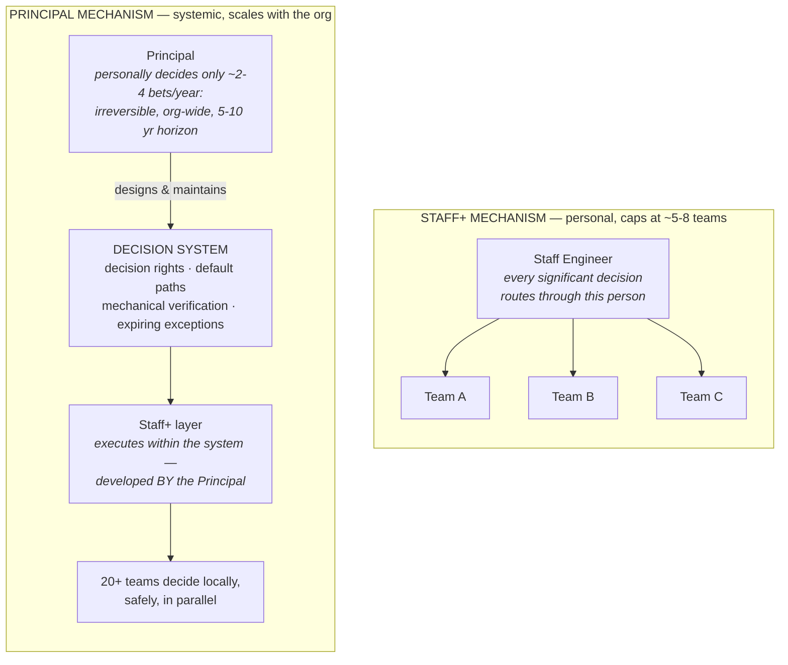
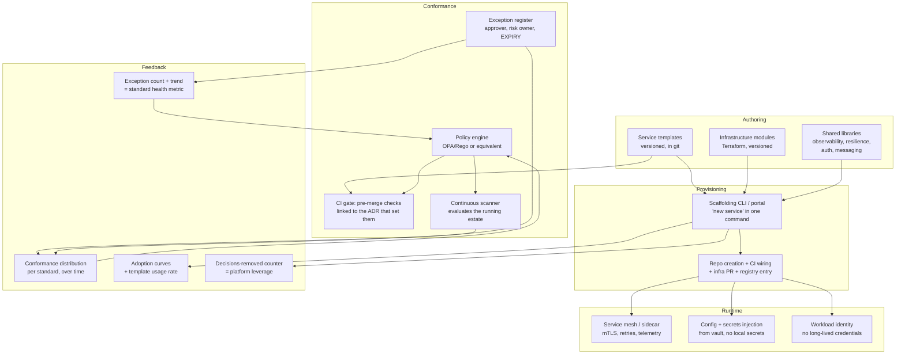
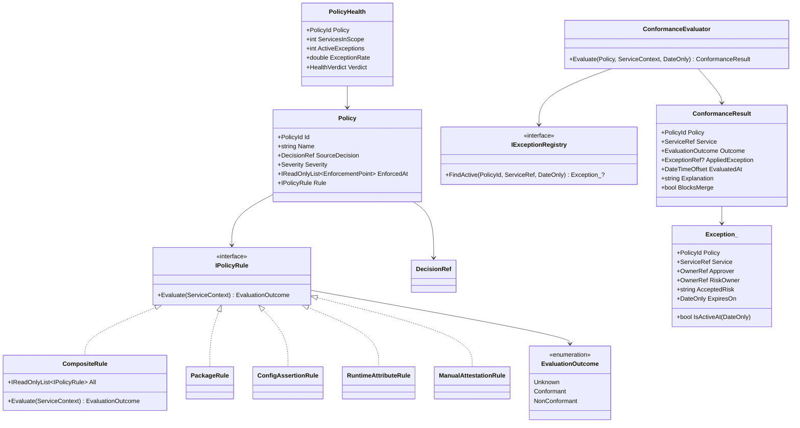
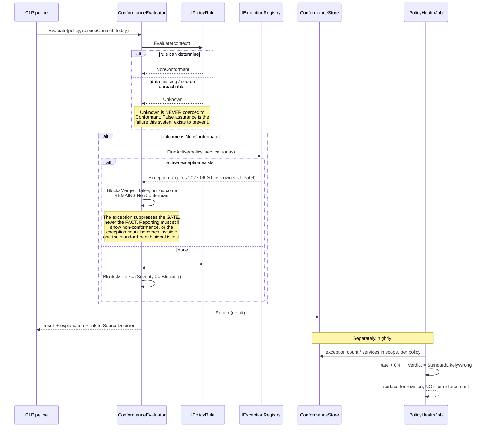

# Module 172 — Principal Engineering: Org-Wide Strategy, Governance at Scale, Build-vs-Buy & Risk Ownership

> Domain: Engineering Leadership (merged 51-55) | Level: Beginner → Expert | Prerequisite: [[03-StaffPlusEngineering-Archetypes-ScopeSelection-GlueWork-TechnicalStrategy]] (Principal is the scope at which Staff+'s problem-selection skill turns on the *portfolio* rather than on a single problem), [[02-TechnicalLeadership-InfluenceWithoutAuthority-WrittenLeverage-DisagreeAndCommit]] (the decision mechanics and decision-decay finding, which this module generalizes into a governance system), [[../30-Architecture-Patterns/04-ArchitectureTradeoffAnalysis-PrincipalDecisionMaking]] (the ATAM-style trade-off analysis — the analytical technique this module applies at organizational scale)

>
> **Scope note:** Third of the Engineering Leadership depth pass (Modules 170–175). This module takes **Principal Engineering** — including Distinguished Engineer and Fellow at the largest firms — as the scope at which the job stops being *making good decisions* and becomes *designing the system in which good decisions get made without you*.
>
> **The transition this module is about, stated once:** a Staff engineer's ceiling is roughly 5–8 teams, because their mechanism is personal — they socialize, they decide, they build. Scaling that mechanism by doing more of it personally turns the person into the organization's bottleneck, which is the exact pathology they were hired to remove. Principal is the level at which the mechanism must change kind, not degree. Almost everything in this module follows from that single shift.

---

## 1. Fundamentals

**What:** A Principal Engineer operates at **organizational or firm-wide technical scope**, and their primary outputs are: the technical strategy that determines what an organization builds over multi-year horizons; the governance system that lets dozens of independent teams compose correctly without a central bottleneck; the highest-stakes technical judgments — build-versus-buy, platform bets, major migrations — where being wrong costs years rather than sprints; and the development of the Staff+ population that executes all of it.

The definition that separates it from Staff+ most cleanly: **a Staff engineer is measured by the problems they solved; a Principal is measured by the problems the organization stopped having.** The first is a set of instances; the second is a change in the system's failure distribution.

**Why the role exists:** Because above roughly 150–200 engineers, three things become true simultaneously that no other role covers:

1. **No individual can hold the technical state of the organization**, so decisions must be delegated — but delegated decisions diverge unless something constrains them, and that something has to be designed rather than assumed.
2. **Some decisions have horizons longer than any team's planning cycle.** A datastore choice, a platform bet, or a language standardization plays out over 5–10 years. Teams plan in quarters and reorganize in years; nobody in the delivery structure is accountable for a 7-year consequence.
3. **Some risks are only visible in aggregate.** No single team can see that the firm has 14 different secrets-management approaches, or that six services independently depend on one unowned library, or that the aggregate cloud spend is growing faster than transaction volume. These are real risks with no local observer.

Each of these is a *structural gap* in the organization, exactly as argued the seam problem is. Principal is the answer to a different, larger set of gaps.

**When someone is operating at Principal level** — the tests:
- **Their decisions constrain other people's decisions.** A Staff engineer decides; a Principal decides what the space of allowable decisions is.
- **Their horizon exceeds the planning cycle.** They are routinely working on things whose payoff is beyond the current fiscal year, and they can justify that allocation to people who are measured quarterly.
- **They are accountable for aggregate risk**, not instance risk. Not "is this service secure" but "is our security posture across 200 services adequate, and how would we know?"
- **They have developed the Staff+ layer.** A Principal whose organization has no capable Staff engineers has not scaled; they have accumulated scope.

**How (30,000-ft view) — the Principal's operating loop:**

```
   MAINTAIN AN AGGREGATE MODEL OF TECHNICAL RISK & CAPABILITY
   Not systems -- the *distribution*. Where is the firm fragile?
   What is it structurally unable to do? What is it paying for and
   not getting? Built from portfolio-level data, never from personal
   familiarity (which no longer scales).
                            │
           ┌────────────────┼────────────────┐
           ▼                ▼                ▼
           SET              DESIGN THE       MAKE THE FEW
           DIRECTION        DECISION SYSTEM  BETS PERSONALLY

           Multi-year       Who decides      Build-vs-buy at
           technical        what. Golden     org scale.
           strategy.        paths so most    Platform choices.
           Explicit         decisions need   5-10 year horizons.
           non-goals.       not be made.     Irreversible, high
                            Exceptions with  blast radius.
                            expiry.          ~2-4 per year.
                            Mechanical
                            verification.
           │                │                │
           └────────────────┼────────────────┘
                            ▼
   DEVELOP THE STAFF+ LAYER THAT EXECUTES ALL OF IT
   This is not a side activity. A Principal without a capable Staff+
   population has no execution mechanism and is structurally limited
   to whatever they can personally do -- i.e. they are a Staff
   engineer with a larger title.
                            │
                            ▼
   VERIFY IN AGGREGATE
   Not "did this team comply" but "what is the distribution of
   compliance, and is it moving?" Point-in-time approval verifies
   intent; continuous measurement verifies reality.
```

The **"make few bets personally"** box has a number attached deliberately. A Principal who is personally driving fifteen initiatives has not scaled; the whole design of the role assumes most things happen through the decision system and the Staff+ layer, with the Principal's direct effort reserved for the small number of decisions where being wrong is expensive and irreversible.

---

## 2. Deep Dive

### 2.1 The change of mechanism, precisely

The Staff→Principal transition is the most-failed promotion in engineering, and the reason is that the behaviors that earn it are the behaviors that fail at it.

| | Staff+ mechanism | Principal mechanism |
|---|---|---|
| **How decisions get made well** | I make them, or I run the process that makes them | I design who decides, and constrain the space so most decisions are safe by default |
| **How quality is ensured** | I review the important things | I make the correct thing the default, and verify the distribution |
| **How problems get solved** | I select and solve the highest-leverage one | I build the capability that solves that class, and I develop the people who select |
| **How I know it worked** | The problem is gone | The rate of that problem class fell, measurably, and stayed down |
| **Failure mode** | Becoming the bottleneck | Becoming disconnected — governing systems you no longer understand |

**The two failure modes are opposite, and both are common.** The engineer who does not make the transition remains a very effective Staff engineer with a Principal title and is a bottleneck — every significant decision routes through them, they are in every review, and the organization's decision throughput is capped by their calendar. The engineer who over-corrects becomes a governance function: they set standards for systems they have not touched in three years, and their standards are subtly wrong in ways practitioners can see and they cannot.

**The resolution is not a midpoint; it is a deliberate allocation.** A workable shape: reserve depth in two or three areas where the firm's most consequential technical risk sits, stay genuinely hands-on there (including on-call, including writing reference implementations), and govern the rest through delegated decision rights and mechanical verification rather than personal review. The areas chosen for depth should be chosen by *risk concentration*, not by interest — which is uncomfortable, because it frequently means staying deep in the boring, load-bearing thing rather than the interesting new thing.

### 2.2 Designing the decision system

This is the Principal's characteristic artifact and the one most candidates cannot describe concretely.

A decision system has four components, and the common failure is building only the first:

**1. Decision rights — who decides what.** Published, explicit, per decision class. Not "the architecture team approves designs" but a specific mapping: *choice of datastore for a new service* → owning team, within the approved set; *adding a datastore technology to the approved set* → Principal + platform lead; *customer-facing API contract change* → owning team + API council; *anything that appears in a regulatory filing* → named accountable executive. The value is not the specific allocation; it is that **nothing waits to discover who decides**, which identified as the dominant term in decision latency.

**2. Constrained default paths — so most decisions need not be made at all.** The highest-leverage governance move is not deciding well; it is *removing the decision*. If the service template ships with structured logging, correlation-ID propagation, standard health checks, the approved observability stack, and sane timeout defaults, then several hundred decisions per year never happen — and the ones that do happen are the genuinely novel ones worth a Principal's attention. This is the golden path, generalized from a practice into the primary governance instrument.

**3. Mechanical verification — because approval and adoption diverge silently.** the incident is the canonical demonstration: a unanimously-agreed decision was 55% non-compliant fourteen months later and nobody knew. Any governance model whose verification is an approval event produces that outcome. The check must be continuous, automated, and **fail closed** — reporting `unknown` rather than `compliant` when it cannot determine, because a governance system that silently overstates compliance is worse than none, since the belief suppresses the checking.

**4. An exception process with expiry — because a standard with no exception path is not credible.** Teams have genuine edge cases. A governance system with no legitimate way to deviate produces one of two outcomes: teams comply nominally and evade substantively, or the standard is quietly abandoned. The exception must have an approver, a stated risk, a named risk owner, and — critically — **an expiry date**, because a permanent exception is an undocumented standard change wearing a disguise. Expiry forces periodic reconsideration and converts a growing pile of deviations into a managed queue.

**The property that makes the whole thing work: the count of exceptions is a health metric.** If a standard has 30 active exceptions across 40 teams, the standard is wrong, not the teams. A governance system that cannot detect its own wrongness will be enforced past the point of usefulness, and that is how governance functions lose legitimacy permanently.

### 2.3 Build versus buy at organizational scale

This is the decision class most associated with the role, and the one most often reasoned about badly.

**The framing error that dominates:** treating it as a cost comparison. Build cost versus licence cost, with some engineering-time estimate. This is wrong in a specific, predictable direction — it systematically favors building, because the build estimate captures construction and omits the thing that actually dominates.

**What actually dominates: the total cost of ownership over the decision's real horizon, where the largest term is usually maintenance and the second largest is opportunity cost.** A system built in 6 engineer-months will consume roughly 20–40% of one engineer indefinitely thereafter in maintenance, dependency upgrades, security patching, and adaptation to changing requirements — and that cost is paid every year for the life of the system, which for infrastructure is commonly 8–15 years. A build estimate that stops at delivery has omitted the majority of the cost.

**The dimensions that actually decide it:**

| Dimension | Favors build | Favors buy |
|---|---|---|
| **Differentiation** | This *is* the product, or a genuine competitive advantage | It is undifferentiated plumbing everyone needs |
| **Fit** | Requirements are unusual and no vendor fits without heavy customization | A vendor fits ≥80% and the remainder is genuinely negotiable |
| **Horizon** | Requirements will change in ways a vendor will not track | Requirements are stable and industry-standard |
| **Lock-in cost** | Exit from the vendor would be catastrophic and slow | Data and integration are portable; exit is a project, not a rebuild |
| **Regulatory** | The control must be demonstrably ours and auditable to our standard | The vendor holds relevant certifications we would otherwise have to earn |
| **Capability** | We have and will retain deep expertise here | We would be building a first system in a domain others have built for 20 years |
| **Time to value** | We can wait | We cannot |

**The rule of thumb that survives scrutiny:** *build what differentiates you, buy what does not — and be honest about which is which.* Nearly every engineering organization believes more of its systems are differentiating than actually are. A useful forcing question: **if a competitor had this exact system, would we lose anything?** If not, it is plumbing, and building plumbing is a decision to spend your scarcest resource on something the market has commoditized.

**The specific fintech dimensions that alter the calculus:**

- **Regulatory demonstrability cuts both ways.** For some controls, buying from a vendor with SOC 2 / PCI-DSS / ISO 27001 attestations transfers demonstrable assurance you would otherwise have to produce yourself, at real cost. For others — anything where the regulator expects the firm to evidence its *own* control — a vendor black box is a liability, because "the vendor does it" is not an adequate answer to a supervisory question about your control environment.
- **Vendor concentration risk is a supervised concern, not just a commercial one.** Operational-resilience regimes (the EU's DORA, the UK's operational-resilience rules, the US interagency guidance on third-party risk) treat critical third-party dependency as a risk the firm must manage and evidence, including exit planning. A build-versus-buy analysis at a regulated firm that does not include a credible exit plan is incomplete, and this is a specific thing interviewers at banks probe.
- **Data residency and control.** A vendor whose processing crosses a jurisdiction your data cannot leave is disqualified regardless of every other merit, and this should be checked first rather than discovered in month four of an evaluation.

**The third option candidates forget: buy *and* build a thin abstraction.** Adopt the vendor behind a port you own (the hexagonal boundary), so the vendor is substitutable and the exit plan is a real engineering artifact rather than a slide. This costs somewhat more than naive adoption and dramatically less than building, and it converts lock-in from a strategic risk into a bounded engineering cost. It is the right answer more often than either pure option, and offering it unprompted is a strong signal in an interview.

### 2.4 Technical strategy at organizational scale

Earlier analysis covered strategy as a Staff+ deliverable. At Principal scale three things change:

**The horizon exceeds the planning cycle, which creates a specific political problem.** A strategy playing out over three years must survive annual budget cycles, reorganizations, and leadership changes. The mechanisms that make it survive: express it as a small number of durable *invariants* rather than a project plan ("all customer data has a single authoritative store per entity" survives a reorg; "migrate service X to Y by Q3" does not); attach each year's concrete deliverables to the invariants so that budget conversations are about increments rather than the whole; and get it owned by someone in the management chain, because a strategy owned only by an IC dies when they change roles.

**It must be legible to non-engineers.** A Principal's strategy competes for funding against product initiatives with clear revenue stories. It must therefore state its case in business terms — risk retired, capacity unlocked, cost avoided, optionality created — without becoming vague. The specific discipline: for each element, be able to complete the sentence *"if we do not do this, then within N months we will be unable to ___."* If you cannot complete it, that element is not yet justified, and discovering that before the funding conversation is much better than discovering it during.

**It must include what the organization will become worse at.** This is the hardest part and it is what makes it a strategy rather than a wish list. At Principal scale the non-goals are consequential — "we will not support a second cloud provider," "we will not build our own stream-processing framework," "we will stop investing in the on-premises estate beyond regulatory minimums" — and each one will have a constituency that objects. Writing them anyway is the job.

**The decay problem, and the only thing that fixes it.** Strategies decay exactly like decisions. The mechanism that prevents it is a **quarterly reconciliation**: someone explicitly checks each team's roadmap against the strategy and reports the divergence. Not to enforce compliance — divergence is often correct and is genuine information — but to make it *visible*, so the strategy is either honored or explicitly amended rather than silently ignored. A strategy without this reconciliation is a document that people were once excited about.

### 2.5 Owning aggregate risk

The Principal is frequently the only person who can see certain risks, because they exist only in aggregate.

**The classes of aggregate risk worth naming:**

- **Concentration.** Six critical services depend on one library with one maintainer who is leaving. Forty services depend on one shared database. The entire estate's authentication depends on one identity provider with no tested failover. Each individual dependency is reasonable; the aggregate is a systemic risk with no local observer.
- **Divergence.** Fourteen approaches to secrets management, nine idempotency implementations, five deployment mechanisms. No individual team is wrong; the aggregate is unmanageable and un-auditable.
- **Capability gaps.** The firm has no one who understands its own core clearing logic; the three people who did have left. This risk is invisible until it is realized, and it is realized during an incident.
- **Erosion.** Test coverage, dependency currency, and documentation quality all decay monotonically unless something opposes them. Nobody's quarter is worse for a 2% decline; the cumulative effect over four years is a firm that cannot change its systems safely.
- **Cost trajectory.** Infrastructure spend growing faster than the business metric it serves. Visible only when someone divides one by the other, and frequently nobody does.

**The Principal's obligation is to make these legible and owned, not to fix them all.** The characteristic output is a **technical risk register** with the same standing as any other risk register: named risks, assessed impact and likelihood, named owners, and mitigation status — reviewed at the same forum where other operational risks are reviewed. In a regulated firm this is not a novel idea; it is fitting engineering risk into an existing, well-understood governance structure, which is far more effective than inventing a parallel one that competes for attention.

**The single most valuable habit:** for each aggregate risk, be able to state the *scenario* rather than the condition. "We have inconsistent secrets management" is a condition and it is easy to defer. "A compromised CI runner currently has standing read access to production secrets in eleven services, and we have no mechanism to detect use of those credentials" is a scenario, and scenarios get funded. This is the same translation discipline established, applied to risk rather than debt.

### 2.6 Working with executives

Principal Engineers spend meaningful time with people who do not have engineering backgrounds, and this is a learned skill with specific rules.

**Lead with the decision or the risk, not the analysis.** Engineers are trained to build to a conclusion; executives need the conclusion first and the reasoning on demand. The inverted-pyramid form — recommendation, the two or three reasons, the cost, then supporting detail — is not dumbing down; it is respecting a constraint on their attention that is real.

**Quantify uncertainty rather than hiding it.** "Between 8 and 14 months, and here is what determines which end" is more useful and more credible than "about a year." Executives make decisions under uncertainty constantly and are considerably better at handling explicit ranges than engineers expect. What destroys credibility is a confident point estimate that proves wrong — and a Principal who has done that once is discounted thereafter.

**Never surprise them with a risk they could have known earlier.** The cardinal sin. An executive's tolerance for bad news is far higher than their tolerance for late news, because late news removes their options. This is the same principle as the I8, at higher stakes.

**Translate into their currency, honestly.** Not "we need to refactor the settlement service" but "our settlement service is our largest source of Sev-2 incidents and the primary constraint on launching in the two new markets; here is what changes that and what it costs." The dishonest version of this — inflating a technical preference into a business risk — is detectable and is a career-limiting habit, because executives compare notes and calibrate over time.

**Say "I don't know" and then say when you will.** Principal Engineers are asked questions outside their knowledge routinely. Answering anyway is the single fastest way to lose the standing that makes the role work. "I don't know — I'll have an answer by Thursday" is a strong answer.

---

## 3. Visual Architecture

### 3.1 The mechanism shift, drawn



| | Staff+ mechanism | Principal mechanism |
|---|---|---|
| **Throughput** | f(one person's calendar) | f(number of capable decision-makers) |
| **Quality** | High, uniformly | Bounded by the system's design, verified in aggregate |
| **Ceiling** | Hard — ~5–8 teams | Scales with the organisation |

### 3.2 Build-vs-buy total cost over the real horizon

Illustrative cumulative cost, £k, for a capability estimated at 6 engineer-months to build:

| Year | Build | Buy | Buy + thin abstraction | Note |
|---:|---:|---:|---:|---|
| 1 | 180 | 95 | 125 | Build looks cheapest *after* year 1 only if you stop counting here |
| 2 | 255 | 180 | 215 | Maintenance begins — the term estimates omit |
| 3 | 330 | 270 | 310 | **Crossover band begins** |
| 4 | 405 | 365 | 410 | Build overtakes buy |
| 5 | 480 | 465 | 515 | |
| 6 | 555 | 570 | 625 | Buy's licence growth finally catches up |

Three things this table is meant to make concrete:

- **Maintenance dominates, and it is the term build estimates omit.** A system built in 6 engineer-months typically consumes 20–40% of one engineer indefinitely thereafter. The build column's slope after year 1 *is* that cost.
- **The crossover is typically year 3–5 and is highly sensitive to the maintenance-rate assumption.** At 20% it lands in year 6; at 40% it lands in year 3. That sensitivity is why a point estimate here is misleading — if the recommendation flips within the plausible range, say so rather than presenting a single number.
- **Buy-behind-a-thin-abstraction carries a small upfront premium** and converts vendor lock-in from a strategic risk into a bounded engineering cost. It is rarely the cheapest column and is frequently the right answer.

### 3.3 Where a Principal's attention should go

Two axes: **blast radius** (how much breaks if this is wrong) and **reversibility** (what it costs to undo).

| | **Reversible** | **Irreversible** |
|---|---|---|
| **High blast radius** | **Delegate with verification.**<br/>Standards, golden paths, fitness functions. Being wrong is correctable, so the mechanism matters more than the choice. | **Principal decides personally.**<br/>~2–4 per year: datastore bets, build-vs-buy at org scale, platform choice. Nobody else has both the scope and the horizon. |
| **Low blast radius** | **Ignore.**<br/>Genuinely not the Principal's concern. Resisting the pull to opine here is itself a skill. | **Owning team decides.**<br/>Irreversible but local — the team knows best. The Principal sets the guardrail, not the choice. |

**The trap is the bottom-left quadrant.** It is where Principal Engineers most often spend their scarcest resource, precisely because those decisions are legible, fast, and satisfying to make — while the top-right quadrant, which is the actual job, is slow, ambiguous, and produces no immediate feedback.

---

## 4. Production Example — A Firm-Wide Data Platform Decision

### Scenario

**Firm:** A mid-size asset manager and wealth platform. ~400 engineers, three business divisions (Institutional, Wealth, Retail) that grew partly by acquisition and operate with substantial autonomy.

**Your role:** Principal Engineer, firm-wide technology.

**The situation:** the firm has **five distinct data and analytics stacks**, one per division plus two legacy ones from acquisitions:

| Stack | Division | Technology | Annual cost | Team |
|---|---|---|---|---|
| A | Institutional | Snowflake + dbt + Airflow | £1.4M | 9 |
| B | Wealth | Databricks + Delta + custom orchestrator | £1.1M | 7 |
| C | Retail | On-prem SQL Server + SSIS | £0.6M | 5 |
| D | Legacy (acq. 2021) | Redshift + Glue | £0.5M | 3 |
| E | Legacy (acq. 2023) | BigQuery + Dataform | £0.4M | 2 |

Total: **£4.0M/year and 26 engineers.**

**Three forcing events arrived within one quarter:**
1. A new regulatory reporting obligation requires a **firm-wide** client-holdings view. No single stack has all the data; producing it currently requires a quarterly manual reconciliation taking 3 weeks of 4 people.
2. Snowflake's contract renews in 7 months, and the vendor has offered a firm-wide enterprise agreement at a substantial discount contingent on consolidation.
3. The CFO has asked why data infrastructure spend grew 34% year-over-year while AUM grew 6% — an aggregate cost-trajectory risk that had not previously had an observer.

### The diagnosis (6 weeks)

Deliberately, no architecture proposal in this phase. Per the first job was making the aggregate legible.

**What the analysis found, and the two findings that changed the answer:**

- **£4.0M was understated.** It counted platform licences and infrastructure only. Adding the 26 engineers' fully-loaded cost and the cross-stack reconciliation effort — including the 3-week quarterly manual process and the ~£300k/year of duplicated pipeline work where three divisions independently ingested the same market-data feed — the true figure was **£7.6M/year**.
- **Only about 20% of the workload was division-specific.** A workload census across all five stacks found that the majority of pipelines were doing structurally identical things — ingesting market data, computing positions, producing client reports — with divergent implementations. The genuinely divergent 20% was real (Institutional's risk analytics has requirements Retail does not), but it did not justify five platforms.
- **The regulatory obligation was not satisfiable by any incremental fix.** A firm-wide holdings view requires a common client and instrument identity, and no two stacks agreed on either. **This finding reframed everything**: the consolidation was not primarily a cost initiative, it was the only path to a regulatory obligation with a hard date. That changed both the audience and the urgency.
- **Concentration risk nobody had named:** Stack C (Retail, on-prem SQL Server/SSIS) had 5 engineers, of whom 2 held effectively all the knowledge and one had resigned during the analysis. Retail's regulatory reporting depended entirely on it.

### The options

Four were assessed with the discipline — and importantly, all four were assessed honestly rather than three being constructed to lose.

**Option 1 — Consolidate all five onto Snowflake** (leveraging the enterprise agreement).
**Option 2 — Consolidate onto Databricks** (Stack B's platform, strongest current engineering capability).
**Option 3 — Build a firm-wide semantic/identity layer over the existing five stacks**, leaving the platforms in place.
**Option 4 — Consolidate to two platforms**: one for analytical/reporting workloads, one for ML/quantitative workloads, on the argument that these are genuinely different workloads.

### The analysis

| Criterion | 1: All-Snowflake | 2: All-Databricks | 3: Semantic layer | 4: Two platforms |
|---|---|---|---|---|
| Solves the regulatory obligation | Yes, by construction | Yes, by construction | **Yes — and fastest** | Yes |
| Time to regulatory compliance | 14–18 months | 16–20 months | **6–9 months** | 15–19 months |
| 5-year TCO (£m, incl. people) | **24.5** | 26.0 | 31.5 | 26.5 |
| Migration risk | High — 4 stacks move | **Highest** — 4 move, incl. to a less-familiar model | **Lowest** — nothing moves | High |
| Vendor concentration | **Worst** — single vendor, firm-wide critical | Worst — same | **Best** — unchanged | Moderate |
| Fit for quantitative/ML workloads | Adequate, improving | **Strong** | Unchanged | **Strong** |
| Retail knowledge-concentration risk | Resolved by migration | Resolved | **Not resolved** — Stack C persists | Resolved |
| Organizational disruption | High | High | **Low** | High |
| Exit cost if wrong | Very high | Very high | **Low** | High |

**Where Option 1 — the recommendation — loses, stated plainly:** it produces the worst vendor-concentration position of any option, making a single vendor firm-wide critical for a regulated firm with operational-resilience obligations. It is also weaker than Databricks for the quantitative workloads Institutional runs. Both losses are real and neither was buried.

### The recommendation

**A sequenced combination, not a single option: Option 3 first, then Option 1.**

This was the analysis's actual contribution, and it came from noticing that the options were being treated as mutually exclusive when they were **sequential**.

**Phase 1 (months 0–9) — the semantic and identity layer.** Build firm-wide client and instrument identity mapping, and a thin federated query layer over the five stacks. This satisfies the regulatory obligation on time, which is the hard constraint. It costs ~£1.2M and is largely *not* wasted work, because:

**Phase 2 (months 9–30) — consolidation onto Snowflake, behind the layer built in Phase 1.** The semantic layer becomes the abstraction that makes migration incremental and reversible: consumers query the layer, not the underlying stack, so each stack can migrate behind it without consumer changes. This is the branch-by-abstraction and the ports-and-adapters applied at platform scale — and it is the same "buy *and* build a thin abstraction" move, here applied to an internal migration rather than a vendor.

**Sequencing decisions within Phase 2, driven by risk rather than convenience:**
- **Stack C (Retail) first**, despite being the smallest, because of the knowledge-concentration risk — one of two knowledge holders had already resigned. Migrating it first converts an unmanaged personnel risk into completed work. *Convenience would have said last; risk said first.*
- Stack D and E (the small acquisitions) second — lowest complexity, builds the migration playbook cheaply.
- Stack A (Institutional) third — largest, most complex, benefits from the playbook.
- Stack B (Wealth/Databricks) **not migrated in this programme.** Explicit non-goal.

**The non-goals, which were the contentious part:**
- **Databricks stays** for quantitative and ML workloads. Consolidating them onto Snowflake was assessed and rejected: it is where Snowflake is genuinely weaker, the Wealth team's capability there is real, and forcing it would have converted a supportive division into an opposing one for a marginal simplification. This makes the end state *two* platforms, not one — which is a partial adoption of Option 4 and was named as such rather than presented as full consolidation.
- **No modernization of the reports themselves** during migration. Lift the pipelines, do not redesign them. Bundling redesign into migration is the single most reliable way to make a migration fail, and it was the most frequently requested addition.
- **No new self-service analytics capability** until Phase 2 completes, despite substantial demand.

**On the vendor concentration this creates**, which is the recommendation's honest weakness: mitigated rather than dismissed. The semantic layer means consumers depend on the layer's interface, not Snowflake's, so a future exit is a re-platforming behind a stable interface rather than a rebuild of every consumer. A documented, costed exit plan was produced as a deliverable of Phase 2 — not as a slide but as an actual runbook with a tested extraction path, because operational-resilience obligations require the firm to evidence that exit is feasible.

### The executive communication

The paper to the executive committee opened with three sentences:

> We cannot meet the March 2028 regulatory holdings requirement with our current five data platforms, because no two agree on client or instrument identity. I recommend a two-phase programme: a firm-wide identity and semantic layer delivered by Q3 2027 to meet the obligation, followed by consolidation from five platforms to two, reducing run cost from £7.6M to a projected £4.1M by 2029. The programme costs £3.4M over 30 months and carries one material risk I want to be explicit about: it makes a single vendor firm-wide critical, and I have included a costed exit plan rather than treating that as acceptable.

Then the reasoning, then the analysis. The £7.6M figure — not the £4.0M the CFO had been given — was the sentence that got the programme funded, because it reframed the CFO's original question from "why is spend growing" to "we have been under-measuring this by nearly half."

### Trade-offs

| Dimension | What was accepted |
|---|---|
| **Phase 1 is partly transitional** | ~£400k of the £1.2M semantic-layer work is scaffolding that becomes unnecessary post-consolidation. Accepted deliberately: it buys regulatory compliance on time and makes Phase 2 incremental. Named explicitly in the paper rather than hidden, because an executive discovering it later would reasonably question everything else. |
| **Vendor concentration** | Genuine and material. Mitigated by the abstraction layer and a tested exit plan, not eliminated. |
| **Two platforms, not one** | Less simplification than the "consolidate everything" narrative the vendor's discount was premised on. Correct: the marginal simplification was not worth converting a capable, supportive division into an opponent — and the discount was renegotiated on the smaller footprint. |
| **30-month horizon** | Exceeds two budget cycles and one likely reorganization. Mitigated by expressing the strategy as invariants, attaching annual deliverables, and getting the COO as executive owner rather than owning it as an IC. |

### Lessons learned

1. **The options were sequential, not exclusive.** The entire value of the analysis was noticing that. Presenting four mutually-exclusive options and picking one would have produced either a missed regulatory date (Options 1, 2, 4) or a permanently expensive estate (Option 3).
2. **The cost figure everyone had was wrong by 90%**, because it counted licences and not people or duplicated work. Establishing the true aggregate was the highest-leverage six weeks in the programme.
3. **The regulatory obligation, not the cost, was the forcing function** — and recognizing that changed the audience, the urgency, and the sequencing. A cost-led paper would have been deferred to the next planning cycle.
4. **Sequencing by risk rather than convenience** put the smallest, least interesting stack first. That is nearly always the right call and nearly always argued against.
5. **Stating the recommendation's worst property in the opening paragraph** was what made the rest credible. The executive committee's first question was about vendor concentration, and it had already been answered.
## 10. Interview Questions

### Basic (10)

**B1. Q: What is the difference between a Staff engineer and a Principal engineer?**
*Ideal Answer:* Scope and mechanism. A Staff engineer's scope spans several teams and their mechanism is personal — they select, decide, and build. A Principal's scope is organizational, and their mechanism must change kind: they design the system in which decisions get made well without them, set multi-year direction, own aggregate risk, and develop the Staff+ layer that executes. The distinguishing measure: a Staff engineer is judged by the problems they solved; a Principal by the problems the organization stopped having.
*Why correct:* Names the change of mechanism rather than treating it as more scope, and gives the measurement difference.
*Common mistakes:* "Principal is broader Staff" — misses that scaling the Staff mechanism is precisely the failure mode.
*Follow-up:* What happens to a Principal who does not change mechanism? (They become the organization's decision bottleneck — the exact pathology the role exists to remove.)

**B2. Q: What are the components of a governance or decision system?**
*Ideal Answer:* Four: published decision rights (who decides what, so nothing waits to discover its owner); constrained default paths (golden paths that remove most decisions entirely); mechanical, continuous verification that fails closed; and an exception process with an approver, a named risk owner, and a mandatory expiry.
*Why correct:* All four, including the two most-omitted — defaults and exception expiry.
*Common mistakes:* Describing only a review board, which is a gate rather than a system.
*Follow-up:* Which component removes the most work? (Default paths — a decision that never has to be made costs nothing to govern.)

**B3. Q: Why does a standard need an exception process?**
*Ideal Answer:* Because teams have genuine edge cases, and a standard with no legitimate deviation path produces nominal compliance with substantive evasion. More importantly, the exception count is the only mechanism by which the governance system detects that a standard is *wrong* — 30 exceptions across 40 teams means the standard is the problem, not the teams.
*Why correct:* Gives both the practical reason and the self-correction property.
*Common mistakes:* Treating exceptions purely as a concession to pragmatism, missing the diagnostic value.
*Follow-up:* Why must exceptions expire? (A permanent exception is an undocumented standard change; expiry forces reconsideration.)

**B4. Q: What is usually the largest cost term in a build decision, and why is it missed?**
*Ideal Answer:* Maintenance over the system's real life. A system built in 6 engineer-months typically consumes 20–40% of an engineer indefinitely — patching, dependency upgrades, adaptation — for an 8–15 year infrastructure lifespan. It is missed because build estimates stop at delivery, which is the point at which the recurring cost begins.
*Why correct:* Quantifies the term and explains the structural reason estimates omit it.
*Common mistakes:* Naming initial build cost, or opportunity cost alone.
*Follow-up:* What is the second largest? (Opportunity cost — what those engineers were not building.)

**B5. Q: How should a Principal decide what to work on personally?**
*Ideal Answer:* By blast radius and reversibility. Personally decide the small number of things that are both high-blast-radius and irreversible — platform bets, build-vs-buy at org scale, datastore direction — typically two to four per year. Delegate high-blast-radius but reversible decisions to standards and verification. Let owning teams decide the locally-scoped ones, even irreversible ones, with guardrails rather than choices.
*Why correct:* Gives a two-axis allocation rather than a priority list.
*Common mistakes:* "The most important things," which does not distinguish what only they can do.
*Follow-up:* Where do Principals most often waste time? (Low-blast-radius reversible decisions — they are legible, fast, and satisfying, which is exactly the trap.)

**B6. Q: What makes a multi-year technical strategy survive a reorganization?**
*Ideal Answer:* Expressing it as durable invariants rather than a project plan — "every entity has a single authoritative store" survives a reorg; "migrate X to Y by Q3" does not — with annual deliverables attached so budget conversations are about increments; and an owner in the management chain, because a strategy owned only by an IC dies when they change roles.
*Why correct:* Names all three mechanisms.
*Common mistakes:* "Write it down and communicate it" — necessary and insufficient.
*Follow-up:* What prevents the strategy decaying between reorgs? (Quarterly reconciliation of team roadmaps against it, to make divergence visible rather than silent.)

**B7. Q: What is aggregate risk and give an example.**
*Ideal Answer:* Risk visible only across the estate, where every individual instance is reasonable. Examples: eleven services sharing one service account; forty services on one shared database; the firm's whole authentication path depending on one provider with untested failover; infrastructure cost growing faster than the business metric it serves. No single team can see any of these, so they have no local observer — which is why they are the Principal's to own.
*Why correct:* Defines it by the no-local-observer property and gives concrete examples.
*Common mistakes:* Describing it as "big risks," which misses the structural point.
*Follow-up:* How do you get one funded? (State the scenario, not the condition — a scenario has a consequence someone can act on.)

**B8. Q: When should a firm build rather than buy?**
*Ideal Answer:* When it genuinely differentiates — when a competitor having the same system would cost you something; when requirements are unusual enough that no vendor fits without customization exceeding the build; when lock-in would be catastrophic; or when a regulator expects the control to be demonstrably yours. Buy undifferentiated plumbing, and be honest that most systems are plumbing — organizations consistently over-estimate how much of their estate is differentiating.
*Why correct:* Leads with differentiation and includes the honesty caveat.
*Common mistakes:* Answering purely on cost.
*Follow-up:* What is the forcing question for differentiation? ("If a competitor had this exact system, would we lose anything?")

**B9. Q: Why does mechanical verification matter more than approval?**
*Ideal Answer:* Because approval is point-in-time and adoption is continuous, and the two diverge silently. A decision unanimously agreed can be majority-non-compliant a year later with nobody knowing, because nothing checked. Mechanical verification runs on every build, forever, and must fail closed — reporting unknown rather than compliant when it cannot determine — since a system that overstates compliance is worse than none, as the belief suppresses checking.
*Why correct:* Names the divergence, the fail-closed requirement, and why false compliance is the worst state.
*Common mistakes:* Framing it as efficiency rather than as correctness.
*Follow-up:* What is the aggregate measure to watch? (The share of standards with no machine-checkable signal — a governance programme drifting toward unverifiable standards is decaying.)

**B10. Q: Why is developing Staff+ engineers part of the Principal role rather than a side activity?**
*Ideal Answer:* Because the Staff+ layer is the execution mechanism. A Principal designs direction and the decision system; Staff engineers run the initiatives within it. Without that layer the Principal is limited to what they can personally do, which is the Staff mechanism with a bigger title — and the organization has a single point of failure on its entire technical direction.
*Why correct:* Frames it as structural necessity rather than as good citizenship.
*Common mistakes:* Treating it as mentorship or as a nice-to-have.
*Follow-up:* What is the test? (If the Principal left, would the technical direction continue? If not, succession has failed regardless of the direction's quality.)

---

### Intermediate (10)

**I1. Q: Walk me through how you would design a decision system for a 300-engineer organization that currently routes everything through an architecture review board.**
*Ideal Answer:* Start by measuring what the board actually does — sample the last 50 submissions and classify: how many were genuinely cross-cutting and irreversible, and how many were routine decisions the owning team could have made? In most organizations the second category dominates, and that is the argument. Then: publish decision rights per class, so routine decisions do not queue; build a golden-path template that removes the most common decisions entirely; convert the board's recurring concerns into mechanical checks in shared CI; and narrow the board to an *enumerated* list of genuinely irreversible, firm-wide decisions — enumerated rather than criteria-based, because criteria drift and an enumeration requires a visible decision to expand. Keep an exception path with expiry. Measure decision latency before and after.
*Why correct:* Measures first, uses the data as the argument, and specifies the enumeration mechanism that prevents scope creep.
*Common mistakes:* Abolishing the board without a replacement, which produces divergence; or reforming its process without reducing its scope.
*Follow-up:* Why enumerate rather than use criteria? (Criteria are interpreted expansively by a board with capacity — an enumeration makes expansion an explicit, visible decision.)

**I2. Q: How do you evaluate a build-versus-buy decision at organizational scale?**
*Ideal Answer:* Model total cost of ownership over the system's realistic life — 8–15 years for infrastructure — with maintenance at 20–40% of an engineer per year for a built system, plus opportunity cost. Assess on differentiation (would a competitor having this cost us anything?), fit, requirement stability, lock-in and exit cost, regulatory demonstrability, and whether we have and will retain the capability. Sensitivity-test the maintenance assumption, because the crossover is highly sensitive to it. And explicitly consider the third option — buy behind a thin abstraction you own — which converts lock-in from a strategic risk into a bounded engineering cost.
*Why correct:* Full horizon, the decisive dimensions, sensitivity analysis, and the third option most candidates omit.
*Common mistakes:* A 3-year cost comparison; treating it as binary.
*Follow-up:* What do regulated firms need that others do not? (A credible, costed, tested exit plan — third-party concentration is a supervised risk under DORA and equivalent regimes, not just a commercial one.)

**I3. Q: Your governance standard has 30 active exceptions across 40 teams. What does that tell you?**
*Ideal Answer:* That the standard is wrong, or that compliance is too expensive — not that the teams are undisciplined. Three-quarters of teams needing to deviate means the standard does not fit the reality it governs. The response is to examine the exceptions for a pattern: if they cluster around one condition, narrow the standard to exclude that condition; if they are diverse, the standard is probably over-specified and should be reduced to the genuinely invariant part. Enforcing it harder is the wrong move and would cost the governance function credibility across every other standard.
*Why correct:* Reads the exception count as a signal about the standard, and gives a concrete diagnostic on the exception pattern.
*Common mistakes:* Treating it as a compliance problem.
*Follow-up:* When is a high exception count *not* a sign the standard is wrong? (Non-negotiable regulatory or security controls — there it means the compliant path is too costly, and that is what to fix.)

**I4. Q: How do you keep a technical strategy from becoming a document nobody acts on?**
*Ideal Answer:* Three mechanisms. A genuine diagnosis, so some actions are obviously ruled out — without one, every proposal is equally justifiable. Explicit non-goals, so it forecloses something; a strategy that forecloses nothing gets cited by every team as endorsement of what they were already doing. And a quarterly reconciliation where someone checks each team's roadmap against it and reports divergence — not to enforce, since divergence is often correct and is information, but to make it visible so the strategy is either honored or explicitly amended.
*Why correct:* Names all three, and correctly frames reconciliation as visibility rather than enforcement.
*Common mistakes:* Better communication or wider socialization, which addresses a problem that is not the problem.
*Follow-up:* What is the three-month test? (Pick two teams' roadmaps: is anything on them because of the strategy, or off them because of it? If neither, it has no teeth.)

**I5. Q: How do you present a technical recommendation to an executive committee?**
*Ideal Answer:* Inverted pyramid: the recommendation, the two or three reasons, the cost, then supporting analysis on demand. Quantify uncertainty as an explicit range with what determines which end, rather than a point estimate — executives handle ranges well and a confident estimate that proves wrong permanently discounts you. State the recommendation's worst property early, because the objection will come anyway and it is better answered on your terms. And translate honestly into business terms — risk retired, capacity unlocked, cost avoided — without inflating a technical preference into a business risk, which is detectable and career-limiting.
*Why correct:* Structure, uncertainty, the state-the-weakness move, and the honesty boundary.
*Common mistakes:* Building to the conclusion; hiding the weakness; over-claiming business impact.
*Follow-up:* What is the cardinal sin? (Surprising them with a risk they could have known earlier — tolerance for bad news is high, for late news very low, because late news removes their options.)

**I6. Q: A Principal you work with is in every design review and every decision. What is wrong and how would you fix it?**
*Ideal Answer:* They have scaled the Staff mechanism instead of changing it, so organizational decision throughput is capped by one calendar and their own high-leverage work never happens. The fix is to move the constraint from review to design: publish decision rights so routine decisions do not need them; convert their recurring review comments into mechanical checks, since a comment they make repeatedly is a rule that should be automated; delegate classes of decision explicitly with a stated bar; and shift their own measurement from decision quality to outcome distribution.
*Why correct:* Diagnoses the mechanism failure and gives the specific "recurring comment → automated rule" conversion.
*Common mistakes:* Suggesting they attend fewer meetings, which treats the symptom.
*Follow-up:* How would you convince them? (Show the decision-latency data for their domain versus others — the bottleneck is measurable, and measurement is more persuasive than assertion to this audience.)

**I7. Q: How do you decide which technologies belong on an approved list?**
*Ideal Answer:* The list should be small and its purpose should be explicit: it exists to concentrate operational expertise and reduce the surface the firm must be able to support, patch, and hire for — not to express preference. So include what the firm can genuinely operate well: has staffed expertise, has run in production, can patch across the estate quickly, and has a support path. Adding to the list is a real decision with an ongoing cost, so it needs a sponsor accepting operational ownership. And the list needs a *removal* process — approved lists that only grow eventually approve everything and mean nothing.
*Why correct:* Grounds it in operability rather than preference, and includes the removal process nobody mentions.
*Common mistakes:* Curating by technical merit, which ignores that the cost is operational.
*Follow-up:* How do you handle a team that wants something off-list? (Exception with expiry, a named owner accepting operational responsibility, and a genuine reassessment at renewal — if three teams request the same thing, that is an argument to add it.)

**I8. Q: How do you measure whether a governance system is working?**
*Ideal Answer:* Not by compliance rate alone. Four measures: decision latency by class (is the system reducing queuing?); adoption curves per standard (shape is diagnostic — plateau at 60% means friction for a specific class); exception counts and trend (rising means standards are drifting from reality); and the share of standards with no machine-checkable signal, since a programme drifting toward unverifiable standards is decaying. Plus the outcome measure that matters most: did the incident or defect class the standard targeted actually decline, against a pre-recorded baseline?
*Why correct:* Process and outcome measures, and the unverifiable-standards drift metric.
*Common mistakes:* Compliance percentage alone, which can be high for standards that do nothing.
*Follow-up:* What does 100% compliance with no change in outcomes tell you? (The standard was not addressing the cause — worth withdrawing rather than celebrating.)

**I9. Q: How do you maintain technical depth as a Principal?**
*Ideal Answer:* Deliberately, and in areas chosen by risk concentration rather than interest — which frequently means staying deep in the boring load-bearing system rather than the interesting new one. Concretely: remain on-call in at least one area; write reference implementations rather than only specifying; and co-author standards with practitioners so the writing itself forces engagement with reality. The failure mode this prevents is governing systems you no longer understand, where standards are subtly wrong in ways every practitioner can see and you cannot.
*Why correct:* Specifies the selection criterion and the concrete mechanisms, and names what it prevents.
*Common mistakes:* "Stay curious" or "read a lot" — neither is a mechanism.
*Follow-up:* How do you know it has eroded? (Practitioners stop pushing back on your standards — not because they agree, but because they have concluded it is not worth explaining.)

**I10. Q: You inherit a two-year platform investment that is 60% complete and, in your assessment, will not deliver its promised value. What do you do?**
*Ideal Answer:* Verify the assessment before acting — 60% complete and disappointing is a common state for platforms that eventually work, and a new Principal's judgment on someone else's programme should be tested against people closer to it. Get specific: what was promised, what is the current adoption, and what would have to be true for the remaining 40% to deliver it? If the assessment holds, the options are stop, narrow to the part that does deliver, or complete. Narrowing is usually right and is rarely considered. Whatever the choice, make the criteria explicit and get the accountable executive to own the decision — a Principal unilaterally killing someone's two-year programme, however correct, is a political act that will cost more than it saves. And make stopping *survivable* for the people involved, or the organization learns that admitting a bet failed is fatal, and the next one runs longer.
*Why correct:* Verifies first, surfaces the under-considered narrowing option, routes the decision correctly, and addresses the organizational consequence.
*Common mistakes:* Cancelling on personal authority; or continuing to avoid the conflict, which is the more common failure.
*Follow-up:* Why is narrowing under-considered? (Because the framing is binary — succeed or fail — and narrowing requires admitting the original scope was wrong while claiming part of it was right, which is harder to say than either extreme.)

---

### Advanced (10)

**A1. Q: Design the governance for a firm where three divisions have historically operated with full autonomy and will resist any central standard.**
*Ideal Answer:* Narrow the ambition to what genuinely requires central coherence, and be explicit that everything else stays local — divisions resist losing implementation autonomy far more than they resist a contract, and most of a standard's value lives in the contract. So govern: interfaces between divisions, controls with regulatory weight, and anything creating firm-wide concentration risk. Leave implementation entirely alone. Establish the standards through a working group with a respected engineer from each division, and have *them* present the output — a standard authored by the divisions is a different object from one issued by the centre. Enforce mechanically only at the boundary. Provide an exception path with a named approver, because an exception process that exists is what makes the standard credible rather than aspirational. And measure with each division's own data, never aggregate, because aggregate data invites "that's the other division's problem."
*Why correct:* Attacks the actual obstacle (autonomy loss) by narrowing scope to contracts, uses local authorship for legitimacy, and gets the data framing right.
*Common mistakes:* Uniform implementation standards; central authorship; aggregate data.
*Follow-up:* What is the first standard you would attempt? (One addressing a problem all three divisions independently complain about — usually cross-division data exchange — so the first exercise of the mechanism produces something they wanted.)

**A2. Q: How do you decide when to standardize versus when to allow divergence?**
*Ideal Answer:* Standardize where variance is *harmful* and leave it alone where variance is *legitimate* — and the test is whether the divergence imposes a cost on someone other than the team choosing it. Divergent interfaces, security controls, and observability impose external cost: they break composition, create audit gaps, and make incidents unresolvable across teams. Divergent internal implementation, libraries, and local tooling generally do not. The second test is whether the firm can afford the operational surface: three message brokers means three sets of expertise, patching, and on-call knowledge, and that cost is real regardless of each choice's local merit. Where both tests are ambiguous, prefer divergence — standardizing prematurely on an insufficient sample generalizes wrongly, exactly as it does in code.
*Why correct:* Gives an externality test plus an operability test, and a default for the ambiguous case with a reason.
*Common mistakes:* Standardizing for consistency as an end, which is the most common over-reach and produces the governance function teams route around.
*Follow-up:* How many message brokers should a 500-engineer firm have? (Ideally one, realistically two — one streaming, one queueing — with a strong argument required for a third, because the marginal expertise cost is what dominates, not the technology's merit.)

**A3. Q: A major platform bet you sponsored two years ago is clearly not going to pay off. Walk me through handling it.**
*Ideal Answer:* Lead the stop yourself, early, and publicly. Establish the facts first — adoption, the specific promised outcomes, and what would have to be true to still get them — so the decision rests on evidence rather than on a change of mood. Distinguish honestly whether it was a bad decision given what was knowable, or a good decision overtaken by events; they carry different lessons and conflating them either excuses poor judgment or punishes sound judgment. Consider narrowing before stopping, since part of the investment usually does deliver. Then, critically, protect the people: the engineers followed a documented, reasoned direction, which is exactly what you want them to keep doing, so the ownership is yours and must be stated as yours. The organizational stake is larger than this bet — if stopping is seen as career-ending, every future bet runs past its evidence, and the cost of that is far higher than this write-off.
*Why correct:* Owns it, holds the decision-versus-outcome distinction, surfaces narrowing, and identifies the systemic consequence as the dominant consideration.
*Common mistakes:* Defending it on sunk cost; or quietly reducing investment without a decision, which is the most common and worst option because it wastes resource indefinitely without producing the lesson.
*Follow-up:* What should have been in place at commitment time? (Explicit falsification conditions and review gates, with a named person empowered to stop it — decided when enthusiasm was high, not when it had faded.)

**A4. Q: How do you handle a Staff engineer whose technical judgment you believe is wrong on something significant, in their own domain?**
*Ideal Answer:* Start by testing your own view — they are closer to it and probably know constraints you do not, and a Principal overriding on incomplete context is both wrong more often than they think and enormously costly to their standing. Ask what outcome they expect and what would change their mind. If you still disagree, the question is whether this falls in your decision rights: if it is within their scope and reversible, offer the view clearly, say it is their call, and genuinely do not relitigate — including letting them be wrong, which is how judgment develops. Intervene only if it crosses into irreversible, high-blast-radius, or precedent-setting territory, and when you do, say explicitly which of those you are invoking, because being explicit about the *reason* preserves the norm for the reversible cases.
*Why correct:* Epistemic humility first, applies the decision-rights framework the Principal themselves designed, and requires naming the override reason.
*Common mistakes:* Overriding on seniority, which teaches the Staff engineer that decision rights are conditional and therefore worthless.
*Follow-up:* What if they are wrong and it goes badly? (Support them publicly, review it as a decision-process question rather than a personal one, and do not say you disagreed — that is relitigating after the fact and it destroys the delegation.)

**A5. Q: How would you build the technical risk register for a 500-engineer regulated firm?**
*Ideal Answer:* Fit it into the firm's existing operational-risk governance rather than inventing a parallel engineering process — an engineering-only register competes for attention and loses, whereas the existing structure carries authority and an established review cadence. Populate it with aggregate risks that have no local observer: concentration (shared credentials, single-maintainer critical dependencies, unfailed-over providers), divergence (multiple incompatible approaches to a control), capability gaps (systems nobody remaining understands), erosion trends, and cost trajectory. For each, state the *scenario* rather than the condition, because scenarios have consequences people can act on and conditions get deferred. Every entry needs a named owner in the delivery organization, not the Principal — the Principal's role is identification and escalation, and owning them all is a bottleneck and an accountability fiction. Review on the existing cadence and track mitigation status.
*Why correct:* Inherits existing governance authority, uses the scenario framing, and correctly separates identification from ownership.
*Common mistakes:* Building a separate engineering risk process; owning everything personally.
*Follow-up:* How do you get engineering risks taken seriously alongside credit and market risk? (Express them in the same terms — impact, likelihood, tolerance — and, decisively, cite realized instances: an engineering risk that has already caused a loss event is not theoretical.)

**A6. Q: Your firm's cloud spend is growing 40% year-over-year while revenue grows 8%. How do you approach it?**
*Ideal Answer:* Decompose before optimizing, because the aggregate figure conceals three completely different causes with different responses: genuine growth in load (fine, and should track a business metric); *waste* — idle resources, over-provisioning, unused environments, storage never lifecycled; and *architectural inefficiency* — patterns that consume disproportionate resource, such as chatty synchronous calls, unbounded retries, or data movement between regions. Get per-service, per-team attribution first, because unattributed cost is nobody's problem and attribution alone typically produces a 10–15% reduction with no other intervention. Then: make cost visible in the tools teams already use, set the unit-economics metric (cost per transaction, per client) as the target rather than absolute spend — absolute targets punish growth — and treat the largest architectural inefficiencies as engineering work with a business case. Do not run a central cost-cutting programme; they produce one-time savings and the trajectory resumes.
*Why correct:* Decomposes into distinct causes, prioritizes attribution, sets unit economics as the correct target, and rejects the central-programme approach with a reason.
*Common mistakes:* An efficiency drive without attribution; targeting absolute spend, which penalizes growth and gets ignored.
*Follow-up:* Why is attribution alone so effective? (Because unattributed cost has no owner — the moment a team sees their own number, the obvious waste gets removed without any central intervention.)

**A7. Q: Two Principals in your firm have set conflicting technical directions for adjacent domains. How is this resolved?**
*Ideal Answer:* First check whether it is genuinely conflicting or two locally-correct answers to different constraints — very often both are right for their own domain and the only real question is the contract at the boundary, which is usually available and rarely looked for. If genuinely conflicting, the two should jointly author one document presenting both directions honestly with either a shared recommendation or a clearly-framed choice, and take it to the accountable executive together. Escalating separately converts a decision between options into a contest between people, which is worse for everyone including the winner. If it recurs structurally, that is a signal the decision rights are ambiguous at that boundary and the durable fix is defining them, not adjudicating each instance.
*Why correct:* Looks for the boundary contract first, uses joint authorship to keep it a decision, and identifies the recurrence as a decision-rights defect.
*Common mistakes:* Separate escalation; or one deferring to avoid conflict, which loses real information.
*Follow-up:* Who should own a boundary between two Principals' domains? (Explicitly one of them, named — shared ownership of a boundary is how boundaries become unowned, which is the entire seam argument.)

**A8. Q: How do you assess whether an organization's technical strategy is actually good, as opposed to well-written?**
*Ideal Answer:* Four tests, all evidence-based. **Does it forecloses anything?** Find the non-goals; if there are none, it is a wish list. **Did it change any allocation?** Compare a team's roadmap to what it would have been anyway — if nothing moved, it has no teeth. **Is it falsifiable?** Does it state what would prove it wrong, and has anyone checked? **Does it survive contact with a hard trade-off?** The real test is what happened the first time it conflicted with a revenue-generating request — if the strategy lost silently, it is decorative. I would also ask engineers two levels down what the strategy is; if they cannot state it, it is not operating regardless of quality.
*Why correct:* All four tests are verifiable from records rather than from reading the document, and the two-levels-down check is a strong practical signal.
*Common mistakes:* Assessing the document's quality, which is nearly uncorrelated with its effect.
*Follow-up:* Which test is most diagnostic alone? (What happened at the first conflict with a revenue request — that single event reveals whether it has any force.)

**A9. Q: You are asked to standardize on a technology you believe is the wrong choice, by an executive who has already committed publicly. How do you handle it?**
*Ideal Answer:* Separate whether it is *wrong* or *not my preference* — that distinction determines everything and Principals get it wrong in the direction of over-claiming. If it is preference, support it; standardizing on an adequate technology is usually better than the cost of relitigating. If genuinely wrong, present the specific, quantified consequence privately and early, and state what would need to be true for me to be comfortable — the goal is not to win but to ensure the risk is visible and owned. Offer a path that preserves their public commitment where one honestly exists: a phased adoption with a defined checkpoint, or adopting it behind an abstraction that bounds the exit cost. If they proceed anyway with full information, support it and ensure the risk is documented with a named owner, then make the implementation as good as it can be. What I cannot do is publicly assert a technical claim I believe is false.
*Why correct:* Applies the preference-versus-wrong test, seeks the face-preserving path that is also technically sound, and names the line.
*Common mistakes:* Framing it as capitulate-or-fight; missing that the abstraction option genuinely resolves many of these.
*Follow-up:* What if it later proves wrong? (Raise it with data, without reference to the earlier disagreement — being right silently is worth far more than being right loudly, and the record already exists.)

**A10. Q: How do you build a Staff+ population where none exists?**
*Ideal Answer:* Identify candidates by behavior, not title — who is already selecting problems, spanning boundaries, and producing durable artifacts without being asked? That is the signal, and it is usually visible in one or two people. Then sponsor rather than mentor: give them a genuine cross-team initiative with real stakes, back them publicly, and stay available without taking over — the fastest way to ruin it is rescuing at the first wobble. Simultaneously make the role legible: publish what Staff+ means here in terms of the problem class rather than a list of activities, so people can aim at it and so managers can assess against it. Then protect the time — the most common failure is a newly-minted Staff engineer being pulled entirely onto team delivery by a manager under pressure, through individually-defensible decisions, and the mitigation must be structural rather than cultural.
*Why correct:* Identifies by behavior, uses sponsorship, makes the role legible, and names the structural protection failure.
*Common mistakes:* Promoting the strongest coders, which produces Staff-titled senior engineers; announcing a ladder without changing anyone's work.
*Follow-up:* How long does it take? (Realistically 18 months to two years for the first cohort to operate independently — and a Principal who expects faster will conclude the people are inadequate when the timeline was.)

---

### Expert (10)

**E1. Q: You join as the first Principal Engineer at a 400-person fintech formed by three acquisitions. Systems, standards, and cultures are entirely divergent. There is regulatory pressure to demonstrate consistent controls. Design your first year.**
*Ideal Answer:* **Months 0–3, establish the aggregate picture nobody has.** Nobody in this firm knows what it actually runs — that is the defining property of acquisition-assembled estates and it is also the regulatory problem, since you cannot evidence consistent controls over an inventory you do not have. So: a service and technology inventory, a dependency graph, a controls-coverage map against the regulatory obligations, and the true cost picture including people. Deliberately no standards in this window, and I would say so explicitly, because a standard issued before I understand the estate will be wrong and the first standard's failure is expensive — it teaches three sceptical divisions that central governance is uninformed. **Months 3–6, one standard, chosen for legitimacy rather than importance.** Pick the control area where the regulatory obligation is clearest and all three divisions independently acknowledge a gap — usually access management or audit logging. Author it with a working group containing a respected engineer from each division and have them present it. Scope it to the *contract* — what must be true and evidenceable — never the implementation. Enforce mechanically at the boundary only, with an exception path. This establishes the mechanism on a problem where the divisions want the outcome. **Months 6–9, the decision system.** Publish decision rights; establish the approved-technology list by *codifying what already exists and is operable* rather than by choosing a target state, because a target-state list on day one is a migration mandate in disguise and will be rejected. Build the first golden-path template from whichever division's is furthest along, credited to them. **Months 9–12, the multi-year strategy**, now with evidence, expressed as invariants, with the consolidation sequencing driven by risk concentration and regulatory exposure. **What I would explicitly not do in year one:** mandate a target architecture, consolidate platforms, or standardize implementation. Each is correct eventually and each, attempted in year one, converts three autonomous divisions into three opponents and forfeits the mechanism I need for everything after.
*Why correct:* Sequences inventory → legitimacy-building standard → decision system → strategy, understands the acquisition-estate problem, uses local authorship, codifies-then-curates the technology list, and names explicit non-actions with reasons.
*Common mistakes:* Leading with a target architecture; standardizing implementation; issuing standards before understanding the estate.
*Follow-up:* Why codify the existing technology list rather than curate a target? (Because a target list is a migration mandate for whichever divisions are off it, and issuing that as your first act guarantees resistance to everything after. Curate later, from a position of established legitimacy.)

**E2. Q: Assess this claim: "A Principal Engineer should not be a decision-maker; they should be an influencer."**
*Ideal Answer:* Half right, and the wrong half matters. It is correct that a Principal whose mechanism is making decisions personally has failed to scale — that is the central point, and the claim is reacting to the real pathology of the Principal-as-universal-reviewer. But it over-corrects into an abdication. There is an irreducible class of decisions a Principal must actually *make*: those that are irreversible, firm-wide in blast radius, and beyond any team's horizon or authority — platform bets, build-versus-buy at org scale, the technology-list boundary. Two to four a year, but they are the ones with the largest consequences, and there is nobody else positioned to make them: teams lack the scope, executives lack the technical basis. More fundamentally, the framing is a false dichotomy. **The Principal's characteristic act is neither deciding nor influencing — it is designing the space in which others decide**, which is a stronger form of authorship than either. Setting decision rights, defaults, and constraints determines the outcome distribution across thousands of decisions the Principal will never see. That is not influence, and it is not case-by-case decision-making; it is a third thing, and it is the actual job.
*Why correct:* Grants the valid half, identifies the abdication in the over-correction, names the irreducible decision class, and reframes the dichotomy itself.
*Common mistakes:* Agreeing, which produces a Principal who owns nothing; disagreeing flatly, which misses the real pathology being reacted to.
*Follow-up:* How do you tell an irreducible decision from one you should delegate? (Blast radius × irreversibility, and whether anyone else has both the scope and the technical basis — if a team could make it and live with the consequences, they should.)

**E3. Q: Your firm must decide whether to build or buy its core payment-authorization capability. Walk me through the full analysis.**
*Ideal Answer:* **First, reject the framing as a single decision** — "authorization" bundles several capabilities with different answers. Decompose: protocol connectivity to networks and schemes, the authorization decision engine, fraud and risk scoring, tokenization and vaulting, and settlement/reconciliation. Connectivity is undifferentiated, standards-driven, and certification-heavy — buy. Tokenization touches PCI scope directly, and buying it *reduces* PCI scope materially, which is a large and frequently-decisive benefit — buy. The decision engine and risk scoring are where firms genuinely differentiate, if they differentiate at all — and that is the honest question to force: does our authorization logic actually differ from the market, or do we believe it does? **Second, apply the regulatory lens in both directions.** Buying transfers demonstrable assurance where the vendor holds relevant certifications, and it creates a supervised concentration risk requiring a costed, tested exit plan under operational-resilience obligations. But there is a sharper consideration: for a control the regulator expects the *firm* to evidence, a vendor black box is a liability, because "the vendor does it" is not an adequate answer about your own control environment. So the split should follow where evidential responsibility sits, not only where cost sits. **Third, model TCO honestly over 10 years** with maintenance at 20–40% of an engineer per built component, plus the certification and scheme-compliance burden that is easy to omit and is substantial and recurring for anything touching the networks. **Fourth, the availability requirement is the constraint that decides borderline cases** — authorization is typically a five-nines path, and building to five nines is dramatically more expensive than building to three; a firm without existing five-nines operational capability is not really choosing between build and buy, it is choosing between buy and *acquiring an operational capability it does not have*, which should be priced explicitly. **Recommendation shape:** buy connectivity and tokenization; build the decision engine only if there is a demonstrable differentiation argument, and behind an abstraction either way so the split is revisitable. **What I would refuse:** a confident build estimate for the five-nines path without a prior spike, because that estimate is where these programmes fail and a Principal supplying false precision there is manufacturing a number that will be quoted for years.
*Why correct:* Decomposes rather than treating it as one decision, applies the regulatory lens bidirectionally including the evidential-responsibility point, prices the availability capability honestly, and refuses to supply false precision.
*Common mistakes:* Treating authorization as monolithic; missing that buying tokenization reduces PCI scope; underpricing five-nines.
*Follow-up:* What is the most commonly underestimated cost in building here? (Scheme certification and ongoing mandate compliance — the networks push mandatory changes on their schedule, not yours, and that is a permanent recurring cost with no product value.)

**E4. Q: How do you know whether your governance is creating more value than it costs?**
*Ideal Answer:* Measure both sides, which almost nobody does. **The cost side** is measurable and usually ignored: engineer-hours spent on compliance activity, decision latency added by gates, exception-request overhead, and the harder-to-measure but real cost of teams routing around governance or optimizing for it rather than for outcomes. **The value side** must be outcome-based, not activity-based: did the defect or incident class each standard targeted actually decline against a pre-recorded baseline? Did decision latency fall for the classes the decision rights covered? Did the golden path reduce the number of decisions per new service? **The honest test is per-standard, not aggregate**, because governance programmes are portfolios and the aggregate hides that a few standards deliver most of the value while the rest are pure cost. I would review each standard annually with an explicit withdraw option, and I would expect to withdraw some — a governance function that has never retired a standard is not measuring, it is accumulating. And the anti-signal worth naming: if compliance is high and the targeted outcome has not moved, the standard was addressing something other than the cause, and celebrating the compliance rate is measuring the wrong thing entirely.
*Why correct:* Measures both sides, insists on per-standard rather than aggregate assessment, includes withdrawal as an expected outcome, and names the compliance-without-outcome anti-signal.
*Common mistakes:* Measuring only compliance; assessing the programme in aggregate.
*Follow-up:* What does a governance function that never withdraws a standard look like after five years? (A large, partly-obsolete rule set that teams satisfy nominally, with a compliance function defending rules whose original rationale nobody can state — at which point the whole thing has negative value.)

**E5. Q: Argue the strongest case against having Principal Engineers at all.**
*Ideal Answer:* Three parts, each with real force. **(1) It concentrates architectural judgment in a role structurally distant from the code.** The people best positioned to judge are those building; a Principal's information is mediated, delayed, and filtered by what people choose to tell them. Concentrating firm-wide decisions there systematically produces decisions worse than distributed judgment would, and does so confidently. **(2) It creates a single point of failure on technical direction** — one person's blind spots become the firm's blind spots, and there is usually no mechanism that corrects a Principal who is wrong in a systematic rather than an instance-specific way, because their standing makes disagreement costly. **(3) It is frequently a retention artifact**: a title for strong Staff engineers with no real job attached, which produces governance activity generated to justify the role, which is worse than nothing because it consumes everyone else's time. **Where the argument fails:** it assumes distributed judgment produces coherence, and it does not — the nine incompatible idempotency implementations is exactly what distributed judgment produces at the seams, and the cost was six incidents and a regulator-reportable event. Some decisions genuinely have firm-wide, multi-year consequences that no team has the horizon or standing to make, and leaving them unmade is not neutral; it is a decision to accept divergence. **But the critique should change the practice:** it argues for Principals maintaining genuine hands-on depth, for decision rights that push decisions down as the *default* with central decisions as a narrow enumerated exception, and for the Principal population being plural enough that no single person's blind spots become the firm's. The strongest form of the criticism is really an argument about how the role should be constrained, not whether it should exist.
*Why correct:* Builds a genuine steelman, rebuts on the specific ground of coherence-at-seams with evidence from earlier in the course, and extracts practice changes rather than treating the exercise rhetorically.
*Common mistakes:* Weak steelman; or conceding without addressing why divergence is not free.
*Follow-up:* How do you build a correction mechanism for a systematically-wrong Principal? (Falsifiable strategies with stated review conditions, a Staff+ population with genuine standing to disagree, and — most effectively — a peer Principal whose domain overlaps enough to notice.)

**E6. Q: A regulator's review finds your firm cannot evidence consistent access controls across its estate. You have 200 services across four divisions, 18 identity mechanisms, and 9 months. Design the response.**
*Ideal Answer:* **Separate remediation from durable fix immediately and commit to both with different timelines**, because the pressure will be entirely on the first and declaring victory there is how the same finding recurs. **Remediation (months 0–6), scoped by evidential need, not by engineering ideal:** the finding is about *evidencing* consistency, so the first question is what specifically must be evidenced and for which systems — usually a defined set of in-scope systems, not all 200. Establish the actual current state per in-scope system: who has access, how it is granted, how it is reviewed, how it is revoked. **Critically, distinguish "control absent" from "control present but not evidenceable."** These are entirely different remediations, they are routinely conflated, and the conflation causes the response to be misscoped by a wide margin — an unevidenced but functioning control is a logging and reporting project; an absent control is an engineering project. Remediate absent controls first, sequenced by data sensitivity and regulatory exposure rather than by ease. **Durable fix (months 3–18, overlapping):** consolidate toward a small number of identity mechanisms behind a common authorization model, with access granted through one auditable path. Not 18 → 1 in nine months, which is not achievable and promising it is worse than not attempting it; 18 → 3 or 4, with an evidenced roadmap for the remainder — regulators generally accept a credible, resourced, dated plan and do not accept an optimistic one that then slips. **Governance to prevent recurrence:** access-control conformance becomes a mechanical, continuously-verified check on the paved path, and new services cannot reach production off it. **On communication:** everything produced is evidence, so it must be written to that standard from day one rather than tidied later, and the honest state must be stated plainly — a remediation built on an understated diagnosis fails at the next review with compound interest and destroys the firm's credibility with its supervisor, which is far more costly than the original finding.
*Why correct:* Separates remediation from durable fix, makes the absent-versus-unevidenced distinction that determines the entire scope, sizes the consolidation realistically, and handles the evidentiary standard honestly.
*Common mistakes:* Treating all 200 services as in scope; conflating absent with unevidenced; promising full consolidation in the window.
*Follow-up:* Why is promising 18 → 1 worse than 18 → 4? (Because the regulator's principal concern after a finding is whether the firm's remediation commitments are reliable — a missed commitment is a second, more serious finding about management credibility.)

**E7. Q: How should a Principal think about technology adoption timing — being early versus late?**
*Ideal Answer:* As a portfolio decision under uncertainty, with the key insight that **the cost of being early and the cost of being late are structurally asymmetric, and which asymmetry applies depends on the layer.** For *infrastructure and data* — datastores, messaging, orchestration — being early is expensive and being late is cheap: the technology's failure modes are undiscovered, the operational knowledge does not exist, hiring is hard, and the migration cost if it loses is enormous. Being late costs some efficiency and is easily recovered. So the correct posture is deliberately late, adopting when operational patterns are established and expertise is hireable. For *developer-facing tooling and libraries*, the asymmetry inverts: adoption cost is low, exit cost is low, and the productivity gap from being late compounds across every engineer. **The genuine skill is distinguishing a durable shift from a cycle**, and the honest answer is that this is hard and Principals are wrong about it regularly. Two heuristics that survive: does it solve a problem we actually have, measurably, or a problem we have been told we have; and is the adoption *reversible* — if the answer is a bounded experiment behind an abstraction with a defined evaluation, timing matters far less because you have converted a bet into an option. **The move that dominates most timing debates is therefore structural rather than predictive:** rather than getting the timing right, make being wrong cheap. That is a Principal's actual lever, and it is more reliable than forecasting.
*Why correct:* Identifies the layer-dependent asymmetry, admits the genuine difficulty of the durable-versus-cycle judgment, and reframes toward reversibility as the dominant lever.
*Common mistakes:* A blanket conservative or progressive posture; claiming a reliable method for distinguishing hype from shift.
*Follow-up:* What is the most expensive timing error you can make? (Early adoption of a datastore that loses — you inherit a migration of the firm's most valuable and least portable asset, on a technology with a shrinking talent pool.)

**E8. Q: Your firm has 40% of engineering capacity going to undifferentiated plumbing each team rebuilds. Design the intervention.**
*Ideal Answer:* **First verify the number and decompose it**, because "plumbing" bundles things with different answers: some is genuinely duplicated (each team building its own retry, config, or observability wiring), some is integration work that is irreducible, and some is *perceived* as plumbing but encodes real domain variation. Only the first is addressable by platform investment and mistaking the third for the first is how platform teams build things nobody adopts. **Second, choose the intervention by adoption economics, not by technical scope.** A platform capability is adopted when it is cheaper to use than to rebuild, on the day the team needs it — which means the bar is not feature completeness but *time to first working use*. So build narrow and deep: solve two or three plumbing problems completely, with excellent defaults and near-zero adoption cost, rather than a broad platform that solves ten partially. **Third, do not mandate adoption initially.** A capability that needs a mandate has failed the economics test, and mandating it hides that failure until it is expensive. Let adoption be voluntary and treat the adoption curve as the verdict — if teams do not adopt something free and better, either it is not better or the switching cost is higher than you modelled, and both are findings. Mandate only once adoption is already high, to close the tail. **Fourth, staff it properly and permanently.** The most common failure is a platform built by a temporary team and left unowned, which decays into exactly the thing teams route around — and then the organization concludes platforms do not work, which poisons the next attempt for years. **Measure:** capacity share going to plumbing, over time, against the pre-recorded baseline — the actual outcome, not platform adoption, which is an intermediate.
*Why correct:* Decomposes before intervening, gets the adoption economics right, rejects premature mandate with a reason, addresses permanent staffing, and measures the outcome rather than the proxy.
*Common mistakes:* Building broad; mandating adoption early; temporary staffing; measuring adoption as the goal.
*Follow-up:* What does it mean if teams do not adopt a genuinely better free capability? (The switching cost is higher than modelled — usually migration of existing services, which the business case omitted. That is a finding about the business case, not about the teams.)

**E9. Q: How do you handle the situation where you are the only person who can see a serious aggregate risk, and the organization does not believe it?**
*Ideal Answer:* Treat disbelief as information rather than as an obstacle. Three possibilities, and distinguishing them is the whole task: the risk is not real and I am wrong; it is real but I have communicated it as a *condition* rather than a *scenario*, so people cannot act on it; or it is real and understood and the organization has made an implicit risk-acceptance decision without saying so. **First, test my own analysis** — find someone competent and adversarial and ask them to break it, because a risk only one person can see is also, unavoidably, a risk only one person has checked. **Second, if it survives, convert it to a scenario with a consequence and, where possible, demonstrate it.** A tabletop exercise, a controlled test, or a game day that shows the failure is worth more than any amount of argument; "the shared credential in eleven services" is abstract until someone shows the lateral movement path in a controlled test. **Third, if it still does not land, make the acceptance explicit rather than continuing to argue.** Put it in the risk register with an assessed impact, request a named owner, and let the organization formally accept it. This is the durable move and it is frequently misread as giving up: an accepted, documented, owned risk is a *managed* state, and it is enormously better than an unmanaged one — it will be reviewed, it will surface at the next incident or audit, and the acceptance is attributable. **And in a regulated firm there is a boundary:** if the risk touches a control the firm is obliged to maintain, the escalation is not discretionary and the ordinary influence patience does not apply.
*Why correct:* Tests own analysis first, distinguishes three causes of disbelief, uses demonstration over argument, and correctly identifies formal documented acceptance as a successful outcome rather than a failure.
*Common mistakes:* Escalating repeatedly with the same argument; or dropping it, which leaves it unmanaged and unattributed.
*Follow-up:* Why is documented acceptance a win? (Because the objective was never agreement — it was that the risk be visible, owned, and reviewable. That is achieved.)

**E10. Q: You are the Principal for a firm whose board has mandated a 30% reduction in technology run-cost within 18 months, without reducing delivery capacity. Assess whether this is achievable and design your response.**
*Ideal Answer:* **First, refuse to answer immediately and say why.** Whether 30% is achievable is entirely determined by the current efficiency baseline, which nobody has measured — a firm with substantial unattributed waste can find 30% comfortably; one already efficient cannot without capability loss, and committing to a number before knowing which is manufacturing a promise I cannot keep. I would ask for four weeks to answer and be explicit that a fast confident answer here would be worthless. **Second, decompose run-cost into categories with genuinely different responses:** waste (idle resource, over-provisioning, unlifecycled storage, non-production environments running continuously) — typically 10–20% in firms that have never attributed cost, recoverable with no capability impact; licence and vendor inefficiency (over-licensed seats, overlapping tools, renewal leverage unexploited) — often 5–10%; architectural inefficiency (chatty synchronous patterns, cross-region data movement, over-replicated storage) — real but requires engineering investment, so it *costs* capacity in the short term to save it later; and capability cost, which cannot be reduced without reducing capability, and this is the category where a 30% target becomes a delivery cut wearing a cost label. **Third, report honestly which categories can close the gap.** If waste plus vendor gets to 22% and the remaining 8% requires architectural work with an 18-month payback that does not land inside the window, say exactly that: "we can achieve 22% inside 18 months with no capability impact, and a further 8% by month 30 with an investment of X; achieving 30% by month 18 requires reducing capability, and here is specifically what we would stop doing." **That framing is the actual deliverable** — it converts an arbitrary target into an informed trade-off the board can make, and it neither refuses the mandate nor accepts an undeliverable one. **Fourth, on execution:** attribution first, always, because unattributed cost is nobody's problem and attribution alone typically delivers a substantial share with no central intervention. Set unit economics (cost per transaction, per client) as the standing metric rather than absolute spend, since absolute targets punish growth and get gamed. And I would insist the target be re-baselined if volume grows materially, or the firm will hit its cost number by failing to serve its business. **The risk I would name explicitly to the board:** cost programmes reliably produce one-time savings followed by a resumed trajectory, because they cut without changing the mechanism that generates the cost. The durable version requires attribution and unit-economics accountability to persist after the programme ends, and if that is not funded, we will be here again in three years.
*Why correct:* Refuses false precision with a reason, decomposes into categories with genuinely different feasibility, reframes the mandate as an informed trade-off rather than accepting or refusing it, and names the systemic failure of cost programmes.
*Common mistakes:* Committing to 30% before measuring; refusing the mandate outright; treating it as a pure efficiency exercise without naming where capability reduction begins.
*Follow-up:* How do you keep the savings after the programme? (Attribution persists, unit-economics targets go into the standing operating metrics rather than the programme's, and cost becomes visible in the tools teams already use — otherwise the trajectory resumes within a year.)

---

## 11. Coding Exercises — Portfolio and Investment Modeling

> A Principal's decisions are capital-allocation decisions under constraint and uncertainty, and the underlying computations are genuine algorithms: net present value, breakeven with sensitivity, constrained portfolio selection (knapsack), and dependency-constrained scheduling. These are asked as coding problems at this level — usually framed as a business problem to see whether the candidate recognizes the algorithm underneath.

### Easy — Total cost of ownership with discounting

**Problem:** Compare build versus buy over `n` years. Build has an upfront cost and an annual maintenance cost expressed as a fraction of the build effort. Buy has an annual licence that grows with usage. Return the discounted total for each and the crossover year, if any.

**Solution:**

```csharp
public sealed record BuildOption(
    decimal UpfrontCost,
        decimal AnnualMaintenanceRate, // fraction of upfront, e.g. 0.30m
        decimal AnnualOpsCost);

public sealed record BuyOption(
    decimal Year1Licence,
        decimal AnnualGrowthRate, // e.g. 0.15m for 15%/yr
        decimal IntegrationCost);

public static (decimal Build, decimal Buy, int? Crossover) CompareTco(
    BuildOption build, BuyOption buy, int years, decimal discountRate)
{
    decimal buildTotal = build.UpfrontCost, buyTotal = buy.IntegrationCost;
    int? crossover = null;

    for (var year = 1; year <= years; year++)
    {
        var discount = (decimal)Math.Pow(1.0 + (double)discountRate, year);

        var buildAnnual = (build.UpfrontCost * build.AnnualMaintenanceRate)
        + build.AnnualOpsCost;
        var buyAnnual = buy.Year1Licence
        * (decimal)Math.Pow(1.0 + (double)buy.AnnualGrowthRate, year - 1);

        buildTotal += buildAnnual / discount;
        buyTotal += buyAnnual / discount;

        // Crossover = the first year cumulative build cost exceeds cumulative buy.
        if (crossover is null && buildTotal > buyTotal) crossover = year;
    }
    return (buildTotal, buyTotal, crossover);
}
```

**Time complexity:** O(n) — one pass per year.
**Space complexity:** O(1).

**Optimized solution:** the loop is already trivial; the meaningful improvement is *correctness of the model*, not speed. Two things a reviewer looks for: **(1)** discounting is applied at all — a comparison of undiscounted cash flows over 10 years systematically favors the option with costs pushed later, which is usually buy, and omitting it is the most common modelling error; **(2)** `decimal` rather than `double` for money, per the determinism material — accumulated binary floating-point error over 10 years of compounding is small but this number goes into a funding paper, and a figure that does not reconcile with Finance's own model costs credibility disproportionately.

**Interview note:** the crossover year is the answer people want, and it is the answer least worth trusting on its own — see the Expert exercise on sensitivity.

---

### Medium — Portfolio selection under a capacity constraint

**Problem:** You have `C` engineer-quarters of capacity for the year and `n` candidate initiatives, each with a cost and a risk-adjusted value. Select the subset maximizing total value within capacity. Some initiatives are *mandatory* (regulatory) and must be included regardless of value.

**Solution — 0/1 knapsack with forced inclusions:**

```csharp
public sealed record Initiative(
    string Name, int CostQuarters, decimal RiskAdjustedValue, bool IsMandatory);

public static (List<Initiative> Selected, decimal TotalValue) SelectPortfolio(
    IReadOnlyList<Initiative> candidates, int capacityQuarters)
{
    // Mandatory items are pre-committed; they consume capacity and are not optional.
    var mandatory = candidates.Where(i => i.IsMandatory).ToList;
    var mandatoryCost = mandatory.Sum(i => i.CostQuarters);
    if (mandatoryCost > capacityQuarters)
        throw new InvalidOperationException(
        $"Mandatory commitments ({mandatoryCost}q) exceed capacity ({capacityQuarters}q). " +
            "This is the finding — report it rather than solving around it.");

    var optional = candidates.Where(i =>!i.IsMandatory).ToList;
    var remaining = capacityQuarters - mandatoryCost;

    // dp[c] = best value achievable with exactly capacity c available.
    var dp = new decimal[remaining + 1];
    var take = new bool[optional.Count, remaining + 1];

    for (var i = 0; i < optional.Count; i++)
    {
        var item = optional[i];
        // Iterate capacity DOWNWARD so each item is used at most once (0/1, not unbounded).
        for (var c = remaining; c >= item.CostQuarters; c--)
        {
            var candidate = dp[c - item.CostQuarters] + item.RiskAdjustedValue;
            if (candidate > dp[c]) { dp[c] = candidate; take[i, c] = true; }
        }
    }

    // Reconstruct the chosen set.
    var selected = new List<Initiative>(mandatory);
    var cap = remaining;
    for (var i = optional.Count - 1; i >= 0; i--)
    {
        if (!take[i, cap]) continue;
        selected.Add(optional[i]);
        cap -= optional[i].CostQuarters;
    }
    return (selected, selected.Sum(i => i.RiskAdjustedValue));
}
```

**Time complexity:** O(n · C) where n is the number of optional initiatives and C the remaining capacity in quarters — pseudo-polynomial, and entirely tractable at realistic sizes (n ≈ 30, C ≈ 200).
**Space complexity:** O(n · C) for the reconstruction table; O(C) if only the total value is needed.

**Optimized solution:** for value-only queries, drop the `take` table to O(C) space. But the more important refinement is modelling: real initiatives are not independent — some are prerequisites for others, and some are mutually exclusive alternatives. Prerequisites make this a *precedence-constrained* knapsack (NP-hard, and the practical approach is to collapse each prerequisite chain into a single composite item, which is exact when chains do not branch). Mutual exclusivity is handled by grouping and allowing at most one per group, which is a small modification to the inner loop. **The point worth making in an interview:** the naive knapsack gives an answer that looks optimal and is wrong whenever dependencies exist, and dependencies almost always exist in a real portfolio.

**The `throw` is deliberate and is the answer's best line.** If mandatory regulatory commitments already exceed capacity, the correct output is not a cleverly optimized remainder — it is the finding that the firm has over-committed, escalated rather than absorbed. Solving around it silently is precisely the failure describes: absorbing a structural problem conceals it.

---

### Hard — Migration scheduling with dependencies and resource limits

**Problem:** A multi-year migration has `n` workstreams with dependencies (a DAG), each with a duration and a team requirement. Given `T` teams, find a schedule minimizing total duration. Also report the critical path, so it is clear which delays actually matter.

**Solution — list scheduling on the DAG, prioritized by longest remaining path:**

```csharp
public sealed record Workstream(string Id, int DurationWeeks, int TeamsRequired);

public static (int Makespan, Dictionary<string,int> StartWeek, List<string> CriticalPath)
Schedule(IReadOnlyList<Workstream> streams,
    IReadOnlyDictionary<string, List<string>> dependsOn,
        int totalTeams)
{
    var byId = streams.ToDictionary(s => s.Id);

    // 1. Longest remaining path from each node — the classic priority for
    // list scheduling, and it also yields the critical path directly.
    var order = TopologicalOrder(streams, dependsOn);
    var longestFrom = new Dictionary<string, int>;
    foreach (var id in Enumerable.Reverse(order))
    {
        var successors = streams.Where(s => dependsOn.GetValueOrDefault(s.Id, []).Contains(id));
        longestFrom[id] = byId[id].DurationWeeks
        + (successors.Any? successors.Max(s => longestFrom[s.Id]): 0);
    }

    // 2. Greedy list schedule: at each time step, start any ready stream
    // (deps complete, teams available), highest longestFrom first.
    var start = new Dictionary<string, int>;
    var finish = new Dictionary<string, int>;
    var running = new List<(string Id, int EndsAt, int Teams)>;
    var pending = streams.Select(s => s.Id).ToHashSet;
    var week = 0;
    var freeTeams = totalTeams;

    while (pending.Count > 0 || running.Count > 0)
    {
        // Release teams from anything finishing now.
        foreach (var done in running.Where(r => r.EndsAt <= week).ToList)
        {
            freeTeams += done.Teams;
            running.Remove(done);
        }

        var ready = pending
        .Where(id => dependsOn.GetValueOrDefault(id, []).All(finish.ContainsKey))
        .Where(id => finish.Count == 0 ||
            dependsOn.GetValueOrDefault(id, []).All(d => finish[d] <= week))
        .OrderByDescending(id => longestFrom[id]) // critical path first
        .ToList;

        foreach (var id in ready)
        {
            var s = byId[id];
            if (s.TeamsRequired > freeTeams) continue; // wait for capacity
            start[id] = week;
            finish[id] = week + s.DurationWeeks;
            running.Add((id, finish[id], s.TeamsRequired));
            freeTeams -= s.TeamsRequired;
            pending.Remove(id);
        }

        if (running.Count == 0 && pending.Count > 0)
            throw new InvalidOperationException(
            "No stream can start — a single workstream requires more teams than exist.");

        week = running.Count > 0? running.Min(r => r.EndsAt): week + 1;
    }

    // 3. Critical path = follow max longestFrom from the highest starting node.
    var criticalPath = new List<string>;
    var current = longestFrom.MaxBy(kv => kv.Value).Key;
    while (current is not null)
    {
        criticalPath.Add(current);
        var next = streams
        .Where(s => dependsOn.GetValueOrDefault(s.Id, []).Contains(current))
        .MaxBy(s => longestFrom[s.Id]);
        current = next?.Id;
    }

    return (finish.Values.DefaultIfEmpty(0).Max, start, criticalPath);
}
```

**Time complexity:** O(V·E + W·V log V) where W is the number of scheduling events — dominated in practice by the per-event sort of ready streams. For realistic sizes (V ≈ 50 workstreams) this is negligible.
**Space complexity:** O(V + E).

**Optimized solution and the honest limitation:** list scheduling is a *heuristic* — resource-constrained project scheduling is NP-hard, and the longest-path priority gives no optimality guarantee, though it performs well in practice and is the standard approach. For genuinely optimal schedules at these sizes, a constraint-programming or ILP formulation solves in seconds and is the better tool. **But the Principal-level point is that optimizing the schedule precisely is usually the wrong effort**: durations in a multi-year migration have error bars of ±40%, so the difference between an optimal and a good schedule is well inside the noise. The high-value outputs are the *critical path* (which tells you where a delay actually costs you, and therefore where to put your best people and your buffer) and the *resource bottleneck* (which tells you whether adding teams would help at all — frequently it would not, because the constraint is the dependency chain, not capacity). Reporting those two things is worth more than a precisely-optimized makespan, and saying so is what distinguishes a Principal-level answer from an algorithmically-correct one.

---

### Expert — Sensitivity analysis on a build-vs-buy recommendation

**Problem:** Given a build-vs-buy model with uncertain inputs (maintenance rate, licence growth, usage growth, discount rate), determine how robust the recommendation is. Report the probability that the recommendation is correct, and identify which single input the conclusion is most sensitive to.

**Solution — Monte Carlo with per-input sensitivity via correlation:**

```csharp
public sealed record UncertainInput(string Name, double Low, double Likely, double High);

public sealed record SensitivityResult(
    double ProbabilityBuildCheaper,
        string MostInfluentialInput,
        IReadOnlyDictionary<string, double> InputCorrelations,
        string Verdict);

public static SensitivityResult Analyze(
    IReadOnlyList<UncertainInput> inputs,
        Func<IReadOnlyDictionary<string, double>, (decimal Build, decimal Buy)> model,
        int trials = 50_000,
        int seed = 42) // fixed seed: reproducible for audit
{
    var rng = new Random(seed);
    var samples = new List<(Dictionary<string, double> Inputs, bool BuildCheaper)>(trials);

    for (var t = 0; t < trials; t++)
    {
        var draw = inputs.ToDictionary(
            i => i.Name,
                i => TriangularSample(rng, i.Low, i.Likely, i.High));

        var (build, buy) = model(draw);
        samples.Add((draw, build < buy));
    }

    var pBuild = samples.Count(s => s.BuildCheaper) / (double)trials;

    // Sensitivity: point-biserial correlation between each input and the
    // binary outcome. |r| near 1 => this input alone drives the conclusion.
    var correlations = inputs.ToDictionary(
        i => i.Name,
            i => PointBiserial(
            samples.Select(s => s.Inputs[i.Name]).ToArray,
                samples.Select(s => s.BuildCheaper).ToArray));

    var dominant = correlations.MaxBy(kv => Math.Abs(kv.Value)).Key;

    // The verdict is the actual deliverable — a probability without an
    // interpretation gets read as a point estimate, which defeats the exercise.
    var verdict = pBuild switch
    {
        >= 0.85 => "Robust: build, across nearly the whole plausible input range.",
            <= 0.15 => "Robust: buy, across nearly the whole plausible input range.",
            _ => $"NOT ROBUST ({pBuild:P0} build). The recommendation flips within the " +
            $"plausible range of '{dominant}'. Do not present a single " +
            $"recommendation — either narrow '{dominant}' with a spike first, " +
            $"or choose on a criterion other than cost."
    };

    return new SensitivityResult(pBuild, dominant, correlations, verdict);
}

// Triangular distribution: the right default for expert-elicited estimates
// where you have a low, a likely, and a high but no distributional evidence.
private static double TriangularSample(Random rng, double lo, double mode, double hi)
{
    var u = rng.NextDouble;
    var c = (mode - lo) / (hi - lo);
    return u < c
    ? lo + Math.Sqrt(u * (hi - lo) * (mode - lo))
    : hi - Math.Sqrt((1 - u) * (hi - lo) * (hi - mode));
}

private static double PointBiserial(double[] values, bool[] outcomes)
{
    var g1 = values.Where((_, i) => outcomes[i]).ToArray;
    var g0 = values.Where((_, i) =>!outcomes[i]).ToArray;
    if (g1.Length == 0 || g0.Length == 0) return 0;

    var n = values.Length;
    var sd = StdDev(values);
    if (sd == 0) return 0;

    return (g1.Average - g0.Average) / sd
    * Math.Sqrt(g1.Length * (double)g0.Length / ((double)n * n));
}
```

**Time complexity:** O(trials × (k + M)) where k is the number of inputs and M the cost of one model evaluation; the correlation pass is O(trials × k). At 50,000 trials with the O(n) TCO model from the Easy exercise this runs in well under a second.
**Space complexity:** O(trials × k) as written. Reducible to O(k) by computing correlation sums incrementally rather than retaining every sample — worth doing at millions of trials, unnecessary here.

**Why this is the Expert exercise, and what it is really testing:** every candidate can produce a TCO comparison. The Principal-level question is *how much to trust it*. A model that returns "build is £2.1M cheaper over 10 years" is presented and acted on as a fact; the same model run across the plausible input range frequently returns "build is cheaper in 55% of scenarios," which is a completely different recommendation — it says **the cost analysis does not decide this, and you should decide on something else** (differentiation, capability, exit risk, time to value). Discovering that is genuinely valuable and it is the specific thing that prevents a firm making a ten-year commitment on a number that was inside its own noise.

**Three details a strong candidate includes unprompted:**
1. **The fixed seed.** This analysis goes into a funding paper and possibly into an audit file. A stochastic result that cannot be reproduced exactly is not evidence. Same reasoning as the reproducibility material.
2. **The triangular distribution**, because inputs here are expert estimates with a low/likely/high and no empirical distribution — assuming normality would be unjustified and would understate tail scenarios.
3. **The verdict string rather than a bare probability.** A number handed to a non-technical audience will be read as a point estimate no matter how it was derived. The interpretation must travel with it — the same "carry confidence through to the output" obligation as the analysis results.

**The honest limitation to state:** Monte Carlo over expert-elicited ranges quantifies *the uncertainty you modelled*. It says nothing about the input you did not think to include, and in build-vs-buy the omitted input is frequently the decisive one — a scheme mandate, an acquisition, a vendor's change of direction. The correct framing is that this bounds known uncertainty and does not address model risk, and presenting it as a probability of being right overstates what it can support.

---

## 12. System Design — A Firm-Wide Paved Road Platform

### Requirements

**Functional**
- Provision a new production-ready service from a template in under an hour, with observability, security controls, CI/CD, and infrastructure wired correctly by default.
- Encode governance decisions as defaults, so most decisions never have to be made.
- Continuously verify conformance across all services and report the distribution.
- Support a documented exception path with approver, risk owner, and expiry.
- Allow teams to diverge where variance is legitimate, without leaving the platform entirely.

**Non-functional**
- **Adoption must be voluntary and economically rational.** If it is cheaper to use than to bypass, it is adopted; if it needs a mandate, it has failed (E8). This is the primary design constraint and it dominates the others.
- **Golden path must not become a cage.** Teams with genuine edge cases must be able to opt out of a *component* without opting out of the platform — the all-or-nothing platform is the one teams abandon.
- **Upgrades must not require per-team work.** A platform where every team must act for each upgrade will fragment across versions within a year.
- **Verification must fail closed**, reporting unknown rather than conformant.

### Architecture



### Component detail

**Templates, versioned and *updatable in place*.** The critical design decision: a template that is copied at creation time and then diverges is a one-time benefit that decays to nothing. The platform must be able to propagate changes — via automated PRs to every service on the template (the approach that works: a bot opens a PR, the team reviews and merges, and the platform tracks the lag). This converts the template from a starting point into an ongoing channel, and it is what makes upgrades not require per-team initiative.

**Policy engine separate from enforcement points.** Policies are authored once and evaluated in three places: pre-merge in CI, at admission time in the cluster, and continuously against the running estate. Same policy, three enforcement points, because each catches a different class of drift — CI catches the intended change, admission catches the bypass, continuous scanning catches the environment change that made a previously-conformant service non-conformant. **The third is the one most platforms omit and the one that matters most**, because it is the only one that detects decay rather than introduction.

**Every policy links to the decision that created it.** A CI failure that says "policy `require-workload-identity` failed" trains resentment; one that says "this fails ADR-0142 (workload identity required — long-lived credentials caused INC-2291), here is the one-line fix, here is the exception process" trains understanding. This is cheap to build and it is the difference between a platform teams respect and one they resent.

**Component-level opt-out.** A team can decline the standard messaging library while keeping observability, CI, and identity. Implemented as per-component conformance rather than a single conformant/non-conformant flag. This is what prevents the all-or-nothing dynamic that makes teams abandon platforms entirely over one disagreement.

**Exception register with mandatory expiry**, as. The addition here: the exception count per standard feeds the conformance dashboard as a *health metric on the standard*, so a standard with widespread exceptions surfaces as a candidate for revision rather than for enforcement.

### Database selection

**Postgres** for the service registry, conformance results, exceptions, and template-version tracking. Volume is modest (thousands of services × tens of policies × daily evaluations), the data is relational, and the queries are joins and aggregations. Conformance history is time-partitioned monthly with an 18-month retention — long enough to show trends across two audit cycles.

**Git** remains the source of truth for templates, policies, and infrastructure modules. Postgres holds derived state only, so a corrupted index is a re-run rather than a data-loss incident, and the audit-relevant artifact is the git history — which matters because in a regulated firm the question "who changed this control and when" must be answerable from an immutable record, not from a database an engineer could update.

**Deliberately not** a bespoke workflow engine or a document database. The access patterns are relational and the volume does not warrant anything exotic.

### Caching, messaging, scaling

Conformance results cached with a 1-hour TTL for dashboard reads. The continuous scanner consumes cluster and cloud-provider inventory events from a queue, with a full sweep nightly as a backstop against missed events — event-driven for freshness, periodic for completeness, because event streams drop things and a governance system that trusts them alone will have blind spots. Scaling is by policy-evaluation parallelism across services; the estate is thousands of services, not millions, so this is comfortably single-cluster.

### Failure handling

| Failure | Consequence | Handling |
|---|---|---|
| Scanner cannot evaluate a service | Unknown conformance | **Report `unknown`, never `conformant`.** Track the unknown rate as a first-class metric — a rising unknown rate is the platform losing visibility, which is the failure that precedes false assurance. |
| Policy engine down | CI gates cannot evaluate | Fail *open* in CI with a loud warning and a recorded event, rather than blocking all merges firm-wide. Deliberate asymmetry with the row above: blocking every team's delivery on a governance component's availability makes the platform the firm's biggest outage risk, which destroys it politically. The continuous scanner catches anything that slipped through. |
| Template propagation PR conflicts | Service drifts behind | Track propagation lag per service; alert above 90 days. Conflicts are expected and are a team task, not a platform failure. |
| Exception expires unnoticed | Silent non-conformance | Escalating alerts to approver and risk owner at 30, 7, and 0 days. |
| A bad policy blocks everyone | Firm-wide delivery stop | Policies deploy progressively (canary across a small service cohort first) and have an emergency disable path with an audit record. A governance change is a production change and needs the same rigor — a lesson makes concrete. |

### Monitoring

Template adoption rate for new services; conformance distribution per standard over time (the shape, not just the mean); unknown-evaluation rate; exception count and trend per standard; template propagation lag distribution; and the leverage metric — **decisions removed per new service**, which is the platform's actual value proposition and is directly computable as the count of decisions the template encodes.

### Trade-offs

**Accepted:** component-level opt-out means the estate is never uniformly conformant, and reporting is more complex than a single flag. Correct — the all-or-nothing alternative produces teams leaving the platform entirely. **Accepted:** automated propagation PRs create review load on teams. Mitigated by batching and by making the majority no-op. **Rejected:** mandating adoption before the economics work, which hides the platform's failure to be genuinely cheaper until it is expensive to discover. **Rejected:** a platform that owns runtime deployment — it would put the platform team on the critical path of every deployment, which is both an availability risk and the fastest way to become the bottleneck the platform exists to remove.

---

## 13. Low-Level Design — The Conformance and Exception Engine

### Requirements

Evaluate policies against services across multiple enforcement points; apply exceptions correctly including expiry; carry evaluation provenance to the output; make `unknown` structurally impossible to confuse with `conformant`; and make the exception count per policy computable as a standard-health signal.

### Class diagram



### Sequence diagram — evaluation with exception and health feedback



The two annotated points are the design's core. **`Unknown` is never coerced**, and **an exception suppresses the gate but not the fact** — if an exception marked the service conformant, the exception count would be invisible and the self-correction property would be lost entirely. This is a subtle modelling decision with a large consequence and it is exactly the kind of thing an interviewer probes.

### Reference implementation

```csharp
public enum EvaluationOutcome { Unknown = 0, Conformant, NonConformant }
// Unknown is the zero value: a default or unassigned outcome reads as
// "we do not know", never as "this is fine".

public sealed record ConformanceResult(
    PolicyId Policy,
        ServiceRef Service,
        EvaluationOutcome Outcome,
        ExceptionRef? AppliedException,
        DateTimeOffset EvaluatedAt,
        string Explanation,
        bool BlocksMerge);

public sealed class ConformanceEvaluator(IExceptionRegistry exceptions)
{
    public ConformanceResult Evaluate(Policy policy, ServiceContext ctx, DateOnly asOf)
    {
        var outcome = policy.Rule.Evaluate(ctx);

        // Unknown never blocks (we cannot justify blocking on ignorance) and
        // never reports conformant (we cannot justify assurance from ignorance).
        if (outcome == EvaluationOutcome.Unknown)
            return new(policy.Id, ctx.Service, EvaluationOutcome.Unknown, null,
            DateTimeOffset.UtcNow,
                $"Could not evaluate: {ctx.LastEvaluationFailure?? "data unavailable"}. " +
                $"See {policy.SourceDecision}.",
                BlocksMerge: false);

        if (outcome == EvaluationOutcome.Conformant)
            return new(policy.Id, ctx.Service, outcome, null, DateTimeOffset.UtcNow,
            "Conformant.", BlocksMerge: false);

        var exception = exceptions.FindActive(policy.Id, ctx.Service, asOf);

        return new(policy.Id, ctx.Service,
            EvaluationOutcome.NonConformant, // NOT downgraded by the exception
                exception?.Reference,
                DateTimeOffset.UtcNow,
                exception is null
            ? $"Fails {policy.Name} (see {policy.SourceDecision}). Fix: {policy.Remediation}. " +
                $"Or request an exception: {policy.ExceptionProcessUrl}"
            : $"Fails {policy.Name}; exception {exception.Reference} active until " +
                $"{exception.ExpiresOn:yyyy-MM-dd}, risk owned by {exception.RiskOwner}.",
                BlocksMerge: exception is null && policy.Severity >= Severity.Blocking);
    }
}

public sealed class CompositeRule(IReadOnlyList<IPolicyRule> all): IPolicyRule
{
    public EvaluationOutcome Evaluate(ServiceContext ctx)
    {
        var sawUnknown = false;
        foreach (var rule in all)
            switch (rule.Evaluate(ctx))
        {
            case EvaluationOutcome.NonConformant: return EvaluationOutcome.NonConformant;
            case EvaluationOutcome.Unknown: sawUnknown = true; break;
        }
        // Unknown poisons the composite — never silently ignored.
        return sawUnknown? EvaluationOutcome.Unknown: EvaluationOutcome.Conformant;
    }
}

public sealed record PolicyHealth(PolicyId Policy, int ServicesInScope, int ActiveExceptions)
{
    public double ExceptionRate => ServicesInScope == 0? 0: (double)ActiveExceptions / ServicesInScope;

    //: the exception count is a health metric ON THE STANDARD.
    public HealthVerdict Verdict => ExceptionRate switch
    {
        >= 0.40 => HealthVerdict.StandardLikelyWrong, // most teams cannot comply
            >= 0.15 => HealthVerdict.ReviewRecommended, // a cluster of edge cases
            _ => HealthVerdict.Healthy
    };
}
```

### Design patterns used

- **Strategy** (`IPolicyRule`) — rule kinds vary independently of evaluation, exception handling, and reporting; a new rule type requires no change to the evaluator.
- **Composite** (`CompositeRule`) — multi-condition policies are trees evaluated uniformly, with unknown-poisoning applied once rather than at every call site.
- **Specification** (each rule) — each encodes one testable condition, independently unit-testable against a synthetic `ServiceContext`.
- **Null Object** (`ManualAttestationRule` returning `Unknown`) — policies with no machine check participate uniformly and surface as `Unknown`, which is precisely the visibility requires for tracking governance drift toward unverifiable standards.
- **Decorator** (not shown: a caching rule wrapper) — expensive rules (runtime inspection) wrap in a TTL cache without the rule knowing.

### SOLID mapping

- **SRP** — rules evaluate; the evaluator applies exceptions and gating; the health calculator assesses the standard; the store persists. The unknown-never-becomes-conformant invariant lives in exactly one place.
- **OCP** — new rule types and new enforcement points are additive.
- **LSP** — every rule returns the same three-valued outcome with the same contract; `ManualAttestationRule` is a valid substitute precisely because `Unknown` is a first-class value rather than an error condition.
- **ISP** — `IPolicyRule` has one method; the evaluator depends on `IExceptionRegistry`'s single lookup, not on the register's full management surface.
- **DIP** — the evaluator depends on abstractions for rules and exceptions; CI, admission control, and the scanner all depend on `ConformanceEvaluator`, not on any concrete rule.

### Extensibility

New rule types (SBOM presence, dependency-age thresholds, cost-tag conformance) are additive. New enforcement points reuse the same evaluator, which is what guarantees CI, admission, and continuous scanning cannot drift apart in their interpretation of a policy — a real failure mode when each point implements its own evaluation.

### Concurrency and thread safety

Rules are stateless and safe to share; `ServiceContext` is immutable per evaluation. The scanner evaluates services with a bounded `Parallel.ForEachAsync`, bounded because rules query shared, rate-limited systems (cloud APIs, package registries, the cluster API server) and an unbounded governance sweep is a self-inflicted denial of service against the firm's own control plane — the identical backpressure failure guarded against. The exception registry is read-mostly and cached with a short TTL, with the cache keyed by `(policy, service)` and explicitly invalidated on exception grant or revocation, since a stale *grant* would suppress a gate that should fire.

---

## 14. Production Debugging — When the Governance Decision Caused the Incident

### Symptom

Fourteen months after the firm mandated a shared resilience library — `Firm.Resilience`, providing standardized retry, circuit-breaking, and timeout behavior, adopted by 84 of 96 services — a partial outage in a single downstream service (`instrument-reference`, a low-traffic metadata service) escalates within 90 seconds into a firm-wide degradation affecting client-facing payment initiation, portfolio views, and trade capture.

`instrument-reference` had a brief database failover: 40 seconds of elevated latency, then recovery. **The firm-wide degradation lasted 22 minutes** — long after the originating service was healthy.

The mandated library was the amplifier.

### Investigation

**Step 1 — Establish the propagation path.** Trace analysis showed the pattern immediately: request volume to `instrument-reference` during the incident peaked at **31× normal**. It was not a traffic surge; it was retries.

**Step 2 — Why 31×?** The library's default retry policy: 3 attempts with exponential backoff. That alone is 3×. But `instrument-reference` sits three layers deep in the call graph:

```
 api-gateway → portfolio-service → position-service → instrument-reference
 3× × 3× × 3× = 27× amplification
```

Each layer independently retried, and each layer's retries multiplied the layer below. Add the client-side retry in the gateway's own SDK and the measured 31× is exactly what the configuration predicts. **This is the retry-amplification finding, realized at firm scale by a governance decision.**

**Step 3 — Why didn't the circuit breakers stop it?** They did, eventually — that is what ended it at 22 minutes rather than continuing. But the library's default circuit-breaker threshold was **50% failure rate over a 20-request sampling window**. For the upper layers, `instrument-reference` calls were a small fraction of their total traffic, so the failure rate at those layers never reached 50% of the sampled window, and their breakers never opened. **The breakers were correctly configured for the service they protected and wrongly configured for their position in the call graph** — a distinction the library's single global default could not express.

**Step 4 — Why did 84 services all have identical, wrong defaults?** Because that was the point of the mandate. The library was adopted specifically so that every service had consistent, sensible resilience behavior without each team having to reason about it. **The uniformity that made it valuable as governance made the failure mode universal.** A firm with 84 different retry configurations would have had a much messier estate and would not have had this incident, because the amplification requires the multiplication to compound uniformly.

**Step 5 — Why was this not caught?** Three reasons, each instructive:
- Each service's own load testing tested *that service* under load, with dependencies mocked or healthy. Nobody load-tested a *dependency failure propagating through four layers*, because no team owns four layers.
- The library's own tests verified retry and breaker behavior in isolation. Correct, and blind to composition.
- The governance review that approved the mandate assessed the library's *quality* — it was good code, well-tested, from a competent team. It did not assess **the blast radius of the mandate itself**.

### Root cause

**A governance decision created a firm-wide correlated failure mode, and the governance process assessed the artifact's quality but not the mandate's blast radius.**

Precisely, three compounding causes:
1. **Retry policies compose multiplicatively across call-graph depth**, and a single global default cannot be correct at every depth. Correctness here is a property of position, not of the service.
2. **Circuit-breaker thresholds expressed as a failure *rate* are position-dependent** in the same way: a dependency that is 3% of your traffic can be 100% failing without moving your overall rate near the threshold.
3. **The mandate made the configuration uniform**, converting what would have been 84 independent, mostly-survivable misconfigurations into one correlated one.

The meta-cause: **a mandated shared component is a single point of failure across everything that adopts it**, and the review process treated it as a code-quality question. Earlier analysis named this in the abstract; this is the concrete form.

### Tools

- Distributed traces with retry attribution — decisive, and only available because the library itself emitted a `retry.attempt` span attribute. Worth noting: the library's own good instrumentation is what made its failure diagnosable in minutes rather than days.
- Request-volume analysis per service versus baseline, which produced the 31× figure and immediately ruled out a traffic surge.
- Circuit-breaker state metrics per service, which showed the upper-layer breakers never opening — the finding that explained the duration.
- Configuration audit across all 84 adopting services: **identical defaults in 79 of them**, confirming the uniformity hypothesis. Five had overridden, and all five were in the payments path where an earlier incident had taught the team to.

### Fix

**Immediate (2 hours):** emergency configuration push reducing max retry attempts to 1 for all services above depth 2 in the call graph, and lowering breaker thresholds. Possible in 2 hours precisely *because* the library centralized configuration — the same property that caused the incident made the remediation fast, which is worth stating honestly rather than treating the centralization as purely a mistake.

**Correct (3 weeks):** the library now derives retry budget from the service's **position in the call graph** rather than a global default. Concretely: a total end-to-end retry budget is allocated at the entry point and passed down in a header; each layer consumes from it and passes the remainder. A downstream service with no remaining budget does not retry. This is the retry-budget pattern, and it makes amplification structurally impossible rather than configuration-dependent. Breaker thresholds moved from a failure *rate* over all traffic to a per-dependency failure rate, which is position-independent.

**Structural (6 weeks), and this is the part that generalizes:** the governance process itself changed. Any mandated shared component now requires a **blast-radius assessment** as a review artifact, answering: what is the failure mode if this component behaves incorrectly across every adopter simultaneously; what is the correlated-failure scenario; can we patch or reconfigure it across the estate within one hour, and has that been *tested*; and is there a kill switch that degrades to a safe behavior. Additionally, mandated components now roll out progressively — a canary cohort of services for two weeks before firm-wide adoption — because a governance change is a production change with a firm-wide blast radius and had been receiving less rigor than an ordinary deployment.

**Detective (2 weeks):** a firm-wide chaos exercise, quarterly, that fails one dependency and measures amplification at each layer. The first run after the fix measured 1.4× amplification against the previous 31×.

### Prevention

- **Assess the blast radius of the mandate, not only the quality of the artifact.** A well-built component adopted by 84 services is a well-built single point of failure. This is the incident's central, generalizable lesson and it applies to every mandated shared thing — libraries, sidecars, base images, templates.
- **Uniformity is a governance benefit and a correlated-failure risk, simultaneously.** Both are real; the mandate must be made with both understood. The mitigation is not to abandon uniformity but to ensure the uniform thing is *safe by construction* rather than *safe by configuration* — a retry budget cannot amplify; a retry count can.
- **Defaults that are position-dependent must not be global.** Any parameter whose correct value depends on the service's place in the call graph — retry counts, timeouts, breaker thresholds, queue depths — must be derived from position or propagated from the entry point, never set as one firm-wide default. This is a generalizable rule and it was the specific defect here.
- **Test composition, not only components.** Every team's load testing was correct and none of it could have caught this, because the failure exists only across four layers that no team owns. Cross-layer failure propagation testing needs an owner — which is the seam argument, applied to testing.
- **Governance changes are production changes.** Progressive rollout, kill switches, and tested emergency-patch paths apply to a mandated library exactly as they do to a deployment. The firm had rigorous change management for services and none for standards, which is a gap worth checking for in any organization.
- **The uncomfortable organizational lesson:** the Principal who mandated the library was right that the firm needed consistent resilience behavior, and the mandate was net-positive — 84 services had sensible defaults where previously many had none. The failure was not the decision; it was the absence of a blast-radius assessment in the process that approved it. Treating this as a bad decision rather than an incomplete process would have produced exactly the wrong correction: reluctance to mandate anything, which is a worse steady state than this incident.

---

## 15. Architecture Decision — How Should Firm-Wide Technical Standards Be Set and Enforced?

### Problem

A 500-engineer regulated firm needs technical standards that produce genuine consistency where it matters, are actually adopted, can be evidenced to auditors and regulators, and do not become a bureaucracy teams route around.

### Option 1 — Central standards body, human review enforcement

A team authors standards; compliance is assessed by periodic human review.

| Dimension | Assessment |
|---|---|
| Advantages | Familiar to risk/audit functions; handles nuance human judgment is needed for; low technical build cost |
| Disadvantages | Review cost grows linearly with services — fails at scale; point-in-time assessment misses drift entirely; standards authored by non-practitioners are frequently unimplementable |
| Cost | ~4 FTE at 500 engineers, growing |
| Complexity | Low to build, high to sustain |
| Maintainability | Poor — the review backlog grows and quality degrades under it |
| Performance | Slow; adds weeks to delivery |
| Scalability | **Fails** — cost is linear in the thing being governed |
| Operational overhead | High, permanent |

### Option 2 — Mandated shared components (the platform mandate)

Standards are embodied in mandated libraries, base images, and templates; compliance means using them.

| Dimension | Assessment |
|---|---|
| Advantages | Very high consistency; adoption is measurable precisely; correct behavior requires no per-team reasoning |
| Disadvantages | **Creates correlated failure modes** (empirically); mandate resistance where components do not fit; the component team becomes a bottleneck; upgrade coordination across the estate is genuinely hard |
| Cost | ~6 FTE building and owning components |
| Complexity | Moderate to build, high to evolve |
| Maintainability | Good if properly owned; catastrophic if the owning team is disbanded |
| Performance | Excellent once adopted |
| Scalability | Good, with the correlated-failure caveat |
| Operational overhead | Moderate |

### Option 3 — Policy-as-code with continuous verification (recommended)

Standards authored as executable policy, evaluated in CI, at admission, and continuously against the running estate; paired with golden-path defaults that make conformance the cheap path; exceptions with expiry.

| Dimension | Assessment |
|---|---|
| Advantages | Verification cost is constant per team, so it scales; continuous rather than point-in-time, so drift is detected; the evidence trail is a byproduct of normal operation, which satisfies audit without a parallel process; teams get immediate feedback at the point of change |
| Disadvantages | Only expresses machine-checkable properties — genuine judgment-requiring standards need something else; upfront investment in policy authoring; a bad policy can block the firm (the progressive-rollout requirement) |
| Cost | ~5 FTE for the platform and policy authoring |
| Complexity | Moderate upfront, low ongoing |
| Maintainability | Good — policies are versioned, tested, and reviewable code |
| Performance | Fast — feedback in CI, no added review latency |
| Scalability | **Scales** — cost is constant per team |
| Operational overhead | Low after establishment |

### Option 4 — Federated standards, division-owned, centrally coordinated

Each division sets its own standards; a central forum coordinates only on cross-division interfaces.

| Dimension | Assessment |
|---|---|
| Advantages | High legitimacy and adoption within divisions; standards fit local context; minimal central cost |
| Disadvantages | Genuine divergence between divisions; firm-wide risks (concentration, control consistency) have no owner; **cannot evidence consistent controls to a regulator**, which is disqualifying here |
| Cost | ~1 FTE coordination |
| Complexity | Low |
| Maintainability | Good locally |
| Performance | Fast locally |
| Scalability | Scales, but does not deliver firm-wide properties |
| Operational overhead | Low |

### Recommendation

**Option 3 as the primary mechanism, with selective Option 2 for a small enumerated set of controls, and Option 1 retained only for the genuinely judgment-requiring residue.**

**Against Option 1 as primary:** its cost is linear in the number of services governed, which means it fails at some scale and the only question is when. More damagingly, it verifies at a point in time, and demonstrated empirically what that produces — a decision unanimously agreed and majority non-compliant fourteen months later, undetected. Human review verifies *intent*; only continuous checking verifies *reality*.

**Against Option 4:** it cannot deliver the property the firm is actually obliged to produce. A regulator asking the firm to evidence consistent access controls across its estate is not satisfied by four divisions with four defensible local standards. Federation is right for implementation and wrong for controls, which is the same contract-versus-implementation distinction A1 makes.

**For Option 3:** it is the only option whose verification cost does not grow with the estate, and the only one that detects drift rather than assuming its absence. The audit property is decisive in this context: continuous conformance records are a *stronger* evidence base than periodic review attestations, and they are produced as a byproduct rather than as a separate compliance exercise. That converts a cost centre into a side effect.

**Why selective Option 2 anyway:** some properties cannot be expressed as a check on an artifact — you can verify that a service *uses* the mTLS sidecar, but implementing mTLS correctly per-team is not something policy can make happen. For a small enumerated set — identity and mTLS, secret injection, observability instrumentation, audit-log emission — a mandated component is the right instrument, because the alternative is 96 independent implementations of a security control. **The enumeration must be small and expanding it must be an explicit decision**, and the lesson applies to every item on it: each mandated component requires a blast-radius assessment, a tested estate-wide patch path, and progressive rollout.

**Why keep a small Option 1 residue:** some standards genuinely require judgment — "services must define meaningful SLOs" can be checked for *presence* mechanically but not for *meaningfulness*. Trying to automate judgment produces policies that are satisfied nominally. A small review function for these, explicitly scoped, is correct — and its scope should be reviewed annually, because it will try to grow.

**Honest assessment of the recommendation's weakest point:** Option 3's dependence on policy authorship quality is the failure mode, and it is under-appreciated. A policy that is subtly wrong blocks legitimate work at scale, immediately and firm-wide, and the political cost of that is severe and durable — teams remember being blocked by a wrong rule for far longer than they remember being helped by a right one. This demands the same rigor as production code: policies need tests, canary rollout across a small cohort, an emergency disable path with an audit record, and — most importantly — **co-authorship with practitioners rather than authorship by a central team**, which is the actual defence against subtle wrongness. If I could only enforce one discipline on this programme, it would be that no policy ships without a practitioner from an affected team as a named co-author.

---

## 17. Principal Engineer Perspective

**Business impact.** A Principal's business case is uncomfortable to make because their outputs are diffuse: decisions not made badly, incidents that did not happen, migrations that did not stall, costs that did not compound. the data-platform work is the legible form — a £7.6M annual run-rate that the firm believed was £4.0M, a regulatory obligation that was unsatisfiable without a structural change, and a 30-month programme that reduced both. The general skill is making aggregate cost and aggregate risk legible, because until they are, they are nobody's problem and they are not funded against.

**Engineering trade-offs.** The defining trade-off at this level is **coherence versus autonomy**, and there is no universally right point on it. Too much coherence produces a governance function teams route around and a firm that cannot move at the speed of its most constrained standard. Too much autonomy produces the five data platforms and the nine idempotency implementations — every local decision defensible, the aggregate unmanageable and un-evidenceable. The resolution is not a midpoint but a *distinction*: coherence on contracts, controls, and anything creating firm-wide concentration; autonomy on implementation. Getting that boundary right is most of the job.

**Technical leadership.** The transition that defines the role is from making good decisions to designing the system in which good decisions get made. It is the most-failed promotion in engineering because the behaviors that earn it — deep involvement, personal judgment, being the person who decides — are precisely the behaviors that fail at it. And the two failure modes are opposite: the Principal who does not transition becomes a bottleneck; the one who over-corrects governs systems they no longer understand and sets standards that are subtly wrong in ways every practitioner can see. Both are common and neither is self-announcing.

**Cross-team communication.** Two disciplines, both learnable and both frequently absent. With executives: lead with the decision, quantify uncertainty as an explicit range rather than a false point estimate, state your recommendation's worst property early because the objection is coming anyway, and never surprise them with a risk they could have known sooner — tolerance for bad news is high and for late news very low, because late news removes options. With engineers: co-author rather than issue, because a standard authored by practitioners is a different object from one handed down, and the difference shows in adoption within weeks.

**Architecture governance.** The governance lesson this module reaches, and which makes concrete at real cost: **a mandated shared component is a single point of failure across everything that adopts it, and the property that makes it valuable as governance is the property that makes its failure universal.** The correction is not to mandate less; uniformity has real value and the firm was better off with 84 services having sensible defaults. The correction is that a governance decision is a production change with a firm-wide blast radius, and must receive the corresponding rigor — blast-radius assessment, progressive rollout, tested estate-wide patch path, kill switch. Most organizations have rigorous change management for services and none whatsoever for standards.

**Cost optimization.** Cost programmes reliably produce one-time savings followed by a resumed trajectory, because they cut without changing the mechanism generating the cost. The durable intervention is attribution — unattributed cost is nobody's problem, and attribution alone typically produces 10–15% with no other action — followed by unit economics (cost per transaction, per client) as a standing operating metric rather than a programme target. Absolute-spend targets punish growth and get gamed; unit-economics targets survive.

**Risk analysis.** The Principal's characteristic risks are aggregate ones with no local observer: concentration, divergence, capability gaps, erosion, and cost trajectory. The obligation is to make them legible and *owned* — named risk, named owner in the delivery organization, existing risk-governance forum — not to fix them all personally, which is both a bottleneck and an accountability fiction. And the framing that determines whether they get funded is scenario over condition: "we have inconsistent secrets management" gets deferred indefinitely; "a compromised CI runner currently has standing read access to production secrets in eleven services, with no mechanism to detect use" gets a decision.

**Long-term maintainability.** The measure of a Principal over five years is not the decisions they made but whether the organization can now make good decisions without them: whether the Staff+ layer they developed is operating independently, whether the decision system still functions after they stop maintaining it, whether the technical strategy survived a reorganization, and whether the standards they set are still adopted and still *correct* — or have become rules whose original rationale nobody can state. A Principal whose departure would strand the technical direction has failed the succession half of the role no matter how good the direction was, and succession is not a late-career concern; it is the thing that distinguishes the role from a very senior individual contributor from the first quarter onward.

---

**Next:** [[05-SoftwareArchitecture-AsARole-DecisionRights-GoldenPaths-StakeholderTranslation]] — Module 187 takes the fourth thread: the Software/Enterprise Architect role, and how it differs from both Staff+ and Principal in a firm that has all three titles.
