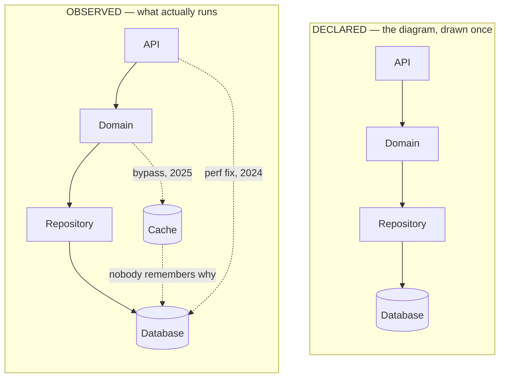
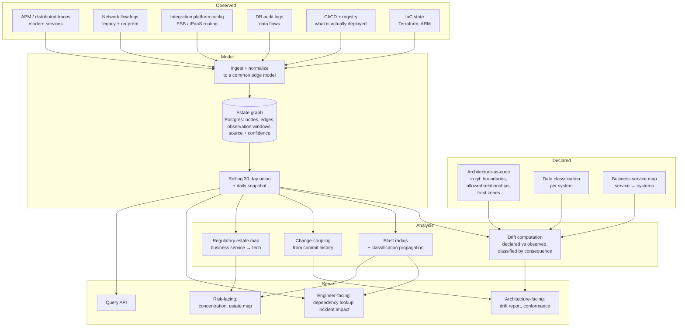
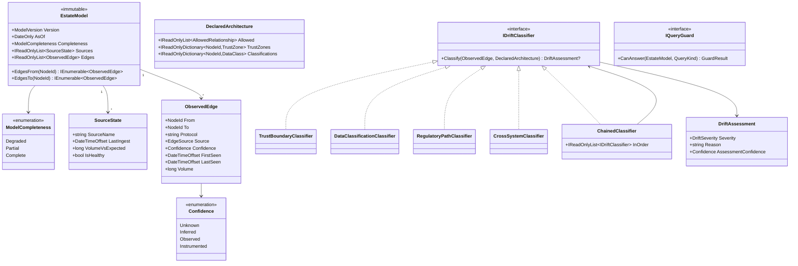

# Module 187 — Software Architecture as a Role: Decision Rights, Golden Paths & Stakeholder Translation

> Domain: Engineering Leadership (merged 51-55) | Level: Beginner → Expert | Prerequisite: [[04-PrincipalEngineering-OrgWideStrategy-GovernanceAtScale-BuildVsBuy-RiskOwnership]] (the decision-system components, which the architect role operates within or owns), [[03-StaffPlusEngineering-Archetypes-ScopeSelection-GlueWork-TechnicalStrategy]] (the Architect *archetype* — this module is about the formal *role*, which overlaps but is not identical), [[../30-Architecture-Patterns/02-EvolutionaryArchitecture-FitnessFunctions-ADRs-Governance]] (the fitness functions and ADRs — the instruments this role uses)

>
> **Scope note:** Fourth of the Engineering Leadership depth pass (Modules 170–175). Modules 30–38 covered architecture *patterns* in full depth. This module covers the **role**: the person with a formal architecture title, which in financial services is a genuinely distinct career track with its own hierarchy (Solution Architect → Domain Architect → Enterprise Architect / Chief Architect) rather than a rung on the engineering ladder.
>
> **Why this matters more in fintech than in product companies:** most large technology firms do not have architects — they have Staff+ engineers who do architecture. Nearly every bank, insurer, and large payments firm *does*, with a formal Enterprise Architecture function, an Architecture Review Board, reference architectures, capability models, and often a TOGAF-derived process. If you are interviewing at JPMorgan, HSBC, Barclays, Fiserv, or FIS, you will encounter this function, and you will very likely be asked how you work with it — or how you would fix it, because it is dysfunctional more often than not. That specific dysfunction, its causes, and its remedy are the substance of this module.

---

## 1. Fundamentals

**What:** A software architect is accountable for a system, domain, or estate's **technical coherence** — that the parts fit together, that decisions made independently compose correctly, and that the whole remains changeable over time.

The distinguishing property against every other role in this domain: **an architect's product is constraints.** A Staff engineer produces solutions; a Principal produces direction and the systems that generate decisions; an architect produces the *shape* within which others build — interfaces, boundaries, standards, reference designs — and is judged on whether what gets built inside that shape actually works together.

**Why the role exists (and why it exists more in banks):** three reasons, and the third explains the fintech concentration:

1. **Coherence is nobody's job by default.** Each team optimizes locally and correctly; the composed system is nobody's optimization target. This is the same structural gap identified for seams, framed as a design property rather than a failure property.
2. **Systems outlive teams.** A core banking platform in service for 25 years will be owned by a dozen successive teams. Someone must hold the intent across that span, or each generation re-derives it wrongly.
3. **Regulated firms must be able to *describe* their estate.** This is the fintech-specific driver and it is genuinely non-optional. Operational-resilience regimes require firms to identify important business services and map the technology supporting them; a bank that cannot produce an accurate map of which systems support its payment service has a regulatory problem, not a documentation problem. Enterprise Architecture functions in banks exist substantially to satisfy this obligation, and understanding that explains a great deal about why they behave as they do.

**The three levels, as they are actually used in financial services:**

| Level | Scope | Typical output | Time horizon |
|---|---|---|---|
| **Solution Architect** | One system or programme | Solution design, integration approach, non-functional requirements, the design that goes to the review board | Weeks to months |
| **Domain Architect** | A business domain (payments, wealth, risk) across many systems | Domain reference architecture, target state, decisions constraining solutions in that domain | 1–3 years |
| **Enterprise Architect / Chief Architect** | The whole estate | Capability model, technology strategy, cross-domain standards, estate rationalization | 3–10 years |

**When the role is genuinely needed versus when it is an artifact:** an architecture function is warranted when there are more independently-built systems than any one person can hold, when systems must interoperate across organizational boundaries, and when the estate must be describable to an external party. It is an artifact — a title without a job — when it has been created to give senior engineers a promotion path without a real remit, or when it exists to produce documents for a governance process that itself produces nothing. **Both situations are extremely common in banks, frequently side by side**, and being able to tell them apart is a genuinely useful interview skill.

**How (30,000-ft view) — the architect's actual loop:**

```
   1. UNDERSTAND WHAT ACTUALLY EXISTS
      Not the diagram -- the running estate: what calls what, what
      data flows where, what is actually load-bearing. Most
      architecture functions skip this and describe the estate they
      believe in rather than the one that exists.
                            │
                            ▼
   2. DECIDE WHAT MUST BE COMMON, AND WHAT MUST NOT
      The whole job is this boundary. Constrain interfaces, controls,
      and shared data. Leave implementation alone. Over-constraining
      is the failure that kills the function.
                            │
                            ▼
   3. MAKE THE CONSTRAINT THE PATH OF LEAST RESISTANCE
      Reference implementation, template, library, scaffold. A
      constraint that costs teams effort to honour will be honoured
      on paper only. This step separates an architect who changes
      outcomes from one who writes documents.
                            │
                            ▼
   4. VERIFY CONTINUOUSLY THAT IT HELD
      Fitness functions, conformance checks, drift detection. An
      architecture diagram is a CLAIM; something must keep the claim
      true, or it becomes fiction on a schedule.
                            │
                            ▼
   5. TRANSLATE, IN BOTH DIRECTIONS
      Business intent  ->  technical constraint.
      Technical risk   ->  business consequence.
      This is half the job in a bank, and is why the role often sits
      organizationally between engineering and the business.
```

Steps 1, 3, and 4 are where most enterprise architecture functions fail. They produce step 2 in abundance — target-state diagrams, principles, standards documents — without ever establishing what exists, without making the target cheap to reach, and without checking whether anything moved. **That specific failure pattern is the single most interviewable thing in this module.**

---

## 2. Deep Dive

### 2.1 The architect's product is constraints, and constraints have a cost function

Every constraint an architect imposes has a benefit (coherence, composability, evidenceability) and a cost (reduced local optimization, slower delivery, resentment). The role is fundamentally about getting that trade right, repeatedly, and the characteristic failure is systematically over-weighting the benefit — because the benefit accrues to the architect's remit and the cost is paid by teams.

**The test for whether a constraint is worth its cost:** does the variance it prevents impose a cost on someone *other than* the team choosing it?

- **Divergent interfaces** — external cost. Every consumer pays. Constrain.
- **Divergent security controls** — external cost. Creates audit gaps and inconsistent posture. Constrain.
- **Divergent data semantics** (what "client" or "position" means) — external cost, and the most expensive kind because it is discovered late. Constrain.
- **Divergent observability formats** — external cost. Incidents spanning teams become unresolvable. Constrain.
- **Divergent internal implementation, frameworks, code structure** — no external cost. Do not constrain.
- **Divergent local tooling, editors, testing approach** — no external cost. Do not constrain, and constraining it is how the function loses legitimacy on the things that matter.

**The second test, which is about the firm rather than the teams:** can the organization afford the operational surface? Three message brokers means three sets of expertise, patching, on-call knowledge, and vendor relationships. Each individual choice may be locally optimal and the aggregate still unaffordable. This is a legitimate architectural constraint and it is *not* about technical merit — it is about the firm's capacity to operate what it runs, which is a point worth making explicitly because it lands very differently with engineers than "your choice is worse."

**The asymmetry that makes this hard:** an over-constrained estate looks fine in a diagram and fails slowly — teams work around, shadow IT appears, delivery slows, and nobody attributes it to the architecture function. An under-constrained estate fails visibly and is attributed immediately. So the incentive gradient pushes architects toward over-constraint, and resisting that gradient is a discipline rather than an instinct.

### 2.2 Architect as facilitator, not adjudicator

The most consequential behavioral distinction in the role.

**The adjudicating architect** receives designs, evaluates them, and approves or rejects. This is the default model in most bank architecture review boards and it fails for reasons that are structural rather than personal:

- The architect has less context than the team, always. They are seeing a two-hour summary of a three-month problem.
- Approval is point-in-time; what gets built diverges from what was approved, and nothing checks.
- Teams optimize for *getting through the board* rather than for the outcome — producing designs that satisfy the review's known checklist rather than the actual problem.
- It creates a queue, and the queue's length becomes the architecture function's most visible property.

**The facilitating architect** structures the decision rather than making it: they ensure the real options are on the table, that trade-offs are compared honestly (the non-laundered matrices), that the affected parties are heard, and that the decision closes with an owner. They contribute their own view *as a view*, weighted by their cross-system context, not as a verdict.

**The critical nuance, which distinguishes a strong answer from a naive one:** facilitation is not abdication, and there is an irreducible set of decisions the architect must actually make. Where the decision affects parties not in the room — another domain, a future consumer, the firm's audit position — the architect is the only participant representing them, and representing absent parties is a decision-making act, not a facilitation one. **The rule: facilitate where all affected parties are present; decide where they are not.** Being explicit about which mode you are in, in the room, is what keeps the facilitating mode credible.

### 2.3 Making the right thing the default — the only mechanism that survives

Earlier analysis established golden paths; made them the primary governance instrument. For the architect role specifically, this is the difference between a function that changes what gets built and one that documents what got built.

**The mechanism, stated as an economic claim:** a constraint is honored to the degree that honoring it is cheaper than not. Everything else — mandates, review gates, principles documents — is an attempt to override that economics with authority, and it works only while the authority is being actively applied.

| Instrument | Cost to team of complying | Durability |
|---|---|---|
| Principles document | High (must interpret and implement) | Near zero — decays immediately |
| Standards document | High | Low — decays at attrition rate |
| Review board approval | High (queue + rework) | Low — point-in-time, no drift detection |
| Reference implementation | Medium (copy and adapt) | Medium — diverges over time |
| **Template / scaffold** | **Near zero (it is the starting point)** | **High — new work is compliant by construction** |
| **Shared library** | **Near zero (4 lines vs 200)** | **High — with the correlated-failure caveat** |
| **Fitness function in CI** | Zero to comply, high to violate | **Highest — continuously enforced** |

**The practical consequence for an architect's own time allocation:** an hour spent making the reference implementation genuinely excellent is worth more than ten hours of review board. This is uncomfortable for architects whose organizations measure them on designs reviewed, and it is the single most useful change most architecture functions could make.

**The specific fintech obstacle:** in many banks the architecture function is organizationally separate from the platform/engineering-productivity function that owns templates and CI. So the architect has the authority to set standards and no ability to build the thing that makes them cheap. **Naming this and fixing it — either by merging the functions or by the architect embedding with the platform team — is one of the highest-leverage organizational changes available**, and it is a strong thing to raise in an interview because it demonstrates you understand why the function underperforms rather than just that it does.

### 2.4 Architecture as a claim requiring continuous verification

This is the course's most-repeated finding, stated for this role in its sharpest form.

**An architecture diagram is a claim about the system. It is not the system.** The moment it is drawn it begins diverging from reality, and nothing in the ordinary course of work reconciles them. After two years the divergence is total and — this is the dangerous part — **nobody knows it, because the diagram is still being used for decisions.**

**The four kinds of drift, which need different detection:**

1. **Structural drift** — services call each other in ways the diagram does not show. Detectable from runtime traces versus declared architecture. Almost universal.
2. **Boundary drift** — a layering or dependency rule is violated (the domain layer now imports the persistence layer). Detectable statically from the code. This is what architecture fitness functions catch.
3. **Semantic drift** — the same field name means different things in different systems. Not detectable mechanically; requires data-lineage work and domain review. The most expensive to discover and the most damaging.
4. **Intent drift** — the architecture is still accurate but the reason for it has expired. A boundary drawn to isolate a vendor that was replaced three years ago is now pure cost. Detectable only by periodic review of decisions against their original rationale, which nobody does.

**The response, in order of leverage:**

- **Derive the architecture from reality rather than drawing it.** A system-context or container diagram generated from runtime traces and dependency manifests is *always* current, and the effort is one-time. A hand-drawn one is current for about a week. Where derivation is possible, drawing is a choice to be wrong.
- **Encode the rules that matter as fitness functions.** "The domain project must not reference the infrastructure project" is a one-line test that runs on every build. A principle in a document that says the same thing is checked never.
- **Diff the declared against the observed, continuously**, and treat the delta as a finding requiring either a correction to the system or an update to the declaration. Both are valid outcomes; silence is not.
- **Timestamp and expire intent.** Every significant boundary should carry the reason it exists and a review date, because intent drift is invisible without it.

### 2.5 Stakeholder translation, both directions

In a bank this is up to half the role, and it is genuinely difficult in both directions.

**Business intent → technical constraint.** A business stakeholder says "we need to launch in Germany next year." The architectural implications — data residency, which may forbid the current shared database; local reporting obligations, which need lineage; latency to European venues; German-language and localization boundaries; possibly a separate legal entity with segregated data — are not in the sentence and the stakeholder does not know they are implied. **Surfacing implications the stakeholder does not know they have asked for is the core skill**, and doing it without appearing obstructive is the craft. The move that works: convert each implication into an explicit choice with a cost, so the conversation is about trade-offs they can make rather than obstacles you are raising.

**Technical risk → business consequence.** The reverse direction, and the discipline is the one established: state the scenario, not the condition. "We have tight coupling between the ledger and reporting" is a condition and it will be deferred forever. "Any change to the ledger schema currently requires a coordinated release with reporting; the last one took eleven weeks and blocked two product launches; the next regulatory change to the ledger arrives in March" is a consequence with a date, and it gets a decision.

**The specific failure mode to avoid:** inflating technical preference into business risk. It is detectable, business stakeholders compare notes and calibrate over time, and one detected instance discounts everything afterwards. Where something is genuinely an investment in optionality rather than a risk, say so — that is a legitimate argument that does not need dressing up, and making it honestly builds the credibility that makes the genuine risk warnings land.

**The artifact that works in this environment:** a one-page decision paper with the recommendation, two or three reasons, the cost, and the risk of not acting. Banks run on papers; an architect who cannot write one that a non-technical committee can act on is limited to influencing engineers, which is half the job at best.

### 2.6 Why enterprise architecture functions fail, specifically

This is worth naming precisely because it is so common and because interviewers at banks are frequently sitting inside one of these failure modes.

**Failure 1 — Describing the estate they wish existed.** Target-state architectures produced without an accurate current-state baseline. The target is unreachable because the path from an unknown starting point cannot be planned, and the artifacts are consequently ignored by everyone who knows the real estate. **The fix is unglamorous and decisive: establish current state first, from telemetry and code rather than from surveys.** Surveys return what teams believe, which is itself out of date.

**Failure 2 — Authority without capability.** The function can set standards but cannot build templates, libraries, or CI checks. It therefore has only mandates as instruments, which produce nominal compliance. **The fix is organizational**, and it is usually available: put the architect in the platform team, or give the architecture function delivery capacity.

**Failure 3 — Point-in-time review as the only control.** The architecture review board approves designs and never checks what was built. the incident is the canonical demonstration. **The fix is to move enforcement from the gate into the pipeline**, which also shortens delivery rather than lengthening it — the rare change that improves both governance and velocity, and therefore the one to lead with.

**Failure 4 — Constraining implementation rather than contracts.** The function specifies frameworks, project structures, and coding approaches — things with no external cost — and thereby spends all its legitimacy on decisions that did not need making, leaving none for the interface and control decisions that did. **The fix is the externality test, applied ruthlessly**, including retiring existing standards that fail it.

**Failure 5 — Architects who have never operated the estate.** A function staffed by people who have not been on-call, run a migration, or written production code in this decade produces designs that are correct in principle and unimplementable in practice, and practitioners can tell within one meeting. **The fix is depth maintenance** and, more practically, co-authorship: no reference architecture ships without a practitioner from an affected team as a named co-author.

**The meta-observation worth making in an interview:** all five failures share a shape — the function produces *artifacts* rather than *changes in what gets built*, and measures itself on artifact production. An architecture function whose KPIs are "designs reviewed" and "standards published" will optimize for those and will be, correctly, ignored. The measures that matter are conformance distribution, drift rate, and the proportion of new systems that started from a compliant template.

---

## 3. Visual Architecture

### 3.1 Where the architect role sits relative to the engineering ladder

Three parallel tracks at roughly equivalent scope. The architecture track is common in banks and rare in product companies:

| Engineering (IC) ladder | Architecture track | Management |
|---|---|---|
| Distinguished Engineer | Chief Architect | VP Engineering |
| Principal Engineer | Enterprise Architect | Director |
| Senior Staff Engineer | Domain Architect | Senior EM |
| Staff Engineer | Solution Architect | Engineering Manager |
| Senior Engineer | *(entry into either track)* | *(entry into management)* |

And the differences that actually matter day to day:

| | Staff+ / Principal | Architect |
|---|---|---|
| **Primary output** | Solutions and direction | **Constraints** — the shape others build within |
| **Builds?** | Yes — prototypes, reference implementations | Often not, which is the role's principal structural weakness |
| **Accountable for** | Outcomes of the problems they selected | Coherence of the whole |
| **Reports into** | Engineering | Frequently a *separate* EA function — the cause of §2.6's Failure 2 |

### 3.2 The drift problem, drawn



| Declared | Observed |
|---|---|
| Clean layering | API reads the database directly — a performance fix from 2024 |
| Reviewed and approved | Domain writes the cache, bypassing the repository — 2025 |
| Still on the wiki | Cache writes back to the database — nobody remembers why |
| **Still used for decisions** | **Nobody knows.** The stale diagram is the basis of the migration plan |

> **An architecture diagram is a claim, not the system.** Divergence begins the moment it is drawn, and nothing in the ordinary course of work reconciles the two. The danger is not that it becomes wrong — it is that it is wrong *and still trusted*.

### 3.3 The instrument ladder — cost to comply versus durability

| Instrument | Cost to the team of complying | Durability |
|---|---|---|
| Fitness function in CI | **Zero** (violating it costs) | **Highest** — continuously enforced |
| Template / scaffold | **Zero** — it is the starting point | **High** — new work compliant by construction |
| Shared library | **Near zero** — 4 lines instead of 200 | **High** |
| Reference implementation | Medium — copy and adapt | Medium — diverges over time |
| Review board approval | High — queue plus rework | Low — point-in-time, no drift detection |
| Standards document | High — must interpret and implement | Low — decays at the attrition rate |
| Principles document | High — untestable, so unactionable | **Near zero** — decays immediately |

**The inverse relationship is the insight:** durability is inversely related to compliance cost. Instruments that are expensive to honour are honoured on paper; instruments that are free to honour — because they *are* the default starting point — are honoured in fact.

Most architecture functions spend most of their effort at the bottom of this table and then wonder why nothing changes. An hour spent making the reference implementation genuinely excellent is worth more than ten hours of review board.

---

## 4. Production Example — Turning Around an Ignored EA Function

### Scenario

**Firm:** A UK retail and commercial bank. ~1,400 engineers, ~340 applications, a mix of on-premises core systems (some 20+ years old), a substantial Azure estate, and three years into a "digital transformation."

**Your role:** newly-hired Domain Architect for Payments, reporting into an Enterprise Architecture function of 14 architects.

**The situation you inherit:** the EA function is comprehensively ignored, and everyone knows it. Symptoms:

- A target-state architecture published 18 months earlier. Nobody could name a single decision it had changed.
- An Architecture Review Board meeting fortnightly with a 7-week submission queue. Teams routinely started building before their slot and submitted the design retrospectively.
- 47 published architecture principles. In interviews, no engineer could recall more than two, and both of the recalled ones were "prefer buy over build" and "cloud first" — the two most generic.
- A CMDB (configuration management database) describing the application estate, last comprehensively updated during a 2022 audit remediation.
- Engineering leadership referred to the function, in a meeting you attended in week two, as "the paperwork."

**The trigger for change:** a regulatory thematic review on operational resilience required the bank to map its important business services to the technology supporting them. The EA function was asked to produce the map for payments and discovered it could not — the CMDB was wrong in ways that were immediately obvious once anyone checked.

### The diagnosis (weeks 1–6)

Deliberately produced no architecture in this period. The finding was that the function exhibited four of the five failure modes, and the causes were structural rather than personal — the architects were competent and were operating a broken model.

**Establishing the actual current state, which nobody had:**

Rather than another survey, derived it from systems that could not lie:
- **Runtime dependency graph** from the Azure estate's Application Insights and the on-prem estate's network flow logs. Two weeks of work.
- **Data flows** from database audit logs and integration-platform routing configuration.
- **Actual deployment inventory** from the CI/CD systems and the container registry, rather than from the CMDB.

**What it found, and these numbers are the reason anything changed:**

| Finding | Detail |
|---|---|
| Applications in CMDB not running anywhere | **61 of 340** (18%) |
| Running applications absent from the CMDB | **44** |
| Payment-path dependencies absent from the documented architecture | **23** |
| Documented dependencies that do not exist in runtime | 17 |
| Payment-path services with an undocumented dependency on a single legacy authorization component | **9** — a concentration risk nobody had named |
| Accuracy of the published target-state's current-state baseline | Unmeasurable — no baseline had been captured when it was written |

**The last row was the whole diagnosis.** The target-state architecture had been drawn without an accurate current state. It was therefore not a plan; it was a picture. That is why it had changed no decisions, and no amount of better communication would have changed that.

### The intervention

**Move 1 (weeks 6–12) — make the derived current state the function's primary product.**

The dependency graph became a continuously-updated, queryable model rather than a one-off analysis: nightly refresh from telemetry, published as a browsable map with an API. Deliberately positioned as a *service to engineering teams*, not as a governance artifact — teams could look up "what depends on my service" and "what do I depend on," which they had genuinely never had.

**This was the decisive move and it worked for a reason worth naming: it made the architecture function immediately useful to engineers before asking anything of them.** Within six weeks the map was being used in incident response, and two teams asked to have it integrated into their runbooks. The function's reputation changed before a single standard was issued.

It also, incidentally, answered the regulatory question — the payment-service technology map was derivable from it rather than being a manual exercise, which is what secured the funding to continue.

**Move 2 (weeks 10–20) — retire 43 of the 47 principles.**

Applied the externality test to every principle. Four survived, restated as testable constraints rather than aspirations:

1. Services expose versioned contracts; breaking changes require a deprecation period (external cost: every consumer).
2. Services emit structured logs with a propagated correlation ID (external cost: cross-team incidents are unresolvable without it).
3. Customer data has one authoritative system per entity; others hold derived copies explicitly marked as such (external cost: this was the direct cause of three of the last year's data-quality incidents).
4. Services in the payment path authenticate with workload identity, not shared credentials (external cost: audit and blast radius).

The other 43 constrained implementation and were retired publicly, with the reasoning published. **Retiring them bought more credibility than any of them had ever generated** — it was read, correctly, as evidence the function had started distinguishing what matters.

**Move 3 (weeks 14–30) — move enforcement from the board into the pipeline.**

Each of the four surviving constraints became a mechanical check in the shared CI pipeline, each linked to the ADR explaining it and the incident that motivated it. Simultaneously, the Architecture Review Board's remit was narrowed to an **enumerated** list: new customer-facing data flows, changes to systems in the regulatory-reporting path, new third-party integrations, and anything introducing a technology not already operated. Everything else no longer required review at all.

The submission queue went from 7 weeks to under 1 week, because most submissions no longer existed. **The board's throughput improved by reducing its scope, not by increasing its capacity** — and that framing is what got the change approved, because it was presented as a delivery-speed improvement rather than as a governance reduction.

**Move 4 (weeks 20–40) — build the thing that makes compliance free.**

This required an organizational change: two of the 14 architects were seconded into the platform team, which owned the service templates. The four constraints were built into the.NET service template, so a new service starts compliant with all four and nobody has to know they exist.

This was the intervention Failure 2 predicts is necessary and it was the hardest to get agreed, because it moved headcount out of the EA function. The argument that carried it: **the function's output should be measured in conformant services, not in published standards, and it currently had no mechanism to produce the former.**

**Move 5 (ongoing) — continuous drift detection.**

The nightly derived graph was diffed against the declared architecture. Deltas became a weekly report with three dispositions, each requiring an explicit decision: *the system is wrong and should be corrected*; *the declaration is wrong and should be updated*; or *the delta is an accepted exception with an owner and an expiry*. Silence stopped being an option.

The first month's report contained 89 deltas. Nine months later the steady state was 4–11 per week, of which most were the declaration lagging genuine, intentional change — which is the healthy state.

### Results, at 12 months

| Measure | Before | After |
|---|---|---|
| ARB submission queue | 7 weeks | <1 week |
| Designs requiring ARB review | ~140/yr | ~35/yr |
| Published principles | 47 | 4 |
| New services compliant with all four constraints | Not measured | 94% (template-derived) |
| CMDB/reality divergence | 18% ghost + 44 missing | <2%, continuously reconciled |
| Undocumented payment-path dependencies | 23 | 0 (continuously detected) |
| Engineering leadership's description of the function | "the paperwork" | Map integrated into 6 teams' runbooks |

### Trade-offs

| Dimension | What was accepted |
|---|---|
| **Reduced formal control surface** | 43 principles retired and ARB scope cut by 75%. Genuine loss of nominal control, accepted because nominal control was producing nothing. The risk function required evidence that the four surviving constraints were *actually* enforced — which the pipeline checks provided far better than review ever had, and this turned out to strengthen the audit position rather than weaken it. |
| **Two architects moved out of EA** | Reduced the function's headcount and was resisted. Correct: the function's constraint was not analytical capacity, it was the inability to make compliance cheap. |
| **Derived current state has blind spots** | Telemetry misses batch dependencies exercised monthly and manual processes entirely. Mitigated with a 30-day rolling union and a documented list of known-unobservable dependencies — a real limitation, stated rather than papered over. |
| **The four constraints are narrow** | Deliberately. There are things the estate would benefit from standardizing that were left alone, because spending legitimacy on them would have jeopardized the four that matter. |

### Lessons learned

1. **The function's problem was never communication.** Every diagnosis it had received internally was "we need to socialize the architecture better." The actual problem was that its artifacts were built on an unmeasured baseline, so they were unusable regardless of how well they were communicated.
2. **Being useful before being authoritative** was the entire turnaround. The dependency map served engineers' own needs first; everything after was possible because of the credibility that generated.
3. **Retiring 43 principles generated more goodwill than publishing any of them had.** Subtraction is available to architecture functions and is almost never used.
4. **The board improved by shrinking.** Framed as a delivery-speed improvement, which is the framing that made a governance reduction acceptable to a risk-conscious organization.
5. **Compliance had to become free, and that required moving people.** No amount of standard-setting substitutes for owning the template. The organizational separation between architecture and platform was the root cause of the function's impotence, and it was fixable.
## 10. Interview Questions

### Basic (10)

**B1. Q: What does a software architect do that a senior engineer does not?**
*Ideal Answer:* An architect is accountable for coherence — that independently-made decisions compose correctly across systems — and their primary product is *constraints*: interfaces, boundaries, standards, and reference designs that shape what others build. A senior engineer produces solutions within a system; the architect defines the shape those solutions must fit and is judged on whether the whole works together.
*Why correct:* Identifies constraints-as-product and coherence-as-accountability rather than describing seniority.
*Common mistakes:* "Designs the system" — that is what engineers do too; the distinction is scope and the nature of the output.
*Follow-up:* Why is that a separate role in banks but usually not in product companies? (Regulated firms must be able to describe their estate to supervisors, which creates a formal function; and long-lived core systems outlast the teams that built them.)

**B2. Q: Name the three common architect levels in a large financial institution.**
*Ideal Answer:* Solution Architect (one system or programme, weeks-to-months horizon, produces solution designs and integration approaches); Domain Architect (a business domain across many systems, 1–3 years, produces domain reference architecture and target state); Enterprise/Chief Architect (the whole estate, 3–10 years, produces capability models, cross-domain standards, and rationalization strategy).
*Why correct:* Accurate on scope, output, and horizon for each.
*Common mistakes:* Treating them as seniority bands rather than different scopes with different outputs.
*Follow-up:* Which one is most likely to be a title without a real job? (Enterprise Architect, when the function has been created to produce documents for a governance process rather than to change what gets built.)

**B3. Q: Why is an architecture diagram unreliable?**
*Ideal Answer:* Because it is a *claim* about the system, not the system, and it begins diverging the moment it is drawn — nothing in normal work reconciles them. After a couple of years divergence is typically total, and the real danger is not that it is wrong but that it is wrong *and still trusted*, with decisions being made on it confidently.
*Why correct:* Frames it as claim-versus-reality and names the trusted-but-wrong danger.
*Common mistakes:* "It gets out of date" — true but misses that its continued use for decisions is what makes it harmful rather than merely stale.
*Follow-up:* What is the fix? (Derive it from runtime telemetry and code rather than drawing it — a derived diagram is always current.)

**B4. Q: What is the test for whether something should be standardized?**
*Ideal Answer:* Whether the variance imposes a cost on someone other than the team choosing it. Divergent interfaces, security controls, data semantics, and observability formats impose external cost — constrain them. Divergent internal implementation, frameworks, and local tooling do not — leave them alone. There is a second test about operability: the firm may not be able to afford the expertise for three brokers even if each choice is locally fine.
*Why correct:* Gives the externality test plus the operability test.
*Common mistakes:* Standardizing for consistency as an end in itself, which is the most common over-reach.
*Follow-up:* What happens if you constrain implementation? (You spend your legitimacy on decisions with no external cost and have none left for the interfaces and controls that matter.)

**B5. Q: What is a fitness function in an architecture context?**
*Ideal Answer:* An automated, continuously-run check that a specific architectural property holds — for example, that the domain project does not reference the infrastructure project, that no service exposes an unauthenticated endpoint, or that layer dependencies flow one way. It converts an architectural rule from a principle checked never into a test checked on every build.
*Why correct:* Defines it by the continuous-verification property, which is the point.
*Common mistakes:* Describing it as a metric rather than a test.
*Follow-up:* Why is that better than a review? (Review is point-in-time and verifies intent; a fitness function runs forever and verifies reality.)

**B6. Q: What is the difference between an architect facilitating and adjudicating?**
*Ideal Answer:* Adjudicating means receiving designs and approving or rejecting them; facilitating means structuring the decision — ensuring real options are on the table, trade-offs are compared honestly, affected parties are heard, and the decision closes with an owner — contributing your own view as a view rather than a verdict. Facilitating generally produces better decisions because the team always has more context than the reviewer.
*Why correct:* Distinguishes the two modes and gives the context-asymmetry reason.
*Common mistakes:* Presenting facilitation as always correct.
*Follow-up:* When must the architect actually decide? (When the decision affects parties not in the room — another domain, future consumers, the firm's audit position — because the architect is the only one representing them.)

**B7. Q: What is architectural drift?**
*Ideal Answer:* The divergence between the declared architecture and what actually runs. Four kinds: structural (undocumented calls between services), boundary (layering or dependency rules violated), semantic (the same term meaning different things in different systems), and intent (the architecture is accurate but the reason for it has expired). They need different detection — the first two are mechanical, semantic needs lineage work, and intent drift is invisible without dated rationale.
*Why correct:* All four kinds with their differing detectability.
*Common mistakes:* Only naming structural drift.
*Follow-up:* Which is most damaging? (Semantic — it is discovered late, usually in a reconciliation or a regulatory report, and correcting it means changing meaning in many places at once.)

**B8. Q: Why do architecture principles documents usually fail?**
*Ideal Answer:* Because they are unobjectionable and untestable. "Prefer loose coupling" cannot be complied with or violated in a way anyone can check, so engineers cannot tell whether they have complied and do not try. Volume compounds it — nobody recalls 47 principles. The fix is to keep only what passes the externality test, restate them as testable constraints, and enforce them mechanically.
*Why correct:* Names untestability as the mechanism and volume as the aggravator.
*Common mistakes:* "They need better communication" — which is the diagnosis these functions usually reach and it is wrong.
*Follow-up:* How many principles should a firm have? (Few enough that an engineer can recall them all — in practice under about six.)

**B9. Q: What is stakeholder translation and why does it matter for this role?**
*Ideal Answer:* Converting business intent into technical constraints and technical risk into business consequence. "We're launching in Germany" implies data residency, local reporting, latency, and possibly entity segregation — none of which is in the sentence and the stakeholder does not know they asked for them. In the other direction, "the ledger is tightly coupled to reporting" must become "the last coordinated release took eleven weeks and blocked two launches; the next regulatory change lands in March."
*Why correct:* Both directions with concrete examples, and the scenario-not-condition discipline.
*Common mistakes:* Describing only the technical-to-business direction.
*Follow-up:* What is the failure mode to avoid? (Inflating a technical preference into a business risk — detectable, and it discounts everything you say afterwards.)

**B10. Q: Why does making the compliant path cheap matter more than mandating it?**
*Ideal Answer:* Because a constraint is honored to the degree that honoring it is cheaper than not. Mandates try to override that economics with authority and work only while the authority is actively applied. A template or library that makes compliance the starting point costs nothing to honor, so it holds without enforcement — durability is inversely related to compliance cost.
*Why correct:* States the economic mechanism and the inverse relationship.
*Common mistakes:* Framing it as a culture or buy-in question.
*Follow-up:* What blocks architects from doing this in banks? (The architecture function is often organizationally separate from the platform team that owns templates, so it can set standards but cannot make them cheap.)

---

### Intermediate (10)

**I1. Q: You join an enterprise architecture function that everyone ignores. Diagnose and fix.**
*Ideal Answer:* Check for the standard failure modes before proposing anything: is there an accurate current-state baseline (usually not, and this is usually the root cause — a target drawn from an unmeasured baseline is a picture, not a plan); does the function have any instrument other than mandates; is enforcement point-in-time only; is it constraining implementation rather than contracts; do the architects have current practical depth. The fix sequence that works: derive the current state from telemetry and publish it as a *service to engineering* so the function becomes useful before it becomes authoritative; retire everything failing the externality test; move enforcement from the review gate into the pipeline, which shortens delivery rather than lengthening it; and get the ability to build templates, by organizational change if necessary.
*Why correct:* Diagnoses against known structural causes, and the fix sequence leads with being useful rather than with asserting authority.
*Common mistakes:* Concluding it needs better communication — which is the diagnosis these functions usually reach and it addresses the wrong thing entirely.
*Follow-up:* Why derive the current state first? (Because every other artifact depends on it, and because it is the one thing engineers immediately want — it buys the credibility for everything after.)

**I2. Q: How would you build an accurate map of what a 300-application estate actually looks like?**
*Ideal Answer:* From sources that cannot lie: runtime dependency data from APM and distributed traces for modern services, network flow logs for legacy, integration-platform routing configuration, database audit logs for data flows, and CI/CD plus registry data for what is actually deployed. Explicitly *not* a survey — surveys return what teams believe, which is out of date and biased toward what they remember. Refresh continuously and use a rolling window of at least 30 days, because dependencies exercised monthly by batch processes are invisible in a single day's data and are exactly the ones that surprise people.
*Why correct:* Names concrete sources, rejects surveys with a reason, and handles the batch-dependency blind spot.
*Common mistakes:* Proposing a CMDB update exercise, which produces a snapshot that is stale immediately.
*Follow-up:* What will this still miss? (Manual processes, file drops, anything not observable in telemetry — document the known-unobservable set explicitly rather than implying completeness.)

**I3. Q: How do you decide what belongs in an architecture review versus what does not?**
*Ideal Answer:* Enumerate rather than use criteria, because criteria drift and are interpreted expansively by a board with capacity. The enumeration should cover what genuinely needs a cross-system view the team lacks: new customer-facing data flows, changes to systems in the regulatory-reporting path, new third-party integrations, and anything introducing a technology the firm does not already operate. Everything else should be checked mechanically or not at all. Narrowing the board is usually the way to improve it — throughput improves by reducing scope, not by adding capacity.
*Why correct:* Uses enumeration with a reason, gives a concrete list, and identifies the counter-intuitive improvement path.
*Common mistakes:* Criteria-based scoping, which grows; or trying to speed the board up rather than shrink it.
*Follow-up:* How do you sell narrowing to a risk-conscious organization? (As a delivery-speed improvement with *stronger* actual control, because the pipeline checks verify reality continuously where review verified intent once.)

**I4. Q: An engineering team wants to use a technology not on the approved list. How do you handle it?**
*Ideal Answer:* Ask what they are solving and whether an approved option genuinely fails — frequently it does not and they have not looked, and equally frequently it genuinely does and the list is stale. If the case is real, the question is operational, not technical: who will operate this in production, who patches it, who is on-call for it, and can we hire for it? Grant an exception with a named owner accepting operational responsibility and an expiry, then reassess. And treat repeat requests as data — if three teams independently want the same thing, that is an argument to add it to the list, not to keep declining.
*Why correct:* Frames the real cost as operational, uses the exception mechanism, and treats demand as signal about the list.
*Common mistakes:* Declining on the grounds it is not on the list, which teaches teams to route around architecture entirely.
*Follow-up:* What if they have already started using it? (Address it, but recognize that a team building with an unapproved technology usually indicates the approval path is too slow — fixing that is the durable remedy.)

**I5. Q: How do you keep architecture documentation accurate?**
*Ideal Answer:* Mostly by not writing it. Derive what can be derived — system context, container/service diagrams, dependency and data-flow maps — from telemetry and code, so it is current by construction. Hand-write only what cannot be derived: intent, rationale, and rejected alternatives, which are the genuinely valuable parts and which do not go stale in the same way because they describe a decision at a point in time. For anything that must be drawn, timestamp it with a last-verified date and treat an expired date as a defect.
*Why correct:* Splits derivable from non-derivable and correctly identifies rationale as the durable hand-written content.
*Common mistakes:* Proposing a documentation review cadence, which relies on effort that will lapse.
*Follow-up:* Why does rationale not go stale the same way? (It describes a decision made at a time with a context — that remains true even when the decision is later reversed; what expires is its *applicability*, which is why decisions need dated review conditions.)

**I6. Q: A business stakeholder says "we need to be in the Middle East by next year." What is your response as an architect?**
*Ideal Answer:* Surface the implications they have not stated, as choices with costs rather than as objections. Likely: data-residency requirements that may forbid the current shared datastore; local regulatory reporting needing lineage the estate may not have; Sharia-compliant product variants with real domain-model implications for some markets; latency and local infrastructure; possibly a separate legal entity requiring data segregation rather than just localization; and Arabic language and right-to-left presentation. Then convert each into an explicit decision — full localization versus a regional instance versus a partner arrangement — with cost and timeline for each, so the conversation is about a trade-off they can make.
*Why correct:* Surfaces non-obvious implications specific to the region and converts them into decisions rather than obstacles.
*Common mistakes:* Answering the technical question only; or listing blockers, which positions architecture as the department of no.
*Follow-up:* Which implication is most often missed? (Data segregation for a separate legal entity — it is an organizational and legal fact with a large architectural consequence, and it usually surfaces after commitments have been made.)

**I7. Q: How do you handle a legacy system nobody wants to touch but everything depends on?**
*Ideal Answer:* First establish the actual dependency picture, since the belief that "everything depends on it" is frequently wrong in both directions — some assumed dependencies are dead and some real ones are undocumented. Then reduce optionality risk before attempting replacement: put an anti-corruption layer in front of it, so consumers depend on an interface you control rather than on the legacy system's shape; this converts a monolithic replacement into an incremental one and buys time. Address the knowledge-concentration risk in parallel, which is usually more urgent than the technology risk — if two people understand it and one is near retirement, that is the live risk. Only then consider whether replacement is warranted at all; a stable, rarely-changed system behind a good interface is a legitimate steady state.
*Why correct:* Verifies the dependency claim, uses the ACL to create optionality, prioritizes the personnel risk correctly, and allows that not replacing is a valid answer.
*Common mistakes:* Proposing replacement first; treating the technology as the risk when the knowledge concentration usually is.
*Follow-up:* When is leaving it alone right? (When it is stable, rarely changed, not blocking anything, and the interface isolates it — "ugly and untouched" is a legitimate steady state.)

**I8. Q: How do you measure whether an architecture function is effective?**
*Ideal Answer:* Not by artifacts produced. By conformance distribution per constraint over time (the shape, not the mean); drift rate between declared and observed architecture and the disposition mix of those deltas; the proportion of new systems compliant *by construction* from a template rather than by remediation; and review latency and volume, both of which should be falling. Plus the outcome measure: did the incident or integration-failure class each constraint targeted actually decline against a recorded baseline?
*Why correct:* Process and outcome measures, and explicitly rejects artifact counts.
*Common mistakes:* Designs reviewed, standards published — which the function will then optimize for, correctly earning its irrelevance.
*Follow-up:* What does a rising review volume indicate? (Scope expansion, which is the wrong direction — the queue is the function's most visible property to engineering and usually determines its reputation.)

**I9. Q: What is the difference between a reference architecture and a target architecture?**
*Ideal Answer:* A reference architecture is a *pattern* — how a system of this kind should be built here, intended to be instantiated many times, and its value is realized when teams actually start from it. A target architecture is a *destination* — the intended future state of a specific estate or domain, with a migration path from an accurately-measured current state. Reference architectures fail when they are not made cheap to adopt; target architectures fail when there is no accurate baseline, which makes the path unplannable.
*Why correct:* Distinguishes pattern from destination and gives each one's characteristic failure.
*Common mistakes:* Using the terms interchangeably.
*Follow-up:* Which is more useful in a large bank? (Reference architectures, usually — they are instantiated repeatedly and can be made cheap. Target architectures are frequently obsolete before they are reached.)

**I10. Q: How do you write an architecture decision for a non-technical governance committee?**
*Ideal Answer:* One page, inverted pyramid: the recommendation first, two or three reasons, the cost, the risk of not acting, and what would cause us to revisit. State the recommendation's worst property early — the objection is coming anyway and it is better answered on your terms. Quantify uncertainty as a range with what determines which end rather than a point estimate. Keep technical detail in an appendix so the committee can act without it and the engineers can check it.
*Why correct:* The structure, the state-the-weakness move, and explicit uncertainty.
*Common mistakes:* Building to a conclusion; hiding the weakness; a page of technical background before the ask.
*Follow-up:* Why state the weakness early? (Because a committee that discovers it themselves discounts the whole paper, and because it demonstrates you have genuinely evaluated rather than advocated.)

---

### Advanced (10)

**A1. Q: How do you federate architecture across domains without losing coherence?**
*Ideal Answer:* Domain architects own their domain's internal architecture completely; the enterprise function owns only cross-domain contracts — the interfaces, shared data semantics, and controls that cross boundaries. This is the same contract-versus-implementation distinction that applies at every level of this domain. The two failure modes are opposite: an enterprise function that retains opinions about domain internals recreates the bottleneck and is resented; one that abdicates entirely produces domain target states that are mutually incompatible at the boundary, discovered during integration. The mechanism that prevents the second is a small, explicit set of cross-domain standards plus a forum where domain architects review each other's *boundary* decisions — peer review among domain architects, not approval by the centre.
*Why correct:* Names the distinction, both failure modes, and peer review as the coherence mechanism.
*Common mistakes:* Proposing a central approval step, which is the bottleneck; or pure federation, which loses the property federation exists to deliver.
*Follow-up:* Who resolves a genuine conflict between two domain architects? (They jointly author one paper with both positions and take it to the accountable owner — escalating separately makes it a contest between people rather than a decision between options.)

**A2. Q: The declared architecture and the observed architecture differ in 89 places. What do you do?**
*Ideal Answer:* Triage rather than remediate. Every delta gets one of three dispositions and silence is not among them: the *system* is wrong and should be corrected; the *declaration* is wrong and should be updated (frequently the right answer — the system evolved intentionally and nobody updated the diagram); or the delta is an accepted exception with a named owner and an expiry. Prioritize by consequence, not by count: deltas crossing a trust boundary, touching regulated data, or creating a concentration risk first; a service calling a peer it was not documented as calling, with no other implication, is a documentation fix. Then get the rate down and keep it there — a steady state of a handful per week, mostly declaration-lag, is healthy; the goal was never zero.
*Why correct:* Uses the three-disposition triage, prioritizes by consequence, and correctly identifies that the declaration is often the thing that is wrong.
*Common mistakes:* Treating all drift as violation, which produces 89 remediation tickets and no prioritization; or aiming for zero, which is not achievable and burns credibility.
*Follow-up:* What does a persistently high "system is wrong" rate mean? (Constraints are being violated faster than enforced — the enforcement is in the wrong place, usually still at a review gate rather than in the pipeline.)

**A3. Q: How do you distinguish an architecture function that is genuinely needed from one that is an artifact?**
*Ideal Answer:* Ask what would break if it stopped tomorrow. A genuinely-needed function has answers: cross-domain contracts would diverge, the estate map would go stale and the firm could not answer supervisory questions, concentration risks would go unowned. An artifact function's honest answer is that some documents would stop being produced. Concrete checks: can it name three decisions in the last year that went differently because of it; is there an accurate current-state model it maintains; are its constraints enforced anywhere other than a review meeting; and can engineers two levels down name any of its outputs. I would also look at whether the function has ever *retired* a standard — one that only accumulates is not making judgments, it is generating artifacts.
*Why correct:* The counterfactual test plus four verifiable checks, and the retirement signal.
*Common mistakes:* Assessing the quality of the artifacts, which is nearly uncorrelated with whether the function matters.
*Follow-up:* What if it is an artifact but is regulatorily required? (Then the requirement is that the firm can describe its estate — so build the derived current-state capability, which satisfies the obligation genuinely, and drop the artifact production that satisfies nobody.)

**A4. Q: You are asked to produce a target-state architecture for a domain you have been in for three weeks. How do you respond?**
*Ideal Answer:* Say no to the timeline and explain why in terms of what the target would be worth. A target state produced without an accurate current state is a picture, not a plan — the path cannot be planned from an unknown origin, and this is the specific reason most target-state architectures change nothing. Counter-propose: deliver the derived current state first, in four to six weeks, which is genuinely useful on its own (incident response, dependency queries, the regulatory estate map) and which is a prerequisite for anything else. Then the target state, with a migration path that is actually plannable. If the deadline is externally fixed and immovable, deliver the target with an explicit, prominent statement of what was not verified — never let an unbaselined target circulate as though it were grounded.
*Why correct:* Refuses the low-value artifact with a reason, counter-proposes something useful on a real timeline, and handles the immovable-deadline case honestly.
*Common mistakes:* Producing it to meet the ask, which generates exactly the artifact that gets ignored; or refusing without a counter-proposal.
*Follow-up:* Why is an unbaselined target actively harmful rather than merely useless? (Because it gets used for planning and budgeting, and the plans built on it fail in ways attributed to execution rather than to the plan's foundation.)

**A5. Q: How do you handle an architect on your team whose designs are consistently rejected by engineering as impractical?**
*Ideal Answer:* Diagnose before correcting, because there are two very different causes. If their designs are genuinely impractical, the cause is almost always distance from delivery — they have not built or operated in this environment recently, and no amount of feedback fixes that without changing their exposure. The remedy is structural: require practitioner co-authorship on every design, and get them into delivery work, ideally on-call or on a migration, for a period. If instead the designs are sound and engineering is rejecting change generally, that is a different problem and the architect is the wrong target. Distinguish by having a respected practitioner assess two or three of the designs independently.
*Why correct:* Two causes with different remedies, and a concrete way to tell them apart.
*Common mistakes:* Coaching on communication, which does not address distance from practice; or assuming engineering is right.
*Follow-up:* Why is co-authorship the strongest single intervention? (It makes the most likely critic an author, and it forces contact with the constraints that produce impracticality — it fixes the cause rather than the symptom.)

**A6. Q: How should architecture handle a genuine emergency — an incident requiring a change that violates a standard?**
*Ideal Answer:* Get out of the way, explicitly and immediately. Standards exist to reduce the expected cost of ordinary change; during an active incident the cost function is completely different and applying the standard's process is a net harm. The correct mechanism is a pre-agreed emergency path: the change is made, it is *recorded* as an exception at the time with a named owner, and it gets reviewed within a defined window afterwards — days, not months. The failure mode to prevent is not the emergency deviation; it is the emergency deviation that becomes permanent because nobody ever came back to it. That is why the exception record with an expiry matters more here than anywhere else, and why the post-incident review must explicitly ask what temporary changes are still in place.
*Why correct:* Prioritizes incident resolution, uses the record-then-review mechanism, and identifies permanence-by-neglect as the actual risk.
*Common mistakes:* Requiring approval during an incident, which is how architecture functions become genuinely hated; or waiving with no record, which produces silent permanent drift.
*Follow-up:* How do you find emergency changes that became permanent? (The drift detection — they show up as deltas; and the post-incident review should list every temporary change with an owner and a removal date.)

**A7. Q: A domain's data model uses "client" to mean something different from the enterprise definition. How do you approach it?**
*Ideal Answer:* First establish whether it is genuinely a different concept or the same concept modelled differently — these have opposite answers. In wealth management a "client" may legitimately be a household or a relationship, while in retail banking it is an individual; that is a real domain distinction and forcing a single definition destroys meaning in at least one domain. That is the bounded-context insight and it is the correct default reading. If it is genuinely the same concept modelled inconsistently, the fix is a shared definition. If genuinely different, the fix is an explicit context map with a translation at the boundary — and, critically, the *names must differ* so the ambiguity cannot silently propagate. Enterprise architecture's job here is not to impose one definition; it is to ensure translations exist and are explicit wherever data crosses.
*Why correct:* Applies bounded contexts correctly, defaults to the domain distinction being real, and identifies naming as the propagation control.
*Common mistakes:* Mandating a single enterprise definition, which is the classic enterprise-data-model failure and destroys domain meaning.
*Follow-up:* What is the consequence of leaving the ambiguity? (Semantic drift — the most damaging kind, because it surfaces in reconciliations and regulatory reports long after the divergence, and correcting it means changing meaning in many places at once.)

**A8. Q: How do you introduce architectural constraints into a firm that has never had them, without a revolt?**
*Ideal Answer:* Start with a constraint teams already want. Every estate has a shared pain — inconsistent logging making cross-team incidents unresolvable, or divergent auth making integration painful — and starting there means the first exercise of the mechanism produces something teams asked for. Ship it as a *capability* rather than a rule: the library, the template, the working example, so complying is easier than not. Do not enforce initially — let adoption be the verdict, because if teams do not adopt something free and better, either it is not better or the switching cost is higher than modelled, and both are findings. Only add the mechanical check once adoption is already high, to close the tail. Then the second constraint has a track record behind it.
*Why correct:* Sequences by what teams want, ships capability rather than rule, and defers enforcement with a reason.
*Common mistakes:* Beginning with a comprehensive standards set, which triggers the revolt; or enforcing from day one, which hides whether the thing is actually better.
*Follow-up:* What if adoption is low for something genuinely better? (Investigate the switching cost — usually migration of existing services, which the case for adoption omitted. That is a finding about your business case, not about the teams.)

**A9. Q: Assess this claim: "Architects should write code."**
*Ideal Answer:* Directionally right, imprecisely stated, and the precision matters. The genuine requirement is *current practical contact with the environment they constrain* — which code alone does not guarantee (you can write code in a toy repo and learn nothing about the estate) and which other activities deliver well: being on-call, running a migration, building the reference implementation, doing a real integration. The failure the claim reacts to is real and severe: architects distant from practice produce designs that are correct in principle and unimplementable, and practitioners detect it in one meeting, after which the function's credibility is gone across everything. But "must write production code" is the wrong prescription for a role whose leverage is genuinely in constraints and translation — the highest-value thing an architect writes is frequently the *reference implementation*, which is code, and is chosen precisely because it is simultaneously depth maintenance and the artifact that makes a constraint cheap to honor. So: yes, but the reason is contact with reality, and the highest-value form is the reference implementation rather than participation in feature delivery.
*Why correct:* Refines the claim to its actual requirement, names the failure it reacts to, and identifies the specific highest-value form.
*Common mistakes:* Agreeing flatly, which ignores that the role's leverage is elsewhere; or rejecting it, which produces the ivory tower.
*Follow-up:* What is the minimum? (Enough that you could estimate work in the areas you constrain most tightly, and enough that practitioners still bring you hard problems rather than only process questions.)

**A10. Q: How do you handle being accountable for coherence when you have no authority over the teams building?**
*Ideal Answer:* Recognize that accountability without authority is the structural position of the role, and that the response is to change the *mechanism* rather than to seek the authority. Authority produces compliance while applied; the instruments that work without it are ones where compliance is the cheap path — templates, libraries, and CI checks — plus the credibility that comes from being useful before being authoritative. Where authority is genuinely needed, it must be borrowed explicitly from someone who has it: a control with regulatory backing is enforced by the risk function, not by architecture. And there is an honest limit worth stating: if the organization wants coherence but will fund no instrument capable of producing it, that is a resourcing decision, and the correct response is to name it as an accepted risk with an owner rather than to keep attempting coherence with mandates that do not work.
*Why correct:* Accepts the structural position, redirects to mechanism, correctly routes genuine authority needs, and names the honest limit.
*Common mistakes:* Seeking more mandate power, which produces nominal compliance; or accepting impotence silently.
*Follow-up:* How do you name it as an accepted risk credibly? (Put it in the risk register with the specific consequence — "cross-domain interface divergence is not preventable with current instruments; expected consequence is integration failures at the rate observed in the last two programmes" — and let it be owned or funded.)

---

### Expert (10)

**E1. Q: You are appointed Chief Architect of a bank whose estate grew through six acquisitions over fifteen years. There is no accurate inventory, three overlapping payment platforms, and an operational-resilience finding. Design your first eighteen months.**
*Ideal Answer:* **Months 0–4, build the one thing everything else depends on: a derived, continuously-refreshed estate model.** Not a CMDB refresh — a model built from telemetry, network flow logs, integration-platform configuration, database audit logs, and deployment systems, refreshed nightly with a 30-day rolling window to catch batch dependencies. This is simultaneously the answer to the resilience finding (which is fundamentally a "you cannot describe your estate" finding), the prerequisite for any target state, and — deliberately — an immediately useful service to engineering teams, which is what buys the function credibility before it asks for anything. **Months 3–8, use the model to find what nobody knew.** Acquisition estates reliably contain concentration risks nobody has named: a single legacy component in many payment paths, one integration platform everything traverses, credentials shared across acquired entities. These findings are the function's first genuine value and they belong in the risk register with named owners — not with me as owner, which would be a bottleneck and an accountability fiction. **Months 6–12, address the three payment platforms — and here I would resist the obvious answer.** Consolidating three platforms is a multi-year, high-risk programme, and the case for it must be made on evidence, not on the aesthetic offence of having three. The first question is what the *actual* cost of three is: duplicated change effort for every scheme mandate, three sets of expertise and on-call, three certification burdens, and — usually decisive — the inability to give a customer a consistent experience across products. If that case is strong, the move is not consolidation-first but **contract-first**: define one payment-initiation interface, put all three behind it, and consolidate afterwards behind a stable contract. That converts a big-bang programme into an incremental one and delivers the customer-facing benefit years earlier. **Months 9–18, the constraint set and the instruments.** A very small number of constraints passing the externality test, each with a mechanical check and each built into a template — and the organizational change to make that possible, which in most banks means the architecture function acquiring or embedding with platform delivery capacity. **What I would explicitly not do:** publish a target-state architecture in the first year. In an acquisition-assembled estate with no accurate inventory, a target state is a work of fiction, and publishing one is how architecture functions establish, in their first act, that their artifacts can be ignored.
*Why correct:* Sequences inventory → risk findings → contract-first consolidation → constraints, understands why the resilience finding is really an inventory finding, resists consolidation-as-aesthetics, and names an explicit non-action with a reason.
*Common mistakes:* Leading with a target state; consolidating platforms before establishing the cost case; a CMDB remediation project.
*Follow-up:* Why contract-first rather than consolidation-first? (It delivers the customer-facing benefit years earlier, it makes consolidation incremental and reversible, and it means if consolidation is later descoped for budget reasons — which happens — you still have the primary benefit.)

**E2. Q: Assess the claim that enterprise architecture as a discipline is obsolete in the era of autonomous product teams.**
*Ideal Answer:* Partly right about the *practice*, wrong about the *need*, and the distinction is where the answer lives. What is genuinely obsolete: the big-design-up-front target state, the review board as primary control, centrally-authored implementation standards, and the multi-year capability-model exercises that consumed enormous effort and changed nothing. Autonomous teams made those both unenforceable and undesirable, and good riddance. What is not obsolete, and in fact intensifies with autonomy: someone must own the *contracts between* autonomous teams, because autonomy at the boundaries produces divergence — the nine incompatible idempotency implementations is precisely what autonomous teams produce at the seams, and it cost six incidents and a regulator-reportable event. Someone must own the aggregate view no team has. And in regulated firms, someone must be able to describe the estate, which autonomy makes harder rather than easier. **So the honest formulation: the need is unchanged and has arguably grown; the instruments have completely changed.** The modern form is derived current-state models, a very small constraint set, enforcement in the pipeline, and the architect as a builder of paved roads rather than a reviewer of designs. A function that has made that transition is more valuable than it ever was; one that has not is correctly described as obsolete — and most have not, which is why the claim has such intuitive force.
*Why correct:* Separates practice from need precisely, cites evidence for why the need intensifies, and explains why the claim feels true.
*Common mistakes:* Agreeing, which ignores that autonomy makes seam divergence worse; or defending the traditional practice.
*Follow-up:* What is the single instrument that most defines the modern form? (The derived current-state model — it is the only architecture artifact that stays true without effort, and everything else depends on having it.)

**E3. Q: How would you architect for a regulatory requirement to demonstrate end-to-end data lineage across a 200-system estate?**
*Ideal Answer:* **First, scope by obligation rather than by ambition.** The requirement is almost never "lineage for everything" — it is lineage for specific reported figures. Establishing precisely which reports, which figures, and which systems contribute is the first work, and it usually reduces 200 systems to 30–40. Getting this wrong in the expansive direction is the most common way these programmes become unaffordable and fail. **Second, and decisively, distinguish lineage that is *lost* from lineage that is merely *undocumented*.** Undocumented lineage is a metadata and reporting project — the information exists in code and configuration and can be extracted. Lost lineage is an engineering project: an aggregation that discards contributing keys, a manual spreadsheet step, a truncating join, a system that overwrites rather than versions. These have completely different costs and timelines, and conflating them mis-scopes the programme by a wide margin. **Third, prefer derived over declared lineage**, for the same reason as architecture diagrams: declared lineage is a claim that decays, and a lineage catalogue populated by teams filling in forms will be wrong within a year and will be *trusted*, which is worse than being absent. Derive from query logs, ETL/transformation definitions, and column-level parsing of SQL and pipeline code where possible; use declared lineage only for the genuinely underivable, and mark it as such so the confidence level travels with the data. **Fourth, make it an architectural property going forward rather than a reconstruction exercise**, or you will do this again at the next thematic review: transformations emit lineage metadata as a side effect of running, the paved-road pipeline template does this by default, and a fitness function checks that in-scope pipelines emit it. **Fifth, on evidence:** everything produced is regulatory evidence, so the honest state must be stated — if lineage is genuinely lost in a path, that is the finding, and a programme built on a softened diagnosis fails at the next review with compound interest and damages the firm's credibility with its supervisor, which is far costlier than the original finding.
*Why correct:* Scopes by obligation, makes the lost-versus-undocumented distinction that determines the entire shape, prefers derived with confidence propagation, converts to a forward property, and handles evidentiary honesty.
*Common mistakes:* Scoping to the whole estate; a catalogue populated by manual declaration; conflating lost with undocumented.
*Follow-up:* Why is a manually-populated lineage catalogue actively dangerous? (Because it will be wrong and will be used as evidence — presenting inaccurate lineage to a regulator is materially worse than presenting a gap you have identified and are remediating.)

**E4. Q: Two domain architects have produced target states that are incompatible at their shared boundary. Both are internally coherent and each has business sponsorship. Resolve it.**
*Ideal Answer:* **First, determine whether they are actually incompatible or merely different**, because the usual case is that both are fine internally and the only genuine question is the contract between them — which is frequently resolvable without either changing. Get both to state precisely what they need *from* the other, rather than what they have designed; positions conflict far more often than requirements do. **Second, if genuinely incompatible, identify what kind of conflict it is**, because the resolutions differ: a *sequencing* conflict (both work but not simultaneously during migration) is a programme-planning problem, not an architecture one, and should be handed to whoever owns the plan; a *semantic* conflict (the domains disagree on what an entity means) is usually a bounded-context problem where the answer is explicit translation and distinct naming, not a single definition; a *genuine* trade-off (one domain's latency requirement is incompatible with the other's consistency requirement) is a real decision with a business trade-off underneath, and it must go to the accountable owner as a decision with a recommendation. **Third, on the process:** the two architects should jointly author one paper presenting both positions at full strength with either a shared recommendation or a clearly-framed choice. Separate escalation converts a decision between options into a contest between people, which is worse for everyone including whoever prevails, and it also produces a worse decision because the executive receives two advocacy documents rather than one analysis. **Fourth, if this recurs structurally between the same two domains, the instance resolution is not the fix** — recurring boundary conflict means the boundary itself is drawn in the wrong place, or decision rights at it are undefined. Fixing that is the durable work and the recurrence is the evidence for it.
*Why correct:* Distinguishes positions from requirements, classifies conflict types with different resolutions, uses joint authorship, and identifies recurrence as a boundary-placement defect.
*Common mistakes:* Adjudicating on technical merit without finding the business trade-off underneath; separate escalation.
*Follow-up:* What does it mean if both have business sponsorship for incompatible things? (The business has not made a trade-off it does not know it faces — surfacing that is the architect's actual contribution here, and it is more valuable than the technical resolution.)

**E5. Q: Argue the strongest case that the architect role should not exist as a separate track from engineering.**
*Ideal Answer:* Three parts with real force. **(1) It structurally separates decision from consequence.** An architect who designs and does not build never experiences their design being wrong — the feedback loop that calibrates judgment is broken by the role's definition, and no amount of diligence substitutes for it. Over years this reliably produces designs that are correct in principle and unimplementable, which practitioners detect and architects do not. **(2) It creates a career path that rewards artifact production**, because that is the only legible output of a role that does not ship, and organizations measure what is legible. That is how you get 47 principles nobody can recall. **(3) It removes the best engineers from building at exactly the point their judgment is most valuable**, and the firm gets documents instead of systems. **Where the argument fails:** it assumes the coherence function can be absorbed by engineers who also build, and at large scale it cannot — the argument is that seam-spanning work is structurally unowned, and coherence across 300 systems is that problem at estate scale. Someone must hold cross-system context that no delivery team has room for, and in regulated firms someone must be able to describe the estate, which is a genuine obligation and not an artifact. **But the critique should change the role's design, and this is the useful part:** it argues for architects who build (the reference implementation specifically), for measuring the function on conformance and drift rather than on artifacts, for co-authorship with practitioners as a standing requirement, and for the architecture function sitting inside engineering rather than beside it. In other words the strongest version of this critique is not "abolish the role" but "the common implementation of the role has the feedback loop cut, and that is fixable."
*Why correct:* Builds a genuine steelman centred on the broken feedback loop, rebuts on the specific ground of estate-scale coherence and regulatory obligation, and extracts concrete design changes.
*Common mistakes:* Weak steelman; or conceding without addressing why coherence at scale is unowned otherwise.
*Follow-up:* Which of the three criticisms is hardest to answer? (The first — the broken feedback loop is real and is only partially mitigated by reference implementations; an architect genuinely does experience less consequence than a builder, and that is a permanent structural discount on their judgment that should make them more willing to defer to practitioners.)

**E6. Q: How do you architect an estate so that a future regulatory change of unknown shape can be absorbed cheaply?**
*Ideal Answer:* You cannot architect for an unknown requirement directly, so the goal is *optionality* rather than prediction, and there are specific, non-generic properties that deliver it. **First, data availability and lineage**, because the overwhelming majority of regulatory changes are ultimately reporting changes — "tell us X about your positions/clients/transactions." A firm that can answer new questions from its existing data cheaply absorbs most regulatory change cheaply; one that must build a new pipeline per obligation pays each time. This means retaining granularity — aggregating early and discarding contributing detail is the single most expensive architectural decision for regulatory optionality, and it is made constantly for cost reasons. **Second, a single authoritative source per entity**, because the expensive part of most regulatory programmes is not computing the answer but reconciling five systems that disagree about the input. **Third, temporal correctness — the ability to answer "what did we believe on date D."** Regulators frequently ask retrospective questions, and a system that overwrites rather than versions cannot answer them at any price. Bitemporal modelling in the core records is expensive and is worth it specifically where the regulator's questions land. **Fourth, explicit boundaries around jurisdiction-varying behaviour**, so a rule change in one market does not require changes across the estate. **What I would explicitly not do:** build a generic "regulatory rules engine" in anticipation. That is a prediction disguised as flexibility, it generalizes from an insufficient sample, and it is the most reliable way to produce a system that fits no actual future obligation. The properties above are genuinely general; a rules engine is a guess about shape.
*Why correct:* Reframes to optionality, gives four specific and genuinely general properties with reasons, identifies early aggregation as the key destroyer of optionality, and names the seductive wrong answer.
*Common mistakes:* Generic "build for flexibility"; proposing a rules engine; missing the temporal requirement.
*Follow-up:* Which property is most often sacrificed and why? (Granularity — retaining detail is a storage and pipeline cost with no immediate benefit, so it is cut, and the cost surfaces years later when a new obligation cannot be answered from the data.)

**E7. Q: How do you decide whether an architectural boundary is in the right place?**
*Ideal Answer:* Four tests, applied together because any one alone misleads. **Change coupling:** how often do things on both sides of the boundary have to change together? A boundary that is crossed by most changes is in the wrong place — this is the most reliable empirical signal, and it is measurable from commit history across repositories rather than being a matter of opinion. **Conway alignment:** does the boundary correspond to an organizational boundary? A boundary that requires two teams to coordinate for ordinary work will erode, regardless of its design merit (E7). **Semantic coherence:** do the concepts on each side form a consistent language? A boundary that splits a single concept — half of "position" here, half there — produces the semantic drift that is the most expensive kind. **Failure isolation:** does a failure on one side actually stay there, or does synchronous coupling propagate it? A boundary that does not isolate failure is a boundary in name only. **The meta-point that distinguishes a strong answer:** these are largely *measurable* — change coupling from commit history, Conway alignment from the org chart, failure isolation from the dependency graph and its synchronous edges. An architect asserting a boundary is right without measuring change coupling is expressing a preference. And the honest caveat: the tests can conflict — a semantically coherent boundary may cut across the org chart — and when they do, Conway usually wins in practice, which is an argument for changing the org or accepting the boundary, not for insisting on the design.
*Why correct:* Four tests with change coupling identified as the most reliable, insists on measurement, and handles the conflict case honestly.
*Common mistakes:* Assessing boundaries only on conceptual/domain grounds; not measuring change coupling.
*Follow-up:* What does high change coupling across a boundary you believe is correct tell you? (Either the boundary is wrong, or the change coupling is caused by something removable — usually a shared data structure or a synchronous dependency that could be async. Investigate before defending.)

**E8. Q: Your firm is under cost pressure and the architecture function is asked to justify its existence. Make the case, or don't.**
*Ideal Answer:* Make it only if it is true, and the honest assessment comes first — many architecture functions genuinely cannot justify their cost, and defending one that cannot is both dishonest and eventually career-limiting. **The test:** can the function name specific decisions in the last year that went differently because of it, with consequences; does it maintain something the firm depends on (an accurate estate model, an enforced constraint set, a regulatory capability); and would anything break if it stopped? **If those are answerable, the case writes itself in the firm's own currency:** the estate model that answers supervisory questions without a manual exercise costing X per request; the constraint set that eliminated a specific incident class, measured; the integration failures avoided; the technology-list discipline that keeps the operational surface affordable. **If they are not answerable, the honest recommendation is to shrink and refocus rather than defend.** A function of 14 producing artifacts nobody uses is better as a function of 4 that maintains the estate model and enforces four constraints. Proposing that yourself is far better than having it done to you, and it is also simply correct. **The framing I would use with the executive:** here is what this function must produce for the firm to meet its obligations and keep its estate coherent; here is the smallest shape that produces it; here is what we would stop doing. That is a strategy — with explicit non-goals — applied to one's own function, and it is more credible than any defence of the status quo.
*Why correct:* Leads with an honest test, makes the case only if warranted, and is willing to propose shrinking — which is the answer that demonstrates the judgment being assessed.
*Common mistakes:* Defending reflexively; citing artifact volume as evidence of value.
*Follow-up:* Why propose the reduction yourself? (Because it is probably right, and because a function that has demonstrably assessed itself honestly is trusted on its remaining claims — which is exactly the currency the reduced function will need.)

**E9. Q: How should architecture handle a technology decision where the firm's engineers are genuinely split, with strong opinions and no decisive evidence?**
*Ideal Answer:* Recognize that "no decisive evidence" is usually a statement about what has been *gathered*, not about what is knowable, and the first move is to check whether a cheap experiment would settle it — a two-week spike on the actual workload settles more architecture debates than any amount of discussion, and the failure to run one is usually the real problem. **If it genuinely cannot be settled by evidence in a useful timeframe**, then the decision criteria should shift explicitly and openly, and this is the part most people get wrong by continuing to argue technical merit. When technical merit is genuinely close, decide on the factors that are *not* close: which do we have more expertise in, which is easier to hire for, which has a cheaper exit if we are wrong, which fits our existing operational surface. **And say that is what you are doing** — announcing "these are technically close enough that I am deciding on operational familiarity and exit cost" is far better received than pretending one option won on merit, because the engineers who preferred the other can see it did not, and a false technical justification insults them. **Then close it.** The cost of the debate continuing usually exceeds the difference between the options — a point worth stating explicitly, because engineers systematically under-weight the cost of an open question. **And make the decision reversible where you can**, which is the move that dissolves most of these: behind an abstraction, with an explicit review point. A decision that can be revisited cheaply does not need to be right.
*Why correct:* Checks whether evidence is actually obtainable first, shifts criteria explicitly rather than manufacturing a technical winner, names the cost of an open debate, and reaches for reversibility.
*Common mistakes:* Continuing to seek consensus; picking one and justifying it on technical grounds the losing side can see are post-hoc.
*Follow-up:* Why is announcing the criteria shift important? (Because the engineers who preferred the other option can tell it did not win on merit — a false technical justification is transparent and it costs you the credibility you will need for the next one.)

**E10. Q: Design the architecture governance for a firm running a five-year core banking replacement, where the legacy and target systems must coexist throughout.**
*Ideal Answer:* **The defining property is that "coexistence for five years" means the transitional architecture *is* the architecture** for most of the programme's life, and it is routinely treated as a temporary inconvenience nobody governs. It must be designed and governed as a first-class state, or the failure mode is the one these programmes actually die of: a transitional integration layer that was never meant to last, accreting business logic, becoming load-bearing, and eventually being harder to remove than the legacy system it was meant to bridge. **So: govern the seam explicitly.** One team owns the coexistence layer, it has a stated non-goal of containing business logic, and that is enforced mechanically where possible and reviewed where not. **Second, decide the direction of authority per data domain, explicitly and with dates.** At any moment, for each entity, exactly one system is authoritative and the other is derived. Ambiguity here — both systems treated as authoritative by different consumers — is what produces the reconciliation nightmare that consumes these programmes, and it is exactly the five-platform finding at higher stakes. A published, dated schedule of authority transitions per domain is the single most valuable governance artifact. **Third, make consumers depend on a stable contract rather than on either system**, so migration of a domain is invisible to consumers and can be sequenced independently — this is what converts a big-bang into an incremental programme and it must be established before the first migration, not retrofitted. **Fourth, govern the reverse direction too:** the legacy system will need changes during five years (regulatory mandates do not pause), and the default assumption that it is frozen is always wrong. There must be an explicit policy for legacy change — usually "regulatory and defect only" — enforced, with a route for exceptions, because uncontrolled legacy change makes the target a moving one. **Fifth, on measurement:** the programme metric must be *domains cut over and legacy capability retired*, never percentage complete, because the latter is unfalsifiable and these programmes are notorious for being 80% complete for two years. Retirement of legacy capability is binary and verifiable. **And the governance decision that matters most at the outset:** define, in writing, the conditions under which the programme would be stopped or descoped. A five-year programme with no defined failure condition will be sustained by sunk cost past the point of sense, and deciding this while enthusiasm is high is the only time it can be decided honestly.
*Why correct:* Identifies the transitional state as the real architecture, governs the seam and authority direction with dates, establishes the contract before migration, handles the legacy-change reality, chooses a falsifiable metric, and requires a stop condition set at commitment time.
*Common mistakes:* Treating coexistence as temporary and ungoverned; leaving authority ambiguous per domain; percentage-complete metrics; assuming legacy is frozen.
*Follow-up:* What is the most common way these programmes fail architecturally? (The coexistence layer becomes permanent — it accretes logic, becomes load-bearing, and the "temporary" bridge outlives the programme, so the firm ends with three systems instead of one.)

---

## 11. Coding Exercises — Architecture Conformance and Drift

> The architect's mechanical instruments are all, underneath, graph and static-analysis problems: enforcing layer dependencies, deriving structure from code and telemetry, computing drift between declared and observed, and identifying where boundaries are misplaced. These are directly codeable and are asked as such.

### Easy — Layer dependency fitness function

**Problem:** Enforce Clean Architecture layering: `Domain` must not reference `Application`, `Infrastructure`, or `Api`; `Application` may reference `Domain` only; `Infrastructure` and `Api` may reference anything. Given assembly references, report violations.

**Solution:**

```csharp
public sealed record LayerRule(string Layer, IReadOnlySet<string> MayReference);

public static class ArchitectureFitness
{
    private static readonly LayerRule[] Rules =
    [
        new("Domain", new HashSet<string>), // references nothing
            new("Application", new HashSet<string> { "Domain" }),
            new("Infrastructure", new HashSet<string> { "Domain", "Application" }),
            new("Api", new HashSet<string> { "Domain", "Application", "Infrastructure" })
    ];

    public static IReadOnlyList<string> FindViolations(
        IReadOnlyDictionary<string, IReadOnlyList<string>> assemblyReferences,
            string rootNamespace)
    {
        var violations = new List<string>;
        var ruleByLayer = Rules.ToDictionary(r => r.Layer);

        foreach (var (assembly, references) in assemblyReferences)
        {
            var layer = LayerOf(assembly, rootNamespace);
            if (layer is null ||!ruleByLayer.TryGetValue(layer, out var rule)) continue;

            foreach (var reference in references)
            {
                var refLayer = LayerOf(reference, rootNamespace);
                if (refLayer is null) continue; // external package — not our concern
                if (refLayer == layer) continue; // same layer is fine
                if (rule.MayReference.Contains(refLayer)) continue;

                violations.Add($"{assembly} ({layer}) must not reference {reference} ({refLayer})");
            }
        }
        return violations;
    }

    private static string? LayerOf(string assemblyName, string root) =>
        assemblyName.StartsWith(root + ".", StringComparison.Ordinal)
    ? assemblyName[(root.Length + 1)..].Split('.')[0]
    : null;
}
```

**Time complexity:** O(A · R) where A is assemblies and R is average references per assembly — a full pass over the reference graph edges.
**Space complexity:** O(L) for the rules plus O(V) for the violation list.

**Optimized solution:** assembly-level checking is coarse and misses the common real violation — a *type* in the Domain namespace referencing an infrastructure type within the same assembly, which happens in single-assembly or modular-monolith layouts. The stronger check operates on type references from IL metadata (via `Mono.Cecil` or `System.Reflection.Metadata`), which catches intra-assembly violations at roughly the same complexity in the number of type references. For a modular monolith this is not an optimization but a correctness requirement — the assembly-level check would report zero violations on a codebase with the layering entirely broken.

**Interview note:** the `refLayer is null` continue is deliberate and worth explaining — external packages are outside the rule's scope, and failing to exclude them produces a flood of false positives that gets the check disabled in week one. **A fitness function that produces noise is worse than no fitness function**, because it trains people to ignore the category.

---

### Medium — Derive the C4 container diagram from runtime telemetry

**Problem:** Given trace spans and a service catalog mapping services to systems, produce a container-level view: the systems, the containers within them, and the inter-container relationships with their protocols and call volumes. Suppress relationships below a noise threshold.

**Solution:**

```csharp
public sealed record Span(string Caller, string Callee, string Protocol, DateTimeOffset At);
public sealed record CatalogEntry(string Service, string System, string Technology);

public sealed record Relationship(
    string From, string To, string Protocol, long Volume, bool CrossesSystem);

public static (IReadOnlyList<CatalogEntry> Containers, IReadOnlyList<Relationship> Relationships)
DeriveContainerView(
    IEnumerable<Span> spans,
        IReadOnlyDictionary<string, CatalogEntry> catalog,
        long minVolumeThreshold)
{
    // Aggregate first — the raw span volume is orders of magnitude larger
    // than the distinct-edge count, and only distinct edges matter here.
    var edges = new Dictionary<(string From, string To, string Protocol), long>;

    foreach (var span in spans)
    {
        if (span.Caller == span.Callee) continue;
        if (!catalog.ContainsKey(span.Caller) ||!catalog.ContainsKey(span.Callee)) continue;

        var key = (span.Caller, span.Callee, span.Protocol);
        edges[key] = edges.GetValueOrDefault(key) + 1;
    }

    var relationships = edges
    .Where(e => e.Value >= minVolumeThreshold)
    .Select(e => new Relationship(
            e.Key.From, e.Key.To, e.Key.Protocol, e.Value,
                CrossesSystem: catalog[e.Key.From].System!= catalog[e.Key.To].System))
    .OrderByDescending(r => r.Volume)
    .ToList;

    var containers = relationships
    .SelectMany(r => new[] { r.From, r.To })
    .Distinct
    .Select(s => catalog[s])
    .ToList;

    return (containers, relationships);
}
```

**Time complexity:** O(S) where S is the span count, plus O(E log E) for the ordering, where E is distinct edges. S dominates massively — billions of spans, thousands of edges.
**Space complexity:** O(E) — this is the design's point: aggregation collapses span volume to edge count before anything is retained.

**Optimized solution:** at production span volumes the aggregation must happen at the collector rather than in this function, in fixed time windows keyed by `(caller, callee, protocol)`, reducing volume by three to four orders of magnitude before storage. Two further refinements that matter for correctness rather than speed: **(1)** aggregate over a rolling 30-day window rather than a day, because monthly batch dependencies are real, are exactly the ones that surprise people during incidents, and are invisible in a single day; **(2)** the `minVolumeThreshold` needs care — a low-volume edge can be architecturally critical (a nightly regulatory-reporting extract runs once a day and matters enormously), so thresholding purely on volume hides the most important low-frequency dependencies. The correct approach is to threshold on volume *within a class*, or to exempt edges to services flagged as critical in the catalog.

**Interview note:** the threshold subtlety is the discriminating part of this question. A candidate who applies a flat volume threshold has built something that systematically hides batch and regulatory dependencies — which is precisely the class the diagnosis found undocumented.

---

### Hard — Compute architectural drift between declared and observed

**Problem:** Given a declared architecture (allowed relationships) and an observed one (derived from telemetry), compute the drift: undeclared relationships present in reality, declared relationships absent from reality, and — the important part — classify each by consequence so the output is triageable rather than a flat list of 89 items.

**Solution:**

```csharp
public sealed record DeclaredRelationship(string From, string To, string Protocol);

public enum DriftKind { UndeclaredPresent, DeclaredAbsent }
public enum DriftSeverity { Informational, Review, Critical }

public sealed record Drift(
    DriftKind Kind, string From, string To, string? Protocol,
        DriftSeverity Severity, string Reason);

public static IReadOnlyList<Drift> ComputeDrift(
    IReadOnlyList<DeclaredRelationship> declared,
        IReadOnlyList<Relationship> observed,
        IReadOnlyDictionary<string, ServiceMetadata> metadata)
{
    var declaredSet = declared
    .Select(d => (d.From, d.To))
    .ToHashSet;
    var observedSet = observed
    .Select(o => (o.From, o.To))
    .ToHashSet;

    var drifts = new List<Drift>;

    // 1. Present in reality, not declared — the dangerous direction.
    foreach (var o in observed.Where(o =>!declaredSet.Contains((o.From, o.To))))
    {
        var (severity, reason) = ClassifyUndeclared(o, metadata);
        drifts.Add(new(DriftKind.UndeclaredPresent, o.From, o.To, o.Protocol, severity, reason));
    }

    // 2. Declared but never observed — usually stale declaration, occasionally
    // a genuine finding that a documented failover path does not work.
    foreach (var d in declared.Where(d =>!observedSet.Contains((d.From, d.To))))
    {
        var isFailoverPath = metadata.GetValueOrDefault(d.To)?.IsFailoverOnly?? false;
        drifts.Add(new(DriftKind.DeclaredAbsent, d.From, d.To, d.Protocol,
                isFailoverPath? DriftSeverity.Review: DriftSeverity.Informational,
                    isFailoverPath
                ? "Declared failover path never exercised — may not work when needed"
                : "Declared but not observed; declaration is likely stale"));
    }

    return drifts.OrderByDescending(d => d.Severity).ToList;
}

private static (DriftSeverity, string) ClassifyUndeclared(
    Relationship o, IReadOnlyDictionary<string, ServiceMetadata> metadata)
{
    var from = metadata.GetValueOrDefault(o.From);
    var to = metadata.GetValueOrDefault(o.To);

    // Ordered by consequence — first match wins.
    if (to?.DataClassification is DataClass.Restricted or DataClass.Confidential
        && from?.DataClassification == DataClass.Internal)
    return (DriftSeverity.Critical,
        "Undeclared flow from a lower to a higher data classification — " +
            "classification does not propagate, so controls are likely absent downstream");

    if (from?.TrustZone!= to?.TrustZone)
        return (DriftSeverity.Critical,
        $"Undeclared call crossing a trust boundary ({from?.TrustZone} → {to?.TrustZone})");

    if (to?.IsRegulatoryReportingPath == true)
        return (DriftSeverity.Critical,
        "Undeclared dependency in the regulatory reporting path — lineage is incomplete");

    if (o.CrossesSystem)
        return (DriftSeverity.Review,
        "Undeclared cross-system dependency — increases blast radius and coupling");

    return (DriftSeverity.Informational,
        "Undeclared intra-system call — likely a documentation gap");
}
```

**Time complexity:** O(D + O) for the set construction and both passes, plus O(N log N) for the final ordering where N is the drift count. Linear in the input.
**Space complexity:** O(D + O) for the two hash sets.

**Optimized solution:** the algorithm is already linear; the meaningful improvements are in the *classification*, which is what makes the output usable. Three that matter: **(1)** suppress drifts already covered by an active, unexpired exception, so the report shows only unmanaged drift — otherwise the accepted deviations drown the new ones; **(2)** track drift *age* — a delta present for six months is a different finding from one that appeared yesterday, and the new ones are where the recent change was; **(3)** compute the delta against the *previous run* as well as against the declaration, so the weekly report can lead with "what changed this week," which is what makes a recurring report actually read.

**Why the classification is the exercise:** producing 89 undifferentiated drift items guarantees the report is ignored, which is the same outcome as not running it. the intervention worked because the deltas were triaged by consequence and each required an explicit disposition. **The algorithm is easy; the thing that makes it useful is knowing that a call crossing a trust boundary and a call within one system are not the same finding** — and encoding that.

---

### Expert — Detect misplaced boundaries from change coupling

**Problem:** Given commit history across repositories, identify boundaries that are likely misplaced: pairs of components that change together far more often than chance would predict. Report them ranked, with a statistical measure that does not simply rank the most-changed components first.

**Solution:**

```csharp
public sealed record Commit(string Id, DateTimeOffset At, IReadOnlySet<string> Components);

public sealed record CouplingFinding(
    string A, string B,
        int CoChanges, int AChanges, int BChanges,
        double JaccardIndex,
        double LiftOverChance,
        string Interpretation);

public static IReadOnlyList<CouplingFinding> FindCoupledBoundaries(
    IReadOnlyList<Commit> commits,
        int minCoChanges = 5,
        double minLift = 3.0)
{
    var componentCounts = new Dictionary<string, int>;
    var pairCounts = new Dictionary<(string, string), int>;
    var total = commits.Count;

    foreach (var commit in commits)
    {
        // A commit touching very many components is usually a mechanical change
        // (dependency bump, formatting) and is pure noise for this analysis.
        if (commit.Components.Count > 10) continue;

        var ordered = commit.Components.OrderBy(c => c, StringComparer.Ordinal).ToArray;
        foreach (var c in ordered)
            componentCounts[c] = componentCounts.GetValueOrDefault(c) + 1;

        for (var i = 0; i < ordered.Length; i++)
            for (var j = i + 1; j < ordered.Length; j++)
        {
            var key = (ordered[i], ordered[j]);
            pairCounts[key] = pairCounts.GetValueOrDefault(key) + 1;
        }
    }

    var findings = new List<CouplingFinding>;

    foreach (var ((a, b), coChanges) in pairCounts)
    {
        if (coChanges < minCoChanges) continue;

        int aCount = componentCounts[a], bCount = componentCounts[b];

        // Jaccard: co-changes / (changes touching either). Symmetric, bounded 0-1.
        var jaccard = coChanges / (double)(aCount + bCount - coChanges);

        // Lift: how much more often they co-change than independence would predict.
        // THIS is what stops the ranking being dominated by the most-changed
        // components — two components that each change constantly will co-change
        // often BY CHANCE, and Jaccard alone does not correct for that.
        var expectedByChance = aCount / (double)total * (bCount / (double)total) * total;
        var lift = expectedByChance > 0? coChanges / expectedByChance: 0;

        if (lift < minLift) continue;

        findings.Add(new(a, b, coChanges, aCount, bCount, jaccard, lift,
                Interpret(jaccard, lift, coChanges)));
    }

    return findings.OrderByDescending(f => f.Lift * f.Jaccard).ToList;
}

private static string Interpret(double jaccard, double lift, int coChanges) => (jaccard, lift) switch
{
    (>= 0.6, >= 5) =>
        "Very strong coupling. These are almost certainly one component split by an " +
        "org boundary or a historical decision. Strong candidate for merging, or for " +
        "investigating what shared structure forces the co-change.",
        (>= 0.3, >= 3) =>
        "Substantial coupling. The boundary may be misplaced, OR there is a removable " +
        "cause — usually a shared data structure, a shared contract file, or a " +
        "synchronous dependency that could be async. Investigate before concluding.",
        _ =>
        "Moderate coupling. Possibly a genuine, healthy interface relationship. " +
        "Worth a look only if the pair spans a boundary you believed was clean."
};
```

**Time complexity:** O(C · k²) where C is commits and k the components per commit — bounded at k ≤ 10 by the noise filter, so effectively O(C) with a constant of at most 45 pair updates per commit. For 200,000 commits this runs in seconds.
**Space complexity:** O(P) where P is distinct co-changing pairs, bounded by O(V²) in the worst case but in practice sparse — real estates produce thousands, not millions.

**Why lift is the crux, and why this is the Expert exercise:** the naive version of this analysis ranks by raw co-change count and returns exactly the components that change most — which everyone already knows and which tells you nothing about boundary placement. **Lift corrects for base rate:** two components that each appear in 40% of commits will co-change in roughly 16% by pure chance, and a co-change rate of 18% is *not* evidence of coupling. Ranking by lift surfaces the pairs that are genuinely, unexpectedly entangled, which is the actual finding. Reporting Jaccard alone is the most common error in the tools that do this, and it produces confident, useless output.

**Three caveats a strong candidate raises unprompted:**
1. **Correlation is not misplacement.** Two components may co-change because they are correctly related through an interface that is *supposed* to change together — a contract and its implementation, for instance. The output is a prompt to investigate, never a finding, and presenting it as a finding is how this analysis gets discredited.
2. **The noise filter is load-bearing and its threshold is arbitrary.** Mechanical commits — dependency bumps, license headers, formatting runs — touch everything and would dominate the pair counts entirely. Ten is a reasonable default and should be tuned; better still, filter by commit *message* patterns or by whether the diff is semantically trivial.
3. **This measures the past.** A boundary that was wrong and has been fixed still shows historical coupling. Windowing the analysis to the last 6–12 months is usually right, and comparing windows shows whether coupling is improving — which is a considerably more useful output than a single snapshot, and is the version worth building.

---

## 12. System Design — A Living Architecture Model

### Requirements

**Functional**
- Continuously derive the actual estate: services, systems, dependencies, data flows, technologies, ownership.
- Hold the *declared* architecture (intended boundaries, allowed relationships, trust zones, data classifications) as versioned, reviewable artifacts.
- Compute and report drift between them, classified by consequence.
- Answer estate queries: what depends on this, what does this depend on, what is the blast radius, which systems support this business service.
- Produce the regulatory estate map for important business services.

**Non-functional**
- **Derived data must be trustworthy or explicitly marked unknown.** An estate model that silently under-reports dependencies is worse than none, because it will be used for impact assessment and for regulatory answers.
- **Useful to engineers first.** If it only serves governance it will not be maintained or trusted; if engineers use it daily for incident response it stays accurate because they notice when it is wrong.
- **Auditable.** Regulatory use means the derivation method and its limitations must be documented and the outputs reproducible.
- Cost-proportionate — this is internal infrastructure, and it must not cost more than the manual exercises it replaces.

### Architecture



**The load-bearing design choices:**

**Declared architecture lives in git as code, reviewed by pull request.** Same reasoning as: authoring uses tools engineers already use, review is code review, immutability and history come free, and it survives tool migration. A declared architecture in a modelling tool has poor capture rate and no meaningful review trail.

**Every edge carries its source and a confidence level.** An edge derived from an instrumented trace is high-confidence; one inferred from network flow between two hosts that each run several services is low-confidence and may be wrong about *which* service. Mixing these silently produces an estate map that is confidently wrong in the legacy estate, which is exactly where accuracy matters most for a bank. **Confidence must travel to the output**, as.

**Engineer-facing serving is a first-class requirement, not a byproduct.** This is the sustainability mechanism: a model used only by governance decays because nobody notices when it is wrong. A model that engineers use during incidents is corrected within hours of being wrong, because someone is depending on it under pressure.

### Component detail

**Ingest and normalization.** Each source produces edges in a different shape; normalization maps them to a common `(from, to, protocol, source, confidence, observedAt)` model. The hardest part is *identity resolution* — the same service appears as a Kubernetes service name in traces, a hostname in flow logs, a connection-string user in DB audit logs, and a CI project name. A service-identity mapping is required and it is the component most likely to be quietly wrong; it needs its own reconciliation report showing unmapped identifiers, because an unmapped identifier silently drops edges.

**Rolling window.** Edges are retained with observation timestamps; the working model is a 30-day union. This is not an optimization — it is required for correctness, because monthly batch dependencies are real, are architecturally significant, and are invisible in any shorter window.

**Drift computation.** As the Hard exercise, with exception suppression and change-since-last-run so the weekly report leads with what is new.

**Classification propagation.** Data classification declared per system propagates along observed data-flow edges, and any system receiving restricted data without a matching declared classification is a finding. This is one of the model's highest-value outputs and it is not obtainable any other way.

### Database selection

**Postgres** for the estate graph. The graph is small — thousands of nodes, tens of thousands of edges — and the queries are relational with bounded traversals (blast radius is typically 3–5 hops). Recursive CTEs handle the traversals adequately at this size. Observation history is time-partitioned monthly with 24-month retention, covering two audit cycles.

**Deliberately not a graph database.** At this size an in-memory adjacency structure computes traversals in milliseconds and Postgres holds the durable state; introducing Neo4j adds an operational dependency and a second skill set for queries that a recursive CTE or an in-process traversal answers faster. This is the same sizing argument as, and it is worth making explicitly because "graph domain therefore graph database" is a reflex.

**Raw telemetry stays in its source systems.** The model ingests aggregates, never raw spans or flow records — otherwise this becomes a second, expensive observability platform, which is how these projects die on cost.

### Failure handling

| Failure | Consequence | Handling |
|---|---|---|
| A telemetry source stops | **Silently missing edges → understated blast radius and an incomplete regulatory map** | The critical failure. Per-source volume monitoring with expected ranges; if a source is stale, mark the affected portion of the model `degraded` and **refuse blast-radius and regulatory-map queries** rather than serving an understated answer. Fail closed. |
| Identity resolution gap | Edges dropped or attributed to the wrong service | Unmapped-identifier report as a first-class output; an unmapped rate above a threshold degrades the model. |
| Low-confidence edges treated as certain | Confidently wrong legacy map | Confidence propagates to every output; queries can filter by minimum confidence, and reports state the confidence mix. |
| Declared architecture stale | Drift report is noise | Drift dispositions require an explicit choice including "update the declaration," which keeps it current as a side effect of triage. |
| Model used for a regulatory answer while degraded | **Inaccurate submission** | Regulatory queries carry a hard gate: they fail rather than return when any contributing source is degraded, and the response records the model version and source states for reproducibility. |

### Monitoring

Per-source ingest volume against expected; unmapped-identifier rate; confidence distribution of edges; drift count and disposition mix; **and the sustainability metric — engineer-initiated queries per week**, because a model nobody queries is a model nobody is correcting.

### Trade-offs

**Accepted:** the model cannot see manual processes, file drops, or anything not observable in telemetry. A documented known-unobservable list is maintained and published with the model, because implied completeness is the failure that turns a useful tool into a misleading one. **Accepted:** 30-day windows mean a genuinely-removed dependency lingers for up to a month. **Rejected:** survey-based inventory, which returns beliefs. **Rejected:** a bespoke architecture-modelling tool as the declaration store, on capture-rate and review-trail grounds.

---

## 13. Low-Level Design — The Drift Engine

### Requirements

Model declared and observed architecture such that: confidence and source provenance survive to every output; drift is classified by consequence rather than listed flat; exceptions suppress reporting without erasing the underlying fact; and a degraded model is structurally incapable of answering a query that requires completeness.

### Class diagram



### Sequence diagram — a regulatory query against a degraded model

```mermaid
sequenceDiagram
 participant U as Risk Analyst
 participant API as Query API
 participant G as IQueryGuard
 participant M as EstateModel
 participant Q as BlastRadiusQuery

 U->>API: "Which systems support the payment service?"<br/>(regulatory estate map)
 API->>M: LoadCurrent
 M-->>API: EstateModel(Completeness=Degraded,<br/>flow-log source stale 3 days)
 API->>G: CanAnswer(model, QueryKind.RegulatoryEstateMap)

 alt model complete
 G-->>API: Allowed
 API->>Q: Execute(model)
 Q-->>API: systems[] + confidence mix
 API-->>U: result + "derived 2026-07-25, all sources healthy,<br/>3 edges inferred (low confidence)"
 else model degraded AND query requires completeness
 G-->>API: Refused("flow-log source stale since 2026-07-22;<br/>legacy estate edges may be missing")
 Note over G,API: HARD REFUSAL, not a warning.<br/>An understated estate map submitted<br/>to a regulator is materially worse<br/>than a delayed one. The guard makes<br/>the wrong answer unavailable rather<br/>than merely discouraged.
 API-->>U: 409 — cannot answer while degraded.<br/>Missing source, expected recovery,<br/>and who to contact.
 end
```

The refusal is the design's point. An advisory warning on a screen is read past; a query that cannot be executed cannot produce an understated regulatory submission. **Where the consequence of a wrong answer is materially worse than no answer, the wrong answer must be made unavailable rather than merely flagged.**

### Reference implementation

```csharp
public enum Confidence { Unknown = 0, Inferred, Observed, Instrumented }
// Zero value is Unknown: a default-constructed edge is never trusted.

public enum ModelCompleteness { Degraded = 0, Partial, Complete }

public sealed record ObservedEdge(
    NodeId From, NodeId To, string Protocol, EdgeSource Source,
        Confidence Confidence, DateTimeOffset FirstSeen, DateTimeOffset LastSeen, long Volume);

public sealed record GuardResult(bool Allowed, string? Reason)
{
    public static readonly GuardResult Ok = new(true, null);
    public static GuardResult Refuse(string reason) => new(false, reason);
}

public sealed class CompletenessGuard: IQueryGuard
{
    // Queries whose wrong answer is worse than no answer.
    private static readonly FrozenSet<QueryKind> RequiresCompleteness =
    new[] { QueryKind.RegulatoryEstateMap, QueryKind.BlastRadius, QueryKind.ClassificationPropagation }
    .ToFrozenSet;

    public GuardResult CanAnswer(EstateModel model, QueryKind kind)
    {
        if (!RequiresCompleteness.Contains(kind)) return GuardResult.Ok;
        if (model.Completeness == ModelCompleteness.Complete) return GuardResult.Ok;

        var unhealthy = model.Sources.Where(s =>!s.IsHealthy).Select(s => s.SourceName);
        return GuardResult.Refuse(
            $"Model is {model.Completeness}. Unhealthy sources: {string.Join(", ", unhealthy)}. " +
                "This query requires a complete model because an understated result would be " +
                "acted upon as though complete.");
    }
}

public sealed class ChainedClassifier(IReadOnlyList<IDriftClassifier> inOrder): IDriftClassifier
{
    // Ordered by consequence — first match wins, so the most severe
    // interpretation of an edge is the one reported.
    public DriftAssessment? Classify(ObservedEdge edge, DeclaredArchitecture declared)
    {
        foreach (var classifier in inOrder)
            if (classifier.Classify(edge, declared) is { } assessment)
            // The assessment can never be more confident than the edge it rests on.
        return assessment with
        {
            AssessmentConfidence = Min(assessment.AssessmentConfidence, edge.Confidence)
        };
        return null;
    }

    private static Confidence Min(Confidence a, Confidence b) => (Confidence)Math.Min((int)a, (int)b);
}

public sealed class DataClassificationClassifier: IDriftClassifier
{
    public DriftAssessment? Classify(ObservedEdge edge, DeclaredArchitecture declared)
    {
        var fromClass = declared.Classifications.GetValueOrDefault(edge.From, DataClass.Unknown);
        var toClass = declared.Classifications.GetValueOrDefault(edge.To, DataClass.Unknown);

        // Unknown classification on either end is itself a finding — we cannot
        // reason about propagation, so we must not silently conclude it is fine.
        if (fromClass == DataClass.Unknown || toClass == DataClass.Unknown)
            return new(DriftSeverity.Review,
            "Undeclared flow involving a system with no data classification — " +
                "propagation cannot be assessed",
                Confidence.Unknown);

        if (toClass > fromClass)
            return new(DriftSeverity.Critical,
            $"Undeclared flow from {fromClass} to {toClass}: classification does not " +
                "propagate across this edge, so downstream controls are likely absent",
                Confidence.Instrumented);

        return null;
    }
}
```

### Design patterns used

- **Chain of Responsibility** (`ChainedClassifier`) — classifiers are ordered by consequence and the first match wins, so severity ordering is expressed as configuration rather than as nested conditionals.
- **Strategy** (`IDriftClassifier`) — new classification rules are additive and independently testable.
- **Guard / Specification** (`IQueryGuard`) — the completeness precondition is a separate, testable object rather than a scattered check, which is what makes it impossible to add a new query path that forgets it.
- **Immutable value object** (`EstateModel`) — snapshots are immutable and versioned, so results are reproducible for audit and safely shareable across concurrent queries.
- **Null Object via enum zero-value** (`Confidence.Unknown`, `ModelCompleteness.Degraded` as zero) — the defaults are the *pessimistic* values, so an uninitialized or partially-populated object cannot read as trustworthy or complete.

### SOLID mapping

- **SRP** — the model holds data; classifiers assess; the guard enforces preconditions; queries traverse. Confidence-degradation lives in exactly one place (the chained classifier's `with`).
- **OCP** — new classifiers and new guarded query kinds are additive.
- **LSP** — every classifier returns `DriftAssessment?` with the same contract: null means "no finding of my kind," never "this is fine."
- **ISP** — `IDriftClassifier` has one method; the guard depends only on completeness and source state, not on the edge collection.
- **DIP** — the query API depends on `IQueryGuard` and `IDriftClassifier` abstractions; the classifiers depend on the declared-architecture interface rather than on its storage.

### Extensibility

New evidence sources add an ingest adapter producing normalized edges with an appropriate confidence level; nothing downstream changes. New drift classifications are additive and slot into the chain by consequence order. New guarded query kinds are one entry in the `RequiresCompleteness` set.

### Concurrency and thread safety

`EstateModel` is deeply immutable and content-versioned, so unlimited concurrent queries run against one snapshot with no synchronization — which is what makes "compute blast radius for all 340 applications" a trivially parallel operation. Snapshot construction is single-threaded and published by atomic reference swap, so readers never observe a partially-ingested model — critical here, because a partially-ingested model is precisely an *understated* one, and understatement is the failure mode the whole design guards against. Classifiers are stateless. The drift report job is idempotent and keyed by `(modelVersion, declaredVersion)`, so re-running after a failure is safe and produces identical output, which is a requirement for the audit use.

---

## 14. Production Debugging — The Architecture That Was Not There

### Symptom

A UK bank's payments division schedules a migration of its `card-authorization` service from an on-premises data centre to Azure. The architecture documentation shows a clean, well-understood dependency picture: `card-authorization` calls `fraud-scoring`, `account-balance`, and `card-token-vault`, and is called by `payment-gateway`. Four dependencies, all documented, all owned.

The migration is planned over four months, tested in a staging environment mirroring the documented topology, and executed over a weekend maintenance window.

**Within 40 minutes of cutover, six unrelated systems fail.** Direct-debit processing stops. The overnight settlement file does not generate. A dormant-account reporting job errors. Two internal operations tools break. None of these six appear anywhere in `card-authorization`'s documented architecture, and nobody in the migration bridge call can explain the connection.

Rollback takes 3 hours 20 minutes, into a Sunday morning, with card authorization degraded throughout.

### Investigation

**Step 1 — Determine what actually connected to the service.** The documented architecture was clearly incomplete, so the question was what the truth was. Network flow logs for the on-premises subnet hosting `card-authorization`, for the preceding 90 days, were queried for all connections to its host.

**19 distinct source systems**, not four. Fifteen undocumented.

**Step 2 — Understand what the fifteen were doing.** They fell into three categories, and the categories are the finding:

- **Six systems reading its database directly.** `card-authorization` owned a SQL Server database, and over eleven years six other systems had been granted read access to it for reporting, reconciliation, and operational queries. Each grant was individually approved at the time, by a DBA, as a low-risk read-only access request. **None was an architectural decision and none was recorded as one** — the architecture documented *service* calls, and these were not service calls.
- **Five systems reading files it wrote to a shared network path.** The service wrote a daily transaction extract for a downstream reconciliation process in 2016; over time four more consumers began reading the same file. No system recorded that these consumers existed; the file was simply present and readable.
- **Four systems calling undocumented HTTP endpoints.** Endpoints added over the years for specific integrations, never added to the documented interface, in two cases by engineers who had since left.

**Step 3 — Why did staging not catch it?** Because staging was built to mirror the *documented* architecture. It faithfully reproduced the four known dependencies and could not, by construction, reveal the fifteen unknown ones. **The test environment inherited the documentation's blind spot** — it was validating the model, not the system.

**Step 4 — Why did the migration break them?** The service moved to Azure. Its database moved with it, and the on-premises hosts holding the six direct-reading systems could not reach the new one. The shared file path did not exist in the new environment. Two of the four undocumented HTTP endpoints were not migrated because nobody knew they existed and they did not appear in the service's route registration review.

**Step 5 — Why had nobody noticed in eleven years?** Because nothing ever asked. The architecture documentation was maintained by the EA function through periodic review with the owning team, and the owning team accurately described what *they* called and what *they* knew called them. They did not know about the six database readers — those grants were made by the database team through a separate process — and had forgotten about the file consumers, which predated everyone currently on the team.

### Root cause

**The documented architecture described the service's *intended* interface, and the actual coupling surface was four times larger and had never been observed.**

Three distinct causes:

1. **Coupling accreted through channels the architecture process did not track.** Database grants, shared file paths, and undocumented endpoints are all real dependencies and none of them is a "service call." The architecture model's *unit of coupling* was wrong — it modelled service-to-service HTTP and missed three other coupling mechanisms entirely.
2. **The architecture was declared, never observed.** In eleven years nothing had ever compared the documentation against reality. Divergence accumulated monotonically and invisibly, and the documentation was trusted throughout — it was the basis of a four-month migration plan.
3. **Each individual accretion was approved and reasonable.** No engineer did anything wrong. A read-only database grant to a reporting system is a sensible thing to approve. The failure is systemic: the sum of many individually-reasonable local decisions produced a coupling surface no one had visibility of, which is the same structural pattern as the aggregate risk.

The meta-cause: **an architecture diagram is a claim, and nothing was keeping the claim true.** This is the course's most-repeated finding, and here it cost a failed migration, a 3-hour-20-minute rollback, degraded card authorization on a Sunday, and — the part that mattered internally — a loss of confidence in every other architecture document the function had produced.

### Tools

- **Network flow logs**, 90-day retrospective — decisive, and available the whole time. Nobody had thought to look because nobody doubted the documentation.
- **Database permission audit** on the service's SQL Server instance, which revealed the six grants in about twenty minutes. Also always available.
- **File-share access auditing**, enabled retrospectively, which identified the five file consumers over the following week.
- **IIS/reverse-proxy logs** grouped by route, which showed the undocumented endpoints and their callers, and revealed that two of them carried meaningful production traffic.
- Notably: **the distributed tracing that would have shown service calls cleanly showed none of this**, because none of the fifteen dependencies were traced service calls. A team relying solely on APM would have concluded the documented architecture was correct.

### Fix

**Immediate:** rollback, then a re-plan. The migration was re-executed nine weeks later with all 19 dependencies identified, each with a migration disposition: seven repointed, five replaced with an API (removing direct database access), four retired as genuinely unused, and three migrated in the same window.

**Structural, and this is the generalizable part:** the bank built the derived estate model. The specific design requirements came directly from this incident:

- **Multiple coupling mechanisms, not just service calls.** Ingest network flows, database permission grants and audit logs, file-share access, and message-broker topic subscriptions — because this incident proved that modelling only HTTP service calls misses most of the coupling surface in an estate with legacy systems.
- **Continuous drift detection** against declared architecture, with the three-disposition triage.
- **A pre-migration gate:** no migration of any system may proceed without a derived dependency report for that system, covering all coupling mechanisms, with an explicit disposition for every dependency. This became a mandatory checklist item, and it is the control that would have prevented the incident entirely.

**Detective:** a monthly report of *new* undeclared dependencies per system, so accretion is caught within weeks rather than over eleven years.

### Prevention

- **Model every coupling mechanism, not the fashionable one.** Service-to-service HTTP is the coupling architecture diagrams show and it was a quarter of the real surface here. Direct database access, shared files, message topics, and shared caches are all dependencies and all invisible to a service-call-centric model. In estates with legacy systems this is the dominant failure of modern architecture tooling.
- **Never migrate on a declared architecture.** The pre-migration derived dependency report is cheap — hours of work — and this incident cost a failed weekend, a 3+ hour degradation, and nine weeks of delay. The asymmetry is enormous and it makes the gate an easy sell.
- **A staging environment built from documentation inherits the documentation's blind spots.** It cannot reveal unknown dependencies by construction. This is worth stating explicitly because staging fidelity is usually discussed in terms of data and scale, not in terms of *topology completeness*.
- **Individually-reasonable local decisions aggregate into invisible structural risk.** Every one of the fifteen accretions was approved by someone competent, following a process, correctly. No local process change would have prevented this; only an aggregate observer would have.
- **Trusted-and-wrong is worse than absent.** Had there been no architecture documentation, the migration team would have investigated. The documentation's existence is what made them confident, and the confidence is what made the four-month plan wrong from the start.
- **The organizational consequence to name:** the EA function's credibility took a larger hit from this than the migration failure warranted, and recovering it required exactly the intervention describes — deriving the current state and making it the function's primary product. In that sense the incident was the cause of the turnaround, which is common: architecture functions rarely get funded to fix themselves until something visible breaks.

---

## 15. Architecture Decision — How Should an Architecture Function Be Positioned Organizationally?

### Problem

A 1,400-engineer bank must decide where its architecture function sits, what it owns, and how it interacts with delivery. The current model — a central EA function of 14 reporting to the CTO, separate from engineering — is producing artifacts nobody uses.

### Option 1 — Central EA function, separate from engineering (status quo)

| Dimension | Assessment |
|---|---|
| Advantages | Independence from delivery pressure; a single enterprise view; familiar to risk and audit; a clear owner for regulatory estate obligations |
| Disadvantages | **No instrument except mandates** — cannot build templates or CI checks, so compliance is never cheap; distance from delivery erodes practical depth and credibility; measured on artifacts because that is its only legible output |
| Cost | 14 FTE |
| Complexity | Low structurally |
| Maintainability | Degrades — accumulates standards, never retires them |
| Performance | Poor — review queue is the function's most visible property |
| Scalability | Fails: review cost is linear in the estate |
| Operational overhead | High, permanent |

### Option 2 — Fully embedded: architects in delivery teams, no central function

| Dimension | Assessment |
|---|---|
| Advantages | Maximum practical depth and credibility; designs are implementable; immediate usefulness |
| Disadvantages | **Nobody owns cross-domain coherence** — which is the entire reason the function exists; no enterprise view; the regulatory estate obligation has no owner; architects are pulled onto delivery under pressure, every time |
| Cost | 14 FTE, distributed |
| Complexity | Lowest |
| Maintainability | Good locally, no enterprise view |
| Performance | Excellent locally |
| Scalability | Scales, but does not produce the property the function exists for |
| Operational overhead | None |

### Option 3 — Federated: domain architects in domains, small enterprise core (recommended)

Domain architects sit in and report into their business/technology domains, on the incident rotation, with delivery exposure. A small enterprise core (3–4) owns cross-domain contracts, the derived estate model, and the regulatory estate capability. Domain architects meet as a peer forum for boundary decisions.

| Dimension | Assessment |
|---|---|
| Advantages | Retains practical depth via domain proximity; cross-domain coherence has an owner; regulatory obligation has an owner; peer forum handles boundaries without a central gate; the enterprise core is small enough to be affordable and focused |
| Disadvantages | Domain architects can be pulled onto delivery by domain leadership under pressure — the same mandate-erosion failure as; requires the peer forum to actually function; boundaries *between* domains still need active attention |
| Cost | ~10 domain + 4 core = 14 FTE, same headcount, different shape |
| Complexity | Moderate — needs an explicit mandate and a working forum |
| Maintainability | Good with active defence of the mandate |
| Performance | Good — no central queue for domain decisions |
| Scalability | Scales by adding domains |
| Operational overhead | Low — one recurring forum |

### Option 4 — Architecture merged into platform engineering

Architects join the platform/developer-experience organization; the function's output is templates, libraries, and paved roads rather than documents.

| Dimension | Assessment |
|---|---|
| Advantages | **Directly solves the no-instrument problem** — architects own the mechanism that makes compliance free; strong practical depth; output is measurable in conformant services |
| Disadvantages | Platform teams are pulled toward developer productivity and away from enterprise coherence; the regulatory estate obligation fits awkwardly; the enterprise-wide view has no natural owner; cross-domain contracts are not a platform concern |
| Cost | 14 FTE absorbed into platform |
| Complexity | Low structurally |
| Maintainability | Good |
| Performance | Excellent on constraint enforcement |
| Scalability | Good |
| Operational overhead | Low |

### Recommendation

**Option 3, federated, with a deliberate Option 4 element: a standing secondment of two to three architects into the platform team.**

**Against Option 1:** its defect is structural rather than a matter of execution — the function has authority but no capability to make compliance cheap (Failure 2), so mandates are its only instrument and mandates produce nominal compliance. Its distance from delivery then erodes the depth that would make its standards correct. the turnaround required breaking exactly this, and the headcount move into platform was the hardest and most necessary part.

**Against Option 2:** it optimizes for the property the current model lacks (credibility) by abandoning the property the function exists to provide (coherence). Cross-domain contract divergence is precisely what autonomous teams produce at the seams — the nine incompatible idempotency implementations, at estate scale — and in a regulated firm the estate-description obligation genuinely requires an owner. Full embedding leaves both unowned.

**Against Option 4 as the whole answer:** platform teams are correctly oriented toward developer productivity, and enterprise coherence and regulatory estate description are not that. Merging entirely would produce excellent paved roads and no answer to a supervisory question about which systems support the payment service. But the *instrument* problem it solves is real and central.

**For Option 3 with the platform secondment:** it is the only shape that holds all three requirements simultaneously — **proximity** (domain architects with real delivery exposure keep depth and credibility), **coherence** (a small enterprise core owns cross-domain contracts and the estate model), and **capability** (seconded architects can actually build the templates and checks that make constraints cheap). The peer forum handles boundary decisions without a central queue.

**Honest assessment of the weakest point:** Option 3 has the same failure mode as the domain-anchored Staff+ model, for the same reason. Domain architects sitting in domains will be pulled onto domain delivery under pressure, through individually-defensible decisions, and the cross-domain mandate erodes without anyone deciding to erode it. The mitigation must be structural: the mandate is written into the role, a portion of the domain architect's performance assessment sits with the enterprise core rather than solely with domain leadership, and cross-domain contribution is tracked. Without at least the split assessment, Option 3 degrades into Option 2 within a year — and, critically, **the organization will not notice**, because the domain-level work will look fine and the missing coherence will only surface at the next integration programme or the next supervisory question.

---

## 17. Principal Engineer Perspective

**Business impact.** The architecture function's business case is unusually hard to make because its successes are absences: integrations that were not painful, migrations that did not fail, supervisory questions answered from a model rather than a three-week manual exercise. is the legible form of the cost — a failed migration, a 3-hour-20-minute Sunday degradation, and nine weeks of delay, all traceable to an architecture document that was trusted and wrong. The general skill is making that class of cost visible, because a function whose value is invisible is a function that gets cut in the first cost programme.

**Engineering trade-offs.** The defining trade-off is **coherence versus autonomy**, and the asymmetry in how the two fail is what makes it hard: an over-constrained estate fails slowly and invisibly — teams work around, delivery slows, and nobody attributes it to architecture — while an under-constrained one fails visibly and is attributed immediately. So the incentive gradient pushes toward over-constraint, and the externality test exists to resist that gradient rather than to express a preference.

**Technical leadership.** The role's central skill is choosing which constraints are worth their cost, and the discipline that most improves architecture functions is *subtraction*. the function retired 43 of 47 principles and generated more credibility by doing so than any of them had produced. Very few architecture functions ever retire anything, which is why they accumulate rules whose rationale nobody can state and which are satisfied nominally — and at that point the function has negative value.

**Cross-team communication.** Translation is half the role in a bank and it runs in both directions: business intent into technical constraint (surfacing the data-residency and lineage implications the stakeholder did not know they asked for), and technical risk into business consequence (scenario with a date, never condition). The failure mode to avoid absolutely is inflating a technical preference into a business risk — business stakeholders calibrate over time, and one detected instance discounts every warning afterwards, including the genuine ones.

**Architecture governance.** The finding this module reaches, and which demonstrates at real cost: **an architecture diagram is a claim, and nothing in the ordinary course of work keeps a claim true.** Declared architecture diverges monotonically from reality, and the danger is not the divergence but that the diagram remains trusted throughout — a four-month migration plan was built on one that was 75% incomplete. The only durable response is to derive what can be derived and continuously diff the rest, treating every delta as requiring an explicit disposition. Silence is how eleven years of accretion becomes invisible.

**Cost optimization.** The architecture function's own cost discipline matters, and honesty about it is a credibility asset. Many EA functions cannot justify their headcount, and the right response when asked is the assessment rather than the defence — a function of 14 producing unused artifacts is genuinely better as a function of 4 maintaining an estate model and enforcing four constraints. Proposing that yourself is both correct and far better than having it done to you.

**Risk analysis.** The architect owns risks visible only in composition: trust boundaries that exist in the diagram and not in the call path; data classification that stops propagating at the first hop; concentration on a component that nine payment paths depend on and nobody has named. None of these has a local observer, which is why they persist. And the specific lesson is that **individually-reasonable local approvals aggregate into structural risk that no local process can catch** — sixteen sensible database grants over eleven years produced a coupling surface that failed a migration.

**Long-term maintainability.** Systems outlive the teams that build them by decades, and the architect's most durable contribution is that the intent survives — not the diagram, which will be wrong, but the recorded reasoning: why this boundary exists, what it was isolating, and what would make it unnecessary. Intent drift is the least-detected kind precisely because the architecture remains accurate while its reason expires. The question a good architect can answer about any significant boundary in their estate is *"what would have to be true for this to no longer be needed?"* — and if nobody knows, the boundary will outlive its purpose and be defended by people who cannot say why.

---

**Next:** [[06-EngineeringManagement-PeopleSystems-Performance-Hiring-OrgDesign]] — Module 188 takes the fifth thread: Engineering Management as a parallel track with a fundamentally different scaling mechanism, and the EM/Staff+ partnership that makes both work.
