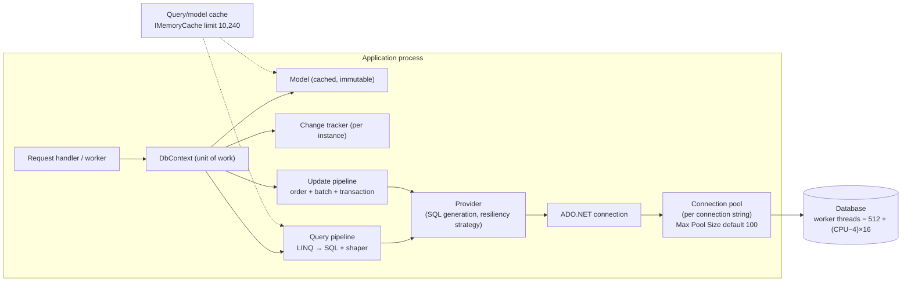
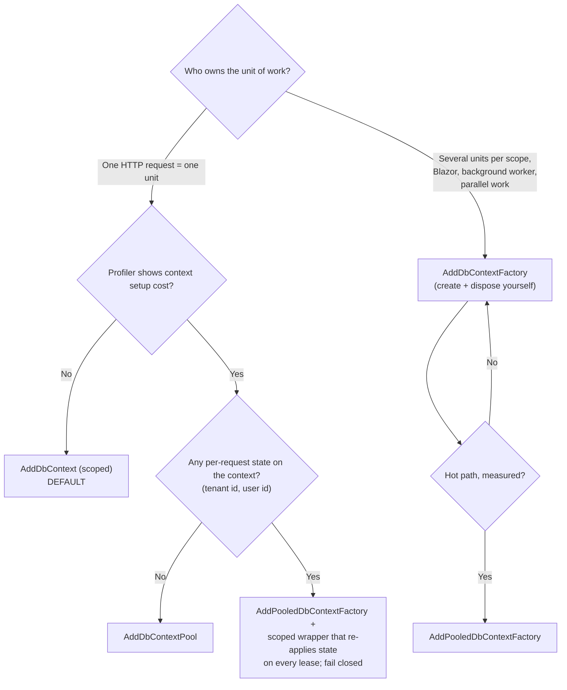
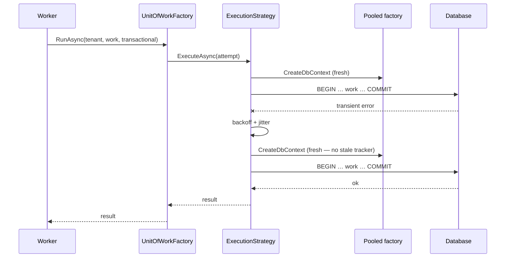

# Module 194 — LINQ & EF Core: EF Core Foundations — the DbContext Unit of Work, Lifetime & Threading, Pooling & Factories, Providers, Connection Resilience & Release Strategy

> Domain: LINQ & EF Core | Level: Beginner → Expert | Prerequisite: [[../02-DotNet-AspNetCore/02-DI-Container-Internals]] (scoped lifetimes, captive dependencies — the root cause of half of all `DbContext` bugs), [[../02-DotNet-AspNetCore/05-Configuration-Options-Pattern]] (connection strings and options binding), [[../01-CSharp/05-LINQ-Internals]] (`IQueryable` vs `IEnumerable`, deferred execution — assumed, not re-derived), [[../04-SQL-Server/02-Transactions-Isolation-Locking]] (what a transaction actually holds), [[../31-Domain-Driven-Design/02-TacticalDDD-Entities-ValueObjects-Aggregates]] (what the mapping layer is being asked to persist)
>
> **Scope note:** First of four modules in `56-LINQ-EFCore`, **rebuilt 2026-09-19 from two sources — the Microsoft Learn EF Core documentation and the entityframeworktutorial.net EF Core tutorial — replacing the former Modules 174 (LINQ deep dive) and 189 (EF Core internals)**. Module 194 (this) is the runtime foundation: what EF Core is, what a `DbContext` is, how long it lives and who may touch it, how it is configured, and how the release train affects you. Module 195 is **modeling**. Module 196 is **querying, change tracking, saving, concurrency and transactions**. Module 197 is **production: migrations, performance, testing, diagnostics, security**. Module 198 is the **top-50 Lead/Principal interview Q&A** that draws on all four. LINQ language internals stay in `01-CSharp/05-LINQ-Internals`.
>
> **Accuracy caveat, stated once:** EF Core changes every November. Everything below is anchored to the Microsoft Learn snapshot read on 2026-09-19 — **EF Core 10 (LTS, released November 2025, supported until 10 November 2028, requires .NET 10)**, EF Core 9 and 8 (both supported until **10 November 2026**), EF Core 11 planned for November 2026. Where this module quotes a number (a benchmark, a default, a pool size), the number and its source are stated; verify against the version you ship, and confirm behaviour by reading the SQL EF actually emits.

---

## 1. Fundamentals

### 1.1 What EF Core is

**Entity Framework Core** is Microsoft's open-source, lightweight, extensible, cross-platform **object-relational mapper (O/RM)** for .NET. In the words of the Microsoft Learn overview it lets .NET developers work with a database using .NET objects and "eliminates the need for most of the data-access code that typically needs to be written." It is the successor to Entity Framework 6 (EF6) — a **rewrite, not an upgrade** (§2.2 covers why that matters for anyone maintaining EF6 code).

You describe your data as a **model**: *entity classes* (plain C# classes that map to tables) plus a **context** class (`DbContext`) that represents a session with the database. You query with **LINQ**; EF Core translates the expression into SQL, runs it, and materializes objects. You change the objects and call `SaveChanges()`; EF Core works out what changed and emits `INSERT`/`UPDATE`/`DELETE`.

The minimal example, taken from the Microsoft Learn landing page:

```csharp
public class BloggingContext : DbContext
{
    public DbSet<Blog> Blogs { get; set; }
    public DbSet<Post> Posts { get; set; }

    protected override void OnConfiguring(DbContextOptionsBuilder optionsBuilder)
        => optionsBuilder.UseSqlServer(
            @"Server=(localdb)\mssqllocaldb;Database=Blogging;Trusted_Connection=True;ConnectRetryCount=0");
}

public class Blog  { public int BlogId { get; set; } public string Url { get; set; } public int Rating { get; set; } public List<Post> Posts { get; set; } }
public class Post  { public int PostId { get; set; } public string Title { get; set; } public string Content { get; set; } public int BlogId { get; set; } public Blog Blog { get; set; } }

// Query
var blogs = await db.Blogs.Where(b => b.Rating > 3).OrderBy(b => b.Url).ToListAsync();

// Save
db.Blogs.Add(new Blog { Url = "http://sample.com" });
await db.SaveChangesAsync();
```

### 1.2 Why an O/RM — and what it costs

**Why:** the mapping between objects and rows lives in one declarative place, so cross-cutting rules — tenant filters, soft delete, auditing, concurrency tokens, value conversions — can be enforced centrally rather than remembered by every engineer. In a regulated estate that single enforcement point is worth more than the productivity gain, because a rule that lives in every engineer's memory does not hold at scale.

**What it costs:** it hides the SQL. The Microsoft Learn overview is unusually blunt about this: "Intermediate-level knowledge or higher of the underlying database server is essential to architect, debug, profile, and migrate data in high performance production apps." EF Core is not a substitute for understanding indexes, isolation levels and query plans; it is a way to *generate* SQL whose quality you must still judge.

### 1.3 When EF Core is — and is not — the right tool

| Workload | EF Core fit | Reason |
|---|---|---|
| Transactional, **aggregate-shaped** work (load a graph, mutate, save, with optimistic concurrency and audit) | **Excellent** — the design centre | Change tracking + `SaveChanges` batching + concurrency tokens are built for exactly this |
| CRUD APIs with filtering/paging/projection | Good | LINQ → parameterised SQL, projection to DTOs |
| Set-based bulk work (`UPDATE … WHERE` over millions of rows) | Use `ExecuteUpdate`/`ExecuteDelete` (Module 196) or raw SQL | Loading rows to change them is the wrong shape |
| Bulk *insert* of 100k+ rows | Poor natively — no bulk insert; use `SqlBulkCopy` or a bulk library | `SaveChanges` batches statements but still tracks every entity |
| Reporting / analytics over large tables, window functions, recursive CTEs | Poor — write the SQL | SQL is the artifact you care about |
| Ultra-low-latency hot path | Acceptable with pooling + compiled queries; Dapper if measured need | Module 197 quantifies the overhead |

### 1.4 How it is set up (the tutorial-site path)

From the entityframeworktutorial.net "Installation", "Create Entities" and "Create DbContext" pages, the sequence is:

1. Install the **provider package** — `Microsoft.EntityFrameworkCore.SqlServer` (or `.Sqlite`, `Npgsql.EntityFrameworkCore.PostgreSQL`, `Microsoft.EntityFrameworkCore.Cosmos`, …). The provider package pulls in `Microsoft.EntityFrameworkCore` and `.Relational`.
2. Install **design-time** support — `Microsoft.EntityFrameworkCore.Design` (referenced from the startup project, `PrivateAssets=all`) — and the CLI: `dotnet tool install --global dotnet-ef` (or the Visual Studio Package Manager Console `Microsoft.EntityFrameworkCore.Tools`).
3. Write **entities** and a **`DbContext`** with a `DbSet<T>` per entity you want to query directly.
4. Register the context with a connection string (§2.4).
5. Create the schema with **migrations** (`dotnet ef migrations add Initial`, `dotnet ef database update` — Module 197) — the *code-first* approach — or generate the model from an existing database with **scaffolding** (`dotnet ef dbcontext scaffold "<connection>" Microsoft.EntityFrameworkCore.SqlServer`) — the *database-first* approach.

The Microsoft Learn overview names the same three model-development routes: generate a model from an existing database; hand-code a model to match the database; or hand-code the model and use Migrations to create and evolve the database.

### 1.5 The four subsystems (the mental model this domain is built on)

| Subsystem | What it does | Module |
|---|---|---|
| **Model** | An immutable, cached, in-memory description of entities, keys, properties, relationships and their database mapping | 195 |
| **Query pipeline** | LINQ expression tree → provider SQL + parameters + a *shaper* that materializes rows | 196 |
| **Change tracker** | Per-`DbContext` graph of tracked entities with original values; decides what changed | 196 |
| **Update pipeline** | Orders, batches and executes the `INSERT`/`UPDATE`/`DELETE` commands inside a transaction | 196 |

The recurring finding of this domain, carried forward from the material it replaces: **EF Core keeps a *model of what it believes the database contains*, and every serious production failure is a divergence between that belief and reality** — a query filter that is present but bypassed, a concurrency token that is configured but never sent, a model snapshot that no longer matches the schema, a tracked entity that is stale. It is the same "object presence ≠ enforced reality" pattern named across Modules 74–76.

### 1.6 Source-coverage matrix (what this domain covers, and where)

*Provenance, stated plainly:* the Microsoft Learn rows below reflect the **content of the individual pages read on 2026-09-19** (release policy, what's-new for EF 9 and 10, performance, `DbContext` configuration, concurrency, transactions, connection resiliency, `ExecuteUpdate`/`ExecuteDelete`, complex types, query filters, migrations, testing, metrics). The tutorial rows map the entityframeworktutorial.net **topic list from its introduction and index page** to where the same topic is treated here; its 38 sub-pages were **not** read individually, and where the two sources differ the Microsoft Learn version is used because it carries an update date and a support table.

| Source page / section | Covered in |
|---|---|
| MS Learn — Overview, **The model**, providers | 194 §1–§2.9, 195 |
| MS Learn — **DbContext lifetime, configuration, initialization** | 194 §2.3–§2.8 |
| MS Learn — **Connection resiliency**, connection strings | 194 §2.10 |
| MS Learn — **Modeling** (entity types, keys, properties, relationships, inheritance, value conversions, owned/complex types, JSON, generated values, indexes, sequences, shadow/backing fields, seeding, spatial/HierarchyId) | 195 |
| MS Learn — **Querying** (tracking, related data, single vs split, raw SQL, filters, client vs server evaluation, pagination) | 196 |
| MS Learn — **Saving** (basic, related data, cascade delete, disconnected entities, `ExecuteUpdate/Delete`, concurrency, transactions) and **Change tracking** | 196 |
| MS Learn — **Managing schemas** (migrations, applying, teams, scaffolding), **Testing**, **Performance**, **Logging/diagnostics/interceptors**, **O/RM considerations** | 197 (and 194 §2.13) |
| MS Learn — **What's new** EF Core 8/9/10, support policy | 194 §2.12, 195, 196, 197 |
| Tutorial — Introduction, Installation, Create Entities, Create DbContext, Working with DbContext, DB Connection Strings | 194 |
| Tutorial — Track Changes of Entities, Saving Data (connected & disconnected), Update/Delete Data, Working with Disconnected Entity Graph, Tracking Entity Graph | 196 |
| Tutorial — Bulk Insert, Execute Delete, Execute Update | 196 |
| Tutorial — Querying, Raw SQL Queries, Stored Procedures | 196 |
| Tutorial — Conventions, One-to-Many/One-to-One Conventions, Configurations, Fluent API, Configure 1:N / 1:1 / M:N, Shadow Property | 195 |
| Tutorial — Inheritance, TPH, TPT, TPC | 195 |
| Tutorial — Migrations, Generate SQL Script, PMC and CLI commands, Existing Database, Logging | 197 (logging basics also 194 §2.11) |

---

## 2. Deep Dive

*§2 is written to stand alone. Every mechanism is followed by the reasoning that selects it, the number that justifies it, the failure it introduces, and the push-back it attracts; the module's own discriminating question is §2.14.*

### 2.1 What actually happens between `new DbContext` and a row on the wire

Nothing happens at construction. The Microsoft Learn pooling page is explicit that "just creating a `DbContext` instance does not cause the EF model to be initialized" — the model is built lazily on the **first operation** (the first query or `Add`), by running conventions over your CLR types, then your `OnModelCreating` overrides, then finalising and caching the result (keyed per context type and provider by `IModelCacheKeyFactory`). That first-use cost is why large models have a slow first request (§2.8 compiled models; Module 197).

From then on a single `SaveChangesAsync` or query passes through: **DbContext → (model, change tracker, query compiler, update pipeline) → provider (SQL generation) → ADO.NET connection (from the driver's pool) → database**. EF Core opens the connection **just before each operation and closes it right afterwards** so it returns to the driver's pool (Microsoft Learn: "Regardless of whether a context instance is pooled or not, EF generally opens connections just before each operation (e.g. query), and closes it right afterwards"). Two consequences follow, both used throughout this module: a `DbContext` is **not** a connection (holding one open holds no connection), and the connection pool — not EF — is the resource whose size bounds your database concurrency (§2.7).

### 2.2 EF Core versus EF6, Dapper, and raw ADO.NET — and three stale claims to distrust

**EF Core vs EF6.** EF Core is a ground-up rewrite. What it kept: `DbContext`/`DbSet`, LINQ-to-Entities, change tracking, `SaveChanges`, migrations. What it changed or added: **no EDMX/visual designer** (database-first is via `dotnet ef dbcontext scaffold`); **lazy loading is opt-in** (proxies or `ILazyLoader`) rather than the EF6 proxy default; provider-model extensibility; first-class **shadow properties, backing fields, owned/complex types, value converters, global query filters, JSON columns, primitive collections, `ExecuteUpdate`/`ExecuteDelete`, TPC inheritance, compiled models, interceptors**; and a much faster query pipeline. What it dropped: the designer, some EF6 spatial/`ObjectContext` APIs. EF6 continues to receive maintenance only.

**EF Core vs Dapper vs ADO.NET.** These are points on a control-versus-productivity spectrum, and the honest positioning is: EF Core generates SQL and tracks changes; Dapper maps result sets to objects for SQL you wrote; ADO.NET gives you the reader. The Microsoft Learn performance page makes the point that decides most debates: "the EF overhead for real-world applications is likely to be negligible in most cases, as query execution time in the database and network latency dominate the total time." The mature answer is **EF Core by default for transactional aggregate work, governed raw SQL / Dapper by exception where the SQL is the artifact** — and, critically, *both in the same transaction when necessary* (§2.9: EF Core can share a `DbConnection`/`DbTransaction` with ADO.NET, per the Microsoft Learn Transactions page).

**Three stale claims on the tutorial site, and why they matter as a lesson in source skepticism.** The entityframeworktutorial.net introduction (as fetched 2026-09-19) says:

1. *"EF Core targets .NET Core applications but also works with .NET 4.5+ framework-based projects."* This described EF Core 1.x/2.x. Later releases moved to .NET Standard 2.1 and then to modern .NET only; the Microsoft Learn EF 10 page states flatly that EF10 "will not run on earlier .NET versions, and will not run on .NET Framework." Anyone planning a .NET Framework estate's data layer around EF Core must plan around that ceiling.
2. *"EF Core is new, so still not as mature as EF 6."* This was true in 2016–2018. Today EF Core is where all feature investment happens; EF6 is in maintenance.
3. *"SQL Compact"* among supported databases — an obsolete provider; do not plan around it.

The interview-relevant point is not the trivia but the habit: **tutorials age faster than platforms; the primary source (Microsoft Learn) carries an `updated_at` and a support table, and a Principal validates a claim against it before repeating it in a design review.**

### 2.3 `DbContext` is a Unit of Work — and that dictates its lifetime

Microsoft Learn: "A `DbContext` instance is designed to be used for a **single unit-of-work**. This means that the lifetime of a `DbContext` instance is usually very short." Martin Fowler's definition, quoted there: a Unit of Work "keeps track of everything you do during a business transaction that can affect the database. When you're done, it figures out everything that needs to be done to alter the database as a result of your work."

The typical unit of work is: **create** the context → entities become **tracked** (returned from a query, or `Add`/`Attach`ed) → you change them per the business rule → **`SaveChanges`** detects and writes the changes → the context is **disposed**.

Three rules follow, each with a reason and a failure mode:

| Rule | Why | What breaks if violated |
|---|---|---|
| **Short-lived** — one unit of work, then dispose | The change tracker holds every entity it has ever materialized (tracking queries) and their snapshots; it never forgets on its own | Memory growth proportional to rows read; **stale data** (a tracked entity is returned from the tracker, not re-read — identity resolution); `SaveChanges` cost grows with tracked-entity count because `DetectChanges` is O(tracked) |
| **Dispose it** | Frees unmanaged resources and "events or other hooks are unregistered. Unregistering prevents memory leaks when the instance remains referenced" | Leaked handlers and pinned graphs |
| **Not thread-safe** — never share across threads or parallel operations | Internal state (tracker, current query) is mutable and unsynchronised | Best case an `InvalidOperationException`: *"A second operation started on this context before a previous operation completed. This is usually caused by different threads using the same instance of DbContext, however instance members are not guaranteed to be thread safe."* Worst case — Microsoft Learn's words — "undefined behavior, application crashes and data corruption" when the concurrent access goes **undetected** |

Also from Microsoft Learn, worth stating in an interview because it is counter-intuitive: **an `InvalidOperationException` thrown by EF Core "can put the context into an unrecoverable state. Such exceptions indicate a program error and are not designed to be recovered from."** The correct response to a thread-safety exception is to fix the code, not to catch and continue with the same instance.

*Push-back: "Isn't creating a context per request expensive?"* No — Microsoft Learn: "A `DbContext` is generally a light object: creating and disposing one doesn't involve a database operation." The model is built once and cached; a new context reuses it. The cost that *is* real, in extreme cases, is the per-instance service setup — which is exactly what pooling (§2.6) removes.

### 2.4 The registration matrix — five ways to obtain a `DbContext`, and when each is right

```csharp
// (1) Scoped, per HTTP request — the default for web apps
builder.Services.AddDbContext<AppDbContext>(o => o.UseSqlServer(connectionString));

// (2) Pooled, scoped-looking, singleton-under-the-hood
builder.Services.AddDbContextPool<AppDbContext>(o => o.UseSqlServer(connectionString)); // poolSize defaults to 1024

// (3) Factory — you create and dispose contexts yourself
builder.Services.AddDbContextFactory<AppDbContext>(o => o.UseSqlServer(connectionString));

// (4) Pooled factory
builder.Services.AddPooledDbContextFactory<AppDbContext>(o => o.UseSqlServer(connectionString));

// (5) `new` with options (tests, console tools, design time)
var options = new DbContextOptionsBuilder<AppDbContext>().UseSqlServer(connectionString).Options;
using var db = new AppDbContext(options);
```

| Registration | Lifetime | Who disposes | Right for | Watch out for |
|---|---|---|---|---|
| `AddDbContext` | **Scoped** | The DI container, at scope end | ASP.NET Core: "each HTTP request corresponds to a single unit-of-work" | Injecting it into a **singleton** (captive dependency); using it from code that runs after the request scope ends |
| `AddDbContextPool` | Pooled instances, resolved per scope | EF returns it to the pool on scope end | High-throughput APIs where context setup shows in profiles | **State** — the context is effectively a singleton; `OnConfiguring` runs once (§2.6) |
| `AddDbContextFactory` | Factory is a singleton; each `CreateDbContext()` is yours | **You** — "not managed by the application's service provider and therefore must be disposed by the application" | **Blazor Server**, background services, multiple units of work inside one request, parallel work needing separate contexts | Forgetting `using`/`await using` |
| `AddPooledDbContextFactory` | Singleton factory over a pool | You (disposal returns it to the pool) | Highest-throughput background workloads | Same state caveat as pooling |
| `new` + options | Yours | You | Tests, tools, design-time | Bypasses DI-configured interceptors/logging |

Microsoft Learn's own recommendation for the awkward middle: some app types "use dependency injection but do not create a service scope that aligns with the desired `DbContext` lifetime" (Blazor Server) **or** "may need to perform multiple units-of-work within this scope" — for both, use `AddDbContextFactory`.

*Push-back: "Why does `AddDbContext` register scoped and not transient?"* Because the unit of work spans several collaborators within one request (a handler, a repository, an audit service) and they must observe the **same change tracker** and the **same transaction**. Transient would give each collaborator its own tracker — no shared identity map, no single `SaveChanges`. Transient is the right choice only for code that runs work in parallel and needs separate contexts (Microsoft Learn: register as scoped and create scopes via `IServiceScopeFactory` per thread, "or by registering the `DbContext` as transient").

### 2.5 The four ways a `DbContext` gets used concurrently — and the fixes

Microsoft Learn: "Entity Framework Core does not support multiple parallel operations being run on the same `DbContext` instance. This includes both parallel execution of async queries and any explicit concurrent use from multiple threads."

**(a) A missing `await`.** The call starts, the caller moves on and touches the context again. Fix: **always await EF Core asynchronous methods immediately.** (Analyzer: treat compiler warning `CS4014` — call not awaited — and the `VSTHRD110` threading analyzer as errors in the data-access assemblies.)

**(b) `Task.WhenAll` over queries on one context.**
```csharp
// BROKEN — two concurrent operations on one scoped context
var accounts = db.Accounts.Where(a => a.TenantId == t).ToListAsync(ct);
var payments = db.Payments.Where(p => p.TenantId == t).ToListAsync(ct);
await Task.WhenAll(accounts, payments);   // InvalidOperationException (if detected)
```
Fix: await sequentially; **or**, if the parallelism is genuinely worth two connections, take two contexts from a factory (§11 Easy).

**(c) The captive dependency.** A singleton (a `BackgroundService`, a cache, a `static` helper) holds a scoped `DbContext`. DI in development mode with `ValidateScopes` throws at startup; in production without validation it silently *works* — for a while. The context lives for the process lifetime, its tracker grows without bound, it returns stale entities, and eventually two requests use it concurrently. Fix: inject **`IDbContextFactory<T>`** (per unit of work) or **`IServiceScopeFactory`** (a scope per unit of work) into the singleton. §4's incident is this bug at scale.

**(d) Implicit sharing in parallel code.** `Parallel.ForEachAsync`, `Task.Run` fan-out, `Channel` consumers. Fix: one context **per parallel worker**, created from a factory inside the worker.

*The honest limit:* EF's thread-safety check "detects this programming bug in many cases (but not all)" (Microsoft Learn). Detection is a courtesy, not a guarantee — and the check itself has a cost, which is why `EnableThreadSafetyChecks(false)` exists (§2.6) and why turning it off is only safe after the code has been proven free of the bug.

### 2.6 Context pooling — what it does, what it costs, and the state trap

**Mechanism.** "When you dispose your context, EF Core resets its state and stores it in an internal pool; when a new instance is next requested, that pooled instance is returned instead of setting up a new one. Context pooling allows you to pay context setup costs only once at program startup, rather than continuously." The pool defaults to **1,024** instances (`poolSize`); past that, new contexts are created unpooled.

**The number (Microsoft Learn benchmark, single-row fetch, local SQL Server):**

| | Mean | Allocated |
|---|---|---|
| Without pooling | 701.6 µs | 50.38 KB |
| With pooling | 350.1 µs | 4.63 KB |

That is a **2.0× time** and **10.9× allocation** improvement on the smallest possible query. Two honesty points the docs themselves make and an interviewer will probe: it is a *single-threaded*, *zero-network-latency* benchmark ("benchmark on your platform before making any decisions"), and it measures the whole single-row fetch, not only context setup. Add 1 ms of real network/database latency and the same ~350 µs saving is about 21% (≈1.70 ms → ≈1.35 ms per call); against a 20 ms query it is under 2%. **Pooling is a high-throughput, low-latency optimisation, not a default virtue.**

**What is reset, and what is not.** EF resets *its own* state (change tracker, internal services). It does **not** reset:
- your **own fields/properties on the `DbContext`** — the context is "effectively registered as a Singleton, and the same instance is reused across multiple requests";
- **`OnConfiguring`** — "only invoked once — when the instance context is first created — and so cannot be used to set state which needs to vary (e.g. a tenant ID)";
- **ADO.NET state** — "if you manually open and use a `DbConnection` or otherwise manipulate ADO.NET state, it's up to you to restore that state before returning the context instance to the pool… Failure to do so may cause state to get leaked across unrelated requests."

**The multi-tenant trap** (the canonical failure): a context holds a `TenantId` used by a global query filter. Under `AddDbContext` each request gets a fresh context and the property is set in the constructor from a scoped `ITenant`. Under `AddDbContextPool` the *constructor runs once*; the next request receives an instance still carrying the **previous tenant's id** — and every query returns the wrong tenant's data. This is a cross-tenant data leak, not a bug. The Microsoft Learn remedy, implemented in §11 Hard: register a **pooled factory as a singleton**, wrap it in a **scoped factory that sets `TenantId` on every lease**, and register the scoped context from that wrapper. The structural defence is to make the property **fail closed** (default `Guid.Empty`, so a forgotten assignment returns *no* rows rather than *someone's* rows) and to test it (§11 Hard).

**Also from Microsoft Learn's "reducing runtime overhead" list:** prefer `PooledDbContextFactory` over DI-injected pooling for a "tiny perf boost"; size `maxPoolSize` to the workload (too low → constant create/dispose; too high → idle memory); and consider `EnableThreadSafetyChecks(false)` — "**WARNING:** Only disable thread safety checks after thoroughly testing that your application doesn't contain such concurrency bugs."

*Push-back: "So why not pool everything?"* Because pooling converts an *impossible-to-leak* design (fresh context, no carried state) into one where correctness depends on nobody storing per-request state on the context. If you cannot state the request-varying inputs and prove they are re-applied on every lease, do not pool. Pool when a profiler shows context setup, and only then.

### 2.7 Connection pooling is a different pool — and it is the one that protects your database

Microsoft Learn: "context pooling is orthogonal to database connection pooling, which is managed at a lower level in the database driver." EF "does not implement connection pooling itself." With `Microsoft.Data.SqlClient` the pool is **per distinct connection string, per process**, with a default **`Max Pool Size` of 100**, default **`Connect Timeout` of 15 s** (how long a caller waits for a pooled connection before *"Timeout expired. The timeout period elapsed prior to obtaining a connection from the pool"*) and default **`Command Timeout` of 30 s** (per command, set in EF via `CommandTimeout` on the provider options or the connection string). Pool parameters are set "via the connection string" (Microsoft Learn).

Why this is a *design* number, not a tuning detail — the arithmetic (used again in §12):

```
Little's Law:  L (busy connections) = λ (calls/s) × W (seconds per call)
Normal:        λ = 6,000 calls/s, W = 4 ms   → L = 6,000 × 0.004 = 24 busy connections
DB slows 100× W = 400 ms                     → L = 6,000 × 0.400 = 2,400 demanded
Default pool:  20 pods × Max Pool Size 100    = 2,000 permitted connections
SQL Server:    16 logical CPUs → max worker threads = 512 + (16 − 4) × 16 = 704
```

With the defaults, a 100× slowdown lets the application open **2,000** concurrent queries against a server that has **704** worker threads — the database saturates its scheduler *before* the app-side pool refuses anything, and the slowdown compounds. **The pool ceiling is the only place you can bound database concurrency from the client; set it deliberately** (§12 sizes it at 25 per pod → 500 total, under 704) and pair it with a short `Connect Timeout` so callers fail fast instead of queuing for 15 s.

**How pool exhaustion actually happens in EF Core code** (each verified in §14's incident): (i) **holding a connection across a slow non-database call** — an open transaction while calling an HTTP API; (ii) **a streaming enumeration held open** (`await foreach` over `AsAsyncEnumerable()`, or `ToList()` never reached) while doing other work; (iii) **sync-over-async** (`.Result`, `.GetAwaiter().GetResult()`) starving the thread pool so connections cannot be released; (iv) **a leaked context or reader** never disposed; (v) **an unbounded fan-out** (`Task.WhenAll` over 500 items each taking a connection).

*Push-back: "Set the pool to 1,000 and stop the timeouts."* That converts a visible, contained symptom (a pool timeout) into an invisible, uncontained one (database worker-thread exhaustion and blocking chains) — the exact failure the arithmetic above shows. Timeouts are the system telling you demand exceeds capacity; the fix is to reduce demand per request or shed load, not to widen the funnel.

### 2.8 The configuration surface — `DbContextOptions`, provider options, and what each knob does

`DbContextOptionsBuilder` is the one starting point, and it can come from three places: `AddDbContext` (and its siblings), `OnConfiguring`, or constructed explicitly with `new`. Microsoft Learn: "`OnConfiguring` is always called regardless of how the context is constructed" — so it can add configuration *on top of* DI-supplied options (and, by the same token, can silently override them; prefer one place per setting).

| `DbContextOptionsBuilder` member | What it does | Production note |
|---|---|---|
| `UseQueryTrackingBehavior` | Default tracking for queries | Setting `NoTracking` globally for a read-heavy API is common; then opt *in* with `AsTracking()` |
| `LogTo`, `UseLoggerFactory` | Logging | Use `ILogger` in production; `LogTo(Console.WriteLine)` is for development |
| `EnableSensitiveDataLogging` | Includes parameter values and entity data in logs/exceptions | **Never in production** — it writes PII (card numbers, names) into log stores. EF 10 additionally redacts *inlined constants* from logs by default, replacing them with `?` |
| `EnableDetailedErrors` | More detail in query errors "at the expense of performance" | Diagnostic only |
| `ConfigureWarnings` | Ignore or throw on specific warnings | Promote `MultipleCollectionIncludeWarning`-class warnings to errors in CI (§2.5 of Module 196) |
| `AddInterceptors` | Register `SaveChangesInterceptor`, `DbCommandInterceptor`, `DbConnectionInterceptor`, etc. | The supported extension point for audit, tenancy, RLS session context (Module 197) |
| `EnableServiceProviderCaching`, `UseMemoryCache` | Internal service-provider and query/model cache | EF's default memory cache limit is 10,240; a compiled query costs 10, a built model 100 (Microsoft Learn) |
| `UseLazyLoadingProxies`, `UseChangeTrackingProxies` | Dynamic proxies (separate `Microsoft.EntityFrameworkCore.Proxies` package) | Lazy loading is an N+1 factory (Module 196); it is also unsupported by compiled models |
| `UseModel(...)` | Use a **compiled model** | Only when startup time is the measured problem (below) |

**`DbContextOptions` vs `DbContextOptions<TContext>`.** A context should accept the **generic** `DbContextOptions<TContext>` "to ensure that the correct options for the specific `DbContext` subtype are resolved from dependency injection, even when multiple `DbContext` subtypes are registered." A context intended to be *inherited* exposes a `protected` constructor taking the non-generic `DbContextOptions`. Sealing contexts not designed for inheritance is Microsoft's stated best practice.

**Composition (EF Core 9): `ConfigureDbContext`.** Lets a library or test add options *before or after* `AddDbContext` without replacing provider configuration; later calls win for conflicting options, non-conflicting ones compose. Behaviour changed in EF 8 — see the EF 8 breaking-changes note on `AddDbContext` — so re-test configuration-composition code when upgrading.

**Design-time configuration.** The `dotnet ef` tools must construct your context. If it cannot be created from the host builder, provide an **`IDesignTimeDbContextFactory<T>`**. A context that only works when the full application is running is a migrations-in-CI problem waiting to happen (Module 197).

**Compiled models — a startup-time tool with real limits.** For applications with "hundreds to thousands of entity types" the first operation is slow because the model is built at run time; `dotnet ef dbcontext optimize` generates a compiled model wired via `UseModel(...)`. Microsoft Learn lists the limits: **global query filters are not supported; lazy-loading and change-tracking proxies are not supported; the model must be regenerated by hand whenever the model or its configuration changes; custom `IModelCacheKeyFactory` is not supported.** "Because of these limitations, you should only use compiled models if your EF Core startup time is too slow. Compiling small models is typically not worth it." (Note: in EF Core 9 "auto-compiled models" and MSBuild integration were introduced to reduce the manual-regeneration burden — re-check the current status before deciding.)

### 2.9 Providers — EF Core abstracts the *API*, not the *database*

| Database | `Use*` call | Package | Maintained by |
|---|---|---|---|
| SQL Server / Azure SQL | `UseSqlServer` | `Microsoft.EntityFrameworkCore.SqlServer` | Microsoft |
| Azure Cosmos DB (NoSQL) | `UseCosmos` | `Microsoft.EntityFrameworkCore.Cosmos` | Microsoft |
| SQLite | `UseSqlite` | `Microsoft.EntityFrameworkCore.Sqlite` | Microsoft |
| In-memory | `UseInMemoryDatabase` | `Microsoft.EntityFrameworkCore.InMemory` | Microsoft — **not for production; discouraged even for tests** (Module 197) |
| PostgreSQL | `UseNpgsql` | `Npgsql.EntityFrameworkCore.PostgreSQL` | Third party (Npgsql project) |
| MySQL / MariaDB | `UseMySql` | `Pomelo.EntityFrameworkCore.MySql` | Third party |
| Oracle | `UseOracle` | `Oracle.EntityFrameworkCore` | Oracle |

Each `DbContext` instance uses **exactly one** provider (Microsoft Learn). Provider choice leaks into your code more than the marketing suggests: `rowversion` is SQL Server-specific (PostgreSQL uses `xmin`, SQLite has no native token — Microsoft Learn's concurrency page says as much), JSON operators, `EF.Functions.*`, `HierarchyId`, migrations locking (SQLite uses a lock table that "can become abandoned if the process terminates unexpectedly"), batching limits, and transaction/savepoint behaviour all differ. **A team that says "we can swap the database later" has not counted these.** The correct claim is narrower and still valuable: the *LINQ surface* is portable; the *semantics at the edges* are not — which is precisely why the Microsoft Learn testing guidance says to test against the production database system (Module 197).

**Sharing a transaction with ADO.NET or another context** is supported for relational providers via a shared `DbConnection` and `DbTransaction` (`Database.UseTransactionAsync(transaction.GetDbTransaction())`) — the mechanism behind "EF for the aggregate, Dapper/ADO.NET for the bulk step, one transaction" (Microsoft Learn, Transactions).

### 2.10 Connection resiliency — retries, the buffering cost, the transaction rule, and commit ambiguity

**Turning it on.** `EnableRetryOnFailure()` on the SQL Server provider options installs a `SqlServerRetryingExecutionStrategy` that knows which SQL Server/Azure SQL errors are transient (throttling, failover, connection loss — the exact error-number list lives in EF Core's `SqlServerTransientExceptionDetector`; read it for the version you ship rather than assuming, in particular whether deadlock victims (1205) are retried automatically, because §12's retry classification depends on it) and applies defaults of **6 retries with a 30-second maximum delay** with randomised exponential backoff (the defaults are in the EF Core source, not stated on the Microsoft Learn page). Microsoft's recommendation: "it is recommended that connection resiliency be used when connecting to SQL Azure."

**The buffering cost.** Microsoft Learn warns: "Enabling retry on failure causes EF to internally buffer the resultset, which may significantly increase memory requirements for queries returning large resultsets." A retry strategy must be able to replay a query, so it cannot stream. If you have a large-export endpoint, that is a reason to route it through a *separate* context/registration without a retrying strategy (with its own timeout and cancellation handling).

**The transaction rule.** With a retrying strategy, "each query and each call to `SaveChangesAsync()` will be retried as a unit." The moment you call `BeginTransactionAsync()` *you* define a larger unit, and EF refuses to guess — you get:

> `InvalidOperationException: The configured execution strategy 'SqlServerRetryingExecutionStrategy' does not support user-initiated transactions. Use the execution strategy returned by 'DbContext.Database.CreateExecutionStrategy()' to execute all the operations in the transaction as a retriable unit.`

The fix is to hand the *entire* unit — context creation, transaction, all `SaveChanges`, commit — to `strategy.ExecuteAsync(...)` as a delegate that EF can safely re-run from the top:

```csharp
var strategy = db.Database.CreateExecutionStrategy();
await strategy.ExecuteAsync(async () =>
{
    using var context = new AppDbContext(options);          // FRESH context per attempt
    await using var tx = await context.Database.BeginTransactionAsync();
    // ... several SaveChangesAsync calls ...
    await tx.CommitAsync();
});
```

Note **why the context is created inside the delegate** — a failed attempt leaves the tracker in an indeterminate state; a retry must start clean (§11 Expert shows the alternative of `ChangeTracker.Clear()`).

**Commit ambiguity — the failure with no detector.** "In general, when there is a connection failure the current transaction is rolled back. However, if the connection is dropped **while the transaction is being committed the resulting state of the transaction is unknown.**" The strategy retries as if it rolled back; if in fact it committed, the retry runs the unit *again*: an exception if the new state is incompatible, or — Microsoft's words — "**data corruption** if the operation does not rely on a particular state, for example when inserting a new row with auto-generated key values." Microsoft Learn gives four options; ranked for a payments system:

1. **Do (almost) nothing** — acceptable only if you avoid store-generated keys so the retry hits a duplicate-key exception instead of silently inserting a second row. Use a **client-generated GUID** (or client-side value generator) as the key.
2. **Rebuild application state** — discard the context, reload from the database, tell the user the last operation *might* not have completed.
3. **State verification** — `ExecuteInTransactionAsync(db, operation, verifySucceeded)`: the strategy invokes your `verifySucceeded` predicate when a transient error occurs *during commit*, so you can ask the database "did my row land?" (note `SaveChangesAsync(acceptAllChangesOnSuccess: false)` so the entity stays `Added` if a retry is needed, then `db.ChangeTracker.AcceptAllChanges()` afterwards).
4. **Manually track the transaction** — insert a transaction-marker row inside the transaction; on ambiguous commit, check for it; delete it afterwards. Microsoft's note: "Make sure that the context used for the verification has an execution strategy defined as the connection is likely to fail again during verification."

**The production-grade answer is option 3 or 4 fused with an idempotency key** — the identity *exactly-once = at-least-once AND at-most-once*: the retry policy supplies the at-least-once half; the idempotency key (a unique index on `(tenant_id, idempotency_key)` written in the *same* transaction) supplies the at-most-once half. §12 designs it; Module 196 §12 develops the full write path; the distributed version is in `16-Distributed-Systems/02-Failure-Detection-Idempotency-Outbox` and Module 178.

*Push-back: "Doesn't `SaveChanges` already run in a transaction, so why the fuss?"* It does — and that transaction protects atomicity of *one* `SaveChanges`. It does not protect against the *client not knowing* whether that transaction committed. Atomicity and knowledge-of-outcome are different properties; retry logic needs the second.

### 2.11 Logging, diagnostics and interceptors — the minimum for a production `DbContext`

Three layers, all configured on the options builder:

1. **Logging** via `Microsoft.Extensions.Logging`. Category `Microsoft.EntityFrameworkCore.Database.Command` emits each SQL command at `Information`. Parameter *values* are **not** logged unless `EnableSensitiveDataLogging` is set — by design, because they "may contain sensitive or personally-identifiable information (PII)" (Microsoft Learn, EF 10 notes). EF 10 goes further: when EF *inlines* a value into SQL (e.g. `EF.Constant(roles).Contains(...)`), it now **logs `?` instead of the value** while still sending the real value to the database.
2. **`TagWith("...")`** on a query adds a comment to the SQL, so a slow statement in the database's query store can be traced back to the LINQ call site. A convention of tagging every non-trivial query with `Class.Method` turns the DBA's top-N list from anonymous SQL into a to-do list for engineers (Module 197).
3. **Interceptors** (`SaveChangesInterceptor`, `DbCommandInterceptor`, `DbConnectionInterceptor`, `DbTransactionInterceptor`) — the supported way to run code around EF operations without subclassing internals. Audit stamping, soft-delete conversion, and RLS session-context are all interceptor jobs (Modules 195, 197).

Microsoft Learn also notes EF Core publishes **metrics**, including the **query cache hit rate**: "In a normal application, this metric reaches 100% soon after program startup… If this metric remains stable below 100%, that is an indication that your application may be doing something which defeats the query cache." That single metric is the cheapest detector for the dynamic-expression-tree defect in Module 196.

### 2.12 The release train — support windows, and what an upgrade can silently change

Facts from the Microsoft Learn releases page (read 2026-09-19):

| Release | Target | Supported until | Status today (2026-09-19) |
|---|---|---|---|
| EF Core 10.0 | .NET 10 | **10 Nov 2028** | LTS — current |
| EF Core 9.0 | .NET 8 | **10 Nov 2026** | STS — **52 days left** |
| EF Core 8.0 | .NET 8 | **10 Nov 2026** | LTS — **52 days left** |
| EF Core 7.0 / 6.0 | .NET 6 | Expired 14 May 2024 / 12 Nov 2024 | Unsupported |
| EF Core 11.0 | — | — | Planned November 2026 |

Days-left arithmetic: 11 (20–30 Sept) + 31 (Oct) + 10 (Nov) = 52. **Both EF 8 and EF 9 leave support on the same day** — a fleet still on either has a Principal-level decision due now, not after the next planning cycle. The policy (Microsoft Learn): "Entity Framework Core releases and support are aligned with .NET releases and support"; patch releases ship roughly monthly; "Always use the latest patch of a given release"; "Major version updates… often have breaking changes"; minor updates "do not typically contain breaking changes. However, thorough testing is still advised."

**What a `9 → 10` (or `8 → 10`) upgrade can change without a compile error** — this is the substance of a Principal's upgrade plan, and each item is a real behaviour change documented in the Microsoft Learn release notes:

| Change | Version | What it silently does | How to catch it |
|---|---|---|---|
| **Parameterised collections** (`ids.Contains(x)`) now default to **one scalar parameter per element, padded** (8 values → 10 parameters), replacing the EF 8/9 single JSON-array parameter unpacked with `OPENJSON` | EF 10 | Changes generated SQL and therefore **query plans** — better cardinality info, more plan variants | Diff SQL for `Contains` queries; `UseParameterizedCollectionMode(ParameterTranslationMode.Constant/Parameter/MultipleParameters)` per app, `EF.Constant(...)` per query |
| **`json` column type adopted automatically** when configured with `UseAzureSql` or compatibility level ≥ 170 (SQL Server 2025): existing `nvarchar` JSON columns **"will be automatically changed to `json` with the first migration"** | EF 10 | A schema migration you did not write | Review the first EF 10 migration; opt out by pinning column type `nvarchar(max)` or a lower compatibility level |
| **`UseNamedDefaultConstraints`** | EF 10 (opt-in) | "The next migration you add will rename every single default constraint in your model" | Never enable on an existing model without reviewing the generated migration |
| **Migration locking**; `Migrate()` **throws if the model has pending changes** | EF 9 | Startup that previously "worked" now fails | `dotnet ef migrations has-pending-model-changes` in CI |
| **One transaction across all migrations reverted** | EF 10 | EF 9 wrapped a whole migration set in a single transaction; EF 10 stops (it "caused issues in various migration scenarios") | Re-test partial-failure recovery |
| Split-query ordering made consistent (`ORDER BY` now includes the key in the subquery) | EF 10 | Fixes possible wrong results with `Skip/Take` + split queries on earlier versions | Order fully-uniquely on ≤ 9 |
| Raw-SQL string-concatenation analyzer warning | EF 10 | New build warnings on `FromSqlRaw("…" + x)` | Treat as errors |
| `ExecuteUpdate` accepts a normal (non-expression) lambda; complex-type JSON supported in `ExecuteUpdate` | EF 10 | Additive | — |
| Named query filters; `LeftJoin`/`RightJoin`; vector and JSON types; optional complex types | EF 10 | Additive | — |

The Microsoft Learn overview also lists what the *application team* owns regardless of EF version: functional and integration testing on the production database *version/edition*, performance testing "with representative loads", a security review, "sufficient and usable" logging, error-recovery contingencies, a planned migration-application strategy, and "detailed examination and testing of generated migrations."

### 2.13 The Microsoft Learn "O/RM considerations" list, converted into a production-readiness gate

The overview page ends with a list that most teams read once and never operationalise. Here it is as a gate, mapped to where this domain builds each control:

| Microsoft Learn consideration | The gate question | Built in |
|---|---|---|
| Intermediate+ database knowledge | Can someone on the team read an execution plan and justify each index? | `04-SQL-Server/01` |
| Functional & integration testing on production-like DB | Do CI tests run against the real engine and version? | Module 197 |
| Performance & stress testing under representative load | Is there a load test that would catch a `Include`×3 cartesian explosion, lazy loading, or an unindexed filter? | Modules 196–197 |
| Security review | Where do connection strings live; is runtime identity least-privilege; is raw SQL parameterised? | Module 197 |
| Logging & diagnostics | Can you trace a slow SQL to a code path (query tags, `ILogger`, metrics)? | §2.11; Module 197 |
| Error recovery | Retry strategy, commit-ambiguity handling, rollback plan? | §2.10; Module 197 |
| Deployment & migration | How are migrations applied, by which identity, with which rollback? | Module 197 |
| Generated-migration review | Does a human read every migration; do defaults (`nvarchar(max)`, `decimal(18,2)`) survive review? | Modules 195, 197 |

### 2.14 The module's own discriminating question — worked at both levels

> **"A `BackgroundService` must process pending payments every 30 seconds, and it needs the database. Your `DbContext` is registered with `AddDbContext`. Walk me through what you do."**

This question reliably separates a Senior answer from a Staff/Principal one in this domain, because the *first* half is a memorised rule and the *second* half is judgement.

**The Senior answer (adequate).** "You can't inject a scoped `DbContext` into a singleton hosted service, so inject `IServiceScopeFactory`, create a scope each cycle, resolve the context from it, and dispose the scope." That is correct and gets the candidate through the phone screen.

**The Staff/Principal answer (excellent).** It adds, unprompted:

1. **The unit of work is the *batch*, not the service lifetime** — a fresh context (or scope) per batch, so the tracker never accumulates and stale reads cannot occur; if the batch is large, `ChangeTracker.Clear()` or `AsNoTracking` for read-only phases.
2. **Factory vs scope:** if the worker only needs the context, `IDbContextFactory<T>` is lighter than a full scope; if the batch resolves *several* scoped services that must share one context (a repository, an audit service, an outbox writer), a scope is right because they must share the same tracker and transaction (§2.4).
3. **Concurrency inside the worker:** if it processes items in parallel, **one context per item/worker**, never one shared (§2.5d); bound the parallelism to the *connection budget* (§2.7), not to CPU count.
4. **Idempotency and claiming:** two replicas will run this service. The query must **claim** rows atomically (`UPDATE … OUTPUT` / `SELECT … WITH (UPDLOCK, READPAST)` / a `status` transition guarded by a `rowversion`) or two replicas process the same payment. EF's optimistic concurrency token turns "two replicas raced" into a `DbUpdateConcurrencyException` you handle rather than a double payment (Module 196).
5. **Retry strategy interplay:** a batch with an explicit transaction must run inside `CreateExecutionStrategy().ExecuteAsync`, and commit ambiguity needs an idempotency key (§2.10).
6. **Cancellation and shutdown:** pass the host's `CancellationToken` through every EF call; a cancelled `SaveChanges` after commit-start has the same "outcome unknown" property as a dropped connection.
7. **Poison items:** one bad row must not block the batch forever — catch per item, record failure, move on, alert on the failure rate.
8. **Observability:** tag the polling query (`TagWith("SettlementSweeper.ClaimBatch")`) so the DBA can attribute the every-30-seconds statement.

The discriminator is item 1 combined with item 4: **the Senior answer fixes the *lifetime* bug; the Principal answer sees the *concurrency-between-replicas* bug that the fix exposes.**

### 2.15 What this design cannot do — and the failures that have no detector

- **EF Core cannot stop N+1 at compile time.** A loop that touches a navigation looks identical to a loop that doesn't. Only logs, query counts in tests, and load tests detect it (Module 196).
- **Nothing detects a captive dependency in production** unless `ValidateScopes`/`ValidateOnBuild` is on. It "works" until memory or staleness makes it visible. Make scope validation a *test* that runs against the production service graph, not merely a development-environment default.
- **Thread-safety checks are best-effort** (§2.5). Undetected concurrent use corrupts silently.
- **Pooled-context state leaks have no built-in detector** — the only defence is a test that leases the same pooled instance twice under different tenants and asserts isolation (§11 Hard).
- **Commit ambiguity has no detector** other than the verification you write (§2.10).
- **Model/database drift has no detector at runtime** — EF trusts its model. A column dropped by a hotfix script produces a runtime SQL error only when a query touches it. `has-pending-model-changes` (CI) and schema-compare (release gate) are the only defences (Module 197).
- **A stale tracked entity is indistinguishable from a fresh one** — the tracker returns it from the identity map without asking the database. Short unit-of-work lifetime is the only fix.

---

## 3. Visual Architecture

### 3.1 Where `DbContext` sits — components and resources



### 3.2 A scoped context across one HTTP request

```mermaid
sequenceDiagram
    participant C as Client
    participant K as Kestrel / DI scope
    participant H as Handler
    participant X as DbContext (scoped)
    participant P as Connection pool
    participant D as Database
    C->>K: POST /v1/payments
    K->>X: resolve (new context, model already cached)
    K->>H: invoke
    H->>X: Payments.Add(...)
    H->>X: SaveChangesAsync()
    X->>P: rent connection (just before command)
    P->>D: BEGIN; INSERT ...; COMMIT
    D-->>P: rows affected
    X->>P: return connection immediately
    X-->>H: done
    K->>X: Dispose() at scope end
    K-->>C: 201 Created
```

### 3.3 Choosing a registration



### 3.4 Support-window timeline (ASCII)

```
2023-11          2024-05        2024-11        2025-11              2026-11                 2028-11
   |  EF 8 LTS      |  EF 7 EoS    |  EF 6 EoS    |  EF 10 LTS         |  EF 8 & 9 EoS         |  EF 10 EoS
   |==== EF 8 =============================================================|
                                    |======= EF 9 ================================|
                                                    |============= EF 10 ===================================|
                                                                                  ^ EF 11 planned (Nov 2026)
                                      TODAY 2026-09-19 ────────────┤ 52 days ├──►
```

---

## 4. Production Example

**Scenario — the overnight reconciliation worker that ate 14 GB.** *(Illustrative composite; numbers are internally consistent.)*

**Problem.** A payments platform's reconciliation service matches settlement-file lines against ledger rows. It ran as a `BackgroundService` on 4 pods (each 16 GB). After a release that "added retry safety," pods began being OOM-killed around hour five of the nightly run, and — worse — a reviewer noticed reconciliation results differed between pods for the same input.

**Architecture.** `ReconciliationWorker : BackgroundService` registered as a singleton; constructor took `AppDbContext` (registered with `AddDbContext`, i.e. scoped). In development, `ValidateScopes` was on and the app would not start, so a developer had disabled scope validation "temporarily" in the shared `appsettings.json` and it shipped. In production the singleton captured **one** context for the process lifetime.

**Investigation.**
1. Memory graph (`dotnet-gcdump`): 11 GB rooted at `ChangeTracker.StateManager` → `IdentityMap<int>` for `LedgerEntry`. **~9.6 million tracked `LedgerEntry` instances** plus their snapshots. Each tracking query had added its rows to the tracker, and nothing ever removed them.
2. Cross-pod difference: two pods held *different* stale copies. A `LedgerEntry` updated by the settlement service was **returned from the tracker** (identity resolution) rather than re-read — the worker was reconciling against an hour-old snapshot of the row.
3. Intermittent `InvalidOperationException: A second operation was started on this context…` in the logs: the release "added retry safety" by wrapping per-item work in `Task.WhenAll` — parallel operations on the one shared context.

**Root cause.** A singleton captured a scoped `DbContext`. Three symptoms — unbounded memory, stale reads, and concurrency exceptions — from **one** lifetime error. The correctness bug (stale reads producing wrong reconciliation results) was the serious one; the OOM was merely the loud one.

**Fix.**
- Replaced the constructor-injected context with `IDbContextFactory<AppDbContext>`; **one context per batch of 500**, disposed at batch end (§11 Medium).
- Read-only match phase became `AsNoTracking()`; only the small set of rows to *update* were tracked.
- Parallelism moved to one context per worker task, bounded to **`Max Pool Size / replicas`**, not `Environment.ProcessorCount`.
- **`ValidateScopes = true` and `ValidateOnBuild = true` enforced in all environments**, verified by a startup test that builds the production service provider; the `appsettings` override was removed and its schema made to reject it.
- Added a claim step: batches are claimed with a `rowversion`-guarded `status` transition so two pods cannot process the same line.

**Trade-offs.** A context per batch means the identity map no longer spans batches — an entity referenced by two batches is materialized twice. That is correct: each batch is a unit of work and *should* see fresh data. The cost is one extra query for shared reference data, cached explicitly in an `IMemoryCache` with a TTL rather than accidentally in a tracker.

**Lessons.** (1) *A lifetime bug presents as three unrelated symptoms* — leak, staleness, concurrency — so triage should ask "what has a longer lifetime than the thing it holds?" before chasing each symptom. (2) *A safety check disabled in a shared config file is a check disabled everywhere.* (3) The most dangerous symptom was silent: no exception, no alert, and reconciliation reports that looked plausible. This is the domain's recurring pattern — **the model of the database in memory diverged from the database, and nothing detected it.**

---

## 11. Coding Exercises

### Easy — Find and fix the parallel-query bug

**Problem.** The endpoint below intermittently throws `InvalidOperationException: A second operation was started on this context…`. Fix it two ways and state when each is right.

```csharp
app.MapGet("/tenants/{t:guid}/summary", async (Guid t, AppDbContext db, CancellationToken ct) =>
{
    var accounts = db.Accounts.Where(a => a.TenantId == t).ToListAsync(ct);
    var payments = db.Payments.Where(p => p.TenantId == t).ToListAsync(ct);
    await Task.WhenAll(accounts, payments);
    return new Summary(accounts.Result.Count, payments.Result.Count);
});
```

**Solution A — sequential, one connection.**
```csharp
var accounts = await db.Accounts.CountAsync(a => a.TenantId == t, ct);
var payments = await db.Payments.CountAsync(p => p.TenantId == t, ct);
return new Summary(accounts, payments);
```
**Solution B — genuinely parallel, two contexts from a factory.**
```csharp
app.MapGet("/tenants/{t:guid}/summary", async (Guid t, IDbContextFactory<AppDbContext> f, CancellationToken ct) =>
{
    await using var a = await f.CreateDbContextAsync(ct);
    await using var p = await f.CreateDbContextAsync(ct);
    var accounts = a.Accounts.CountAsync(x => x.TenantId == t, ct);
    var payments = p.Payments.CountAsync(x => x.TenantId == t, ct);
    await Task.WhenAll(accounts, payments);
    return new Summary(accounts.Result, payments.Result);
});
```
**Time complexity.** A: `t₁ + t₂`. B: `max(t₁, t₂)` plus one extra connection rent. **Space.** O(1) — both project to a scalar.
**Optimized solution.** Ask whether parallelism is even worth it: two `COUNT` queries on indexed columns at ~2–4 ms each save ~3 ms and cost a second pooled connection per request — under §12's connection budget that doubles the request's connection demand. **Prefer A, or one round trip:** `db.Accounts.Where(...).Select(_ => 1).Concat(...)`-style single query, or a single raw `SELECT (SELECT COUNT(*)…), (SELECT COUNT(*)…)`. Parallelising with a factory is right only when the two operations are slow *and* independent *and* the pool has headroom.

### Medium — A background sweeper with a context per batch

**Problem.** Write `SettlementSweeper` that every 30 s claims up to 500 `Pending` payments older than 5 minutes, marks them `Processing`, and never accumulates tracker state or shares a context across batches.

**Solution.**
```csharp
public sealed class SettlementSweeper(
    IDbContextFactory<LedgerDbContext> factory,
    TimeProvider clock,
    ILogger<SettlementSweeper> log) : BackgroundService
{
    protected override async Task ExecuteAsync(CancellationToken ct)
    {
        using var timer = new PeriodicTimer(TimeSpan.FromSeconds(30), clock);
        while (await timer.WaitForNextTickAsync(ct))
        {
            try { await SweepOnceAsync(ct); }
            catch (OperationCanceledException) when (ct.IsCancellationRequested) { }
            catch (Exception ex) { log.LogError(ex, "Sweep failed; continuing"); }   // poison-batch guard
        }
    }

    private async Task SweepOnceAsync(CancellationToken ct)
    {
        await using var db = await factory.CreateDbContextAsync(ct);   // unit of work = one batch
        var cutoff = clock.GetUtcNow().UtcDateTime.AddMinutes(-5);      // captured local → SQL parameter

        var batch = await db.Payments
            .TagWith("SettlementSweeper.ClaimBatch")
            .Where(p => p.Status == PaymentStatus.Pending && p.CreatedAt < cutoff)
            .OrderBy(p => p.CreatedAt).ThenBy(p => p.Id)               // deterministic order
            .Take(500)
            .ToListAsync(ct);

        foreach (var p in batch) p.Status = PaymentStatus.Processing;   // RowVersion token guards a second replica
        try { await db.SaveChangesAsync(ct); }
        catch (DbUpdateConcurrencyException) { log.LogInformation("Another replica claimed part of the batch"); }
    }
}
```
**Time complexity.** O(B log B) at the database for the ordered `TOP 500` (an index on `(Status, CreatedAt, Id)` makes it an index seek, O(B)); O(B) tracker work. **Space.** O(B) = 500 tracked entities, released when the context is disposed.
**Optimized solution.** Skip materialisation entirely with an atomic claim — no round-trip of 500 rows, no tracker, no concurrency exception:
```csharp
var claimed = await db.Payments
    .Where(p => p.Status == PaymentStatus.Pending && p.CreatedAt < cutoff)
    .OrderBy(p => p.CreatedAt).Take(500)                   // ExecuteUpdate over a Take is supported
    .ExecuteUpdateAsync(s => s.SetProperty(p => p.Status, PaymentStatus.Processing), ct);
```
(then read back the claimed rows by a `ClaimedBy = @workerId` column). Trade-off: `ExecuteUpdate` bypasses the tracker and concurrency tokens (Module 196 §2.9), so the claim's correctness now rests on the single-statement atomicity of the `UPDATE`, which is stronger, not weaker, here.

### Hard — A tenant-aware pooled context that fails closed

**Problem.** Use `AddPooledDbContextFactory` for performance but guarantee no request can ever see another tenant's rows, even if a developer forgets to set the tenant.

**Solution** (the Microsoft Learn pattern, hardened):
```csharp
public sealed class LedgerDbContext(DbContextOptions<LedgerDbContext> o) : DbContext(o)
{
    public Guid TenantId { get; set; }                       // default Guid.Empty ⇒ matches nothing (fail closed)
    public DbSet<Payment> Payments => Set<Payment>();

    protected override void OnModelCreating(ModelBuilder b)
        => b.Entity<Payment>().HasQueryFilter(p => p.TenantId == TenantId);   // `TenantId` here is `this.TenantId` → a per-instance SQL parameter
}

public sealed class TenantScopedContextFactory(
    IDbContextFactory<LedgerDbContext> pooled, ITenantAccessor tenant) : IDbContextFactory<LedgerDbContext>
{
    public LedgerDbContext CreateDbContext()
    {
        var ctx = pooled.CreateDbContext();
        ctx.TenantId = tenant.RequireTenantId();             // throws if unauthenticated — never a default
        return ctx;
    }
}

// Composition
services.AddPooledDbContextFactory<LedgerDbContext>(o => o.UseSqlServer(cs));   // singleton
services.AddScoped<TenantScopedContextFactory>();
services.AddScoped(sp => sp.GetRequiredService<TenantScopedContextFactory>().CreateDbContext());
```
**The isolation test** (this is the deliverable — pooling bugs have no runtime detector):
```csharp
[Fact] public async Task Pooled_instance_never_carries_previous_tenant()
{
    var pooled = provider.GetRequiredService<IDbContextFactory<LedgerDbContext>>();
    Guid a = Guid.NewGuid(), b = Guid.NewGuid();
    await Seed(a, 3); await Seed(b, 5);

    await using (var c1 = await pooled.CreateDbContextAsync()) { c1.TenantId = a; Assert.Equal(3, await c1.Payments.CountAsync()); }
    await using (var c2 = await pooled.CreateDbContextAsync())          // very likely the SAME instance, returned to the pool
    {
        // NOTE: TenantId is still `a` on this instance! Prove the wrapper — not luck — is what protects us:
        var wrapped = new TenantScopedContextFactory(pooled, new FixedTenant(b)).CreateDbContext();
        Assert.Equal(5, await wrapped.Payments.CountAsync());
        Assert.DoesNotContain(await wrapped.Payments.ToListAsync(), p => p.TenantId == a);
    }
}
```
**Time complexity.** Per lease O(1) (pool pop + one property assignment). **Space.** O(poolSize) retained instances (default up to 1,024).
**Optimized / hardened.** (i) Make `TenantId` set-once-per-lease: expose only `internal` setter used by the factory, and clear it in a `SaveChangesInterceptor`/`Dispose` path so a context that escapes the factory carries `Guid.Empty`. (ii) Add a **defence-in-depth database control**: SQL Server **Row-Level Security** keyed on `SESSION_CONTEXT('tenant_id')` set by a `DbConnectionInterceptor.ConnectionOpenedAsync` — so a *bug in the EF filter* (for example an accidental `IgnoreQueryFilters()`) still cannot cross tenants (Module 197). Note this must be re-set on every connection open because pooled ADO.NET connections are reused across tenants.

### Expert — A commit-ambiguity-safe idempotent write

**Problem.** `POST /v1/payments` with an `Idempotency-Key` must insert a `Payment` and an `IdempotencyRecord` atomically, survive a connection drop *during commit*, and never create a second payment for the same key — using a retrying execution strategy.

**Solution.**
```csharp
public async Task<PaymentResult> CreateAsync(CreatePayment cmd, CancellationToken ct)
{
    var existing = await ReadRecordAsync(cmd.TenantId, cmd.IdempotencyKey, ct);          // fast path
    if (existing is not null) return existing.Replay(cmd.RequestHash);                   // 200 replay, or 422 if hash differs

    var payment = Payment.Create(cmd);                                                   // client-generated Guid id (see §12 data-model note on SQL Server ordering)
    db.Payments.Add(payment);
    db.IdempotencyRecords.Add(new(cmd.TenantId, cmd.IdempotencyKey, cmd.RequestHash, payment.Id));

    var strategy = db.Database.CreateExecutionStrategy();
    try
    {
        await strategy.ExecuteInTransactionAsync(
            db,
            operation: (c, token) => c.SaveChangesAsync(acceptAllChangesOnSuccess: false, token),
            verifySucceeded: (c, token) => c.IdempotencyRecords.AsNoTracking()          // the marker row proves the commit landed
                .AnyAsync(r => r.TenantId == cmd.TenantId && r.Key == cmd.IdempotencyKey, token),
            cancellationToken: ct);
        db.ChangeTracker.AcceptAllChanges();
    }
    catch (DbUpdateException ex) when (IsUniqueViolation(ex))                            // a concurrent duplicate won the race
    {
        db.ChangeTracker.Clear();
        return (await ReadRecordAsync(cmd.TenantId, cmd.IdempotencyKey, ct))!.Replay(cmd.RequestHash);
    }
    return PaymentResult.From(payment);
}
```
with `UNIQUE (tenant_id, idempotency_key)` on the record table. **Why each piece exists:** `acceptAllChangesOnSuccess:false` keeps entities `Added` so a retry re-inserts (Microsoft Learn); `verifySucceeded` answers "did the commit land?" when the connection dropped mid-commit; the unique index turns a *concurrent* duplicate (two pods, same key) into a catchable violation rather than a double payment; the request-hash comparison rejects key *reuse with a different body* (a client bug, not a replay); the client-generated GUID key means even without the marker a blind retry hits a duplicate-key error rather than inserting a second row (Microsoft Learn Option 1).
**Time complexity.** Happy path: 1 read + 1 transaction (2 inserts) = O(1) round trips; ambiguity path adds 1 verification read. **Space.** O(1).
**Optimized solution.** Collapse the fast-path read into the transaction using `INSERT … ON CONFLICT DO NOTHING`-style semantics (`MERGE`/`INSERT … WHERE NOT EXISTS` via `ExecuteSql`) so the common replay costs one round trip and there is *no* race window between the read and the insert. Trade-off: raw SQL for that one statement; keep EF for the aggregate insert.

---

## 12. System Design — Designing the Data-Access Foundation for a Multi-Tenant Payments Platform

*Authored to the four-step standard (`CLAUDE.md` §A7). The vehicle is the platform's "golden-path" service template — the `DbContext` registration, tenancy, resilience and diagnostics that every service inherits. Where a step would restate §4 (lifetime incident), §13 (the factory's LLD) or §14 (pool exhaustion), it states the decision and cross-references.*

---

### Step 1 — Understand the Problem and Establish Design Scope

#### The dialogue

> **I:** Every payments service in our platform talks to SQL Server through EF Core. Design the data-access foundation they all inherit.
>
> **C:** Is this a shared library and template, or a shared data service that others call over the network?
> **I:** A shared library and service template. Each service owns its database; no shared data service.
>
> **C:** How many services, how many tenants, and is tenancy row-level in a shared database or database-per-tenant?
> **I:** About 30 services; hundreds of tenants; shared database per service with row-level tenancy. Assume the largest service peaks at 2,000 requests/second.
>
> **C:** Single region or multi-region? And is the database SQL Server on VMs, or Azure SQL?
> **I:** Single region active, with a warm standby elsewhere. Azure SQL Managed Instance.
>
> **C:** Do the services only serve HTTP, or also background/queue workers?
> **I:** Both. Queue workers and scheduled sweepers are common.
>
> **C:** Then I'd raise three things immediately. First, at 2,000 req/s the interesting constraint is not throughput — it's **bounding database concurrency during a slowdown**, because default pool settings multiplied by pod count exceed what the server can run. Second, **tenant isolation must be enforced twice** — in the EF filter and in the database — because a pooled-context state bug is a cross-tenant leak, not a performance bug. Third, **retries need an idempotency story**, because a retrying execution strategy plus a payment insert is a double-payment risk on commit ambiguity.
> **I:** Agree. What's out of scope?
>
> **C:** Cross-service transactions (each service owns its data — Saga and Outbox, domains 36–37), schema evolution and migration pipelines (Module 197), read-replica routing, database-per-tenant, and per-tenant encryption keys.

Three answers carry the design:

1. **"Hundreds of tenants, shared database, row-level"** makes the query filter a *security control*, which forces defence-in-depth (Row-Level Security) and forces the pooled-state discussion.
2. **"2,000 requests/second, 30 services"** means the pool-size arithmetic is done once, in the template, not per service by whoever remembers.
3. **"Queue workers and sweepers are common"** means the foundation must give non-HTTP entry points a *safe* way to get a context — the §4 incident is the default failure otherwise.

#### Functional requirements

1. A single `AddPlatformDbContext<T>()` extension registers the context, provider, resilience strategy, interceptors, health checks and diagnostics with safe defaults.
2. Every request-scoped and worker-scoped context is **tenant-bound before first use**; an unbound context returns no rows and cannot save.
3. A unit-of-work abstraction for non-HTTP code that creates and disposes a context per unit.
4. Idempotent write support: any command carrying an `Idempotency-Key` is applied at most once, even across retries and commit ambiguity.
5. Every SQL statement is attributable to a code path (query tags) and a tenant-safe correlation id.
6. Startup verification: scope validation, model/migration consistency, and tenant-filter presence on every tenant-owned entity.

#### Non-functional requirements

| Requirement | Target | Why this number |
|---|---|---|
| Database concurrency, whole fleet | **≤ 500 connections** for the largest service | Under the 704 worker threads of a 16-vCore server (§2.7) with headroom for other clients |
| Pool wait before failing a request | **≤ 5 s** (`Connect Timeout=5`) | Fail fast; the default 15 s converts a slowdown into a queue |
| Cross-tenant leakage | **Zero**, provable by test | Regulatory and contractual; a leak is a reportable incident |
| Added latency from the foundation | **< 0.5 ms p99** per request | The DB call dominates; the foundation must not |
| Double-apply of a payment | **Zero** | Money |
| Retry amplification under DB brownout | ≤ 4 attempts total (1 + `maxRetryCount: 3`), jittered, ≤ 10 s cap | Prevent a retry storm from prolonging the outage; EF's default of 6 retries × 30 s is too generous for a request path with a 5 s pool wait |

#### Back-of-the-envelope estimation

```
PEAK REQUESTS              2,000 req/s (largest service)
DB CALLS PER REQUEST       3  → λ = 6,000 calls/s
MEAN DB LATENCY (W)        4 ms = 0.004 s
BUSY CONNECTIONS (Little)  L = λ × W = 6,000 × 0.004 = 24            ← average demand is tiny

PODS                       20  → 1.2 busy connections per pod on average
DEFAULT POOL CEILING       20 × 100 = 2,000 permitted connections
DB WORKER THREADS          16 vCPU: 512 + (16 − 4) × 16 = 704
=> Defaults allow 2,000 concurrent queries against 704 workers.

BROWNOUT (W ×100 = 400 ms) L = 6,000 × 0.400 = 2,400 connections demanded
   default ceiling 2,000 → DB scheduler saturates BEFORE the app pool refuses anything
   proposed ceiling 25 × 20 = 500 → app queues; DB stays healthy; excess requests fail fast at 5 s

ALLOCATION (context setup, from MS Learn single-row benchmark; order-of-magnitude)
   unpooled 2,000 × 50.38 KB = 100,760 KB/s ≈ 98 MB/s
   pooled   2,000 ×  4.63 KB =   9,260 KB/s ≈  9 MB/s      → ~89 MB/s less GC pressure at peak
```

**What the numbers imply is the *actual* hard problem.** Average concurrency is **24** connections against a 500-connection budget — **throughput is not the design driver at all**. The design driver is **failure containment under brownout**: the same arithmetic that shows a healthy system using 5% of its budget shows a slow database demanding 4.8× the budget, and the *default* configuration lets the application amplify the outage into a database-side scheduler collapse. The second driver is that **tenant isolation depends on a property of pooled objects that nothing detects** — correctness, not capacity.

---

### Step 2 — Propose High-Level Design and Get Buy-In

#### Core flows

**Flow 1 — Request path:** authenticated HTTP request → tenant resolved from the *validated token claim* → tenant-bound pooled context → EF query/save under a retrying strategy → response.
**Flow 2 — Worker path:** message/timer → `IUnitOfWorkFactory` opens a tenant-bound context for *that message* → handler → dispose.

#### Component glossary

| Component | Plain-language role |
|---|---|
| **`ITenantAccessor`** | Reads the tenant id from the **authenticated principal's claim** (`tid`) — never from a client-supplied header. Throws if absent. |
| **`AddPlatformDbContext<T>`** | The one registration every service calls; sets provider, `EnableRetryOnFailure`, pool budget, interceptors, warnings-as-errors |
| **Pooled factory (singleton)** | Holds reusable `DbContext` instances so setup cost is paid once |
| **`TenantScopedContextFactory`** | Scoped wrapper that sets `TenantId` on **every lease** — the only place tenant state is applied (fail closed) |
| **`TenantSessionInterceptor`** | `DbConnectionInterceptor` that runs `sp_set_session_context 'tenant_id'` on every connection open — feeds SQL Server **Row-Level Security** |
| **`AuditInterceptor`** | `SaveChangesInterceptor` stamping `CreatedBy/UpdatedBy/UpdatedAt` from the principal |
| **`IUnitOfWorkFactory`** | For workers: creates a tenant-bound context per unit and disposes it |
| **`IdempotencyStore`** | Table + unique index; written in the same transaction as the business row |
| **Connection pool** | ADO.NET pool per connection string; `Max Pool Size=25`, `Connect Timeout=5` |
| **Query tag convention** | Every non-trivial query `TagWith("Service.Class.Method")` |

#### Architecture diagram

```mermaid
flowchart LR
    Req["HTTP request\n(JWT with tid claim)"] --> MW["Auth middleware"]
    MW --> TA["ITenantAccessor"]
    Msg["Queue message"] --> UoW["IUnitOfWorkFactory"]
    TA --> SF["TenantScopedContextFactory\n(scoped)"]
    UoW --> SF
    SF --> PF["Pooled DbContext factory\n(singleton)"]
    PF --> Ctx["LedgerDbContext\nTenantId set per lease\nfilter: TenantId == this.TenantId"]
    Ctx --> Int["Interceptors:\nTenantSession → sp_set_session_context\nAudit → stamps"]
    Int --> Ex["Retrying execution strategy\n3 retries, jittered, 10 s cap"]
    Ex --> Pool["Connection pool\nMax 25 / pod × 20 = 500"]
    Pool --> DB[("SQL MI\nRLS predicate on tenant_id")]
```



#### Operational walkthrough (one `POST /v1/payments`)

1. Auth middleware validates the JWT; principal carries `tid=6f1c…`.
2. Endpoint resolves `LedgerDbContext` from DI → the **scoped** registration calls `TenantScopedContextFactory.CreateDbContext()` → pulls a pooled instance and sets `TenantId = 6f1c…` (throws if no tenant).
3. Handler reads the `Idempotency-Key` header; fast-path lookup in `idempotency_records` for `(tenant, key)`. Miss.
4. Handler builds `Payment` (client-generated GUID id) and an `IdempotencyRecord`; calls `strategy.ExecuteInTransactionAsync(... verifySucceeded ...)` (§11 Expert).
5. EF rents a pooled connection; `TenantSessionInterceptor.ConnectionOpenedAsync` runs `sp_set_session_context @key='tenant_id', @value='6f1c…', @read_only=1`.
6. `AuditInterceptor.SavingChangesAsync` stamps `CreatedBy`; EF sends `INSERT payments…; INSERT idempotency_records…` in one transaction; RLS predicate independently checks `tenant_id = SESSION_CONTEXT('tenant_id')` on both rows.
7. Commit succeeds; connection returns to the pool; the scope ends and the context returns to the *EF pool* (TenantId is left set — harmless, because step 2 overwrites it on next lease and an escaped context is caught by §11's test).
8. Handler returns `201` with the payment; a replay of the same key returns `200` with the original body.

#### REST API design

**`POST /v1/payments`**

| Header | Type | Description |
|---|---|---|
| `Authorization` | string | `Bearer <JWT>`; tenant is the `tid` claim |
| `Idempotency-Key` | string (≤ 64) | Client-chosen, unique per intended payment; required |
| `Content-Type` | string | `application/json` |

| Body field | Type | Description |
|---|---|---|
| `source_account_id` | string | Debited account, `acc_…` |
| `destination_account_id` | string | Credited account, `acc_…` |
| `amount` | **string** | Decimal amount as a **string** (`"125.50"`) — never a JSON number, so no binary-float rounding across clients |
| `currency` | string | ISO-4217, e.g. `"USD"` |
| `reference` | string (≤ 140) | Free-text reference |

Response `201 Created`:

| Field | Type | Description |
|---|---|---|
| `payment_id` | string | `pay_` + the payment GUID |
| `status` | string | `PENDING` (see lifecycle below) |
| `amount` / `currency` | string | Echoed, canonical form |
| `created_at` | string | RFC 3339 UTC |

Errors: `409` same key, different body; `422` validation; `503` + `Retry-After` when the pool wait (5 s) is exceeded — **a deliberate, fast, explicit failure**.

**`GET /v1/payments/{payment_id}`** → `200` with the same shape plus `status`, `updated_at`. **`GET /health/ready`** reports pool wait-count, recent retry rate and last successful DB round trip; **`GET /health/live`** does not touch the database (liveness must not depend on the DB or a DB blip restarts the fleet).

#### Data model

**`payments`**

| Column | Type | Description |
|---|---|---|
| `payment_id` | `uniqueidentifier` PK | **Client-generated** GUID, so a blind retry hits a duplicate-key error instead of inserting a second row (Microsoft Learn, Option 1). **Ordering caveat:** SQL Server compares `uniqueidentifier` by its *last* 6 bytes first, so a .NET `Guid.CreateVersion7()` value (time-ordered in its *leading* bytes) does **not** give clustered-index insert locality on SQL Server; EF's `SequentialGuidValueGenerator` produces values ordered for SQL Server's comparison. Either use that, or cluster on `(tenant_id, created_at)` and keep the GUID as a non-clustered PK |
| `tenant_id` | `uniqueidentifier` NOT NULL | Row-level tenancy; leading column of every index |
| `source_account_id` / `destination_account_id` | `uniqueidentifier` | FKs |
| `amount_minor` | `bigint` | Minor units (12550 = 125.50 USD); avoids `decimal` scale ambiguity |
| `currency` | `char(3)` | ISO-4217 |
| `status` | `varchar(16)` | `PENDING → SETTLING → SETTLED \| FAILED` |
| `row_version` | `rowversion` | Optimistic-concurrency token (Module 196) |
| `created_at`, `updated_at` | `datetime2(3)` | UTC |

**`idempotency_records`**

| Column | Type | Description |
|---|---|---|
| `tenant_id` | `uniqueidentifier` | Part of PK |
| `idempotency_key` | `varchar(64)` | Part of PK — **`PRIMARY KEY (tenant_id, idempotency_key)`** is the at-most-once guarantee |
| `request_hash` | `binary(32)` | SHA-256 of the canonical body — detects key reuse with a different payload |
| `payment_id` | `uniqueidentifier` | The result |
| `created_at` | `datetime2(3)` | For TTL purge (24–72 h) |

Design rationale: **prefer a boring ACID relational store for money** — stability, tooling and DBA availability beat benchmark numbers; **amounts as minor-unit integers** (and as *strings* on the wire); **client-generated keys** so ambiguity can never silently duplicate.

---

### Step 3 — Design Deep Dive

#### 3.1 Bounding database concurrency

The pool budget is derived, not guessed: **`Max Pool Size = floor(0.7 × workerThreads / pods)`** = ⌊0.7 × 704 / 20⌋ = ⌊24.6⌋ → **25**. The 0.7 leaves 30% of workers for other clients (jobs, DBAs, replication). Combined with `Connect Timeout=5`, this converts brownout into *bounded queueing plus explicit 503s*. Trace of a brownout:

```
t=0      DB p50 4 ms → 400 ms.  Demand L = 6,000 × 0.4 = 2,400.
t=0+     Each pod: 25 busy, remaining requests wait for a connection.
t=5 s    Waiters hit Connect Timeout=5 → app returns 503 + Retry-After.  DB sees ≤ 500 queries.
t=…      DB recovers; pool drains; 503s stop.  Retry storm bounded: strategy ≤ 3 retries, jittered, and 503s carry Retry-After.
```

**Load-shedding hook:** a cheap in-process `ConcurrencyLimiter` at the endpoint (queue limit 100) rejects earlier than the 5 s timeout when the pool wait-count crosses a threshold — protecting thread-pool threads from a wall of waiting requests.

#### 3.2 Tenant isolation, twice

Layer 1 — **EF filter** on `LedgerDbContext.TenantId` (fail closed; §11 Hard). Layer 2 — **Row-Level Security**: an inline table-valued predicate `WHERE tenant_id = CAST(SESSION_CONTEXT(N'tenant_id') AS uniqueidentifier)` applied as both `FILTER` and `BLOCK` predicate, with `sp_set_session_context ... @read_only = 1` so application code cannot change it after the connection is opened. The interceptor sets it in `ConnectionOpenedAsync` **on every open**, because ADO.NET pooling hands the *same physical connection* to different tenants over time; a once-per-connection set-up is the classic leak. Trace of the failure this prevents:

```
Developer adds .IgnoreQueryFilters() to an admin report and forgets the tenant predicate.
  Layer 1: bypassed.
  Layer 2: connection was opened under tenant 6f1c… → RLS returns only tenant 6f1c… rows. Leak prevented.
Admin cross-tenant reporting uses a separate, audited connection string/role that is exempt from the predicate.
```

#### 3.3 Retries, idempotency, and commit ambiguity — exactly-once as an identity

**exactly-once = at-least-once AND at-most-once.** *At-least-once* comes from the retrying execution strategy (`EnableRetryOnFailure`, jittered exponential backoff, `maxRetryCount: 3` ⇒ ≤ 4 attempts) — it turns transient faults into eventual success. *At-most-once* comes from `PRIMARY KEY (tenant_id, idempotency_key)`, written in the **same transaction** as the payment — it makes the second application of the same command impossible. Two scenarios:

*Scenario A — double submit.* The client's first request is slow; it times out and re-sends the same `Idempotency-Key`. Two pods run `CreateAsync` concurrently. Both pass the fast-path read (miss); both attempt the insert; the primary key admits one — the loser catches the unique violation (`SqlException` 2627/2601), clears its tracker, re-reads the record and **replays the original response** (`200`). Exactly one payment exists.

*Scenario B — response lost after the side effect.* The transaction commits; the connection drops **during commit acknowledgement**. The strategy sees a transient error and — without more — would re-run the whole unit. With `ExecuteInTransactionAsync`, EF calls `verifySucceeded`: "does `(tenant, key)` exist?" — **yes** → the strategy treats the unit as committed and does not re-run. Without the verification, the retry would hit the primary key and throw; with *store-generated* payment keys and *no* idempotency table it would silently insert a second payment (Microsoft Learn: "data corruption"). The verification context uses the same retrying strategy, per the docs' warning that the verification itself can fail.

Retry classification: transient (`40613`, `40501`, `10928/10929`, connection reset) → retry; **deadlock 1205** → retry the *whole unit* once or twice with a fresh context, whether or not the provider's detector already does (verify — a deadlock victim was rolled back in full and is by definition safe to retry); constraint violations, validation, `DbUpdateConcurrencyException` → **non-retryable** in the strategy (handle in application logic). Retry queue/DLQ apply to the *worker* path: a message failing non-retryably goes to a dead-letter queue with the idempotency key preserved.

#### 3.4 Non-HTTP entry points

`IUnitOfWorkFactory.RunAsync(tenantId, (ctx, ct) => …)` creates a tenant-bound context **per unit**, wraps it in `CreateExecutionStrategy().ExecuteAsync` if the unit is transactional, and disposes it. Workers never receive a `DbContext` in their constructor — the analyzer rule `PLAT0007` (custom Roslyn analyzer) flags any `BackgroundService`/`IHostedService` constructor parameter of a type deriving from `DbContext` — the structural fix for §4's incident class. `ValidateScopes`/`ValidateOnBuild` are enforced by a test that builds the production provider.

#### 3.5 Consistency and replication

All writes and all read-your-writes reads go to the **primary**. Reads that tolerate staleness (dashboards) may use the secondary via a *separate* registered read-only context (`ApplicationIntent=ReadOnly`) — separate type, separate registration, so a write cannot be accidentally routed to a replica. Internal consistency = the transaction; external consistency (the bank/network side) is reconciled downstream (Module 178).

#### 3.6 Security

Connection string from Key Vault / managed identity — never in `appsettings.json`; **two identities**: deployment (schema-change rights, used by the migration bundle) and runtime (DML only) — per the Microsoft Learn migrations guidance; `EnableSensitiveDataLogging` forbidden outside local development (enforced by a startup check that fails the process if enabled in `Production`); `FromSqlRaw` concatenation is a build error (EF 10 analyzer promoted to error).

---

### Step 4 — Wrap-Up

**Not covered, and the natural next questions:** monitoring metrics that matter (pool wait count, EF query-cache hit rate, retry rate, p99 per tagged query, connection open time); alerting thresholds and SLO burn; debugging tooling (query store, `dotnet-counters` for `Microsoft.EntityFrameworkCore`); multi-region failover of the pooled connection strings and the standby's replication lag; database-per-tenant for the largest tenants and how the model-cache key must then vary (`IModelCacheKeyFactory`); per-tenant encryption (Always Encrypted); read-replica routing; and the schema-evolution pipeline (Module 197).

**Closing summary:** the architecture diagram in Step 2 is the whole system — a tenant claim becomes a tenant-bound pooled context, protected by an EF filter and a database RLS predicate, executed under a bounded connection budget and a retrying strategy whose commit-ambiguity is closed by an idempotency key written in the same transaction.

#### References

1. Microsoft Learn — *DbContext Lifetime, Configuration, and Initialization*: https://learn.microsoft.com/en-us/ef/core/dbcontext-configuration/
2. Microsoft Learn — *Advanced Performance Topics* (pooling, compiled queries, compiled models, memory cache): https://learn.microsoft.com/en-us/ef/core/performance/advanced-performance-topics
3. Microsoft Learn — *Connection Resiliency*: https://learn.microsoft.com/en-us/ef/core/miscellaneous/connection-resiliency
4. Microsoft Learn — *Transactions*: https://learn.microsoft.com/en-us/ef/core/saving/transactions
5. Microsoft Learn — *EF Core releases and planning*: https://learn.microsoft.com/en-us/ef/core/what-is-new/
6. Microsoft Learn — *What's New in EF Core 10*: https://learn.microsoft.com/en-us/ef/core/what-is-new/ef-core-10.0/whatsnew
7. Microsoft Learn — *Overview of Entity Framework Core* (O/RM considerations): https://learn.microsoft.com/en-us/ef/core/
8. entityframeworktutorial.net — *Entity Framework Core* tutorial: https://www.entityframeworktutorial.net/efcore/entity-framework-core.aspx
9. Microsoft Learn (SQL Server) — *Configure the max worker threads server configuration option*
10. Microsoft Learn (SQL Server) — *Row-Level Security* and `sp_set_session_context`
11. Martin Fowler — *Unit of Work*: https://www.martinfowler.com/eaaCatalog/unitOfWork.html
12. This course: Module 178 (payment processing & ledger), `16-Distributed-Systems/02-Failure-Detection-Idempotency-Outbox`, `37-Outbox/01`, `02-DotNet-AspNetCore/02-DI-Container-Internals`, `04-SQL-Server/02-Transactions-Isolation-Locking`

---

## 13. Low-Level Design — The Tenant-Bound Context Factory and Unit-of-Work Runner

**Requirements.** (1) A context obtained anywhere in the platform is **tenant-bound before first use** or unusable; (2) safe for pooling; (3) non-HTTP code gets a context per unit of work; (4) transactional units run inside the execution strategy with a **fresh context per attempt**; (5) testable without a database.

**Class diagram (textual):**
```
ITenantAccessor ───────────────► TenantId RequireTenantId()          // throws if none
IDbContextFactory<TCtx> ◄─────── PooledDbContextFactory<TCtx>          // EF, singleton
        ▲
        │ decorates
TenantScopedContextFactory<TCtx> : IDbContextFactory<TCtx>            // scoped
        │ uses ITenantAccessor, sets TCtx.TenantId on every CreateDbContext()
IUnitOfWorkFactory ──► RunAsync<T>(tenantId, Func<TCtx, CancellationToken, Task<T>>, options)
        └─ UnitOfWorkFactory<TCtx>
              ├─ uses IDbContextFactory<TCtx> (pooled) + explicit tenant id
              ├─ non-transactional: one context, run, dispose
              └─ transactional: strategy.ExecuteAsync(new context per attempt + tx + commit)
TenantSessionInterceptor : DbConnectionInterceptor                    // sp_set_session_context per open
AuditInterceptor         : SaveChangesInterceptor
```

**Sequence (transactional unit, one retry):**


**Design patterns used.** *Decorator* (`TenantScopedContextFactory` wraps the pooled factory without changing its interface); *Factory* (`IDbContextFactory`); *Unit of Work* (the context itself, and `IUnitOfWorkFactory` as its non-HTTP scoping); *Interceptor* (EF's `DbConnectionInterceptor`/`SaveChangesInterceptor`); *Strategy* (`IExecutionStrategy`); *Null Object / fail-closed default* (`TenantId = Guid.Empty`).

**SOLID mapping.** **S** — the factory only binds tenancy; the interceptors only stamp; the runner only scopes. **O** — new cross-cutting behaviour is another interceptor, no context edit. **L** — `TenantScopedContextFactory` is substitutable for `IDbContextFactory<T>` everywhere. **I** — consumers depend on `IDbContextFactory<T>` or `IUnitOfWorkFactory`, never on the pool. **D** — handlers depend on abstractions; the tenant source is behind `ITenantAccessor` (JWT claim in production, fixed value in tests).

**Extensibility.** Database-per-tenant for whales: `IDbContextFactory` resolves a *different connection string per tenant* and the model cache key varies with it (`IModelCacheKeyFactory`), with no consumer change. A read-only context type reuses the same decorator with `ApplicationIntent=ReadOnly`.

**Concurrency and thread safety.** The pooled factory is thread-safe by design (a concurrent pool). The scoped wrapper holds no shared mutable state. **A leased `DbContext` is single-thread** — the runner never hands one context to two tasks; parallel units each call `RunAsync`. Interceptors are registered as singletons and must be stateless.

---

## 14. Production Debugging

**Incident.** During a downstream database failover, the largest payments service returned `Timeout expired. The timeout period elapsed prior to obtaining a connection from the pool. This may have occurred because all pooled connections were in use and max pool size was reached.` for 11 minutes — **long after** the database had recovered in 90 seconds. p99 latency stayed above 30 s until pods were restarted.

**Root cause.** Three defects compounding: (1) an export endpoint used `await foreach (var row in db.LedgerEntries.AsAsyncEnumerable())` and, **inside the loop, awaited an HTTP call to a reporting API** — each in-flight export held a **connection for the entire slow loop** (a streaming reader keeps its connection until enumeration ends); (2) a retry wrapper at the HTTP client layer *re-issued* the export on timeout, multiplying held connections; (3) the pool ceiling was the default 100 per pod, so during the brownout the exports alone (up to 100 per pod) consumed every connection. After the database recovered, the queue of retried exports kept the pool saturated — a **metastable failure**: the trigger (failover) was gone, but the retry amplification sustained the outage.

**Investigation.** The pool exception is a symptom of *demand > supply*, not of a database problem — so the first question is *who is holding connections*. `SELECT * FROM sys.dm_exec_sessions/sys.dm_exec_requests` showed ~1,900 sessions from the service in `sleeping` state with **open transactions/readers and `last_request_end_time` seconds old** — connections *held but idle* (a fast database with slow holders). `dotnet-counters` on `Microsoft.Data.SqlClient.EventSource` showed `active-hard-connections` pinned at the ceiling and `number-of-pooled-connections` at zero. A thread dump showed request threads in `SqlConnectionFactory`/pool-wait, and application code in the export loop `await`ing `HttpClient`.

**Tools.** `dotnet-counters` (`Microsoft.Data.SqlClient.EventSource` pool counters; `Microsoft.EntityFrameworkCore` metrics), `dotnet-dump`/`dotnet-stack` for parked threads, `sys.dm_exec_sessions`/`sys.dm_tran_locks`/`sys.dm_exec_requests` for the database's view, query tags to attribute the statement (`TagWith("ExportController.Ledger")`), the load-balancer's per-route latency.

**Fix.** (Immediate) shed the export route at the gateway; restart pods to release held connections. (Structural) **never hold a connection across a non-database await**: materialise the page (`ToListAsync` for a bounded page or keyset chunk), release, *then* call the API; export by **keyset-paged chunks of 2,000** rather than one long stream; give exports their **own registration** — a smaller pool (`Max Pool Size=5`, own connection string application name) and no retry strategy — so a bulk workload cannot starve the transactional path (the *bulkhead* pattern); add the query timeout and `CancellationToken` propagation; retries at the HTTP layer carry a **retry budget** (≤ 10% of requests) and idempotent export tokens.

**Prevention.** A CI analyzer flagging `await` of non-EF I/O inside `await foreach` over an EF query; alert on **pool wait-count > 0 for 60 s** (a leading indicator — the timeout is the lagging one); a game-day that injects a 90 s database stall and asserts the service recovers within 60 s of the database (this incident was invisible in every steady-state test); and the standing rule from §2.7 — the pool ceiling is a *design* number derived from worker threads, documented in the service's runbook.

---

## 15. Architecture Decision

**Decision:** How should the platform obtain and scope `DbContext` instances across HTTP services, workers and hot paths?

**Option A — Plain `AddDbContext` (scoped) everywhere; workers use `IServiceScopeFactory`.**
*Advantages:* Simplest; the documented default; no per-request state pitfalls; nothing to leak between requests. *Disadvantages:* Per-request context set-up cost (Microsoft Learn: 50.38 KB and ~350 µs more than pooled on the smallest query); every worker author must remember the scope factory. *Cost:* Lowest. *Complexity:* Lowest. *Maintainability:* High. *Performance:* Adequate for all but the hottest paths. *Scalability:* Fine — the pool ceiling, not the context, bounds concurrency. *Operational overhead:* Minimal.

**Option B — `AddDbContextPool` everywhere.**
*Advantages:* ~2× faster and ~11× fewer allocations on trivial queries (Microsoft Learn benchmark). *Disadvantages:* Per-request state (tenant, user) on the context becomes a **cross-tenant leak risk**; `OnConfiguring` runs once; ADO.NET state is not reset. *Cost:* Low to adopt, **high tail risk**. *Complexity:* Moderate, plus a mandatory isolation test. *Maintainability:* Fragile if state creeps in. *Performance:* Best. *Operational overhead:* Needs a regression test that pooled instances never carry state.

**Option C — Pooled factory + scoped tenant-bound wrapper + `IUnitOfWorkFactory` for workers (this module's design).**
*Advantages:* Pooling's performance with tenant state re-applied on **every lease**; fail-closed default; one safe entry point for workers; composes with RLS for defence-in-depth. *Disadvantages:* More moving parts than A; a team must understand *why* the wrapper exists or it will be "simplified" away. *Cost:* Moderate one-time (library + tests + analyzer). *Complexity:* Moderate. *Maintainability:* Good *if* the isolation test and analyzer ship with it. *Performance:* Near-best. *Scalability:* Good. *Operational overhead:* Low once built.

**Option D — Bypass EF on hot paths (Dapper/ADO.NET), EF elsewhere.**
*Advantages:* Lowest per-call overhead; full SQL control. *Disadvantages:* Two data-access idioms; loses centrally-enforced filters/auditing on those paths (the exact benefit of §1.2) unless rebuilt by hand; more code to secure. *Cost:* High to maintain. *Risk:* Tenant isolation must be reimplemented per query. *Use:* only by measured exception, inside the same transaction when needed (§2.9).

**Recommendation: Option C for services with multi-tenant state and a measured need, Option A as the platform default, Option D by measured exception only.** The decisive reasoning is asymmetric risk: the *benefit* of pooling is a few hundred microseconds per request, while the *failure* it introduces is a cross-tenant data leak — so pooling is adopted only where the profiler shows the benefit *and* the wrapper plus isolation test are in place. Everything else takes the boring default. This is the module's recurring principle: **prefer the design whose failure mode is loud (an exception, a 503) over the one whose failure mode is silent (a wrong row).**

---

## 17. Principal Engineer Perspective

**Business impact.** A `DbContext` lifetime error is a **correctness incident wearing a performance costume**: §4's reconciliation reports were *wrong* for weeks while the only visible alarm was memory. In a regulated payments firm a wrong report is a regulatory-reporting problem, and a cross-tenant leak (the pooled-state failure) is a reportable breach. The business cost of the foundation module is a few engineer-weeks; the cost of not having it is measured in incident hours, audit findings and — for the leak — contractual penalties.

**Engineering trade-offs.** The module's central trade is **performance versus provability**. Pooling buys ~2× on trivial queries and costs the guarantee that a context carries no history. The Principal's move is not to refuse the optimisation but to **buy the guarantee back in code** — the fail-closed wrapper, the isolation test, and a database-side RLS predicate — and to decline the optimisation where the buy-back is not in place.

**Technical leadership.** The habit to instil: when three unrelated symptoms appear together (memory growth, stale reads, concurrency exceptions — §4), ask **"what has a longer lifetime than the thing it holds?"** before treating each separately. And teach teams that **a disabled safety check in shared configuration is disabled everywhere** — scope validation, sensitive-data logging, thread-safety checks and analyzers must be enforced by tests, not by convention.

**Cross-team communication.** Platform owners must explain the *pool ceiling* to 30 service teams in terms they act on: "your service's ceiling is 25 connections; if you need more, show me the wait-count metric and the query that holds them." Publishing the Little's-Law arithmetic (§2.7, §12) turns a magic number into a negotiation about demand, which is the only sustainable framing.

**Architecture governance.** Encode the rules structurally: the `AddPlatformDbContext` extension is the **only** supported registration (a build-time analyzer rejects raw `AddDbContext`), the worker-constructor analyzer (§3.4), `ValidateScopes` enforced by test, `EnableSensitiveDataLogging` failing startup in production, and a pre-upgrade gate that diffs generated SQL for the EF release train (§2.12). **EF 8 and EF 9 both leave support on 10 November 2026 — 52 days from this module's date** — so governance also means a dated, owned upgrade plan with the SQL-diff and first-migration review as explicit exit criteria.

**Cost optimisation.** Pooling's ~89 MB/s allocation saving at peak (§12) is real GC and CPU reduction — but the larger cost lever is *connection budget discipline*: right-sizing pools lets a database run on a smaller SKU with confidence because worst-case concurrency is bounded. The cheapest incident is the one whose blast radius the pool ceiling already capped.

**Risk analysis.** Ranked: (1) cross-tenant leak via pooled state — *severe, silent*; (2) commit-ambiguity double-apply — *severe, rare, silent without idempotency*; (3) brownout amplification via default pool and retries — *severe, loud*; (4) captive-dependency staleness — *moderate-to-severe, silent*; (5) support-window lapse — *moderate, dated, certain*. The silent ones get tests and structural controls; the loud ones get alerts and game-days.

**Long-term maintainability.** The module's design pays down a recurring tax — every new service inherits safe defaults instead of re-deciding lifetime, pooling, tenancy and retries. The maintenance risk is the *wrapper being simplified away* by someone who has not read §4; the mitigation is that its purpose is asserted by a test that fails loudly, not by a comment that can be deleted.

**Next:** Module 195 — EF Core modeling: conventions, keys, relationships, inheritance, owned/complex types, JSON, value conversions, query filters, seeding.
