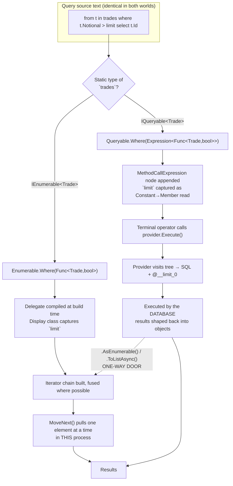
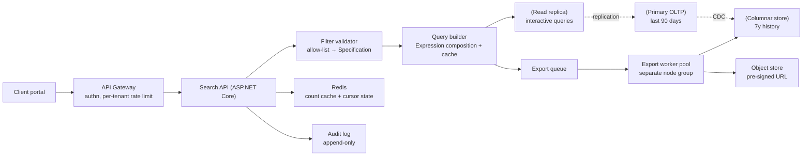
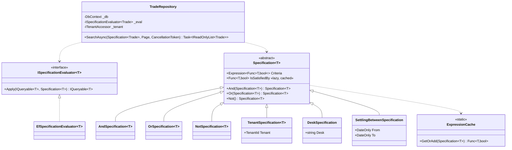
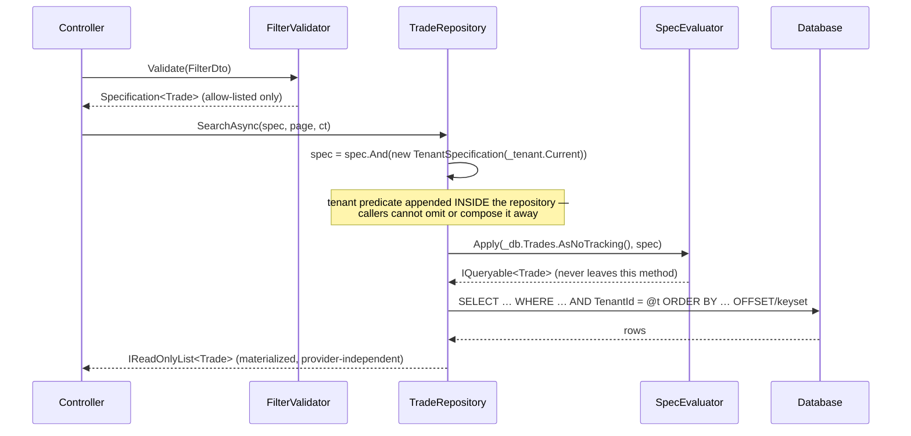

# Module 174 — LINQ & EF Core: LINQ Deep Dive — Execution Engines, Iterator Fusion, Expression Trees, Allocation-Level Performance & PLINQ

> Domain: LINQ & EF Core | Level: Beginner → Expert | Prerequisite: [[../01-CSharp/05-LINQ-Internals]] (deferred execution, `IEnumerable` vs `IQueryable`, iterator state machines, the client-evaluation trap — established there and **not re-derived here**), [[../01-CSharp/02-Async-Await-Internals]] (state machines, `IAsyncEnumerable`, thread-pool behaviour), [[../01-CSharp/03-Span-Memory-Low-Allocation]] (allocation budgets, `Span<T>`, `CollectionsMarshal`), [[../01-CSharp/04-Delegates-Events-Closures]] (display classes, delegate caching, capture semantics), [[../01-CSharp/01-CLR-JIT-GC-Memory-Management]] (Gen0 pressure, escape analysis, devirtualization), [[../29-Performance-Engineering/01-PerformanceProfiling-BottleneckDiagnosis]] (how to measure any claim in §7)
>
> **Scope note:** First module of the new `56-LINQ-EFCore` domain, created on explicit request to give LINQ and EF Core dedicated, full-depth treatment rather than the single compressed C# module (Module 5) they had until now. Full 16-section template; Elite FinTech Interview Panel lens. Module 5 answered *"what is deferred execution and why does `IQueryable` translate?"* — this module answers *"what exactly executes, how many objects does it allocate, when does the pipeline stop streaming, and what would you write instead when the answer isn't good enough?"* Modules 189 and 190 take EF Core, which is the largest `IQueryable` provider most of us will ever use.
>
> **Accuracy caveat, stated once:** LINQ's internals are implementation detail, not contract. Type names (`WhereSelectArrayIterator`, `IPartition<T>`, `Iterator<T>`), fusion rules, and vectorized fast paths have all changed between .NET 6, 8, 9 and 10 — .NET 9 in particular refactored the operator hierarchy substantially. Everything below is stated because *the shape of the reasoning depends on it*, and an interviewer wants to see that you know a fast path exists, roughly what enables it, and what silently disables it. Verify exact behaviour against the runtime version you ship, and against a benchmark, before writing any of it into a design document.

---

## 1. Fundamentals

**What:** LINQ is three separable things that beginners fuse into one and that senior engineers must keep apart:

1. **A language feature** — query syntax (`from x in xs where ... select ...`) that the C# compiler rewrites, *pattern-based*, into method calls. The compiler does not know about `IEnumerable<T>`; it emits `xs.Where(...).Select(...)` and lets overload resolution find whatever `Where`/`Select` is in scope. This is why query syntax works over your own types, over `IQueryable<T>`, and over `Task<T>`-shaped monads if you define the right methods.
2. **A set of standard operators over in-memory sequences** — `System.Linq.Enumerable`, ~200 extension methods on `IEnumerable<T>`, implemented as lazily-evaluated iterators with a substantial hand-written optimizer underneath.
3. **A translation protocol** — `IQueryable<T>` carrying an `Expression` tree plus an `IQueryProvider` that inspects the tree and does something else entirely with it (emit SQL, emit a Cosmos query, call a REST API). Nothing executes the tree as C#.

**Why:** Before LINQ, the loop and the intent were the same code, so intent could not be moved. LINQ's real contribution is not terseness — it is that **a query becomes a value**. A value can be composed by one layer and executed by another, cached, rewritten by a visitor, shipped to a database, or split across threads. Every advanced use of LINQ in this module is a consequence of that single property, and every serious *misuse* is the consequence of forgetting that the value has not run yet and that somebody else decides where it runs.

**When:** LINQ-to-Objects is the right default for anything that isn't in the hot path of a latency-budgeted system — configuration processing, request-level collections of tens or hundreds of items, test code, report assembly. It becomes the wrong default in three specific places: **per-tick or per-message code in a market-data or matching path** (allocation and delegate-dispatch cost dominate), **anything enumerated more than once** (the sequence re-runs), and **anything that should have been the database's job** (§2.9). `IQueryable` is the right default for data access and the wrong tool for in-memory work, because it pays expression-tree construction cost for a translation nobody performs.

**How (30,000-ft view):** A LINQ-to-Objects query is a **linked list of small iterator objects**, built eagerly at query-construction time and executed lazily, one element at a time, pulled from the end. `xs.Where(p).Select(s)` allocates a `Where…Iterator` wrapping `xs`, then hands it to `Select`, which — crucially — does not wrap it again but asks it to *fuse*, producing a single `WhereSelect…Iterator` with both delegates. Enumeration calls `MoveNext()` on the outermost iterator, which pulls from its source, which pulls from its source. There is no intermediate collection unless an operator requires one (`OrderBy`, `GroupBy`, `Join`, `Reverse`, `Distinct` — §2.5). An `IQueryable` query allocates nothing but `MethodCallExpression` nodes; the provider walks them at the moment a terminal operator forces execution.

---

## 2. Deep Dive

### 2.1 The compiler's half: query syntax is a purely syntactic, duck-typed rewrite

Roslyn translates query expressions before binding, using a fixed rewrite table, and only *then* resolves the resulting method calls. Consequences worth stating precisely in an interview:

- `from t in trades where t.Notional > 1m select t.Id` becomes `trades.Where(t => t.Notional > 1m).Select(t => t.Id)`. If `trades` is `IQueryable<Trade>`, overload resolution binds the `Queryable` versions taking `Expression<Func<…>>`, and the *same source text* now builds a tree instead of a delegate. **The syntax gives you no signal about which world you are in** — this is the single most common cause of accidental client evaluation, and it is a language design decision, not a bug.
- `let` introduces a **transparent identifier**: `from t in trades let fx = Rate(t.Ccy) where fx > 0 select t.Id * fx` compiles to a `Select` producing an anonymous type `{ t, fx }`, then `Where`, then `Select`. Each `let` therefore costs one extra projection and one extra allocation per element in LINQ-to-Objects, and in EF Core it becomes an extra subquery or column in the SQL. `let` is not free syntax sugar.
- `join … on a equals b` maps to `Enumerable.Join`, which is **hash join only** — there is no merge-join or nested-loop variant, and the *inner* sequence is fully buffered (§2.5). `join … into` maps to `GroupJoin`. Range-join conditions (`on a.Date <= b.Date`) are not expressible; you must use `SelectMany` with a `where`, which is O(n·m).
- Query syntax covers only a subset of operators. There is no query-syntax form of `Distinct`, `Take`, `Skip`, `Aggregate`, `First`. Mixed syntax (`(from … select …).Take(10)`) is normal and fine.

The duck-typing goes further than most people use: define instance or extension methods named `Select`, `SelectMany`, `Where` with the right shapes on any type at all, and query syntax works over it. `Option<T>`/`Result<T>` libraries use exactly this. It is a legitimate interview answer to the question "is LINQ tied to `IEnumerable`?" — the answer is **no, not at the language level**.

### 2.2 The runtime's half: `Enumerable` is a hand-written optimizer, not a set of naive loops

The mental model "`Where` returns something that runs your predicate as you enumerate" is correct but incomplete, and the incompleteness is where the performance answers live. The BCL implementation does at least five distinct things beyond the naive version:

**(a) Source specialization.** `Where` inspects the runtime type of its source and returns a different iterator for `T[]`, `List<T>`, and everything else. The array and list variants iterate by index over the backing store, avoiding `IEnumerator<T>` allocation and interface dispatch entirely for that stage. This is why `array.Where(p)` beats `someIEnumerable.Where(p)` by more than the "same code" intuition predicts, and why *upcasting to `IEnumerable<T>` at an API boundary permanently destroys the optimization* for every downstream operator. An `IReadOnlyList<T>` parameter type is not enough; the check is for the concrete types.

**(b) Operator fusion.** Adjacent operators collapse instead of nesting. `Where(p1).Where(p2)` combines into one iterator holding a single fused predicate (`x => p1(x) && p2(x)`); `Where(p).Select(s)` becomes a `WhereSelect…Iterator`; `Select(s1).Select(s2)` composes the selectors. Each fusion removes one object allocation *and* one `MoveNext()` call per element per stage. This is implemented as virtual `Where`/`Select` overrides on the internal iterator base type, so it only fires when the previous stage is a BCL iterator — insert your own `yield return` helper into the middle of a chain and you break every fusion across that point.

**(c) Cheap-count and partition protocols.** Internal interfaces (historically `IListProvider<T>` and `IPartition<T>`; consolidated onto the iterator base type with `GetCount(onlyIfCheap:)` and `TryGetElementAt`/`Skip`/`Take` overrides in newer versions) let operators answer questions without enumerating. `list.Select(s).Count()` returns the list's count **without invoking the selector at all** — which is a correctness surprise if your selector has side effects or throws, and a favourite interview trap. `Enumerable.Range(0, 1_000_000).Skip(999_999).First()` is O(1), not O(n). `.NET 6+` exposes part of this publicly as `TryGetNonEnumeratedCount`.

**(d) Buffer-building that avoids quadratic copying.** `ToArray()` on an unknown-length sequence does not repeatedly double-and-copy a single array; it fills a chain of pooled/segmented buffers and copies once into an exactly-sized result. When the length *is* cheaply known (protocol (c)), it allocates exactly once and copies directly. This is why `ToArray()` is usually competitive with a hand-written `List<T>` fill, and why `ToList()` on a source of known count is materially better than `ToList()` on an opaque one.

**(e) Vectorized aggregate fast paths.** Recent versions detect primitive element types over contiguous storage and run `Sum`/`Min`/`Max`/`Average`/`Contains`/`SequenceEqual` over `ReadOnlySpan<T>` with SIMD. `int[].Sum()` can be several times faster than a hand-written scalar `for` loop — a genuinely counter-intuitive result that lands well in interviews *when you also say what disables it*: a non-contiguous source, a `Select` in between (`xs.Select(x => x.Value).Sum()` is scalar because the projection is a delegate), a nullable element type, or a custom `IEnumerable<T>` wrapper.

**The unifying lesson, and the one to say out loud:** LINQ's performance is **path-dependent, not operator-dependent**. The same three operators cost wildly different amounts depending on the concrete source type and on whether anything in the chain broke the fast path. Any performance claim about LINQ that does not name the source type is unfalsifiable.

### 2.3 Iterators: the state machine, thread affinity, and why a query object is reusable

Two different mechanisms produce iterators, and they behave alike by design:

- **Compiler-generated** (`yield return`): Roslyn emits a private sealed class implementing `IEnumerable<T>`, `IEnumerator<T>`, and their non-generic forms *on the same object*, with an `int` state field, a `current` field, hoisted locals as fields, and the method body rewritten into a `MoveNext()` switch. Initial state is `-2` for the "not yet enumerated" enumerable form.
- **Hand-written BCL iterators**: the same shape, written by hand, plus the fusion/partition overrides from §2.2.

Both use the identical **thread-affinity trick** in `GetEnumerator()`: if the object has never been enumerated *and* the calling thread is the one that created it, return `this` — no allocation. Otherwise, clone. Three real consequences:

1. **A LINQ query object is safely enumerable twice, and from multiple threads** — each enumeration gets its own state. It is not thread-*unsafe*; it is *repeated*, which is the actual bug (Module 5 §2.6). The cost is re-execution, not corruption.
2. **The first enumeration on the creating thread is allocation-free at the enumerator level**; a second one allocates a clone. So the "double enumeration" bug is slightly *more* expensive than 2×.
3. **Argument validation in a `yield return` method does not run until first `MoveNext()`.** A public API written as a single iterator method silently defers its own `ArgumentNullException` to a stack trace far from the caller. The standard fix — and a strong interview answer — is the **eager-wrapper pattern**: a non-iterator public method that validates and then returns a private iterator method's result.

```csharp
public static IEnumerable<Trade> Settling(this IEnumerable<Trade> src, DateOnly on)
{
    ArgumentNullException.ThrowIfNull(src);          // runs at call time
    return Iterator(src, on);

    static IEnumerable<Trade> Iterator(IEnumerable<Trade> src, DateOnly on)
    {
        foreach (var t in src)
            if (t.SettlementDate == on) yield return t;   // runs at enumeration time
    }
}
```

`try/finally` in an iterator becomes a `Dispose()` path, which is why `foreach` disposing the enumerator matters: abandon a partially-enumerated iterator without disposing (easy to do with manual `GetEnumerator()` or with `IEnumerator` stored in a field) and cleanup in the `finally` — closing a file, returning a rented buffer, releasing a DB reader — **never runs**. `foreach` always disposes; `.Take(1)` on an iterator disposes; a hand-rolled `while (e.MoveNext())` without a `using` does not.

### 2.4 Closures, display classes, and the delegate allocations you did not ask for

Every lambda in a LINQ-to-Objects chain becomes a delegate, and what it captures decides whether that delegate costs anything:

| Lambda | Roslyn's output | Cost |
|---|---|---|
| `x => x.Notional > 1m` (captures nothing) | Static method + **cached delegate** in a static field | Zero allocation after first use |
| `x => x.Notional > limit` (captures a local) | **Display class** instance holding `limit`, instance method, new delegate | 1 display class + 1 delegate **per query construction** |
| `x => x.Notional > _limit` (captures `this`) | Instance method on the enclosing type, new delegate | 1 delegate per query construction, no display class |
| `static x => x.Notional > 1m` (C# 9) | Same as row 1, **enforced** by the compiler | Zero |

Two non-obvious traps follow.

**Trap 1 — one display class per *scope*, not per lambda.** All lambdas in the same scope share one display class, so a lambda capturing a cheap `int` transitively keeps alive every other captured object in that scope — a large buffer, an HTTP response, a `DbContext`. This turns an innocuous `Where` into a leak the moment the query object is stored in a field or a cache.

**Trap 2 — capture is by *reference to the variable*, not by value.** In a `for` loop one display class is shared across all iterations, so predicates built inside the loop all observe the final value. `foreach` has captured per-iteration since C# 5; `for` has not. Building a list of predicates or `Task`s in a `for` loop is exactly where a payment-batching job silently applies the last batch's filter to every batch. Copy to a loop-local first.

In a hot path the arithmetic is stark: a three-operator query built per message allocates ~1 display class + ~2 delegates + ~2 iterators + 1 enumerator ≈ **six objects per message before a single element is processed**. At 50k messages/second that is 300k Gen0 allocations per second. Survivable — they die immediately and Gen0 collection is cheap — but it is precisely the pattern behind "we take 40 Gen0 collections a second and have a P99.9 we can't explain."

### 2.5 Streaming vs. buffering: which operators stop the pipeline

The single most useful table in this module. "Deferred" and "streaming" are **different properties**, and conflating them is what turns a memory-safe report into an OOM.

| Operator | Deferred? | Streaming? | Buffers what |
|---|---|---|---|
| `Where`, `Select`, `SelectMany`, `Take`, `Skip`, `TakeWhile`, `SkipWhile`, `Cast`, `OfType`, `Zip`, `Concat`, `Append`/`Prepend`, `Chunk` | Yes | **Yes** — O(1) extra memory | nothing |
| `Distinct`, `Union`, `Intersect`, `Except`, `DistinctBy`, `UnionBy` | Yes | Partially — yields as it goes | a hash set of **all keys seen so far** |
| `GroupBy` / `ToLookup` | Yes / **No** (immediate) | **No** — nothing yields until the whole source is read | **every element**, in a `Lookup` |
| `Join`, `GroupJoin` | Yes | Outer streams; **inner fully buffered** | the entire **inner** sequence |
| `OrderBy`/`ThenBy`/`Order` | Yes | **No** | every element + a key array + an index map |
| `Reverse` | Yes | **No** | every element |
| `ToList`, `ToArray`, `ToDictionary`, `ToHashSet`, `Count`, `Sum`, `Max`, `Aggregate`, `Any`, `First`, `Last`, `ElementAt`, `Contains` | **No** (immediate) | n/a | result-dependent |

Three operational readings:

- **`GroupBy` is deferred but not lazy in the way people assume.** Requesting the *first* group reads the *entire* source. A "streaming" aggregation over a 40-million-row settlement extract that ends in `GroupBy` is a full materialization with extra steps. If the source is already ordered by the grouping key, a hand-written chunking iterator gives true O(1) memory — the standard fix for end-of-day batch jobs.
- **`Join` buffers the inner side, so argument order is a performance decision.** `bigTrades.Join(currencies, …)` is right; `currencies.Join(bigTrades, …)` builds a hash table over millions of rows. Market-data shops ask this one directly.
- **`OrderBy` is smarter than "sort everything" when followed by the right operator.** `OrderBy(k).First()` degrades to an O(n) minimum scan; `OrderBy(k).Skip(m).Take(n)` uses a **partial quicksort** that only fully orders the requested window. It still buffers every element, but does not fully sort them. So `OrderBy(k).First()` is fine, while `OrderBy(k).ToList()[0]` is not.

Also: **`Enumerable.OrderBy` is a stable sort** (it sorts an index map and breaks ties on original position), while `Array.Sort` and `List<T>.Sort` are **unstable** introsorts. Ledger or reconciliation output whose tie-order matters will differ between `list.Sort(cmp)` and `list.OrderBy(k).ToList()` — a difference that has produced real "the file changed but nothing changed" audit findings.

### 2.6 Set operators, hashing, and the comparer you forgot to pass

`Distinct`, `Union`, `Intersect`, `Except`, `GroupBy`, `Join`, `ToDictionary` and `ToLookup` are all **hash-based** and all default to `EqualityComparer<T>.Default`. Three failure modes recur:

1. **Reference types without value equality.** `trades.Distinct()` on a class with identity equality removes nothing at all — silently. Records and `IEquatable<T>` fix it; `DistinctBy(t => t.Id)` (.NET 6+) sidesteps it and reads better.
2. **Case and culture.** `ToDictionary(x => x.Ccy)` compares ordinally, so a feed emitting both `usd` and `USD` produces two keys and the downstream `TryGetValue("USD")` misses half the time. Pass `StringComparer.OrdinalIgnoreCase` explicitly — and note it is **not** the same as `InvariantCultureIgnoreCase`, which is both different and slower.
3. **Mutable keys.** Mutating an object after it lands in a hash structure moves its logical bucket without moving it physically; lookups then miss. This is the in-memory twin of EF Core's value-comparer problem (Module 175 §2.7).

Hash *quality* matters more than people expect: a poor `GetHashCode` (e.g. `Id ^ Date` where both are small sequential ints, which cancels) turns an O(n) `Join` into O(n²) with no exception and no error message — just a job that takes 40 minutes instead of 40 seconds. And because randomized string hashing is on by default, hash order is **not stable across processes**: never persist, log-compare, or shard on anything derived from `GetHashCode()`.

### 2.7 Expression trees: construction, rewriting, and the real cost of `Compile()`

An `Expression<Func<Trade, bool>>` is not a delegate — it is a **tree of objects describing code**. Roslyn emits factory calls (`Expression.Parameter`, `Expression.Property`, `Expression.Constant`, `Expression.GreaterThan`, `Expression.Lambda`) at the assignment site. What matters:

- **Only expression-bodied lambdas convert.** Statement bodies, `ref`/`out` locals, `await`, and most assignment forms do not. This is *why* EF Core predicates must be single expressions — it is a language limit, not an EF limit.
- **Captured variables become a `Constant` node wrapping the display class**, plus a `MemberExpression` reading its field — **not** a literal. This detail is load-bearing: it is exactly what lets EF Core recognize "this subtree is a closure read" and emit a SQL **parameter** (`@__limit_0`) instead of an inlined literal, which is what makes the plan cacheable (Module 175 §2.4).
- **`ExpressionVisitor` is the supported rewrite mechanism.** Subclass it, override `VisitMember`/`VisitMethodCall`/`VisitBinary`, return replacement nodes. Trees are immutable, so a visitor produces a new tree. Every specification, soft-delete and tenant-filter framework you will ever write is a visitor plus a parameter-rebinding trick.
- **Combining two predicates requires unifying their parameters.** `Expression.AndAlso(a.Body, b.Body)` compiles and then throws at execution, because the two bodies reference *different* `ParameterExpression` instances. The fix — a visitor that rewrites `b`'s parameter to `a`'s — is the core of every `PredicateBuilder`, and is §11's Hard exercise.
- **`Compile()` is expensive and must be cached.** On CoreCLR it emits IL into a `DynamicMethod`: tens of microseconds to low milliseconds for a small tree, plus JIT on first invocation. Where runtime codegen is unavailable (iOS, NativeAOT) it falls back to the **interpreter** — no compile cost, but roughly 10–100× slower per invocation. Calling `.Compile()` inside a per-request or per-row path is among the most reliably catastrophic bugs in .NET: it *looks* like a pure function and *behaves* like invoking a compiler. Cache the delegate keyed by whatever actually varies — and remember expression trees have no structural equality, so a `ConcurrentDictionary` keyed by a tree needs a structural comparer you write yourself.

### 2.8 `IQueryable` composition and where the seam actually is

Module 5 established the translation model; the Principal-level question is **who owns the boundary**. An `IQueryable<T>` returned from a repository is a promise that (a) the provider is still alive, (b) nobody downstream adds an untranslatable operator, and (c) the caller knows that iterating it hits the database. All three get violated routinely:

- Returning `IQueryable<T>` from a repository over a scoped `DbContext` lets a controller enumerate it after the scope disposes → `ObjectDisposedException` in production, never in tests.
- A caller adding `.Where(t => MyHelper.IsEligible(t))` gets a translation failure. EF Core 3.0+ throws `InvalidOperationException` rather than silently client-evaluating, and that was the right call: **loud failure beats a silent full-table download.**
- The mitigation is not "never expose `IQueryable`" but "expose it only inside a boundary that owns execution" — the Specification pattern, or an explicit `Task<IReadOnlyList<T>>`/`IAsyncEnumerable<T>` return type.

The general principle, recurring across this repo (Modules 137, 139, 173): **failures concentrate at the seam between two independently correct components** — a repository that correctly returns a composable query, and a caller that correctly composes onto it, with no shared understanding of lifetime or of the translatable subset.

### 2.9 The boundary question: which engine should run this?

The decision nobody writes down, and the one interviewers probe hardest:

| Work | Push to the database (`IQueryable`) | Do in memory (`IEnumerable`) |
|---|---|---|
| Filtering that removes most rows | **Yes, always** | Only if already loaded |
| Aggregation over large sets | **Yes** — indexes, parallelism, no transfer cost | No |
| Paging | **Yes**, with a stable sort key | No — `Skip` after materialization already paid full cost |
| Rules the DB cannot express | No | **Yes**, after narrowing as far as possible |
| Formatting, localization, currency rounding | No | **Yes** |
| Joining two different databases, or a DB and an API | Impossible | **Yes** — but size it first |

The discipline: **narrow in the provider, transition explicitly, finish in memory.** The explicit transition is `.AsEnumerable()` (streaming) or `.ToListAsync()` (materializing), written deliberately so the line where the database stops and the process starts is visible in code review. An *implicit* transition is the bug.

---

## 3. Visual Architecture

### 3.1 The two execution worlds, and the one-way door between them



The one-way door is the point: you can leave the provider world for the in-memory world at any time, and you can never go back. Everything after `.AsEnumerable()` runs on your CPU, over rows already transferred.

### 3.2 Iterator fusion — what `Where().Select()` actually allocates

```
NAIVE MENTAL MODEL                    ACTUAL BCL BEHAVIOUR (list source)
------------------                    ---------------------------------
List<Trade>                           List<Trade>
   ^                                     ^
   | MoveNext                            |
WhereIterator      (obj 1)            WhereSelectListIterator   (obj 1)
   ^                                     ^   holds: predicate + selector
   | MoveNext                            |   indexes the List directly
SelectIterator     (obj 2)               |   NO IEnumerator<T> allocated
   ^                                     |   ONE MoveNext per element
   | MoveNext                            |
foreach                               foreach

3 MoveNext calls/element              1 MoveNext call/element
2 iterator objects                    1 iterator object
1 boxed enumerator                    0 enumerators
```

Break the fusion by inserting *any* non-BCL iterator — a custom `yield return` helper, a third-party extension — and the left-hand picture returns for every stage downstream of the break.

### 3.3 Where the pipeline stops streaming

```
STREAMING (O(1) memory)                  BUFFERING (O(n) memory)
 source ──▶ Where ──▶ Select ──▶ Take     source ──▶ OrderBy ──┐
   │          │         │         │                            │  reads EVERYTHING
   └── one element in flight ─────┘                            ▼  before yielding #1
                                                        [ keys[] + map[] + buffer ]
                                                                │
                                                                ▼
                                                          Select ──▶ consumer

 GroupBy / ToLookup / Join(inner) / Reverse / OrderBy  ← memory scales with input
 Where / Select / Take / Skip / Zip / Chunk            ← memory is constant
```

### 3.4 Expression tree for `t => t.Notional > limit`

```
Lambda<Func<Trade,bool>>
 ├─ Parameters: [ ParameterExpression "t" : Trade ]
 └─ Body: BinaryExpression (GreaterThan)
      ├─ Left : MemberExpression  .Notional
      │           └─ ParameterExpression "t"
      └─ Right: MemberExpression  .limit          ◀── NOT a constant!
                  └─ ConstantExpression <>c__DisplayClass0   (the closure object)

Why it matters: EF Core sees "member read off a constant closure" and emits
    WHERE [t].[Notional] > @__limit_0        ← ONE cached plan, many values
If Roslyn had inlined the literal it would emit
    WHERE [t].[Notional] > 1000000.00        ← a NEW plan per distinct value
```

### 3.5 PLINQ pipeline

```
                 ┌─ partition 0 ─▶ Where ─▶ Select ─┐
 source ──▶ PARTITIONER ─ partition 1 ─▶ … ─────────┼──▶ MERGE ──▶ consumer
   (range | chunk |     └─ partition N ─▶ … ────────┘   (buffered by
    hash | striped)                                      default; ordered
                                                         merge costs more)
        ▲                                                      ▲
        │ hash partitioning is FORCED by                        │ AsOrdered() must
        │ GroupBy / Join / Distinct                             │ reassemble in order
```

---

## 4. Production Example

### Scenario — an intraday position-aggregation service that got slower after being "optimized"

**Problem.** A tier-1 bank's intraday risk service recomputes desk-level positions from a stream of executions. Each recompute takes the last N executions from an in-memory ring buffer (≈ 250k rows), enriches each with a currency rate, filters to the desk, groups by instrument, and emits a snapshot. The SLO is a P99 of 250 ms per recompute, and recomputes fire every 2 seconds per desk across 60 desks.

After a "performance sprint" that replaced hand-written loops with LINQ for readability, P99 went from 180 ms to 1.4 s, and the service began missing recompute windows during the US open. Nothing about the data volume had changed.

**Architecture.** Ring buffer (`Execution[]`, fixed 1M capacity) → per-desk projection → snapshot published to a Redis-backed read model → risk UI and limit-checking service subscribe.

**The offending code** (reconstructed, simplified):

```csharp
public DeskSnapshot Recompute(Execution[] buffer, string desk, IReadOnlyDictionary<string, decimal> fx)
{
    IEnumerable<Execution> src = buffer;                          // (1) upcast

    var enriched = src
        .Select(e => new EnrichedExecution(e, fx[e.Currency]))    // (2) allocation per row
        .Where(e => e.Desk == desk)                               // (3) filter AFTER enrich
        .OrderBy(e => e.InstrumentId)                             // (4) full buffer + sort
        .ToList();

    var byInstrument = enriched
        .GroupBy(e => e.InstrumentId)                             // (5) second full buffer
        .Select(g => new InstrumentPosition(
            g.Key,
            g.Sum(e => e.SignedQuantity),                         // (6) re-enumerates the group
            g.Sum(e => e.SignedQuantity * e.PriceInBase)))
        .ToList();

    return new DeskSnapshot(desk, byInstrument, enriched.Count);
}
```

**Investigation.** A 60-second trace with `dotnet-counters` showed Gen0 collections at ~110/s (previously ~8/s) and allocation rate near 3 GB/min. A `dotnet-trace` + PerfView allocation view attributed 71% of allocations to `EnrichedExecution` and the anonymous grouping infrastructure. CPU sampling showed ~34% in `Enumerable.OrderBy`'s sort and ~18% in delegate dispatch.

**Root cause — five distinct mistakes, only one of which was "LINQ is slow":**

1. **The upcast at line (1) destroyed array specialization** for the entire chain. A `T[]` source would have used index-based iteration with no enumerator; `IEnumerable<Execution>` forced the general path.
2. **Enrichment before filtering** built 250k `EnrichedExecution` objects to keep ~4k. Filter-then-project would have allocated 1.6% as much. This is the in-memory version of "push the predicate down," and it is the single highest-value fix.
3. **`OrderBy` was load-bearing for nothing.** The sort existed because the original loop happened to emit ordered output; nothing downstream required it. It cost a full 250k-element buffer, a key array, an index map, and an O(n log n) sort per recompute per desk.
4. **`GroupBy` materialized a second complete copy** of the (already materialized) list into a `Lookup`.
5. **Each `g.Sum(...)` re-enumerated its group**, so a two-aggregate projection walked every group twice — a small constant, but multiplied across 60 desks every 2 seconds.

**Implementation of the fix.** Not "remove LINQ" — LINQ stayed where it was readable and cheap:

```csharp
public DeskSnapshot Recompute(Execution[] buffer, string desk, IReadOnlyDictionary<string, decimal> fx)
{
    // Filter first, on the array (specialized path), projecting only what survives.
    var positions = new Dictionary<int, PositionAccumulator>(capacity: 512);
    var count = 0;

    foreach (var e in buffer.AsSpan())          // no enumerator, no interface dispatch
    {
        if (!string.Equals(e.Desk, desk, StringComparison.Ordinal)) continue;

        var rate = fx[e.Currency];
        ref var acc = ref CollectionsMarshal.GetValueRefOrAddDefault(
            positions, e.InstrumentId, out _);   // single hash lookup, no re-probe
        acc.Quantity += e.SignedQuantity;
        acc.BaseValue += e.SignedQuantity * e.Price * rate;
        count++;
    }

    // LINQ is fine here: hundreds of instruments, not hundreds of thousands.
    var byInstrument = positions
        .Select(kv => new InstrumentPosition(kv.Key, kv.Value.Quantity, kv.Value.BaseValue))
        .OrderBy(p => p.InstrumentId)            // now sorting ~300 items, and it IS required by the UI
        .ToList();

    return new DeskSnapshot(desk, byInstrument, count);
}
```

**Results.** P99 fell to 41 ms — *below* the pre-LINQ baseline of 180 ms, because the original hand-written loop had also enriched before filtering. Gen0 collections returned to ~6/s. Allocation per recompute dropped from ~28 MB to ~40 KB.

**Trade-offs.** The single-pass accumulation loop is objectively less readable than the LINQ chain and needs a comment explaining `GetValueRefOrAddDefault`. That is an acceptable trade *in this one method*, which is called 30 times a second and is 40 lines long. The same rewrite applied to the reporting layer — called four times a day over 300 rows — would be pure cost with no benefit, and the team explicitly wrote that boundary into the code review checklist.

**Lessons learned.**

1. **The regression was not caused by LINQ; it was caused by operator *order* and by losing a fast path at an upcast.** A team that concludes "LINQ is slow, ban it" learns nothing and will write the same bug in a `foreach`.
2. **Filter before you project.** It is the one rule that survives every engine, every language, and both worlds in §3.1.
3. **An `OrderBy` nobody needs is the most expensive line in most slow LINQ queries**, because it converts a streaming pipeline into a buffering one.
4. **Where you spend the readability budget should follow call frequency**, and that boundary should be written down, not left to taste.
## 10. Interview Questions

*Calibrated to the Elite FinTech Interview Panel — J.P. Morgan, Goldman Sachs, Morgan Stanley, BlackRock, Visa, Stripe, Nasdaq, LSEG-tier. At 14+ YOE the bar is not recall; it is whether you reason about cost, failure and boundaries without being prompted.*

### Basic (10)

**B1. What is deferred execution, and which operators do not defer?**
**Ideal answer:** Most LINQ operators return an object that has captured your source and your delegates but has executed nothing; the work happens when something enumerates it — a `foreach`, a `ToList`, or an aggregate. The non-deferring operators are the ones that must produce a value: `ToList`/`ToArray`/`ToDictionary`/`ToHashSet`, `Count`/`Sum`/`Average`/`Min`/`Max`/`Aggregate`, `Any`/`All`/`Contains`, `First`/`Single`/`Last`/`ElementAt`, and `ToLookup`. Everything else — including `OrderBy` and `GroupBy` — defers.
**Why correct:** It states the mechanism (an object holding source + delegates) rather than the slogan, and it correctly places `ToLookup` on the immediate side while `GroupBy` defers, which is the discriminating detail.
**Common mistakes:** Saying "LINQ is lazy" without naming the terminal operators; assuming `OrderBy` executes immediately because it obviously has to sort.
**Follow-ups:** If `GroupBy` defers, how much of the source does it read to produce the first group? → How would you make an aggregation over 40M rows streaming?

**B2. What is the difference between `IEnumerable<T>` and `IQueryable<T>`?**
**Ideal answer:** `IEnumerable<T>` carries `Func<>` delegates and executes in your process, one element at a time. `IQueryable<T>` carries an `Expression` tree plus an `IQueryProvider`; when a terminal operator runs, the provider inspects the tree and executes it elsewhere — typically as SQL. `IQueryable<T>` inherits `IEnumerable<T>`, which is exactly why an accidental upcast silently changes where the work happens.
**Why correct:** Names both the data (delegate vs tree) and the executor (process vs provider), and flags the inheritance relationship that causes the classic bug.
**Common mistakes:** "IQueryable is faster" — it is not faster, it runs somewhere else; forgetting that the C# source text is identical in both cases.
**Follow-ups:** What does `.AsEnumerable()` do and when would you deliberately call it? → What happens if the provider cannot translate an operator?

**B3. Why does this print nothing, and how do you fix it?**
```csharp
var q = trades.Select(t => { Console.WriteLine(t.Id); return t.Notional; });
var n = q.Count();
```
**Ideal answer:** Two reasons stack. The query is deferred, so nothing runs until `Count()`. And `Count()` on a source whose length is cheaply knowable takes a fast path that returns the count **without invoking the selector at all**. Fix: don't put side effects in LINQ — use `foreach`.
**Why correct:** It identifies the second, less-known cause (cheap-count optimization skipping the projection), not just deferral.
**Common mistakes:** Explaining only deferral and concluding the `WriteLine` would run under `ToList()` — true, but it misses why `Count()` specifically skips it.
**Follow-ups:** Which other operators can skip your delegates? → Is that behaviour guaranteed by contract?

**B4. `Any()` vs `Count() > 0` — does it matter?**
**Ideal answer:** Yes. `Any()` pulls one element and stops. `Count()` enumerates the whole sequence unless the source is an `ICollection<T>` with an O(1) count. Over a database query the difference is `SELECT TOP 1`/`EXISTS` versus `COUNT(*)` over the matching set. Analyzers CA1827/CA1860 flag it.
**Why correct:** Gives the mechanism and the both-worlds consequence.
**Common mistakes:** "The compiler optimizes it" — it does not.
**Follow-ups:** What about `Count() > 1`? → How would you check "at least 3" efficiently?

**B5. What does `First` vs `FirstOrDefault` vs `Single` vs `SingleOrDefault` mean, and when is `Single` the right choice?**
**Ideal answer:** `First` returns the first match and throws if none; `FirstOrDefault` returns `default`. `Single` asserts **exactly one** match — it must read past the first element to prove uniqueness, and throws if there are none or more than one; `SingleOrDefault` allows zero. Use `Single` when "more than one" is a genuine data-integrity violation you want to fail loudly on — a lookup by primary key in a reconciliation job. Use `First` with an explicit `OrderBy` when several matches are legitimate and you want a deterministic one.
**Why correct:** Names the extra read that `Single` performs (the real performance difference) and gives a decision rule rather than a definition.
**Common mistakes:** Using `Single` everywhere "because it's stricter" and paying an extra row fetch on every hot lookup; using `First` without `OrderBy` and getting non-deterministic results.
**Follow-ups:** In SQL, what does EF emit for each? → What would `First()` on an unordered table return after a page split?

**B6. What is the difference between `Select` and `SelectMany`?**
**Ideal answer:** `Select` is a 1:1 projection — n elements in, n out, and projecting a collection property gives you a sequence of sequences. `SelectMany` flattens — it projects each element to a sequence and concatenates them, so n in, m out. In query syntax, multiple `from` clauses compile to `SelectMany`.
**Why correct:** Covers both the shape and the query-syntax mapping.
**Common mistakes:** Reaching for `Select(...).ToList()` then a nested loop instead of `SelectMany`; not knowing the result-selector overload.
**Follow-ups:** How does EF Core translate `SelectMany`? → What is the cardinality risk when flattening two collections off one entity?

**B7. What is the "multiple enumeration" problem?**
**Ideal answer:** A deferred query re-executes on every enumeration. Calling `.Count()` and then `foreach` runs the pipeline twice — double the CPU in memory, double the round trips against a database, and potentially **different results** if the source changed in between. Fix by materializing once (`ToList()`) at the boundary and passing a `IReadOnlyList<T>`.
**Why correct:** Names all three costs, including the correctness one, which is the one that matters most in finance.
**Common mistakes:** Framing it as purely a performance concern.
**Follow-ups:** How would you enforce this in code review? → What API signature prevents the caller from making this mistake?

**B8. Is a LINQ query thread-safe?**
**Ideal answer:** The query *object* can be safely enumerated from multiple threads — each `GetEnumerator()` after the first (or from a different thread) returns a fresh, independent enumerator. What is not safe is the underlying **source** being mutated during enumeration (`InvalidOperationException: Collection was modified`), or delegates with shared mutable state.
**Why correct:** Distinguishes the query object's safety from the source's, which is the real answer.
**Common mistakes:** "Yes, LINQ is thread-safe" or "no, never share it" — both are half-truths.
**Follow-ups:** What does the thread-affinity check in `GetEnumerator` actually optimize? → Which collection would you use if producers and consumers overlap?

**B9. What does `yield return` compile into?**
**Ideal answer:** A compiler-generated private class implementing `IEnumerable<T>` and `IEnumerator<T>` on the same object, with an `int` state field, a `current` field, the method's locals hoisted to fields, and the body rewritten as a `switch` in `MoveNext()`. Enumerating it re-enters `MoveNext` at the saved state. `try/finally` becomes a `Dispose` path.
**Why correct:** Describes the actual lowering, including the same-object trick and the `Dispose` behaviour.
**Common mistakes:** "It creates a lazy list"; not knowing that argument validation is deferred too.
**Follow-ups:** How do you make argument validation eager? → What happens to the `finally` block if the consumer abandons enumeration without disposing?

**B10. What's the difference between `OrderBy(...).ThenBy(...)` and `OrderBy(...).OrderBy(...)`?**
**Ideal answer:** `ThenBy` adds a secondary key to the *same* sort. A second `OrderBy` discards the first ordering entirely and re-sorts by the new key — so `OrderBy(a).OrderBy(b)` is just "ordered by b" plus a wasted sort. `ThenBy` is only available on `IOrderedEnumerable`/`IOrderedQueryable`, which is the type system trying to help you.
**Why correct:** States both the semantic error and the wasted work.
**Common mistakes:** Believing the second `OrderBy` is a tiebreaker.
**Follow-ups:** Is `OrderBy` stable? → Does the database guarantee the same stability?

### Intermediate (10)

**I1. Walk me through exactly what `list.Where(p).Select(s).ToList()` allocates.**
**Ideal answer:** At construction: a display class if either lambda captures a local, one delegate per capturing lambda (non-capturing ones are cached in statics), and — because `Where` on a `List<T>` returns a list-specialized iterator whose `Select` override fuses — **one** combined `WhereSelectListIterator`, not two objects. At execution: no `IEnumerator` allocation on the list fast path, and the result `List<T>` plus its backing array. Roughly 200 bytes of fixed overhead plus the result.
**Why correct:** Demonstrates knowledge of fusion and source specialization, and separates fixed from per-element cost.
**Common mistakes:** Claiming one iterator per operator; forgetting that non-capturing lambdas are cached.
**Follow-ups:** What breaks the fusion? → What changes if the variable is `IEnumerable<Trade>` instead of `List<Trade>`?

**I2. Why does upcasting a `T[]` to `IEnumerable<T>` hurt performance?**
**Ideal answer:** `Enumerable` operators runtime-type-test their source and return array/list-specialized iterators that index the backing store directly — no enumerator allocation, no interface dispatch, better bounds-check elimination. The test is on the *runtime* type, so it still works if the static type is `IEnumerable<T>` but the object really is an array — what actually destroys it is interposing a non-BCL iterator (a custom `yield return` wrapper) between the source and the operators, because then the runtime type genuinely is not an array any more.
**Why correct:** This is the precise, correct version — many candidates get the direction of the effect right but the mechanism wrong. Runtime type tests survive a static upcast; a wrapper does not.
**Common mistakes:** Saying the static type determines it; not knowing that fusion is a separate mechanism from specialization.
**Follow-ups:** So what should a hot-path API accept as a parameter type? → How would you verify the fast path was taken?

**I3. Which LINQ operators buffer the entire sequence, and why does it matter for a 40-million-row job?**
**Ideal answer:** `OrderBy`/`ThenBy`, `Reverse`, `GroupBy`/`ToLookup`, and the **inner** side of `Join`/`GroupJoin`; `Distinct`/`Union`/`Except`/`Intersect` buffer a hash set of keys rather than elements. Over 40M rows that converts an O(1)-memory pipeline into one whose peak memory is the whole dataset — an OOM or a Gen2/LOH pressure disaster. The fixes: pre-order at the source and chunk manually instead of `GroupBy`; make the *small* side the inner side of a join; push the sort into the database or an external merge sort.
**Why correct:** Complete list, plus the distinction between buffering elements and buffering keys, plus concrete mitigations.
**Common mistakes:** Listing only `OrderBy`; not knowing which side of `Join` buffers.
**Follow-ups:** Which side of `Join` would you make the inner one and why? → How does this relate to a stream-processing state store?

**I4. What is client-side evaluation, and what did EF Core 3.0 change?**
**Ideal answer:** When a provider cannot translate part of a query, it must either fail or evaluate that part in memory. Before EF Core 3.0 it silently downloaded the rows and applied the untranslatable predicate locally — which turned a selective query into a full-table scan plus transfer, discovered only in production. EF Core 3.0 made that a thrown `InvalidOperationException`, permitting client evaluation only in the **top-level projection**, where it is bounded and intentional.
**Why correct:** Explains the change as a deliberate "fail loudly rather than degrade silently" decision, which is the reasoning the panel is testing.
**Common mistakes:** Calling it a breaking change without understanding why it was right; thinking all client evaluation is now banned.
**Follow-ups:** Give an example of a projection you *want* evaluated client-side. → How do you find these before production?

**I5. How does a captured variable end up as a SQL parameter?**
**Ideal answer:** Roslyn hoists the captured local into a display class. In the expression tree the reference becomes a `MemberExpression` reading a field off a `ConstantExpression` that holds the display-class instance — not a literal. EF Core's parameter-extraction pass recognizes that shape, evaluates it once, and emits `@__limit_0`. That is what makes one cached plan serve every value, and it is also what makes the query injection-proof.
**Why correct:** Connects a compiler detail to a plan-cache outcome and a security property — exactly the cross-layer reasoning that separates senior from staff answers.
**Common mistakes:** Assuming the literal is inlined; not knowing why parameterization matters for plan reuse.
**Follow-ups:** What happens if you write the literal inline instead? → When would you *want* a literal inlined? (Filtered-index matching, or a highly skewed value where a shared plan is wrong.)

**I6. What's wrong with `db.Trades.ToList().Where(t => t.Desk == "FX")`?**
**Ideal answer:** `ToList()` executes `SELECT * FROM Trades` and materializes every row; the filter then runs in memory. It transfers and allocates the whole table to keep a fraction of it, and it defeats every index. The fix is to move the `Where` above the materialization line so it becomes a `WHERE` clause. In review, any `.ToList()` that is not the last meaningful call is a defect until proven otherwise.
**Why correct:** Gives the mechanism, the index consequence, and a reviewable rule.
**Common mistakes:** Saying only "it's slower"; not mentioning indexes.
**Follow-ups:** How would you catch this class of bug automatically? → When is an early `ToList()` actually correct?

**I7. Explain `GroupBy` in memory versus `GroupBy` in EF Core.**
**Ideal answer:** In memory, `GroupBy` builds a complete `Lookup` — the whole source, in RAM, before the first group yields — and each group is a real, re-enumerable collection. In EF Core it translates to `GROUP BY` **only when the projection is an aggregate the provider can express** (`Count`, `Sum`, `Max`…). Projecting the group's *elements* (`g => g.ToList()`) cannot be expressed as SQL `GROUP BY` and forces either a translation failure or a different strategy. The safe pattern for "give me each group's rows" is to fetch ordered rows and group client-side deliberately.
**Why correct:** The aggregate-vs-elements distinction is the actual discriminator and the thing that breaks in production.
**Common mistakes:** Assuming `GroupBy` always becomes SQL `GROUP BY`.
**Follow-ups:** What SQL does `GroupBy(x => x.Ccy).Select(g => new { g.Key, N = g.Count() })` produce? → How do you get "top 3 trades per desk"?

**I8. When is `AsNoTracking()` the wrong choice?**
**Ideal answer:** When you intend to modify and save the entities — no-tracking entities are not watched by the change tracker, so `SaveChanges` does nothing. Also when you need identity resolution: a no-tracking query returns *duplicate object instances* for the same database row appearing multiple times in a join, which breaks reference-equality logic and inflates memory; `AsNoTrackingWithIdentityResolution` fixes that at the cost of maintaining a lookup. For read-only projections to DTOs, no-tracking is strictly better.
**Why correct:** Names both the obvious case and the identity-resolution subtlety that most candidates miss.
**Common mistakes:** "Always use AsNoTracking for reads" without the identity caveat.
**Follow-ups:** Why does projecting to a DTO make tracking irrelevant? → What is the default tracking behaviour and how would you change it globally?

**I9. Why do these two produce different results?**
```csharp
for (int i = 0; i < limits.Length; i++) preds.Add(t => t.Notional > limits[i]);
foreach (var l in limits)                preds.Add(t => t.Notional > l);
```
**Ideal answer:** The `for` loop's `i` lives in one display class shared by every iteration, so all closures observe the final `i` — and here they also throw `IndexOutOfRangeException` when invoked, since `i` ends at `limits.Length`. `foreach` has had a per-iteration capture variable since C# 5, so each closure gets its own. Fix the `for` case with a loop-local copy.
**Why correct:** Explains the shared-display-class mechanism and the C# 5 change rather than just stating the rule.
**Common mistakes:** Believing `foreach` has the same bug (it did, before C# 5); not realizing the failure mode is an exception, not just a wrong value.
**Follow-ups:** Does this affect `Task` creation in loops too? → How would a reviewer spot it?

**I10. How do you compose two `Expression<Func<T,bool>>` predicates with `&&`?**
**Ideal answer:** You cannot just `Expression.AndAlso(a.Body, b.Body)` — the two bodies reference different `ParameterExpression` instances, so the resulting lambda is malformed and throws at execution. You need an `ExpressionVisitor` that rewrites `b`'s parameter references to `a`'s parameter, then `Expression.Lambda<Func<T,bool>>(AndAlso(a.Body, rewrittenB), a.Parameters[0])`. That is the whole implementation of every `PredicateBuilder`.
**Why correct:** Identifies the specific failure and the specific fix, which is what the question is really testing.
**Common mistakes:** Suggesting `Compile()`-ing both and combining delegates — that works in memory but is untranslatable by any provider, defeating the point.
**Follow-ups:** How would you build an OR across an unknown number of criteria? → How do you avoid recompiling the same tree per request?

### Advanced (10)

**A1. A report endpoint's P99 regressed 8× after a refactor that only changed LINQ. How do you diagnose it?**
**Ideal answer:** Establish whether the cost is CPU, allocation, or I/O before touching the code. `dotnet-counters` for Gen0/Gen1/Gen2 rates, allocation rate, thread-pool queue length and `% time in GC`; if allocation-dominated, `dotnet-trace` with the GC provider and a PerfView allocation-by-type view; if CPU-dominated, a sampling profile to see whether time sits in delegate dispatch, sorting, or hashing. For data-access code, capture the actual SQL — the C# tells you the intent, not the plan. Then look for the four structural regressions in order: a materialization moved above a filter, a projection moved above a filter, an added `OrderBy`/`GroupBy` that buffers, and a lost fast path from an interposed custom iterator.
**Why correct:** Method before hypothesis, and a named, ordered checklist of the structural causes rather than "profile it and see."
**Common mistakes:** Jumping straight to `AsParallel()`; benchmarking a microcase that does not reproduce the source type used in production.
**Follow-ups:** How do you tell a Gen0 pressure problem from a Gen2 one from the counters alone? → What would make you suspect thread-pool starvation instead?

**A2. Design a safe dynamic-filter API where clients supply arbitrary predicates.**
**Ideal answer:** Never parse client text into an expression tree directly. Define a closed grammar as a DTO — field enum, operator enum, typed value — validate the field against an allow-list mapped to `Expression`s you wrote, validate the operator against what that field's type supports, bound the number of clauses and the nesting depth, and clamp `Take`. Build the tree with `ExpressionVisitor`-based composition and cache the compiled shape keyed by the clause structure, parameterizing values. Log the resulting SQL under a sampling policy for audit. The security argument is the primary one: a string-parsing dynamic-LINQ library gives the client a data-exfiltration oracle over columns your API never returns.
**Why correct:** Treats it as a security-reviewed component with an allow-list, and still answers the performance half (structure-keyed plan caching).
**Common mistakes:** Reaching for `System.Linq.Dynamic.Core` and calling it done; allow-listing fields but not operators or value types.
**Follow-ups:** How would you rate-limit expensive filter shapes? → How do you stop a client from constructing a query that scans an unindexed column?

**A3. `OrderBy(x => x.Key).First()` versus `MinBy(x => x.Key)` — which and why?**
**Ideal answer:** In memory they are close: `OrderBy(...).First()` takes an O(n) minimum-scan fast path rather than sorting, and `MinBy` (.NET 6+) is an explicit O(n) scan. `MinBy` is clearer and does not depend on an implementation detail, so prefer it — but note they differ on ties (`MinBy` returns the first minimum; `OrderBy(...).First()` also returns the first under stable ordering) and on empty sources (`First()` throws; `MinBy` returns `null`/default for reference types and throws for non-nullable value types). Against `IQueryable`, `MinBy` has historically not been translatable by EF Core, so `OrderBy(...).FirstOrDefault()` is the portable form there. **The right answer names the different correct choice per world.**
**Why correct:** Distinguishes the two worlds, which is the whole point of the question, and handles ties and emptiness.
**Common mistakes:** Answering only for memory; assuming `MinBy` translates.
**Follow-ups:** What SQL do you want for "cheapest quote per instrument"? → How would you do top-3 rather than top-1?

**A4. How would you make an aggregation over a 40 GB CSV run in constant memory?**
**Ideal answer:** Keep the pipeline streaming end to end: a `yield return` reader producing one record at a time, `Where`/`Select` only, and a single-pass accumulation into a dictionary keyed by the grouping key — never `GroupBy`, never `OrderBy`, never `ToList` on the source. If the output must be ordered, sort the *aggregated result* (thousands of rows), not the input. If the grouping key space itself does not fit in memory, the problem is genuinely external: either require the input pre-sorted by key and chunk it (constant memory), or spill partitions to disk and merge — an external sort. State the memory budget explicitly: peak memory becomes O(distinct keys), not O(rows).
**Why correct:** Names the operators to avoid, the single-pass alternative, and what to do when even the key space is too large.
**Common mistakes:** Proposing `AsParallel()` for an I/O-bound file read; assuming `GroupBy` streams.
**Follow-ups:** How does this change if the file is in S3? → How would you parallelize it correctly?

**A5. When does PLINQ make things worse, specifically?**
**Ideal answer:** When per-element work is smaller than partition-and-merge overhead (the common case — a field comparison); when the work is I/O-bound, where you want `Parallel.ForEachAsync` or a `Channel`, not thread-pool threads blocking on sockets; when ordering is required, because `AsOrdered()` reintroduces a serialization point; when the operator forces **hash repartitioning** (`GroupBy`, `Join`, `Distinct`), which is a full data shuffle; when the source is a lazily-produced `IEnumerable` whose chunk partitioning contends; and — the operational one — when it runs on an ASP.NET Core node, where it competes with request handling for the same thread pool and can produce starvation under load.
**Why correct:** Six distinct mechanisms, including the shuffle and the thread-pool contention that most candidates never mention.
**Common mistakes:** "It's slower for small collections" as the entire answer.
**Follow-ups:** What would you use for parallel I/O instead? → How would you bound PLINQ's impact on a shared node?

**A6. Explain how you would build a custom `IQueryable` provider over a REST API, and when you should not.**
**Ideal answer:** Implement `IQueryable<T>` (holding `Expression` and `IQueryProvider`) and `IQueryProvider` with `CreateQuery` (append the call node) and `Execute` (walk the tree). The real work is an `ExpressionVisitor` that recognizes a **deliberately small** translatable subset — equality/comparison on mapped fields, `Take`/`Skip`, one `OrderBy` — and throws a clear, actionable exception for everything else. Cache translation keyed by tree structure. **When not to:** almost always. A provider that translates 20% of LINQ presents an API that *looks* like it supports all of it; every unsupported operator becomes a runtime failure discovered by a caller who reasonably expected LINQ semantics. A plain, explicit `SearchTradesAsync(TradeQuery filter)` method is honest about its capabilities and is what most teams should ship.
**Why correct:** Shows the mechanism *and* argues the design case against it — the seniority signal the panel is looking for.
**Common mistakes:** Enthusiastically describing the implementation without questioning whether the abstraction should exist.
**Follow-ups:** How would you make the unsupported-operator error actionable? → How does this compare to OData?

**A7. Two services compute the same "eligible for netting" rule with LINQ and disagree. How do you prevent that class of bug?**
**Ideal answer:** The rule must exist once, as a single `Expression<Func<Trade,bool>>` in a shared library — not as duplicated inline chains and not as a `Func` (a `Func` cannot be pushed to the database, so one service would evaluate it in memory and the other in SQL, which is how the divergence starts). Expose it both ways: the `Expression` for `IQueryable` callers and a lazily-`Compile()`d, cached `Func` for in-memory callers, so both worlds provably execute the same tree. Back it with a shared test suite of canonical cases, and — because SQL and .NET disagree on null handling, string comparison and decimal rounding — include cases that specifically probe those, executed against both engines.
**Why correct:** Identifies the `Expression`-vs-`Func` choice as the root cause, and names the three semantic gaps (nulls, collation, decimals) that make "the same rule" behave differently across engines.
**Common mistakes:** "Put it in a shared method" without specifying the type; ignoring three-valued logic in SQL.
**Follow-ups:** Give a concrete case where SQL and LINQ disagree. → How do you version this rule when it changes?

**A8. What exactly are the differences between .NET null semantics and SQL null semantics in a translated query?**
**Ideal answer:** SQL uses three-valued logic: `NULL = NULL` is `UNKNOWN`, and a `WHERE` keeps only rows evaluating to `TRUE`. In .NET, `null == null` is `true`. So `t.Ccy != "USD"` in C# includes rows where `Ccy` is null; the naive SQL `[Ccy] <> 'USD'` excludes them. EF Core compensates by expanding to `([Ccy] <> 'USD' OR [Ccy] IS NULL)`, which is correct but adds predicate complexity and can hurt index usage. `string.Compare`, `Contains` over nullable sequences, and aggregates (SQL `SUM` ignores nulls and returns `NULL` over an empty set, .NET `Sum` returns 0) diverge similarly.
**Why correct:** Precise on both the semantics and the compensation, and mentions the plan cost of the compensation, which is the staff-level detail.
**Common mistakes:** Knowing three-valued logic exists but not knowing the provider rewrites for it; missing the empty-set `SUM` difference.
**Follow-ups:** How would you make a column non-nullable to simplify this? → What does `Sum()` return over an empty EF query and why does that matter for a ledger?

**A9. Design an in-memory query layer for a reference-data cache serving 200k lookups/second.**
**Ideal answer:** Do not query with LINQ at request time at all — precompute. Load into immutable structures shaped by the access patterns: a `FrozenDictionary` (.NET 8+) per lookup key, arrays for range scans, and a version-stamped snapshot object swapped atomically on refresh so readers never lock and never see a torn view. LINQ is the right tool in the **build** step, where readability matters and it runs once per refresh. At request time the operation is a single hash lookup or binary search. Measure the tail, not the mean: 200k/s means a 1 ms stall is 200 requests affected, so the design constraint is really "no allocation and no lock on the read path."
**Why correct:** Reframes the question — the answer is where LINQ belongs (the build), not how to make LINQ fast on the read path — and names the concrete .NET 8 structure and the swap protocol.
**Common mistakes:** Optimizing the LINQ query rather than eliminating it; using a `ConcurrentDictionary` mutated in place, which gives readers an inconsistent cross-key view.
**Follow-ups:** How do you refresh without a latency spike? → What is the GC consequence of holding two snapshots during a swap?

**A10. You must add a tenant filter to every query in a large codebase. How?**
**Ideal answer:** Not by editing every query — that is unenforceable and one miss is a cross-tenant data breach. Push it into the layer that cannot be bypassed: EF Core's global query filters (`HasQueryFilter`) applied via a convention over every entity implementing `ITenantScoped`, sourced from an ambient, request-scoped tenant accessor. Then add the controls that make it trustworthy: an architecture test asserting every `ITenantScoped` entity has a filter, an audit of every `IgnoreQueryFilters()` call site requiring justification, and — because application-layer filtering fails open if someone constructs a context wrongly — a defence in depth at the database layer (row-level security, or a schema/database per tenant for the highest-sensitivity tenants). Note explicitly that filters do **not** apply to raw SQL or to `Find()` by key.
**Why correct:** Chooses the enforcement point, adds verification, and names the gaps in the mechanism — which is what distinguishes a real answer from a documentation summary.
**Common mistakes:** Global filters with no test and no audit of `IgnoreQueryFilters`; forgetting that `Find` bypasses them.
**Follow-ups:** How do you handle a legitimate cross-tenant admin query? → What is the performance cost of the filter on an unindexed tenant column?

### Expert (10)

**E1. Your matching engine's pre-trade risk check allocates 6 objects per order and you are at 400k orders/second. Argue the right fix.**
**Ideal answer:** At that rate the fixed per-query cost (§7.1) is ~2.4M allocations/second — Gen0 collections every few milliseconds, and although Gen0 is cheap, the pauses land inside a latency budget measured in microseconds. The fix is not "tune the GC"; it is to remove the allocations: a hand-written single pass over a `Span<T>` or a pre-sized struct accumulator, `static` lambdas nowhere near the path, no delegates, no enumerators. Then verify with `[MemoryDiagnoser]` that the method allocates **zero** bytes, and add a regression test asserting that — an allocation budget test, not a timing test, because timing tests are flaky and allocation counts are deterministic. The wider architectural point: the risk path should be a bounded, allocation-free, branch-predictable routine, and that is a different engineering discipline from the rest of the estate. Keeping LINQ everywhere *except* there is the correct outcome, and the boundary belongs in the code review checklist.
**Why correct:** Correct diagnosis, a deterministic verification strategy, and the organizational point about a scoped exception rather than a blanket ban.
**Common mistakes:** Reaching for server GC / GC tuning first; banning LINQ estate-wide off the back of one hot path.
**Follow-ups:** How do you keep the allocation budget enforced over two years of changes? → What would you do about the risk-check's own dictionary lookups?

**E2. A nightly reconciliation produces a different-but-equivalent output file each run, breaking a downstream diff-based control. Trace it.**
**Ideal answer:** Non-determinism in ordering. The candidates, in order of likelihood: a `GroupBy` whose group enumeration order is not contractually guaranteed; a `ToDictionary`/`HashSet` iteration order, which depends on randomized string hashing and therefore differs **per process**; a database query without an `ORDER BY`, where the engine is free to return rows in any order and will change its mind after a plan change or a page split; and parallel execution merging unordered. The fix is to make ordering explicit and total at the point of output — an `OrderBy` on a key set that is unique — and to assert it in a test. The deeper point for a regulated environment: **a control that depends on incidental ordering is not a control**, and the finding should be that the pipeline lacked a defined canonical form, not merely that one query lacked a sort.
**Why correct:** Enumerates the specific sources including per-process hash randomization, and reframes the fix as defining a canonical form.
**Common mistakes:** Adding `OrderBy` on a non-unique key and calling it deterministic; assuming `GroupBy` order is stable because it appears to be.
**Follow-ups:** Is `GroupBy` order documented? → How would you canonicalize decimal formatting and line endings too?

**E3. When is expression-tree metaprogramming the right answer, and when is it technical debt?**
**Ideal answer:** Right when the alternative is reflection in a hot path (a compiled tree is roughly reflection-free after the one-time cost), when you must produce something a provider will translate (mappers, specifications, tenant filters), or when the shape is genuinely dynamic and closed (a validated filter grammar). Debt when it is used to avoid writing three overloads, when the tree is built per call and compiled per call, when it defeats NativeAOT/trimming (runtime codegen is unavailable, so you silently fall back to the ~10–100× slower interpreter), or when nobody else on the team can debug it — the failure mode is a runtime exception from generated code with no source line. The modern default for the mapping and serialization cases is a **source generator**: same performance, AOT-safe, debuggable, reviewable in a diff.
**Why correct:** Balanced, names the AOT/trimming consequence, and gives the current alternative rather than treating expression trees as the state of the art.
**Common mistakes:** Treating expression trees as always-clever; not knowing the interpreter fallback exists.
**Follow-ups:** How would you measure the interpreter penalty? → What breaks first when you enable trimming?

**E4. Defend or reject: "repositories should return `IQueryable<T>`."**
**Ideal answer:** Reject as a default, with a precise reason: `IQueryable<T>` exports three invisible obligations to the caller — the provider must still be alive, every operator the caller adds must be translatable, and enumeration is a database call. None are expressible in the type, so the compiler cannot help and tests using an in-memory provider will not reproduce the failures. The pragmatic middle ground is to keep `IQueryable` **inside** the persistence boundary, expose intent-revealing methods returning materialized results or `IAsyncEnumerable<T>`, and use a `Specification<T>` object when callers genuinely need composability — it is a closed, testable, translatable vocabulary rather than an open one. Accept `IQueryable` on the boundary only where the caller is the same team, the same assembly, and the same deployment unit, and even then say so explicitly.
**Why correct:** Argues from the type system's inability to express the constraint, and offers a graded position rather than dogma.
**Common mistakes:** Absolutism in either direction; proposing `IEnumerable<T>` returns, which is worse — it looks safe and silently client-evaluates.
**Follow-ups:** How does the in-memory provider mislead your tests? → What does the `Specification` lose compared to raw `IQueryable`?

**E5. Your team wants to replace LINQ with a zero-allocation struct-enumerator library across the codebase. Evaluate.**
**Ideal answer:** Scope it, do not adopt it wholesale. The gain is real and narrow: allocation-free operator chains in genuinely hot paths. The costs are broad: heavy generic instantiation inflates code size and JIT/startup time (and NativeAOT binary size), debugging and stack traces become worse, semantic differences from BCL LINQ appear at the edges, every new engineer pays a learning cost, and you have taken a dependency on a small library for something in the core of your codebase. The decision rule: measure which methods are actually hot (usually a handful), rewrite **those** as explicit loops — which needs no dependency at all and is more readable than either alternative — and leave the other 99% on BCL LINQ. Then close the loop organizationally: allocation-budget tests on the hot methods so the boundary is enforced rather than remembered.
**Why correct:** Applies cost-benefit at the estate level, and lands on "explicit loops in the few hot places" — the answer that requires the least new machinery.
**Common mistakes:** Adopting on benchmark numbers alone; or dismissing it without conceding the hot-path case is genuine.
**Follow-ups:** How would you quantify the JIT/startup cost? → What would change your mind?

**E6. Design the query layer for a regulatory reporting system: 2 billion rows, T+1 deadline, full auditability.**
**Ideal answer:** LINQ is the wrong altitude for the bulk work — this is a data-platform problem. Push aggregation to where the data lives (columnar store / MPP warehouse / Spark), and use .NET for orchestration, validation and the last-mile shaping where LINQ over thousands of rows is ideal. Non-negotiables driven by the regulatory frame, not by performance: every run reproducible from immutable inputs (versioned snapshot or as-of query, never "current state"), every transformation logged with its version so a figure can be traced to the code that produced it, deterministic ordering and canonical formatting (E2), and the ability to **re-run a prior period and get byte-identical output** — which forbids `DateTime.UtcNow` and any environment-dependent behaviour inside the pipeline. Late-arriving data is a restatement with an audit trail, not an in-place update. Failure handling is checkpointed and resumable, because a T+1 deadline with a 6-hour job means one crash cannot mean starting over.
**Why correct:** Chooses the right engine, then leads with reproducibility and auditability — which is what actually distinguishes an answer at a bank from a generic big-data answer.
**Common mistakes:** Designing a clever .NET streaming pipeline for work the database should do; treating audit as logging rather than as reproducibility.
**Follow-ups:** How do you prove to an auditor that last quarter's number is reproducible? → What is your restatement process?

**E7. What is the strongest argument *against* deferred execution as a language/library design choice?**
**Ideal answer:** It makes **when** code runs invisible at the call site, and .NET's type system does not distinguish "a sequence" from "a plan to produce a sequence" — both are `IEnumerable<T>`. Every classic LINQ bug traces to that single omission: multiple enumeration, exceptions surfacing far from their cause, `ObjectDisposedException` after a scope closes, side effects firing an unpredictable number of times, and argument validation deferred past the point of usefulness. A language that distinguished the two types (or that made materialization explicit in the type, as `IAsyncEnumerable` partially does by forcing `await foreach`) would eliminate the class. The counter-argument — that laziness is exactly what enables composition, provider translation, and infinite sequences — is strong, and the honest conclusion is that the design traded a real, recurring class of bugs for a real, large gain, and that a team's job is to reimpose the missing distinction by convention: materialize at boundaries and return `IReadOnlyList<T>`.
**Why correct:** Engages the design trade-off seriously in both directions and ends with an actionable team practice — the shape of answer principal interviews are calibrated for.
**Common mistakes:** Reciting bugs without identifying the shared root cause; refusing to criticize a language feature.
**Follow-ups:** How does `IAsyncEnumerable` partially fix this? → What convention would you enforce, and how?

**E8. A trading desk's P&L differs by pennies between the real-time and the end-of-day pipeline. Both use "the same" LINQ.**
**Ideal answer:** "The same LINQ" is the assumption to attack; the arithmetic almost certainly differs. Candidates in order: **aggregation order** — floating-point addition is not associative, so a parallel or differently-ordered `Sum` over `double` gives a different last digit (the fix is `decimal` for money, always, and if `double` is unavoidable, Kahan summation and a fixed order); **decimal scale and rounding** — SQL Server's `DECIMAL(p,s)` arithmetic rounds intermediate results at scales the .NET `decimal` does not, so a division in SQL and the same division in C# genuinely differ; **rounding mode** — .NET's default `Math.Round` is banker's rounding, most financial specifications say half-away-from-zero, and SQL Server's `ROUND` is a third behaviour; **where the rounding happens** — per-trade versus per-aggregate produces different totals by construction; and **null handling** — SQL `SUM` over an empty set is `NULL`, .NET `Sum` is 0. The systemic fix is a single, specified money type and rounding policy applied at one documented point in the pipeline, with a property-based test asserting both engines agree over generated inputs. In this domain a penny is a control failure, not a rounding detail.
**Why correct:** Five concrete mechanisms with the right root cause (non-associativity and per-engine decimal semantics), plus a systemic fix and the correct framing of severity.
**Common mistakes:** Blaming floating point generically without naming associativity or the SQL scale rules; proposing an epsilon tolerance, which hides the defect.
**Follow-ups:** Show the SQL scale rule for division. → How would you property-test agreement between the two engines?

**E9. How would you introduce an "allocation budget" as an engineering standard, not a one-off fix?**
**Ideal answer:** Make it measurable, enforced by CI, and scoped. Identify the small set of methods on latency-critical paths; write BenchmarkDotNet `[MemoryDiagnoser]` tests asserting an exact allocation ceiling per operation; run them in CI on a stable agent and fail the build on regression — allocation counts are deterministic, so unlike timing thresholds they do not flake. Pair it with an architecture rule that those files are exempt from the general "prefer LINQ for readability" guidance and say why in a comment at the top of each. Review the budget list quarterly, because paths stop being hot. The organizational half matters more than the technical half: without a written boundary, the next well-intentioned readability refactor reintroduces the regression — which is exactly what happened in §4 — and the engineer who does it will be right by the standard they were given.
**Why correct:** Emphasizes determinism (why this works where timing tests fail) and treats the standard as a governance artifact with a review cadence.
**Common mistakes:** Timing-based CI gates that flake and get disabled; a policy with no list of which methods it applies to.
**Follow-ups:** How do you keep the benchmark agent stable enough? → What do you do when a budget must legitimately increase?

**E10. Looking back across this module: what is the one idea that generalizes beyond LINQ?**
**Ideal answer:** **An abstraction that hides *where* and *when* work happens will eventually hide it from you at the worst possible moment.** LINQ hides both — the same source text runs in your process or in a database (where), and runs at construction or at enumeration or twice (when). Every serious failure in this module is one of those two: client evaluation, `ToList()` before a filter, multiple enumeration, deferred validation, `ObjectDisposedException`, side effects that fire zero or n times. The engineering response is not to reject the abstraction — its composability is worth the cost — but to **reimpose visibility at boundaries**: materialize deliberately, return concrete types across layers, read the generated SQL rather than the C#, and pin down where the work runs in code review. The identical pattern recurs at other altitudes in this repo — service meshes hiding which hop retried (Module 150), ORMs hiding how many queries ran (Module 190), Kubernetes objects hiding whether a policy is enforced (Modules 74–76). Naming the pattern is worth more than memorizing any operator table.
**Why correct:** Synthesizes the module into a transferable principle and connects it to the repo's recurring cross-module theme, which is what a Principal-level closing answer should do.
**Common mistakes:** Summarizing operators instead of extracting a principle; concluding "avoid abstractions."
**Follow-ups:** Where else in your architecture is *where* or *when* hidden? → What would you add to your code review checklist tomorrow?

---

## 11. Coding Exercises

### Easy — Streaming top-N per key without buffering the world

**Problem.** Given `IEnumerable<Execution>` arriving in arbitrary order, return the 3 largest executions by notional for each instrument. The input may be tens of millions of rows; distinct instruments number in the low thousands.

**Naive solution (works, but buffers everything):**
```csharp
var result = source
    .GroupBy(e => e.InstrumentId)
    .ToDictionary(g => g.Key, g => g.OrderByDescending(e => e.Notional).Take(3).ToList());
```
- **Time:** O(n + Σ kᵢ log kᵢ) where kᵢ is the group size — the partial sort helps, but `GroupBy` has already read everything.
- **Space:** **O(n)** — the `Lookup` holds every element. This is the defect.

**Optimized solution — bounded min-heap per key, single pass:**
```csharp
public static Dictionary<int, List<Execution>> TopThreeByInstrument(IEnumerable<Execution> source)
{
    var heaps = new Dictionary<int, PriorityQueue<Execution, decimal>>();

    foreach (var e in source)
    {
        ref var pq = ref CollectionsMarshal.GetValueRefOrAddDefault(heaps, e.InstrumentId, out var existed);
        if (!existed) pq = new PriorityQueue<Execution, decimal>(initialCapacity: 4);

        pq!.Enqueue(e, e.Notional);          // min-heap on notional
        if (pq.Count > 3) pq.Dequeue();      // evict the smallest — heap never exceeds 3
    }

    return heaps.ToDictionary(
        kv => kv.Key,
        kv => kv.Value.UnorderedItems
                .Select(x => x.Element)
                .OrderByDescending(e => e.Notional)   // ≤3 items: sort cost is irrelevant
                .ToList());
}
```
- **Time:** O(n log 3) = **O(n)** for the pass, plus O(k) for the final shaping over k instruments.
- **Space:** **O(k)** — 3 elements per instrument, independent of n. Peak memory drops from "the whole dataset" to a few thousand objects.
- **Point of the exercise:** `GroupBy` is the memory bug; a bounded per-key accumulator is the fix. Same shape as §4's rewrite.

### Medium — Find and fix every defect in this reporting method

**Problem.** This ships today. Identify the defects and rewrite it.
```csharp
public ReportDto BuildReport(IEnumerable<Trade> trades, string desk, DateOnly asOf)
{
    if (trades.Count() == 0) return ReportDto.Empty;

    var rows = trades
        .Select(t => new EnrichedTrade(t, _rates.Compile()(t)))     // (a)
        .Where(t => t.Desk == desk)                                 // (b)
        .OrderBy(t => t.Id)                                         // (c)
        .ToList();

    var byCcy = rows.GroupBy(t => t.Ccy)                            // (d)
        .ToDictionary(g => g.Key, g => g.Sum(x => x.Base));

    return new ReportDto(rows.Count(), byCcy, rows.First().Id);     // (e)
}
```

**Defects:**
- **Multiple enumeration** — `trades.Count()` runs the whole source, then the chain runs it again. If `trades` is an EF query, that is two round trips; if it is a network stream, the second enumeration may be empty.
- **(a) `Compile()` per element** — an expression compiled *n* times. This alone can dominate the method's runtime by orders of magnitude.
- **(b) Filter after projection** — enriches every trade to keep one desk's.
- **(c) Unjustified `OrderBy`** — buffers everything and sorts; only `First()` uses the order, and that is an O(n) scan away.
- **(d) Ordinal-by-default `ToDictionary`** on a currency string — `usd` and `USD` become separate keys.
- **(e) `rows.Count()`** on a `List<T>` is O(1) so it is merely noise, but `rows.First()` throws on an empty result — reachable whenever `desk` matches nothing, which the guard at the top does not cover.

**Rewrite:**
```csharp
public ReportDto BuildReport(IReadOnlyList<Trade> trades, string desk, DateOnly asOf)   // concrete type
{
    var rate = _ratesCompiled;                       // compiled ONCE, cached in a field

    var rows = new List<EnrichedTrade>();
    foreach (var t in trades)                        // filter first, project only survivors
        if (string.Equals(t.Desk, desk, StringComparison.Ordinal))
            rows.Add(new EnrichedTrade(t, rate(t)));

    if (rows.Count == 0) return ReportDto.Empty;     // guard where it is actually needed

    var byCcy = new Dictionary<string, decimal>(StringComparer.OrdinalIgnoreCase);
    foreach (var r in rows)
        CollectionsMarshal.GetValueRefOrAddDefault(byCcy, r.Ccy, out _) += r.Base;

    var minId = rows.Min(r => r.Id);                 // O(n), no sort, no buffer beyond rows
    return new ReportDto(rows.Count, byCcy, minId);
}
```
- **Time:** O(n) versus the original's O(n log n) plus n compilations.
- **Space:** O(matching rows) versus O(all rows) twice over.
- **Note the signature change:** `IReadOnlyList<T>` makes multiple enumeration harmless *and* documents that the caller has already materialized — the API change is as important as the body change.

### Hard — Implement a translatable `PredicateBuilder`

**Problem.** Build a combinator that ANDs and ORs `Expression<Func<T,bool>>` predicates such that the result is still translatable by EF Core (so `.Compile()`-and-combine is not allowed), handles the parameter-mismatch problem, and supports building an OR across an unknown number of criteria.

**Solution:**
```csharp
public static class PredicateBuilder
{
    public static Expression<Func<T, bool>> True<T>()  => static _ => true;
    public static Expression<Func<T, bool>> False<T>() => static _ => false;

    public static Expression<Func<T, bool>> And<T>(
        this Expression<Func<T, bool>> left, Expression<Func<T, bool>> right)
        => Combine(left, right, Expression.AndAlso);

    public static Expression<Func<T, bool>> Or<T>(
        this Expression<Func<T, bool>> left, Expression<Func<T, bool>> right)
        => Combine(left, right, Expression.OrElse);

    private static Expression<Func<T, bool>> Combine<T>(
        Expression<Func<T, bool>> left,
        Expression<Func<T, bool>> right,
        Func<Expression, Expression, BinaryExpression> op)
    {
        var parameter = left.Parameters[0];
        // Rewrite right's parameter references to point at left's parameter.
        var rewrittenRight = new ParameterRebinder(right.Parameters[0], parameter).Visit(right.Body)!;
        return Expression.Lambda<Func<T, bool>>(op(left.Body, rewrittenRight), parameter);
    }

    private sealed class ParameterRebinder(ParameterExpression from, ParameterExpression to)
        : ExpressionVisitor
    {
        protected override Expression VisitParameter(ParameterExpression node)
            => node == from ? to : base.VisitParameter(node);
    }
}
```

**Usage — dynamic OR across criteria:**
```csharp
var predicate = PredicateBuilder.False<Trade>();          // identity for OR
foreach (var d in requestedDesks)
{
    var desk = d;                                          // loop-local copy — §2.4 Trap 2
    predicate = predicate.Or(t => t.Desk == desk);
}
var results = await db.Trades.Where(predicate).ToListAsync();
```

- **Time:** O(number of nodes) per combine — trivial; the visitor walks each tree once.
- **Space:** O(nodes) for the new tree; trees are immutable so nothing is shared destructively.
- **Correctness details that earn the marks:** starting from `False` for OR and `True` for AND gives the correct identity element (starting an OR from `True` matches everything — a silent authorization bypass in a filter context); the loop-local copy prevents the closure bug; using `AndAlso`/`OrElse` rather than `And`/`Or` preserves short-circuit semantics, which matters when one side can throw.
- **Optimization:** for large ORs over a single field, `t => ids.Contains(t.Id)` translates to `IN (…)` and produces one small, cacheable plan, whereas a 500-clause OR tree produces an enormous plan and, past the provider's parameter limit, an outright failure. **Knowing when *not* to use the builder you just wrote is the senior answer.**

### Expert — A zero-allocation, streaming, ordered merge of N sorted sources

**Problem.** A settlement process reads N per-venue files, each already sorted by `(SettlementDate, TradeId)`, and must produce one globally-ordered stream for reconciliation. Total volume exceeds memory. Requirements: constant memory in the number of *rows*, no `OrderBy`, correct disposal of all sources even on failure, and cancellation support.

**Solution:**
```csharp
public static async IAsyncEnumerable<TradeRecord> MergeSorted(
    IReadOnlyList<IAsyncEnumerable<TradeRecord>> sources,
    IComparer<TradeRecord> comparer,
    [EnumeratorCancellation] CancellationToken ct = default)
{
    var enumerators = new IAsyncEnumerator<TradeRecord>[sources.Count];
    // Priority queue holds one pending element per source: heap size == N, not row count.
    var heap = new PriorityQueue<int, TradeRecord>(sources.Count, comparer);

    try
    {
        for (var i = 0; i < sources.Count; i++)
        {
            enumerators[i] = sources[i].GetAsyncEnumerator(ct);
            if (await enumerators[i].MoveNextAsync())
                heap.Enqueue(i, enumerators[i].Current);
        }

        while (heap.Count > 0)
        {
            ct.ThrowIfCancellationRequested();

            var index = heap.Dequeue();
            var e = enumerators[index];
            yield return e.Current;                       // streamed, never buffered

            if (await e.MoveNextAsync())
                heap.Enqueue(index, e.Current);           // refill only the source we consumed
        }
    }
    finally
    {
        // Runs even if the consumer abandons enumeration (§2.3) or a source throws.
        foreach (var e in enumerators)
            if (e is not null) await e.DisposeAsync();
    }
}
```

- **Time:** O(R log N) for R total rows across N sources — each row is enqueued and dequeued exactly once against a heap of size ≤ N.
- **Space:** **O(N)**, one pending row per source, independent of R. This is the requirement, and it is why `sources.SelectMany(x => x).OrderBy(...)` — O(R) space — is disqualified no matter how readable it is.
- **Why the `finally` is load-bearing:** if the consumer stops early (`await foreach` with a `break`, or a `Take(1000)`), the iterator is disposed and the `finally` closes every file handle. Without it, an abandoned merge leaks N handles per invocation — the exact failure that takes down a batch host after a few hundred partial runs.
- **Extension worth discussing:** duplicate keys across venues. If `(SettlementDate, TradeId)` can repeat, the merge must define a deterministic tiebreak (venue order) or reconciliation output becomes non-deterministic — the §E2 problem, arriving through a different door.
- **When to reject this answer:** if the sources are database tables in the *same* database, this is the wrong layer entirely — a single `ORDER BY` over a `UNION ALL` lets the engine use its indexes and merge joins, and no .NET code is needed. Reach for this only when the sources genuinely cannot be joined by one engine.

---

## 12. System Design — a client-facing Trade Search & Export API

**Context.** A prime-brokerage client portal exposes trade search to ~4,000 external users across ~600 client organizations. Clients filter on any combination of ~25 fields, sort on 6, page through results, and export up to 5 million rows. The trade store holds 8 billion rows across 7 years.

### Functional requirements
- Arbitrary combination of filters over an allow-listed field set; range filters on date and notional; free-text on counterparty name.
- Stable, resumable pagination; total-count display for small result sets.
- Asynchronous export to CSV/Parquet with a download link.
- Strict per-client data isolation.

### Non-functional requirements
- P99 ≤ 400 ms for interactive search (first page), P99 ≤ 2 s for a filtered count.
- Export of 5M rows completes within 15 minutes and never destabilizes interactive traffic.
- No client can degrade another's experience (multi-tenant fairness).
- Every query attributable to a user for audit; 7-year retention of *what was asked*, not just what was returned.
- Availability 99.95%; graceful degradation over hard failure.

### Architecture



### Components
- **Filter validator** — turns the request DTO into a `Specification<Trade>` using only allow-listed field→`Expression` mappings (§10 A2). Rejects unknown fields with 400 rather than attempting translation. This is the security boundary.
- **Query builder** — composes specifications with `PredicateBuilder`, appends the mandatory tenant predicate *last and unconditionally*, applies a server-clamped `Take`, and emits a query whose parameterization is stable so the database's plan cache is not polluted.
- **Interactive path** — read replica of the OLTP store, 90 days hot. Covering indexes on the three filter combinations that account for ~80% of real traffic; everything else is accepted as slower and rate-limited.
- **Export path** — physically separate workers reading the columnar store, never the OLTP replica. This is a **bulkhead**: an export cannot consume a connection, a thread, or a buffer pool page that interactive search needs.
- **Cursor store** — keyset pagination cursors in Redis with a TTL, so pages are stable and resumable without `OFFSET`.

### Database selection
- **OLTP (SQL Server / PostgreSQL)** for the 90-day hot window: point lookups, strong consistency, the system of record.
- **Columnar (Redshift / Snowflake / ClickHouse)** for 7-year history and exports: aggregate and scan workloads at a fraction of the cost, and it does the `GroupBy`/`OrderBy` work that §2.5 says must not happen in process.
- **Redis** for count caching and cursors — not as a source of truth.
- **Rejected:** a single OLTP store for everything (export scans destroy the buffer pool for interactive users); a document store (the filter combinatorics need real indexes and joins).

### Caching
- **Result counts** keyed by the canonical, normalized filter — the expensive part of interactive search — with a short TTL (30–60 s) and an explicit "approximately N" label in the UI, because an exactly-correct count is not worth the cost.
- **No caching of result *pages*** — they are large, low-hit-rate, and tenant-scoped. Cache the count, not the rows.
- **Compiled query/expression cache** keyed by filter *structure* (not values), so the same shape with different values reuses both the .NET delegate and the database plan.

### Messaging
Export requests go to a durable queue with per-tenant concurrency limits (at most 2 concurrent exports per client). Completion publishes an event that emails a pre-signed URL. The queue is the fairness mechanism: without it, one client's ten simultaneous exports monopolize the worker pool.

### Scaling
- Interactive API scales horizontally and is stateless; cursors live in Redis.
- Read replicas scale reads; the tenant filter is the shard key if the estate ever outgrows a single primary.
- Export workers scale independently and can be scaled to zero overnight.
- **Keyset pagination is the scalability decision that matters most**: `OFFSET 4000000` re-reads four million rows per page request, so deep paging degrades linearly and predictably becomes the top query by cost. `WHERE (SettlementDate, TradeId) > (@d, @id) ORDER BY SettlementDate, TradeId` is O(log n) at any depth.

### Failure handling
- Replica lag → detect and fall back to the primary for point lookups only; never for scans.
- Columnar store unavailable → interactive search still serves the 90-day window with a banner; exports queue rather than fail. **Partial availability beats a 503.**
- Query timeout → return a structured error naming the filter that made it expensive, and suggest narrowing. A generic 500 teaches the client nothing and generates a support ticket.
- Export worker crash → the queue redelivers; export writes to a temp key and atomically renames, so a partial file is never published.

### Monitoring
Per-tenant query rate, P50/P99 by filter shape (not aggregate — an aggregate P99 hides the one client whose queries all scan), rows-scanned-per-row-returned as a selectivity health metric, plan-cache hit ratio, replica lag, export queue depth and age of oldest message. Alert on **age** of the oldest queued export, not depth: depth is meaningless without throughput.

### Trade-offs
| Decision | Gained | Paid |
|---|---|---|
| Separate export path | Interactive latency isolation | Two data stores to keep consistent, CDC pipeline to operate |
| Keyset pagination | O(log n) deep paging | No "jump to page 400"; cursors need storage and TTL policy |
| Allow-listed filters | Security, plan stability | Product asks for a new filter and it needs a code change |
| Approximate counts | Big latency win | UX must communicate approximation honestly |
| Per-tenant export concurrency | Fairness | A large client's legitimate bulk day is slower |

---

## 13. Low-Level Design — the Specification & query-composition layer

### Requirements
1. Compose filters without exposing `IQueryable` beyond the persistence boundary.
2. Every specification usable in **both** worlds — translated to SQL, and evaluated in memory for unit tests — provably from the same expression.
3. Mandatory tenant scoping that cannot be forgotten or composed away.
4. Compiled delegates cached; nothing compiled per request.
5. Thread-safe: specifications are shared, immutable, and safe for concurrent use.

### Class diagram



### Core implementation
```csharp
public abstract class Specification<T>
{
    public abstract Expression<Func<T, bool>> Criteria { get; }

    // Compiled ONCE per specification instance, lazily, thread-safely (§2.7).
    private readonly Lazy<Func<T, bool>> _compiled;
    protected Specification() =>
        _compiled = new Lazy<Func<T, bool>>(() => Criteria.Compile(),
                                            LazyThreadSafetyMode.ExecutionAndPublication);

    public bool IsSatisfiedBy(T candidate) => _compiled.Value(candidate);

    public Specification<T> And(Specification<T> other) => new AndSpecification<T>(this, other);
    public Specification<T> Or(Specification<T> other)  => new OrSpecification<T>(this, other);
    public Specification<T> Not()                        => new NotSpecification<T>(this);
}

internal sealed class AndSpecification<T>(Specification<T> left, Specification<T> right) : Specification<T>
{
    public override Expression<Func<T, bool>> Criteria =>
        left.Criteria.And(right.Criteria);      // PredicateBuilder from §11 — parameter-rebound
}
```

The **single most important property**: `IsSatisfiedBy` and the SQL translation both derive from `Criteria`. A unit test asserting `spec.IsSatisfiedBy(trade)` is testing the *same tree* the database will execute — not a hand-written second implementation that can drift. That is the answer to §10 A7 made concrete.

### Sequence diagram — a search request



### Design patterns used
- **Specification** — encapsulates a business rule as a composable, first-class object.
- **Composite** — `And`/`Or`/`Not` are specifications containing specifications, so composition is uniform and unbounded.
- **Visitor** — `ParameterRebinder` and any future rewriter (soft delete, as-of-date) are `ExpressionVisitor`s.
- **Repository** — owns the `IQueryable` lifetime; the boundary at which §2.8's three invisible obligations stop.
- **Strategy** — `ISpecificationEvaluator` lets the EF implementation be swapped for an in-memory one in tests without changing the repository.
- **Flyweight/cache** — the `Lazy<Func<T,bool>>` per specification instance.

### SOLID mapping
- **SRP** — validation, composition, evaluation and persistence are four types, not one god-repository.
- **OCP** — a new filter is a new `Specification<T>` subclass; nothing existing is edited. This is the property that makes the allow-list maintainable.
- **LSP** — every specification is substitutable wherever `Specification<T>` is accepted; `And`/`Or` return the base type deliberately.
- **ISP** — `ISpecificationEvaluator<T>` has one method; consumers depend on nothing more.
- **DIP** — the repository depends on the evaluator abstraction and on `ITenantAccessor`, not on `DbContext` specifics, which is what makes the tenant rule testable in isolation.

### Extensibility
Adding an as-of-date (bitemporal) dimension means one new `ExpressionVisitor` in the evaluator that rewrites every entity access to add `AND ValidFrom <= @asOf AND ValidTo > @asOf` — applied centrally, not by editing 200 call sites. That is the same lever as the tenant filter and the same reason it belongs in the evaluator rather than in the specifications.

### Concurrency & thread safety
Specifications are **immutable**: `Criteria` is a pure expression, `And`/`Or` return new instances, and the only mutable state is the `Lazy<T>` cache, guarded by `ExecutionAndPublication` so the compile happens exactly once even under a thundering herd at startup. They are therefore safe to hold in static fields and share across all requests. The `DbContext`, by contrast, is emphatically not thread-safe and never escapes the repository method — Module 175 §2.2 covers why.

---

## 14. Production Debugging — thread-pool starvation from a "harmless" parallel report

### Incident

**14:07 UTC, month-end.** A payments platform's API tier — 12 nodes behind an ALB — begins timing out. Not one endpoint: *every* endpoint, including `/health/live`, which does nothing but return 200. Latency climbs from a P99 of 90 ms to 30+ seconds over about four minutes. CPU sits at **35%**. Memory is flat. The database is bored: no blocking, no long-running queries, average duration unchanged. Nothing was deployed that day.

The paging alert fires on health-check failures, and the ALB begins pulling nodes out of the target group — which routes the same traffic onto fewer nodes, which fail faster. **The autoscaler adds nodes; the new nodes fail their health checks on startup too.** Within six minutes the platform is effectively down.

### Investigation

**Step 1 — the shape of the symptom rules out most causes.** Everything slow, including a no-op endpoint, at 35% CPU with a healthy database, means requests are not *executing* slowly — they are **not being dispatched**. That points at the thread pool, the connection pool, or a lock, and a no-op endpoint failing eliminates the connection pool.

**Step 2 — counters confirm it in 30 seconds.**
```
dotnet-counters monitor -p <pid> --counters System.Runtime,Microsoft.AspNetCore.Hosting

ThreadPool Thread Count                    212  (baseline 34)
ThreadPool Queue Length                  4,881  (baseline 0–2)
ThreadPool Completed Work Item Count/s     310  (baseline ~9,000)
Current Requests                        11,204
GC Heap Size                             1.1 GB (flat)
% Time in GC                               2.1 (normal)
```
Queue length in the thousands with a *falling* completion rate and a thread count climbing past 200 is the unmistakable signature of **thread-pool starvation**: work items are queued faster than they complete, and the pool's hill-climbing injection heuristic adds threads at roughly one or two per second — far too slowly to recover, and each added thread makes context switching worse.

**Step 3 — find what is holding the threads.** A dump plus `dotnet-dump analyze`:
```
> clrthreads
... 187 threads with ThreadPool worker status ...
> parallelstacks
  164 threads:
     System.Threading.WaitHandle.WaitOneNoCheck
     System.Threading.Tasks.Task.SpinThenBlockingWait
     System.Threading.Tasks.Task.Wait
     Payments.Reporting.MonthEndReportBuilder.Build          ← here
     System.Linq.Parallel.QueryTaskGroupState.QueryEnd
     System.Linq.Parallel.…
```
164 of 212 pool threads are blocked inside PLINQ. `MonthEndReportBuilder.Build` is on the stack of all of them.

**Step 4 — read the code.**
```csharp
public IReadOnlyList<ReconciliationRow> Build(IReadOnlyList<Settlement> settlements)
{
    return settlements
        .AsParallel()
        .WithDegreeOfParallelism(Environment.ProcessorCount)
        .Select(s => _enricher.EnrichAsync(s).GetAwaiter().GetResult())   // ← blocking async
        .Where(r => r.RequiresReview)
        .OrderBy(r => r.SettlementId)
        .ToList();
}
```

### Root cause

Three defects compose into an outage, and **none of them is a bug in isolation**:

1. **`AsParallel()` over I/O-bound work.** `EnrichAsync` calls a downstream pricing service. PLINQ occupies a thread-pool thread per partition and each one **blocks** on `GetAwaiter().GetResult()` — sync-over-async, the classic starvation primitive. Threads are consumed while doing nothing but waiting on a socket.
2. **PLINQ shares the ASP.NET Core thread pool.** There is no separate pool. Every partition thread is a thread not serving a request. `WithDegreeOfParallelism(ProcessorCount)` sounds conservative and is not: it is per *call*, and with N concurrent report requests it is N × ProcessorCount blocked threads.
3. **The trigger was load, not code.** Month-end multiplied report requests roughly 20×. The code had been in production for 14 months, running 3–5 reports an hour, where it consumed a handful of threads and nobody noticed. **The latent defect was the same on every one of those days; only the arrival rate changed.**

The health-check failure was not a separate problem — it was the same problem. `/health/live` needs a thread-pool thread to run, and there were none.

### Tools
| Tool | What it gave |
|---|---|
| `dotnet-counters` | Queue length + thread count + falling completion rate → starvation, in under a minute |
| `dotnet-dump` + `parallelstacks` | The 164 identical stacks that named the method |
| ALB target-group metrics | Showed health checks failing *before* the app logged errors — the ordering that proved dispatch, not execution, was the problem |
| APM distributed trace | Showed the enrich call's *own* latency was normal, ruling out the downstream service |
| PerfView (post-incident) | Confirmed the pattern was reproducible under a synthetic 20× load |

### Fix

**Immediate (12 minutes):** feature-flag the month-end report off, restart the pool, restore service. Then raise `ThreadPool.SetMinThreads` as a *temporary* buffer — explicitly labelled in the change ticket as a stopgap that masks the defect rather than fixing it, because a higher minimum only delays the same collapse.

**Correct fix (same week):**
```csharp
public async Task<IReadOnlyList<ReconciliationRow>> BuildAsync(
    IReadOnlyList<Settlement> settlements, CancellationToken ct)
{
    var rows = new ConcurrentBag<ReconciliationRow>();

    // Bounded async concurrency: no blocked threads, an explicit cap, cancellation honoured.
    await Parallel.ForEachAsync(
        settlements,
        new ParallelOptions { MaxDegreeOfParallelism = 8, CancellationToken = ct },
        async (s, token) =>
        {
            var r = await _enricher.EnrichAsync(s, token);      // awaited, never blocked
            if (r.RequiresReview) rows.Add(r);
        });

    return rows.OrderBy(r => r.SettlementId).ToList();
}
```

**And the structural fix, which mattered more:** month-end reports moved off the API nodes entirely, onto a separate worker deployment reading from a queue. A report can now saturate its own pool without touching the payment path — the bulkhead pattern of Module 137, applied to the thread pool rather than to connections.

### Prevention
1. **Ban sync-over-async on request paths**, enforced by an analyzer (`.Result`, `.Wait()`, `.GetAwaiter().GetResult()`), not by review discipline.
2. **Treat `AsParallel()` as a reviewed API** — require a justification comment naming the CPU-bound work and the measured per-element cost. Most uses in most codebases are wrong (§7.4).
3. **Alert on `ThreadPool Queue Length` directly.** It is a leading indicator; it climbed for ~90 seconds before the first user-visible timeout, and nobody was watching it.
4. **Load-test at month-end multiples, not at average load.** The defect was invisible at 1× and fatal at 20×, and the team's load tests ran at 1.5×.
5. **Isolate batch from interactive at the deployment level**, so the blast radius of a report is a report.

**The transferable lesson:** *a latent resource-exhaustion defect is invisible until arrival rate crosses a threshold, and then it fails all at once rather than gradually.* Systems whose failure mode is a cliff need leading indicators, because by the time the lagging indicator (latency) moves, you have seconds, not minutes.

---

## 15. Architecture Decision — how should the estate express data queries?

**Decision to make.** A 300-engineer payments organization has grown four query idioms across ~90 services: raw ADO.NET, Dapper, EF Core with LINQ, and a home-grown query DSL. A new platform standard is being set. What should it be?

### Option A — Raw ADO.NET / stored procedures everywhere
- **Advantages:** total control over SQL and plans; DBAs own and review every query; no ORM behaviour to learn; predictable performance; trivially auditable — the SQL *is* the artifact.
- **Disadvantages:** enormous boilerplate; mapping code is hand-written and error-prone; refactoring is manual and unsafe; no compile-time coupling between schema and code, so a column rename breaks at runtime; velocity is poor and gets worse as the estate grows.
- **Cost:** low licensing, **high** engineering-hours; a DBA review bottleneck that becomes the critical path for every feature.
- **Complexity:** low conceptually, high in volume.
- **Performance:** best case, if the SQL is good. No abstraction to fight.
- **Scalability:** excellent technically; poor organizationally — it does not scale to 300 engineers.
- **Operational overhead:** stored-procedure deployment and versioning is its own change-management problem, which in a SOX environment is real but at least well-understood.

### Option B — Dapper (micro-ORM) + hand-written SQL
- **Advantages:** SQL stays explicit and reviewable; mapping is automatic; near-ADO.NET performance; tiny conceptual surface; excellent for read-heavy CQRS query sides.
- **Disadvantages:** no change tracking, no unit of work, no migrations, no identity map — writes are hand-rolled; SQL is stringly-typed, so schema changes fail at runtime; multi-tenant filters and soft deletes must be remembered in every query, which is the §10 A10 failure mode with no enforcement point.
- **Cost:** moderate engineering-hours; free.
- **Complexity:** low.
- **Performance:** excellent and predictable.
- **Scalability:** good, but the "remembered in every query" problem scales badly with headcount.
- **Operational overhead:** low.

### Option C — EF Core + LINQ as the default
- **Advantages:** compile-time coupling to the schema; change tracking and unit of work for writes; migrations; **a central enforcement point for tenant filters, soft delete and auditing** (global query filters and interceptors) — which is the decisive advantage in a regulated estate; strong tooling; large hiring pool.
- **Disadvantages:** a genuine learning curve whose failure modes are silent (N+1, cartesian explosion, tracking overhead, untranslatable expressions); generated SQL is sometimes suboptimal; abstracts *where* and *when* work happens (§10 E10); teams that do not read the SQL will ship pathological queries.
- **Cost:** free; moderate training investment; some ongoing cost in query review.
- **Complexity:** moderate-to-high, concentrated in the parts most teams skip learning.
- **Performance:** good with discipline (no-tracking reads, projections, split queries, compiled queries); poor without it.
- **Scalability:** very good organizationally — one enforcement point serves 90 services.
- **Operational overhead:** migration management needs a real process (Module 190 §5).

### Option D — Hybrid: EF Core by default, Dapper/raw SQL by exception
- **Advantages:** EF Core's enforcement point and write-side ergonomics for the 90% case; a sanctioned escape hatch for the 10% — reporting queries, bulk operations, recursive CTEs, hierarchical and window-function work that no ORM expresses well. Each tool used where it is strongest.
- **Disadvantages:** two idioms to know; the escape hatch bypasses global query filters, so tenant scoping must be re-established manually in raw SQL — a security-relevant gap that **must** be governed; risk of "exception" becoming the default through drift.
- **Cost:** low incremental.
- **Complexity:** moderate; the governance is the hard part, not the code.
- **Performance:** best available — the ORM where it is fine, hand-written SQL where it matters.
- **Scalability:** best of the four, *if* the exception process is real.
- **Operational overhead:** requires a written policy and an audit of raw-SQL sites.

### Recommendation — **Option D**, with the escape hatch governed

EF Core with LINQ is the default because the decisive requirement is not performance, it is **enforceability**: in a payments estate the mandatory tenant predicate, soft-delete semantics and audit trail must be impossible to forget, and only an ORM with a central model gives you a single place to guarantee that across 90 services. Options A and B put that guarantee in every engineer's memory, and at 300 engineers that guarantee does not hold — one forgotten `WHERE TenantId = @t` is a cross-tenant data breach and a reportable incident.

The escape hatch is not a concession; it is a recognition that the 10% of queries EF Core expresses badly — window functions, recursive CTEs, bulk merges, reporting aggregations — are exactly the queries where hand-written SQL is *clearer*, not just faster. Forcing them through LINQ produces worse code and worse SQL.

**The governance that makes it work, and without which the recommendation is wrong:**
1. Raw SQL lives in a designated assembly/namespace, enforced by an architecture test — never inline in a service.
2. Every raw-SQL site carries a comment justifying the exception and is reviewed by someone from the platform team.
3. Every raw-SQL site is checked for the tenant predicate by a test that inspects the SQL text — a crude control, and vastly better than none.
4. `FromSqlRaw` with interpolation is banned by analyzer; `FromSql`/`FromSqlInterpolated` only.
5. Quarterly review of the raw-SQL inventory: if a pattern recurs five times, it belongs in the platform library, not in five services.

**What would change the recommendation:** an estate under 20 engineers with one service (Option B is lighter and the enforcement argument is weak); a hard NativeAOT/startup-time constraint (EF Core's model building costs startup, though compiled models mitigate it); or a team with deep existing stored-procedure investment and DBA-owned change control that is working well — in which case migrating is a large cost for a benefit they are already getting another way.

---

## 17. Principal Engineer Perspective

**Business impact is the framing, always.** "LINQ allocates six objects per query" persuades nobody who signs a budget. "Month-end reporting takes the payments API down for eleven minutes, twice a year, and each outage is a regulatory incident report plus roughly £400k in delayed settlement charges" gets the bulkhead work scheduled. The §4 incident is a 4× latency improvement *and* it deferred a £180k/year scale-up; both numbers belong in the same sentence. A Principal Engineer's leverage is largely in translating engineering findings into the units the business already tracks — cost, risk, incident count, time-to-market — without exaggerating them.

**The engineering trade-off that actually recurs.** Every decision in this module reduces to one question: *how much invisibility are we buying, and what is the price?* LINQ hides where and when work happens; that invisibility buys composability, testability and velocity, and it costs you a class of silent production failures. The immature response is to reject the abstraction (ban LINQ, hand-write everything) — which trades a known cost for a much larger unknown one in volume and defect rate. The mature response is to **buy the abstraction and pay for visibility separately**: read the generated SQL, budget allocations where it matters, materialize at boundaries, and make the transition points explicit in code. Optimizing globally for one property is almost always wrong; the skill is knowing which property is binding *here*.

**Technical leadership means fixing the boundary, not the bug.** After §14, an average engineer fixes the PLINQ call. A good engineer also adds the analyzer. A Principal Engineer asks why a latent starvation defect lived for 14 months in a payments path and concludes the real gaps were (a) no leading-indicator alerting on thread-pool queue length, (b) load tests at 1.5× when the business has a known 20× monthly cycle, and (c) batch and interactive work sharing a deployment. Those three fixes prevent the *next* incident, which will not be a PLINQ incident. **Judge a fix by whether it prevents the class, not the instance.**

**Cross-team communication.** The same finding needs three tellings. To the team: "here is the code, here is the analyzer, here is the pattern." To the engineering director: "we had a systemic single-point failure in the API tier; three changes remove it; two are done." To risk and compliance: "the control gap was that a batch workload could exhaust a shared resource used by the payment path; it is now isolated at the deployment level, evidenced by the following configuration change." Same fact, three vocabularies. Getting this wrong — presenting stack traces to a risk committee — is how correct engineering work fails to get funded.

**Architecture governance.** The §15 recommendation only works because of five governance rules, and the rules are the design. A standard without an enforcement mechanism is a preference, and preferences decay at roughly the rate of team turnover. Prefer controls in this order: **compiler > analyzer > architecture test > CI check > code review > documentation**. The tenant-filter problem is the canonical example — documentation fails, review fails eventually, an architecture test asserting every `ITenantScoped` entity has a filter does not fail. Note also that each step down that list costs more human attention forever, which is the argument for investing in the higher rungs even when they take a week to build.

**Cost optimization is usually query shape.** Before proposing a bigger database instance, get the per-query cost profile. In most estates a handful of queries — a missing index, an accidental cartesian product, deep `OFFSET` paging, a report that should run on a replica — account for the majority of database CPU. Fixing five queries has repeatedly delivered more headroom than a tier upgrade, at a fraction of the cost, and it is a fixed rather than recurring spend. The corollary matters too: **when the answer genuinely is "buy a bigger machine," say so quickly** rather than spending three engineer-months to avoid a £2k/month bill.

**Risk analysis, stated in the domain's terms.** In payments and capital markets the severe risks in this module are not latency. They are: a **cross-tenant data leak** from a missing filter (reportable, potentially a licence issue); a **non-deterministic report** breaking a diff-based control (an audit finding, because a control that can't be reproduced isn't a control); a **penny-level P&L discrepancy** from rounding or aggregation-order differences (a control failure, not a rounding detail); and **PII in logs** from sensitive-data logging left enabled (a GDPR/PCI finding). Every one of these is a *correctness* risk that a performance-focused review would pass. Order your review checklist accordingly.

**Long-term maintainability.** The code that survives ten years is the code whose intent is legible and whose costs are visible. A named `EligibleForNetting` specification with tests outlives a clever five-operator chain nobody dares touch, and it survives the migration to whatever replaces EF Core, because the *rule* is separated from the *mechanism*. When you must write the fast, ugly version, isolate it, comment why, put a budget test on it, and give the boundary a name — so the next engineer knows they are crossing into a different set of rules rather than discovering it during an incident.

**The thing to say when asked "how do you think about LINQ?"** Not "it's convenient" and not "it's slow." Say: *it turns a query into a value, which is the most useful property a query can have and the reason its failure modes are all about where and when that value gets executed — so I use it freely, materialize deliberately at boundaries, read the SQL it generates, and keep an explicitly-marked, budget-tested exception list for the paths where the fixed cost per query actually matters.* That answer demonstrates that you have run this in production, which is the only thing the panel is really trying to establish.
