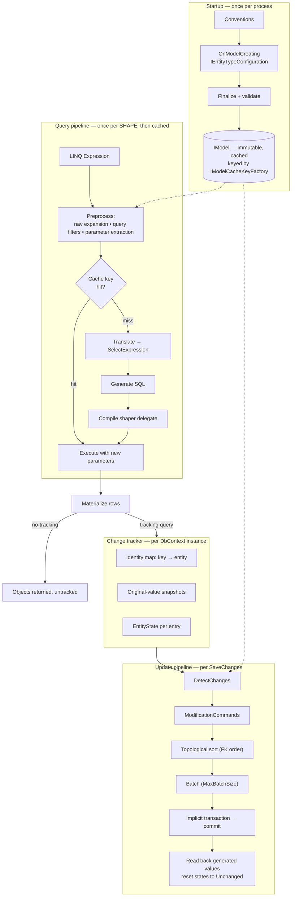
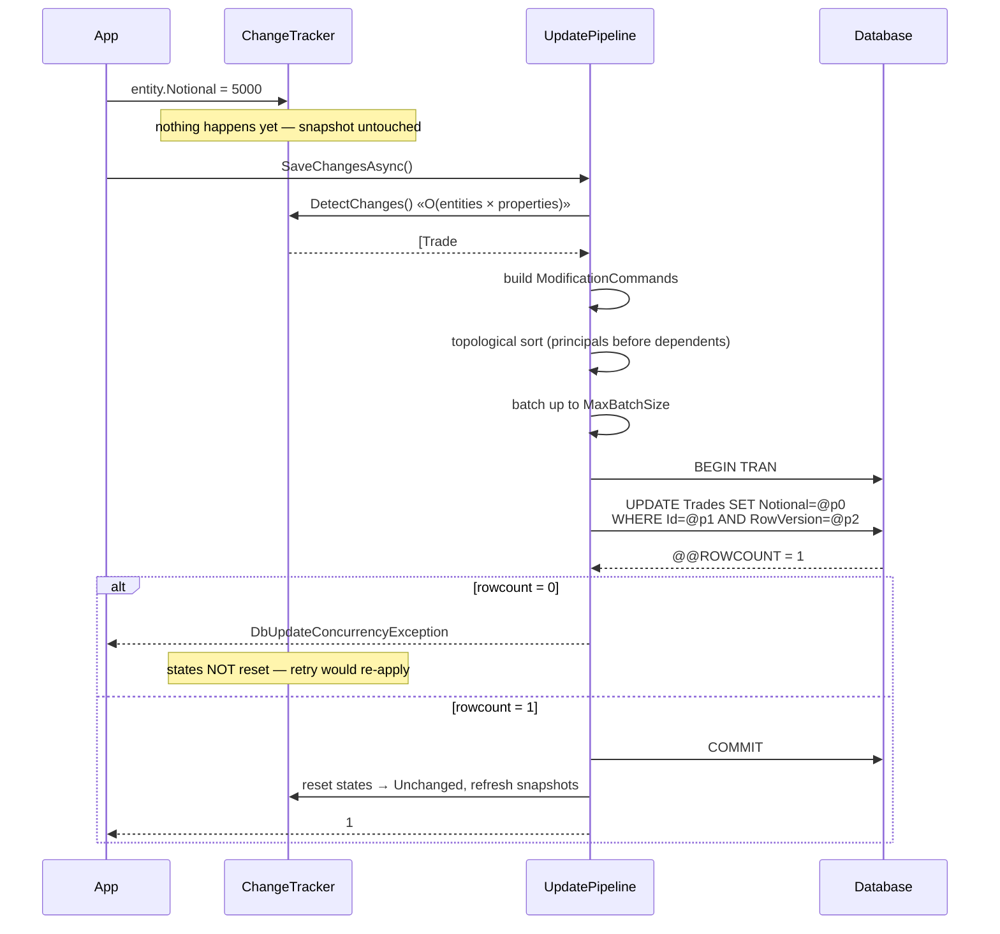

# Module 189 — LINQ & EF Core: EF Core Internals — DbContext Lifetime, Model Building, the Query Pipeline, Change Tracking & SaveChanges

> Domain: LINQ & EF Core | Level: Beginner → Expert | Prerequisite: [[01-LINQ-DeepDive-ExecutionEngines-ExpressionTrees-AllocationPerformance-PLINQ]] (expression trees, `IQueryable` translation, closure capture → SQL parameters, the where/when-is-it-executing discipline — assumed throughout and not re-derived), [[../01-CSharp/05-LINQ-Internals]] (deferred execution, client evaluation), [[../02-DotNet-AspNetCore/02-DI-Container-Internals]] (scoped lifetimes, captive dependencies — the root cause of half of all `DbContext` bugs), [[../04-SQL-Server/02-Transactions-Isolation-Locking]] (isolation levels, locking — what `SaveChanges` actually does to your database), [[../04-SQL-Server/01-Indexing-Query-Execution-Plans]] (plans, parameterization, sniffing), [[../31-Domain-Driven-Design/02-TacticalDDD-Entities-ValueObjects-Aggregates]] (aggregates and value objects — what the mapping layer is being asked to persist)
>
> **Scope note:** Second module of `56-LINQ-EFCore`. This module is the **mechanism**: what EF Core builds at startup, what it does to a LINQ tree, how it decides an entity changed, and what `SaveChanges` emits. Module 190 is the **practice**: performance, concurrency, transactions, bulk work, testing and migrations in production. The split is deliberate — most EF Core problems in production are misdiagnosed because the engineer has a folk model of the internals, so the internals come first.
>
> **Accuracy caveat, stated once:** EF Core changes materially every release. Batch sizes, translation capability, `GROUP BY` support, JSON/complex-type mapping, `ExecuteUpdate`/`ExecuteDelete` semantics and compiled-model tooling have all moved between EF Core 6, 7, 8, 9 and 10. Specific numbers and capabilities below are given because the reasoning depends on them; verify against the provider and EF version you actually ship, and confirm behaviour by reading the generated SQL rather than by trusting any document — including this one.

---

## 1. Fundamentals

**What:** EF Core is an object-relational mapper composed of four largely independent subsystems that share one thing — the **model**:

1. **The model** — an immutable, in-memory description of your entity types, their properties, keys, relationships, and how each maps to database objects. Built once per application, cached, and treated as read-only thereafter.
2. **The query pipeline** — takes a LINQ expression tree, rewrites it, translates the translatable part into a provider-specific SQL tree, generates SQL text plus parameters, and compiles a *shaper* delegate that turns a `DbDataReader` row into objects.
3. **The change tracker** — a per-`DbContext` graph of tracked entities with their original values, used to compute what changed.
4. **The update pipeline** — turns the change tracker's verdict into ordered, batched `INSERT`/`UPDATE`/`DELETE` commands inside a transaction.

**Why:** The value proposition is not "you don't write SQL" — a micro-ORM gives you that with less machinery. It is that **the mapping between objects and rows exists in one place, declaratively, so cross-cutting rules can be enforced there**: tenant filters, soft delete, auditing, concurrency tokens, value conversions. In a regulated estate that central enforcement point is worth more than any productivity gain, for the reason Module 174 §15 argued — a rule that lives in every engineer's memory does not hold at scale.

**When:** EF Core is the right default for **transactional, aggregate-shaped work**: load a graph, change it, save it, with optimistic concurrency and an audit trail. It is a poor fit for set-based bulk operations (millions of rows), for reporting aggregations over large tables, for recursive/hierarchical queries, and for anything where the SQL is the artifact you actually care about. Those are not EF Core failures; they are workloads it does not model. Module 174 §15's recommendation — EF Core by default, governed raw SQL by exception — follows directly.

**How (30,000-ft view):** At startup, EF Core builds the model by running conventions over your CLR types, then your `OnModelCreating` overrides, then finalizes and caches it. At query time, your LINQ tree is normalized, navigations are expanded into joins, captured closure values are extracted as parameters, and the resulting *cache key* is looked up. On a miss, the tree is translated to a `SelectExpression`, then to SQL, and a shaper is compiled; on a hit, only the parameters differ and the cached plan is reused. Results are materialized, and if the query is tracking, each entity is put into the change tracker with a snapshot of its original values. Later, `SaveChanges` compares current values to snapshots, sorts the resulting commands so foreign keys are satisfied, batches them, and executes them in one transaction.

---

## 2. Deep Dive

### 2.1 `DbContext` is three things at once, and conflating them causes most bugs

A `DbContext` simultaneously is:

- a **Unit of Work** — it accumulates changes and commits them together;
- an **Identity Map** — within one context, one database row maps to exactly one object instance;
- a **connection/transaction scope** — it owns (or borrows) the `DbConnection` and the ambient transaction.

Three consequences follow, and they explain a large share of production EF Core incidents:

**It is not thread-safe, and it does not pretend to be.** Concurrent use throws `InvalidOperationException: A second operation was started on this context instance before a previous operation completed`. In .NET this most often happens through a **missing `await`** or a `Task.WhenAll` over several queries on the same context — a pattern that looks like a sensible parallelization and is a data race. The correct fix is either sequential awaits or **one context per parallel operation** (obtained from `IDbContextFactory<T>`), never a lock around the context.

**It is a short-lived object with long-lived-looking ergonomics.** The change tracker grows monotonically with every tracked entity it sees; nothing is evicted. A context held for the life of a background service becomes an unbounded cache — a slow memory leak *and* a correctness hazard, because the identity map keeps returning stale instances loaded hours ago. The rule: **one context per unit of work** — per HTTP request, per message handled, per batch chunk.

**The identity map is "first instance wins."** If an entity with key 42 is already tracked, a later query returning row 42 does **not** overwrite the tracked instance's property values by default; you get the instance you already had, with your in-flight modifications intact. This is deliberate — it protects unsaved changes — and it surprises people who expect a query to refresh. To genuinely re-read, use `Reload()`, a no-tracking query, or a fresh context.

**Lifetime in DI.** `AddDbContext` registers it **scoped** by default. The classic failure is a **captive dependency**: injecting a scoped `DbContext` into a singleton, which pins one context for the process lifetime and produces exactly the unbounded-tracker and cross-request-contamination problems above. .NET's DI validates this at startup in development (`ValidateScopes`) and this is one of the strongest arguments for leaving that validation on.

### 2.2 `DbContext` pooling: what it does and the state it does not reset

`AddDbContextPool<T>` keeps a pool of context instances and **resets** rather than reconstructs them. The saving is real but narrower than most people assume: it avoids re-running the context's constructor work and re-resolving internal services, which matters on high-throughput APIs where context construction was measured to be a nontrivial fraction of request cost. It does **not** pool connections (ADO.NET already does that, and that is the bigger win) and it does **not** cache the model (the model is cached anyway).

The dangerous part is what "reset" covers. EF Core resets what it knows about — the change tracker, the query cache key state, the `ChangeTracker` events it owns. It cannot reset **your** fields. A pooled context with a custom constructor parameter (`_tenantId`, `_userId`, an `ILogger` scoped to a request) will be handed to the *next* request with the previous request's value still in place unless you implement `IResettableService` or use the `AddDbContextPool` overload that supports scoped state injection. **A tenant ID captured in a pooled context field is a cross-tenant data leak**, and it is silent — the query runs, returns rows, and nothing errors. This is one of the few EF Core misconfigurations that is a security incident rather than a performance one.

Rule of thumb: pool only contexts with no mutable instance state of your own, or explicitly implement the reset contract, and cover it with a test that asserts the field is null on a freshly-rented context.

### 2.3 Model building: conventions, the model cache, and startup cost

Model construction runs in three phases:

1. **Conventions** — a long list of built-in rules infer keys (`Id`, `<Type>Id`), relationships from navigation properties, foreign keys, required/optional from nullability, table and column names, and inheritance. Conventions are pluggable (`IModelCustomizer`, convention APIs in EF Core 7+) and this is the right place to apply estate-wide rules — every `decimal` gets a precision, every string a max length, every `ITenantScoped` entity a query filter — instead of repeating configuration per entity.
2. **`OnModelCreating`** — your explicit configuration, which overrides conventions. Best organized as `IEntityTypeConfiguration<T>` classes applied via `ApplyConfigurationsFromAssembly`, so the file layout mirrors the domain.
3. **Finalization** — validation and a freeze. The finished `IModel` is **immutable and shared across all context instances**, which is why it is safe to cache and why nothing in it may depend on per-request state.

**The model is cached by a key.** By default the key is the context type, so the model is built exactly once per process. `IModelCacheKeyFactory` lets you widen the key — the canonical use is a schema-per-tenant design where the model genuinely differs per tenant. Widen it carelessly (say, keyed on tenant ID for a thousand tenants) and you build and hold a thousand models: **a large, permanent memory cost and a startup cliff**, and one of the more obscure OOM causes in multi-tenant EF Core estates.

**Startup cost is real and measurable.** A model with hundreds of entity types can take hundreds of milliseconds to a couple of seconds to build, paid on the first query after every deploy, scale-out and cold start. This matters most in serverless and in aggressive autoscaling. **Compiled models** (`dotnet ef dbcontext optimize`) precompute the model into generated C#, cutting that to near zero — at the cost of a build step that must be re-run whenever the model changes, and with some feature limitations (historically including global query filters and lazy loading in early versions). Treat it as an optimization to reach for when startup is measured to be a problem, not a default.

### 2.4 The query pipeline, step by step

This is the part worth being able to draw. A query goes through roughly these stages:

**(1) Expression tree arrives.** `db.Trades.Where(t => t.Desk == desk).Select(t => new TradeDto(...))` is an `Expression` on an `EntityQueryable<Trade>` root.

**(2) Query preprocessing / normalization.**
- **Navigation expansion**: `t.Counterparty.Name` becomes a join; `Include(t => t.Legs)` becomes an additional join or a second query.
- **Query filter application**: global filters (`HasQueryFilter`) are injected here, which is *why* they are unavoidable for LINQ queries and *why* they do not apply to raw SQL — raw SQL never enters this pipeline.
- **Parameter extraction**: the visitor from Module 174 §2.7 finds `MemberExpression` reads over closure `ConstantExpression`s, evaluates them, and replaces them with `ParameterExpression`s named `@__desk_0`. Values that are genuine constants in the tree stay inlined.

**(3) Cache key computation.** The key is the *structure* of the preprocessed tree plus which values became parameters, plus context options that affect translation (tracking behaviour, split-query mode). This is why:
- The same query shape with different parameter values is **one** cache entry — good.
- A literal written inline (`Where(t => t.Desk == "FX")`) produces a **distinct** cache entry per literal — and if the literal is generated from user input, you get unbounded cache growth and database plan-cache pollution. EF Core 8+ gives explicit control with `EF.Constant(x)` (force inlining) and, in later versions, `EF.Parameter(x)` (force parameterization); use them deliberately, not reflexively.
- A query built with a different **structure** per call — for example, conditionally appending `Where` clauses — produces a distinct entry per shape. Usually fine (shapes are few); pathological if the shape depends on unbounded user input.

**(4) Translation.** `QueryableMethodTranslatingExpressionVisitor` walks the tree and builds a provider-agnostic relational `SelectExpression`. Anything it cannot translate raises `InvalidOperationException` — deliberately, since EF Core 3.0 (Module 174 §10 I4). Only the **final projection** may contain client-evaluated code.

**(5) SQL generation.** `QuerySqlGenerator` renders the `SelectExpression` into provider SQL with parameter placeholders.

**(6) Shaper compilation.** In parallel, EF Core builds an expression tree that reads a `DbDataReader` row and produces objects — including materialization of owned types, value conversions, and (for tracking queries) change-tracker registration and relationship fixup. This shaper is **compiled once** and cached with the query.

**(7) Execution.** The command runs; the shaper materializes rows; for tracking queries entities are entered into the change tracker with snapshots.

**The practical takeaway** is that the expensive stages (2–6) happen **once per query shape**, not once per execution, and the cheap stage (7) happens every time. That is why *dynamic query shapes are the thing to control*, and why `EF.CompileQuery` — which skips even the cache lookup — is a micro-optimization that matters only in tight loops (Module 190 §7).

### 2.5 Materialization, identity resolution and the tracking decision

For a **tracking** query, the shaper does more work per row: look up the key in the identity map; if present, return the existing instance (and, by default, do not overwrite its values); if absent, create the instance, take a **snapshot** of every mapped property's original value, register it as `Unchanged`, and perform **relationship fixup** — wiring navigation properties between entities that are now both in the map.

For a **no-tracking** query, none of that happens: no identity map, no snapshot, no fixup. The consequences are precise:

- **Memory**: a tracking query holds the entity *and* its original-values snapshot. For wide entities that roughly doubles the cost of the result set.
- **CPU**: snapshotting is per-property work at materialization and again at `DetectChanges`.
- **Duplicates**: without an identity map, a join that returns the same principal row 50 times materializes **50 distinct instances** of it. That is both memory waste and a correctness surprise if your code uses reference equality. `AsNoTrackingWithIdentityResolution` restores dedup without tracking, at the cost of maintaining the lookup.

**The decision rule:** project to a DTO for reads (then tracking is irrelevant — EF does not track non-entity types), use `AsNoTracking` when you must return entities read-only, and use tracking only when you intend to modify and save. Setting `QueryTrackingBehavior.NoTracking` as the context default and opting *in* to tracking is a defensible estate-wide standard, because the failure mode of forgetting `AsNoTracking` (silent overhead) is far more common than the failure mode of forgetting `AsTracking` (loud: nothing saves).

### 2.6 Change tracking: snapshots, `DetectChanges`, and the O(n·m) cost

The default mechanism is **snapshot change tracking**. Each tracked entity has an `InternalEntityEntry` holding original values. `DetectChanges` walks every tracked entity, compares every mapped property against its snapshot, marks differences, and also detects added/removed items in navigation collections.

Cost is **O(entities × properties)** and it is called automatically — by `SaveChanges`, `ChangeTracker.Entries()`, `ChangeTracker.HasChanges()`, and several navigation/query paths. Loading 50,000 entities into one context and calling `SaveChanges` in a loop therefore turns into a quadratic disaster: each of the 50,000 saves scans all 50,000 entities. **This is the single most common cause of "EF Core is slow" reports that are actually usage bugs**, and the fix is architectural (batch in chunks with a fresh context per chunk), not a knob.

The escape hatches, in order of preference:
1. **Track fewer entities** — no-tracking reads, DTO projections, smaller units of work. Always try this first.
2. **`ChangeTracker.AutoDetectChangesEnabled = false`** around a known-shape bulk operation, calling `DetectChanges()` manually once. Powerful and dangerous: forget to re-enable it or to call it manually, and changes silently do not save.
3. **Change-tracking proxies** (`UseChangeTrackingProxies`) — entities become runtime-generated subclasses implementing `INotifyPropertyChanged`/`INotifyPropertyChanging`, so changes are reported as they happen and `DetectChanges` becomes trivial. The price: entities must have `virtual` properties and public/protected constructors, proxy types leak into your domain, equality and serialization get complicated, and your domain model is now shaped by the persistence framework — a trade most DDD-minded teams correctly refuse.

**The `EntityState` machine** — `Detached → Added → Unchanged ⇄ Modified → Deleted → Detached` — is worth knowing precisely because disconnected scenarios (a DTO arriving over HTTP, mapped to an entity, saved) require you to set state explicitly. `Update()` marks **every** property modified, producing an `UPDATE` touching every column; `Attach()` then setting specific properties produces a narrow update. On a table with a wide row or with triggers, that difference is significant, and on a table with column-level audit it changes the audit record.

### 2.7 Value converters, comparers, and the mutable-value-object trap

**Value converters** map a CLR type to a store type: an enum to a string, a `Money` value object to a decimal, a strongly-typed ID to a `Guid`, a list to JSON. They are applied in the shaper and in parameter binding, so they are invisible to your code — which is their point and their hazard:

- **A converted column is often not usable by an index the way you expect.** Storing an enum as a string means `WHERE Status = 'Settled'`, which is fine — but converting a date to a string, or applying a converter that requires a function call in SQL, can make the predicate non-sargable and silently produce a scan.
- **Translation is limited over converted properties.** Operations EF understands for the CLR type may have no translation over the store type. A `Money` converted to `decimal` compares fine; a JSON-serialized collection cannot be `Contains`-ed server-side (until provider-specific JSON support, which is version- and provider-dependent).

**Value comparers** are the part people miss. EF Core needs to know how to (a) compare a snapshot to the current value and (b) **snapshot** it — meaning *deep-copy* it, for mutable types. Without a correct `ValueComparer`, a converted `List<string>` or a mutable value object snapshots **by reference**, so the snapshot *is* the live object, so it always compares equal, so **your change is never saved and no error is raised**. This is the archetypal silent EF Core data-loss bug. The fix is to supply a comparer with a proper deep-clone snapshot expression — or, far better, to make such value objects **immutable**, which removes the problem by construction and is the right domain modelling choice anyway.

### 2.8 `SaveChanges`: ordering, batching, and the implicit transaction

`SaveChanges` runs a defined sequence:

1. **`DetectChanges`** (unless disabled) — establish each entry's state.
2. **Value generation** — client-generated keys, `ValueGeneratedOnAdd`/`OnUpdate` sentinels, temporary key values for new entities.
3. **Command preparation** — each entry becomes a `ModificationCommand`.
4. **Topological sort** — commands are ordered so foreign-key dependencies are satisfied: principals inserted before dependents, dependents deleted before principals. A genuine cycle (mutually required FKs) cannot be ordered and throws, which is EF telling you the schema has a chicken-and-egg problem, not a bug.
5. **Batching** — consecutive commands are combined into fewer round trips. The SQL Server provider has historically defaulted to a max batch size around 42 statements, tunable with `MaxBatchSize`. Batching is disabled when it cannot be done safely — for example when a command needs to read back generated values in a way the batch form cannot express, or (historically, on SQL Server) when a table has triggers, which forces `OUTPUT INTO` workarounds or per-row commands.
6. **Transaction** — if more than one command is produced and no transaction is already ambient, EF **opens one implicitly** and commits it. So `SaveChanges` is atomic by default. It is *not* atomic across multiple `SaveChanges` calls, which is the boundary people get wrong.
7. **Post-save fixup** — generated keys and computed values are read back and applied to the tracked entities; states reset to `Unchanged`.

Two facts to have ready in an interview: **`SaveChanges` is atomic, one call = one transaction**; and **an exception mid-save leaves the change tracker unchanged** — entity states are *not* reset, so a retry after a transient failure will attempt the same work again, which is why naive retry-plus-`SaveChanges` loops can double-apply if the first attempt actually committed but the acknowledgement was lost. Module 190 §2 handles idempotency properly.

### 2.9 Concurrency tokens: how optimistic concurrency is actually implemented

Mark a property `IsConcurrencyToken()` (or use a `rowversion`/`xmin` with `IsRowVersion()`), and EF Core adds it to the **`WHERE` clause of every `UPDATE` and `DELETE`** for that entity, then checks the affected-row count. Zero rows affected means somebody else changed it, and EF throws `DbUpdateConcurrencyException`.

That is the entire mechanism, and its simplicity carries the important properties: it requires no locks, so it does not hurt read concurrency; it detects conflicts only at write time, so a long think-time edit fails at the end rather than blocking others throughout; and it depends on the **row** changing, so it detects "someone touched this row" rather than "someone touched the field I care about" — which is why a `rowversion` gives you strict last-write-detection while a single-column token gives you field-level granularity. In a ledger or limits system, the token is not optional: it is the mechanism that prevents lost updates when two operators adjust the same limit simultaneously, and its absence is a genuine audit finding, not a nicety.

Resolution is your job. `DbUpdateConcurrencyException` exposes the entries; you choose store-wins (reload and re-apply), client-wins (overwrite original values with database values and save again), or — usually correct in finance — **fail the operation and tell the user**, because silently merging two people's changes to a credit limit is worse than asking one of them to redo it.

### 2.10 Migrations: the model snapshot and what actually drives the diff

`Add-Migration` does **not** diff your code against the database. It diffs the current model (built from your code) against `ModelSnapshot.cs` — a generated file representing the model as of the last migration. Three consequences:

- **The snapshot file is the source of truth for the diff and must be committed.** Merge conflicts in it are common on parallel branches, and resolving them by hand-editing is how a migration silently loses a column. The safe resolution is to take one side, re-run `Add-Migration`, and regenerate.
- **Drift between the database and the snapshot is invisible** to EF. A hotfix applied directly to production means the next migration generates a diff from a state that no longer exists. Detecting drift needs an external check (schema compare in CI against a restored production schema).
- **`__EFMigrationsHistory`** records applied migration IDs; that is the only thing EF consults to decide what to apply.

**`context.Database.Migrate()` at startup is an anti-pattern in any multi-instance deployment.** Several instances starting simultaneously race to apply the same migration, and EF's history table is not a distributed lock in every provider/version combination. Worse, it couples schema change to deployment, so a rollback of the app does not roll back the schema. The production pattern is: generate idempotent SQL scripts or a **migration bundle** (a self-contained executable, EF Core 6+), apply them as an explicit, reviewed, audited pipeline step under change control, and design every migration to be **backward-compatible** with the currently-running app version so deploys and rollbacks are safe (expand → migrate → contract). In a SOX-governed estate, a schema change that can only be applied by starting an application is not an auditable change process.

---

## 3. Visual Architecture

### 3.1 The four subsystems and the model they share



### 3.2 What one query costs, first time versus every time

```
FIRST EXECUTION OF A SHAPE                 SUBSEQUENT EXECUTIONS (same shape)
--------------------------                 ----------------------------------
 preprocess tree        ~100s of µs         cache key computation      ~µs
 translate              ~100s of µs         parameter binding          ~µs
 generate SQL           ~10s of µs          ─────────────────────────
 compile shaper         ~100s of µs–ms      execute + materialize      dominates
 ────────────────────                       track (if tracking)        per-entity
 execute + materialize                      
                                            
 ⇒ shape churn (a distinct shape per call) pays the LEFT column every time.
 ⇒ that is the real cost of building queries out of unbounded user input.
```

### 3.3 The identity map and relationship fixup

```
Query 1: db.Trades.Where(t => t.Id == 42).Include(t => t.Legs)

  ┌─ Identity map (this DbContext only) ─────────────────┐
  │  (Trade, 42)  → Trade#a1   [Unchanged] snapshot{...} │
  │  (Leg,  100)  → Leg#b1     [Unchanged] snapshot{...} │
  │  (Leg,  101)  → Leg#b2     [Unchanged] snapshot{...} │
  └──────────────────────────────────────────────────────┘
        │ fixup wires navigations automatically
        ▼
   Trade#a1.Legs == [ Leg#b1, Leg#b2 ]     Leg#b1.Trade == Trade#a1

Query 2: db.Trades.Where(t => t.Desk == "FX")   ← also returns row 42
  ⇒ returns the SAME Trade#a1 instance.
  ⇒ its property values are NOT refreshed from the database (first-wins).
  ⇒ if you had modified it, your modification survives. This is deliberate.

Same two queries with AsNoTracking():
  ⇒ two DIFFERENT Trade objects for row 42, no fixup, no snapshots.
```

### 3.4 `SaveChanges` sequence



---

## 4. Production Example

### Scenario — a card-authorization service whose latency doubled after a "harmless" audit feature

**Problem.** A payments processor's authorization service handles ~3,000 authorizations/second at a P99 of 45 ms, with a hard 150 ms timeout imposed by the card network — exceed it and the transaction is declined by the network, which is a revenue event, not just a latency event.

A compliance requirement landed: every authorization decision must record which risk rules fired, for a 7-year audit trail. The team added an `AuthorizationAudit` entity written in the same `SaveChanges` as the authorization. In load testing at 1,000 TPS, latency was unchanged. In production at 3,000 TPS, P99 went to 190 ms and the decline rate rose measurably. Rollback was immediate; the investigation took two days.

**Architecture.** ASP.NET Core service → EF Core (SQL Server, Always On availability group, synchronous-commit secondary) → authorization tables. Contexts are DI-scoped, one per request.

**The offending code:**
```csharp
public async Task<AuthResult> AuthorizeAsync(AuthRequest req, CancellationToken ct)
{
    var card    = await _db.Cards.FirstAsync(c => c.Token == req.CardToken, ct);
    var account = await _db.Accounts.Include(a => a.Limits)
                                    .FirstAsync(a => a.Id == card.AccountId, ct);

    // Risk evaluation loads recent history to score velocity.
    var recent = await _db.Authorizations
        .Where(a => a.AccountId == account.Id && a.CreatedUtc > DateTime.UtcNow.AddHours(-24))
        .ToListAsync(ct);                                     // (1) tracked, ~400–900 rows

    var decision = _risk.Evaluate(req, account, recent);      // (2) fires ~40 rules

    _db.Authorizations.Add(new Authorization { /* … */ });
    foreach (var rule in decision.FiredRules)                 // (3) NEW: 1 row per fired rule
        _db.AuthorizationAudits.Add(new AuthorizationAudit { /* … */ });

    await _db.SaveChangesAsync(ct);                           // (4)
    return decision.ToResult();
}
```

**Investigation.**

Application traces showed the added time was inside `SaveChangesAsync`, not in the new inserts' database time. SQL Server's `sys.dm_exec_requests` showed the batch executing in ~4 ms; the client-side span was ~110 ms. **The time was being spent in the client, before the command was sent.**

`dotnet-counters` showed CPU up sharply with no allocation-rate change proportional to it. A CPU profile put ~60% of `SaveChangesAsync` in `DetectChanges` and its property-comparison helpers.

**Root cause.** Three things compounded, and the third was the trigger:

1. **Line (1) loaded ~400–900 `Authorization` entities as *tracked*.** Nobody had noticed, because before the audit feature `SaveChanges` had one `Added` entity and `DetectChanges` over ~900 unchanged entities cost a few milliseconds — inside the noise.
2. **`Authorization` is a wide entity** (~60 mapped properties, several with value converters). `DetectChanges` cost is O(entities × properties), so ~900 × 60 ≈ 54,000 comparisons per save, several of which invoked conversion logic.
3. **The audit feature added up to 40 more tracked entities *and* a second `DetectChanges` trigger** — the code called `ChangeTracker.Entries()` in an audit-enrichment interceptor, which itself forces `DetectChanges`. So the expensive scan ran **twice** per request.

Load testing missed it because the test dataset had ~30 recent authorizations per synthetic account, not 400–900. **The defect scaled with data shape, not with request rate**, and the load test controlled the wrong variable.

**Implementation of the fix.**

```csharp
public async Task<AuthResult> AuthorizeAsync(AuthRequest req, CancellationToken ct)
{
    var card    = await _db.Cards.AsNoTracking()
                     .FirstAsync(c => c.Token == req.CardToken, ct);

    var account = await _db.Accounts.AsNoTracking()
                     .Include(a => a.Limits)
                     .FirstAsync(a => a.Id == card.AccountId, ct);

    var cutoff = DateTime.UtcNow.AddHours(-24);
    // Project to exactly the fields the risk engine needs: no tracking, no snapshots,
    // ~6 columns instead of ~60, and the DB returns far less data.
    var recent = await _db.Authorizations
        .AsNoTracking()
        .Where(a => a.AccountId == account.Id && a.CreatedUtc > cutoff)
        .Select(a => new VelocityFact(a.AmountMinor, a.MerchantCategory,
                                      a.CreatedUtc, a.Approved))
        .ToListAsync(ct);

    var decision = _risk.Evaluate(req, account, recent);

    // Only NEW entities are ever tracked in this context.
    _db.Authorizations.Add(auth);
    _db.AuthorizationAudits.AddRange(decision.FiredRules.Select(r => r.ToAudit(auth)));

    await _db.SaveChangesAsync(ct);
    return decision.ToResult();
}
```

Plus three supporting changes: the audit interceptor was rewritten to use the entries it was already given rather than re-querying `ChangeTracker.Entries()`; `QueryTrackingBehavior.NoTracking` was made the context default so tracking is opt-in; and the load-test fixture was rebuilt from a production data-shape profile.

**Results.** P99 returned to 47 ms — with the audit feature enabled. `DetectChanges` fell out of the profile entirely (the tracker now holds ≤ 41 freshly-added entities with no snapshots to compare). Bytes transferred per request dropped ~85% from the projection alone.

**Trade-offs.** The projection to `VelocityFact` means the risk engine no longer receives full entities, so adding a new risk rule that needs another field now requires changing the projection — a real coupling cost, accepted deliberately and documented at the top of the file. Making `NoTracking` the default means any future write path must remember `AsTracking()`; that failure is loud (nothing saves, tests catch it) whereas the failure it prevents is silent, so the asymmetry favours the new default.

**Lessons learned.**

1. **Tracking is a cost you pay at `SaveChanges`, not at query time** — which is why it is so hard to attribute. The query looked fast; the save looked slow; the cause was in the query.
2. **`DetectChanges` cost scales with what is in the tracker, not with what you changed.** One entity modified among 900 tracked costs the same scan as 900 modified.
3. **Anything that calls `ChangeTracker.Entries()` triggers a full detect.** Audit and outbox interceptors are the usual culprits, and they are exactly the code most likely to be added later by a different team.
4. **A load test that does not reproduce production *data shape* tests the wrong system.** Rate was right; cardinality per account was wrong by an order of magnitude, and the defect lived entirely in that dimension.
## 10. Interview Questions

*Elite FinTech Interview Panel calibration. EF Core questions at this bar are rarely about API surface; they are about whether you know what the framework does on your behalf and can predict its failure modes before they happen.*

### Basic (10)

**B1. What is `DbContext`, and what patterns does it implement?**
**Ideal answer:** It is simultaneously a Unit of Work (accumulates changes, commits together), an Identity Map (one instance per key per context), and the owner of the connection/transaction scope. It is not thread-safe, it is intended to be short-lived, and in DI it is registered scoped by default.
**Why correct:** Names all three roles; each one explains a distinct class of bug.
**Common mistakes:** "It's the database connection" — it is not; the connection is opened and closed around operations.
**Follow-ups:** What breaks if you make it a singleton? → Why is it not thread-safe?

**B2. What does `DbSet<T>` represent?**
**Ideal answer:** A queryable, composable entry point for entity type `T` — an `IQueryable<T>` rooted in the provider, plus `Add`/`Remove`/`Update`/`Find` operations against the change tracker. It is not a collection; it does not hold rows.
**Why correct:** Distinguishes a query root from a materialized collection, which is the misconception behind `db.Trades.Count()` being mistaken for a cheap property read.
**Common mistakes:** Treating it as an in-memory collection; calling `.ToList()` on it habitually.
**Follow-ups:** What does `Find` do that `FirstOrDefault` does not? → When does `Find` avoid a database call entirely?

**B3. Tracking versus no-tracking queries — what's the difference?**
**Ideal answer:** A tracking query registers each materialized entity in the change tracker with a snapshot of its original values and performs relationship fixup; a no-tracking query does none of that. Tracking is required to save modifications. No-tracking is faster, uses roughly a third to half the memory, but returns duplicate instances for repeated rows unless you use `AsNoTrackingWithIdentityResolution`.
**Why correct:** Covers cost, capability and the duplicate-instance consequence.
**Common mistakes:** "No-tracking is read-only" — imprecise; you can modify the objects, they just will not be saved.
**Follow-ups:** What is the cost of tracking measured in? → What if I project to a DTO?

**B4. What happens when you call `SaveChanges`?**
**Ideal answer:** `DetectChanges` runs, entries get states, commands are built, sorted topologically so FK dependencies are satisfied, batched, and executed inside a transaction (implicit if you did not start one). Generated values are read back, snapshots refresh, and states reset to `Unchanged`. It returns the number of state entries written.
**Why correct:** It is the sequence, in order, including the implicit transaction and the post-save fixup.
**Common mistakes:** Not knowing it is transactional by default; thinking it saves in the order you called `Add`.
**Follow-ups:** Is it atomic? → What happens to entity states if it throws?

**B5. What are migrations and what drives the generated diff?**
**Ideal answer:** Migrations are versioned schema-change scripts. `Add-Migration` diffs the **current model built from your code** against `ModelSnapshot.cs` — the model as of the last migration — not against the live database. `__EFMigrationsHistory` records what has been applied.
**Why correct:** The snapshot detail is the discriminator; it explains merge conflicts and drift.
**Common mistakes:** "It compares the model to the database."
**Follow-ups:** What happens on a merge conflict in the snapshot? → How would you detect that production drifted?

**B6. What is lazy loading in EF Core and why is it usually disabled?**
**Ideal answer:** With proxies enabled and `virtual` navigations, accessing a navigation property issues a query on the spot. It is disabled by default and usually kept off because it turns property access into invisible I/O — an N+1 waiting to happen — it fails after the context is disposed, and any serializer walking the object graph triggers a cascade of queries.
**Why correct:** Names the three distinct failure modes, including the serializer one people forget.
**Common mistakes:** Presenting it as a convenience with a performance caveat rather than an architectural hazard.
**Follow-ups:** What is the alternative? → How does `Include` differ from explicit loading?

**B7. `Include` versus projection — when do you use each?**
**Ideal answer:** `Include` loads related **entities** into the graph; it is what you want when you intend to modify the aggregate. A projection (`Select` into a DTO) fetches only the columns you need and skips tracking entirely; it is what you want for reads. Projection is usually cheaper on every axis — columns read, bytes transferred, memory, tracking cost.
**Why correct:** Ties the choice to intent (write vs read) rather than to preference.
**Common mistakes:** Using `Include` reflexively for read endpoints.
**Follow-ups:** What is cartesian explosion? → Does projection need `AsNoTracking`?

**B8. What is optimistic concurrency in EF Core and how is it implemented?**
**Ideal answer:** Mark a property as a concurrency token — typically a `rowversion`. EF adds it to the `WHERE` clause of `UPDATE`/`DELETE` and checks the affected-row count; zero rows means the row changed since you read it, and EF throws `DbUpdateConcurrencyException`. No locks are held.
**Why correct:** The affected-row-count mechanism is the answer; everything else follows from it.
**Common mistakes:** Describing pessimistic locking; not knowing EF detects it via rowcount.
**Follow-ups:** How do you resolve the exception? → What would you do in a limits system specifically?

**B9. What is the difference between `Add`, `Attach` and `Update` on a disconnected entity?**
**Ideal answer:** `Add` marks it `Added` (insert). `Attach` marks it `Unchanged` — EF assumes it matches the database, so nothing is written until you modify a property. `Update` marks **every** property `Modified`, producing an `UPDATE` that writes every column. For a partial edit, `Attach` then set the specific properties.
**Why correct:** The every-column consequence of `Update` is the point of the question.
**Common mistakes:** Using `Update` for partial edits and overwriting fields the caller never sent.
**Follow-ups:** What does that do to your audit trail? → What about the concurrency token on an attached entity?

**B10. What is the N+1 problem in EF Core?**
**Ideal answer:** One query returns N parent rows, and then something — lazy loading, a loop calling a repository, an unprojected navigation access — issues one query per parent, so N+1 round trips happen where one or two would do. It is usually invisible in development (small N, low latency) and catastrophic in production.
**Why correct:** Names the mechanism and why it escapes testing.
**Common mistakes:** Thinking `Include` always fixes it — it does, for that navigation, but can introduce cartesian explosion instead.
**Follow-ups:** How would you detect it automatically? → When is N+1 actually acceptable?

### Intermediate (10)

**I1. Walk me through the EF Core query pipeline from LINQ to results.**
**Ideal answer:** Expression tree → preprocessing (navigation expansion, global query filters injected, closure values extracted into parameters) → cache key from the tree *structure* → on miss, translate to a `SelectExpression`, generate provider SQL, and compile a shaper delegate that reads a `DbDataReader` row into objects → execute → materialize → if tracking, register in the identity map with snapshots and run relationship fixup. Stages before execution happen once per **shape**; execution and materialization happen every time.
**Why correct:** Correct order, and it identifies which stages are amortized — the fact that makes shape churn the thing to control.
**Common mistakes:** Omitting parameter extraction, which is the step that explains both plan reuse and injection safety.
**Follow-ups:** What exactly is in the cache key? → Why do global filters not apply to raw SQL?

**I2. Why does `Where(t => t.Desk == desk)` produce a parameter but `Where(t => t.Desk == "FX")` produce a literal, and why does it matter?**
**Ideal answer:** A captured variable appears in the tree as a member read over a constant closure object, which EF's parameter-extraction visitor recognizes and converts to `@__desk_0`. A literal is a `ConstantExpression` with no closure, so it is inlined. It matters because parameterization gives one EF cache entry and one database plan for all values, whereas inlined literals produce an entry and a plan per distinct value — cache pollution in both EF and the database. EF Core 8+ exposes `EF.Constant`/`EF.Parameter` to override the default when you genuinely want the other behaviour.
**Why correct:** Mechanism plus the two-level caching consequence plus the escape hatches.
**Common mistakes:** Not knowing the database plan cache is also affected.
**Follow-ups:** When would you *want* a literal inlined? → How would you detect plan-cache pollution on SQL Server?

**I3. Why is `DetectChanges` sometimes the dominant cost of `SaveChanges`?**
**Ideal answer:** It is O(tracked entities × mapped properties) and it runs regardless of how much you changed. Tracking 900 wide entities and modifying one costs the same scan as modifying all 900. It is also triggered implicitly by `ChangeTracker.Entries()`, `HasChanges()` and several other paths, so an audit interceptor can double the cost without appearing to. The fix is to track fewer entities — no-tracking reads, DTO projections, smaller units of work — not to disable detection.
**Why correct:** Complexity, the implicit triggers, and the correct fix ordering.
**Common mistakes:** Jumping straight to `AutoDetectChangesEnabled = false`, which is a footgun that silently loses changes.
**Follow-ups:** What are the risks of disabling auto-detect? → What do change-tracking proxies cost you?

**I4. What is cartesian explosion and how do you avoid it?**
**Ideal answer:** `Include`ing two or more **collection** navigations produces a single SQL join whose row count is the product of the collections — one trade with 10 legs and 20 fees yields 200 rows, each repeating the trade's columns. Transfer and materialization cost blow up superlinearly even though the logical data is small. Fixes: `AsSplitQuery()` (one query per collection, joined client-side by EF), projection to a DTO shaped as you actually need it, or loading the collections separately on purpose.
**Why correct:** Explains the multiplication and gives three distinct fixes.
**Common mistakes:** Thinking the problem is join *cost* in the database rather than row duplication on the wire.
**Follow-ups:** What does split query give up? → When is a single query still better?

**I5. What does `AsSplitQuery` trade away?**
**Ideal answer:** Consistency. The split queries run as separate statements, so under a non-snapshot isolation level another transaction can commit between them and you can materialize an inconsistent graph — a trade with legs from before an update and fees from after. It also uses more round trips. The mitigations are running them inside a transaction with an appropriate isolation level (snapshot/serializable), or accepting the risk where the data is effectively immutable. Split query also **requires a stable order** to correlate correctly, so EF adds ordering — which can change the plan.
**Why correct:** Names the consistency hazard, which most candidates miss entirely, plus round trips and ordering.
**Common mistakes:** Presenting split query as strictly better than single query.
**Follow-ups:** How would you make it consistent? → Would you set it as the global default?

**I6. Explain value converters and value comparers, and the bug that comes from omitting a comparer.**
**Ideal answer:** A converter maps a CLR type to a store type (enum→string, value object→decimal, list→JSON). A comparer tells EF how to compare and — critically — how to **snapshot** the value. For a mutable type without a proper comparer, the snapshot is taken by reference, so the snapshot and the current value are the same object, so they always compare equal, so **the change is never detected and never saved**, with no exception. The robust fix is immutable value objects; the mechanical fix is a `ValueComparer` with a deep-clone snapshot expression.
**Why correct:** Identifies the silent data-loss failure and prefers the design fix over the mechanical one.
**Common mistakes:** Knowing converters but not comparers; assuming EF would throw.
**Follow-ups:** What does a converted column do to index usage? → How would you test for this bug?

**I7. Why should you not call `Database.Migrate()` at application startup?**
**Ideal answer:** Multiple instances start simultaneously and race to apply the same migration; schema change becomes coupled to deployment, so rolling back the application does not roll back the schema; there is no separate review or approval of the DDL; and the application identity then needs DDL permissions permanently, which is a privilege-escalation path from any SQL injection. The production pattern is idempotent scripts or a migration bundle applied as an explicit pipeline step with change control, plus backward-compatible migrations so old and new app versions coexist during a rolling deploy.
**Why correct:** Four distinct reasons — concurrency, rollback, governance, least privilege — plus the correct alternative.
**Common mistakes:** Citing only the race condition.
**Follow-ups:** What is expand-migrate-contract? → What permissions should the runtime identity have?

**I8. What does `DbContext` pooling actually pool, and what is the risk?**
**Ideal answer:** It pools context *instances*, resetting rather than reconstructing them — saving constructor and internal-service-resolution work on high-throughput APIs. It does not pool connections (ADO.NET does) or the model (already cached). The risk is that EF can only reset state it owns: your own mutable fields — a captured tenant ID, user ID, or request-scoped logger — survive into the next request. A leaked tenant ID in a pooled context is a **cross-tenant data leak** and it is silent.
**Why correct:** Correctly scopes the benefit and identifies the security consequence rather than a performance one.
**Common mistakes:** "It pools connections."
**Follow-ups:** How do you inject per-request state safely? → How would you test for it?

**I9. Why can't you run two queries concurrently on one `DbContext`?**
**Ideal answer:** The context has a single internal state machine and a single connection/command scope; concurrent operations would corrupt the change tracker and interleave on the reader. EF detects it and throws `InvalidOperationException: A second operation was started on this context…`. It usually arrives via a missing `await` or a `Task.WhenAll` over multiple queries. The fix is sequential awaits, or one context per parallel branch from `IDbContextFactory<T>` — never a lock.
**Why correct:** Explains why the restriction exists and gives the correct fix, including why locking is wrong (it serializes without fixing the design and holds a connection longer).
**Common mistakes:** Proposing a `SemaphoreSlim` around the context.
**Follow-ups:** How would you parallelize five independent queries properly? → What does that do to your connection pool?

**I10. How do global query filters work, and where do they not apply?**
**Ideal answer:** `HasQueryFilter` attaches a predicate to an entity type; the preprocessing stage injects it into every LINQ query rooted at that entity, including inside `Include`s. It does **not** apply to raw SQL, and `Find()` can return a filtered-out entity if it is already in the identity map. `IgnoreQueryFilters()` disables it deliberately. Because the filter fails **open** — a missing filter returns more rows rather than erroring — it must be backed by tests, an audit of `IgnoreQueryFilters` call sites, and for sensitive data a database-level control such as row-level security.
**Why correct:** Names the holes and the fail-open property, which is what makes it a security discussion rather than a feature description.
**Common mistakes:** Treating global filters as an airtight isolation boundary.
**Follow-ups:** How do you apply a filter to every entity implementing an interface? → How does a filter on a required navigation change your joins?

### Advanced (10)

**A1. A save takes 400 ms; the database says the batch took 4 ms. Diagnose.**
**Ideal answer:** The time is client-side, before or after the command. In order of likelihood: `DetectChanges` over a large tracker (§2.6) — check `ChangeTracker.Entries().Count()` and entity width; an interceptor or audit hook that itself triggers `DetectChanges` (so it runs twice); materialization of a large result earlier in the same context inflating the tracker; value-converter work during snapshot comparison; or connection acquisition delay from pool exhaustion, which shows as time before the command rather than after. Instrument with an `IDbCommandInterceptor` measuring command time versus a stopwatch around `SaveChangesAsync` — the gap is the client-side cost, and that single measurement usually ends the investigation.
**Why correct:** Isolates client versus server cost first, then enumerates the client-side causes in likelihood order with a concrete measurement.
**Common mistakes:** Assuming a slow save means a slow database; adding indexes that change nothing.
**Follow-ups:** How do you confirm the tracker is the cause without a profiler? → How would you prevent this recurring?

**A2. Design tenant isolation for a 600-tenant payments platform on EF Core.**
**Ideal answer:** Default to a shared database with a tenant column, isolated by a global query filter applied through a **convention** over every entity implementing `ITenantScoped`, sourced from a request-scoped tenant accessor. Then make it trustworthy, because the filter fails open: an architecture test asserting every `ITenantScoped` entity has a filter; an audited allow-list of `IgnoreQueryFilters()` call sites; a `SaveChanges` interceptor that *validates* the tenant ID on every added/modified entity, because query filters protect reads but nothing stops a write with the wrong tenant ID; and row-level security at the database as defence in depth. Do **not** pool the context unless per-request tenant state is injected through the supported mechanism (§2.2). Offer database-per-tenant as a tier for the largest or most regulated clients, designed in from the start — the connection-acquisition abstraction must support it on day one, because retrofitting means touching every call site. Note the pool fragmentation cost: pools are per connection string, so 600 databases means 600 pools.
**Why correct:** Covers reads *and* writes (the write path is the gap most candidates miss), enforcement, defence in depth, and the hybrid tier with its real cost.
**Common mistakes:** Query filters alone; forgetting that nothing validates the tenant ID on insert.
**Follow-ups:** How does a cross-tenant admin query work safely? → What breaks when a tenant moves from shared to dedicated?

**A3. How would you implement an audit trail that cannot be bypassed?**
**Ideal answer:** An `ISaveChangesInterceptor` (or `SavingChanges` override) that walks `ChangeTracker.Entries()` for `Added`/`Modified`/`Deleted` entries of auditable types, captures original and current values for changed properties, and appends audit rows **to the same unit of work** so they commit atomically with the change. Capture the actor from an ambient accessor, not from a parameter that can be omitted. The gaps to state honestly: raw SQL and `ExecuteUpdate`/`ExecuteDelete` bypass the change tracker entirely and therefore bypass this — so either ban them for auditable entities by convention and test, or add database triggers/temporal tables as the backstop. Note also that walking `Entries()` forces `DetectChanges`, so reuse the entries the interceptor is handed rather than re-querying (the §4 mistake).
**Why correct:** Atomicity, actor provenance, the honest enumeration of what bypasses it, and the performance footgun.
**Common mistakes:** Writing audit rows in a second `SaveChanges` or a second transaction; ignoring `ExecuteUpdate`.
**Follow-ups:** Temporal tables versus application-level audit? → How do you audit a bulk operation?

**A4. Explain what happens if `SaveChanges` throws, and how to retry safely.**
**Ideal answer:** The transaction rolls back, but **the change tracker is untouched** — states remain `Added`/`Modified`, so calling `SaveChanges` again re-attempts the same work. That is safe if the failure was genuinely before commit, and dangerous if the commit succeeded and only the acknowledgement was lost, which is exactly what a network partition or a failover looks like. The correct pattern: use the provider's execution strategy (`EnableRetryOnFailure`) for transient faults, make the operation idempotent at the database level via a unique constraint on a business key (a payment reference, an idempotency key) so a duplicate insert fails loudly instead of double-applying, and for multi-`SaveChanges` units of work wrap them in the execution strategy's `ExecuteAsync` so the *whole* unit is retried — retrying part of a manual transaction is a correctness bug that EF explicitly throws about.
**Why correct:** The untouched-tracker fact, the lost-acknowledgement scenario, and the specific interaction between execution strategies and user transactions.
**Common mistakes:** Blind retry loops; not knowing EF refuses to combine a retrying strategy with a manually-started transaction.
**Follow-ups:** What does the unique constraint buy you specifically? → How do you make a payment API idempotent end to end?

**A5. Your model takes 1.8 seconds to build and you deploy 20 times a day onto 40 pods. Evaluate.**
**Ideal answer:** Quantify first: 1.8 s is paid once per process, so per deploy it is 40 × 1.8 s of *first-request* latency, landing on whichever unlucky requests arrive first. If readiness probes gate traffic properly, the user impact may be **zero**, and the correct answer is to do nothing except add a warm-up query to the readiness path so the pod does not report ready until the model is built. If it does reach users (aggressive scale-out, serverless cold starts), compiled models cut it to near zero — at the cost of a regeneration step in the build, a stale-model failure mode if someone forgets, and some feature limitations depending on version. Also ask *why* it is 1.8 s: often it is one context with 400 entity types serving six bounded contexts, and splitting it is better architecture and faster startup simultaneously.
**Why correct:** Quantifies before optimizing, identifies the free fix (readiness gating), and questions the premise — which is the senior move.
**Common mistakes:** Reaching straight for compiled models without checking whether users are affected at all.
**Follow-ups:** How does readiness gating interact with the load balancer? → What are compiled models' limitations?

**A6. When would you deliberately use `ExecuteUpdate`/`ExecuteDelete`, and what do they bypass?**
**Ideal answer:** When you need a set-based change over many rows and do not need the entities: expiring 2 million stale sessions, soft-deleting a tenant's data, backfilling a column. They emit a single `UPDATE`/`DELETE … WHERE` and never materialize anything, so they are orders of magnitude faster. What they bypass is substantial and must be stated: **the change tracker** (so tracked entities in memory become stale — you may need to reload or use a fresh context), **`SaveChanges` interceptors** (so audit and outbox logic does not run), **concurrency tokens** (no optimistic check happens), **cascade-delete configured in EF** (only database-level cascades apply), and value converters in some expressions. They also execute immediately, outside any `SaveChanges` transaction, so if you need atomicity with other changes you must open an explicit transaction.
**Why correct:** Complete bypass list — this is exactly the question where a partial answer signals a partial mental model.
**Common mistakes:** Recommending them as a general performance fix without mentioning the audit/outbox bypass, which in a regulated system is a control failure.
**Follow-ups:** How would you keep the audit trail intact? → How do you combine one with a `SaveChanges` in the same transaction?

**A7. Compare TPH, TPT and TPC inheritance mapping for a financial instrument hierarchy.**
**Ideal answer:** **TPH** (one table, discriminator column) is the default and usually right: no joins, fast queries, simple indexes — at the cost of nullable columns for subtype-specific fields, so the database cannot enforce "a bond must have a maturity date." **TPT** (a table per type, joined by key) gives clean, fully-constrained tables and is what a DBA will ask for — at the cost of a join per level on every read and a multi-table insert per write, which on a hot instrument table is a real and permanent tax. **TPC** (a table per concrete type, no shared table) gives constrained tables with no joins for single-type queries, but polymorphic queries become `UNION ALL` across all tables and identity generation must be coordinated across them. For an instrument hierarchy that is read polymorphically and constantly (pricing, risk), TPH's query simplicity usually wins, and the nullable-column weakness is mitigated with check constraints and validation in the domain model. If subtypes are queried in isolation and rarely polymorphically, TPC is the better fit.
**Why correct:** Trade-offs anchored to the actual access pattern rather than a features table, and it names the constraint-enforcement loss that matters to a bank's DBA.
**Common mistakes:** Declaring TPT "more normalized and therefore better" without pricing the joins.
**Follow-ups:** How would you enforce subtype invariants under TPH? → What happens to indexes under each?

**A8. How do you keep a `DbContext` out of a long-running operation that calls an external service?**
**Ideal answer:** Never hold a context — or worse, a transaction — across an external call. The context holds a pooled connection, and an external call's latency is unbounded and outside your control; a downstream slowdown becomes connection-pool exhaustion, which presents as database timeouts across every unrelated endpoint (§9.1). The pattern: open a context, read what you need, dispose or at least complete the unit of work, make the external call, then open a **new** context to write the result. If the read-modify-write must be consistent, use a concurrency token to detect that the world changed while you were away rather than holding a lock across the call. If the write must be atomic with a message publish, use the outbox pattern — write the message to the same transaction and publish asynchronously (Module 190 §2).
**Why correct:** Identifies pool exhaustion as the actual failure, and offers concurrency tokens and the outbox instead of long transactions.
**Common mistakes:** Wrapping the whole flow in one transaction "for consistency," which converts a slow dependency into a database-wide outage.
**Follow-ups:** What does the pool-exhaustion error message actually say? → How does the outbox change your consistency guarantee?

**A9. You inherit a codebase where every repository method returns `IQueryable<T>`. Plan the remediation.**
**Ideal answer:** Do not attempt a big-bang rewrite. First, measure the damage: find the call sites that compose onto the returned queryable and the ones that enumerate after the scope closes. Then stop the bleeding — an architecture test forbidding new `IQueryable` returns, so the problem is bounded. Then convert incrementally, prioritizing by risk: methods used across assembly boundaries first, methods used only within the persistence assembly last (they may be fine to leave). Replace with intent-revealing methods returning materialized results, or a `Specification<T>` where composability is genuinely needed (Module 174 §13). Take the opportunity to add the missing tenant/soft-delete guarantees while you are touching each method. Expect to find, and be able to justify, a handful of legitimate exceptions.
**Why correct:** Incremental, risk-ordered, with an immediate containment step — and it resists the rewrite instinct.
**Common mistakes:** Proposing a rewrite; proposing to return `IEnumerable<T>` instead, which is strictly worse (it looks safe and silently client-evaluates).
**Follow-ups:** How does the architecture test work? → What is the legitimate exception?

**A10. How would you detect N+1 queries automatically, before production?**
**Ideal answer:** Instrument rather than review. Register an `IDbCommandInterceptor` that counts commands per logical operation (per HTTP request or per message) using an ambient context, and fail the request in development/CI when the count exceeds a threshold, logging the SQL and the call site. Stamp queries with `TagWithCallSite()` so the offending line is in the SQL text. In integration tests, assert command counts explicitly for key endpoints — "this endpoint issues exactly 3 queries" is a test that catches an N+1 introduced two years later by someone who has never heard of this conversation. In production, alert on queries-per-request as a ratio metric rather than on absolute query volume, because volume alone moves with traffic and tells you nothing.
**Why correct:** Automated detection with a CI gate and a production metric, rather than "review carefully."
**Common mistakes:** Relying on code review or on spotting it in logs.
**Follow-ups:** Where does the ambient counter live? → What is an acceptable threshold?

### Expert (10)

**E1. Argue the case for and against EF Core in a core banking ledger.**
**Ideal answer:** **For:** the ledger's write path is aggregate-shaped — load an account, post entries, save atomically with a concurrency token — which is precisely EF Core's strength; the central model gives you enforceable auditing, tenant scoping and concurrency tokens; and migrations give schema change a versioned, reviewable artifact. **Against:** a ledger's non-functional requirements are unusually strict — exact decimal semantics, deterministic ordering, provable idempotency, extreme durability, and the ability to reason about *exactly* what SQL runs. EF Core's abstraction of "what SQL runs" is a genuine liability when the answer must be provable to an auditor, and its bulk/reporting weaknesses hit the ledger's read side hard. **The resolution most banks land on** is a split: EF Core for the transactional aggregate write path, where its unit-of-work and concurrency semantics are exactly right; hand-written SQL or a dedicated engine for balance computation, reporting and reconciliation. The decisive point is that a ledger is append-only by design — entries are never updated — so the change tracker's core value (detecting modifications) is largely irrelevant, which weakens the strongest argument for the ORM in the one place people most expect it to apply.
**Why correct:** Balanced, domain-specific, and lands on the non-obvious insight that append-only semantics undercut the ORM's main benefit.
**Common mistakes:** A generic ORM-versus-SQL debate with no reference to ledger semantics.
**Follow-ups:** How do you compute balances then? → Where does idempotency live?

**E2. Design the persistence layer for a system that must reproduce any historical state on demand.**
**Ideal answer:** "Current state plus an audit log" cannot reproduce history reliably, because the log is a side effect that can drift from the state it describes. Two designs actually deliver it. **Bitemporal tables**: every row carries valid-time and transaction-time ranges, updates become inserts that close the previous version, and every query carries an as-of predicate — implemented centrally as an `ExpressionVisitor`/global filter so no query can forget it, not as 200 hand-written predicates. **Event sourcing**: the events are the system of record and state is a projection; reproduction is a replay. Bitemporal is the lower-disruption choice for an existing EF Core estate and keeps SQL queryable by analysts; event sourcing is more powerful and considerably more invasive (Modules 35, 176 §15). Either way, three properties are non-negotiable: **nothing is ever destructively updated**, every write records who and when from an ambient accessor rather than a parameter, and reproduction is *tested* — a scheduled job that reconstructs a known historical figure and compares it. SQL Server temporal tables give much of the bitemporal machinery natively, with the caveat that EF Core's support and the interaction with `ExecuteUpdate` need checking per version.
**Why correct:** Rejects the naive design with a reason, offers two real options with a selection criterion, and insists reproduction be tested rather than assumed.
**Common mistakes:** "Add an audit table" — which records what the application chose to record, not what happened.
**Follow-ups:** How do you handle a schema change across a reproduction boundary? → What does a late correction look like?

**E3. EF Core generates a query whose plan is catastrophically bad because of parameter sniffing. Options?**
**Ideal answer:** Parameter sniffing means SQL Server compiled a plan for the first parameter value it saw and reuses it for wildly different selectivities — the classic case being a tenant or status column where one value matches 10 rows and another matches 10 million. Options, roughly in order: (1) fix the **data-shape** problem with a filtered index or better indexing so both plans are acceptable; (2) `EF.Constant`/literal inlining for the specific highly-skewed parameter so each value gets its own plan — deliberately trading plan-cache entries for plan quality, which is exactly the *inverse* of the usual advice and is correct here; (3) `OPTION (RECOMPILE)` via a query hint or `TagWith`-driven plan guide, paying compilation per execution for a guaranteed-appropriate plan; (4) split the query into two shapes at the application level with an explicit branch, which is honest and testable; (5) `OPTIMIZE FOR` a representative value. What you should **not** do is clear the plan cache on a schedule and call it a fix. The meta-point worth making: this is a database problem that EF Core makes slightly harder to see, not an EF Core problem — the diagnosis lives in `sys.dm_exec_query_stats` and the plan cache, not in C#.
**Why correct:** Ordered options with the counter-intuitive `EF.Constant` case explained, and correct attribution of the problem.
**Common mistakes:** Blaming the ORM; recommending recompile hints reflexively without pricing the compilation cost.
**Follow-ups:** How do you detect sniffing from DMVs? → What does `TagWithCallSite` buy the DBA here?

**E4. A migration must add a NOT NULL column to a 900-million-row table with 24×5 availability. Plan it.**
**Ideal answer:** The generated migration would be a blocking `ALTER TABLE` with a table rewrite — hours of locking, an outage. Plan it as **expand → migrate → contract** across at least three deployments: (1) add the column as **nullable** with no default (metadata-only on modern SQL Server) and deploy application code that writes it on every insert/update while tolerating nulls on read; (2) backfill in **bounded batches** with waits between them, driven by a resumable job with a recorded high-water mark, monitored for log growth, replication/AG lag and blocking, and pausable instantly; (3) once no nulls remain and the code no longer tolerates them, add the `NOT NULL` constraint — and consider `WITH NOCHECK`-style options or an online rebuild depending on the engine and edition. Every step must be independently deployable and rollback-safe, because the app version and schema version will not move together during a rolling deploy. Also: EF's generated migration must be **hand-edited or replaced** with the real script — treating scaffolded DDL as production-ready on a table this size is the actual mistake. And rehearse it against a restored production-sized copy; a plan that has not been rehearsed at scale is an estimate.
**Why correct:** Correct pattern, correct batching discipline with the right things monitored, and the crucial point that scaffolded migrations are a starting draft.
**Common mistakes:** One migration with a default value; backfilling in a single transaction.
**Follow-ups:** What do you monitor during the backfill? → How do you make the backfill resumable?

**E5. Two services share a database and both use EF Core with their own model. Assess.**
**Ideal answer:** This is the shared-database anti-pattern with an ORM on top, which makes it worse rather than better: each service's model is a *partial, private* view of the schema, so neither one's migrations know about the other's requirements, and one team's `Add-Migration` can generate a `DROP COLUMN` for a column it simply does not model. The coupling is invisible in both codebases. Short-term controls: exactly one service owns migrations for each table (ownership recorded, enforced in review); non-owners map read-only, ideally to a **view** that forms an explicit contract rather than to the base table; a CI check that fails if a non-owner's migration touches a table it does not own; and schema-compare drift detection. Long-term: separate the data, or promote one service to the owner with an API — but state honestly that this is a multi-quarter migration, not a refactor, and that the interim controls are what keeps the lights on. The deeper diagnosis: the shared database means the two services are one deployment unit that has been given two names, and every incident will demonstrate that.
**Why correct:** Names the specific ORM-amplified failure (migrations dropping unmodelled columns), gives practical interim controls, and is honest about cost.
**Common mistakes:** "Just separate the databases" with no transition plan.
**Follow-ups:** How does the view contract help versioning? → What breaks first when both teams deploy on the same day?

**E6. How do you test EF Core code properly, and what is wrong with the in-memory provider?**
**Ideal answer:** The in-memory provider is not a relational database: it enforces no foreign keys, no unique constraints beyond keys, no column types or lengths, no concurrency tokens meaningfully, and it does not translate SQL — so it silently accepts queries that will fail against the real provider, and silently client-evaluates things the real provider would reject. A green in-memory test suite is therefore compatible with a completely broken application, which is the worst possible property for a test. Microsoft's own guidance moved away from it. The right layering: **unit-test the domain with no EF at all**; **integration-test the persistence layer against the real engine** using Testcontainers (or SQLite only where you have verified the dialect gap is acceptable), with each test in a rolled-back transaction or a fresh database per class; **assert on generated SQL** with `ToQueryString()` for queries whose shape matters; and **assert command counts** for endpoints where N+1 would be a regression. In a regulated environment there is a fourth: run the actual migration scripts in CI against a restored production-shaped schema, because a migration that has never been executed is not tested.
**Why correct:** Specific enumeration of what the in-memory provider does not enforce, plus a four-layer strategy, plus migration testing.
**Common mistakes:** Defending the in-memory provider for speed; mocking `DbSet<T>`, which tests your mocks' idea of LINQ rather than EF's.
**Follow-ups:** How do you keep Testcontainers fast enough for CI? → How do you test a concurrency conflict?

**E7. What is the strongest argument *against* an ORM in a high-assurance financial system?**
**Ideal answer:** That it makes the executed behaviour *inferable* rather than *stated*. In a system where you must be able to demonstrate to an auditor exactly what happens to a payment record, the artifact that runs is generated by a library from an expression tree, and it changes when you upgrade the library — a minor version bump can alter generated SQL, and therefore plans, and therefore performance and occasionally semantics. Hand-written SQL is a reviewed, versioned artifact whose diff is meaningful. The counter-argument is equally strong: hand-written SQL across 90 services means the tenant predicate, the audit write and the concurrency check live in every engineer's memory, and at scale that guarantee does not hold — the ORM's central enforcement point is itself an audit control. **The honest resolution is that these two arguments apply to different code**: use the ORM where the guarantee you need is *uniform enforcement of cross-cutting rules*, and hand-written SQL where the guarantee you need is *exact, reviewable behaviour of one critical statement*. Then make the boundary explicit and governed rather than implicit and drifting. A candidate who can only argue one side has not run either at scale.
**Why correct:** Takes the anti-ORM argument seriously, states the strongest counter, and resolves by scope rather than by preference.
**Common mistakes:** Treating it as a tooling preference; dismissing auditability as a non-engineering concern.
**Follow-ups:** How do you manage the risk of generated SQL changing on upgrade? → What would you pin and how?

**E8. Your EF Core upgrade changes generated SQL and a critical query's plan regresses. Prevent this class of problem.**
**Ideal answer:** Accept that generated SQL is an implementation detail that *will* change, then build the safety net rather than hoping. Concretely: **snapshot tests on generated SQL** (`ToQueryString()`) for the queries that matter, so a change appears as a reviewable diff in the PR that bumps the version rather than as an incident; **performance regression tests** on those queries against a production-shaped dataset in CI; **`TagWithCallSite`** on every significant query so a DBA can attribute a regressed plan to a source line in minutes; **staged rollout** of the upgrade with query-duration monitoring per tagged query; and a rollback plan that is a deployment, not a code change. Do not attempt to freeze the generated SQL — that fights the framework. The governance point: an ORM major-version upgrade should be treated as a change to *every query in the estate*, because it is, and scheduled with the risk posture that implies rather than as routine dependency maintenance.
**Why correct:** Builds detection instead of prevention, and reframes the upgrade's actual risk surface — which is the judgement being tested.
**Common mistakes:** "Pin the version forever," which accumulates a much larger risk; snapshotting every query, which produces an unreviewable diff nobody reads.
**Follow-ups:** Which queries deserve a snapshot test? → How do you keep the production-shaped dataset current and compliant?

**E9. How would you introduce EF Core into a 15-year-old stored-procedure estate?**
**Ideal answer:** Not by migrating the procedures. Start where EF Core is strongest and the existing estate is weakest — **new** aggregate-shaped write paths and new services — and leave working procedures alone; a stored procedure that has run correctly for a decade has enormous unwritten value in its accumulated edge cases, and rewriting it into LINQ is high-risk, low-reward work. EF Core can call existing procedures (`FromSql`, `ExecuteSql`), so it can adopt them rather than replace them, which makes the coexistence period indefinite and comfortable. Establish the model, migrations and conventions for new tables only; introduce a schema-ownership boundary so EF-owned tables and procedure-owned tables are distinguishable. Expect and plan for the organizational friction, which is the real risk: DBAs lose review visibility over generated queries, and the mitigation is technical — `TagWithCallSite`, SQL snapshot tests in PRs, and inviting DBAs to review generated SQL in the same way they reviewed procedures. **Ignoring that dynamic is how these migrations fail**; it is a stakeholder problem wearing a technology costume.
**Why correct:** Incremental, respects existing value, and identifies the organizational failure mode as the dominant risk.
**Common mistakes:** A rewrite plan; treating DBA resistance as an obstacle rather than as a legitimate loss of control to be compensated.
**Follow-ups:** How do you decide when a procedure should be migrated? → What do you give the DBAs to replace procedure review?

**E10. Synthesize: what is the single most important thing to understand about EF Core?**
**Ideal answer:** **That it maintains a model of what it believes the database contains, and every serious failure is a divergence between that belief and reality.** The change tracker believes it knows original values — a mutable value object without a comparer breaks that belief, and the change silently never saves. The identity map believes one instance per row — no-tracking breaks it deliberately, `ExecuteUpdate` breaks it invisibly by changing rows the tracker still thinks it knows. The model believes it describes the schema — the migration snapshot diverges when someone hotfixes production. The query cache believes a shape maps to SQL — an upgrade changes the mapping. Once you hold that frame, the practices follow rather than needing to be memorized: keep the unit of work small so the belief has less time to go stale, read the generated SQL so you can see what the belief produced, use concurrency tokens so a divergence is *detected* rather than silently resolved, and treat anything that bypasses the tracker as something that must be reconciled explicitly. It is the same principle Module 174 §10 E10 arrived at from the LINQ side — an abstraction that hides where and when work happens will hide it at the worst moment — and the same one Modules 74–76 found in Kubernetes: **object presence is not enforced reality**.
**Why correct:** A single organizing frame that generates the practices rather than listing them, connected to the repo's recurring cross-module finding.
**Common mistakes:** A feature summary; "it's just a mapper."
**Follow-ups:** Which divergence has bitten you personally? → How would you teach this to a mid-level engineer?
