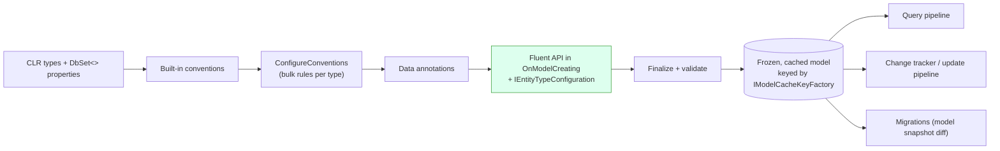
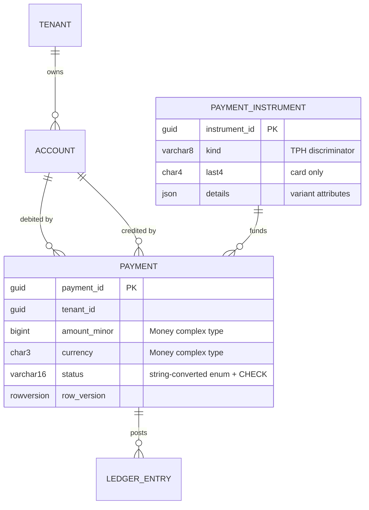
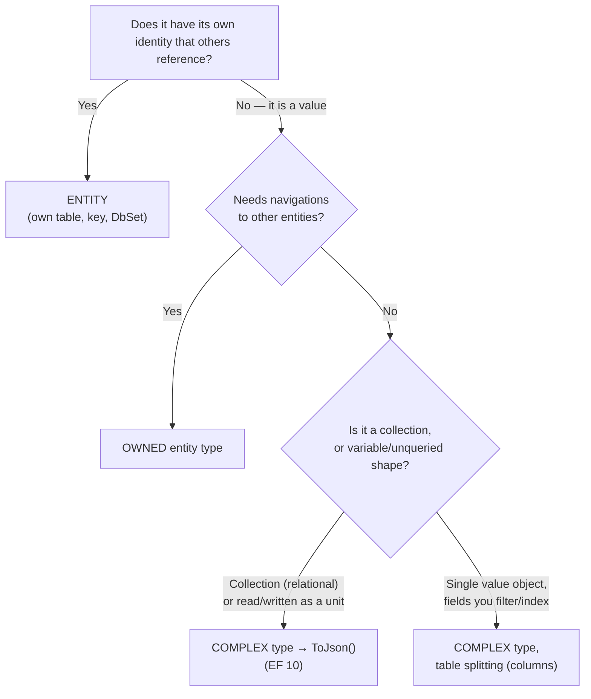
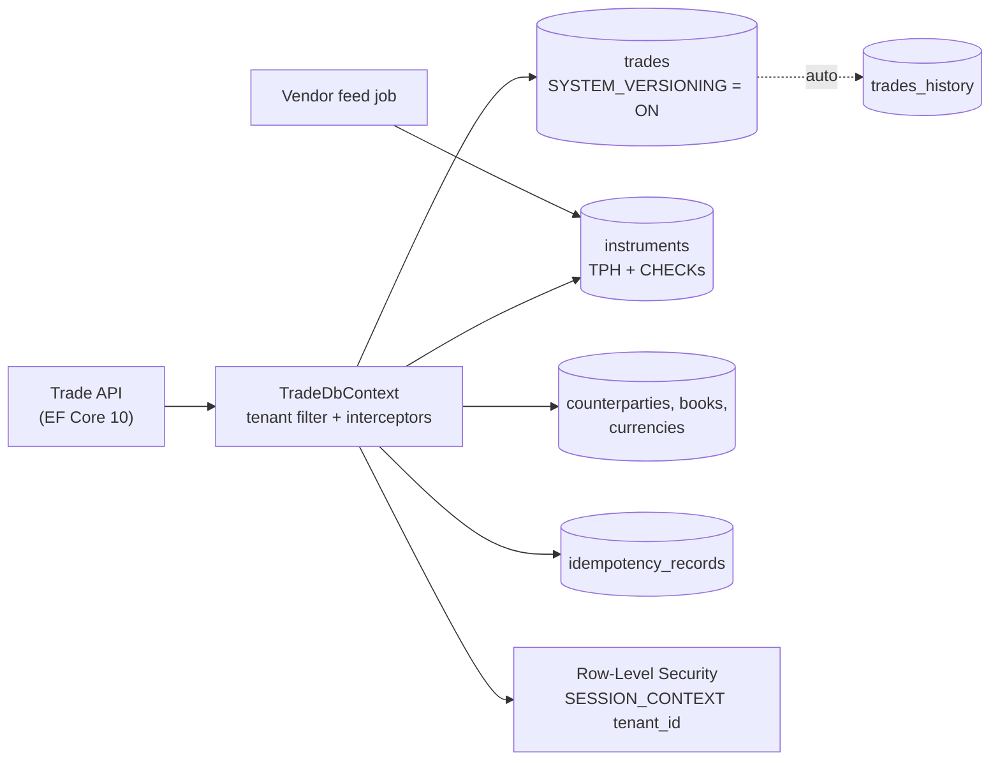

# Module 195 — LINQ & EF Core: EF Core Modeling — Conventions, Keys & Properties, Relationships, Inheritance (TPH/TPT/TPC), Owned vs Complex Types, JSON, Value Conversions, Generated Values, Query Filters & Seeding

> Domain: LINQ & EF Core | Level: Beginner → Expert | Prerequisite: [[01-EFCore-Foundations-DbContext-Lifetime-Pooling-Providers-Resilience-ReleaseStrategy]] (the `DbContext`, the cached model, per-instance state under pooling — assumed, not re-derived), [[../04-SQL-Server/12-Database-Design]] (normalisation, constraints, keys), [[../04-SQL-Server/01-Indexing-Query-Execution-Plans]] (what an index can and cannot do — §2.10 depends on it), [[../31-Domain-Driven-Design/02-TacticalDDD-Entities-ValueObjects-Aggregates]] (aggregates and value objects — what the model is being asked to persist), [[../01-CSharp/07-Records-Pattern-Matching-Immutability]] (records and `with` — the natural shape of a complex type)
>
> **Scope note:** Second of four modules in `56-LINQ-EFCore`. Module 194 covered the runtime object (`DbContext`). This module covers what that object **knows**: the **model**. Every statement here is anchored to the Microsoft Learn *Modeling*, *Complex Types*, *Global Query Filters* and *What's New (EF 8/9/10)* pages and the entityframeworktutorial.net *Conventions / Configurations / Fluent API / Relationships / Inheritance / Shadow Property* pages (coverage matrix: Module 194 §1.6). Where Microsoft Learn documents a feature as **EF Core 11** — planned for November 2026 and **not released** — this module labels it as such and does not design around it.

---

## 1. Fundamentals

### 1.1 What the model is

The **model** is EF Core's in-memory description of your domain *as it will be persisted*: which CLR types are entities, what their keys are, what each property maps to (column, type, nullability, length, precision), how entities relate (foreign keys, navigations, cascade behaviour), which are inherited from which, and which extra rules apply (filters, indexes, concurrency tokens, value conversions). It is built once per application (lazily, on first use — Module 194 §2.1), cached, and treated as read-only.

Everything EF Core does afterwards — the SQL it generates, the objects it materializes, the changes it detects, the DDL a migration emits — is derived from this one object. **If the model is wrong, everything downstream is wrong consistently.**

### 1.2 Three ways to configure it, and which wins

| Mechanism | Example | Precedence |
|---|---|---|
| **Conventions** — built-in rules that infer configuration from your CLR types | A property named `Id` or `<TypeName>Id` becomes the key; `string` → `nvarchar(max)`; a `DbSet<Payment> Payments` maps to table `Payments` | Lowest — the default |
| **Data annotations** — attributes on classes and properties | `[Key]`, `[Required]`, `[MaxLength(64)]`, `[Timestamp]`, `[Precision(19,4)]`, `[Index]` | Overrides conventions |
| **Fluent API** — code in `OnModelCreating(ModelBuilder)` | `b.Entity<Payment>().Property(p => p.Amount).HasPrecision(19, 4)` | **Highest — overrides both** |

The tutorial-site pages (*Conventions*, *Configurations*, *Fluent API*) give the same three-tier picture. The practical rule: **use conventions for the boring 90%, the Fluent API for everything that must be exactly right, and keep configuration out of the entity classes** so your domain types do not depend on `System.ComponentModel.DataAnnotations` or EF attributes. Per-entity Fluent configuration lives in `IEntityTypeConfiguration<T>` classes, loaded by `modelBuilder.ApplyConfigurationsFromAssembly(typeof(AppDbContext).Assembly)` (EF Core 9 extended this to call non-public constructors, per the release notes).

### 1.3 The conventions worth memorising (and their production defaults)

| Convention | Result | Production consequence |
|---|---|---|
| Property named `Id` / `<Type>Id` | Primary key | Composite or non-conventional keys need configuration |
| Integer key | `IDENTITY` (SQL Server) | Store-generated; insert needs a read-back (§2.2) |
| Nullable reference type (`string?`) vs non-nullable (`string`) | Optional vs **required** column | With nullable-reference-types enabled, `string Name` becomes `NOT NULL` — a silent contract |
| `string` | **`nvarchar(max)`** | Cannot be an index key; wasteful (§2.3) |
| `decimal` | **`decimal(18,2)`** with a model-validation warning | Wrong scale for money that needs 4+ decimal places or for FX rates |
| Navigation + FK property named `<NavName>Id` or `<PrincipalType>Id` | Relationship discovered | Renaming a property can silently change the relationship |
| Required relationship | `ON DELETE CASCADE` | Cascade paths can multiply (§2.5) |
| Optional relationship | `ClientSetNull` | EF nulls tracked dependents; the database does *not* (§2.5) |
| Non-nullable value type (`int`, `bool`) | Required | — |
| Complex types | **Not discovered** — must be configured explicitly | Forgetting `ComplexProperty` yields a *different* mapping (an entity), not an error |

Microsoft Learn's overview says it directly: on SQL Server, "`nvarchar(max)` and `decimal(18, 2)` are rarely the best types for columns mapped to string and decimal properties, but those are the defaults that EF uses because it doesn't have knowledge of your specific scenario." **Reading every generated migration is therefore part of modeling, not an afterthought** (Module 197).

### 1.4 Entities, keys, and properties in one paragraph

An **entity type** is a class with an identity (a key) that EF tracks and persists. A **key** uniquely identifies an instance; every entity has exactly one *primary* key (and may have *alternate* keys). A **property** is a scalar member mapped to a column. **Navigation properties** connect entities. **Shadow properties** exist in the model and database but not on the CLR class. **Keyless entity types** (`HasNoKey()`) map to views or query results and are never tracked. The tutorial's *Shadow Property* page shows `modelBuilder.Entity<Blog>().Property<DateTime>("LastUpdated")`, accessed via `EF.Property<DateTime>(blog, "LastUpdated")` in queries or `Entry(blog).Property("LastUpdated")` in code.

---

## 2. Deep Dive

*§2 is written to stand alone: each mechanism, the reasoning that selects it, the number that justifies it, the failure it introduces, and the push-back it attracts. The module's discriminating question is §2.14.*

### 2.1 The model-building lifecycle, and where each kind of rule belongs

At first use EF runs, in order: **(1)** built-in conventions over your CLR types and `DbSet<>` properties; **(2)** any **`ConfigureConventions`** rules (pre-convention configuration you apply to *all* properties of a type); **(3)** your `OnModelCreating` Fluent configuration and annotations; **(4)** finalisation and validation — the model is then frozen and cached (keyed by context type and provider through `IModelCacheKeyFactory`, which is why varying the model at run time, for example schema-per-tenant, needs a custom cache key). Validation errors (a conflicting relationship, a missing key) surface here — on the **first query or `Add` of the process**, not at startup — so a model error can reach production if no test forces model creation (assert `db.Model` in a startup test).

**Bulk rules belong in `ConfigureConventions`, not in 200 property lines:**

```csharp
protected override void ConfigureConventions(ModelConfigurationBuilder cb)
{
    cb.Properties<string>().HaveMaxLength(256);                 // stop nvarchar(max) everywhere
    cb.Properties<decimal>().HavePrecision(19, 4);              // money-safe default
    cb.Properties<DateTime>().HaveConversion<UtcDateTimeConverter>();   // Kind = Utc on read
    cb.Properties<PaymentId>().HaveConversion<PaymentIdConverter>();    // strongly-typed ids
}
```

*Push-back: "Why not just fix the defaults per property as we notice them?"* Because a default you *don't notice* ships. A convention makes the safe choice the default and forces an explicit override for the exception — the same "make the wrong thing hard" principle as Module 194's platform registration.

### 2.2 Keys — natural vs surrogate, and how each generation strategy actually behaves

| Strategy | Mechanism | Insert behaviour | Best for | Failure mode |
|---|---|---|---|---|
| **`IDENTITY`** (store-generated int/bigint) | Database assigns on insert | EF must **read the value back** (`OUTPUT INSERTED.Id`) before dependents' FKs can be filled | Simple tables | Not client-knowable before `SaveChanges`; blind retry after commit ambiguity **inserts a second row** (Module 194 §2.10) |
| **`UseHiLo`** (sequence blocks) | EF reserves a block (default increment 10) in one round trip, then assigns client-side | No read-back per row; fewer round trips; allows batching *with* known keys | High-volume inserts, graphs of new entities | Gaps in the sequence (harmless); a sequence to manage |
| **Client-generated GUID** | Application supplies the key | No read-back; key known before save; retry hits a duplicate-key error rather than a duplicate row | Idempotent APIs, distributed creation | Index fragmentation if random (see below) |
| **Natural key** (ISIN, IBAN) | Business value | Known up front | Reference data with a stable, unique identity | Natural keys change (a corrected ISIN) → cascading updates; treat as a **unique alternate key**, keep a surrogate PK |

**GUID ordering is provider-specific.** SQL Server compares `uniqueidentifier` by its **last** 6 bytes first, so a time-ordered GUID such as .NET's `Guid.CreateVersion7()` (time in the *leading* bytes) does **not** give clustered-index insert locality on SQL Server; EF's `SequentialGuidValueGenerator` (the default client-side generator for `Guid` keys on SQL Server) produces values ordered for SQL Server's comparison. On PostgreSQL (which compares `uuid` bytewise), UUIDv7 *is* index-friendly. This is a concrete instance of Module 194 §2.9's point that **the LINQ surface is portable but the semantics at the edges are not.**

**Composite and alternate keys.** In a shared multi-tenant table the natural primary key is `(TenantId, Id)`; every index then leads with `TenantId`. `HasAlternateKey` (or `HasPrincipalKey` on a relationship) lets a foreign key target a *unique non-primary* column — useful when a downstream table references an ISIN rather than the surrogate id.

**Keyless entity types** (`HasNoKey()`, usually with `ToView("vw_…")` or a raw-SQL source) are never tracked and never saved — the correct model for read-only reporting shapes (Module 196 §2.6).

**Triggers and `OUTPUT`.** When EF reads back generated values on SQL Server it uses `OUTPUT INSERTED…`, which SQL Server **forbids on a table with an enabled trigger** unless the entity type is declared with `ToTable(t => t.HasTrigger("trg_name"))` (EF Core 7+). A legacy database with audit triggers fails on the first `SaveChanges` until the trigger is declared — an error that appears at run time, not at migration time.

### 2.3 Properties — the four defaults that bite money-handling code

**Strings.** `nvarchar(max)` cannot be an index *key* column (it can be `INCLUDE`d) and SQL Server's index key limits are **900 bytes (clustered) and 1,700 bytes (non-clustered)**; an `nvarchar(450)` fits a 900-byte key. Every string you will ever filter, join or order on needs `HasMaxLength`. Also decide Unicode (`nvarchar` vs `varchar` via `IsUnicode(false)`) deliberately — a `varchar` ISIN/currency-code column halves storage and index width.

**Decimals and money.** The default `decimal(18,2)` truncates a price of `1.23456` to `1.23` — silently at the database boundary (SQL Server rounds on insert; the round-trip returns a different number). Two defensible designs, with the trade-off stated:

| Design | Column | Pros | Cons |
|---|---|---|---|
| **Minor units** | `bigint amount_minor` + `char(3) currency` | Exact integer arithmetic; no scale ambiguity; cheap to index/sum | Currencies with different minor-unit exponents (JPY 0, USD 2, BHD 3, crypto 8+) need an exponent table; every read/write converts; rates and prices with many decimals fit badly |
| **Scaled decimal** | `decimal(19,4)` (or wider for rates, e.g. `decimal(28,10)`) | Natural to read; `SUM` works in SQL | Rounding policy lives in application code; scale must be chosen per column |

Whichever you choose, model it as a **`Money` value object** (a complex type — §2.7), never as a bare `decimal`, so currency travels with amount and a `USD + EUR` add is a compile-time or constructor error.

**Dates and times.** Store instants as `datetime2` in **UTC** (or `datetimeoffset`); SQL Server `datetime` has ~3.33 ms resolution and a 1753 lower bound. EF materializes `DateTime` with `Kind = Unspecified` — a UTC value read back is not `Utc` and serialises without a `Z`. The fix is a value converter applied by convention (§2.1). `DateOnly`/`TimeOnly` are supported and are the right types for business dates (trade date, value date) that have no time zone.

**Defaults, sentinels and the `bool` trap.** `HasDefaultValue(true)` on a `bool` means "when the property is at its CLR *default* (`false`), omit it from the `INSERT` and let the database default apply" — so explicitly setting `false` is indistinguishable from "unset" and the row gets `true`. EF Core 8 added `HasSentinel(value)` to choose which CLR value means "not set"; the robust fix remains **make the property nullable** (`bool?`) or don't use a store default for a value the application always sets.

**Collation and case sensitivity.** `Contains`/`==` on strings follow the *database column's collation*: SQL Server's default is case-insensitive; PostgreSQL's is case-sensitive. The same LINQ returns different rows on different providers — the reason Microsoft's testing guidance (Module 197) warns against test doubles for string-comparison behaviour.

### 2.4 Value conversions — and the silent bug with no exception

A **value converter** transforms a property between its CLR type and the provider type on the way in and out. Built-ins cover `enum ↔ string/int`, `bool ↔ int`, `Guid ↔ string/byte[]`, `DateTime ↔ ticks`. Custom converters express **strongly-typed ids** (`PaymentId` as a `readonly record struct` wrapping a `Guid` — eliminating the "passed an account id where a payment id was expected" defect class) and value objects stored in one column.

```csharp
b.Property(p => p.Id).HasConversion(id => id.Value, v => new PaymentId(v));   // struct id ↔ Guid
b.Property(p => p.Status).HasConversion<string>().HasMaxLength(16);            // enum stored as text
```

**Enum as string vs int.** Int is compact but *reordering or inserting an enum member silently re-maps every stored row*; string is readable and stable — pair it with a `CHECK` constraint listing the legal values so the database, not just the C# enum, enforces them.

**The trap: mutable types need a `ValueComparer`.** EF detects changes by comparing the current value to a snapshot. For a `List<string>`, `string[]` or any mutable reference type behind a converter, EF's default comparison is **reference equality** — mutating the list in place (`p.Flags.Add("AML")`) leaves the reference unchanged, so EF sees **no change and emits no `UPDATE`**. There is no exception and the row silently keeps the old value. EF logs `CoreEventId.CollectionWithoutComparer` as a *warning* at model-build time — easy to miss. Two fixes: attach a `ValueComparer<T>` that compares and snapshots by content, or — since EF Core 8 — map the collection as a **primitive collection** (a JSON column) which EF compares correctly with no converter (§2.8). **§4's incident is this bug.** Treat the warning as an error: `ConfigureWarnings(w => w.Throw(CoreEventId.CollectionWithoutComparer))`.

**Server-side translation cost.** A converted property can only be compared in SQL if EF can convert the *other operand* the same way (it does for parameters). It cannot translate arbitrary methods on the converted CLR type; and a converter runs per row on the materialization path, so an expression-heavy converter on a wide result set has a real CPU cost.

### 2.5 Relationships — principal, dependent, and where the rows silently disappear

**Vocabulary.** The **principal** entity holds the key; the **dependent** holds the **foreign key (FK)**. A **navigation** is a CLR property to the related entity (reference) or entities (collection). A relationship is **required** if the FK is non-nullable (the dependent cannot exist without its principal) and **optional** if the FK is nullable.

| Shape | Configuration | Notes |
|---|---|---|
| **One-to-many** | `b.Entity<Payment>().HasOne(p => p.Account).WithMany(a => a.Payments).HasForeignKey(p => p.AccountId)` | The dependent holds the FK. The tutorial's *Configure One-to-Many Relationship* page |
| **One-to-one** | `b.Entity<Account>().HasOne(a => a.Profile).WithOne(p => p.Account).HasForeignKey<Profile>(p => p.AccountId)` | EF **cannot infer which side is dependent** — you must name the FK type. `HasForeignKey<TDependent>` is mandatory. The FK column usually also has a unique index |
| **Many-to-many** | `HasMany(p => p.Tags).WithMany(t => t.Payments)` (skip navigations; EF 5+) | EF creates a join table implicitly. Use `.UsingEntity<PaymentTag>(...)` when the link carries **payload** (who tagged, when) — an explicit join entity then becomes the right model |
| **Self-referencing** | `HasOne(c => c.Parent).WithMany(c => c.Children)` | Trees; use `HierarchyId` (§2.13) for deep path queries |
| **Shadow FK** | `HasForeignKey("AccountId")` | FK exists without a CLR property — keeps the domain type clean; queries use `EF.Property<Guid>(p, "AccountId")` |

**Delete behaviour (`OnDelete`) — the matrix that decides what a `Remove` does:**

| `DeleteBehavior` | Database `ON DELETE` | EF behaviour on tracked dependents | Default for |
|---|---|---|---|
| `Cascade` | `CASCADE` | Deletes tracked dependents | **Required** relationships |
| `ClientSetNull` | `NO ACTION` | Sets FK to null on *tracked* dependents | **Optional** relationships |
| `Restrict` | `RESTRICT`/`NO ACTION` | Throws if tracked dependents exist | — |
| `SetNull` | `SET NULL` | Sets FK to null | — |
| `NoAction`, `ClientNoAction`, `ClientCascade` | varies | varies | Special cases |

Two consequences interviewers probe. **(1)** `ClientSetNull` only nulls dependents *that EF has loaded*; untracked dependents keep the dangling FK and the database then rejects the delete — the classic "works in the unit test (everything loaded), fails in production (nothing loaded)". **(2)** SQL Server rejects a schema with **multiple cascade paths** (*"Introducing FOREIGN KEY constraint … may cause cycles or multiple cascade paths"*); the fix is `Restrict`/`NoAction` on one path — and for financial data the *correct* default is **`Restrict` everywhere**: cascading a delete through a ledger is never what a regulator wants; use soft delete or supersession (§2.11).

**Aggregate boundaries and navigations.** In DDD terms, relationships *inside* an aggregate are navigations; relationships *between* aggregates should be by **id** (`AccountId`, no `Account` navigation). EF fully supports an FK property without a navigation — this prevents accidental `Include` chains across aggregates, keeps the tracker small, and stops one aggregate's query from dragging another's rows. You then join explicitly in read queries.

**Required navigation + query filter = silently missing rows.** Microsoft Learn's worked example: `Blog` (filter: URL contains "fish") has a *required* relationship to `Post`. `db.Posts.ToListAsync()` returns **6** posts; `db.Posts.Include(p => p.Blog).ToListAsync()` returns **3** — because EF uses an `INNER JOIN` for a required navigation, and posts whose blog is filtered out vanish. Fixes: make the navigation optional (`IsRequired(false)` → `LEFT JOIN`), or put a **matching filter on both** entity types. §14 is this bug in a payments system.

### 2.6 Inheritance — TPH, TPT and TPC, chosen by query shape and integrity needs

EF Core maps a CLR hierarchy (`PaymentInstrument` → `Card`, `BankAccount`, `Wallet`) to tables in three ways. The tutorial site's *Inheritance*, *TPH*, *TPT*, *TPC* pages describe each; the trade-offs below are what a Principal defends.

| | **TPH** — table per hierarchy | **TPT** — table per type | **TPC** — table per concrete type |
|---|---|---|---|
| Tables | **One** table, a **discriminator** column, nullable columns for subclass-only fields | A base table + one table per subtype, joined on the key | One table per **concrete** type; **no base table**; each holds *all* columns |
| Enable | Default | `UseTptMappingStrategy()` | `UseTpcMappingStrategy()` (EF Core 7+) |
| Query a subtype | Filter by discriminator — fast | **JOIN** base + subtype | Direct table scan — fast |
| Query the base type | Single-table scan — fastest | JOIN of all subtypes | **`UNION ALL`** across tables |
| Integrity | Subclass columns must be nullable; enforce per-type requirements with `CHECK` constraints | Full `NOT NULL` per subtype; clean schema | Full `NOT NULL`; **cannot have an FK to the abstract base**; keys must be unique *across* tables |
| Key generation | Identity fine | Identity fine | **Not identity per table** (collisions) — EF uses a shared sequence or a GUID; verify in the generated migration |
| Adding a subtype | Additive: new nullable columns (cheap) | New table + joins | New table |
| Sparse data | Wasteful if subtypes differ a lot | None | None |

**Selection reasoning.** TPH is the default for a reason — one table, no joins, the simplest schema evolution — and is right when subtypes are *similar* and the base is queried often. TPT gives the cleanest relational schema and worst query performance (joins on every read). TPC avoids joins when you almost always query concrete types, and **its decisive limitation is that nothing can hold an enforced FK to the abstract base** — so a `Payment` that references a `PaymentInstrument` of any kind cannot be TPC. Filters can only be defined on the **root** type of a hierarchy (Microsoft Learn). Hierarchies also raise the question of whether **inheritance is the right model at all**: three types with mostly different fields are often better as separate aggregates behind an interface, or one entity with a typed JSON/complex property for the variant part (§2.14, §15).

### 2.7 Owned entity types versus complex types — the EF 8 → 10 shift

Objects saved to a database fall into three categories (Microsoft Learn): **primitives** (`int`, `Guid`), **entity types** (structured, identified by a key), and **value objects** (structured, *no* identity — `Address`, `Money`). EF Core maps value objects as **complex types** (introduced in EF Core 8, "extended substantially in later releases"). Before that, **owned entity types** were the recommendation — but owned types are *entity types behind the scenes*, with a hidden key and reference semantics.

| Aspect | **Owned entity types** | **Complex types** |
|---|---|---|
| Identity | Hidden key and identity | None; compared **by value** |
| Sharing one instance | Not allowed — `customer.BillingAddress = customer.ShippingAddress` **throws** | Allowed — properties are **copied** |
| .NET type | Reference types only | Reference **or value** types (struct — EF 10) |
| Table mapping | Own table, table splitting, or JSON | Container's table (table splitting) or JSON |
| Navigations to other entities | Allowed | **Not allowed** |
| `ExecuteUpdate` bulk update | Not supported | **Supported** |
| Discovered by convention | Via `OwnsOne`/`[Owned]` | **No — must be configured** (`ComplexProperty` or `[ComplexType]`) |

**Version map (Microsoft Learn):** complex types EF 8; **optional** (nullable) complex types, **struct** complex types, **JSON mapping** of complex types, and **complex collections (JSON only)** — EF 10 (released November 2025). **EF Core 11 (planned November 2026, not released):** complex types on TPT/TPC hierarchies, keys and indexes on complex-type properties, `EF.Functions.JsonPathExists`, and configuring a nested property by chained member access. Do not design around the EF 11 items.

Rules that follow: **complex types cannot contain navigations, cannot be a `DbSet<T>`, cannot be queried independently**; an **optional** complex type needs at least one *required* property (or a configured discriminator) so EF can tell `null` from "all-null values"; on relational providers a complex **collection** must be a JSON column. **Mutability:** a reference-type complex value shared by two properties, mutated in place, changes both — so model complex types as **immutable `record`s** and change with `with` (`customer.Address = customer.Address with { Line1 = "…" }`); EF still tracks at the *individual property* level, so only the changed column is updated (Microsoft Learn's SQL: `UPDATE [Customers] SET [Address_Line1] = @p0`).

```csharp
public readonly record struct Money(long AmountMinor, string Currency);       // value semantics, no identity
modelBuilder.Entity<Payment>(b =>
{
    b.ComplexProperty(p => p.Amount, m =>
    {
        m.Property(x => x.AmountMinor).HasColumnName("amount_minor");
        m.Property(x => x.Currency).HasColumnName("currency").HasMaxLength(3).IsFixedLength().IsUnicode(false);
    });
});
```

**Migrating owned → complex.** It is a *mapping* change, not a code rename: column names, nullability and (for JSON) the stored shape can differ. Diff the generated migration and run it against a copy of production data before adopting. Microsoft's guidance is that users mapping value objects as owned types for table splitting or JSON "are encouraged to consider switching to complex types."

*Push-back: "Why not just make Address an entity?"* Microsoft's own tip: "If several entities really should observe the same address and update together when it changes, then model the address as an *entity type* … rather than using a complex type." The test is **identity**: if two customers *sharing* an address should *both change* when it is edited, it is an entity; if each customer merely *has a copy of the same values*, it is a value object.

### 2.8 JSON columns and primitive collections — a document inside a row, with a contract

**Mechanisms.** EF Core 7 introduced JSON columns for owned types; EF 8 added **primitive collections** (`List<string>`, `int[]` map to a JSON column with no converter, and `Contains`/`Count`/indexing translate); **EF 10** maps **complex types to JSON** (`ComplexProperty(x => x.Terms, c => c.ToJson())`), supports **complex collections** (JSON only), and adopts the native **`json` data type** on **Azure SQL and SQL Server 2025** when configured with `UseAzureSql` or compatibility level ≥ 170 — translating a query such as `b.Details.Viewers > 3` to `JSON_VALUE([Details], '$.Viewers' RETURNING int) > 3` and supporting bulk `ExecuteUpdate` of individual JSON properties (using the native `.modify(...)` method).

**The surprise migration.** Microsoft Learn (EF 10): "if your EF application already uses JSON via `nvarchar` columns, these columns will be automatically changed to `json` with the first migration. You can opt out by manually setting the column type to `nvarchar(max)`, or configuring a compatibility level lower than 170." A routine EF upgrade therefore *generates a schema change you did not author* (Module 194 §2.12).

**When JSON is right, and when it is a smell.**

| Use JSON for | Do **not** use JSON for |
|---|---|
| Data read and written **as a unit**: a payment's provider response, an instrument's extension attributes, a versioned `terms` document | Fields you **filter, join, sort, aggregate or constrain**: currency, status, counterparty id |
| Genuinely variable shape (per-product attributes) | Anything needing a **foreign key** or `NOT NULL`/`CHECK` enforcement |
| Values already stored as JSON by an external system (audit payload) | Anything a regulator will query by field at scale — JSON gives you no per-field statistics, and indexing into JSON needs a JSON-index-capable engine (e.g. SQL Server 2025) or computed-column workarounds |

The rule of thumb that survives review: **JSON is for the data you'd otherwise serialise into a blob column; the moment you find yourself querying inside it in a hot path, promote that field to a real column.**

**Parameterised collections (EF 10 behaviour).** `ids.Contains(x.Id)` with an `int[]` used to translate (EF 8/9) to a single JSON-array parameter unpacked by `OPENJSON`; EF 10 defaults to **one scalar parameter per element, padded** (8 values → 10 parameters) so the database gets cardinality information without a new plan per length. Override globally with `UseParameterizedCollectionMode(ParameterTranslationMode.Constant | Parameter | MultipleParameters)` or per query with `EF.Constant(ids)`. Choose deliberately for very large lists (thousands of values): the JSON-array mode keeps SQL text constant; multiple-parameter mode risks hitting SQL Server's **2,100-parameter** ceiling.

### 2.9 Generated values, concurrency tokens, defaults, computed columns

`ValueGenerated` states *who produces the value and when*: `Never`, `OnAdd` (identity/default/sequence/client generator), `OnAddOrUpdate` (`rowversion`, computed columns updated by the database), `OnUpdate`. For anything the **database** produces, EF must read it back after the write (`OUTPUT INSERTED…`), which is why store-generated keys cost a read-back and why triggers need `HasTrigger` (§2.2).

- **Computed columns:** `HasComputedColumnSql("[AmountMinor] / 100.0", stored: true)` — persisted for indexability; EF never writes it.
- **Defaults:** `HasDefaultValueSql("SYSUTCDATETIME()")`; EF 10 lets you **name** the default constraint (`HasDefaultValueSql("GETDATE()", "DF_Post_CreatedDate")`) and adds `UseNamedDefaultConstraints()` — with the warning that "the next migration you add will rename every single default constraint in your model."
- **Sequences:** `HasSequence<long>("PaymentSeq")` + `UseSequence` — the right primitive for gap-tolerant, cross-table numbering (TPC, human-readable references).
- **Concurrency tokens:** `IsRowVersion()` (`[Timestamp]`) — database-generated on SQL Server; `IsConcurrencyToken()` (`[ConcurrencyCheck]`) — application-managed. **Modeling one is the whole of the *configuration*; using it correctly is Module 196 §2.11** (what EF emits, `DbUpdateConcurrencyException`, resolution strategies). Provider note: PostgreSQL maps a `uint` property to the `xmin` system column; SQLite has no native token.

### 2.10 Indexes and constraints — the model is also your physical design

```csharp
b.HasIndex(p => new { p.TenantId, p.CreatedAt }).IsDescending(false, true)         // tenant leads; newest-first paging
 .IncludeProperties(p => new { p.Status });                                          // covering
b.HasIndex(p => new { p.TenantId, p.IdempotencyKey }).IsUnique();                   // at-most-once (Module 194 §12)
b.HasIndex(p => new { p.TenantId, p.ExternalRef }).IsUnique().HasFilter("[DeletedAt] IS NULL");   // soft-delete-safe uniqueness
b.ToTable(t => t.HasCheckConstraint("CK_Payments_AmountPositive", "[AmountMinor] > 0"));
```

**Why each line exists.** The **tenant id leads every index** in a shared-table design so a seek is confined to one tenant's key range. **Filtered unique indexes** solve the soft-delete/uniqueness clash: a plain unique index on `ExternalRef` forbids re-creating a record whose soft-deleted predecessor still occupies the key (§4-style "duplicate key on re-registration" incidents). **Check constraints** are the database's own enforcement of invariants EF's model cannot express (`AmountMinor > 0`, per-discriminator column requirements in TPH). EF 9 added `HasFillFactor`. An index cannot be built on an `nvarchar(max)` column (§2.3). **EF Core 11 (planned, unreleased):** indexes on complex-type properties — until then, index a complex type's *columns* via the container's table.

**The model does not know your workload.** EF creates indexes for **foreign keys** automatically and nothing else; every other index is a decision you make from the query plan (`04-SQL-Server/01`). A migration that *adds an index on a 400 M-row table* blocks writers unless created online (`IsCreatedOnline()` on editions that support it) — model configuration and deployment strategy are the same conversation (Module 197).

### 2.11 Global query filters — soft delete, tenancy, and everything that quietly defeats them

A **global query filter** is a predicate EF appends (as if by `Where`) to every query on an entity type. The two standard uses (Microsoft Learn): **soft deletion** — `HasQueryFilter(b => !b.IsDeleted)` — and **multi-tenancy** — a filter referencing a tenant id available *on the context instance*: `HasQueryFilter(b => b.TenantId == tenantId)`. The filter binds to the **context instance's member**, so each context gets its own SQL parameter value — which is precisely why a **pooled** context that keeps the previous tenant's id leaks data (Module 194 §2.6).

| Rule | Detail |
|---|---|
| One filter per entity type (pre-EF 10) | A second `HasQueryFilter` **overwrites** the first. Combine: `HasQueryFilter(b => !b.IsDeleted && b.TenantId == tenantId)` — at the cost that you cannot disable just one |
| **Named filters (EF 10)** | `HasQueryFilter("SoftDeletionFilter", b => !b.IsDeleted).HasQueryFilter("TenantFilter", b => b.TenantId == tenantId)` |
| Disabling | `IgnoreQueryFilters()` disables **all** filters, including the tenant filter; EF 10 adds `IgnoreQueryFilters(["SoftDeletionFilter"])` to disable selectively |
| Where allowed | **Root** entity type of a hierarchy only |
| Cycles | EF **does not detect** cycles in filter definitions; a mistake can loop during query translation |
| `IEntityTypeConfiguration<T>` | There is no context instance in `Configure`; Microsoft's workaround is a dummy context field referenced by the filter |
| Compiled models | Global query filters are **not supported** (Module 194 §2.8) |

**Making delete soft.** Microsoft's sample overrides `SaveChangesAsync` (after `ChangeTracker.DetectChanges()`) to convert `Deleted` entries to `Modified` with `IsDeleted = true`; the production form is a **`SaveChangesInterceptor`** so it applies to every context and cannot be forgotten. Failure modes to design for: **cascade** (children of a soft-deleted parent are *not* soft-deleted unless you do it); **uniqueness** (§2.10); **`ExecuteDelete`** issues a real `DELETE` unless you replace it with `ExecuteUpdate(IsDeleted = true)` (Module 196 §2.9).

**The security truth.** A query filter is a **consistency control, not a security boundary**: one `IgnoreQueryFilters()`, one raw-SQL query, one `ExecuteSql` bypasses it. It is the *first* layer; Module 194 §12 pairs it with database **Row-Level Security** so a bug in the EF layer still cannot cross tenants. **The "required navigation + filter" trap is §2.5 and §14.**

### 2.12 Seeding — reference data versus environment data

| Mechanism | What it is | Use for | Cautions |
|---|---|---|---|
| **`HasData`** | Model-managed seed; each row needs an explicit primary key; **generates migration operations** | Small, static reference sets (a currency list, status enums) | Any edit becomes an `UPDATE`/`DELETE` migration; no navigations (use FK values); not for large or environment-specific data |
| **`UseSeeding` / `UseAsyncSeeding`** (EF 9) | Delegates run by `Migrate`/`EnsureCreated`, under the **migration lock** | Idempotent "ensure this row exists" seeding, including after schema changes | Must be idempotent and must tolerate the target schema — bundles run them after a **downgrade** too (Microsoft Learn); tooling calls the sync `UseSeeding`, async operations call `UseAsyncSeeding` |
| **Raw SQL in a migration** (`migrationBuilder.Sql`) | Explicit DML at a schema version | Data backfills tied to a specific migration | Non-reversible without a hand-written `Down` |
| **A separate seed/deploy job** | Application-level reference-data loader | Environment/tenant data; large sets | You own idempotency and ordering |

### 2.13 Other modeling features a Principal should be able to place

- **Temporal (system-versioned) tables** — `ToTable("Trades", t => t.IsTemporal())`; query with `TemporalAsOf(instant)`, `TemporalAll()`, `TemporalBetween(…)`; history is read-only through EF. **Limit:** this is *system time* only (when the row changed in the database) — a **single** time axis. A regulatory "what did we believe on date X about the position as of date Y" needs **bitemporal** modelling (business-effective and system time) — the design pressure Module 192 names for insurance claims applies identically to trade amendments.
- **Table splitting** (several entities → one table) and **entity splitting** (EF 7: one entity → several tables) — for legacy shapes and to keep a hot aggregate narrow.
- **`HierarchyId`** (EF 8; SQL Server) for tree paths; EF 9 added sugar for path generation.
- **Spatial** (`NetTopologySuite`), **views/`ToView`**, **keyless types**, **backing fields** (`HasField`, `UsePropertyAccessMode`) for encapsulated domain entities with private setters.
- **`Comment`, collation, `IsFixedLength`, `IsUnicode`** — documentation and storage discipline that a DBA will thank you for.

### 2.14 The module's own discriminating question — worked at both levels

> **"Model `Money` and a `PaymentInstrument` hierarchy — card, bank account, wallet — for a payments ledger. Show the mapping and defend it."**

**The Senior answer (adequate).** "`Money` as an owned type, `PaymentInstrument` as TPH with a discriminator, `HasPrecision` on the amount." Correct mechanics; misses the reasoning.

**The Staff/Principal answer (excellent).**

1. **`Money` is a *complex type*, not owned** — value semantics, no identity, comparable by value in LINQ (`a.Amount == b.Amount`), copy-on-assign, and — decisively for a ledger — **`ExecuteUpdate` support**. Stored as `amount_minor bigint` + `currency char(3)` (or `decimal(19,4)` with a stated rounding policy); currency and amount can never be separated.
2. **The hierarchy question comes first: is inheritance the right model?** Card, bank account and wallet share `Id`, `TenantId`, `Status`, `CreatedAt`, but their *behaviour and identifiers differ* — so model the **common part as columns** and the **variant part as a typed JSON complex property** (`Details`), or keep them as TPH. Pick TPH when queries are mostly by instrument id and the payments table needs **one FK target** (`payments.instrument_id → instruments.id`) — which **rules out TPC** (no enforced FK to an abstract base).
3. **TPH's integrity gap is closed with `CHECK` constraints per discriminator** — `CHECK (Kind <> 'CARD' OR (Last4 IS NOT NULL AND Network IS NOT NULL))` — so the database, not just the C# constructor, refuses a half-built card.
4. **PCI scope is a modeling decision:** the model holds a **token and last-four only, never the PAN**; no column, complex type or JSON field may hold card data — enforced by a model-validation test that scans mapped property names/types against a deny-list.
5. **Evolution:** adding a fourth instrument type is *additive* in TPH (new nullable columns + a new discriminator value + a new check) and *structural* in TPC/TPT (new table). Ledger history means old rows must stay readable by new code for years — additive changes only.
6. **Verification:** generate the migration, read the SQL, run it against a real SQL Server (Module 197), and assert with `ToQueryString`/logged SQL that `OfType<Card>()` filters on the discriminator rather than scanning.

The discriminator is **item 2 combined with item 3**: the Senior answer picks a mapping; the Principal answer first questions whether inheritance is the model, and then makes the *database* enforce the invariants the class hierarchy only implies.

### 2.15 What the model cannot do — and the failures that have no detector

- **EF does not verify the model against the database.** A column dropped by a hotfix script fails only when a query touches it; `has-pending-model-changes` detects *model vs migrations* drift, never *migrations vs the live schema* (Module 197).
- **A mutable-type converter without a comparer loses writes silently** (§2.4) — only a test that mutates and asserts an `UPDATE` catches it.
- **A required navigation plus a filter drops rows silently** (§2.5) — no exception, no warning at query time.
- **`ClientSetNull` behaves differently for tracked vs untracked dependents** (§2.5) — unit tests that load everything hide it.
- **Query filters are not access control** (§2.11).
- **Owned → complex is not refactor-safe** — the schema can change under a rename (§2.7).
- **EF cannot express every database constraint** — partial/filtered uniqueness with expressions, cross-row invariants, exclusion constraints; those live in the schema and are invisible to the model.

---

## 3. Visual Architecture

### 3.1 The model-building pipeline and configuration precedence



### 3.2 The payments-ledger entity model (ER)



### 3.3 Inheritance mappings side by side

```
TPH                          TPT                          TPC
Instruments                  Instruments (id, tenant…)    Cards        (id, tenant…, last4, network)
 id | kind | last4 | iban    Cards       (id, last4…)     BankAccounts (id, tenant…, iban)
 1  | CARD | 4242  | NULL    BankAccts   (id, iban)       Wallets      (id, tenant…, provider)
 2  | BANK | NULL  | GB29…   Wallets     (id, provider)
 query base:  1 table         query base: JOIN ×3          query base: UNION ALL ×3
 FK to base:  ✔               FK to base: ✔                FK to base: ✘ (no base table)
```

### 3.4 Owned vs complex vs entity vs JSON — the decision



---

## 4. Production Example

**Scenario — the AML flags that never saved.** *(Illustrative composite; internally consistent numbers.)*

**Problem.** A payments platform stored each customer's compliance flags — `"AML_REVIEW"`, `"SANCTIONS_HIT"`, `"PEP"` — as `List<string> Flags` on `Customer`, persisted through a value converter that joined the list with commas. Compliance analysts reported that flags they set "sometimes vanish." A regulatory sampling exercise found **412 customers** whose case-management system showed a sanctions-review flag that was **absent** from the customer table.

**Architecture.** `Customer.Flags` mapped with `HasConversion(v => string.Join(',', v), v => v.Split(',', StringSplitOptions.RemoveEmptyEntries).ToList())`. The flag-setting code did what looks obviously correct:

```csharp
var c = await db.Customers.SingleAsync(x => x.Id == id);
c.Flags.Add("SANCTIONS_HIT");      // in-place mutation of the same List instance
await db.SaveChangesAsync();       // returns normally — and emits NO UPDATE
```

**Investigation.** (1) The SQL log for the failing request contained **no `UPDATE`** — and no exception. (2) `db.ChangeTracker.DebugView.LongView` after the `Add` showed the `Customer` as `Unchanged` and `Flags` not modified. (3) A unit test that *replaced* the list (`c.Flags = [.. c.Flags, "X"]`) persisted correctly — isolating the defect to **in-place mutation**. (4) The model-build log held a `CollectionWithoutComparer` warning at `Warning` level, in a log stream nobody read. (5) Cross-checking case-management against the table over the last release showed the loss began exactly when a refactor changed `Flags` from `string` (replaced on each set) to `List<string>`.

**Root cause.** For a converted mutable reference type EF's default change detection compares **references**, not contents. Mutating the list in place leaves the reference and the snapshot identical → no change detected → no `UPDATE`. The write was silently dropped, so the *application's* in-memory state said "flagged" while the *database* said nothing.

**Fix.** (a) Immediate: a `ValueComparer<List<string>>` comparing by sequence (`(a, b) => a!.SequenceEqual(b!)`), hashing by content, and snapshotting via `ToList()`; (b) structural: remove the converter and map `Flags` as an **EF 8 primitive collection** (JSON column) which EF compares correctly and can query (`c.Flags.Contains("SANCTIONS_HIT")`); (c) **backfill** the 412 customers from the case-management system with a reviewed one-off script; (d) `ConfigureWarnings(w => w.Throw(CoreEventId.CollectionWithoutComparer))` so the model **fails to build** rather than logging; (e) a regression test that loads, mutates in place, saves, reloads in a *fresh* context, and asserts.

**Trade-offs.** The primitive collection moves flags into JSON, so `SANCTIONS_HIT` becomes a JSON-array membership test rather than an indexed relational lookup. For a *screening* workflow that filters on flags at scale the better model is a **normalised `customer_flags` table** (one row per flag, indexed, with `set_by` and `set_at`) — which also gives an audit trail the comma-joined string never could. The primitive collection was the quick, safe fix; the table is the correct destination.

**Lessons.** (1) **The most dangerous ORM defect is the write that returns success and did nothing** — there was no exception, no log line above `Warning`, and the application's memory contradicted the database. (2) *A model warning that only logs is a defect deferred.* (3) This is the domain's recurring pattern: **EF Core's belief (the snapshot) diverged from reality (the mutated list), and nothing detected it** — Module 194 §4's stale tracker, this module's comparer, Module 196's stale `ExecuteUpdate` interaction are the same failure at three layers.

---

## 11. Coding Exercises

### Easy — Make the defaults money-safe

**Problem.** Given `Payment { Guid Id; string Reference; decimal Amount; string Currency; byte[] Version; }`, produce a mapping with no `nvarchar(max)`, no `decimal(18,2)`, a concurrency token, and an index that supports "recent payments per tenant".

**Solution.**
```csharp
protected override void ConfigureConventions(ModelConfigurationBuilder cb)
{
    cb.Properties<string>().HaveMaxLength(256);
    cb.Properties<decimal>().HavePrecision(19, 4);
}

public sealed class PaymentConfig : IEntityTypeConfiguration<Payment>
{
    public void Configure(EntityTypeBuilder<Payment> b)
    {
        b.ToTable("payments");
        b.HasKey(p => p.Id);
        b.Property(p => p.Reference).HasMaxLength(140).IsRequired();
        b.Property(p => p.Currency).HasMaxLength(3).IsFixedLength().IsUnicode(false).IsRequired();
        b.Property(p => p.Version).IsRowVersion();
        b.HasIndex(p => new { p.TenantId, p.CreatedAt }).IsDescending(false, true);
        b.ToTable(t => t.HasCheckConstraint("CK_payments_amount_positive", "[Amount] > 0"));
    }
}
```
**Time complexity.** Model build: O(E + P) over entities and properties, once per process. **Space.** O(E + P) for the cached model.
**Optimized solution.** Push the *policy* (max length, precision, UTC) into `ConfigureConventions` so a new entity is safe by default, and add a startup test that iterates `db.Model.GetEntityTypes()` and fails the build if any `string` property has no max length or any `decimal` uses the default `(18,2)` — turning a review habit into an automated gate.

### Medium — A converter and comparer that make in-place mutation persist

**Problem.** Map `HashSet<string> Flags` via a comma-joined column such that in-place `Add` is detected, and prove it.

**Solution.**
```csharp
var comparer = new ValueComparer<HashSet<string>>(
    (a, b) => a!.SetEquals(b!),
    v => v.Aggregate(0, (h, s) => h ^ s.GetHashCode()),      // XOR is commutative: equal sets hash equally whatever the enumeration order
    v => new HashSet<string>(v));

b.Property(c => c.Flags)
 .HasConversion(v => string.Join(',', v.OrderBy(x => x)),
                v => new HashSet<string>(v.Split(',', StringSplitOptions.RemoveEmptyEntries)))
 .Metadata.SetValueComparer(comparer);
```
```csharp
[Fact] public async Task InPlace_mutation_is_persisted()
{
    var id = await SeedCustomerAsync();
    await using (var a = NewDb()) { var c = await a.Customers.SingleAsync(x => x.Id == id); c.Flags.Add("PEP"); await a.SaveChangesAsync(); }
    await using (var b = NewDb()) { Assert.Contains("PEP", (await b.Customers.SingleAsync(x => x.Id == id)).Flags); }   // FRESH context
}
```
**Time complexity.** Comparison O(n) per tracked entity per `DetectChanges`; snapshot copy O(n). **Space.** O(n) per tracked entity for the snapshot.
**Optimized solution.** Drop the converter: `public List<string> Flags { get; set; }` as an **EF 8 primitive collection** needs no converter or comparer and is queryable server-side (`Where(c => c.Flags.Contains("PEP"))`); or normalise to a `CustomerFlag` table when you need per-flag audit and an index. Trade-off: JSON membership is not index-seekable on older engines; the normalised table is.

### Hard — Tenant + soft-delete filters, applied to every entity, with a safe delete

**Problem.** Apply tenant and soft-delete filtering to *every* entity implementing marker interfaces, keep them individually disableable, and make `Remove` soft-delete. Provide the pre-EF 10 and EF 10 variants.

**Solution.**
```csharp
public interface ITenantOwned  { Guid TenantId { get; } }
public interface ISoftDeletable { bool IsDeleted { get; set; } DateTimeOffset? DeletedAt { get; set; } }

public sealed class LedgerDbContext(DbContextOptions<LedgerDbContext> o) : DbContext(o)
{
    public Guid TenantId { get; set; }                                   // set per lease (Module 194 §11 Hard)

    protected override void OnModelCreating(ModelBuilder mb)
    {
        foreach (var et in mb.Model.GetEntityTypes().Where(t => t.BaseType is null))          // root types only
        {
            var t = et.ClrType;
            var tenant = typeof(ITenantOwned).IsAssignableFrom(t);
            var soft   = typeof(ISoftDeletable).IsAssignableFrom(t);
            if (!tenant && !soft) continue;
            typeof(LedgerDbContext).GetMethod(nameof(Apply), BindingFlags.NonPublic | BindingFlags.Instance)!
                .MakeGenericMethod(t).Invoke(this, [mb, tenant, soft]);
        }
    }

    private void Apply<T>(ModelBuilder mb, bool tenant, bool soft) where T : class
    {
        // EF 10: named filters, individually disableable via IgnoreQueryFilters(["SoftDeletion"]).
        var eb = mb.Entity<T>();
        if (tenant) eb.HasQueryFilter("Tenant", e => ((ITenantOwned)e).TenantId == TenantId);
        if (soft)   eb.HasQueryFilter("SoftDeletion", e => !((ISoftDeletable)e).IsDeleted);
        // Pre-EF 10 equivalent: ONE combined HasQueryFilter(e => tenant && !deleted) — cannot disable one half.
    }
}

public sealed class SoftDeleteInterceptor(TimeProvider clock) : SaveChangesInterceptor
{
    public override ValueTask<InterceptionResult<int>> SavingChangesAsync(
        DbContextEventData e, InterceptionResult<int> r, CancellationToken ct = default)
    {
        foreach (var en in e.Context!.ChangeTracker.Entries<ISoftDeletable>().Where(x => x.State == EntityState.Deleted))
        {
            en.State = EntityState.Modified;
            en.Entity.IsDeleted = true; en.Entity.DeletedAt = clock.GetUtcNow();
        }
        return base.SavingChangesAsync(e, r, ct);
    }
}
```
Plus the **soft-delete-safe unique index** (`HasFilter("[IsDeleted] = 0")`) and **matching filters on dependents** of any filtered principal to avoid §14's row loss.
**Time complexity.** Model build O(E) with reflection once; per-query filter cost is one extra predicate (index-supported if `TenantId` leads the index). Interceptor O(tracked entities per save). **Space.** O(1) extra.
**Optimized solution.** Keep the *EF filter* for ergonomics and add **Row-Level Security** as the enforcement layer (Module 194 §12) — the filter is convenience, the RLS predicate is the guarantee; and forbid `IgnoreQueryFilters()` outside an allow-listed `ReportingDbContext` with a Roslyn analyzer.

### Expert — A TPH instrument hierarchy with database-enforced invariants and a `Money` complex type

**Problem.** Map `PaymentInstrument` (`Card`, `BankAccount`, `Wallet`) as TPH, with per-type `CHECK` constraints, a `Money` complex type on `Payment`, a JSON `Details` complex property for variant attributes, an FK from `Payment` to the *base* type, and no card data beyond token and last-four.

**Solution.**
```csharp
public abstract class PaymentInstrument : ITenantOwned
{
    public Guid Id { get; init; }  public Guid TenantId { get; init; }
    public required string Token { get; init; }                      // never a PAN
}
public sealed class Card : PaymentInstrument        { public required string Last4 { get; init; } public required string Network { get; init; } }
public sealed class BankAccount : PaymentInstrument { public required string IbanHash { get; init; } }
public sealed class Wallet : PaymentInstrument      { public required string Provider { get; init; } }

b.Entity<PaymentInstrument>(e =>
{
    e.ToTable("instruments", t =>
    {
        t.HasCheckConstraint("CK_instr_card",   "[Kind] <> 'CARD' OR ([Last4] IS NOT NULL AND [Network] IS NOT NULL)");
        t.HasCheckConstraint("CK_instr_bank",   "[Kind] <> 'BANK' OR [IbanHash] IS NOT NULL");
        t.HasCheckConstraint("CK_instr_wallet", "[Kind] <> 'WALLET' OR [Provider] IS NOT NULL");
    });
    e.HasDiscriminator<string>("Kind").HasValue<Card>("CARD").HasValue<BankAccount>("BANK").HasValue<Wallet>("WALLET");
    e.Property(x => x.Token).HasMaxLength(64).IsUnicode(false);
    e.HasIndex(x => new { x.TenantId, x.Token }).IsUnique();
});
b.Entity<Payment>(e =>
{
    e.ComplexProperty(p => p.Amount);                                  // Money: value semantics, ExecuteUpdate-able
    e.HasOne<PaymentInstrument>().WithMany().HasForeignKey(p => p.InstrumentId).OnDelete(DeleteBehavior.Restrict);
});
// Model-validation test: no mapped property name/type may match /pan|cardnumber|cvv|track/i.
```
**Time complexity.** `OfType<Card>()` → `WHERE Kind = 'CARD'` on a single table: O(log n) with an index on `(TenantId, Kind, …)`; a base-type read is one table scan/seek — no joins or `UNION`. **Space.** Sparse nullable columns: O(rows × subclass columns) storage overhead; SQL Server **sparse columns** or JSON `Details` reduce it if subtypes diverge.
**Optimized solution.** If subtype columns grow, keep the hierarchy TPH but move the **variant fields into a JSON complex property** (`Details`), leaving only *filtered/joined* fields as columns — TPH's single-table speed with a bounded column count — and keep the `CHECK` constraints on the columns that remain. Verify with `dotnet ef migrations script` and read every constraint before merge.

---

## 12. System Design — Designing the Persistence Model for a Trade-Capture & Reference-Data Platform

*Authored to the four-step standard (`CLAUDE.md` §A7). The vehicle is the **model** — what is a table, a complex type, a JSON document, an inherited type, a temporal table — for a system whose history must remain queryable for seven years.*

---

### Step 1 — Understand the Problem and Establish Design Scope

#### The dialogue

> **I:** Design the persistence model for our trade-capture platform. Traders and upstream systems submit trades; operations amend and confirm them; compliance queries them years later.
>
> **C:** Which asset classes, and is the instrument catalogue ours or vendor-supplied?
> **I:** Equities, bonds, and FX forwards initially; swaps next year. Instrument reference data comes from a vendor feed; we mirror it.
>
> **C:** Is a trade ever deleted, and how are amendments handled — overwrite, or new version?
> **I:** Never deleted. Every amendment must be reconstructable. Regulators ask "what did this trade look like at 10:00 on 3 March" and "what did we *believe* on 3 March about a trade effective 1 March."
>
> **C:** That second question is bitemporal — system time and business-effective time. Is the second axis in scope?
> **I:** Yes for trade economics; system time only is acceptable for operational fields.
>
> **C:** Multi-tenant? Multi-region? And what is the database?
> **I:** Shared multi-tenant, single region primary. SQL Server on Azure SQL Managed Instance. EF Core 10.
>
> **C:** What write rate, and retention?
> **I:** About 2 million new trades a day, several amendments each, seven-year retention.
>
> **C:** Then I'd flag: the write rate is modest; the *hard* problem is **stable mapping and schema evolution over seven years of immutable history**, plus enforcing invariants in the database because analysts and other services will read these tables directly. Out of scope: the matching/confirmation workflow, the pricing engine, market-data ingestion, and cross-region replication.
> **I:** Agreed.

Three answers carry the design:

1. **"Never deleted; reconstruct any amendment"** makes versioning the *core* of the model — a **temporal** table (system time) plus an explicit **effective-date** column (business time), not a `IsDeleted` flag.
2. **"Analysts read the tables directly"** means invariants cannot live only in C# — `CHECK`, `NOT NULL`, FKs and filtered unique indexes must carry them (§2.6, §2.10).
3. **"Swaps next year"** means the instrument model must grow **additively** — a strong argument for TPH + JSON variant data over a hierarchy that requires new tables and FKs.

#### Functional requirements

1. Capture a trade with an idempotency key; return a trade id.
2. Amend a trade; every prior version stays retrievable.
3. Retrieve a trade **as of** a system instant and as effective on a business date.
4. Query trades by tenant, book, trade date, instrument, counterparty, with keyset pagination.
5. Reference data (instruments, currencies, counterparties) is seeded and refreshed idempotently.
6. Every write is audited (who, when, why).

#### Non-functional requirements

| Requirement | Target | Why this number |
|---|---|---|
| Write throughput | ~1,000 rows/s peak (derived below) | Not the driver |
| History retention | **7 years**, never deleted | Regulatory |
| Point-in-time read | p99 < 200 ms for a single trade | Compliance ad-hoc queries |
| Cross-tenant leakage | Zero | Contractual + RLS (Module 194 §12) |
| Schema-change safety | Additive-only on trade tables | 12 TB of history; no big-bang rewrites |
| Concurrent amendment | Lost-update **impossible** | Optimistic concurrency (Module 196) |

#### Back-of-the-envelope estimation

```
NEW TRADES        2,000,000 / 86,400 s        = 23.1 trades/s average;  ×10 peak ≈ 231/s
AMENDMENTS        ~3 per trade  → 6,000,000/day
VERSION ROWS      2,000,000 + 6,000,000       = 8,000,000 rows/day
WRITE RATE        8,000,000 / 86,400          = 92.6 rows/s average;    ×10 peak ≈ 926 rows/s   (~1,000/s)
ROW SIZE          ~600 B (incl. ~300 B JSON terms)
DAILY STORAGE     8,000,000 × 0.6 KB          = 4.8 GB/day
YEARLY            4.8 GB × 365                = 1,752 GB ≈ 1.75 TB
SEVEN YEARS       1,752 GB × 7                = 12,264 GB ≈ 12.3 TB
```

**What the numbers imply is the *actual* hard problem.** ~1,000 writes/second is trivial for SQL Server; **12.3 TB of immutable history that must stay readable and correct across seven years of model evolution is not.** The design driver is **mapping stability and additive schema evolution** — a `TradeVersion` written in 2026 must be materializable by the 2033 model — plus **database-enforced invariants** because the model is not the only reader. Correctness of the *mapping* is the problem, not throughput.

---

### Step 2 — Propose High-Level Design and Get Buy-In

#### Core flows

**Flow 1 — Capture:** validate → build `Trade` aggregate → insert with idempotency key → audit.
**Flow 2 — Amend:** load by id + `rowversion` → apply change → save (system-versioned table archives the old row automatically) → audit.
**Flow 3 — Point-in-time read:** temporal `AsOf` (system time) and `EffectiveOn` filter (business time).

#### Component glossary

| Component | Role |
|---|---|
| **`trades` (system-versioned temporal table)** | Current state; SQL Server automatically writes prior versions to `trades_history` on every update |
| **`Instrument` (TPH)** | Reference data: `Equity`, `Bond`, `FxForward` (swaps later) sharing one table with a `kind` discriminator and per-kind `CHECK` constraints |
| **`Money` (complex type)** | `amount_minor` + `currency`, value semantics, `ExecuteUpdate`-able |
| **`TradeTerms` (complex type → JSON)** | Variable economics (`day_count`, `coupon`, `fixing_dates`) stored as one JSON document, read/written as a unit |
| **`Counterparty`, `Book`, `Currency`** | Ordinary reference entities |
| **`AuditInterceptor`** | Stamps `created_by`, `updated_by`, and `change_reason` from the principal and request |
| **`idempotency_records`** | `(tenant_id, idempotency_key)` primary key (Module 194 §12) |
| **Filters + RLS** | Tenant filter in EF, tenant predicate in the database |
| **`HasData`/`UseSeeding`** | Currency codes via `HasData`; instrument mirror via idempotent `UseAsyncSeeding`/feed job |

#### Architecture diagram



#### Operational walkthrough (one amendment)

1. `PATCH /v1/trades/{id}` with `If-Match: "AAAAAAAB3Sc="` (base64 `rowversion`) and body `{ "price": {...}, "reason": "…" }`.
2. Handler loads the trade (tenant filter applied), sets `db.Entry(trade).Property(t => t.RowVersion).OriginalValue` to the header value.
3. Applies the change; `AuditInterceptor` stamps `updated_by`/`change_reason`.
4. `SaveChangesAsync` emits `UPDATE trades SET … WHERE trade_id = @id AND row_version = @orig`.
5. Zero rows → `DbUpdateConcurrencyException` → **`412 Precondition Failed`** (someone else amended first); one row → SQL Server writes the *previous* row to `trades_history` with its `sys_start/sys_end`.
6. `200 OK` with the new `ETag`.

#### REST API design

| Endpoint | Purpose |
|---|---|
| `POST /v1/trades` | Capture (requires `Idempotency-Key`) |
| `PATCH /v1/trades/{trade_id}` | Amend (requires `If-Match`) |
| `GET /v1/trades/{trade_id}?as_of=2026-03-03T10:00:00Z&effective_on=2026-03-01` | Point-in-time read |
| `GET /v1/trades?book_id=&trade_date=&cursor=` | Keyset-paginated list |
| `GET /v1/instruments/{isin}` | Reference lookup |

`POST /v1/trades` body:

| Field | Type | Description |
|---|---|---|
| `book_id` | string | Owning book |
| `instrument_id` | string | Instrument (any kind) |
| `counterparty_id` | string | Counterparty |
| `side` | string | `BUY` or `SELL` |
| `quantity` | **string** | Decimal quantity as a string (`"1000000.00000000"`) |
| `price` | object | `{ "amount": "101.2500", "currency": "USD" }` — amount as a **string** |
| `trade_date` / `settle_date` | string | ISO date (`DateOnly`) |
| `terms` | object | Instrument-specific JSON (schema-versioned via `terms.schema_version`) |

Response `201`: `trade_id`, `status` (`NEW`), `row_version`/`ETag`, `created_at`.

#### Data model

**`trades`** (`SYSTEM_VERSIONING = ON`)

| Column | Type | Description |
|---|---|---|
| `trade_id` | `uniqueidentifier` PK | Client-generated (Module 194 §12 ordering caveat applies) |
| `tenant_id` | `uniqueidentifier` | Leads every index |
| `book_id`, `instrument_id`, `counterparty_id` | `uniqueidentifier` FK | `ON DELETE NO ACTION` everywhere |
| `side` | `varchar(4)` | `BUY`/`SELL` + `CHECK` |
| `quantity` | `decimal(28,8)` | Wide enough for FX/crypto notionals |
| `price_amount_minor` / `price_currency` | `bigint` / `char(3)` | `Money` complex type |
| `status` | `varchar(12)` | `NEW → CONFIRMED → SETTLED \| CANCELLED` |
| `effective_from` | `date` | **Business time**: when this version's economics take effect |
| `terms` | `json` / `nvarchar(max)` | `TradeTerms` complex type → JSON |
| `row_version` | `rowversion` | Optimistic concurrency token |
| `created_by`, `updated_by`, `change_reason` | `varchar(64)` / `varchar(256)` | Audit |
| `sys_start`, `sys_end` | `datetime2(7)` GENERATED ALWAYS | **System time**, managed by SQL Server |

**`instruments`** (TPH): `instrument_id` PK, `kind` (`EQ`/`BOND`/`FXFWD`, discriminator), `isin varchar(12)` **unique alternate key**, `currency char(3)`, `coupon_rate decimal(9,6) NULL`, `maturity_date date NULL`, `delivery_date date NULL`, `details json`, per-kind `CHECK`s.

Rationale, stated once each: **temporal table over hand-rolled version table** — the database guarantees a history row for every change and applications cannot forget; **JSON only for `terms`/`details`** (never for anything filtered or joined); **`Restrict` deletes** because nothing in this domain is ever deleted; **string enums with `CHECK`** so analysts reading SQL see `CONFIRMED`, not `1`.

---

### Step 3 — Design Deep Dive

#### 3.1 Two time axes

System time (`sys_start/sys_end`) answers "what was in the table at instant T" — `context.Trades.TemporalAsOf(t).Single(x => x.Id == id)`. Business time (`effective_from`) answers "what economics applied on date D." A regulator's *"what did we believe on 3 March about a trade effective 1 March"* is the combination: `TemporalAsOf(3 Mar).Where(effective_from <= 1 Mar).OrderByDescending(effective_from).First()`. **Temporal tables alone are not bitemporal** — only the system axis is automatic; the business axis is a column you must model (Module 192's insurance-claims argument, applied to trades). Trace:

```
2026-03-01  trade T1 captured, price 101.25, effective 2026-03-01              (sys 03-01T09:00)
2026-03-03  ops corrects price to 101.30, back-effective 2026-03-01           (sys 03-03T11:00)
Query A  TemporalAsOf(03-03T10:00)  → 101.25   (what we believed at 10:00, before the fix)
Query B  TemporalAsOf(03-03T12:00)  → 101.30   (what we believe after)
Both queries filter effective_from ≤ 2026-03-01 — the *business* date is unchanged; only *belief* moved.
```

#### 3.2 Additive evolution over seven years

Rule: **trade-table changes are additive only** — new nullable columns, new JSON keys with a `schema_version`, new discriminator values. A destructive change is a *new table plus a backfill job plus a dual-read window*, never an in-place `ALTER … DROP`. `TradeTerms` carries `schema_version`; the read model upgrades old versions on materialization (an `IMaterializationInterceptor` or value-converter upgrade step) so a 2026 document still loads in 2033. A **model-snapshot review** gates every migration: any migration containing `DropColumn`, `AlterColumn` (narrowing) or a rename fails CI unless explicitly waived by the data owner (Module 197).

#### 3.3 Concurrency and idempotency

`rowversion` gives lost-update protection (Module 196 §2.11); `If-Match` maps it to HTTP `412`. Capture uses the `idempotency_records` pattern from Module 194 §12: `PRIMARY KEY (tenant_id, idempotency_key)` written in the same transaction — **exactly-once = at-least-once (client retry + EF retry strategy) AND at-most-once (the key)**. Scenario *lost response*: the capture commits, the response is lost, the client retries with the same key → the primary key rejects the second insert → the handler returns the original trade with `200`. Scenario *double submit*: two pods race; one wins the key; the loser replays.

#### 3.4 Keyset pagination and the covering index

`GET /v1/trades?book_id=…&cursor=…` uses **keyset** paging on `(trade_date DESC, trade_id DESC)` with the index `(tenant_id, book_id, trade_date DESC, trade_id DESC) INCLUDE (status)`; offset paging over 12 TB is O(offset) and unusable (Module 196 §2.7).

#### 3.5 Reference data seeding

Currencies: `HasData` (small, static, changes rarely — each change is a migration). Instruments: **not** `HasData` (tens of thousands of rows, vendor-owned, changes daily) — an idempotent feed job upserting by `isin` inside a transaction, tagged with the feed batch id. `UseAsyncSeeding` (EF 9+) runs only for *schema-coupled* bootstrap (a mandatory "UNKNOWN" counterparty row) and must be idempotent because bundles run it after a downgrade too.

#### 3.6 Security

Tenant filter in EF + RLS in the database; **no PAN or account numbers** in any column (token/hash only); `EnableSensitiveDataLogging` forbidden in production (trade economics are confidential); reporting reads through a separate least-privilege role; the `IgnoreQueryFilters` analyzer (§11 Hard).

---

### Step 4 — Wrap-Up

**Not covered:** monitoring metrics that matter (history-table growth rate, temporal `AsOf` p99, filtered-index usage, `412` rate as a contention signal); alerting on schema-drift and migration-waiver events; debugging tooling (query store by tagged query, `ToQueryString`); **partitioning** the 12.3 TB history by `sys_end` and moving older partitions to cheaper storage; archival vs the 7-year retention rule; multi-currency conversion and revaluation; multi-region read replicas of history; and swap modelling (large variable-length legs → a child table, not JSON).

**Closing summary:** the architecture diagram above is the whole design — a tenant-filtered `TradeDbContext` writing a **system-versioned** `trades` table (system time is automatic; business time is a modeled column), a TPH `instruments` table with database-enforced per-kind invariants, JSON confined to genuinely variable payloads, and every schema change additive.

#### References

1. Microsoft Learn — *Creating and configuring a model*, *Entity types*, *Keys*, *Generated values*: https://learn.microsoft.com/en-us/ef/core/modeling/
2. Microsoft Learn — *Complex Types*: https://learn.microsoft.com/en-us/ef/core/modeling/complex-types
3. Microsoft Learn — *Global Query Filters*: https://learn.microsoft.com/en-us/ef/core/querying/filters
4. Microsoft Learn — *Inheritance* (TPH/TPT/TPC): https://learn.microsoft.com/en-us/ef/core/modeling/inheritance
5. Microsoft Learn — *What's New in EF Core 10* (JSON type, named filters, optional/struct complex types): https://learn.microsoft.com/en-us/ef/core/what-is-new/ef-core-10.0/whatsnew
6. Microsoft Learn — *What's New in EF Core 9* (migration locking, `UseSeeding`, `HasFillFactor`): https://learn.microsoft.com/en-us/ef/core/what-is-new/ef-core-9.0/whatsnew
7. Microsoft Learn (SQL Server) — *Temporal tables*; *Row-Level Security*; *Index key size limits*
8. entityframeworktutorial.net — *Conventions*, *Fluent API*, *Configure relationships*, *Inheritance (TPH/TPT/TPC)*, *Shadow Property*: https://www.entityframeworktutorial.net/efcore/entity-framework-core.aspx
9. Martin Fowler — *ValueObject*: https://martinfowler.com/bliki/ValueObject.html
10. This course: Module 192 (bitemporality), Module 194 (§2.6 pooled-state, §12 idempotency & RLS), `31-Domain-Driven-Design/02-TacticalDDD-Entities-ValueObjects-Aggregates`, `04-SQL-Server/12-Database-Design`

---

## 13. Low-Level Design — The Convention-Driven Model Configuration Layer

**Requirements.** (1) Safe defaults for every entity without per-entity effort (max length, money precision, UTC); (2) tenant and soft-delete filters applied to *every* marked entity, individually disableable; (3) audit stamping and soft delete enforced by interceptors, not by call sites; (4) per-aggregate mapping isolated in its own class; (5) a **model-validation test suite** that fails the build on a violated modeling rule.

**Class diagram (textual):**
```
TradeDbContext : DbContext
 ├─ ConfigureConventions(...)  → SafeDefaults (strings ≤256, decimal(19,4), UTC DateTime, strong-id converters)
 ├─ OnModelCreating(...)
 │    ├─ ApplyConfigurationsFromAssembly(...)          // one IEntityTypeConfiguration<T> per aggregate
 │    └─ FilterInstaller.Apply(mb, this)                // marker-interface driven (ITenantOwned, ISoftDeletable)
 └─ TenantId (set per lease)

IEntityTypeConfiguration<Trade> : TradeConfig            IEntityTypeConfiguration<PaymentInstrument> : InstrumentConfig
ITenantOwned / ISoftDeletable / IAuditable  (marker interfaces on domain types)
SaveChangesInterceptor ◄─ AuditInterceptor, SoftDeleteInterceptor
ModelRulesTests: no nvarchar(max) key/filter columns • no default decimal(18,2) • every ITenantOwned has TenantId-leading index
                 • no property matching /pan|cvv/ • every FK has explicit OnDelete • no CollectionWithoutComparer warning
```

**Sequence — a soft delete:**
```mermaid
sequenceDiagram
    participant H as Handler
    participant C as TradeDbContext
    participant I as SoftDeleteInterceptor
    participant D as Database
    H->>C: db.Remove(trade)
    H->>C: SaveChangesAsync()
    C->>I: SavingChangesAsync (entries)
    I->>C: State Deleted → Modified; IsDeleted = true; DeletedAt = now
    C->>D: UPDATE trades SET is_deleted = 1, deleted_at = … WHERE trade_id = @id AND row_version = @orig
    D-->>C: 1 row
    Note over D: temporal table archives the pre-delete version
```

**Patterns used.** *Convention over configuration* (`ConfigureConventions`); *Template Method* (`IEntityTypeConfiguration<T>.Configure`); *Interceptor*; *Marker interface*; *Specification-by-test* (the model-rules tests are executable architecture rules); *Null-object fail-closed* default for tenant id.

**SOLID.** **S** — each configuration class maps one aggregate; each interceptor one concern. **O** — a new tenant-owned entity implements `ITenantOwned` and *inherits* its filter, no context edit. **L** — any `ISoftDeletable` is deletable the same way. **I** — narrow marker interfaces, not a fat `IEntity`. **D** — the domain layer knows the *markers*, not EF; EF configuration depends on the domain, never the reverse.

**Extensibility.** A new filter concern (region, legal-hold) is a new marker + a named filter in `FilterInstaller`. A new instrument type is a subclass + discriminator value + `CHECK` — additive. Model-rules tests accrete.

**Concurrency and thread safety.** The **model is immutable and shared across contexts** — thread-safe by construction. `TenantId` is per-instance state (Module 194 §2.6). Interceptors are singletons and **must be stateless** (the injected `TimeProvider` is safe). Configuration classes run once at model build.

---

## 14. Production Debugging

**Incident.** Finance reported that the "payments by merchant" dashboard totalled **3% less** than the ledger for three consecutive month-ends, with **no errors** anywhere. A spot check: `db.Payments.Count()` matched the ledger; the dashboard query — `db.Payments.Include(p => p.Merchant)…GroupBy(p => p.Merchant.Name)` — returned fewer rows.

**Root cause.** `Merchant` had a soft-delete query filter (`!IsDeleted`) and `Payment → Merchant` was a **required** relationship (`MerchantId` non-nullable). For a required navigation EF generates an **`INNER JOIN`**; payments whose merchant had been **soft-deleted** (merchants that had closed, but whose historic payments legitimately still count) had their merchant filtered out of the join, so the **payment rows vanished from the result**. Microsoft Learn documents exactly this: with a filtered principal and a required navigation, "the parent entity may get filtered out as well. This can result in unexpectedly retrieving fewer elements than expected" (its example: 6 posts without `Include`, 3 with). The ~3% was the share of payments belonging to merchants closed in the reporting window.

**Investigation.** (1) `Count()` equal, projection query lower → the difference was created by the *join*, not the data. (2) Logged SQL (`LogTo` at `Information`, `TagWith("MerchantDashboard.Totals")`) showed `INNER JOIN (SELECT … FROM [Merchants] WHERE [IsDeleted] = 0)` — the filter sat inside the join's derived table. (3) Running the same LINQ with `IgnoreQueryFilters()` restored the missing 3%. (4) A history query confirmed the missing payments all pointed to merchants with `IsDeleted = 1`.

**Tools.** EF logging + `TagWith`; `ToQueryString()`; SQL Server Query Store to compare the two plans; an `EXCEPT` query between the ledger and the dashboard result set to list the missing payments; `ChangeTracker`-free read-only repro in an integration test against the real database.

**Fix.** (Immediate) `IgnoreQueryFilters()` on the dashboard query with an explicit reporting rationale. (Structural) make the navigation **optional** (`IsRequired(false)`) so EF emits `LEFT JOIN`, *or* apply a **matching filter** on the dependent so both sides agree — Microsoft's two remedies; for a ledger the correct model is that a payment's existence does **not** depend on its merchant's soft-delete state, so the payment→merchant reference is by **id, optional navigation**. Backfill nothing — the data was never wrong, only the query.

**Prevention.** A model-rules test that flags any **required navigation whose principal has a query filter** and whose dependent lacks a matching one; a reconciliation job comparing dashboard totals with the ledger (`SUM` by day) with a 0.01% tolerance and a page on breach — **the only detector for a silent-drop defect is an independent total**; and a review rule that any `Include` across an aggregate boundary must state its filter interaction.

---

## 15. Architecture Decision

**Decision:** How should a heterogeneous set of payment/trade instruments (card, bank account, wallet; equity, bond, FX forward) be modeled?

**Option A — TPH (one table, discriminator).**
*Advantages:* Single table, no joins, fastest reads; a single FK target for `payments.instrument_id`; additive evolution (new nullable columns + discriminator value); simplest migrations. *Disadvantages:* Nullable subtype columns (sparse); invariants need `CHECK` constraints; table width grows with subtypes. *Cost:* Low. *Complexity:* Low. *Maintainability:* High while subtypes are similar. *Performance:* Best. *Scalability:* Good. *Operational overhead:* Low.

**Option B — TPT (table per type).**
*Advantages:* Clean relational schema; full `NOT NULL` per subtype. *Disadvantages:* A join on every read; slowest queries; more tables to migrate. *Cost:* Medium. *Complexity:* Medium. *Performance:* Worst. *Use:* when subtype columns differ enormously and reads are mostly by concrete type.

**Option C — TPC (table per concrete type).**
*Advantages:* No joins for concrete-type queries; `NOT NULL` per type. *Disadvantages:* **No enforced FK to the abstract base**; base queries are `UNION ALL`; keys must be unique across tables (sequence/GUID). *Cost:* Medium. *Risk:* referential integrity for cross-type references moves into the application. *Use:* only when nothing references the abstract type.

**Option D — Common columns + typed JSON complex property (`Details`) for the variant part.**
*Advantages:* Bounded column count; new variants need no schema change; one FK target; JSON updates supported by `ExecuteUpdate` (EF 10). *Disadvantages:* Variant fields are not individually constrained/indexed (mitigate with a computed column or promote hot fields); JSON schema versioning is your job. *Cost:* Low-medium. *Complexity:* Medium. *Maintainability:* High if disciplined.

**Option E — Separate aggregates behind an interface (no inheritance).**
*Advantages:* Each type evolves independently; the strongest domain modeling. *Disadvantages:* No single FK target; polymorphic queries need `UNION`/views; more code. *Use:* when types are genuinely different aggregates with different lifecycles.

**Recommendation: Option A (TPH) with a JSON `Details` complex property for genuinely variable attributes (a hybrid of A and D).** Hot, filtered, constrained fields are real columns with `CHECK` constraints per discriminator; variable long-tail attributes live in JSON; `payments` references the base table with an enforced FK; evolution is additive. Reject C because referential integrity to the abstract base is non-negotiable in a ledger. Revisit E only if a subtype acquires its own lifecycle and invariants. The principle: **put the invariant where it can be enforced — in the database for what is filtered, joined or constrained; in JSON only for what is read and written as a unit.**

---

## 17. Principal Engineer Perspective

**Business impact.** A modeling error is a **data-correctness error with a long half-life**: §4's flags were wrong for weeks and were found by a regulator's sampling, and §14's dashboard understated revenue by 3% for three month-ends. Both were *silent* — the worst class for a regulated firm, because the exposure is the time between occurrence and discovery. In a system with seven-year immutable history, a mapping mistake is also **expensive to reverse**: you cannot rewrite 12 TB in a maintenance window.

**Engineering trade-offs.** The central trade is **flexibility versus enforceability**: JSON and complex types give schema flexibility and fast evolution; columns, `CHECK` constraints and FKs give database-enforced integrity that survives every reader, including analysts and other services. The Principal's rule: **default to enforceable, and buy flexibility only where the data is read and written as a unit.** The second trade is **convenience versus provability** for query filters — ergonomic, and not a security boundary (§2.11).

**Technical leadership.** Convert modeling knowledge into **executable rules**, not documents: the model-rules test suite (§13) encodes "no `nvarchar(max)` keys", "no default `decimal(18,2)`", "no comparer-less mutable converters", "required navigation × filter" as CI failures. A checklist a reviewer must remember fails at scale; a test does not. Teach the team to ask of every mapping decision: **"what happens to a row written today when the model changes in three years?"**

**Cross-team communication.** Data engineers, analysts and other services read these tables. The modeling contract — column meanings, enum values, the JSON `schema_version`, what `is_deleted` means and what it does *not* imply for FKs — must be published with the schema, and any migration touching it announced. A DBA who discovers `nvarchar(max)` in production has a governance finding; a DBA who is consulted on the index strategy in the design review has a partner.

**Architecture governance.** Migrations are architecture decisions: additive-by-default, destructive changes need a waiver and a dual-read plan; **EF 10's automatic `nvarchar → json` column change on the first migration and `UseNamedDefaultConstraints`'s mass rename** (Module 194 §2.12) must be reviewed like any other schema change; EF 11 features documented on Microsoft Learn but unreleased are **not** design inputs.

**Cost optimisation.** At 4.8 GB/day the history table is the cost centre. Row width (JSON vs columns, `varchar` vs `nvarchar`, `char(3)` currency, `bigint` minor units) compounds over 7 years: shaving 100 B/row × 8 M rows/day × 365 × 7 ≈ 2 TB. Partitioning by `sys_end` with tiered storage for cold partitions is the largest lever; the modeling decisions in §2.3 are the cheapest.

**Risk analysis.** Ranked: (1) silent write loss from comparer-less converters — *severe, silent*; (2) required-navigation × filter row loss — *severe, silent*; (3) cross-tenant exposure from filter-only isolation — *severe*; (4) irreversible mapping choice on immutable history — *severe, slow*; (5) TPC chosen without noticing the FK limitation — *moderate, found at integration*; (6) surprise migrations on EF upgrade — *moderate, detectable by diff*. Silent ones get executable rules and independent reconciliation totals; the loud ones get review.

**Long-term maintainability.** The design pays down an ongoing tax: additive-only evolution, database-enforced invariants, and convention-driven defaults mean a new engineer adding an entity in 2029 inherits safe behaviour and is stopped by a failing test — not by institutional memory — from repeating a 2026 mistake.

**Next:** Module 196 — querying, change tracking, saving, concurrency, transactions and bulk operations.
