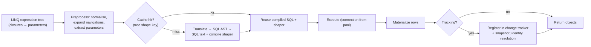
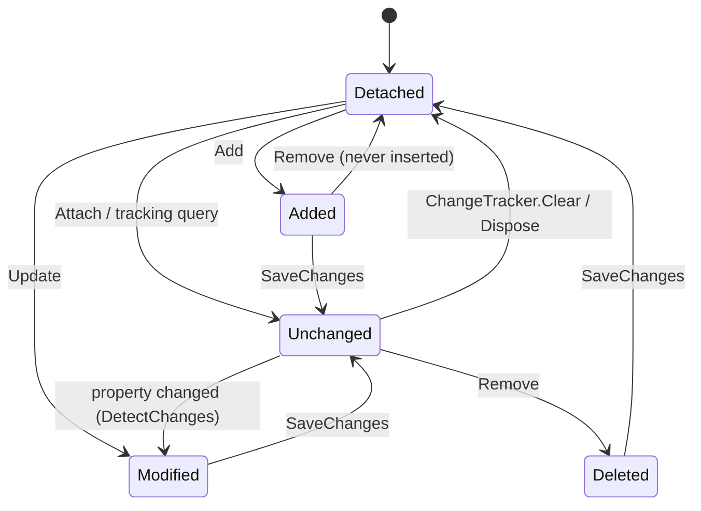
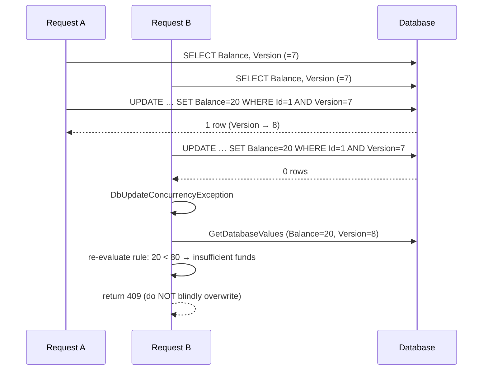
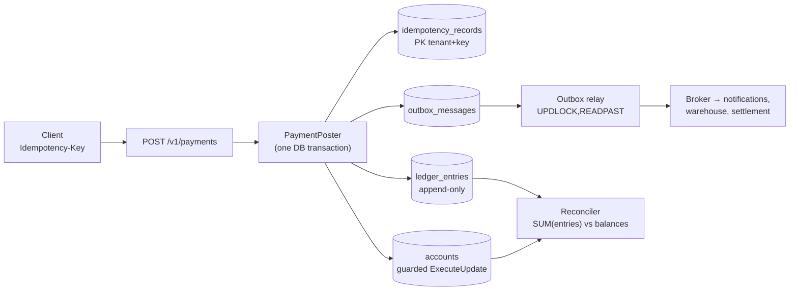
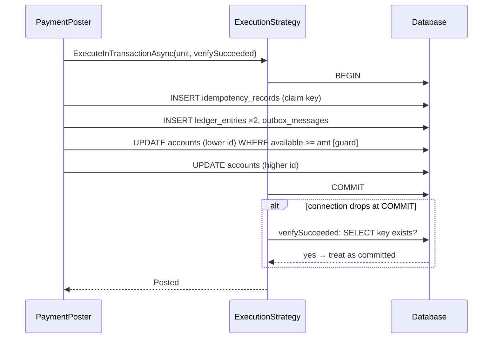

# Module 196 — LINQ & EF Core: Querying, Change Tracking, SaveChanges, Optimistic Concurrency, Transactions & Bulk Operations

> Domain: LINQ & EF Core | Level: Beginner → Expert | Prerequisite: [[01-EFCore-Foundations-DbContext-Lifetime-Pooling-Providers-Resilience-ReleaseStrategy]] (unit of work, the retrying execution strategy, commit ambiguity — assumed), [[02-EFCore-Modeling-Conventions-Relationships-Inheritance-ComplexTypes-JSON-ValueConversion-QueryFilters]] (the model this module queries and saves; concurrency-token *configuration*, query filters, cascade behaviour), [[../01-CSharp/05-LINQ-Internals]] (`IQueryable` vs `IEnumerable`, deferred execution), [[../04-SQL-Server/02-Transactions-Isolation-Locking]] (isolation levels, lock modes, deadlocks — §2.12 depends on it), [[../04-SQL-Server/01-Indexing-Query-Execution-Plans]] (why the SQL EF emits is fast or slow), [[../37-Outbox/01-OutboxFundamentals-TableDesign-RelayMechanisms-DeliveryGuarantees]] (§2.13 implements it with EF)
>
> **Scope note:** Third of four modules in `56-LINQ-EFCore`. Module 194 was the runtime object, Module 195 the model; this module is **what you do with them at run time** — read data (the query pipeline), track it (the change tracker), write it (`SaveChanges`, `ExecuteUpdate`/`ExecuteDelete`, bulk), and keep it correct under concurrency (concurrency tokens, transactions, isolation). Module 197 is production operations. Anchored to the Microsoft Learn *Querying*, *Saving Data*, *Change Tracking*, *Concurrency*, *Transactions* and *ExecuteUpdate/ExecuteDelete* pages and the entityframeworktutorial.net *Querying, Track Changes, Saving Data (connected/disconnected), Bulk Insert, Execute Update/Delete, Raw SQL, Stored Procedures, Tracking Entity Graph* pages (coverage matrix: Module 194 §1.6). Section numbers are load-bearing — Modules 194 and 195 cross-reference §2.5, §2.6, §2.7, §2.9 and §2.11 here.
>
> **Accuracy caveat, stated once:** batch sizes, translation capability and `ExecuteUpdate` semantics moved between EF Core 7, 8, 9 and 10. Confirm behaviour by reading the SQL EF logs for the version you ship.

---

## 1. Fundamentals

### 1.1 Querying — LINQ in, SQL out

You write LINQ against a `DbSet<T>` (an `IQueryable<T>`); EF Core translates the **expression tree** into SQL, sends it, and **materializes** the rows into objects. The Microsoft Learn overview example:

```csharp
var blogs = await db.Blogs.Where(b => b.Rating > 3).OrderBy(b => b.Url).ToListAsync();
```

Nothing executes until you **enumerate** (`ToListAsync`, `FirstAsync`, `CountAsync`, `foreach`, `AsAsyncEnumerable`): building the query is free, running it is the round trip. This **deferred execution** is why a query object can be composed across methods, and why holding one past its `DbContext`'s lifetime fails.

### 1.2 Saving — track, change, `SaveChanges`

Entities returned by a (tracking) query are **tracked** by the `DbContext`'s change tracker. You modify them as ordinary objects; `SaveChanges()` compares each tracked entity's current values with a snapshot taken at load time, and emits only the `INSERT`/`UPDATE`/`DELETE` statements required, in one transaction. New objects are added with `db.Add(...)`; removed with `db.Remove(...)`.

```csharp
var blog = await db.Blogs.SingleAsync(b => b.BlogId == 1);   // tracked, snapshot taken
blog.Rating = 5;                                              // just a property assignment
await db.SaveChangesAsync();                                  // UPDATE Blogs SET Rating = 5 WHERE BlogId = 1
```

Two scenarios appear on the tutorial site and in every interview: **connected** (the context that loaded the entity is the one that saves it — the easy case) and **disconnected** (an entity arrives from elsewhere — a deserialized HTTP body, a message — and the context has never seen it, §2.8).

### 1.3 The four ways to write, and when each is right

| Technique | Mechanism | Right when | Wrong when |
|---|---|---|---|
| **Track + `SaveChanges`** | Snapshot diff, ordered, batched, transactional | Aggregate-shaped changes, optimistic concurrency, audit | Millions of rows |
| **`ExecuteUpdate` / `ExecuteDelete`** (EF 7+) | One set-based SQL statement, **bypasses the tracker** | "Update all rows where…", counters, flags, purges | You need concurrency tokens or need tracked entities to reflect the change (§2.9) |
| **Raw SQL** (`ExecuteSql`, `FromSql`) | Your SQL, parameterised | Hot paths, hints, features EF cannot express | Anything a plain LINQ query would do |
| **Bulk libraries / `SqlBulkCopy`** | Native bulk protocol | 100k+ row inserts | Small sets; you need EF's tracking/audit |

---

## 2. Deep Dive

*§2 is written to stand alone: each mechanism, the reasoning that selects it, the number that justifies it, the failure it introduces, and the push-back it attracts. The module's discriminating question is §2.14.*

### 2.1 The query pipeline — from expression tree to rows, and the three places a query goes wrong

**What happens.** (1) The C# compiler builds an **expression tree** from your lambda (not a delegate). (2) EF **preprocesses**: extracts captured variables as **parameters** (`var cutoff = …; Where(p => p.CreatedAt < cutoff)` → `@cutoff`), normalises, and expands navigations into joins. (3) It computes a **cache key from the tree's shape** and looks up a compiled query; on a **hit** only parameter values differ. (4) On a miss it **translates** the translatable tree into a provider SQL AST, generates SQL text, and builds a **shaper** (a compiled delegate turning a `DbDataReader` row into objects). (5) Runs the command; (6) materializes; (7) if tracking, registers each entity with a snapshot. Microsoft Learn: EF "caches queries by the query tree shape, so that queries with the same structure reuse internally-cached compilation outputs."

**Failure 1 — constants instead of parameters.** A value baked into the tree as a *constant* (dynamic expression-building with `Expression.Constant`, or string-concatenated predicates) changes the tree shape per value → **recompilation every time** and a distinct SQL text per value → **plan-cache pollution** at the database. Microsoft Learn's benchmark of the three techniques:

| Technique | Mean | Allocated |
|---|---|---|
| Expression API **with constant** | 1,665.8 µs | 109.92 KB |
| Expression API **with parameter** | 757.1 µs | 54.95 KB |
| Simple lambda **with captured variable** | 760.3 µs | 55.03 KB |

The constant version is **2.2× slower and 2× the allocation**, and — the docs' warning — it "continuously pollutes the cache and causes other queries to be re-compiled, slowing them down." The cheapest detector is EF's **query-cache hit-rate metric**, which "reaches 100% soon after program startup" in a healthy app (Module 194 §2.11). Rules: build dynamic queries by **composing `Where` calls on the `IQueryable`** (not by hand-building trees); avoid the Expression API "unless you really need to"; force a value to be a constant only deliberately with `EF.Constant(x)` and force parameterisation with `EF.Parameter(x)` (EF 9).

**Failure 2 — client evaluation.** Since EF Core 3.0 EF translates *all or nothing* of the query and only the **final top-level projection** may run on the client. Anything else that cannot be translated throws `InvalidOperationException: The LINQ expression '…' could not be translated. Either rewrite the query in a form that can be translated, or switch to client evaluation explicitly by inserting a call to 'AsEnumerable', 'AsAsyncEnumerable', 'ToList', or 'ToListAsync'.` This is a *feature* — the pre-3.0 behaviour of silently pulling the whole table and filtering in memory was the top EF performance defect. The trap is the **manual escape hatch**: `db.Payments.AsEnumerable().Where(p => IsSuspicious(p))` compiles, runs, and loads the table.

**Failure 3 — a translation that is valid but not what you meant.** The classic three: **case sensitivity** follows the database collation (Module 195 §2.3); **`string.Contains` on a huge text** becomes `LIKE '%x%'` (unindexable); **`==` on a nullable** — EF 9 clarified "C# semantics for comparison operations on nullable values," so `x.Status == status` with a null `status` generates `IS NULL`-aware SQL that can be slower than the naïve form. Always read the SQL.

**Reading the SQL is a first-class skill.** `query.ToQueryString()` (no execution), `LogTo`/`ILogger` at `Information`, and **`TagWith("Class.Method")`** to attribute the statement in the DBA's tooling.

*Push-back: "Doesn't EF Core's query cache make raw SQL pointless for speed?"* The cache removes *compilation* cost, not *execution* cost. The Microsoft Learn performance page places EF runtime overhead last among four factors (database performance, network transfer, round trips, EF overhead) and says it is "likely to be negligible in most cases." Raw SQL is for **expressiveness**, not for compilation speed.

### 2.2 Tracking, no-tracking, and identity resolution

**Default: tracking.** Every entity a query returns is registered with the change tracker and a snapshot is taken. Costs: memory (entity + snapshot), CPU (`DetectChanges` is O(tracked)), and — the semantic cost — **identity resolution**: if the query returns a row for an entity *already tracked*, EF returns the **existing instance** and does **not** overwrite its property values with the database's (Module 194 §4's stale-read incident).

| Behaviour | API | Tracked? | Identity resolution? | Use for |
|---|---|---|---|---|
| Tracking | (default) | Yes | Yes (one instance per key per context) | Read-modify-write |
| No-tracking | `AsNoTracking()` | No | **No** — the same row twice yields two objects | Read-only APIs, exports, reports — the default for query-side code |
| No-tracking with identity resolution | `AsNoTrackingWithIdentityResolution()` | No | Yes, **within the one query** | Read-only graph queries with `Include` where duplicates would bloat memory |
| Change the default | `UseQueryTrackingBehavior(NoTracking)` | — | — | Read-heavy services; opt in with `AsTracking()` |

**A projection to a non-entity type is never tracked** (`Select(p => new PaymentDto(...))`); but a projection that *includes an entity instance* inside an anonymous type still **tracks that entity**. **Relationship fix-up:** with tracking, when a query loads `Post`s, EF wires up `post.Blog` and adds the post to `blog.Posts` for any `Blog` already tracked — so a collection can appear *partially* loaded, containing only the posts some earlier query happened to fetch. Never infer "this collection is complete" from "it is populated" — use `Entry(b).Collection(x).IsLoaded` or an explicit query.

*Push-back: "Why not make everything `AsNoTracking`?"* You can, for read paths — it is often the right default for a query-side service. But then you cannot modify-and-save those instances without `Attach`/`Update` (§2.8), and you lose the guarantee that two references to one row are one object.

### 2.3 Loading related data — eager, explicit, lazy, and the N+1 problem

| Strategy | API | SQL | Failure mode |
|---|---|---|---|
| **Eager** | `Include(b => b.Posts).ThenInclude(p => p.Comments)` | Joins in one query (or split — §2.5) | Cartesian explosion; over-fetch |
| **Filtered include** | `Include(b => b.Posts.Where(p => p.IsPublished).OrderByDescending(p => p.At).Take(5))` | One query, filtered/ordered/limited related set (`Where`, `OrderBy`, `ThenBy`, `Skip`, `Take` only; each navigation included **once** with one filter) | Cannot include the same navigation with two filters |
| **Explicit** | `await db.Entry(blog).Collection(b => b.Posts).LoadAsync()`; `.Query().Where(...).CountAsync()` | A separate query on demand | Easy to put in a loop |
| **Lazy** | `UseLazyLoadingProxies()` (virtual navigations) or `ILazyLoader` | A query **on every first touch of a navigation** | **N+1**; **synchronous** — lazy loading has no async form, so it blocks a thread on database I/O |
| **Auto-include** | `Navigation(b => b.Owner).AutoInclude()` | Always joined | Hidden joins on every query; opt out with `IgnoreAutoIncludes()` |
| **Projection** | `Select(b => new { b.Name, PostCount = b.Posts.Count })` | Only the columns/aggregates you ask for | None — it is usually the right answer |

**N+1 in one picture.** Load 1,000 blogs (1 query), then touch `blog.Posts` in a loop (1,000 queries) = **1,001 round trips**. At 1 ms per round trip that is 1 s of pure latency for a list that one join returns in ~10 ms; at cloud latency (5 ms) it is 5 s. The Microsoft Learn performance page names it explicitly: "follow roundtrips to make sure the N+1 problem isn't occurring." Lazy loading is an **N+1 factory** and is unsupported by compiled models (Module 194 §2.8). **Detection:** a test that counts commands via a `DbCommandInterceptor` and asserts an upper bound per endpoint (§11 Easy) — because nothing at compile time distinguishes a loop that touches a navigation from one that does not.

**Prefer projection to `Include` for read models.** `Include` loads whole entities (every column of every related row) and, when tracked, snapshots them. A `Select` into a DTO fetches exactly the columns needed, does not track, and often removes the join entirely. The Microsoft Learn *data duplication* note is the concrete case: `Include(b => b.Posts)` repeats every `Blog` column per post, so a `Blog` with a huge column multiplies it by its post count — "By using a projection to explicitly choose which columns you want, you can omit big columns."

### 2.4 Operators that need care — joins, grouping, `Contains`, `EF.Functions`, and `LeftJoin`

- **Joins.** Navigation-based access (`p.Account.Name`) generates joins for you and is the idiomatic form *within* an aggregate. Between aggregates (relationships by id only — Module 195 §2.5) write explicit `Join`/`GroupJoin`. **`LEFT JOIN`:** before .NET 10 this required `GroupJoin` + `SelectMany` + `DefaultIfEmpty` "in a particular configuration"; **.NET 10 adds `LeftJoin` and `RightJoin` LINQ operators and EF Core 10 translates them** (`context.Students.LeftJoin(context.Departments, s => s.DepartmentID, d => d.ID, (s, d) => new { s.FirstName, Department = d.Name ?? "[NONE]" })`); C# query syntax (`from … select`) does not yet express them.
- **`GroupBy`.** Translates to SQL `GROUP BY` when the result is projected to aggregates (`GroupBy(x => x.Currency).Select(g => new { g.Key, Total = g.Sum(x => x.AmountMinor) })`). A `GroupBy` whose result you enumerate *as groups of entities* (`foreach (var g in query.GroupBy(...)) foreach (var item in g)`) cannot be a single SQL query and is evaluated in memory after fetching rows — check the log.
- **`Contains` with a collection** (`ids.Contains(p.Id)`) — the *parameterised collection* problem. EF 8/9 sent one JSON array unpacked with `OPENJSON`; **EF 10 defaults to one scalar parameter per element, padded** (8 values → 10 parameters); control with `UseParameterizedCollectionMode` or `EF.Constant` (Module 195 §2.8). For lists of thousands, prefer a **table-valued parameter/temp table join** or chunk — SQL Server caps a request at 2,100 parameters.
- **`EF.Functions`.** Provider-specific SQL functions surfaced in LINQ: `EF.Functions.Like(p.Ref, "INV-%")` (sargable prefix), `EF.Functions.DateDiffDay(...)`, SQL Server `VectorDistance("cosine", b.Embedding, v)` (EF 10, on Azure SQL/SQL Server 2025). They make the query **non-portable by design** — a testing consequence (Module 197: provider-specific `EF.Functions` cannot be tested on SQLite).
- **Time.** `DateTime.UtcNow` inside a query is translated to `SYSUTCDATETIME()` and evaluated *per row at the server*; assign it to a local variable first if you want one consistent instant as a parameter — and use `TimeProvider` so tests can control it.

### 2.5 Single versus split queries — cartesian explosion, and what splitting costs

**Cartesian explosion** (Microsoft Learn). `Include(b => b.Posts).Include(b => b.Contributors)` — two *sibling* collections — produces a **cross product per blog**: a blog with 10 posts and 10 contributors returns **100 rows**, and each extra sibling `Include` multiplies again. It does **not** occur for nested collections (`Include(b => b.Posts).ThenInclude(p => p.Comments)` returns one row per comment). **Data duplication** is the milder cousin: a single collection `Include` repeats the principal's columns once per child — trivial unless the principal has a large column.

**The fix — split queries.** `Include(b => b.Posts).AsSplitQuery()` (or `UseQuerySplittingBehavior(QuerySplittingBehavior.SplitQuery)` globally, `AsSingleQuery()` to override per query) issues **one SQL query per included collection** instead of a join: 1 + N_collections statements, no multiplication. One-to-one navigations always stay in the main query. EF logs `MultipleCollectionIncludeWarning` when a query loads several collections and you have configured neither mode — promote it to an error in CI so the choice is always deliberate.

**What splitting costs** (Microsoft Learn's four characteristics — each is an interview point):

| Cost | Detail |
|---|---|
| **Consistency** | "No such guarantees exist for multiple queries." If data changes between the statements the graph can be inconsistent; mitigate with a **snapshot or serializable transaction**, which has its own cost |
| **Round trips** | One extra network round trip per collection — painful at high latency |
| **Memory** | Databases mostly allow one active reader; earlier result sets must be **buffered** before later ones run (unless MARS, which conflicts with savepoints) |
| **Repeated reference joins** | Each split query re-joins the reference navigations |
| **Paging correctness (before EF 10)** | With `Skip`/`Take` on EF < 10 the split queries could each order differently unless the ordering is **fully unique** ("Ordering by both date and ID… avoids this problem"; "relational databases do not apply any ordering by default, even on the primary key"). **EF 10 fixes the subquery ordering** by including the key in the subquery's `ORDER BY` |

**Decision rule.** Single query for one collection or small cardinalities; **split** when sibling collections or large children would multiply rows — *inside a snapshot transaction* if the consistency of the graph matters (a ledger statement); or **avoid the problem** by projecting to a DTO and querying children separately by parent-id set (which you control). Neither is universally right: Microsoft's own words — "there isn't one strategy for loading related entities that fits all scenarios."

### 2.6 Raw SQL, stored procedures and keyless entities

**Parameterised, safe.** `db.Payments.FromSql($"SELECT * FROM payments WHERE tenant_id = {tenantId}")` takes a C# `FormattableString`; each interpolated value becomes a **separate SQL parameter** — safe from injection. `FromSqlRaw("…{0}", value)` also parameterises positional arguments, but **string-concatenating into `FromSqlRaw` is a SQL-injection vulnerability**; EF 10 adds an analyzer that warns on concatenation inside raw-SQL APIs — treat it as a build error. For non-query statements use `ExecuteSql($"…")`/`ExecuteSqlRaw`. For **unmapped result types** (EF 8+) use `db.Database.SqlQuery<T>($"…")` — no entity registration required, results never tracked.

**Composability.** `FromSql` on a `DbSet<T>` must return **all columns of `T`** with matching column names, and can be composed with `Where`/`OrderBy`/`Include`/`AsNoTracking` *if* the SQL is a single `SELECT` that can be wrapped as a subquery (no trailing semicolon; SQL Server rejects an inner `ORDER BY` unless it is the outermost query). Results are **tracked** unless you add `AsNoTracking()`.

**Stored procedures** (tutorial: *Working with Stored Procedure*). `FromSql($"EXEC dbo.GetOpenPayments {tenantId}")` — **not composable** (a `EXEC` cannot be wrapped in a subquery), so finish with `ToListAsync()`/`AsAsyncEnumerable()` and do any further filtering in memory; use `ExecuteSql` for procedures with no result set. Where a stored procedure is mandated (a DBA-owned interface), keep it behind one repository method and **test it against the real database** (Module 197).

**Keyless entity types** (`HasNoKey()`, optionally `ToView("vw_PaymentSummary")` or `ToSqlQuery("SELECT …")`) map read-only shapes — reporting views, procedure results. They are **never tracked**, cannot be saved, and cannot participate as the dependent end of a normal relationship. They are the correct target for "I want LINQ composition over a view."

**When raw SQL is the right call:** table/query hints (`WITH (UPDLOCK, READPAST)` for queue-style claiming — §2.13), recursive CTEs, window functions beyond EF's translation, `MERGE`, bulk operations, and any statement whose *execution plan* you must control. Keep it parameterised, isolated, tagged, and tested.

### 2.7 Projection, pagination, streaming versus buffering, and async

**Projection first.** `Select(p => new PaymentRow(p.Id, p.Amount.AmountMinor, p.Status))` fetches three columns, is untracked, and is the cheapest read shape. EF can also project *navigations' aggregates* (`Count`, `Sum`, `Any`) as correlated subqueries or joins — the correct replacement for "load the collection, then `.Count`".

**Pagination — offset versus keyset.**

| | **Offset** (`Skip(n).Take(k)`) | **Keyset / seek** (`Where(key > last).Take(k)`) |
|---|---|---|
| SQL | `OFFSET n ROWS FETCH NEXT k` | `WHERE (CreatedAt, Id) < (@c, @i) ORDER BY … TOP k` |
| Cost | **O(n + k)** — the database walks and discards `n` rows | **O(log N + k)** — an index seek to the cursor |
| Stability | Rows shift if data changes between pages (duplicates/skips) | Stable — the cursor is a position, not a count |
| Random page access | Yes | No (next/previous only) |
| Use | Small, static, human-navigated lists | **Any large or append-heavy list, APIs, exports** |

Keyset with a **composite cursor** for a non-unique sort column (the tie-break on the unique `Id` is what makes it correct):

```csharp
var page = await db.Payments.AsNoTracking()
    .Where(p => p.TenantId == t && (p.CreatedAt < cursorAt || (p.CreatedAt == cursorAt && p.Id < cursorId)))
    .OrderByDescending(p => p.CreatedAt).ThenByDescending(p => p.Id)
    .Take(pageSize + 1)                                // fetch one extra to know whether there is a next page
    .Select(p => new PaymentRow(p.Id, p.CreatedAt, p.Status)).ToListAsync(ct);
```

Backed by the index `(TenantId, CreatedAt DESC, Id DESC)`. At page 50,000 with `k = 50`, offset scans **~2.5 M rows** (50,000 × 50) to return 50; keyset seeks once.

**Streaming versus buffering.** `ToListAsync()` **buffers** the full result then releases the connection. `await foreach (var x in query.AsAsyncEnumerable())` **streams** row by row — low memory, but it **holds the connection open for the whole enumeration** (Module 194 §14: a slow body inside the loop starves the pool). **Enabling a retrying execution strategy forces EF to buffer** ("EF to internally buffer the resultset" — Microsoft Learn). Choose: stream only when the consumer is fast and local (writing to a file), and never `await` unrelated I/O inside the loop.

**Async.** Always `…Async` with the `CancellationToken` (a cancelled `SaveChanges` after commit-start has the same *outcome unknown* property as a dropped connection — Module 194 §2.10). Never `.Result`/`.Wait()` — sync-over-async starves the thread pool and connection pool together.

### 2.8 The change tracker — states, snapshots, disconnected entities and graphs

**States.** Every tracked entity is exactly one of: `Detached` (not tracked), `Unchanged` (loaded/attached, no changes), `Added` (will `INSERT`), `Modified` (will `UPDATE` the modified properties), `Deleted` (will `DELETE`). Transitions:

```
Detached ──Add──► Added ──SaveChanges──► Unchanged ──(set property)──► Modified ──SaveChanges──► Unchanged
Detached ──Attach──► Unchanged                          Unchanged ──Remove──► Deleted ──SaveChanges──► Detached
Detached ──Update──► Modified (all properties)   Added ──Remove──► Detached (never inserted)
```

**How detection works.** With **snapshot change tracking** (the default) EF stores each entity's *original values* at load; `DetectChanges()` compares current to original for every tracked entity — **O(tracked entities × properties)**. `SaveChanges` calls it automatically, as do `Entries()`, `Local` and several other APIs; `ChangeTracker.AutoDetectChangesEnabled = false` skips the automatic call for a hot loop of bulk `Add`s but then *you* must call `DetectChanges` before saving modifications. `ChangeTracker.Clear()` (EF 5+) detaches everything — the correct reset between batches (Module 194 §11 Medium). `ChangeTracker.DebugView.LongView` prints every tracked entity's state and original/current values — the first tool to reach for when "`SaveChanges` did nothing" (Module 195 §4).

**The `Entry` API.** `db.Entry(e).State`, `.Property(p => p.Status).IsModified/OriginalValue/CurrentValue`, `.Collection(...).Load()`, `.Reference(...)`, `.GetDatabaseValuesAsync()` (a live read — used in concurrency resolution, §2.11). For **complex types**, `Entry(e).ComplexProperty(c => c.Address)` mirrors this API (Microsoft Learn).

**Disconnected entities — the four calls that decide the SQL** (tutorial: *Disconnected Scenario: Insert / Update / Delete Data*):

| Call | Root state | Reachable untracked entities | Danger |
|---|---|---|---|
| `Add(e)` | `Added` | `Added` | Always inserts — a keyed existing row fails on the duplicate |
| `Attach(e)` | `Unchanged` if key set, else `Added` | Same rule per entity | Changes on the object are **not** detected (no snapshot difference) |
| `Update(e)` | **`Modified`** — *all* properties | Keyed → `Modified`; unkeyed → `Added` | **Overwrites every column with the incoming values**, including ones the client never sent (the "over-posting"/lost-update bug) |
| `Remove(e)` | `Deleted` | Cascades to tracked dependents | Loads nothing — untracked dependents are left to the database's cascade |

**The client-generated-key trap.** `Guid` keys are `ValueGeneratedOnAdd` *by convention*, so `Update(graph)`/`Attach(graph)` infer "new vs existing" from whether the key is **set**. A new aggregate whose key you generated on the client (Module 194 §11 Expert) *has* a key → EF classifies it `Modified` → `UPDATE … WHERE id = @id` → **0 rows → `DbUpdateConcurrencyException`**, a confusing error for "insert failed." **Use `Add` explicitly for new aggregates**, or configure the key `ValueGeneratedNever()`.

**Safer disconnected updates.** Load the entity by key, then copy only the permitted fields (`db.Entry(existing).CurrentValues.SetValues(dto)`, or map fields by hand) and let the tracker compute a *minimal* `UPDATE` — this also gives you the current `rowversion` for §2.11. Reserve `Update(e)` for the rare case where the client legitimately supplies the *entire* row. **`TrackGraph(root, e => { e.Entry.State = … })`** (tutorial: *Tracking Entity Graph*) lets a callback decide each node's state when a graph is mixed (some new, some existing, some deleted) — the correct tool for a nested payload, and one where the callback must be exhaustively tested.

*Push-back: "Why not set `entry.State = Modified` to save a load?"* It marks **every** property modified, so it writes the client's stale view of columns it did not intend to change — silently reverting concurrent edits — and it bypasses the original-values comparison that optimistic concurrency and audit rely on. It is the single most common source of "lost update" in ORM code reviews.

### 2.9 `ExecuteUpdate` and `ExecuteDelete` — set-based writes, and the interactions that bite

Introduced in EF Core 7 (tutorial: *Execute Update*, *Execute Delete*). They run **one SQL statement immediately**, with no tracking and no `SaveChanges`:

```csharp
await db.Payments.Where(p => p.Status == Status.Pending && p.CreatedAt < cutoff)
    .ExecuteUpdateAsync(s => s.SetProperty(p => p.Status, Status.Expired)
                              .SetProperty(p => p.UpdatedAt, now), ct);            // UPDATE … SET Status=…, UpdatedAt=… WHERE …
await db.Payments.Where(p => p.Status == Status.Expired && p.UpdatedAt < purgeBefore).ExecuteDeleteAsync(ct);
// EF 10: SetProperty may be called conditionally inside a regular (non-expression) lambda
await db.Accounts.Where(a => a.Id == id).ExecuteUpdateAsync(s => { s.SetProperty(a => a.Balance, a => a.Balance - amt); if (flag) s.SetProperty(a => a.Note, "x"); });
```

The Microsoft Learn comparison for deleting rows below a rating: the tracked way *queries, materializes and tracks every matching entity* then generates *one `DELETE` per row*; `ExecuteDelete` sends `DELETE FROM … WHERE …` once, "without loading any data from the database or involving EF's change tracker."

**The six interactions an interviewer probes (Microsoft Learn):**

1. **They ignore the change tracker.** Query a blog (rating 5, tracked), `ExecuteUpdate` all ratings +1 (DB now 6), then `blog.Rating += 2` and `SaveChanges`: the tracked instance still holds 5 → 7, EF sees 7 ≠ original 5 and writes **7**, **overwriting** the `ExecuteUpdate`'s effect. → *Do not mix tracked modifications and `ExecuteUpdate` on the same rows in one context.* **§4's incident.**
2. **No implicit transaction.** Each call is its own statement and its own transaction; two calls followed by a `SaveChanges` are **three independent commits**. Wrap them in `BeginTransactionAsync` if they must be atomic.
3. **No concurrency-token protection.** They cannot apply optimistic concurrency automatically. Build it yourself and **check the rows-affected result**: `var n = await …Where(b => b.Id == id && b.ConcurrencyToken == token).ExecuteUpdateAsync(…); if (n == 0) throw new ConcurrencyException();`
4. **No batching.** "Multiple invocations of these methods cannot be batched. Each invocation performs its own roundtrip."
5. **Cannot reference navigations in `SetProperty`** (and cannot modify multiple tables). The workaround is projecting first: `.Select(b => new { Blog = b, NewRating = b.Posts.Average(p => p.Rating) }).ExecuteUpdateAsync(s => s.SetProperty(x => x.Blog.Rating, x => x.NewRating))`.
6. **Only update and delete** — there is no `ExecuteInsert`. Insert is `Add` + `SaveChanges`, or a bulk technique (below). Relational providers only.

**Scope notes.** The statement is a *query*, so `Where`/`Take` and other operators shape the target set; global query filters are applied because the target is composed as a query — **confirm in the logged SQL** for your version, and remember `ExecuteDelete` performs a *real* `DELETE`, bypassing a soft-delete interceptor (Module 195 §2.11). EF 10 extends `ExecuteUpdate` to properties **inside JSON-mapped complex types** (`SetProperty(b => b.Details.Views, b => b.Details.Views + 1)` → SQL Server 2025 `.modify(...)`); owned types are not supported for this.

**Why the atomic form beats read-modify-write.** `ExecuteUpdate(balance = balance − @amt WHERE id = @id AND balance >= @amt)` is one statement: no window between "read balance" and "write balance," so **no lost update, and no `rowversion` needed for that invariant** — the guard *is* the concurrency control, and it holds the row lock for the shortest possible time (§12).

**Bulk insert.** EF has no native bulk insert. The four approaches worth knowing (the tutorial's *Bulk Insert* page surveys this space): (1) `AddRange` + one `SaveChanges` — simplest; EF **batches** statements (SQL Server default max batch size **42**, configurable via `MaxBatchSize`; verify for your provider/version) but still tracks every entity — fine to ~10⁴ rows, memory-heavy beyond; (2) **chunked** `AddRange` + `SaveChanges` + `ChangeTracker.Clear()` per chunk of 1–5k — bounds memory, but is not one transaction unless you wrap it; (3) a **third-party bulk library** (e.g. EFCore.BulkExtensions, linq2db) — fast, but skips interceptors/tracking/concurrency semantics; (4) **`SqlBulkCopy`** (SQL Server) into a staging table then a set-based `INSERT … SELECT`/`MERGE` — the fastest and the one to choose for ≥10⁵ rows; the staging-table form also gives you a validate-then-apply step. **Each bulk route bypasses EF's audit/filters/interceptors — that trade must be a decision, not an accident.**

### 2.10 What `SaveChanges` actually does — ordering, batching, transactions, failure

1. **Detect changes** (if auto-detect is on) → a list of `Added`/`Modified`/`Deleted` entries.
2. **Interceptors/events**: `SavingChanges` (a `SaveChangesInterceptor` — audit stamping, soft-delete conversion, outbox rows — Module 195 §11, §2.13) run *before* commands are built, so entities added here are saved in the same operation.
3. **Order** the commands with a **topological sort on the model's foreign keys**: principals inserted before dependents, dependents deleted before principals; cycles are broken by inserting with nulls then updating.
4. **Batch**: multiple statements are sent in one round trip (limited by the provider's max batch size and the 2,100-parameter cap on SQL Server); store-generated values are read back with `OUTPUT INSERTED…` (illegal on a table with triggers unless `HasTrigger` — Module 195 §2.2).
5. **Transaction**: all statements in one transaction; Microsoft Learn: "`SaveChanges` is guaranteed to either completely succeed, or leave the database unmodified if an error occurs." `AutoTransactionBehavior.WhenNeeded` (default) skips an explicit transaction when one statement suffices; `Always` forces one (adds round trips); `Never` is dangerous — partial commits.
6. **Accept changes**: on success the tracker resets states (`Added`/`Modified` → `Unchanged`, `Deleted` → `Detached`) and stores the new snapshot — **unless** you called `SaveChanges(acceptAllChangesOnSuccess: false)` (needed for commit-ambiguity verification — Module 194 §2.10).
7. **On failure** it throws `DbUpdateException` (constraint, FK, unique) or `DbUpdateConcurrencyException` (§2.11), with `ex.Entries` identifying the offending entries. **The tracker still holds the pending changes** — calling `SaveChanges` again re-sends them all. You must fix the entity, or `ChangeTracker.Clear()`, before retrying.

**Detecting a unique-key violation portably:** inspect the provider exception, not the message — `SqlException.Number` **2627** (constraint) / **2601** (unique index) on SQL Server; PostgreSQL `PostgresException.SqlState == "23505"`. This is how an idempotency-key collision becomes a *replay*, not a 500 (Module 194 §12).

### 2.11 Optimistic concurrency — what EF emits, what it cannot see, and how to resolve

*The configuration is Module 195 §2.9; this is the behaviour.*

**Mechanism (Microsoft Learn).** EF "implements optimistic concurrency, which assumes that concurrency conflicts are relatively rare… takes no locks, but arranges for the data modification to fail on save if the data has changed since it was queried." A property is configured as a **concurrency token** (`[Timestamp]`/`IsRowVersion()` on SQL Server, database-generated, changes on every row update; or `[ConcurrencyCheck]`/`IsConcurrencyToken()`, application-managed). Load tracks the token; on update EF adds it to the `WHERE`:

```sql
UPDATE [People] SET [FirstName] = @p0
WHERE [PersonId] = @p1 AND [Version] = @p2;
```

Zero rows affected → **`DbUpdateConcurrencyException`**. It is also thrown for a **delete** of a concurrently modified row; it is **not** thrown for an `INSERT` collision (that is a provider-specific unique-violation exception — §2.10).

**Three sets of values resolve a conflict:** **current** (what you tried to write), **original** (what you read), **database** (what is there now — `await entry.GetDatabaseValuesAsync()`, null if the row was deleted). The loop, from Microsoft Learn: catch → for each `ex.Entries` build the values to write from current/database → **`entry.OriginalValues.SetValues(databaseValues)`** (refresh the token so the retry's `WHERE` matches) → retry until no conflict.

| Resolution policy | Behaviour | Right for |
|---|---|---|
| **Fail to the caller** (`412`/`409`) | Tell the user; they reload and redo | Human-edited data (a trade amendment) |
| **Client wins** | Keep current values, refresh original token | Last-writer-wins fields where the latest intent is authoritative (a status flip) |
| **Database wins** | Reload, discard the client's change | Derived/idempotent state |
| **Merge** | Field-level: take DB for fields you didn't change, yours for those you did | Disjoint edits (one edits the note, another the status) |
| **Retry whole unit** | Re-load and *re-apply the business rule* on fresh data | **Automated** updates — re-running the rule is the only safe merge (a balance debit re-checks funds) |

**Isolation levels as the alternative** (Microsoft Learn): repeatable read/snapshot can serve as concurrency control without tokens — locks in SQL Server `REPEATABLE READ` (pessimistic), a serialization error under `SNAPSHOT` and PostgreSQL `REPEATABLE READ` (optimistic). Cost: the transaction must **span the read and the write**, so it cannot cover "read, show to a user, wait, save."

**What a token cannot see.** It protects **only the row it is on, only the statements that include it.** (a) It does nothing for **cross-row invariants** ("total of a batch ≤ limit," "at most one active mandate") — those need a constraint, a serializable transaction, or a single guarded statement. (b) `ExecuteUpdate`/`ExecuteDelete` **do not use it** (§2.9). (c) Raw SQL updates bypass it. (d) A **hot row** (many writers) turns optimistic concurrency into a retry storm — at high contention, the retries *are* the load (§12, §15).

### 2.12 Transactions, isolation and deadlocks

**Layers.** (1) Default: each `SaveChanges` is atomic (§2.10). (2) **Explicit**: `await using var tx = await db.Database.BeginTransactionAsync(IsolationLevel.ReadCommitted)` spanning several `SaveChanges` and queries; disposal without commit rolls back. (3) **Savepoints**: when a transaction is already in progress `SaveChanges` creates a savepoint and rolls back to it on error, leaving the transaction usable (useful with concurrency retries); `CreateSavepointAsync`/`RollbackToSavepointAsync` manually. **Savepoints are incompatible with SQL Server MARS** — EF will not create them when MARS is enabled "even if MARS is not actively in use," and a failure can leave the transaction "in an unknown state." (4) **Cross-context / cross-technology**: share a `DbConnection` and `DbTransaction` (`Database.UseTransactionAsync(tx.GetDbTransaction())`) so EF and ADO.NET/Dapper commit together. (5) **`TransactionScope`/`System.Transactions`**: works with SqlClient; use `TransactionScopeAsyncFlowOption.Enabled` with async; **distributed (multi-resource) transactions exist only on Windows since .NET 7** and `TransactionScope` **cannot commit/rollback asynchronously** (disposal blocks). **Do not rely on distributed transactions across microservices** — that is what the Outbox and Saga are for (§2.13; domains 36–37).

**Explicit transaction + retrying strategy.** A user transaction must run inside `CreateExecutionStrategy().ExecuteAsync(...)` (Module 194 §2.10) — and every retry starts with a **fresh** unit.

**Isolation, in one paragraph.** SQL Server's default is `READ COMMITTED` — *locking* unless the database has **READ_COMMITTED_SNAPSHOT (RCSI)** on (Azure SQL Database enables it by default; the boxed product does not — check `sys.databases`). RCSI makes readers not block writers (row versions in `tempdb`), removing a large class of blocking incidents at the cost of version-store space; `SNAPSHOT` adds transaction-level consistency and *update conflicts* (error 3960); `SERIALIZABLE` adds key-range locks and phantom protection at high contention cost. Choose the **lowest level that preserves your invariant**, keep transactions **short**, and never hold one across a non-database call.

**Deadlocks (error 1205).** Two transactions each hold a lock the other needs; SQL Server kills one (the victim, rolled back in full). The dominant application cause in EF code is **inconsistent lock ordering** — `Transfer(A→B)` and `Transfer(B→A)` running concurrently each lock their source first. Fixes: (i) **acquire locks in a canonical order** (always the lower account id first); (ii) keep the transaction short and the hot-row statement **last**; (iii) index the predicates so updates lock rows, not ranges; (iv) **retry the whole unit** on 1205 with a fresh context (a victim is fully rolled back and safe to retry — Module 194 §12 Step 3.3). §14 works one end to end.

### 2.13 The transactional outbox with EF Core — atomic write plus reliable publish

**The dual-write problem.** "Save the payment, then publish `PaymentCreated` to the broker" is two systems; a crash between them loses the event or publishes one for a payment that rolled back. **The outbox** (`37-Outbox/01`): write the *event as a row in the same database transaction* as the business change; a separate **relay** publishes it later. EF makes the first half nearly free because `SaveChanges` is already one transaction:

```csharp
public sealed class OutboxInterceptor(TimeProvider clock) : SaveChangesInterceptor
{
    public override ValueTask<InterceptionResult<int>> SavingChangesAsync(
        DbContextEventData e, InterceptionResult<int> r, CancellationToken ct = default)
    {
        var db = e.Context!;
        foreach (var agg in db.ChangeTracker.Entries<IHasDomainEvents>().Select(x => x.Entity).ToList())
        {
            foreach (var ev in agg.DomainEvents)
                db.Set<OutboxMessage>().Add(new OutboxMessage(Guid.NewGuid(), agg.Id, ev.GetType().Name,
                                                              JsonSerializer.Serialize(ev, ev.GetType()), clock.GetUtcNow()));
            agg.ClearDomainEvents();
        }
        return base.SavingChangesAsync(e, r, ct);      // the OutboxMessage rows commit with the aggregate — or not at all
    }
}
```

**The relay** claims unpublished rows without two workers taking the same one — a case for raw SQL because LINQ has no table hints:

```csharp
await using var tx = await db.Database.BeginTransactionAsync(ct);
var batch = await db.Set<OutboxMessage>().FromSql($"""
    SELECT TOP (100) * FROM outbox_messages WITH (UPDLOCK, READPAST, ROWLOCK)
    WHERE published_at IS NULL ORDER BY id
    """).ToListAsync(ct);                               // PostgreSQL: … FOR UPDATE SKIP LOCKED
foreach (var m in batch) { await broker.PublishAsync(m, ct); m.PublishedAt = clock.GetUtcNow(); }
await db.SaveChangesAsync(ct); await tx.CommitAsync(ct);
```

**Guarantees and their honest limit.** The pattern is **at-least-once**: a crash after `PublishAsync` but before the commit re-publishes the batch. Consumers therefore **must be idempotent** (deduplicate by `OutboxMessage.Id`) — *exactly-once effect = at-least-once delivery AND idempotent consumption*. Ordering is per aggregate only if you publish per aggregate key in id order. Operational needs: an index on `(published_at, id)` filtered to `published_at IS NULL`; a retention purge of published rows; a **dead-letter path and an alert on the age of the oldest unpublished message** — the leading indicator that the relay is broken.

### 2.14 The module's own discriminating question — worked at both levels

> **"Two requests debit the same account concurrently. Balance is 100; each debits 80. How do you make sure only one succeeds — with EF Core?"**

**The Senior answer (adequate).** "Add a `rowversion` concurrency token to `Account`. Load the account, subtract, `SaveChanges`. The second save hits zero rows, throws `DbUpdateConcurrencyException`, and we retry or return an error." Correct — and it is the answer that *works at low contention and quietly fails a review at scale*.

**The Staff/Principal answer (excellent).**

1. **Name the invariant, not the mechanism:** `balance ≥ 0` (or `available ≥ 0`), which is a **check on a value that other transactions are changing**. A token detects *that the row changed*, not *whether your business rule still holds*; after a conflict you must **re-read and re-evaluate** the rule (retry the *unit*, not just the save).
2. **The best mechanism is often no read at all:** one guarded statement — `UPDATE accounts SET balance = balance − @amt WHERE id = @id AND balance >= @amt` via `ExecuteUpdateAsync` — with rows-affected `1` ⇒ debited, `0` ⇒ insufficient funds. No lost update, no token, no retry loop, and the **lock is held for one statement**. Do it **last** in the transaction, after inserting the ledger rows, to minimise lock hold time.
3. **Then the contention question:** if one account is *hot* (a merchant settlement account), a single row serialises everyone — 1 ÷ 0.008 s = **125 updates/s ceiling per row** at an 8 ms transaction. Optimistic concurrency then degrades into a **retry storm** (the retries amplify the load). Answers: shard the balance into N sub-rows, or make the **append-only ledger the source of truth** and derive balance (§15).
4. **Idempotency:** a client retrying the debit must not debit twice — the `Idempotency-Key` unique index, written in the same transaction (Module 194 §12 Step 3.3).
5. **Deadlock ordering** for transfers; **isolation** (RCSI on so reads do not block); **a reconciliation job** because none of this detects a *logic* error.
6. **Show the failure test:** two `Task.Run`s against a real SQL Server (never the in-memory provider — it has no concurrency semantics; Module 197) asserting exactly one succeeds.

The discriminator is **item 2 combined with item 3**: the Senior answer adds a token and retries; the Principal answer replaces read-modify-write with one guarded statement, then asks whether a *single row* is the right shape at all.

### 2.15 What EF cannot do — and the failures with no detector

- **A stale tracked entity is indistinguishable from a fresh one** — no signal (Module 194 §2.15, §4).
- **`ExecuteUpdate` × tracked `SaveChanges` on the same rows silently overwrites** (§2.9.1) — no exception, no warning.
- **A concurrency token does not protect cross-row invariants, `ExecuteUpdate`, or raw SQL** (§2.11).
- **`Update(graph)` overwrites unsent columns** (§2.8) — the lost update is invisible.
- **N+1 is invisible at compile time** (§2.3) — only command-count tests and load tests catch it.
- **Split queries can return an inconsistent graph** with no error (§2.5).
- **The outbox relay's failure is silence** — nothing throws when messages stop flowing; only an "oldest unpublished age" alert detects it (§2.13).
- **A committed-but-unacknowledged transaction has no detector** other than the verification you write (Module 194 §2.10).
- **Logic errors are invisible to every mechanism above** — only an **independent reconciliation total** (§12 Step 3) catches money that moved wrongly *consistently*.

---

## 3. Visual Architecture

### 3.1 The query pipeline



### 3.2 Entity lifecycle states



### 3.3 An optimistic-concurrency conflict, end to end



### 3.4 Loading strategies compared (ASCII)

```
Include ×2 siblings (single query)         AsSplitQuery                       Projection (DTO)
 Blog ─┬─ Post ×10 ─┐  cross product        Q1: Blogs                          Q: SELECT b.Name,
       └─ Contrib×10┘  = 100 rows / blog     Q2: Posts   JOIN (per collection)     (SELECT COUNT(*) FROM Posts…)
 1 round trip, huge result                   Q3: Contribs                          1 round trip, tiny result
 consistent (one statement)                  3 round trips; buffered; may be       untracked; no fix-up; no snapshot
                                             inconsistent if data moves
```

---

## 4. Production Example

**Scenario — the fee accrual that undid itself.** *(Illustrative composite; numbers internally consistent.)*

**Problem.** A payments platform's nightly job charged account-maintenance fees. To be "efficient," an engineer rewrote it from a per-account `SaveChanges` loop to a single set-based statement: `db.Accounts.Where(a => a.Plan == Plan.Standard).ExecuteUpdateAsync(s => s.SetProperty(a => a.BalanceMinor, a => a.BalanceMinor - a.FeeMinor))`. Runtime dropped from 41 minutes to 3 seconds. **Three weeks later, month-end reconciliation showed 2,300 accounts had not been charged, €9,660 of fees (2,300 × €4.20) missing.**

**Architecture.** The job ran in one long-lived `DbContext`. Earlier in the *same* job (step 2 of 5) a "loyalty adjustment" phase loaded a subset of accounts **with tracking** and wrote a `LoyaltyCredit` field back with `SaveChanges`. Step 4 was the new `ExecuteUpdate`. Step 5 called `SaveChanges` once more "to flush audit rows."

**Investigation.** (1) The fee `UPDATE` appeared in the log and reported `1,840,912 rows affected` — it *had* run. (2) The affected 2,300 accounts all belonged to the loyalty phase's tracked subset. (3) `ChangeTracker.DebugView.LongView` before step 5 showed those accounts as `Unchanged` **with the original (pre-fee) `BalanceMinor` snapshot**; the audit-flush step touched a property on them (`LastReviewedAt`), making them `Modified`. (4) Step 5's `UPDATE` included `BalanceMinor = <old value>` — EF wrote the **stale tracked balance** back over the `ExecuteUpdate` result. (5) A minimal repro in a unit test against the real database matched Microsoft Learn's documented example: rating 5 in the tracked instance, `ExecuteUpdate` sets the database to 6, `+= 2` then `SaveChanges` writes 7.

**Root cause.** `ExecuteUpdate` **"is completely unaware of EF's change tracker"** (Microsoft Learn). Tracked entities kept their old snapshot; a later `SaveChanges` that modified *any* property on them emitted an `UPDATE` containing the stale value of a column the job did not intend to write — which happened to be the one `ExecuteUpdate` had just changed. **No exception, no warning, and the set-based statement's own log line looked perfect.**

**Fix.** (a) Removed the shared long-lived context: **each phase gets its own context** (Module 194 §2.14 — the unit of work is the phase). (b) Phases that use `ExecuteUpdate` run in a context that **never tracks** those entities (`AsNoTracking` everywhere, or `ChangeTracker.Clear()` before the phase and no `Attach`). (c) The audit-flush `SaveChanges` writes only audit rows in its own context. (d) Backfill: recompute fees for the 2,300 accounts from the fee schedule and post them as **correcting ledger entries** (never edit history) with a reviewed script. (e) A reconciliation job comparing `SUM(fees charged)` in the ledger with `accounts × fee schedule` nightly with a hard threshold.

**Trade-offs.** Splitting into per-phase contexts costs a few extra queries and loses cross-phase identity — correct, because each phase *should* see fresh data. The set-based statement stays (41 min → 3 s is real), but the interaction rule ("never mix tracked writes and `ExecuteUpdate` on the same rows in one context") became a code-review checklist item *and* a test: load-and-track an account, `ExecuteUpdate` it, modify another field, `SaveChanges`, then assert the `ExecuteUpdate` result survived in a fresh context.

**Lessons.** (1) A performance rewrite that changes the *mechanism* changes the *guarantees* — `ExecuteUpdate` is faster because it does less: no tracker, no token, no transaction. (2) The defect was silent, in a job with no user, found only by an independent reconciliation. (3) The recurring pattern of this domain: **EF's belief (the snapshot) diverged from reality (the database after `ExecuteUpdate`) and nothing detected it** — Module 194 §4, Module 195 §4 and this incident are the same failure at three layers.

---

## 11. Coding Exercises

### Easy — Detect and fix N+1 with a command counter

**Problem.** `GET /accounts` returns each account with its payment count and is slow. Prove it is N+1, fix it, and add a regression test that fails if it returns.

**Solution.**
```csharp
// BROKEN: 1 query for accounts + 1 per account (lazy or explicit load in a loop)
var accounts = await db.Accounts.ToListAsync(ct);
foreach (var a in accounts) a.PaymentCount = await db.Payments.CountAsync(p => p.AccountId == a.Id, ct);

// FIXED: one query, projection, untracked
var rows = await db.Accounts.AsNoTracking()
    .Select(a => new AccountRow(a.Id, a.Name, a.Payments.Count))   // correlated COUNT in SQL
    .ToListAsync(ct);

// Regression guard: count commands issued
public sealed class CommandCounter : DbCommandInterceptor
{
    public int Count;
    public override ValueTask<InterceptionResult<DbDataReader>> ReaderExecutingAsync(
        DbCommand c, CommandEventData e, InterceptionResult<DbDataReader> r, CancellationToken ct = default)
    { Interlocked.Increment(ref Count); return base.ReaderExecutingAsync(c, e, r, ct); }
}
[Fact] public async Task List_accounts_is_constant_queries()
{ await Seed(accounts: 500); counter.Count = 0; await Get("/accounts"); Assert.True(counter.Count <= 2); }
```
**Time complexity.** Broken: O(N) round trips × latency; fixed: O(1) round trips, one `GROUP BY`/correlated aggregate at the server. **Space.** Broken: N tracked entities; fixed: N small DTOs, untracked.
**Optimized solution.** The test asserts an **upper bound independent of N** (seed 5, then 500, assert equal counts) — a *shape* assertion, not an absolute one, so it survives legitimate query changes and fails only when the count scales with data.

### Medium — Keyset pagination with a composite cursor

**Problem.** Implement `GET /v1/payments?cursor=…` returning newest-first pages of 50, stable under concurrent inserts, O(log N + 50) per page at any depth.

**Solution.**
```csharp
public sealed record Cursor(DateTime At, Guid Id)
{ public string Encode() => Convert.ToBase64String(JsonSerializer.SerializeToUtf8Bytes(this));
  public static Cursor? Decode(string? s) => s is null ? null : JsonSerializer.Deserialize<Cursor>(Convert.FromBase64String(s)); }

public async Task<Page<PaymentRow>> ListAsync(Guid tenant, string? token, int size, CancellationToken ct)
{
    var c = Cursor.Decode(token);
    IQueryable<Payment> q = db.Payments.AsNoTracking().Where(p => p.TenantId == tenant);
    if (c is not null) q = q.Where(p => p.CreatedAt < c.At || (p.CreatedAt == c.At && p.Id.CompareTo(c.Id) < 0));   // Guid.CompareTo translation: verify on your EF version, else paginate on a bigint tiebreak
    var rows = await q.OrderByDescending(p => p.CreatedAt).ThenByDescending(p => p.Id)
                      .Take(size + 1)
                      .Select(p => new PaymentRow(p.Id, p.CreatedAt, p.Status)).ToListAsync(ct);
    var next = rows.Count > size ? new Cursor(rows[size - 1].CreatedAt, rows[size - 1].Id).Encode() : null;
    return new(rows.Take(size).ToList(), next);
}
```
with `INDEX (TenantId, CreatedAt DESC, Id DESC)`.
**Time complexity.** O(log N + k) per page (index seek + k rows). Offset paging is O(offset + k): page 50,000 at k = 50 walks ~2.5 M rows. **Space.** O(k).
**Optimized solution.** Make the cursor opaque and **HMAC-signed** (a client must not be able to forge a position to probe other tenants — the tenant filter still applies, but a signed cursor also prevents tampering); include the *sort direction* and a schema version; cap `size`; and for GUID ordering on SQL Server remember `CompareTo` semantics differ from the database's byte-group ordering — **paginate on a `datetime2` + a `bigint` identity/sequence tiebreak rather than a GUID** if you need correct SQL-side ordering (Module 195 §2.2).

### Hard — A concurrency-safe debit: guarded `ExecuteUpdate` versus token retry

**Problem.** Implement `DebitAsync(accountId, amountMinor)` so that concurrent debits can never overdraw, using (A) a `rowversion` retry loop and (B) one guarded statement; compare.

**Solution A — optimistic token with re-evaluation.**
```csharp
for (var attempt = 0; attempt < 5; attempt++)
{
    await using var db = await factory.CreateDbContextAsync(ct);                  // fresh context per attempt
    var acct = await db.Accounts.SingleAsync(a => a.Id == id, ct);                // loads Version (rowversion)
    if (acct.BalanceMinor < amount) return DebitResult.InsufficientFunds;         // re-evaluated on FRESH data each attempt
    acct.BalanceMinor -= amount;
    try { await db.SaveChangesAsync(ct); return DebitResult.Ok; }
    catch (DbUpdateConcurrencyException) { await Task.Delay(Backoff.Jitter(attempt), ct); }
}
return DebitResult.Contended;
```
**Solution B — one guarded atomic statement.**
```csharp
var rows = await db.Accounts.Where(a => a.Id == id && a.BalanceMinor >= amount)
    .ExecuteUpdateAsync(s => s.SetProperty(a => a.BalanceMinor, a => a.BalanceMinor - amount), ct);
return rows == 1 ? DebitResult.Ok : DebitResult.InsufficientFunds;               // 0 rows ⇒ not enough (or no such account)
```
**Test (the deliverable).** Balance 100; 10 concurrent debits of 30 on a **real SQL Server**: exactly **3** succeed (`3 × 30 = 90 ≤ 100`), balance ends at **10**, never negative.
**Time complexity.** A: 1 read + 1 write per attempt, up to 5 attempts under contention (each attempt is a full round trip pair) — **expected attempts grow with contention**; B: 1 statement, always. **Space.** A: one tracked entity per attempt; B: none.
**Optimized solution.** B wins for a *single-row invariant*. Use A when the update involves **complex logic that cannot be a SQL expression** (multi-field rules) — and then add the retry only around the *unit*, with the rule re-evaluated. For a **hot row**, neither scales past ~125 updates/s at an 8 ms transaction (§12); shard or derive the balance from an append-only ledger (§15). Always add the idempotency key so a *client* retry does not double-debit.

### Expert — A transactional outbox with a claimed-batch relay

**Problem.** Implement the outbox (interceptor + relay) so events publish **at least once**, in order per aggregate, never for a rolled-back write, and multiple relay instances never process the same message concurrently.

**Solution.** The interceptor and relay of §2.13 plus:
```csharp
public sealed class OutboxRelay(IDbContextFactory<LedgerDbContext> f, IBroker broker, TimeProvider clock) : BackgroundService
{
    protected override async Task ExecuteAsync(CancellationToken ct)
    {
        using var timer = new PeriodicTimer(TimeSpan.FromMilliseconds(250));
        while (await timer.WaitForNextTickAsync(ct))
        {
            await using var db = await f.CreateDbContextAsync(ct);
            var strategy = db.Database.CreateExecutionStrategy();
            await strategy.ExecuteAsync(async () =>
            {
                await using var tx = await db.Database.BeginTransactionAsync(ct);
                var batch = await ClaimAsync(db, 100, ct);                      // UPDLOCK, READPAST (SQL Server) / SKIP LOCKED (PG)
                foreach (var g in batch.GroupBy(m => m.AggregateId))            // order preserved per aggregate
                    foreach (var m in g.OrderBy(m => m.Id)) { await broker.PublishAsync(m.Type, m.Payload, key: m.AggregateId, ct); m.PublishedAt = clock.GetUtcNow(); }
                await db.SaveChangesAsync(ct); await tx.CommitAsync(ct);
            });
        }
    }
}
```
**Time complexity.** Per tick O(B) claimed rows with an index seek on `(published_at, id)` filtered `published_at IS NULL`; publish is O(B) broker calls. **Space.** O(B) tracked messages.
**Optimized solution.** Keep the transaction **short**: claim, mark `Publishing` with an owner and a lease expiry, **commit**, publish *outside* the transaction, then mark `Published` — so a slow broker cannot hold row locks or an open connection (Module 194 §14). Consumers dedupe on message id. Alert on **age of the oldest unpublished message**, retry with a dead-letter table after N failures, purge published rows by a retention job, and use **CDC/log-tailing relay** (Debezium) instead of polling when latency or DB load from polling matters (`37-Outbox/01`).

---

## 12. System Design — Designing an Idempotent, Concurrency-Safe Payment-Posting Write Path

*Authored to the four-step standard (`CLAUDE.md` §A7). Module 194 §12 designed the data-access foundation and stated the idempotency identity; Module 178 designed the payment system's architecture. This section designs the **database write path itself** — where EF Core's tracker, transactions, concurrency and outbox meet — and develops exactly-once in full. Where a step would restate §4 (the `ExecuteUpdate` incident), §13 (the poster's LLD) or §14 (deadlocks), it states the decision and cross-references.*

---

### Step 1 — Understand the Problem and Establish Design Scope

#### The dialogue

> **I:** Design how a payment is posted to our ledger: money leaves one account, arrives in another, and downstream systems are told. It must never double-post and never overdraw.
>
> **C:** Is this the internal posting step after authorisation, or the whole payment flow including card networks and settlement?
> **I:** Internal posting only. The payment is already authorised. Downstream: notifications, the reporting warehouse, the settlement engine.
>
> **C:** Double-entry — every payment is a debit and a credit that must balance?
> **I:** Yes, immutable ledger entries; balances are derived or materialized.
>
> **C:** Are there hot accounts — for example a merchant settlement account receiving a large share of volume?
> **I:** Yes. One settlement account takes about 5% of all payments.
>
> **C:** Single currency per payment, single region?
> **I:** Single currency per payment; single region primary; multi-currency conversion is out of scope.
>
> **C:** What may the caller assume on a timeout?
> **I:** They will retry with the same `Idempotency-Key`; the result must be identical and money must move at most once.
>
> **C:** Then three things drive the design. **Exactly-once effect** across client retries, EF retries and commit ambiguity. **A hot row** — 5% of volume through one account is a contention problem long before it is a throughput problem. And **atomic publish** — the event must not exist if the ledger write rolled back, nor be lost if it committed. Out of scope: authorisation, currency conversion, fraud scoring, settlement-file generation, multi-region writes.
> **I:** Agreed.

Three answers carry the design:

1. **"Retry with the same key; result must be identical"** makes the idempotency store part of the write transaction and requires a stored *response*, not just a marker.
2. **"5% through one account"** makes a single mutable balance row the bottleneck — the actual hard problem (below).
3. **"Downstream must be told"** requires the outbox; a dual write is a defect by construction.

#### Functional requirements

1. `POST /v1/payments` posts a debit and credit atomically, idempotently.
2. Reject a debit that would overdraw (available funds check) atomically with the post.
3. Publish `PaymentPosted` to downstream consumers reliably, at least once, ordered per account.
4. Replay: the same `Idempotency-Key` returns the original result; the same key with a different body is `409`.
5. Reconcile: an independent process proves ledger integrity (debits = credits; balances = sum of entries).
6. Every state change is auditable and attributable.

#### Non-functional requirements

| Requirement | Target | Why this number |
|---|---|---|
| Double-post probability | **0** | Money |
| Overdraw probability | **0** | Money / regulatory |
| p99 post latency | < 150 ms | Interactive payment UX |
| Peak throughput | ~1,157 payments/s (derived) | Month-end 20× average |
| Hot-account update rate | Must scale past the naive single-row ceiling | Derived below |
| Event publish delay | p99 < 2 s | Downstream freshness |
| Oldest unpublished outbox age alert | > 30 s | Relay-health leading indicator |

#### Back-of-the-envelope estimation

```
PAYMENTS PER DAY        5,000,000
AVERAGE RATE            5,000,000 / 86,400 s            = 57.87 payments/s
PEAK (month-end ×20)    57.87 × 20                      = 1,157 payments/s

WRITES PER PAYMENT      2 ledger inserts + 1 outbox + 1 idempotency + 2 balance updates = 6
PEAK WRITE OPS          1,157 × 6                       = 6,942 write ops/s (all rows distinct EXCEPT the balance updates)

HOT ACCOUNT             5% × 1,157                      = 57.9 updates/s on ONE balance row
ROW SERVICE TIME        transaction holds the row lock ≈ 8 ms  → capacity μ = 1 / 0.008 = 125 updates/s
UTILISATION             ρ = 57.9 / 125                  = 0.46
MEAN QUEUEING DELAY     ρ/(1−ρ) × 8 ms = 0.46/0.54 × 8  ≈ 6.8 ms          (already ~85% of service time)
IF ρ RISES TO 0.9       0.9/0.1 × 8 ms                  = 72 ms            (nonlinear: +0.44 utilisation → 10.6× delay)

LEDGER GROWTH           2 entries × 5,000,000 × ~120 B  = 1.2 GB/day  → 438 GB/year
OUTBOX (unpruned)       5,000,000 × ~400 B              = 2.0 GB/day   (purge published rows > 7 days)
```

**What the numbers imply is the *actual* hard problem.** ~1,157 payments/s overall is easy for one SQL Server; **57.9 updates/s on a single row against a 125/s ceiling** is not — at 46% utilisation the queue already adds ~85% to service time and the curve is steeply nonlinear. **Correctness and contention on one hot row, not aggregate throughput, drive the design** — which is why optimistic-concurrency retries (which *amplify* load on a hot row) are the wrong default there, and why exactly-once must be enforced by the database, not by hope.

---

### Step 2 — Propose High-Level Design and Get Buy-In

#### Core flows

**Flow 1 — Post a payment** (idempotent; ledger + balance + outbox in one transaction).
**Flow 2 — Publish events** (relay drains the outbox).
**Flow 3 — Reconcile** (independent verifier).

#### Component glossary

| Component | Plain-language role |
|---|---|
| **`PaymentPoster` (command handler)** | Orchestrates the unit of work: idempotency gate → ledger inserts → guarded balance update → outbox row → commit |
| **`idempotency_records`** | `(tenant_id, idempotency_key)` primary key + request hash + stored response; the **at-most-once** guarantee |
| **`ledger_entries`** | Append-only double-entry rows; never updated or deleted; the **source of truth** |
| **`accounts`** | Materialized available balance for the *fast funds check*; a projection of the ledger, corrected by reconciliation |
| **`outbox_messages`** | Events written in the same transaction; the reliable-publish half |
| **Outbox relay** | Claims unpublished rows, publishes, marks; at-least-once |
| **Reconciler** | Recomputes balances from entries; alerts on any mismatch |
| **Execution strategy** | EF retry for transient faults; the **at-least-once** half |

#### Architecture diagram



#### Operational walkthrough (one `POST /v1/payments`)

1. Client sends `Idempotency-Key: 7f3a…`, body `{source, destination, amount:"125.50", currency:"USD"}`.
2. Handler computes `request_hash = SHA-256(canonical body)` and does a **fast-path read** of `(tenant, key)`. Miss.
3. Opens `CreateExecutionStrategy().ExecuteInTransactionAsync(...)` with a `verifySucceeded` that checks the idempotency row (Module 194 §2.10, §11 Expert).
4. In the transaction, in a **canonical lock order**: insert `idempotency_records` (claims the key — a concurrent duplicate hits the primary key here), insert two `ledger_entries`, insert the `outbox_messages` row.
5. **Last**, run the guarded debit: `UPDATE accounts SET available = available − @amt WHERE id = @src AND available >= @amt` (rows = 0 ⇒ roll back with `INSUFFICIENT_FUNDS`), then the credit update on the destination.
6. Commit. One transaction contains: key claim, two ledger rows, one outbox row, two balance updates.
7. Return `201` with the stored response; a replay returns `200` with the same body.
8. The relay later publishes `PaymentPosted` (at-least-once); consumers dedupe on `event_id`.

#### REST API design

**`POST /v1/payments`**

| Header | Type | Description |
|---|---|---|
| `Authorization` | string | Bearer JWT; tenant from the `tid` claim (never a client header) |
| `Idempotency-Key` | string (≤ 64) | Required; unique per intended payment |

| Body field | Type | Description |
|---|---|---|
| `source_account_id` | string | Debited account |
| `destination_account_id` | string | Credited account |
| `amount` | **string** | Decimal string (`"125.50"`) — never a JSON number |
| `currency` | string | ISO-4217 |
| `reference` | string (≤ 140) | Free text |

| Response | Meaning |
|---|---|
| `201 Created` `{payment_id, status:"POSTED", posted_at}` | First application |
| `200 OK` same body | **Replay** of the same key + same body |
| `409 Conflict` | Same key, **different** body (client bug) |
| `422 Unprocessable` `{code:"INSUFFICIENT_FUNDS"}` | Guard failed; nothing posted |
| `503` + `Retry-After` | Pool/back-pressure (Module 194 §12) |

**`GET /v1/payments/{payment_id}`** → the payment and its two ledger entries. **`GET /v1/accounts/{account_id}/balance`** → materialized `available` plus `as_of` and `reconciled_through`.

#### Data model

**`ledger_entries`** (append-only)

| Column | Type | Description |
|---|---|---|
| `entry_id` | `bigint` IDENTITY (clustered) | Monotonic; correct for ordering and keyset paging (unlike a GUID on SQL Server — Module 195 §2.2) |
| `tenant_id` | `uniqueidentifier` | Leading column of every index |
| `payment_id` | `uniqueidentifier` | Groups the two legs |
| `account_id` | `uniqueidentifier` FK | |
| `direction` | `char(1)` | `D` or `C` + `CHECK` |
| `amount_minor` | `bigint` | `CHECK (amount_minor > 0)` |
| `currency` | `char(3)` | |
| `posted_at` | `datetime2(3)` | UTC |

**`accounts`**: `account_id` PK, `tenant_id`, `available_minor bigint` **`CHECK (available_minor >= 0)`** (a database backstop for the overdraw invariant even if application logic is wrong), `currency`, `row_version rowversion`, `reconciled_through_entry_id bigint`.

**`idempotency_records`**: `PRIMARY KEY (tenant_id, idempotency_key)`, `request_hash binary(32)`, `payment_id`, `response_json`, `created_at`.

**`outbox_messages`**: `id bigint` IDENTITY, `event_id uniqueidentifier` UNIQUE, `aggregate_id` (the source account — ordering key), `type`, `payload json`, `created_at`, `published_at NULL`, **filtered index `(id) WHERE published_at IS NULL`**.

**`payments`**: `payment_id` PK (client/server GUID), `status` `POSTED | REVERSED`, `amount_minor`, `currency`, `created_at`. Rationale: **ledger is append-only** (corrections are new entries — auditability); **`CHECK (available_minor >= 0)`** is the last line of defence; **amounts as minor-unit integers** (and strings on the wire); **boring ACID relational store** for money — stability, tooling and DBA availability beat benchmark numbers.

---

### Step 3 — Design Deep Dive

#### 3.1 Exactly-once as an identity, worked through two failures

**exactly-once = at-least-once AND at-most-once.** *At-least-once:* the client retries on timeout; EF's retrying strategy retries transient faults; the relay re-publishes after a crash. *At-most-once:* the `idempotency_records` primary key (write path) and consumer-side dedupe on `event_id` (publish path). Neither half alone suffices.

*Scenario A — double submit.* The client's request is slow; it times out and resends the same key. Two pods run `PaymentPoster` concurrently; both pass the fast-path read. Both begin transactions; both try `INSERT idempotency_records`. SQL Server admits **one**; the other blocks on the key, then fails with a unique violation (2627) when the first commits. The loser catches it, `ChangeTracker.Clear()`s, re-reads the record, compares `request_hash`, and returns the stored response as `200`. **One payment, two responses, same body.**

*Scenario B — response lost after the side effect.* The transaction commits (payment posted, money moved); the connection drops **during commit acknowledgement**. EF's strategy sees a transient error. With `ExecuteInTransactionAsync` and `verifySucceeded` = "does `(tenant, key)` exist?", EF confirms the commit landed and **does not re-run** — the handler returns `201` (or the stored response). Without verification, the strategy would re-run: with the primary key the retry fails safely (unique violation → replay path); with store-generated ids and no key it would **post twice** (Microsoft Learn's "data corruption" warning). The verification context has its own execution strategy — the doc's caution that verification itself can hit the failing connection.

*Scenario C — same key, different body.* The stored `request_hash` differs → `409`. Never replay a response for a *different* request — that would return a wrong payment's result.

**Retry classification.** Transient (`40613`, `40501`, `10928/10929`, connection reset, **deadlock `1205` — retry the whole unit with a fresh context**) → retry with jittered backoff, ≤ 4 attempts; **non-retryable** (unique violation on the *ledger* — a bug, `CHECK` violation, `INSUFFICIENT_FUNDS`, validation) → fail; idempotency-key unique violation → **replay**, not error. A **retry queue and DLQ** exist on the *relay* path: a message failing publish N times moves to `outbox_dead_letter` with an alert; append-only state means nothing is lost.

#### 3.2 The hot row — three mitigations, in order

1. **Guard, don't read.** `UPDATE … WHERE available >= @amt` (§2.9) — no read-modify-write, no token, no retry storm; lock held for one statement, placed **last** so the row lock spans only the remaining commit (~1–2 ms rather than the full 8 ms) — which alone raises the row ceiling from 125/s to ~500–1,000/s.
2. **Shard the balance** if a measured account still runs above ~50% utilisation: `account_balance_shards(account_id, shard, available)` with N = 8; a debit picks `shard = hash(payment_id) % N` and falls back across shards on insufficient *shard* funds (a slow path that scans shards). Hot-row rate becomes 57.9 / 8 ≈ **7.2 updates/s per shard** (ρ ≈ 0.06 at 8 ms).
3. **Derive rather than store**: keep the append-only ledger as truth and compute available = snapshot + Σ(entries since snapshot); the fast funds check reads a cached/materialized value with an **authorisation hold** table for in-flight amounts. Highest scale, most complexity (§15).

Trace under load (single row, guarded update, lock held 2 ms):

```
t=0.000  P1 UPDATE balance … (lock)         ─┐ holds ~2 ms
t=0.001  P2 UPDATE balance … waits           │
t=0.002  P1 COMMIT (lock released)          ─┘
t=0.002  P2 acquires, holds ~2 ms → commits at 0.004
=> serial ceiling ≈ 1 / 0.002 = 500/s ; demand 57.9/s ⇒ ρ ≈ 0.12, negligible queueing
```

#### 3.3 Lock ordering and deadlocks

A transfer touches two account rows. To avoid the A→B / B→A deadlock (§14), acquire in a **canonical order**: sort the two account ids and update the lower id first. All other statements insert into distinct new rows (ledger, outbox, idempotency), which cannot deadlock on each other.

#### 3.4 Atomic publish — the outbox

The `OutboxInterceptor` (§2.13) writes `outbox_messages` inside the same `SaveChanges`. Publishing is **at-least-once**; ordering is per `aggregate_id`; the relay claims with `UPDLOCK, READPAST`; consumers dedupe on `event_id`. Alert: oldest unpublished age > 30 s.

#### 3.5 Reconciliation — the only detector for logic errors

Nightly (and continuously on a lag window): recompute each account's balance as `Σ(credits) − Σ(debits)` from `ledger_entries` and compare with `accounts.available_minor`; verify **per payment**: exactly one `D` and one `C` of equal amount; verify **globally**: `Σ debits = Σ credits`. Any mismatch pages someone. **This is the design's independent total** — idempotency, guards and constraints prevent the failures we imagined; only reconciliation catches the ones we did not (Module 178's reconciliation treatment; Module 192's finding that internal consistency proves nothing about correctness). Break classification: **automatable** (a lost outbox publish — re-publish), **manual** (an amount mismatch), **investigate** (a balance drift with balanced entries).

#### 3.6 Consistency

Writes and the funds check go to the **primary** only. Balance reads for display may use a replica but carry `as_of`/`reconciled_through` so staleness is visible. **Internal consistency** = the transaction; **external consistency** with downstream systems = the outbox plus reconciliation.

#### 3.7 Security

Tenant from the token claim; least-privilege runtime identity (no DDL); no sensitive-data logging; request-hash prevents key reuse attacks; RLS backstop (Module 194 §12); `CHECK` constraints as tamper-resistance; all ledger writes attributed (`created_by`).

---

### Step 4 — Wrap-Up

**Not covered, and the natural next questions:** monitoring metrics that matter (hot-row lock-wait time, `ExecuteUpdate` rows-affected = 0 rate as an insufficient-funds signal, deadlock count, outbox oldest-age, relay throughput, reconciliation break count); alerting on each; debugging tooling (extended-events deadlock graphs, query store by tagged query, `sys.dm_tran_locks`); multi-currency conversion and rounding policy; multi-region writes (single-writer per account partition); reversals/refunds as compensating entries; regulatory reporting extracts (SOX/PCI evidence); partitioning `ledger_entries` by `posted_at`; and CDC-based relay instead of polling.

**Closing summary:** the diagram above is the whole system — one transaction claims the idempotency key, appends the two ledger legs, writes the outbox row and applies guarded balance updates in canonical order; EF retries supply at-least-once, the primary key supplies at-most-once, the relay and consumer dedupe extend the same identity across the broker, and a reconciler independently proves the ledger.

#### References

1. Microsoft Learn — *Handling Concurrency Conflicts*: https://learn.microsoft.com/en-us/ef/core/saving/concurrency
2. Microsoft Learn — *Transactions*: https://learn.microsoft.com/en-us/ef/core/saving/transactions
3. Microsoft Learn — *ExecuteUpdate and ExecuteDelete*: https://learn.microsoft.com/en-us/ef/core/saving/execute-insert-update-delete
4. Microsoft Learn — *Connection Resiliency* (commit-failure and idempotency): https://learn.microsoft.com/en-us/ef/core/miscellaneous/connection-resiliency
5. Microsoft Learn — *Single vs. Split Queries*: https://learn.microsoft.com/en-us/ef/core/querying/single-split-queries
6. Microsoft Learn — *Advanced Performance Topics* (query caching, dynamic queries): https://learn.microsoft.com/en-us/ef/core/performance/advanced-performance-topics
7. Microsoft Learn — *What's New in EF Core 10* (`LeftJoin`, parameterised collections, `ExecuteUpdate` lambda): https://learn.microsoft.com/en-us/ef/core/what-is-new/ef-core-10.0/whatsnew
8. entityframeworktutorial.net — *Track Changes*, *Saving Data*, *Disconnected Scenario*, *Bulk Insert*, *Execute Update/Delete*, *Raw SQL*: https://www.entityframeworktutorial.net/efcore/entity-framework-core.aspx
9. Microsoft Learn (SQL Server) — *Transaction locking and row versioning guide*; *Deadlocks guide*
10. Chris Richardson — *Transactional outbox*: https://microservices.io/patterns/data/transactional-outbox.html
11. This course: Module 178 (payment system & ledger), Module 192 (bitemporality; internal consistency ≠ correctness), Module 194 §2.10/§12, `37-Outbox/01`, `16-Distributed-Systems/02-Failure-Detection-Idempotency-Outbox`

---

## 13. Low-Level Design — The `PaymentPoster` Unit of Work

**Requirements.** (1) One transaction contains idempotency claim, ledger legs, guarded balance updates and outbox rows; (2) replay returns the stored response; (3) canonical lock order for transfers; (4) **the retry boundary is the whole unit**, with a fresh context per attempt; (5) conflict/insufficient-funds are *domain outcomes*, not exceptions bubbling as 500s; (6) testable without a database for logic, with a real database for concurrency.

**Class diagram (textual):**
```
IPaymentPoster ──► PaymentPoster(IDbContextFactory<LedgerDb>, IClock, IIdGenerator)
   PostAsync(PostPayment cmd, ct) : PostResult

PostPayment { TenantId, IdempotencyKey, Source, Destination, Money Amount, Reference }
PostResult  = Posted(PaymentId) | Replayed(PaymentId) | InsufficientFunds | KeyReuseMismatch

IdempotencyGate        : TryClaim(db, key, hash) → Claimed | Existing(record)
LedgerWriter           : AppendLegs(db, payment)                          // two D/C rows, one payment id
BalanceGuard           : DebitGuardedAsync(db, acct, amt) / CreditAsync   // ExecuteUpdate WHERE available >= amt
OutboxRecorder         : Record(db, PaymentPosted)                        // or via OutboxInterceptor
LockOrder              : Order(source, destination) → (first, second)     // canonical by id
ConflictClassifier     : Classify(Exception) → Transient | Deadlock | UniqueKey(idempotency) | Terminal
```

**Sequence (one attempt):**


**Patterns used.** *Unit of Work* (the single transaction); *Transactional Outbox*; *Idempotent Receiver / Idempotency Key*; *Strategy* (`IExecutionStrategy`, conflict policies); *Guard/Atomic Compare-and-Set* (`WHERE available >= amt`); *Result type* (`PostResult` instead of exceptions for domain outcomes); *Decorator* (an idempotency decorator wrapping any command handler).

**SOLID.** **S** — gate, writer, guard, recorder each do one thing; **O** — a new side effect (a fee leg) is a new writer step, not an edit to the guard; **L** — any `IPaymentPoster` decorator (idempotency, tracing) preserves the contract; **I** — the poster depends on narrow collaborators, not a fat repository; **D** — depends on `IDbContextFactory`, `IClock`, `IIdGenerator` abstractions so tests inject fixed time/ids.

**Extensibility.** Fees, FX legs and holds are additional `LedgerWriter` steps in the same transaction; a sharded balance replaces `BalanceGuard`'s implementation only; a CDC relay replaces the polling relay without touching the poster.

**Concurrency and thread safety.** The poster is stateless and thread-safe; **each attempt creates its own context** (never reused across retries or threads); the guarded statements make correctness independent of in-memory state; locks are taken in canonical order; the transaction is short and contains no non-database awaits.

---

## 14. Production Debugging

**Incident.** Month-end, `POST /v1/transfers` began failing intermittently with `Transaction (Process ID 87) was deadlocked on lock resources with another process and has been chosen as the deadlock victim. Rerun the transaction.` (error 1205) at ~40 failures/minute, concentrated in a handful of accounts, with p99 latency tripling. The database CPU was under 30%.

**Root cause.** A transfer service updated `accounts` for the **source first, then the destination**. Two transfers between the same pair of accounts in opposite directions — `A→B` and `B→A`, common between two merchants settling with each other — ran concurrently: T1 locked A and waited for B; T2 locked B and waited for A. Classic **inconsistent lock ordering**. It was latent for months because the pair rarely coincided; month-end volume made it routine. This service's retry configuration did **not** cover 1205 (whether the built-in SQL Server detector retries deadlock victims is version-specific — Module 194 §2.10 — and the team had never checked), so each victim surfaced as a user-visible error.

**Investigation.** (1) The exact error number 1205 rules out timeouts and pool exhaustion. (2) An **Extended Events `xml_deadlock_report`** (or `system_health` session) showed the deadlock graph: two `UPDATE accounts` statements on key locks for accounts A and B, each holding one and waiting for the other. (3) The `TagWith("TransferService.Debit")` on the statements attributed them to one code path. (4) `sys.dm_tran_locks`/`dm_os_waiting_tasks` during a spike confirmed a short chain, not a long blocking chain — ruling out a slow query holding a lock. (5) Replaying the load in a test with paired opposite-direction transfers reproduced it within seconds.

**Tools.** Extended Events `xml_deadlock_report` / `system_health`, Query Store, `sys.dm_tran_locks`, `sys.dm_os_waiting_tasks`, `TagWith` attribution, a concurrent replay harness on a real SQL Server.

**Fix.** (1) **Canonical lock order** — sort the two account ids and update the lower first in every code path (§3.3, `LockOrder`). (2) Move the guarded balance updates to the **end** of the transaction so locks are held ~2 ms rather than ~8 ms. (3) Treat **1205 as retryable**: the whole unit re-runs with a fresh context (a deadlock victim is rolled back in full — safe), bounded to 3 attempts with jitter and *idempotent by key*. (4) Confirm **RCSI** is on so readers do not join lock chains. (5) Index the `WHERE` predicates so updates take row locks, not range locks.

**Prevention.** A concurrency test in CI that runs paired opposite-direction transfers 1,000 times and asserts zero unhandled deadlocks; a **deadlock-count alert** (any 1205 above baseline pages); a code-review rule "multi-row updates lock in canonical order"; and a documented retry classification (Module 194 §12 Step 3.3) so 1205 handling is explicit rather than dependent on a library default.

---

## 15. Architecture Decision

**Decision:** How should the platform enforce "never overdraw" and "never lose an update" for account balances under concurrency, including hot accounts?

**Option A — Optimistic concurrency: `rowversion` on `accounts`, read–modify–save, retry on `DbUpdateConcurrencyException`.**
*Advantages:* Simple; idiomatic EF; works for arbitrary business logic; no locks held while the user/logic thinks. *Disadvantages:* Retries **amplify load on a hot row** (each conflict repeats a read + write); fairness is poor; a rule must be re-evaluated per attempt. *Cost:* Low. *Complexity:* Low. *Performance:* Excellent at low contention, **degrades sharply above ~30–50% row utilisation**. *Scalability:* Poor for hot rows. *Operational overhead:* Low.

**Option B — Pessimistic locking: `SELECT … WITH (UPDLOCK)` (or `SERIALIZABLE`) then update.**
*Advantages:* No retries; simple mental model; guarantees ordering. *Disadvantages:* Locks held across the read-then-write window (longer than the guarded statement); deadlock exposure without canonical ordering; needs raw SQL (LINQ has no lock hints). *Cost:* Low-medium. *Performance:* Lower throughput per row than C. *Operational overhead:* Deadlock monitoring.

**Option C — Guarded atomic `ExecuteUpdate` (`SET balance = balance − @amt WHERE id = @id AND balance >= @amt`).**
*Advantages:* One statement; no lost update; no token; no retry loop; lock held for the minimum; result (rows affected) *is* the decision. *Disadvantages:* Bypasses the tracker and concurrency tokens (§2.9); the rule must be expressible in SQL; per-row ceiling remains (~125–500/s). *Cost:* Low. *Complexity:* Low. *Performance:* Best single-row. *Scalability:* Good until a row is genuinely hot.

**Option D — Append-only ledger as source of truth; balance derived (snapshot + Σ entries), with authorisation holds.**
*Advantages:* **No hot mutable row** — inserts scale horizontally; full audit trail; corrections are new entries; natural fit for reconciliation and regulators. *Disadvantages:* Balance read is a computation (mitigate with periodic snapshots and caching); funds check needs a hold mechanism to stay consistent; more moving parts. *Cost:* Medium-high. *Complexity:* High. *Scalability:* Best. *Operational overhead:* Snapshot job, hold expiry.

**Option E — Sharded balance rows (N sub-balances).**
*Advantages:* Divides hot-row contention by N (57.9/s → ~7.2/s per shard at N = 8); retains guarded-update simplicity. *Disadvantages:* A debit larger than any single shard needs a multi-shard slow path; `SUM` for total; rebalancing. *Cost:* Medium. *Complexity:* Medium.

**Recommendation: Option C as the default for ordinary accounts, with Option D as the source of truth for all accounts (the append-only ledger is always written), escalating a *measured* hot account to Option E; use Option A only for low-contention aggregates with complex, non-SQL rules (a trade amendment).** Reasoning: the ledger is non-negotiable for audit and reconciliation, so D's *storage* is free; C gives the funds check with the least lock time and no retry storm; E is the targeted response when the Little's-Law arithmetic (§12: ρ > ~0.5) says a row is hot; A remains right where humans edit and conflicts are rare. The decisive principle: **make the database perform the check-and-change as one atomic statement whenever the rule fits in SQL — it removes the window in which concurrency bugs live.**

---

## 17. Principal Engineer Perspective

**Business impact.** The failures in this module are the ones that cost real money quietly: §4's €9,660 of uncollected fees (found at month-end reconciliation, three weeks late), §14's month-end deadlocks (customer-visible errors at peak), and — if unguarded — a double-post or overdraw. A posting-path defect is a **financial-reporting and regulatory** event (SOX evidence of controls, PCI change management), not merely a bug; the exposure is *time to detection*, so the design invests in an independent detector (reconciliation), not only in prevention.

**Engineering trade-offs.** The central trade is **generality versus atomicity**: EF's tracker, tokens and `SaveChanges` are general and convenient; a guarded `ExecuteUpdate` is narrow and correct-by-construction for single-row invariants. The Principal chooses **the mechanism whose failure mode is loud** — a rows-affected of 0, a unique violation, a `CHECK` failure — over one whose failure is silent (a stale tracked entity, a comparer-less write, a mixed-mechanism overwrite). The second trade is **optimism versus contention**: optimistic concurrency is cheapest until a row is hot, at which point it turns into a load amplifier; the design uses Little's Law (ρ = λ/μ) to decide *when* to abandon it.

**Technical leadership.** Convert incident lessons into **tests and rules**: the paired-transfer deadlock replay, the mixed tracked/`ExecuteUpdate` interaction test, the N-independent command-count test, the concurrent-debit test on a real SQL Server (never the in-memory provider). Teach the diagnostic reflex: **"is this a *mechanism* change?"** — §4's rewrite changed the guarantees while improving the runtime, and no reviewer asked what `ExecuteUpdate` *stops doing*.

**Cross-team communication.** Downstream teams consume `PaymentPosted` at-least-once: publish the contract — *events may repeat; dedupe on `event_id`; ordering is per account* — and the SLO for publish delay. Finance and audit need the reconciliation report format and break-classification SLAs agreed *before* go-live, because they own the consequences of an unreconciled ledger.

**Architecture governance.** Encode the invariants: `CHECK (available_minor >= 0)` and append-only ledger permissions (`INSERT` only on `ledger_entries` for the runtime role) as **database-enforced controls**; a code-review checklist for the write path (canonical lock order, guard-last, no mixed tracked/`ExecuteUpdate`, retry classification explicit, fresh context per attempt); the outbox relay's oldest-age alert as a release gate.

**Cost optimisation.** Set-based `ExecuteUpdate` (41 min → 3 s in §4) and keyset paging (O(log N) versus 2.5 M-row offset scans) are the largest EF-level cost levers; the second is **lock hold time** — moving the guarded update last raises a row's ceiling ~4–8× with no hardware. Outbox retention (2 GB/day unpruned) and ledger partitioning (1.2 GB/day, 438 GB/year) are the storage levers.

**Risk analysis.** Ranked: (1) double-post via commit ambiguity without an idempotency key — *severe, rare, silent*; (2) silent overwrite from mixed `ExecuteUpdate`/tracked writes — *severe, silent* (§4); (3) overdraw from read-modify-write without a guard — *severe*; (4) hot-row retry storm — *severe under load, loud*; (5) deadlock from inconsistent ordering — *moderate, loud, month-end*; (6) outbox relay silently stopped — *severe, silent — only the age alert sees it*; (7) logic errors that keep the ledger internally consistent — *severe, silent — only reconciliation sees them*. Silent items get constraints, tests and reconciliation; loud ones get alerts and game-days.

**Long-term maintainability.** The design keeps **truth in an append-only ledger and everything else as a rebuildable projection** — which means a future engineer can fix any derived-state bug by recomputing rather than by editing history. The maintenance risk is someone "optimising" the write path by mixing mechanisms or reordering locks; the mitigation is that each rule is guarded by a failing test, not a comment.

**Next:** Module 197 — production EF Core: migrations and zero-downtime schema change, performance engineering, testing strategy, diagnostics and observability, security.
