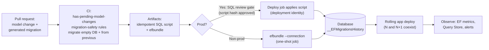
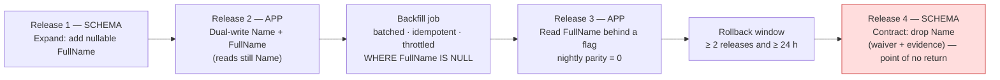
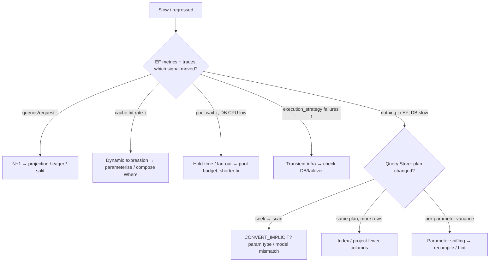
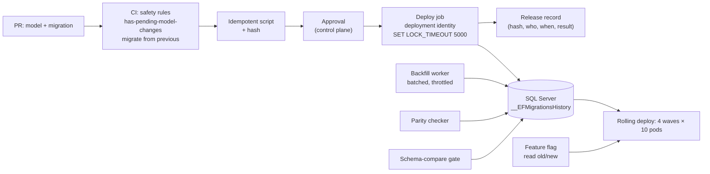
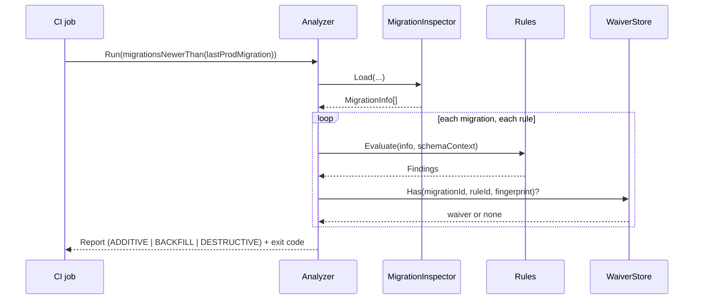

# Module 197 — LINQ & EF Core: EF Core in Production — Migrations & Zero-Downtime Schema Change, Performance Engineering, Testing Strategy, Diagnostics & Observability, Security & Multi-Tenancy Operations

> Domain: LINQ & EF Core | Level: Beginner → Expert | Prerequisite: [[01-EFCore-Foundations-DbContext-Lifetime-Pooling-Providers-Resilience-ReleaseStrategy]] (pooling, resilience, the EF 8/9/10 upgrade table — assumed), [[02-EFCore-Modeling-Conventions-Relationships-Inheritance-ComplexTypes-JSON-ValueConversion-QueryFilters]] (the model whose *drift* this module guards), [[03-EFCore-Querying-ChangeTracking-SaveChanges-Concurrency-Transactions-BulkOperations]] (the runtime behaviour this module measures), [[../26-CICD/04-CDPipelineOrchestration-EnvironmentPromotion-ProgressiveDelivery-ReleaseGovernance]] (where the migration step sits in a release), [[../27-Observability/01-ObservabilityFundamentals-MetricsLogsTraces-OpenTelemetry]] (signals), [[../28-Security/01-AppSecFundamentals-OWASPTop10-SecureCoding-ThreatModeling]] (injection, secrets), [[../29-Performance-Engineering/03-CachingStrategies-DataAccessPerformance]] (caching outside the database), [[../04-SQL-Server/01-Indexing-Query-Execution-Plans]] (plans, sniffing — §2.4 and §14 depend on it)
>
> **Scope note:** Fourth and last technical module of `56-LINQ-EFCore` (Module 198 is the interview Q&A). Modules 194–196 explained the mechanism; this module is the **operating discipline**: how schema changes reach production without data loss or downtime, how to find and fix slowness, how to test code that touches a database, how to see what EF is doing, and how to secure it. It is anchored to the Microsoft Learn *Managing Schemas (Migrations)*, *Applying Migrations*, *Testing*, *Performance*, *Logging/Events/Diagnostics (Metrics, Interceptors)*, and *O/RM considerations* pages and the entityframeworktutorial.net *Migrations, Generate SQL Script, PMC/CLI Commands, Existing Database, Logging* pages (coverage matrix: Module 194 §1.6). **This closes the "EF Core in practice" half that the former Module 190 was reserved for.**
>
> **Accuracy caveat, stated once:** migration behaviour changed in EF 9 (locking, pending-model-changes exception, single transaction) and again in EF 10 (single transaction reverted). Anything quoted as a default is anchored to the Microsoft Learn snapshot read on 2026-09-19; **EF Core 11 (planned November 2026) features documented on that snapshot — for example `dotnet ef database update --add` — are unreleased and are not design inputs.**

---

## 1. Fundamentals

### 1.1 What "production-ready EF Core" means

Getting `SaveChanges` to work is a tutorial. Production readiness is answering, *before* an incident, five questions — the same ones the Microsoft Learn overview lists under "EF O/RM considerations": **(1)** how does the schema change safely (migrations and deployment); **(2)** how fast is it under real load and how do we know when it regresses (performance); **(3)** how do we test code whose correctness depends on a database (testing); **(4)** what is EF doing right now (logging, metrics, tracing); **(5)** who can do what to our data (security and tenancy). Each is a section below.

### 1.2 Migrations in one page (the tutorial-site path)

A **migration** is a versioned, C# description of a schema change, generated by diffing the current model against a stored **model snapshot**. The tutorial's *Migrations*, *Generate SQL Script* and *PMC / CLI Commands* pages give the workflow:

| Task | .NET CLI | Package Manager Console |
|---|---|---|
| Add a migration | `dotnet ef migrations add AddBlogCreatedTimestamp` | `Add-Migration AddBlogCreatedTimestamp` |
| Apply to a database | `dotnet ef database update` | `Update-Database` |
| Apply up to a named migration (also rolls **back**) | `dotnet ef database update AddNewTables` | `Update-Database AddNewTables` |
| Remove the latest (unapplied) migration | `dotnet ef migrations remove` | `Remove-Migration` |
| List | `dotnet ef migrations list` | `Get-Migration` |
| SQL script | `dotnet ef migrations script [from] [to]` | `Script-Migration` |
| Idempotent SQL script | `dotnet ef migrations script --idempotent` | `Script-Migration -Idempotent` |
| Self-contained deployment executable | `dotnet ef migrations bundle` | `Bundle-Migration` |
| Reverse-engineer an existing database | `dotnet ef dbcontext scaffold "<conn>" Microsoft.EntityFrameworkCore.SqlServer` | `Scaffold-DbContext` |

Each migration adds three files (Microsoft Learn): the main file with **`Up`** (apply) and **`Down`** (revert), a **Designer** metadata file, and a **`<Context>ModelSnapshot.cs`** — "a snapshot of your current model. Used to determine what changed when adding the next migration." Applied migrations are recorded in the **`__EFMigrationsHistory`** table (`MigrationId`, `ProductVersion`).

### 1.3 The one sentence to remember

**A migration is generated code that changes a production database; treat it as code you must review, test and stage — never as a build artifact.** The generator does not know your intent (a rename looks like a drop-and-add), your data volume, or your deployment topology.

---

## 2. Deep Dive

*§2 is written to stand alone. The module's discriminating question is §2.10.*

### 2.1 Migration anatomy, and the traps in generated code

**How generation works.** `migrations add` builds the current model, compares it to the **snapshot**, and emits `Up`/`Down` operations for the difference, then rewrites the snapshot. The snapshot — not the live database — is what the *next* diff is computed against. Consequences: a hand-edited snapshot or a deleted migration corrupts every future diff; and **the tool cannot detect that the live database differs from the snapshot** (§2.11).

**The rename trap (Microsoft Learn's canonical example).** Renaming a property `Name` → `FullName` generates:

```csharp
migrationBuilder.DropColumn(name: "Name", table: "Customers");
migrationBuilder.AddColumn<string>(name: "FullName", table: "Customers", nullable: true);
```

"EF Core is generally unable to know when the intention is to drop a column and create a new one (two separate changes), and when a column should be renamed. If the above migration is applied as-is, **all your customer names will be lost.**" The fix is to hand-edit to `migrationBuilder.RenameColumn(name: "Name", table: "Customers", newName: "FullName")`. Scaffolding prints a *data-loss warning* for drops — **treat that warning as a stop sign** (§4).

**Data operations (Microsoft Learn).** Choose by whether values are known when the migration is written: **`InsertData`/`UpdateData`/`DeleteData`** for fixed values with explicit keys (provider-neutral; also work in scripts and bundles); **`Sql`** when values are *computed from existing data* (branch on `migrationBuilder.ActiveProvider`, and *throw* for an unsupported provider rather than silently skipping); a **custom operation** for reusable provider-specific SQL. **Never use the live `DbContext` or entity CLR types inside a migration** — "historical migrations must continue to compile and behave the same after those types are changed or removed." The safe column-transform sequence: **add the destination nullable → populate → make required → drop the source.** Implement `Down` only when the original values can be reconstructed; otherwise fail explicitly and require a backup restore.

**Objects EF does not model** — stored procedures, triggers, views, functions, full-text catalogs: scaffold an **empty migration** and put `migrationBuilder.Sql(...)` in it (use `EXEC('…')` when a statement must be first in its batch). **Transactions:** EF normally wraps each migration in its own transaction; some operations cannot run inside one, so pass `suppressTransaction: true` to `Sql`. **EF 9 spanned *all pending migrations* in one transaction; EF 10 reverted that** because it "caused issues in various migration scenarios" — re-test any partial-failure recovery procedure across the upgrade.

**Detecting drift between model and migrations.** `dotnet ef migrations has-pending-model-changes` (EF 8+) — or `context.Database.HasPendingModelChanges()` in a unit test — fails when someone changed the model and forgot the migration. Since EF 9 **`Migrate()`/`MigrateAsync()` throws** in that condition (`RelationalEventId.PendingModelChangesWarning`). `GetPendingMigrationsAsync()` compares migration *files* to the *database history* and does **not** detect uncaptured model changes — a distinction interviewers probe.

**Removing and resetting.** `migrations remove` removes only the **latest** migration and must never be used on one applied to a shared or production database — add a **corrective migration** instead. **Squashing** has no automated command: back up; delete rows from `__EFMigrationsHistory`; delete the Migrations folder; add a new initial migration and generate its script; insert **one** history row marking it applied (existing databases) while new databases run it for real; **custom migration code is lost** with the folder and must be re-applied by hand; test both paths.

### 2.2 Deployment strategies — who applies the migration, with what identity, and what protects concurrency

The Microsoft Learn *Applying Migrations* page reduces to this decision table:

| Strategy | Recommended use | SQL reviewable before run | Needs SDK + source at run | Uses EF migration lock | Runs `UseSeeding` |
|---|---|---|---|---|---|
| **SQL script** (`migrations script --idempotent -o artifacts/migrations.sql`) | DBA-controlled or **review-gated** deployment | **Yes** | No | **No** (applied outside EF) | No |
| **Migration bundle** (`migrations bundle` → `efbundle`) | **Automated** deployment | No | No (self-contained: not even the runtime) | Yes | Yes |
| **EF CLI tools** (`database update`) | **Local development and testing** | No | Yes | Yes | Yes |
| **Runtime migration** (`Database.MigrateAsync()`) | Apps that accept startup-migration trade-offs | No | No | Yes | Yes |

**Why the tools are wrong for production:** the SQL is applied "without giving the developer a chance to inspect or modify" it, and the SDK, EF tool and *source* must exist on the target. **Why runtime migration is risky:** before EF 9 concurrent instances could migrate simultaneously "and fail (or worse, cause data corruption)"; the app needs **elevated schema privileges** at runtime; rollback is not available "out of the box"; and it fights high availability. **EF 9+ takes a database-wide migration lock** so concurrent `Migrate` calls serialise — which fixes the *corruption* but not the privilege or rollback problems. The lock mechanism is provider-specific — SQLite uses a lock table that "can become abandoned if the process terminates unexpectedly" and block later migrations. **Never wrap `MigrateAsync` in an explicit transaction** (unsupported), and **never call `EnsureCreatedAsync()` before `MigrateAsync()`** — it bypasses migrations and makes `Migrate` fail.

**Two identities.** "Use a separate identity for deployment that has permission to change the schema. The identity used by the application at run time should normally have only the permissions the application needs to read and write data." A compromised application credential must not be able to `DROP TABLE`. This single rule removes the strongest argument for runtime migration.

**Bundle operational rules (Microsoft Learn).** Generate in CI; run as a **one-shot deployment job** after the database is healthy; **do not** install the SDK or run `dotnet ef` in the application image, and **do not** make every replica run migrations from its entrypoint; configure the platform not to restart the migration container after a successful exit. **Set the environment explicitly** when generating *and* running (`ASPNETCORE_ENVIRONMENT=Production`) — the tools default to `Development`, so an unset variable can make a bundle load **development user secrets**. Supply the connection at run time (`efbundle --connection "$DEPLOYMENT_CONNECTION_STRING"`) from the deployment system's secret store — never embed it and never commit it. If context configuration reads `appsettings.json`, copy it beside the bundle. A bundle **cannot show its SQL** — so where SQL must be reviewed, generate the script instead. **Rollback:** `efbundle <PreviousMigration> --connection …` (or `0`) runs the `Down` operations of every newer migration — "may result in data loss"; and configured seeding runs *after* a downgrade, so it must tolerate the older schema.

*Push-back: "Runtime `Migrate()` is fine — EF 9 added a lock."* The lock removes one failure (concurrent corruption). It does not give you a reviewed script, a least-privilege runtime identity, a rollback path, or coordination with rolling deployment — Microsoft's own summary: "A separate migration deployment step is still preferred when review, least-privilege credentials, coordinated rollout, or high availability is important."

### 2.3 Zero-downtime schema change — expand/contract, the lock queue, backfill, rollback

**The problem.** In a rolling deployment, version **N** and version **N+1** of the application run *simultaneously* against **one** database for the length of the rollout — and, if you keep a rollback option, for hours afterwards. A migration is applied **once**. So the schema at any instant must be **compatible with both versions**. This is the property migrations do not give you and the reason "apply the migration, then deploy" — or the reverse — breaks under load.

**EF-specific compatibility facts.** EF selects columns explicitly, so an **old** app tolerates *extra* columns it does not know about. But an old app's `INSERT` omits a new column — so a new column must be **nullable or have a default** or old-version inserts fail. Conversely a new app reading a column the migration has not yet added fails at run time. Hence: **additive first, destructive last, never both in one release.**

**Expand / contract (parallel change) — five phases, each its own release:**

| Phase | Schema | Application | Reversible? |
|---|---|---|---|
| **1. Expand** | Add new column/table (nullable, default) — additive only | No use yet | Yes (drop later) |
| **2. Dual-write** | — | N+1 writes **both** old and new; reads still old | Yes |
| **3. Backfill** | Populate new from old, **batched** | Running | Yes (idempotent, resumable) |
| **4. Switch reads** | — | Read new (behind a flag); compare parity | Yes (flip flag) |
| **5. Contract** | Drop old column/table — only **after ≥ 2 releases** and the rollback window | Old code gone | **No — point of no return** |

**Worked example — the rename that Microsoft Learn warns about, done safely.** `Name` → `FullName` on a 200 M-row `customers` table: release 1 adds nullable `FullName`; release 2 dual-writes; a background job backfills; release 3 reads `FullName` behind a flag; release 4 drops `Name`. Four small, individually reversible steps instead of one irreversible rename.

**Batched backfill with EF (idempotent and resumable):**

```csharp
int n;
do {
    n = await db.Customers.Where(c => c.FullName == null).OrderBy(c => c.Id).Take(5_000)
        .ExecuteUpdateAsync(s => s.SetProperty(c => c.FullName, c => c.Name), ct);   // set-based; Take is supported
    await Task.Delay(TimeSpan.FromMilliseconds(80), ct);                               // throttle: leave headroom for OLTP
} while (n > 0);
```
The `WHERE FullName IS NULL` makes it **idempotent** (a restarted job continues where it left off) and self-limiting. Chunk size trades lock duration against statement count; small chunks avoid escalating to a table lock and keep the transaction log and replication lag bounded.

**The lock-queue trap — why the *duration* of DDL is not the danger.** A schema-modifying statement needs a **schema-modification (Sch-M) lock**. If any long-running query holds a schema-stability lock, the `ALTER` **waits** — and *every new query on the table queues behind the waiting `ALTER`* even though the `ALTER` has done nothing yet. A metadata-only `ADD COLUMN` that "takes milliseconds" can therefore stall an entire table for as long as the slowest concurrent transaction. Mitigations: **`SET LOCK_TIMEOUT`** on the migration session so the DDL fails fast instead of queuing (then retry off-peak); `WAIT_AT_LOW_PRIORITY` where supported (online index operations, partition switching); check for long transactions first; deploy outside peak. Adding a nullable column, or a NOT NULL column with a constant default, is generally metadata-only on modern SQL Server — **verify for your edition and version**. Rebuilding a large index is not: request `IsCreatedOnline()` (EF's SQL Server option; requires an edition that supports online operations) — on a 400 M-row table an offline build blocks writers for its whole duration.

**Rollback, honestly.** `Down` migrations are a convenience for development, **not** a production rollback plan: they can drop data, and the application version may already have written data the older schema cannot hold. The production rollback is **forward-fix or flip the feature flag**; the schema stays expanded (harmless) until the contract phase. Microsoft Learn: "Don't delete a migration that has been applied to a shared, test, or production database. Usually, keep the migration in the project and add a new corrective migration."

**Teams and the snapshot.** The snapshot is a merge-conflict magnet: two branches that each add a migration produce **diverged migration trees**. Rules: **one migration per pull request; never hand-edit the snapshot; on divergence, rebase, remove your unpublished migration, and re-scaffold on top of the merged snapshot**; CI runs `has-pending-model-changes`; migrations are ordered by their timestamp prefix. A migration in the middle of the sequence is never deleted by hand.

**Existing databases (tutorial: *Existing Database*).** `dotnet ef dbcontext scaffold "<conn>" Microsoft.EntityFrameworkCore.SqlServer --output-dir Models --context-dir Data --data-annotations --force` reverse-engineers entities and a context. Three cautions. **(1)** `--force` **overwrites** files — any hand-added mapping (a `varchar` `IsUnicode(false)`, a value converter, a filter) is **lost**; put customisation in **partial classes** and `OnModelCreatingPartial`, never in the generated files (§14 is exactly this loss). **(2)** Scaffolding produces a model, not migrations. To move to code-first, create an initial migration and **record it as already applied** (insert its row into `__EFMigrationsHistory`, as in squashing) — otherwise the first `Update-Database` tries to create tables that exist. **(3)** If the database remains the source of truth (a DBA-owned schema), keep re-scaffolding in CI and **diff the model** — treat the diff as a build signal.

### 2.4 Performance engineering — measure, attribute to a layer, fix the layer

**Method (Microsoft Learn).** "It's important not to rush into optimization without data showing a problem." Data-access performance has **four layers**: **(a) pure database performance** (indexes, plans, statistics), **(b) network data transfer** (columns fetched, cartesian explosion), **(c) network round trips** (N+1, chatty code — "the time taken for a query to execute in the database can be dwarfed by the time packets travel"), **(d) EF runtime overhead** (compilation, tracking) — the last, "likely to be negligible in most cases." **Always attribute a symptom to a layer before choosing a fix**; most "EF is slow" tickets are (a)–(c).

**Triage table — symptom → layer → tool → fix:**

| Symptom | Likely layer | First tool | Typical fix |
|---|---|---|---|
| One endpoint slow, others fine | (a) or (b) | `ToQueryString`, Query Store, actual plan | Index; project fewer columns; remove `Include` |
| Latency proportional to list size | (c) N+1 | Command-count test; log | Projection / eager load / split query |
| Huge result sets, high memory | (b) | Log row counts; `dotnet-counters` | Pagination; `AsNoTracking`; projection |
| p99 rises with load, DB CPU low | Pool/queue | `SqlClient` pool counters | Pool budget (Module 194 §2.7); shorter transactions |
| Query cache hit rate < 100 % | (d) | `compiled_query_cache_hits/misses` | Fix dynamic expression building (Module 196 §2.1) |
| High CPU in app, DB idle | (d) | Profiler; allocations | Compiled queries; pooling; fewer tracked entities |
| Slow after deploy, same code path | (a) plan regression | Query Store plan compare | Parameter type, statistics, sniffing (§2.10, §14) |
| Slow only for some tenants/values | (a) sniffing | Plan per parameter | `OPTION (RECOMPILE)`/`OPTIMIZE FOR` via raw SQL or hint |

**The efficient-querying checklist.** Project to what you need; `AsNoTracking` for reads; never return an unbounded result (paginate — keyset, Module 196 §2.7); avoid N+1; choose single vs split deliberately; stream only when the consumer is fast (`AsAsyncEnumerable` holds the connection); remember a retrying strategy **buffers**; index every predicate/join/order column; keep transactions short. **Efficient updating:** batching (default), `ExecuteUpdate`/`ExecuteDelete` for set-based work, chunked bulk with `ChangeTracker.Clear()`, `SqlBulkCopy` for very large loads (Module 196 §2.9).

**Runtime-overhead tools, with the Microsoft Learn numbers:**

| Tool | Measured (single-row fetch, local SQL Server) | Limits |
|---|---|---|
| **`DbContext` pooling** | 701.6 → 350.1 µs (**2.0×**); 50.38 → 4.63 KB (**10.9× less allocation**) | Per-request state trap (Module 194 §2.6) |
| **Compiled queries** (`EF.CompileAsyncQuery`) | 671.6 → 564.2 µs (**−16 %**), 13 → 9 KB (1 blog); 709.8 → 645.3 µs (**−9 %**), 18 → 13 KB (10 blogs) | One model only; scalar parameters only; no dynamic composition — "the more complex the LINQ query… the more gains can be expected" |
| **Dynamic query done right** | constant tree 1,665.8 µs → parameterised 757.1 µs (**2.2×**) | The cache-pollution effect on *other* queries is worse than the direct cost |
| **Compiled models** (`dotnet ef dbcontext optimize`) | Startup time for hundreds–thousands of entity types | No global query filters, no lazy-loading/change-tracking proxies, manual regeneration (Module 194 §2.8) |
| **`EnableThreadSafetyChecks(false)`** | Removes a per-operation check | Only after proving no concurrent use |

**Reading those numbers like a Principal.** Compiled queries save **~108 µs** on a query that takes ~670 µs locally; against a real 5 ms database call that is **~2 %** — worth doing for a proven hot path executed millions of times, not as a habit. **Pooling's** ~350 µs is ~7 % of a 5 ms call. **The right order of operations is: fix the SQL/index/round-trips first (orders of magnitude), then tracking/projection (2–10×), then pooling/compiled queries (single-digit percent).** Micro-optimising layer (d) while layer (a) is scanning 60 M rows is the classic mistake.

**Caching outside the database.** Microsoft Learn: "the most efficient way to interact with a database is to not interact with it at all… scaling the database tier is usually far more complicated" than scaling the application tier. EF Core has **no built-in second-level cache**; caching is your design decision — `IMemoryCache`/`HybridCache`/Redis in front of *read models* with TTL and explicit invalidation. Cache **projected, immutable DTOs**, never tracked entities (a cached tracked entity is Module 194 §4's stale-tracker bug with a longer lifetime); state the staleness contract; never cache authorization-relevant data without an invalidation path (`29-Performance-Engineering/03`).

**Parameter typing — the silent index killer (SQL Server).** EF maps a `string` to **`nvarchar`** unless told otherwise. Comparing an `nvarchar` parameter to a **`varchar` column** forces SQL Server to **implicitly convert the column** (`CONVERT_IMPLICIT`) — turning an **index seek into an index scan**. The same happens for `decimal` precision mismatches and `DateTime` vs `datetime2`/`date`. Fix at the model: `IsUnicode(false)` + `HasMaxLength(n)` so EF sends `varchar(n)`. §14 is this incident.

### 2.5 Testing — the Microsoft Learn decision, and a strategy that survives contact with production

**The decision (Microsoft Learn *Testing*):** "whether your tests will involve your production database system — just as your application does — or whether your tests will run against a test double." Their conclusions, each with the reason an interviewer expects:

| Approach | Microsoft's assessment | Why |
|---|---|---|
| **In-memory provider** | "highly limited… we discourage its use" | Not a relational database: **no transactions, no raw SQL, no constraints/FKs enforced the same way, different case-sensitivity**, no concurrency semantics — tests pass for code that fails in production |
| **Mocking `DbSet`/`IQueryable`** | "complex and difficult… same disadvantages" — discouraged | You test your mock's LINQ provider, not EF's translation |
| **SQLite in-memory** | Better — a real relational engine — "but there will still be some important discrepancies" | Different types/collation/functions; **provider-specific `EF.Functions` cannot be tested at all**; different migration/lock behaviour |
| **Repository over EF, mock the repository** | Possible; "alters the architecture… more implementation and maintenance costs" | You exclude EF from the test entirely — including everything EF does |
| **Test against the real production engine and version** | **Recommended**: "at least some tests against your database… are usually necessary in any case" | Only way to catch provider/version-specific behaviour — and upgrade regressions ("catch breaking changes when upgrading EF Core") |

**A layered strategy.**

1. **Domain unit tests without EF** — aggregates and rules are plain C#; fast; the bulk of tests.
2. **Query/mapping integration tests on the real engine** — a SQL Server **container (Testcontainers)** started **once per test run**; the schema created by **applying the real migrations** (never `EnsureCreated` if production uses migrations — otherwise migration bugs are invisible); a **per-test reset** (Respawn — truncate in FK order — or a per-test transaction that rolls back, or a database per test class for parallelism).
3. **Migration tests** — apply all migrations to an empty database; apply the *previous release's* schema then the new migrations; assert `HasPendingModelChanges()` is false; run the migration-safety rules (§13).
4. **Concurrency tests** — two `Task`s against the real engine (Module 196 §11 Hard), because concurrency semantics exist only in a real database.
5. **Query-shape tests** — command-count bounds independent of N; captured SQL and **parameter types** compared to an approved snapshot (§11 Expert); this is the upgrade regression net for §2.8.
6. **Model-rule tests** — the executable rules of Module 195 §13.
7. **A handful of end-to-end tests** through `WebApplicationFactory`, swapping the connection via `ConfigureDbContext` (EF 9) so test configuration composes with, rather than replaces, the app's.

**Cost honesty.** A SQL Server container costs ~10–20 s to start *once per run* (typical; measure yours) and tens of milliseconds per test reset — an acceptable price for tests that mean something. The objection "real-database tests are slow" is mostly a fixture-design problem; the objection "they are flaky" is a test-isolation problem.

### 2.6 Diagnostics and observability — seeing what EF does

**Logging.** Enable via `Microsoft.Extensions.Logging`; the category `Microsoft.EntityFrameworkCore.Database.Command` logs each SQL command. Parameter **values** are excluded unless `EnableSensitiveDataLogging` — **never in production** (PII in log stores); EF 10 also redacts *inlined constants* as `?`. Use **event IDs** (`RelationalEventId.CommandExecuted`, `…CommandError`, `…MultipleCollectionIncludeWarning`, `CoreEventId.CollectionWithoutComparer`, `…PendingModelChangesWarning`) to alert on specific conditions, and `ConfigureWarnings(w => w.Throw(...))` to make selected warnings **build/test failures**.

**Attribution.** `TagWith("Service.Class.Method")` (and `TagWithCallSite()`) adds a comment to the SQL so a top-N slow statement in Query Store, `sys.dm_exec_query_stats` or the APM points at a code path. **Convention: every non-trivial query is tagged** — this converts the DBA's list from anonymous SQL into engineering to-dos.

**Metrics (EF 9+, `System.Diagnostics.Metrics`, meter `Microsoft.EntityFrameworkCore`)** — the exact instruments (Microsoft Learn):

| Metric | Meaning | What it detects |
|---|---|---|
| `microsoft.entityframeworkcore.active_dbcontexts` | Live undisposed contexts | **Growth = leak** — contexts not disposed (with pooling it includes idle pooled ones) |
| `microsoft.entityframeworkcore.queries` | Cumulative queries | Load; **queries-per-request drift = N+1** |
| `microsoft.entityframeworkcore.savechanges` | Cumulative `SaveChanges` calls | Write load (a call batches many changes) |
| `microsoft.entityframeworkcore.compiled_query_cache_hits` / `…_misses` | Query-cache effectiveness | **Sustained misses = dynamic-query defect** (should reach ~100 % hit rate after warm-up) |
| `microsoft.entityframeworkcore.execution_strategy_operation_failures` | Failed operations inside an execution strategy, **including each failure within multiple attempts** | **Transient infrastructure trouble** — the leading indicator of a brownout |
| `microsoft.entityframeworkcore.optimistic_concurrency_failures` | `DbUpdateConcurrencyException` count | **Contention** — the hot-row signal (Module 196 §12) |

Collect with **OpenTelemetry** (`AddMeter("Microsoft.EntityFrameworkCore")`) or, for older EF, the legacy event counters: `dotnet counters monitor --counters Microsoft.EntityFrameworkCore -p <PID>`. **Traces:** `OpenTelemetry.Instrumentation.SqlClient` gives a span per command under the request span, so a slow request shows *which* SQL. **Correlate** the three: the trace names the request, the tag names the code path, Query Store names the plan.

**Interceptors** (the supported extension point): `SaveChangesInterceptor` (audit, soft delete, outbox), `DbCommandInterceptor` (SQL capture, command counting, adding a `traceparent` comment), `DbConnectionInterceptor` (RLS `SESSION_CONTEXT`, Entra-token acquisition), `DbTransactionInterceptor`, and (EF 7+) `IMaterializationInterceptor`/`IQueryExpressionInterceptor`. Keep them **stateless singletons** and **cheap** — they run on every command.

**SLOs and alerts that mean something.** Alert on **pool wait-count > 0 for 60 s** (leading), `execution_strategy_operation_failures` rate (transient trouble), `optimistic_concurrency_failures` rate (contention), deadlock count, **query-cache hit rate < 99 % for 10 min**, **p99 per tagged query**, and *the age of the oldest unpublished outbox message* (Module 196 §2.13). Each maps to a section of this domain.

### 2.7 Security and multi-tenancy operations

**SQL injection.** `FromSql($"… {x}")` and `ExecuteSql($"…")` take a `FormattableString` and send each value as a parameter — **safe**. `FromSqlRaw`/`ExecuteSqlRaw` with **string concatenation is injectable**; EF 10 adds an analyzer that "warns if concatenation is performed within a 'raw' SQL method invocation" — make it a build error. **Dynamic identifiers** (a user-chosen `ORDER BY` column) cannot be parameterised: **allow-list** the column names in code. LINQ itself is parameterised.

**Secrets and identity.** Connection strings from a secret store (Key Vault/Secrets Manager); prefer **passwordless** (managed identity / Entra ID — `Authentication=Active Directory Default`) so there is nothing to leak; never embed in a bundle or commit; **separate deployment and runtime identities** (§2.2); the runtime identity gets DML only, and `INSERT`-only on append-only tables (Module 196 §17).

**Data protection.** TDE (at rest, transparent); **Always Encrypted** (client-side, driver-mediated — enabled through the connection's column-encryption setting; supports equality on deterministic columns, **not range/`LIKE`** — design queries accordingly and test batching/`OUTPUT` behaviour on your provider version); **application-level** encryption via a value converter (protects data from the DBA, but the column is then **unqueryable**); **PCI:** the model never holds a PAN (Module 195 §2.14). **`EnableSensitiveDataLogging` off in production**; redact PII in interceptors' log output. **GDPR erasure:** a soft-delete flag is **not** erasure — use crypto-shredding (delete the per-subject key) or hard delete with legal-hold rules.

**Over-posting / mass assignment.** Never bind a request body directly to an entity and `Update()` it (Module 196 §2.8) — the client can set columns it should not (`IsAdmin`, `Balance`). Bind to a DTO and copy permitted fields.

**Tenancy models, and what each costs to operate.**

| Model | Isolation | EF mechanics | Operational cost |
|---|---|---|---|
| **Shared schema, tenant column** | Logical (filter + RLS) | Global query filter on a context-instance tenant id; **pooling needs the scoped-factory pattern** (Module 194 §2.6); RLS via `SESSION_CONTEXT` set on every connection open | Cheapest; one migration; noisy-neighbour; a filter bug is a leak — hence RLS |
| **Schema per tenant** | Stronger | Vary the model per schema with a custom `IModelCacheKeyFactory` (else EF caches one model); one model instance per schema in memory | Migrations fan out per schema; model-cache memory ∝ tenants |
| **Database per tenant** | Strongest (also residency) | Connection string per tenant; **one ADO.NET pool per distinct connection string** → connection budget ∝ tenants; `DbContext` pooling does not span connection strings | **N databases to migrate** — fan-out with a bundle, tracking version skew per tenant; highest cost, best blast-radius containment |

**Migrating many databases.** Run the **same bundle/script** across all tenant databases from a controller that records per-tenant applied migration, retries idempotently, and **halts on the first failure**; expect **version skew** during the rollout — the application must tolerate tenants at N and N+1 (§2.3 applies per tenant). **Change control (SOX):** the reviewed script's hash is the approved artifact; the pipeline applies *that hash*, records who approved and when, and the runtime identity cannot alter schema — evidence by construction.

### 2.8 The upgrade runbook — a procedure, not a hope

Module 194 §2.12 lists *what* changes; this is *how to find out safely* (EF 8 and 9 leave support **10 November 2026**; EF 10 is LTS to **10 November 2028**; EF 11 is planned for November 2026):

1. Upgrade **all `Microsoft.EntityFrameworkCore.*` packages together** to one version (mixed versions fail in confusing ways); third-party providers (Npgsql, Pomelo, Oracle) **lag** Microsoft's — check availability *before* committing to a date. Use central package management.
2. Read the version's **breaking-changes** page; grep the codebase for each affected API.
3. Run the **full test suite on the real engine** (§2.5) — the docs explicitly cite "catch breaking changes when upgrading EF Core and other dependencies."
4. **Diff the SQL** of the ~20 critical queries and the **parameter types** against approved snapshots (§11 Expert) — EF 10's parameterised-collection change alters SQL for every `Contains`.
5. **Add a migration on a copy of production** and review it — EF 10's automatic `nvarchar → json` change and `UseNamedDefaultConstraints` renames appear here.
6. Load-test the hot paths and compare **query-cache hit rate, p99 per tagged query, and plans in Query Store** before/after.
7. **Canary** one pod/region; alert on the §2.6 signals; rollback = redeploy the old build (safe *because* step 5 is additive or waived).

### 2.9 Architecture stance — repository, EF versus Dapper, and leaving EF6

**Repository over `DbContext`?** `DbContext` is already a Unit of Work and `DbSet<T>` a repository. Microsoft's testing page names the honest cost of adding another layer: it "alters the architecture of your application in a way which could be significant, and involves more implementation and maintenance costs." A repository is justified when it expresses a **domain-level contract** (an *aggregate* repository: `GetAsync(id)`/`SaveAsync(aggregate)`), when persistence genuinely may change, or when the *query side* must be separated (CQRS, `34-CQRS`). It is **not** justified as a thin pass-through that re-exposes `IQueryable` (a leaky abstraction that only adds indirection) or to enable mocking (§2.5 says mocking hides the very behaviour worth testing). Prefer: **aggregate repositories on the write side; direct projection queries (or a read-model) on the read side.**

**EF Core vs Dapper vs raw SQL** — a policy, not a debate: EF Core by default for transactional aggregate work and CRUD; **Dapper/raw SQL by measured exception** for reporting, bulk, and shapes EF cannot express; **never** two idioms in one feature without a reason; when both are needed in one transaction, share the `DbConnection`/`DbTransaction` (Module 194 §2.9). The Microsoft performance guidance supplies the deciding fact: EF overhead is usually negligible next to network and database time.

**Leading a migration from EF6 to EF Core** (a common Principal scenario). It is a *port*, not an upgrade. Strategy: (1) **inventory** EDMX usage, lazy-loading reliance, `ObjectContext`/`SqlQuery` calls, TPT/TPH assumptions; (2) scaffold the model and **replace the designer**; (3) **behaviour differences to test explicitly** — lazy loading is opt-in; `Include` and query translation semantics differ (client-evaluation rules since 3.0); string comparison/collation behaviour; `Find`/tracking nuances; transaction/`SaveChanges` behaviour; entity-splitting and many-to-many mapping; (4) **strangler**: port one bounded context at a time behind the same interface, **run old and new side by side with parity tests** (same inputs → same rows) before cutover; (5) plan **.NET target** — EF 10 requires .NET 10 and "will not run on .NET Framework", so a .NET Framework estate must move runtime *and* ORM, which reorders the roadmap.

### 2.10 The module's own discriminating question — worked at both levels

> **"After a release that only added one column, an endpoint's p99 went from 40 ms to 4 s. Walk me through it."**

**The Senior answer (adequate).** "Turn on SQL logging, find the slow query, look at the plan, add an index." Reasonable — and it misses that *nothing about the query changed*.

**The Staff/Principal answer (excellent).** A structured triage that **starts with what changed and which layer it hit**:

1. **Contain first:** compare the release's diff; if the flag/rollback is cheap, roll back or disable — diagnosis follows containment.
2. **Metrics before logs:** did `compiled_query_cache_misses` jump (a dynamic-query change)? did `active_dbcontexts` or pool wait rise? `execution_strategy_operation_failures` (the migration caused failures)? That places the fault in layer (d), pool, or database.
3. **A new column can hurt without a code change — enumerate the mechanisms:** (a) **the column is large or JSON and the entity is materialized everywhere** — every query on that entity now fetches it (`SELECT` lists all mapped columns) → fix by **projection** or moving it to a side table; (b) **the migration itself** — a large-table `ALTER`/backfill still running, holding locks, or the **lock-queue stampede** (§2.3) — check `sys.dm_exec_requests` for `LCK_M_SCH_M` chains; (c) **a plan-cache flush and statistics change** after the DDL — plans recompile, possibly to a worse plan (**parameter sniffing**) — compare plans in Query Store; (d) **a parameter-type change** — a re-scaffold, a converter or a `HasColumnType` edit made EF send `nvarchar` against a `varchar` column → `CONVERT_IMPLICIT` → **scan** (§2.4, §14); (e) **a non-covering index** — the new column is now `SELECT`ed, so the covering index no longer covers → key lookups per row.
4. **Prove it with the plan:** actual plan, look for `CONVERT_IMPLICIT`, scans, key lookups, estimated-vs-actual row skew.
5. **Fix at the right layer** (model, projection, index, statistics, hint) and **add the regression net** — a SQL/parameter-type snapshot test (§11 Expert) so this *class* cannot recur silently.
6. **Close the process gap:** why did staging not show it? (Data volume — a 10 k-row staging table never scans slowly.) Add a production-scale performance environment or a plan-regression check on representative data.

The discriminator is **item 3 combined with item 6**: the Senior answer optimises the query that is slow; the Principal answer knows a schema change can slow queries *that did not change*, lists the mechanisms, and asks why the process could not see it.

### 2.11 What this cannot do — and the failures with no detector

- **Schema drift between the snapshot and the live database has no runtime detector** — a hotfix `ALTER` applied out of band makes queries fail only when they touch the column. Detect with a **schema-compare** step (model → generated script vs live catalog) in CI/CD.
- **A migration that is correct and slow** (an offline index build, a table-rewriting `ALTER`) passes every test on a small database — only a production-scale rehearsal reveals it.
- **`has-pending-model-changes` checks model ↔ migrations, not migrations ↔ database.**
- **Plan regressions after an upgrade or DDL** are invisible to functional tests — only Query Store comparison or SQL/parameter snapshots see them.
- **Secrets in logs** — sensitive-data logging flipped on "temporarily" — have no detector except a startup guard and a log-scanning rule.
- **Version skew across many tenant databases** is invisible unless a controller records per-tenant migration state.
- **A `Down` migration succeeding tells you nothing about the data** that the newer version wrote.
- **A tenant filter or RLS misconfiguration is silent** — only an isolation test (Module 194 §11 Hard) and an audit query find it.

---

## 3. Visual Architecture

### 3.1 The migration pipeline — build once, review the SQL, apply with the deployment identity



### 3.2 Expand / contract across releases



### 3.3 Performance triage



### 3.4 The testing pyramid for a data-access layer (ASCII)

```
          ▲  fewer, slower, more realistic
         /E2E\        WebApplicationFactory + real DB (a handful)
        /-----\
       / Perf/ \      command-count • SQL + parameter-type snapshots • concurrency tests
      /  Shape  \
     /-----------\
    / Integration \   real SQL Server container • real migrations • Respawn reset
   /---------------\
  /  Model + Migr.  \ model-rule tests • HasPendingModelChanges • migration-safety rules
 /-------------------\
/   Domain unit tests \ plain C#, no EF, the bulk
 ▼  more, faster
```

---

## 4. Production Example

**Scenario — the rename that became a drop.** *(Illustrative composite; numbers internally consistent.)*

**Problem.** A customer-profile service renamed the C# property `Customer.Name` to `Customer.FullName` "for clarity." A one-line refactor. The pull request contained the rename and an auto-generated migration; it was approved in six minutes.

**Architecture.** CI built a migration bundle; the release pipeline ran `efbundle` against production at 02:00 as a one-shot job with the deployment identity. The pull request's migration, as generated:

```csharp
migrationBuilder.DropColumn(name: "Name", table: "Customers");
migrationBuilder.AddColumn<string>(name: "FullName", table: "Customers", type: "nvarchar(256)", nullable: true);
```

**Investigation.** At 02:07 support tickets began: profile pages rendered blank names. (1) Application logs were clean — no exceptions; `FullName` was simply `NULL` for all **1.9 million** customers. (2) `SELECT COUNT(*) FROM Customers WHERE FullName IS NULL` returned 1,900,000; `Name` no longer existed. (3) `__EFMigrationsHistory` showed the new migration applied at 02:00:41. (4) The migration file was reviewed: `DropColumn` + `AddColumn` — the exact pair Microsoft Learn warns about ("all your customer names will be lost"); the **scaffolding data-loss warning** had been printed in the developer's terminal and not in the PR.

**Root cause.** EF cannot distinguish a rename from a drop-plus-add. The generated migration was applied as-is by an automated pipeline that had **no review rule for destructive operations**, and **no expand/contract discipline** — the destructive change shipped in the same release as the code that needed the new column.

**Fix.** Recovery: **point-in-time restore** of the database to 01:59 into a side database (47 minutes for a 380 GB database), then a reviewed script copying `Name` into `FullName` for the 1.9 M rows — service degraded (names blank) for **2 h 11 min** in total. Structural: (a) the migration-safety rule set (§13) now **fails CI on `DropColumn`, `DropTable`, `AlterColumn` (narrowing) and rename-as-drop-add** unless a named waiver from the data owner is attached; (b) schema changes on tables > 1 M rows **must follow expand/contract** (§2.3), enforced by a checklist in the PR template; (c) the **idempotent SQL script is generated in CI and its diff posted on the PR** so a reviewer *sees* `DROP COLUMN`; (d) production applies only **approved script hashes**; (e) PITR restore is rehearsed quarterly so the 47 minutes is a known number.

**Trade-offs.** The gate adds a review step to legitimate drops (rare, and expand/contract makes them safe anyway); expand/contract turns a one-line rename into four releases and a backfill — slower, but each step reversible. The alternative — trusting the generator — has a proven cost: 2 h 11 min of blank names and a restore.

**Lessons.** (1) **Scaffolding's data-loss warning is a control that lives on a developer's terminal, where no process can see it** — move it into CI. (2) **A generator does not know intent**; a rename is a *human* fact. (3) The recurring pattern of this domain — **EF's model of the database (the snapshot) matched the code perfectly, and the database it produced was wrong** — appears once more: nothing detected the mismatch between *what the change meant* and *what the SQL did* except a customer.

---

## 11. Coding Exercises

### Easy — A CI gate for forgotten migrations and destructive operations

**Problem.** Fail the build if the model has changes not captured in a migration, and fail if any *unapplied-in-prod* migration contains a destructive operation without an approved waiver.

**Solution.**
```csharp
public class MigrationGateTests(DbFixture fx) : IClassFixture<DbFixture>
{
    [Fact] public void No_pending_model_changes()
    {
        using var db = fx.NewContext();
        Assert.False(db.Database.HasPendingModelChanges(),
            "Model changed without a migration. Run: dotnet ef migrations add <Name>");   // EF 8+
    }

    [Fact] public void No_destructive_operations_without_waiver()
    {
        using var db = fx.NewContext();
        var asm = db.GetService<IMigrationsAssembly>();                                    // EF infrastructure API — may change between versions
        var offenders = new List<string>();
        foreach (var (id, type) in asm.Migrations)
        {
            var m = asm.CreateMigration(type, "Microsoft.EntityFrameworkCore.SqlServer");
            foreach (var op in m.UpOperations)
                if (op is DropColumnOperation or DropTableOperation or DropForeignKeyOperation
                    || (op is AlterColumnOperation a && IsNarrowing(a)))
                    if (!Waivers.Has(id, op)) offenders.Add($"{id}: {op.GetType().Name}");
        }
        Assert.Empty(offenders);
    }
}
```
**Time complexity.** O(M × O) over migrations and operations — milliseconds for hundreds of migrations. **Space.** O(M × O).
**Optimized solution.** Only scan migrations **newer than the last one applied to production** (read the release manifest), so historical, already-applied drops do not need waivers forever; add `RenameColumn`-vs-`DropColumn+AddColumn` **pair detection** (a drop and an add of the same type in one migration is a rename smell — §4); and post the generated **idempotent script diff** as a PR comment so a human sees the SQL, not just the C#.

### Medium — Expand/contract for a rename, with a batched idempotent backfill

**Problem.** Rename `Customer.Name` → `FullName` on a 200 M-row table with zero downtime and a reversible path. Show the four releases.

**Solution.**
```csharp
// R1 (Expand) — migration: additive only
migrationBuilder.AddColumn<string>("FullName", "Customers", "nvarchar(256)", nullable: true);

// R2 (Dual-write) — entity keeps both; a SaveChanges interceptor / setter keeps them equal
public string Name { get => _name; set { _name = value; FullName = value; } }   // reads still use Name

// R2→R3 (Backfill) — hosted job, resumable and throttled
public async Task RunAsync(CancellationToken ct)
{
    int n;
    do {
        await using var db = await f.CreateDbContextAsync(ct);
        n = await db.Customers.Where(c => c.FullName == null).OrderBy(c => c.Id).Take(5_000)
              .ExecuteUpdateAsync(s => s.SetProperty(c => c.FullName, c => c.Name), ct);
        await Task.Delay(80, ct);
    } while (n > 0);
}

// R3 (Switch reads) — behind a flag, with a parity check
var name = flags.UseFullName ? c.FullName : c.Name;
// nightly: SELECT COUNT(*) FROM Customers WHERE FullName IS NULL OR FullName <> Name   → must be 0

// R4 (Contract) — only after ≥ 2 releases and the rollback window, on a reviewed waiver
migrationBuilder.DropColumn("Name", "Customers");
```
**Time complexity.** Backfill: 200,000,000 / 5,000 = **40,000 statements**; at ~40 ms each = 1,600 s ≈ 26.7 min of database time; with an 80 ms pause per chunk (≈ 2× execution) the wall-clock is ≈ 80 min — bounded lock time (~40 ms) per statement instead of one table-wide lock. **Space.** Transaction-log growth bounded per chunk; O(1) application memory.
**Optimized solution.** Size the chunk from a *measured* statement time (target 20–50 ms); throttle on replica lag / log-send-queue rather than a fixed sleep; run the parity query with `NOLOCK`-free snapshot reads; record backfill progress (`last_id`) so it survives restarts; **and never make `FullName` `NOT NULL` until parity is zero** — that final `AlterColumn` is itself a table-touching operation to schedule off-peak.

### Hard — A real-database integration fixture: container once, real migrations, fast reset

**Problem.** Build an xUnit fixture that runs tests against SQL Server, applies the real migrations once, resets data per test, and runs in parallel.

**Solution.**
```csharp
public sealed class DbFixture : IAsyncLifetime
{
    private readonly MsSqlContainer _sql = new MsSqlBuilder().WithImage("mcr.microsoft.com/mssql/server:2022-latest").Build();
    private Respawner _respawner = default!;
    public string ConnectionString { get; private set; } = default!;

    public async Task InitializeAsync()
    {
        await _sql.StartAsync();                                              // ~10–20 s, once per run (measure yours)
        ConnectionString = _sql.GetConnectionString();
        await using (var db = NewContext()) await db.Database.MigrateAsync();  // REAL migrations — never EnsureCreated
        await using var conn = new SqlConnection(ConnectionString); await conn.OpenAsync();
        _respawner = await Respawner.CreateAsync(conn, new RespawnerOptions
        { TablesToIgnore = [new Respawn.Graph.Table("__EFMigrationsHistory")], DbAdapter = DbAdapter.SqlServer });
    }
    public AppDbContext NewContext() => new(new DbContextOptionsBuilder<AppDbContext>().UseSqlServer(ConnectionString).Options);
    public async Task ResetAsync() { await using var c = new SqlConnection(ConnectionString); await c.OpenAsync(); await _respawner.ResetAsync(c); }
    public Task DisposeAsync() => _sql.DisposeAsync().AsTask();
}
// Per-test isolation: reset in a base-class constructor, OR give each test class its own database:
//   CREATE DATABASE [Test_<guid>] then MigrateAsync — enables parallel classes at the cost of one migrate per class.
```
**Time complexity.** Startup ≈ container boot + migrate (once); each reset O(#tables) `DELETE`s in dependency order (tens of ms for ~50 tables). **Space.** One container; one database per parallel class if used.
**Optimized solution.** For speed with parallelism, **create one template database** (migrated once), then per test class `RESTORE`/`CREATE DATABASE … AS COPY`-style clone from a snapshot; run migrations tests separately (they must start from *previous-release* schema); keep the fixture in a shared assembly so every service's tests use the same harness; and pin the container image tag to the **same SQL Server major version as production** — the whole point (Microsoft Learn: find "issues… that only show up when using a specific version or edition of the database server").

### Expert — A query-shape guardrail: SQL text, parameter types, and command counts

**Problem.** Catch, in CI, the regression class of §14 (`nvarchar` parameter against a `varchar` column) and N+1, and give upgrades a SQL-diff net.

**Solution.**
```csharp
public sealed class SqlRecorder : DbCommandInterceptor
{
    public readonly ConcurrentQueue<Captured> Commands = new();
    public override ValueTask<InterceptionResult<DbDataReader>> ReaderExecutingAsync(
        DbCommand c, CommandEventData e, InterceptionResult<DbDataReader> r, CancellationToken ct = default)
    {
        Commands.Enqueue(new(c.CommandText, c.Parameters.Cast<SqlParameter>()
            .Select(p => (p.ParameterName, p.SqlDbType, p.Size)).ToArray()));
        return base.ReaderExecutingAsync(c, e, r, ct);
    }
}

[Fact] public async Task Instrument_lookup_uses_varchar_parameter_and_seeks()
{
    var rec = fx.Recorder; rec.Commands.Clear();
    await using var db = fx.NewContext(rec);
    await db.Instruments.AsNoTracking().SingleAsync(i => i.Isin == "US0378331005");

    var cmd = Assert.Single(rec.Commands);
    Assert.Contains(cmd.Parameters, p => p.SqlDbType == SqlDbType.VarChar && p.Size == 12);   // NOT NVarChar(4000)
    Approvals.Verify(Normalise(cmd.Text));                                                    // checked-in .approved.sql
}
```
plus a **catalog cross-check** test: for every mapped string property, read `INFORMATION_SCHEMA.COLUMNS.DATA_TYPE` and assert `IsUnicode == (DATA_TYPE is 'nvarchar' or 'nchar')`.
**Time complexity.** O(#captured commands) per test; the catalog check O(#mapped columns). **Space.** O(#commands).
**Optimized solution.** Run the same recorder in the **performance-environment smoke suite** and export SQL + plan hashes to Query Store comparisons; check in the approved SQL per query so an **EF upgrade produces a reviewable diff** (EF 10's parameterised-collection change would show up here on day one); bound `Commands.Count` independent of N (Module 196 §11 Easy); and fail on any `CONVERT_IMPLICIT` found in the captured actual plan XML in the perf environment.

---

## 12. System Design — Designing a Zero-Downtime Schema-Evolution & Release Pipeline for a 24×5 Trading Platform

*Authored to the four-step standard (`CLAUDE.md` §A7). The vehicle is the **pipeline and control plane** that takes an EF Core model change from a pull request to a 12 TB production database while 40 pods keep serving.*

---

### Step 1 — Understand the Problem and Establish Design Scope

#### The dialogue

> **I:** Design how database schema changes reach production for our trading platform. It runs Sunday 22:00 UTC to Friday 22:00 UTC. We ship several times a day.
>
> **C:** How many services and how many databases — is it one shared database or a database per service?
> **I:** Thirty services, one SQL Server database each; the biggest is 12 TB. EF Core 10 throughout.
>
> **C:** Is downtime acceptable at all during market hours?
> **I:** No. Maintenance is the weekend window only, and we want to stop using it.
>
> **C:** How are applications deployed — rolling, blue/green?
> **I:** Rolling. Forty pods for the largest service, ten at a time.
>
> **C:** What is the rollback expectation?
> **I:** Application rollback within ten minutes at any time in the first day after a release.
>
> **C:** And change control — regulators, SOX?
> **I:** Every production schema change needs a named approver and an evidence trail.
>
> **C:** Then I'd raise three points. First, **version N and N+1 run at the same time**, so the schema must serve both — that, not the size of the DDL, is the core constraint. Second, the dangerous moment is **DDL waiting on a lock**, because a waiting schema change queues every new query behind it. Third, **`Down` migrations are not a rollback plan** here — with a one-day application-rollback requirement the schema must stay expanded and compatible. Out of scope: cross-database fan-out for per-tenant databases, blue/green databases, and data-warehouse propagation.
> **I:** Agreed.

Three answers carry the design:

1. **"Rolling deploy, ten at a time"** fixes the compatibility window in *minutes*, computed below.
2. **"No downtime in market hours"** forbids offline index builds and table-rewriting `ALTER`s at peak.
3. **"Rollback within ten minutes for a day"** forbids destructive changes in the same release as the code that needs them — expand/contract is not optional.

#### Functional requirements

1. Every schema change is a reviewed, versioned artifact generated from the EF model.
2. The same artifact is applied to every environment, once, by a non-application identity.
3. Every change is classified (additive / backfill / destructive) and destructive ones require a waiver and the expand/contract plan.
4. Backfills run as controlled background jobs — batched, throttled, resumable, idempotent.
5. Each release has a recorded approver, script hash, apply time and result (audit).
6. Rollback of the *application* is possible at any time in the first 24 h with no schema action.

#### Non-functional requirements

| Requirement | Target | Why this number |
|---|---|---|
| Downtime | 0 | Market hours |
| Max lock wait imposed by DDL | ≤ 5 s (`LOCK_TIMEOUT`) | Beyond that the lock queue becomes an outage |
| N/N+1 compatibility window | ≥ rolling deploy time + 24 h rollback window | Derived below |
| Backfill impact on OLTP | ≤ 30 % of I/O and log throughput; replica lag < 5 s | Leave headroom for trading |
| Evidence | 100 % of prod changes carry approver + script hash | SOX |
| Time from merge to production for an additive change | < 1 h | Several releases/day |

#### Back-of-the-envelope estimation

```
ROLLING DEPLOY        40 pods, 10 at a time  → 4 waves
WAVE TIME             ~90 s (drain + start + readiness)
COEXISTENCE WINDOW    4 × 90 s = 360 s = 6 minutes where N and N+1 both serve traffic
ROLLBACK WINDOW       24 h  → schema must stay compatible with BOTH versions for ≥ 24 h + 6 min

BACKFILL (200 M-row table)
  chunk = 5,000 rows;   chunks = 200,000,000 / 5,000 = 40,000
  per-chunk time ≈ 40 ms → DB time = 40,000 × 0.040 = 1,600 s = 26.7 min
  throttle: pause = 2 × exec time → wall clock = 26.7 × 3 = 80 min   (keeps ≈ 33 % duty cycle)
  log volume: 200 M rows × ~60 B updated = 12 GB of log over 80 min ≈ 2.5 MB/s   (fine for replication)

DDL RISK
  metadata-only ADD COLUMN ≈ milliseconds of Sch-M lock
  BUT if the slowest open transaction is 30 s → all new queries on the table wait ≤ 30 s behind the queued ALTER
  requests/s on the hot table 4,000  → 4,000 × 30 = 120,000 requests can pile up during one stalled ALTER
```

**What the numbers imply is the *actual* hard problem.** The backfill (80 min, bounded) and the DDL (milliseconds) are not the danger. **The danger is version skew (a 6-minute-plus-24-hour compatibility window) and the lock queue** — a millisecond `ALTER` behind a 30-second transaction can stall **120,000 requests**. The design driver is therefore **compatibility across two application versions plus lock-safety of DDL**, not migration speed. Correctness of the *process*, not throughput, is what must be engineered.

---

### Step 2 — Propose High-Level Design and Get Buy-In

#### Core flows

**Flow 1 — Author and review:** model change → generated migration → CI safety rules → SQL script diff on the PR → approval.
**Flow 2 — Apply:** approved script hash → deploy job (deployment identity, `LOCK_TIMEOUT`) → `__EFMigrationsHistory` → release record.
**Flow 3 — Backfill and contract:** controlled background job → parity verification → contract release after the rollback window.

#### Component glossary

| Component | Plain-language role |
|---|---|
| **Migration-safety rules** | CI checks on the generated migration (§13): no unwaived drops, narrowing alters, NOT NULL without default, offline index builds on large tables |
| **Idempotent script** | `migrations script --idempotent`; reviewable SQL; the artifact that is **approved and applied** |
| **Approval record** | `(service, script_hash, approver, approved_at)` — SOX evidence; the pipeline applies *only* an approved hash |
| **Deploy job** | One-shot job using the **deployment identity**; sets `LOCK_TIMEOUT`; applies script; records result |
| **Runtime identity** | DML-only credential the application uses — cannot alter schema |
| **Backfill worker** | Hosted service: batched `ExecuteUpdate`, idempotent, throttled by replica lag |
| **Parity checker** | Continuous comparison of old vs new column/table until zero differences |
| **Feature flag** | Switches reads between old and new; the *rollback lever* |
| **Schema-compare gate** | Compares model-generated schema to the live catalog to detect drift |
| **Migration control plane** | Small internal service holding the change lifecycle and evidence |

#### Architecture diagram



#### Operational walkthrough (one additive change, then its contract)

1. Engineer adds `Instrument.LegalEntityId` (nullable) and runs `dotnet ef migrations add AddLegalEntityId`.
2. CI: `has-pending-model-changes` passes; safety rules classify the migration **ADDITIVE**; migrate-from-previous-release test passes; the **script diff** is posted on the PR.
3. Reviewer approves → the control plane records `script_hash`, approver, timestamp; state `APPROVED`.
4. Pipeline runs the **deploy job** with the deployment identity: `SET LOCK_TIMEOUT 5000; <script>`; on lock timeout it **aborts and retries off the hot second** (bounded), never queuing behind a long transaction.
5. State → `APPLIED`; the rolling deploy of N+1 starts (4 waves); old and new pods both serve.
6. Backfill worker fills `LegalEntityId` in 5,000-row chunks; parity checker reports remaining `NULL`s → 0.
7. Release 2 flips reads to the new column behind a flag; release 3 (≥ 24 h later) contracts (drop old) under a **destructive waiver**.

#### REST API design (the migration control plane)

**`POST /internal/v1/schema-changes`** — register a change.

| Field | Type | Description |
|---|---|---|
| `service` | string | Owning service |
| `migration_id` | string | EF migration id, e.g. `20260919101500_AddLegalEntityId` |
| `script_sha256` | string | Hash of the idempotent script generated in CI |
| `classification` | string | `ADDITIVE`, `BACKFILL`, `DESTRUCTIVE` |
| `expand_contract_plan_id` | string \| null | Required when `DESTRUCTIVE` |

Response `201`: `{ "change_id": "chg_01H…", "state": "DRAFT" }`.

**`POST /internal/v1/schema-changes/{change_id}/approve`** — body `{ "approver": "…", "comment": "…" }` → `200` `{state:"APPROVED"}`; `403` if approver = author (four-eyes).
**`POST /internal/v1/schema-changes/{change_id}/apply`** — only accepts a hash equal to the approved hash; `409` on mismatch; `202` with `{state:"APPLYING"}`.
**`GET /internal/v1/schema-changes/{change_id}`** — full evidence record.

#### Data model

**`schema_changes`**

| Column | Type | Description |
|---|---|---|
| `change_id` | `char(26)` PK | ULID |
| `service` | `varchar(64)` | |
| `migration_id` | `varchar(150)` | Matches `__EFMigrationsHistory.MigrationId` |
| `script_sha256` | `char(64)` | The approved artifact |
| `classification` | `varchar(12)` | `ADDITIVE \| BACKFILL \| DESTRUCTIVE` |
| `state` | `varchar(12)` | `DRAFT → APPROVED → APPLYING → APPLIED \| FAILED \| ROLLED_FORWARD` |
| `author`, `approver` | `varchar(64)` | Four-eyes: must differ |
| `approved_at`, `applied_at` | `datetime2(3)` | Evidence |
| `lock_timeout_ms` | `int` | Recorded setting |

**`backfill_jobs`**: `job_id`, `change_id` FK, `target_table`, `last_id bigint`, `chunk_size`, `rows_done bigint`, `state` (`RUNNING | PAUSED | DONE`), `updated_at`. Rationale: **state machines with explicit enums** so evidence and automation share one vocabulary; **a script hash rather than a migration name** as the approved artifact (a name can be re-generated to different SQL; a hash cannot); **boring relational store** for the control plane — stability and auditability over benchmarks.

---

### Step 3 — Design Deep Dive

#### 3.1 Applying safely — the lock-queue defence

The deploy job never lets DDL wait unboundedly: it opens a session with `SET LOCK_TIMEOUT 5000`, executes the script, and on error 1222 (lock request timeout) **rolls the step back, waits, and retries** up to a bounded number of attempts, alerting after. Before applying it checks `sys.dm_exec_requests`/`dm_tran_active_transactions` for **transactions older than 20 s** on the target tables and defers. Trace:

```
T=0.0   ALTER TABLE instruments ADD LegalEntityId uniqueidentifier NULL   (needs Sch-M)
T=0.0   long report query holds Sch-S (running 28 s)
T=0.0+  ALTER waits ── every new query on `instruments` now queues behind it
T=5.0   LOCK_TIMEOUT fires → ALTER fails (error 1222); queue drains; ~20,000 requests delayed ≤ 5 s, none lost
T=35    retry after the report finishes → ALTER completes in ~20 ms
Without LOCK_TIMEOUT: 28 s stall × 4,000 req/s ≈ 112,000 queued requests → outage
```

Online index creation on large tables uses `IsCreatedOnline()` (and `RESUMABLE = ON` where available) so a build can pause/resume; partition-switch and index operations use `WAIT_AT_LOW_PRIORITY` where supported.

#### 3.2 Expand/contract as the default and the classification rules

The safety rules (LLD §13) classify every operation: **ADDITIVE** (add nullable column/table/index-online) auto-approves after review; **BACKFILL** needs a backfill job plan; **DESTRUCTIVE** (`DropColumn`, `DropTable`, narrowing `AlterColumn`, rename-as-drop-add, `NOT NULL` without default on a populated table) requires a waiver, an `expand_contract_plan_id`, and — for the *contract* step — evidence that **the previous two application versions are retired and ≥ 24 h have elapsed**. Trace of the coexistence window for adding a NOT NULL column done correctly:

```
R1 (schema)  ADD Col NULL                       N and N+1 both fine (old inserts omit it: allowed)
R2 (app)     N+1 writes Col; old N still running  → Col NULL for rows written by N
Backfill     UPDATE … WHERE Col IS NULL (chunks)  → converges to 0
R3 (schema)  ALTER Col NOT NULL  (only when parity = 0 and old N retired)
```

If step R3 ran while N was still writing `NULL`s, **old-version inserts would start failing** during the rollout — the exact failure the 6-minute coexistence window creates.

#### 3.3 Backfill control — idempotent, resumable, throttled

The worker's `WHERE new IS NULL` predicate makes every chunk **idempotent**; `last_id` is persisted for restart; it **pauses** when replica lag > 5 s or the log-send queue grows (adaptive, not a fixed sleep); it emits `rows_done` and remaining count; it has a kill switch. **Retry classification:** transient errors (deadlock 1205, timeouts, transient Azure codes) → retry the chunk; a *constraint violation* → **non-retryable**, stop and alert (the data invalidates an assumption); exceptions go to a **dead-letter** table with the offending id range, never silently skipped. **Reconciliation against truth:** the old column *is* the externally-supplied truth during the transition — the parity checker compares `New` to `Old` continuously and classifies breaks: **automatable** (still `NULL` — the backfill will get there), **manual** (mismatch — a bug in dual-write), **investigate** (a mismatch that appears *after* parity was zero — something is writing the old column only).

#### 3.4 Concurrency of migrations and of tenants

EF 9+ takes a database-wide **migration lock** when applying through EF; script application uses the pipeline's own **per-service mutex** (only one apply job per service at a time — the control plane enforces state `APPLYING` as a lock). Multiple services never share a schema, so cross-service ordering is a non-issue by construction. For per-tenant-database services (out of scope here) the same bundle fans out under a controller that halts on first failure.

#### 3.5 Rollback and consistency

**Application rollback = redeploy N** (schema untouched — still compatible). **Schema rollback = forward-fix**, never `Down`, with the feature flag as the fast lever. **Internal consistency:** each script step is transactional where the engine allows (`suppressTransaction` only for the operations that cannot be); **external consistency:** the standby replica receives DDL through normal replication — the pipeline waits for the standby's applied-migration check before allowing the flag flip.

#### 3.6 Security and change control

Two identities (**deployment**: DDL; **runtime**: DML only); the deploy job's credential is short-lived and issued per run; **four-eyes** approval (approver ≠ author, enforced by the API); the **approved hash equals the applied hash** or the apply is refused; every step logs to the evidence store; production connection strings never enter the bundle/pipeline logs; `ASPNETCORE_ENVIRONMENT=Production` is set for any bundle so development secrets cannot load.

---

### Step 4 — Wrap-Up

**Not covered, and the natural next questions:** monitoring metrics that matter (lock-wait time on DDL, `LCK_M_SCH_M` waits, backfill duty cycle, replica lag, parity-remaining, time-in-`APPLYING`); alerting on each; debugging tooling (`sys.dm_exec_requests`, Query Store plan comparison after DDL, extended events on lock timeouts); **fan-out across hundreds of per-tenant databases** with version-skew tracking; blue/green *databases* for the rare truly breaking change; Always-Encrypted column changes; partition-switch loading of history; schema-compare for drift; multi-region ordering of DDL to standby; and connecting the control plane to the change-advisory board tooling.

**Closing summary:** the diagram above is the whole system — a reviewed idempotent script whose **hash** is the approved artifact, applied once by a deployment identity under a lock timeout, followed by a rolling deploy across a compatibility window, with backfills and parity checks converging the data and a feature flag as the rollback lever; destructive change happens only in a later, waived, evidence-backed release.

#### References

1. Microsoft Learn — *Managing Migrations*: https://learn.microsoft.com/en-us/ef/core/managing-schemas/migrations/managing
2. Microsoft Learn — *Applying Migrations*: https://learn.microsoft.com/en-us/ef/core/managing-schemas/migrations/applying
3. Microsoft Learn — *Overview of testing applications that use EF Core*: https://learn.microsoft.com/en-us/ef/core/testing/
4. Microsoft Learn — *Introduction to Performance* and *Advanced Performance Topics*: https://learn.microsoft.com/en-us/ef/core/performance/
5. Microsoft Learn — *Metrics*: https://learn.microsoft.com/en-us/ef/core/logging-events-diagnostics/metrics
6. Microsoft Learn — *What's New in EF Core 10* and *EF Core releases and planning*: https://learn.microsoft.com/en-us/ef/core/what-is-new/
7. Microsoft Learn — *Overview of EF Core* (O/RM considerations): https://learn.microsoft.com/en-us/ef/core/
8. entityframeworktutorial.net — *Migrations, Generate SQL Script, PMC/CLI commands, Existing Database, Logging*: https://www.entityframeworktutorial.net/efcore/entity-framework-core.aspx
9. Martin Fowler — *ParallelChange (expand and contract)*: https://martinfowler.com/bliki/ParallelChange.html
10. Microsoft Learn (SQL Server) — *Lock modes*, `SET LOCK_TIMEOUT`, *Online index operations*, *Query Store*
11. Testcontainers for .NET — https://dotnet.testcontainers.org ; Respawn — https://github.com/jbogard/Respawn
12. This course: Module 194 §2.12 (upgrade table), Module 195 §2.14 (model rules), Module 196 §2.9/§2.13, `26-CICD/04`, `27-Observability/01`, `29-Performance-Engineering/03`

---

## 13. Low-Level Design — The Migration Safety Analyzer

**Requirements.** (1) Inspect every migration's `Up` operations and classify them; (2) enforce a rule set with named, expiring **waivers**; (3) produce a machine-readable report and a PR-friendly summary; (4) be **read-only and deterministic** (same input → same report) so it can run anywhere; (5) extensible with new rules without touching the runner.

**Class diagram (textual):**
```
MigrationInspector
   Load(IMigrationsAssembly, providerName) → IEnumerable<MigrationInfo(Id, IReadOnlyList<MigrationOperation> Up)>

IMigrationRule                                         Finding(RuleId, MigrationId, Operation, Severity, Message)
   IEnumerable<Finding> Evaluate(MigrationInfo, SchemaContext)
   ├─ NoDropWithoutWaiver              (DropColumn, DropTable, DropForeignKey)
   ├─ NoRenameAsDropAdd                (Drop + Add same type in one migration on same table)
   ├─ NoNarrowingAlterColumn           (max length ↓, nullable → not null without default, type change)
   ├─ NotNullNeedsDefaultOrBackfill    (AddColumn NOT NULL on populated table)
   ├─ LargeTableIndexMustBeOnline      (CreateIndex on table > threshold without Online annotation)
   └─ NoDataOpsUsingModelTypes         (source scan: migration references DbContext/entity types)

SchemaContext        : row counts per table (from a metadata snapshot) — for size-aware rules
WaiverStore          : Has(migrationId, ruleId, opFingerprint) → Waiver(owner, reason, expiry)
Analyzer             : Run(rules, migrations, waivers) → Report(Findings, Classification)
ReportWriter         : JSON + Markdown (PR comment) + exit code
```

**Sequence (CI run):**


**Design patterns used.** *Specification/Rule* (each rule an independent predicate); *Visitor* over `MigrationOperation` subtypes; *Strategy* (severity policy per environment); *Chain* (rule pipeline); *Repository* (`WaiverStore`); *Fingerprinting* (a waiver binds to a specific operation's hash so a waiver for one drop cannot excuse another).

**SOLID.** **S** — each rule checks one thing; **O** — a new rule is a new class registered in DI; **L** — all rules are interchangeable via `IMigrationRule`; **I** — rules see only `MigrationInfo` and `SchemaContext`; **D** — the runner depends on `IMigrationRule`/`IWaiverStore`, not concrete rules.

**Extensibility.** Provider-specific rules (`SqlServerOnlineIndexRule`) by provider name; organisation-specific rules (naming, mandatory `IF EXISTS` for raw SQL); a rule for **`suppressTransaction` misuse**; expiring waivers so exceptions do not become permanent.

**Concurrency and thread safety.** The analyzer is **stateless and read-only** — rules are pure functions of their inputs; running rules in parallel per migration is safe; the waiver store is a read-mostly, append-only table. No shared mutable state, no database writes.

---

## 14. Production Debugging

**Incident.** Two hours after a routine release, the instrument-lookup endpoint's **p99 rose from 4 ms to 900 ms**, database CPU went from 20 % to 85 %, and the release contained no change to the lookup query — only a "regenerate the model" chore commit.

**Root cause.** The `instruments.isin` column is `varchar(12)`. The chore commit re-ran `dotnet ef dbcontext scaffold … --force` to pick up new columns; **`--force` overwrote the generated entity/configuration files, deleting a hand-added `IsUnicode(false)` and `HasMaxLength(12)`** that had been placed directly in the generated file (§2.3 caution 1). EF now mapped `Isin` as `nvarchar` and sent `@__isin_0 nvarchar(4000)`. SQL Server had to **implicitly convert the `varchar` column to `nvarchar`** to compare (`CONVERT_IMPLICIT(nvarchar(4000), [i].[Isin], 0)`) — data-type precedence favours `nvarchar` — which **prevents an index seek**. The lookup became a **scan of a 60 M-row index**.

**Investigation.** (1) Metrics: `compiled_query_cache_misses` flat, `active_dbcontexts` flat, `execution_strategy_operation_failures` zero → not layer (d), not the pool, not infra. (2) Database CPU up, one statement dominating **Query Store** top-resource-consumers, tagged `InstrumentRepository.GetByIsin` (from `TagWith`). (3) **Query Store plan comparison:** the plan changed from *Index Seek* to *Index Scan* on the same statement. (4) The actual plan carried the warning **"Type conversion in expression (CONVERT_IMPLICIT) may affect 'CardinalityEstimate' / 'SeekPlan'"**. (5) The SQL log showed the parameter declared `nvarchar(4000)` where the previous week's log had `varchar(12)`. (6) `git diff` of the chore commit showed the deleted `IsUnicode(false)`.

**Tools.** Query Store (top consumers, plan compare), actual execution plan XML (`CONVERT_IMPLICIT` warning), EF logging of parameter types, `TagWith` attribution, `git blame`/diff on the generated model, a catalog query `SELECT DATA_TYPE FROM INFORMATION_SCHEMA.COLUMNS`.

**Fix.** (Immediate) restore the mapping — `IsUnicode(false).HasMaxLength(12)` — in a **partial configuration class**, not the generated file; hot-fix deploy (plan recovers instantly, seek restored, p99 back to 4 ms, CPU to 20 %). (Structural) **never customise scaffolded files** — scaffold into `Generated/` with `--force`, customise via `OnModelCreatingPartial` and `ConfigureConventions` (`cb.Properties<string>().AreUnicode(false)` for known-ASCII column families); stop routinely re-scaffolding — adopt code-first with migrations, or gate re-scaffolds behind a *model diff* review.

**Prevention.** The **catalog cross-check test** (§11 Expert): for every mapped string property assert `IsUnicode` matches the live column's `DATA_TYPE` — fails the build on the mismatch; the **parameter-type snapshot test** on critical lookups; a **CI schema-compare** between model-generated DDL and the catalog; an alert on **Query Store plan changes for tagged critical queries**; and a **performance-environment smoke test on production-scale data** (staging with 10 k rows scans "fast" — which is why this class of defect passes every functional test).

---

## 15. Architecture Decision

**Decision:** How should EF Core migrations reach production?

**Option A — Apply at application startup (`Database.MigrateAsync()`).**
*Advantages:* Simplest; no separate step; the app always matches its schema; EF 9+ lock prevents concurrent-apply corruption. *Disadvantages:* The app needs **schema-alter privileges** at runtime; no reviewable SQL; no rollback; races with rolling deployment (N pods start, some run the new code against a not-yet-migrated schema unless carefully ordered); a long migration delays readiness; cannot express expand/contract sequencing. *Cost:* Lowest. *Complexity:* Lowest. *Risk:* High in regulated, high-availability estates.

**Option B — `dotnet ef database update` in the pipeline.**
*Advantages:* Easy; uses EF's lock and seeding. *Disadvantages:* Needs the SDK, EF tools and **source** on the deploy agent; SQL not reviewed (Microsoft: "can be dangerous in a production environment"); inconsistent failure semantics. *Use:* development and CI test databases only.

**Option C — Migration bundle (`efbundle`) run as a one-shot job.**
*Advantages:* Self-contained (no SDK, even no runtime); EF migration lock and seeding; runs with a separate deployment identity; consistent failure semantics; designed for automation. *Disadvantages:* **Cannot show its SQL** before running; rollback runs `Down`; environment/secret pitfalls (`ASPNETCORE_ENVIRONMENT`, `--connection`). *Cost:* Low-medium. *Complexity:* Medium. *Use:* automated deployment where SQL review is not mandated.

**Option D — Reviewed idempotent SQL script applied by the pipeline/DBA.**
*Advantages:* **SQL is inspected, tunable and archived**; applies with a least-privilege deploy identity; works with change-control tooling; hash-based approval evidence. *Disadvantages:* Bypasses EF's lock and does not run `UseSeeding`; needs a script-application mechanism (and idempotent scripts skip already-applied migrations via the history table); provider limits (SQLite cannot generate idempotent scripts). *Cost:* Medium. *Complexity:* Medium.

**Option E — A third-party/DB-first migration tool (DbUp, Flyway, SSDT) owning the schema; EF only maps.**
*Advantages:* DBA-owned, database-native scripts and state-based drift detection. *Disadvantages:* Two sources of truth (model vs scripts) with manual sync; loses EF's generated diffs. *Use:* organisations whose DBAs own schema and forbid generated DDL.

**Recommendation: Option D for production, Option C for lower environments — both produced from the *same* migrations in the same CI run.** CI generates the **idempotent script and the bundle** from one build; **non-production** applies the bundle (fast, EF-locked, exercises seeding); **production** applies the **reviewed script by approved hash** under the deployment identity — so the SQL a human approved is the SQL that runs, and the bundle's behaviour was already rehearsed on the same migrations. Runtime `Migrate()` is rejected for production: it needs elevated privileges, provides no review or rollback, and Microsoft's own guidance says a separate migration step "is still preferred when review, least-privilege credentials, coordinated rollout, or high availability is important." The decisive principle: **the artifact a human approves must be byte-identical to the artifact that executes.**

---

## 17. Principal Engineer Perspective

**Business impact.** §4's 2 h 11 min of blank customer names and §14's 900 ms lookups are *change-management* incidents, not coding errors: each followed an approved, automated, green-pipeline change. In a regulated firm the cost is not the outage alone — it is the **audit finding** ("how did an unreviewed destructive DDL reach production?"). A migration pipeline that produces evidence — approver, script hash, apply time, identity — turns that finding into a non-event and is a **SOX/ITGC control**, not paperwork.

**Engineering trade-offs.** The central trade is **velocity versus reversibility**: expand/contract turns a one-line rename into four releases; the generator makes the dangerous change *easy* and the safe change *laborious*, so the pipeline must invert that (safety rules that block, templates that scaffold the safe path). The second trade is **fidelity versus speed in testing**: real-engine tests cost seconds of startup and buy the only tests that catch provider/version-specific behaviour — Microsoft's own testing guidance concludes the same.

**Technical leadership.** Convert operational lessons into **automated controls**: the migration-safety analyzer (§13), the SQL/parameter-type snapshot test, the catalog cross-check, the model-rule tests, the plan-change alert. The reflex to teach: **"what does this change *mean* to the data, and where is that recorded?"** — a generator records what changed, never why. And the corollary from §14: *staging that is not production-shaped is a rehearsal for the wrong show.*

**Cross-team communication.** DBAs, SREs, security and 30 service teams share this pipeline. Publish the **classification vocabulary** (additive / backfill / destructive), the **compatibility contract** ("every schema must serve N and N+1 and the rollback window"), and the **SLAs** (review turnaround, lock timeout, backfill duty cycle). DBAs are partners in the *design* review of indexes and large-table changes — not gatekeepers at the end.

**Architecture governance.** Codify: two identities; only approved script hashes execute; destructive changes require waivers *with expiry* and an expand/contract plan; `has-pending-model-changes` and schema-compare are release gates; `EnableSensitiveDataLogging` fails startup in production; EF upgrades follow the §2.8 runbook with a dated owner — **EF 8 and 9 leave support 10 November 2026** (52 days from this module's date).

**Cost optimisation.** The largest EF-related cost levers here are indirect: **staging parity** (a production-scale performance environment costs money and prevents the §14 class of incident), **online/resumable operations** (avoid weekend maintenance windows and their staffing), and **backfill throttling** (protects OLTP capacity so you do not over-provision the database for migration peaks). Compiled queries and pooling (§2.4) save single-digit percent CPU — worth doing only on measured hot paths.

**Risk analysis.** Ranked: (1) destructive DDL reaching production unreviewed — *severe, irreversible without PITR* (§4); (2) lock-queue stampede from DDL — *severe, loud, preventable with `LOCK_TIMEOUT`*; (3) silent plan regression from a parameter-type change — *severe, silent* (§14); (4) N/N+1 incompatibility during rollout — *moderate, loud*; (5) secrets or PII in logs — *severe, silent*; (6) tenant-database version skew — *moderate, silent*; (7) EF/EoS lapse — *moderate, certain, dated*. Silent ones get snapshot tests and Query Store alerts; loud ones get rehearsals and game-days.

**Long-term maintainability.** The pipeline pays down a recurring tax: every engineer adding a column inherits a reviewed, evidence-producing, lock-safe path instead of re-deriving it under pressure. The maintenance risk is *erosion by exception* — waivers that never expire and "temporary" bypasses — so waivers carry owners and expiry dates, and the analyzer's rule set is itself code-reviewed like any other production asset.

**Next:** Module 198 — the top-50 Lead/Principal Engineer interview questions and answers for EF Core, drawing on Modules 194–197.
